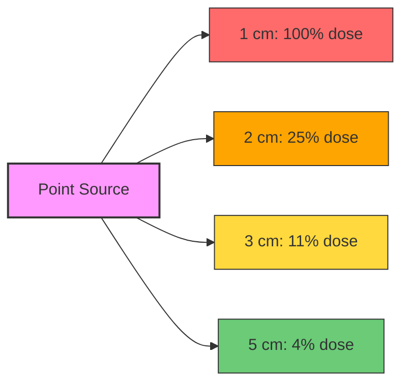

# Brachytherapy (Internal Radiotherapy) / 近距离放射治疗（内放疗）

---

# 1. Overview / 概述

**English:**
Brachytherapy is a form of [[Radiotherapy and Nuclear Medicine Treatment]] where a sealed radioactive source is placed inside or very close to the tumor site. Unlike [[External Beam Radiotherapy]], which delivers radiation from outside the body, brachytherapy allows for a high radiation dose to be delivered directly to the tumor while minimizing exposure to surrounding healthy tissues. This sub-topic covers the principles, types, source selection, dose distribution, and clinical applications of brachytherapy. It builds on the understanding of [[Alpha, Beta and Gamma Radiation]] and is closely related to [[Radiation Protection and Dosimetry]].

**中文:**
近距离放射治疗是[[Radiotherapy and Nuclear Medicine Treatment]]的一种形式，将密封的放射源放置在肿瘤内部或非常靠近肿瘤的位置。与从体外照射的[[External Beam Radiotherapy]]不同，近距离放射治疗能够将高辐射剂量直接传递到肿瘤，同时最大限度地减少对周围健康组织的照射。本子知识点涵盖近距离放射治疗的原理、类型、放射源选择、剂量分布和临床应用。它建立在[[Alpha, Beta and Gamma Radiation]]的理解之上，并与[[Radiation Protection and Dosimetry]]密切相关。

---

# 2. Syllabus Learning Objectives / 考纲学习目标

| CAIE 9702 | Edexcel IAL |
|-----------|-------------|
| 26.4(a) Describe the principles of brachytherapy | WPH14 U4: 11.19 Explain the principles of brachytherapy |
| 26.4(b) Explain the use of different radioactive sources (e.g., Ir-192, I-125) | WPH14 U4: 11.20 Describe the properties of common brachytherapy sources |
| 26.4(c) Understand dose distribution around a point source | WPH14 U4: 11.21 Apply the inverse square law to brachytherapy dose calculations |
| 26.4(d) Compare high-dose-rate (HDR) and low-dose-rate (LDR) brachytherapy | WPH14 U4: 11.22 Distinguish between HDR and LDR techniques |
| 26.4(e) Discuss the advantages and disadvantages of brachytherapy | WPH14 U4: 11.23 Evaluate the benefits and risks of brachytherapy |
| — | WPH14 U4: 11.24 Describe the role of imaging in brachytherapy planning |

**Examiner Expectations / 考官期望:**
- **CAIE:** Focus on the physics principles: inverse square law, half-life, and dose distribution. Be able to compare brachytherapy with external beam radiotherapy.
- **Edexcel:** Emphasis on clinical applications, source selection criteria, and the role of imaging (CT, MRI, ultrasound) in treatment planning.

---

# 3. Core Definitions / 核心定义

| Term (EN/CN) | Definition (EN) | Definition (CN) | Common Mistakes / 常见错误 |
|--------------|-----------------|-----------------|---------------------------|
| **Brachytherapy** / 近距离放射治疗 | A radiotherapy technique where a sealed radioactive source is placed inside or near the tumor | 将密封放射源放置在肿瘤内部或附近的放射治疗技术 | Confusing with external beam radiotherapy; brachytherapy is *internal* |
| **Sealed Source** / 密封源 | A radioactive source encapsulated in a non-radioactive container to prevent leakage | 封装在非放射性容器中的放射源，防止泄漏 | Thinking all sources are unsealed; brachytherapy sources are always sealed |
| **High-Dose-Rate (HDR)** / 高剂量率 | Brachytherapy delivering >12 Gy/h, typically using a remote afterloading system | 剂量率>12 Gy/h的近距离治疗，通常使用远程后装系统 | Confusing HDR with total dose; HDR refers to *rate*, not total dose |
| **Low-Dose-Rate (LDR)** / 低剂量率 | Brachytherapy delivering 0.4–2 Gy/h, often using permanent implants | 剂量率0.4–2 Gy/h的近距离治疗，常使用永久性植入物 | Thinking LDR is always permanent; some LDR is temporary |
| **Afterloading** / 后装技术 | A technique where empty applicators are placed first, then the source is inserted remotely | 先放置空施源器，再远程插入放射源的技术 | Confusing with preloading (source placed before applicator) |
| **Isodose Curve** / 等剂量曲线 | A line connecting points of equal radiation dose around a source | 连接放射源周围等剂量点的曲线 | Thinking isodose curves are straight lines; they are curved due to inverse square law |

---

# 4. Key Concepts Explained / 关键概念详解

## 4.1 The Inverse Square Law in Brachytherapy / 近距离治疗中的平方反比定律

### Explanation / 解释
**English:**
The dose rate $D$ at a distance $r$ from a point source follows the inverse square law:
$$ D \propto \frac{1}{r^2} $$
This means that doubling the distance from the source reduces the dose rate to one-quarter. In brachytherapy, this rapid fall-off is the key advantage: the tumor receives a high dose while nearby healthy tissues receive much less. This is fundamentally different from [[External Beam Radiotherapy]], where the dose is more uniform across the beam path.

**中文:**
距离点源$r$处的剂量率$D$遵循平方反比定律：
$$ D \propto \frac{1}{r^2} $$
这意味着距离加倍，剂量率降至四分之一。在近距离治疗中，这种快速衰减是关键优势：肿瘤接受高剂量，而附近健康组织接受的剂量少得多。这与[[External Beam Radiotherapy]]根本不同，后者在射束路径上的剂量更均匀。

### Physical Meaning / 物理意义
**English:**
The inverse square law arises because radiation spreads out spherically from a point source. The same number of photons/particles pass through an expanding sphere of area $4\pi r^2$, so the intensity (dose rate) decreases as $1/r^2$.

**中文:**
平方反比定律源于辐射从点源球形扩散。相同数量的光子/粒子通过面积$4\pi r^2$的膨胀球面，因此强度（剂量率）随$1/r^2$减小。

### Common Misconceptions / 常见误区
- ❌ **"The inverse square law applies to all sources equally"** — It applies strictly to *point* sources. Extended sources (e.g., long wires) have different dose distributions.
- ❌ **"Doubling distance halves the dose"** — No, it quarters the dose ($1/2^2 = 1/4$).
- ❌ **"The law only applies in a vacuum"** — In tissue, attenuation also occurs, but the inverse square law is the dominant factor at short distances.

### Exam Tips / 考试提示
- ✅ **CAIE:** Be prepared to calculate dose rate at different distances using $D_1 r_1^2 = D_2 r_2^2$.
- ✅ **Edexcel:** Understand how the inverse square law explains the clinical advantage of brachytherapy over external beam radiotherapy.

> 📷 **IMAGE PROMPT — BRACHY-01: Inverse Square Law in Brachytherapy**
> A 3D medical illustration showing a point radioactive source (Ir-192) inside a prostate tumor. Concentric spherical shells around the source represent decreasing dose levels. Labels: "Source", "Tumor", "Healthy Tissue", "Dose = 100% at 1 cm", "Dose = 25% at 2 cm", "Dose = 11% at 3 cm". Color gradient from red (high dose) to blue (low dose).

---

## 4.2 HDR vs LDR Brachytherapy / 高剂量率与低剂量率近距离治疗

### Explanation / 解释
**English:**
Brachytherapy is classified by dose rate:

| Feature | HDR (High-Dose-Rate) | LDR (Low-Dose-Rate) |
|---------|----------------------|---------------------|
| Dose Rate | >12 Gy/h | 0.4–2 Gy/h |
| Treatment Time | Minutes per fraction | Hours to days |
| Source Movement | Remote afterloading, source moves through catheters | Fixed source(s) implanted |
| Hospital Stay | Outpatient or short stay | Often inpatient |
| Examples | Cervical cancer, prostate HDR | Prostate I-125 seeds, eye plaques |

**中文:**
近距离治疗按剂量率分类：

| 特征 | HDR（高剂量率） | LDR（低剂量率） |
|------|----------------|----------------|
| 剂量率 | >12 Gy/h | 0.4–2 Gy/h |
| 治疗时间 | 每次几分钟 | 数小时至数天 |
| 源移动 | 远程后装，源通过导管移动 | 固定源植入 |
| 住院时间 | 门诊或短期住院 | 通常住院 |
| 示例 | 宫颈癌、前列腺HDR | 前列腺I-125种子、眼部敷贴器 |

### Physical Meaning / 物理意义
**English:**
The biological effect of radiation depends on dose rate due to cellular repair mechanisms. LDR allows normal tissues to repair sublethal damage during treatment, while HDR exploits the rapid dose delivery to overcome tumor cell repair. This is related to the [[Benefits vs Risks of Medical Radiation]] topic.

**中文:**
辐射的生物效应取决于剂量率，因为细胞有修复机制。LDR允许正常组织在治疗期间修复亚致死损伤，而HDR利用快速剂量输送来克服肿瘤细胞的修复。这与[[Benefits vs Risks of Medical Radiation]]主题相关。

### Common Misconceptions / 常见误区
- ❌ **"HDR gives a higher total dose than LDR"** — Total dose depends on the treatment plan, not the rate.
- ❌ **"LDR is always permanent"** — Some LDR treatments (e.g., temporary interstitial implants) are removed after a set time.

### Exam Tips / 考试提示
- ✅ **CAIE:** Know the dose rate thresholds (>12 Gy/h for HDR, 0.4–2 Gy/h for LDR).
- ✅ **Edexcel:** Be able to discuss the clinical trade-offs: HDR is more convenient but requires precise positioning; LDR exploits repair differences.

---

## 4.3 Source Selection for Brachytherapy / 近距离治疗放射源选择

### Explanation / 解释
**English:**
Common brachytherapy sources and their properties:

| Source | Half-Life | Energy (γ) | Type | Typical Use |
|--------|-----------|------------|------|-------------|
| Ir-192 | 73.8 days | 0.38 MeV (avg) | HDR | Cervical, prostate, breast |
| I-125 | 59.4 days | 27–35 keV (X-rays) | LDR | Prostate permanent implants |
| Pd-103 | 17.0 days | 21 keV (X-rays) | LDR | Prostate (faster dose delivery) |
| Cs-131 | 9.7 days | 30 keV (X-rays) | LDR | Prostate (very fast) |
| Co-60 | 5.27 years | 1.17, 1.33 MeV | HDR | Older HDR units |

**中文:**
常见近距离治疗源及其性质：

| 源 | 半衰期 | 能量（γ） | 类型 | 典型用途 |
|----|--------|-----------|------|---------|
| Ir-192 | 73.8天 | 0.38 MeV（平均） | HDR | 宫颈、前列腺、乳腺 |
| I-125 | 59.4天 | 27–35 keV（X射线） | LDR | 前列腺永久植入 |
| Pd-103 | 17.0天 | 21 keV（X射线） | LDR | 前列腺（更快剂量输送） |
| Cs-131 | 9.7天 | 30 keV（X射线） | LDR | 前列腺（非常快） |
| Co-60 | 5.27年 | 1.17, 1.33 MeV | HDR | 较旧的HDR设备 |

### Physical Meaning / 物理意义
**English:**
Source selection depends on:
1. **Half-life:** Must match treatment duration (LDR: days to weeks; HDR: minutes per fraction)
2. **Energy:** Lower energy (I-125) reduces shielding requirements and staff exposure
3. **Specific activity:** High specific activity allows smaller sources for HDR

**中文:**
源选择取决于：
1. **半衰期：** 必须匹配治疗持续时间（LDR：数天至数周；HDR：每次几分钟）
2. **能量：** 较低能量（I-125）减少屏蔽要求和工作人员照射
3. **比活度：** 高比活度允许HDR使用更小的源

### Common Misconceptions / 常见误区
- ❌ **"All gamma sources are suitable for brachytherapy"** — No, sources must have appropriate half-life and energy.
- ❌ **"I-125 emits gamma rays"** — I-125 emits low-energy X-rays (from electron capture), not gamma rays.

### Exam Tips / 考试提示
- ✅ **CAIE:** Know the half-lives of Ir-192 and I-125.
- ✅ **Edexcel:** Be able to justify source choice for a given clinical scenario.

> 📷 **IMAGE PROMPT — BRACHY-02: Brachytherapy Sources Comparison**
> A split-screen medical illustration. Left: An I-125 seed (4.5 mm × 0.8 mm) with titanium capsule, showing the radioactive core. Right: An Ir-192 HDR source (3.5 mm × 0.6 mm) welded to a cable. Labels: "I-125 Seed: 59.4 d half-life, 27 keV X-rays" and "Ir-192 Source: 73.8 d half-life, 380 keV γ-rays". Scale bar: 5 mm.

---

# 5. Essential Equations / 核心公式

## 5.1 Inverse Square Law for Dose Rate / 剂量率的平方反比定律

$$ \dot{D}(r) = \dot{D}_0 \cdot \frac{r_0^2}{r^2} $$

| Symbol (符号) | Meaning (EN) | Meaning (CN) | Unit (单位) |
|--------------|-------------|-------------|------------|
| $\dot{D}(r)$ | Dose rate at distance $r$ | 距离$r$处的剂量率 | Gy/h |
| $\dot{D}_0$ | Dose rate at reference distance $r_0$ | 参考距离$r_0$处的剂量率 | Gy/h |
| $r$ | Distance from source | 距源的距离 | m or cm |
| $r_0$ | Reference distance | 参考距离 | m or cm |

**Conditions / 适用条件:**
- Point source approximation
- No significant attenuation in the medium (valid for short distances in tissue)
- Valid for both photons and electrons (though electrons also have range limitations)

**Limitations / 局限性:**
- Does not account for tissue attenuation (exponential absorption)
- Fails for extended sources (e.g., long wires, ribbons)
- Assumes isotropic emission (not true for all sources)

## 5.2 Dose Calculation with Attenuation / 含衰减的剂量计算

$$ \dot{D}(r) = \dot{D}_0 \cdot \frac{r_0^2}{r^2} \cdot e^{-\mu r} $$

| Symbol (符号) | Meaning (EN) | Meaning (CN) | Unit (单位) |
|--------------|-------------|-------------|------------|
| $\mu$ | Linear attenuation coefficient | 线性衰减系数 | m⁻¹ or cm⁻¹ |

**Conditions / 适用条件:**
- Includes both inverse square and attenuation effects
- Valid for photon-emitting sources in tissue

## 5.3 Total Dose from a Permanent Implant / 永久植入的总剂量

$$ D_{\text{total}} = \dot{D}_0 \cdot \frac{T_{1/2}}{\ln 2} $$

| Symbol (符号) | Meaning (EN) | Meaning (CN) | Unit (单位) |
|--------------|-------------|-------------|------------|
| $D_{\text{total}}$ | Total dose delivered over infinite time | 无限时间内的总剂量 | Gy |
| $\dot{D}_0$ | Initial dose rate | 初始剂量率 | Gy/h |
| $T_{1/2}$ | Half-life of the source | 源的半衰期 | h |

**Derivation / 推导:**
The dose rate decays exponentially: $\dot{D}(t) = \dot{D}_0 e^{-\lambda t}$ where $\lambda = \ln 2 / T_{1/2}$.
Total dose: $D_{\text{total}} = \int_0^\infty \dot{D}(t) dt = \dot{D}_0 \int_0^\infty e^{-\lambda t} dt = \frac{\dot{D}_0}{\lambda} = \dot{D}_0 \cdot \frac{T_{1/2}}{\ln 2}$

**Conditions / 适用条件:**
- Permanent implant (source remains indefinitely)
- No source removal
- Assumes complete decay

> 📷 **IMAGE PROMPT — BRACHY-03: Dose Rate Decay in Permanent Implant**
> A graph showing dose rate (y-axis, Gy/h) vs time (x-axis, days) for an I-125 permanent prostate implant. The curve shows exponential decay from initial dose rate (0.07 Gy/h) to near zero over 200 days. Shaded area under curve represents total dose (145 Gy). Labels: "Initial dose rate = 0.07 Gy/h", "Half-life = 59.4 days", "Total dose = 145 Gy".

---

# 6. Graphs and Relationships / 图表与关系

## 6.1 Dose Rate vs Distance from Source / 剂量率与距源距离的关系

### Axes / 坐标轴
- **X-axis:** Distance from source $r$ (cm) / 距源距离$r$（厘米）
- **Y-axis:** Dose rate $\dot{D}$ (Gy/h) / 剂量率$\dot{D}$（戈瑞/小时）

### Shape / 形状
A steeply decreasing curve following $1/r^2$. The dose rate drops rapidly within the first few centimeters.

### Gradient Meaning / 斜率含义
The gradient is negative and becomes less steep at larger distances. The gradient represents the rate of change of dose rate with distance.

### Area Meaning / 面积含义
The area under the curve is not physically meaningful in this context (unlike in some other physics graphs).

### Exam Interpretation / 考试解读
- **CAIE:** Use the graph to explain why brachytherapy spares healthy tissue — the dose falls off rapidly.
- **Edexcel:** Compare this curve with the dose distribution from an external beam (which is more uniform).

---

## 6.2 Dose Distribution: HDR vs LDR / 剂量分布：HDR与LDR对比

### Axes / 坐标轴
- **X-axis:** Time (hours or days) / 时间（小时或天）
- **Y-axis:** Cumulative dose (Gy) / 累积剂量（戈瑞）

### Shape / 形状
- **HDR:** Steep step function — dose delivered in minutes, then stops.
- **LDR:** Gradual curve approaching a plateau — dose delivered over days/weeks.

### Gradient Meaning / 斜率含义
The gradient is the dose rate. HDR has a very steep gradient; LDR has a shallow gradient.

### Exam Interpretation / 考试解读
- Explain why HDR requires precise positioning (short treatment time, no room for error).
- Explain why LDR exploits repair differences (slow delivery allows normal tissue repair).

---

# 7. Required Diagrams / 必备图表

## 7.1 Brachytherapy Treatment Setup / 近距离治疗设置

### Description / 描述
**English:**
A diagram showing a patient receiving HDR brachytherapy for cervical cancer. Applicators (tandem and ovoids) are inserted into the uterus and vagina. These are connected via transfer tubes to an afterloading machine containing the Ir-192 source. The source moves through the tubes into the applicators under computer control.

**中文:**
显示患者接受宫颈癌HDR近距离治疗的示意图。施源器（宫腔管和卵圆体）插入子宫和阴道。通过传输管连接到装有Ir-192源的后装机。源在计算机控制下通过管子进入施源器。

### Image Prompt / 图片生成提示
> 📷 **IMAGE PROMPT — BRACHY-04: HDR Brachytherapy Setup for Cervical Cancer**
> A medical illustration showing a female patient lying on a treatment couch. A tandem (curved tube) is inserted through the cervix into the uterus, and two ovoids are placed in the vaginal fornices. Transfer tubes connect these to an afterloading machine (a shielded box on a cart). The Ir-192 source is shown as a small dot moving through one tube. Labels: "Tandem", "Ovoids", "Transfer Tubes", "Afterloader", "Ir-192 Source", "Uterus", "Vagina". Color coding: applicators in blue, source path in red.

### Labels Required / 需要标注
- Tandem / 宫腔管
- Ovoids / 卵圆体
- Transfer tubes / 传输管
- Afterloading machine / 后装机
- Ir-192 source / Ir-192源
- Uterus / 子宫
- Vagina / 阴道
- Tumor (cervix) / 肿瘤（宫颈）

### Exam Importance / 考试重要性
- **CAIE:** Understand the principle of afterloading (staff safety).
- **Edexcel:** Describe the role of imaging in planning this setup.

---

## 7.2 Isodose Curves for a Single Source / 单源等剂量曲线

### Description / 描述
**English:**
A diagram showing concentric isodose curves around a point source. The curves are closer together near the source (high dose gradient) and spread out further away (low dose gradient). Typical values: 100% at 1 cm, 50% at 1.4 cm, 25% at 2 cm, 10% at 3.2 cm.

**中文:**
显示点源周围同心等剂量曲线的示意图。曲线在源附近更密集（高剂量梯度），在远处更稀疏（低剂量梯度）。典型值：1厘米处100%，1.4厘米处50%，2厘米处25%，3.2厘米处10%。

### Image Prompt / 图片生成提示
> 📷 **IMAGE PROMPT — BRACHY-05: Isodose Curves Around a Point Source**
> A 2D cross-section diagram showing concentric oval curves around a central dot (the source). Each curve is labeled with a percentage: 100%, 80%, 60%, 40%, 20%, 10%. The spacing between curves increases with distance. A dashed line shows the tumor boundary at the 100% isodose line. Labels: "Source", "100% Isodose (Tumor)", "50% Isodose", "10% Isodose", "Healthy Tissue". Color gradient from red (inside 100%) to blue (outside 10%).

### Labels Required / 需要标注
- Source position / 源位置
- 100% isodose (tumor boundary) / 100%等剂量线（肿瘤边界）
- 50% isodose / 50%等剂量线
- 10% isodose / 10%等剂量线
- Healthy tissue / 健康组织
- High dose gradient region / 高剂量梯度区域

### Exam Importance / 考试重要性
- **CAIE:** Explain how isodose curves demonstrate the advantage of brachytherapy.
- **Edexcel:** Use isodose curves to compare different source arrangements.

---

# 8. Worked Examples / 典型例题

## Example 1: Dose Rate Calculation Using Inverse Square Law / 例1：使用平方反比定律计算剂量率

### Question / 题目
**English:**
An Ir-192 HDR source delivers a dose rate of 0.50 Gy/h at a distance of 1.0 cm from the source.
(a) Calculate the dose rate at a distance of 2.5 cm from the source.
(b) Calculate the distance at which the dose rate is 0.020 Gy/h.

**中文:**
一个Ir-192 HDR源在距源1.0厘米处提供0.50 Gy/h的剂量率。
(a) 计算距源2.5厘米处的剂量率。
(b) 计算剂量率为0.020 Gy/h时的距离。

### Solution / 解答

**Part (a):**
Using the inverse square law:
$$ \dot{D}_2 = \dot{D}_1 \cdot \frac{r_1^2}{r_2^2} $$

$$ \dot{D}_2 = 0.50 \times \frac{(1.0)^2}{(2.5)^2} = 0.50 \times \frac{1.0}{6.25} = 0.50 \times 0.16 = 0.080 \text{ Gy/h} $$

**Part (b):**
$$ \dot{D}_2 = \dot{D}_1 \cdot \frac{r_1^2}{r_2^2} $$

Rearranging:
$$ r_2^2 = r_1^2 \cdot \frac{\dot{D}_1}{\dot{D}_2} $$

$$ r_2^2 = (1.0)^2 \times \frac{0.50}{0.020} = 1.0 \times 25 = 25 $$

$$ r_2 = \sqrt{25} = 5.0 \text{ cm} $$

### Final Answer / 最终答案
**Answer:** (a) 0.080 Gy/h | (b) 5.0 cm
**答案：** (a) 0.080 Gy/h | (b) 5.0 cm

### Quick Tip / 提示
**English:** Always check units — distances must be in the same units. The inverse square law is your most powerful tool for brachytherapy calculations.
**中文：** 始终检查单位——距离必须使用相同单位。平方反比定律是近距离治疗计算中最强大的工具。

---

## Example 2: Total Dose from a Permanent Implant / 例2：永久植入的总剂量

### Question / 题目
**English:**
A patient receives a permanent implant of I-125 seeds for prostate cancer. The initial dose rate is 0.070 Gy/h. The half-life of I-125 is 59.4 days.
(a) Calculate the total dose delivered over the lifetime of the implant.
(b) Explain why the total dose is finite even though the source decays completely.

**中文:**
一名患者接受I-125种子永久植入治疗前列腺癌。初始剂量率为0.070 Gy/h。I-125的半衰期为59.4天。
(a) 计算植入物整个寿命期间的总剂量。
(b) 解释为什么即使源完全衰变，总剂量也是有限的。

### Solution / 解答

**Part (a):**
Convert half-life to hours:
$$ T_{1/2} = 59.4 \text{ days} \times 24 \text{ h/day} = 1425.6 \text{ h} $$

Using the formula:
$$ D_{\text{total}} = \dot{D}_0 \cdot \frac{T_{1/2}}{\ln 2} $$

$$ D_{\text{total}} = 0.070 \times \frac{1425.6}{0.693} $$

$$ D_{\text{total}} = 0.070 \times 2057.1 = 144.0 \text{ Gy} $$

**Part (b):**
The total dose is finite because the dose rate decreases exponentially with time. Although the source never completely decays to zero (theoretically), the dose rate becomes negligible after several half-lives. The integral of an exponential decay from zero to infinity converges to a finite value.

### Final Answer / 最终答案
**Answer:** (a) 144 Gy | (b) The dose rate decays exponentially, and the integral converges to a finite value.
**答案：** (a) 144 Gy | (b) 剂量率呈指数衰减，积分收敛到有限值。

### Quick Tip / 提示
**English:** Remember to convert days to hours for consistency with dose rate units (Gy/h). The formula $D_{\text{total}} = \dot{D}_0 \cdot T_{1/2} / \ln 2$ is derived from integrating the exponential decay.
**中文：** 记得将天转换为小时，以与剂量率单位（Gy/h）保持一致。公式$D_{\text{total}} = \dot{D}_0 \cdot T_{1/2} / \ln 2$来自指数衰减的积分。

---

# 9. Past Paper Question Types / 历年真题题型

| Question Type / 题型 | Frequency / 频率 | Difficulty / 难度 | Past Paper References / 真题索引 |
|----------------------|------------------|------------------|-------------------------------|
| Inverse square law calculation | ★★★★★ | Medium | 📝 *待填入* |
| Compare HDR vs LDR | ★★★★ | Easy | 📝 *待填入* |
| Source selection justification | ★★★ | Medium | 📝 *待填入* |
| Advantages/disadvantages essay | ★★★ | Medium | 📝 *待填入* |
| Isodose curve interpretation | ★★ | Hard | 📝 *待填入* |
| Total dose from permanent implant | ★★ | Hard | 📝 *待填入* |

**Common Command Words / 常见指令词:**
- **Calculate / 计算:** Use the inverse square law or total dose formula
- **Explain / 解释:** Describe the physics principles behind brachytherapy
- **Compare / 比较:** HDR vs LDR, brachytherapy vs external beam
- **Discuss / 讨论:** Advantages and disadvantages
- **Justify / 论证:** Source selection for a given clinical scenario

---

# 10. Practical Skills Connections / 实验技能链接

**English:**
Brachytherapy connects to practical skills in several ways:

1. **Measurement of Half-Life:** Understanding how source activity decays over time is essential for calculating dose delivery. Practical experiments measuring half-life of radioactive sources (e.g., using a GM tube and counter) are directly relevant.

2. **Inverse Square Law Verification:** A classic practical is to measure the count rate from a gamma source at different distances and verify the $1/r^2$ relationship. This directly applies to brachytherapy dose calculations.

3. **Uncertainty Analysis:** When calculating dose rates, uncertainties in distance measurements (±0.5 mm) propagate through the inverse square law. For example, a 1 mm error at 1 cm distance gives a ~20% error in dose rate.

4. **Graph Plotting:** Plotting isodose curves from measured data requires careful graph construction, interpolation, and labeling — all key practical skills.

5. **Radiation Safety:** Practical skills in using shielding, handling sources with tongs, and monitoring exposure are directly relevant to brachytherapy clinical practice.

**中文:**
近距离治疗在多个方面与实验技能相关：

1. **半衰期测量：** 理解源活度随时间衰减对于计算剂量输送至关重要。测量放射源半衰期的实验（例如使用GM管和计数器）直接相关。

2. **平方反比定律验证：** 一个经典实验是测量不同距离处伽马源的计数率，验证$1/r^2$关系。这直接应用于近距离治疗剂量计算。

3. **不确定度分析：** 计算剂量率时，距离测量的不确定度（±0.5 mm）通过平方反比定律传播。例如，1厘米距离处1毫米的误差导致约20%的剂量率误差。

4. **图表绘制：** 从测量数据绘制等剂量曲线需要仔细的图表构建、插值和标注——这些都是关键的实验技能。

5. **辐射安全：** 使用屏蔽、用钳子处理源和监测照射的实验技能直接与近距离治疗临床实践相关。

---

# 11. Concept Map / 概念图谱

```mermaid
graph TD
    BT[Brachytherapy / 近距离治疗] --> ISL[Inverse Square Law / 平方反比定律]
    BT --> ST[Source Types / 源类型]
    BT --> HDRL[HDR vs LDR / 高剂量率 vs 低剂量率]
    BT --> DC[Dose Calculation / 剂量计算]
    BT --> CL[Clinical Applications / 临床应用]
    
    ISL --> DOSE[Dose Distribution / 剂量分布]
    ISL --> ISO[Isodose Curves / 等剂量曲线]
    
    ST --> IR[Ir-192 / 铱-192]
    ST --> IO[I-125 / 碘-125]
    ST --> PD[Pd-103 / 钯-103]
    
    HDRL --> HDR[HDR: Remote Afterloading / 远程后装]
    HDRL --> LDR[LDR: Permanent Implants / 永久植入]
    
    DC --> FORM[Formulas / 公式]
    DC --> UNC[Uncertainty / 不确定度]
    
    CL --> PROS[Prostate / 前列腺]
    CL --> CER[Cervical / 宫颈]
    CL --> BRE[Breast / 乳腺]
    
    BT -->|Prerequisite| ALPHA[[Alpha, Beta and Gamma Radiation]]
    BT -->|Related| EBRT[[External Beam Radiotherapy]]
    BT -->|Related| RPD[[Radiation Protection and Dosimetry]]
    BT -->|Related| BR[[Benefits vs Risks of Medical Radiation]]
    
    style BT fill:#4a90d9,stroke:#2c5f8a,color:#fff
    style ISL fill:#f39c12,stroke:#e67e22
    style ST fill:#27ae60,stroke:#1e8449
    style HDRL fill:#e74c3c,stroke:#c0392b
    style DC fill:#8e44ad,stroke:#6c3483
    style CL fill:#16a085,stroke:#0e6655
```

---

# 12. Quick Revision Sheet / 速查表

| Category / 类别 | Key Points / 要点 |
|----------------|------------------|
| **Definition / 定义** | Internal radiotherapy using sealed sources placed in/ near tumor / 使用密封源放置在肿瘤内部或附近的内部放射治疗 |
| **Key Formula / 核心公式** | $\dot{D}_2 = \dot{D}_1 \cdot \frac{r_1^2}{r_2^2}$ (inverse square law) / 平方反比定律 |
| **Key Formula 2 / 核心公式2** | $D_{\text{total}} = \dot{D}_0 \cdot \frac{T_{1/2}}{\ln 2}$ (permanent implant total dose) / 永久植入总剂量 |
| **Key Graph / 核心图表** | Dose rate vs distance: steep $1/r^2$ fall-off / 剂量率与距离：陡峭的$1/r^2$衰减 |
| **HDR vs LDR / HDR与LDR对比** | HDR: >12 Gy/h, minutes, remote afterloading / LDR: 0.4–2 Gy/h, days, permanent or temporary |
| **Common Sources / 常见源** | Ir-192 (73.8 d, HDR), I-125 (59.4 d, LDR), Pd-103 (17.0 d, LDR) |
| **Advantages / 优势** | High tumor dose, low healthy tissue dose, conformal / 高肿瘤剂量，低健康组织剂量，适形 |
| **Disadvantages / 劣势** | Invasive, requires imaging guidance, staff exposure risk / 侵入性，需要影像引导，工作人员照射风险 |
| **Exam Tip / 考试提示** | Always use inverse square law for point sources; convert units carefully / 点源始终使用平方反比定律；仔细转换单位 |
| **Safety / 安全** | Afterloading reduces staff exposure; shielding required for HDR sources / 后装减少工作人员照射；HDR源需要屏蔽 |

---

> 📋 **CIE Only:** Focus on the inverse square law calculations and comparison with external beam radiotherapy. Know the half-lives of Ir-192 (73.8 days) and I-125 (59.4 days).

> 📋 **Edexcel Only:** Be prepared to discuss the role of imaging (CT, MRI, ultrasound) in brachytherapy planning. Understand the concept of "conformality" — how brachytherapy achieves a dose distribution that conforms to the tumor shape.