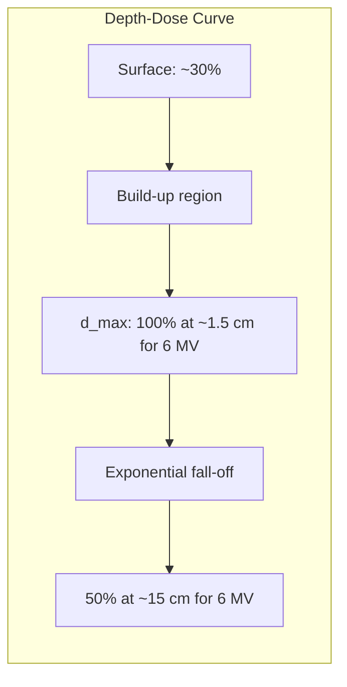

# Radiotherapy and Nuclear Medicine Treatment / 放射治疗与核医学治疗

---

# 1. Overview / 概述

**English:**
Radiotherapy and Nuclear Medicine Treatment is a critical branch of medical physics that uses ionising radiation to diagnose and treat diseases, primarily cancer. This topic explores how [[Alpha, Beta and Gamma Radiation]] is harnessed therapeutically to destroy malignant tumours while minimising damage to healthy tissue. It bridges fundamental nuclear physics with clinical applications, covering external beam radiotherapy, internal brachytherapy, and targeted nuclear medicine therapies.

In Cambridge 9702 (Topic 26.4 a-e) and Edexcel IAL (WPH14 Unit 4: 11.19-11.24), students must understand the physical principles behind radiation therapy, including dose calculation, half-life considerations, and the biological effects of radiation. Real-world applications include treating over 50% of cancer patients with radiotherapy at some stage, using technologies like linear accelerators (LINACs), cobalt-60 units, and radioactive implants.

This topic is essential for A-Level physics because it demonstrates how fundamental concepts—radioactive decay, energy absorption, and exponential attenuation—translate into life-saving medical technology. It also raises important ethical and safety considerations about [[Radiation Protection and Dosimetry]] and the [[Benefits vs Risks of Medical Radiation]].

**中文：**
放射治疗与核医学治疗是医学物理学的重要分支，利用电离辐射诊断和治疗疾病，主要是癌症。本主题探讨如何利用[[Alpha, Beta and Gamma Radiation|α、β和γ辐射]]进行治疗，以摧毁恶性肿瘤，同时尽量减少对健康组织的损伤。它将基础核物理学与临床应用联系起来，涵盖外照射放疗、内照射近距离治疗和靶向核医学治疗。

在剑桥9702（主题26.4 a-e）和爱德思IAL（WPH14单元4：11.19-11.24）中，学生必须理解放射治疗的物理原理，包括剂量计算、半衰期考虑和辐射的生物效应。实际应用包括在某个阶段对超过50%的癌症患者进行放射治疗，使用直线加速器（LINAC）、钴-60设备和放射性植入物等技术。

本主题对A-Level物理至关重要，因为它展示了基本概念——放射性衰变、能量吸收和指数衰减——如何转化为拯救生命的医疗技术。它还提出了关于[[Radiation Protection and Dosimetry|辐射防护与剂量学]]和[[Benefits vs Risks of Medical Radiation|医疗辐射的益处与风险]]的重要伦理和安全考虑。

---

# 2. Syllabus Learning Objectives / 考纲学习目标

| CAIE 9702 (26.4 a-e) | Edexcel IAL (WPH14 U4: 11.19-11.24) |
|----------------------|--------------------------------------|
| (a) Explain the principles of radiotherapy, including the use of gamma rays and X-rays | 11.19 Understand the principles of radiotherapy, including the use of gamma rays and X-rays |
| (b) Describe the use of radioactive sources in brachytherapy | 11.20 Describe the use of radioactive sources in brachytherapy |
| (c) Explain the concept of half-life in the context of medical treatment | 11.21 Understand the concept of half-life in the context of medical treatment |
| (d) Calculate absorbed dose and equivalent dose | 11.22 Calculate absorbed dose and equivalent dose |
| (e) Discuss the benefits and risks of medical radiation | 11.23 Discuss the benefits and risks of medical radiation |
| — | 11.24 Understand the principles of targeted alpha therapy (TAT) |

**Examiner Expectations / 考官期望：**

**English:**
- Students must be able to explain why gamma rays and X-rays are preferred for external beam radiotherapy (high penetration, low ionisation density)
- For brachytherapy, students should understand why beta emitters (e.g., Sr-90) and gamma emitters (e.g., Ir-192) are used depending on tumour depth
- Half-life calculations must consider biological clearance alongside physical decay
- Absorbed dose (Gray) and equivalent dose (Sievert) must be distinguished with correct units
- Benefits vs risks discussion must include ALARP principle (As Low As Reasonably Practicable)

**中文：**
- 学生必须能够解释为什么伽马射线和X射线更适合外照射放疗（高穿透力、低电离密度）
- 对于近距离治疗，学生应理解为什么根据肿瘤深度使用β发射体（如Sr-90）和γ发射体（如Ir-192）
- 半衰期计算必须同时考虑生物清除和物理衰变
- 必须区分吸收剂量（戈瑞）和当量剂量（西弗特），并正确使用单位
- 益处与风险的讨论必须包括ALARP原则（合理可行尽量低）

> 📋 **CIE Only:** Focus on qualitative understanding of radiotherapy principles; quantitative dose calculations are limited to simple scenarios.
> 
> 📋 **Edexcel Only:** Includes targeted alpha therapy (TAT) as a specific subtopic; requires understanding of alpha particle range and LET (Linear Energy Transfer).

---

# 3. Core Definitions / 核心定义

| Term (EN/CN) | Definition (EN) | Definition (CN) | Common Mistakes / 常见错误 |
|--------------|-----------------|-----------------|---------------------------|
| [[Radiotherapy]] / 放射治疗 | The medical use of ionising radiation to treat disease, primarily cancer, by damaging the DNA of malignant cells | 利用电离辐射治疗疾病（主要是癌症）的医学方法，通过破坏恶性细胞的DNA | Confusing radiotherapy with diagnostic imaging; radiotherapy uses higher doses |
| [[Brachytherapy]] / 近距离治疗 | A form of radiotherapy where a sealed radioactive source is placed inside or next to the tumour | 将密封放射源放置在肿瘤内部或附近的放射治疗形式 | Thinking all brachytherapy uses gamma sources; beta sources are used for shallow tumours |
| [[Absorbed Dose]] / 吸收剂量 | The energy absorbed per unit mass of tissue; unit: Gray (Gy) = J/kg | 单位质量组织吸收的能量；单位：戈瑞（Gy）= J/kg | Confusing with equivalent dose; forgetting mass is in kg |
| [[Equivalent Dose]] / 当量剂量 | Absorbed dose multiplied by a radiation weighting factor (w_R) to account for biological effectiveness; unit: Sievert (Sv) | 吸收剂量乘以辐射权重因子（w_R）以考虑生物效应；单位：西弗特（Sv） | Using Sv for absorbed dose; forgetting w_R is dimensionless |
| [[Half-Life]] / 半衰期 | The time taken for the activity of a radioactive source to fall to half its initial value | 放射源活度降至初始值一半所需的时间 | Confusing physical half-life with biological half-life in medical contexts |
| [[Linear Energy Transfer (LET)]] / 线性能量转移 | The energy deposited per unit length as a charged particle passes through matter; measured in keV/μm | 带电粒子穿过物质时单位长度沉积的能量；单位为keV/μm | Thinking high LET always means more damage; depends on tissue type |
| [[Targeted Alpha Therapy (TAT)]] / 靶向α治疗 | A nuclear medicine treatment using alpha-emitting radionuclides attached to tumour-targeting molecules | 使用α发射放射性核素附着在肿瘤靶向分子上的核医学治疗 | Forgetting alpha particles have short range but high LET |
| [[ALARP Principle]] / ALARP原则 | The principle that radiation exposure should be As Low As Reasonably Practicable, balancing benefits against risks | 辐射暴露应合理可行尽量低的原则，平衡益处与风险 | Thinking ALARP means zero exposure; it means minimised exposure |

---

# 4. Key Concepts Explained / 关键概念详解

## 4.1 External Beam Radiotherapy (EBRT) / 外照射放疗

### Explanation / 解释
**English:**
External Beam Radiotherapy (EBRT) delivers high-energy radiation from outside the body, typically using a [[Linear Accelerator (LINAC)]] or a [[Cobalt-60 Unit]]. The radiation beam is shaped using [[Multileaf Collimators (MLCs)]] to conform to the tumour's shape, a technique called [[Intensity-Modulated Radiotherapy (IMRT)]]. The goal is to deliver a lethal dose to the tumour while sparing surrounding healthy tissue.

The physics involves:
- **Photon beams:** High-energy X-rays (6-20 MV) or gamma rays from Co-60 (1.17 and 1.33 MeV)
- **Depth-dose characteristics:** The dose builds up below the skin surface (build-up region) due to the [[Compton Effect]] and [[Pair Production]], reaching a maximum at a depth called d_max
- **Beam collimation:** Using lead or tungsten blocks to shape the beam
- **Fractionation:** Delivering the total dose in small daily fractions (e.g., 2 Gy × 30 fractions = 60 Gy total) to allow healthy tissue repair

**中文：**
外照射放疗（EBRT）从体外传递高能辐射，通常使用[[Linear Accelerator (LINAC)|直线加速器（LINAC）]]或[[Cobalt-60 Unit|钴-60设备]]。使用[[Multileaf Collimators (MLCs)|多叶准直器（MLC）]]将辐射束塑形以符合肿瘤形状，这种技术称为[[Intensity-Modulated Radiotherapy (IMRT)|调强放疗（IMRT）]]。目标是向肿瘤传递致死剂量，同时保护周围健康组织。

物理原理包括：
- **光子束：** 来自直线加速器的高能X射线（6-20 MV）或来自Co-60的伽马射线（1.17和1.33 MeV）
- **深度-剂量特性：** 由于[[Compton Effect|康普顿效应]]和[[Pair Production|电子对效应]]，剂量在皮肤表面以下累积（累积区），在称为d_max的深度达到最大值
- **束流准直：** 使用铅或钨块塑形束流
- **分次治疗：** 将总剂量分成小日剂量（例如2 Gy × 30次 = 60 Gy总剂量），以允许健康组织修复

### Physical Meaning / 物理意义
**English:**
In practice, EBRT means a patient lies on a treatment couch while a machine rotates around them, delivering radiation from multiple angles. The beams intersect at the tumour, concentrating the dose. Modern techniques like [[Stereotactic Radiosurgery (SRS)]] deliver very high doses in a single session for small brain tumours.

**中文：**
在实践中，EBRT意味着患者躺在治疗床上，机器围绕他们旋转，从多个角度传递辐射。束流在肿瘤处相交，集中剂量。现代技术如[[Stereotactic Radiosurgery (SRS)|立体定向放射外科（SRS）]]在单次治疗中为小脑肿瘤传递非常高剂量。

### Common Misconceptions / 常见误区
| Misconception (EN) | Misconception (CN) | Correction (EN/CN) |
|-------------------|-------------------|-------------------|
| X-rays and gamma rays have the same biological effect | X射线和伽马射线具有相同的生物效应 | Gamma rays are monoenergetic; X-rays have a spectrum of energies; both are photons but differ in origin |
| Higher energy always means better treatment | 更高能量总是意味着更好的治疗 | Higher energy penetrates deeper but may spare skin less; optimal energy depends on tumour depth |
| The dose is uniform throughout the beam | 整个束流中的剂量是均匀的 | The dose varies with depth due to attenuation and scattering; the [[Percentage Depth Dose (PDD)]] curve describes this |

### Exam Tips / 考试提示
**English:**
- Cambridge often asks: "Explain why X-rays are used rather than alpha particles for external beam radiotherapy" (Answer: Alpha particles have very short range in tissue and cannot penetrate to deep tumours)
- Edexcel may ask: "Calculate the dose delivered to a tumour given the beam energy, exposure time, and mass of tissue"
- Be prepared to sketch the depth-dose curve for a photon beam and explain the build-up region

**中文：**
- 剑桥常问："解释为什么外照射放疗使用X射线而不是α粒子"（答案：α粒子在组织中的射程非常短，无法穿透到深层肿瘤）
- 爱德思可能问："给定束流能量、照射时间和组织质量，计算传递到肿瘤的剂量"
- 准备好绘制光子束的深度-剂量曲线并解释累积区

> 📷 **IMAGE PROMPT — EBRT-01: External Beam Radiotherapy Setup**
>
> A medical linear accelerator (LINAC) in a treatment room. The gantry is rotated to 45 degrees, with a patient lying on a carbon-fibre treatment couch. The multileaf collimator is visible shaping the beam. Blue laser alignment lights cross on the patient's skin. The room has concrete shielding walls. Style: medical illustration, clean, labelled diagram with arrows showing beam direction, gantry rotation, and tumour location. Labels: LINAC head, MLC, patient, tumour, treatment couch, gantry.

---

## 4.2 Brachytherapy (Internal Radiotherapy) / 近距离治疗（内照射放疗）

### Explanation / 解释
**English:**
[[Brachytherapy]] involves placing a sealed radioactive source directly inside or adjacent to the tumour. This allows a high dose to the tumour while minimising dose to surrounding organs. There are two main types:
- **High Dose Rate (HDR):** A source (e.g., Ir-192) is temporarily inserted via catheters for a few minutes, then removed
- **Low Dose Rate (LDR):** Seeds (e.g., I-125, Pd-103) are permanently implanted and deliver dose over weeks to months

The physics principles include:
- **Inverse square law:** Dose rate decreases with 1/r² from the source, providing rapid dose fall-off
- **Source selection:** Beta emitters (e.g., Sr-90, Y-90) for shallow tumours (range ~few mm); gamma emitters (e.g., Ir-192, I-125) for deeper tumours
- **Half-life considerations:** LDR sources use longer half-lives (I-125: 59.4 days) to deliver dose gradually; HDR sources use shorter half-lives (Ir-192: 73.8 days) for repeated use

**中文：**
[[Brachytherapy|近距离治疗]]涉及将密封放射源直接放置在肿瘤内部或邻近位置。这允许向肿瘤传递高剂量，同时最小化对周围器官的剂量。有两种主要类型：
- **高剂量率（HDR）：** 通过导管临时插入源（如Ir-192）几分钟，然后移除
- **低剂量率（LDR）：** 永久植入种子（如I-125、Pd-103），在数周至数月内传递剂量

物理原理包括：
- **平方反比定律：** 剂量率随距源距离的1/r²下降，提供快速剂量衰减
- **源选择：** β发射体（如Sr-90、Y-90）用于浅表肿瘤（射程约几毫米）；γ发射体（如Ir-192、I-125）用于较深肿瘤
- **半衰期考虑：** LDR源使用较长半衰期（I-125：59.4天）以逐渐传递剂量；HDR源使用较短半衰期（Ir-192：73.8天）以重复使用

### Physical Meaning / 物理意义
**English:**
Brachytherapy is commonly used for prostate cancer (I-125 seeds), cervical cancer (Ir-192 HDR), and eye tumours (Ru-106 plaque). The advantage is that the high dose is confined to the tumour volume, reducing side effects compared to EBRT.

**中文：**
近距离治疗常用于前列腺癌（I-125种子）、宫颈癌（Ir-192 HDR）和眼肿瘤（Ru-106敷贴器）。优点是高剂量局限于肿瘤体积，与EBRT相比减少了副作用。

### Common Misconceptions / 常见误区
| Misconception (EN) | Misconception (CN) | Correction (EN/CN) |
|-------------------|-------------------|-------------------|
| All brachytherapy sources are permanently implanted | 所有近距离治疗源都是永久植入的 | HDR brachytherapy uses temporary insertion; only LDR uses permanent implants |
| Beta emitters are useless for brachytherapy | β发射体对近距离治疗无用 | Beta emitters are excellent for shallow tumours (e.g., skin, eye) due to short range |
| The dose is uniform around the source | 源周围的剂量是均匀的 | The dose distribution depends on source geometry (point, line, or plaque) and tissue attenuation |

### Exam Tips / 考试提示
**English:**
- Cambridge may ask: "Explain why I-125 (half-life 59.4 days) is suitable for permanent prostate implants" (Answer: Long enough to deliver therapeutic dose over months, short enough that activity decays to safe levels)
- Edexcel may ask: "Calculate the dose rate at a distance of 2 cm from an Ir-192 source given the activity and gamma constant"
- Be able to compare brachytherapy with EBRT in terms of dose distribution and patient convenience

**中文：**
- 剑桥可能问："解释为什么I-125（半衰期59.4天）适合永久性前列腺植入"（答案：足够长以在数月内传递治疗剂量，足够短以使活度衰减到安全水平）
- 爱德思可能问："给定活度和伽马常数，计算距Ir-192源2 cm处的剂量率"
- 能够比较近距离治疗与EBRT在剂量分布和患者便利性方面的差异

> 📷 **IMAGE PROMPT — BRACHY-01: Brachytherapy Implant for Prostate Cancer**
>
> Cross-sectional diagram of a male pelvis showing the prostate gland with multiple I-125 seed implants distributed throughout. The seeds are shown as small silver cylinders (4.5 mm × 0.8 mm). Isodose curves (100%, 50%, 25%) are overlaid in concentric patterns around the seeds. The bladder and rectum are labelled with dose constraints. Style: medical illustration, clean, colour-coded isodose lines, labels in English. Labels: prostate, I-125 seeds, bladder, rectum, 100% isodose, 50% isodose, 25% isodose.

---

## 4.3 Targeted Alpha Therapy (TAT) / 靶向α治疗

### Explanation / 解释
**English:**
[[Targeted Alpha Therapy (TAT)]] is a cutting-edge nuclear medicine treatment where alpha-emitting radionuclides (e.g., Ra-223, Ac-225, Bi-213) are attached to tumour-targeting molecules (e.g., antibodies, peptides). The alpha particles have:
- **High LET:** ~80 keV/μm (compared to ~0.2 keV/μm for gamma rays)
- **Short range:** ~40-100 μm in tissue (a few cell diameters)
- **High biological effectiveness:** Relative Biological Effectiveness (RBE) of 5-20

The physics involves:
- **Alpha decay:** The radionuclide emits an alpha particle (He-4 nucleus) with energy 5-9 MeV
- **Stopping power:** Alpha particles lose energy rapidly through ionisation and excitation, depositing most energy at the end of their range (Bragg peak)
- **Daughter products:** Some alpha emitters have radioactive daughters that also contribute to dose

**中文：**
[[Targeted Alpha Therapy (TAT)|靶向α治疗（TAT）]]是一种前沿的核医学治疗方法，其中α发射放射性核素（如Ra-223、Ac-225、Bi-213）附着在肿瘤靶向分子（如抗体、肽）上。α粒子具有：
- **高LET：** 约80 keV/μm（相比之下伽马射线约0.2 keV/μm）
- **短射程：** 在组织中约40-100 μm（几个细胞直径）
- **高生物效应：** 相对生物效应（RBE）为5-20

物理原理包括：
- **α衰变：** 放射性核素发射α粒子（He-4核），能量为5-9 MeV
- **阻止本领：** α粒子通过电离和激发迅速损失能量，在射程末端沉积大部分能量（布拉格峰）
- **子体产物：** 一些α发射体具有放射性子体，也贡献剂量

### Physical Meaning / 物理意义
**English:**
TAT is particularly effective for treating micrometastases (small clusters of cancer cells) and blood cancers because the short-range alpha particles can kill individual cancer cells without damaging surrounding healthy tissue. Ra-223 dichloride (Xofigo®) is approved for prostate cancer that has spread to bone.

**中文：**
TAT对治疗微转移（小簇癌细胞）和血癌特别有效，因为短射程α粒子可以杀死单个癌细胞而不损伤周围健康组织。Ra-223二氯化物（Xofigo®）已获批用于已扩散到骨骼的前列腺癌。

### Common Misconceptions / 常见误区
| Misconception (EN) | Misconception (CN) | Correction (EN/CN) |
|-------------------|-------------------|-------------------|
| Alpha particles are too dangerous for medical use | α粒子对医疗使用太危险 | TAT uses targeted delivery to confine alpha emissions to tumour cells; normal tissue exposure is minimal |
| All alpha emitters are the same | 所有α发射体都一样 | Different alpha emitters have different energies, half-lives, and daughter products, affecting treatment planning |
| TAT replaces all other radiotherapy | TAT取代所有其他放射治疗 | TAT is complementary to EBRT and brachytherapy; each has specific indications |

### Exam Tips / 考试提示
**English:**
- Edexcel-specific: Be prepared to explain why alpha particles have high LET and how this relates to cancer cell killing
- Compare the range and LET of alpha, beta, and gamma radiation in tissue
- Discuss why TAT is suitable for treating disseminated disease (cancer that has spread)

**中文：**
- 爱德思特有：准备好解释为什么α粒子具有高LET，以及这与癌细胞杀伤的关系
- 比较α、β和γ辐射在组织中的射程和LET
- 讨论为什么TAT适合治疗播散性疾病（已扩散的癌症）

> 📋 **Edexcel Only:** TAT is explicitly in the Edexcel syllabus (11.24). Cambridge 9702 does not require detailed knowledge of TAT, but understanding alpha particle properties is beneficial.

---

## 4.4 Radiation Protection and Dosimetry / 辐射防护与剂量学

### Explanation / 解释
**English:**
[[Radiation Protection and Dosimetry]] involves measuring and controlling radiation exposure to ensure safety for patients, staff, and the public. Key concepts include:
- **Absorbed dose (D):** Energy absorbed per unit mass, D = E/m, unit: Gray (Gy)
- **Equivalent dose (H_T):** H_T = D × w_R, where w_R is the radiation weighting factor (1 for photons, 1 for beta, 20 for alpha), unit: Sievert (Sv)
- **Effective dose (E):** E = Σ H_T × w_T, where w_T is the tissue weighting factor, accounting for different organ sensitivities
- **ALARP principle:** Exposure should be As Low As Reasonably Practicable

Protection methods include:
- **Time:** Minimise exposure time
- **Distance:** Maximise distance (inverse square law)
- **Shielding:** Use appropriate materials (lead for gamma, concrete for neutrons, plastic for beta)

**中文：**
[[Radiation Protection and Dosimetry|辐射防护与剂量学]]涉及测量和控制辐射暴露，以确保患者、工作人员和公众的安全。关键概念包括：
- **吸收剂量（D）：** 单位质量吸收的能量，D = E/m，单位：戈瑞（Gy）
- **当量剂量（H_T）：** H_T = D × w_R，其中w_R是辐射权重因子（光子为1，β为1，α为20），单位：西弗特（Sv）
- **有效剂量（E）：** E = Σ H_T × w_T，其中w_T是组织权重因子，考虑不同器官的敏感性
- **ALARP原则：** 暴露应合理可行尽量低

防护方法包括：
- **时间：** 最小化暴露时间
- **距离：** 最大化距离（平方反比定律）
- **屏蔽：** 使用适当材料（伽马用铅，中子用混凝土，β用塑料）

### Physical Meaning / 物理意义
**English:**
In practice, a radiotherapy patient receives ~60 Gy to the tumour, but the effective dose to the whole body is much lower (~2-3 Sv). Staff working with radiation wear dosimeters (film badges, TLDs, OSLDs) to monitor cumulative exposure. The annual limit for radiation workers is 20 mSv (averaged over 5 years).

**中文：**
在实践中，放疗患者接受约60 Gy到肿瘤，但全身有效剂量低得多（约2-3 Sv）。与辐射一起工作的工作人员佩戴剂量计（胶片徽章、TLD、OSLD）以监测累积暴露。辐射工作者的年限值为20 mSv（5年平均）。

### Common Misconceptions / 常见误区
| Misconception (EN) | Misconception (CN) | Correction (EN/CN) |
|-------------------|-------------------|-------------------|
| Gray and Sievert are interchangeable | 戈瑞和西弗特可以互换 | Gray measures energy absorption; Sievert measures biological effect; they are equal only for photons and beta |
| Radiation protection means zero exposure | 辐射防护意味着零暴露 | ALARP means minimised exposure, not zero; some exposure is unavoidable in medical settings |
| Lead is the best shield for all radiation | 铅是所有辐射的最佳屏蔽 | Lead is good for gamma; plastic is better for beta (to avoid bremsstrahlung); concrete is needed for neutrons |

### Exam Tips / 考试提示
**English:**
- Cambridge often asks: "Calculate the equivalent dose received by a patient given the absorbed dose and radiation type"
- Edexcel may ask: "Explain why a radiographer stands behind a lead screen during X-ray procedures"
- Be able to calculate dose reduction using the inverse square law and half-value thickness (HVT)

**中文：**
- 剑桥常问："给定吸收剂量和辐射类型，计算患者接受的当量剂量"
- 爱德思可能问："解释为什么放射技师在X射线检查期间站在铅屏后面"
- 能够使用平方反比定律和半值厚度（HVT）计算剂量减少

---

## 4.5 Benefits vs Risks of Medical Radiation / 医疗辐射的益处与风险

### Explanation / 解释
**English:**
The use of radiation in medicine involves a careful balance between therapeutic benefits and potential risks. This is governed by the [[ALARP Principle]] and the [[Justification Principle]] (any radiation exposure must do more good than harm).

**Benefits:**
- **Curative potential:** Radiotherapy cures many cancers (e.g., early-stage prostate cancer has >95% cure rate)
- **Palliative care:** Reduces pain and improves quality of life for advanced cancers
- **Non-invasive:** EBRT avoids surgery and its complications
- **Precision:** Modern techniques (IMRT, SRS) target tumours with sub-millimetre accuracy

**Risks:**
- **Acute effects:** Skin erythema, fatigue, nausea (during treatment)
- **Late effects:** Secondary cancers (risk ~1% per 10 Gy), fibrosis, organ damage
- **Stochastic effects:** Cancer induction and genetic mutations (probability increases with dose, no threshold)
- **Deterministic effects:** Tissue damage above a threshold dose (e.g., cataract at ~2 Sv)

**中文：**
医学中使用辐射涉及治疗益处与潜在风险之间的仔细平衡。这由[[ALARP Principle|ALARP原则]]和[[Justification Principle|正当化原则]]（任何辐射暴露必须利大于弊）指导。

**益处：**
- **治愈潜力：** 放射治疗治愈许多癌症（例如，早期前列腺癌治愈率>95%）
- **姑息治疗：** 减轻晚期癌症的疼痛并改善生活质量
- **非侵入性：** EBRT避免手术及其并发症
- **精确性：** 现代技术（IMRT、SRS）以亚毫米精度靶向肿瘤

**风险：**
- **急性效应：** 皮肤红斑、疲劳、恶心（治疗期间）
- **晚期效应：** 继发性癌症（风险约每10 Gy 1%）、纤维化、器官损伤
- **随机效应：** 癌症诱发和基因突变（概率随剂量增加，无阈值）
- **确定性效应：** 超过阈值剂量的组织损伤（例如，白内障约2 Sv）

### Physical Meaning / 物理意义
**English:**
The risk-benefit analysis is quantified using the concept of [[Radiation Risk Coefficient]], typically ~5% per Sv for cancer induction. For a typical radiotherapy course (60 Gy to tumour, 2 Sv whole-body effective dose), the risk of secondary cancer is ~1%, but the benefit of curing the primary cancer is ~50-90%, making the treatment clearly justified.

**中文：**
风险-益处分析使用[[Radiation Risk Coefficient|辐射风险系数]]量化，通常癌症诱发约为每Sv 5%。对于典型放疗疗程（60 Gy到肿瘤，2 Sv全身有效剂量），继发性癌症风险约为1%，但治愈原发癌症的益处约为50-90%，使治疗明显合理。

### Common Misconceptions / 常见误区
| Misconception (EN) | Misconception (CN) | Correction (EN/CN) |
|-------------------|-------------------|-------------------|
| Any radiation exposure causes cancer | 任何辐射暴露都会导致癌症 | Low doses have very low probability of causing cancer; the risk is proportional to dose |
| Radiotherapy patients become radioactive | 放疗患者变得有放射性 | EBRT patients do not become radioactive; brachytherapy patients with permanent implants emit radiation temporarily |
| Natural background radiation is negligible | 天然本底辐射可忽略 | Average annual background radiation is ~2.4 mSv; medical exposures should be compared to this |

### Exam Tips / 考试提示
**English:**
- Cambridge and Edexcel both expect a balanced discussion: "Discuss the benefits and risks of using radiation in medicine"
- Use specific examples: "Explain why the benefits of radiotherapy for a 70-year-old with prostate cancer outweigh the risks"
- Be able to calculate risk using given risk coefficients

**中文：**
- 剑桥和爱德思都期望平衡的讨论："讨论医学中使用辐射的益处和风险"
- 使用具体例子："解释为什么对70岁前列腺癌患者进行放疗的益处大于风险"
- 能够使用给定的风险系数计算风险

---

# 5. Essential Equations / 核心公式

## 5.1 Absorbed Dose / 吸收剂量

**Equation / 公式:**
$$ D = \frac{E}{m} $$

**Variables / 变量:**
| Symbol (符号) | Meaning (EN) | Meaning (CN) | Unit (单位) |
|--------------|-------------|-------------|------------|
| D | Absorbed dose | 吸收剂量 | Gray (Gy) = J/kg |
| E | Energy absorbed | 吸收的能量 | Joules (J) |
| m | Mass of tissue | 组织质量 | kg |

**Derivation / 推导:**
**English:**
Absorbed dose is defined as the energy deposited per unit mass. It is a fundamental quantity in dosimetry. For a beam of radiation delivering energy ΔE to a mass Δm:
$$ D = \frac{\Delta E}{\Delta m} $$
For a uniform beam, the total dose is the integral of the dose rate over time:
$$ D = \int \dot{D} \, dt $$

**中文：**
吸收剂量定义为单位质量沉积的能量。它是剂量学中的基本量。对于向质量Δm传递能量ΔE的辐射束：
$$ D = \frac{\Delta E}{\Delta m} $$
对于均匀束流，总剂量是剂量率对时间的积分：
$$ D = \int \dot{D} \, dt $$

**Conditions / 适用条件:**
**English:** Applies to all types of ionising radiation. The mass must be small enough that the dose is approximately uniform within it.
**中文：** 适用于所有类型的电离辐射。质量必须足够小，使得其中的剂量近似均匀。

**Limitations / 局限性:**
**English:** Does not account for the biological effectiveness of different radiation types. For biological effect, equivalent dose (H = D × w_R) must be used.
**中文：** 不考虑不同辐射类型的生物效应。对于生物效应，必须使用当量剂量（H = D × w_R）。

**Rearrangements / 变形:**
$$ E = D \times m $$
$$ m = \frac{E}{D} $$

---

## 5.2 Equivalent Dose / 当量剂量

**Equation / 公式:**
$$ H = D \times w_R $$

**Variables / 变量:**
| Symbol (符号) | Meaning (EN) | Meaning (CN) | Unit (单位) |
|--------------|-------------|-------------|------------|
| H | Equivalent dose | 当量剂量 | Sievert (Sv) |
| D | Absorbed dose | 吸收剂量 | Gray (Gy) |
| w_R | Radiation weighting factor | 辐射权重因子 | dimensionless (无量纲) |

**Derivation / 推导:**
**English:**
The equivalent dose accounts for the different biological effectiveness of different radiation types. The weighting factor w_R is defined by the ICRP (International Commission on Radiological Protection):
- Photons (X-rays, gamma): w_R = 1
- Electrons (beta): w_R = 1
- Protons: w_R = 2
- Alpha particles: w_R = 20
- Neutrons: w_R varies with energy (5-20)

**中文：**
当量剂量考虑了不同辐射类型的不同生物效应。权重因子w_R由ICRP（国际辐射防护委员会）定义：
- 光子（X射线、伽马）：w_R = 1
- 电子（β）：w_R = 1
- 质子：w_R = 2
- α粒子：w_R = 20
- 中子：w_R随能量变化（5-20）

**Conditions / 适用条件:**
**English:** Used for radiation protection purposes. For a single organ or tissue exposed to a single radiation type.
**中文：** 用于辐射防护目的。适用于单个器官或组织暴露于单一辐射类型。

**Limitations / 局限性:**
**English:** Does not account for different organ sensitivities. For whole-body risk, effective dose (E = Σ H_T × w_T) must be used.
**中文：** 不考虑不同器官的敏感性。对于全身风险，必须使用有效剂量（E = Σ H_T × w_T）。

**Rearrangements / 变形:**
$$ D = \frac{H}{w_R} $$
$$ w_R = \frac{H}{D} $$

---

## 5.3 Effective Dose / 有效剂量

**Equation / 公式:**
$$ E = \sum_T H_T \times w_T $$

**Variables / 变量:**
| Symbol (符号) | Meaning (EN) | Meaning (CN) | Unit (单位) |
|--------------|-------------|-------------|------------|
| E | Effective dose | 有效剂量 | Sievert (Sv) |
| H_T | Equivalent dose to tissue T | 组织T的当量剂量 | Sv |
| w_T | Tissue weighting factor | 组织权重因子 | dimensionless (无量纲) |

**Derivation / 推导:**
**English:**
The effective dose sums the equivalent doses to all irradiated tissues, weighted by their radiosensitivity. Example w_T values:
- Bone marrow, colon, lung, stomach: 0.12
- Breast: 0.12
- Gonads: 0.08
- Bladder, liver, oesophagus, thyroid: 0.04
- Skin, bone surface: 0.01
- Remainder: 0.12

**中文：**
有效剂量将所有受照组织的当量剂量按其辐射敏感性加权求和。示例w_T值：
- 骨髓、结肠、肺、胃：0.12
- 乳腺：0.12
- 性腺：0.08
- 膀胱、肝脏、食管、甲状腺：0.04
- 皮肤、骨表面：0.01
- 其余：0.12

**Conditions / 适用条件:**
**English:** Used for whole-body risk assessment. Assumes linear no-threshold (LNT) model for cancer risk.
**中文：** 用于全身风险评估。假设癌症风险的线性无阈值（LNT）模型。

**Limitations / 局限性:**
**English:** The LNT model is debated at low doses; some evidence suggests a threshold or hormesis effect. Effective dose is a protection quantity, not a precise risk predictor for individuals.
**中文：** LNT模型在低剂量下存在争议；一些证据表明存在阈值或兴奋效应。有效剂量是防护量，不是个体精确风险预测器。

---

## 5.4 Half-Life in Medical Context / 医学背景下的半衰期

**Equation / 公式:**
$$ A = A_0 e^{-\lambda t} $$
$$ T_{1/2} = \frac{\ln 2}{\lambda} $$

**Variables / 变量:**
| Symbol (符号) | Meaning (EN) | Meaning (CN) | Unit (单位) |
|--------------|-------------|-------------|------------|
| A | Activity at time t | t时刻的活度 | Becquerel (Bq) |
| A_0 | Initial activity | 初始活度 | Bq |
| λ | Decay constant | 衰变常数 | s⁻¹ |
| t | Time | 时间 | s |
| T_{1/2} | Half-life | 半衰期 | s |

**Derivation / 推导:**
**English:**
Radioactive decay follows first-order kinetics. The decay constant λ is related to the half-life by:
$$ \lambda = \frac{\ln 2}{T_{1/2}} $$
In medical contexts, the effective half-life (T_eff) combines physical decay (T_phys) and biological clearance (T_bio):
$$ \frac{1}{T_{eff}} = \frac{1}{T_{phys}} + \frac{1}{T_{bio}} $$

**中文：**
放射性衰变遵循一级动力学。衰变常数λ与半衰期相关：
$$ \lambda = \frac{\ln 2}{T_{1/2}} $$
在医学背景下，有效半衰期（T_eff）结合了物理衰变（T_phys）和生物清除（T_bio）：
$$ \frac{1}{T_{eff}} = \frac{1}{T_{phys}} + \frac{1}{T_{bio}} $$

**Conditions / 适用条件:**
**English:** Applies to all radioactive decay. The effective half-life is used when the radionuclide is cleared from the body by biological processes.
**中文：** 适用于所有放射性衰变。当放射性核素通过生物过程从体内清除时，使用有效半衰期。

**Limitations / 局限性:**
**English:** Assumes exponential decay; does not account for complex pharmacokinetics (e.g., multiple compartments, active transport).
**中文：** 假设指数衰变；不考虑复杂药代动力学（例如，多室模型、主动转运）。

**Rearrangements / 变形:**
$$ \lambda = \frac{\ln 2}{T_{1/2}} $$
$$ t = \frac{1}{\lambda} \ln\left(\frac{A_0}{A}\right) $$
$$ T_{eff} = \frac{T_{phys} \times T_{bio}}{T_{phys} + T_{bio}} $$

---

## 5.5 Inverse Square Law for Dose Rate / 剂量率的平方反比定律

**Equation / 公式:**
$$ \dot{D}_2 = \dot{D}_1 \times \left(\frac{r_1}{r_2}\right)^2 $$

**Variables / 变量:**
| Symbol (符号) | Meaning (EN) | Meaning (CN) | Unit (单位) |
|--------------|-------------|-------------|------------|
| \dot{D}_1 | Dose rate at distance r₁ | 距离r₁处的剂量率 | Gy/s |
| \dot{D}_2 | Dose rate at distance r₂ | 距离r₂处的剂量率 | Gy/s |
| r₁, r₂ | Distances from source | 距源的距离 | m |

**Derivation / 推导:**
**English:**
For a point source emitting radiation isotropically, the intensity (and hence dose rate) decreases with the square of the distance because the same energy is spread over a larger spherical surface area:
$$ I = \frac{P}{4\pi r^2} $$
where P is the power emitted. Therefore:
$$ \frac{I_2}{I_1} = \frac{r_1^2}{r_2^2} $$

**中文：**
对于各向同性发射辐射的点源，强度（因此剂量率）随距离的平方减小，因为相同的能量分布在更大的球表面积上：
$$ I = \frac{P}{4\pi r^2} $$
其中P是发射功率。因此：
$$ \frac{I_2}{I_1} = \frac{r_1^2}{r_2^2} $$

**Conditions / 适用条件:**
**English:** Valid for point sources in a vacuum or air (negligible attenuation). For medical sources, attenuation in tissue must also be considered.
**中文：** 适用于真空或空气中的点源（可忽略衰减）。对于医学源，还必须考虑组织中的衰减。

**Limitations / 局限性:**
**English:** Does not account for attenuation, scattering, or source geometry (line sources, plaques). In tissue, the dose rate falls off faster than 1/r² due to attenuation.
**中文：** 不考虑衰减、散射或源几何形状（线源、敷贴器）。在组织中，由于衰减，剂量率下降比1/r²更快。

---

## 5.6 Half-Value Thickness (HVT) / 半值厚度

**Equation / 公式:**
$$ I = I_0 e^{-\mu x} $$
$$ x_{1/2} = \frac{\ln 2}{\mu} $$

**Variables / 变量:**
| Symbol (符号) | Meaning (EN) | Meaning (CN) | Unit (单位) |
|--------------|-------------|-------------|------------|
| I | Intensity after thickness x | 厚度x后的强度 | W/m² |
| I_0 | Initial intensity | 初始强度 | W/m² |
| μ | Linear attenuation coefficient | 线性衰减系数 | m⁻¹ |
| x | Thickness of absorber | 吸收体厚度 | m |
| x_{1/2} | Half-value thickness | 半值厚度 | m |

**Derivation / 推导:**
**English:**
The exponential attenuation law describes how radiation intensity decreases as it passes through matter. The half-value thickness is the thickness required to reduce the intensity by half:
$$ \frac{I}{I_0} = \frac{1}{2} = e^{-\mu x_{1/2}} $$
$$ \ln\left(\frac{1}{2}\right) = -\mu x_{1/2} $$
$$ x_{1/2} = \frac{\ln 2}{\mu} $$

**中文：**
指数衰减定律描述了辐射强度通过物质时如何减小。半值厚度是将强度减少一半所需的厚度：
$$ \frac{I}{I_0} = \frac{1}{2} = e^{-\mu x_{1/2}} $$
$$ \ln\left(\frac{1}{2}\right) = -\mu x_{1/2} $$
$$ x_{1/2} = \frac{\ln 2}{\mu} $$

**Conditions / 适用条件:**
**English:** Valid for narrow-beam geometry (good geometry) where scattered radiation is minimised. For broad-beam geometry, the attenuation is less due to scattering.
**中文：** 适用于窄束几何（良好几何），其中散射辐射最小化。对于宽束几何，由于散射，衰减较小。

**Limitations / 局限性:**
**English:** The linear attenuation coefficient μ depends on photon energy and absorber material. HVT is energy-dependent; higher energy photons require thicker shielding.
**中文：** 线性衰减系数μ取决于光子能量和吸收体材料。HVT与能量相关；更高能量的光子需要更厚的屏蔽。

---

# 6. Graphs and Relationships / 图表与关系

## 6.1 Depth-Dose Curve for Photon Beams / 光子束的深度-剂量曲线

### Axes / 坐标轴
**English:** X-axis: Depth in tissue (cm); Y-axis: Percentage Depth Dose (PDD, %)
**中文：** X轴：组织深度（cm）；Y轴：百分深度剂量（PDD，%）

### Shape / 形状
**English:** The curve rises from the surface to a maximum (d_max), then decreases approximately exponentially. For a 6 MV beam, d_max ≈ 1.5 cm; for 18 MV, d_max ≈ 3.5 cm.
**中文：** 曲线从表面上升到最大值（d_max），然后近似指数下降。对于6 MV束流，d_max ≈ 1.5 cm；对于18 MV，d_max ≈ 3.5 cm。

### Gradient Meaning / 斜率含义
**English:** The gradient in the build-up region (positive) indicates dose accumulation from secondary electrons. The gradient in the fall-off region (negative) indicates attenuation of the primary beam.
**中文：** 累积区的梯度（正）表示来自次级电子的剂量累积。衰减区的梯度（负）表示初级束流的衰减。

### Area Meaning / 面积含义
**English:** The area under the curve represents the total dose delivered to the tissue along the beam path. The integral dose is important for treatment planning.
**中文：** 曲线下的面积表示沿束流路径传递到组织的总剂量。积分剂量对治疗计划很重要。

### Exam Interpretation / 考试解读
**English:**
- The build-up region exists because high-energy photons deposit energy indirectly via secondary electrons (Compton, pair production)
- d_max increases with beam energy because higher energy electrons travel further before stopping
- The skin-sparing effect (low dose at surface) is a key advantage of high-energy photon beams

**中文：**
- 累积区存在是因为高能光子通过次级电子间接沉积能量（康普顿效应、电子对效应）
- d_max随束流能量增加而增加，因为更高能量的电子在停止前传播更远
- 皮肤保护效应（表面剂量低）是高能光子束的关键优势

### Common Questions / 常见问题
**English:**
- "Sketch the depth-dose curve for a 10 MV photon beam and label d_max"
- "Explain why the dose at the surface is lower than at d_max"
- "Compare the depth-dose curves for Co-60 gamma rays and 6 MV X-rays"

**中文：**
- "绘制10 MV光子束的深度-剂量曲线并标注d_max"
- "解释为什么表面剂量低于d_max处的剂量"
- "比较Co-60伽马射线和6 MV X射线的深度-剂量曲线"



> 📷 **IMAGE PROMPT — GRAPH-01: Depth-Dose Curve for Photon Beams**
>
> A graph showing Percentage Depth Dose (PDD) on the y-axis (0-100%) vs Depth in tissue (0-20 cm) on the x-axis. Three curves are shown: Co-60 (1.25 MeV), 6 MV, and 18 MV. Each curve rises from ~30% at surface to 100% at d_max (0.5 cm for Co-60, 1.5 cm for 6 MV, 3.5 cm for 18 MV), then decreases exponentially. The build-up region is shaded. Labels: surface dose, d_max, build-up region, exponential fall-off. Style: scientific graph, clean, colour-coded curves, grid lines.

---

## 6.2 Activity Decay Curve / 活度衰变曲线

### Axes / 坐标轴
**English:** X-axis: Time (days or months); Y-axis: Activity (Bq or % of initial)
**中文：** X轴：时间（天或月）；Y轴：活度（Bq或初始值的百分比）

### Shape / 形状
**English:** Exponential decay curve: A = A₀e^(-λt). The curve decreases rapidly initially, then more slowly. After one half-life, activity is 50%; after two half-lives, 25%; after three half-lives, 12.5%.
**中文：** 指数衰变曲线：A = A₀e^(-λt)。曲线初始下降迅速，然后变慢。一个半衰期后，活度为50%；两个半衰期后，25%；三个半衰期后，12.5%。

### Gradient Meaning / 斜率含义
**English:** The gradient (dA/dt) is negative and proportional to the activity: dA/dt = -λA. The gradient becomes less steep over time as activity decreases.
**中文：** 梯度（dA/dt）为负，与活度成正比：dA/dt = -λA。随着活度降低，梯度随时间变缓。

### Area Meaning / 面积含义
**English:** The area under the curve represents the total number of decays (total disintegrations), which is proportional to the total energy emitted.
**中文：** 曲线下的面积表示总衰变数（总蜕变数），与总发射能量成正比。

### Exam Interpretation / 考试解读
**English:**
- Used to calculate how long a source remains usable for treatment
- For permanent implants (I-125, T₁/₂ = 59.4 days), the dose is delivered over ~6 months (3-4 half-lives)
- For HDR brachytherapy (Ir-192, T₁/₂ = 73.8 days), the source must be replaced every 3-6 months

**中文：**
- 用于计算源保持可用于治疗的时间
- 对于永久性植入（I-125，T₁/₂ = 59.4天），剂量在约6个月（3-4个半衰期）内传递
- 对于HDR近距离治疗（Ir-192，T₁/₂ = 73.8天），源必须每3-6个月更换一次

### Common Questions / 常见问题
**English:**
- "Calculate the activity of an I-125 seed after 6 months given initial activity of 20 MBq"
- "Determine the time required for a Co-60 source to decay to 10% of its initial activity"
- "Explain why Ir-192 is suitable for HDR brachytherapy in terms of its half-life"

**中文：**
- "给定初始活度20 MBq，计算6个月后I-125种子的活度"
- "确定Co-60源衰变到初始活度10%所需的时间"
- "从半衰期角度解释为什么Ir-192适合HDR近距离治疗"

---

## 6.3 Bragg Curve for Alpha Particles / α粒子的布拉格曲线

### Axes / 坐标轴
**English:** X-axis: Distance travelled (μm); Y-axis: Linear Energy Transfer (LET, keV/μm) or stopping power
**中文：** X轴：行进距离（μm）；Y轴：线性能量转移（LET，keV/μm）或阻止本领

### Shape / 形状
**English:** The curve is relatively flat at low values for most of the range, then rises sharply to a peak (Bragg peak) just before the particle stops, then drops to zero. For a 5 MeV alpha particle in tissue, the range is ~40 μm and the Bragg peak is at ~38 μm.
**中文：** 曲线在大部分射程中保持在较低值，然后在粒子停止前急剧上升到峰值（布拉格峰），然后降至零。对于组织中5 MeV的α粒子，射程约为40 μm，布拉格峰在约38 μm处。

### Gradient Meaning / 斜率含义
**English:** The gradient represents the rate of energy loss per unit distance. The sharp rise near the end occurs because the particle slows down and spends more time interacting with electrons (increased cross-section).
**中文：** 梯度表示单位距离的能量损失率。末端附近的急剧上升是因为粒子减速，与电子相互作用的时间增加（截面增加）。

### Area Meaning / 面积含义
**English:** The area under the curve represents the total energy deposited by the alpha particle, which equals its initial kinetic energy (~5-9 MeV).
**中文：** 曲线下的面积表示α粒子沉积的总能量，等于其初始动能（约5-9 MeV）。

### Exam Interpretation / 考试解读
**English:**
- The Bragg peak is why alpha particles are effective for TAT: most energy is deposited at the end of the range, within the tumour cell
- The short range means alpha particles cannot penetrate beyond the tumour, sparing healthy tissue
- The high LET (80 keV/μm) means each alpha particle causes multiple DNA double-strand breaks, making cell killing very efficient

**中文：**
- 布拉格峰是α粒子对TAT有效的原因：大部分能量沉积在射程末端，在肿瘤细胞内
- 短射程意味着α粒子不能穿透肿瘤以外，保护健康组织
- 高LET（80 keV/μm）意味着每个α粒子引起多个DNA双链断裂，使细胞杀伤非常高效

### Common Questions / 常见问题
**English:**
- "Sketch the Bragg curve for an alpha particle and explain its shape"
- "Explain why the Bragg peak is important for targeted alpha therapy"
- "Compare the LET and range of alpha particles, beta particles, and gamma rays"

**中文：**
- "绘制α粒子的布拉格曲线并解释其形状"
- "解释为什么布拉格峰对靶向α治疗很重要"
- "比较α粒子、β粒子和伽马射线的LET和射程"

---

# 7. Required Diagrams / 必备图表

## 7.1 Linear Accelerator (LINAC) Diagram / 直线加速器示意图

### Description / 描述
**English:**
A schematic diagram of a medical linear accelerator showing the key components: electron gun, accelerating waveguide, bending magnet, target (for X-ray production), flattening filter, ionisation chambers, and multileaf collimator (MLC). The gantry rotates around the patient couch.

**中文：**
医用直线加速器的示意图，显示关键组件：电子枪、加速波导、偏转磁铁、靶（用于产生X射线）、均整滤过器、电离室和多叶准直器（MLC）。机架围绕患者床旋转。

### Image Prompt / 图片生成提示
> 📷 **IMAGE PROMPT — DIAG-01: Medical Linear Accelerator (LINAC) Schematic**
>
> Cross-sectional schematic of a medical LINAC. Left side: electron gun emitting electrons into a copper-coloured accelerating waveguide (1 m long). Electrons are accelerated by RF waves. A bending magnet (90 degrees) directs the electron beam to a tungsten target. X-rays emerge from the target, pass through a flattening filter (cone-shaped), then dual ionisation chambers (thin discs), and finally a multileaf collimator (MLC) with 120 leaves (tungsten, 0.5 cm thick each). The beam exits through a window. The gantry is shown rotating around a patient couch. Labels in English with arrows. Style: technical illustration, clean, colour-coded (blue for electrons, yellow for X-rays), labelled components. Labels: electron gun, waveguide, RF source, bending magnet, target, flattening filter, ionisation chambers, MLC, patient couch, gantry rotation.

### Labels Required / 需要标注
**English:** Electron gun, accelerating waveguide, RF source, bending magnet, tungsten target, flattening filter, ionisation chambers, multileaf collimator (MLC), patient couch, gantry rotation axis
**中文：** 电子枪、加速波导、射频源、偏转磁铁、钨靶、均整滤过器、电离室、多叶准直器（MLC）、患者床、机架旋转轴

### Exam Importance / 考试重要性
**English:**
- Cambridge: Understand the principle of X-ray production in a LINAC (bremsstrahlung)
- Edexcel: Explain how the MLC shapes the beam for conformal radiotherapy
- Both: Understand why LINACs have replaced Co-60 units in modern radiotherapy (higher energy, better beam control, no radioactive waste)

**中文：**
- 剑桥：理解LINAC中X射线产生的原理（轫致辐射）
- 爱德思：解释MLC如何塑形束流以进行适形放疗
- 两者：理解为什么LINAC在现代放疗中取代了Co-60设备（更高能量、更好的束流控制、无放射性废物）

---

## 7.2 Brachytherapy Source Types / 近距离治疗源类型

### Description / 描述
**English:**
A comparative diagram showing three types of brachytherapy sources: (1) I-125 seed for permanent prostate implants (4.5 mm × 0.8 mm titanium capsule containing I-125 adsorbed on silver rod), (2) Ir-192 wire for HDR brachytherapy (0.3 mm diameter, 10 mm long), (3) Ru-106 plaque for eye tumours (silver plaque with Ru-106 coating, 20 mm diameter). Isodose curves around each source are shown.

**中文：**
比较三种近距离治疗源的示意图：（1）用于永久性前列腺植入的I-125种子（4.5 mm × 0.8 mm钛胶囊，内含吸附在银棒上的I-125），（2）用于HDR近距离治疗的Ir-192丝（直径0.3 mm，长10 mm），（3）用于眼肿瘤的Ru-106敷贴器（银质敷贴器，涂有Ru-106，直径20 mm）。显示每个源周围的等剂量曲线。

### Image Prompt / 图片生成提示
> 📷 **IMAGE PROMPT — DIAG-02: Brachytherapy Source Types and Isodose Curves**
>
> Three panels showing different brachytherapy sources. Panel 1: I-125 seed - titanium capsule (4.5 mm × 0.8 mm) with silver rod inside, surrounded by concentric isodose curves (100%, 50%, 25%, 10%) showing spherical dose distribution. Panel 2: Ir-192 wire - thin flexible wire (0.3 mm diameter, 10 mm long) with cylindrical isodose curves. Panel 3: Ru-106 plaque - concave silver disc (20 mm diameter) with Ru-106 coating on inner surface, showing hemispherical isodose curves extending 5 mm from surface. Each panel has a scale bar. Style: medical illustration, clean, colour-coded isodose lines (red=100%, orange=50%, yellow=25%, green=10%). Labels in English. Labels: I-125 seed, titanium capsule, silver rod, Ir-192 wire, Ru-106 plaque, isodose curves.

### Labels Required / 需要标注
**English:** I-125 seed, titanium capsule, silver rod with I-125, Ir-192 wire, Ru-106 plaque, isodose curves (100%, 50%, 25%, 10%), scale bar
**中文：** I-125种子、钛胶囊、含I-125的银棒、Ir-192丝、Ru-106敷贴器、等剂量曲线（100%、50%、25%、10%）、比例尺

### Exam Importance / 考试重要性
**English:**
- Cambridge: Understand why different sources are used for different tumour types
- Edexcel: Explain how source geometry affects dose distribution
- Both: Relate half-life to clinical use (I-125 for permanent, Ir-192 for temporary)

**中文：**
- 剑桥：理解为什么不同源用于不同肿瘤类型
- 爱德思：解释源几何形状如何影响剂量分布
- 两者：将半衰期与临床应用联系起来（I-125用于永久性，Ir-192用于临时性）

---

## 7.3 Radiation Protection Methods / 辐射防护方法

### Description / 描述
**English:**
A diagram illustrating the three principles of radiation protection: Time, Distance, Shielding. Shows a radiographer standing behind a lead screen (shielding), at a distance from the patient (distance), with a timer showing exposure duration (time). Also shows a dosimeter badge worn by the radiographer.

**中文：**
说明辐射防护三原则的示意图：时间、距离、屏蔽。显示放射技师站在铅屏后面（屏蔽），与患者保持距离（距离），计时器显示照射持续时间（时间）。还显示放射技师佩戴的剂量计徽章。

### Image Prompt / 图片生成提示
> 📷 **IMAGE PROMPT — DIAG-03: Radiation Protection Principles**
>
> A medical imaging room showing a radiographer behind a lead glass screen (50 cm × 50 cm, 5 mm lead equivalent). The radiographer is wearing a white coat with a film badge dosimeter on the collar. A patient lies on an X-ray table 2 metres away. A digital timer on the wall shows "0.5 s". A sign reads "ALARP - As Low As Reasonably Practicable". Three callout boxes: "TIME: Minimise exposure duration", "DISTANCE: Maximise distance from source", "SHIELDING: Use appropriate barriers". Style: educational illustration, clean, cartoon-style but accurate, labels in English. Labels: lead glass screen, radiographer, dosimeter badge, patient, X-ray tube, timer, ALARP sign.

### Labels Required / 需要标注
**English:** Lead glass screen, radiographer, dosimeter badge, patient, X-ray tube, timer, ALARP sign, distance (2 m)
**中文：** 铅玻璃屏、放射技师、剂量计徽章、患者、X射线管、计时器、ALARP标志、距离（2 m）

### Exam Importance / 考试重要性
**English:**
- Cambridge: Explain how the three principles reduce radiation exposure
- Edexcel: Calculate dose reduction using inverse square law and HVT
- Both: Discuss ALARP principle in the context of medical imaging and radiotherapy

**中文：**
- 剑桥：解释三原则如何减少辐射暴露
- 爱德思：使用平方反比定律和HVT计算剂量减少
- 两者：在医学成像和放疗背景下讨论ALARP原则

---

# 8. Worked Examples / 典型例题

## Example 1: Dose Calculation for External Beam Radiotherapy / 外照射放疗剂量计算

### Question / 题目
**English:**
A patient receives external beam radiotherapy for a lung tumour. The tumour mass is 0.5 kg. The LINAC delivers a total energy of 30 J to the tumour over 15 fractions. Calculate:
(a) The absorbed dose per fraction to the tumour
(b) The total absorbed dose to the tumour
(c) The equivalent dose to the tumour (assume X-rays, w_R = 1)
(d) If the effective dose to the whole body is 2.5 Sv, calculate the risk of secondary cancer using a risk coefficient of 5% per Sv

**中文：**
一名患者接受肺部肿瘤的外照射放疗。肿瘤质量为0.5 kg。LINAC在15次分次治疗中向肿瘤传递总能量30 J。计算：
(a) 每次分次治疗肿瘤的吸收剂量
(b) 肿瘤的总吸收剂量
(c) 肿瘤的当量剂量（假设X射线，w_R = 1）
(d) 如果全身有效剂量为2.5 Sv，使用5%每Sv的风险系数计算继发性癌症的风险

### Solution / 解答

**Step 1: Absorbed dose per fraction / 每次分次治疗的吸收剂量**
$$ D_{\text{fraction}} = \frac{E_{\text{total}}}{m \times N} = \frac{30 \text{ J}}{0.5 \text{ kg} \times 15} = \frac{30}{7.5} = 4 \text{ Gy} $$

**Step 2: Total absorbed dose / 总吸收剂量**
$$ D_{\text{total}} = \frac{E_{\text{total}}}{m} = \frac{30 \text{ J}}{0.5 \text{ kg}} = 60 \text{ Gy} $$

**Step 3: Equivalent dose / 当量剂量**
$$ H = D \times w_R = 60 \text{ Gy} \times 1 = 60 \text{ Sv} $$

**Step 4: Risk of secondary cancer / 继发性癌症风险**
$$ \text{Risk} = E \times \text{risk coefficient} = 2.5 \text{ Sv} \times 5\%/\text{Sv} = 12.5\% $$

### Final Answer / 最终答案
**Answer:** (a) 4 Gy per fraction | **答案：** (a) 每次分次4 Gy
(b) 60 Gy total | (b) 总剂量60 Gy
(c) 60 Sv | (c) 60 Sv
(d) 12.5% risk of secondary cancer | (d) 继发性癌症风险12.5%

### Examiner Notes / 考官点评
**English:**
- Common mistake: Forgetting to divide by the number of fractions for per-fraction dose
- Common mistake: Using Sv instead of Gy for absorbed dose
- The risk calculation assumes the LNT model; examiners accept this as standard
- Note that the equivalent dose to the tumour (60 Sv) is much higher than the whole-body effective dose (2.5 Sv) because the tumour receives a concentrated dose

**中文：**
- 常见错误：忘记除以分次数来计算每次分次剂量
- 常见错误：使用Sv而不是Gy表示吸收剂量
- 风险计算假设LNT模型；考官接受此为标准
- 注意肿瘤的当量剂量（60 Sv）远高于全身有效剂量（2.5 Sv），因为肿瘤接受集中剂量

### Alternative Method / 替代方法
**English:**
The total dose can also be calculated by summing the per-fraction doses:
$$ D_{\text{total}} = 15 \times 4 \text{ Gy} = 60 \text{ Gy} $$

**中文：**
总剂量也可以通过求和每次分次剂量来计算：
$$ D_{\text{total}} = 15 \times 4 \text{ Gy} = 60 \text{ Gy} $$

---

## Example 2: Brachytherapy Source Activity Calculation / 近距离治疗源活度计算

### Question / 题目
**English:**
An I-125 seed (half-life = 59.4 days) is implanted in a prostate tumour. The initial activity is 20 MBq. The seed delivers a dose rate of 0.1 Gy/h at the tumour surface when first implanted.
(a) Calculate the decay constant λ for I-125 in days⁻¹
(b) Calculate the activity after 6 months (180 days)
(c) Calculate the dose rate after 6 months
(d) Explain why I-125 is suitable for permanent implants

**中文：**
一个I-125种子（半衰期=59.4天）植入前列腺肿瘤。初始活度为20 MBq。刚植入时，种子在肿瘤表面传递的剂量率为0.1 Gy/h。
(a) 计算I-125的衰变常数λ（单位：天⁻¹）
(b) 计算6个月（180天）后的活度
(c) 计算6个月后的剂量率
(d) 解释为什么I-125适合永久性植入

### Solution / 解答

**Step 1: Decay constant / 衰变常数**
$$ \lambda = \frac{\ln 2}{T_{1/2}} = \frac{0.693}{59.4 \text{ days}} = 0.01167 \text{ days}^{-1} $$

**Step 2: Activity after 180 days / 180天后的活度**
$$ A = A_0 e^{-\lambda t} = 20 \times 10^6 \times e^{-0.01167 \times 180} $$
$$ A = 20 \times 10^6 \times e^{-2.1006} $$
$$ A = 20 \times 10^6 \times 0.1225 = 2.45 \times 10^6 \text{ Bq} = 2.45 \text{ MBq} $$

**Step 3: Dose rate after 180 days / 180天后的剂量率**
Since dose rate is proportional to activity:
$$ \dot{D}_2 = \dot{D}_1 \times \frac{A_2}{A_1} = 0.1 \text{ Gy/h} \times \frac{2.45}{20} = 0.01225 \text{ Gy/h} $$

**Step 4: Suitability explanation / 适用性解释**
**English:**
I-125 is suitable because:
- Half-life of 59.4 days is long enough to deliver a therapeutic dose over several months
- Half-life is short enough that the activity decays to safe levels (the patient is not a long-term radiation hazard)
- The low-energy gamma rays (27-35 keV) have short range in tissue, confining dose to the prostate
- The titanium capsule is biocompatible and can remain in the body permanently

**中文：**
I-125适用是因为：
- 59.4天的半衰期足够长，可以在数月内传递治疗剂量
- 半衰期足够短，活度衰减到安全水平（患者不是长期辐射危害）
- 低能伽马射线（27-35 keV）在组织中射程短，将剂量限制在前列腺内
- 钛胶囊具有生物相容性，可以永久留在体内

### Final Answer / 最终答案
**Answer:** (a) λ = 0.0117 days⁻¹ | **答案：** (a) λ = 0.0117 天⁻¹
(b) A = 2.45 MBq | (b) A = 2.45 MBq
(c) \dot{D} = 0.0123 Gy/h | (c) \dot{D} = 0.0123 Gy/h
(d) See explanation above | (d) 见上述解释

### Examiner Notes / 考官点评
**English:**
- Common mistake: Using hours instead of days for time units; ensure consistency
- Common mistake: Forgetting that dose rate is proportional to activity
- For part (d), examiners expect reference to both physical half-life and clinical practicality
- The calculation assumes no biological clearance; in reality, some I-125 may leach from the seed

**中文：**
- 常见错误：时间单位使用小时而不是天；确保一致性
- 常见错误：忘记剂量率与活度成正比
- 对于(d)部分，考官期望参考物理半衰期和临床实用性
- 计算假设无生物清除；实际上，一些I-125可能从种子中浸出

---

## Example 3: Radiation Protection Calculation / 辐射防护计算

### Question / 题目
**English:**
A radiographer stands 2 m from a patient during an X-ray procedure. The dose rate at this distance is 0.5 mGy/h.
(a) Calculate the dose rate if the radiographer moves to 4 m from the patient
(b) Calculate the dose rate if the radiographer stands behind a lead screen with HVT = 0.5 mm for the X-ray energy used, and the screen is 2 mm thick
(c) The radiographer performs 100 such procedures per year, each lasting 5 minutes. Calculate the annual effective dose (assume w_R = 1 for X-rays)
(d) Compare this to the annual limit for radiation workers (20 mSv)

**中文：**
一名放射技师在X射线检查期间站在距患者2 m处。此距离的剂量率为0.5 mGy/h。
(a) 如果放射技师移动到距患者4 m处，计算剂量率
(b) 如果放射技师站在铅屏后面，对于所用X射线能量，HVT = 0.5 mm，屏厚2 mm，计算剂量率
(c) 放射技师每年进行100次此类检查，每次持续5分钟。计算年有效剂量（假设X射线的w_R = 1）
(d) 将其与辐射工作者的年剂量限值（20 mSv）进行比较

### Solution / 解答

**Step 1: Inverse square law / 平方反比定律**
$$ \dot{D}_2 = \dot{D}_1 \times \left(\frac{r_1}{r_2}\right)^2 = 0.5 \times \left(\frac{2}{4}\right)^2 = 0.5 \times 0.25 = 0.125 \text{ mGy/h} $$

**Step 2: Shielding calculation / 屏蔽计算**
Number of HVTs in 2 mm:
$$ n = \frac{x}{x_{1/2}} = \frac{2}{0.5} = 4 $$
Transmission factor:
$$ \frac{I}{I_0} = \left(\frac{1}{2}\right)^n = \left(\frac{1}{2}\right)^4 = \frac{1}{16} = 0.0625 $$
Dose rate behind screen:
$$ \dot{D}_{\text{shielded}} = 0.5 \times 0.0625 = 0.03125 \text{ mGy/h} $$

**Step 3: Annual dose / 年剂量**
Time per procedure = 5 minutes = 5/60 hours = 0.0833 h
Total time per year = 100 × 0.0833 = 8.33 h
Annual dose = 0.03125 mGy/h × 8.33 h = 0.260 mGy
Equivalent dose = 0.260 mSv (since w_R = 1)

**Step 4: Comparison with limit / 与限值比较**
$$ \frac{0.260 \text{ mSv}}{20 \text{ mSv}} \times 100\% = 1.3\% \text{ of annual limit} $$

### Final Answer / 最终答案
**Answer:** (a) 0.125 mGy/h | **答案：** (a) 0.125 mGy/h
(b) 0.0313 mGy/h | (b) 0.0313 mGy/h
(c) 0.260 mSv per year | (c) 每年0.260 mSv
(d) Well below the 20 mSv limit (1.3% of limit) | (d) 远低于20 mSv限值（限值的1.3%）

### Examiner Notes / 考官点评
**English:**
- Common mistake: Forgetting to convert minutes to hours
- Common mistake: Using the inverse square law incorrectly (squaring the ratio, not the distances)
- The shielding calculation using HVTs is a common exam question
- Note that the combination of distance and shielding reduces the dose by a factor of ~2000 (from 0.5 to 0.00026 mGy/h)

**中文：**
- 常见错误：忘记将分钟转换为小时
- 常见错误：错误使用平方反比定律（平方比值，而不是距离）
- 使用HVT的屏蔽计算是常见考题
- 注意距离和屏蔽的组合将剂量减少了约2000倍（从0.5到0.00026 mGy/h）

---

# 9. Past Paper Question Types / 历年真题题型

| Question Type / 题型 | Frequency / 频率 | Difficulty / 难度 | Past Paper References / 真题索引 |
|----------------------|------------------|------------------|-------------------------------|
| Calculation: Absorbed/Equivalent Dose / 计算：吸收/当量剂量 | High | Medium | 📝 *待填入* |
| Explanation: Radiotherapy Principles / 解释：放疗原理 | High | Medium | 📝 *待填入* |
| Graph: Depth-Dose Curve / 图表：深度-剂量曲线 | Medium | Medium | 📝 *待填入* |
| Comparison: EBRT vs Brachytherapy / 比较：EBRT与近距离治疗 | Medium | Medium | 📝 *待填入* |
| Calculation: Half-Life / 计算：半衰期 | High | Low-Medium | 📝 *待填入* |
| Discussion: Benefits vs Risks / 讨论：益处与风险 | Medium | High | 📝 *待填入* |
| Practical: Radiation Protection / 实验：辐射防护 | Low | Medium | 📝 *待填入* |
| Derivation: Exponential Decay / 推导：指数衰变 | Low | Medium | 📝 *待填入* |

> 📝 **题库整理中 / Question Bank Under Construction:** 具体试卷编号（如 9702/23/M/J/24 Q3）将在后续整理真题后填入上表。

**Common Command Words / 常见指令词：**

| Command Word (EN) | Command Word (CN) | Expected Response |
|-------------------|-------------------|-------------------|
| State | 陈述 | A brief, factual statement without explanation |
| Define | 定义 | A precise, formal definition with correct terminology |
| Explain | 解释 | A detailed account of how or why something occurs |
| Describe | 描述 | A detailed account of what something is or does |
| Calculate | 计算 | A numerical answer with working shown |
| Determine | 确定 | Find a value using given data or a graph |
| Suggest | 建议 | Propose a reasonable explanation or method |
| Discuss | 讨论 | Present both sides of an argument with evidence |
| Compare | 比较 | Describe similarities and differences |
| Sketch | 绘制 | A freehand drawing showing key features |

---

# 10. Practical Skills Connections / 实验技能链接

**English:**
This topic connects to practical skills assessed in:
- **CAIE Paper 3 (AS) and Paper 5 (A2):** Planning experiments involving radioactive sources, analysing decay data, evaluating uncertainties
- **Edexcel Unit 3 (AS) and Unit 6 (A2):** Core practicals on radioactive decay, absorption of radiation, and dosimetry

**Key practical skills:**

1. **Radioactive Decay Experiment / 放射性衰变实验**
   - Measure activity of a source over time using a Geiger-Müller tube
   - Plot ln(A) vs t to determine decay constant λ
   - Calculate half-life from gradient (λ = -gradient)
   - **Uncertainties:** Counting statistics (√N), background radiation subtraction

2. **Absorption of Radiation / 辐射吸收**
   - Measure intensity of gamma radiation through different thicknesses of lead
   - Plot I vs x to determine linear attenuation coefficient μ
   - Calculate half-value thickness (HVT = ln2/μ)
   - **Uncertainties:** Source positioning, absorber thickness measurement, counting statistics

3. **Inverse Square Law Verification / 平方反比定律验证**
   - Measure dose rate at different distances from a point source
   - Plot \dot{D} vs 1/r² to verify linear relationship
   - **Uncertainties:** Distance measurement, source alignment, background radiation

4. **Dosimeter Calibration / 剂量计校准**
   - Use a calibrated ionisation chamber to measure dose rate
   - Compare with theoretical calculations
   - **Uncertainties:** Chamber calibration factor, temperature and pressure corrections

**中文：**
本主题与以下实验技能相关：
- **CAIE Paper 3（AS）和 Paper 5（A2）：** 涉及放射源的实验规划、衰变数据分析、不确定度评估
- **Edexcel Unit 3（AS）和 Unit 6（A2）：** 关于放射性衰变、辐射吸收和剂量学的核心实验

**关键实验技能：**

1. **放射性衰变实验**
   - 使用盖革-米勒管测量源随时间的活度
   - 绘制ln(A)对t的图以确定衰变常数λ
   - 从梯度计算半衰期（λ = -梯度）
   - **不确定度：** 计数统计（√N）、本底辐射扣除

2. **辐射吸收**
   - 测量伽马辐射通过不同厚度铅的强度
   - 绘制I对x的图以确定线性衰减系数μ
   - 计算半值厚度（HVT = ln2/μ）
   - **不确定度：** 源定位、吸收体厚度测量、计数统计

3. **平方反比定律验证**
   - 测量距点源不同距离处的剂量率
   - 绘制\dot{D}对1/r²的图以验证线性关系
   - **不确定度：** 距离测量、源对准、本底辐射

4. **剂量计校准**
   - 使用校准的电离室测量剂量率
   - 与理论计算比较
   - **不确定度：** 室校准因子、温度和压力修正

> 📋 **CIE Only:** Paper 5 may require designing an experiment to investigate the absorption of gamma radiation by different materials. Include control of variables, safety precautions, and uncertainty analysis.
>
> 📋 **Edexcel Only:** Unit 6 Core Practical 11: "Investigate the absorption of gamma radiation by lead" requires plotting transmission vs thickness and determining HVT.

---

# 11. Concept Map / 概念图谱

```mermaid
graph TD
    %% Main Topic
    RT[Radiotherapy and Nuclear Medicine Treatment]
    
    %% Prerequisites
    PR1[[Alpha, Beta and Gamma Radiation]]
    PR2[[PET Scans and Nuclear Medicine]]
    
    %% Sub-topics
    ST1[[External Beam Radiotherapy]]
    ST2[[Brachytherapy (Internal Radiotherapy)]]
    ST3[[Targeted Alpha Therapy and Nuclear Medicine]]
    ST4[[Radiation Protection and Dosimetry]]
    ST5[[Benefits vs Risks of Medical Radiation]]
    
    %% Related Topics
    RT1[[X-rays and Medical Imaging]]
    
    %% Key Concepts
    KC1[Linear Accelerator LINAC]
    KC2[Multileaf Collimator MLC]
    KC3[Depth-Dose Curve]
    KC4[Fractionation]
    KC5[HDR vs LDR Brachytherapy]
    KC6[I-125 Seeds]
    KC7[Ir-192 Source]
    KC8[Alpha Particle Bragg Peak]
    KC9[Radionuclide Targeting]
    KC10[Absorbed Dose Gray]
    KC11[Equivalent Dose Sievert]
    KC12[Effective Dose]
    KC13[ALARP Principle]
    KC14[Inverse Square Law]
    KC15[Half-Value Thickness]
    KC16[Stochastic vs Deterministic Effects]
    
    %% Equations
    EQ1[D = E/m]
    EQ2[H = D × w_R]
    EQ3[E = Σ H_T × w_T]
    EQ4[A = A₀e^(-λt)]
    EQ5[T₁/₂ = ln2/λ]
    EQ6[I = I₀e^(-μx)]
    EQ7[x₁/₂ = ln2/μ]
    EQ8[1/T_eff = 1/T_phys + 1/T_bio]
    
    %% Connections
    RT --> PR1
    RT --> PR2
    RT --> ST1
    RT --> ST2
    RT --> ST3
    RT --> ST4
    RT --> ST5
    RT --> RT1
    
    ST1 --> KC1
    ST1 --> KC2
    ST1 --> KC3
    ST1 --> KC4
    ST1 --> EQ1
    ST1 --> EQ2
    
    ST2 --> KC5
    ST2 --> KC6
    ST2 --> KC7
    ST2 --> EQ4
    ST2 --> EQ5
    ST2 --> EQ8
    
    ST3 --> KC8
    ST3 --> KC9
    ST3 --> PR1
    
    ST4 --> KC10
    ST4 --> KC11
    ST4 --> KC12
    ST4 --> KC13
    ST4 --> KC14
    ST4 --> KC15
    ST4 --> EQ1
    ST4 --> EQ2
    ST4 --> EQ3
    ST4 --> EQ6
    ST4 --> EQ7
    
    ST5 --> KC16
    ST5 --> KC13
    
    PR1 --> KC8
    PR2 --> KC9
    
    %% Styling
    classDef main fill:#e74c3c,color:#fff,stroke:#c0392b
    classDef sub fill:#3498db,color:#fff,stroke:#2980b9
    classDef concept fill:#2ecc71,color:#fff,stroke:#27ae60
    classDef equation fill:#f39c12,color:#fff,stroke:#e67e22
    classDef prereq fill:#9b59b6,color:#fff,stroke:#8e44ad
    classDef related fill:#1abc9c,color:#fff,stroke:#16a085
    
    class RT main
    class ST1,ST2,ST3,ST4,ST5 sub
    class KC1,KC2,KC3,KC4,KC5,KC6,KC7,KC8,KC9,KC10,KC11,KC12,KC13,KC14,KC15,KC16 concept
    class EQ1,EQ2,EQ3,EQ4,EQ5,EQ6,EQ7,EQ8 equation
    class PR1,PR2 prereq
    class RT1 related
```

---

# 12. Quick Revision Sheet / 速查表

| Category / 类别 | Key Points / 要点 |
|----------------|------------------|
| **Definitions / 定义** | • [[Absorbed Dose]] (D): Energy per unit mass, unit Gray (Gy) = J/kg<br>• [[Equivalent Dose]] (H): D × w_R, unit Sievert (Sv)<br>• [[Effective Dose]] (E): Σ H_T × w_T, unit Sv<br>• [[Half-Life]] (T₁/₂): Time for activity to halve<br>• [[ALARP Principle]]: As Low As Reasonably Practicable |
| **Equations / 公式** | • D = E/m<br>• H = D × w_R (w_R: γ,β=1; α=20)<br>• E = Σ H_T × w_T<br>• A = A₀e^(-λt), λ = ln2/T₁/₂<br>• I = I₀e^(-μx), x₁/₂ = ln2/μ<br>• \dot{D}_2 = \dot{D}_1 × (r₁/r₂)²<br>• 1/T_eff = 1/T_phys + 1/T_bio |
| **Graphs / 图表** | • **Depth-Dose Curve:** Rises to d_max (skin sparing), then exponential fall-off<br>• **Decay Curve:** Exponential decrease, A = A₀e^(-λt)<br>• **Bragg Curve:** Low LET → sharp peak at end of range (alpha particles)<br>• **Absorption Curve:** I = I₀e^(-μx), straight line on ln(I) vs x |
| **Key Facts / 关键事实** | • EBRT uses LINAC (X-rays) or Co-60 (gamma); beam shaped by MLC<br>• Brachytherapy: HDR (temporary Ir-192) or LDR (permanent I-125 seeds)<br>• TAT uses alpha emitters (Ra-223, Ac-225) for micrometastases<br>• I-125: T₁/₂ = 59.4 days, low energy (27-35 keV), for prostate implants<br>• Ir-192: T₁/₂ = 73.8 days, for HDR brachytherapy<br>• Alpha particles: range ~40-100 μm, LET ~80 keV/μm, RBE 5-20<br>• Radiation protection: Time, Distance, Shielding |
| **Exam Reminders / 考试提醒** | • Always distinguish Gy (energy absorption) from Sv (biological effect)<br>• For half-life calculations, ensure time units match (days, hours, years)<br>• Inverse square law: dose rate ∝ 1/r² (point source, no attenuation)<br>• HVT calculation: n = x/x₁/₂, transmission = (1/2)^n<br>• Benefits vs risks: mention ALARP, justification, stochastic vs deterministic<br>• CIE: Focus on qualitative understanding of radiotherapy principles<br>• Edexcel: Includes TAT; know alpha particle properties and Bragg peak |
| **Common Mistakes / 常见错误** | • Confusing Gy and Sv (they are equal only for photons and beta)<br>• Forgetting to convert minutes to hours in dose calculations<br>• Using inverse square law incorrectly (square the ratio, not distances)<br>• Ignoring background radiation in decay experiments<br>• Thinking all radiation causes cancer at any dose (stochastic vs deterministic)<br>• Assuming brachytherapy patients are permanently radioactive (HDR is temporary) |

---

> 📝 **Document Version:** 1.0 | **Last Updated:** 2025-01 | **Reviewer:** Senior Physics Examiner
> 
> **Next Steps:** 
> 1. Populate past paper references in Section 9
> 2. Create leaf node files for each sub-topic
> 3. Add more worked examples for TAT (Edexcel-specific)
> 4. Include practical experiment write-ups for Paper 5/Unit 6