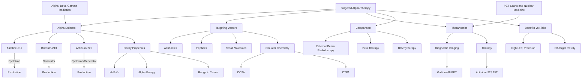

---
# Targeted Alpha Therapy and Nuclear Medicine / 靶向α疗法与核医学

---

# 1. Overview / 概述

**English:**
Targeted Alpha Therapy (TAT) is an advanced form of [[Radiotherapy and Nuclear Medicine Treatment]] that uses alpha-emitting radionuclides attached to biological targeting molecules (e.g., antibodies or peptides) to deliver highly localized, lethal radiation doses to cancer cells. Unlike conventional external beam radiotherapy or [[Brachytherapy (Internal Radiotherapy)]], TAT exploits the short range (typically <100 μm, a few cell diameters) and high linear energy transfer (LET) of alpha particles to cause dense, irreparable double-strand DNA breaks in tumor cells while sparing surrounding healthy tissue. This sub-topic covers the nuclear physics principles of alpha decay, the production and selection of suitable alpha emitters (e.g., Astatine-211, Bismuth-213, Actinium-225), the radiochemistry of labeling targeting vectors, and the clinical applications in treating micrometastases, leukemia, and resistant solid tumors. It also introduces the concept of theranostics — combining therapy with diagnostic imaging (e.g., [[PET Scans and Nuclear Medicine]]) using matched radionuclide pairs.

**中文:**
靶向α疗法 (TAT) 是[[放射治疗与核医学治疗]]的一种先进形式，它利用附着在生物靶向分子（如抗体或肽）上的α发射放射性核素，向癌细胞传递高度局部化、致死性的辐射剂量。与传统的体外放射治疗或[[近距离治疗（内放射治疗）]]不同，TAT利用α粒子的短射程（通常<100 μm，仅几个细胞直径）和高线性能量转移 (LET)，在肿瘤细胞内造成密集、不可修复的双链DNA断裂，同时保护周围健康组织。本子知识点涵盖α衰变的核物理原理、合适α发射体（如砹-211、铋-213、锕-225）的生产与选择、标记靶向载体的放射化学、以及治疗微转移、白血病和耐药实体瘤的临床应用。它还介绍了诊疗一体化的概念——使用匹配的放射性核素对将治疗与诊断成像（如[[PET扫描与核医学]]）相结合。

---

# 2. Syllabus Learning Objectives / 考纲学习目标

| CAIE 9702 (26.4 a-e) | Edexcel IAL (WPH14 U4: 11.19-11.24) |
|----------------------|--------------------------------------|
| Describe the principles of targeted alpha therapy (TAT) using alpha-emitting radionuclides. | Understand the principles of targeted alpha therapy and its advantages over beta therapy. |
| Explain the choice of alpha emitters (e.g., $^{211}\text{At}$, $^{213}\text{Bi}$, $^{225}\text{Ac}$) based on half-life, decay energy, and daughter products. | Know the properties of suitable alpha emitters for TAT. |
| Discuss the role of targeting vectors (e.g., antibodies) in delivering radionuclides to tumor cells. | Explain the concept of theranostics in nuclear medicine. |
| Evaluate the benefits and risks of TAT compared to other radiotherapy modalities. | Describe the production methods of alpha emitters (e.g., cyclotron, generator). |
| Understand the concept of theranostics (therapy + diagnostics). | Calculate absorbed dose and range of alpha particles in tissue. |

**Examiner Expectations / 考官期望:**
- **CAIE:** Focus on qualitative understanding of TAT principles, selection criteria for alpha emitters, and comparison with other therapies. Quantitative calculations are limited to simple range-energy relationships.
- **Edexcel:** More emphasis on quantitative aspects — calculating alpha particle range using the Bragg-Kleeman rule, absorbed dose calculations, and understanding decay chains of generator-produced isotopes.

---

# 3. Core Definitions / 核心定义

| Term (EN/CN) | Definition (EN) | Definition (CN) | Common Mistakes / 常见错误 |
|--------------|-----------------|-----------------|---------------------------|
| **Targeted Alpha Therapy (TAT)** / 靶向α疗法 | A cancer treatment that uses alpha-emitting radionuclides conjugated to targeting molecules to deliver cytotoxic radiation specifically to tumor cells. | 一种利用与靶向分子结合的α发射放射性核素，将细胞毒性辐射特异性递送至肿瘤细胞的癌症治疗方法。 | Confusing TAT with [[External Beam Radiotherapy]]; TAT is systemic, not external. |
| **Linear Energy Transfer (LET)** / 线性能量转移 | The energy deposited per unit path length by ionizing radiation as it travels through matter, typically in keV/μm. | 电离辐射在物质中传播时每单位路径长度沉积的能量，通常以 keV/μm 为单位。 | Forgetting that alpha particles have high LET (~80-100 keV/μm) compared to beta (~0.2 keV/μm). |
| **Alpha Emitter** / α发射体 | A radionuclide that decays by emitting an alpha particle ($^4_2\text{He}^{2+}$). | 通过发射α粒子 ($^4_2\text{He}^{2+}$) 衰变的放射性核素。 | Confusing alpha decay with beta decay; alpha decay reduces atomic number by 2 and mass number by 4. |
| **Targeting Vector** / 靶向载体 | A biological molecule (e.g., monoclonal antibody, peptide, small molecule) that specifically binds to receptors or antigens overexpressed on cancer cells. | 一种特异性结合癌细胞上过度表达的受体或抗原的生物分子（如单克隆抗体、肽、小分子）。 | Assuming all antibodies work equally; immunogenicity and clearance rates vary. |
| **Theranostics** / 诊疗一体化 | A combined therapeutic and diagnostic approach using matched radionuclide pairs (e.g., $^{68}\text{Ga}$ for PET imaging + $^{177}\text{Lu}$ or $^{225}\text{Ac}$ for therapy). | 一种使用匹配放射性核素对（如$^{68}\text{Ga}$用于PET成像 + $^{177}\text{Lu}$或$^{225}\text{Ac}$用于治疗）的治疗与诊断相结合的方法。 | Thinking theranostics requires the same element; often different isotopes of the same element or chemically similar ones are used. |
| **Bragg Peak** / 布拉格峰 | The sharp maximum in energy deposition at the end of a charged particle's range in matter. | 带电粒子在物质中射程末端能量沉积的尖锐最大值。 | Confusing with the Bragg peak in proton therapy; alpha particles also exhibit a Bragg peak but at much shorter range. |

---

# 4. Key Concepts Explained / 关键概念详解

## 4.1 Alpha Decay and Particle Properties / α衰变与粒子性质

### Explanation / 解释
**English:**
Alpha decay is a nuclear process where an unstable nucleus emits an alpha particle ($^4_2\text{He}^{2+}$), reducing its atomic number by 2 and mass number by 4. The general decay equation is:
$$ ^A_Z\text{X} \rightarrow ^{A-4}_{Z-2}\text{Y} + ^4_2\alpha + Q $$
where $Q$ is the decay energy (typically 5-9 MeV). Alpha particles are heavy (≈4 u), doubly charged, and have a short range in tissue (typically 40-100 μm, equivalent to 2-10 cell diameters). Their high LET (≈80-100 keV/μm) means they deposit enormous energy over a very short distance, causing complex, non-repairable DNA damage. This is in stark contrast to beta particles ($\beta^-$), which have low LET (≈0.2 keV/μm) and longer range (mm to cm), often causing more damage to surrounding healthy tissue.

**中文:**
α衰变是一种核过程，不稳定的原子核发射一个α粒子 ($^4_2\text{He}^{2+}$)，使其原子序数减少2，质量数减少4。一般衰变方程为：
$$ ^A_Z\text{X} \rightarrow ^{A-4}_{Z-2}\text{Y} + ^4_2\alpha + Q $$
其中 $Q$ 是衰变能量（通常为5-9 MeV）。α粒子质量大（≈4 u），带双电荷，在组织中的射程短（通常为40-100 μm，相当于2-10个细胞直径）。其高LET（≈80-100 keV/μm）意味着它们在极短距离内沉积巨大能量，造成复杂、不可修复的DNA损伤。这与β粒子（$\beta^-$）形成鲜明对比，后者LET低（≈0.2 keV/μm），射程长（mm至cm），通常对周围健康组织造成更多损伤。

### Physical Meaning / 物理意义
**English:**
The short range and high LET of alpha particles make TAT ideal for treating micrometastases and single cancer cells — the alpha particle can kill the target cell and perhaps 1-2 neighboring cells (the "bystander effect") but spares distant healthy tissue. This is fundamentally different from [[External Beam Radiotherapy]], which treats macroscopic tumors with a broad beam.

**中文:**
α粒子的短射程和高LET使TAT成为治疗微转移和单个癌细胞的理想选择——α粒子可以杀死靶细胞以及可能1-2个邻近细胞（“旁观者效应”），但保护远处的健康组织。这与使用宽束治疗宏观肿瘤的[[体外放射治疗]]有根本区别。

### Common Misconceptions / 常见误区
- **Mistake:** Alpha particles are "more dangerous" than beta particles in all contexts.
  **Correction:** Alpha particles are extremely dangerous if ingested or inhaled (internal hazard), but their short range means they are harmless outside the body (external hazard is low). In TAT, this short range is exploited for precision.
- **Mistake:** All alpha emitters are the same.
  **Correction:** Different emitters have different half-lives, decay energies, and daughter products, which affect their suitability for TAT.

### Exam Tips / 考试提示
- **CAIE:** Be able to write and balance alpha decay equations. Know that $Q$ energy is shared between the alpha particle and recoil nucleus (conservation of momentum).
- **Edexcel:** Be prepared to calculate the range of an alpha particle in tissue using the Bragg-Kleeman rule: $R = k \cdot E^{3/2}$, where $k$ is a constant for the medium and $E$ is the alpha particle energy in MeV.

> 📷 **IMAGE PROMPT — TAT-01: Alpha Particle Track in Tissue**
> A detailed microscopic illustration showing a single alpha particle track (straight, dense ionization trail) passing through a cancer cell nucleus, causing multiple double-strand DNA breaks. Compare with a wispy, sparse beta particle track that misses the nucleus. Labels: "Alpha track (high LET)", "Beta track (low LET)", "Cell nucleus", "DNA double-strand breaks". Style: scientific diagram with clear color coding (red for alpha, blue for beta).

---

## 4.2 Selection of Alpha Emitters / α发射体的选择

### Explanation / 解释
**English:**
Choosing the right alpha emitter for TAT depends on several nuclear and chemical factors:

1. **Half-life ($t_{1/2}$):** Must match the biological half-life of the targeting vector. Too short (e.g., $^{213}\text{Bi}$, $t_{1/2}=45.6$ min) requires rapid delivery; too long (e.g., $^{225}\text{Ac}$, $t_{1/2}=9.9$ days) may cause prolonged radiation exposure.
2. **Decay energy ($E_\alpha$):** Determines range in tissue. Typical $E_\alpha$ = 5-9 MeV gives range 40-100 μm.
3. **Daughter products:** Some alpha emitters decay through a chain of radioactive daughters (e.g., $^{225}\text{Ac} \rightarrow ^{221}\text{Fr} \rightarrow ^{217}\text{At} \rightarrow ^{213}\text{Bi} \rightarrow \dots$). Each daughter may also emit alpha particles, increasing the total dose — but if daughters detach from the targeting vector, they can cause off-target toxicity.
4. **Production method:** Cyclotron-produced (e.g., $^{211}\text{At}$ via $^{209}\text{Bi}(\alpha,2n)^{211}\text{At}$) vs. generator-produced (e.g., $^{213}\text{Bi}$ from $^{225}\text{Ac}/^{213}\text{Bi}$ generator). Generators allow on-site elution of short-lived isotopes.
5. **Radiochemistry:** The element must form stable bonds with chelators (e.g., DOTA, DTPA) that link to the targeting vector. Astatine ($^{211}\text{At}$) is a halogen and requires different chemistry than metals like Bi or Ac.

**Common Alpha Emitters for TAT:**

| Radionuclide | Half-life | $E_\alpha$ (MeV) | Range (μm) | Production | Clinical Use |
|--------------|-----------|------------------|------------|------------|--------------|
| $^{211}\text{At}$ | 7.2 h | 5.87 | 55-80 | Cyclotron | Ovarian cancer, glioblastoma |
| $^{213}\text{Bi}$ | 45.6 min | 5.87 (from $^{213}\text{Po}$) | 50-80 | Generator ($^{225}\text{Ac}$) | Leukemia, neuroendocrine tumors |
| $^{225}\text{Ac}$ | 9.9 d | 5.83 (4 alphas in chain) | 40-100 | Cyclotron/Generator | Prostate cancer, melanoma |
| $^{212}\text{Pb}$ | 10.6 h | 8.78 (from $^{212}\text{Po}$) | 80-90 | Generator ($^{224}\text{Ra}$) | Various solid tumors |

**中文:**
为TAT选择合适的α发射体取决于几个核和化学因素：

1. **半衰期 ($t_{1/2}$):** 必须与靶向载体的生物半衰期匹配。太短（如$^{213}\text{Bi}$，$t_{1/2}=45.6$分钟）需要快速递送；太长（如$^{225}\text{Ac}$，$t_{1/2}=9.9$天）可能导致长时间辐射暴露。
2. **衰变能量 ($E_\alpha$):** 决定在组织中的射程。典型$E_\alpha$ = 5-9 MeV，射程40-100 μm。
3. **子体产物:** 一些α发射体通过放射性子体链衰变（如$^{225}\text{Ac} \rightarrow ^{221}\text{Fr} \rightarrow ^{217}\text{At} \rightarrow ^{213}\text{Bi} \rightarrow \dots$）。每个子体也可能发射α粒子，增加总剂量——但如果子体从靶向载体上脱离，可能引起脱靶毒性。
4. **生产方式:** 回旋加速器生产（如$^{211}\text{At}$通过$^{209}\text{Bi}(\alpha,2n)^{211}\text{At}$）vs. 发生器生产（如$^{213}\text{Bi}$来自$^{225}\text{Ac}/^{213}\text{Bi}$发生器）。发生器允许现场洗脱短寿命同位素。
5. **放射化学:** 该元素必须与连接靶向载体的螯合剂（如DOTA、DTPA）形成稳定键。砹 ($^{211}\text{At}$) 是卤素，需要与Bi或Ac等金属不同的化学方法。

**用于TAT的常见α发射体:**

| 放射性核素 | 半衰期 | $E_\alpha$ (MeV) | 射程 (μm) | 生产 | 临床应用 |
|------------|--------|------------------|------------|------|----------|
| $^{211}\text{At}$ | 7.2小时 | 5.87 | 55-80 | 回旋加速器 | 卵巢癌、胶质母细胞瘤 |
| $^{213}\text{Bi}$ | 45.6分钟 | 5.87 (来自$^{213}\text{Po}$) | 50-80 | 发生器 ($^{225}\text{Ac}$) | 白血病、神经内分泌肿瘤 |
| $^{225}\text{Ac}$ | 9.9天 | 5.83 (链中4个α) | 40-100 | 回旋加速器/发生器 | 前列腺癌、黑色素瘤 |
| $^{212}\text{Pb}$ | 10.6小时 | 8.78 (来自$^{212}\text{Po}$) | 80-90 | 发生器 ($^{224}\text{Ra}$) | 各种实体瘤 |

### Common Misconceptions / 常见误区
- **Mistake:** Longer half-life is always better.
  **Correction:** Longer half-life means prolonged radiation exposure, which can damage healthy organs (e.g., kidneys) if the radionuclide accumulates there.
- **Mistake:** All alpha emitters deliver the same dose per decay.
  **Correction:** $^{225}\text{Ac}$ delivers 4 alpha particles per decay chain, giving much higher total energy than $^{211}\text{At}$ (1 alpha per decay).

### Exam Tips / 考试提示
- **CAIE:** Be able to justify the choice of a specific alpha emitter for a given clinical scenario (e.g., "Why is $^{213}\text{Bi}$ suitable for leukemia?")
- **Edexcel:** Understand the concept of a radionuclide generator (parent-daughter equilibrium). Know that $^{225}\text{Ac}$ decays to $^{213}\text{Bi}$, which can be eluted from a generator.

> 📷 **IMAGE PROMPT — TAT-02: Decay Chain of Actinium-225**
> A clear diagram showing the decay chain of $^{225}\text{Ac}$: $^{225}\text{Ac} \xrightarrow{\alpha} ^{221}\text{Fr} \xrightarrow{\alpha} ^{217}\text{At} \xrightarrow{\alpha} ^{213}\text{Bi} \xrightarrow{\beta^-} ^{213}\text{Po} \xrightarrow{\alpha} ^{209}\text{Pb} \xrightarrow{\beta^-} ^{209}\text{Bi}$ (stable). Each step labeled with half-life and decay mode. Highlight the 4 alpha emissions. Style: flowchart with nuclear symbols.

---

## 4.3 Targeting Vectors and Radiochemistry / 靶向载体与放射化学

### Explanation / 解释
**English:**
A targeting vector is a molecule that specifically binds to a biomarker (e.g., receptor, antigen) overexpressed on cancer cells. Common vectors include:

- **Monoclonal antibodies (mAbs):** Highly specific, but large (~150 kDa), slow clearance, and can cause immunogenicity. Example: Trastuzumab (anti-HER2) for breast cancer.
- **Peptides:** Smaller (~1-5 kDa), faster clearance, lower immunogenicity. Example: PSMA-617 for prostate cancer.
- **Small molecules:** Very small (<1 kDa), rapid clearance. Example: Folate for ovarian cancer.

The radionuclide is attached to the vector via a **chelator** (for metals like Bi, Ac) or a **covalent bond** (for halogens like At). Common chelators are DOTA (1,4,7,10-tetraazacyclododecane-1,4,7,10-tetraacetic acid) and DTPA (diethylenetriaminepentaacetic acid). The stability of the radionuclide-chelator complex is critical — if the radionuclide detaches (transchelation), it can accumulate in bones or kidneys, causing toxicity.

**中文:**
靶向载体是一种特异性结合癌细胞上过度表达的生物标志物（如受体、抗原）的分子。常见载体包括：

- **单克隆抗体 (mAbs):** 高度特异性，但分子量大（~150 kDa），清除慢，可能引起免疫原性。示例：曲妥珠单抗（抗HER2）用于乳腺癌。
- **肽:** 较小（~1-5 kDa），清除快，免疫原性低。示例：PSMA-617用于前列腺癌。
- **小分子:** 非常小（<1 kDa），快速清除。示例：叶酸用于卵巢癌。

放射性核素通过**螯合剂**（对于Bi、Ac等金属）或**共价键**（对于At等卤素）连接到载体上。常见螯合剂是DOTA（1,4,7,10-四氮杂环十二烷-1,4,7,10-四乙酸）和DTPA（二乙烯三胺五乙酸）。放射性核素-螯合剂复合物的稳定性至关重要——如果放射性核素脱离（转螯合），它可能积聚在骨骼或肾脏中，引起毒性。

### Common Misconceptions / 常见误区
- **Mistake:** The targeting vector only needs to bind to cancer cells.
  **Correction:** It must also have favorable pharmacokinetics (e.g., not accumulate in the liver or kidneys) and be stable in the bloodstream long enough to reach the tumor.
- **Mistake:** All chelators work for all metals.
  **Correction:** Different metals have different coordination chemistry; DOTA works well for Ac and Bi, but not for At (which requires different chemistry).

### Exam Tips / 考试提示
- **CAIE:** Understand the role of the chelator in preventing premature release of the radionuclide.
- **Edexcel:** Be able to explain why small peptides are often preferred over antibodies for TAT (faster clearance → lower background radiation).

---

## 4.4 Theranostics: Therapy + Diagnostics / 诊疗一体化：治疗+诊断

### Explanation / 解释
**English:**
Theranostics is a personalized medicine approach where a diagnostic radionuclide (e.g., $^{68}\text{Ga}$ for PET, $^{99m}\text{Tc}$ for SPECT) is used to image the tumor and confirm target expression, followed by a therapeutic radionuclide (e.g., $^{177}\text{Lu}$ for beta therapy, $^{225}\text{Ac}$ for alpha therapy) that delivers the cytotoxic dose. The key is that both radionuclides are chemically similar (often isotopes of the same element or same chelator chemistry), so the same targeting vector can be used for both imaging and therapy.

**Example:** Prostate cancer treatment:
1. **Diagnostic:** $^{68}\text{Ga}$-PSMA-11 PET/CT scan — identifies PSMA-positive metastases.
2. **Therapy:** $^{225}\text{Ac}$-PSMA-617 TAT — delivers alpha radiation to PSMA-positive cells.

This allows "see what you treat, treat what you see" — a powerful paradigm in nuclear medicine.

**中文:**
诊疗一体化是一种个性化医学方法，使用诊断性放射性核素（如$^{68}\text{Ga}$用于PET，$^{99m}\text{Tc}$用于SPECT）对肿瘤进行成像并确认靶点表达，然后使用治疗性放射性核素（如$^{177}\text{Lu}$用于β疗法，$^{225}\text{Ac}$用于α疗法）传递细胞毒性剂量。关键是两种放射性核素化学性质相似（通常是同一元素的同位素或使用相同的螯合剂化学），因此相同的靶向载体可用于成像和治疗。

**示例:** 前列腺癌治疗：
1. **诊断:** $^{68}\text{Ga}$-PSMA-11 PET/CT扫描——识别PSMA阳性转移灶。
2. **治疗:** $^{225}\text{Ac}$-PSMA-617 TAT——向PSMA阳性细胞传递α辐射。

这实现了“看到你治疗的，治疗你看到的”——核医学中的一个强大范式。

### Common Misconceptions / 常见误区
- **Mistake:** Theranostics requires the same element for imaging and therapy.
  **Correction:** They can be different elements as long as they have similar chemical properties (e.g., $^{68}\text{Ga}$ and $^{177}\text{Lu}$ are both metals that bind to DOTA).
- **Mistake:** Theranostics is only for alpha therapy.
  **Correction:** It applies to beta therapy (e.g., $^{177}\text{Lu}$) and other modalities too.

### Exam Tips / 考试提示
- **CAIE:** Be able to explain the advantage of theranostics: avoids treating patients who won't respond (negative scan → no therapy).
- **Edexcel:** Understand that the diagnostic scan provides dosimetry data (absorbed dose to tumor and organs) to plan the therapy dose.

> 📷 **IMAGE PROMPT — TAT-03: Theranostics Cycle**
> A circular diagram showing the theranostics cycle: (1) Patient with cancer → (2) Inject diagnostic radionuclide (e.g., $^{68}\text{Ga}$-PSMA) → (3) PET/CT scan shows tumor uptake → (4) If positive, inject therapeutic radionuclide (e.g., $^{225}\text{Ac}$-PSMA) → (5) Alpha particles kill cancer cells → (6) Follow-up scan shows response. Labels: "Diagnosis", "Therapy", "Response Assessment". Style: clean medical illustration with icons.

---

# 5. Essential Equations / 核心公式

## 5.1 Alpha Decay Energy / α衰变能量

$$ Q = [M(\text{parent}) - M(\text{daughter}) - M(\alpha)]c^2 $$

| Symbol (符号) | Meaning (EN) | Meaning (CN) | Unit (单位) |
|--------------|-------------|-------------|------------|
| $Q$ | Decay energy | 衰变能量 | MeV |
| $M(\text{parent})$ | Mass of parent nucleus | 母核质量 | u |
| $M(\text{daughter})$ | Mass of daughter nucleus | 子核质量 | u |
| $M(\alpha)$ | Mass of alpha particle (4.002603 u) | α粒子质量 (4.002603 u) | u |
| $c$ | Speed of light | 光速 | m/s |

**Derivation / 推导:** From Einstein's mass-energy equivalence, $E = \Delta m c^2$. The mass defect $\Delta m$ is converted to kinetic energy of the alpha particle and recoil daughter.

**Conditions / 适用条件:** Only for spontaneous alpha decay. $Q > 0$ for decay to be possible.

**Limitations / 局限性:** Does not account for energy carried by gamma rays or internal conversion electrons that may accompany alpha decay.

## 5.2 Alpha Particle Range in Tissue (Bragg-Kleeman Rule) / α粒子在组织中的射程

$$ R = k \cdot E^{3/2} $$

| Symbol (符号) | Meaning (EN) | Meaning (CN) | Unit (单位) |
|--------------|-------------|-------------|------------|
| $R$ | Range in medium | 在介质中的射程 | μm |
| $k$ | Material constant (≈ 1.2 for soft tissue when $E$ in MeV, $R$ in μm) | 材料常数（软组织≈1.2，$E$以MeV为单位，$R$以μm为单位） | μm·MeV$^{-3/2}$ |
| $E$ | Alpha particle kinetic energy | α粒子动能 | MeV |

**Derivation / 推导:** Empirical relationship based on Bethe-Bloch stopping power theory. The exponent 3/2 comes from the energy dependence of electronic stopping power.

**Conditions / 适用条件:** Valid for alpha particles with energy 4-9 MeV in low-Z materials (tissue, water). Not accurate for high-Z materials or very low energies.

**Limitations / 局限性:** Does not account for straggling (statistical variation in range) or the Bragg peak shape.

> 📋 **Edexcel Only:** You may be asked to calculate the range of an alpha particle in tissue given its energy, or to compare ranges of different alpha emitters.

## 5.3 Absorbed Dose from Alpha Particles / α粒子的吸收剂量

$$ D = \frac{E_{\text{dep}}}{m} $$

| Symbol (符号) | Meaning (EN) | Meaning (CN) | Unit (单位) |
|--------------|-------------|-------------|------------|
| $D$ | Absorbed dose | 吸收剂量 | Gy (J/kg) |
| $E_{\text{dep}}$ | Energy deposited in tissue | 在组织中沉积的能量 | J |
| $m$ | Mass of tissue | 组织质量 | kg |

**For TAT, the dose to a single cell can be estimated as:**
$$ D_{\text{cell}} = \frac{N_\alpha \cdot E_\alpha \cdot f}{m_{\text{cell}}} $$
where $N_\alpha$ is the number of alpha decays in the cell, $E_\alpha$ is the alpha particle energy, $f$ is the fraction of energy deposited in the cell (≈1 for alpha particles with range < cell diameter), and $m_{\text{cell}}$ is the cell mass (≈ $10^{-12}$ kg for a typical mammalian cell).

**Conditions / 适用条件:** Assumes uniform distribution of radionuclide. In reality, microdosimetry is complex due to non-uniform uptake.

**Limitations / 局限性:** Does not account for the relative biological effectiveness (RBE) of alpha particles. The equivalent dose (Sv) = $D \times \text{RBE}$, where RBE for alpha particles is typically 5-20.

> 📷 **IMAGE PROMPT — TAT-04: Bragg Peak of Alpha Particle**
> A graph showing stopping power (dE/dx) vs. depth in tissue for an alpha particle. The curve is flat at low depths, then rises sharply to a Bragg peak near the end of the range, then drops to zero. Compare with a beta particle curve (broad, low peak). Labels: "Alpha Bragg peak", "Beta curve", "Range", "Plateau region". Style: clear scientific graph with labeled axes.

---

# 6. Graphs and Relationships / 图表与关系

## 6.1 Alpha Particle Range vs. Energy / α粒子射程与能量关系

### Axes / 坐标轴
- **X-axis:** Alpha particle energy $E$ (MeV)
- **Y-axis:** Range in tissue $R$ (μm)

### Shape / 形状
A power-law curve: $R \propto E^{3/2}$. As energy increases, range increases non-linearly. For example:
- $E = 5$ MeV → $R \approx 40$ μm
- $E = 6$ MeV → $R \approx 53$ μm
- $E = 8$ MeV → $R \approx 82$ μm

### Gradient Meaning / 斜率含义
The gradient $\frac{dR}{dE} = \frac{3}{2} k E^{1/2}$ increases with energy — higher energy alpha particles have a larger increase in range per unit energy.

### Area Meaning / 面积含义
No direct physical meaning for area under this curve.

### Exam Interpretation / 考试解读
- **CAIE:** Use the graph to estimate the range of an alpha particle given its energy, or to compare different emitters.
- **Edexcel:** May be asked to calculate $k$ from given data, or to determine the energy of an alpha particle from its measured range.

```mermaid
graph LR
    A[Alpha Energy E] -->|R = k E^{3/2}| B[Range R]
    B -->|Short range < 100 μm| C[Kills single cells]
    B -->|Longer range > 100 μm| D[Kills cell clusters]
    C --> E[Ideal for micrometastases]
    D --> F[Better for small tumors]
```

---

## 6.2 LET vs. Particle Type / LET与粒子类型

### Axes / 坐标轴
- **X-axis:** Particle type (alpha, beta, gamma)
- **Y-axis:** LET (keV/μm)

### Shape / 形状
Bar chart showing:
- Alpha particles: ~80-100 keV/μm
- Beta particles: ~0.2 keV/μm
- Gamma rays: ~0.01-0.1 keV/μm (sparse ionization)

### Gradient Meaning / 斜率含义
N/A (categorical data).

### Area Meaning / 面积含义
N/A.

### Exam Interpretation / 考试解读
- Understand why alpha particles are more effective at killing cells per unit dose (high LET → more complex DNA damage).
- Be able to explain why beta particles cause more "cross-fire" effect (irradiating cells beyond the target cell).

> 📷 **IMAGE PROMPT — TAT-05: LET Comparison Bar Chart**
> A bar chart comparing LET values for alpha, beta, and gamma radiation. Alpha bar is tall (80-100 keV/μm), beta is short (0.2 keV/μm), gamma is barely visible (0.01 keV/μm). Labels: "Alpha (high LET)", "Beta (low LET)", "Gamma (very low LET)". Style: clean bar chart with color coding.

---

# 7. Required Diagrams / 必备图表

## 7.1 Schematic of Targeted Alpha Therapy / 靶向α疗法示意图

### Description / 描述
**English:**
A diagram showing a cancer cell with overexpressed receptors on its surface. A targeting vector (e.g., antibody) with an attached alpha-emitting radionuclide binds to the receptor. The alpha particle is emitted and travels a short distance (<100 μm), depositing its energy in the cell nucleus, causing DNA damage and cell death. Surrounding healthy cells are unaffected.

**中文:**
一个示意图，显示一个表面过度表达受体的癌细胞。一个带有附着α发射放射性核素的靶向载体（如抗体）与受体结合。α粒子被发射并传播短距离（<100 μm），在细胞核中沉积能量，造成DNA损伤和细胞死亡。周围的健康细胞不受影响。

### Image Prompt / 图片生成提示
> 📷 **IMAGE PROMPT — TAT-06: Targeted Alpha Therapy Mechanism**
> A detailed scientific illustration showing a cancer cell (large, irregular shape) with red receptors on its surface. A Y-shaped antibody (blue) with a small red sphere (alpha emitter) attached binds to a receptor. An alpha particle (red arrow) is emitted from the radionuclide and travels straight into the cell nucleus, where it causes multiple DNA double-strand breaks (shown as jagged lines). A nearby healthy cell (smaller, regular shape) has no receptors and is not affected. Labels: "Cancer cell", "Receptor", "Antibody (targeting vector)", "Alpha emitter", "Alpha particle track", "DNA damage", "Healthy cell". Style: medical illustration with clear color coding and labels.

### Labels Required / 需要标注
- Cancer cell / 癌细胞
- Receptor / 受体
- Targeting vector (antibody) / 靶向载体（抗体）
- Alpha-emitting radionuclide / α发射放射性核素
- Alpha particle track / α粒子轨迹
- Cell nucleus / 细胞核
- DNA double-strand breaks / DNA双链断裂
- Healthy cell (unaffected) / 健康细胞（未受影响）

### Exam Importance / 考试重要性
- **CAIE:** High — this is the core concept of TAT.
- **Edexcel:** High — may be asked to label or describe the diagram.

---

## 7.2 Decay Chain of Actinium-225 / 锕-225衰变链

### Description / 描述
**English:**
A diagram showing the complete decay chain of $^{225}\text{Ac}$ to stable $^{209}\text{Bi}$, with 4 alpha decays and 2 beta decays. Each step shows the half-life, decay mode, and particle energies.

**中文:**
一个显示$^{225}\text{Ac}$到稳定$^{209}\text{Bi}$的完整衰变链的图表，包含4次α衰变和2次β衰变。每一步显示半衰期、衰变模式和粒子能量。

### Image Prompt / 图片生成提示
> 📷 **IMAGE PROMPT — TAT-07: Actinium-225 Decay Chain**
> A vertical flowchart showing the decay chain of $^{225}\text{Ac}$. Each box contains the nuclide symbol, half-life, and decay mode. Arrows between boxes are labeled with particle type and energy. The chain: $^{225}\text{Ac}$ (9.9 d, α) → $^{221}\text{Fr}$ (4.8 min, α) → $^{217}\text{At}$ (32 ms, α) → $^{213}\text{Bi}$ (45.6 min, β⁻) → $^{213}\text{Po}$ (4.2 μs, α) → $^{209}\text{Pb}$ (3.25 h, β⁻) → $^{209}\text{Bi}$ (stable). Highlight the 4 alpha decays in red. Style: clear flowchart with nuclear symbols.

### Labels Required / 需要标注
- Each nuclide with symbol / 每个核素及其符号
- Half-life / 半衰期
- Decay mode (α or β⁻) / 衰变模式（α或β⁻）
- Particle energy / 粒子能量
- Stable endpoint / 稳定终点

### Exam Importance / 考试重要性
- **CAIE:** Medium — understand that multiple alpha emissions increase dose.
- **Edexcel:** High — may be asked to calculate total energy released per decay chain.

---

# 8. Worked Examples / 典型例题

## Example 1: Calculating Alpha Particle Range / 计算α粒子射程

### Question / 题目
**English:**
An alpha particle from $^{211}\text{At}$ has a kinetic energy of 5.87 MeV. Using the Bragg-Kleeman rule $R = kE^{3/2}$ with $k = 1.2$ μm·MeV$^{-3/2}$ for soft tissue, calculate:
(a) The range of this alpha particle in soft tissue.
(b) How many cell diameters this corresponds to, assuming a typical cell diameter of 20 μm.

**中文:**
来自$^{211}\text{At}$的α粒子动能为5.87 MeV。使用布拉格-克里曼规则 $R = kE^{3/2}$，软组织 $k = 1.2$ μm·MeV$^{-3/2}$，计算：
(a) 该α粒子在软组织中的射程。
(b) 这相当于多少个细胞直径，假设典型细胞直径为20 μm。

### Solution / 解答

**Part (a):**
$$ R = kE^{3/2} = 1.2 \times (5.87)^{3/2} $$

First calculate $E^{3/2}$:
$$ E^{3/2} = (5.87)^{1.5} = \sqrt{5.87^3} = \sqrt{202.3} \approx 14.22 $$

Alternatively: $E^{3/2} = E \times \sqrt{E} = 5.87 \times \sqrt{5.87} = 5.87 \times 2.423 = 14.22$

$$ R = 1.2 \times 14.22 = 17.06 \text{ μm} $$

**Part (b):**
Number of cell diameters = $\frac{R}{\text{cell diameter}} = \frac{17.06}{20} \approx 0.85$

This means the alpha particle travels less than one cell diameter — it can kill the target cell but may not reach a neighboring cell.

### Final Answer / 最终答案
**Answer:** (a) $R \approx 17.1$ μm | (b) ≈ 0.85 cell diameters
**答案：** (a) $R \approx 17.1$ μm | (b) ≈ 0.85 个细胞直径

### Quick Tip / 提示
**English:** Remember that $E^{3/2} = E \times \sqrt{E}$. This is easier to calculate than raising to the power 1.5 directly.
**中文：** 记住 $E^{3/2} = E \times \sqrt{E}$。这比直接计算1.5次方更容易。

---

## Example 2: Comparing Alpha and Beta Therapy / 比较α和β疗法

### Question / 题目
**English:**
A single cancer cell (mass $10^{-12}$ kg) is targeted by one $^{213}\text{Bi}$ atom that decays, emitting an alpha particle of energy 5.87 MeV. Assume 100% of the alpha energy is deposited in the cell.
(a) Calculate the absorbed dose to the cell in Gy.
(b) How many beta particles from $^{177}\text{Lu}$ (average energy 0.15 MeV) would be needed to deliver the same dose, assuming each beta deposits 50% of its energy in the cell?
(c) Explain why alpha therapy is more effective than beta therapy for treating single cancer cells.

**中文:**
一个癌细胞（质量 $10^{-12}$ kg）被一个$^{213}\text{Bi}$原子靶向，该原子衰变发射一个能量为5.87 MeV的α粒子。假设100%的α能量沉积在细胞中。
(a) 计算细胞的吸收剂量，单位为Gy。
(b) 需要多少个来自$^{177}\text{Lu}$的β粒子（平均能量0.15 MeV）才能传递相同的剂量，假设每个β粒子将其50%的能量沉积在细胞中？
(c) 解释为什么α疗法比β疗法更有效地治疗单个癌细胞。

### Solution / 解答

**Part (a):**
Convert energy to joules:
$$ E_\alpha = 5.87 \text{ MeV} = 5.87 \times 1.602 \times 10^{-13} \text{ J} = 9.40 \times 10^{-13} \text{ J} $$

$$ D = \frac{E}{m} = \frac{9.40 \times 10^{-13}}{10^{-12}} = 0.940 \text{ Gy} $$

**Part (b):**
Energy deposited per beta particle:
$$ E_{\beta,\text{dep}} = 0.50 \times 0.15 \text{ MeV} = 0.075 \text{ MeV} = 0.075 \times 1.602 \times 10^{-13} \text{ J} = 1.20 \times 10^{-14} \text{ J} $$

Number of beta particles needed:
$$ N_\beta = \frac{E_\alpha}{E_{\beta,\text{dep}}} = \frac{9.40 \times 10^{-13}}{1.20 \times 10^{-14}} \approx 78.3 $$

So about 78 beta particles are needed to deliver the same dose.

**Part (c):**
Alpha therapy is more effective because:
1. **Higher LET:** Alpha particles cause dense, complex DNA damage that is difficult for cells to repair, while beta particles cause sparse damage that may be repaired.
2. **Single-cell kill:** One alpha particle can kill a cell, while beta particles require many hits (statistical probability).
3. **Short range:** Alpha particles spare neighboring healthy cells, while beta particles have a longer range and cause "cross-fire" damage.

### Final Answer / 最终答案
**Answer:** (a) $D = 0.940$ Gy | (b) ≈ 78 beta particles | (c) See explanation above
**答案：** (a) $D = 0.940$ Gy | (b) ≈ 78个β粒子 | (c) 见上方解释

### Quick Tip / 提示
**English:** Always convert MeV to joules (1 MeV = $1.602 \times 10^{-13}$ J) before calculating dose in Gy.
**中文：** 在计算以Gy为单位的剂量之前，始终将MeV转换为焦耳（1 MeV = $1.602 \times 10^{-13}$ J）。

---

# 9. Past Paper Question Types / 历年真题题型

| Question Type / 题型 | Frequency / 频率 | Difficulty / 难度 | Past Paper References / 真题索引 |
|----------------------|------------------|------------------|-------------------------------|
| Describe principles of TAT | High | Easy | 📝 *待填入* |
| Compare alpha vs. beta therapy | High | Medium | 📝 *待填入* |
| Calculate alpha particle range | Medium | Medium | 📝 *待填入* |
| Explain choice of alpha emitter | Medium | Medium | 📝 *待填入* |
| Theranostics concept | Low | Easy | 📝 *待填入* |
| Decay chain analysis | Low | Hard | 📝 *待填入* |

**Common Command Words / 常见指令词:**
- **Describe / 描述:** Give a detailed account of TAT principles.
- **Explain / 解释:** Give reasons for the choice of a specific alpha emitter.
- **Calculate / 计算:** Determine range, dose, or number of decays.
- **Compare / 比较:** Discuss similarities and differences between alpha and beta therapy.
- **Evaluate / 评估:** Weigh the benefits and risks of TAT.

---

# 10. Practical Skills Connections / 实验技能链接

**English:**
This sub-topic connects to practical skills in the following ways:

1. **Radioactive Decay Experiments:** Understanding half-life measurement using GM tubes or scintillation detectors. Students should be able to plot decay curves and determine half-lives from experimental data.

2. **Alpha Particle Range Measurement:** Using a variable-thickness absorber (e.g., aluminum foils) between an alpha source and a detector to measure the range. Plot count rate vs. absorber thickness to find the range.

3. **Dosimetry Calculations:** Using the Bragg-Kleeman rule to predict range, and calculating absorbed dose from activity and energy. This links to [[Radiation Protection and Dosimetry]].

4. **Uncertainty Analysis:** When measuring range, account for statistical fluctuations in count rate (Poisson statistics) and systematic errors in absorber thickness.

5. **Generator Elution:** Understanding how a $^{225}\text{Ac}/^{213}\text{Bi}$ generator works — parent-daughter equilibrium, elution efficiency, and quality control.

**中文:**
本子知识点通过以下方式与实验技能联系：

1. **放射性衰变实验:** 使用盖革-米勒管或闪烁探测器理解半衰期测量。学生应能绘制衰变曲线并从实验数据确定半衰期。

2. **α粒子射程测量:** 在α源和探测器之间使用可变厚度吸收体（如铝箔）测量射程。绘制计数率与吸收体厚度的关系图以找到射程。

3. **剂量学计算:** 使用布拉格-克里曼规则预测射程，并根据活度和能量计算吸收剂量。这与[[辐射防护与剂量学]]相关。

4. **不确定度分析:** 测量射程时，考虑计数率的统计波动（泊松统计）和吸收体厚度的系统误差。

5. **发生器洗脱:** 理解$^{225}\text{Ac}/^{213}\text{Bi}$发生器的工作原理——母体-子体平衡、洗脱效率和质量控制。

---

# 11. Concept Map / 概念图谱



---

# 12. Quick Revision Sheet / 速查表

| Category / 类别 | Key Points / 要点 |
|----------------|------------------|
| **Definition / 定义** | TAT uses alpha-emitting radionuclides attached to targeting vectors to kill cancer cells with high precision. / TAT使用附着在靶向载体上的α发射放射性核素高精度杀死癌细胞。 |
| **Key Formula / 核心公式** | $R = kE^{3/2}$ (Bragg-Kleeman range rule); $D = E/m$ (absorbed dose) |
| **Key Graph / 核心图表** | Range vs. Energy (power law); LET comparison (alpha >> beta > gamma) |
| **Key Emitters / 关键发射体** | $^{211}\text{At}$ (7.2 h), $^{213}\text{Bi}$ (45.6 min), $^{225}\text{Ac}$ (9.9 d) |
| **Key Advantage / 关键优势** | High LET (80-100 keV/μm) → irreparable DNA damage; short range (<100 μm) → spares healthy tissue |
| **Key Disadvantage / 关键劣势** | Daughter recoil can cause off-target toxicity; limited availability of emitters |
| **Theranostics / 诊疗一体化** | Same vector for imaging ($^{68}\text{Ga}$) and therapy ($^{225}\text{Ac}$) |
| **Exam Tip / 考试提示** | Always convert MeV to J for dose calculations; remember $E^{3/2} = E \times \sqrt{E}$ |
| **Common Mistake / 常见错误** | Confusing TAT with external beam radiotherapy; forgetting that alpha particles are internal hazard only |
| **Syllabus / 考纲** | CAIE 9702: 26.4 (a-e); Edexcel IAL: WPH14 U4: 11.19-11.24 |

---

**Related Notes:**
- [[Alpha, Beta and Gamma Radiation]] — Prerequisite for understanding alpha decay
- [[PET Scans and Nuclear Medicine]] — Prerequisite for theranostics concept
- [[External Beam Radiotherapy]] — Comparison modality
- [[Brachytherapy (Internal Radiotherapy)]] — Comparison modality
- [[Radiation Protection and Dosimetry]] — Practical skills connection
- [[Benefits vs Risks of Medical Radiation]] — Ethical context
- [[X-rays and Medical Imaging]] — Related imaging modality