# Converting Between Units / 单位换算

---

# 1. Overview / 概述

**English:**
Converting between units is a fundamental skill in A-Level Physics that enables students to work seamlessly across different measurement systems. This sub-topic covers the systematic conversion between SI base units, derived units, and non-SI units using prefixes and conversion factors. Mastery of unit conversion is essential for solving physical problems correctly, as inconsistent units are one of the most common sources of calculation errors. This skill directly supports [[SI Base Units and Derived Units]] and [[SI Prefixes (pico to tera)]] by providing the practical techniques to apply those concepts in calculations.

**中文:**
单位换算是A-Level物理中的基础技能，使学生能够在不同测量系统之间无缝工作。本子知识点涵盖使用前缀和换算因子在SI基本单位、导出单位和非SI单位之间进行系统换算。掌握单位换算对于正确解决物理问题至关重要，因为单位不一致是计算错误最常见的来源之一。这项技能通过提供在计算中应用这些概念的实用技术，直接支持[[SI Base Units and Derived Units]]和[[SI Prefixes (pico to tera)]]。

---

# 2. Syllabus Learning Objectives / 考纲学习目标

| CAIE 9702 | Edexcel IAL |
|-----------|-------------|
| 1.1: Use SI base units and prefixes correctly | WPH11 U1: 1.1: Use SI units and prefixes |
| 1.2: Convert between different units | WPH11 U1: 1.2: Convert between units |
| 1.3: Use derived units in calculations | WPH11 U1: 1.3: Apply unit conversions in problem-solving |

**Examiner Expectations / 考官期望:**
- **English:** Students must be able to convert between any SI units using prefixes (pico to tera), convert between non-SI units (e.g., km/h to m/s), and convert derived units (e.g., g/cm³ to kg/m³). Examiners expect clear working showing cancellation of units.
- **中文:** 学生必须能够使用前缀（pico到tera）在任何SI单位之间换算，在非SI单位之间换算（例如km/h到m/s），以及换算导出单位（例如g/cm³到kg/m³）。考官期望清晰的解题过程，显示单位的约分。

---

# 3. Core Definitions / 核心定义

| Term (EN/CN) | Definition (EN) | Definition (CN) | Common Mistakes / 常见错误 |
|--------------|-----------------|-----------------|---------------------------|
| **Conversion Factor** / 换算因子 | A numerical factor used to multiply or divide a quantity when converting between units | 在单位换算时用于乘除一个量的数值因子 | Confusing multiplication vs division |
| **Prefix** / 前缀 | A symbol placed before a unit to indicate a power of 10 multiple | 放在单位前的符号，表示10的幂次倍数 | Forgetting prefix values (e.g., milli = 10⁻³) |
| **Dimensional Consistency** / 量纲一致性 | The property that both sides of an equation have the same physical dimensions | 方程两边具有相同物理量纲的性质 | Converting only numbers, not units |
| **Cancellation** / 约分 | The process of eliminating units by dividing common factors | 通过除以公因子消除单位的过程 | Not cancelling all units completely |
| **Derived Unit** / 导出单位 | A unit formed by combining base units (e.g., N = kg·m·s⁻²) | 由基本单位组合形成的单位（如N = kg·m·s⁻²） | Forgetting to convert all components |

---

# 4. Key Concepts Explained / 关键概念详解

## 4.1 The Conversion Factor Method / 换算因子法

### Explanation / 解释
**English:** The conversion factor method involves multiplying a quantity by a fraction equal to 1 that converts the original unit to the desired unit. For example, to convert 60 km/h to m/s:
$$60 \text{ km/h} \times \frac{1000 \text{ m}}{1 \text{ km}} \times \frac{1 \text{ h}}{3600 \text{ s}} = 16.7 \text{ m/s}$$

Each conversion factor is a ratio equal to 1 (e.g., 1000 m = 1 km, so 1000 m/1 km = 1). This method ensures units cancel correctly. See [[SI Prefixes (pico to tera)]] for prefix conversion factors.

**中文:** 换算因子法涉及将一个量乘以一个等于1的分数，将原始单位转换为所需单位。例如，将60 km/h转换为m/s：
$$60 \text{ km/h} \times \frac{1000 \text{ m}}{1 \text{ km}} \times \frac{1 \text{ h}}{3600 \text{ s}} = 16.7 \text{ m/s}$$

每个换算因子都是一个等于1的比率（例如，1000 m = 1 km，所以1000 m/1 km = 1）。这种方法确保单位正确约分。参见[[SI Prefixes (pico to tera)]]了解前缀换算因子。

### Physical Meaning / 物理意义
**English:** Unit conversion does not change the physical quantity — it only changes how we express it. 60 km/h and 16.7 m/s represent the same speed, just in different units.

**中文:** 单位换算不会改变物理量——它只改变我们表达它的方式。60 km/h和16.7 m/s代表相同的速度，只是单位不同。

### Common Misconceptions / 常见误区
- **English:** 
  - Thinking that larger prefixes mean larger numbers (e.g., km is larger than m, but 1 km = 1000 m)
  - Forgetting to convert both numerator and denominator in derived units
  - Using the wrong power of 10 for prefixes
- **中文:**
  - 认为更大的前缀意味着更大的数字（例如km比m大，但1 km = 1000 m）
  - 忘记转换导出单位中的分子和分母
  - 对前缀使用错误的10的幂次

### Exam Tips / 考试提示
- **English:** Always write units in every step. Show cancellation clearly. Check that final units make physical sense.
- **中文:** 每一步都要写出单位。清晰显示约分过程。检查最终单位是否具有物理意义。

> 📷 **IMAGE PROMPT — CONV-01: Conversion Factor Flowchart**
> A flowchart showing the step-by-step process of unit conversion: Start → Identify original unit → Identify target unit → Find conversion factors → Multiply by conversion factors → Cancel units → Check result. Use arrows and boxes with clear labels.

---

## 4.2 Converting Derived Units / 导出单位换算

### Explanation / 解释
**English:** Derived units require converting each base unit component separately. For example, converting density from g/cm³ to kg/m³:
$$1 \text{ g/cm}^3 = 1 \times \frac{1 \text{ g}}{1 \text{ cm}^3} \times \frac{1 \text{ kg}}{1000 \text{ g}} \times \left(\frac{100 \text{ cm}}{1 \text{ m}}\right)^3 = 1000 \text{ kg/m}^3$$

Note that the length conversion is cubed because cm³ is a cubic unit. This connects to [[SI Base Units and Derived Units]].

**中文:** 导出单位需要分别转换每个基本单位分量。例如，将密度从g/cm³转换为kg/m³：
$$1 \text{ g/cm}^3 = 1 \times \frac{1 \text{ g}}{1 \text{ cm}^3} \times \frac{1 \text{ kg}}{1000 \text{ g}} \times \left(\frac{100 \text{ cm}}{1 \text{ m}}\right)^3 = 1000 \text{ kg/m}^3$$

注意长度换算被立方了，因为cm³是立方单位。这与[[SI Base Units and Derived Units]]相关。

### Physical Meaning / 物理意义
**English:** The conversion factor for area (cm² to m²) is 10⁻⁴, and for volume (cm³ to m³) is 10⁻⁶. This is because area is 2D and volume is 3D.

**中文:** 面积（cm²到m²）的换算因子是10⁻⁴，体积（cm³到m³）的换算因子是10⁻⁶。这是因为面积是二维的，体积是三维的。

### Common Misconceptions / 常见误区
- **English:** Forgetting to apply the power to the conversion factor (e.g., using 100 instead of 100² for cm² to m²)
- **中文:** 忘记对换算因子应用幂次（例如，对于cm²到m²使用100而不是100²）

### Exam Tips / 考试提示
- **English:** For squared or cubed units, remember to square or cube the conversion factor, not just the number.
- **中文:** 对于平方或立方单位，记得对换算因子进行平方或立方，而不仅仅是数字。

---

# 5. Essential Equations / 核心公式

## 5.1 General Conversion Formula / 通用换算公式

$$ Q_{\text{new}} = Q_{\text{original}} \times \prod_{i=1}^{n} \left( \frac{\text{Unit}_{\text{new},i}}{\text{Unit}_{\text{original},i}} \right) $$

| Symbol (符号) | Meaning (EN) | Meaning (CN) | Unit (单位) |
|--------------|-------------|-------------|------------|
| $Q_{\text{new}}$ | Quantity in new units | 新单位下的量 | varies |
| $Q_{\text{original}}$ | Quantity in original units | 原始单位下的量 | varies |
| $\prod$ | Product of all conversion factors | 所有换算因子的乘积 | dimensionless |
| $n$ | Number of unit components to convert | 需要转换的单位分量数量 | dimensionless |

**Derivation / 推导:** Each conversion factor is a ratio equal to 1, so multiplying by it doesn't change the physical quantity.

**Conditions / 适用条件:**
- **English:** Valid for all linear unit conversions. Not valid for logarithmic or angular units.
- **中文:** 适用于所有线性单位换算。不适用于对数或角度单位。

**Limitations / 局限性:**
- **English:** Does not account for temperature conversions (which require additive constants).
- **中文:** 不考虑温度换算（需要加法常数）。

## 5.2 Common Conversion Factors / 常用换算因子

| Conversion (换算) | Factor (因子) | Example (示例) |
|-------------------|---------------|----------------|
| km → m | × 10³ | 5 km = 5000 m |
| cm → m | × 10⁻² | 50 cm = 0.5 m |
| mm → m | × 10⁻³ | 250 mm = 0.25 m |
| μm → m | × 10⁻⁶ | 500 μm = 5 × 10⁻⁴ m |
| nm → m | × 10⁻⁹ | 100 nm = 1 × 10⁻⁷ m |
| g → kg | × 10⁻³ | 500 g = 0.5 kg |
| mg → kg | × 10⁻⁶ | 200 mg = 2 × 10⁻⁴ kg |
| km/h → m/s | × (1000/3600) = × (5/18) | 72 km/h = 20 m/s |
| cm³ → m³ | × 10⁻⁶ | 1000 cm³ = 1 × 10⁻³ m³ |
| g/cm³ → kg/m³ | × 10³ | 1 g/cm³ = 1000 kg/m³ |

> 📷 **IMAGE PROMPT — CONV-02: Common Conversion Factors Table**
> A clean, organized table showing common unit conversions with arrows indicating the direction of conversion. Use color coding: blue for length, green for mass, red for time, purple for derived units.

---

# 6. Graphs and Relationships / 图表与关系

## 6.1 Prefix Conversion Chart / 前缀换算图

### Axes / 坐标轴
- **English:** X-axis: Prefix name; Y-axis: Power of 10 (logarithmic scale)
- **中文:** X轴：前缀名称；Y轴：10的幂次（对数刻度）

### Shape / 形状
- **English:** A bar chart or number line showing prefixes from pico (10⁻¹²) to tera (10¹²)
- **中文:** 显示从pico (10⁻¹²)到tera (10¹²)前缀的条形图或数轴

### Gradient Meaning / 斜率含义
- **English:** Each step between adjacent prefixes represents a factor of 10³
- **中文:** 相邻前缀之间的每一步代表10³的因子

### Area Meaning / 面积含义
- **English:** Not applicable for this chart
- **中文:** 不适用于此图表

### Exam Interpretation / 考试解读
- **English:** Use this chart to quickly determine the power of 10 difference between any two prefixes. For example, milli (10⁻³) to kilo (10³) is a difference of 10⁶.
- **中文:** 使用此图表快速确定任意两个前缀之间的10的幂次差。例如，milli (10⁻³)到kilo (10³)的差是10⁶。

---

# 7. Required Diagrams / 必备图表

## 7.1 Unit Conversion Flowchart / 单位换算流程图

### Description / 描述
**English:** A step-by-step flowchart showing the systematic approach to converting any physical quantity between units. The flowchart includes decision points for single vs. multiple unit conversions and for linear vs. derived units.

**中文:** 一个逐步流程图，显示在任何单位之间转换任何物理量的系统方法。流程图包括单一与多个单位换算以及线性与导出单位换算的决策点。

### Image Prompt / 图片生成提示
> 📷 **IMAGE PROMPT — CONV-03: Unit Conversion Flowchart**
> A professional flowchart with rounded rectangles for process steps, diamonds for decisions, and parallelograms for inputs/outputs. Color-coded: green for start/end, blue for process steps, orange for decisions. Include example conversions at each step. Use arrows with labels like "Yes/No" and "Next unit component".

### Labels Required / 需要标注
- **English:** Start, Identify original unit, Identify target unit, Is it a single unit?, Find conversion factor, Multiply, Cancel units, Check result, End
- **中文:** 开始，识别原始单位，识别目标单位，是单一单位吗？，找到换算因子，相乘，约分单位，检查结果，结束

### Exam Importance / 考试重要性
- **English:** High — this flowchart represents the systematic approach examiners expect to see in working
- **中文:** 高——此流程图代表了考官期望在解题过程中看到的系统方法

---

## 7.2 Derived Unit Conversion Diagram / 导出单位换算图

### Description / 描述
**English:** A diagram showing how to convert a derived unit like density (g/cm³ to kg/m³) by breaking it into base unit conversions. Shows the mass conversion (g → kg) and the volume conversion (cm³ → m³) separately.

**中文:** 一个图表，显示如何通过将导出单位（如密度g/cm³到kg/m³）分解为基本单位换算来进行转换。分别显示质量换算（g → kg）和体积换算（cm³ → m³）。

### Image Prompt / 图片生成提示
> 📷 **IMAGE PROMPT — CONV-04: Derived Unit Conversion**
> A diagram showing a cube representing 1 cm³ being expanded to show it equals 10⁻⁶ m³. Next to it, show a mass scale converting 1 g to 10⁻³ kg. Then combine to show 1 g/cm³ = 1000 kg/m³. Use arrows and labels to explain each step.

### Labels Required / 需要标注
- **English:** Mass: 1 g = 10⁻³ kg, Volume: 1 cm³ = 10⁻⁶ m³, Combined: 1 g/cm³ = 10⁻³ kg / 10⁻⁶ m³ = 10³ kg/m³
- **中文:** 质量：1 g = 10⁻³ kg，体积：1 cm³ = 10⁻⁶ m³，组合：1 g/cm³ = 10⁻³ kg / 10⁻⁶ m³ = 10³ kg/m³

### Exam Importance / 考试重要性
- **English:** High — derived unit conversions are frequently tested in both CAIE and Edexcel exams
- **中文:** 高——导出单位换算在CAIE和Edexcel考试中经常出现

---

# 8. Worked Examples / 典型例题

## Example 1: Speed Conversion / 速度换算

### Question / 题目
**English:** A car travels at 90 km/h. Convert this speed to m/s.

**中文:** 一辆汽车以90 km/h的速度行驶。将此速度转换为m/s。

### Solution / 解答

**Step 1: Write the conversion factors / 写出换算因子**
$$1 \text{ km} = 1000 \text{ m}$$
$$1 \text{ h} = 3600 \text{ s}$$

**Step 2: Set up the conversion / 设置换算**
$$90 \text{ km/h} = 90 \times \frac{1000 \text{ m}}{1 \text{ km}} \times \frac{1 \text{ h}}{3600 \text{ s}}$$

**Step 3: Cancel units / 约分单位**
$$= 90 \times \frac{1000}{3600} \text{ m/s}$$

**Step 4: Calculate / 计算**
$$= 90 \times \frac{5}{18} = 25 \text{ m/s}$$

### Final Answer / 最终答案
**Answer:** 25 m/s | **答案：** 25 m/s

### Quick Tip / 提示
- **English:** Remember the shortcut: to convert km/h to m/s, multiply by 5/18. To convert m/s to km/h, multiply by 18/5.
- **中文：** 记住快捷方法：将km/h转换为m/s，乘以5/18。将m/s转换为km/h，乘以18/5。

---

## Example 2: Density Conversion / 密度换算

### Question / 题目
**English:** The density of water is 1.0 g/cm³. Convert this to kg/m³.

**中文:** 水的密度是1.0 g/cm³。将其转换为kg/m³。

### Solution / 解答

**Step 1: Break into mass and volume conversions / 分解为质量和体积换算**
$$1 \text{ g} = 10^{-3} \text{ kg}$$
$$1 \text{ cm}^3 = (10^{-2} \text{ m})^3 = 10^{-6} \text{ m}^3$$

**Step 2: Set up the conversion / 设置换算**
$$1.0 \text{ g/cm}^3 = 1.0 \times \frac{10^{-3} \text{ kg}}{1 \text{ g}} \times \frac{1 \text{ cm}^3}{10^{-6} \text{ m}^3}$$

**Step 3: Cancel units and calculate / 约分单位并计算**
$$= 1.0 \times \frac{10^{-3}}{10^{-6}} \text{ kg/m}^3$$
$$= 1.0 \times 10^3 \text{ kg/m}^3$$
$$= 1000 \text{ kg/m}^3$$

### Final Answer / 最终答案
**Answer:** 1000 kg/m³ | **答案：** 1000 kg/m³

### Quick Tip / 提示
- **English:** For density, the conversion factor from g/cm³ to kg/m³ is always 1000. This is a useful fact to remember.
- **中文：** 对于密度，从g/cm³到kg/m³的换算因子始终是1000。这是一个有用的知识点。

---

# 9. Past Paper Question Types / 历年真题题型

| Question Type / 题型 | Frequency / 频率 | Difficulty / 难度 | Past Paper References / 真题索引 |
|----------------------|------------------|------------------|-------------------------------|
| Simple prefix conversion (e.g., mm → m) | Very High | Easy | 📝 *待填入* |
| Speed conversion (km/h ↔ m/s) | High | Easy | 📝 *待填入* |
| Derived unit conversion (e.g., g/cm³ → kg/m³) | High | Medium | 📝 *待填入* |
| Multi-step conversion with prefixes | Medium | Medium | 📝 *待填入* |
| Conversion in context of a larger problem | High | Medium-Hard | 📝 *待填入* |

**Common Command Words / 常见指令词:**
- **English:** "Convert", "Express in", "Calculate in", "Determine in", "Give your answer in"
- **中文：** "转换"，"用...表示"，"以...计算"，"确定...的值"，"用...给出答案"

---

# 10. Practical Skills Connections / 实验技能链接

**English:**
Unit conversion is essential in practical work for:
- **Measurements:** Converting raw data (e.g., mm to m for length measurements)
- **Uncertainties:** Expressing uncertainties in consistent units
- **Graph Plotting:** Converting data to appropriate units for graph axes (e.g., cm to m for gradient calculations)
- **Experimental Design:** Choosing appropriate units for measurements to minimize uncertainty
- **Data Analysis:** Converting derived quantities (e.g., density from mass and volume measurements)

See [[Uncertainties and Errors]] and [[Graph Plotting Skills]] for related practical skills.

**中文:**
单位换算在实验工作中至关重要，用于：
- **测量：** 转换原始数据（例如，长度测量中mm到m）
- **不确定度：** 以一致的单位表示不确定度
- **图表绘制：** 将数据转换为适合图表坐标轴的单位（例如，cm到m用于斜率计算）
- **实验设计：** 选择合适的测量单位以最小化不确定度
- **数据分析：** 转换导出量（例如，从质量和体积测量得到的密度）

参见[[Uncertainties and Errors]]和[[Graph Plotting Skills]]了解相关实验技能。

---

# 11. Concept Map / 概念图谱

```mermaid
graph TD
    CONV["Converting Between Units"] --> BASE["[[SI Base Units and Derived Units]]"]
    CONV --> PREFIX["[[SI Prefixes (pico to tera)]]"]
    CONV --> HOMOG["[[Homogeneity of Physical Equations]]"]
    CONV --> DIM["[[Dimensional Analysis]]"]
    
    CONV --> METHOD["Conversion Factor Method"]
    CONV --> DERIVED["Derived Unit Conversion"]
    CONV --> COMMON["Common Conversions"]
    
    METHOD --> FACTOR["Conversion Factors = 1"]
    METHOD --> CANCEL["Unit Cancellation"]
    
    DERIVED --> SQUARE["Area Conversions"]
    DERIVED --> CUBE["Volume Conversions"]
    DERIVED --> COMPOUND["Compound Unit Conversions"]
    
    COMMON --> SPEED["km/h ↔ m/s"]
    COMMON --> DENSITY["g/cm³ ↔ kg/m³"]
    COMMON --> PREFIX_CONV["Prefix Conversions"]
    
    CONV --> PRACTICAL["[[Uncertainties and Errors]]"]
    CONV --> GRAPH["[[Graph Plotting Skills]]"]
    
    style CONV fill:#4d96ff,color:white
    style METHOD fill:#6bcb77,color:white
    style DERIVED fill:#ffd93d,color:black
    style COMMON fill:#ffa502,color:white
```

---

# 12. Quick Revision Sheet / 速查表

| Category / 类别 | Key Points / 要点 |
|----------------|------------------|
| **Definition / 定义** | Unit conversion changes the expression of a physical quantity without changing its value / 单位换算改变物理量的表达方式而不改变其值 |
| **Key Formula / 核心公式** | $Q_{\text{new}} = Q_{\text{original}} \times \prod \text{conversion factors}$ |
| **Key Method / 核心方法** | Multiply by conversion factors (ratios equal to 1), cancel units / 乘以换算因子（等于1的比率），约分单位 |
| **Common Conversions / 常用换算** | km/h → m/s: × 5/18; g/cm³ → kg/m³: × 1000; cm² → m²: × 10⁻⁴; cm³ → m³: × 10⁻⁶ |
| **Key Graph / 核心图表** | Prefix conversion chart (pico → tera) / 前缀换算图（pico → tera） |
| **Common Mistake / 常见错误** | Forgetting to square/cube length conversions for area/volume / 忘记对面积/体积的长度换算进行平方/立方 |
| **Exam Tip / 考试提示** | Always show units in every step; check final units make physical sense / 每一步都要写出单位；检查最终单位是否具有物理意义 |
| **Practical Link / 实验联系** | Essential for data conversion in all practical experiments / 在所有实验中的数据转换中至关重要 |

---

> 📋 **CIE Only:** CAIE 9702 Paper 1 (Multiple Choice) often includes unit conversion questions as part of larger problems. Pay special attention to prefix conversions in Paper 2 structured questions.
>
> 📋 **Edexcel Only:** Edexcel IAL WPH11 Unit 1 frequently tests unit conversion in the context of mechanics problems. The "Express your answer in..." instruction is common in all exam papers.

---

**Related Leaf Nodes:**
- [[SI Base Units and Derived Units]]
- [[SI Prefixes (pico to tera)]]
- [[Homogeneity of Physical Equations]]
- [[Dimensional Analysis]]

**Parent Hub:** [[SI Units, Prefixes and Homogeneity of Equations]]