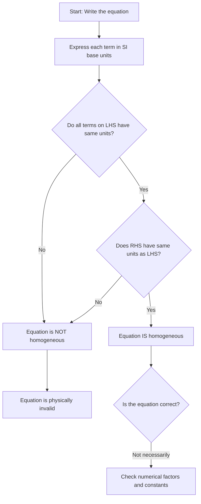

# 1. Overview / 概述

**English:**
Homogeneity of physical equations is a fundamental concept in A-Level Physics that allows you to check whether an equation is physically plausible without performing any calculations. The principle states that every term in a valid physical equation must have the same base units — you cannot add, subtract, or equate quantities with different physical dimensions. This concept bridges [[SI Base Units and Derived Units]] with practical equation verification, and is essential for deriving new formulas, spotting errors in calculations, and understanding why certain equations "work" physically. It forms the mathematical foundation for all subsequent topics in mechanics, electricity, and thermal physics.

**中文:**
物理方程的齐次性是A-Level物理中的一个基础概念，它允许你在不进行任何计算的情况下检查一个方程在物理上是否合理。该原理指出，一个有效的物理方程中的每一项都必须具有相同的基本单位——你不能将具有不同物理量纲的量相加、相减或相等。这个概念将[[SI Base Units and Derived Units|SI基本单位和导出单位]]与实际的方程验证联系起来，对于推导新公式、发现计算错误以及理解为什么某些方程在物理上"成立"至关重要。它构成了力学、电学和热物理学中所有后续主题的数学基础。

---

# 2. Syllabus Learning Objectives / 考纲学习目标

| CAIE 9702 | Edexcel IAL |
|-----------|-------------|
| 1.1 Understand the concept of homogeneity of physical equations | WPH11 U1: 1.1 Use SI units and prefixes consistently |
| 1.2 Check the homogeneity of equations using base units | WPH11 U1: 1.2 Check the homogeneity of equations |
| 1.3 Understand why homogeneity is necessary but not sufficient | WPH11 U1: 1.3 Apply dimensional analysis to verify equations |

**Examiner Expectations / 考官期望:**
- **English:** You must be able to express any physical quantity in terms of SI base units (kg, m, s, A, K, mol, cd), then compare the units on both sides of an equation. You should also understand that homogeneity is a necessary condition for an equation to be correct, but not sufficient — a homogeneous equation may still have incorrect numerical factors.
- **中文:** 你必须能够用SI基本单位（kg、m、s、A、K、mol、cd）表示任何物理量，然后比较方程两边的单位。你还应该理解，齐次性是方程正确的必要条件，但不是充分条件——一个齐次的方程可能仍然有错误的数值系数。

---

# 3. Core Definitions / 核心定义

| Term (EN/CN) | Definition (EN) | Definition (CN) | Common Mistakes / 常见错误 |
|--------------|-----------------|-----------------|---------------------------|
| **Homogeneity** / 齐次性 | The property that every term in a physical equation has the same base units | 物理方程中每一项都具有相同基本单位的性质 | Confusing homogeneity with numerical equality — units must match, not just numbers |
| **Base Units** / 基本单位 | The seven fundamental SI units from which all other units are derived | 七个基本的SI单位，所有其他单位都由其导出 | Forgetting that radians are dimensionless but still have units |
| **Dimensional Analysis** / 量纲分析 | The process of checking equations by comparing the dimensions (base units) of each term | 通过比较每一项的量纲（基本单位）来检查方程的过程 | Thinking dimensional analysis can verify numerical constants |
| **Derived Unit** / 导出单位 | A unit formed by combining base units (e.g., N = kg·m·s⁻²) | 由基本单位组合而成的单位（例如，N = kg·m·s⁻²） | Incorrectly simplifying units (e.g., forgetting that J = N·m = kg·m²·s⁻²) |
| **Dimensionless Quantity** / 无量纲量 | A quantity with no physical units (e.g., angle in radians, refractive index) | 没有物理单位的量（例如，弧度角、折射率） | Treating dimensionless quantities as having no effect on homogeneity checks |

---

# 4. Key Concepts Explained / 关键概念详解

## 4.1 The Principle of Homogeneity / 齐次性原理

### Explanation / 解释
**English:**
The principle of homogeneity states that in any valid physical equation, every term must have the same base units. This means:
- You can only add or subtract quantities that have identical units (e.g., velocity + velocity is valid, but velocity + acceleration is not)
- Both sides of an equation must have identical units
- The argument of mathematical functions (sin, cos, ln, exp) must be dimensionless

For example, in the equation $v = u + at$:
- $v$ (velocity) has units of m·s⁻¹
- $u$ (initial velocity) has units of m·s⁻¹
- $at$ (acceleration × time) has units of (m·s⁻²)(s) = m·s⁻¹
- All terms have the same units → the equation is homogeneous

**中文:**
齐次性原理指出，在任何有效的物理方程中，每一项都必须具有相同的基本单位。这意味着：
- 你只能加减具有相同单位的量（例如，速度+速度是有效的，但速度+加速度无效）
- 方程的两边必须具有相同的单位
- 数学函数（sin、cos、ln、exp）的参数必须是无量纲的

例如，在方程 $v = u + at$ 中：
- $v$（速度）的单位是 m·s⁻¹
- $u$（初速度）的单位是 m·s⁻¹
- $at$（加速度×时间）的单位是 (m·s⁻²)(s) = m·s⁻¹
- 所有项都具有相同的单位 → 该方程是齐次的

### Physical Meaning / 物理意义
**English:**
The physical meaning of homogeneity is that you cannot compare or combine quantities that measure fundamentally different physical properties. You cannot add a length to a time, or equate a force to an energy — they describe different aspects of reality. Homogeneity ensures that equations respect the physical nature of the quantities involved.

**中文:**
齐次性的物理意义是，你不能比较或组合测量根本不同物理性质的量。你不能将长度与时间相加，也不能将力与能量相等——它们描述了现实的不同方面。齐次性确保方程尊重所涉及量的物理性质。

### Common Misconceptions / 常见误区
- **English:**
  - "If an equation is homogeneous, it must be correct" — FALSE. Homogeneity is necessary but not sufficient. The equation $v = u + 2at$ is homogeneous but has the wrong numerical factor.
  - "Constants like $G$ or $k$ have no units" — FALSE. Physical constants have units that must be included in homogeneity checks.
  - "Radians have no units, so they can be ignored" — PARTIALLY TRUE. Radians are dimensionless, but they still appear in equations and must be handled correctly.

- **中文:**
  - "如果一个方程是齐次的，它一定是正确的"——错误。齐次性是必要的但不是充分的。方程 $v = u + 2at$ 是齐次的，但数值系数错误。
  - "像 $G$ 或 $k$ 这样的常数没有单位"——错误。物理常数有单位，必须在齐次性检查中包括。
  - "弧度没有单位，所以可以忽略"——部分正确。弧度是无量纲的，但它们仍然出现在方程中，必须正确处理。

### Exam Tips / 考试提示
- **English:** Always write down the base units of every term explicitly. Use a systematic approach: (1) Write the equation, (2) Replace each quantity with its base units, (3) Simplify using exponent rules, (4) Compare both sides.
- **中文:** 始终明确写出每一项的基本单位。使用系统方法：(1) 写出方程，(2) 用基本单位替换每个量，(3) 使用指数规则简化，(4) 比较两边。

> 📷 **IMAGE PROMPT — HOM-01: Homogeneity Check Flowchart**
> A step-by-step flowchart showing the process of checking homogeneity: Start → Write equation → Express each term in base units → Simplify → Compare LHS and RHS → Decision: Homogeneous or Not. Use clear boxes and arrows with labels in English.

---

# 5. Essential Equations / 核心公式

## 5.1 Base Unit Representation / 基本单位表示

$$ [Quantity] = \text{kg}^a \cdot \text{m}^b \cdot \text{s}^c \cdot \text{A}^d \cdot \text{K}^e \cdot \text{mol}^f \cdot \text{cd}^g $$

| Symbol (符号) | Meaning (EN) | Meaning (CN) | Unit (单位) |
|--------------|-------------|-------------|------------|
| $a, b, c, d, e, f, g$ | Exponents of base units | 基本单位的指数 | dimensionless |
| $[\text{Quantity}]$ | Base unit representation | 基本单位表示 | varies |

**Derivation / 推导:** This is the general form for expressing any physical quantity in terms of the seven SI base units.

**Conditions / 适用条件:**
- **English:** Applies to all physical quantities. For dimensionless quantities, all exponents are zero.
- **中文:** 适用于所有物理量。对于无量纲量，所有指数为零。

**Limitations / 局限性:**
- **English:** Does not account for numerical factors or constants. Two quantities with the same base units may still be physically different (e.g., torque and energy both have units of N·m = kg·m²·s⁻²).
- **中文:** 不考虑数值系数或常数。具有相同基本单位的两个量在物理上可能仍然不同（例如，力矩和能量都具有 N·m = kg·m²·s⁻² 的单位）。

## 5.2 Common Derived Units in Base Form / 常见导出单位的基本形式

| Derived Unit | Symbol | Base Units |
|-------------|--------|------------|
| Force (Newton) | N | kg·m·s⁻² |
| Energy (Joule) | J | kg·m²·s⁻² |
| Power (Watt) | W | kg·m²·s⁻³ |
| Pressure (Pascal) | Pa | kg·m⁻¹·s⁻² |
| Electric Charge (Coulomb) | C | A·s |
| Electric Potential (Volt) | V | kg·m²·s⁻³·A⁻¹ |
| Resistance (Ohm) | Ω | kg·m²·s⁻³·A⁻² |

> 📋 **CIE Only:** CIE expects you to know the base units of all common derived units. Pay special attention to the volt (V) and ohm (Ω) as they appear frequently in electricity questions.

> 📋 **Edexcel Only:** Edexcel may ask you to derive the base units of less common quantities like magnetic flux (Wb) or inductance (H).

---

# 6. Graphs and Relationships / 图表与关系

## 6.1 Homogeneity Check Decision Tree / 齐次性检查决策树

### Axes / 坐标轴
- **English:** Not applicable — this is a decision tree, not a graph.
- **中文:** 不适用——这是一个决策树，不是图表。

### Shape / 形状
- **English:** Tree structure with branches for "Yes" and "No" decisions.
- **中文:** 树形结构，带有"是"和"否"的分支。

### Exam Interpretation / 考试解读
- **English:** Use this decision tree to systematically check any equation. Start at the top and follow the branches based on your analysis.
- **中文:** 使用这个决策树系统地检查任何方程。从顶部开始，根据你的分析沿着分支进行。



---

# 7. Required Diagrams / 必备图表

## 7.1 Homogeneity Check Worked Example Diagram / 齐次性检查示例图

### Description / 描述
**English:** A step-by-step visual showing how to check the homogeneity of the equation $E_k = \frac{1}{2}mv^2$ (kinetic energy). Each step shows the substitution of base units and simplification.

**中文:** 一个逐步的视觉展示，显示如何检查方程 $E_k = \frac{1}{2}mv^2$（动能）的齐次性。每一步都显示基本单位的代入和简化。

### Image Prompt / 图片生成提示
> 📷 **IMAGE PROMPT — HOM-02: Homogeneity Check for Kinetic Energy**
> A clean, educational diagram showing four steps: Step 1: Write equation Ek = 1/2 mv². Step 2: Replace Ek with J = kg·m²·s⁻², m with kg, v² with (m·s⁻¹)². Step 3: Simplify RHS: kg × m²·s⁻² = kg·m²·s⁻². Step 4: Compare LHS = kg·m²·s⁻², RHS = kg·m²·s⁻² → Homogeneous. Use color coding: LHS in blue, RHS in green, units in red. Clean white background, suitable for A-Level physics textbook.

### Labels Required / 需要标注
- **English:** LHS (Left-Hand Side), RHS (Right-Hand Side), Base Units, Simplified Form, Homogeneous ✓
- **中文:** 左边 (LHS), 右边 (RHS), 基本单位, 简化形式, 齐次 ✓

### Exam Importance / 考试重要性
- **English:** High — this is the most common type of homogeneity question in exams. Understanding this example prepares you for similar checks with force, energy, pressure, and electrical equations.
- **中文:** 高——这是考试中最常见的齐次性问题类型。理解这个示例为你检查力、能量、压力和电学方程做好了准备。

---

# 8. Worked Examples / 典型例题

## Example 1: Checking Homogeneity of an Equation / 检查方程的齐次性

### Question / 题目
**English:**
Check whether the equation $P = \rho g h$ is homogeneous, where $P$ is pressure, $\rho$ is density, $g$ is acceleration due to gravity, and $h$ is height.

**中文:**
检查方程 $P = \rho g h$ 是否齐次，其中 $P$ 是压强，$\rho$ 是密度，$g$ 是重力加速度，$h$ 是高度。

### Solution / 解答

**Step 1: Write the equation and identify units / 写出方程并确定单位**

$$P = \rho g h$$

- $P$ (pressure / 压强) = Pa = kg·m⁻¹·s⁻²
- $\rho$ (density / 密度) = kg·m⁻³
- $g$ (acceleration due to gravity / 重力加速度) = m·s⁻²
- $h$ (height / 高度) = m

**Step 2: Express RHS in base units / 用基本单位表示右边**

$$\text{RHS} = \rho \times g \times h = (\text{kg·m}^{-3}) \times (\text{m·s}^{-2}) \times (\text{m})$$

**Step 3: Simplify / 简化**

$$\text{RHS} = \text{kg} \times \text{m}^{-3} \times \text{m} \times \text{m} \times \text{s}^{-2} = \text{kg} \times \text{m}^{-1} \times \text{s}^{-2}$$

$$\text{RHS} = \text{kg·m}^{-1}\text{·s}^{-2}$$

**Step 4: Compare with LHS / 与左边比较**

$$\text{LHS} = P = \text{kg·m}^{-1}\text{·s}^{-2}$$
$$\text{RHS} = \text{kg·m}^{-1}\text{·s}^{-2}$$

**Step 5: Conclusion / 结论**

Both sides have the same base units → The equation is homogeneous.

### Final Answer / 最终答案
**Answer:** The equation $P = \rho g h$ is homogeneous. | **答案：** 方程 $P = \rho g h$ 是齐次的。

### Quick Tip / 提示
- **English:** Remember that the numerical constant (like the 1 in this case) does not affect homogeneity — only the units matter.
- **中文：** 记住数值常数（比如这里的1）不影响齐次性——只有单位重要。

---

## Example 2: Checking Homogeneity with a Trigonometric Function / 检查包含三角函数的方程齐次性

### Question / 题目
**English:**
Check whether the equation $s = u t + \frac{1}{2} a t^2$ is homogeneous, where $s$ is displacement, $u$ is initial velocity, $a$ is acceleration, and $t$ is time.

**中文:**
检查方程 $s = u t + \frac{1}{2} a t^2$ 是否齐次，其中 $s$ 是位移，$u$ 是初速度，$a$ 是加速度，$t$ 是时间。

### Solution / 解答

**Step 1: Write the equation / 写出方程**

$$s = u t + \frac{1}{2} a t^2$$

**Step 2: Express each term in base units / 用基本单位表示每一项**

- $s$ (displacement / 位移) = m
- $u t$ (initial velocity × time / 初速度×时间) = (m·s⁻¹)(s) = m
- $\frac{1}{2} a t^2$ (½ × acceleration × time² / ½ × 加速度 × 时间²) = (m·s⁻²)(s²) = m

**Step 3: Compare terms / 比较各项**

- Term 1 ($s$): m
- Term 2 ($ut$): m
- Term 3 ($\frac{1}{2}at^2$): m

All terms have units of metres → The equation is homogeneous.

### Final Answer / 最终答案
**Answer:** The equation $s = ut + \frac{1}{2}at^2$ is homogeneous. | **答案：** 方程 $s = ut + \frac{1}{2}at^2$ 是齐次的。

### Quick Tip / 提示
- **English:** When checking equations with multiple terms on one side, check that ALL terms have the same units, not just the overall LHS vs RHS.
- **中文：** 当检查一边有多个项的方程时，检查所有项是否具有相同的单位，而不仅仅是左边整体与右边比较。

---

# 9. Past Paper Question Types / 历年真题题型

| Question Type / 题型 | Frequency / 频率 | Difficulty / 难度 | Past Paper References / 真题索引 |
|----------------------|------------------|------------------|-------------------------------|
| Check homogeneity of a given equation | Very High | Easy | 📝 *待填入* |
| Derive base units of a derived quantity | High | Medium | 📝 *待填入* |
| Determine whether an equation could be correct based on homogeneity | Medium | Medium | 📝 *待填入* |
| Explain why homogeneity is necessary but not sufficient | Low | Medium | 📝 *待填入* |
| Find the missing exponent in an equation using homogeneity | Low | Hard | 📝 *待填入* |

**Common Command Words / 常见指令词:**
- **English:** "Show that", "Check", "Determine", "Verify", "Explain why", "Deduce"
- **中文：** "证明"，"检查"，"确定"，"验证"，"解释为什么"，"推导"

---

# 10. Practical Skills Connections / 实验技能链接

**English:**
Homogeneity of equations connects to practical work in several ways:

1. **Error Checking:** When you derive an equation from experimental data, you can use homogeneity to check if your derived relationship is physically plausible before testing it numerically.

2. **Graph Analysis:** When plotting graphs to determine relationships (e.g., $T^2$ vs $L$ for a pendulum), the gradient's units can be checked for homogeneity with the expected theoretical relationship.

3. **Uncertainty Analysis:** Understanding units helps in propagating uncertainties correctly — you can only add uncertainties for quantities with the same units.

4. **Experimental Design:** Before conducting an experiment, checking the homogeneity of your proposed equation helps ensure you're measuring the right quantities.

**中文:**
方程的齐次性在多个方面与实验工作相关：

1. **错误检查：** 当你从实验数据推导出方程时，可以在数值测试之前使用齐次性检查你的推导关系在物理上是否合理。

2. **图表分析：** 当绘制图表以确定关系时（例如，摆的 $T^2$ 与 $L$），斜率的单位可以与预期的理论关系进行齐次性检查。

3. **不确定度分析：** 理解单位有助于正确传播不确定度——你只能对具有相同单位的量相加不确定度。

4. **实验设计：** 在进行实验之前，检查你提出的方程的齐次性有助于确保你测量的是正确的量。

---

# 11. Concept Map / 概念图谱

```mermaid
graph TD
    %% Homogeneity of Physical Equations - Concept Map
    HOM[Homogeneity of Equations] --> PRIN[Principle: All terms must have same base units]
    HOM --> CHECK[Checking Process]
    HOM --> IMPORT[Importance]
    
    PRIN --> BASE[SI Base Units<br/>kg, m, s, A, K, mol, cd]
    PRIN --> DERIVED[Derived Units<br/>N, J, W, Pa, V, Ω]
    PRIN --> DIMLESS[Dimensionless Quantities<br/>radians, refractive index]
    
    CHECK --> STEP1[Step 1: Write equation]
    CHECK --> STEP2[Step 2: Express in base units]
    CHECK --> STEP3[Step 3: Simplify using exponents]
    CHECK --> STEP4[Step 4: Compare LHS and RHS]
    
    STEP2 --> UNIT_TABLE[[SI Base Units and Derived Units]]
    STEP3 --> EXP_RULES[Exponent Rules<br/>a^m × a^n = a^(m+n)]
    
    IMPORT --> NECESSARY[Necessary condition<br/>for correctness]
    IMPORT --> NOT_SUFFICIENT[Not sufficient<br/>numerical factors may be wrong]
    IMPORT --> ERROR_CHECK[Error checking<br/>in calculations]
    
    NECESSARY --> EX1[Example: v = u + at ✓]
    NOT_SUFFICIENT --> EX2[Example: v = u + 2at<br/>Homogeneous but wrong factor]
    
    HOM --> RELATED[[Uncertainties and Errors]]
    HOM --> GRAPH[[Graph Plotting Skills]]
```

---

# 12. Quick Revision Sheet / 速查表

| Category / 类别 | Key Points / 要点 |
|----------------|------------------|
| **Definition / 定义** | Every term in a valid physical equation must have the same base units / 有效物理方程中的每一项必须具有相同的基本单位 |
| **Key Formula / 核心公式** | $[Quantity] = \text{kg}^a \cdot \text{m}^b \cdot \text{s}^c \cdot \text{A}^d \cdot \text{K}^e \cdot \text{mol}^f \cdot \text{cd}^g$ |
| **Key Graph / 核心图表** | Decision tree for homogeneity check (see Section 6.1) / 齐次性检查决策树（见第6.1节） |
| **Exam Tip / 考试提示** | Always write units explicitly; check ALL terms on both sides; remember constants like ½ don't affect homogeneity / 始终明确写出单位；检查两边的所有项；记住像½这样的常数不影响齐次性 |
| **Common Mistake / 常见错误** | Thinking homogeneity guarantees correctness — it only guarantees physical plausibility / 认为齐次性保证正确性——它只保证物理合理性 |
| **Must-Know Units / 必须知道的单位** | N = kg·m·s⁻², J = kg·m²·s⁻², W = kg·m²·s⁻³, Pa = kg·m⁻¹·s⁻², V = kg·m²·s⁻³·A⁻¹, Ω = kg·m²·s⁻³·A⁻² |
| **Quick Check / 快速检查** | Can you add/subtract these quantities? If yes, they have same units. Can you equate them? If yes, equation may be homogeneous. / 你能加减这些量吗？如果可以，它们有相同的单位。你能使它们相等吗？如果可以，方程可能是齐次的。 |