# 1. Overview / 概述

**English:**
This sub-topic introduces the **International System of Units (SI)** — the foundation of all physical measurements. You will learn the **seven SI base units** (kilogram, metre, second, ampere, kelvin, mole, candela) and how **derived units** are formed by combining base units. Understanding this system is essential for [[Homogeneity of Physical Equations]], [[Dimensional Analysis]], and [[Converting Between Units]]. Every physical quantity you encounter in A-Level Physics — from force to electric field strength — can be expressed in terms of these base units. This knowledge ensures you can check the consistency of equations and communicate measurements universally.

**中文:**
本子知识点介绍**国际单位制（SI）**——所有物理测量的基础。你将学习**七个SI基本单位**（千克、米、秒、安培、开尔文、摩尔、坎德拉）以及**导出单位**如何通过组合基本单位形成。理解这一体系对于[[Homogeneity of Physical Equations|物理方程的量纲齐次性]]、[[Dimensional Analysis|量纲分析]]和[[Converting Between Units|单位换算]]至关重要。你在A-Level物理中遇到的每一个物理量——从力到电场强度——都可以用这些基本单位表示。掌握这些知识可以确保你检查方程的一致性并实现测量的通用交流。

---

# 2. Syllabus Learning Objectives / 考纲学习目标

| CAIE 9702 | Edexcel IAL |
|-----------|-------------|
| 1.1 Understand that all physical quantities consist of a numerical magnitude and a unit | WPH11/1.1 Know the seven SI base units and their symbols |
| 1.2 Recall the seven SI base units and their symbols (kg, m, s, A, K, mol, cd) | WPH11/1.2 Understand derived units and express them in terms of base units |
| 1.3 Derive units of derived quantities from base units | WPH11/1.3 Use prefixes (pico to tera) with SI units |
| — | WPH11/1.4 Convert between different units |
| — | WPH11/1.5 Check homogeneity of equations using base units |
| — | WPH11/1.6 Understand the difference between scalar and vector quantities |

**Examiner Expectations / 考官期望:**
- **English:** You must memorise all seven base units and their symbols. You must be able to derive the base units of any derived quantity (e.g., force = kg·m·s⁻²). You must be able to check if an equation is homogeneous by comparing base units on both sides.
- **中文:** 你必须记住所有七个基本单位及其符号。你必须能够推导任何导出量的基本单位（例如，力 = kg·m·s⁻²）。你必须能够通过比较方程两边的基本单位来检查方程是否齐次。

---

# 3. Core Definitions / 核心定义

| Term (EN/CN) | Definition (EN) | Definition (CN) | Common Mistakes / 常见错误 |
|--------------|-----------------|-----------------|---------------------------|
| **SI Base Unit** / 国际单位制基本单位 | One of seven fundamental units from which all other SI units are derived | 七个基本单位之一，所有其他SI单位由此导出 | Confusing base units with derived units (e.g., thinking Newton is a base unit) |
| **Derived Unit** / 导出单位 | A unit formed by combining base units using multiplication or division | 通过乘法或除法组合基本单位形成的单位 | Forgetting to include all base units (e.g., writing N = kg·m/s² instead of kg·m·s⁻²) |
| **Physical Quantity** / 物理量 | A property of a physical phenomenon that can be measured and expressed as a numerical value with a unit | 物理现象的可测量属性，用数值和单位表示 | Omitting the unit when stating a quantity |
| **Homogeneity** / 齐次性 | The property of an equation where both sides have the same base units | 方程两边具有相同基本单位的性质 | Checking only numbers, not units |
| **Prefix** / 词头 | A symbol added before a unit to indicate a multiple or fraction of that unit (e.g., kilo = 10³) | 加在单位前的符号，表示该单位的倍数或分数 | Misplacing decimal points when converting |

---

# 4. Key Concepts Explained / 关键概念详解

## 4.1 The Seven SI Base Units / 七个SI基本单位

### Explanation / 解释
**English:**
The International System of Units (SI) defines **seven base units** that are dimensionally independent. Every other physical unit can be expressed as a combination of these seven. The table below shows each base unit, its symbol, and the physical quantity it measures.

| Base Quantity | Base Unit | Symbol |
|---------------|-----------|--------|
| Mass | kilogram | kg |
| Length | metre | m |
| Time | second | s |
| Electric Current | ampere | A |
| Temperature | kelvin | K |
| Amount of Substance | mole | mol |
| Luminous Intensity | candela | cd |

**中文:**
国际单位制（SI）定义了**七个基本单位**，它们在量纲上相互独立。所有其他物理单位都可以表示为这七个单位的组合。下表显示了每个基本单位、其符号以及所测量的物理量。

| 基本量 | 基本单位 | 符号 |
|--------|----------|------|
| 质量 | 千克 | kg |
| 长度 | 米 | m |
| 时间 | 秒 | s |
| 电流 | 安培 | A |
| 温度 | 开尔文 | K |
| 物质的量 | 摩尔 | mol |
| 发光强度 | 坎德拉 | cd |

### Physical Meaning / 物理意义
**English:** These seven units are the "building blocks" of all measurements in physics. They are defined by fundamental physical constants (e.g., the second is defined by the frequency of caesium-133 radiation). This ensures measurements are consistent worldwide.
**中文:** 这七个单位是物理学中所有测量的"积木"。它们由基本物理常数定义（例如，秒由铯-133辐射的频率定义）。这确保了全球测量的一致性。

### Common Misconceptions / 常见误区
- ❌ **"Newton is a base unit"** — No! Newton (N) is a derived unit: N = kg·m·s⁻²
- ❌ **"Celsius is an SI unit"** — No! The SI unit for temperature is kelvin (K), not °C
- ❌ **"Gram is the base unit for mass"** — No! The base unit is kilogram (kg), not gram (g)
- ❌ **"All units with special names are base units"** — No! Units like joule (J), watt (W), volt (V) are all derived

### Exam Tips / 考试提示
- **English:** Memorise the seven base units as a mnemonic: "**K**ing **M**ary **S**ells **A**pples **K**indly **M**ost **C**arefully" → kg, m, s, A, K, mol, cd
- **中文:** 用口诀记忆七个基本单位："**千**克 **米** **秒** **安**培 **开**尔文 **摩**尔 **坎**德拉"

> 📷 **IMAGE PROMPT — SI-01: The Seven SI Base Units Visual**
> A clean, educational infographic showing the seven SI base units arranged in a circle. Each unit has its symbol (kg, m, s, A, K, mol, cd) in bold, with a simple icon representing the physical quantity (a weight for mass, a ruler for length, a clock for time, a lightning bolt for current, a thermometer for temperature, a beaker for amount of substance, a lightbulb for luminous intensity). The background is white with a subtle grid pattern. Style: minimalist, textbook-quality, suitable for A-Level physics revision.

---

## 4.2 Derived Units / 导出单位

### Explanation / 解释
**English:**
A **derived unit** is formed by combining two or more base units using multiplication or division. For example:
- **Area** = length × length → m × m = m²
- **Speed** = distance ÷ time → m ÷ s = m·s⁻¹
- **Force** = mass × acceleration → kg × (m·s⁻²) = kg·m·s⁻² = N (newton)

Many derived units have **special names** (e.g., newton, joule, watt, volt, ohm). However, you must always be able to express them in terms of base units for [[Homogeneity of Physical Equations|homogeneity checks]].

**中文:**
**导出单位**是通过乘法或除法组合两个或多个基本单位形成的。例如：
- **面积** = 长度 × 长度 → m × m = m²
- **速度** = 距离 ÷ 时间 → m ÷ s = m·s⁻¹
- **力** = 质量 × 加速度 → kg × (m·s⁻²) = kg·m·s⁻² = N（牛顿）

许多导出单位有**专用名称**（例如，牛顿、焦耳、瓦特、伏特、欧姆）。但是，你必须始终能够用基本单位表示它们，以便进行[[Homogeneity of Physical Equations|齐次性检查]]。

### Common Derived Units Table / 常见导出单位表

| Derived Quantity | Special Name | Symbol | In Base Units |
|-----------------|--------------|--------|---------------|
| Force | newton | N | kg·m·s⁻² |
| Energy | joule | J | kg·m²·s⁻² |
| Power | watt | W | kg·m²·s⁻³ |
| Pressure | pascal | Pa | kg·m⁻¹·s⁻² |
| Electric Charge | coulomb | C | A·s |
| Electric Potential | volt | V | kg·m²·s⁻³·A⁻¹ |
| Resistance | ohm | Ω | kg·m²·s⁻³·A⁻² |
| Frequency | hertz | Hz | s⁻¹ |

### Physical Meaning / 物理意义
**English:** Derived units allow us to express complex physical relationships concisely. For example, saying "force = 10 N" is much simpler than "force = 10 kg·m·s⁻²". However, the base unit form reveals the underlying physics: force involves mass, length, and time.
**中文:** 导出单位使我们能够简洁地表达复杂的物理关系。例如，说"力 = 10 N"比"力 = 10 kg·m·s⁻²"简单得多。然而，基本单位形式揭示了潜在的物理本质：力涉及质量、长度和时间。

### Common Misconceptions / 常见误区
- ❌ **"Joule and newton are the same"** — No! J = N·m = kg·m²·s⁻², while N = kg·m·s⁻²
- ❌ **"Hertz is a base unit"** — No! Hz = s⁻¹, it's derived from the base unit second
- ❌ **"Pascal is just pressure"** — Yes, but in base units: Pa = kg·m⁻¹·s⁻²

### Exam Tips / 考试提示
- **English:** When deriving base units, start from the defining equation. For example, pressure = force/area → Pa = N/m² = (kg·m·s⁻²)/m² = kg·m⁻¹·s⁻²
- **中文:** 推导基本单位时，从定义方程开始。例如，压强 = 力/面积 → Pa = N/m² = (kg·m·s⁻²)/m² = kg·m⁻¹·s⁻²

---

# 5. Essential Equations / 核心公式

## 5.1 Deriving Base Units from Defining Equations / 从定义方程推导基本单位

$$ \text{Derived Unit} = \frac{\text{Product of base units in numerator}}{\text{Product of base units in denominator}} $$

**Example for Force:**
$$ F = ma \implies [F] = [m][a] = \text{kg} \times \text{m·s}^{-2} = \text{kg·m·s}^{-2} $$

**Example for Energy:**
$$ E = Fd \implies [E] = [F][d] = (\text{kg·m·s}^{-2}) \times \text{m} = \text{kg·m}^2\text{·s}^{-2} $$

| Symbol (符号) | Meaning (EN) | Meaning (CN) | Unit (单位) |
|--------------|-------------|-------------|------------|
| [F] | Base units of force | 力的基本单位 | kg·m·s⁻² |
| [E] | Base units of energy | 能量的基本单位 | kg·m²·s⁻² |
| [P] | Base units of power | 功率的基本单位 | kg·m²·s⁻³ |
| [p] | Base units of pressure | 压强的基单位 | kg·m⁻¹·s⁻² |

**Derivation / 推导:**
To find base units of any derived quantity:
1. Write the defining equation for that quantity
2. Replace each quantity with its base unit
3. Simplify using algebra

**Conditions / 适用条件:**
- **English:** Works for all physical quantities that have a defining equation. Some quantities (like luminous intensity) are base quantities themselves.
- **中文:** 适用于所有有定义方程的物理量。有些量（如发光强度）本身就是基本量。

**Limitations / 局限性:**
- **English:** Does not account for dimensionless constants (e.g., π, e). These have no units.
- **中文:** 不考虑无量纲常数（如π、e）。这些没有单位。

> 📷 **IMAGE PROMPT — SI-02: Deriving Base Units Flowchart**
> A flowchart showing the step-by-step process of deriving base units. Start with "Physical Quantity" → "Write defining equation" → "Replace with base units" → "Simplify algebraically" → "Final base unit expression". Example shown: Force → F = ma → kg × m·s⁻² → kg·m·s⁻². Clean, educational style with arrows and boxes. Suitable for A-Level physics revision poster.

---

# 6. Graphs and Relationships / 图表与关系

## 6.1 Relationship Between Base and Derived Units / 基本单位与导出单位的关系

### Axes / 坐标轴
- **English:** X-axis: Physical Quantity (categorical); Y-axis: Number of base units involved
- **中文:** X轴：物理量（分类）；Y轴：涉及的基本单位数量

### Shape / 形状
- **English:** A bar chart showing base quantities (1 base unit each) vs derived quantities (2+ base units)
- **中文:** 柱状图，显示基本量（各1个基本单位）与导出量（2个以上基本单位）

### Gradient Meaning / 斜率含义
- **English:** Not applicable (categorical data)
- **中文:** 不适用（分类数据）

### Area Meaning / 面积含义
- **English:** Not applicable
- **中文:** 不适用

### Exam Interpretation / 考试解读
- **English:** Understand that base quantities are the "simplest" — they cannot be broken down further. Derived quantities are combinations.
- **中文:** 理解基本量是"最简单的"——不能再分解。导出量是组合。

---

# 7. Required Diagrams / 必备图表

## 7.1 SI Unit Hierarchy Diagram / SI单位层级图

### Description / 描述
**English:** A hierarchical diagram showing the seven base units at the top, with derived units branching below. Each derived unit shows its base unit composition.
**中文:** 层级图，顶部显示七个基本单位，导出单位分支在下方。每个导出单位显示其基本单位组成。

### Image Prompt / 图片生成提示
> 📷 **IMAGE PROMPT — SI-03: SI Unit Hierarchy Tree**
> A tree diagram with "SI Base Units" at the top. Seven branches lead to the seven base units: kg, m, s, A, K, mol, cd. Below each base unit, derived units that use it are shown. For example, under "kg" and "m" and "s": N (kg·m·s⁻²), J (kg·m²·s⁻²), W (kg·m²·s⁻³), Pa (kg·m⁻¹·s⁻²). Under "A" and "s": C (A·s), V (kg·m²·s⁻³·A⁻¹), Ω (kg·m²·s⁻³·A⁻²). Clean, textbook-style diagram with color coding: base units in blue, derived units in green. White background.

### Labels Required / 需要标注
- **English:** Each base unit with its symbol and quantity name; each derived unit with its special name, symbol, and base unit expression
- **中文:** 每个基本单位及其符号和量名称；每个导出单位及其专用名称、符号和基本单位表达式

### Exam Importance / 考试重要性
- **English:** High — understanding this hierarchy is essential for homogeneity checks and dimensional analysis
- **中文:** 高——理解这一层级对于齐次性检查和量纲分析至关重要

---

## 7.2 Derived Unit Derivation Example / 导出单位推导示例

### Description / 描述
**English:** A step-by-step visual showing how to derive the base units of pressure (pascal) from its defining equation.
**中文:** 逐步可视化，展示如何从定义方程推导压强（帕斯卡）的基本单位。

### Image Prompt / 图片生成提示
> 📷 **IMAGE PROMPT — SI-04: Deriving Pascal Base Units**
> A four-step visual: Step 1: "Pressure = Force / Area" with equation. Step 2: "Force = mass × acceleration" → N = kg·m·s⁻². Step 3: "Area = length × length" → m². Step 4: "Pa = N/m² = (kg·m·s⁻²)/m² = kg·m⁻¹·s⁻²". Each step in a separate box with arrows connecting them. Clean, educational style with blue and green color coding. White background.

### Labels Required / 需要标注
- **English:** Each step numbered; final answer highlighted
- **中文:** 每一步编号；最终答案高亮

### Exam Importance / 考试重要性
- **English:** Very high — this exact process is tested in both CAIE and Edexcel exams
- **中文:** 非常高——这一过程在CAIE和Edexcel考试中都会考到

---

# 8. Worked Examples / 典型例题

## Example 1: Deriving Base Units of Electric Field Strength / 推导电场强度的基本单位

### Question / 题目
**English:**
Electric field strength $E$ is defined as force per unit charge: $E = \frac{F}{Q}$. Given that force $F$ has base units $\text{kg·m·s}^{-2}$ and charge $Q$ has base units $\text{A·s}$, derive the base units of electric field strength.

**中文:**
电场强度 $E$ 定义为每单位电荷所受的力：$E = \frac{F}{Q}$。已知力 $F$ 的基本单位为 $\text{kg·m·s}^{-2}$，电荷 $Q$ 的基本单位为 $\text{A·s}$，推导电场强度的基本单位。

### Solution / 解答

**Step 1:** Write the defining equation.
$$ E = \frac{F}{Q} $$

**Step 2:** Replace each quantity with its base units.
$$ [E] = \frac{\text{kg·m·s}^{-2}}{\text{A·s}} $$

**Step 3:** Simplify using algebra.
$$ [E] = \text{kg·m·s}^{-2} \times \text{A}^{-1}\text{·s}^{-1} $$
$$ [E] = \text{kg·m·s}^{-3}\text{·A}^{-1} $$

### Final Answer / 最终答案
**Answer:** $\text{kg·m·s}^{-3}\text{·A}^{-1}$ | **答案：** $\text{kg·m·s}^{-3}\text{·A}^{-1}$

### Quick Tip / 提示
- **English:** Always write negative exponents for units in the denominator. For example, write $\text{s}^{-2}$ not $1/\text{s}^2$.
- **中文:** 分母中的单位始终写为负指数。例如，写 $\text{s}^{-2}$ 而不是 $1/\text{s}^2$。

---

## Example 2: Checking Homogeneity Using Base Units / 用基本单位检查齐次性

### Question / 题目
**English:**
A student proposes the equation $v^2 = u^2 + 2as$ for motion with constant acceleration. Use base units to check if this equation is homogeneous. ($v$ and $u$ are velocities, $a$ is acceleration, $s$ is displacement)

**中文:**
一个学生提出了匀加速运动的方程 $v^2 = u^2 + 2as$。使用基本单位检查该方程是否齐次。（$v$ 和 $u$ 是速度，$a$ 是加速度，$s$ 是位移）

### Solution / 解答

**Step 1:** Find base units of each term.

Left-hand side: $v^2$
- $v$ has units $\text{m·s}^{-1}$
- $v^2$ has units $(\text{m·s}^{-1})^2 = \text{m}^2\text{·s}^{-2}$

Right-hand side: $u^2 + 2as$
- $u^2$ has units $(\text{m·s}^{-1})^2 = \text{m}^2\text{·s}^{-2}$
- $2as$: $a$ has units $\text{m·s}^{-2}$, $s$ has units $\text{m}$
- $2as$ has units $(\text{m·s}^{-2})(\text{m}) = \text{m}^2\text{·s}^{-2}$

**Step 2:** Compare both sides.
- LHS: $\text{m}^2\text{·s}^{-2}$
- RHS: $\text{m}^2\text{·s}^{-2} + \text{m}^2\text{·s}^{-2} = \text{m}^2\text{·s}^{-2}$

**Step 3:** Conclusion.
Both sides have the same base units. The equation is **homogeneous**.

### Final Answer / 最终答案
**Answer:** The equation is homogeneous. | **答案：** 该方程是齐次的。

### Quick Tip / 提示
- **English:** The constant "2" in $2as$ is dimensionless — it does not affect the units. Only check the units of the physical quantities.
- **中文:** $2as$ 中的常数"2"是无量纲的——它不影响单位。只检查物理量的单位。

---

# 9. Past Paper Question Types / 历年真题题型

| Question Type / 题型 | Frequency / 频率 | Difficulty / 难度 | Past Paper References / 真题索引 |
|----------------------|------------------|------------------|-------------------------------|
| State the seven SI base units | High (every year) | Easy | 📝 *待填入* |
| Derive base units of a given derived quantity | High (every year) | Medium | 📝 *待填入* |
| Check homogeneity of an equation using base units | High (every year) | Medium | 📝 *待填入* |
| Identify which quantity is a base quantity | Medium | Easy | 📝 *待填入* |
| Convert between units using prefixes | Medium | Medium | 📝 *待填入* |

**Common Command Words / 常见指令词:**
- **English:** "State", "Derive", "Show that", "Determine", "Check", "Verify"
- **中文:** "陈述"、"推导"、"证明"、"确定"、"检查"、"验证"

---

# 10. Practical Skills Connections / 实验技能链接

**English:**
Understanding SI units is fundamental to all practical work in physics:
- **Measurements:** All measurements must be recorded with correct SI units (e.g., length in metres, time in seconds)
- **Uncertainties:** When calculating uncertainties, ensure all quantities are in consistent SI units before combining
- **Graph Plotting:** Axes must be labelled with quantity and unit (e.g., "Force / N" or "Force (N)")
- **Experimental Design:** Choosing appropriate instruments depends on understanding unit scales (e.g., using micrometres for small lengths)
- **Data Analysis:** When using formulas, check that all quantities are in SI units to avoid conversion errors

**中文:**
理解SI单位对于所有物理实验工作至关重要：
- **测量：** 所有测量必须记录正确的SI单位（例如，长度以米为单位，时间以秒为单位）
- **不确定度：** 计算不确定度时，确保所有量在组合前使用一致的SI单位
- **绘图：** 坐标轴必须标注量和单位（例如，"力 / N"或"力 (N)"）
- **实验设计：** 选择合适的仪器取决于理解单位量级（例如，小长度使用千分尺）
- **数据分析：** 使用公式时，检查所有量是否使用SI单位，以避免转换错误

---

# 11. Concept Map / 概念图谱

```mermaid
graph TD
    %% SI Base Units and Derived Units Concept Map
    SI["SI Units"] --> Base["SI Base Units"]
    SI --> Derived["Derived Units"]
    
    Base --> kg["kilogram (kg) - Mass"]
    Base --> m["metre (m) - Length"]
    Base --> s["second (s) - Time"]
    Base --> A["ampere (A) - Current"]
    Base --> K["kelvin (K) - Temperature"]
    Base --> mol["mole (mol) - Amount"]
    Base --> cd["candela (cd) - Luminous Intensity"]
    
    Derived --> N["Newton (N) = kg·m·s⁻²"]
    Derived --> J["Joule (J) = kg·m²·s⁻²"]
    Derived --> W["Watt (W) = kg·m²·s⁻³"]
    Derived --> Pa["Pascal (Pa) = kg·m⁻¹·s⁻²"]
    Derived --> C["Coulomb (C) = A·s"]
    Derived --> V["Volt (V) = kg·m²·s⁻³·A⁻¹"]
    Derived --> Ohm["Ohm (Ω) = kg·m²·s⁻³·A⁻²"]
    Derived --> Hz["Hertz (Hz) = s⁻¹"]
    
    SI --> Prefixes["SI Prefixes"]
    Prefixes --> p["pico (10⁻¹²)"]
    Prefixes --> n["nano (10⁻⁹)"]
    Prefixes --> mu["micro (10⁻⁶)"]
    Prefixes --> m["milli (10⁻³)"]
    Prefixes --> k["kilo (10³)"]
    Prefixes --> M["mega (10⁶)"]
    Prefixes --> G["giga (10⁹)"]
    Prefixes --> T["tera (10¹²)"]
    
    SI --> Homogeneity["Homogeneity of Equations"]
    Homogeneity --> Check["Compare base units on both sides"]
    
    SI --> Dimensional["Dimensional Analysis"]
    
    style SI fill:#4a90d9,color:#fff
    style Base fill:#2ecc71,color:#fff
    style Derived fill:#e74c3c,color:#fff
    style Prefixes fill:#f39c12,color:#fff
    style Homogeneity fill:#9b59b6,color:#fff
    style Dimensional fill:#1abc9c,color:#fff
```

---

# 12. Quick Revision Sheet / 速查表

| Category / 类别 | Key Points / 要点 |
|----------------|------------------|
| **Definition / 定义** | SI has 7 base units: kg, m, s, A, K, mol, cd. All other units are derived. |
| **Key Formula / 核心公式** | Derived unit = combination of base units using × and ÷. Example: N = kg·m·s⁻² |
| **Key Graph / 核心图表** | Hierarchy tree: Base units at top → Derived units below with base unit expressions |
| **Exam Tip / 考试提示** | Always write negative exponents for denominator units. Check homogeneity by comparing base units on both sides of equation. |
| **Common Mistake / 常见错误** | Confusing base and derived units (N is derived, not base). Forgetting to include all base units in derived expressions. |
| **Mnemonic / 记忆口诀** | "King Mary Sells Apples Kindly Most Carefully" → kg, m, s, A, K, mol, cd |
| **Practical Link / 实验联系** | Always record measurements with correct SI units. Label graph axes with quantity/unit. |
| **Past Paper Focus / 真题重点** | Deriving base units (every year). Checking homogeneity (every year). |