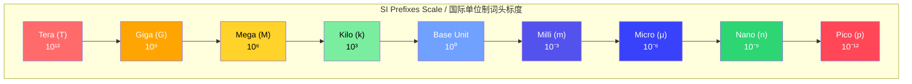
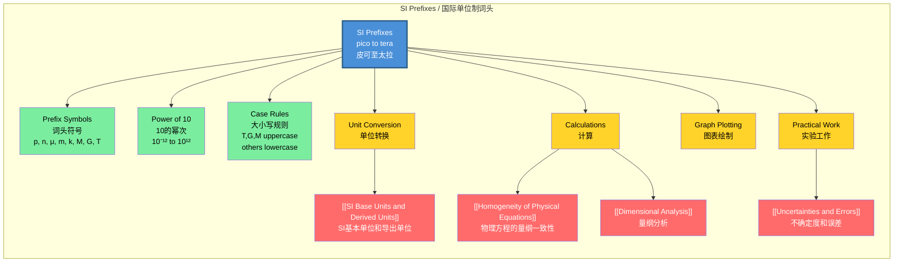

# SI Prefixes (pico to tera) / 国际单位制词头（皮可至太拉）

---

# 1. Overview / 概述

**English:**
SI prefixes are a fundamental tool in physics that allow us to express very large or very small quantities in a compact, standardized way. This sub-topic covers the range of prefixes from pico ($10^{-12}$) to tera ($10^{12}$), which are essential for working with measurements across all areas of physics. Understanding these prefixes is crucial for converting between units, performing calculations correctly, and interpreting scientific data. This knowledge forms the foundation for [[SI Base Units and Derived Units]] and is a prerequisite for [[Homogeneity of Physical Equations]] and [[Converting Between Units]].

**中文:**
国际单位制词头是物理学中的基本工具，使我们能够以简洁、标准化的方式表达非常大或非常小的量。本子知识点涵盖从皮可（$10^{-12}$）到太拉（$10^{12}$）的词头范围，这对于在所有物理领域中进行测量、正确进行计算以及解释科学数据至关重要。理解这些词头是掌握[[SI Base Units and Derived Units]]的基础，也是学习[[Homogeneity of Physical Equations]]和[[Converting Between Units]]的前提。

---

# 2. Syllabus Learning Objectives / 考纲学习目标

| CAIE 9702 | Edexcel IAL |
|-----------|-------------|
| 1.1 Understand the use of SI prefixes (pico to tera) | WPH11 U1: 1.1 Know the SI prefixes from pico to tera |
| 1.2 Convert between units using prefixes | WPH11 U1: 1.2 Use prefixes in calculations |
| 1.3 Apply prefixes in physical equations | WPH11 U1: 1.3 Convert between different units |

**Examiner Expectations / 考官期望:**
- **English:** Students must be able to recall all prefixes from pico to tera, convert between units with prefixes, and apply them correctly in calculations. Common errors include misplacing decimal points and confusing prefixes like milli and micro.
- **中文:** 学生必须能够记住从皮可到太拉的所有词头，在带词头的单位之间进行转换，并在计算中正确应用。常见错误包括小数点位置错误以及混淆毫和微等词头。

---

# 3. Core Definitions / 核心定义

| Term (EN/CN) | Definition (EN) | Definition (CN) | Common Mistakes / 常见错误 |
|--------------|-----------------|-----------------|---------------------------|
| **SI Prefix** / 国际单位制词头 | A symbol placed before a base unit to indicate a specific power of 10 multiplier | 放在基本单位前的符号，表示特定的10的幂次倍数 | Confusing prefix with the unit itself (e.g., writing "k" instead of "kg") |
| **Tera (T)** / 太拉 | Prefix meaning $10^{12}$ or 1,000,000,000,000 | 表示$10^{12}$或1,000,000,000,000的词头 | Forgetting that T is uppercase, t is tonne |
| **Giga (G)** / 吉咖 | Prefix meaning $10^{9}$ or 1,000,000,000 | 表示$10^{9}$或1,000,000,000的词头 | Confusing G with g (grams) |
| **Mega (M)** / 兆 | Prefix meaning $10^{6}$ or 1,000,000 | 表示$10^{6}$或1,000,000的词头 | Using lowercase m instead of uppercase M |
| **Kilo (k)** / 千 | Prefix meaning $10^{3}$ or 1,000 | 表示$10^{3}$或1,000的词头 | Writing K (uppercase) instead of k (lowercase) |
| **Milli (m)** / 毫 | Prefix meaning $10^{-3}$ or 0.001 | 表示$10^{-3}$或0.001的词头 | Confusing with micro (μ) |
| **Micro (μ)** / 微 | Prefix meaning $10^{-6}$ or 0.000001 | 表示$10^{-6}$或0.000001的词头 | Writing u instead of μ; confusing with milli |
| **Nano (n)** / 纳 | Prefix meaning $10^{-9}$ or 0.000000001 | 表示$10^{-9}$或0.000000001的词头 | Confusing n with μ |
| **Pico (p)** / 皮可 | Prefix meaning $10^{-12}$ or 0.000000000001 | 表示$10^{-12}$或0.000000000001的词头 | Confusing p with n |

---

# 4. Key Concepts Explained / 关键概念详解

## 4.1 The Prefix System / 词头系统

### Explanation / 解释
**English:**
SI prefixes follow a systematic pattern where each prefix represents a power of 10. The prefixes from pico to tera cover 24 orders of magnitude ($10^{-12}$ to $10^{12}$). Each step between adjacent prefixes typically represents a factor of 1000 (3 orders of magnitude), except for centi ($10^{-2}$) and deci ($10^{-1}$) which are less commonly used in A-Level physics. The prefixes are always written in lowercase except for T (tera), G (giga), and M (mega), which use uppercase letters. This system is essential for [[Converting Between Units]] and understanding [[SI Base Units and Derived Units]].

**中文:**
国际单位制词头遵循系统化的模式，每个词头代表一个10的幂次。从皮可到太拉的词头覆盖了24个数量级（$10^{-12}$到$10^{12}$）。相邻词头之间的步长通常代表1000倍（3个数量级），但厘（$10^{-2}$）和分（$10^{-1}$）除外，它们在A-Level物理中较少使用。词头通常用小写字母书写，但太拉（T）、吉咖（G）和兆（M）使用大写字母。这个系统对于[[Converting Between Units]]和理解[[SI Base Units and Derived Units]]至关重要。

### Physical Meaning / 物理意义
**English:**
Prefixes allow us to express measurements in convenient numbers. For example, instead of writing 0.000000001 meters, we write 1 nanometer (1 nm). This makes calculations and comparisons much easier. The choice of prefix depends on the typical scale of the quantity being measured — for example, atomic distances use nanometers or picometers, while distances between cities use kilometers.

**中文:**
词头使我们能够用方便的数字表达测量值。例如，与其写0.000000001米，不如写1纳米（1 nm）。这使得计算和比较更加容易。词头的选择取决于被测量量的典型尺度——例如，原子距离使用纳米或皮米，而城市之间的距离使用千米。

### Common Misconceptions / 常见误区
- **English:**
  - Thinking that all prefixes use lowercase letters (T, G, M are uppercase)
  - Confusing milli (m, $10^{-3}$) with micro (μ, $10^{-6}$)
  - Forgetting that 1 km = 1000 m, not 100 m
  - Writing "k" as uppercase "K" for kilo
  - Confusing "n" (nano) with "μ" (micro)
- **中文:**
  - 认为所有词头都使用小写字母（T、G、M是大写）
  - 混淆毫（m，$10^{-3}$）和微（μ，$10^{-6}$）
  - 忘记1 km = 1000 m，而不是100 m
  - 将千的符号"k"写成大写"K"
  - 混淆"n"（纳）和"μ"（微）

### Exam Tips / 考试提示
- **English:**
  - Memorize the prefix table in order — it helps with conversions
  - When converting, always write the number in standard form first
  - Check whether the prefix should be uppercase or lowercase
  - Practice converting between prefixes (e.g., mm to μm)
- **中文:**
  - 按顺序记忆词头表——有助于转换
  - 转换时，先将数字写成标准形式
  - 检查词头应该大写还是小写
  - 练习在词头之间转换（例如，mm到μm）

> 📷 **IMAGE PROMPT — PREFIX-SCALE: SI Prefix Scale Diagram**
> A visual scale showing the SI prefixes from pico ($10^{-12}$) to tera ($10^{12}$) arranged on a logarithmic scale. Each prefix is shown with its symbol, name, and power of 10. The scale should clearly show the factor of 1000 between adjacent prefixes. Include real-world examples: picometer (atomic nucleus), nanometer (DNA helix), micrometer (bacteria), millimeter (ant), meter (human height), kilometer (city distance), megameter (Earth diameter), gigameter (Sun diameter), terameter (astronomical unit). Use a clean, educational style with color coding for different magnitude ranges.

---

# 5. Essential Equations / 核心公式

## 5.1 Prefix Conversion Formula / 词头转换公式

$$ \text{Value in new unit} = \text{Value in old unit} \times \frac{10^{\text{old prefix exponent}}}{10^{\text{new prefix exponent}}} $$

| Symbol (符号) | Meaning (EN) | Meaning (CN) | Unit (单位) |
|--------------|-------------|-------------|------------|
| $10^{\text{prefix exponent}}$ | Power of 10 represented by the prefix | 词头代表的10的幂次 | dimensionless (无量纲) |

**Derivation / 推导:**
This formula comes from the fact that prefixes are multipliers. For example, to convert 5 km to m: $5 \text{ km} = 5 \times 10^3 \text{ m} = 5000 \text{ m}$.

**Conditions / 适用条件:**
- **English:** Works for all SI prefixes. Ensure you use the correct exponent (positive for large prefixes, negative for small prefixes).
- **中文:** 适用于所有国际单位制词头。确保使用正确的指数（大词头为正，小词头为负）。

**Limitations / 局限性:**
- **English:** Only works for linear conversions. Does not apply to squared or cubed units without modification (e.g., $1 \text{ km}^2 = 10^6 \text{ m}^2$, not $10^3 \text{ m}^2$).
- **中文:** 仅适用于线性转换。未经修改不适用于平方或立方单位（例如，$1 \text{ km}^2 = 10^6 \text{ m}^2$，而不是$10^3 \text{ m}^2$）。

## 5.2 Area/Volume Conversion / 面积/体积转换

For squared units:
$$ 1 \text{ km}^2 = (10^3)^2 \text{ m}^2 = 10^6 \text{ m}^2 $$

For cubed units:
$$ 1 \text{ km}^3 = (10^3)^3 \text{ m}^3 = 10^9 \text{ m}^3 $$

| Symbol (符号) | Meaning (EN) | Meaning (CN) | Unit (单位) |
|--------------|-------------|-------------|------------|
| $(\text{prefix})^2$ | Square of the prefix multiplier | 词头倍数的平方 | e.g., $\text{m}^2$ |
| $(\text{prefix})^3$ | Cube of the prefix multiplier | 词头倍数的立方 | e.g., $\text{m}^3$ |

**Conditions / 适用条件:**
- **English:** Apply the exponent to the prefix multiplier, not just the unit.
- **中文:** 将指数应用于词头倍数，而不仅仅是单位。

> 📷 **IMAGE PROMPT — AREA-CONVERSION: Area Unit Conversion Diagram**
> A diagram showing how to convert 1 km² to m². Show a square with side length 1 km, then divide it into 1000 m × 1000 m grid, resulting in 1,000,000 m². Include the calculation: 1 km² = (1000 m)² = 1,000,000 m². Use arrows and labels to show the conversion process.

---

# 6. Graphs and Relationships / 图表与关系

## 6.1 Prefix Magnitude Comparison / 词头量级比较

### Axes / 坐标轴
- **X-axis:** Prefix name (categorical) / 词头名称（分类变量）
- **Y-axis:** Power of 10 (logarithmic scale) / 10的幂次（对数坐标）

### Shape / 形状
**English:** A bar chart or point plot showing the power of 10 for each prefix, arranged in order from pico ($10^{-12}$) to tera ($10^{12}$). The values increase by a factor of 1000 between adjacent prefixes.

**中文:** 柱状图或点图，显示每个词头的10的幂次，按从皮可（$10^{-12}$）到太拉（$10^{12}$）的顺序排列。相邻词头之间的值增加1000倍。

### Gradient Meaning / 斜率含义
**English:** Not applicable for categorical data. The "step" between prefixes represents a factor of 1000.

**中文:** 不适用于分类数据。词头之间的"步长"代表1000倍。

### Area Meaning / 面积含义
**English:** Not applicable.

**中文:** 不适用。

### Exam Interpretation / 考试解读
**English:** Students should be able to read values from such a graph and understand the relative magnitudes. For example, 1 mm is 1000 times larger than 1 μm.

**中文:** 学生应能从此类图表中读取数值并理解相对量级。例如，1 mm比1 μm大1000倍。

---

# 7. Required Diagrams / 必备图表

## 7.1 SI Prefix Table / 国际单位制词头表

### Description / 描述
**English:** A comprehensive table showing all SI prefixes from pico to tera, including their symbols, names, powers of 10, and real-world examples.

**中文:** 一个全面的表格，显示从皮可到太拉的所有国际单位制词头，包括它们的符号、名称、10的幂次和实际应用示例。

### Image Prompt / 图片生成提示
> 📷 **IMAGE PROMPT — PREFIX-TABLE: Complete SI Prefix Table**
> A clean, educational table showing SI prefixes from pico (10⁻¹²) to tera (10¹²). Columns: Prefix Symbol, Prefix Name, Power of 10, Decimal Form, Example. Rows for: p (pico, 10⁻¹², 0.000000000001, atomic nucleus diameter), n (nano, 10⁻⁹, 0.000000001, DNA helix width), μ (micro, 10⁻⁶, 0.000001, bacteria length), m (milli, 10⁻³, 0.001, ant length), base unit (10⁰, 1, human height), k (kilo, 10³, 1000, city distance), M (mega, 10⁶, 1,000,000, Earth diameter), G (giga, 10⁹, 1,000,000,000, Sun diameter), T (tera, 10¹², 1,000,000,000,000, astronomical unit). Use color coding: red for large prefixes (T, G, M), blue for small prefixes (m, μ, n, p), green for base. Include a note about uppercase/lowercase rules.

### Labels Required / 需要标注
- **English:** Prefix symbol, prefix name, power of 10, decimal form, example application
- **中文:** 词头符号、词头名称、10的幂次、十进制形式、应用示例

### Exam Importance / 考试重要性
- **English:** High — this table is essential for all unit conversions and calculations throughout the A-Level course.
- **中文:** 高——此表格对于整个A-Level课程中的所有单位转换和计算至关重要。

---

# 8. Worked Examples / 典型例题

## Example 1: Converting Between Prefixes / 在词头之间转换

### Question / 题目
**English:**
Convert 2500 micrometers (μm) to millimeters (mm).

**中文:**
将2500微米（μm）转换为毫米（mm）。

### Solution / 解答

**Step 1: Identify the prefixes / 步骤1：确定词头**
- Micro (μ) = $10^{-6}$
- Milli (m) = $10^{-3}$

**Step 2: Write the conversion factor / 步骤2：写出转换因子**
$$ 1 \text{ μm} = 10^{-6} \text{ m} $$
$$ 1 \text{ mm} = 10^{-3} \text{ m} $$

**Step 3: Set up the conversion / 步骤3：建立转换**
$$ 2500 \text{ μm} = 2500 \times 10^{-6} \text{ m} = 2.5 \times 10^{-3} \text{ m} $$

**Step 4: Convert to mm / 步骤4：转换为mm**
$$ 2.5 \times 10^{-3} \text{ m} = 2.5 \text{ mm} $$

**Alternative method / 替代方法:**
Since mm is $10^{-3}$ and μm is $10^{-6}$, the difference is $10^{-3} / 10^{-6} = 10^3 = 1000$.
So: $2500 \text{ μm} \div 1000 = 2.5 \text{ mm}$

### Final Answer / 最终答案
**Answer:** 2.5 mm | **答案：** 2.5 mm

### Quick Tip / 提示
**English:** When converting from a smaller prefix to a larger one (e.g., μm to mm), divide by the factor. When converting from larger to smaller, multiply.

**中文:** 从小词头转换到大词头时（例如，μm到mm），除以倍数。从大词头转换到小词头时，乘以倍数。

---

## Example 2: Prefixes in Area Calculations / 面积计算中的词头

### Question / 题目
**English:**
A rectangular field measures 2.5 km by 1.2 km. Calculate its area in:
(a) km²
(b) m²

**中文:**
一个矩形场地长2.5 km，宽1.2 km。计算其面积：
(a) km²
(b) m²

### Solution / 解答

**Part (a): Area in km² / 部分(a)：以km²为单位的面积**
$$ \text{Area} = 2.5 \text{ km} \times 1.2 \text{ km} = 3.0 \text{ km}^2 $$

**Part (b): Convert to m² / 部分(b)：转换为m²**
$$ 1 \text{ km} = 1000 \text{ m} = 10^3 \text{ m} $$
$$ 1 \text{ km}^2 = (10^3)^2 \text{ m}^2 = 10^6 \text{ m}^2 $$
$$ \text{Area} = 3.0 \times 10^6 \text{ m}^2 $$

**Alternative method / 替代方法:**
$$ \text{Area} = (2.5 \times 10^3 \text{ m}) \times (1.2 \times 10^3 \text{ m}) $$
$$ = 2.5 \times 1.2 \times 10^{3+3} \text{ m}^2 $$
$$ = 3.0 \times 10^6 \text{ m}^2 $$

### Final Answer / 最终答案
**Answer:** (a) 3.0 km², (b) 3.0 × 10⁶ m² | **答案：** (a) 3.0 km², (b) 3.0 × 10⁶ m²

### Quick Tip / 提示
**English:** Remember that when converting squared or cubed units, you must square or cube the prefix multiplier as well. Common mistake: $1 \text{ km}^2 \neq 1000 \text{ m}^2$.

**中文:** 记住，在转换平方或立方单位时，必须同时对词头倍数进行平方或立方运算。常见错误：$1 \text{ km}^2 \neq 1000 \text{ m}^2$。

---

# 9. Past Paper Question Types / 历年真题题型

| Question Type / 题型 | Frequency / 频率 | Difficulty / 难度 | Past Paper References / 真题索引 |
|----------------------|------------------|------------------|-------------------------------|
| Direct prefix conversion / 直接词头转换 | Very High / 非常高 | Easy / 简单 | 📝 *待填入* |
| Prefix in calculations / 计算中的词头 | High / 高 | Medium / 中等 | 📝 *待填入* |
| Area/volume unit conversion / 面积/体积单位转换 | Medium / 中等 | Medium-Hard / 中高 | 📝 *待填入* |
| Prefix in equations / 方程中的词头 | Medium / 中等 | Hard / 困难 | 📝 *待填入* |
| Multiple prefix conversions / 多重词头转换 | Low / 低 | Hard / 困难 | 📝 *待填入* |

**Common Command Words / 常见指令词:**
- **English:** Convert, Express, Calculate, Determine, Write, State
- **中文:** 转换、表达、计算、确定、写出、说明

---

# 10. Practical Skills Connections / 实验技能链接

**English:**
SI prefixes are essential in practical work for:
- **Measurements:** Using instruments with different scales (e.g., micrometer for μm, ruler for mm/cm, measuring tape for m)
- **Uncertainties:** When converting units, the absolute uncertainty must also be converted. For example, if a measurement is $25.0 \pm 0.1 \text{ mm}$, in meters it is $0.0250 \pm 0.0001 \text{ m}$
- **Graph Plotting:** Choosing appropriate units for axes to avoid very large or very small numbers. For example, using nm for wavelength instead of m
- **Experimental Design:** Selecting the right instrument based on the expected magnitude of the quantity

**中文:**
国际单位制词头在实验工作中至关重要：
- **测量：** 使用不同量程的仪器（例如，千分尺用于μm，直尺用于mm/cm，卷尺用于m）
- **不确定度：** 单位转换时，绝对不确定度也必须转换。例如，如果测量值为$25.0 \pm 0.1 \text{ mm}$，以米为单位则为$0.0250 \pm 0.0001 \text{ m}$
- **图表绘制：** 选择合适的单位作为坐标轴，避免数字过大或过小。例如，波长使用nm而不是m
- **实验设计：** 根据被测量量的预期量级选择合适的仪器

> 📋 **CIE Only:** In Paper 3 (Practical), you may be asked to convert measurements with prefixes before plotting graphs or calculating uncertainties.
> 
> 📋 **Edexcel Only:** In Unit 1 (WPH11), practical questions often require converting between prefixes when using data from different instruments.

---

# 11. Concept Map / 概念图谱

---

# 12. Quick Revision Sheet / 速查表

| Category / 类别 | Key Points / 要点 |
|----------------|------------------|
| **Definition / 定义** | SI prefixes are symbols placed before base units to indicate powers of 10 / 国际单位制词头是放在基本单位前的符号，表示10的幂次 |
| **Key Formula / 核心公式** | Conversion: multiply/divide by $10^{\text{difference in exponents}}$ / 转换：乘以/除以$10^{\text{指数差}}$ |
| **Key Graph / 核心图表** | Logarithmic scale showing prefixes from $10^{-12}$ to $10^{12}$ / 对数坐标显示从$10^{-12}$到$10^{12}$的词头 |
| **Exam Tip / 考试提示** | Always check uppercase/lowercase rules; remember to square/cube the prefix multiplier for area/volume / 始终检查大小写规则；记住面积/体积时要对词头倍数进行平方/立方 |
| **Common Mistake / 常见错误** | Confusing milli (m, $10^{-3}$) with micro (μ, $10^{-6}$); forgetting that 1 km² = $10^6$ m², not $10^3$ m² / 混淆毫（m，$10^{-3}$）和微（μ，$10^{-6}$）；忘记1 km² = $10^6$ m²，而不是$10^3$ m² |
| **Must Remember / 必须记住** | T ($10^{12}$), G ($10^9$), M ($10^6$), k ($10^3$), base ($10^0$), m ($10^{-3}$), μ ($10^{-6}$), n ($10^{-9}$), p ($10^{-12}$) |
| **Practical Link / 实验联系** | Choose appropriate prefixes for measurements; convert uncertainties when changing units / 为测量选择合适的词头；改变单位时转换不确定度 |

---

> **Related Leaf Nodes:** [[SI Base Units and Derived Units]], [[Homogeneity of Physical Equations]], [[Dimensional Analysis]], [[Converting Between Units]]
> 
> **Parent Hub:** [[SI Units, Prefixes and Homogeneity of Equations]]
> 
> **Related Topics:** [[Uncertainties and Errors]], [[Graph Plotting Skills]]