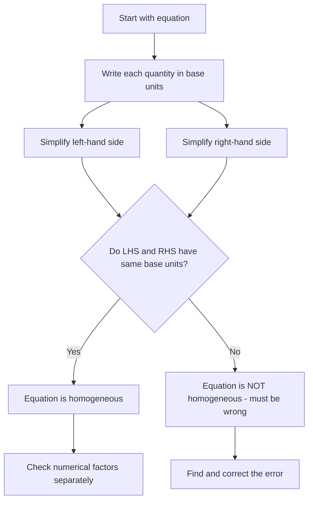
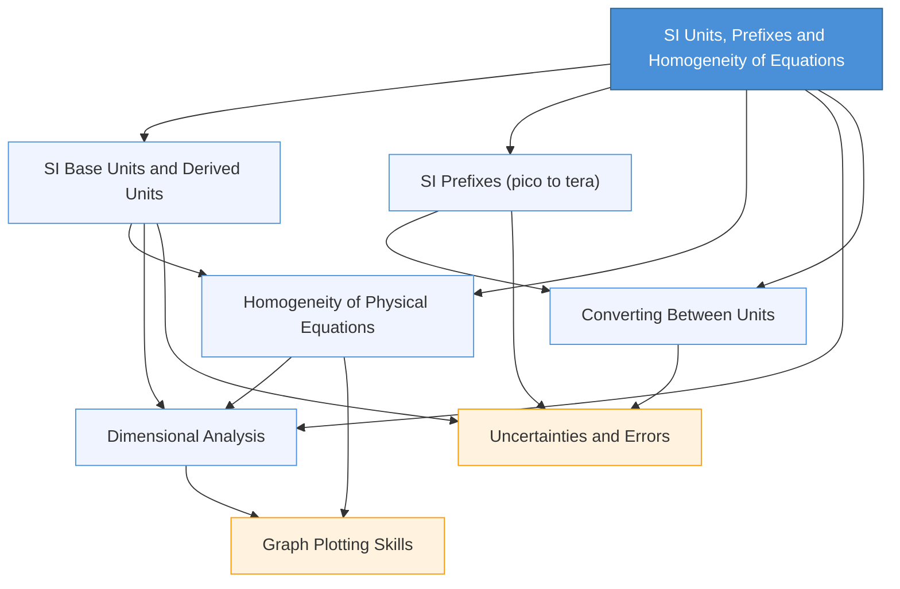

# SI Units, Prefixes and Homogeneity of Equations / 国际单位制、词头与方程量纲一致性

---

# 1. Overview / 概述

**English:**
This foundational topic introduces the International System of Units (SI), which provides a universal language for measurement in physics and all sciences. You will learn the seven base units from which all other physical quantities are derived, the standard prefixes used to express very large or very small quantities, and the critical skill of checking whether physical equations are dimensionally consistent (homogeneous). Understanding SI units and prefixes is essential for accurate calculation, data communication, and avoiding catastrophic unit errors in engineering and science. The homogeneity principle allows you to verify equations without memorising them, detect algebraic mistakes, and derive relationships between physical quantities. This topic underpins every subsequent chapter in A-Level Physics and is directly tested in both Cambridge 9702 Paper 1 (multiple choice) and Edexcel IAL Unit 1 (multiple choice and short answer). Real-world applications include converting between units in engineering (e.g., MPa to Pa), interpreting scientific data (e.g., nm for wavelengths), and checking the validity of new formulas in research.

**中文：**
本基础主题介绍国际单位制（SI），它为物理学及所有科学领域的测量提供了通用语言。你将学习七个基本单位（所有其他物理量均由它们导出）、用于表示极大或极小量的标准词头，以及检查物理方程是否量纲一致（齐次性）的关键技能。理解 SI 单位和词头对于准确计算、数据交流以及避免工程和科学中的灾难性单位错误至关重要。齐次性原理使您无需记忆方程即可验证方程、检测代数错误并推导物理量之间的关系。本主题是 A-Level 物理后续每一章的基础，并在剑桥 9702 试卷 1（选择题）和 Edexcel IAL 单元 1（选择题和简答题）中直接考查。实际应用包括工程中的单位换算（例如 MPa 到 Pa）、解释科学数据（例如 nm 表示波长）以及检查研究中新公式的有效性。

---

# 2. Syllabus Learning Objectives / 考纲学习目标

| CAIE 9702 (1.1–1.3) | Edexcel IAL (WPH11 U1: 1.1–1.6) |
|----------------------|----------------------------------|
| 1.1 Understand that all physical quantities consist of a numerical magnitude and a unit. | 1.1 Know that all physical quantities have a base unit. |
| 1.2 Recall the seven SI base units and their symbols (kg, m, s, A, K, mol, cd). | 1.2 Know the seven SI base units (kilogram, metre, second, ampere, kelvin, mole, candela). |
| 1.3 Use derived units as products or quotients of base units (e.g., N = kg m s⁻²). | 1.3 Use derived units expressed in terms of base units. |
| 1.4 Use SI prefixes (p, n, μ, m, c, d, k, M, G, T) and their symbols. | 1.4 Use SI prefixes (pico, nano, micro, milli, centi, deci, kilo, mega, giga, tera). |
| 1.5 Understand and use the concept of homogeneity of physical equations. | 1.5 Check the homogeneity of equations using base units. |
| 1.6 Check equations for dimensional consistency. | 1.6 Use dimensional analysis to derive relationships between physical quantities. |

**Examiner Expectations / 考官期望：**

**English:**
- Candidates must be able to recall all seven base units and their symbols without prompting.
- Candidates must be able to express any derived unit in terms of base units (e.g., the volt V = kg m² s⁻³ A⁻¹).
- Candidates must be able to convert between units using prefixes (e.g., 5.2 μs = 5.2 × 10⁻⁶ s).
- Candidates must be able to check whether an equation is homogeneous by substituting base units for each quantity.
- For Edexcel, candidates may be asked to use dimensional analysis to find the form of an unknown relationship.
- Common errors include confusing mass (kg) with weight (N), forgetting the ampere in electrical units, and incorrectly applying prefixes (e.g., 1 nm = 10⁻⁹ m, not 10⁻⁶ m).

**中文：**
- 考生必须能够不加提示地回忆所有七个基本单位及其符号。
- 考生必须能够用基本单位表示任何导出单位（例如，伏特 V = kg m² s⁻³ A⁻¹）。
- 考生必须能够使用词头进行单位换算（例如，5.2 μs = 5.2 × 10⁻⁶ s）。
- 考生必须能够通过将每个量的基本单位代入方程来检查方程是否齐次。
- 对于 Edexcel，考生可能需要使用量纲分析来找出未知关系的形式。
- 常见错误包括混淆质量（kg）和重量（N）、忘记电学单位中的安培以及错误应用词头（例如，1 nm = 10⁻⁹ m，而不是 10⁻⁶ m）。

> 📋 **CIE Only:** CAIE explicitly requires recall of the candela (cd) and mole (mol) as base units. Edexcel also requires them but places greater emphasis on the first five (kg, m, s, A, K).
>
> 📋 **Edexcel Only:** Edexcel explicitly includes "use dimensional analysis to derive relationships" (1.6), which is not separately listed in CAIE but is implied by homogeneity checks.

---

# 3. Core Definitions / 核心定义

| Term (EN/CN) | Definition (EN) | Definition (CN) | Common Mistakes / 常见错误 |
|--------------|-----------------|-----------------|---------------------------|
| **SI Base Unit / 国际单位制基本单位** | One of seven fundamental units from which all other SI units are derived. | 七个基本单位之一，所有其他 SI 单位均由它们导出。 | Confusing base units with derived units (e.g., thinking Newton is a base unit). |
| **Derived Unit / 导出单位** | A unit formed by combining base units through multiplication or division. | 通过乘除组合基本单位而形成的单位。 | Forgetting to include all base units (e.g., writing N = kg m/s² instead of kg m s⁻²). |
| **SI Prefix / 国际单位制词头** | A symbol added before a unit to indicate a power-of-ten multiple or submultiple. | 加在单位前的符号，表示十的幂次倍数或分数。 | Misplacing decimal points (e.g., 1 μs = 10⁻⁶ s, not 10⁻⁹ s). |
| **Homogeneity / 齐次性** | The property of a physical equation where both sides have the same base units (dimensions). | 物理方程两边具有相同基本单位（量纲）的性质。 | Thinking homogeneity guarantees correctness (it only checks dimensional consistency, not numerical accuracy). |
| **Dimensional Analysis / 量纲分析** | A method of checking equations or deriving relationships by comparing the dimensions (base units) of quantities. | 通过比较量的量纲（基本单位）来检查方程或推导关系的方法。 | Using dimensions incorrectly (e.g., treating dimensionless constants as having units). |
| **Magnitude / 数值大小** | The numerical value of a physical quantity, without the unit. | 物理量的数值，不含单位。 | Writing the unit inside the magnitude (e.g., "5 m" is correct; "5" alone is incomplete). |

---

# 4. Key Concepts Explained / 关键概念详解

## 4.1 The Seven SI Base Units / 七个 SI 基本单位

### Explanation / 解释
**English:**
The International System of Units (SI) defines seven base units, each corresponding to a fundamental physical quantity. These are the kilogram (mass), metre (length), second (time), ampere (electric current), kelvin (thermodynamic temperature), mole (amount of substance), and candela (luminous intensity). Every other physical unit in physics can be expressed as a combination of these seven. For example, the newton (force) is a derived unit: 1 N = 1 kg m s⁻². The joule (energy) is: 1 J = 1 kg m² s⁻². The volt (potential difference) is: 1 V = 1 kg m² s⁻³ A⁻¹. You must memorise the seven base units and their symbols, and be able to derive any other unit from them. This is tested directly in multiple-choice questions and is essential for homogeneity checks.

**中文：**
国际单位制（SI）定义了七个基本单位，每个对应一个基本物理量。它们是千克（质量）、米（长度）、秒（时间）、安培（电流）、开尔文（热力学温度）、摩尔（物质的量）和坎德拉（发光强度）。物理学中的每个其他物理单位都可以表示为这七个单位的组合。例如，牛顿（力）是一个导出单位：1 N = 1 kg m s⁻²。焦耳（能量）是：1 J = 1 kg m² s⁻²。伏特（电势差）是：1 V = 1 kg m² s⁻³ A⁻¹。你必须记住七个基本单位及其符号，并能够从它们推导出任何其他单位。这在选择题中直接考查，并且对于齐次性检查至关重要。

### Physical Meaning / 物理意义
**English:**
Base units represent the most fundamental measurable properties of the universe: how much matter (kg), how far (m), how long (s), how much electric charge flows (A), how hot (K), how many particles (mol), and how bright (cd). All other measurements are combinations of these.

**中文：**
基本单位代表了宇宙中最基本的可测量属性：多少物质（kg）、多远（m）、多长时间（s）、多少电荷流动（A）、多热（K）、多少粒子（mol）以及多亮（cd）。所有其他测量都是这些的组合。

### Common Misconceptions / 常见误区
- **English:** Thinking that the newton (N) is a base unit. It is derived from kg, m, and s.
- **中文：** 认为牛顿（N）是基本单位。它是由 kg、m 和 s 导出的。
- **English:** Forgetting the ampere (A) in electrical derived units like volt (V) or ohm (Ω).
- **中文：** 在电学导出单位如伏特（V）或欧姆（Ω）中忘记安培（A）。
- **English:** Confusing the kilogram (mass) with the newton (force/weight).
- **中文：** 混淆千克（质量）和牛顿（力/重量）。

### Exam Tips / 考试提示
**English:**
- Memorise the seven base units as a mnemonic: "King Henry Doesn't Usually Drink Cold Milk" (kg, m, s, A, K, cd, mol) — but note the order is not standard.
- For CAIE, be prepared to recall the candela and mole explicitly.
- For Edexcel, practice deriving units like the pascal (Pa = kg m⁻¹ s⁻²) and the watt (W = kg m² s⁻³).
- Always write derived units in terms of base units using negative indices (e.g., m s⁻², not m/s²).

**中文：**
- 用助记法记住七个基本单位："King Henry Doesn't Usually Drink Cold Milk"（kg, m, s, A, K, cd, mol）——但注意顺序不是标准的。
- 对于 CAIE，准备明确回忆坎德拉和摩尔。
- 对于 Edexcel，练习推导像帕斯卡（Pa = kg m⁻¹ s⁻²）和瓦特（W = kg m² s⁻³）这样的单位。
- 始终使用负指数用基本单位表示导出单位（例如，m s⁻²，而不是 m/s²）。

---

## 4.2 SI Prefixes / 国际单位制词头

### Explanation / 解释
**English:**
SI prefixes are symbols placed before a unit to indicate multiplication by a power of ten. The most common prefixes for A-Level Physics are: pico (p, 10⁻¹²), nano (n, 10⁻⁹), micro (μ, 10⁻⁶), milli (m, 10⁻³), centi (c, 10⁻²), deci (d, 10⁻¹), kilo (k, 10³), mega (M, 10⁶), giga (G, 10⁹), and tera (T, 10¹²). You must be able to convert between units with different prefixes, e.g., 5.2 μs = 5.2 × 10⁻⁶ s, or 3.0 × 10⁸ m = 300 Mm (megametres). Prefixes are essential for expressing very large (e.g., distance to stars in Tm) or very small (e.g., wavelength of light in nm) quantities conveniently.

**中文：**
SI 词头是放在单位前的符号，表示乘以十的幂次。A-Level 物理中最常见的词头是：皮（p, 10⁻¹²）、纳（n, 10⁻⁹）、微（μ, 10⁻⁶）、毫（m, 10⁻³）、厘（c, 10⁻²）、分（d, 10⁻¹）、千（k, 10³）、兆（M, 10⁶）、吉（G, 10⁹）和太（T, 10¹²）。你必须能够在具有不同词头的单位之间进行换算，例如，5.2 μs = 5.2 × 10⁻⁶ s，或 3.0 × 10⁸ m = 300 Mm。词头对于方便地表示非常大（例如，到恒星的距离用 Tm）或非常小（例如，光的波长用 nm）的量至关重要。

### Physical Meaning / 物理意义
**English:**
Prefixes allow us to avoid writing many zeros. For example, the diameter of a human hair is about 0.000 08 m = 80 μm. The distance from Earth to the Sun is about 150 000 000 000 m = 150 Gm. Using prefixes makes numbers easier to read, write, and compare.

**中文：**
词头使我们避免写很多零。例如，人类头发的直径约为 0.000 08 m = 80 μm。地球到太阳的距离约为 150 000 000 000 m = 150 Gm。使用词头使数字更易于阅读、书写和比较。

### Common Misconceptions / 常见误区
- **English:** Confusing milli (10⁻³) with micro (10⁻⁶) or nano (10⁻⁹). For example, 1 mm = 10⁻³ m, but 1 μm = 10⁻⁶ m.
- **中文：** 混淆毫（10⁻³）和微（10⁻⁶）或纳（10⁻⁹）。例如，1 mm = 10⁻³ m，但 1 μm = 10⁻⁶ m。
- **English:** Thinking that capital M means milli (it means mega, 10⁶). Lowercase m is milli.
- **中文：** 认为大写 M 表示毫（它表示兆，10⁶）。小写 m 是毫。
- **English:** Forgetting that prefixes apply to the entire unit, e.g., 1 km² = (10³ m)² = 10⁶ m², not 10³ m².
- **中文：** 忘记词头适用于整个单位，例如，1 km² = (10³ m)² = 10⁶ m²，而不是 10³ m²。

### Exam Tips / 考试提示
**English:**
- Memorise the prefix table in order: p, n, μ, m, c, d, k, M, G, T.
- Practice converting: 0.005 A = 5 mA; 2.5 × 10⁹ Hz = 2.5 GHz.
- Be careful with area and volume conversions: 1 cm² = 10⁻⁴ m²; 1 cm³ = 10⁻⁶ m³.
- In calculations, always convert to base units (e.g., m, s, kg) before substituting into formulas.

**中文：**
- 按顺序记住词头表：p, n, μ, m, c, d, k, M, G, T。
- 练习换算：0.005 A = 5 mA；2.5 × 10⁹ Hz = 2.5 GHz。
- 注意面积和体积换算：1 cm² = 10⁻⁴ m²；1 cm³ = 10⁻⁶ m³。
- 在计算中，始终在代入公式前转换为基本单位（例如，m、s、kg）。

---

## 4.3 Homogeneity of Physical Equations / 物理方程的齐次性

### Explanation / 解释
**English:**
A physical equation is said to be homogeneous (or dimensionally consistent) if both sides of the equation have the same base units. For example, consider the equation for kinetic energy: $E_k = \frac{1}{2}mv^2$. The left side (energy) has units of joules: J = kg m² s⁻². The right side: $\frac{1}{2}$ is dimensionless, mass m has units kg, and velocity squared v² has units (m s⁻¹)² = m² s⁻². So the right side has units kg × m² s⁻² = kg m² s⁻², which matches the left side. Therefore, the equation is homogeneous. If an equation is not homogeneous, it must be wrong. However, homogeneity does not guarantee correctness — a homogeneous equation could still have a wrong numerical factor (like $\frac{1}{2}$ instead of $\frac{1}{3}$). Homogeneity checks are used to detect algebraic errors and to derive the form of unknown relationships.

**中文：**
如果方程两边具有相同的基本单位，则该物理方程被称为齐次的（或量纲一致的）。例如，考虑动能方程：$E_k = \frac{1}{2}mv^2$。左边（能量）的单位是焦耳：J = kg m² s⁻²。右边：$\frac{1}{2}$ 是无量纲的，质量 m 的单位是 kg，速度平方 v² 的单位是 (m s⁻¹)² = m² s⁻²。所以右边的单位是 kg × m² s⁻² = kg m² s⁻²，与左边匹配。因此，该方程是齐次的。如果方程不齐次，则它必定是错误的。然而，齐次性并不能保证正确性——一个齐次方程仍可能有错误的数值因子（例如 $\frac{1}{2}$ 而不是 $\frac{1}{3}$）。齐次性检查用于检测代数错误和推导未知关系的形式。

### Physical Meaning / 物理意义
**English:**
Homogeneity reflects the fundamental principle that you can only add, subtract, or equate quantities that have the same physical nature. You cannot add metres to seconds, or equate energy to force. This is a powerful sanity check for any equation.

**中文：**
齐次性反映了基本原则：你只能加减或等于具有相同物理性质的量。你不能把米和秒相加，也不能把能量和力等同起来。这是任何方程的一个强大的合理性检查。

### Common Misconceptions / 常见误区
- **English:** Thinking that a homogeneous equation is always correct. It only checks units, not numerical factors.
- **中文：** 认为齐次方程总是正确的。它只检查单位，不检查数值因子。
- **English:** Forgetting to square or cube units when quantities are squared or cubed (e.g., v² has units m² s⁻², not m s⁻²).
- **中文：** 忘记在量被平方或立方时对单位进行平方或立方（例如，v² 的单位是 m² s⁻²，而不是 m s⁻²）。
- **English:** Ignoring dimensionless constants (like π, e, or numerical coefficients) — they have no units and do not affect homogeneity.
- **中文：** 忽略无量纲常数（如 π、e 或数值系数）——它们没有单位，不影响齐次性。

### Exam Tips / 考试提示
**English:**
- To check homogeneity, write each quantity in terms of base units (kg, m, s, A, K, mol, cd). Cancel common units on both sides.
- For CAIE, homogeneity questions often appear in Paper 1 (multiple choice) and Paper 2 (structured questions).
- For Edexcel, you may be asked to derive the units of a constant (e.g., the gravitational constant G) using homogeneity.
- Remember: angles (radians) are dimensionless; trigonometric functions (sin, cos, tan) and exponentials (e^x) are only valid for dimensionless arguments.

**中文：**
- 要检查齐次性，用基本单位（kg, m, s, A, K, mol, cd）写出每个量。在两边消去公共单位。
- 对于 CAIE，齐次性问题常出现在试卷 1（选择题）和试卷 2（结构化问题）中。
- 对于 Edexcel，你可能被要求使用齐次性推导常数的单位（例如，引力常数 G）。
- 记住：角度（弧度）是无量纲的；三角函数（sin, cos, tan）和指数函数（e^x）仅对无量纲参数有效。

---

## 4.4 Dimensional Analysis / 量纲分析

### Explanation / 解释
**English:**
Dimensional analysis extends the concept of homogeneity. Instead of using base units, we use dimensions: [M] for mass, [L] for length, [T] for time, [I] for electric current, [Θ] for temperature, [N] for amount of substance, and [J] for luminous intensity. For example, velocity has dimensions [L T⁻¹], acceleration [L T⁻²], force [M L T⁻²], and energy [M L² T⁻²]. Dimensional analysis can be used to derive the form of an unknown relationship. For example, if you hypothesise that the period T of a simple pendulum depends on length L and gravitational acceleration g, you can write T ∝ L^a g^b. Substituting dimensions: [T] = [L]^a [L T⁻²]^b = [L]^{a+b} [T]^{-2b}. Equating powers of [L] and [T]: for [L]: 0 = a + b; for [T]: 1 = -2b. Solving gives b = -1/2, a = 1/2, so T ∝ √(L/g). This is a powerful tool for deriving relationships without solving differential equations.

**中文：**
量纲分析扩展了齐次性的概念。我们使用量纲而不是基本单位：[M] 表示质量，[L] 表示长度，[T] 表示时间，[I] 表示电流，[Θ] 表示温度，[N] 表示物质的量，[J] 表示发光强度。例如，速度的量纲是 [L T⁻¹]，加速度是 [L T⁻²]，力是 [M L T⁻²]，能量是 [M L² T⁻²]。量纲分析可用于推导未知关系的形式。例如，如果你假设单摆的周期 T 取决于摆长 L 和重力加速度 g，你可以写出 T ∝ L^a g^b。代入量纲：[T] = [L]^a [L T⁻²]^b = [L]^{a+b} [T]^{-2b}。令 [L] 和 [T] 的幂相等：对于 [L]：0 = a + b；对于 [T]：1 = -2b。解得 b = -1/2，a = 1/2，所以 T ∝ √(L/g)。这是一个无需解微分方程即可推导关系的强大工具。

### Physical Meaning / 物理意义
**English:**
Dimensional analysis reveals the fundamental structure of physical laws. It shows which quantities can combine and how. It is used by physicists to check new theories and to design experiments.

**中文：**
量纲分析揭示了物理定律的基本结构。它显示了哪些量可以组合以及如何组合。物理学家用它来检查新理论和设计实验。

### Common Misconceptions / 常见误区
- **English:** Thinking dimensional analysis gives exact numerical factors. It only gives the form (e.g., T ∝ √(L/g)), not the constant (2π).
- **中文：** 认为量纲分析给出精确的数值因子。它只给出形式（例如，T ∝ √(L/g)），而不是常数（2π）。
- **English:** Forgetting that dimensionless quantities (like angle, strain, refractive index) have dimensions of [1] and do not affect the analysis.
- **中文：** 忘记无量纲量（如角度、应变、折射率）的量纲为 [1]，不影响分析。

### Exam Tips / 考试提示
**English:**
- For Edexcel, practice deriving relationships using dimensional analysis (e.g., the speed of sound in a gas depends on pressure and density).
- For CAIE, dimensional analysis is less explicitly tested but is useful for checking equations.
- Always write dimensions in square brackets: [M], [L], [T].
- When equating powers, set up simultaneous equations and solve.

**中文：**
- 对于 Edexcel，练习使用量纲分析推导关系（例如，气体中的声速取决于压力和密度）。
- 对于 CAIE，量纲分析的明确考查较少，但对检查方程很有用。
- 始终用方括号写量纲：[M]、[L]、[T]。
- 当令幂相等时，建立联立方程并求解。

---

## 4.5 Converting Between Units / 单位换算

### Explanation / 解释
**English:**
Converting between units involves multiplying by appropriate conversion factors. For example, to convert 5 km to m: 5 km × (1000 m / 1 km) = 5000 m. To convert 2 hours to seconds: 2 h × (3600 s / 1 h) = 7200 s. For compound units, convert each part separately. For example, to convert 72 km/h to m/s: 72 km/h × (1000 m / 1 km) × (1 h / 3600 s) = 20 m/s. For area and volume, remember that the conversion factor must be squared or cubed: 1 m² = (100 cm)² = 10 000 cm²; 1 m³ = (100 cm)³ = 1 000 000 cm³. Prefix conversions follow the same logic: 5 mA = 5 × 10⁻³ A; 3 GHz = 3 × 10⁹ Hz.

**中文：**
单位换算涉及乘以适当的换算因子。例如，将 5 km 转换为 m：5 km × (1000 m / 1 km) = 5000 m。将 2 小时转换为秒：2 h × (3600 s / 1 h) = 7200 s。对于复合单位，分别转换每个部分。例如，将 72 km/h 转换为 m/s：72 km/h × (1000 m / 1 km) × (1 h / 3600 s) = 20 m/s。对于面积和体积，记住换算因子必须平方或立方：1 m² = (100 cm)² = 10 000 cm²；1 m³ = (100 cm)³ = 1 000 000 cm³。词头换算遵循相同的逻辑：5 mA = 5 × 10⁻³ A；3 GHz = 3 × 10⁹ Hz。

### Physical Meaning / 物理意义
**English:**
Unit conversion is essential for comparing measurements made in different systems and for ensuring that calculations use consistent units. Many real-world errors (e.g., the Mars Climate Orbiter crash) have resulted from unit conversion mistakes.

**中文：**
单位换算对于比较不同系统进行的测量以及确保计算使用一致的单位至关重要。许多现实世界中的错误（例如，火星气候轨道器坠毁）都是由单位换算错误造成的。

### Common Misconceptions / 常见误区
- **English:** Forgetting to square or cube the conversion factor for area/volume (e.g., 1 m² = 100 cm² is wrong; it should be 10 000 cm²).
- **中文：** 忘记对面积/体积的换算因子进行平方或立方（例如，1 m² = 100 cm² 是错误的；应该是 10 000 cm²）。
- **English:** Confusing the direction of conversion (e.g., multiplying by 1000 when converting from m to km instead of dividing).
- **中文：** 混淆换算方向（例如，从 m 转换为 km 时乘以 1000 而不是除以 1000）。

### Exam Tips / 考试提示
**English:**
- Always write the conversion as a fraction equal to 1 (e.g., 1000 m / 1 km = 1) so you can cancel units.
- For speed conversions, remember: to convert km/h to m/s, divide by 3.6. To convert m/s to km/h, multiply by 3.6.
- For density conversions: 1 g/cm³ = 1000 kg/m³.
- Practice with mixed units (e.g., convert 5.2 × 10⁻⁴ m to μm: 5.2 × 10⁻⁴ m = 520 μm).

**中文：**
- 始终将换算写成一个等于 1 的分数（例如，1000 m / 1 km = 1），这样你可以消去单位。
- 对于速度换算，记住：将 km/h 转换为 m/s，除以 3.6。将 m/s 转换为 km/h，乘以 3.6。
- 对于密度换算：1 g/cm³ = 1000 kg/m³。
- 练习混合单位（例如，将 5.2 × 10⁻⁴ m 转换为 μm：5.2 × 10⁻⁴ m = 520 μm）。

---

# 5. Essential Equations / 核心公式

## 5.1 Base Unit Representation of Derived Units / 导出单位的基本单位表示

**Equation / 公式:**
$$ \text{Derived Unit} = \prod (\text{Base Unit})^{n} $$

**Variables / 变量:**
| Symbol (符号) | Meaning (EN) | Meaning (CN) | Unit (单位) |
|--------------|-------------|-------------|------------|
| N | Newton (force) | 牛顿（力） | kg m s⁻² |
| J | Joule (energy) | 焦耳（能量） | kg m² s⁻² |
| W | Watt (power) | 瓦特（功率） | kg m² s⁻³ |
| Pa | Pascal (pressure) | 帕斯卡（压强） | kg m⁻¹ s⁻² |
| V | Volt (potential difference) | 伏特（电势差） | kg m² s⁻³ A⁻¹ |
| Ω | Ohm (resistance) | 欧姆（电阻） | kg m² s⁻³ A⁻² |
| Hz | Hertz (frequency) | 赫兹（频率） | s⁻¹ |
| C | Coulomb (charge) | 库仑（电荷） | A s |

**Derivation / 推导:**
**English:**
Derived units are obtained by substituting the base unit equivalents of each quantity in a defining equation. For example, force F = ma. Unit of force = unit of mass × unit of acceleration = kg × (m s⁻²) = kg m s⁻². For energy, E = Fd, so unit of energy = (kg m s⁻²) × m = kg m² s⁻². For power, P = E/t, so unit of power = (kg m² s⁻²) / s = kg m² s⁻³. For pressure, P = F/A, so unit of pressure = (kg m s⁻²) / m² = kg m⁻¹ s⁻².

**中文：**
导出单位是通过将定义方程中每个量的基本单位等效代入而获得的。例如，力 F = ma。力的单位 = 质量的单位 × 加速度的单位 = kg × (m s⁻²) = kg m s⁻²。对于能量，E = Fd，所以能量的单位 = (kg m s⁻²) × m = kg m² s⁻²。对于功率，P = E/t，所以功率的单位 = (kg m² s⁻²) / s = kg m² s⁻³。对于压强，P = F/A，所以压强的单位 = (kg m s⁻²) / m² = kg m⁻¹ s⁻²。

**Conditions / 适用条件:**
**English:** Applicable to all derived units in physics. Always use the defining equation to derive the unit.
**中文：** 适用于物理学中的所有导出单位。始终使用定义方程来推导单位。

**Limitations / 局限性:**
**English:** Some derived units (like the radian for angle) are dimensionless and have no base unit representation.
**中文：** 一些导出单位（如角度的弧度）是无量纲的，没有基本单位表示。

**Rearrangements / 变形:**
**English:** For electrical units: V = W/A = (kg m² s⁻³) / A = kg m² s⁻³ A⁻¹. Ω = V/A = kg m² s⁻³ A⁻².
**中文：** 对于电学单位：V = W/A = (kg m² s⁻³) / A = kg m² s⁻³ A⁻¹。Ω = V/A = kg m² s⁻³ A⁻²。

---

## 5.2 Prefix Conversion / 词头换算

**Equation / 公式:**
$$ \text{Value in new unit} = \text{Value in old unit} \times \frac{10^{\text{old exponent}}}{10^{\text{new exponent}}} $$

**Variables / 变量:**
| Symbol (符号) | Meaning (EN) | Meaning (CN) | Unit (单位) |
|--------------|-------------|-------------|------------|
| p | pico | 皮 | 10⁻¹² |
| n | nano | 纳 | 10⁻⁹ |
| μ | micro | 微 | 10⁻⁶ |
| m | milli | 毫 | 10⁻³ |
| c | centi | 厘 | 10⁻² |
| d | deci | 分 | 10⁻¹ |
| k | kilo | 千 | 10³ |
| M | mega | 兆 | 10⁶ |
| G | giga | 吉 | 10⁹ |
| T | tera | 太 | 10¹² |

**Derivation / 推导:**
**English:**
No derivation needed; this is a definition. For example, 1 km = 10³ m, so to convert 5 km to m: 5 km × (10³ m / 1 km) = 5 × 10³ m. To convert 5 m to km: 5 m × (1 km / 10³ m) = 5 × 10⁻³ km.

**中文：**
无需推导；这是一个定义。例如，1 km = 10³ m，所以将 5 km 转换为 m：5 km × (10³ m / 1 km) = 5 × 10³ m。将 5 m 转换为 km：5 m × (1 km / 10³ m) = 5 × 10⁻³ km。

**Conditions / 适用条件:**
**English:** Applicable to any SI unit. Prefixes can be combined with any base or derived unit.
**中文：** 适用于任何 SI 单位。词头可以与任何基本或导出单位组合。

**Limitations / 局限性:**
**English:** Some units (like the kilogram) already contain a prefix. The kilogram is the base unit, not the gram. For area and volume, remember to square or cube the conversion factor.
**中文：** 一些单位（如千克）已经包含词头。千克是基本单位，而不是克。对于面积和体积，记住对换算因子进行平方或立方。

**Rearrangements / 变形:**
**English:** For area: 1 m² = (10² cm)² = 10⁴ cm². For volume: 1 m³ = (10² cm)³ = 10⁶ cm³.
**中文：** 对于面积：1 m² = (10² cm)² = 10⁴ cm²。对于体积：1 m³ = (10² cm)³ = 10⁶ cm³。

---

## 5.3 Homogeneity Check / 齐次性检查

**Equation / 公式:**
$$ [\text{Left-hand side}] = [\text{Right-hand side}] $$

**Variables / 变量:**
| Symbol (符号) | Meaning (EN) | Meaning (CN) | Unit (单位) |
|--------------|-------------|-------------|------------|
| [M] | Dimension of mass | 质量的量纲 | kg |
| [L] | Dimension of length | 长度的量纲 | m |
| [T] | Dimension of time | 时间的量纲 | s |
| [I] | Dimension of electric current | 电流的量纲 | A |
| [Θ] | Dimension of temperature | 温度的量纲 | K |
| [N] | Dimension of amount of substance | 物质的量的量纲 | mol |
| [J] | Dimension of luminous intensity | 发光强度的量纲 | cd |

**Derivation / 推导:**
**English:**
To check homogeneity, write each quantity in the equation in terms of base units (or dimensions). Simplify both sides. If the base units match, the equation is homogeneous. Example: Check $v^2 = u^2 + 2as$. Left: $v^2$ has units (m s⁻¹)² = m² s⁻². Right: $u^2$ has units m² s⁻²; $2as$ has units (m s⁻²)(m) = m² s⁻². Both sides have units m² s⁻², so the equation is homogeneous.

**中文：**
要检查齐次性，用基本单位（或量纲）写出方程中的每个量。简化两边。如果基本单位匹配，则方程是齐次的。示例：检查 $v^2 = u^2 + 2as$。左边：$v^2$ 的单位是 (m s⁻¹)² = m² s⁻²。右边：$u^2$ 的单位是 m² s⁻²；$2as$ 的单位是 (m s⁻²)(m) = m² s⁻²。两边都有单位 m² s⁻²，所以方程是齐次的。

**Conditions / 适用条件:**
**English:** Applicable to any physical equation. Only addition, subtraction, and equality are allowed between quantities with the same units.
**中文：** 适用于任何物理方程。只有具有相同单位的量之间才允许加法、减法和相等。

**Limitations / 局限性:**
**English:** Homogeneity does not check numerical factors. A homogeneous equation may still be incorrect (e.g., $v = u + at$ is homogeneous; $v = u + \frac{1}{2}at$ is also homogeneous but wrong).
**中文：** 齐次性不检查数值因子。齐次方程可能仍然不正确（例如，$v = u + at$ 是齐次的；$v = u + \frac{1}{2}at$ 也是齐次的但是错误的）。

**Rearrangements / 变形:**
**English:** For dimensional analysis, use dimensions [M], [L], [T] instead of base units. Set up equations for the exponents of each dimension.
**中文：** 对于量纲分析，使用量纲 [M]、[L]、[T] 而不是基本单位。为每个量纲的指数建立方程。

---

# 6. Graphs and Relationships / 图表与关系

## 6.1 Prefix Conversion Graph / 词头换算图

### Axes / 坐标轴
**English:** X-axis: Prefix symbol (p, n, μ, m, c, d, k, M, G, T). Y-axis: Power of 10 (exponent from -12 to +12).
**中文：** X 轴：词头符号（p, n, μ, m, c, d, k, M, G, T）。Y 轴：10 的幂次（指数从 -12 到 +12）。

### Shape / 形状
**English:** A bar chart or step graph showing the exponent for each prefix. The bars increase in steps of 3 (except between d and k).
**中文：** 显示每个词头指数的条形图或阶梯图。条形以 3 为步长增加（d 和 k 之间除外）。

### Gradient Meaning / 斜率含义
**English:** Not applicable (discrete categories).
**中文：** 不适用（离散类别）。

### Area Meaning / 面积含义
**English:** Not applicable.
**中文：** 不适用。

### Exam Interpretation / 考试解读
**English:** You may be asked to read values from a prefix table or to order prefixes by magnitude. No graph plotting is required for this topic.
**中文：** 你可能被要求从词头表中读取值或按大小对词头排序。本主题不需要绘制图表。

### Common Questions / 常见问题
**English:** "Which prefix corresponds to 10⁻⁶?" Answer: micro (μ). "Convert 5.2 × 10⁻⁴ m to an appropriate prefix." Answer: 520 μm.
**中文：** "哪个词头对应 10⁻⁶？" 答案：微（μ）。"将 5.2 × 10⁻⁴ m 转换为合适的词头。" 答案：520 μm。

---

## 6.2 Homogeneity Check Flowchart / 齐次性检查流程图

### Axes / 坐标轴
**English:** Not a graph; this is a decision flowchart.
**中文：** 不是图表；这是一个决策流程图。

### Shape / 形状
**English:** Flowchart with diamond decision node and rectangular process nodes.
**中文：** 带有菱形决策节点和矩形处理节点的流程图。

### Gradient Meaning / 斜率含义
**English:** Not applicable.
**中文：** 不适用。

### Area Meaning / 面积含义
**English:** Not applicable.
**中文：** 不适用。

### Exam Interpretation / 考试解读
**English:** You will not be asked to draw this flowchart, but understanding the logical steps is essential for solving homogeneity problems.
**中文：** 你不会被要求画这个流程图，但理解逻辑步骤对于解决齐次性问题至关重要。

### Common Questions / 常见问题
**English:** "Show that the equation $E = \frac{1}{2}mv^2$ is homogeneous." "Determine the base units of the constant $k$ in $F = kx$."
**中文：** "证明方程 $E = \frac{1}{2}mv^2$ 是齐次的。" "确定 $F = kx$ 中常数 $k$ 的基本单位。"

---

# 7. Required Diagrams / 必备图表

## 7.1 SI Base Units Reference Diagram / SI 基本单位参考图

### Description / 描述
**English:**
A visual reference showing all seven SI base units with their symbols, the physical quantity they measure, and a simple mnemonic or icon for each. The diagram should be arranged in a logical order (e.g., mechanical units first: kg, m, s; then electrical: A; thermal: K; chemical: mol; optical: cd). Each unit should have its symbol in bold, the quantity name, and a brief definition.

**中文：**
一个视觉参考图，显示所有七个 SI 基本单位及其符号、它们测量的物理量以及每个单位的简单助记符或图标。该图应按逻辑顺序排列（例如，先机械单位：kg、m、s；然后电学：A；热学：K；化学：mol；光学：cd）。每个单位应有其粗体符号、量名称和简要定义。

### Image Prompt / 图片生成提示
> 📷 **IMAGE PROMPT — SI-01: The Seven SI Base Units**
>
> A clean, educational infographic showing the seven SI base units. Layout: a horizontal row of seven rectangular cards, each with a distinct pastel color background. On each card: the unit symbol in large bold font (kg, m, s, A, K, mol, cd), the quantity name below (mass, length, time, electric current, thermodynamic temperature, amount of substance, luminous intensity), and a simple icon (a weight for kg, a ruler for m, a clock for s, a lightning bolt for A, a thermometer for K, a beaker for mol, a lightbulb for cd). Style: flat design, white background, clean sans-serif font. Lighting: even, no shadows. Perspective: front view. Labels: all text in English. Resolution: 1920x1080.

### Labels Required / 需要标注
**English:** kg (kilogram, mass), m (metre, length), s (second, time), A (ampere, electric current), K (kelvin, thermodynamic temperature), mol (mole, amount of substance), cd (candela, luminous intensity).
**中文：** kg（千克，质量）、m（米，长度）、s（秒，时间）、A（安培，电流）、K（开尔文，热力学温度）、mol（摩尔，物质的量）、cd（坎德拉，发光强度）。

### Exam Importance / 考试重要性
**English:** This diagram helps candidates memorise the seven base units, which are tested in multiple-choice questions and required for homogeneity checks. Many students forget the ampere, mole, or candela.
**中文：** 此图帮助考生记住七个基本单位，这些单位在选择题中考查，并且是齐次性检查所必需的。许多学生会忘记安培、摩尔或坎德拉。

---

## 7.2 SI Prefixes Table / SI 词头表

### Description / 描述
**English:**
A table showing the ten most common SI prefixes in order from largest (tera, 10¹²) to smallest (pico, 10⁻¹²). Each row should include: the prefix name, the symbol, the power of 10, and an example of a real-world measurement using that prefix (e.g., tera: distance to stars in Tm; giga: CPU clock speed in GHz; mega: radio frequency in MHz; kilo: mass in kg; centi: length in cm; milli: time in ms; micro: length in μm; nano: wavelength in nm; pico: atomic distances in pm).

**中文：**
一个表格，按从最大（太，10¹²）到最小（皮，10⁻¹²）的顺序显示十个最常见的 SI 词头。每行应包括：词头名称、符号、10 的幂次以及使用该词头的现实世界测量示例（例如，太：到恒星的距离用 Tm；吉：CPU 时钟速度用 GHz；兆：无线电频率用 MHz；千：质量用 kg；厘：长度用 cm；毫：时间用 ms；微：长度用 μm；纳：波长用 nm；皮：原子距离用 pm）。

### Image Prompt / 图片生成提示
> 📷 **IMAGE PROMPT — SI-02: SI Prefixes Table**
>
> A clean, educational table infographic showing the ten SI prefixes. Layout: a vertical table with 10 rows and 4 columns. Column headers: "Prefix", "Symbol", "Power of 10", "Example". Rows from top to bottom: tera (T, 10¹², distance to stars), giga (G, 10⁹, CPU speed), mega (M, 10⁶, radio frequency), kilo (k, 10³, mass), centi (c, 10⁻², length), milli (m, 10⁻³, time), micro (μ, 10⁻⁶, cell size), nano (n, 10⁻⁹, wavelength), pico (p, 10⁻¹², atomic spacing). Use alternating light blue and white row colors. Style: flat design, clean sans-serif font. Lighting: even. Perspective: front view. Resolution: 1920x1080.

### Labels Required / 需要标注
**English:** T (tera), G (giga), M (mega), k (kilo), c (centi), m (milli), μ (micro), n (nano), p (pico). Also include deci (d, 10⁻¹) if space allows.
**中文：** T（太）、G（吉）、M（兆）、k（千）、c（厘）、m（毫）、μ（微）、n（纳）、p（皮）。如果空间允许，还包括分（d, 10⁻¹）。

### Exam Importance / 考试重要性
**English:** Prefix conversion questions appear in almost every exam paper. Students must be able to recall the symbols and powers of ten instantly. This table serves as a quick reference.
**中文：** 词头换算问题几乎出现在每份试卷中。学生必须能够立即回忆符号和十的幂次。此表可作为快速参考。

---

## 7.3 Homogeneity Check Worked Example Diagram / 齐次性检查示例图

### Description / 描述
**English:**
A step-by-step visual showing how to check the homogeneity of the kinetic energy equation $E_k = \frac{1}{2}mv^2$. The diagram should show: (1) the equation written out, (2) each quantity replaced by its base units (E_k → kg m² s⁻², m → kg, v² → m² s⁻²), (3) simplification of the right-hand side (kg × m² s⁻² = kg m² s⁻²), (4) comparison showing both sides match, (5) conclusion: "Homogeneous ✓". Use arrows and color coding to guide the eye.

**中文：**
一个逐步的视觉图，展示如何检查动能方程 $E_k = \frac{1}{2}mv^2$ 的齐次性。该图应显示：（1）写出的方程，（2）每个量替换为其基本单位（E_k → kg m² s⁻², m → kg, v² → m² s⁻²），（3）右边的简化（kg × m² s⁻² = kg m² s⁻²），（4）比较显示两边匹配，（5）结论："齐次 ✓"。使用箭头和颜色编码引导视线。

### Image Prompt / 图片生成提示
> 📷 **IMAGE PROMPT — SI-03: Homogeneity Check for Kinetic Energy**
>
> A step-by-step educational diagram showing the homogeneity check for $E_k = \frac{1}{2}mv^2$. Layout: five numbered steps arranged vertically. Step 1: equation in black. Step 2: left side replaced by "kg m² s⁻²" in blue, right side "kg" and "m² s⁻²" in green. Step 3: right side simplified to "kg m² s⁻²" in green. Step 4: two boxes side by side, both showing "kg m² s⁻²" with a green checkmark between them. Step 5: "Homogeneous ✓" in bold green text. Arrows connect steps. Style: clean educational, white background, sans-serif font. Lighting: even. Perspective: front view. Resolution: 1920x1080.

### Labels Required / 需要标注
**English:** $E_k = \frac{1}{2}mv^2$, LHS: kg m² s⁻², RHS: kg × m² s⁻² = kg m² s⁻², Match ✓, Homogeneous.
**中文：** $E_k = \frac{1}{2}mv^2$，左边：kg m² s⁻²，右边：kg × m² s⁻² = kg m² s⁻²，匹配 ✓，齐次。

### Exam Importance / 考试重要性
**English:** This diagram models the exact procedure students should follow in exams. Many students lose marks by not showing the substitution of base units clearly. This visual reinforces the correct method.
**中文：** 此图模拟了学生在考试中应遵循的确切步骤。许多学生因未清晰显示基本单位的代入而失分。此视觉图强化了正确方法。

---

# 8. Worked Examples / 典型例题

## Example 1: Expressing Derived Units in Base Units / 用基本单位表示导出单位

### Question / 题目
**English:**
The volt (V) is the SI unit of potential difference. Using the defining equation $P = VI$ (where $P$ is power in watts and $I$ is current in amperes), express the volt in terms of SI base units.

**中文：**
伏特（V）是电势差的 SI 单位。使用定义方程 $P = VI$（其中 $P$ 是功率，单位为瓦特；$I$ 是电流，单位为安培），用 SI 基本单位表示伏特。

### Solution / 解答

**Step 1: Write the defining equation.**
$$P = VI$$

**Step 2: Rearrange to find V.**
$$V = \frac{P}{I}$$

**Step 3: Express P (watt) in base units.**
From $P = \frac{E}{t}$ and $E = Fd$:
$$P = \frac{Fd}{t} = \frac{(ma)d}{t}$$
Units of P: $\frac{(\text{kg} \times \text{m s}^{-2}) \times \text{m}}{\text{s}} = \text{kg m}^2 \text{s}^{-3}$

**Step 4: Express I (ampere) in base units.**
The ampere is already a base unit: A.

**Step 5: Substitute into V = P/I.**
$$V = \frac{\text{kg m}^2 \text{s}^{-3}}{\text{A}} = \text{kg m}^2 \text{s}^{-3} \text{A}^{-1}$$

**Final Answer / 最终答案:**
**Answer:** 1 V = 1 kg m² s⁻³ A⁻¹ | **答案：** 1 V = 1 kg m² s⁻³ A⁻¹

### Examiner Notes / 考官点评
**English:**
- Full marks require showing the derivation step by step.
- Common mistake: forgetting the ampere (A) in the final expression.
- Common mistake: writing the watt as J/s without breaking down the joule into base units.
- Tip: Always start from a defining equation you know (P = VI, F = ma, E = Fd).

**中文：**
- 满分需要逐步展示推导过程。
- 常见错误：在最终表达式中忘记安培（A）。
- 常见错误：将瓦特写为 J/s，而没有将焦耳分解为基本单位。
- 提示：始终从你知道的定义方程开始（P = VI, F = ma, E = Fd）。

### Alternative Method / 替代方法
**English:**
You can also use the relationship $V = \frac{W}{Q}$ (potential difference = work done / charge). Work done has units J = kg m² s⁻². Charge Q has units C = A s. So V = (kg m² s⁻²) / (A s) = kg m² s⁻³ A⁻¹. Same result.

**中文：**
你也可以使用关系 $V = \frac{W}{Q}$（电势差 = 做功 / 电荷）。做功的单位是 J = kg m² s⁻²。电荷 Q 的单位是 C = A s。所以 V = (kg m² s⁻²) / (A s) = kg m² s⁻³ A⁻¹。结果相同。

---

## Example 2: Checking Homogeneity of an Equation / 检查方程的齐次性

### Question / 题目
**English:**
A student proposes the following equation for the time period $T$ of a simple pendulum:
$$T = 2\pi \sqrt{\frac{g}{L}}$$
where $g$ is the acceleration due to gravity and $L$ is the length of the pendulum. Determine whether this equation is homogeneous.

**中文：**
一名学生提出了以下单摆周期 $T$ 的方程：
$$T = 2\pi \sqrt{\frac{g}{L}}$$
其中 $g$ 是重力加速度，$L$ 是摆长。判断该方程是否齐次。

### Solution / 解答

**Step 1: Write the equation.**
$$T = 2\pi \sqrt{\frac{g}{L}}$$

**Step 2: Identify the base units of each quantity.**
- $T$ (time period): s
- $2\pi$: dimensionless (no units)
- $g$ (acceleration): m s⁻²
- $L$ (length): m

**Step 3: Substitute base units into the right-hand side.**
$$\text{RHS} = \sqrt{\frac{\text{m s}^{-2}}{\text{m}}} = \sqrt{\text{s}^{-2}} = \text{s}^{-1}$$

**Step 4: Compare left-hand side and right-hand side.**
- LHS: s
- RHS: s⁻¹

**Step 5: Conclusion.**
The units do not match (s ≠ s⁻¹). Therefore, the equation is **NOT homogeneous**. The correct equation should be $T = 2\pi \sqrt{\frac{L}{g}}$, which gives RHS = $\sqrt{\frac{\text{m}}{\text{m s}^{-2}}} = \sqrt{\text{s}^2} = \text{s}$, matching the LHS.

**Final Answer / 最终答案:**
**Answer:** The equation is NOT homogeneous. | **答案：** 该方程不齐次。

### Examiner Notes / 考官点评
**English:**
- This is a classic exam trap. Many students assume the equation is correct because it looks familiar.
- The error is that $g$ and $L$ are inverted inside the square root.
- Full marks require showing the substitution and stating the conclusion clearly.
- Tip: Always check the units inside the square root separately before taking the square root.

**中文：**
- 这是一个经典的考试陷阱。许多学生因为方程看起来熟悉而假设它是正确的。
- 错误在于平方根内的 $g$ 和 $L$ 颠倒了。
- 满分需要显示代入并清晰陈述结论。
- 提示：在开平方根之前，始终分别检查平方根内的单位。

### Alternative Method / 替代方法
**English:**
Using dimensional analysis: [T] = [T], [g] = [L T⁻²], [L] = [L]. RHS: $\sqrt{[L T^{-2}] / [L]} = \sqrt{[T^{-2}]} = [T^{-1}]$. LHS: [T]. Not equal. Same conclusion.

**中文：**
使用量纲分析：[T] = [T]，[g] = [L T⁻²]，[L] = [L]。右边：$\sqrt{[L T^{-2}] / [L]} = \sqrt{[T^{-2}]} = [T^{-1}]$。左边：[T]。不相等。结论相同。

---

# 9. Past Paper Question Types / 历年真题题型

| Question Type / 题型 | Frequency / 频率 | Difficulty / 难度 | Past Paper References / 真题索引 |
|----------------------|------------------|------------------|-------------------------------|
| Recall base units / 回忆基本单位 | High | Low | 📝 *待填入* |
| Express derived unit in base units / 用基本单位表示导出单位 | High | Medium | 📝 *待填入* |
| Prefix conversion / 词头换算 | High | Low | 📝 *待填入* |
| Check homogeneity of equation / 检查方程齐次性 | Medium | Medium | 📝 *待填入* |
| Dimensional analysis to derive relationship / 量纲分析推导关系 | Low (CAIE) / Medium (Edexcel) | High | 📝 *待填入* |
| Unit conversion (compound units) / 单位换算（复合单位） | Medium | Medium | 📝 *待填入* |
| Identify error in equation using homogeneity / 使用齐次性识别方程错误 | Low | Medium | 📝 *待填入* |

> 📝 **题库整理中 / Question Bank Under Construction:** 具体试卷编号（如 9702/12/M/J/24 Q1）将在后续整理真题后填入上表。

**Common Command Words / 常见指令词：**

| English | 中文 | Meaning / 含义 |
|---------|------|----------------|
| State | 陈述 | Give a brief answer without explanation. |
| Define | 定义 | Give the precise meaning of a term. |
| Express | 表示 | Write in a specified form (e.g., in base units). |
| Show that | 证明 | Demonstrate that a statement is true (often using algebra or units). |
| Determine | 确定 | Find a value or relationship using given information. |
| Check | 检查 | Verify whether a condition is satisfied. |
| Derive | 推导 | Obtain a relationship from fundamental principles. |

---

# 10. Practical Skills Connections / 实验技能链接

**English:**
This topic connects to practical work in several ways:

1. **Measurements and Units (CAIE Paper 3, Edexcel Unit 3):** When taking measurements, you must record values with the correct unit and appropriate prefix. For example, measuring the diameter of a wire: 0.52 mm (not 0.00052 m). Using the correct prefix avoids errors in subsequent calculations.

2. **Uncertainties ([[Uncertainties and Errors]]):** When converting units, the uncertainty must also be converted. For example, if a length is measured as 5.0 cm ± 0.1 cm, converting to metres gives 0.050 m ± 0.001 m. The absolute uncertainty is also converted by the same factor.

3. **Graph Plotting ([[Graph Plotting Skills]]):** When plotting graphs, axis labels must include the unit with the correct prefix. For example, "Time / ms" or "Length / cm". Using inappropriate prefixes can lead to scales that are difficult to read (e.g., plotting 0.000001 s to 0.000010 s is better as 1 μs to 10 μs).

4. **Experimental Design (CAIE Paper 5, Edexcel Unit 6):** When designing experiments, you must choose appropriate instruments with suitable ranges and resolutions. Understanding prefixes helps you select the correct instrument (e.g., a micrometer for measurements in mm, a ruler for cm).

5. **Homogeneity in Data Analysis:** When deriving relationships from experimental data, you can use homogeneity to check whether your proposed equation is dimensionally consistent. This is a powerful sanity check before performing detailed analysis.

**中文：**
本主题在以下几个方面与实验工作相关联：

1. **测量与单位（CAIE 试卷 3，Edexcel 单元 3）：** 进行测量时，必须记录带有正确单位和适当词头的值。例如，测量导线的直径：0.52 mm（而不是 0.00052 m）。使用正确的词头可以避免后续计算中的错误。

2. **不确定度（[[Uncertainties and Errors]]）：** 换算单位时，不确定度也必须换算。例如，如果长度测量为 5.0 cm ± 0.1 cm，转换为米得到 0.050 m ± 0.001 m。绝对不确定度也按相同因子换算。

3. **图表绘制（[[Graph Plotting Skills]]）：** 绘制图表时，轴标签必须包含带有正确词头的单位。例如，"Time / ms" 或 "Length / cm"。使用不适当的词头可能导致难以读取的刻度（例如，绘制 0.000001 s 到 0.000010 s 最好表示为 1 μs 到 10 μs）。

4. **实验设计（CAIE 试卷 5，Edexcel 单元 6）：** 设计实验时，必须选择具有适当量程和分辨率的合适仪器。理解词头有助于你选择正确的仪器（例如，用于 mm 测量的千分尺，用于 cm 测量的直尺）。

5. **数据分析中的齐次性：** 从实验数据推导关系时，可以使用齐次性来检查你提出的方程是否量纲一致。在进行详细分析之前，这是一个强大的合理性检查。

> 📋 **CIE Only:** In CAIE Paper 5, you may be asked to derive the units of a constant from a graph (e.g., the gradient of a force-extension graph has units N/m = kg s⁻²).
>
> 📋 **Edexcel Only:** In Edexcel Unit 6, you may be asked to use dimensional analysis to determine the form of a relationship from experimental data.

---

# 11. Concept Map / 概念图谱

**English:**
The concept map shows that [[SI Units, Prefixes and Homogeneity of Equations]] is the central hub. It connects to five sub-topics: [[SI Base Units and Derived Units]], [[SI Prefixes (pico to tera)]], [[Homogeneity of Physical Equations]], [[Dimensional Analysis]], and [[Converting Between Units]]. The base units and derived units are prerequisites for homogeneity checks and dimensional analysis. Prefixes are essential for unit conversion. All sub-topics connect to [[Uncertainties and Errors]] (since units affect uncertainty calculations) and [[Graph Plotting Skills]] (since axis labels require correct units and prefixes).

**中文：**
概念图显示 [[SI Units, Prefixes and Homogeneity of Equations]] 是中心枢纽。它连接到五个子主题：[[SI Base Units and Derived Units]]、[[SI Prefixes (pico to tera)]]、[[Homogeneity of Physical Equations]]、[[Dimensional Analysis]] 和 [[Converting Between Units]]。基本单位和导出单位是齐次性检查和量纲分析的前提。词头对于单位换算至关重要。所有子主题都连接到 [[Uncertainties and Errors]]（因为单位影响不确定度计算）和 [[Graph Plotting Skills]]（因为轴标签需要正确的单位和词头）。

---

# 12. Quick Revision Sheet / 速查表

| Category / 类别 | Key Points / 要点 |
|----------------|------------------|
| **Definitions / 定义** | • **SI Base Units (7):** kg (mass), m (length), s (time), A (current), K (temperature), mol (amount), cd (luminous intensity)   • **Derived Unit:** Combination of base units (e.g., N = kg m s⁻²)   • **Homogeneity:** Both sides of equation have same base units   • **Dimensional Analysis:** Using [M], [L], [T] to check/derive equations |
| **Equations / 公式** | • Force: N = kg m s⁻²   • Energy: J = kg m² s⁻²   • Power: W = kg m² s⁻³   • Pressure: Pa = kg m⁻¹ s⁻²   • Voltage: V = kg m² s⁻³ A⁻¹   • Resistance: Ω = kg m² s⁻³ A⁻²   • Frequency: Hz = s⁻¹   • Charge: C = A s |
| **Prefixes / 词头** | • T (10¹²), G (10⁹), M (10⁶), k (10³), c (10⁻²), m (10⁻³), μ (10⁻⁶), n (10⁻⁹), p (10⁻¹²)   • **Remember:** Capital M = mega (10⁶), lowercase m = milli (10⁻³)   • **Area/Volume:** 1 m² = 10⁴ cm², 1 m³ = 10⁶ cm³   • **Speed:** km/h → m/s: ÷ 3.6; m/s → km/h: × 3.6 |
| **Homogeneity Check / 齐次性检查** | 1. Write equation   2. Replace each quantity with its base units   3. Simplify both sides   4. Compare — if same, equation is homogeneous   5. **Warning:** Homogeneous ≠ correct (numerical factors may be wrong) |
| **Dimensional Analysis / 量纲分析** | 1. Write T ∝ L^a g^b   2. Substitute dimensions: [T] = [L]^a [L T⁻²]^b   3. Equate powers: [L]: 0 = a + b; [T]: 1 = -2b   4. Solve: b = -1/2, a = 1/2 → T ∝ √(L/g)   5. **Note:** Does not give numerical constants (like 2π) |
| **Key Facts / 关键事实** | • Kilogram is the only base unit with a prefix (kilo-)   • Radian (angle) is dimensionless   • Trigonometric functions (sin, cos, tan) only work with dimensionless arguments   • Constants like π, e, and numerical coefficients have no units   • The Mars Climate Orbiter crashed due to unit conversion error (lbf vs N) |
| **Exam Reminders / 考试提醒** | • Always convert to base units before substituting into formulas   • Show all steps when deriving units or checking homogeneity   • For Edexcel: practice dimensional analysis derivation questions   • For CAIE: be ready to recall candela and mole   • Common trap: $T = 2\pi\sqrt{g/L}$ is NOT homogeneous (should be $L/g$)   • Double-check prefix conversions: 1 nm = 10⁻⁹ m, not 10⁻⁶ m |

---

> **Next Steps / 下一步：**
> - Study the leaf nodes: [[SI Base Units and Derived Units]], [[SI Prefixes (pico to tera)]], [[Homogeneity of Physical Equations]], [[Dimensional Analysis]], [[Converting Between Units]]
> - Practice past paper questions from the question bank (📝 *待填入*)
> - Review related topics: [[Uncertainties and Errors]], [[Graph Plotting Skills]]
> - Complete practical skills exercises for CAIE Paper 3/5 and Edexcel Unit 3/6