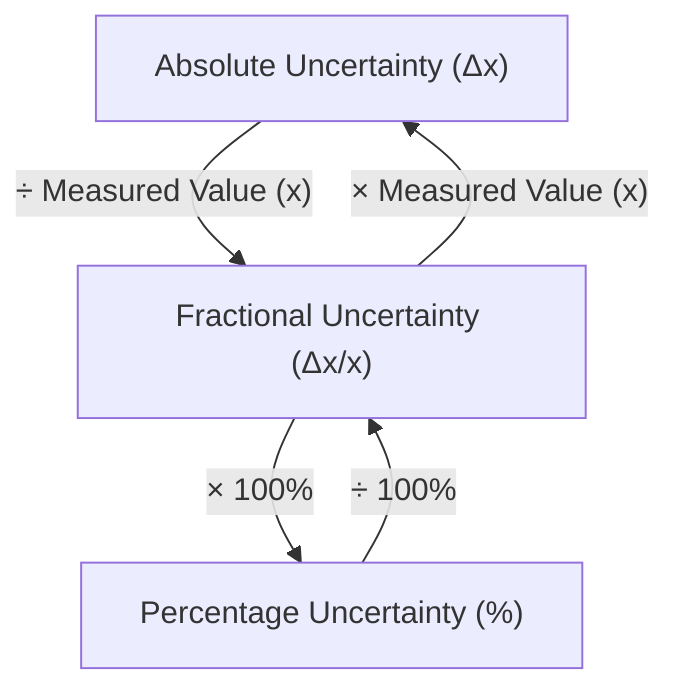
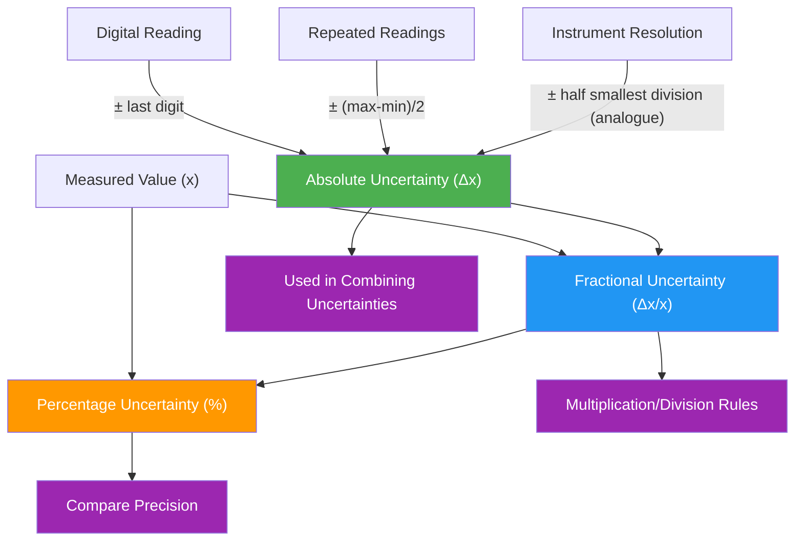

# 1. Overview / 概述

**English:**
This sub-topic introduces the three fundamental ways to express uncertainty in physical measurements: **absolute uncertainty**, **fractional uncertainty**, and **percentage uncertainty**. These are the mathematical building blocks for quantifying how reliable a measurement is. Understanding these concepts is essential because they form the basis for [[Combining Uncertainties (Addition, Multiplication, Powers)]] and for determining whether experimental results are consistent with theoretical predictions. This sub-topic sits within the broader [[Uncertainties and Errors]] hub and requires a solid grasp of [[SI Units, Prefixes and Homogeneity of Equations]].

**中文:**
本子知识点介绍表达物理测量不确定性的三种基本方式：**绝对不确定度**、**分数不确定度**和**百分比不确定度**。这些是量化测量可靠性的数学基础。理解这些概念至关重要，因为它们是[[Combining Uncertainties (Addition, Multiplication, Powers)]]以及判断实验结果是否与理论预测一致的基础。本子知识点属于[[Uncertainties and Errors]]大主题，需要掌握[[SI Units, Prefixes and Homogeneity of Equations]]。

---

# 2. Syllabus Learning Objectives / 考纲学习目标

| CAIE 9702 | Edexcel IAL |
|-----------|-------------|
| 1.4(a) Express uncertainty as absolute, fractional, or percentage | 1.7 Express uncertainty as absolute, fractional, or percentage |
| 1.4(b) Determine uncertainties from instrument resolution | 1.8 Determine uncertainties from instrument resolution |
| 1.4(c) Identify and calculate absolute uncertainty | 1.9 Calculate absolute uncertainty from range of repeated readings |
| 1.4(d) Convert between absolute, fractional, and percentage forms | 1.10 Convert between absolute, fractional, and percentage forms |
| 1.4(e) Use uncertainty to express precision | 1.11 Use uncertainty to express precision of measurements |
| 1.4(f) Apply to simple measurements | 1.12 Apply to simple measurements |
| 1.4(g) Understand that uncertainty is half the smallest division | — |

**Examiner Expectations / 考官期望:**
- **English:** You must be able to fluently convert between all three forms. You must know when to use each form (e.g., percentage for comparing precision, absolute for final answers). You must understand that absolute uncertainty has the same unit as the measurement.
- **中文:** 必须能够熟练地在三种形式之间转换。必须知道何时使用每种形式（例如，百分比用于比较精度，绝对用于最终答案）。必须理解绝对不确定度与测量值具有相同的单位。

---

# 3. Core Definitions / 核心定义

| Term (EN/CN) | Definition (EN) | Definition (CN) | Common Mistakes / 常见错误 |
|--------------|-----------------|-----------------|---------------------------|
| **Absolute Uncertainty** / 绝对不确定度 | The range of values within which the true value is expected to lie, expressed in the same unit as the measurement. | 真值预期所在的数值范围，以与测量值相同的单位表示。 | ❌ Forgetting to include the unit. / 忘记包含单位。 |
| **Fractional Uncertainty** / 分数不确定度 | The ratio of absolute uncertainty to the measured value (dimensionless). | 绝对不确定度与测量值的比值（无量纲）。 | ❌ Writing it as a percentage instead of a decimal. / 写成百分比而不是小数。 |
| **Percentage Uncertainty** / 百分比不确定度 | Fractional uncertainty multiplied by 100%, expressing uncertainty as a percentage of the measured value. | 分数不确定度乘以100%，将不确定度表示为测量值的百分比。 | ❌ Forgetting the % sign. / 忘记百分号。 |
| **Resolution** / 分辨率 | The smallest change in a quantity that an instrument can detect. | 仪器能检测到的量的最小变化。 | ❌ Confusing resolution with uncertainty. / 混淆分辨率和不确定度。 |
| **Precision** / 精密度 | How close repeated measurements are to each other; indicated by small uncertainty. | 重复测量值之间的接近程度；由小不确定度表示。 | ❌ Confusing with [[Accuracy vs Precision]]. / 与[[Accuracy vs Precision]]混淆。 |

---

# 4. Key Concepts Explained / 关键概念详解

## 4.1 Absolute Uncertainty / 绝对不确定度

### Explanation / 解释
**English:**
Absolute uncertainty ($\Delta x$) is the most direct way to express uncertainty. For a single reading from a digital instrument, the absolute uncertainty is typically ± the resolution (e.g., ±0.01 g for a digital balance reading 12.34 g). For an analogue instrument like a ruler, the absolute uncertainty is ± half the smallest division (e.g., ±0.5 mm for a ruler with 1 mm divisions). For repeated measurements, absolute uncertainty is half the range (max - min)/2.

**中文:**
绝对不确定度 ($\Delta x$) 是表达不确定度最直接的方式。对于数字仪器的单次读数，绝对不确定度通常为±分辨率（例如，数字天平读数为12.34 g，不确定度为±0.01 g）。对于像尺子这样的模拟仪器，绝对不确定度为±最小刻度的一半（例如，分度为1 mm的尺子，不确定度为±0.5 mm）。对于重复测量，绝对不确定度为极差的一半 (最大值 - 最小值)/2。

### Physical Meaning / 物理意义
**English:**
It tells you the actual range (in real units) where the true value probably lies. A length of 5.0 cm ± 0.1 cm means the true length is between 4.9 cm and 5.1 cm.

**中文:**
它告诉你真值可能所在的实际范围（以实际单位表示）。长度为5.0 cm ± 0.1 cm意味着真实长度在4.9 cm到5.1 cm之间。

### Common Misconceptions / 常见误区
- ❌ **English:** Thinking absolute uncertainty is always ±1 division. It's ± half the smallest division for analogue instruments.
- ❌ **中文:** 认为绝对不确定度总是±1个分度。对于模拟仪器，它是±最小分度的一半。
- ❌ **English:** Forgetting that absolute uncertainty has the same unit as the measurement.
- ❌ **中文:** 忘记绝对不确定度与测量值具有相同的单位。

### Exam Tips / 考试提示
- ✅ **English:** Always write absolute uncertainty with the same number of decimal places as the measurement.
- ✅ **中文:** 始终将绝对不确定度与测量值写成相同的小数位数。
- ✅ **English:** For digital readings, use ± the last digit shown.
- ✅ **中文:** 对于数字读数，使用±最后显示的一位数字。

> 📷 **IMAGE PROMPT — DIAGRAM-01: Ruler Uncertainty Illustration**
> A clear diagram showing a ruler measuring a pencil. The ruler has 1 mm divisions. A magnified circle shows the pencil end falling between two marks. Labels: "Smallest division = 1 mm", "Absolute uncertainty = ±0.5 mm", "Reading = 7.3 cm ± 0.05 cm". Clean, educational style with blue and red annotations.

---

## 4.2 Fractional Uncertainty / 分数不确定度

### Explanation / 解释
**English:**
Fractional uncertainty ($\frac{\Delta x}{x}$) is a dimensionless ratio. It tells you what fraction of the measured value the uncertainty represents. For example, if a length is 10.0 cm ± 0.1 cm, the fractional uncertainty is 0.1/10.0 = 0.01. This is useful because it allows comparison of precision across different scales.

**中文:**
分数不确定度 ($\frac{\Delta x}{x}$) 是一个无量纲比值。它告诉你不确定度占测量值的比例。例如，如果长度为10.0 cm ± 0.1 cm，则分数不确定度为0.1/10.0 = 0.01。这很有用，因为它允许在不同尺度上比较精度。

### Physical Meaning / 物理意义
**English:**
A smaller fractional uncertainty means a more precise measurement. A fractional uncertainty of 0.01 means the uncertainty is 1% of the measured value.

**中文:**
较小的分数不确定度意味着更精确的测量。分数不确定度为0.01意味着不确定度是测量值的1%。

### Common Misconceptions / 常见误区
- ❌ **English:** Writing fractional uncertainty as a percentage (e.g., 1% instead of 0.01).
- ❌ **中文:** 将分数不确定度写成百分比（例如，写成1%而不是0.01）。
- ❌ **English:** Forgetting that fractional uncertainty has no units.
- ❌ **中文:** 忘记分数不确定度没有单位。

### Exam Tips / 考试提示
- ✅ **English:** Keep fractional uncertainty as a decimal (e.g., 0.02), not a fraction (e.g., 1/50).
- ✅ **中文:** 将分数不确定度保留为小数（例如，0.02），而不是分数（例如，1/50）。
- ✅ **English:** Use fractional uncertainty when combining uncertainties in multiplication/division.
- ✅ **中文:** 在乘除运算中组合不确定度时使用分数不确定度。

---

## 4.3 Percentage Uncertainty / 百分比不确定度

### Explanation / 解释
**English:**
Percentage uncertainty ($\frac{\Delta x}{x} \times 100\%$) is simply the fractional uncertainty expressed as a percentage. It is the most intuitive form for comparing precision. For the example above, 0.01 × 100% = 1%. This is the form most commonly used in exam questions and real-world reporting.

**中文:**
百分比不确定度 ($\frac{\Delta x}{x} \times 100\%$) 就是分数不确定度以百分比形式表示。这是比较精度最直观的形式。对于上面的例子，0.01 × 100% = 1%。这是考试题和实际报告中最常用的形式。

### Physical Meaning / 物理意义
**English:**
It tells you the uncertainty as a percentage of the measurement. A 1% uncertainty means that if you measure 100 cm, the uncertainty is 1 cm.

**中文:**
它告诉你不确定度占测量值的百分比。1%的不确定度意味着如果你测量100 cm，不确定度为1 cm。

### Common Misconceptions / 常见误区
- ❌ **English:** Forgetting the % sign in the final answer.
- ❌ **中文:** 在最终答案中忘记百分号。
- ❌ **English:** Thinking percentage uncertainty can be greater than 100%.
- ✅ **中文:** 认为百分比不确定度可以大于100%。（实际上可以，但通常表示测量非常不精确。）

### Exam Tips / 考试提示
- ✅ **English:** Always show the conversion: $\frac{\Delta x}{x} \times 100\%$.
- ✅ **中文:** 始终展示转换过程：$\frac{\Delta x}{x} \times 100\%$。
- ✅ **English:** Use percentage uncertainty when comparing precision of measurements with different units.
- ✅ **中文:** 在比较不同单位的测量精度时使用百分比不确定度。

---

# 5. Essential Equations / 核心公式

## Equation 1: Absolute Uncertainty from Instrument Resolution

$$ \Delta x = \frac{\text{Smallest Division}}{2} \quad \text{(for analogue instruments)} $$

$$ \Delta x = \pm \text{Last Digit} \quad \text{(for digital instruments)} $$

| Symbol (符号) | Meaning (EN) | Meaning (CN) | Unit (单位) |
|--------------|-------------|-------------|------------|
| $\Delta x$ | Absolute uncertainty | 绝对不确定度 | Same as measurement |
| Smallest Division | Smallest scale marking | 最小刻度 | Same as measurement |

**Conditions / 适用条件:**
- **English:** For analogue instruments with a scale. For digital instruments, use ± the resolution.
- **中文:** 适用于有刻度的模拟仪器。对于数字仪器，使用±分辨率。

---

## Equation 2: Fractional Uncertainty

$$ \text{Fractional Uncertainty} = \frac{\Delta x}{x} $$

| Symbol (符号) | Meaning (EN) | Meaning (CN) | Unit (单位) |
|--------------|-------------|-------------|------------|
| $\Delta x$ | Absolute uncertainty | 绝对不确定度 | Same as measurement |
| $x$ | Measured value | 测量值 | Same as measurement |

**Conditions / 适用条件:**
- **English:** $x \neq 0$. The ratio is dimensionless.
- **中文:** $x \neq 0$。该比值无量纲。

---

## Equation 3: Percentage Uncertainty

$$ \text{Percentage Uncertainty} = \frac{\Delta x}{x} \times 100\% $$

| Symbol (符号) | Meaning (EN) | Meaning (CN) | Unit (单位) |
|--------------|-------------|-------------|------------|
| $\Delta x$ | Absolute uncertainty | 绝对不确定度 | Same as measurement |
| $x$ | Measured value | 测量值 | Same as measurement |

**Conditions / 适用条件:**
- **English:** $x \neq 0$. Result is a percentage.
- **中文:** $x \neq 0$。结果为百分比。

---

## Equation 4: Absolute Uncertainty from Repeated Measurements

$$ \Delta x = \frac{x_{\text{max}} - x_{\text{min}}}{2} $$

| Symbol (符号) | Meaning (EN) | Meaning (CN) | Unit (单位) |
|--------------|-------------|-------------|------------|
| $x_{\text{max}}$ | Maximum reading | 最大读数 | Same as measurement |
| $x_{\text{min}}$ | Minimum reading | 最小读数 | Same as measurement |

**Conditions / 适用条件:**
- **English:** Only valid for 3+ repeated readings. Gives a rough estimate.
- **中文:** 仅适用于3次以上重复读数。给出粗略估计。

> 📋 **Edexcel Only:** Edexcel explicitly requires using half the range for repeated measurements. CAIE also accepts this method.

---

# 6. Graphs and Relationships / 图表与关系

## 6.1 Relationship Between Forms / 三种形式之间的关系

### Axes / 坐标轴
- **English:** No standard graph. Instead, think of a conversion triangle.
- **中文:** 没有标准图表。而是考虑一个转换三角形。

### Shape / 形状
**English:**
The relationship is linear: Percentage = Fractional × 100. Fractional = Absolute / Measured.

**中文:**
关系是线性的：百分比 = 分数 × 100。分数 = 绝对 / 测量值。

### Conversion Triangle / 转换三角形

### Exam Interpretation / 考试解读
- **English:** If you know any two of: absolute uncertainty, measured value, fractional/percentage uncertainty, you can find the third.
- **中文:** 如果你知道绝对不确定度、测量值、分数/百分比不确定度中的任意两个，就可以求出第三个。

---

# 7. Required Diagrams / 必备图表

## 7.1 Ruler Reading with Uncertainty / 带不确定度的尺子读数

### Description / 描述
**English:**
A diagram showing how to read a ruler and determine absolute uncertainty. The ruler has 1 mm divisions. The object's end falls between two marks.

**中文:**
展示如何读取尺子并确定绝对不确定度的图表。尺子分度为1 mm。物体末端落在两个刻度之间。

### Image Prompt / 图片生成提示
> 📷 **IMAGE PROMPT — DIAGRAM-02: Ruler Uncertainty Reading**
> A high-quality educational diagram of a ruler measuring a metal rod. The ruler has clear 1 mm markings. A magnified circle shows the rod end between the 7.2 cm and 7.3 cm marks. Labels: "Reading = 7.25 cm", "Smallest division = 1 mm", "Absolute uncertainty = ±0.5 mm = ±0.05 cm", "Final answer: 7.25 cm ± 0.05 cm". Clean white background, blue and red annotations, professional textbook style.

### Labels Required / 需要标注
| English | 中文 |
|---------|------|
| Reading | 读数 |
| Smallest division | 最小分度 |
| Absolute uncertainty | 绝对不确定度 |
| Final answer format | 最终答案格式 |

### Exam Importance / 考试重要性
- **English:** High. This is a common question in Paper 3 (Practical) and Paper 1 (MCQ).
- **中文:** 高。这是Paper 3（实验）和Paper 1（选择题）中的常见题型。

---

## 7.2 Digital Balance Reading / 数字天平读数

### Description / 描述
**English:**
A diagram showing a digital balance display. The reading is 12.34 g. The absolute uncertainty is ±0.01 g (the last digit).

**中文:**
展示数字天平显示屏的图表。读数为12.34 g。绝对不确定度为±0.01 g（最后一位数字）。

### Image Prompt / 图片生成提示
> 📷 **IMAGE PROMPT — DIAGRAM-03: Digital Balance Reading**
> A close-up of a digital laboratory balance display showing "12.34 g". A callout box explains: "Digital reading: 12.34 g", "Resolution = 0.01 g", "Absolute uncertainty = ±0.01 g", "Final answer: 12.34 g ± 0.01 g". Modern lab equipment style, green digital numbers on black background, clean annotations.

### Labels Required / 需要标注
| English | 中文 |
|---------|------|
| Digital reading | 数字读数 |
| Resolution | 分辨率 |
| Absolute uncertainty | 绝对不确定度 |

### Exam Importance / 考试重要性
- **English:** High. Digital instruments are common in practical exams.
- **中文:** 高。数字仪器在实验考试中很常见。

---

# 8. Worked Examples / 典型例题

## Example 1: Converting Between Forms / 三种形式之间的转换

### Question / 题目
**English:**
A student measures the diameter of a wire as 2.45 mm using a micrometer screw gauge with a resolution of 0.01 mm.

(a) State the absolute uncertainty.
(b) Calculate the fractional uncertainty.
(c) Calculate the percentage uncertainty.

**中文:**
学生用分辨率为0.01 mm的千分尺测量一根导线的直径，读数为2.45 mm。

(a) 写出绝对不确定度。
(b) 计算分数不确定度。
(c) 计算百分比不确定度。

### Solution / 解答

**Step 1: Absolute Uncertainty / 绝对不确定度**
- **English:** For a digital micrometer, absolute uncertainty = ± resolution = ±0.01 mm.
- **中文:** 对于数字千分尺，绝对不确定度 = ±分辨率 = ±0.01 mm。

$$ \Delta d = \pm 0.01 \text{ mm} $$

**Step 2: Fractional Uncertainty / 分数不确定度**
- **English:** Fractional uncertainty = $\frac{\Delta d}{d} = \frac{0.01}{2.45}$
- **中文:** 分数不确定度 = $\frac{\Delta d}{d} = \frac{0.01}{2.45}$

$$ \text{Fractional Uncertainty} = \frac{0.01}{2.45} = 0.00408 \approx 0.0041 $$

**Step 3: Percentage Uncertainty / 百分比不确定度**
- **English:** Percentage uncertainty = Fractional × 100% = 0.00408 × 100%
- **中文:** 百分比不确定度 = 分数 × 100% = 0.00408 × 100%

$$ \text{Percentage Uncertainty} = 0.00408 \times 100\% = 0.408\% \approx 0.41\% $$

### Final Answer / 最终答案
**Answer:**
(a) ±0.01 mm
(b) 0.0041
(c) 0.41%

**答案：**
(a) ±0.01 mm
(b) 0.0041
(c) 0.41%

### Quick Tip / 提示
- **English:** Always round percentage uncertainty to 2 significant figures or match the precision of the measurement.
- **中文:** 始终将百分比不确定度四舍五入到2位有效数字或与测量值的精度匹配。

---

## Example 2: From Repeated Measurements / 从重复测量中计算

### Question / 题目
**English:**
A student measures the time for 20 oscillations of a pendulum five times and records: 18.2 s, 18.5 s, 18.1 s, 18.4 s, 18.3 s.

Calculate:
(a) The mean time.
(b) The absolute uncertainty.
(c) The percentage uncertainty in the mean time.

**中文:**
学生五次测量摆锤20次摆动的时间，记录如下：18.2 s, 18.5 s, 18.1 s, 18.4 s, 18.3 s。

计算：
(a) 平均时间。
(b) 绝对不确定度。
(c) 平均时间的百分比不确定度。

### Solution / 解答

**Step 1: Mean / 平均值**
$$ \bar{t} = \frac{18.2 + 18.5 + 18.1 + 18.4 + 18.3}{5} = \frac{91.5}{5} = 18.30 \text{ s} $$

**Step 2: Absolute Uncertainty / 绝对不确定度**
- **English:** Absolute uncertainty = half the range = $\frac{18.5 - 18.1}{2} = \frac{0.4}{2} = 0.2 \text{ s}$
- **中文:** 绝对不确定度 = 极差的一半 = $\frac{18.5 - 18.1}{2} = \frac{0.4}{2} = 0.2 \text{ s}$

$$ \Delta t = 0.2 \text{ s} $$

**Step 3: Percentage Uncertainty / 百分比不确定度**
$$ \text{Percentage Uncertainty} = \frac{0.2}{18.30} \times 100\% = 1.09\% \approx 1.1\% $$

### Final Answer / 最终答案
**Answer:**
(a) 18.30 s
(b) ±0.2 s
(c) 1.1%

**答案：**
(a) 18.30 s
(b) ±0.2 s
(c) 1.1%

### Quick Tip / 提示
- **English:** The mean should be written to the same decimal places as the readings (18.30 s, not 18.3 s).
- **中文:** 平均值应与读数的小数位数相同（18.30 s，而不是18.3 s）。

---

# 9. Past Paper Question Types / 历年真题题型

| Question Type / 题型 | Frequency / 频率 | Difficulty / 难度 | Past Paper References / 真题索引 |
|----------------------|------------------|------------------|-------------------------------|
| Convert between absolute, fractional, percentage | Very High / 非常高 | Easy / 简单 | 📝 *待填入* |
| Calculate uncertainty from instrument resolution | High / 高 | Easy / 简单 | 📝 *待填入* |
| Calculate uncertainty from repeated readings | High / 高 | Medium / 中等 | 📝 *待填入* |
| Compare precision using percentage uncertainty | Medium / 中等 | Medium / 中等 | 📝 *待填入* |
| State final answer with correct uncertainty format | Very High / 非常高 | Easy / 简单 | 📝 *待填入* |

**Common Command Words / 常见指令词:**
| English | 中文 |
|---------|------|
| State the absolute uncertainty | 写出绝对不确定度 |
| Calculate the percentage uncertainty | 计算百分比不确定度 |
| Express the uncertainty as a fraction | 将不确定度表示为分数 |
| Determine the uncertainty in ... | 确定...的不确定度 |
| Which measurement is more precise? | 哪个测量更精确？ |

---

# 10. Practical Skills Connections / 实验技能链接

**English:**
This sub-topic is directly tested in Paper 3 (CAIE) and Unit 1 Practical (Edexcel). Key practical connections include:

1. **Reading Instruments:** You must correctly determine absolute uncertainty from rulers, vernier calipers, micrometers, digital balances, stopwatches, and ammeters/voltmeters.
2. **Recording Data:** All measurements must be recorded with their absolute uncertainty in the correct format (e.g., 12.34 cm ± 0.01 cm).
3. **Repeated Measurements:** When taking multiple readings, calculate the mean and use half the range as absolute uncertainty.
4. **Comparing Precision:** Use percentage uncertainty to determine which measurement in an experiment is the limiting factor (largest uncertainty).
5. **Graph Plotting:** When plotting graphs, the uncertainty in measurements determines the size of error bars. See [[Graph Plotting Skills]].

**中文:**
本子知识点在Paper 3（CAIE）和Unit 1实验（Edexcel）中直接考查。关键实验联系包括：

1. **读取仪器：** 必须正确地从尺子、游标卡尺、千分尺、数字天平、秒表和电流表/电压表中确定绝对不确定度。
2. **记录数据：** 所有测量值必须以正确格式记录其绝对不确定度（例如，12.34 cm ± 0.01 cm）。
3. **重复测量：** 进行多次读数时，计算平均值并使用极差的一半作为绝对不确定度。
4. **比较精度：** 使用百分比不确定度来确定实验中哪个测量是限制因素（最大不确定度）。
5. **绘制图表：** 绘制图表时，测量的不确定度决定了误差线的大小。参见[[Graph Plotting Skills]]。

---

# 11. Concept Map / 概念图谱

---

# 12. Quick Revision Sheet / 速查表

| Category / 类别 | Key Points / 要点 |
|----------------|------------------|
| **Definition / 定义** | Absolute: ± value in same unit. Fractional: Δx/x (no unit). Percentage: (Δx/x)×100% |
| **Key Formula / 核心公式** | Δx = smallest division/2 (analogue). Δx = ± last digit (digital). Δx = (max-min)/2 (repeated) |
| **Key Graph / 核心图表** | Conversion triangle: Absolute → (÷x) → Fractional → (×100%) → Percentage |
| **Common Mistake / 常见错误** | ❌ Forgetting units for absolute. ❌ Writing fractional as %. ❌ Wrong decimal places |
| **Exam Tip / 考试提示** | ✅ Match decimal places of Δx and x. ✅ Always show working. ✅ Use % for comparison |
| **Practical Link / 实验联系** | Used in every practical: reading instruments, error bars, precision analysis |
| **Prerequisite / 前置知识** | [[SI Units, Prefixes and Homogeneity of Equations]] |
| **Next Topic / 下一主题** | [[Combining Uncertainties (Addition, Multiplication, Powers)]] |