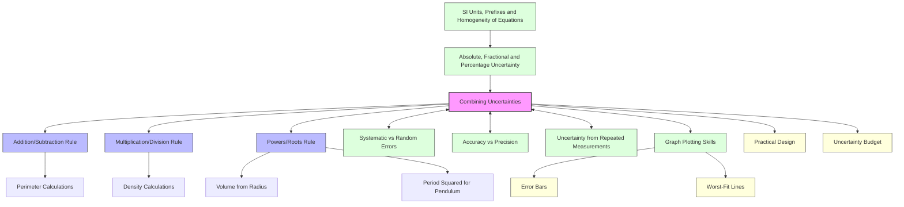

# Combining Uncertainties (Addition, Multiplication, Powers)
# 不确定度的合成（加法、乘法、幂运算）

---

# 1. Overview / 概述

**English:**
When physical quantities are combined through mathematical operations, their individual uncertainties must be propagated to find the overall uncertainty in the final result. This sub-topic covers the three fundamental rules for combining uncertainties: addition/subtraction, multiplication/division, and powers/roots. These rules are essential because real-world measurements are rarely used in isolation — they are almost always combined in calculations. Understanding how to combine uncertainties correctly is a core skill for all experimental physics and is heavily tested in both AS and A2 practical papers.

This leaf node builds directly on [[Absolute, Fractional and Percentage Uncertainty]] and is a sibling to [[Uncertainty from Repeated Measurements]]. It is a prerequisite for [[Graph Plotting Skills]] where error bars and worst-fit lines are used.

**中文:**
当物理量通过数学运算组合时，它们各自的不确定度必须被传递，以找到最终结果的总不确定度。本子知识点涵盖组合不确定度的三个基本规则：加法/减法、乘法/除法以及幂/根。这些规则至关重要，因为现实世界中的测量很少单独使用——它们几乎总是在计算中被组合。正确组合不确定度是所有实验物理学的核心技能，并且在AS和A2实验考试中都会重点考查。

本叶节点直接建立在[[绝对、分数和百分比不确定度]]之上，与[[来自重复测量的不确定度]]是同级知识点。它是[[图表绘制技能]]的先决条件，因为后者会用到误差棒和最差拟合线。

---

# 2. Syllabus Learning Objectives / 考纲学习目标

| CAIE 9702 | Edexcel IAL |
|-----------|-------------|
| 1.4(c) Combine uncertainties in cases where the quantities are added, subtracted, multiplied, divided or raised to powers | WPH11 U1: 1.9 Combine uncertainties using the rules for addition, subtraction, multiplication, division and raising to powers |
| 1.4(d) Determine the uncertainty in a derived quantity by combining uncertainties | WPH11 U1: 1.10 Determine the uncertainty in a derived quantity |
| 1.4(e) Use the relationship $y = a^n$ to determine the uncertainty in $y$ given the uncertainty in $a$ | WPH11 U1: 1.11 Apply the rules for powers and roots |
| 1.4(f) Combine uncertainties using the percentage uncertainty method | WPH11 U1: 1.12 Combine uncertainties using percentage uncertainties |

**Examiner Expectations / 考官期望:**
- **English:** Students must be able to select the correct rule for each operation and apply it systematically. For CAIE, the absolute uncertainty method for addition/subtraction and the percentage method for multiplication/division/powers are expected. For Edexcel, both methods are acceptable but percentage method is preferred for efficiency.
- **中文:** 学生必须能够为每种运算选择正确的规则并系统地应用。对于CAIE，加/减法使用绝对不确定度法，乘/除法/幂使用百分比法是预期的。对于Edexcel，两种方法都可接受，但百分比法因效率更高而更受青睐。

---

# 3. Core Definitions / 核心定义

| Term (EN/CN) | Definition (EN) | Definition (CN) | Common Mistakes / 常见错误 |
|--------------|-----------------|-----------------|---------------------------|
| **Combining Uncertainties** / 不确定度合成 | The process of calculating the total uncertainty in a derived quantity from the uncertainties in the individual measured quantities | 从各个测量量的不确定度计算导出量总不确定度的过程 | Confusing with error propagation in calculus (not required at AS) |
| **Absolute Uncertainty** / 绝对不确定度 | The actual uncertainty in a measurement, expressed in the same units as the measurement itself | 测量中的实际不确定度，以与测量本身相同的单位表示 | Forgetting to keep units consistent when adding/subtracting |
| **Fractional Uncertainty** / 分数不确定度 | The ratio of absolute uncertainty to the measured value: $\frac{\Delta x}{x}$ | 绝对不确定度与测量值的比值：$\frac{\Delta x}{x}$ | Confusing with percentage uncertainty (they differ by a factor of 100) |
| **Percentage Uncertainty** / 百分比不确定度 | The fractional uncertainty expressed as a percentage: $\frac{\Delta x}{x} \times 100\%$ | 以百分比表示的分数不确定度：$\frac{\Delta x}{x} \times 100\%$ | Forgetting to convert back to absolute uncertainty at the end |
| **Propagation of Uncertainty** / 不确定度传播 | The mathematical process by which uncertainties in input quantities affect the uncertainty in the output quantity | 输入量的不确定度影响输出量不确定度的数学过程 | Thinking uncertainties cancel out — they always add constructively |

---

# 4. Key Concepts Explained / 关键概念详解

## 4.1 The Three Fundamental Rules / 三个基本规则

### Explanation / 解释
**English:**
There are exactly three rules you need to know for combining uncertainties at AS Level. These rules are derived from calculus but are simplified for A-Level use:

1. **Addition/Subtraction:** Add absolute uncertainties
2. **Multiplication/Division:** Add percentage (or fractional) uncertainties
3. **Powers/Roots:** Multiply the percentage (or fractional) uncertainty by the power

These rules are applied sequentially when a calculation involves multiple operations. The key insight is that uncertainties **always add** — they never subtract or cancel out. This is because we are considering the worst-case scenario where all uncertainties push the result in the same direction.

**中文:**
在AS阶段，你需要知道恰好三个组合不确定度的规则。这些规则源自微积分，但为A-Level使用做了简化：

1. **加法/减法：** 相加绝对不确定度
2. **乘法/除法：** 相加百分比（或分数）不确定度
3. **幂/根：** 将百分比（或分数）不确定度乘以幂次

当计算涉及多个运算时，这些规则按顺序应用。关键见解是不确定度**总是相加**——它们从不相减或抵消。这是因为我们考虑的是最坏情况，即所有不确定度都朝同一方向推动结果。

### Physical Meaning / 物理意义
**English:**
When you add two measurements, the possible range of the sum is the sum of the individual ranges. For example, if $A = 10 \pm 1$ and $B = 20 \pm 2$, the sum could be as low as $9 + 18 = 27$ or as high as $11 + 22 = 33$, giving a range of $\pm 3$ — which is $1 + 2$.

For multiplication, the fractional spread multiplies. If $A$ has a 10% uncertainty and $B$ has a 5% uncertainty, the product has approximately a 15% uncertainty.

**中文:**
当你相加两个测量值时，和的可能范围是各个范围之和。例如，如果 $A = 10 \pm 1$ 且 $B = 20 \pm 2$，和可能低至 $9 + 18 = 27$ 或高至 $11 + 22 = 33$，给出 $\pm 3$ 的范围——即 $1 + 2$。

对于乘法，分数展宽会相乘。如果 $A$ 有10%的不确定度而 $B$ 有5%的不确定度，乘积大约有15%的不确定度。

### Common Misconceptions / 常见误区
- ❌ **"Uncertainties can cancel out"** — They never cancel; we always consider worst-case addition.
- ❌ **"For subtraction, subtract uncertainties"** — No! For subtraction, you still **add** absolute uncertainties.
- ❌ **"For division, divide uncertainties"** — No! For division, you **add** percentage uncertainties.
- ❌ **"Percentage uncertainty of $x^2$ is $2\%$ if $x$ has $2\%$ uncertainty"** — Correct reasoning but wrong arithmetic: it's $2 \times 2\% = 4\%$, not $2\%$.
- ❌ **"I can mix absolute and percentage uncertainties in the same calculation"** — Convert everything to the same type first.

### Exam Tips / 考试提示
- **EN:** Always state which rule you are using. Show your working clearly — examiners award method marks even if the final answer is wrong.
- **CN:** 始终说明你正在使用哪个规则。清晰展示你的计算过程——即使最终答案错误，考官也会给方法分。

> 📷 **IMAGE PROMPT — RULES: Three Rules Summary**
> A clean, three-column infographic showing the three rules for combining uncertainties. Column 1: Addition/Subtraction with $\Delta(A \pm B) = \Delta A + \Delta B$. Column 2: Multiplication/Division with $\frac{\Delta(A \times B)}{A \times B} = \frac{\Delta A}{A} + \frac{\Delta B}{B}$. Column 3: Powers with $\frac{\Delta(A^n)}{A^n} = n\frac{\Delta A}{A}$. Each column has a simple worked example. Use blue, green, and orange color coding. Suitable for an A-Level physics revision poster.

---

## 4.2 The "Worst-Case" Principle / "最坏情况"原则

### Explanation / 解释
**English:**
The rules for combining uncertainties are based on the **worst-case scenario**. This means we assume that all uncertainties push the final result in the same direction (all high or all low). In reality, uncertainties might partially cancel, but at A-Level we always use the worst-case addition method because it is simpler and safer.

For example, if $P = A + B$ where $A = 10 \pm 1$ and $B = 20 \pm 2$:
- Best case (both high): $P_{max} = 11 + 22 = 33$
- Best case (both low): $P_{min} = 9 + 18 = 27$
- Uncertainty in $P$: $\pm \frac{33 - 27}{2} = \pm 3 = \pm (1 + 2)$

**中文:**
组合不确定度的规则基于**最坏情况**。这意味着我们假设所有不确定度都朝同一方向推动最终结果（全部偏高或全部偏低）。在现实中，不确定度可能部分抵消，但在A-Level中我们总是使用最坏情况加法法，因为它更简单、更安全。

---

## 4.3 Sequential Operations / 顺序运算

### Explanation / 解释
**English:**
When a calculation involves multiple operations, you must apply the rules **sequentially**. The order matters. A common strategy is:

1. Convert all absolute uncertainties to percentage uncertainties at the start
2. Apply the multiplication/division/power rules using percentages
3. Convert the final percentage uncertainty back to absolute uncertainty

This is more efficient than switching between absolute and percentage methods mid-calculation.

**中文:**
当计算涉及多个运算时，你必须**按顺序**应用规则。顺序很重要。一个常见策略是：

1. 开始时将所有绝对不确定度转换为百分比不确定度
2. 使用百分比应用乘法/除法/幂规则
3. 将最终百分比不确定度转换回绝对不确定度

这比在计算过程中在绝对法和百分比法之间切换更高效。

---

# 5. Essential Equations / 核心公式

## 5.1 Addition/Subtraction Rule / 加法/减法规则

$$ \Delta(A \pm B) = \Delta A + \Delta B $$

| Symbol (符号) | Meaning (EN) | Meaning (CN) | Unit (单位) |
|--------------|-------------|-------------|------------|
| $\Delta(A \pm B)$ | Absolute uncertainty in the sum or difference | 和或差的绝对不确定度 | Same as A and B |
| $\Delta A$ | Absolute uncertainty in A | A的绝对不确定度 | Same as A |
| $\Delta B$ | Absolute uncertainty in B | B的绝对不确定度 | Same as B |

**Derivation / 推导:**
The maximum possible value of $A + B$ is $(A + \Delta A) + (B + \Delta B) = A + B + (\Delta A + \Delta B)$. The minimum is $(A - \Delta A) + (B - \Delta B) = A + B - (\Delta A + \Delta B)$. Therefore the uncertainty is $\pm (\Delta A + \Delta B)$.

**Conditions / 适用条件:**
- **EN:** Only for addition and subtraction. The quantities must have the same units.
- **CN:** 仅适用于加法和减法。各量必须具有相同单位。

**Limitations / 局限性:**
- **EN:** This is the worst-case (maximum possible) uncertainty. The actual uncertainty might be smaller if uncertainties are independent.
- **CN:** 这是最坏情况（最大可能）不确定度。如果不确定度是独立的，实际不确定度可能更小。

---

## 5.2 Multiplication/Division Rule / 乘法/除法规则

$$ \frac{\Delta(A \times B)}{A \times B} = \frac{\Delta A}{A} + \frac{\Delta B}{B} $$

Or in percentage form:

$$ \%\Delta(A \times B) = \%\Delta A + \%\Delta B $$

| Symbol (符号) | Meaning (EN) | Meaning (CN) | Unit (单位) |
|--------------|-------------|-------------|------------|
| $\frac{\Delta(A \times B)}{A \times B}$ | Fractional uncertainty in the product | 乘积的分数不确定度 | Dimensionless (no unit) |
| $\%\Delta(A \times B)$ | Percentage uncertainty in the product | 乘积的百分比不确定度 | % |

**Derivation / 推导:**
For $P = A \times B$, the maximum $P$ is $(A + \Delta A)(B + \Delta B) = AB + A\Delta B + B\Delta A + \Delta A\Delta B$. Neglecting the small $\Delta A\Delta B$ term, the fractional change is $\frac{A\Delta B + B\Delta A}{AB} = \frac{\Delta A}{A} + \frac{\Delta B}{B}$.

**Conditions / 适用条件:**
- **EN:** For multiplication and division. The same rule applies: add fractional/percentage uncertainties.
- **CN:** 适用于乘法和除法。相同规则适用：相加分数/百分比不确定度。

**Limitations / 局限性:**
- **EN:** The derivation neglects the product of small uncertainties, which is valid when uncertainties are small (<10% typically).
- **CN:** 推导忽略了小不确定度的乘积，当不确定度较小时（通常<10%）有效。

---

## 5.3 Powers/Roots Rule / 幂/根规则

$$ \frac{\Delta(A^n)}{A^n} = n \frac{\Delta A}{A} $$

Or in percentage form:

$$ \%\Delta(A^n) = n \times \%\Delta A $$

| Symbol (符号) | Meaning (EN) | Meaning (CN) | Unit (单位) |
|--------------|-------------|-------------|------------|
| $n$ | Power (can be positive, negative, or fractional) | 幂次（可以是正数、负数或分数） | Dimensionless |
| $\frac{\Delta(A^n)}{A^n}$ | Fractional uncertainty in $A^n$ | $A^n$的分数不确定度 | Dimensionless |

**Derivation / 推导:**
For $y = A^n$, taking natural logs: $\ln y = n \ln A$. Differentiating: $\frac{dy}{y} = n \frac{dA}{A}$. Replacing differentials with uncertainties gives $\frac{\Delta y}{y} = n \frac{\Delta A}{A}$.

**Conditions / 适用条件:**
- **EN:** For any power $n$, including square roots ($n = 1/2$), reciprocals ($n = -1$), etc.
- **CN:** 适用于任何幂次 $n$，包括平方根（$n = 1/2$）、倒数（$n = -1$）等。

**Limitations / 局限性:**
- **EN:** The formula assumes $n$ is exact (no uncertainty in the power itself).
- **CN:** 该公式假设 $n$ 是精确的（幂次本身没有不确定度）。

> 📷 **IMAGE PROMPT — FORMULA: Power Rule Visualization**
> A diagram showing a square of side length $x \pm \Delta x$. The area is $x^2$. Show how the uncertainty in area relates to $2x\Delta x$ (the derivative approximation). Use shading to show the "uncertainty strip" around the square. Label: "For $A = x^2$, $\Delta A \approx 2x\Delta x$, so $\frac{\Delta A}{A} = 2\frac{\Delta x}{x}$."

---

# 6. Graphs and Relationships / 图表与关系

## 6.1 Uncertainty Propagation Flowchart / 不确定度传播流程图

### Description / 描述
**English:** A decision flowchart that helps students choose the correct rule based on the mathematical operation.
**中文:** 一个决策流程图，帮助学生根据数学运算选择正确的规则。

```mermaid
flowchart TD
    A[Start: What operation?] --> B{Addition or Subtraction?}
    A --> C{Multiplication or Division?}
    A --> D{Powers or Roots?}
    
    B --> E[Use Absolute Uncertainty Rule]
    E --> F[Δ(result) = ΔA + ΔB]
    
    C --> G[Use Percentage Uncertainty Rule]
    G --> H[%Δ(result) = %ΔA + %ΔB]
    
    D --> I[Use Power Rule]
    I --> J[%Δ(result) = n × %ΔA]
    
    F --> K[Convert to final form]
    H --> K
    J --> K
    
    K --> L[Final uncertainty in derived quantity]
```

### Exam Interpretation / 考试解读
- **EN:** In exam questions, first identify all operations. Apply rules sequentially. For mixed operations, convert everything to percentage uncertainties first.
- **CN:** 在考试题目中，首先识别所有运算。按顺序应用规则。对于混合运算，首先将所有内容转换为百分比不确定度。

---

# 7. Required Diagrams / 必备图表

## 7.1 Uncertainty Propagation Tree / 不确定度传播树

### Description / 描述
**English:** A tree diagram showing how uncertainty propagates through a multi-step calculation. This helps students visualize the sequential application of rules.
**中文:** 一个树状图，显示不确定度如何通过多步计算传播。这有助于学生可视化规则的顺序应用。

### Image Prompt / 图片生成提示
> 📷 **IMAGE PROMPT — DIAGRAM: Uncertainty Propagation Tree**
> A tree diagram starting from a root labeled "Measured Quantities with Uncertainties". Branches show: "Addition: Add absolute uncertainties", "Multiplication: Add % uncertainties", "Power: Multiply % uncertainty by power". The branches converge at the top to "Final Result with Combined Uncertainty". Use a clean, educational style with color coding: blue for absolute, green for percentage, orange for power. Include a worked example: $V = \frac{4}{3}\pi r^3$ with $r = 5.0 \pm 0.1$ cm, showing the propagation path. Suitable for an A-Level physics textbook.

### Labels Required / 需要标注
- **EN:** "Measured Quantities", "Absolute Uncertainty", "Percentage Uncertainty", "Power Rule", "Final Combined Uncertainty"
- **CN:** "测量量", "绝对不确定度", "百分比不确定度", "幂规则", "最终合成不确定度"

### Exam Importance / 考试重要性
- **EN:** High. Understanding the propagation path helps avoid common mistakes like applying the wrong rule at the wrong step.
- **CN:** 高。理解传播路径有助于避免常见错误，如在错误步骤应用错误规则。

---

# 8. Worked Examples / 典型例题

## Example 1: Addition and Multiplication Combined / 加法和乘法组合

### Question / 题目
**English:**
A student measures the length $L = 25.0 \pm 0.2$ cm and width $W = 10.0 \pm 0.1$ cm of a rectangle. They also measure the perimeter $P = 2(L + W)$. Calculate:
(a) The perimeter $P$ and its absolute uncertainty.
(b) The percentage uncertainty in $P$.

**中文:**
一个学生测量矩形的长度 $L = 25.0 \pm 0.2$ cm 和宽度 $W = 10.0 \pm 0.1$ cm。他们还测量周长 $P = 2(L + W)$。计算：
(a) 周长 $P$ 及其绝对不确定度。
(b) $P$ 的百分比不确定度。

### Solution / 解答

**Step 1: Calculate the sum $L + W$**
$$L + W = 25.0 + 10.0 = 35.0 \text{ cm}$$

**Step 2: Apply addition rule for uncertainty**
$$\Delta(L + W) = \Delta L + \Delta W = 0.2 + 0.1 = 0.3 \text{ cm}$$

So $L + W = 35.0 \pm 0.3$ cm

**Step 3: Multiply by 2 (this is a power rule with $n=1$, or simply multiply absolute uncertainty)**
$$P = 2 \times (L + W) = 2 \times 35.0 = 70.0 \text{ cm}$$

For multiplication by a constant (exact number), the absolute uncertainty is also multiplied:
$$\Delta P = 2 \times \Delta(L + W) = 2 \times 0.3 = 0.6 \text{ cm}$$

**Step 4: Calculate percentage uncertainty**
$$\%\Delta P = \frac{0.6}{70.0} \times 100\% = 0.857\% \approx 0.9\%$$

### Final Answer / 最终答案
**Answer:** $P = 70.0 \pm 0.6$ cm, $\%\Delta P = 0.9\%$ | **答案：** $P = 70.0 \pm 0.6$ cm，$\%\Delta P = 0.9\%$

### Quick Tip / 提示
- **EN:** When multiplying by an exact constant (like 2, $\pi$, etc.), the absolute uncertainty is also multiplied by that constant. The percentage uncertainty remains unchanged.
- **CN:** 当乘以精确常数（如2、$\pi$等）时，绝对不确定度也乘以该常数。百分比不确定度保持不变。

---

## Example 2: Power Rule with Division / 幂规则与除法

### Question / 题目
**English:**
The density $\rho$ of a sphere is given by $\rho = \frac{m}{V}$ where $V = \frac{4}{3}\pi r^3$. A student measures:
- Mass $m = 50.0 \pm 0.5$ g
- Radius $r = 2.00 \pm 0.05$ cm

Calculate the density $\rho$ and its absolute uncertainty.

**中文:**
球体的密度 $\rho$ 由 $\rho = \frac{m}{V}$ 给出，其中 $V = \frac{4}{3}\pi r^3$。一个学生测量：
- 质量 $m = 50.0 \pm 0.5$ g
- 半径 $r = 2.00 \pm 0.05$ cm

计算密度 $\rho$ 及其绝对不确定度。

### Solution / 解答

**Step 1: Calculate percentage uncertainties**
$$\%\Delta m = \frac{0.5}{50.0} \times 100\% = 1.0\%$$
$$\%\Delta r = \frac{0.05}{2.00} \times 100\% = 2.5\%$$

**Step 2: Apply power rule for $r^3$**
$$\%\Delta(r^3) = 3 \times \%\Delta r = 3 \times 2.5\% = 7.5\%$$

**Step 3: Volume $V = \frac{4}{3}\pi r^3$**
The constant $\frac{4}{3}\pi$ is exact, so:
$$\%\Delta V = \%\Delta(r^3) = 7.5\%$$

**Step 4: Calculate $V$**
$$V = \frac{4}{3}\pi (2.00)^3 = \frac{4}{3}\pi \times 8.00 = 33.51 \text{ cm}^3$$

**Step 5: Apply division rule for $\rho = m/V$**
$$\%\Delta \rho = \%\Delta m + \%\Delta V = 1.0\% + 7.5\% = 8.5\%$$

**Step 6: Calculate $\rho$**
$$\rho = \frac{50.0}{33.51} = 1.492 \text{ g/cm}^3$$

**Step 7: Convert back to absolute uncertainty**
$$\Delta \rho = \frac{8.5}{100} \times 1.492 = 0.127 \text{ g/cm}^3$$

### Final Answer / 最终答案
**Answer:** $\rho = 1.49 \pm 0.13 \text{ g/cm}^3$ | **答案：** $\rho = 1.49 \pm 0.13 \text{ g/cm}^3$

### Quick Tip / 提示
- **EN:** Always round the final uncertainty to 1 or 2 significant figures, then match the value to the same decimal place.
- **CN:** 始终将最终不确定度四舍五入到1或2位有效数字，然后将值匹配到相同的小数位数。

---

# 9. Past Paper Question Types / 历年真题题型

| Question Type / 题型 | Frequency / 频率 | Difficulty / 难度 | Past Paper References / 真题索引 |
|----------------------|------------------|------------------|-------------------------------|
| Calculate combined uncertainty from given measurements | Very High | Medium | 📝 *待填入* |
| Determine which measurement contributes most to overall uncertainty | High | Medium | 📝 *待填入* |
| Design an experiment to minimize overall uncertainty | Medium | Hard | 📝 *待填入* |
| Error analysis in practical write-ups | Very High | Medium | 📝 *待填入* |
| Multiple choice on combining rules | High | Easy | 📝 *待填入* |

**Common Command Words / 常见指令词:**
- **EN:** "Calculate", "Determine", "Find", "State", "Show that", "Estimate"
- **CN:** "计算", "确定", "求出", "说明", "证明", "估算"

---

# 10. Practical Skills Connections / 实验技能链接

**English:**
Combining uncertainties is directly tested in practical papers (CAIE Paper 3/5, Edexcel Unit 6). In practical contexts:

1. **Measurements:** You will measure multiple quantities (length, time, mass, etc.) and need to combine their uncertainties to find the uncertainty in a derived quantity like density, Young modulus, or resistivity.

2. **Uncertainty Budget:** A key skill is identifying which measurement contributes the most to the overall uncertainty. This helps in experimental design — you can improve the experiment by reducing the largest source of uncertainty.

3. **Graphical Analysis:** When plotting graphs, the uncertainty in calculated quantities (like $T^2$ for pendulum experiments) must be propagated from the raw measurements. This affects error bar sizes and worst-fit line analysis.

4. **Experimental Design:** If asked to "improve the experiment", one valid answer is to reduce the uncertainty in the measurement that contributes most to the final combined uncertainty.

**中文:**
组合不确定度在实验考试中直接考查（CAIE Paper 3/5，Edexcel Unit 6）。在实验情境中：

1. **测量：** 你将测量多个量（长度、时间、质量等），需要组合它们的不确定度来找到导出量（如密度、杨氏模量或电阻率）的不确定度。

2. **不确定度预算：** 一个关键技能是识别哪个测量对总不确定度贡献最大。这有助于实验设计——你可以通过减少最大的不确定度来源来改进实验。

3. **图形分析：** 绘制图表时，计算量（如单摆实验中的 $T^2$）的不确定度必须从原始测量中传播。这影响误差棒大小和最差拟合线分析。

4. **实验设计：** 如果被要求"改进实验"，一个有效答案是减少对最终合成不确定度贡献最大的测量的不确定度。

---

# 11. Concept Map / 概念图谱



---

# 12. Quick Revision Sheet / 速查表

| Category / 类别 | Key Points / 要点 |
|----------------|------------------|
| **Definition / 定义** | Combining uncertainties = propagating measurement uncertainties through calculations to find the total uncertainty in the final result / 组合不确定度 = 通过计算传播测量不确定度以找到最终结果的总不确定度 |
| **Rule 1: Addition/Subtraction / 规则1：加法/减法** | $\Delta(A \pm B) = \Delta A + \Delta B$ — Add **absolute** uncertainties / 相加**绝对**不确定度 |
| **Rule 2: Multiplication/Division / 规则2：乘法/除法** | $\%\Delta(A \times B) = \%\Delta A + \%\Delta B$ — Add **percentage** uncertainties / 相加**百分比**不确定度 |
| **Rule 3: Powers/Roots / 规则3：幂/根** | $\%\Delta(A^n) = n \times \%\Delta A$ — Multiply percentage uncertainty by the power / 将百分比不确定度乘以幂次 |
| **Key Graph / 核心图表** | Uncertainty propagation flowchart — helps choose the correct rule / 不确定度传播流程图——帮助选择正确规则 |
| **Exam Tip 1 / 考试提示1** | Always convert to percentage uncertainties first for mixed operations / 对于混合运算，始终先转换为百分比不确定度 |
| **Exam Tip 2 / 考试提示2** | Round final uncertainty to 1-2 s.f., then match the value to the same decimal place / 将最终不确定度四舍五入到1-2位有效数字，然后将值匹配到相同小数位数 |
| **Exam Tip 3 / 考试提示3** | Show all working — method marks are awarded even if the final answer is wrong / 展示所有计算过程——即使最终答案错误也会给方法分 |
| **Common Mistake / 常见错误** | Subtracting uncertainties instead of adding them / 相减不确定度而不是相加 |
| **Common Mistake / 常见错误** | Forgetting to convert percentage uncertainty back to absolute at the end / 忘记在最后将百分比不确定度转换回绝对不确定度 |
| **Practical Link / 实验联系** | Use uncertainty budget to identify which measurement to improve / 使用不确定度预算来识别需要改进的测量 |
| **Formula to Remember / 需记住的公式** | $\frac{\Delta(A^n)}{A^n} = n\frac{\Delta A}{A}$ — the power rule is the most commonly forgotten / 幂规则是最常被遗忘的 |

---

> 📋 **CIE Only:** In CAIE 9702 Paper 3 (Practical), you are expected to combine uncertainties for up to two operations. For Paper 5 (Planning), you may need to discuss which measurement contributes most to the overall uncertainty.

> 📋 **Edexcel Only:** In Edexcel IAL Unit 6 (Practical), you may be asked to calculate the percentage uncertainty in a derived quantity and suggest improvements based on the uncertainty budget. The use of $\pm$ notation with correct significant figures is particularly important.