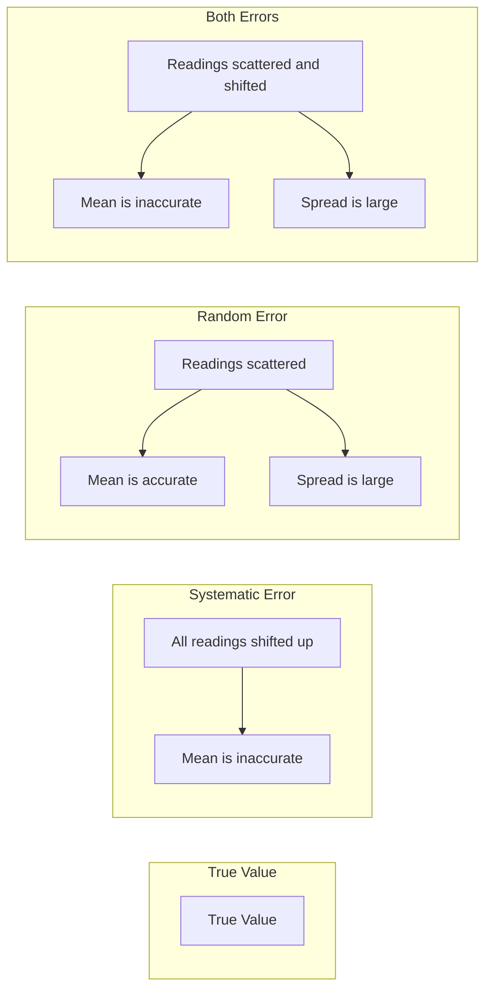
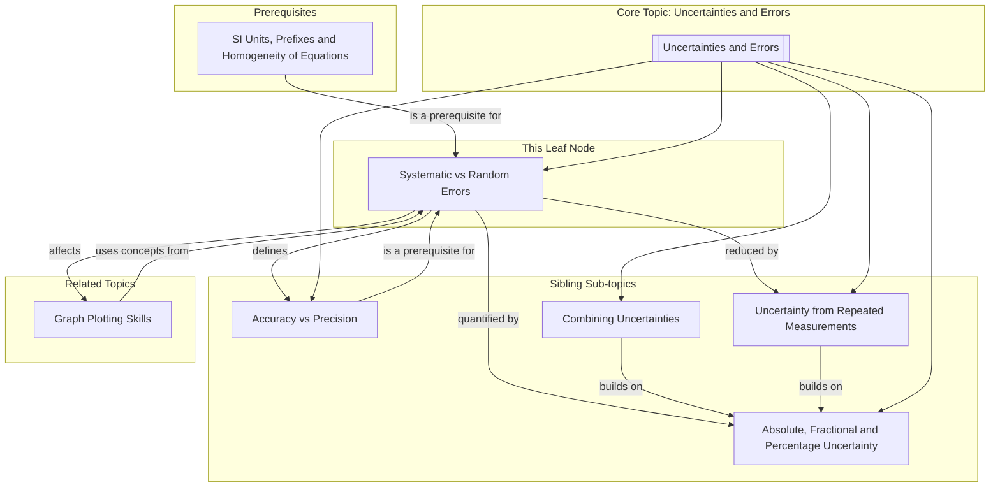

---
# Systematic vs Random Errors / 系统误差与随机误差

---

# 1. Overview / 概述

**English:**
This sub-topic introduces the two fundamental categories of experimental errors: **systematic errors** and **random errors**. Understanding the distinction between them is crucial for evaluating the reliability and validity of experimental data. Systematic errors cause a consistent bias in measurements, shifting results away from the true value in one direction, while random errors cause unpredictable scatter in repeated measurements. This leaf node explains their definitions, sources, effects on data, and how to identify and reduce them. It is a core component of the [[Uncertainties and Errors]] topic and directly links to [[Accuracy vs Precision]] and [[Uncertainty from Repeated Measurements]].

**中文:**
本子知识点介绍实验误差的两大基本类别：**系统误差** 和 **随机误差**。理解它们之间的区别对于评估实验数据的可靠性和有效性至关重要。系统误差会导致测量结果产生一致的偏差，使结果朝一个方向偏离真值；而随机误差则会导致重复测量结果出现不可预测的分散。本节点将解释它们的定义、来源、对数据的影响以及如何识别和减少它们。它是 [[Uncertainties and Errors]] 主题的核心组成部分，并直接链接到 [[Accuracy vs Precision]] 和 [[Uncertainty from Repeated Measurements]]。

---

# 2. Syllabus Learning Objectives / 考纲学习目标

| CAIE 9702 | Edexcel IAL |
|-----------|-------------|
| 1.4(a) Distinguish between systematic and random errors. | 1.7 Distinguish between systematic and random errors. |
| 1.4(b) Explain how systematic errors affect results. | 1.8 Explain how systematic errors affect accuracy. |
| 1.4(c) Explain how random errors affect results. | 1.9 Explain how random errors affect precision. |
| 1.4(d) Identify sources of systematic and random errors in experiments. | 1.10 Identify sources of systematic and random errors. |
| 1.4(e) Suggest ways to reduce systematic errors. | 1.11 Suggest ways to reduce systematic errors. |
| 1.4(f) Suggest ways to reduce random errors. | 1.12 Suggest ways to reduce random errors. |
| 1.4(g) Understand the difference between precision and accuracy. | (Covered in [[Accuracy vs Precision]]) |

**Examiner Expectations / 考官期望:**
- **English:** You must be able to clearly define and distinguish between systematic and random errors using correct terminology. You should be able to identify the type of error from a description of an experiment and suggest appropriate methods to reduce each type. Be prepared to explain how each error affects the accuracy and precision of results.
- **中文:** 你必须能够使用正确的术语清晰地定义和区分系统误差与随机误差。你应该能够根据对实验的描述识别误差类型，并提出减少每种误差的适当方法。要准备好解释每种误差如何影响结果的准确度和精密度。

---

# 3. Core Definitions / 核心定义

| Term (EN/CN) | Definition (EN) | Definition (CN) | Common Mistakes / 常见错误 |
|--------------|-----------------|-----------------|---------------------------|
| **Systematic Error** / 系统误差 | An error that causes readings to differ from the true value by a consistent amount in the same direction (either all too high or all too low). It is reproducible and cannot be reduced by taking more readings. | 导致读数与真值相差一个恒定值，且方向一致（全部偏高或全部偏低）的误差。这种误差是可重复的，不能通过增加读数次数来减少。 | Confusing systematic error with a "mistake" (e.g., misreading a scale). Systematic errors are inherent to the method or equipment. |
| **Random Error** / 随机误差 | An error that causes unpredictable scatter in readings around the true value. It is due to uncontrollable variations in the measurement process and can be reduced by taking more readings and calculating a mean. | 导致读数在真值周围产生不可预测的分散的误差。它是由测量过程中不可控的变化引起的，可以通过增加读数次数并计算平均值来减少。 | Thinking random errors can be eliminated entirely. They can only be *reduced* by averaging. |
| **Accuracy** / 准确度 | How close a measured value is to the true value. Affected by systematic errors. | 测量值与真值的接近程度。受系统误差影响。 | Confusing accuracy with precision. A precise measurement can be inaccurate if systematic error is present. |
| **Precision** / 精密度 | How close repeated measurements are to each other. Affected by random errors. | 重复测量值之间的接近程度。受随机误差影响。 | Confusing precision with accuracy. A precise measurement can be inaccurate. |
| **Zero Error** / 零误差 | A common type of systematic error where the instrument does not read zero when it should (e.g., an un-zeroed balance or ammeter). | 一种常见的系统误差，指仪器在应该读数为零时读数不为零（例如，未归零的天平或电流表）。 | Forgetting to correct for zero error before taking measurements. |
| **Parallax Error** / 视差误差 | An error caused by reading a scale from an angle, leading to a systematic or random offset depending on the observer's position. | 由于从某个角度读取刻度而引起的误差，根据观察者的位置，可能导致系统性或随机性的偏差。 | Assuming parallax error is always random. If the observer always reads from the same angle, it is systematic. |

---

# 4. Key Concepts Explained / 关键概念详解

## 4.1 Systematic Errors / 系统误差

### Explanation / 解释
**English:** A systematic error is a consistent, repeatable error associated with faulty equipment or a flawed experimental design. It shifts all measurements in the same direction (either all too high or all too low) by a constant amount or a constant percentage. Because it is consistent, taking more readings and averaging them will **not** reduce a systematic error. The only way to deal with it is to identify its source and correct it, or to apply a correction factor to the data. This is directly linked to the concept of [[Accuracy vs Precision]]; a measurement with a large systematic error is **inaccurate**.

**中文:** 系统误差是与设备故障或实验设计缺陷相关的、一致的、可重复的误差。它会使所有测量值朝同一方向偏移（全部偏高或全部偏低），偏移量为恒定值或恒定百分比。由于它是一致的，增加读数次数并取平均值 **不会** 减少系统误差。处理它的唯一方法是识别其来源并进行修正，或者对数据应用修正因子。这与 [[Accuracy vs Precision]] 的概念直接相关；存在较大系统误差的测量是 **不准确** 的。

### Physical Meaning / 物理意义
**English:** The true value lies outside the range of the measured values. The mean of the measurements is not close to the true value.
**中文:** 真值位于测量值范围之外。测量值的平均值不接近真值。

### Common Misconceptions / 常见误区
- **English:** "Averaging removes all errors." (False: averaging only reduces random errors, not systematic errors.)
- **中文:** "取平均值可以消除所有误差。" (错误：取平均值只能减少随机误差，不能减少系统误差。)
- **English:** "Systematic errors are always large." (False: they can be small but still cause inaccuracy.)
- **中文:** "系统误差总是很大。" (错误：它们可能很小，但仍会导致不准确。)

### Exam Tips / 考试提示
- **English:** When asked to suggest a source of systematic error, think about the equipment (calibration, zero error) and the method (heat loss, friction, reaction time bias). When asked how to reduce it, suggest calibrating the equipment, correcting for zero error, or improving the experimental design.
- **中文:** 当被要求提出系统误差的来源时，要考虑设备（校准、零误差）和方法（热损失、摩擦、反应时间偏差）。当被问及如何减少它时，建议校准设备、修正零误差或改进实验设计。

> 📷 **IMAGE PROMPT — SYS-ERR-01: Systematic Error Illustration**
> A diagram showing a target with a bullseye (true value). All arrows (measurements) are clustered tightly together but are all clustered in the upper-left quadrant, far from the bullseye. The cluster is tight (precise) but off-target (inaccurate). Label the cluster as "Systematic Error".

## 4.2 Random Errors / 随机误差

### Explanation / 解释
**English:** A random error is an unpredictable variation in measurements caused by factors that the experimenter cannot control. These fluctuations cause readings to be scattered around the true value, some too high and some too low. Unlike systematic errors, random errors can be reduced by taking a large number of readings and calculating the mean. The mean of a large set of readings will be closer to the true value than any individual reading. This is directly linked to the concept of [[Accuracy vs Precision]]; a measurement with large random errors is **imprecise**.

**中文:** 随机误差是由实验者无法控制的因素引起的测量中不可预测的变化。这些波动导致读数在真值周围分散，有的偏高，有的偏低。与系统误差不同，随机误差可以通过获取大量读数并计算平均值来减少。大量读数的平均值将比任何单个读数更接近真值。这与 [[Accuracy vs Precision]] 的概念直接相关；存在较大随机误差的测量是 **不精密** 的。

### Physical Meaning / 物理意义
**English:** The true value lies within the range of the measured values. The mean of the measurements is close to the true value, but individual readings vary.
**中文:** 真值位于测量值范围之内。测量值的平均值接近真值，但单个读数有变化。

### Common Misconceptions / 常见误区
- **English:** "Random errors are caused by carelessness." (False: they are inherent in the measurement process, though carelessness can increase them.)
- **中文:** "随机误差是由粗心造成的。" (错误：它们是测量过程中固有的，尽管粗心会增加它们。)
- **English:** "You can eliminate random errors by using a more precise instrument." (False: you can reduce them, but some random variation always exists.)
- **中文:** "使用更精密的仪器可以消除随机误差。" (错误：你可以减少它们，但总会有一些随机变化存在。)

### Exam Tips / 考试提示
- **English:** When asked to suggest a source of random error, think about human reaction time, parallax error (if the angle varies), vibrations, temperature fluctuations, or electrical noise. When asked how to reduce it, suggest repeating the measurement many times and calculating the mean, or using a more precise instrument (e.g., a digital sensor instead of a ruler).
- **中文:** 当被要求提出随机误差的来源时，要考虑人的反应时间、视差误差（如果角度变化）、振动、温度波动或电噪声。当被问及如何减少它时，建议多次重复测量并计算平均值，或使用更精密的仪器（例如，使用数字传感器代替尺子）。

> 📷 **IMAGE PROMPT — RAN-ERR-01: Random Error Illustration**
> A diagram showing a target with a bullseye (true value). Many arrows (measurements) are scattered widely around the bullseye. Some are close, some are far, in all directions. The cluster is spread out (imprecise) but centered on the target (accurate). Label the spread as "Random Error".

---

# 5. Essential Equations / 核心公式

There are no specific equations for systematic vs random errors themselves. The key is understanding their effect on the mean and uncertainty.

**Effect on the Mean / 对平均值的影响:**
$$ \bar{x} = \frac{\sum_{i=1}^{n} x_i}{n} $$

- **Systematic Error:** The mean $\bar{x}$ is shifted away from the true value $\mu$ by a constant offset $b$: $\bar{x} = \mu + b$.
- **Random Error:** The mean $\bar{x}$ approaches the true value $\mu$ as the number of readings $n$ increases: $\lim_{n \to \infty} \bar{x} = \mu$.

**Effect on Uncertainty / 对不确定度的影响:**
- **Systematic Error:** Does not affect the spread (precision) of data, so it does not change the calculated uncertainty from repeated measurements. It is often treated as a separate "correction" to the final result.
- **Random Error:** Directly affects the spread of data. The uncertainty is quantified by the [[Absolute, Fractional and Percentage Uncertainty]] (e.g., half the range or standard deviation).

---

# 6. Graphs and Relationships / 图表与关系

## 6.1 Effect of Errors on a Data Set / 误差对数据集的影响

### Axes / 坐标轴
- **X-axis:** Measurement Number / 测量序号
- **Y-axis:** Measured Value / 测量值

### Shape / 形状
- **No Error:** A horizontal straight line at the true value.
- **Systematic Error Only:** A horizontal straight line, but offset from the true value (either above or below).
- **Random Error Only:** Points scattered randomly around the true value line.
- **Both Errors:** Points scattered randomly around a line that is offset from the true value.

### Gradient Meaning / 斜率含义
- The gradient of a line of best fit through the data points would be zero (no trend over time). A non-zero gradient might indicate a systematic drift (e.g., the instrument warming up).

### Area Meaning / 面积含义
- Not applicable for this type of graph.

### Exam Interpretation / 考试解读
- **English:** You may be asked to sketch a graph showing the effect of systematic and random errors. Be able to identify which type of error is present based on the pattern of the data points.
- **中文:** 你可能会被要求画一个图表来显示系统误差和随机误差的影响。要能够根据数据点的模式识别出存在哪种类型的误差。

---

# 7. Required Diagrams / 必备图表

## 7.1 Target Diagram for Accuracy and Precision / 准确度与精密度靶图

### Description / 描述
**English:** A classic diagram using a target (dartboard) to illustrate the concepts of accuracy and precision in relation to systematic and random errors. The bullseye represents the true value. Each dart represents a measurement.
**中文:** 一个经典的靶图，用于说明与系统误差和随机误差相关的准确度和精密度的概念。靶心代表真值。每支飞镖代表一次测量。

### Image Prompt / 图片生成提示
> 📷 **IMAGE PROMPT — DIAG-ACC-PREC-01: Accuracy and Precision Target Diagram**
> A 2x2 grid of four target diagrams. Top-left: "High Accuracy, High Precision" – all darts clustered tightly on the bullseye. Top-right: "High Accuracy, Low Precision" – darts scattered widely around the bullseye. Bottom-left: "Low Accuracy, High Precision" – darts clustered tightly but all in the top-left corner, far from the bullseye. Bottom-right: "Low Accuracy, Low Precision" – darts scattered widely and all in the bottom-right corner, far from the bullseye. Each diagram is clearly labeled.

### Labels Required / 需要标注
- **English:** True Value (Bullseye), Accurate, Precise, Systematic Error (offset), Random Error (scatter).
- **中文:** 真值（靶心），准确，精密，系统误差（偏移），随机误差（分散）。

### Exam Importance / 考试重要性
- **English:** Extremely high. This diagram is a standard way to test understanding of the relationship between errors, accuracy, and precision.
- **中文:** 极高。该图是测试对误差、准确度和精密度之间关系理解的标准方式。

---

# 8. Worked Examples / 典型例题

## Example 1: Identifying Error Types / 示例 1：识别误差类型

### Question / 题目
**English:** A student uses a stopwatch to measure the time for a ball to fall from a height. The true time is 1.50 s. The student's readings are: 1.42 s, 1.45 s, 1.43 s, 1.44 s, 1.46 s. The student realizes they started the stopwatch slightly late each time.
(a) Identify the type of error present.
(b) Explain how this error affects the accuracy and precision of the results.
(c) Suggest one way to reduce this error.

**中文:** 一名学生使用秒表测量球从高处下落的时间。真实时间为 1.50 秒。该学生的读数为：1.42 秒、1.45 秒、1.43 秒、1.44 秒、1.46 秒。该学生意识到他们每次启动秒表都稍晚。
(a) 识别存在的误差类型。
(b) 解释该误差如何影响结果的准确度和精密度。
(c) 提出一种减少该误差的方法。

### Solution / 解答
**(a) Error Type / 误差类型:**
- **English:** Systematic error. The readings are all consistently lower than the true value (1.50 s) because the student starts the stopwatch late.
- **中文:** 系统误差。由于学生启动秒表较晚，所有读数都一致地低于真值 (1.50 秒)。

**(b) Effect on Accuracy and Precision / 对准确度和精密度的影:**
- **English:** The results are **imprecise** (the readings show some scatter: 1.42 to 1.46 s) due to random errors in reaction time. However, they are also **inaccurate** because the mean (1.44 s) is significantly lower than the true value (1.50 s) due to the systematic error of starting late.
- **中文:** 结果 **不精密**（读数有些分散：1.42 到 1.46 秒），这是由于反应时间的随机误差造成的。然而，结果也 **不准确**，因为平均值 (1.44 秒) 由于启动较晚的系统误差而明显低于真值 (1.50 秒)。

**(c) Method to Reduce Error / 减少误差的方法:**
- **English:** Use a light gate and data logger to start and stop the timer automatically, eliminating the human reaction time error.
- **中文:** 使用光门和数据记录器自动启动和停止计时器，消除人为反应时间误差。

### Final Answer / 最终答案
**Answer:** (a) Systematic error. (b) Makes results inaccurate. (c) Use a light gate. | **答案：** (a) 系统误差。 (b) 使结果不准确。 (c) 使用光门。

### Quick Tip / 提示
- **English:** If all readings are consistently above or below the true value, it's a systematic error. If they are scattered around the true value, it's a random error.
- **中文:** 如果所有读数都一致地高于或低于真值，则是系统误差。如果它们在真值周围分散，则是随机误差。

---

# 9. Past Paper Question Types / 历年真题题型

| Question Type / 题型 | Frequency / 频率 | Difficulty / 难度 | Past Paper References / 真题索引 |
|----------------------|------------------|------------------|-------------------------------|
| Distinguish between systematic and random errors / 区分系统误差与随机误差 | High | Easy | 📝 *待填入* |
| Identify error type from experimental description / 根据实验描述识别误差类型 | High | Medium | 📝 *待填入* |
| Suggest methods to reduce a specific error / 提出减少特定误差的方法 | High | Medium | 📝 *待填入* |
| Explain effect on accuracy and precision / 解释对准确度和精密度的影 | Medium | Medium | 📝 *待填入* |
| Sketch graph showing effect of errors / 画出显示误差影响的图表 | Low | Hard | 📝 *待填入* |

**Common Command Words / 常见指令词:**
- **English:** Distinguish, Identify, Suggest, Explain, State, Sketch
- **中文:** 区分，识别，提出，解释，陈述，画出

---

# 10. Practical Skills Connections / 实验技能链接

**English:**
This sub-topic is fundamental to all practical work in A-Level Physics. When planning an experiment, you must identify potential sources of systematic and random errors. In your write-up, you should:
- **Systematic Errors:** Describe how you calibrated equipment (e.g., zeroing a balance, checking a ruler for wear). If you cannot eliminate a systematic error, you must apply a correction (e.g., subtracting the zero error).
- **Random Errors:** State how many readings you took and why (to reduce the effect of random errors by averaging). You should also discuss the range of your readings as a measure of random uncertainty. This connects directly to [[Uncertainty from Repeated Measurements]] and [[Graph Plotting Skills]] (error bars represent random uncertainty).

**中文:**
本子知识点是 A-Level 物理所有实验工作的基础。在规划实验时，你必须识别系统误差和随机误差的潜在来源。在你的实验报告中，你应该：
- **系统误差：** 描述你如何校准设备（例如，将天平归零，检查尺子是否磨损）。如果你无法消除系统误差，则必须应用修正（例如，减去零误差）。
- **随机误差：** 说明你记录了多少次读数以及原因（通过平均来减少随机误差的影响）。你还应该讨论读数的范围，作为随机不确定度的度量。这直接连接到 [[Uncertainty from Repeated Measurements]] 和 [[Graph Plotting Skills]]（误差线代表随机不确定度）。

---

# 11. Concept Map / 概念图谱

---

# 12. Quick Revision Sheet / 速查表

| Category / 类别 | Key Points / 要点 |
|----------------|------------------|
| **Definition / 定义** | **Systematic Error:** Consistent offset in one direction. **Random Error:** Unpredictable scatter around true value. / **系统误差：** 朝一个方向的一致偏移。**随机误差：** 在真值周围不可预测的分散。 |
| **Key Formula / 核心公式** | No specific formula. Effect on mean: $\bar{x} = \mu + b$ (systematic), $\lim_{n \to \infty} \bar{x} = \mu$ (random). / 无特定公式。对平均值的影响：$\bar{x} = \mu + b$ (系统), $\lim_{n \to \infty} \bar{x} = \mu$ (随机)。 |
| **Key Graph / 核心图表** | Target diagram (accuracy vs precision). / 靶图（准确度 vs 精密度）。 |
| **Exam Tip / 考试提示** | To reduce systematic errors: calibrate, correct zero error, improve method. To reduce random errors: repeat and average, use more precise instruments. / 减少系统误差：校准、修正零误差、改进方法。减少随机误差：重复并取平均、使用更精密的仪器。 |