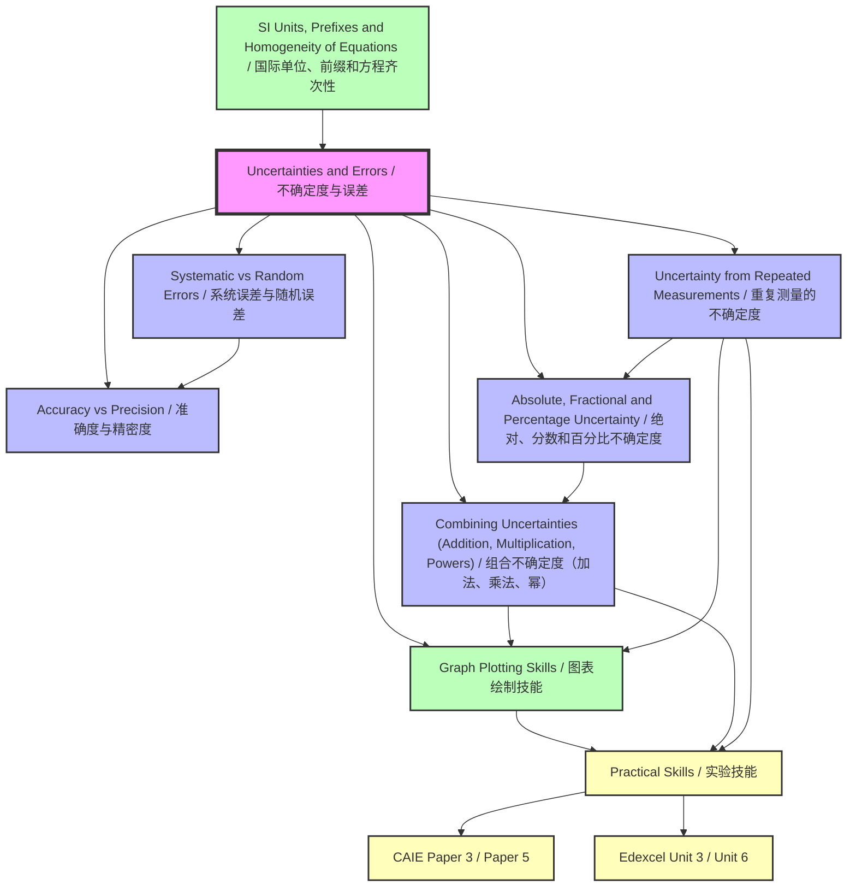

# 1. Overview / 概述

**English:**
This topic, **Uncertainties and Errors**, is the cornerstone of experimental physics at A-Level. It provides the mathematical framework to quantify the reliability and limitations of any measurement. In both Cambridge 9702 and Edexcel IAL syllabuses, this is a fundamental skill assessed across all practical papers (Paper 3/5 for CAIE, Unit 3/6 for Edexcel) and in theory questions. The topic covers the classification of errors (systematic vs. random), the distinction between accuracy and precision, and the mathematical methods for calculating and combining uncertainties. Real-world applications are vast: from calibrating medical instruments to ensuring the safety of engineering structures, understanding uncertainty is critical for scientific integrity. In examinations, students are expected not only to calculate uncertainties but also to evaluate experimental methods, suggest improvements, and justify the number of significant figures in a final answer.

**中文：**
本主题 **不确定度与误差** 是A-Level实验物理学的基石。它提供了量化任何测量可靠性和局限性的数学框架。在剑桥9702和爱德思IAL的教学大纲中，这是一项基本技能，在所有实验试卷（CAIE的Paper 3/5，Edexcel的Unit 3/6）以及理论题中都会进行评估。该主题涵盖误差的分类（系统误差与随机误差）、准确度与精密度之间的区别，以及计算和组合不确定度的数学方法。现实世界的应用非常广泛：从校准医疗仪器到确保工程结构的安全，理解不确定度对于科学完整性至关重要。在考试中，学生不仅要计算不确定度，还要评估实验方法、提出改进建议，并证明最终答案中有效数字位数的合理性。

---

# 2. Syllabus Learning Objectives / 考纲学习目标

| CAIE 9702 (1.4 a-g) | Edexcel IAL (WPH11 U1: 1.7-1.12) |
|---------------------|----------------------------------|
| 1.4(a) Understand the difference between systematic errors (including zero errors) and random errors. | 1.7 Understand the difference between systematic errors (including zero errors) and random errors. |
| 1.4(b) Understand the difference between precision and accuracy. | 1.8 Understand the difference between precision and accuracy. |
| 1.4(c) Assess the uncertainty in a derived quantity by simple addition of actual, fractional or percentage uncertainties (a rigorous statistical treatment is not required). | 1.9 Know that measurements are subject to uncertainty and that the uncertainty in a measurement can be expressed as an absolute, fractional or percentage uncertainty. |
| 1.4(d) Represent an uncertainty interval on a graph using error bars. | 1.10 Know how to combine uncertainties in cases where measurements are added, subtracted, multiplied, divided or raised to a power. |
| 1.4(e) Draw the line of best fit on a graph, taking into account error bars. | 1.11 Know how to determine the uncertainty in a gradient and intercept from a graph. |
| 1.4(f) Determine the gradient and intercept of a linear graph, with their uncertainties. | 1.12 Know how to reduce the effect of errors and uncertainties in experimental work. |
| 1.4(g) Distinguish between scalar and vector quantities and give examples of each. | *Note: Scalars and vectors are covered separately in Edexcel.* |

**Examiner Expectations / 考官期望:**
**English:** Candidates must be able to define key terms precisely, calculate combined uncertainties correctly, and interpret graphs with error bars. The ability to suggest improvements to reduce uncertainties is frequently tested.
**中文：** 考生必须能够精确定义关键术语，正确计算组合不确定度，并解释带有误差线的图表。经常测试提出改进建议以减少不确定度的能力。

> 📋 **CIE Only:** CAIE explicitly requires distinguishing between scalar and vector quantities under this topic (1.4g). Edexcel covers this separately.
>
> 📋 **Edexcel Only:** Edexcel explicitly requires determining uncertainty in gradient and intercept from a graph (1.11) and reducing errors in experimental work (1.12). CAIE covers these implicitly in practical papers.

---

# 3. Core Definitions / 核心定义

| Term (EN/CN) | Definition (EN) | Definition (CN) | Common Mistakes / 常见错误 |
|--------------|-----------------|-----------------|---------------------------|
| **Uncertainty / 不确定度** | The range of values within which the true value of a measurement is expected to lie. | 真值预期所在的测量值范围。 | Confusing uncertainty with mistake. Uncertainty is inherent; mistakes are avoidable. |
| **Error / 误差** | The difference between the measured value and the true value. | 测量值与真值之间的差异。 | Using "error" interchangeably with "mistake". In physics, error is a quantitative deviation. |
| **Systematic Error / 系统误差** | An error that is consistent and reproducible, causing all readings to be shifted in one direction from the true value. | 一致且可重复的误差，导致所有读数相对于真值向一个方向偏移。 | Thinking systematic errors can be eliminated by repeating measurements. They require calibration or method change. |
| **Random Error / 随机误差** | An error that varies unpredictably in magnitude and sign, causing readings to scatter around the true value. | 大小和符号不可预测地变化的误差，导致读数在真值周围分散。 | Believing random errors are always small. They can be large but are reduced by averaging. |
| **Zero Error / 零位误差** | A systematic error where the instrument does not read zero when it should. | 仪器在应该读零时未读零的系统误差。 | Forgetting to subtract zero error from all readings. |
| **Accuracy / 准确度** | How close a measured value is to the true value. | 测量值与真值的接近程度。 | Confusing accuracy with precision. Accuracy relates to systematic errors. |
| **Precision / 精密度** | How close repeated measurements are to each other. | 重复测量值之间的接近程度。 | Confusing precision with accuracy. Precision relates to random errors. |
| **Absolute Uncertainty / 绝对不确定度** | The actual uncertainty in a measurement, expressed in the same units as the measurement. | 测量中的实际不确定度，以与测量相同的单位表示。 | Forgetting to include units. |
| **Fractional Uncertainty / 分数不确定度** | The ratio of absolute uncertainty to the measured value (dimensionless). | 绝对不确定度与测量值的比值（无量纲）。 | Not simplifying the fraction. |
| **Percentage Uncertainty / 百分比不确定度** | Fractional uncertainty expressed as a percentage. | 以百分比表示的分数不确定度。 | Forgetting the % sign in the final answer. |
| **Error Bar / 误差线** | A line on a graph representing the uncertainty range of a data point. | 图表上表示数据点不确定度范围的线。 | Drawing error bars that are too small or inconsistent with the data. |
| **Line of Best Fit / 最佳拟合线** | A smooth line that best represents the trend of data points, considering error bars. | 考虑误差线后最能代表数据点趋势的平滑线。 | Forcing the line through all points or ignoring outliers. |

---

# 4. Key Concepts Explained / 关键概念详解

## 4.1 Systematic vs Random Errors / 系统误差与随机误差

### Explanation / 解释
**English:** [[Systematic vs Random Errors]] are two fundamental categories of experimental uncertainty. **Systematic errors** cause all measurements to be consistently too high or too low. They arise from faulty calibration (e.g., a balance that reads 0.5 g when empty), environmental factors (e.g., a ruler that expands in heat), or flawed experimental design (e.g., not accounting for heat loss in a calorimetry experiment). Systematic errors cannot be reduced by repeating measurements; they require identifying and correcting the source. **Random errors** cause measurements to scatter randomly around the true value. They arise from unpredictable fluctuations: human reaction time, electrical noise, or parallax error in reading a scale. Random errors can be reduced by taking many readings and calculating the mean.

**中文：** [[系统误差与随机误差]] 是实验不确定度的两个基本类别。**系统误差** 导致所有测量值一致地偏高或偏低。它们源于校准错误（例如，空载时读数为0.5克的天平）、环境因素（例如，受热膨胀的尺子）或有缺陷的实验设计（例如，在量热实验中未考虑热损失）。系统误差不能通过重复测量来减少；需要识别并纠正其来源。**随机误差** 导致测量值在真值周围随机分散。它们源于不可预测的波动：人的反应时间、电噪声或读取刻度时的视差误差。随机误差可以通过多次读数并计算平均值来减少。

### Physical Meaning / 物理意义
**English:** In real life, if you weigh yourself on a faulty scale that always adds 2 kg, that's a systematic error. If you weigh yourself ten times and get slightly different readings each time due to breathing or shifting weight, that's random error.
**中文：** 在现实生活中，如果你用一台总是多2公斤的有故障秤称体重，那就是系统误差。如果你称十次体重，由于呼吸或体重移动每次得到略有不同的读数，那就是随机误差。

### Common Misconceptions / 常见误区
- **Misconception:** Repeating measurements eliminates systematic errors. / **误区：** 重复测量可以消除系统误差。
  - **Truth:** Repeating only reduces random errors. Systematic errors remain. / **事实：** 重复只能减少随机误差。系统误差仍然存在。
- **Misconception:** All errors are random. / **误区：** 所有误差都是随机的。
  - **Truth:** Many experiments have both types. Identifying them is key. / **事实：** 许多实验同时存在两种类型。识别它们是关键。

### Exam Tips / 考试提示
**English:** Examiners frequently ask: "State whether the error is systematic or random" and "Suggest how to reduce this error." For systematic errors, the answer is usually "calibrate the instrument" or "change the method." For random errors, "repeat measurements and calculate the mean."
**中文：** 考官经常问："说明该误差是系统误差还是随机误差"以及"建议如何减少该误差"。对于系统误差，答案通常是"校准仪器"或"改变方法"。对于随机误差，答案是"重复测量并计算平均值"。

> 📷 **IMAGE PROMPT — ERR-01: Systematic vs Random Error Illustration**
>
> A split diagram. Left side: A target with all arrows clustered in the upper-left quadrant, far from the bullseye. Label: "Systematic Error – Consistent offset from true value." Right side: A target with arrows scattered randomly around the bullseye. Label: "Random Error – Scatter around true value." Clean white background, educational style, arrows in red and blue.

---

## 4.2 Accuracy vs Precision / 准确度与精密度

### Explanation / 解释
**English:** [[Accuracy vs Precision]] are often confused but distinct concepts. **Accuracy** describes how close a measurement is to the true value. It is affected by systematic errors. **Precision** describes how close repeated measurements are to each other. It is affected by random errors. A measurement can be precise but inaccurate (e.g., a faulty balance that consistently reads 0.5 g too high gives very repeatable but wrong readings). A measurement can be accurate but imprecise (e.g., a rough estimate that happens to be close to the true value but cannot be replicated). The ideal is both accurate and precise.

**中文：** [[准确度与精密度]] 经常被混淆，但它们是不同的概念。**准确度** 描述测量值与真值的接近程度。它受系统误差影响。**精密度** 描述重复测量值之间的接近程度。它受随机误差影响。一个测量可能精密度高但准确度低（例如，一个有故障的天平始终偏高0.5克，给出非常可重复但错误的读数）。一个测量可能准确度高但精密度低（例如，一个粗略估计恰好接近真值但无法复制）。理想情况是既准确又精密。

### Physical Meaning / 物理意义
**English:** Think of a dartboard. Accuracy is how close your darts are to the bullseye. Precision is how close your darts are to each other. Four darts clustered tightly in the outer ring: precise but inaccurate. Four darts spread around the bullseye: accurate but imprecise. Four darts in the bullseye: both accurate and precise.
**中文：** 想象一个飞镖靶。准确度是你的飞镖离靶心的距离。精密度是你的飞镖彼此之间的距离。四支飞镖紧密聚集在外环：精密度高但准确度低。四支飞镖散布在靶心周围：准确度高但精密度低。四支飞镖在靶心：既准确又精密。

### Common Misconceptions / 常见误区
- **Misconception:** High precision guarantees high accuracy. / **误区：** 高精密度保证高准确度。
  - **Truth:** Precision does not imply accuracy. / **事实：** 精密度并不意味着准确度。
- **Misconception:** Accuracy and precision are the same thing. / **误区：** 准确度和精密度是同一回事。
  - **Truth:** They measure different aspects of quality. / **事实：** 它们衡量质量的不同方面。

### Exam Tips / 考试提示
**English:** A common question: "Explain why the readings are precise but not accurate." The answer must reference systematic error (e.g., zero error) causing consistent offset.
**中文：** 一个常见问题："解释为什么读数精密度高但准确度低。"答案必须引用系统误差（例如，零位误差）导致一致偏移。

> 📷 **IMAGE PROMPT — ERR-02: Accuracy vs Precision Dartboard**
>
> Four dartboard diagrams in a 2x2 grid. Top-left: "High Accuracy, High Precision" – all darts in bullseye. Top-right: "High Accuracy, Low Precision" – darts scattered around bullseye. Bottom-left: "Low Accuracy, High Precision" – darts clustered in outer ring. Bottom-right: "Low Accuracy, Low Precision" – darts scattered everywhere. Labels in English. Clean educational style.

---

## 4.3 Absolute, Fractional and Percentage Uncertainty / 绝对、分数和百分比不确定度

### Explanation / 解释
**English:** [[Absolute, Fractional and Percentage Uncertainty]] are three ways to express the same uncertainty. **Absolute uncertainty** ($\Delta x$) has the same unit as the measurement. For a single reading from a digital instrument, it is typically half the smallest division (e.g., a digital balance reading 12.34 g has $\Delta x = \pm 0.005$ g). For an analogue instrument, it is half the smallest scale division (e.g., a ruler with mm markings: $\pm 0.5$ mm). **Fractional uncertainty** is $\frac{\Delta x}{x}$, a dimensionless ratio. **Percentage uncertainty** is $\frac{\Delta x}{x} \times 100\%$. Converting between these forms is essential for [[Combining Uncertainties (Addition, Multiplication, Powers)]].

**中文：** [[绝对、分数和百分比不确定度]] 是表达同一不确定度的三种方式。**绝对不确定度** ($\Delta x$) 与测量值具有相同的单位。对于数字仪器的单次读数，通常是最小分度的一半（例如，读数为12.34克的数字天平有 $\Delta x = \pm 0.005$ 克）。对于模拟仪器，是最小刻度分度的一半（例如，毫米刻度的尺子：$\pm 0.5$ 毫米）。**分数不确定度** 是 $\frac{\Delta x}{x}$，一个无量纲比值。**百分比不确定度** 是 $\frac{\Delta x}{x} \times 100\%$。在这些形式之间转换对于[[组合不确定度（加法、乘法、幂）]]至关重要。

### Physical Meaning / 物理意义
**English:** If you measure a length as 25.0 cm with $\pm 0.1$ cm absolute uncertainty, the fractional uncertainty is 0.004, and the percentage uncertainty is 0.4%. This means the true length is likely between 24.9 cm and 25.1 cm.
**中文：** 如果你测量长度为25.0厘米，绝对不确定度为$\pm 0.1$厘米，则分数不确定度为0.004，百分比不确定度为0.4%。这意味着真实长度可能在24.9厘米到25.1厘米之间。

### Common Misconceptions / 常见误区
- **Misconception:** Absolute uncertainty is always half the smallest division. / **误区：** 绝对不确定度总是最小分度的一半。
  - **Truth:** For digital instruments, it's half the last digit. For analogue, half the smallest division. But examiners may specify a different value. / **事实：** 对于数字仪器，是最后一位数字的一半。对于模拟仪器，是最小分度的一半。但考官可能指定不同的值。
- **Misconception:** Percentage uncertainty can be greater than 100%. / **误区：** 百分比不确定度可以大于100%。
  - **Truth:** It can be, but such measurements are usually considered unreliable. / **事实：** 可以，但这样的测量通常被认为不可靠。

### Exam Tips / 考试提示
**English:** Always show the conversion: $\text{Percentage} = \frac{\Delta x}{x} \times 100\%$. State the absolute uncertainty to 1 significant figure, and match the measurement to the same decimal place.
**中文：** 始终展示转换过程：$\text{百分比} = \frac{\Delta x}{x} \times 100\%$。将绝对不确定度表示为1位有效数字，并将测量值匹配到相同的小数位数。

---

## 4.4 Combining Uncertainties (Addition, Multiplication, Powers) / 组合不确定度（加法、乘法、幂）

### Explanation / 解释
**English:** [[Combining Uncertainties (Addition, Multiplication, Powers)]] is a critical skill. When measurements with uncertainties are combined in calculations, the uncertainties propagate. The rules are:
1. **Addition/Subtraction:** Add absolute uncertainties: $\Delta (A \pm B) = \Delta A + \Delta B$
2. **Multiplication/Division:** Add fractional (or percentage) uncertainties: $\frac{\Delta (A \times B)}{A \times B} = \frac{\Delta A}{A} + \frac{\Delta B}{B}$
3. **Powers:** Multiply fractional uncertainty by the power: $\frac{\Delta (A^n)}{A^n} = n \times \frac{\Delta A}{A}$
4. **Constant Multiplication:** Multiply absolute uncertainty by the constant: $\Delta (kA) = k \times \Delta A$

**中文：** [[组合不确定度（加法、乘法、幂）]] 是一项关键技能。当带有不确定度的测量值在计算中组合时，不确定度会传播。规则是：
1. **加法/减法：** 相加绝对不确定度：$\Delta (A \pm B) = \Delta A + \Delta B$
2. **乘法/除法：** 相加分数（或百分比）不确定度：$\frac{\Delta (A \times B)}{A \times B} = \frac{\Delta A}{A} + \frac{\Delta B}{B}$
3. **幂：** 将分数不确定度乘以幂次：$\frac{\Delta (A^n)}{A^n} = n \times \frac{\Delta A}{A}$
4. **常数乘法：** 将绝对不确定度乘以常数：$\Delta (kA) = k \times \Delta A$

### Physical Meaning / 物理意义
**English:** If you measure the length and width of a rectangle with uncertainties, the uncertainty in the area is larger than either individual uncertainty. This reflects the compounding of errors.
**中文：** 如果你测量一个矩形的长度和宽度并带有不确定度，则面积的不确定度大于任何一个单独的不确定度。这反映了误差的累积。

### Common Misconceptions / 常见误区
- **Misconception:** For multiplication, add absolute uncertainties. / **误区：** 对于乘法，相加绝对不确定度。
  - **Truth:** Add fractional or percentage uncertainties, then convert back. / **事实：** 相加分数或百分比不确定度，然后转换回来。
- **Misconception:** The order of operations doesn't matter. / **误区：** 运算顺序无关紧要。
  - **Truth:** Apply rules step by step following BODMAS. / **事实：** 按照运算顺序逐步应用规则。

### Exam Tips / 考试提示
**English:** Show all steps. Convert to percentage uncertainties for multiplication/division, then convert back to absolute at the end. For powers, remember the power multiplies the fractional uncertainty.
**中文：** 展示所有步骤。对于乘法/除法，转换为百分比不确定度，最后再转换回绝对不确定度。对于幂，记住幂次乘以分数不确定度。

---

## 4.5 Uncertainty from Repeated Measurements / 重复测量的不确定度

### Explanation / 解释
**English:** [[Uncertainty from Repeated Measurements]] is determined using the range. For a set of $n$ repeated readings, the uncertainty is half the range: $\Delta x = \frac{\text{max} - \text{min}}{2}$. The best estimate is the mean: $\bar{x} = \frac{\sum x_i}{n}$. This method assumes random errors dominate. The final result is reported as $\bar{x} \pm \Delta x$.

**中文：** [[重复测量的不确定度]] 使用极差来确定。对于一组 $n$ 次重复读数，不确定度是极差的一半：$\Delta x = \frac{\text{最大值} - \text{最小值}}{2}$。最佳估计值是平均值：$\bar{x} = \frac{\sum x_i}{n}$。此方法假设随机误差占主导。最终结果报告为 $\bar{x} \pm \Delta x$。

### Physical Meaning / 物理意义
**English:** If you time a pendulum swing five times and get 2.1, 2.3, 2.2, 2.0, 2.4 seconds, the mean is 2.2 s, and the uncertainty is $\frac{2.4 - 2.0}{2} = 0.2$ s. The result is $2.2 \pm 0.2$ s.
**中文：** 如果你五次测量单摆摆动时间，得到2.1、2.3、2.2、2.0、2.4秒，平均值是2.2秒，不确定度是 $\frac{2.4 - 2.0}{2} = 0.2$ 秒。结果是 $2.2 \pm 0.2$ 秒。

### Common Misconceptions / 常见误区
- **Misconception:** Use standard deviation. / **误区：** 使用标准偏差。
  - **Truth:** A-Level uses half-range, not standard deviation. / **事实：** A-Level使用半极差，而不是标准偏差。
- **Misconception:** More readings always reduce uncertainty to zero. / **误区：** 更多读数总是将不确定度减少到零。
  - **Truth:** More readings improve precision but cannot eliminate systematic errors. / **事实：** 更多读数提高精密度，但不能消除系统误差。

### Exam Tips / 考试提示
**English:** Always show the calculation: $\Delta x = \frac{\text{max} - \text{min}}{2}$. Report the mean to the same precision as the readings. If there is an anomalous result, identify and exclude it before calculating.
**中文：** 始终展示计算过程：$\Delta x = \frac{\text{最大值} - \text{最小值}}{2}$。将平均值报告到与读数相同的精度。如果有异常结果，在计算前识别并排除它。

---

# 5. Essential Equations / 核心公式

## 5.1 Absolute Uncertainty from Repeated Readings / 重复读数的绝对不确定度

**Equation / 公式:**
$$ \Delta x = \frac{x_{\text{max}} - x_{\text{min}}}{2} $$

**Variables / 变量:**
| Symbol (符号) | Meaning (EN) | Meaning (CN) | Unit (单位) |
|--------------|-------------|-------------|------------|
| $\Delta x$ | Absolute uncertainty | 绝对不确定度 | Same as $x$ |
| $x_{\text{max}}$ | Maximum reading | 最大读数 | Same as $x$ |
| $x_{\text{min}}$ | Minimum reading | 最小读数 | Same as $x$ |

**Derivation / 推导:**
**English:** The range ($x_{\text{max}} - x_{\text{min}}$) represents the total spread of readings. Half the range is the average deviation from the mean, assuming symmetric distribution.
**中文：** 极差（$x_{\text{max}} - x_{\text{min}}$）代表读数的总散布。假设对称分布，极差的一半是平均偏差。

**Conditions / 适用条件:**
**English:** At least 3 readings. Random errors dominate. No anomalous results.
**中文：** 至少3个读数。随机误差占主导。无异常结果。

**Limitations / 局限性:**
**English:** Does not account for systematic errors. Sensitive to outliers.
**中文：** 不考虑系统误差。对异常值敏感。

**Rearrangements / 变形:**
**English:** N/A (definition equation).
**中文：** 无（定义方程）。

---

## 5.2 Fractional Uncertainty / 分数不确定度

**Equation / 公式:**
$$ \text{Fractional Uncertainty} = \frac{\Delta x}{x} $$

**Variables / 变量:**
| Symbol (符号) | Meaning (EN) | Meaning (CN) | Unit (单位) |
|--------------|-------------|-------------|------------|
| $\Delta x$ | Absolute uncertainty | 绝对不确定度 | Same as $x$ |
| $x$ | Measured value | 测量值 | Same as $\Delta x$ |

**Derivation / 推导:**
**English:** Ratio of uncertainty to measurement. Dimensionless.
**中文：** 不确定度与测量值的比值。无量纲。

**Conditions / 适用条件:**
**English:** $x \neq 0$.
**中文：** $x \neq 0$。

**Limitations / 局限性:**
**English:** Very small $x$ gives large fractional uncertainty.
**中文：** 非常小的 $x$ 给出大的分数不确定度。

**Rearrangements / 变形:**
**English:** $\Delta x = (\text{Fractional Uncertainty}) \times x$
**中文：** $\Delta x = (\text{分数不确定度}) \times x$

---

## 5.3 Percentage Uncertainty / 百分比不确定度

**Equation / 公式:**
$$ \text{Percentage Uncertainty} = \frac{\Delta x}{x} \times 100\% $$

**Variables / 变量:**
| Symbol (符号) | Meaning (EN) | Meaning (CN) | Unit (单位) |
|--------------|-------------|-------------|------------|
| $\Delta x$ | Absolute uncertainty | 绝对不确定度 | Same as $x$ |
| $x$ | Measured value | 测量值 | Same as $\Delta x$ |

**Derivation / 推导:**
**English:** Fractional uncertainty multiplied by 100%.
**中文：** 分数不确定度乘以100%。

**Conditions / 适用条件:**
**English:** $x \neq 0$.
**中文：** $x \neq 0$。

**Limitations / 局限性:**
**English:** Can exceed 100% for very uncertain measurements.
**中文：** 对于非常不确定的测量，可能超过100%。

**Rearrangements / 变形:**
**English:** $\Delta x = \frac{\text{Percentage Uncertainty}}{100\%} \times x$
**中文：** $\Delta x = \frac{\text{百分比不确定度}}{100\%} \times x$

---

## 5.4 Combining Uncertainties: Addition/Subtraction / 组合不确定度：加法/减法

**Equation / 公式:**
$$ \Delta (A \pm B) = \Delta A + \Delta B $$

**Variables / 变量:**
| Symbol (符号) | Meaning (EN) | Meaning (CN) | Unit (单位) |
|--------------|-------------|-------------|------------|
| $\Delta A$ | Absolute uncertainty in A | A的绝对不确定度 | Same as A |
| $\Delta B$ | Absolute uncertainty in B | B的绝对不确定度 | Same as B |
| $\Delta (A \pm B)$ | Absolute uncertainty in result | 结果的绝对不确定度 | Same as A and B |

**Derivation / 推导:**
**English:** Worst-case scenario: if both uncertainties push the result in the same direction, the total uncertainty is the sum.
**中文：** 最坏情况：如果两个不确定度都推动结果向同一方向，总不确定度是它们的和。

**Conditions / 适用条件:**
**English:** A and B are independent measurements.
**中文：** A和B是独立测量。

**Limitations / 局限性:**
**English:** Overestimates uncertainty if errors are correlated.
**中文：** 如果误差相关，会高估不确定度。

**Rearrangements / 变形:**
**English:** N/A.
**中文：** 无。

---

## 5.5 Combining Uncertainties: Multiplication/Division / 组合不确定度：乘法/除法

**Equation / 公式:**
$$ \frac{\Delta (A \times B)}{A \times B} = \frac{\Delta A}{A} + \frac{\Delta B}{B} $$
$$ \frac{\Delta (A / B)}{A / B} = \frac{\Delta A}{A} + \frac{\Delta B}{B} $$

**Variables / 变量:**
| Symbol (符号) | Meaning (EN) | Meaning (CN) | Unit (单位) |
|--------------|-------------|-------------|------------|
| $\frac{\Delta A}{A}$ | Fractional uncertainty in A | A的分数不确定度 | Dimensionless |
| $\frac{\Delta B}{B}$ | Fractional uncertainty in B | B的分数不确定度 | Dimensionless |

**Derivation / 推导:**
**English:** Using calculus: $d(AB) = B dA + A dB$, dividing by $AB$ gives $\frac{d(AB)}{AB} = \frac{dA}{A} + \frac{dB}{B}$.
**中文：** 使用微积分：$d(AB) = B dA + A dB$，除以 $AB$ 得到 $\frac{d(AB)}{AB} = \frac{dA}{A} + \frac{dB}{B}$。

**Conditions / 适用条件:**
**English:** A and B are independent. Fractional uncertainties are small.
**中文：** A和B独立。分数不确定度很小。

**Limitations / 局限性:**
**English:** Approximate for large uncertainties.
**中文：** 对于大不确定度是近似值。

**Rearrangements / 变形:**
**English:** $\Delta (A \times B) = (A \times B) \times \left( \frac{\Delta A}{A} + \frac{\Delta B}{B} \right)$
**中文：** $\Delta (A \times B) = (A \times B) \times \left( \frac{\Delta A}{A} + \frac{\Delta B}{B} \right)$

---

## 5.6 Combining Uncertainties: Powers / 组合不确定度：幂

**Equation / 公式:**
$$ \frac{\Delta (A^n)}{A^n} = n \times \frac{\Delta A}{A} $$

**Variables / 变量:**
| Symbol (符号) | Meaning (EN) | Meaning (CN) | Unit (单位) |
|--------------|-------------|-------------|------------|
| $n$ | Power (exponent) | 幂次（指数） | Dimensionless |
| $\frac{\Delta A}{A}$ | Fractional uncertainty in A | A的分数不确定度 | Dimensionless |

**Derivation / 推导:**
**English:** Using calculus: $d(A^n) = n A^{n-1} dA$, dividing by $A^n$ gives $\frac{d(A^n)}{A^n} = n \frac{dA}{A}$.
**中文：** 使用微积分：$d(A^n) = n A^{n-1} dA$，除以 $A^n$ 得到 $\frac{d(A^n)}{A^n} = n \frac{dA}{A}$。

**Conditions / 适用条件:**
**English:** $n$ is a constant. $A \neq 0$.
**中文：** $n$ 是常数。$A \neq 0$。

**Limitations / 局限性:**
**English:** For $n$ negative, the fractional uncertainty is still positive (magnitude).
**中文：** 对于负的 $n$，分数不确定度仍然是正的（大小）。

**Rearrangements / 变形:**
**English:** $\Delta (A^n) = A^n \times n \times \frac{\Delta A}{A}$
**中文：** $\Delta (A^n) = A^n \times n \times \frac{\Delta A}{A}$

---

# 6. Graphs and Relationships / 图表与关系

## 6.1 Graph with Error Bars / 带误差线的图表

### Axes / 坐标轴
**English:** x-axis: independent variable (e.g., mass). y-axis: dependent variable (e.g., extension).
**中文：** x轴：自变量（例如，质量）。y轴：因变量（例如，伸长量）。

### Shape / 形状
**English:** Data points with vertical error bars (uncertainty in y) and/or horizontal error bars (uncertainty in x). A line of best fit passing through or near the error bars.
**中文：** 带有垂直误差线（y的不确定度）和/或水平误差线（x的不确定度）的数据点。一条通过或接近误差线的最佳拟合线。

### Gradient Meaning / 斜率含义
**English:** The gradient represents the rate of change of y with respect to x. For a spring, gradient = spring constant $k$.
**中文：** 斜率代表y相对于x的变化率。对于弹簧，斜率 = 弹簧常数 $k$。

### Area Meaning / 面积含义
**English:** Area under the graph represents the integral of y with respect to x. For a force-extension graph, area = work done.
**中文：** 图表下的面积代表y对x的积分。对于力-伸长量图，面积 = 做功。

### Exam Interpretation / 考试解读
**English:** Examiners expect you to draw error bars, draw the line of best fit (not forced through origin unless justified), and determine the gradient and its uncertainty using the "worst acceptable line" method.
**中文：** 考官期望你绘制误差线，绘制最佳拟合线（除非有理由，否则不强制通过原点），并使用"最差可接受线"方法确定斜率及其不确定度。

### Common Questions / 常见问题
**English:** "Draw the line of best fit." "Draw the worst acceptable line." "Determine the uncertainty in the gradient."
**中文：** "绘制最佳拟合线。""绘制最差可接受线。""确定斜率的不确定度。"

> 📷 **IMAGE PROMPT — ERR-03: Graph with Error Bars and Lines**
>
> A scatter graph with 6 data points, each with vertical error bars. Two lines: a solid "line of best fit" passing through all error bars, and a dashed "worst acceptable line" with maximum/minimum slope that still passes through error bars. Axes labeled "x" and "y". Educational style, clean background.

---

## 6.2 Histogram of Repeated Readings / 重复读数的直方图

### Axes / 坐标轴
**English:** x-axis: measured value. y-axis: frequency.
**中文：** x轴：测量值。y轴：频率。

### Shape / 形状
**English:** Approximately bell-shaped (normal distribution) if random errors dominate.
**中文：** 如果随机误差占主导，近似钟形（正态分布）。

### Gradient Meaning / 斜率含义
**English:** N/A (discrete bins).
**中文：** 不适用（离散区间）。

### Area Meaning / 面积含义
**English:** Total area = total number of readings.
**中文：** 总面积 = 总读数次数。

### Exam Interpretation / 考试解读
**English:** The spread of the histogram indicates the precision. A narrow histogram means high precision.
**中文：** 直方图的散布表示精密度。窄直方图意味着高精密度。

### Common Questions / 常见问题
**English:** "Explain what the spread of readings tells you about the experiment."
**中文：** "解释读数的散布告诉你关于实验的什么信息。"

---

# 7. Required Diagrams / 必备图表

## 7.1 Systematic vs Random Error on a Target / 靶心上的系统误差与随机误差

### Description / 描述
**English:** A diagram showing four target boards illustrating the four combinations of accuracy and precision: (1) high accuracy, high precision; (2) high accuracy, low precision; (3) low accuracy, high precision; (4) low accuracy, low precision.
**中文：** 一个显示四个靶板的图表，说明准确度和精密度的四种组合：（1）高准确度，高精密度；（2）高准确度，低精密度；（3）低准确度，高精密度；（4）低准确度，低精密度。

### Image Prompt / 图片生成提示
> 📷 **IMAGE PROMPT — ERR-04: Four Target Boards for Accuracy and Precision**
>
> A 2x2 grid of four circular target boards. Each has a bullseye at center and 10-12 arrow holes. Top-left: all arrows in bullseye – "Accurate & Precise". Top-right: arrows scattered around bullseye – "Accurate but not Precise". Bottom-left: arrows clustered in upper-left quadrant – "Precise but not Accurate". Bottom-right: arrows scattered everywhere – "Neither Accurate nor Precise". Clean white background, educational diagram style, labels in English.

### Labels Required / 需要标注
**English:** "Accurate & Precise", "Accurate but not Precise", "Precise but not Accurate", "Neither Accurate nor Precise"
**中文：** "准确且精密"、"准确但不精密"、"精密但不准确"、"既不准确也不精密"

### Exam Importance / 考试重要性
**English:** Frequently used in multiple-choice and short-answer questions to test conceptual understanding.
**中文：** 常用于选择题和简答题，以测试概念理解。

---

## 7.2 Graph with Error Bars, Best Fit, and Worst Acceptable Lines / 带误差线、最佳拟合线和最差可接受线的图表

### Description / 描述
**English:** A scatter graph with 5-7 data points, each with vertical error bars. Two lines are drawn: a solid line of best fit and a dashed worst acceptable line (steepest or shallowest line that still passes through all error bars).
**中文：** 一个散点图，有5-7个数据点，每个点带有垂直误差线。绘制两条线：一条实线的最佳拟合线和一条虚线的最差可接受线（仍然通过所有误差线的最陡或最平缓的线）。

### Image Prompt / 图片生成提示
> 📷 **IMAGE PROMPT — ERR-05: Graph with Best Fit and Worst Acceptable Lines**
>
> A scatter graph with 6 data points (black circles) with vertical error bars (red). A solid blue line labeled "Line of Best Fit" passes through the center of all error bars. A dashed red line labeled "Worst Acceptable Line (Max Gradient)" is steeper but still touches all error bars. Axes labeled "Independent Variable (x)" and "Dependent Variable (y)". Grid lines present. Educational style.

### Labels Required / 需要标注
**English:** "Data point", "Error bar", "Line of best fit", "Worst acceptable line", "Gradient = ...", "Uncertainty in gradient = ..."
**中文：** "数据点"、"误差线"、"最佳拟合线"、"最差可接受线"、"斜率 = ..."、"斜率不确定度 = ..."

### Exam Importance / 考试重要性
**English:** Essential for Paper 5 (CAIE) and Unit 6 (Edexcel) practical exams. Students must draw these lines and calculate gradient uncertainties.
**中文：** 对于CAIE Paper 5和Edexcel Unit 6实验考试至关重要。学生必须绘制这些线并计算斜率不确定度。

---

## 7.3 Histogram of Repeated Measurements / 重复测量直方图

### Description / 描述
**English:** A histogram showing the frequency distribution of repeated measurements of the same quantity. The x-axis shows the measured values, and the y-axis shows the frequency. The distribution should be approximately bell-shaped, centered on the mean.
**中文：** 一个显示同一量重复测量频率分布的直方图。x轴显示测量值，y轴显示频率。分布应近似钟形，以平均值为中心。

### Image Prompt / 图片生成提示
> 📷 **IMAGE PROMPT — ERR-06: Histogram of Repeated Measurements**
>
> A histogram with 8 bins. The x-axis is labeled "Measured Value (s)" ranging from 1.0 to 2.0. The y-axis is labeled "Frequency" ranging from 0 to 8. The bars form a bell-shaped curve centered around 1.5 s. A vertical dashed line labeled "Mean = 1.52 s" is drawn at the center. Clean educational style, pastel colors.

### Labels Required / 需要标注
**English:** "Measured Value", "Frequency", "Mean", "Spread indicates precision"
**中文：** "测量值"、"频率"、"平均值"、"散布表示精密度"

### Exam Importance / 考试重要性
**English:** Tests understanding of random error and the benefit of repeated measurements.
**中文：** 测试对随机误差和重复测量好处的理解。

---

# 8. Worked Examples / 典型例题

## Example 1: Combining Uncertainties in a Calculation / 示例1：计算中的不确定度组合

### Question / 题目
**English:** A student measures the length $L = 25.0 \pm 0.2$ cm and width $W = 10.0 \pm 0.1$ cm of a rectangle. Calculate the area $A$ and its absolute uncertainty.
**中文：** 一名学生测量矩形的长度 $L = 25.0 \pm 0.2$ 厘米和宽度 $W = 10.0 \pm 0.1$ 厘米。计算面积 $A$ 及其绝对不确定度。

### Solution / 解答

**Step 1: Calculate the area / 步骤1：计算面积**
$$ A = L \times W = 25.0 \times 10.0 = 250 \text{ cm}^2 $$

**Step 2: Calculate fractional uncertainties / 步骤2：计算分数不确定度**
$$ \frac{\Delta L}{L} = \frac{0.2}{25.0} = 0.008 $$
$$ \frac{\Delta W}{W} = \frac{0.1}{10.0} = 0.01 $$

**Step 3: Add fractional uncertainties for multiplication / 步骤3：乘法时相加分数不确定度**
$$ \frac{\Delta A}{A} = \frac{\Delta L}{L} + \frac{\Delta W}{W} = 0.008 + 0.01 = 0.018 $$

**Step 4: Convert to absolute uncertainty / 步骤4：转换为绝对不确定度**
$$ \Delta A = A \times \frac{\Delta A}{A} = 250 \times 0.018 = 4.5 \text{ cm}^2 $$

**Step 5: Report final answer / 步骤5：报告最终答案**
$$ A = 250 \pm 4.5 \text{ cm}^2 $$

### Final Answer / 最终答案
**Answer:** $A = 250 \pm 4.5 \text{ cm}^2$ | **答案：** $A = 250 \pm 4.5 \text{ 厘米}^2$

### Examiner Notes / 考官点评
**English:** Correct method. Note that the absolute uncertainty is rounded to 1 significant figure (5 cm²) in some mark schemes, but 4.5 is acceptable. The area should be reported to the same decimal place as the uncertainty.
**中文：** 方法正确。注意在某些评分方案中，绝对不确定度四舍五入到1位有效数字（5平方厘米），但4.5也是可以接受的。面积应报告到与不确定度相同的小数位数。

### Alternative Method / 替代方法
**English:** Convert to percentage uncertainties: 0.8% + 1.0% = 1.8%. Then $\Delta A = 250 \times 1.8\% = 4.5$ cm².
**中文：** 转换为百分比不确定度：0.8% + 1.0% = 1.8%。然后 $\Delta A = 250 \times 1.8\% = 4.5$ 平方厘米。

---

## Example 2: Uncertainty from Repeated Readings and Gradient / 示例2：重复读数和斜率的不确定度

### Question / 题目
**English:** In an experiment to determine the spring constant $k$, a student measures the extension $x$ for different masses $m$. The results are:

| Mass $m$ (g) | Extension $x$ (cm) |
|--------------|-------------------|
| 50 | 2.1, 2.3, 2.2 |
| 100 | 4.0, 4.2, 4.1 |
| 150 | 6.2, 6.0, 6.1 |

(a) Calculate the mean extension and its uncertainty for $m = 50$ g.
(b) Plot the graph of $x$ against $m$ and determine the gradient and its uncertainty.

**中文：** 在测定弹簧常数 $k$ 的实验中，学生测量不同质量 $m$ 下的伸长量 $x$。结果如下：

| 质量 $m$ (克) | 伸长量 $x$ (厘米) |
|--------------|-------------------|
| 50 | 2.1, 2.3, 2.2 |
| 100 | 4.0, 4.2, 4.1 |
| 150 | 6.2, 6.0, 6.1 |

(a) 计算 $m = 50$ 克时的平均伸长量及其不确定度。
(b) 绘制 $x$ 对 $m$ 的图表，并确定斜率及其不确定度。

### Solution / 解答

**Part (a) / 部分 (a)**

**Step 1: Calculate mean / 步骤1：计算平均值**
$$ \bar{x} = \frac{2.1 + 2.3 + 2.2}{3} = \frac{6.6}{3} = 2.2 \text{ cm} $$

**Step 2: Calculate uncertainty / 步骤2：计算不确定度**
$$ \Delta x = \frac{x_{\text{max}} - x_{\text{min}}}{2} = \frac{2.3 - 2.1}{2} = \frac{0.2}{2} = 0.1 \text{ cm} $$

**Step 3: Report / 步骤3：报告**
$$ x = 2.2 \pm 0.1 \text{ cm} $$

**Part (b) / 部分 (b)**

**Step 1: Calculate means for all masses / 步骤1：计算所有质量的平均值**
- $m = 50$ g: $\bar{x} = 2.2 \pm 0.1$ cm
- $m = 100$ g: $\bar{x} = \frac{4.0 + 4.2 + 4.1}{3} = 4.1$ cm, $\Delta x = \frac{4.2 - 4.0}{2} = 0.1$ cm
- $m = 150$ g: $\bar{x} = \frac{6.2 + 6.0 + 6.1}{3} = 6.1$ cm, $\Delta x = \frac{6.2 - 6.0}{2} = 0.1$ cm

**Step 2: Plot graph / 步骤2：绘制图表**
Plot $x$ (y-axis) against $m$ (x-axis) with error bars of $\pm 0.1$ cm on $x$.

**Step 3: Line of best fit / 步骤3：最佳拟合线**
Draw a straight line through the points. The gradient is:
$$ \text{Gradient} = \frac{\Delta x}{\Delta m} = \frac{6.1 - 2.2}{150 - 50} = \frac{3.9}{100} = 0.039 \text{ cm/g} $$

**Step 4: Worst acceptable line / 步骤4：最差可接受线**
Draw the steepest and shallowest lines that still pass through all error bars. Calculate their gradients:
- Steepest: through (50, 2.3) and (150, 6.0): $\frac{6.0 - 2.3}{150 - 50} = \frac{3.7}{100} = 0.037$ cm/g
- Shallowest: through (50, 2.1) and (150, 6.2): $\frac{6.2 - 2.1}{150 - 50} = \frac{4.1}{100} = 0.041$ cm/g

**Step 5: Uncertainty in gradient / 步骤5：斜率的不确定度**
$$ \Delta (\text{Gradient}) = \frac{\text{Steepest} - \text{Shallowest}}{2} = \frac{0.041 - 0.037}{2} = 0.002 \text{ cm/g} $$

**Step 6: Report / 步骤6：报告**
$$ \text{Gradient} = 0.039 \pm 0.002 \text{ cm/g} $$

### Final Answer / 最终答案
**Answer:** (a) $x = 2.2 \pm 0.1$ cm; (b) Gradient $= 0.039 \pm 0.002$ cm/g | **答案：** (a) $x = 2.2 \pm 0.1$ 厘米；(b) 斜率 $= 0.039 \pm 0.002$ 厘米/克

### Examiner Notes / 考官点评
**English:** Part (a) is straightforward. In part (b), the key is drawing the worst acceptable line correctly. Many students forget to draw both steepest and shallowest lines. The uncertainty is half the difference between the two extreme gradients.
**中文：** 部分(a)很简单。在部分(b)中，关键是正确绘制最差可接受线。许多学生忘记绘制最陡和最平缓两条线。不确定度是两个极端斜率差的一半。

### Alternative Method / 替代方法
**English:** Use the "max-min" method: $\text{Gradient}_{\text{max}} = 0.041$, $\text{Gradient}_{\text{min}} = 0.037$, $\Delta = \frac{0.041 - 0.037}{2} = 0.002$.
**中文：** 使用"最大-最小"方法：$\text{最大斜率} = 0.041$，$\text{最小斜率} = 0.037$，$\Delta = \frac{0.041 - 0.037}{2} = 0.002$。

---

# 9. Past Paper Question Types / 历年真题题型

| Question Type / 题型 | Frequency / 频率 | Difficulty / 难度 | Past Paper References / 真题索引 |
|----------------------|------------------|------------------|-------------------------------|
| Calculation / 计算 | High | Medium | 📝 *待填入* |
| Explanation / 解释 | High | Low-Medium | 📝 *待填入* |
| Graph Analysis / 图表分析 | High | Medium-High | 📝 *待填入* |
| Practical / 实验 | High | High | 📝 *待填入* |
| Derivation / 推导 | Low | Medium | 📝 *待填入* |

> 📝 **题库整理中 / Question Bank Under Construction:** 具体试卷编号（如 9702/23/M/J/24 Q3）将在后续整理真题后填入上表。

**Common Command Words / 常见指令词:**

| Command Word (EN) | Command Word (CN) | What to Do |
|-------------------|-------------------|------------|
| State | 陈述 | Give a brief answer without explanation. |
| Define | 定义 | Give the precise meaning of a term. |
| Explain | 解释 | Give reasons or causes. |
| Describe | 描述 | Give a detailed account. |
| Calculate | 计算 | Use numbers and equations to find an answer. |
| Determine | 确定 | Find a value using given data or a graph. |
| Suggest | 建议 | Propose a possible answer based on knowledge. |
| Sketch | 草图 | Draw a graph showing general shape without precise values. |
| Plot | 绘制 | Draw a graph with accurate data points. |

---

# 10. Practical Skills Connections / 实验技能链接

**English:**
This topic is directly assessed in all practical papers:

**CAIE 9702:**
- **Paper 3 (AS):** Candidates must record readings, calculate uncertainties, draw graphs with error bars, and determine gradients with uncertainties.
- **Paper 5 (A2):** Candidates must design experiments, identify sources of error, and suggest improvements to reduce uncertainties.

**Edexcel IAL:**
- **Unit 3 (AS):** Practical skills including uncertainty calculations, graph plotting, and error analysis.
- **Unit 6 (A2):** Advanced practical skills including experimental design and evaluation.

**Key Practical Skills:**
1. **Measurements / 测量:** Using rulers, vernier calipers, micrometers, balances, stopwatches, and digital meters. Recording readings to appropriate precision.
2. **Uncertainties / 不确定度:** Calculating absolute, fractional, and percentage uncertainties. Combining uncertainties in derived quantities.
3. **Graph Plotting / 图表绘制:** Drawing axes with suitable scales, plotting points, drawing error bars, drawing lines of best fit and worst acceptable lines.
4. **Experimental Design / 实验设计:** Identifying independent, dependent, and control variables. Suggesting methods to reduce systematic and random errors.

**Common Practical Questions:**
- "Suggest how to reduce the uncertainty in this measurement."
- "Explain why the readings are not precise."
- "Calculate the percentage uncertainty in the gradient."
- "Draw the worst acceptable line on the graph."

**中文：**
本主题在所有实验试卷中直接评估：

**CAIE 9702:**
- **Paper 3 (AS):** 考生必须记录读数、计算不确定度、绘制带误差线的图表，并确定带有不确定度的斜率。
- **Paper 5 (A2):** 考生必须设计实验、识别误差来源，并提出减少不确定度的改进建议。

**Edexcel IAL:**
- **Unit 3 (AS):** 实验技能，包括不确定度计算、图表绘制和误差分析。
- **Unit 6 (A2):** 高级实验技能，包括实验设计和评估。

**关键实验技能：**
1. **测量：** 使用尺子、游标卡尺、千分尺、天平、秒表和数字仪表。将读数记录到适当的精度。
2. **不确定度：** 计算绝对、分数和百分比不确定度。在导出量中组合不确定度。
3. **图表绘制：** 绘制具有合适刻度的坐标轴、标绘点、绘制误差线、绘制最佳拟合线和最差可接受线。
4. **实验设计：** 识别自变量、因变量和控制变量。建议减少系统误差和随机误差的方法。

**常见实验问题：**
- "建议如何减少该测量中的不确定度。"
- "解释为什么读数不精密。"
- "计算斜率的百分比不确定度。"
- "在图表上绘制最差可接受线。"

> 📋 **CIE Only:** CAIE Paper 3 requires recording raw data in a table with units and uncertainties. Paper 5 requires a full experimental design including diagram, method, and error analysis.
>
> 📋 **Edexcel Only:** Edexcel Unit 3 and Unit 6 require core practical write-ups with detailed uncertainty analysis.

---

# 11. Concept Map / 概念图谱

---

# 12. Quick Revision Sheet / 速查表

| Category / 类别 | Key Points / 要点 |
|----------------|------------------|
| **Definitions / 定义** | • **Systematic Error:** Consistent offset; cannot be reduced by repetition. / **系统误差：** 一致偏移；不能通过重复减少。 • **Random Error:** Scatter around true value; reduced by averaging. / **随机误差：** 在真值周围分散；通过平均减少。 • **Accuracy:** Closeness to true value. / **准确度：** 接近真值。 • **Precision:** Closeness of repeated readings. / **精密度：** 重复读数的接近程度。 |
| **Equations / 公式** | • **Absolute Uncertainty (repeated):** $\Delta x = \frac{x_{\text{max}} - x_{\text{min}}}{2}$ / **绝对不确定度（重复）：** $\Delta x = \frac{\text{最大值} - \text{最小值}}{2}$ • **Fractional:** $\frac{\Delta x}{x}$ / **分数：** $\frac{\Delta x}{x}$ • **Percentage:** $\frac{\Delta x}{x} \times 100\%$ / **百分比：** $\frac{\Delta x}{x} \times 100\%$ • **Add/Sub:** $\Delta (A \pm B) = \Delta A + \Delta B$ / **加/减：** $\Delta (A \pm B) = \Delta A + \Delta B$ • **Mul/Div:** $\frac{\Delta (A \times B)}{A \times B} = \frac{\Delta A}{A} + \frac{\Delta B}{B}$ / **乘/除：** $\frac{\Delta (A \times B)}{A \times B} = \frac{\Delta A}{A} + \frac{\Delta B}{B}$ • **Powers:** $\frac{\Delta (A^n)}{A^n} = n \times \frac{\Delta A}{A}$ / **幂：** $\frac{\Delta (A^n)}{A^n} = n \times \frac{\Delta A}{A}$ |
| **Graphs / 图表** | • **Error Bars:** Represent uncertainty range. / **误差线：** 表示不确定度范围。 • **Line of Best Fit:** Passes through/near all error bars. / **最佳拟合线：** 通过/接近所有误差线。 • **Worst Acceptable Line:** Steepest/shallowest line through error bars. / **最差可接受线：** 通过误差线的最陡/最平缓线。 • **Gradient Uncertainty:** $\Delta m = \frac{m_{\text{max}} - m_{\text{min}}}{2}$ / **斜率不确定度：** $\Delta m = \frac{m_{\text{最大}} - m_{\text{最小}}}{2}$ |
| **Key Facts / 关键事实** | • Always report uncertainty to 1 significant figure. / 始终将不确定度报告到1位有效数字。 • Match measurement to same decimal place as uncertainty. / 将测量值匹配到与不确定度相同的小数位数。 • For digital instruments: $\Delta x = \pm$ half the last digit. / 对于数字仪器：$\Delta x = \pm$ 最后一位数字的一半。 • For analogue instruments: $\Delta x = \pm$ half the smallest division. / 对于模拟仪器：$\Delta x = \pm$ 最小分度的一半。 • Systematic errors require calibration or method change. / 系统误差需要校准或方法改变。 • Random errors are reduced by taking more readings. / 随机误差通过取更多读数来减少。 |
| **Exam Reminders / 考试提醒** | • Show ALL steps in uncertainty calculations. / 在不确定度计算中展示所有步骤。 • Convert to percentage for multiplication/division. / 对于乘法/除法，转换为百分比。 • Draw both best fit and worst acceptable lines on graphs. / 在图表上绘制最佳拟合线和最差可接受线。 • Identify anomalous results before calculating mean. / 在计算平均值前识别异常结果。 • Suggest specific improvements (e.g., "use a micrometer" not "use a better instrument"). / 建议具体的改进（例如，"使用千分尺"而不是"使用更好的仪器"）。 • For CIE: Know scalar vs vector distinction (1.4g). / 对于CIE：了解标量与矢量的区别（1.4g）。 |