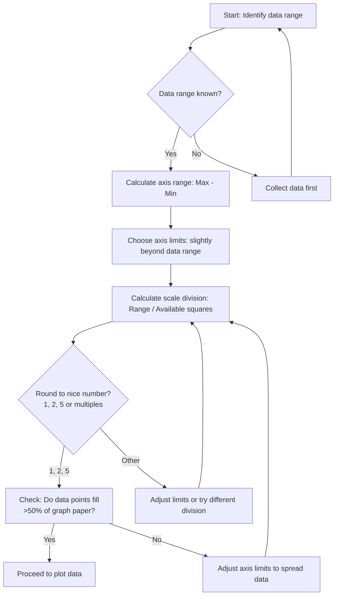

# 1. Overview / 概述

**English:**
Choosing appropriate axes and scales is a foundational skill in physics graph plotting. This sub-topic covers how to select which variable to plot on which axis, how to determine suitable scale ranges, and how to choose scale divisions that allow accurate reading of data points and derived quantities like gradient and intercept. Proper axis and scale selection is the critical first step that determines whether your graph will be useful for analysis. Without appropriate axes and scales, even perfectly collected data can yield misleading results. This skill connects directly to [[Determining Gradient and Intercept]], [[Linearisation of Non-Linear Relationships]], and [[Uncertainties and Errors]].

**中文:**
选择合适的坐标轴和标度是物理绘图的基础技能。本子知识点涵盖如何选择将哪个变量绘制在哪个坐标轴上、如何确定合适的标度范围、以及如何选择能够准确读取数据点和导出量（如斜率和截距）的标度划分。正确的坐标轴和标度选择是决定图表是否可用于分析的关键第一步。如果没有合适的坐标轴和标度，即使数据收集得再完美，也可能得出误导性的结果。这项技能直接关系到[[Determining Gradient and Intercept|斜率和截距的确定]]、[[Linearisation of Non-Linear Relationships|非线性关系的线性化]]以及[[Uncertainties and Errors|不确定度和误差]]。

---

# 2. Syllabus Learning Objectives / 考纲学习目标

| CAIE 9702 | Edexcel IAL |
|-----------|-------------|
| 1.5(a) Choose appropriate axes and scales for graph plotting | WPH11 U1: 1.13 Select appropriate scales for axes |
| 1.5(b) Label axes with quantity, symbol and unit | WPH11 U1: 1.14 Label axes correctly with quantity and unit |
| 1.5(c) Plot data points accurately | WPH11 U1: 1.15 Plot data points with appropriate precision |
| 1.5(d) Use error bars where appropriate | WPH11 U1: 1.16 Use error bars to represent uncertainties |
| 1.5(e) Draw best-fit line or curve | WPH11 U1: 1.17 Draw line of best fit |
| 1.5(f) Determine gradient and intercept | WPH11 U1: 1.18 Determine gradient and intercept from graph |

**Examiner Expectations / 考官期望:**
- **English:** You must be able to justify your choice of axes and scales. Examiners expect the independent variable on the x-axis and dependent variable on the y-axis. Scales must be chosen so that data points occupy at least half the graph paper in both directions. Axes must be labelled with the quantity name (or symbol) and unit in the format "Quantity / Unit".
- **中文:** 你必须能够证明你的坐标轴和标度选择是合理的。考官期望自变量在x轴上，因变量在y轴上。标度必须选择使得数据点在两个方向上至少占据图纸的一半。坐标轴必须用"物理量/单位"的格式标注物理量名称（或符号）和单位。

---

# 3. Core Definitions / 核心定义

| Term (EN/CN) | Definition (EN) | Definition (CN) | Common Mistakes / 常见错误 |
|--------------|-----------------|-----------------|---------------------------|
| **Independent Variable** / 自变量 | The variable that is deliberately changed or controlled by the experimenter; plotted on the x-axis | 实验者有意改变或控制的变量；绘制在x轴上 | Confusing with dependent variable; plotting on wrong axis |
| **Dependent Variable** / 因变量 | The variable that is measured as a result of changing the independent variable; plotted on the y-axis | 因自变量改变而被测量的变量；绘制在y轴上 | Confusing with independent variable |
| **Scale** / 标度 | The range and division of values on an axis that determines how data points are positioned | 坐标轴上的数值范围和划分，决定数据点的位置 | Choosing scales that compress data into a small area |
| **Scale Division** / 标度划分 | The interval between consecutive labelled marks on an axis (e.g., 1 cm = 2 units) | 坐标轴上相邻标注刻度之间的间隔（例如1厘米=2个单位） | Using awkward divisions like 1 cm = 3 units |
| **Axis Label** / 坐标轴标签 | The text identifying what is plotted on an axis, including quantity and unit in format "Quantity / Unit" | 标识坐标轴上绘制内容的文本，包括物理量和单位，格式为"物理量/单位" | Missing unit; incorrect format; no quantity name |
| **Origin** / 原点 | The point (0,0) where x-axis and y-axis intersect | x轴和y轴相交的点(0,0) | Forcing the origin when data doesn't start at zero |

---

# 4. Key Concepts Explained / 关键概念详解

## 4.1 Choosing Which Variable Goes on Which Axis / 选择哪个变量放在哪个坐标轴上

### Explanation / 解释
**English:** The fundamental rule is: the **independent variable** (the one you control or change) goes on the **x-axis** (horizontal), and the **dependent variable** (the one you measure) goes on the **y-axis** (vertical). For example, in an experiment investigating how the extension of a spring depends on the applied force, force is the independent variable (you add masses) and extension is the dependent variable (you measure it). Therefore, force goes on the x-axis and extension on the y-axis. This convention is universal in physics and allows meaningful interpretation of [[Determining Gradient and Intercept|gradients and intercepts]].

**中文:** 基本规则是：**自变量**（你控制或改变的变量）放在**x轴**（水平轴）上，**因变量**（你测量的变量）放在**y轴**（垂直轴）上。例如，在研究弹簧伸长量如何取决于施加力的实验中，力是自变量（你添加砝码），伸长量是因变量（你测量它）。因此，力在x轴上，伸长量在y轴上。这个惯例在物理学中是通用的，使得[[Determining Gradient and Intercept|斜率和截距]]的解释有意义。

### Physical Meaning / 物理意义
**English:** The graph shows how the measured quantity responds to changes in the controlled quantity. The gradient represents the rate of change of the dependent variable with respect to the independent variable, which often corresponds to a physical constant (e.g., spring constant, resistance).

**中文:** 图表显示测量量如何响应控制量的变化。斜率表示因变量相对于自变量的变化率，这通常对应一个物理常数（例如弹簧常数、电阻）。

### Common Misconceptions / 常见误区
- **English:** "Time should always be on the x-axis." While time is often the independent variable, this is not always true. Always identify which variable you control.
- **中文:** "时间应该总是在x轴上。"虽然时间通常是自变量，但这并不总是正确的。始终要确定你控制的是哪个变量。
- **English:** "It doesn't matter which axis gets which variable." This is incorrect; swapping axes changes the physical meaning of the gradient.
- **中文:** "哪个变量放在哪个轴上无所谓。"这是错误的；交换坐标轴会改变斜率的物理意义。

### Exam Tips / 考试提示
- **English:** In exam questions, look for phrases like "varies with" or "depends on" — the variable after these phrases is usually the dependent variable (y-axis).
- **中文:** 在考试题目中，寻找"随...变化"或"取决于..."等短语——这些短语后面的变量通常是因变量（y轴）。

> 📷 **IMAGE PROMPT — AXES-01: Correct vs Incorrect Axis Assignment**
> A split diagram showing two graphs of the same data. Left graph: Correct assignment with independent variable (Force) on x-axis and dependent variable (Extension) on y-axis, with a clear linear relationship. Right graph: Incorrect assignment with axes swapped, showing the same data but with different physical interpretation. Labels clearly show "Force / N" and "Extension / m" in correct format.

## 4.2 Choosing Appropriate Scale Range / 选择合适的标度范围

### Explanation / 解释
**English:** The scale range must be chosen so that the data points occupy **at least half** of the graph paper in both the x and y directions. This is a critical exam requirement. To achieve this:
1. Find the minimum and maximum values for each variable from your data.
2. Choose axis limits that are slightly beyond these extremes (e.g., if data ranges from 0.5 to 4.8, choose axis from 0 to 5.0).
3. Ensure the scale divisions are **easy to read** — use 1, 2, or 5 units per major division (or multiples like 10, 20, 50; 0.1, 0.2, 0.5).
4. **Do not force the origin** (0,0) if your data does not start near zero — this would compress your data into a small area.

**中文:** 标度范围必须选择使得数据点在x和y两个方向上**至少占据图纸的一半**。这是一个关键的考试要求。要做到这一点：
1. 从数据中找出每个变量的最小值和最大值。
2. 选择略超出这些极值的坐标轴限制（例如，如果数据范围从0.5到4.8，选择坐标轴从0到5.0）。
3. 确保标度划分**易于读取**——每个大格使用1、2或5个单位（或倍数如10、20、50；0.1、0.2、0.5）。
4. 如果数据不从零附近开始，**不要强制使用原点**(0,0)——这会把数据压缩到一个小区域。

### Physical Meaning / 物理意义
**English:** A well-chosen scale allows you to read data points and derived quantities (gradient, intercept) with maximum precision. Poor scale choice introduces unnecessary reading uncertainty.

**中文:** 选择良好的标度可以让你以最大精度读取数据点和导出量（斜率、截距）。糟糕的标度选择会引入不必要的读数不确定度。

### Common Misconceptions / 常见误区
- **English:** "The graph must always start at (0,0)." This is false. Only start at zero if your data includes zero or if the physical relationship passes through the origin.
- **中文:** "图表必须始终从(0,0)开始。"这是错误的。只有当你的数据包含零或者物理关系通过原点时才从零开始。
- **English:** "Using a smaller scale makes the graph look more precise." This is misleading — it may exaggerate small variations that are within experimental uncertainty.
- **中文:** "使用更小的标度使图表看起来更精确。"这是误导性的——它可能夸大在实验不确定度范围内的小变化。

### Exam Tips / 考试提示
- **English:** Always check: "Do my data points fill at least half the graph paper in both directions?" If not, adjust your scales.
- **中文:** 始终检查："我的数据点在两个方向上都至少填满图纸的一半了吗？"如果没有，调整你的标度。

> 📷 **IMAGE PROMPT — AXES-02: Good Scale vs Poor Scale**
> Two graphs of the same data set. Left graph: Good scale choice — data points spread across 70% of the graph paper, clear grid lines at 1, 2, 5 intervals, axes starting at appropriate values. Right graph: Poor scale choice — data points clustered in a small corner because the axis starts at (0,0) when data ranges from 3.2 to 4.8, making analysis difficult. Labels highlight the wasted space.

## 4.3 Choosing Appropriate Scale Divisions / 选择合适的标度划分

### Explanation / 解释
**English:** Scale divisions must be chosen so that:
1. **Each large square represents a "nice" number**: 1, 2, 5, or multiples/decimals of these (10, 20, 50; 0.1, 0.2, 0.5; 0.01, 0.02, 0.05).
2. **Avoid awkward divisions**: Never use 1 cm = 3 units, 7 units, or 9 units — these make plotting and reading very difficult.
3. **Consistency**: The same scale division should be used across the entire axis.
4. **Small squares are easily subdivided**: If using graph paper with 20 small squares per large square, ensure each small square represents a convenient fraction (e.g., if 1 large square = 0.5 units, then 1 small square = 0.025 units).

**中文:** 标度划分必须选择使得：
1. **每个大格代表一个"好"的数字**：1、2、5，或这些数的倍数/小数（10、20、50；0.1、0.2、0.5；0.01、0.02、0.05）。
2. **避免尴尬的划分**：切勿使用1厘米=3个单位、7个单位或9个单位——这些会使绘图和读数非常困难。
3. **一致性**：整个坐标轴应使用相同的标度划分。
4. **小格易于细分**：如果使用每大格有20个小格的图纸，确保每个小格代表一个方便的分数（例如，如果1大格=0.5个单位，那么1小格=0.025个单位）。

### Physical Meaning / 物理意义
**English:** The scale division determines the precision with which you can plot and read data points. A good division allows you to estimate readings to ±0.5 of the smallest division.

**中文:** 标度划分决定了你绘制和读取数据点的精度。良好的划分允许你估计读数到最小划分的±0.5。

### Common Misconceptions / 常见误区
- **English:** "Any scale division is fine as long as all data fits." This is incorrect — awkward divisions make gradient calculation inaccurate.
- **中文:** "只要所有数据都能放进去，任何标度划分都可以。"这是错误的——尴尬的划分会使斜率计算不准确。

### Exam Tips / 考试提示
- **English:** Before plotting, quickly check: "Can I easily plot a point at 3.7 if 1 large square = 2 units?" If not, choose a different division.
- **中文:** 在绘图前，快速检查："如果1大格=2个单位，我能轻松绘制3.7这个点吗？"如果不能，选择不同的划分。

---

# 5. Essential Equations / 核心公式

## Scale Division Formula / 标度划分公式

$$ \text{Scale Division} = \frac{\text{Axis Range}}{\text{Number of Large Squares Available}} $$

| Symbol (符号) | Meaning (EN) | Meaning (CN) | Unit (单位) |
|--------------|-------------|-------------|------------|
| Axis Range | Maximum value - Minimum value on the axis | 坐标轴上的最大值减去最小值 | Same as variable |
| Number of Large Squares | Available graph paper divisions (typically 10-20) | 可用的图纸大格数（通常10-20） | dimensionless |
| Scale Division | Value represented by one large square | 一个大格代表的值 | Same as variable |

**Derivation / 推导:** This is a practical formula, not a theoretical one. It helps you choose a convenient scale division that fits your data onto the graph paper.

**Conditions / 适用条件:**
- **English:** The number of large squares depends on the graph paper provided (typically 10-20 in exam papers).
- **中文:** 大格数取决于提供的图纸（考试卷中通常为10-20格）。

**Limitations / 局限性:**
- **English:** This formula gives a starting point; you must round the result to a "nice" number (1, 2, 5 or multiples).
- **中文:** 这个公式给出一个起点；你必须将结果四舍五入到一个"好"的数字（1、2、5或倍数）。

## Data Point Occupancy Rule / 数据点占据规则

$$ \text{Minimum Occupancy} \geq 50\% \text{ of graph paper in each direction} $$

| Symbol (符号) | Meaning (EN) | Meaning (CN) | Unit (单位) |
|--------------|-------------|-------------|------------|
| Minimum Occupancy | The proportion of the axis range actually used by data | 数据实际使用的坐标轴范围比例 | % |

**Conditions / 适用条件:**
- **English:** This is a CAIE and Edexcel exam requirement. Data must occupy at least half the graph paper in both x and y directions.
- **中文:** 这是CAIE和Edexcel的考试要求。数据必须在x和y两个方向上至少占据图纸的一半。

---

# 6. Graphs and Relationships / 图表与关系

## 6.1 Scale Selection Decision Flowchart / 标度选择决策流程图

### Axes / 坐标轴
- **English:** Not applicable — this is a decision flowchart, not a data graph.
- **中文:** 不适用——这是一个决策流程图，不是数据图表。

### Shape / 形状
- **English:** A branching flowchart showing the decision process for choosing scales.
- **中文:** 一个分支流程图，显示选择标度的决策过程。

### Exam Interpretation / 考试解读
- **English:** Use this flowchart when setting up any graph in practical exams or data analysis questions.
- **中文:** 在实验考试或数据分析题中设置任何图表时使用此流程图。

---

# 7. Required Diagrams / 必备图表

## 7.1 Correct Axis Label Format / 正确的坐标轴标签格式

### Description / 描述
**English:** A diagram showing the standard format for labelling axes in physics graphs. The format is "Quantity Name / Unit" (e.g., "Force / N", "Extension / m", "Time / s"). The quantity name can be written in words or as a symbol.

**中文:** 显示物理图表中坐标轴标签标准格式的图示。格式为"物理量名称/单位"（例如"力/N"、"伸长量/m"、"时间/s"）。物理量名称可以用文字或符号书写。

### Image Prompt / 图片生成提示
> 📷 **IMAGE PROMPT — AXES-03: Correct Axis Label Format**
> A close-up of a graph axis showing the correct label format. The x-axis is labelled "Force / N" with the forward slash clearly visible. The y-axis is labelled "Extension / m". Scale marks show values 0, 1, 2, 3, 4, 5 on x-axis and 0, 0.02, 0.04, 0.06, 0.08, 0.10 on y-axis. An inset shows common incorrect formats crossed out: "Force (N)" without slash, "F/N" without quantity name, "Force N" without slash.

### Labels Required / 需要标注
- **English:** "Force / N" (x-axis label), "Extension / m" (y-axis label), scale values, forward slash between quantity and unit
- **中文:** "力/N"（x轴标签）、"伸长量/m"（y轴标签）、标度值、物理量和单位之间的斜杠

### Exam Importance / 考试重要性
- **English:** This is a frequently tested point. Incorrect axis labelling loses marks even if the data is plotted correctly.
- **中文:** 这是一个经常被测试的点。即使数据绘制正确，错误的坐标轴标签也会失分。

## 7.2 Good vs Poor Scale Selection / 好的与差的标度选择对比

### Description / 描述
**English:** A side-by-side comparison of two graphs plotting the same data with different scale choices. The "good" graph shows data spread across 70% of the paper with nice scale divisions. The "poor" graph shows data clustered in a corner with awkward divisions.

**中文:** 两个使用不同标度选择绘制相同数据的图表的并排比较。"好"的图表显示数据分布在图纸的70%上，标度划分良好。"差"的图表显示数据聚集在一个角落，标度划分尴尬。

### Image Prompt / 图片生成提示
> 📷 **IMAGE PROMPT — AXES-04: Good vs Poor Scale Selection**
> Split diagram. LEFT: Good scale selection — x-axis from 0 to 5.0 with divisions every 1.0 unit, y-axis from 0 to 0.10 with divisions every 0.02 units. Data points (0.5, 0.012), (1.0, 0.025), (1.5, 0.038), (2.0, 0.048), (2.5, 0.062), (3.0, 0.075), (3.5, 0.085), (4.0, 0.098) spread across the graph. RIGHT: Poor scale selection — x-axis from 0 to 10 with divisions every 2 units, y-axis from 0 to 0.20 with divisions every 0.05 units. Same data points clustered in the bottom-left quarter. Red arrows highlight wasted space.

### Labels Required / 需要标注
- **English:** "Good: >50% occupancy, nice divisions" and "Poor: <50% occupancy, awkward divisions"
- **中文:** "好：>50%占据，良好划分"和"差：<50%占据，尴尬划分"

### Exam Importance / 考试重要性
- **English:** This is a common exam question — you may be asked to evaluate whether a given graph has appropriate scales.
- **中文:** 这是一个常见的考试问题——你可能会被要求评估给定的图表是否有合适的标度。

---

# 8. Worked Examples / 典型例题

## Example 1: Choosing Scales for a Spring Experiment / 为弹簧实验选择标度

### Question / 题目
**English:**
A student investigates the relationship between force applied to a spring and its extension. The data collected is:

| Force / N | Extension / cm |
|-----------|----------------|
| 0.0       | 0.0            |
| 0.5       | 1.2            |
| 1.0       | 2.5            |
| 1.5       | 3.7            |
| 2.0       | 5.0            |
| 2.5       | 6.2            |
| 3.0       | 7.5            |

The graph paper has 10 large squares in both x and y directions. Choose appropriate axes, scales, and justify your choices.

**中文:**
一名学生研究施加在弹簧上的力与其伸长量之间的关系。收集的数据如下：

| 力 / N | 伸长量 / cm |
|--------|-------------|
| 0.0    | 0.0         |
| 0.5    | 1.2         |
| 1.0    | 2.5         |
| 1.5    | 3.7         |
| 2.0    | 5.0         |
| 2.5    | 6.2         |
| 3.0    | 7.5         |

图纸在x和y两个方向各有10个大格。选择合适的坐标轴和标度，并证明你的选择是合理的。

### Solution / 解答

**Step 1: Identify variables / 步骤1：确定变量**
- **English:** Independent variable (x-axis): Force (controlled by adding masses). Dependent variable (y-axis): Extension (measured).
- **中文:** 自变量（x轴）：力（通过添加砝码控制）。因变量（y轴）：伸长量（测量得到）。

**Step 2: Determine axis ranges / 步骤2：确定坐标轴范围**
- **English:** Force: min = 0.0 N, max = 3.0 N. Range = 3.0 N. Choose x-axis from 0 to 3.5 N (slightly beyond max).
- **中文:** 力：最小值=0.0 N，最大值=3.0 N。范围=3.0 N。选择x轴从0到3.5 N（略超出最大值）。
- **English:** Extension: min = 0.0 cm, max = 7.5 cm. Range = 7.5 cm. Choose y-axis from 0 to 8.0 cm (slightly beyond max).
- **中文:** 伸长量：最小值=0.0 cm，最大值=7.5 cm。范围=7.5 cm。选择y轴从0到8.0 cm（略超出最大值）。

**Step 3: Calculate scale divisions / 步骤3：计算标度划分**
- **English:** x-axis: 3.5 N ÷ 10 squares = 0.35 N per square. Round to 0.5 N per square (nice number). This gives axis from 0 to 5.0 N, but data only goes to 3.0 N — too much wasted space. Adjust: Use 0.5 N per square, axis from 0 to 3.5 N (7 squares used, 70% occupancy ✓).
- **中文:** x轴：3.5 N ÷ 10格 = 每格0.35 N。四舍五入到每格0.5 N（好数字）。这给出坐标轴从0到5.0 N，但数据只到3.0 N——浪费太多空间。调整：使用每格0.5 N，坐标轴从0到3.5 N（使用7格，70%占据 ✓）。
- **English:** y-axis: 8.0 cm ÷ 10 squares = 0.8 cm per square. Round to 1.0 cm per square (nice number). This gives axis from 0 to 10.0 cm, data goes to 7.5 cm — 7.5 squares used, 75% occupancy ✓.
- **中文:** y轴：8.0 cm ÷ 10格 = 每格0.8 cm。四舍五入到每格1.0 cm（好数字）。这给出坐标轴从0到10.0 cm，数据到7.5 cm——使用7.5格，75%占据 ✓。

**Step 4: Final scale choices / 步骤4：最终标度选择**
- **English:** x-axis: 0 to 3.5 N, 1 large square = 0.5 N. y-axis: 0 to 10.0 cm, 1 large square = 1.0 cm.
- **中文:** x轴：0到3.5 N，1大格=0.5 N。y轴：0到10.0 cm，1大格=1.0 cm。

### Final Answer / 最终答案
**Answer:** x-axis: Force / N, scale 0 to 3.5 N (1 square = 0.5 N). y-axis: Extension / cm, scale 0 to 10.0 cm (1 square = 1.0 cm). Both axes start at origin because data includes (0,0). Data occupies >50% of graph paper in both directions. | **答案：** x轴：力/N，标度0到3.5 N（1格=0.5 N）。y轴：伸长量/cm，标度0到10.0 cm（1格=1.0 cm）。两个坐标轴都从原点开始，因为数据包含(0,0)。数据在两个方向上都占据>50%的图纸。

### Quick Tip / 提示
- **English:** Always check the occupancy rule: "Do my data points fill at least half the graph paper?" If not, adjust your axis limits.
- **中文:** 始终检查占据规则："我的数据点至少填满图纸的一半了吗？"如果没有，调整你的坐标轴限制。

---

## Example 2: When NOT to Force the Origin / 何时不强制使用原点

### Question / 题目
**English:**
A student measures the voltage across a component at different currents:

| Current / mA | Voltage / V |
|--------------|-------------|
| 2.0          | 0.45        |
| 4.0          | 0.88        |
| 6.0          | 1.32        |
| 8.0          | 1.76        |
| 10.0         | 2.20        |

The graph paper has 10 large squares in both directions. Choose appropriate scales. Should the origin (0,0) be included?

**中文:**
一名学生测量了不同电流下元件两端的电压：

| 电流 / mA | 电压 / V |
|-----------|----------|
| 2.0       | 0.45     |
| 4.0       | 0.88     |
| 6.0       | 1.32     |
| 8.0       | 1.76     |
| 10.0      | 2.20     |

图纸在x和y两个方向各有10个大格。选择合适的标度。是否应该包含原点(0,0)？

### Solution / 解答

**Step 1: Identify variables / 步骤1：确定变量**
- **English:** x-axis: Current / mA (independent). y-axis: Voltage / V (dependent).
- **中文:** x轴：电流/mA（自变量）。y轴：电压/V（因变量）。

**Step 2: Check data range / 步骤2：检查数据范围**
- **English:** Current: 2.0 to 10.0 mA. Voltage: 0.45 to 2.20 V. Data does NOT include (0,0).
- **中文:** 电流：2.0到10.0 mA。电压：0.45到2.20 V。数据不包含(0,0)。

**Step 3: Option A — Force origin / 步骤3：选项A——强制使用原点**
- **English:** x-axis: 0 to 12 mA (1 square = 1.2 mA, awkward). y-axis: 0 to 2.5 V (1 square = 0.25 V). Data occupies only 10/12 = 83% of x-axis but only 2.2/2.5 = 88% of y-axis. However, the lower half of the graph (0 to 2.0 mA and 0 to 0.45 V) is empty — wasted space.
- **中文:** x轴：0到12 mA（1格=1.2 mA，尴尬）。y轴：0到2.5 V（1格=0.25 V）。数据只占据x轴的10/12=83%，y轴的2.2/2.5=88%。但是，图表的下半部分（0到2.0 mA和0到0.45 V）是空的——浪费空间。

**Step 4: Option B — No origin / 步骤4：选项B——不使用原点**
- **English:** x-axis: 1.5 to 10.5 mA (range = 9.0 mA). 9.0 ÷ 10 = 0.9, round to 1.0 mA per square. Axis: 1.5 to 11.5 mA (10 squares). Data occupies 8.0/10.0 = 80% ✓.
- **中文:** x轴：1.5到10.5 mA（范围=9.0 mA）。9.0÷10=0.9，四舍五入到每格1.0 mA。坐标轴：1.5到11.5 mA（10格）。数据占据8.0/10.0=80% ✓。
- **English:** y-axis: 0.30 to 2.30 V (range = 2.00 V). 2.00 ÷ 10 = 0.20 V per square. Axis: 0.30 to 2.30 V (10 squares). Data occupies 1.75/2.00 = 87.5% ✓.
- **中文:** y轴：0.30到2.30 V（范围=2.00 V）。2.00÷10=每格0.20 V。坐标轴：0.30到2.30 V（10格）。数据占据1.75/2.00=87.5% ✓。

**Step 5: Conclusion / 步骤5：结论**
- **English:** Option B is better. The origin is not included because data does not start near zero. Including the origin would waste graph paper and reduce precision.
- **中文:** 选项B更好。不包含原点，因为数据不从零附近开始。包含原点会浪费图纸并降低精度。

### Final Answer / 最终答案
**Answer:** Do NOT force the origin. x-axis: Current / mA, 1.5 to 11.5 mA (1 square = 1.0 mA). y-axis: Voltage / V, 0.30 to 2.30 V (1 square = 0.20 V). This gives >50% occupancy and nice scale divisions. | **答案：** 不要强制使用原点。x轴：电流/mA，1.5到11.5 mA（1格=1.0 mA）。y轴：电压/V，0.30到2.30 V（1格=0.20 V）。这给出>50%占据和良好的标度划分。

### Quick Tip / 提示
- **English:** If your smallest data value is far from zero, start the axis at a value slightly below the minimum. Use a zigzag line (//) on the axis to indicate a broken scale if needed.
- **中文:** 如果你的最小数据值远离零，从略低于最小值的数值开始坐标轴。如果需要，在坐标轴上使用锯齿线(//)表示标度中断。

---

# 9. Past Paper Question Types / 历年真题题型

| Question Type / 题型 | Frequency / 频率 | Difficulty / 难度 | Past Paper References / 真题索引 |
|----------------------|------------------|------------------|-------------------------------|
| Choose appropriate scales for given data | High | Easy | 📝 *待填入* |
| Evaluate whether a given graph has appropriate scales | Medium | Medium | 📝 *待填入* |
| Justify scale choices in written explanation | Medium | Medium | 📝 *待填入* |
| Identify and correct errors in axis labelling | High | Easy | 📝 *待填入* |
| Determine if origin should be included | Low | Medium | 📝 *待填入* |

**Common Command Words / 常见指令词:**
- **English:** "Choose", "Select", "Justify", "Explain", "State", "Determine", "Evaluate"
- **中文:** "选择"、"选取"、"证明合理"、"解释"、"说明"、"确定"、"评估"

---

# 10. Practical Skills Connections / 实验技能链接

**English:**
Choosing appropriate axes and scales is directly tested in practical exams (Paper 3 for CAIE, Unit 6 for Edexcel). Key connections:

1. **Measurements and Uncertainties:** Scale divisions determine the precision of readings. A good scale allows you to estimate to ±0.5 of the smallest division. This connects to [[Uncertainties and Errors]].

2. **Graph Plotting:** After choosing scales, you plot data points with [[Plotting Data Points with Error Bars]]. Poor scale choice makes error bar placement inaccurate.

3. **Data Analysis:** The scale directly affects [[Determining Gradient and Intercept]]. A poorly chosen scale can make gradient calculation inaccurate by 10% or more.

4. **Experimental Design:** Before collecting data, you should plan your expected range and choose scales accordingly. This helps ensure you collect data over an appropriate range.

**Common Practical Mistakes:**
- Forgetting to label axes with correct format
- Choosing scales that compress data into a small area
- Using awkward scale divisions (1 cm = 3 units)
- Forcing the origin when data doesn't start at zero

**中文:**
选择合适的坐标轴和标度在实验考试中直接测试（CAIE的Paper 3，Edexcel的Unit 6）。关键联系：

1. **测量和不确定度：** 标度划分决定了读数的精度。良好的标度允许你估计到最小划分的±0.5。这与[[Uncertainties and Errors|不确定度和误差]]相关。

2. **图表绘制：** 选择标度后，你用[[Plotting Data Points with Error Bars|带有误差棒的数据点绘制]]。糟糕的标度选择会使误差棒放置不准确。

3. **数据分析：** 标度直接影响[[Determining Gradient and Intercept|斜率和截距的确定]]。选择不当的标度可能使斜率计算误差达到10%或更多。

4. **实验设计：** 在收集数据之前，你应该计划预期的范围并相应选择标度。这有助于确保你在适当的范围内收集数据。

**常见实验错误：**
- 忘记用正确的格式标注坐标轴
- 选择将数据压缩到小区域的标度
- 使用尴尬的标度划分（1厘米=3个单位）
- 当数据不从零开始时强制使用原点

---

# 11. Concept Map / 概念图谱

```mermaid
graph TD
    %% Core node
    A[Choosing Appropriate Axes and Scales] --> B[Identify Variables]
    A --> C[Select Axis Limits]
    A --> D[Choose Scale Divisions]
    A --> E[Label Axes Correctly]
    
    %% Variable identification
    B --> B1[Independent Variable → x-axis]
    B --> B2[Dependent Variable → y-axis]
    B1 --> B1a[Controlled by experimenter]
    B2 --> B2a[Measured quantity]
    
    %% Axis limits
    C --> C1[Find min and max of data]
    C --> C2[Choose limits slightly beyond extremes]
    C --> C3{Include origin?}
    C3 -->|Data includes 0| C3a[Yes - start at 0]
    C3 -->|Data far from 0| C3b[No - start near min value]
    C --> C4[Check: >50% occupancy?]
    
    %% Scale divisions
    D --> D1[Calculate: Range ÷ Available squares]
    D --> D2[Round to nice number: 1, 2, 5 or multiples]
    D --> D3[Avoid awkward divisions: 3, 7, 9]
    D --> D4[Ensure small squares are easily subdivided]
    
    %% Axis labels
    E --> E1[Format: Quantity / Unit]
    E --> E2[Include quantity name or symbol]
    E --> E3[Include unit abbreviation]
    
    %% Connections to other topics
    A --> F[[Graph Plotting Skills]]
    F --> G[[Plotting Data Points with Error Bars]]
    F --> H[[Drawing Lines of Best Fit and Worst Fit]]
    F --> I[[Determining Gradient and Intercept]]
    F --> J[[Linearisation of Non-Linear Relationships]]
    A --> K[[Uncertainties and Errors]]
    A --> L[[SI Units, Prefixes and Homogeneity of Equations]]
    
    %% Styling
    classDef core fill:#4a90d9,color:white,stroke:#2c5f8a,stroke-width:2px
    classDef process fill:#e8f4f8,stroke:#4a90d9,stroke-width:1px
    classDef decision fill:#fff3cd,stroke:#ffc107,stroke-width:1px
    classDef link fill:#f8f9fa,stroke:#6c757d,stroke-width:1px,stroke-dasharray: 5 5
    
    class A core
    class B,C,D,E process
    class C3 decision
    class F,G,H,I,J,K,L link
```

---

# 12. Quick Revision Sheet / 速查表

| Category / 类别 | Key Points / 要点 |
|----------------|------------------|
| **Definition / 定义** | Choosing which variable goes on which axis, what range to use, and what scale divisions to mark |
| **Key Rule 1 / 关键规则1** | Independent variable → x-axis; Dependent variable → y-axis |
| **Key Rule 2 / 关键规则2** | Data must occupy **≥50%** of graph paper in both directions |
| **Key Rule 3 / 关键规则3** | Scale divisions must be **nice numbers**: 1, 2, 5 or multiples (10, 20, 50; 0.1, 0.2, 0.5) |
| **Key Rule 4 / 关键规则4** | **Do not force origin** if data doesn't start near zero |
| **Key Formula / 核心公式** | Scale Division = Axis Range ÷ Number of Large Squares (round to nice number) |
| **Axis Label Format / 坐标轴标签格式** | "Quantity / Unit" (e.g., "Force / N", "Extension / m") |
| **Common Mistake 1 / 常见错误1** | Swapping independent and dependent variables |
| **Common Mistake 2 / 常见错误2** | Using awkward divisions (1 cm = 3 units, 7 units, 9 units) |
| **Common Mistake 3 / 常见错误3** | Forcing origin when data starts far from zero |
| **Common Mistake 4 / 常见错误4** | Incorrect axis label format (missing slash, missing unit, wrong order) |
| **Exam Tip / 考试提示** | Always check occupancy before plotting: "Do my points fill >50% of the paper?" |
| **Practical Connection / 实验联系** | Scale choice affects precision of [[Determining Gradient and Intercept\|gradient]] and [[Plotting Data Points with Error Bars\|error bar]] placement |
| **Prerequisite / 前置知识** | [[SI Units, Prefixes and Homogeneity of Equations]] for correct unit usage |