# 1. Overview / 概述

**English:**
This sub-topic covers the fundamental skill of determining the gradient (slope) and intercept from a straight-line graph. In A-Level Physics, graphs are not just visual representations—they are powerful tools for extracting quantitative information about physical relationships. The gradient of a line often represents a physical quantity (e.g., velocity from a displacement-time graph, resistance from a current-voltage graph), while the intercept can reveal initial conditions or systematic offsets. This skill is essential for all practical work and data analysis, forming the bridge between raw data and physical conclusions. It builds directly on [[SI Units, Prefixes and Homogeneity of Equations]] and is a prerequisite for [[Linearisation of Non-Linear Relationships]] and [[Using Graph Gradients to Find Physical Quantities]].

**中文:**
本子知识点涵盖从直线图中确定梯度（斜率）和截距的基本技能。在A-Level物理中，图表不仅仅是视觉表示——它们是提取物理关系定量信息的强大工具。直线的梯度通常代表一个物理量（例如，位移-时间图中的速度，电流-电压图中的电阻），而截距可以揭示初始条件或系统偏移。这项技能对所有实验工作和数据分析至关重要，是连接原始数据和物理结论的桥梁。它直接建立在[[SI Units, Prefixes and Homogeneity of Equations]]的基础上，是[[Linearisation of Non-Linear Relationships]]和[[Using Graph Gradients to Find Physical Quantities]]的先决条件。

---

# 2. Syllabus Learning Objectives / 考纲学习目标

| CAIE 9702 | Edexcel IAL |
|-----------|-------------|
| 1.5(a) Determine the gradient of a graph | WPH11 U1: 1.13 Determine the gradient of a straight-line graph |
| 1.5(b) Determine the intercept of a graph | WPH11 U1: 1.14 Determine the intercept of a straight-line graph |
| 1.5(c) Use the gradient and intercept to find physical quantities | WPH11 U1: 1.15 Use gradient to calculate physical quantities |
| 1.5(d) Understand the significance of the y-intercept | WPH11 U1: 1.16 Understand the physical meaning of intercept |
| 1.5(e) Calculate gradient using two points on the line of best fit | WPH11 U1: 1.17 Calculate gradient using Δy/Δx |
| 1.5(f) Include appropriate units for gradient and intercept | WPH11 U1: 1.18 Include correct units for gradient and intercept |

**Examiner Expectations / 考官期望:**
- **English:** You must use the line of best fit (not individual data points) to determine gradient. Always show your working triangle on the graph. Include units in your final answer. For intercepts, read from the graph where the line crosses the y-axis (x=0).
- **中文:** 必须使用最佳拟合线（而非单个数据点）来确定梯度。始终在图表上显示你的计算三角形。在最终答案中包含单位。对于截距，从图表中读取直线与y轴（x=0）的交点。

---

# 3. Core Definitions / 核心定义

| Term (EN/CN) | Definition (EN) | Definition (CN) | Common Mistakes / 常见错误 |
|--------------|-----------------|-----------------|---------------------------|
| **Gradient** / 梯度 | The rate of change of the dependent variable with respect to the independent variable, calculated as Δy/Δx from a straight-line graph | 因变量相对于自变量的变化率，从直线图中计算为Δy/Δx | Using data points instead of the line of best fit; forgetting units |
| **Intercept** / 截距 | The value of the dependent variable when the independent variable is zero (where the line crosses the y-axis) | 当自变量为零时因变量的值（直线与y轴的交点） | Reading from x=0 when the scale doesn't start at zero; confusing y-intercept with x-intercept |
| **Line of Best Fit** / 最佳拟合线 | The straight line that best represents the trend of the data points, passing as close to all points as possible | 最能代表数据点趋势的直线，尽可能靠近所有数据点 | Drawing a line that connects all points; ignoring outliers |
| **Gradient Triangle** / 梯度三角形 | A right-angled triangle drawn on the graph to calculate gradient, with Δy and Δx clearly marked | 在图表上绘制的直角三角形，用于计算梯度，Δy和Δx清晰标注 | Using points too close together; not marking the triangle on the graph |
| **y = mx + c** / 直线方程 | The general equation of a straight line, where m is the gradient and c is the y-intercept | 直线的一般方程，其中m是梯度，c是y截距 | Confusing which variable is dependent/independent |

---

# 4. Key Concepts Explained / 关键概念详解

## 4.1 The Gradient Triangle Method / 梯度三角形法

### Explanation / 解释
**English:**
The gradient triangle is the standard method for determining gradient from a graph. You select two points on the **line of best fit** (not data points) that are far apart—ideally covering more than half the length of the line. Draw a right-angled triangle connecting these points, with the horizontal side representing Δx and the vertical side representing Δy. The gradient is then calculated as:

$$ m = \frac{\Delta y}{\Delta x} = \frac{y_2 - y_1}{x_2 - x_1} $$

The triangle must be large enough to minimize reading errors. Always show this triangle on your graph in the exam—it's part of the marking scheme. This method is directly linked to [[Drawing Lines of Best Fit and Worst Fit]].

**中文:**
梯度三角形是从图表中确定梯度的标准方法。你在**最佳拟合线**（而非数据点）上选择两个相距较远的点——理想情况下覆盖超过直线长度的一半。绘制一个连接这些点的直角三角形，水平边代表Δx，垂直边代表Δy。然后梯度计算为：

$$ m = \frac{\Delta y}{\Delta x} = \frac{y_2 - y_1}{x_2 - x_1} $$

三角形必须足够大以最小化读数误差。在考试中始终在图表上显示这个三角形——这是评分方案的一部分。此方法与[[Drawing Lines of Best Fit and Worst Fit]]直接相关。

### Physical Meaning / 物理意义
**English:**
The gradient represents the rate of change between two physical quantities. For example, in a displacement-time graph, gradient = velocity; in a force-extension graph, gradient = spring constant. The gradient tells you how much y changes for each unit change in x.

**中文:**
梯度代表两个物理量之间的变化率。例如，在位移-时间图中，梯度=速度；在力-伸长图中，梯度=弹簧常数。梯度告诉你x每变化一个单位，y变化多少。

### Common Misconceptions / 常见误区
- **Using data points instead of the line of best fit** / 使用数据点而非最佳拟合线: The gradient must be calculated from the line, not from individual measurements.
- **Choosing points too close together** / 选择的点太近: This amplifies reading errors. Always use points at least half the line length apart.
- **Forgetting to include units** / 忘记包含单位: Gradient always has units (units of y / units of x).
- **Not showing the triangle** / 不显示三角形: In exams, the gradient triangle must be drawn on the graph for marks.

### Exam Tips / 考试提示
- **English:** Draw the triangle with a ruler. Mark Δy and Δx clearly. Use coordinates that are easy to read from the graph axes. Show your working: Δy = ..., Δx = ..., gradient = ...
- **中文:** 用尺子画三角形。清晰标注Δy和Δx。使用易于从图表坐标轴读取的坐标。展示你的计算过程：Δy = ...，Δx = ...，梯度 = ...

> 📷 **IMAGE PROMPT — GRADIENT-01: Gradient Triangle on a Straight-Line Graph**
> A physics graph showing data points with a line of best fit. A large right-angled gradient triangle is drawn on the line, with Δy and Δx clearly labeled. The two chosen points are circled. Axes are labeled with physical quantities and units. Clean, exam-style diagram.

## 4.2 Determining the y-Intercept / 确定y截距

### Explanation / 解释
**English:**
The y-intercept is the value of y when x = 0. For a straight line with equation y = mx + c, the intercept c is where the line crosses the y-axis. There are two methods to find it:

1. **Direct reading from graph:** If the graph's x-axis starts at 0, simply read the y-value where the line of best fit crosses the y-axis.
2. **Using the equation:** If the x-axis does not start at 0, use the gradient and a known point (x₁, y₁) on the line: c = y₁ - mx₁

**中文:**
y截距是当x=0时y的值。对于方程为y=mx+c的直线，截距c是直线与y轴的交点。有两种方法可以找到它：

1. **直接从图表读取：** 如果图表的x轴从0开始，只需读取最佳拟合线与y轴相交处的y值。
2. **使用方程：** 如果x轴不从0开始，使用梯度和直线上的已知点(x₁, y₁)：c = y₁ - mx₁

### Physical Meaning / 物理意义
**English:**
The intercept often represents an initial condition or systematic offset. For example, in a velocity-time graph, the intercept is the initial velocity. In a calibration graph, a non-zero intercept might indicate a zero error in the measuring instrument.

**中文:**
截距通常代表初始条件或系统偏移。例如，在速度-时间图中，截距是初始速度。在校准图中，非零截距可能表示测量仪器的零误差。

### Common Misconceptions / 常见误区
- **Assuming the intercept is always zero** / 假设截距总是为零: Always check the physical meaning—a non-zero intercept may be significant.
- **Reading intercept when x-axis doesn't start at 0** / 当x轴不从0开始时读取截距: If the scale starts at a non-zero value, you cannot read the intercept directly.
- **Confusing y-intercept with x-intercept** / 混淆y截距和x截距: The y-intercept is where the line crosses the y-axis (x=0), not where it crosses the x-axis (y=0).

### Exam Tips / 考试提示
- **English:** If the x-axis starts at 0, read the intercept directly. If not, use the equation method. Always include units for the intercept. Check if the intercept has physical significance.
- **中文：** 如果x轴从0开始，直接读取截距。如果不是，使用方程法。始终包含截距的单位。检查截距是否具有物理意义。

---

# 5. Essential Equations / 核心公式

## Equation 1: Gradient Formula / 梯度公式

$$ m = \frac{\Delta y}{\Delta x} = \frac{y_2 - y_1}{x_2 - x_1} $$

| Symbol (符号) | Meaning (EN) | Meaning (CN) | Unit (单位) |
|--------------|-------------|-------------|------------|
| m | Gradient of the line | 直线的梯度 | Units of y / units of x |
| Δy | Change in y-coordinate | y坐标的变化 | Units of y-axis |
| Δx | Change in x-coordinate | x坐标的变化 | Units of x-axis |
| (x₁, y₁) | First point on line of best fit | 最佳拟合线上的第一个点 | As per axes |
| (x₂, y₂) | Second point on line of best fit | 最佳拟合线上的第二个点 | As per axes |

**Conditions / 适用条件:**
- **English:** Only valid for straight-line graphs. Points must be on the line of best fit, not data points.
- **中文：** 仅适用于直线图。点必须在最佳拟合线上，而非数据点上。

**Limitations / 局限性:**
- **English:** Does not account for uncertainties in the gradient. For uncertainty, use maximum/minimum gradient method (see [[Uncertainties and Errors]]).
- **中文：** 不考虑梯度的不确定度。对于不确定度，使用最大/最小梯度法（参见[[Uncertainties and Errors]]）。

## Equation 2: Straight Line Equation / 直线方程

$$ y = mx + c $$

| Symbol (符号) | Meaning (EN) | Meaning (CN) | Unit (单位) |
|--------------|-------------|-------------|------------|
| y | Dependent variable | 因变量 | Units of y-axis |
| x | Independent variable | 自变量 | Units of x-axis |
| m | Gradient | 梯度 | Units of y / units of x |
| c | y-intercept | y截距 | Same units as y |

**Derivation / 推导:**
- **English:** This is the general form of a linear relationship. For any two points on the line, the gradient m = Δy/Δx, and the intercept c = y₁ - mx₁.
- **中文：** 这是线性关系的一般形式。对于线上的任意两点，梯度m = Δy/Δx，截距c = y₁ - mx₁。

**Conditions / 适用条件:**
- **English:** Assumes a linear relationship between x and y. For non-linear relationships, see [[Linearisation of Non-Linear Relationships]].
- **中文：** 假设x和y之间存在线性关系。对于非线性关系，参见[[Linearisation of Non-Linear Relationships]]。

## Equation 3: Intercept Calculation (when x≠0 at y-axis) / 截距计算（当y轴处x≠0时）

$$ c = y_1 - mx_1 $$

| Symbol (符号) | Meaning (EN) | Meaning (CN) | Unit (单位) |
|--------------|-------------|-------------|------------|
| c | y-intercept | y截距 | Same as y |
| y₁ | y-coordinate of a point on the line | 线上一点的y坐标 | Units of y-axis |
| m | Gradient | 梯度 | Units of y / units of x |
| x₁ | x-coordinate of the same point | 同一点的x坐标 | Units of x-axis |

**Conditions / 适用条件:**
- **English:** Use when the x-axis does not start at 0, or when you need a more accurate value than direct reading.
- **中文：** 当x轴不从0开始，或需要比直接读取更精确的值时使用。

---

# 6. Graphs and Relationships / 图表与关系

## 6.1 Gradient and Intercept on a Linear Graph / 线性图上的梯度和截距

### Axes / 坐标轴 (EN+CN)
- **x-axis:** Independent variable (自变量)
- **y-axis:** Dependent variable (因变量)

### Shape / 形状 (EN+CN)
- **English:** A straight line with constant gradient. The line may pass through the origin (zero intercept) or cross the y-axis at a non-zero value.
- **中文：** 一条具有恒定梯度的直线。该线可能通过原点（零截距）或在非零值处与y轴相交。

### Gradient Meaning / 斜率含义 (EN+CN)
- **English:** The gradient represents the rate of change of y with respect to x. For a physical graph, this often corresponds to a specific physical quantity.
- **中文：** 梯度代表y相对于x的变化率。对于物理图表，这通常对应特定的物理量。

### Area Meaning / 面积含义 (EN+CN)
- **English:** For a linear graph, the area under the line (between the line and the x-axis) represents the integral of y with respect to x. This is not directly related to gradient/intercept determination.
- **中文：** 对于线性图，线下面积（线和x轴之间）代表y对x的积分。这与梯度/截距的确定没有直接关系。

### Exam Interpretation / 考试解读 (EN+CN)
- **English:** When asked to "determine the gradient," always draw a gradient triangle on the line of best fit. When asked for the "intercept," specify whether it's the y-intercept (x=0) or x-intercept (y=0). Include units.
- **中文：** 当被要求"确定梯度"时，始终在最佳拟合线上绘制梯度三角形。当被要求"截距"时，指明是y截距（x=0）还是x截距（y=0）。包含单位。

> 📷 **IMAGE PROMPT — GRAPH-01: Linear Graph with Gradient and Intercept**
> A clean physics graph showing a straight line of best fit through data points. The gradient triangle is drawn with Δy and Δx labeled. The y-intercept is marked with an arrow and labeled "c". Axes have physical quantities and units. Exam-style presentation.

---

# 7. Required Diagrams / 必备图表

## 7.1 Gradient Triangle Diagram / 梯度三角形图

### Description / 描述 (EN+CN)
- **English:** A diagram showing a straight-line graph with a right-angled triangle drawn on the line of best fit. The triangle's hypotenuse is the line segment between two chosen points. The vertical side is labeled Δy and the horizontal side is labeled Δx. The two points are clearly marked with their coordinates.
- **中文：** 显示直线图的图表，在最佳拟合线上绘制了一个直角三角形。三角形的斜边是两个选定点之间的线段。垂直边标记为Δy，水平边标记为Δx。两个点及其坐标清晰标注。

### Image Prompt / 图片生成提示
> 📷 **IMAGE PROMPT — DIAGRAM-01: Gradient Triangle on Physics Graph**
> A physics graph with labeled axes (e.g., "Displacement / m" on y-axis, "Time / s" on x-axis). Data points are plotted with small crosses. A straight line of best fit passes through the data. A large right-angled triangle is drawn on the line, with the hypotenuse along the line. Δy is marked with a vertical arrow, Δx with a horizontal arrow. Two points are circled with coordinates (x₁,y₁) and (x₂,y₂). Clean, exam-style black and white diagram.

### Labels Required / 需要标注 (EN+CN)
- Line of best fit / 最佳拟合线
- Δy (change in y) / Δy（y的变化）
- Δx (change in x) / Δx（x的变化）
- (x₁, y₁) and (x₂, y₂) / 两个点的坐标
- Axes with quantities and units / 带有物理量和单位的坐标轴

### Exam Importance / 考试重要性 (EN+CN)
- **English:** CRITICAL. Drawing the gradient triangle is a required step in many exam questions. Marks are awarded for showing the triangle, not just the final answer.
- **中文：** 至关重要。绘制梯度三角形是许多考试题目中的必要步骤。评分不仅看最终答案，还看是否展示了三角形。

## 7.2 Intercept Reading Diagram / 截距读取图

### Description / 描述 (EN+CN)
- **English:** A diagram showing a straight-line graph where the line of best fit crosses the y-axis. The intercept point is marked with an arrow and labeled "y-intercept = c". The x-axis should start at 0 for direct reading.
- **中文：** 显示直线图的图表，最佳拟合线与y轴相交。截距点用箭头标记并标注"y截距 = c"。x轴应从0开始以便直接读取。

### Image Prompt / 图片生成提示
> 📷 **IMAGE PROMPT — DIAGRAM-02: y-Intercept on Physics Graph**
> A physics graph with x-axis starting at 0. A straight line of best fit crosses the y-axis at a non-zero point. An arrow points to this crossing point, labeled "y-intercept". The coordinates of the intercept are written clearly. Axes labeled with physical quantities and units. Clean, exam-style diagram.

### Labels Required / 需要标注 (EN+CN)
- y-intercept point / y截距点
- Coordinates of intercept / 截距的坐标
- Line of best fit / 最佳拟合线
- Axes with quantities and units / 带有物理量和单位的坐标轴

### Exam Importance / 考试重要性 (EN+CN)
- **English:** HIGH. Many questions ask for the intercept. If the x-axis starts at 0, direct reading is acceptable. If not, you must calculate using the equation method.
- **中文：** 高。许多问题要求截距。如果x轴从0开始，直接读取即可。如果不是，必须使用方程法计算。

---

# 8. Worked Examples / 典型例题

## Example 1: Determining Gradient from a Displacement-Time Graph / 从位移-时间图确定梯度

### Question / 题目
**English:**
A student plots a displacement-time graph for a moving object. The line of best fit passes through the points (2.0 s, 8.0 m) and (6.0 s, 24.0 m). Determine the gradient of the line and state its physical meaning.

**中文:**
一名学生绘制了一个运动物体的位移-时间图。最佳拟合线通过点(2.0 s, 8.0 m)和(6.0 s, 24.0 m)。确定该线的梯度并说明其物理意义。

### Solution / 解答

**Step 1: Identify the points / 步骤1：确定点**
- Point 1: (x₁, y₁) = (2.0 s, 8.0 m)
- Point 2: (x₂, y₂) = (6.0 s, 24.0 m)

**Step 2: Calculate Δx and Δy / 步骤2：计算Δx和Δy**
$$ \Delta x = x_2 - x_1 = 6.0 - 2.0 = 4.0 \text{ s} $$
$$ \Delta y = y_2 - y_1 = 24.0 - 8.0 = 16.0 \text{ m} $$

**Step 3: Calculate gradient / 步骤3：计算梯度**
$$ m = \frac{\Delta y}{\Delta x} = \frac{16.0}{4.0} = 4.0 \text{ m s}^{-1} $$

**Step 4: State physical meaning / 步骤4：说明物理意义**
- **English:** The gradient represents velocity. Therefore, the velocity of the object is 4.0 m s⁻¹.
- **中文：** 梯度代表速度。因此，物体的速度为4.0 m s⁻¹。

### Final Answer / 最终答案
**Answer:** Gradient = 4.0 m s⁻¹ (velocity) | **答案：** 梯度 = 4.0 m s⁻¹（速度）

### Quick Tip / 提示
- **English:** Always include units in your gradient. The units are always (units of y-axis) / (units of x-axis).
- **中文：** 始终在梯度中包含单位。单位始终是（y轴单位）/（x轴单位）。

---

## Example 2: Determining Intercept from a Calibration Graph / 从校准图确定截距

### Question / 题目
**English:**
A force sensor is calibrated by applying known forces and recording the output voltage. The line of best fit has equation V = 0.25F + 0.10, where V is voltage in V and F is force in N. Determine the y-intercept and explain its physical significance.

**中文:**
通过施加已知力并记录输出电压来校准力传感器。最佳拟合线的方程为V = 0.25F + 0.10，其中V是电压（单位V），F是力（单位N）。确定y截距并解释其物理意义。

### Solution / 解答

**Step 1: Identify the equation form / 步骤1：确定方程形式**
- Equation: V = 0.25F + 0.10
- This is in the form y = mx + c, where y = V, x = F, m = 0.25, c = 0.10

**Step 2: Read the intercept / 步骤2：读取截距**
- The y-intercept c = 0.10 V
- This means when F = 0 N, V = 0.10 V

**Step 3: Explain physical significance / 步骤3：解释物理意义**
- **English:** The non-zero intercept of 0.10 V indicates a zero error in the sensor. When no force is applied, the sensor still outputs 0.10 V. This offset must be subtracted from all readings.
- **中文：** 非零截距0.10 V表示传感器存在零误差。当没有施加力时，传感器仍输出0.10 V。必须从所有读数中减去此偏移。

### Final Answer / 最终答案
**Answer:** y-intercept = 0.10 V (zero error) | **答案：** y截距 = 0.10 V（零误差）

### Quick Tip / 提示
- **English:** A non-zero intercept often has physical meaning—don't ignore it! It could indicate a systematic error or an initial condition.
- **中文：** 非零截距通常具有物理意义——不要忽略它！它可能表示系统误差或初始条件。

---

# 9. Past Paper Question Types / 历年真题题型

| Question Type / 题型 | Frequency / 频率 | Difficulty / 难度 | Past Paper References / 真题索引 |
|----------------------|------------------|------------------|-------------------------------|
| Calculate gradient from given coordinates | Very High / 非常高 | Easy / 简单 | 📝 *待填入* |
| Determine gradient from a drawn graph | Very High / 非常高 | Medium / 中等 | 📝 *待填入* |
| Find y-intercept from graph or equation | High / 高 | Medium / 中等 | 📝 *待填入* |
| Interpret physical meaning of gradient | High / 高 | Medium / 中等 | 📝 *待填入* |
| Interpret physical meaning of intercept | Medium / 中 | Medium-Hard / 中难 | 📝 *待填入* |
| Calculate intercept when x≠0 at y-axis | Low / 低 | Hard / 难 | 📝 *待填入* |

**Common Command Words / 常见指令词:**
- **English:** Determine, Calculate, Find, State, Explain, Use, Show
- **中文：** 确定，计算，找出，说明，解释，使用，展示

---

# 10. Practical Skills Connections / 实验技能链接

**English:**
Determining gradient and intercept is a core practical skill tested in both Paper 3 (CAIE) and Paper 2/3 (Edexcel). Key connections include:

1. **Measurements:** Accurate reading of coordinates from graph axes requires careful interpolation between scale markings.
2. **Uncertainties:** The gradient has an associated uncertainty, determined by drawing maximum and minimum gradient lines (see [[Uncertainties and Errors]]).
3. **Graph Plotting:** Before determining gradient, you must correctly plot data points and draw the line of best fit (see [[Plotting Data Points with Error Bars]] and [[Drawing Lines of Best Fit and Worst Fit]]).
4. **Experimental Design:** When designing experiments, choose variables that will produce a linear graph so gradient and intercept can be easily determined.
5. **Data Analysis:** The gradient and intercept are used to calculate physical quantities such as spring constant, resistance, acceleration, etc. (see [[Using Graph Gradients to Find Physical Quantities]]).

**中文:**
确定梯度和截距是核心实验技能，在Paper 3（CAIE）和Paper 2/3（Edexcel）中都会测试。关键联系包括：

1. **测量：** 从图表坐标轴准确读取坐标需要仔细在刻度标记之间进行插值。
2. **不确定度：** 梯度有相关的不确定度，通过绘制最大和最小梯度线来确定（参见[[Uncertainties and Errors]]）。
3. **图表绘制：** 在确定梯度之前，必须正确绘制数据点并画出最佳拟合线（参见[[Plotting Data Points with Error Bars]]和[[Drawing Lines of Best Fit and Worst Fit]]）。
4. **实验设计：** 设计实验时，选择能产生线性图的变量，以便轻松确定梯度和截距。
5. **数据分析：** 梯度和截距用于计算物理量，如弹簧常数、电阻、加速度等（参见[[Using Graph Gradients to Find Physical Quantities]]）。

---

# 11. Concept Map / 概念图谱

```mermaid
graph TD
    %% Gradient and Intercept - Leaf Node Concept Map
    G[["Determining Gradient and Intercept"]] --> G1["Gradient Triangle Method"]
    G --> G2["y-Intercept Determination"]
    G --> G3["Physical Interpretation"]
    
    G1 --> G1a["Select two points on line of best fit"]
    G1 --> G1b["Calculate Δy and Δx"]
    G1 --> G1c["m = Δy/Δx"]
    G1 --> G1d["Include units"]
    
    G2 --> G2a["Direct reading (x=0)"]
    G2 --> G2b["Using equation c = y₁ - mx₁"]
    G2 --> G2c["Include units"]
    
    G3 --> G3a["Gradient = rate of change"]
    G3 --> G3b["Intercept = initial condition / offset"]
    
    %% Links to parent and siblings
    G --> H[["Graph Plotting Skills"]]
    H --> S1["Choosing Appropriate Axes and Scales"]
    H --> S2["Plotting Data Points with Error Bars"]
    H --> S3["Drawing Lines of Best Fit and Worst Fit"]
    H --> S4["Linearisation of Non-Linear Relationships"]
    H --> S5["Using Graph Gradients to Find Physical Quantities"]
    
    %% Prerequisites
    G --> P[["SI Units, Prefixes and Homogeneity of Equations"]]
    
    %% Related topics
    G --> R[["Uncertainties and Errors"]]
    
    %% Styling
    classDef leaf fill:#e1f5fe,stroke:#01579b,stroke-width:2px;
    classDef hub fill:#fff3e0,stroke:#e65100,stroke-width:2px;
    classDef sibling fill:#f3e5f5,stroke:#7b1fa2,stroke-width:1px;
    classDef prereq fill:#e8f5e9,stroke:#1b5e20,stroke-width:1px;
    classDef related fill:#fce4ec,stroke:#b71c1c,stroke-width:1px;
    
    class G leaf;
    class H hub;
    class S1,S2,S3,S4,S5 sibling;
    class P prereq;
    class R related;
```

---

# 12. Quick Revision Sheet / 速查表

| Category / 类别 | Key Points / 要点 |
|----------------|------------------|
| **Definition / 定义** | Gradient = Δy/Δx from line of best fit; Intercept = y when x=0 |
| **Key Formula / 核心公式** | m = (y₂ - y₁)/(x₂ - x₁); y = mx + c; c = y₁ - mx₁ |
| **Key Graph / 核心图表** | Straight line with gradient triangle showing Δy and Δx; intercept marked at y-axis crossing |
| **Common Mistake / 常见错误** | Using data points instead of line of best fit; choosing points too close; forgetting units; reading intercept when x≠0 |
| **Exam Tip / 考试提示** | Always draw gradient triangle on graph; show Δy and Δx; include units in answer; check if intercept has physical meaning |
| **Units / 单位** | Gradient: (units of y)/(units of x); Intercept: same units as y |
| **Physical Meaning / 物理意义** | Gradient = rate of change; Intercept = initial condition or systematic offset |
| **Uncertainty / 不确定度** | Use max/min gradient lines for uncertainty (see [[Uncertainties and Errors]]) |

---

> 📋 **CIE Only:** In CAIE 9702 Paper 3 (Practical), you must draw the gradient triangle on the graph paper provided. Marks are specifically allocated for: (1) correct selection of points on the line of best fit, (2) correct calculation of Δy and Δx, (3) correct gradient value with units, and (4) correct intercept with units.

> 📋 **Edexcel Only:** In Edexcel IAL WPH11, you may be asked to determine gradient and intercept from a graph drawn in the exam or from given data. The gradient triangle method is expected. For intercept, if the x-axis does not start at 0, you must use the equation method rather than extrapolating the line.