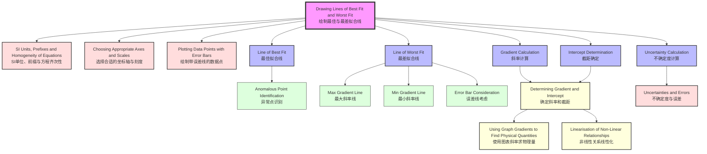

# 1. Overview / 概述

**English:**
This sub-topic covers the critical skill of drawing **Lines of Best Fit** and **Lines of Worst Fit** on experimental graphs. A line of best fit represents the overall trend of your data, minimising the effects of random errors, while a line of worst fit (or worst acceptable line) defines the extreme possible trend that still passes through all error bars. These lines are essential for determining the uncertainty in the gradient and intercept of a graph, which is a core requirement in both CAIE 9702 Paper 5 and Edexcel IAL practical assessments. This skill directly supports the determination of physical quantities from graph gradients and is a prerequisite for understanding [[Uncertainties and Errors]] in graphical analysis.

**中文:**
本子知识点涵盖在实验图表上绘制**最佳拟合线**和**最差拟合线**的关键技能。最佳拟合线代表数据的整体趋势，最小化随机误差的影响；而最差拟合线（或最差可接受线）定义了仍能穿过所有误差线的极端可能趋势。这些线条对于确定图表斜率和截距的不确定性至关重要，这是CAIE 9702 Paper 5和Edexcel IAL实验评估的核心要求。这项技能直接支持从图表梯度确定物理量，也是理解[[Uncertainties and Errors]]中图形分析的前提。

---

# 2. Syllabus Learning Objectives / 考纲学习目标

| CAIE 9702 | Edexcel IAL |
|-----------|-------------|
| 1.5(a) Draw a line of best fit through data points on a graph | WPH11 U1: 1.13 Draw and use lines of best fit |
| 1.5(b) Draw a worst acceptable line (line of worst fit) through data points | WPH11 U1: 1.14 Draw worst acceptable lines to determine uncertainty in gradient |
| 1.5(c) Use the line of best fit to determine the gradient and intercept | WPH11 U1: 1.15 Use lines of best fit to find gradient and intercept |
| 1.5(d) Use the worst acceptable line to determine the uncertainty in gradient and intercept | WPH11 U1: 1.16 Determine uncertainty in gradient and intercept using worst lines |
| 1.5(e) Understand that the line of best fit should pass through as many points as possible | WPH11 U1: 1.17 Understand error bars and their relationship to lines of fit |
| 1.5(f) Understand that the line of worst fit should pass through all error bars | WPH11 U1: 1.18 Apply these skills in practical investigations |

**Examiner Expectations / 考官期望:**
- **EN:** You must draw lines using a **sharp pencil** and a **transparent ruler**. The line of best fit should be a single, thin, continuous line. The line of worst fit must be clearly labelled (e.g., "Worst Fit" or "Max/Min Gradient"). Both lines must be drawn **after** all data points and error bars are plotted.
- **CN:** 必须使用**削尖的铅笔**和**透明直尺**画线。最佳拟合线应为一条细而连续的直线。最差拟合线必须清晰标注（例如“最差拟合”或“最大/最小斜率”）。两条线都必须在所有数据点和误差线绘制**之后**画出。

---

# 3. Core Definitions / 核心定义

| Term (EN/CN) | Definition (EN) | Definition (CN) | Common Mistakes / 常见错误 |
|--------------|-----------------|-----------------|---------------------------|
| **Line of Best Fit** / 最佳拟合线 | A single straight line drawn through the data points that best represents the overall trend, minimising the sum of the squares of the vertical distances from the points to the line. | 穿过数据点的一条直线，最能代表整体趋势，最小化各点到该线垂直距离的平方和。 | Drawing a curve instead of a straight line; forcing the line through the origin when not justified. |
| **Line of Worst Fit** / 最差拟合线 | The steepest or shallowest possible straight line that still passes through all error bars (or the extremes of the data points if no error bars are given). | 仍能穿过所有误差线（或数据点极值）的最陡或最平缓的可能直线。 | Drawing a line that goes outside error bars; not drawing both maximum and minimum gradient lines. |
| **Error Bar** / 误差线 | A vertical (and sometimes horizontal) line through a data point representing the range of possible values due to measurement uncertainty. | 穿过数据点的垂直线（有时是水平线），表示由于测量不确定性导致可能值的范围。 | Ignoring error bars when drawing lines of fit. |
| **Gradient Uncertainty** / 斜率不确定度 | The difference between the gradient of the line of best fit and the gradient of the line of worst fit, often expressed as ± half the range. | 最佳拟合线斜率与最差拟合线斜率之差，通常表示为±范围的一半。 | Using only one worst line instead of both maximum and minimum. |
| **Anomalous Point** / 异常点 | A data point that lies far from the line of best fit and is likely due to a systematic or random error; it should be identified and possibly excluded. | 远离最佳拟合线的数据点，可能由系统误差或随机误差导致；应识别并可能排除。 | Including anomalous points in the line of best fit calculation. |

---

# 4. Key Concepts Explained / 关键概念详解

## 4.1 Drawing the Line of Best Fit / 绘制最佳拟合线

### Explanation / 解释
**English:**
The line of best fit is a **single straight line** that represents the overall trend of your data. It should be drawn using a **transparent ruler** and a **sharp pencil**. The line should pass through as many data points as possible, with roughly equal numbers of points above and below the line. For a linear relationship, the line should be straight — do **not** draw a curve connecting points. If the relationship is expected to pass through the origin (0,0), the line should be drawn through the origin, but only if this is physically justified (e.g., voltage vs. current for a resistor at zero current gives zero voltage).

**中文:**
最佳拟合线是一条**直线**，代表数据的整体趋势。应使用**透明直尺**和**削尖的铅笔**绘制。该线应穿过尽可能多的数据点，且线上方和下方的点数大致相等。对于线性关系，线条应为直线——**不要**画曲线连接各点。如果预期关系通过原点(0,0)，则线条应穿过原点，但仅当这在物理上合理时才这样做（例如，电阻器的电压-电流关系，零电流时电压为零）。

### Physical Meaning / 物理意义
**English:**
The line of best fit represents the **most probable relationship** between the two variables, given the experimental data and their uncertainties. It smooths out random errors and reveals the underlying physical law.

**中文:**
最佳拟合线代表在给定实验数据及其不确定度的情况下，两个变量之间**最可能的关系**。它平滑了随机误差，揭示了潜在的物理规律。

### Common Misconceptions / 常见误区
- **EN:** "I should connect all the dots like a dot-to-dot picture." — **Wrong.** The line should be straight and smooth, not a jagged polygon.
- **CN:** "我应该像连线画一样连接所有点。" — **错误。** 线条应为直线且平滑，而非锯齿状多边形。
- **EN:** "The line must pass through every point." — **Wrong.** It should pass through as many as possible, but not necessarily all.
- **CN:** "线条必须穿过每个点。" — **错误。** 应穿过尽可能多的点，但不一定全部。
- **EN:** "I can draw the line freehand." — **Wrong.** Always use a ruler.
- **CN:** "我可以徒手画线。" — **错误。** 始终使用直尺。

### Exam Tips / 考试提示
- **EN:** Use a **sharp HB pencil** — not a pen, not a thick pencil. Draw a **thin, clear** line.
- **CN:** 使用**削尖的HB铅笔**——不是钢笔，不是粗铅笔。画一条**细而清晰**的线。
- **EN:** If a point is clearly anomalous (far from the trend), circle it and **ignore** it when drawing the line of best fit.
- **CN:** 如果某个点明显异常（远离趋势），圈出它并在绘制最佳拟合线时**忽略**它。
- **EN:** For CAIE Paper 5, you may be asked to **calculate** the line of best fit using the method of least squares — but drawing it by eye is still the primary skill.
- **CN:** 对于CAIE Paper 5，可能会要求使用最小二乘法**计算**最佳拟合线——但目测绘制仍是主要技能。

> 📷 **IMAGE PROMPT — LOBF-01: Correct vs Incorrect Lines of Best Fit**
> A split diagram showing two graphs. Left: Correct line of best fit — a single straight line passing through most points with equal distribution above and below. Right: Incorrect — a jagged line connecting all points like a dot-to-dot. Both graphs have 8-10 data points with error bars. Labels in English and Chinese.

---

## 4.2 Drawing the Line of Worst Fit / 绘制最差拟合线

### Explanation / 解释
**English:**
The line of worst fit (also called the **worst acceptable line**) is used to determine the **uncertainty** in the gradient and intercept. There are two lines of worst fit: the **steepest possible** line and the **shallowest possible** line that still pass through **all error bars** (or through the extremes of the data points if no error bars are given). These lines represent the extreme plausible relationships consistent with the data and their uncertainties. The line of worst fit must be clearly labelled (e.g., "Max Gradient" and "Min Gradient").

**中文:**
最差拟合线（也称为**最差可接受线**）用于确定斜率和截距的**不确定度**。有两条最差拟合线：**最陡可能**线和**最平缓可能**线，它们仍能穿过**所有误差线**（如果没有给出误差线，则穿过数据点的极值）。这些线代表与数据及其不确定度一致的极端可能关系。最差拟合线必须清晰标注（例如“最大斜率”和“最小斜率”）。

### Physical Meaning / 物理意义
**English:**
The lines of worst fit define the **range of possible physical relationships** that are still consistent with the experimental data, given the measurement uncertainties. The difference between the best fit and worst fit gradients gives the **uncertainty** in the gradient.

**中文:**
最差拟合线定义了在给定测量不确定度的情况下，仍与实验数据一致的**可能物理关系的范围**。最佳拟合与最差拟合斜率之差给出了斜率的**不确定度**。

### Common Misconceptions / 常见误区
- **EN:** "I only need one line of worst fit." — **Wrong.** You need both maximum and minimum gradient lines.
- **CN:** "我只需要一条最差拟合线。" — **错误。** 你需要最大和最小斜率两条线。
- **EN:** "The line of worst fit can go outside the error bars." — **Wrong.** It must pass through **all** error bars.
- **CN:** "最差拟合线可以超出误差线。" — **错误。** 它必须穿过**所有**误差线。
- **EN:** "The line of worst fit is the same as the line of best fit." — **Wrong.** They are different; the worst fit lines are at the extremes.
- **CN:** "最差拟合线与最佳拟合线相同。" — **错误。** 它们不同；最差拟合线位于极端位置。

### Exam Tips / 考试提示
- **EN:** Draw the line of best fit **first**, then draw the two lines of worst fit. Label each clearly.
- **CN:** **先**画最佳拟合线，再画两条最差拟合线。每条线都要清晰标注。
- **EN:** Use a **different colour** or **dashed line** for the worst fit lines if allowed, but always label them.
- **CN:** 如果允许，使用**不同颜色**或**虚线**表示最差拟合线，但始终要标注。
- **EN:** The line of worst fit must pass through **every** error bar — if it misses even one, it is not a valid worst fit line.
- **CN:** 最差拟合线必须穿过**每个**误差线——如果漏掉一个，就不是有效的。

> 📷 **IMAGE PROMPT — LOBF-02: Lines of Best Fit and Worst Fit**
> A graph with 8 data points with vertical error bars. Three lines are drawn: a central solid line labelled "Best Fit / 最佳拟合", a steeper dashed line labelled "Max Gradient / 最大斜率", and a shallower dashed line labelled "Min Gradient / 最小斜率". Both dashed lines pass through all error bars. The graph has labelled axes (e.g., "x / m" and "y / s²"). English and Chinese labels.

---

# 5. Essential Equations / 核心公式

## 5.1 Gradient of a Straight Line / 直线斜率

$$ m = \frac{\Delta y}{\Delta x} = \frac{y_2 - y_1}{x_2 - x_1} $$

| Symbol (符号) | Meaning (EN) | Meaning (CN) | Unit (单位) |
|--------------|-------------|-------------|------------|
| $m$ | Gradient of the line | 直线的斜率 | Depends on axes (e.g., m/s², N/m) |
| $\Delta y$ | Change in y-coordinate | y坐标的变化量 | Same as y-axis unit |
| $\Delta x$ | Change in x-coordinate | x坐标的变化量 | Same as x-axis unit |
| $(x_1, y_1)$ | First point on the line | 线上的第一个点 | — |
| $(x_2, y_2)$ | Second point on the line | 线上的第二个点 | — |

**Derivation / 推导:**
The gradient is the ratio of the vertical change to the horizontal change between two points on a straight line. For a line of best fit, choose two points that are **far apart** on the line (not necessarily data points) to minimise reading errors.

**Conditions / 适用条件:**
- **EN:** The relationship between x and y must be linear. Use only for straight-line graphs.
- **CN:** x和y之间的关系必须是线性的。仅适用于直线图。

**Limitations / 局限性:**
- **EN:** The gradient is sensitive to the choice of points. Always use points that lie **on the line**, not original data points.
- **CN:** 斜率对点的选择敏感。始终使用**线上**的点，而非原始数据点。

## 5.2 Uncertainty in Gradient / 斜率不确定度

$$ \Delta m = \frac{m_{\text{max}} - m_{\text{min}}}{2} $$

| Symbol (符号) | Meaning (EN) | Meaning (CN) | Unit (单位) |
|--------------|-------------|-------------|------------|
| $\Delta m$ | Uncertainty in gradient | 斜率的不确定度 | Same as m |
| $m_{\text{max}}$ | Gradient of steepest worst fit line | 最陡最差拟合线的斜率 | Same as m |
| $m_{\text{min}}$ | Gradient of shallowest worst fit line | 最平缓最差拟合线的斜率 | Same as m |

**Derivation / 推导:**
The uncertainty is half the range between the maximum and minimum possible gradients. This assumes the true value lies somewhere between these extremes.

**Conditions / 适用条件:**
- **EN:** Both worst fit lines must pass through all error bars.
- **CN:** 两条最差拟合线都必须穿过所有误差线。

**Limitations / 局限性:**
- **EN:** This method assumes symmetric uncertainty. For asymmetric cases, use $+\Delta m_{\text{max}}$ and $-\Delta m_{\text{min}}$ separately.
- **CN:** 此方法假设对称不确定度。对于非对称情况，分别使用$+\Delta m_{\text{max}}$和$-\Delta m_{\text{min}}$。

## 5.3 Intercept and Its Uncertainty / 截距及其不确定度

$$ c = y - mx \quad \text{(from line of best fit)} $$
$$ \Delta c = \frac{c_{\text{max}} - c_{\text{min}}}{2} $$

| Symbol (符号) | Meaning (EN) | Meaning (CN) | Unit (单位) |
|--------------|-------------|-------------|------------|
| $c$ | y-intercept | y轴截距 | Same as y-axis unit |
| $\Delta c$ | Uncertainty in intercept | 截距的不确定度 | Same as y-axis unit |
| $c_{\text{max}}$ | Intercept from steepest worst fit line | 最陡最差拟合线的截距 | Same as y-axis unit |
| $c_{\text{min}}$ | Intercept from shallowest worst fit line | 最平缓最差拟合线的截距 | Same as y-axis unit |

---

# 6. Graphs and Relationships / 图表与关系

## 6.1 Best Fit and Worst Fit Lines on a Graph / 图表上的最佳与最差拟合线

### Axes / 坐标轴
- **EN:** x-axis (independent variable), y-axis (dependent variable)
- **CN:** x轴（自变量），y轴（因变量）

### Shape / 形状
- **EN:** Three straight lines: one central (best fit), two outer (worst fit — max and min gradient)
- **CN:** 三条直线：一条居中（最佳拟合），两条外侧（最差拟合——最大和最小斜率）

### Gradient Meaning / 斜率含义
- **EN:** The gradient represents the rate of change of y with respect to x. For the best fit line, it is the most probable value. For the worst fit lines, it represents the extreme possible values.
- **CN:** 斜率表示y相对于x的变化率。对于最佳拟合线，它是最可能的值。对于最差拟合线，它代表极端可能值。

### Area Meaning / 面积含义
- **EN:** Not applicable for straight-line graphs of this type. Area under the curve is relevant for other graph types (e.g., velocity-time).
- **CN:** 不适用于此类直线图。曲线下面积适用于其他图类型（例如速度-时间图）。

### Exam Interpretation / 考试解读
- **EN:** Examiners look for: (1) Correctly drawn best fit line, (2) Clearly labelled worst fit lines, (3) All lines passing through appropriate points/error bars, (4) Correct calculation of gradient and uncertainty.
- **CN:** 考官关注：(1) 正确绘制的最佳拟合线，(2) 清晰标注的最差拟合线，(3) 所有线穿过适当的点/误差线，(4) 正确计算斜率和不确定度。

> 📷 **IMAGE PROMPT — LOBF-03: Graph with Three Lines**
> A full-page graph with 10 data points with vertical error bars. Three lines: solid central "Best Fit", dashed upper "Max Gradient", dashed lower "Min Gradient". Both dashed lines touch all error bars. Axes labelled "x / cm" and "y / s²". A table nearby shows calculated gradients and uncertainties. English and Chinese labels.

---

# 7. Required Diagrams / 必备图表

## 7.1 Diagram: Lines of Best Fit and Worst Fit / 图表：最佳与最差拟合线

### Description / 描述
**English:**
A graph showing experimental data points with vertical error bars. The line of best fit is drawn as a solid line through the centre of the data. Two lines of worst fit are drawn as dashed lines: one with maximum gradient (steepest) and one with minimum gradient (shallowest), both passing through all error bars. The points used to calculate each gradient are marked with crosses on the lines.

**中文:**
一张显示带有垂直误差线的实验数据点的图表。最佳拟合线画为穿过数据中心的实线。两条最差拟合线画为虚线：一条最大斜率（最陡）和一条最小斜率（最平缓），两者都穿过所有误差线。用于计算每条斜率的点在线上用叉号标记。

### Image Prompt / 图片生成提示
> 📷 **IMAGE PROMPT — LOBF-04: Detailed Graph with Three Lines**
> A scientific graph on white graph paper with grid lines. 8-10 data points plotted as small circles with vertical error bars (I-shaped). A solid straight line labelled "Best Fit" passes through the centre of the data. Two dashed straight lines labelled "Max Gradient" and "Min Gradient" are drawn at the extremes, both passing through all error bars. Each line has two large crosses (×) marking the points used for gradient calculation. Axes are labelled "x / m" and "y / s²". A small table in the corner shows: m_best = 2.45 m/s², m_max = 2.62 m/s², m_min = 2.28 m/s², Δm = ±0.17 m/s². All labels in English and Chinese. Clean, professional style suitable for an A-Level textbook.

### Labels Required / 需要标注
- **EN:** "Best Fit", "Max Gradient", "Min Gradient", crosses for gradient points, axes labels with units, error bars, data points
- **CN:** "最佳拟合", "最大斜率", "最小斜率", 梯度点的叉号, 带单位的坐标轴标签, 误差线, 数据点

### Exam Importance / 考试重要性
- **EN:** **High.** This diagram is the foundation for determining uncertainties in gradients and intercepts, which is a core skill in both CAIE Paper 5 and Edexcel IAL practical exams.
- **CN:** **高。** 此图表是确定斜率和截距不确定度的基础，这是CAIE Paper 5和Edexcel IAL实验考试的核心技能。

---

## 7.2 Diagram: Anomalous Point Handling / 图表：异常点处理

### Description / 描述
**English:**
A graph showing data points where one point is clearly anomalous (far from the trend). The anomalous point is circled and labelled "Anomalous". The line of best fit is drawn ignoring this point. The line of worst fit also ignores the anomalous point.

**中文:**
一张显示数据点的图表，其中一个点明显异常（远离趋势）。异常点被圈出并标注为“异常”。最佳拟合线忽略该点绘制。最差拟合线也忽略异常点。

### Image Prompt / 图片生成提示
> 📷 **IMAGE PROMPT — LOBF-05: Anomalous Point Handling**
> A graph with 8 data points. One point at (4.0, 8.5) is far from the others. This point is circled with a dashed circle and labelled "Anomalous / 异常". The line of best fit passes through the other 7 points. A note at the bottom reads: "Anomalous points should be identified and excluded from the line of fit / 异常点应被识别并从拟合线中排除." Axes labelled "x / cm" and "y / s²". Clean, educational style.

### Labels Required / 需要标注
- **EN:** "Anomalous", circle around the anomalous point, line of best fit, axes labels
- **CN:** "异常", 异常点周围的圆圈, 最佳拟合线, 坐标轴标签

### Exam Importance / 考试重要性
- **EN:** **Medium.** Identifying anomalous points is a key skill, but the main focus is on drawing the lines correctly.
- **CN:** **中。** 识别异常点是关键技能，但主要焦点是正确绘制线条。

---

# 8. Worked Examples / 典型例题

## Example 1: Determining Gradient and Its Uncertainty / 示例1：确定斜率及其不确定度

### Question / 题目
**English:**
In an experiment to determine the acceleration due to gravity, a student measures the time $t$ for a ball to fall a distance $s$. The graph of $s$ (y-axis) against $t^2$ (x-axis) is plotted. The data points and error bars are shown below. Draw the line of best fit and the lines of worst fit. Calculate the gradient of the best fit line and its uncertainty.

Data points: (0.10, 0.49), (0.20, 0.98), (0.30, 1.47), (0.40, 1.96), (0.50, 2.45) — all with error bars of ±0.02 on x and ±0.05 on y.

**中文:**
在测定重力加速度的实验中，学生测量球下落距离$s$所需时间$t$。绘制$s$（y轴）对$t^2$（x轴）的图表。数据点和误差线如下所示。绘制最佳拟合线和最差拟合线。计算最佳拟合线的斜率及其不确定度。

数据点：(0.10, 0.49), (0.20, 0.98), (0.30, 1.47), (0.40, 1.96), (0.50, 2.45) — 所有点的x误差为±0.02，y误差为±0.05。

### Solution / 解答

**Step 1: Plot the data points with error bars.**
Plot each point with vertical and horizontal error bars of the given sizes.

**Step 2: Draw the line of best fit.**
Using a transparent ruler, draw a straight line that passes through as many points as possible, with equal numbers above and below. The line should pass through the origin (0,0) since $s = \frac{1}{2}gt^2$ predicts $s=0$ when $t^2=0$.

**Step 3: Calculate the gradient of the best fit line.**
Choose two points on the line (not data points), far apart:
- Point A: (0.10, 0.49) — on the line
- Point B: (0.50, 2.45) — on the line

$$ m_{\text{best}} = \frac{2.45 - 0.49}{0.50 - 0.10} = \frac{1.96}{0.40} = 4.90 \, \text{m/s}^2 $$

**Step 4: Draw the lines of worst fit.**
- **Max gradient line:** Draw the steepest straight line that still passes through all error bars.
- **Min gradient line:** Draw the shallowest straight line that still passes through all error bars.

**Step 5: Calculate the gradients of the worst fit lines.**
For the max gradient line, choose two points on it:
- Point C: (0.10, 0.52) — at the top of the error bar
- Point D: (0.50, 2.50) — at the top of the error bar

$$ m_{\text{max}} = \frac{2.50 - 0.52}{0.50 - 0.10} = \frac{1.98}{0.40} = 4.95 \, \text{m/s}^2 $$

For the min gradient line, choose two points on it:
- Point E: (0.10, 0.46) — at the bottom of the error bar
- Point F: (0.50, 2.40) — at the bottom of the error bar

$$ m_{\text{min}} = \frac{2.40 - 0.46}{0.50 - 0.10} = \frac{1.94}{0.40} = 4.85 \, \text{m/s}^2 $$

**Step 6: Calculate the uncertainty in gradient.**

$$ \Delta m = \frac{m_{\text{max}} - m_{\text{min}}}{2} = \frac{4.95 - 4.85}{2} = \frac{0.10}{2} = 0.05 \, \text{m/s}^2 $$

### Final Answer / 最终答案
**Answer:** $m = 4.90 \pm 0.05 \, \text{m/s}^2$ | **答案：** $m = 4.90 \pm 0.05 \, \text{m/s}^2$

### Quick Tip / 提示
- **EN:** Always use points that are **far apart** on the line to minimise the percentage error in reading coordinates.
- **CN:** 始终使用线上**相距较远**的点，以最小化读取坐标的百分比误差。

---

## Example 2: Determining Intercept and Its Uncertainty / 示例2：确定截距及其不确定度

### Question / 题目
**English:**
In an experiment to measure the resistance of a wire at different temperatures, a student plots a graph of resistance $R$ (y-axis) against temperature $\theta$ (x-axis). The line of best fit has equation $R = 0.50\theta + 10.0$. The lines of worst fit give intercepts of $c_{\text{max}} = 10.5 \, \Omega$ and $c_{\text{min}} = 9.5 \, \Omega$. Determine the intercept and its uncertainty.

**中文:**
在测量不同温度下导线电阻的实验中，学生绘制电阻$R$（y轴）对温度$\theta$（x轴）的图表。最佳拟合线方程为$R = 0.50\theta + 10.0$。最差拟合线给出的截距为$c_{\text{max}} = 10.5 \, \Omega$和$c_{\text{min}} = 9.5 \, \Omega$。确定截距及其不确定度。

### Solution / 解答

**Step 1: Identify the best fit intercept.**
From the equation $R = 0.50\theta + 10.0$, the intercept is $c_{\text{best}} = 10.0 \, \Omega$.

**Step 2: Calculate the uncertainty in intercept.**

$$ \Delta c = \frac{c_{\text{max}} - c_{\text{min}}}{2} = \frac{10.5 - 9.5}{2} = \frac{1.0}{2} = 0.5 \, \Omega $$

### Final Answer / 最终答案
**Answer:** $c = 10.0 \pm 0.5 \, \Omega$ | **答案：** $c = 10.0 \pm 0.5 \, \Omega$

### Quick Tip / 提示
- **EN:** The intercept uncertainty is calculated the same way as gradient uncertainty — half the range between max and min values.
- **CN:** 截距不确定度的计算方式与斜率不确定度相同——最大值和最小值范围的一半。

---

# 9. Past Paper Question Types / 历年真题题型

| Question Type / 题型 | Frequency / 频率 | Difficulty / 难度 | Past Paper References / 真题索引 |
|----------------------|------------------|------------------|-------------------------------|
| Draw line of best fit on given graph | Very High | Easy | 📝 *待填入* |
| Draw lines of worst fit and calculate gradient uncertainty | Very High | Medium | 📝 *待填入* |
| Determine intercept and its uncertainty from worst fit lines | High | Medium | 📝 *待填入* |
| Identify anomalous point and redraw line of best fit | Medium | Easy | 📝 *待填入* |
| Explain why line of best fit does/does not pass through origin | Medium | Medium | 📝 *待填入* |
| Calculate physical quantity from gradient and its uncertainty | High | Medium-Hard | 📝 *待填入* |

**Common Command Words / 常见指令词:**
- **EN:** "Draw", "Determine", "Calculate", "Estimate", "Explain", "State"
- **CN:** "绘制", "确定", "计算", "估算", "解释", "陈述"

---

# 10. Practical Skills Connections / 实验技能链接

**English:**
This sub-topic is directly connected to practical work in both CAIE 9702 (Paper 3 and Paper 5) and Edexcel IAL (Unit 1 and Unit 2 practicals). Key practical skills include:

1. **Plotting data points accurately** — using appropriate scales and axes (see [[Choosing Appropriate Axes and Scales]]).
2. **Drawing error bars** — representing measurement uncertainties graphically (see [[Plotting Data Points with Error Bars]]).
3. **Drawing lines of best fit and worst fit** — the focus of this note.
4. **Calculating gradients and intercepts** — using the lines to find physical quantities (see [[Determining Gradient and Intercept]]).
5. **Determining uncertainties** — using the worst fit lines to find $\Delta m$ and $\Delta c$.
6. **Linearisation** — transforming non-linear relationships into straight-line graphs (see [[Linearisation of Non-Linear Relationships]]).

**Experimental Design Considerations:**
- Always plot the graph **during** the experiment, not after, so you can identify anomalous points and repeat measurements if necessary.
- Use a **large graph** (at least half a page) to maximise precision.
- Draw lines **after** all points are plotted — never draw the line first and then plot points.

**Common Practical Errors:**
- Drawing the line of best fit before plotting all points.
- Using a pen instead of a pencil.
- Not labelling the lines of worst fit.
- Choosing points too close together for gradient calculation.

**中文:**
本子知识点直接与CAIE 9702（Paper 3和Paper 5）和Edexcel IAL（Unit 1和Unit 2实验）的实验工作相关。关键实验技能包括：

1. **准确绘制数据点** — 使用适当的刻度和坐标轴（见[[Choosing Appropriate Axes and Scales]]）。
2. **绘制误差线** — 图形化表示测量不确定度（见[[Plotting Data Points with Error Bars]]）。
3. **绘制最佳拟合线和最差拟合线** — 本笔记的重点。
4. **计算斜率和截距** — 使用线条找到物理量（见[[Determining Gradient and Intercept]]）。
5. **确定不确定度** — 使用最差拟合线找到$\Delta m$和$\Delta c$。
6. **线性化** — 将非线性关系转换为直线图（见[[Linearisation of Non-Linear Relationships]]）。

**实验设计考虑：**
- 始终在**实验过程中**绘制图表，而非之后，以便识别异常点并在必要时重复测量。
- 使用**大图表**（至少半页）以最大化精度。
- 在**所有点绘制后**画线——切勿先画线再绘制点。

**常见实验错误：**
- 在绘制所有点之前绘制最佳拟合线。
- 使用钢笔而非铅笔。
- 未标注最差拟合线。
- 选择相距太近的点计算斜率。

---

# 11. Concept Map / 概念图谱

---

# 12. Quick Revision Sheet / 速查表

| Category / 类别 | Key Points / 要点 |
|----------------|------------------|
| **Definition / 定义** | **Line of Best Fit:** Single straight line representing overall trend, minimising vertical distances. **Line of Worst Fit:** Steepest/shallowest line still passing through all error bars. |
| **Key Formula / 核心公式** | $m = \frac{\Delta y}{\Delta x}$, $\Delta m = \frac{m_{\text{max}} - m_{\text{min}}}{2}$, $\Delta c = \frac{c_{\text{max}} - c_{\text{min}}}{2}$ |
| **Key Graph / 核心图表** | Three lines on one graph: solid "Best Fit", dashed "Max Gradient", dashed "Min Gradient". Both dashed lines pass through all error bars. |
| **Drawing Rules / 绘制规则** | 1. Use sharp pencil and transparent ruler. 2. Draw best fit first. 3. Draw worst fit lines. 4. Label all lines. 5. Use points far apart for gradient calculation. |
| **Common Mistakes / 常见错误** | 1. Connecting dots like dot-to-dot. 2. Only drawing one worst fit line. 3. Worst fit line missing an error bar. 4. Using data points instead of line points for gradient. |
| **Exam Tip / 考试提示** | **CAIE:** Paper 5 often asks for both best and worst fit lines. **Edexcel:** Unit 1 practicals require clear labelling and correct gradient uncertainty calculation. |
| **Prerequisites / 前置知识** | [[SI Units, Prefixes and Homogeneity of Equations]], [[Choosing Appropriate Axes and Scales]], [[Plotting Data Points with Error Bars]] |
| **Related Topics / 相关主题** | [[Determining Gradient and Intercept]], [[Using Graph Gradients to Find Physical Quantities]], [[Linearisation of Non-Linear Relationships]], [[Uncertainties and Errors]] |