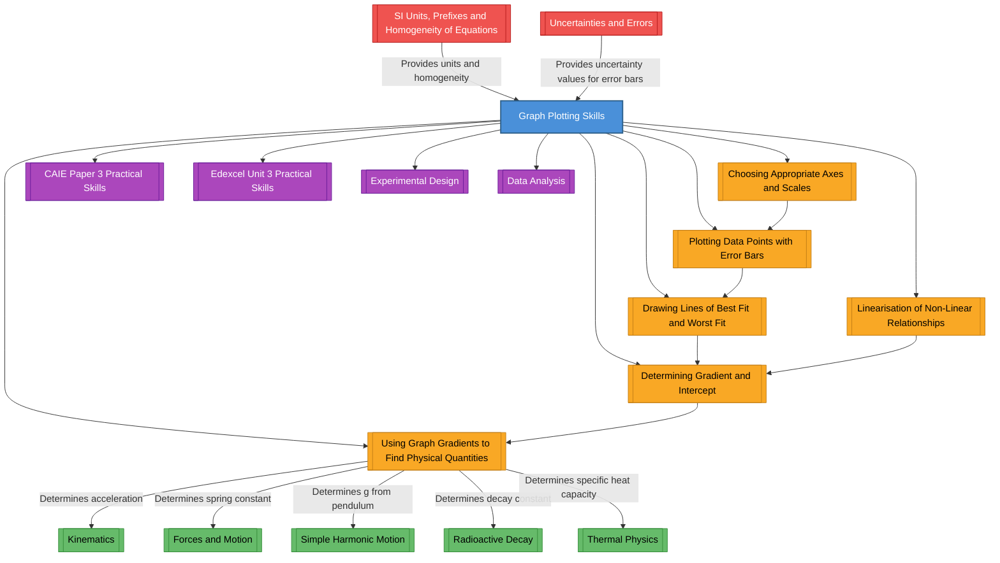

# 1. Overview / 概述

**English:**
Graph Plotting Skills is a foundational topic in A-Level Physics that bridges theoretical understanding with experimental practice. This topic covers the systematic process of transforming raw experimental data into meaningful graphical representations, from selecting appropriate axes and scales to drawing lines of best fit and extracting physical quantities from gradients and intercepts. Mastery of graph plotting is essential because graphs are not merely visual aids—they are analytical tools that reveal relationships between variables, allow for the identification of outliers, and enable the determination of physical constants with associated uncertainties. In both Cambridge 9702 and Edexcel IAL examinations, graph plotting appears in practical papers (Paper 3/5 for CAIE, Unit 3/6 for Edexcel) and in theory papers where candidates must interpret given graphs. Real-world applications include analysing radioactive decay curves, determining spring constants from force-extension graphs, and calibrating sensors in engineering. This topic also introduces the critical skill of linearisation—transforming non-linear relationships into straight-line graphs—which is a powerful technique for testing theoretical models and extracting parameters.

**中文：**
图表绘制技能是A-Level物理学中连接理论理解与实验实践的基础性课题。本课题涵盖将原始实验数据系统转化为有意义的图形表示的全过程，从选择合适的坐标轴和比例尺，到绘制最佳拟合线和最差拟合线，再到从斜率和截距中提取物理量。掌握图表绘制至关重要，因为图形不仅仅是视觉辅助工具——它们是揭示变量之间关系、识别异常值以及确定带有相关不确定度的物理常数的分析工具。在剑桥9702和爱德思IAL考试中，图表绘制出现在实验试卷（CAIE的Paper 3/5，爱德思的Unit 3/6）以及理论试卷中（考生需解释给定图形）。实际应用包括分析放射性衰变曲线、从力-伸长量图中确定弹簧常数以及工程中的传感器校准。本课题还介绍了线性化的关键技能——将非线性关系转化为直线图——这是一种检验理论模型和提取参数的有力技术。

---

# 2. Syllabus Learning Objectives / 考纲学习目标

| CAIE 9702 (Section 1.5) | Edexcel IAL (WPH11 U1: 1.13-1.18) |
|-------------------------|-----------------------------------|
| 1.5(a) Choose appropriate axes and scales for graph plotting | 1.13 Plot graphs with appropriate scales, axes, and labels |
| 1.5(b) Plot data points correctly, including error bars | 1.14 Plot data points accurately, including error bars |
| 1.5(c) Draw lines of best fit and worst acceptable lines | 1.15 Draw lines of best fit and worst acceptable lines |
| 1.5(d) Determine gradient and intercept from a straight-line graph | 1.16 Determine gradient and intercept from a straight-line graph |
| 1.5(e) Determine uncertainties in gradient and intercept | 1.17 Determine uncertainties in gradient and intercept |
| 1.5(f) Linearise non-linear relationships to obtain straight-line graphs | 1.18 Linearise non-linear relationships to obtain straight-line graphs |

**Examiner Expectations / 考官期望:**

**English:**
- Candidates must be able to select scales that use at least half the graph grid in both directions.
- Axes must be labelled with the quantity name (or symbol) and unit in the format "Quantity / Unit" (e.g., "Force / N").
- Data points should be plotted as small, sharp crosses (×) or dots with circles (⊙); large blobs are penalised.
- Error bars must be drawn as vertical/horizontal lines with caps, representing ±1 standard deviation or instrument uncertainty.
- The line of best fit should be a single, thin, smooth line passing through or near most points and error bars.
- The worst acceptable line (steepest or shallowest) is used to determine the uncertainty in gradient.
- Gradients must be calculated using a large triangle (at least half the line length) with coordinates read to half a small square.
- Linearisation requires rearranging equations into the form y = mx + c, where the gradient and intercept correspond to physical quantities.

**中文：**
- 考生必须能够选择在网格两个方向上至少使用一半网格的比例尺。
- 坐标轴必须标注物理量名称（或符号）和单位，格式为"物理量 / 单位"（例如"力 / N"）。
- 数据点应绘制为小而清晰的叉号（×）或带圆圈的圆点（⊙）；大块点会被扣分。
- 误差线必须绘制为带帽的垂直线/水平线，代表±1标准偏差或仪器不确定度。
- 最佳拟合线应为一条细而平滑的直线，穿过或靠近大多数点和误差线。
- 最差拟合线（最陡或最平缓）用于确定斜率的误差。
- 斜率必须使用大三角形（至少为线长的一半）计算，坐标读数精确到半小格。
- 线性化需要将方程重新排列为y = mx + c的形式，其中斜率和截距对应物理量。

> 📋 **CIE Only:** CAIE Paper 3 (AS) requires candidates to plot graphs by hand on printed grid paper. Paper 5 (A2) may require graph plotting as part of a planning exercise. Error bars are explicitly tested in Paper 3.
> 
> 📋 **Edexcel Only:** Edexcel Unit 3 (AS) and Unit 6 (A2) practical exams require graph plotting. Edexcel often asks candidates to "draw a graph to test the relationship" and to "determine the value of [physical quantity] from the gradient."

---

# 3. Core Definitions / 核心定义

| Term (EN/CN) | Definition (EN) | Definition (CN) | Common Mistakes / 常见错误 |
|--------------|-----------------|-----------------|---------------------------|
| **Graph Scale / 图表比例尺** | The range of values shown on each axis, chosen to use at least half the available grid in both directions. | 每个坐标轴上显示的值范围，选择在网格两个方向上至少使用一半可用网格。 | Choosing a scale that is too small (points clustered) or too large (points spread too thinly). Not using "sensible" scales (e.g., 2 cm = 1 N is fine; 2 cm = 0.37 N is not). |
| **Line of Best Fit / 最佳拟合线** | A single, thin, smooth straight line (or curve) drawn to pass through or near as many data points and [[Error Bars]] as possible, balancing the number of points above and below the line. | 一条细而平滑的直线（或曲线），绘制时穿过或尽可能靠近尽可能多的数据点和[[误差线]]，平衡线上方和下方的点数。 | Drawing a thick line, a broken line, or a line that connects all points. Forcing the line through the origin when the data does not support it. |
| **Worst Acceptable Line / 最差可接受线** | The steepest or shallowest straight line that still passes through all error bars (or near all points if no error bars are given). | 仍然穿过所有误差线（如果没有误差线则靠近所有点）的最陡或最平缓的直线。 | Using a line that clearly misses several error bars. Not drawing both steepest and shallowest lines when required. |
| **Gradient / 斜率** | The rate of change of the y-axis quantity with respect to the x-axis quantity, calculated as Δy/Δx from a large triangle on the line of best fit. | y轴物理量相对于x轴物理量的变化率，从最佳拟合线上的大三角形计算为Δy/Δx。 | Using data points instead of points on the line. Using a triangle that is too small. Not including units in the gradient value. |
| **Intercept / 截距** | The value of the y-axis quantity when the x-axis quantity is zero, read from the line of best fit (not necessarily from the plotted data). | 当x轴物理量为零时y轴物理量的值，从最佳拟合线上读取（不一定从绘制的数据点读取）。 | Reading the intercept from the first data point instead of the line. Forgetting to extend the line to the y-axis. |
| **Error Bar / 误差线** | A vertical or horizontal line drawn through a data point, with caps at both ends, representing the uncertainty in that measurement (±Δy or ±Δx). | 通过数据点绘制的垂直线或水平线，两端有帽，代表该测量的不确定度（±Δy或±Δx）。 | Drawing error bars without caps. Making error bars too long or too short. Forgetting to include error bars on all points. |
| **Linearisation / 线性化** | The process of rearranging a non-linear equation into the form y = mx + c, where the new y and x variables produce a straight-line graph. | 将非线性方程重新排列为y = mx + c形式的过程，其中新的y和x变量产生直线图。 | Not correctly identifying what to plot on each axis. Forgetting that the gradient and intercept correspond to physical quantities. |
| **Outlier / 异常值** | A data point that lies far from the line of best fit and cannot be explained by the uncertainty shown by its error bar. | 远离最佳拟合线且无法用其误差线所示不确定度解释的数据点。 | Ignoring outliers without justification. Including outliers in the line of best fit. |

---

# 4. Key Concepts Explained / 关键概念详解

## 4.1 Choosing Appropriate Axes and Scales / 选择合适的坐标轴和比例尺

### Explanation / 解释
**English:**
The independent variable (the one you control or that changes naturally) is always plotted on the x-axis, and the dependent variable (the one you measure) is plotted on the y-axis. The scale must be chosen so that the data points occupy at least half the grid in both directions. Scales should be "sensible"—using simple multiples (1, 2, 5, 10, 20, 50, etc.) per large square—and should not be forced to include the origin unless the data or theory requires it. The scale must be linear (equal intervals represent equal changes) unless specified otherwise. Axes must be labelled with the quantity name (or symbol) followed by a forward slash and the unit, e.g., "Time / s" or "t / s". This topic connects to [[SI Units, Prefixes and Homogeneity of Equations]] because units must be consistent.

**中文：**
自变量（你控制的或自然变化的变量）总是绘制在x轴上，因变量（你测量的变量）绘制在y轴上。必须选择比例尺，使数据点在两个方向上至少占据网格的一半。比例尺应"合理"——每个大格使用简单的倍数（1, 2, 5, 10, 20, 50等）——除非数据或理论要求，否则不应强制包含原点。除非另有说明，比例尺必须是线性的（相等间隔代表相等变化）。坐标轴必须标注物理量名称（或符号），后跟斜杠和单位，例如"时间 / s"或"t / s"。本主题与[[SI Units, Prefixes and Homogeneity of Equations]]相关，因为单位必须一致。

### Physical Meaning / 物理意义
**English:**
Choosing the right scale ensures that the relationship between variables is visible and that the gradient can be determined with minimal uncertainty. A poor scale can hide patterns or exaggerate uncertainties.

**中文：**
选择合适的比例尺确保变量之间的关系可见，并且可以以最小不确定度确定斜率。糟糕的比例尺可能隐藏模式或夸大不确定度。

### Common Misconceptions / 常见误区
- Thinking the origin must always be included (it should not be if the data starts far from zero).
- Using non-linear scales (e.g., logarithmic) without being told to.
- Labelling axes with just the unit (e.g., "m") without the quantity.

### Exam Tips / 考试提示
**English:**
CAIE and Edexcel both expect you to show your scale choice on the graph. If the grid is provided, check that your plotted points use at least half the grid. If you are drawing your own axes, leave space for labels and the scale. Always write the scale on the axis (e.g., "1 division = 0.5 s").

**中文：**
CAIE和爱德思都期望你在图表上显示你的比例尺选择。如果提供了网格，检查你绘制的点是否使用了至少一半的网格。如果你自己画坐标轴，留出标签和比例尺的空间。始终在坐标轴上写出比例尺（例如"1格 = 0.5 s"）。

> 📷 **IMAGE PROMPT — [GP-01]: Example of Good vs Poor Scale Choice**
>
> A split diagram showing two graphs of the same data. Left: poor scale with points clustered in the bottom-left corner, using only 20% of the grid. Right: good scale with points spread across 70% of the grid in both directions. Axes labelled correctly. Labels in English and Chinese.

---

## 4.2 Plotting Data Points with Error Bars / 绘制带误差线的数据点

### Explanation / 解释
**English:**
Data points should be plotted as small, sharp crosses (×) or as dots surrounded by small circles (⊙). Large blobs, circles without dots, or dots without circles are penalised because they obscure the exact position of the point. Each point should be plotted to the precision of half a small square on the grid. Error bars are vertical lines (for y-uncertainty) and/or horizontal lines (for x-uncertainty) drawn through the data point, with small caps (horizontal ticks) at both ends. The length of the error bar represents ±Δy (or ±Δx), where Δ is the uncertainty in that measurement. Error bars are essential for determining whether a line of best fit is acceptable and for calculating uncertainties in gradient and intercept. This concept directly links to [[Uncertainties and Errors]].

**中文：**
数据点应绘制为小而清晰的叉号（×）或带小圆圈的圆点（⊙）。大块点、无点的圆圈或无圆圈的点会被扣分，因为它们掩盖了点的精确位置。每个点应绘制到网格上半小格的精度。误差线是通过数据点绘制的垂直线（用于y不确定度）和/或水平线（用于x不确定度），两端有小帽（水平短线）。误差线的长度代表±Δy（或±Δx），其中Δ是该测量的不确定度。误差线对于确定最佳拟合线是否可接受以及计算斜率和截距的不确定度至关重要。这个概念直接链接到[[Uncertainties and Errors]]。

### Physical Meaning / 物理意义
**English:**
Error bars visually communicate the reliability of each measurement. A point with a large error bar is less reliable than one with a small error bar. The line of best fit should pass through all error bars if the model is correct.

**中文：**
误差线直观地传达了每个测量的可靠性。具有大误差线的点比具有小误差线的点可靠性低。如果模型正确，最佳拟合线应穿过所有误差线。

### Common Misconceptions / 常见误区
- Drawing error bars without caps (just plain lines).
- Making all error bars the same length when uncertainties vary.
- Forgetting to include error bars on every point.
- Plotting points as large circles that hide the exact location.

### Exam Tips / 考试提示
**English:**
In CAIE Paper 3, you are often given a table of data with uncertainties. You must calculate the error bar length (e.g., ±0.5 cm means the error bar extends 0.5 cm above and below the point). In Edexcel, you may need to estimate uncertainties from the precision of the measuring instrument.

**中文：**
在CAIE Paper 3中，你通常会得到一张带有不确定度的数据表。你必须计算误差线的长度（例如±0.5 cm意味着误差线在点上方和下方各延伸0.5 cm）。在爱德思中，你可能需要根据测量仪器的精度估计不确定度。

> 📷 **IMAGE PROMPT — [GP-02]: Data Points with Error Bars**
>
> A close-up of a graph showing five data points plotted as small crosses (×). Each point has a vertical error bar with caps. The error bars vary in length. The axes are labelled "Extension / mm" and "Force / N". Grid lines visible. Labels in English.

---

## 4.3 Drawing Lines of Best Fit and Worst Fit / 绘制最佳拟合线和最差拟合线

### Explanation / 解释
**English:**
The line of best fit is a single, thin, smooth straight line (or curve) that represents the trend of the data. It should pass through or near as many points and error bars as possible, with roughly equal numbers of points above and below the line. The line should not be forced through the origin unless the theory requires it and the data supports it. The worst acceptable line is the steepest or shallowest straight line that still passes through all error bars (or near all points if no error bars are given). The worst acceptable line is used to determine the uncertainty in the gradient and intercept. Both lines must be drawn as thin, continuous lines—not dashed or dotted. This skill is essential for [[Determining Gradient and Intercept]] with uncertainties.

**中文：**
最佳拟合线是一条细而平滑的直线（或曲线），代表数据的趋势。它应穿过或尽可能靠近尽可能多的点和误差线，线上方和下方的点数大致相等。除非理论要求且数据支持，否则不应强制线通过原点。最差可接受线是仍然穿过所有误差线（如果没有误差线则靠近所有点）的最陡或最平缓的直线。最差可接受线用于确定斜率和截距的不确定度。两条线都必须绘制为细实线——不是虚线或点线。这项技能对于带不确定度[[确定斜率和截距]]至关重要。

### Physical Meaning / 物理意义
**English:**
The line of best fit is the "most likely" relationship based on the data. The worst acceptable lines define the range of possible relationships given the uncertainties.

**中文：**
最佳拟合线是基于数据的"最可能"关系。最差可接受线定义了在给定不确定度下可能关系的范围。

### Common Misconceptions / 常见误区
- Drawing a thick line that covers multiple grid lines.
- Connecting points dot-to-dot (like a child's drawing).
- Forcing the line through the origin when data clearly shows a non-zero intercept.
- Using a dashed line for the worst acceptable line (it should be continuous).

### Exam Tips / 考试提示
**English:**
Use a sharp pencil and a ruler for straight lines. For curves, draw a single smooth curve freehand. If you make a mistake, do not use correction fluid—draw a new line and label it clearly. In CAIE, you may be asked to draw both the best fit and worst acceptable lines on the same graph.

**中文：**
使用削尖的铅笔和直尺画直线。对于曲线，徒手画一条平滑的曲线。如果画错了，不要使用修正液——画一条新线并清晰标注。在CAIE中，你可能被要求在同一张图上画出最佳拟合线和最差可接受线。

> 📷 **IMAGE PROMPT — [GP-03]: Best Fit and Worst Fit Lines**
>
> A graph with six data points with error bars. Three lines drawn: a central line of best fit (labelled "Best fit"), a steeper line (labelled "Steepest worst fit"), and a shallower line (labelled "Shallowest worst fit"). All lines pass through the error bars. Axes labelled. Labels in English.

---

## 4.4 Determining Gradient and Intercept / 确定斜率和截距

### Explanation / 解释
**English:**
The gradient of a straight-line graph is calculated as Δy/Δx, where Δy and Δx are the differences in y and x values between two points on the line of best fit. The triangle used must be large (at least half the length of the line) to minimise reading errors. The coordinates of the two points must be read from the line, not from the data points. The intercept is the value of y when x = 0, read from the line of best fit (extended if necessary). Both gradient and intercept must be given with appropriate units and uncertainties. The uncertainty in gradient is half the difference between the gradients of the steepest and shallowest worst acceptable lines. The uncertainty in intercept is half the difference between the intercepts of these two lines. This is directly used in [[Using Graph Gradients to Find Physical Quantities]].

**中文：**
直线图的斜率计算为Δy/Δx，其中Δy和Δx是最佳拟合线上两点之间y和x值的差值。使用的三角形必须大（至少为线长的一半）以最小化读数误差。两点的坐标必须从线上读取，而不是从数据点读取。截距是当x = 0时y的值，从最佳拟合线上读取（必要时延长）。斜率和截距都必须带有适当的单位和不确定度。斜率的不确定度是最陡和最平缓最差可接受线的斜率之差的一半。截距的不确定度是这两条线的截距之差的一半。这直接用于[[使用图表梯度求物理量]]。

### Physical Meaning / 物理意义
**English:**
The gradient represents the rate of change of one variable with respect to another. For example, in a force-extension graph, the gradient is the spring constant. The intercept often represents a systematic error or a constant offset.

**中文：**
斜率代表一个变量相对于另一个变量的变化率。例如，在力-伸长量图中，斜率是弹簧常数。截距通常代表系统误差或恒定偏移。

### Common Misconceptions / 常见误区
- Using data points instead of points on the line for gradient calculation.
- Using a triangle that is too small (less than half the line length).
- Forgetting to include units in the gradient (e.g., "5.2" instead of "5.2 N/m").
- Reading the intercept from the first data point instead of the line.

### Exam Tips / 考试提示
**English:**
Show your working on the graph: draw the triangle, label the coordinates of the two points, and write the calculation. For the intercept, show where the line crosses the y-axis. In CAIE, you must give the gradient to 2 or 3 significant figures, consistent with the data.

**中文：**
在图上展示你的计算过程：画出三角形，标注两点的坐标，写出计算过程。对于截距，显示线穿过y轴的位置。在CAIE中，你必须给出2或3位有效数字的斜率，与数据一致。

> 📷 **IMAGE PROMPT — [GP-04]: Gradient Triangle on a Graph**
>
> A straight-line graph with a large right-angled triangle drawn under the line. The two points at the ends of the hypotenuse are marked with crosses and labelled with coordinates (x₁, y₁) and (x₂, y₂). Δx and Δy are labelled on the triangle. Axes labelled. Labels in English.

---

## 4.5 Linearisation of Non-Linear Relationships / 非线性关系的线性化

### Explanation / 解释
**English:**
Many physical relationships are non-linear (e.g., exponential decay, inverse square law, quadratic relationships). To analyse these using straight-line graphs, we rearrange the equation into the form y = mx + c, where the new y and x variables are functions of the original variables. For example, for the relationship T = 2π√(L/g), squaring both sides gives T² = (4π²/g)L. Plotting T² against L gives a straight line with gradient 4π²/g, from which g can be determined. This technique is called linearisation and is essential for [[Linearisation of Non-Linear Relationships]]. The choice of what to plot on each axis depends on the equation being tested.

**中文：**
许多物理关系是非线性的（例如指数衰减、平方反比定律、二次关系）。为了使用直线图分析这些关系，我们将方程重新排列为y = mx + c的形式，其中新的y和x变量是原始变量的函数。例如，对于关系T = 2π√(L/g)，两边平方得到T² = (4π²/g)L。绘制T²对L的图得到一条直线，斜率为4π²/g，由此可以确定g。这种技术称为线性化，对于[[非线性关系的线性化]]至关重要。在每个坐标轴上绘制什么取决于被检验的方程。

### Physical Meaning / 物理意义
**English:**
Linearisation allows us to test whether experimental data fits a theoretical model. If the plotted points fall on a straight line, the model is confirmed. The gradient and intercept then give numerical values of physical constants.

**中文：**
线性化使我们能够检验实验数据是否符合理论模型。如果绘制的点落在一条直线上，则模型得到确认。斜率和截距随后给出物理常数的数值。

### Common Misconceptions / 常见误区
- Plotting the original variables (e.g., T vs L) and expecting a straight line.
- Not correctly identifying what the gradient represents in the linearised equation.
- Forgetting to include the constant term (c) when rearranging.

### Exam Tips / 考试提示
**English:**
Always write the linearised equation in the form y = mx + c, and state clearly what y, x, m, and c represent in terms of the original variables. This is a common question in both CAIE and Edexcel theory papers.

**中文：**
始终将线性化方程写成y = mx + c的形式，并清楚说明y、x、m和c在原始变量方面代表什么。这是CAIE和爱德思理论试卷中的常见问题。

> 📷 **IMAGE PROMPT — [GP-05]: Linearisation Example**
>
> Two graphs side by side. Left: a curved graph of T vs L (non-linear). Right: a straight-line graph of T² vs L (linearised). Both axes labelled. The gradient on the right graph is labelled "m = 4π²/g". Labels in English.

---

## 4.6 Using Graph Gradients to Find Physical Quantities / 使用图表梯度求物理量

### Explanation / 解释
**English:**
Once a graph is plotted and the gradient is determined, the gradient value can be equated to a physical expression to find an unknown quantity. For example, in the linearised pendulum equation T² = (4π²/g)L, the gradient m = 4π²/g, so g = 4π²/m. Similarly, in a force-extension graph, gradient = spring constant k. In a velocity-time graph, gradient = acceleration. In a radioactive decay graph of ln(N) against t, gradient = -λ (decay constant). This skill requires careful algebraic manipulation and attention to units. It is the ultimate goal of graph plotting—to extract meaningful physical information from experimental data. This is covered in detail in [[Using Graph Gradients to Find Physical Quantities]].

**中文：**
一旦绘制了图表并确定了斜率，斜率值可以等于一个物理表达式以找到未知量。例如，在线性化的摆方程T² = (4π²/g)L中，斜率m = 4π²/g，所以g = 4π²/m。类似地，在力-伸长量图中，斜率 = 弹簧常数k。在速度-时间图中，斜率 = 加速度。在放射性衰变的ln(N)对t图中，斜率 = -λ（衰变常数）。这项技能需要仔细的代数运算和对单位的注意。这是图表绘制的最终目标——从实验数据中提取有意义的物理信息。这在[[使用图表梯度求物理量]]中有详细讨论。

### Physical Meaning / 物理意义
**English:**
The gradient is not just a number—it is a physical quantity with units and meaning. Understanding what the gradient represents in a given context is a key physics skill.

**中文：**
斜率不仅仅是一个数字——它是一个具有单位和意义的物理量。理解在给定上下文中斜率代表什么是关键的物理技能。

### Common Misconceptions / 常见误区
- Forgetting to include units when stating the physical quantity found.
- Algebraic errors when rearranging the equation to solve for the unknown.
- Using the gradient of the worst acceptable line instead of the best fit line for the main calculation.

### Exam Tips / 考试提示
**English:**
Always show the full algebraic derivation from the gradient to the physical quantity. Include the uncertainty in the final answer by propagating the uncertainty in the gradient. In CAIE, this is often a 4-6 mark question.

**中文：**
始终展示从斜率到物理量的完整代数推导。通过传递斜率的不确定度，在最终答案中包含不确定度。在CAIE中，这通常是一个4-6分的问题。

---

# 5. Essential Equations / 核心公式

## 5.1 Gradient of a Straight Line / 直线斜率

**Equation / 公式:**
$$ m = \frac{\Delta y}{\Delta x} = \frac{y_2 - y_1}{x_2 - x_1} $$

**Variables / 变量:**
| Symbol (符号) | Meaning (EN) | Meaning (CN) | Unit (单位) |
|--------------|-------------|-------------|------------|
| m | Gradient of the line | 直线的斜率 | [y unit]/[x unit] |
| Δy | Change in y-coordinate | y坐标的变化量 | [y unit] |
| Δx | Change in x-coordinate | x坐标的变化量 | [x unit] |
| (x₁, y₁) | Coordinates of first point on line | 线上第一点的坐标 | [x unit], [y unit] |
| (x₂, y₂) | Coordinates of second point on line | 线上第二点的坐标 | [x unit], [y unit] |

**Derivation / 推导:**
**English:**
The gradient is defined as the ratio of the vertical change to the horizontal change between two points on a straight line. For a line y = mx + c, the gradient m is constant. Taking two points (x₁, y₁) and (x₂, y₂) on the line:
y₁ = mx₁ + c and y₂ = mx₂ + c
Subtracting: y₂ - y₁ = m(x₂ - x₁)
Therefore: m = (y₂ - y₁)/(x₂ - x₁) = Δy/Δx

**中文：**
斜率定义为直线上两点之间垂直变化与水平变化的比值。对于直线y = mx + c，斜率m是常数。取线上两点(x₁, y₁)和(x₂, y₂)：
y₁ = mx₁ + c 且 y₂ = mx₂ + c
相减：y₂ - y₁ = m(x₂ - x₁)
因此：m = (y₂ - y₁)/(x₂ - x₁) = Δy/Δx

**Conditions / 适用条件:**
**English:** Only applies to straight-line graphs (linear relationships). The two points must lie on the line of best fit, not on data points.
**中文：** 仅适用于直线图（线性关系）。两点必须在最佳拟合线上，而不是在数据点上。

**Limitations / 局限性:**
**English:** Cannot be used for curved graphs unless the gradient at a specific point is required (using a tangent). The accuracy depends on the size of the triangle used.
**中文：** 不能用于曲线图，除非需要特定点的斜率（使用切线）。精度取决于所用三角形的大小。

**Rearrangements / 变形:**
**English:**
- Δy = m × Δx
- Δx = Δy / m
- y₂ = y₁ + m(x₂ - x₁)

**中文：**
- Δy = m × Δx
- Δx = Δy / m
- y₂ = y₁ + m(x₂ - x₁)

---

## 5.2 Equation of a Straight Line / 直线方程

**Equation / 公式:**
$$ y = mx + c $$

**Variables / 变量:**
| Symbol (符号) | Meaning (EN) | Meaning (CN) | Unit (单位) |
|--------------|-------------|-------------|------------|
| y | Dependent variable (y-axis) | 因变量（y轴） | [y unit] |
| x | Independent variable (x-axis) | 自变量（x轴） | [x unit] |
| m | Gradient | 斜率 | [y unit]/[x unit] |
| c | y-intercept (value of y when x = 0) | y截距（x = 0时y的值） | [y unit] |

**Derivation / 推导:**
**English:**
This is the standard form of a linear equation. It is not derived but defined. The intercept c is the value of y when x = 0. The gradient m is the constant rate of change of y with respect to x.

**中文：**
这是线性方程的标准形式。它不是推导出来的，而是定义的。截距c是当x = 0时y的值。斜率m是y相对于x的恒定变化率。

**Conditions / 适用条件:**
**English:** Applies to any straight-line graph. The variables y and x can be functions of measured quantities (e.g., y = T², x = L).
**中文：** 适用于任何直线图。变量y和x可以是测量量的函数（例如y = T², x = L）。

**Limitations / 局限性:**
**English:** Does not apply to curved graphs. The relationship must be linear or linearised.
**中文：** 不适用于曲线图。关系必须是线性或线性化的。

**Rearrangements / 变形:**
**English:**
- c = y - mx
- x = (y - c)/m
- m = (y - c)/x

**中文：**
- c = y - mx
- x = (y - c)/m
- m = (y - c)/x

---

## 5.3 Uncertainty in Gradient / 斜率的不确定度

**Equation / 公式:**
$$ \Delta m = \frac{m_{\text{max}} - m_{\text{min}}}{2} $$

**Variables / 变量:**
| Symbol (符号) | Meaning (EN) | Meaning (CN) | Unit (单位) |
|--------------|-------------|-------------|------------|
| Δm | Uncertainty in gradient | 斜率的不确定度 | [y unit]/[x unit] |
| m_max | Gradient of steepest worst acceptable line | 最陡最差可接受线的斜率 | [y unit]/[x unit] |
| m_min | Gradient of shallowest worst acceptable line | 最平缓最差可接受线的斜率 | [y unit]/[x unit] |

**Derivation / 推导:**
**English:**
The uncertainty in the gradient is taken as half the range of possible gradients that still fit the data within the error bars. This is analogous to the standard uncertainty for a rectangular distribution: Δm = (range)/2.

**中文：**
斜率的不确定度取为仍然在误差线内拟合数据的可能斜率范围的一半。这类似于矩形分布的标准不确定度：Δm = (范围)/2。

**Conditions / 适用条件:**
**English:** Requires that both worst acceptable lines (steepest and shallowest) pass through all error bars.
**中文：** 要求两条最差可接受线（最陡和最平缓）都穿过所有误差线。

**Limitations / 局限性:**
**English:** This method assumes a symmetric distribution of possible gradients. If the data is highly asymmetric, more sophisticated methods may be needed.
**中文：** 这种方法假设可能斜率的对称分布。如果数据高度不对称，可能需要更复杂的方法。

**Rearrangements / 变形:**
**English:**
- m_max = m + Δm
- m_min = m - Δm
- Range = m_max - m_min = 2Δm

**中文：**
- m_max = m + Δm
- m_min = m - Δm
- 范围 = m_max - m_min = 2Δm

---

## 5.4 Uncertainty in Intercept / 截距的不确定度

**Equation / 公式:**
$$ \Delta c = \frac{c_{\text{max}} - c_{\text{min}}}{2} $$

**Variables / 变量:**
| Symbol (符号) | Meaning (EN) | Meaning (CN) | Unit (单位) |
|--------------|-------------|-------------|------------|
| Δc | Uncertainty in intercept | 截距的不确定度 | [y unit] |
| c_max | Intercept of steepest worst acceptable line | 最陡最差可接受线的截距 | [y unit] |
| c_min | Intercept of shallowest worst acceptable line | 最平缓最差可接受线的截距 | [y unit] |

**Derivation / 推导:**
**English:**
Same principle as for gradient uncertainty: half the range of possible intercept values from the worst acceptable lines.

**中文：**
与斜率不确定度相同的原理：来自最差可接受线的可能截距值范围的一半。

**Conditions / 适用条件:**
**English:** Requires that both worst acceptable lines are extended to the y-axis.
**中文：** 要求两条最差可接受线都延伸到y轴。

**Limitations / 局限性:**
**English:** If the data does not extend close to the y-axis, the intercept uncertainty may be very large.
**中文：** 如果数据没有延伸到靠近y轴，截距不确定度可能非常大。

**Rearrangements / 变形:**
**English:**
- c_max = c + Δc
- c_min = c - Δc
- Range = c_max - c_min = 2Δc

**中文：**
- c_max = c + Δc
- c_min = c - Δc
- 范围 = c_max - c_min = 2Δc

---

## 5.5 Linearisation Forms / 线性化形式

**Equation / 公式:**
$$ y = mx + c \quad \text{(where y and x are functions of measured variables)} $$

**Common Linearisation Forms / 常见线性化形式:**

| Original Relationship | Linearised Form | y-axis | x-axis | Gradient | Intercept |
|----------------------|-----------------|--------|--------|----------|-----------|
| y = ax² | y = a·x² | y | x² | a | 0 |
| y = a/x | y = a·(1/x) | y | 1/x | a | 0 |
| y = a√x | y = a·√x | y | √x | a | 0 |
| y = a·e^(bx) | ln(y) = b·x + ln(a) | ln(y) | x | b | ln(a) |
| y = a·x^n | ln(y) = n·ln(x) + ln(a) | ln(y) | ln(x) | n | ln(a) |
| T = 2π√(L/g) | T² = (4π²/g)·L | T² | L | 4π²/g | 0 |
| v² = u² + 2as | v² = 2a·s + u² | v² | s | 2a | u² |

**Derivation / 推导:**
**English:**
Each linearisation is derived by algebraic manipulation of the original equation to isolate a linear form. For example:
T = 2π√(L/g)
Square both sides: T² = 4π²(L/g)
Rearrange: T² = (4π²/g)L
This is of the form y = mx + c with y = T², x = L, m = 4π²/g, c = 0.

**中文：**
每个线性化都是通过对原始方程进行代数操作以隔离线性形式推导出来的。例如：
T = 2π√(L/g)
两边平方：T² = 4π²(L/g)
重新排列：T² = (4π²/g)L
这是y = mx + c的形式，其中y = T², x = L, m = 4π²/g, c = 0。

**Conditions / 适用条件:**
**English:** The original equation must be algebraically manipulable into linear form. The variables must be measurable.
**中文：** 原始方程必须可以通过代数操作转化为线性形式。变量必须是可测量的。

**Limitations / 局限性:**
**English:** Not all relationships can be linearised (e.g., some trigonometric relationships). Taking logarithms requires all values to be positive.
**中文：** 并非所有关系都可以线性化（例如某些三角函数关系）。取对数要求所有值为正。

**Rearrangements / 变形:**
**English:**
- From gradient: physical constant = f(m)
- From intercept: physical constant = f(c)

**中文：**
- 从斜率：物理常数 = f(m)
- 从截距：物理常数 = f(c)

---

# 6. Graphs and Relationships / 图表与关系

## 6.1 Graph of y = mx + c (Straight Line) / y = mx + c的图（直线）

### Axes / 坐标轴
**English:** x-axis: independent variable x; y-axis: dependent variable y
**中文：** x轴：自变量x；y轴：因变量y

### Shape / 形状
**English:** A straight line with constant gradient m. The line crosses the y-axis at y = c.
**中文：** 一条具有恒定斜率m的直线。该线在y = c处穿过y轴。

### Gradient Meaning / 斜率含义
**English:** The gradient m represents the rate of change of y with respect to x. A positive m means y increases as x increases; a negative m means y decreases as x increases.
**中文：** 斜率m代表y相对于x的变化率。正m意味着y随x增加而增加；负m意味着y随x增加而减少。

### Area Meaning / 面积含义
**English:** For a straight-line graph, the area under the curve is not typically meaningful unless the graph represents a specific physical relationship (e.g., area under a force-extension graph = work done).
**中文：** 对于直线图，曲线下的面积通常没有意义，除非该图代表特定的物理关系（例如力-伸长量图下的面积 = 做功）。

### Exam Interpretation / 考试解读
**English:** Candidates must be able to read values from the line, calculate the gradient using a large triangle, and determine the intercept. Common questions ask: "Determine the gradient and intercept of this graph" or "Use the graph to find the value of [physical constant]."
**中文：** 考生必须能够从线上读取数值，使用大三角形计算斜率，并确定截距。常见问题问："确定该图的斜率和截距"或"使用该图求[物理常数]的值。"

### Common Questions / 常见问题
**English:**
- "Calculate the gradient of the line of best fit."
- "Determine the y-intercept of the graph."
- "Use your answers to find the value of the spring constant."
**中文：**
- "计算最佳拟合线的斜率。"
- "确定该图的y截距。"
- "用你的答案求弹簧常数的值。"

---

## 6.2 Graph of y = ax² (Parabola) / y = ax²的图（抛物线）

### Axes / 坐标轴
**English:** x-axis: x; y-axis: y
**中文：** x轴：x；y轴：y

### Shape / 形状
**English:** A parabola passing through the origin. The curve becomes steeper as x increases (for a > 0).
**中文：** 一条通过原点的抛物线。随着x增加，曲线变得更陡（对于a > 0）。

### Gradient Meaning / 斜率含义
**English:** The gradient is not constant; it increases linearly with x (dy/dx = 2ax). The gradient at any point represents the instantaneous rate of change.
**中文：** 斜率不是常数；它随x线性增加（dy/dx = 2ax）。任何点的斜率代表瞬时变化率。

### Area Meaning / 面积含义
**English:** The area under the curve from x = 0 to x = X is (a/3)X³.
**中文：** 从x = 0到x = X的曲线下面积为(a/3)X³。

### Exam Interpretation / 考试解读
**English:** Candidates are expected to recognise that this is a non-linear relationship and to linearise it by plotting y against x². The gradient of the linearised graph gives a.
**中文：** 考生应认识到这是非线性关系，并通过绘制y对x²的图来线性化它。线性化图的斜率给出a。

### Common Questions / 常见问题
**English:**
- "Explain how you would linearise this graph to determine the constant a."
- "Plot a suitable graph to confirm that y ∝ x²."
**中文：**
- "解释你将如何线性化该图以确定常数a。"
- "绘制合适的图以确认y ∝ x²。"

---

## 6.3 Graph of y = a/x (Reciprocal) / y = a/x的图（倒数）

### Axes / 坐标轴
**English:** x-axis: x; y-axis: y
**中文：** x轴：x；y轴：y

### Shape / 形状
**English:** A hyperbola. y decreases rapidly as x increases from zero, then approaches zero asymptotically as x → ∞.
**中文：** 一条双曲线。随着x从零增加，y迅速减小，然后当x → ∞时渐近趋近于零。

### Gradient Meaning / 斜率含义
**English:** The gradient is negative and its magnitude decreases as x increases (dy/dx = -a/x²).
**中文：** 斜率为负，其大小随x增加而减小（dy/dx = -a/x²）。

### Area Meaning / 面积含义
**English:** The area under the curve from x = x₁ to x = x₂ is a·ln(x₂/x₁).
**中文：** 从x = x₁到x = x₂的曲线下面积为a·ln(x₂/x₁)。

### Exam Interpretation / 考试解读
**English:** Candidates should linearise by plotting y against 1/x. The gradient of the linearised graph gives a.
**中文：** 考生应通过绘制y对1/x的图来线性化。线性化图的斜率给出a。

### Common Questions / 常见问题
**English:**
- "Show that the relationship y = a/x can be represented by a straight-line graph."
- "Determine the value of a from the gradient of your graph."
**中文：**
- "证明关系y = a/x可以用直线图表示。"
- "从你的图的斜率确定a的值。"

---

## 6.4 Graph of y = a·e^(bx) (Exponential) / y = a·e^(bx)的图（指数）

### Axes / 坐标轴
**English:** x-axis: x; y-axis: y (or ln(y) for linearised form)
**中文：** x轴：x；y轴：y（或线性化形式的ln(y)）

### Shape / 形状
**English:** For b > 0: exponential growth curve starting at y = a when x = 0, increasing rapidly. For b < 0: exponential decay curve starting at y = a when x = 0, decreasing towards zero.
**中文：** 对于b > 0：指数增长曲线，当x = 0时从y = a开始，迅速增加。对于b < 0：指数衰减曲线，当x = 0时从y = a开始，向零减小。

### Gradient Meaning / 斜率含义
**English:** The gradient is proportional to y itself (dy/dx = b·y). This is the defining property of exponential functions.
**中文：** 斜率与y本身成正比（dy/dx = b·y）。这是指数函数的定义性质。

### Area Meaning / 面积含义
**English:** The area under the curve from x = 0 to x = X is (a/b)(e^(bX) - 1).
**中文：** 从x = 0到x = X的曲线下面积为(a/b)(e^(bX) - 1)。

### Exam Interpretation / 考试解读
**English:** Candidates must linearise by taking the natural logarithm: ln(y) = b·x + ln(a). Plotting ln(y) against x gives a straight line with gradient b and intercept ln(a). This is commonly used in radioactive decay (N = N₀e^(-λt)).
**中文：** 考生必须通过取自然对数来线性化：ln(y) = b·x + ln(a)。绘制ln(y)对x的图得到一条直线，斜率为b，截距为ln(a)。这常用于放射性衰变（N = N₀e^(-λt)）。

### Common Questions / 常见问题
**English:**
- "Show that the data supports an exponential decay model."
- "Determine the decay constant from the gradient of your graph."
**中文：**
- "证明数据支持指数衰减模型。"
- "从你的图的斜率确定衰变常数。"

---

# 7. Required Diagrams / 必备图表

## 7.1 Graph with Best Fit and Worst Fit Lines / 带有最佳拟合线和最差拟合线的图

### Description / 描述
**English:**
A graph showing six to eight data points with vertical error bars. Three lines are drawn: a central line of best fit (solid, thin), a steepest worst acceptable line (solid, thin, labelled "Steepest"), and a shallowest worst acceptable line (solid, thin, labelled "Shallowest"). All three lines pass through all error bars. The axes are labelled with quantity/unit format. The graph has a title.

**中文：**
一张显示六到八个带有垂直误差线的数据点的图。绘制了三条线：一条中心最佳拟合线（实线、细线）、一条最陡最差可接受线（实线、细线，标注"最陡"）和一条最平缓最差可接受线（实线、细线，标注"最平缓"）。所有三条线都穿过所有误差线。坐标轴以物理量/单位格式标注。图有标题。

### Image Prompt / 图片生成提示
> 📷 **IMAGE PROMPT — [GP-03]: Best Fit and Worst Fit Lines**
>
> A physics graph on grid paper showing 7 data points plotted as small crosses (×), each with vertical error bars of varying lengths. Three thin, solid straight lines are drawn: a central line labelled "Best fit" in English, a steeper line labelled "Steepest worst fit" in English, and a shallower line labelled "Shallowest worst fit" in English. All lines pass through the error bars. The x-axis is labelled "Extension / mm" and the y-axis is labelled "Force / N". The graph has a title at the top: "Force vs Extension for a Spring". The background is white grid paper. The style is clean, educational, and suitable for an A-Level physics textbook.

### Labels Required / 需要标注
- Title: "Force vs Extension for a Spring" / "弹簧的力与伸长量关系"
- x-axis: "Extension / mm" / "伸长量 / mm"
- y-axis: "Force / N" / "力 / N"
- Line labels: "Best fit" / "最佳拟合", "Steepest worst fit" / "最陡最差拟合", "Shallowest worst fit" / "最平缓最差拟合"
- Data points: small crosses (×) / 小叉号 (×)
- Error bars: vertical lines with caps / 带帽的垂直线

### Exam Importance / 考试重要性
**English:**
This diagram is essential for understanding how to determine uncertainties in gradient and intercept. CAIE and Edexcel both require candidates to draw and interpret such graphs in practical exams.

**中文：**
该图对于理解如何确定斜率和截距的不确定度至关重要。CAIE和爱德思都要求考生在实验考试中绘制和解释此类图。

---

## 7.2 Gradient Triangle on a Graph / 图上的斜率三角形

### Description / 描述
**English:**
A straight-line graph with a large right-angled triangle drawn under the line. The hypotenuse of the triangle is a segment of the line of best fit. The two vertices at the ends of the hypotenuse are marked with small crosses and labelled with coordinates (x₁, y₁) and (x₂, y₂). The horizontal side of the triangle is labelled "Δx" and the vertical side is labelled "Δy". The triangle should cover at least half the length of the line.

**中文：**
一张直线图，线下方画有一个大的直角三角形。三角形的斜边是最佳拟合线的一段。斜边两端的两个顶点用小叉号标记，并标有坐标(x₁, y₁)和(x₂, y₂)。三角形的水平边标注"Δx"，垂直边标注"Δy"。三角形应覆盖至少一半的线长。

### Image Prompt / 图片生成提示
> 📷 **IMAGE PROMPT — [GP-04]: Gradient Triangle on a Graph**
>
> A physics graph on grid paper showing a straight line of best fit passing through several data points. A large right-angled triangle is drawn below the line. The hypotenuse follows the line from (x₁, y₁) to (x₂, y₂). The horizontal leg is labelled "Δx" and the vertical leg is labelled "Δy". The coordinates (x₁, y₁) and (x₂, y₂) are written next to the vertices. The axes are labelled "Time / s" (x-axis) and "Velocity / m s⁻¹" (y-axis). The graph has a title: "Velocity vs Time for Constant Acceleration". The triangle covers more than half the line length. Clean, educational style.

### Labels Required / 需要标注
- Title: "Velocity vs Time for Constant Acceleration" / "匀加速运动的速度与时间关系"
- x-axis: "Time / s" / "时间 / s"
- y-axis: "Velocity / m s⁻¹" / "速度 / m s⁻¹"
- Points: (x₁, y₁) and (x₂, y₂) with coordinates
- Triangle sides: "Δx" and "Δy"
- Line: "Line of best fit" / "最佳拟合线"

### Exam Importance / 考试重要性
**English:**
This diagram shows the correct method for calculating gradient. Examiners check that the triangle is large enough and that coordinates are read from the line, not from data points.

**中文：**
该图显示了计算斜率的正确方法。考官检查三角形是否足够大，以及坐标是否从线上读取，而不是从数据点读取。

---

## 7.3 Linearisation Example: T² vs L / 线性化示例：T²对L

### Description / 描述
**English:**
Two graphs side by side. The left graph shows a curved relationship (T vs L) for a simple pendulum, with data points forming a curve. The right graph shows the linearised relationship (T² vs L), with data points falling on a straight line. Both graphs have labelled axes and titles. The gradient of the right graph is labelled "m = 4π²/g".

**中文：**
两张并排的图。左图显示单摆的曲线关系（T对L），数据点形成一条曲线。右图显示线性化后的关系（T²对L），数据点落在一条直线上。两张图都有标注的坐标轴和标题。右图的斜率标注为"m = 4π²/g"。

### Image Prompt / 图片生成提示
> 📷 **IMAGE PROMPT — [GP-05]: Linearisation Example**
>
> Two physics graphs side by side on grid paper. Left graph: "Period vs Length for a Simple Pendulum" with x-axis "Length / m" and y-axis "Period / s". Data points form an upward curve. Right graph: "Period² vs Length for a Simple Pendulum" with x-axis "Length / m" and y-axis "Period² / s²". Data points form a straight line with a line of best fit drawn through them. The gradient is labelled "m = 4π²/g" next to the line. Both graphs have titles and labelled axes. Clean, educational style suitable for a textbook.

### Labels Required / 需要标注
- Left graph title: "Period vs Length for a Simple Pendulum" / "单摆的周期与摆长关系"
- Left x-axis: "Length / m" / "摆长 / m"
- Left y-axis: "Period / s" / "周期 / s"
- Right graph title: "Period² vs Length for a Simple Pendulum" / "单摆的周期平方与摆长关系"
- Right x-axis: "Length / m" / "摆长 / m"
- Right y-axis: "Period² / s²" / "周期² / s²"
- Gradient label: "m = 4π²/g" / "m = 4π²/g"

### Exam Importance / 考试重要性
**English:**
This diagram illustrates the concept of linearisation, which is a key skill in both CAIE and Edexcel syllabuses. Candidates must understand how to transform non-linear data into linear form to extract physical constants.

**中文：**
该图说明了线性化的概念，这是CAIE和爱德思教学大纲中的关键技能。考生必须理解如何将非线性数据转化为线性形式以提取物理常数。

---

# 8. Worked Examples / 典型例题

## Example 1: Determining Spring Constant from a Force-Extension Graph / 从力-伸长量图确定弹簧常数

### Question / 题目
**English:**
A student investigates the extension of a spring under different forces. The following data is obtained:

| Force / N | Extension / mm | Uncertainty in Extension / mm |
|-----------|----------------|-------------------------------|
| 0.0       | 0.0            | ±0.5                          |
| 1.0       | 12.5           | ±0.5                          |
| 2.0       | 25.0           | ±0.5                          |
| 3.0       | 37.5           | ±0.5                          |
| 4.0       | 50.0           | ±0.5                          |
| 5.0       | 62.5           | ±0.5                          |

(a) Plot a graph of Force (y-axis) against Extension (x-axis) with appropriate scales, including error bars.
(b) Draw the line of best fit and the worst acceptable lines.
(c) Determine the gradient of the line of best fit and its uncertainty.
(d) Hence determine the spring constant k and its uncertainty.

**中文：**
一名学生研究不同力作用下弹簧的伸长量。获得以下数据：

| 力 / N | 伸长量 / mm | 伸长量不确定度 / mm |
|--------|-------------|---------------------|
| 0.0    | 0.0         | ±0.5                |
| 1.0    | 12.5        | ±0.5                |
| 2.0    | 25.0        | ±0.5                |
| 3.0    | 37.5        | ±0.5                |
| 4.0    | 50.0        | ±0.5                |
| 5.0    | 62.5        | ±0.5                |

(a) 绘制力（y轴）对伸长量（x轴）的图，使用合适的比例尺，包括误差线。
(b) 绘制最佳拟合线和最差可接受线。
(c) 确定最佳拟合线的斜率及其不确定度。
(d) 由此确定弹簧常数k及其不确定度。

### Image Prompt / 图片提示
> 📷 **IMAGE PROMPT — [GP-06]: Force-Extension Graph for Spring Constant**
>
> A physics graph on grid paper showing 6 data points (Force vs Extension) with vertical error bars of ±0.5 mm. The line of best fit passes through all error bars and the origin. Two worst acceptable lines (steepest and shallowest) are also drawn, passing through all error bars. A gradient triangle is drawn on the best fit line. Axes labelled "Extension / mm" (x-axis) and "Force / N" (y-axis). Title: "Force vs Extension for a Spring". Clean educational style.

### Solution / 解答

**Step 1: Plot the graph / 步骤1：绘制图表**

**English:**
- x-axis: Extension / mm, scale: 1 cm = 10 mm (or 2 large squares = 10 mm)
- y-axis: Force / N, scale: 1 cm = 1 N (or 2 large squares = 1 N)
- Plot points as small crosses (×)
- Error bars: vertical lines of length 1.0 mm (0.5 mm above and 0.5 mm below each point), with caps

**中文：**
- x轴：伸长量 / mm，比例尺：1 cm = 10 mm（或2大格 = 10 mm）
- y轴：力 / N，比例尺：1 cm = 1 N（或2大格 = 1 N）
- 用小叉号（×）绘制点
- 误差线：长度为1.0 mm的垂直线（每个点上方0.5 mm，下方0.5 mm），带帽

**Step 2: Draw lines / 步骤2：绘制线**

**English:**
- Line of best fit: passes through all points and the origin (since F = 0 gives x = 0)
- Steepest worst fit: passes through the top of the error bar at (0, 0) and the bottom of the error bar at (62.5, 5.0)
- Shallowest worst fit: passes through the bottom of the error bar at (0, 0) and the top of the error bar at (62.5, 5.0)

**中文：**
- 最佳拟合线：穿过所有点和原点（因为F = 0给出x = 0）
- 最陡最差拟合：穿过(0, 0)处误差线的顶部和(62.5, 5.0)处误差线的底部
- 最平缓最差拟合：穿过(0, 0)处误差线的底部和(62.5, 5.0)处误差线的顶部

**Step 3: Calculate gradient of best fit / 步骤3：计算最佳拟合斜率**

**English:**
Using points on the line of best fit:
- Point 1: (x₁, y₁) = (0 mm, 0 N)
- Point 2: (x₂, y₂) = (62.5 mm, 5.0 N)

m = (y₂ - y₁)/(x₂ - x₁) = (5.0 - 0)/(62.5 - 0) = 5.0/62.5 = 0.080 N/mm

Convert to N/m: m = 0.080 N/mm = 80 N/m

**中文：**
使用最佳拟合线上的点：
- 点1：(x₁, y₁) = (0 mm, 0 N)
- 点2：(x₂, y₂) = (62.5 mm, 5.0 N)

m = (y₂ - y₁)/(x₂ - x₁) = (5.0 - 0)/(62.5 - 0) = 5.0/62.5 = 0.080 N/mm

转换为N/m：m = 0.080 N/mm = 80 N/m

**Step 4: Calculate gradients of worst fit lines / 步骤4：计算最差拟合线的斜率**

**English:**
Steepest worst fit:
- Point 1: (0 mm, +0.5 N) [top of error bar at origin]
- Point 2: (62.5 mm, 4.5 N) [bottom of error bar at last point]
m_max = (4.5 - 0.5)/(62.5 - 0) = 4.0/62.5 = 0.064 N/mm = 64 N/m

Shallowest worst fit:
- Point 1: (0 mm, -0.5 N) [bottom of error bar at origin]
- Point 2: (62.5 mm, 5.5 N) [top of error bar at last point]
m_min = (5.5 - (-0.5))/(62.5 - 0) = 6.0/62.5 = 0.096 N/mm = 96 N/m

**中文：**
最陡最差拟合：
- 点1：(0 mm, +0.5 N) [原点处误差线顶部]
- 点2：(62.5 mm, 4.5 N) [最后一点处误差线底部]
m_max = (4.5 - 0.5)/(62.5 - 0) = 4.0/62.5 = 0.064 N/mm = 64 N/m

最平缓最差拟合：
- 点1：(0 mm, -0.5 N) [原点处误差线底部]
- 点2：(62.5 mm, 5.5 N) [最后一点处误差线顶部]
m_min = (5.5 - (-0.5))/(62.5 - 0) = 6.0/62.5 = 0.096 N/mm = 96 N/m

**Step 5: Calculate uncertainty in gradient / 步骤5：计算斜率的不确定度**

**English:**
Δm = (m_max - m_min)/2 = (96 - 64)/2 = 16 N/m

Therefore: m = 80 ± 16 N/m

**中文：**
Δm = (m_max - m_min)/2 = (96 - 64)/2 = 16 N/m

因此：m = 80 ± 16 N/m

**Step 6: Determine spring constant / 步骤6：确定弹簧常数**

**English:**
For a spring, F = kx, so the gradient of the Force-Extension graph equals the spring constant k.
Therefore: k = m = 80 N/m
Uncertainty in k: Δk = Δm = 16 N/m
Final answer: k = 80 ± 16 N/m

**中文：**
对于弹簧，F = kx，所以力-伸长量图的斜率等于弹簧常数k。
因此：k = m = 80 N/m
k的不确定度：Δk = Δm = 16 N/m
最终答案：k = 80 ± 16 N/m

### Final Answer / 最终答案
**Answer:** k = 80 ± 16 N/m | **答案：** k = 80 ± 16 N/m

### Examiner Notes / 考官点评
**English:**
- The candidate correctly used points on the line, not data points.
- The gradient triangle was large enough (full length of the line).
- Units were included in all calculations.
- The uncertainty was correctly calculated as half the range.
- Common mistake: using data points instead of line points would give a slightly different gradient.

**中文：**
- 考生正确使用了线上的点，而不是数据点。
- 斜率三角形足够大（线的全长）。
- 所有计算中都包含了单位。
- 不确定度正确计算为范围的一半。
- 常见错误：使用数据点而不是线上的点会得到略有不同的斜率。

### Alternative Method / 替代方法
**English:**
The spring constant can also be found by calculating k = F/x for each data point and averaging. However, the graph method is preferred because it uses all data points and allows uncertainty determination.

**中文：**
弹簧常数也可以通过计算每个数据点的k = F/x并取平均值来求得。然而，图表法更优，因为它使用了所有数据点并允许确定不确定度。

---

## Example 2: Determining g from a Pendulum Graph / 从摆图确定g

### Question / 题目
**English:**
A student measures the period T of a simple pendulum for different lengths L. The data is:

| Length L / m | Period T / s | T² / s² |
|--------------|-------------|---------|
| 0.20         | 0.90        | 0.81    |
| 0.40         | 1.27        | 1.61    |
| 0.60         | 1.55        | 2.40    |
| 0.80         | 1.79        | 3.20    |
| 1.00         | 2.01        | 4.04    |

The theoretical relationship is T = 2π√(L/g).

(a) Plot a graph of T² (y-axis) against L (x-axis).
(b) Draw the line of best fit.
(c) Determine the gradient of the line.
(d) Use the gradient to calculate the acceleration due to gravity g.

**中文：**
一名学生测量了不同摆长L下单摆的周期T。数据如下：

| 摆长 L / m | 周期 T / s | T² / s² |
|------------|------------|---------|
| 0.20       | 0.90       | 0.81    |
| 0.40       | 1.27       | 1.61    |
| 0.60       | 1.55       | 2.40    |
| 0.80       | 1.79       | 3.20    |
| 1.00       | 2.01       | 4.04    |

理论关系为T = 2π√(L/g)。

(a) 绘制T²（y轴）对L（x轴）的图。
(b) 绘制最佳拟合线。
(c) 确定线的斜率。
(d) 使用斜率计算重力加速度g。

### Image Prompt / 图片提示
> 📷 **IMAGE PROMPT — [GP-07]: T² vs L Graph for Pendulum**
>
> A physics graph on grid paper showing 5 data points (T² vs L) forming a straight line. A line of best fit is drawn through the points. A gradient triangle is drawn on the line. Axes labelled "Length / m" (x-axis) and "Period² / s²" (y-axis). Title: "Period² vs Length for a Simple Pendulum". Clean educational style.

### Solution / 解答

**Step 1: Plot the graph / 步骤1：绘制图表**

**English:**
- x-axis: Length / m, scale: 1 cm = 0.1 m (or 2 large squares = 0.1 m)
- y-axis: T² / s², scale: 1 cm = 0.5 s² (or 2 large squares = 0.5 s²)
- Plot points as small crosses (×)

**中文：**
- x轴：摆长 / m，比例尺：1 cm = 0.1 m（或2大格 = 0.1 m）
- y轴：T² / s²，比例尺：1 cm = 0.5 s²（或2大格 = 0.5 s²）
- 用小叉号（×）绘制点

**Step 2: Draw line of best fit / 步骤2：绘制最佳拟合线**

**English:**
The points appear to lie on a straight line passing near the origin. Draw a thin, straight line through the points, balancing points above and below.

**中文：**
这些点似乎位于一条通过原点附近的直线上。画一条细直线穿过这些点，平衡线上方和下方的点。

**Step 3: Calculate gradient / 步骤3：计算斜率**

**English:**
Using two points on the line of best fit:
- Point 1: (x₁, y₁) = (0.20 m, 0.80 s²)
- Point 2: (x₂, y₂) = (1.00 m, 4.00 s²)

m = (y₂ - y₁)/(x₂ - x₁) = (4.00 - 0.80)/(1.00 - 0.20) = 3.20/0.80 = 4.0 s²/m

**中文：**
使用最佳拟合线上的两点：
- 点1：(x₁, y₁) = (0.20 m, 0.80 s²)
- 点2：(x₂, y₂) = (1.00 m, 4.00 s²)

m = (y₂ - y₁)/(x₂ - x₁) = (4.00 - 0.80)/(1.00 - 0.20) = 3.20/0.80 = 4.0 s²/m

**Step 4: Relate gradient to g / 步骤4：将斜率与g关联**

**English:**
From T = 2π√(L/g):
Square both sides: T² = (4π²/g)L
This is of the form y = mx + c, where y = T², x = L, m = 4π²/g, c = 0.

Therefore: m = 4π²/g
Rearranging: g = 4π²/m

**中文：**
从T = 2π√(L/g)：
两边平方：T² = (4π²/g)L
这是y = mx + c的形式，其中y = T², x = L, m = 4π²/g, c = 0。

因此：m = 4π²/g
重新排列：g = 4π²/m

**Step 5: Calculate g / 步骤5：计算g**

**English:**
g = 4π²/m = 4π²/4.0 = 39.48/4.0 = 9.87 m/s²

**中文：**
g = 4π²/m = 4π²/4.0 = 39.48/4.0 = 9.87 m/s²

### Final Answer / 最终答案
**Answer:** g = 9.87 m/s² | **答案：** g = 9.87 m/s²

### Examiner Notes / 考官点评
**English:**
- The candidate correctly linearised the equation before plotting.
- The gradient was calculated using points on the line, not data points.
- The algebraic manipulation from gradient to g was clearly shown.
- The final answer has appropriate significant figures (3 s.f.).
- Common mistake: plotting T against L instead of T² against L, which gives a curve.

**中文：**
- 考生在绘图前正确线性化了方程。
- 斜率使用线上的点计算，而不是数据点。
- 从斜率到g的代数操作清晰展示。
- 最终答案有适当的有效数字（3位有效数字）。
- 常见错误：绘制T对L而不是T²对L，这会产生曲线。

### Alternative Method / 替代方法
**English:**
One could also plot T against √L, which would also give a straight line with gradient 2π/√g. However, plotting T² against L is more common in textbooks.

**中文：**
也可以绘制T对√L的图，这也会得到一条斜率为2π/√g的直线。然而，在教科书中更常见的是绘制T²对L的图。

---

# 9. Past Paper Question Types / 历年真题题型

| Question Type / 题型 | Frequency / 频率 | Difficulty / 难度 | Past Paper References / 真题索引 |
|----------------------|------------------|------------------|-------------------------------|
| Calculation of Gradient and Intercept / 斜率和截距计算 | High | Medium | 📝 *待填入* |
| Drawing Lines of Best Fit and Worst Fit / 绘制最佳拟合线和最差拟合线 | High | Medium | 📝 *待填入* |
| Determining Uncertainties from Graphs / 从图表确定不确定度 | Medium | High | 📝 *待填入* |
| Linearisation of Non-Linear Relationships / 非线性关系线性化 | Medium | High | 📝 *待填入* |
| Plotting Data Points with Error Bars / 绘制带误差线的数据点 | High | Low | 📝 *待填入* |
| Using Gradient to Find Physical Quantity / 使用斜率求物理量 | High | Medium | 📝 *待填入* |
| Graph Interpretation and Analysis / 图表解读与分析 | Medium | Medium | 📝 *待填入* |
| Experimental Design for Graph Plotting / 图表绘制的实验设计 | Low | High | 📝 *待填入* |

> 📝 **题库整理中 / Question Bank Under Construction:** 具体试卷编号（如 9702/23/M/J/24 Q3）将在后续整理真题后填入上表。

**Common Command Words / 常见指令词:**

| Command Word (EN) | Command Word (CN) | Meaning / 含义 |
|-------------------|-------------------|----------------|
| State | 陈述 | Give a brief answer without explanation |
| Define | 定义 | Give the precise meaning of a term |
| Explain | 解释 | Give reasons or causes for a phenomenon |
| Describe | 描述 | Give a detailed account of a process or observation |
| Calculate | 计算 | Use mathematical operations to find a numerical answer |
| Determine | 确定 | Find a value using given data or a graph |
| Suggest | 建议 | Propose a possible explanation or method |
| Plot | 绘制 | Mark data points on a graph |
| Draw | 画 | Construct a line of best fit or a curve |
| Linearise | 线性化 | Rearrange an equation to produce a straight-line graph |
| Estimate | 估计 | Find an approximate value using a graph or data |

---

# 10. Practical Skills Connections / 实验技能链接

**English:**
Graph plotting is a core practical skill assessed in both CAIE and Edexcel practical examinations. The connections are:

1. **CAIE Paper 3 (AS Practical):** Candidates are required to plot graphs from experimental data, including error bars, lines of best fit, and gradient calculations. This paper typically includes a question worth 15-20 marks on graph plotting and analysis. Key skills tested include:
   - Choosing appropriate scales that use at least half the grid
   - Plotting points accurately as small crosses
   - Drawing error bars with caps
   - Drawing lines of best fit and worst acceptable lines
   - Calculating gradient and intercept with uncertainties
   - Using the gradient to determine a physical quantity

2. **CAIE Paper 5 (A2 Planning):** Candidates may need to describe how they would plot and analyse data from a planned experiment. This includes specifying what to plot on each axis, how to linearise the relationship, and how to determine the required quantity from the gradient.

3. **Edexcel Unit 3 (AS Practical):** Similar to CAIE Paper 3, candidates must demonstrate graph plotting skills. Edexcel often asks candidates to "draw a graph to test the relationship" and to "determine the value of [physical quantity] from the gradient."

4. **Edexcel Unit 6 (A2 Practical):** More advanced graph analysis, including logarithmic plots for exponential relationships and determination of uncertainties from worst acceptable lines.

5. **Uncertainties Connection:** Graph plotting is intimately linked to [[Uncertainties and Errors]]. Error bars visually represent uncertainties, and the worst acceptable line method is a graphical way to determine the uncertainty in gradient and intercept.

6. **Measurements:** Accurate graph plotting requires precise measurement readings. Candidates must be able to read instruments to the correct precision and propagate these uncertainties onto the graph.

**中文：**
图表绘制是CAIE和爱德思实验考试中评估的核心实践技能。联系如下：

1. **CAIE Paper 3（AS实验）：** 考生需要根据实验数据绘制图表，包括误差线、最佳拟合线和斜率计算。该试卷通常包含一个价值15-20分的图表绘制和分析问题。测试的关键技能包括：
   - 选择至少使用一半网格的合适比例尺
   - 以小叉号准确绘制点
   - 绘制带帽的误差线
   - 绘制最佳拟合线和最差可接受线
   - 计算带不确定度的斜率和截距
   - 使用斜率确定物理量

2. **CAIE Paper 5（A2计划）：** 考生可能需要描述他们将如何绘制和分析计划实验的数据。这包括指定在每个坐标轴上绘制什么，如何线性化关系，以及如何从斜率确定所需量。

3. **爱德思Unit 3（AS实验）：** 与CAIE Paper 3类似，考生必须展示图表绘制技能。爱德思经常要求考生"绘制图表以检验关系"和"从斜率确定[物理量]的值。"

4. **爱德思Unit 6（A2实验）：** 更高级的图表分析，包括指数关系的对数图和从最差可接受线确定不确定度。

5. **不确定度联系：** 图表绘制与[[不确定度和误差]]密切相关。误差线直观地表示不确定度，最差可接受线方法是一种图形化确定斜率和截距不确定度的方法。

6. **测量：** 准确的图表绘制需要精确的测量读数。考生必须能够以正确的精度读取仪器，并将这些不确定度传递到图表上。

> 📋 **CIE Only:** In CAIE Paper 3, candidates must plot graphs on printed grid paper provided in the question paper. The graph paper has specific dimensions, and candidates must choose scales that fit the data within the available space. Error bars are explicitly tested, and candidates must calculate the length of error bars from given uncertainties.
>
> 📋 **Edexcel Only:** In Edexcel Unit 3, candidates may be asked to plot graphs on blank grid paper. Edexcel often provides a table of data with calculated values (e.g., T²) already computed, and candidates must plot these directly. Edexcel also emphasises the use of logarithmic graphs for exponential relationships.

---

# 11. Concept Map / 概念图谱

---

# 12. Quick Revision Sheet / 速查表

| Category / 类别 | Key Points / 要点 |
|----------------|------------------|
| **Definitions / 定义** | • **Scale / 比例尺:** Range of values on each axis, using ≥50% of grid / 每个坐标轴上的值范围，使用≥50%的网格 • **Line of Best Fit / 最佳拟合线:** Single thin line through/near most points and error bars / 穿过/靠近大多数点和误差线的单条细线 • **Worst Acceptable Line / 最差可接受线:** Steepest/shallowest line still passing through all error bars / 仍然穿过所有误差线的最陡/最平缓线 • **Gradient / 斜率:** Δy/Δx from large triangle on line of best fit / 从最佳拟合线上的大三角形计算Δy/Δx • **Intercept / 截距:** y-value when x = 0, read from line / x = 0时的y值，从线上读取 • **Error Bar / 误差线:** Vertical/horizontal line with caps showing ±uncertainty / 带帽的垂直线/水平线，显示±不确定度 • **Linearisation / 线性化:** Rearranging non-linear equation to y = mx + c form / 将非线性方程重新排列为y = mx + c形式 |
| **Equations / 公式** | • **Gradient:** m = Δy/Δx = (y₂ - y₁)/(x₂ - x₁) • **Line equation:** y = mx + c • **Uncertainty in gradient:** Δm = (m_max - m_min)/2 • **Uncertainty in intercept:** Δc = (c_max - c_min)/2 • **Linearisation forms:** y = ax² → plot y vs x²; y = a/x → plot y vs 1/x; y = a·e^(bx) → plot ln(y) vs x; T = 2π√(L/g) → plot T² vs L |
| **Graphs / 图表** | • **Straight line (y = mx + c):** Constant gradient, intercept at y-axis / 恒定斜率，在y轴处截距 • **Parabola (y = ax²):** Non-linear, linearise by plotting y vs x² / 非线性，通过绘制y对x²线性化 • **Reciprocal (y = a/x):** Hyperbola, linearise by plotting y vs 1/x / 双曲线，通过绘制y对1/x线性化 • **Exponential (y = a·e^(bx)):** Growth/decay, linearise by plotting ln(y) vs x / 增长/衰减，通过绘制ln(y)对x线性化 |
| **Key Facts / 关键事实** | • Independent variable on x-axis, dependent on y-axis / 自变量在x轴，因变量在y轴 • Use at least 50% of grid in both directions / 在两个方向上至少使用50%的网格 • Plot points as small crosses (×) or dots with circles (⊙) / 用小叉号(×)或带圆圈的圆点(⊙)绘制点 • Error bars must have caps / 误差线必须有帽 • Gradient triangle must be ≥ half the line length / 斜率三角形必须≥线长的一半 • Read coordinates from the line, not data points / 从线上读取坐标，而不是数据点 • Include units in gradient and intercept / 在斜率和截距中包含单位 • Worst acceptable lines determine uncertainty / 最差可接受线确定不确定度 |
| **Exam Reminders / 考试提醒** | • Use a sharp pencil and ruler / 使用削尖的铅笔和直尺 • Label axes with "Quantity / Unit" format / 以"物理量 / 单位"格式标注坐标轴 • Show gradient triangle and coordinates on graph / 在图上显示斜率三角形和坐标 • Write the gradient calculation clearly / 清晰写出斜率计算过程 • For linearisation, state y = mx + c with definitions / 对于线性化，说明y = mx + c并给出定义 • Propagate uncertainty from gradient to final answer / 将不确定度从斜率传递到最终答案 • Check significant figures (usually 2-3 s.f.) / 检查有效数字（通常2-3位有效数字） • Do NOT force line through origin unless justified / 除非有理由，否则不要强制线通过原点 • Do NOT connect points dot-to-dot / 不要点对点连接点 |