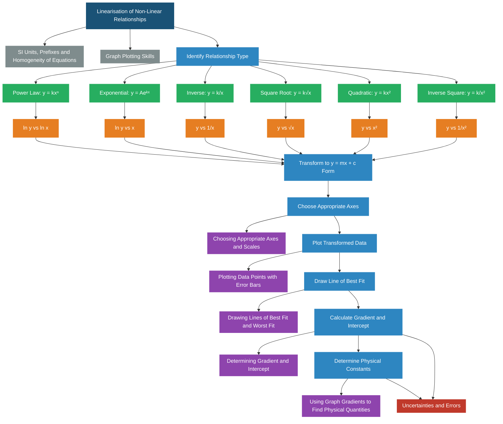

# 1. Overview / 概述

**English:**
Linearisation is a powerful graph-plotting technique used to transform non-linear relationships into straight-line graphs. When two physical quantities are related by a non-linear equation (e.g., $T = 2\pi\sqrt{\frac{l}{g}}$ or $V = IR$ with non-ohmic behaviour), it is difficult to determine constants or verify the relationship directly from a curved graph. By choosing appropriate functions of the variables for the axes (e.g., plotting $T^2$ against $l$ instead of $T$ against $l$), we can produce a straight-line graph. This allows us to use the gradient and intercept to determine unknown physical constants with greater accuracy and reliability. This skill is fundamental to [[Graph Plotting Skills]] and is essential for both practical papers and theory questions.

**中文:**
线性化是一种强大的绘图技术，用于将非线性关系转换为直线图。当两个物理量通过非线性方程（例如 $T = 2\pi\sqrt{\frac{l}{g}}$ 或 $V = IR$ 的非欧姆行为）关联时，直接从曲线图确定常数或验证关系很困难。通过为坐标轴选择合适的变量函数（例如，绘制 $T^2$ 对 $l$ 的图，而不是 $T$ 对 $l$ 的图），我们可以生成一条直线图。这使我们能够利用斜率和截距更准确、更可靠地确定未知物理常数。这项技能是 [[Graph Plotting Skills]] 的基础，对实验卷和理论题都至关重要。

---

# 2. Syllabus Learning Objectives / 考纲学习目标

| CAIE 9702 | Edexcel IAL |
|-----------|-------------|
| 1.5(a) Identify relationships between variables from given data | WPH11 U1: 1.13 Recognise linear and non-linear relationships |
| 1.5(b) Transform relationships into linear form $y = mx + c$ | WPH11 U1: 1.14 Transform equations to linear form |
| 1.5(c) Plot appropriate graphs to obtain straight lines | WPH11 U1: 1.15 Plot graphs to test relationships |
| 1.5(d) Determine gradient and intercept from linearised graphs | WPH11 U1: 1.16 Determine gradient and intercept |
| 1.5(e) Use gradient and intercept to find physical constants | WPH11 U1: 1.17 Use gradient to find physical quantities |
| 1.5(f) Evaluate the validity of a relationship | WPH11 U1: 1.18 Evaluate relationships from graphs |

**Examiner Expectations / 考官期望:**
- **English:** You must be able to identify the correct variables to plot on each axis to produce a straight line. You must be able to rearrange equations into the form $y = mx + c$ and correctly identify what $x$, $y$, $m$, and $c$ represent physically. You must also be able to calculate the gradient and intercept from the linearised graph and use them to determine unknown constants.
- **中文:** 你必须能够识别正确的变量绘制在每个坐标轴上以产生直线。你必须能够将方程重新排列成 $y = mx + c$ 的形式，并正确识别 $x$、$y$、$m$ 和 $c$ 的物理含义。你还必须能够从线性化图中计算斜率和截距，并用它们来确定未知常数。

---

# 3. Core Definitions / 核心定义

| Term (EN/CN) | Definition (EN) | Definition (CN) | Common Mistakes / 常见错误 |
|--------------|-----------------|-----------------|---------------------------|
| **Linearisation** / 线性化 | The process of transforming a non-linear relationship into a linear form by plotting suitable functions of the variables | 通过绘制变量的适当函数将非线性关系转换为线性形式的过程 | Confusing linearisation with simply drawing a curve; forgetting to include units in the transformed variables |
| **$y = mx + c$ Form** / 标准线性形式 | The standard equation of a straight line, where $m$ is the gradient and $c$ is the y-intercept | 直线方程的标准形式，其中 $m$ 是斜率，$c$ 是 y 轴截距 | Mixing up which variable corresponds to $x$ and which to $y$ |
| **Gradient** / 斜率 | The rate of change of $y$ with respect to $x$, calculated as $\frac{\Delta y}{\Delta x}$ from the line of best fit | $y$ 相对于 $x$ 的变化率，从最佳拟合线计算为 $\frac{\Delta y}{\Delta x}$ | Using data points instead of the line of best fit; not using a large triangle for calculation |
| **Intercept** / 截距 | The value of $y$ when $x = 0$ on the line of best fit | 最佳拟合线上 $x = 0$ 时 $y$ 的值 | Extending the line beyond the data range without justification; confusing y-intercept with x-intercept |
| **Transformed Variable** / 变换变量 | A function of the original variable (e.g., $T^2$, $\frac{1}{r}$, $\ln P$) used as an axis quantity | 原始变量的函数（例如 $T^2$、$\frac{1}{r}$、$\ln P$）用作坐标轴量 | Forgetting to calculate the transformed values correctly; not including units in the transformed variable |
| **Proportionality** / 正比关系 | A relationship where $y \propto x$, meaning $y = kx$ and the graph passes through the origin | 一种关系，其中 $y \propto x$，意味着 $y = kx$ 且图形通过原点 | Assuming all straight lines through origin indicate proportionality (must check if intercept is zero) |

---

# 4. Key Concepts Explained / 关键概念详解

## 4.1 The Principle of Linearisation / 线性化原理

### Explanation / 解释
**English:**
The core idea of linearisation is based on the fact that a straight-line graph is the easiest type of graph to analyse accurately. If two quantities $p$ and $q$ are related by a non-linear equation, we can often rearrange the equation into the form $y = mx + c$, where $y$ is some function of $p$, $x$ is some function of $q$, $m$ is a combination of constants, and $c$ is another combination of constants. By plotting $y$ against $x$, we obtain a straight line. The gradient $m$ and intercept $c$ can then be used to determine the unknown physical constants in the original equation. This technique is closely related to [[Choosing Appropriate Axes and Scales]] because the choice of axes determines whether the graph is linear.

**中文:**
线性化的核心思想基于一个事实：直线图是最容易准确分析的图形类型。如果两个量 $p$ 和 $q$ 通过非线性方程关联，我们通常可以将方程重新排列成 $y = mx + c$ 的形式，其中 $y$ 是 $p$ 的某个函数，$x$ 是 $q$ 的某个函数，$m$ 是常数的组合，$c$ 是另一个常数的组合。通过绘制 $y$ 对 $x$ 的图，我们得到一条直线。然后可以利用斜率 $m$ 和截距 $c$ 来确定原始方程中的未知物理常数。这项技术与 [[Choosing Appropriate Axes and Scales]] 密切相关，因为坐标轴的选择决定了图形是否为线性。

### Physical Meaning / 物理意义
**English:**
Linearisation reveals the underlying mathematical structure of a physical law. For example, if a relationship is of the form $y = kx^n$, plotting $\ln y$ against $\ln x$ gives a straight line with gradient $n$ and intercept $\ln k$. This tells us both the exponent (power) and the proportionality constant. Linearisation is not just a mathematical trick — it is a way to test whether a proposed physical law is correct by checking if the transformed data falls on a straight line.

**中文:**
线性化揭示了物理定律的底层数学结构。例如，如果关系形式为 $y = kx^n$，绘制 $\ln y$ 对 $\ln x$ 的图会得到一条斜率为 $n$、截距为 $\ln k$ 的直线。这告诉我们指数（幂）和比例常数。线性化不仅仅是一个数学技巧——它是一种通过检查变换后的数据是否落在直线上来检验所提出的物理定律是否正确的方法。

### Common Misconceptions / 常见误区
- **English:**
  - Thinking that any curved graph can be made straight by plotting any function — the transformation must match the mathematical form of the equation.
  - Forgetting that the intercept $c$ in the linearised equation may not be the same as the intercept on the graph — careful algebraic matching is needed.
  - Assuming that if the graph is a straight line, the relationship must be proportional — the line must pass through the origin for proportionality.
- **中文:**
  - 认为任何曲线图都可以通过绘制任何函数变成直线——变换必须与方程的数学形式匹配。
  - 忘记线性化方程中的截距 $c$ 可能与图上的截距不同——需要仔细的代数匹配。
  - 假设如果图形是直线，关系必须是正比——直线必须通过原点才是正比关系。

### Exam Tips / 考试提示
- **English:**
  - Always write the original equation first, then rearrange to $y = mx + c$ form.
  - Clearly state what you are plotting on each axis (e.g., "Plot $T^2$ on the y-axis against $l$ on the x-axis").
  - Check that your transformed variables have the correct units.
  - Use a large triangle (at least half the line length) to calculate the gradient.
- **中文:**
  - 始终先写出原始方程，然后重新排列成 $y = mx + c$ 形式。
  - 清楚说明你在每个坐标轴上绘制什么（例如，"在 y 轴上绘制 $T^2$，在 x 轴上绘制 $l$"）。
  - 检查你的变换变量是否有正确的单位。
  - 使用大三角形（至少线长的一半）来计算斜率。

> 📷 **IMAGE PROMPT — LNR-01: Linearisation Concept Diagram**
> A split diagram showing two graphs side by side. Left graph: a curved line showing T vs l for a pendulum, with the equation T = 2π√(l/g). Right graph: a straight line showing T² vs l, with gradient = 4π²/g. Arrows connect the two graphs showing the transformation. Labels: "Non-linear" on left, "Linearised" on right. Include axis labels with units.

## 4.2 Common Linearisation Patterns / 常见线性化模式

### Explanation / 解释
**English:**
There are several common patterns of non-linear relationships that appear frequently in A-Level Physics. Each pattern has a standard linearisation method:

1. **Power Law:** $y = kx^n$ → Plot $\ln y$ against $\ln x$ (gradient $= n$, intercept $= \ln k$)
2. **Exponential:** $y = Ae^{kx}$ → Plot $\ln y$ against $x$ (gradient $= k$, intercept $= \ln A$)
3. **Inverse:** $y = \frac{k}{x}$ → Plot $y$ against $\frac{1}{x}$ (gradient $= k$, intercept $= 0$)
4. **Square Root:** $y = k\sqrt{x}$ → Plot $y$ against $\sqrt{x}$ (gradient $= k$, intercept $= 0$)
5. **Quadratic:** $y = kx^2$ → Plot $y$ against $x^2$ (gradient $= k$, intercept $= 0$)
6. **Inverse Square:** $y = \frac{k}{x^2}$ → Plot $y$ against $\frac{1}{x^2}$ (gradient $= k$, intercept $= 0$)

**中文:**
有几种常见的非线性关系模式经常出现在 A-Level 物理中。每种模式都有标准的线性化方法：

1. **幂律：** $y = kx^n$ → 绘制 $\ln y$ 对 $\ln x$（斜率 $= n$，截距 $= \ln k$）
2. **指数：** $y = Ae^{kx}$ → 绘制 $\ln y$ 对 $x$（斜率 $= k$，截距 $= \ln A$）
3. **反比：** $y = \frac{k}{x}$ → 绘制 $y$ 对 $\frac{1}{x}$（斜率 $= k$，截距 $= 0$）
4. **平方根：** $y = k\sqrt{x}$ → 绘制 $y$ 对 $\sqrt{x}$（斜率 $= k$，截距 $= 0$）
5. **二次：** $y = kx^2$ → 绘制 $y$ 对 $x^2$（斜率 $= k$，截距 $= 0$）
6. **反平方：** $y = \frac{k}{x^2}$ → 绘制 $y$ 对 $\frac{1}{x^2}$（斜率 $= k$，截距 $= 0$）

### Physical Meaning / 物理意义
**English:**
Each pattern corresponds to a fundamental physical law. For example, Newton's law of gravitation ($F = \frac{GMm}{r^2}$) follows an inverse square law. Radioactive decay ($N = N_0e^{-\lambda t}$) follows an exponential law. The period of a pendulum ($T = 2\pi\sqrt{\frac{l}{g}}$) follows a square root law. Being able to recognise these patterns and linearise them is essential for analysing experimental data.

**中文:**
每种模式对应一个基本的物理定律。例如，牛顿万有引力定律（$F = \frac{GMm}{r^2}$）遵循反平方律。放射性衰变（$N = N_0e^{-\lambda t}$）遵循指数律。单摆周期（$T = 2\pi\sqrt{\frac{l}{g}}$）遵循平方根律。能够识别这些模式并将其线性化对于分析实验数据至关重要。

### Common Misconceptions / 常见误区
- **English:**
  - Using $\ln$ transformation when the relationship is not exponential or power law.
  - Forgetting that $\ln y$ against $\ln x$ gives a straight line only for power laws, not for all non-linear relationships.
  - Not checking whether the intercept should be zero — if the theory predicts zero intercept but the graph shows a non-zero intercept, this indicates systematic error or an incorrect model.
- **中文:**
  - 当关系不是指数或幂律时使用 $\ln$ 变换。
  - 忘记 $\ln y$ 对 $\ln x$ 只对幂律给出直线，而不是对所有非线性关系。
  - 不检查截距是否应为零——如果理论预测截距为零但图显示非零截距，这表明存在系统误差或模型不正确。

### Exam Tips / 考试提示
- **English:**
  - Memorise the standard linearisation patterns — they appear frequently in past papers.
  - When given data, first try to identify the pattern by looking at how $y$ changes as $x$ changes.
  - For power laws, always try $\ln y$ vs $\ln x$ first — if the graph is straight, the relationship is a power law.
  - Remember that $\ln$ transformations require all values to be positive.
- **中文:**
  - 记住标准的线性化模式——它们在历年真题中经常出现。
  - 当给定数据时，首先通过观察 $y$ 如何随 $x$ 变化来尝试识别模式。
  - 对于幂律，始终先尝试 $\ln y$ 对 $\ln x$——如果图形是直线，则关系是幂律。
  - 记住 $\ln$ 变换要求所有值为正。

> 📷 **IMAGE PROMPT — LNR-02: Common Linearisation Patterns**
> A grid of 6 small graphs arranged in 2 rows × 3 columns. Each shows a non-linear curve on the left and its linearised straight line on the right. Row 1: Power law (y=kx²), Exponential (y=Aeᵏˣ), Inverse (y=k/x). Row 2: Square root (y=k√x), Quadratic (y=kx²), Inverse square (y=k/x²). Each pair has axis labels showing the transformed variables. Use different colours for each pattern.

---

# 5. Essential Equations / 核心公式

## 5.1 Standard Linear Form / 标准线性形式

$$ y = mx + c $$

| Symbol (符号) | Meaning (EN) | Meaning (CN) | Unit (单位) |
|--------------|-------------|-------------|------------|
| $y$ | Dependent variable (plotted on y-axis) | 因变量（绘制在 y 轴上） | Varies |
| $x$ | Independent variable (plotted on x-axis) | 自变量（绘制在 x 轴上） | Varies |
| $m$ | Gradient of the line | 直线的斜率 | (unit of y)/(unit of x) |
| $c$ | y-intercept (value of y when x = 0) | y 轴截距（x = 0 时 y 的值） | Same as y |

## 5.2 Power Law Linearisation / 幂律线性化

$$ y = kx^n \implies \ln y = n \ln x + \ln k $$

| Symbol (符号) | Meaning (EN) | Meaning (CN) | Unit (单位) |
|--------------|-------------|-------------|------------|
| $y$ | Original dependent variable | 原始因变量 | Varies |
| $x$ | Original independent variable | 原始自变量 | Varies |
| $k$ | Proportionality constant | 比例常数 | Varies |
| $n$ | Exponent (power) | 指数（幂） | Dimensionless |
| $\ln y$ | Transformed y-axis variable | 变换后的 y 轴变量 | Dimensionless |
| $\ln x$ | Transformed x-axis variable | 变换后的 x 轴变量 | Dimensionless |

**Derivation / 推导:**
$$ y = kx^n $$
Take natural logarithm of both sides:
$$ \ln y = \ln(kx^n) = \ln k + n \ln x $$
This is in the form $y' = mx' + c$ where $y' = \ln y$, $x' = \ln x$, $m = n$, $c = \ln k$.

**Conditions / 适用条件:**
- **English:** All values of $x$ and $y$ must be positive (since $\ln$ of a negative number is undefined). The relationship must be a power law.
- **中文:** $x$ 和 $y$ 的所有值必须为正（因为负数的 $\ln$ 未定义）。关系必须是幂律。

**Limitations / 局限性:**
- **English:** Cannot be used if any data point has a zero or negative value. The $\ln$ transformation compresses large values and expands small values, which can affect the appearance of uncertainty.
- **中文:** 如果任何数据点有零或负值，则不能使用。$\ln$ 变换压缩大值并扩展小值，这会影响不确定性的表现。

## 5.3 Exponential Linearisation / 指数线性化

$$ y = Ae^{kx} \implies \ln y = kx + \ln A $$

| Symbol (符号) | Meaning (EN) | Meaning (CN) | Unit (单位) |
|--------------|-------------|-------------|------------|
| $y$ | Original dependent variable | 原始因变量 | Varies |
| $x$ | Original independent variable | 原始自变量 | Varies |
| $A$ | Initial value (y when x = 0) | 初始值（x = 0 时 y 的值） | Same as y |
| $k$ | Growth/decay constant | 增长/衰减常数 | 1/(unit of x) |
| $\ln y$ | Transformed y-axis variable | 变换后的 y 轴变量 | Dimensionless |

**Derivation / 推导:**
$$ y = Ae^{kx} $$
Take natural logarithm of both sides:
$$ \ln y = \ln(Ae^{kx}) = \ln A + kx $$
This is in the form $y' = mx + c$ where $y' = \ln y$, $m = k$, $c = \ln A$.

**Conditions / 适用条件:**
- **English:** All values of $y$ must be positive. The relationship must be exponential (constant ratio of successive y-values for equal x-intervals).
- **中文:** $y$ 的所有值必须为正。关系必须是指数关系（对于相等的 x 间隔，连续 y 值的比率为常数）。

**Limitations / 局限性:**
- **English:** Same as power law — cannot handle zero or negative values. The $\ln$ transformation changes the error distribution.
- **中文:** 与幂律相同——不能处理零或负值。$\ln$ 变换改变了误差分布。

> 📷 **IMAGE PROMPT — LNR-03: Exponential Linearisation Example**
> A two-part diagram. Left: A curved graph showing exponential decay N = N₀e^(-λt) with N on y-axis and t on x-axis. Right: A straight line graph showing ln(N) on y-axis against t on x-axis, with gradient = -λ and intercept = ln(N₀). Include data points and line of best fit on both graphs. Use radioactive decay as the example context.

---

# 6. Graphs and Relationships / 图表与关系

## 6.1 Power Law: $\ln y$ vs $\ln x$ Graph / 幂律：$\ln y$ 对 $\ln x$ 图

### Axes / 坐标轴
- **x-axis:** $\ln x$ (dimensionless) / x 轴：$\ln x$（无量纲）
- **y-axis:** $\ln y$ (dimensionless) / y 轴：$\ln y$（无量纲）

### Shape / 形状
- **English:** A straight line with gradient $n$ and intercept $\ln k$.
- **中文:** 一条斜率为 $n$、截距为 $\ln k$ 的直线。

### Gradient Meaning / 斜率含义
- **English:** The gradient equals the exponent $n$ in the power law $y = kx^n$.
- **中文:** 斜率等于幂律 $y = kx^n$ 中的指数 $n$。

### Area Meaning / 面积含义
- **English:** No physical meaning — the axes are logarithmic.
- **中文:** 没有物理意义——坐标轴是对数坐标。

### Exam Interpretation / 考试解读
- **English:** If the $\ln y$ vs $\ln x$ graph is a straight line, the relationship is a power law. The gradient gives the power, and the intercept gives $\ln k$ (so $k = e^{\text{intercept}}$).
- **中文:** 如果 $\ln y$ 对 $\ln x$ 的图是直线，则关系是幂律。斜率给出幂，截距给出 $\ln k$（所以 $k = e^{\text{截距}}$）。

## 6.2 Exponential: $\ln y$ vs $x$ Graph / 指数：$\ln y$ 对 $x$ 图

### Axes / 坐标轴
- **x-axis:** $x$ (original units) / x 轴：$x$（原始单位）
- **y-axis:** $\ln y$ (dimensionless) / y 轴：$\ln y$（无量纲）

### Shape / 形状
- **English:** A straight line with gradient $k$ and intercept $\ln A$.
- **中文:** 一条斜率为 $k$、截距为 $\ln A$ 的直线。

### Gradient Meaning / 斜率含义
- **English:** The gradient equals the growth/decay constant $k$ in $y = Ae^{kx}$.
- **中文:** 斜率等于 $y = Ae^{kx}$ 中的增长/衰减常数 $k$。

### Area Meaning / 面积含义
- **English:** No physical meaning.
- **中文:** 没有物理意义。

### Exam Interpretation / 考试解读
- **English:** If the $\ln y$ vs $x$ graph is a straight line, the relationship is exponential. The gradient gives $k$, and the intercept gives $\ln A$ (so $A = e^{\text{intercept}}$). For radioactive decay, $k = -\lambda$.
- **中文:** 如果 $\ln y$ 对 $x$ 的图是直线，则关系是指数关系。斜率给出 $k$，截距给出 $\ln A$（所以 $A = e^{\text{截距}}$）。对于放射性衰变，$k = -\lambda$。

---

# 7. Required Diagrams / 必备图表

## 7.1 Linearisation Process Flowchart / 线性化过程流程图

### Description / 描述
**English:** A flowchart showing the step-by-step process of linearising a non-linear relationship, from identifying the relationship type to calculating physical constants from the graph.

**中文:** 一个流程图，展示线性化非线性关系的逐步过程，从识别关系类型到从图形计算物理常数。

### Image Prompt / 图片生成提示
> 📷 **IMAGE PROMPT — LNR-04: Linearisation Flowchart**
> A vertical flowchart with 6 boxes connected by arrows. Box 1: "Identify relationship type (power, exponential, inverse, etc.)". Box 2: "Write equation in y = mx + c form". Box 3: "Identify what to plot on each axis". Box 4: "Calculate transformed variables". Box 5: "Plot graph and draw line of best fit". Box 6: "Calculate gradient and intercept to find constants". Use clean, professional design with blue and green colours. Include example equations in each box.

### Labels Required / 需要标注
- **English:** Each step should be clearly labelled with the action and an example.
- **中文:** 每一步都应清楚标注操作和示例。

### Exam Importance / 考试重要性
- **English:** High — this process is tested in both practical and theory papers.
- **中文:** 高——这个过程在实验卷和理论卷中都会考到。

## 7.2 Example: Pendulum Period Linearisation / 示例：单摆周期线性化

### Description / 描述
**English:** A diagram showing how the relationship $T = 2\pi\sqrt{\frac{l}{g}}$ is linearised by plotting $T^2$ against $l$.

**中文:** 一个图表，展示如何通过绘制 $T^2$ 对 $l$ 的图来线性化关系 $T = 2\pi\sqrt{\frac{l}{g}}$。

### Image Prompt / 图片生成提示
> 📷 **IMAGE PROMPT — LNR-05: Pendulum Linearisation**
> Two graphs side by side. Left: A curved graph showing T (period) on y-axis vs l (length) on x-axis, with a smooth curve passing through data points. Right: A straight line graph showing T² (s²) on y-axis vs l (m) on x-axis, with data points and a line of best fit. On the right graph, show a gradient triangle with Δ(T²) and Δl labelled. Include the equation T² = (4π²/g)l next to the right graph. Use pendulum diagram as inset.

### Labels Required / 需要标注
- **English:** Original equation, transformed equation, axis labels with units, gradient triangle, line of best fit.
- **中文:** 原始方程、变换后的方程、带单位的坐标轴标签、斜率三角形、最佳拟合线。

### Exam Importance / 考试重要性
- **English:** Very high — this is a classic example that appears in many past papers.
- **中文:** 非常高——这是一个经典的例子，出现在许多历年真题中。

---

# 8. Worked Examples / 典型例题

## Example 1: Power Law Linearisation / 示例 1：幂律线性化

### Question / 题目
**English:**
The period $T$ of a simple pendulum is related to its length $l$ by the equation $T = 2\pi\sqrt{\frac{l}{g}}$. A student measures $T$ for different values of $l$ and obtains the following data:

| $l$ / m | 0.20 | 0.40 | 0.60 | 0.80 | 1.00 |
|---------|------|------|------|------|------|
| $T$ / s | 0.90 | 1.27 | 1.55 | 1.79 | 2.01 |

(a) Show that plotting $T^2$ against $l$ gives a straight line.
(b) Calculate the gradient of the line.
(c) Use the gradient to determine the value of $g$.

**中文:**
单摆的周期 $T$ 与其长度 $l$ 的关系为 $T = 2\pi\sqrt{\frac{l}{g}}$。一名学生测量了不同 $l$ 值下的 $T$，得到以下数据：

| $l$ / m | 0.20 | 0.40 | 0.60 | 0.80 | 1.00 |
|---------|------|------|------|------|------|
| $T$ / s | 0.90 | 1.27 | 1.55 | 1.79 | 2.01 |

(a) 证明绘制 $T^2$ 对 $l$ 的图得到一条直线。
(b) 计算直线的斜率。
(c) 利用斜率确定 $g$ 的值。

### Solution / 解答

**Step 1: Transform the equation / 步骤 1：变换方程**

$$ T = 2\pi\sqrt{\frac{l}{g}} $$

Square both sides:
$$ T^2 = \frac{4\pi^2}{g} l $$

This is in the form $y = mx + c$ where:
- $y = T^2$ (plotted on y-axis)
- $x = l$ (plotted on x-axis)
- $m = \frac{4\pi^2}{g}$ (gradient)
- $c = 0$ (intercept)

**Step 2: Calculate transformed values / 步骤 2：计算变换后的值**

| $l$ / m | 0.20 | 0.40 | 0.60 | 0.80 | 1.00 |
|---------|------|------|------|------|------|
| $T$ / s | 0.90 | 1.27 | 1.55 | 1.79 | 2.01 |
| $T^2$ / s² | 0.81 | 1.61 | 2.40 | 3.20 | 4.04 |

**Step 3: Plot graph and calculate gradient / 步骤 3：绘制图形并计算斜率**

Using the line of best fit through the points, choose two points on the line (not data points):

$$ \text{Gradient} = \frac{\Delta(T^2)}{\Delta l} = \frac{4.04 - 0.81}{1.00 - 0.20} = \frac{3.23}{0.80} = 4.04 \text{ s}^2\text{m}^{-1} $$

**Step 4: Determine $g$ / 步骤 4：确定 $g$**

$$ m = \frac{4\pi^2}{g} $$

$$ g = \frac{4\pi^2}{m} = \frac{4\pi^2}{4.04} = 9.77 \text{ m s}^{-2} $$

### Final Answer / 最终答案
**Answer:** $g = 9.77 \text{ m s}^{-2}$ | **答案：** $g = 9.77 \text{ m s}^{-2}$

### Quick Tip / 提示
- **English:** Always use points on the line of best fit, not data points, to calculate the gradient. Use a large triangle for accuracy.
- **中文:** 始终使用最佳拟合线上的点，而不是数据点，来计算斜率。使用大三角形以确保准确性。

## Example 2: Exponential Linearisation / 示例 2：指数线性化

### Question / 题目
**English:**
The activity $A$ of a radioactive sample decays according to $A = A_0e^{-\lambda t}$. A student measures the activity at different times and obtains:

| $t$ / s | 0 | 10 | 20 | 30 | 40 |
|---------|---|---|----|----|----|
| $A$ / Bq | 100 | 61 | 37 | 22 | 14 |

(a) Show that plotting $\ln A$ against $t$ gives a straight line.
(b) Determine the decay constant $\lambda$.
(c) Determine the initial activity $A_0$.

**中文:**
放射性样品的活度 $A$ 按照 $A = A_0e^{-\lambda t}$ 衰变。一名学生在不同时间测量活度，得到：

| $t$ / s | 0 | 10 | 20 | 30 | 40 |
|---------|---|---|----|----|----|
| $A$ / Bq | 100 | 61 | 37 | 22 | 14 |

(a) 证明绘制 $\ln A$ 对 $t$ 的图得到一条直线。
(b) 确定衰变常数 $\lambda$。
(c) 确定初始活度 $A_0$。

### Solution / 解答

**Step 1: Transform the equation / 步骤 1：变换方程**

$$ A = A_0e^{-\lambda t} $$

Take natural logarithm:
$$ \ln A = \ln A_0 - \lambda t $$

This is in the form $y = mx + c$ where:
- $y = \ln A$ (plotted on y-axis)
- $x = t$ (plotted on x-axis)
- $m = -\lambda$ (gradient)
- $c = \ln A_0$ (intercept)

**Step 2: Calculate transformed values / 步骤 2：计算变换后的值**

| $t$ / s | 0 | 10 | 20 | 30 | 40 |
|---------|---|---|----|----|----|
| $A$ / Bq | 100 | 61 | 37 | 22 | 14 |
| $\ln A$ | 4.61 | 4.11 | 3.61 | 3.09 | 2.64 |

**Step 3: Plot graph and calculate gradient / 步骤 3：绘制图形并计算斜率**

Using the line of best fit:

$$ \text{Gradient} = \frac{\Delta(\ln A)}{\Delta t} = \frac{2.64 - 4.61}{40 - 0} = \frac{-1.97}{40} = -0.0493 \text{ s}^{-1} $$

**Step 4: Determine $\lambda$ and $A_0$ / 步骤 4：确定 $\lambda$ 和 $A_0$**

$$ m = -\lambda = -0.0493 \text{ s}^{-1} $$
$$ \lambda = 0.0493 \text{ s}^{-1} $$

$$ c = \ln A_0 = 4.61 $$
$$ A_0 = e^{4.61} = 100 \text{ Bq} $$

### Final Answer / 最终答案
**Answer:** $\lambda = 0.0493 \text{ s}^{-1}$, $A_0 = 100 \text{ Bq}$ | **答案：** $\lambda = 0.0493 \text{ s}^{-1}$，$A_0 = 100 \text{ Bq}$

### Quick Tip / 提示
- **English:** The intercept on the $\ln A$ vs $t$ graph gives $\ln A_0$, not $A_0$ directly. Remember to take the exponential to find $A_0$.
- **中文:** $\ln A$ 对 $t$ 图上的截距给出 $\ln A_0$，而不是直接给出 $A_0$。记得取指数来找到 $A_0$。

---

# 9. Past Paper Question Types / 历年真题题型

| Question Type / 题型 | Frequency / 频率 | Difficulty / 难度 | Past Paper References / 真题索引 |
|----------------------|------------------|------------------|-------------------------------|
| Transform equation to $y = mx + c$ form | Very High | Easy | 📝 *待填入* |
| Identify correct axes for linearisation | Very High | Medium | 📝 *待填入* |
| Calculate gradient from linearised graph | High | Medium | 📝 *待填入* |
| Use gradient to find physical constant | High | Medium-Hard | 📝 *待填入* |
| Evaluate validity of relationship from graph | Medium | Hard | 📝 *待填入* |
| Determine intercept and use to find constant | Medium | Medium-Hard | 📝 *待填入* |

**Common Command Words / 常见指令词:**
- **English:** "Show that", "Plot", "Determine", "Calculate", "State", "Explain", "Deduce", "Verify"
- **中文:** "证明"、"绘制"、"确定"、"计算"、"说明"、"解释"、"推导"、"验证"

---

# 10. Practical Skills Connections / 实验技能链接

**English:**
Linearisation is a core skill in practical physics. In Paper 3 (CAIE) and Unit 6 (Edexcel), you will often be asked to:

1. **Transform data:** Calculate values of transformed variables (e.g., $T^2$, $\ln A$, $\frac{1}{r}$) from raw measurements.
2. **Plot transformed data:** Choose appropriate scales for the transformed variables and plot the points.
3. **Draw line of best fit:** Draw a straight line through the transformed data points.
4. **Calculate gradient:** Use a large gradient triangle to find the gradient of the line.
5. **Determine physical constants:** Use the gradient and intercept to find unknown constants in the original equation.
6. **Evaluate the relationship:** Check if the transformed data falls on a straight line to verify the proposed relationship.

**Uncertainty considerations:**
- When transforming variables, uncertainties also transform. For example, if $T = 1.00 \pm 0.01$ s, then $T^2 = 1.00 \pm 0.02$ s² (using $\Delta(T^2) = 2T\Delta T$).
- When using $\ln$ transformations, the uncertainty in $\ln y$ is approximately $\frac{\Delta y}{y}$.
- The line of best fit should be drawn considering the error bars on the transformed data.

**中文:**
线性化是实验物理中的核心技能。在 Paper 3（CAIE）和 Unit 6（Edexcel）中，你经常会被要求：

1. **变换数据：** 从原始测量值计算变换变量的值（例如 $T^2$、$\ln A$、$\frac{1}{r}$）。
2. **绘制变换后的数据：** 为变换后的变量选择合适的比例并绘制点。
3. **绘制最佳拟合线：** 通过变换后的数据点绘制一条直线。
4. **计算斜率：** 使用大斜率三角形找到直线的斜率。
5. **确定物理常数：** 利用斜率和截距找到原始方程中的未知常数。
6. **评估关系：** 检查变换后的数据是否落在直线上以验证所提出的关系。

**不确定性考虑：**
- 变换变量时，不确定性也会变换。例如，如果 $T = 1.00 \pm 0.01$ s，则 $T^2 = 1.00 \pm 0.02$ s²（使用 $\Delta(T^2) = 2T\Delta T$）。
- 使用 $\ln$ 变换时，$\ln y$ 的不确定性约为 $\frac{\Delta y}{y}$。
- 绘制最佳拟合线时应考虑变换后数据上的误差棒。

---

# 11. Concept Map / 概念图谱

---

# 12. Quick Revision Sheet / 速查表

| Category / 类别 | Key Points / 要点 |
|----------------|------------------|
| **Definition / 定义** | Transforming non-linear relationships into straight-line graphs by plotting suitable functions of variables / 通过绘制变量的适当函数将非线性关系转换为直线图 |
| **Key Formula / 核心公式** | $y = mx + c$ — standard linear form / 标准线性形式 |
| **Power Law / 幂律** | $y = kx^n \rightarrow \ln y = n\ln x + \ln k$ — plot $\ln y$ vs $\ln x$ / 绘制 $\ln y$ 对 $\ln x$ |
| **Exponential / 指数** | $y = Ae^{kx} \rightarrow \ln y = kx + \ln A$ — plot $\ln y$ vs $x$ / 绘制 $\ln y$ 对 $x$ |
| **Inverse / 反比** | $y = \frac{k}{x} \rightarrow$ plot $y$ vs $\frac{1}{x}$ / 绘制 $y$ 对 $\frac{1}{x}$ |
| **Square Root / 平方根** | $y = k\sqrt{x} \rightarrow$ plot $y$ vs $\sqrt{x}$ / 绘制 $y$ 对 $\sqrt{x}$ |
| **Quadratic / 二次** | $y = kx^2 \rightarrow$ plot $y$ vs $x^2$ / 绘制 $y$ 对 $x^2$ |
| **Inverse Square / 反平方** | $y = \frac{k}{x^2} \rightarrow$ plot $y$ vs $\frac{1}{x^2}$ / 绘制 $y$ 对 $\frac{1}{x^2}$ |
| **Key Graph / 核心图表** | Straight line through transformed data points / 通过变换后数据点的直线 |
| **Gradient Meaning / 斜率含义** | Equals the constant relating the transformed variables (e.g., $n$, $k$, $\frac{4\pi^2}{g}$) / 等于连接变换变量的常数 |
| **Intercept Meaning / 截距含义** | Equals the constant term in the linearised equation (e.g., $\ln k$, $\ln A$) / 等于线性化方程中的常数项 |
| **Exam Tip / 考试提示** | Always write original equation → rearrange to $y = mx + c$ → identify axes → plot → calculate gradient using large triangle / 始终先写原始方程 → 重排成 $y = mx + c$ → 识别坐标轴 → 绘图 → 使用大三角形计算斜率 |
| **Common Mistake / 常见错误** | Using data points instead of line of best fit for gradient calculation; forgetting to take exponential of intercept / 使用数据点而不是最佳拟合线计算斜率；忘记对截距取指数 |
| **Practical Link / 实验联系** | Transform raw data, plot transformed variables, draw line of best fit, calculate gradient to find constants / 变换原始数据，绘制变换变量，绘制最佳拟合线，计算斜率以找到常数 |