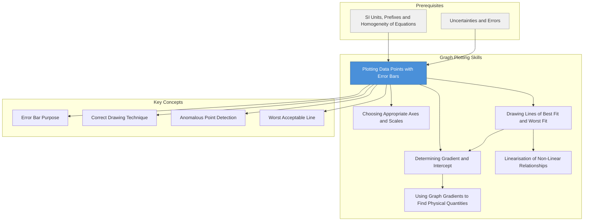

# 1. Overview / 概述

**English:**
This sub-topic covers the correct technique for plotting data points with error bars on a graph. Error bars are a visual representation of the uncertainty in each measurement, showing the range within which the true value is likely to lie. Mastering this skill is essential for A-Level Physics practical exams (Paper 3 for CAIE, Unit 6 for Edexcel) as it demonstrates your understanding of measurement uncertainty and data quality. This skill directly connects to [[Drawing Lines of Best Fit and Worst Fit]] and [[Determining Gradient and Intercept]], as error bars determine the range of possible lines through your data.

**中文:**
本子知识点涵盖在图表上正确绘制带误差棒的数据点的技巧。误差棒是每次测量不确定度的可视化表示，显示了真实值可能存在的范围。掌握这项技能对于A-Level物理实验考试（CAIE Paper 3，Edexcel Unit 6）至关重要，因为它展示了你对测量不确定度和数据质量的理解。这项技能直接连接到[[Drawing Lines of Best Fit and Worst Fit / 绘制最佳拟合线和最差拟合线]]和[[Determining Gradient and Intercept / 确定斜率和截距]]，因为误差棒决定了通过数据点的可能线的范围。

---

# 2. Syllabus Learning Objectives / 考纲学习目标

| CAIE 9702 | Edexcel IAL |
|-----------|-------------|
| 1.5(a) Plot data points with appropriate error bars | WPH11 U1: 1.13 Plot data points with error bars |
| 1.5(b) Use error bars to assess the reliability of data | WPH11 U1: 1.14 Interpret error bars on graphs |
| 1.5(c) Draw lines of best fit and worst acceptable lines through error bars | WPH11 U1: 1.15 Use error bars to determine uncertainty in gradient and intercept |
| 1.5(d) Determine uncertainty in gradient from worst acceptable line | WPH11 U1: 1.16 Calculate percentage uncertainty from error bars |
| 1.5(e) Determine uncertainty in intercept from worst acceptable line | WPH11 U1: 1.17 Identify anomalous points using error bars |
| 1.5(f) Identify anomalous points using error bars | WPH11 U1: 1.18 Evaluate experimental reliability using error bars |

**Examiner Expectations / 考官期望:**
- **English:** You must plot points accurately (within ±0.5 small squares), draw error bars of the correct length (±Δx and ±Δy), and use them to determine the range of possible gradients and intercepts.
- **中文:** 你必须精确绘制数据点（在±0.5小方格内），画出正确长度的误差棒（±Δx和±Δy），并用它们来确定可能的斜率和截距范围。

---

# 3. Core Definitions / 核心定义

| Term (EN/CN) | Definition (EN) | Definition (CN) | Common Mistakes / 常见错误 |
|--------------|-----------------|-----------------|---------------------------|
| **Error Bar** / 误差棒 | A graphical representation of the uncertainty in a measured value, shown as a vertical or horizontal line through the data point | 测量值不确定度的图形表示，显示为通过数据点的垂直线或水平线 | Drawing error bars too short or too long; confusing ±1 s.d. with ±2 s.d. |
| **Uncertainty (Δ)** / 不确定度 | The range of values within which the true value is expected to lie, expressed as ± value | 真实值预期所在的数值范围，表示为±值 | Using the same uncertainty for all points without justification |
| **Anomalous Point** / 异常点 | A data point whose error bar does not overlap with the line of best fit or the trend of other points | 其误差棒不与最佳拟合线或其他点的趋势重叠的数据点 | Ignoring anomalous points without justification |
| **Worst Acceptable Line** / 最差可接受线 | The steepest or shallowest straight line that still passes through all error bars | 仍然通过所有误差棒的最陡或最平缓的直线 | Drawing a line that misses an error bar entirely |
| **Best Fit Line** / 最佳拟合线 | The single straight line that best represents the trend of the data, passing through or near most error bars | 最能代表数据趋势的单一直线，通过或接近大多数误差棒 | Forcing the line through the origin when not justified |

---

# 4. Key Concepts Explained / 关键概念详解

## 4.1 Purpose of Error Bars / 误差棒的目的

### Explanation / 解释
**English:** Error bars serve two main purposes in A-Level Physics practical work. First, they show the precision of each measurement — a longer error bar indicates less precise measurement. Second, they allow you to assess whether a line of best fit is appropriate: if a straight line can pass through all error bars, the data is consistent with a linear relationship. Error bars are drawn as vertical lines (for y-uncertainty) and horizontal lines (for x-uncertainty), with caps at each end. The length of each error bar is 2× the uncertainty (from -Δ to +Δ).

**中文:** 在A-Level物理实验工作中，误差棒有两个主要目的。首先，它们显示每次测量的精度——较长的误差棒表示测量精度较低。其次，它们允许你评估最佳拟合线是否合适：如果一条直线可以通过所有误差棒，则数据与线性关系一致。误差棒绘制为垂直线（表示y不确定度）和水平线（表示x不确定度），两端带有横线。每条误差棒的长度为2×不确定度（从-Δ到+Δ）。

### Physical Meaning / 物理意义
**English:** An error bar represents the range of values where the true measurement is likely to be found. For example, if a voltage measurement is 5.0 V ± 0.2 V, the error bar extends from 4.8 V to 5.2 V. The true value could be anywhere within this range.

**中文:** 误差棒代表了真实测量值可能存在的范围。例如，如果电压测量值为5.0 V ± 0.2 V，则误差棒从4.8 V延伸到5.2 V。真实值可能在这个范围内的任何位置。

### Common Misconceptions / 常见误区
- **English:** Error bars are NOT the range of possible values for the next measurement — they represent uncertainty in the current measurement.
- **中文:** 误差棒不是下一次测量可能值的范围——它们代表当前测量的不确定度。
- **English:** Error bars do NOT need to be the same length for all points — each point can have its own uncertainty.
- **中文:** 误差棒不需要对所有点长度相同——每个点可以有自己的不确定度。
- **English:** An anomalous point is NOT just a point far from the line — it's a point whose error bar does NOT overlap with the line.
- **中文:** 异常点不仅仅是远离线的点——而是其误差棒不与线重叠的点。

### Exam Tips / 考试提示
- **English:** Always draw error bars with a sharp pencil and ruler. Use small caps (about 2 mm) at each end. Label the uncertainty on the graph if asked.
- **中文:** 始终用削尖的铅笔和尺子绘制误差棒。在两端使用小横线（约2毫米）。如果要求，在图表上标注不确定度。

> 📷 **IMAGE PROMPT — EP01: Correct Error Bar Drawing**
> A close-up diagram showing a single data point plotted as a small cross (×) on graph paper. A vertical error bar extends above and below the point, with small horizontal caps at each end. Labels indicate: "data point", "error bar", "cap (2 mm)", "±Δy". The grid lines are clearly visible. Clean, technical illustration style suitable for A-Level Physics.

---

## 4.2 Drawing Error Bars Correctly / 正确绘制误差棒

### Explanation / 解释
**English:** To draw an error bar correctly, follow these steps:
1. Plot the data point as a small cross (×) or dot with a circle, using a sharp pencil.
2. Measure the uncertainty Δy from the data table or calculation.
3. Convert Δy to graph units using the scale of the axes.
4. From the data point, draw a vertical line upward by Δy and downward by Δy.
5. Add small horizontal caps (≈2 mm) at both ends of the vertical line.
6. Repeat for horizontal error bars if x-uncertainty is significant.

**中文:** 要正确绘制误差棒，请遵循以下步骤：
1. 用削尖的铅笔将数据点绘制为小叉号（×）或带圆圈的圆点。
2. 从数据表或计算中测量不确定度Δy。
3. 使用坐标轴的刻度将Δy转换为图表单位。
4. 从数据点向上和向下各画一条长度为Δy的垂直线。
5. 在垂直线的两端添加小的水平横线（≈2毫米）。
6. 如果x不确定度显著，重复上述步骤绘制水平误差棒。

### Common Misconceptions / 常见误区
- **English:** Error bars should NOT be drawn as thick lines — use thin, sharp lines.
- **中文:** 误差棒不应画成粗线——使用细而清晰的线。
- **English:** The caps at the ends are essential — without them, the error bar looks like a grid line.
- **中文:** 末端的横线是必不可少的——没有它们，误差棒看起来像网格线。
- **English:** If uncertainty is the same for all points, error bars should be the same length — but check the scale carefully.
- **中文:** 如果所有点的不确定度相同，误差棒应具有相同的长度——但需仔细检查刻度。

### Exam Tips / 考试提示
- **English:** In CAIE Paper 3, you are often given the uncertainty. In Edexcel Unit 6, you may need to calculate it from the range of repeated readings.
- **中文:** 在CAIE Paper 3中，通常会给出不确定度。在Edexcel Unit 6中，你可能需要从重复读数的范围计算不确定度。

---

# 5. Essential Equations / 核心公式

## 5.1 Error Bar Length / 误差棒长度

$$ \text{Error bar length} = 2 \times \Delta y $$

| Symbol (符号) | Meaning (EN) | Meaning (CN) | Unit (单位) |
|--------------|-------------|-------------|------------|
| Δy | Uncertainty in y-measurement | y测量的不确定度 | Same as y (e.g., V, m, s) |

**Conditions / 适用条件:** The error bar extends from y - Δy to y + Δy. This assumes the uncertainty is symmetrical.

**Limitations / 局限性:** This formula assumes the uncertainty is the same in both directions. For some measurements (e.g., reading a scale), the uncertainty may be asymmetric.

---

## 5.2 Converting Uncertainty to Graph Units / 将不确定度转换为图表单位

$$ \text{Error bar length in cm} = \frac{2 \times \Delta y \times \text{scale factor}}{\text{range of y-values}} \times \text{graph length in cm} $$

| Symbol (符号) | Meaning (EN) | Meaning (CN) | Unit (单位) |
|--------------|-------------|-------------|------------|
| Δy | Uncertainty in y | y的不确定度 | Same as y |
| Scale factor | Conversion from physical units to graph units | 从物理单位到图表单位的转换 | cm per unit |

**Derivation / 推导:** This is a proportional calculation. If the y-axis spans from 0 to 10 V over 15 cm, then 1 V = 1.5 cm. An uncertainty of ±0.2 V becomes ±0.3 cm on the graph.

**Conditions / 适用条件:** The graph scale must be linear (not logarithmic).

---

# 6. Graphs and Relationships / 图表与关系

## 6.1 Error Bar Representation / 误差棒表示

### Axes / 坐标轴
- **English:** x-axis: independent variable (e.g., time, mass, length); y-axis: dependent variable (e.g., voltage, temperature, force)
- **中文:** x轴：自变量（如时间、质量、长度）；y轴：因变量（如电压、温度、力）

### Shape / 形状
- **English:** Each data point has a vertical line (error bar) centered on the point. The line extends ±Δy from the point. Small horizontal caps mark the ends.
- **中文:** 每个数据点有一条以点为中心的垂直线（误差棒）。该线从点延伸±Δy。小的水平横线标记末端。

### Gradient Meaning / 斜率含义
- **English:** The gradient of the best fit line represents the relationship between variables. Error bars determine the range of possible gradients.
- **中文:** 最佳拟合线的斜率表示变量之间的关系。误差棒决定了可能的斜率范围。

### Area Meaning / 面积含义
- **English:** Not applicable for error bars directly. However, if the graph shows area under a curve, error bars affect the uncertainty in that area.
- **中文:** 不直接适用于误差棒。但是，如果图表显示曲线下面积，误差棒会影响该面积的不确定度。

### Exam Interpretation / 考试解读
- **English:** If error bars are large relative to the range of data, the experiment has low precision. If error bars overlap with the line of best fit, the data is consistent with the model.
- **中文:** 如果误差棒相对于数据范围较大，则实验精度较低。如果误差棒与最佳拟合线重叠，则数据与模型一致。

> 📷 **IMAGE PROMPT — EP02: Data Points with Error Bars on Graph**
> A graph showing 6 data points plotted as small crosses (×) on grid paper. Each point has a vertical error bar with caps. The x-axis is labeled "Time / s" (0 to 10) and y-axis "Temperature / °C" (20 to 30). One point is clearly anomalous (its error bar does not overlap with the trend). A line of best fit passes through most error bars. Clean, exam-style diagram.

---

# 7. Required Diagrams / 必备图表

## 7.1 Correct vs Incorrect Error Bar Drawing / 正确与错误误差棒绘制对比

### Description / 描述
**English:** A side-by-side comparison showing three common mistakes: (a) error bar too short, (b) error bar without caps, (c) error bar drawn as a thick line. The correct version is shown alongside.

**中文:** 并排比较显示三种常见错误：(a) 误差棒太短，(b) 误差棒没有横线，(c) 误差棒画成粗线。正确版本并排显示。

### Image Prompt / 图片生成提示
> 📷 **IMAGE PROMPT — EP03: Correct vs Incorrect Error Bars**
> Four panels side by side. Panel 1: Correct error bar — thin vertical line with small caps, centered on data point (×). Panel 2: Error bar too short — line only extends half the correct distance. Panel 3: Error bar without caps — vertical line looks like a grid line. Panel 4: Error bar drawn as thick line — obscures the data point. Each panel has labels. Clean technical illustration.

### Labels Required / 需要标注
- **English:** "Correct", "Too short", "No caps", "Too thick", "Data point (×)", "Cap (2 mm)"
- **中文:** "正确", "太短", "无横线", "太粗", "数据点(×)", "横线(2毫米)"

### Exam Importance / 考试重要性
- **English:** Examiners specifically check for correct error bar technique. Missing caps or incorrect length can lose marks.
- **中文:** 考官特别检查正确的误差棒技巧。缺少横线或长度不正确可能会失分。

---

## 7.2 Using Error Bars to Identify Anomalous Points / 使用误差棒识别异常点

### Description / 描述
**English:** A graph showing 7 data points with error bars. One point is clearly anomalous because its error bar does not overlap with the line of best fit. The line passes through or touches all other error bars.

**中文:** 显示7个带误差棒的数据点的图表。一个点明显异常，因为其误差棒不与最佳拟合线重叠。该线通过或接触所有其他误差棒。

### Image Prompt / 图片生成提示
> 📷 **IMAGE PROMPT — EP04: Anomalous Point Detection with Error Bars**
> Graph with 7 data points (×) and vertical error bars. A straight line of best fit passes through 6 error bars. One point at (7.5, 28.5) has its error bar completely above the line — labeled "Anomalous point". The line is labeled "Line of best fit". Grid lines visible. Exam-style diagram.

### Labels Required / 需要标注
- **English:** "Anomalous point", "Error bar does not overlap with line", "Line of best fit", "Data point"
- **中文:** "异常点", "误差棒不与线重叠", "最佳拟合线", "数据点"

### Exam Importance / 考试重要性
- **English:** Identifying anomalous points using error bars is a common exam question. You must justify why a point is anomalous by referring to its error bar.
- **中文:** 使用误差棒识别异常点是常见的考试问题。你必须通过参考其误差棒来证明为什么一个点是异常的。

---

# 8. Worked Examples / 典型例题

## Example 1: Plotting a Data Point with Error Bar / 绘制带误差棒的数据点

### Question / 题目
**English:** A student measures the voltage across a resistor at different currents. For a current of 0.50 A, the voltage is 3.2 V ± 0.1 V. The graph axes are: x-axis: 0 to 1.0 A (10 cm), y-axis: 0 to 6.0 V (12 cm). Plot this data point with its error bar.

**中文:** 一名学生测量了不同电流下电阻两端的电压。对于0.50 A的电流，电压为3.2 V ± 0.1 V。图表坐标轴为：x轴：0至1.0 A（10厘米），y轴：0至6.0 V（12厘米）。绘制这个数据点及其误差棒。

### Solution / 解答

**Step 1: Determine the position of the data point**
- x = 0.50 A → on the x-axis, this is at 5.0 cm from the origin (since 1.0 A = 10 cm)
- y = 3.2 V → on the y-axis, this is at 6.4 cm from the origin (since 6.0 V = 12 cm, so 1 V = 2 cm, and 3.2 V = 3.2 × 2 = 6.4 cm)

**Step 2: Determine the error bar length**
- Δy = 0.1 V → in graph units: 0.1 V × 2 cm/V = 0.2 cm
- Error bar extends from y - Δy to y + Δy = 3.1 V to 3.3 V
- In graph units: from 6.2 cm to 6.6 cm on the y-axis

**Step 3: Draw the point and error bar**
- Plot the point at (5.0 cm, 6.4 cm) as a small cross (×)
- Draw a vertical line from 6.2 cm to 6.6 cm
- Add small horizontal caps (≈2 mm) at both ends

**Step 4: Check x-uncertainty**
- If current uncertainty is given (e.g., ±0.01 A), repeat the process for horizontal error bars
- Δx = 0.01 A → in graph units: 0.01 A × 10 cm/A = 0.1 cm

### Final Answer / 最终答案
**Answer:** Data point at (0.50 A, 3.2 V) with vertical error bar from 3.1 V to 3.3 V (0.2 cm on graph). | **答案：** 数据点在(0.50 A, 3.2 V)，垂直误差棒从3.1 V到3.3 V（图表上0.2厘米）。

### Quick Tip / 提示
**English:** Always convert uncertainties to graph units before drawing. Use a ruler for straight lines and a sharp pencil for the data point. | **中文：** 在绘制前始终将不确定度转换为图表单位。使用尺子画直线，使用削尖的铅笔画数据点。

---

## Example 2: Identifying an Anomalous Point / 识别异常点

### Question / 题目
**English:** A student plots 5 data points with error bars of ±0.2 V. The line of best fit passes through the error bars of points 1, 2, 3, and 5. Point 4 has coordinates (4.0 s, 5.8 V) with error bar from 5.6 V to 6.0 V. The line of best fit at x = 4.0 s gives y = 5.3 V. Is point 4 anomalous? Justify your answer.

**中文:** 一名学生绘制了5个带±0.2 V误差棒的数据点。最佳拟合线通过点1、2、3和5的误差棒。点4的坐标为(4.0 s, 5.8 V)，误差棒从5.6 V到6.0 V。最佳拟合线在x = 4.0 s处给出y = 5.3 V。点4是否异常？证明你的答案。

### Solution / 解答

**Step 1: Check if the error bar overlaps with the line of best fit**
- Point 4 error bar: 5.6 V to 6.0 V
- Line of best fit at x = 4.0 s: y = 5.3 V
- The line (5.3 V) is BELOW the error bar (5.6 V to 6.0 V)

**Step 2: Determine if overlap exists**
- The line does NOT fall within the error bar range
- The error bar does NOT overlap with the line

**Step 3: Conclusion**
- Point 4 is anomalous because its error bar does not overlap with the line of best fit

### Final Answer / 最终答案
**Answer:** Yes, point 4 is anomalous. The line of best fit gives y = 5.3 V at x = 4.0 s, but the error bar extends from 5.6 V to 6.0 V. Since 5.3 V < 5.6 V, there is no overlap. | **答案：** 是的，点4是异常的。最佳拟合线在x = 4.0 s处给出y = 5.3 V，但误差棒从5.6 V延伸到6.0 V。由于5.3 V < 5.6 V，没有重叠。

### Quick Tip / 提示
**English:** An anomalous point is defined by its error bar NOT overlapping with the line, not just by being far from the line. | **中文：** 异常点的定义是其误差棒不与线重叠，而不仅仅是远离线。

---

# 9. Past Paper Question Types / 历年真题题型

| Question Type / 题型 | Frequency / 频率 | Difficulty / 难度 | Past Paper References / 真题索引 |
|----------------------|------------------|------------------|-------------------------------|
| Plot data points with error bars | Very High / 非常高 | Easy / 简单 | 📝 *待填入* |
| Identify anomalous points using error bars | High / 高 | Medium / 中等 | 📝 *待填入* |
| Draw worst acceptable line through error bars | High / 高 | Medium / 中等 | 📝 *待填入* |
| Determine uncertainty in gradient from error bars | Medium / 中等 | Hard / 困难 | 📝 *待填入* |
| Explain why a point is anomalous | Medium / 中等 | Easy / 简单 | 📝 *待填入* |

**Common Command Words / 常见指令词:**
- **English:** "Plot", "Draw", "Identify", "Determine", "Explain", "Justify", "Calculate"
- **中文:** "绘制", "画出", "识别", "确定", "解释", "证明", "计算"

---

# 10. Practical Skills Connections / 实验技能链接

**English:**
This sub-topic is directly tested in practical papers:
- **CAIE Paper 3 (Practical Test):** You will be asked to plot data points with error bars, draw lines of best fit and worst fit, and determine uncertainties in gradient and intercept.
- **Edexcel Unit 6 (Practical Skills):** Similar requirements, with emphasis on evaluating experimental reliability using error bars.

Key practical skills:
1. **Measurement uncertainty:** Calculate Δy from the range of repeated readings or from instrument precision.
2. **Graph plotting:** Use a sharp pencil, ruler, and appropriate scale.
3. **Error bar drawing:** Ensure correct length, caps, and alignment with data points.
4. **Line drawing:** Draw best fit and worst acceptable lines through error bars.
5. **Uncertainty calculation:** Use the worst acceptable line to find uncertainty in gradient and intercept.

**中文:**
本子知识点在实验考试中直接测试：
- **CAIE Paper 3（实验测试）：** 你将被要求绘制带误差棒的数据点，绘制最佳拟合线和最差拟合线，并确定斜率和截距的不确定度。
- **Edexcel Unit 6（实验技能）：** 类似要求，重点是通过误差棒评估实验可靠性。

关键实验技能：
1. **测量不确定度：** 从重复读数的范围或仪器精度计算Δy。
2. **图表绘制：** 使用削尖的铅笔、尺子和适当的刻度。
3. **误差棒绘制：** 确保正确的长度、横线和与数据点的对齐。
4. **线条绘制：** 通过误差棒绘制最佳拟合线和最差可接受线。
5. **不确定度计算：** 使用最差可接受线找到斜率和截距的不确定度。

---

# 11. Concept Map / 概念图谱

---

# 12. Quick Revision Sheet / 速查表

| Category / 类别 | Key Points / 要点 |
|----------------|------------------|
| **Definition / 定义** | Error bar = visual representation of measurement uncertainty; extends from y-Δy to y+Δy |
| **Key Formula / 核心公式** | Error bar length = 2 × Δy; Convert to graph units using scale factor |
| **Key Graph / 核心图表** | Data points (×) with vertical/horizontal error bars; caps at ends (≈2 mm) |
| **Common Mistake / 常见错误** | Drawing error bars without caps; incorrect length; thick lines; ignoring x-uncertainty |
| **Anomalous Point / 异常点** | Point whose error bar does NOT overlap with line of best fit |
| **Worst Acceptable Line / 最差可接受线** | Steepest or shallowest line that still passes through all error bars |
| **Exam Tip / 考试提示** | Always use sharp pencil and ruler; check scale conversion carefully; justify anomalous points by referring to error bars |
| **Practical Connection / 实验联系** | CAIE Paper 3 & Edexcel Unit 6: plot, draw lines, determine uncertainties |