# Integration for Area Under Curves / 曲线下面积的积分

---

# 1. Overview / 概述

**English:**
Integration for area under curves is a fundamental mathematical tool in physics that allows us to calculate the total effect of a continuously varying quantity. In A-Level Physics, this technique is essential for determining work done from force-displacement graphs, impulse from force-time graphs, charge from current-time graphs, and displacement from velocity-time graphs. This sub-topic focuses on the **practical application** of integration to find areas under graphs, rather than the formal mathematical theory. Students will learn to interpret the physical meaning of the area under various graphs, use the trapezium rule for approximation, and understand the relationship between differentiation and integration as inverse operations. This connects directly to [[Differentiation for Kinematics and Rates of Change]] and is essential for understanding [[Simple Harmonic Motion]] and [[Scalars and Vectors]].

**中文:**
曲线下面积的积分是物理学中一个基础数学工具，它使我们能够计算连续变化量的总效应。在A-Level物理中，这一技术对于从力-位移图计算做功、从力-时间图计算冲量、从电流-时间图计算电荷以及从速度-时间图计算位移至关重要。本子知识点侧重于**实际应用**——求图形下的面积，而非正式的数学理论。学生将学习解释各种图形下面积的物理含义，使用梯形法则进行近似计算，并理解微分与积分作为逆运算的关系。这与[[Differentiation for Kinematics and Rates of Change]]直接相关，并且是理解[[Simple Harmonic Motion]]和[[Scalars and Vectors]]的基础。

---

# 2. Syllabus Learning Objectives / 考纲学习目标

| CAIE 9702 | Edexcel IAL |
|-----------|-------------|
| Use integration to find the area under a curve (including the trapezium rule) | Use the area under a graph to determine a physical quantity |
| Interpret the physical significance of the area under a graph | Apply integration to determine displacement from velocity-time graphs |
| Understand that integration is the reverse process of differentiation | Use the trapezium rule to estimate the area under a curve |

**Examiner Expectations (EN):** Students must be able to:
- Identify which physical quantity is represented by the area under a given graph
- Calculate the area under a straight-line graph using geometric formulas (triangle, rectangle, trapezium)
- Apply the trapezium rule to estimate areas under curved graphs
- Understand that integration is the inverse of differentiation
- Use integration to find displacement from velocity, work done from force, etc.

**Examiner Expectations (CN):** 学生必须能够：
- 识别给定图形下面积所代表的物理量
- 使用几何公式（三角形、矩形、梯形）计算直线图形下的面积
- 应用梯形法则估算曲线图形下的面积
- 理解积分是微分的逆运算
- 使用积分从速度求位移、从力求做功等

---

# 3. Core Definitions / 核心定义

| Term (EN/CN) | Definition (EN) | Definition (CN) | Common Mistakes / 常见错误 |
|--------------|-----------------|-----------------|---------------------------|
| **Integration** / 积分 | The mathematical process of finding the area under a curve, or the reverse process of differentiation | 求曲线下面积的数学过程，或微分的逆运算 | Confusing integration with differentiation |
| **Definite Integral** / 定积分 | An integral evaluated between two limits, giving a numerical value representing the area under the curve between those limits | 在两个界限之间计算的积分，给出代表该区间曲线下面积的数值 | Forgetting to subtract the lower limit value |
| **Trapezium Rule** / 梯形法则 | A numerical method for approximating the area under a curve by dividing it into trapeziums | 通过将曲线下区域分割成梯形来近似计算面积的一种数值方法 | Using too few strips leading to inaccurate results |
| **Area Under Graph** / 图形下面积 | The region bounded by the curve, the x-axis, and vertical lines at the limits of integration | 由曲线、x轴和积分界限处的垂直线所围成的区域 | Confusing area under graph with gradient of graph |
| **Limit of Integration** / 积分限 | The upper and lower boundaries (a and b) between which the integral is evaluated | 积分计算的上下边界（a和b） | Mixing up upper and lower limits |
| **Physical Quantity** / 物理量 | The real-world measurement represented by the area under a graph (e.g., work done, impulse, charge) | 图形下面积所代表的实际测量值（如做功、冲量、电荷） | Not knowing which quantity corresponds to which graph |

---

# 4. Key Concepts Explained / 关键概念详解

## 4.1 The Physical Meaning of Area Under Graphs / 图形下面积的物理意义

### Explanation / 解释
**English:**
The area under a graph represents the **product** of the two quantities plotted on the axes. For example:
- **Force-Displacement graph:** Area = Force × Displacement = **Work Done** (J)
- **Force-Time graph:** Area = Force × Time = **Impulse** (N·s)
- **Current-Time graph:** Area = Current × Time = **Charge** (C)
- **Velocity-Time graph:** Area = Velocity × Time = **Displacement** (m)
- **Acceleration-Time graph:** Area = Acceleration × Time = **Change in Velocity** (m/s)

The key insight is that whenever you multiply the y-axis quantity by the x-axis quantity, you get a new physical quantity. This is why integration is so powerful in physics — it allows us to find the total effect of a quantity that varies continuously.

**中文:**
图形下面积表示坐标轴上两个量的**乘积**。例如：
- **力-位移图：** 面积 = 力 × 位移 = **做功** (J)
- **力-时间图：** 面积 = 力 × 时间 = **冲量** (N·s)
- **电流-时间图：** 面积 = 电流 × 时间 = **电荷** (C)
- **速度-时间图：** 面积 = 速度 × 时间 = **位移** (m)
- **加速度-时间图：** 面积 = 加速度 × 时间 = **速度变化量** (m/s)

关键在于，当你将y轴量乘以x轴量时，你会得到一个新的物理量。这就是积分在物理学中如此强大的原因——它使我们能够找到连续变化量的总效应。

### Physical Meaning / 物理意义
**English:**
Integration is essentially **summing up** infinitesimally small contributions. If a force varies with position, the work done at each tiny displacement is $F \cdot \Delta x$. Integration adds up all these tiny contributions to give the total work done. This is the **accumulation principle** — integration tells us the total accumulation of a quantity over an interval.

**中文:**
积分本质上是**求和**无穷小的贡献。如果力随位置变化，在每个微小位移上做的功是 $F \cdot \Delta x$。积分将所有微小贡献相加，得到总做功。这就是**累积原理**——积分告诉我们一个量在一个区间内的总累积量。

### Common Misconceptions / 常见误区
- ❌ **"Area under a graph always means the same thing"** — The physical meaning depends entirely on what is plotted on the axes
- ❌ **"Only curved graphs need integration"** — Even straight-line graphs represent areas that can be found by integration (or simple geometry)
- ❌ **"Area under the graph is always positive"** — Areas below the x-axis represent negative quantities (e.g., negative work, displacement in opposite direction)
- ❌ **"Integration is just for finding areas"** — In physics, integration is about finding total accumulated quantities

### Exam Tips / 考试提示
**EN:** Always state the physical quantity represented by the area before calculating it. Write: "The area under the force-displacement graph represents the work done." This shows the examiner you understand the physics, not just the maths.

**CN:** 在计算之前，始终说明面积所代表的物理量。写："力-位移图下的面积代表做功。" 这向考官表明你理解物理，而不仅仅是数学。

> 📷 **IMAGE PROMPT — GRAPH-01: Physical Meaning of Area Under Graphs**
> A four-panel diagram showing: (1) Force-Displacement graph with shaded area labeled "Work Done", (2) Force-Time graph with shaded area labeled "Impulse", (3) Current-Time graph with shaded area labeled "Charge", (4) Velocity-Time graph with shaded area labeled "Displacement". Each panel shows a simple linear or curved graph with the area shaded in a different color. Labels in both English and Chinese.

## 4.2 The Trapezium Rule / 梯形法则

### Explanation / 解释
**English:**
The trapezium rule is a numerical method for approximating the area under a curve when the function is not easily integrable or when data is given as discrete points. The area is divided into $n$ strips of equal width $h$, and each strip is approximated as a trapezium.

The formula is:
$$ \text{Area} \approx \frac{h}{2} \left[ y_0 + y_n + 2(y_1 + y_2 + ... + y_{n-1}) \right] $$

Where:
- $h = \frac{b-a}{n}$ is the width of each strip
- $y_0, y_1, ..., y_n$ are the y-values at the boundaries of each strip
- $a$ and $b$ are the lower and upper limits
- $n$ is the number of strips

**中文:**
梯形法则是一种数值方法，用于在函数不易积分或数据以离散点形式给出时近似计算曲线下的面积。面积被分成 $n$ 个等宽 $h$ 的条带，每个条带近似为一个梯形。

公式为：
$$ \text{面积} \approx \frac{h}{2} \left[ y_0 + y_n + 2(y_1 + y_2 + ... + y_{n-1}) \right] $$

其中：
- $h = \frac{b-a}{n}$ 是每个条带的宽度
- $y_0, y_1, ..., y_n$ 是每个条带边界处的y值
- $a$ 和 $b$ 是下限和上限
- $n$ 是条带数量

### Physical Meaning / 物理意义
**English:**
The trapezium rule is a practical tool for real experimental data. In physics experiments, you rarely get perfect mathematical functions — you get data points with uncertainties. The trapezium rule allows you to estimate the total accumulated quantity (work, impulse, charge, displacement) from your experimental data.

**中文:**
梯形法则是处理真实实验数据的实用工具。在物理实验中，你很少得到完美的数学函数——你得到的是带有不确定性的数据点。梯形法则允许你从实验数据中估算总累积量（做功、冲量、电荷、位移）。

### Common Misconceptions / 常见误区
- ❌ **"More strips always gives a better approximation"** — Yes, but only up to a point. Too many strips can amplify rounding errors
- ❌ **"The trapezium rule is exact for curved graphs"** — It's an approximation; the true area requires calculus
- ❌ **"I don't need to show my working for the trapezium rule"** — Always show the formula and substitution

### Exam Tips / 考试提示
**EN:** 
1. Always write the trapezium rule formula first
2. Calculate $h$ carefully — it's $(b-a)/n$, not $n/(b-a)$
3. List all $y$ values clearly before substituting
4. Check: the first and last $y$ values are NOT multiplied by 2
5. Use a table to organize your data

**CN:**
1. 始终先写出梯形法则公式
2. 仔细计算 $h$ — 它是 $(b-a)/n$，而不是 $n/(b-a)$
3. 在代入前清晰列出所有 $y$ 值
4. 检查：第一个和最后一个 $y$ 值不乘以2
5. 使用表格整理数据

> 📷 **IMAGE PROMPT — GRAPH-02: Trapezium Rule Visualization**
> A graph showing a curve divided into 4 trapeziums of equal width. Each trapezium is shaded in a different color. The top of each trapezium is a straight line connecting two points on the curve. Labels show: h (width), y₀, y₁, y₂, y₃, y₄ (heights), and the formula is displayed. Both English and Chinese labels.

## 4.3 Integration as the Reverse of Differentiation / 积分作为微分的逆运算

### Explanation / 解释
**English:**
The **Fundamental Theorem of Calculus** states that integration and differentiation are inverse operations. In physics terms:
- **Differentiation:** Given displacement $s(t)$, differentiate to get velocity $v(t) = \frac{ds}{dt}$
- **Integration:** Given velocity $v(t)$, integrate to get displacement $s(t) = \int v(t) \, dt$

This means that if you know the rate of change of a quantity, you can find the original quantity by integration. For example:
- From acceleration $a(t)$, integrate to get velocity $v(t)$
- From velocity $v(t)$, integrate to get displacement $s(t)$
- From force $F(x)$, integrate to get work done $W$

**中文:**
**微积分基本定理**指出积分和微分是逆运算。用物理术语来说：
- **微分：** 给定位移 $s(t)$，微分得到速度 $v(t) = \frac{ds}{dt}$
- **积分：** 给定速度 $v(t)$，积分得到位移 $s(t) = \int v(t) \, dt$

这意味着如果你知道一个量的变化率，你可以通过积分找到原始量。例如：
- 从加速度 $a(t)$，积分得到速度 $v(t)$
- 从速度 $v(t)$，积分得到位移 $s(t)$
- 从力 $F(x)$，积分得到做功 $W$

### Physical Meaning / 物理意义
**English:**
This inverse relationship is the foundation of kinematics. The gradient of a displacement-time graph gives velocity (differentiation). The area under a velocity-time graph gives displacement (integration). These are two sides of the same coin — understanding one helps you understand the other.

**中文:**
这种逆关系是运动学的基础。位移-时间图的斜率给出速度（微分）。速度-时间图下的面积给出位移（积分）。这是同一枚硬币的两面——理解一个有助于理解另一个。

### Common Misconceptions / 常见误区
- ❌ **"Integration and differentiation are completely separate topics"** — They are inverse operations
- ❌ **"I only need to know one of them"** — You need both for A-Level Physics
- ❌ **"Integration is harder than differentiation"** — They are equally important; practice both

### Exam Tips / 考试提示
**EN:** When solving kinematics problems, ask yourself: "Do I need the gradient (differentiation) or the area (integration)?" This will guide your approach.

**CN:** 在解决运动学问题时，问自己："我需要斜率（微分）还是面积（积分）？" 这将指导你的方法。

---

# 5. Essential Equations / 核心公式

## 5.1 Definite Integral / 定积分

$$ \int_a^b f(x) \, dx = F(b) - F(a) $$

| Symbol (符号) | Meaning (EN) | Meaning (CN) | Unit (单位) |
|--------------|-------------|-------------|------------|
| $\int_a^b$ | Integral from a to b | 从a到b的积分 | - |
| $f(x)$ | Function being integrated | 被积函数 | Depends on context |
| $dx$ | Infinitesimal change in x | x的无穷小变化 | Same as x-axis unit |
| $F(x)$ | Antiderivative of f(x) | f(x)的反导数 | Same as f(x) |
| $a$ | Lower limit | 下限 | Same as x-axis unit |
| $b$ | Upper limit | 上限 | Same as x-axis unit |

**Derivation / 推导:** This is the Fundamental Theorem of Calculus. Not required for A-Level Physics, but understanding the concept is essential.

**Conditions / 适用条件:** The function $f(x)$ must be continuous between $a$ and $b$.

**Limitations / 局限性:** Only works for functions that can be integrated analytically. For experimental data, use the trapezium rule.

## 5.2 Trapezium Rule / 梯形法则

$$ \text{Area} \approx \frac{h}{2} \left[ y_0 + y_n + 2(y_1 + y_2 + ... + y_{n-1}) \right] $$

| Symbol (符号) | Meaning (EN) | Meaning (CN) | Unit (单位) |
|--------------|-------------|-------------|------------|
| $h$ | Width of each strip | 每个条带的宽度 | Same as x-axis unit |
| $n$ | Number of strips | 条带数量 | Dimensionless |
| $y_0$ | First y-value | 第一个y值 | Same as y-axis unit |
| $y_n$ | Last y-value | 最后一个y值 | Same as y-axis unit |
| $y_1...y_{n-1}$ | Intermediate y-values | 中间y值 | Same as y-axis unit |

**Derivation / 推导:** Each trapezium has area $\frac{h}{2}(y_i + y_{i+1})$. Summing all trapeziums gives the formula.

**Conditions / 适用条件:** The strips must be of equal width. The more strips, the better the approximation.

**Limitations / 局限性:** The trapezium rule is an approximation. It overestimates the area under a concave-down curve and underestimates under a concave-up curve.

## 5.3 Common Integrals in Physics / 物理中的常见积分

$$ \int k \, dx = kx + C $$
$$ \int x^n \, dx = \frac{x^{n+1}}{n+1} + C \quad (n \neq -1) $$
$$ \int \sin(ax) \, dx = -\frac{1}{a}\cos(ax) + C $$
$$ \int \cos(ax) \, dx = \frac{1}{a}\sin(ax) + C $$

| Symbol (符号) | Meaning (EN) | Meaning (CN) | Unit (单位) |
|--------------|-------------|-------------|------------|
| $k$ | Constant | 常数 | Depends on context |
| $C$ | Constant of integration | 积分常数 | Same as integral |
| $n$ | Power | 幂次 | Dimensionless |
| $a$ | Angular frequency | 角频率 | rad/s |

**Derivation / 推导:** These follow from the reverse of differentiation rules.

**Conditions / 适用条件:** For definite integrals, the constant $C$ cancels out.

**Limitations / 局限性:** These are basic forms. More complex functions may require substitution or other techniques.

> 📷 **IMAGE PROMPT — FORMULA-01: Common Integrals Reference Card**
> A clean reference card showing the four common integrals with their derivations. Each integral is shown with a simple physics example (e.g., ∫k dx for constant force work, ∫x^n dx for variable force, ∫sin(ax) dx for SHM velocity). Color-coded sections. Both English and Chinese labels.

---

# 6. Graphs and Relationships / 图表与关系

## 6.1 Velocity-Time Graph: Area = Displacement / 速度-时间图：面积 = 位移

### Axes / 坐标轴
- **X-axis:** Time / 时间 (t) — Unit: s
- **Y-axis:** Velocity / 速度 (v) — Unit: m/s

### Shape / 形状
- **Constant velocity:** Horizontal line → Area = rectangle
- **Constant acceleration:** Straight diagonal line → Area = triangle or trapezium
- **Variable acceleration:** Curve → Area requires trapezium rule or integration

### Gradient Meaning / 斜率含义
- Gradient = $\frac{\Delta v}{\Delta t}$ = **Acceleration** / 加速度

### Area Meaning / 面积含义
- Area under graph = $\int v \, dt$ = **Displacement** / 位移

### Exam Interpretation / 考试解读
**EN:** This is the most common graph where you'll need to find area. Remember:
- Area above x-axis = positive displacement (forward motion)
- Area below x-axis = negative displacement (backward motion)
- Total displacement = area above - area below
- Total distance = area above + area below (absolute values)

**CN:** 这是最常见的需要求面积的图形。记住：
- x轴上方的面积 = 正位移（向前运动）
- x轴下方的面积 = 负位移（向后运动）
- 总位移 = 上方面积 - 下方面积
- 总路程 = 上方面积 + 下方面积（绝对值）

> 📷 **IMAGE PROMPT — GRAPH-03: Velocity-Time Graph with Shaded Areas**
> A velocity-time graph showing three regions: (1) constant positive velocity (rectangle shaded blue), (2) constant acceleration (triangle shaded green), (3) constant negative velocity (rectangle shaded red below x-axis). Labels show: "Displacement = Area above - Area below" and "Distance = Area above + Area below". Both English and Chinese.

## 6.2 Force-Displacement Graph: Area = Work Done / 力-位移图：面积 = 做功

### Axes / 坐标轴
- **X-axis:** Displacement / 位移 (x) — Unit: m
- **Y-axis:** Force / 力 (F) — Unit: N

### Shape / 形状
- **Constant force:** Horizontal line → Area = rectangle
- **Spring force (Hooke's Law):** Diagonal line through origin → Area = triangle
- **Variable force:** Curve → Area requires trapezium rule or integration

### Gradient Meaning / 斜率含义
- Gradient = $\frac{\Delta F}{\Delta x}$ = **Spring constant** (for springs) / 弹簧常数（对于弹簧）

### Area Meaning / 面积含义
- Area under graph = $\int F \, dx$ = **Work Done** / 做功

### Exam Interpretation / 考试解读
**EN:** For a spring obeying Hooke's Law ($F = kx$), the work done in stretching is the area under the $F-x$ graph = $\frac{1}{2}kx^2$. This is also the elastic potential energy stored.

**CN:** 对于服从胡克定律（$F = kx$）的弹簧，拉伸所做的功是 $F-x$ 图下的面积 = $\frac{1}{2}kx^2$。这也是储存的弹性势能。

> 📷 **IMAGE PROMPT — GRAPH-04: Force-Displacement Graph for a Spring**
> A force-displacement graph showing a straight line through the origin (Hooke's Law). The area under the line is shaded as a triangle. Labels show: "Area = ½ × base × height = ½ × x × F = ½ kx² = Work Done = Elastic Potential Energy". Both English and Chinese.

---

# 7. Required Diagrams / 必备图表

## 7.1 Area Under a Curve: Geometric Shapes / 曲线下面积：几何形状

### Description / 描述
**English:** A diagram showing how the area under a graph can be broken down into simple geometric shapes (rectangles, triangles, trapeziums) for straight-line graphs. This is the foundation for understanding integration.

**中文:** 一个展示如何将图形下面积分解为简单几何形状（矩形、三角形、梯形）的图表，适用于直线图形。这是理解积分的基础。

### Image Prompt / 图片生成提示
> 📷 **IMAGE PROMPT — DIAGRAM-01: Geometric Decomposition of Area Under Graph**
> A single graph showing a piecewise linear function. The area under the graph is divided into three regions: a rectangle (constant force), a triangle (linearly increasing force), and a trapezium (linearly decreasing force). Each region is shaded in a different color with its area formula written inside. Labels in both English and Chinese. Clean, educational style suitable for A-Level physics textbook.

### Labels Required / 需要标注
- **Rectangle:** Area = base × height / 面积 = 底 × 高
- **Triangle:** Area = ½ × base × height / 面积 = ½ × 底 × 高
- **Trapezium:** Area = ½ × (sum of parallel sides) × height / 面积 = ½ × (上底 + 下底) × 高
- **Total Area:** Sum of all regions / 总面积：所有区域之和

### Exam Importance / 考试重要性
**EN:** High. Many exam questions involve graphs that are piecewise linear. Being able to break them into geometric shapes is faster and more accurate than using the trapezium rule.

**CN:** 高。许多考试题目涉及分段线性图形。能够将它们分解为几何形状比使用梯形法则更快、更准确。

## 7.2 Trapezium Rule Application / 梯形法则应用

### Description / 描述
**English:** A diagram showing how the trapezium rule approximates the area under a curve by dividing it into trapeziums of equal width. This is essential for understanding numerical integration.

**中文:** 一个展示梯形法则如何通过将曲线下区域分割成等宽梯形来近似计算面积的图表。这对于理解数值积分至关重要。

### Image Prompt / 图片生成提示
> 📷 **IMAGE PROMPT — DIAGRAM-02: Trapezium Rule with 4 Strips**
> A graph showing a smooth curve (e.g., y = x² or a sine wave) divided into 4 trapeziums of equal width. Each trapezium is shaded in a different pastel color. The top of each trapezium is a straight line connecting two points on the curve, showing the approximation. Labels show: h (width), y₀, y₁, y₂, y₃, y₄ (heights at boundaries). The trapezium rule formula is displayed at the bottom. Both English and Chinese labels.

### Labels Required / 需要标注
- $h = \frac{b-a}{n}$ — Width of each strip / 每个条带的宽度
- $y_0, y_1, ..., y_n$ — Heights at strip boundaries / 条带边界处的高度
- **Shaded area** — Approximation of true area / 阴影区域 — 真实面积的近似
- **Formula:** $\text{Area} \approx \frac{h}{2}[y_0 + y_n + 2(y_1 + ... + y_{n-1})]$ / 公式

### Exam Importance / 考试重要性
**EN:** High. The trapezium rule is a common exam topic, especially for data-based questions where students are given a table of values.

**CN:** 高。梯形法则是常见的考试主题，特别是对于基于数据的问题，学生会被给出一张数值表。

---

# 8. Worked Examples / 典型例题

## Example 1: Work Done from Force-Displacement Graph / 从力-位移图求做功

### Question / 题目
**English:**
A spring is stretched from its natural length. The force $F$ required to stretch the spring by a displacement $x$ is given by $F = 50x$ (where $F$ is in newtons and $x$ is in meters). Calculate the work done in stretching the spring from $x = 0$ to $x = 0.20$ m.

**中文:**
一个弹簧从其自然长度被拉伸。将弹簧拉伸位移 $x$ 所需的力 $F$ 由 $F = 50x$ 给出（其中 $F$ 以牛顿为单位，$x$ 以米为单位）。计算将弹簧从 $x = 0$ 拉伸到 $x = 0.20$ m 所做的功。

### Solution / 解答

**Step 1: Identify the physical quantity**
The area under a force-displacement graph represents work done.
力-位移图下的面积代表做功。

**Step 2: Set up the integral**
$$ W = \int_{0}^{0.20} F \, dx = \int_{0}^{0.20} 50x \, dx $$

**Step 3: Integrate**
$$ W = 50 \int_{0}^{0.20} x \, dx = 50 \left[ \frac{x^2}{2} \right]_{0}^{0.20} $$

**Step 4: Evaluate**
$$ W = 50 \left( \frac{(0.20)^2}{2} - \frac{0^2}{2} \right) = 50 \times \frac{0.04}{2} = 50 \times 0.02 = 1.0 \, \text{J} $$

**Alternative method (geometric):**
The $F-x$ graph is a straight line through the origin. The area is a triangle:
$$ \text{Area} = \frac{1}{2} \times \text{base} \times \text{height} = \frac{1}{2} \times 0.20 \times (50 \times 0.20) = \frac{1}{2} \times 0.20 \times 10 = 1.0 \, \text{J} $$

### Final Answer / 最终答案
**Answer:** 1.0 J | **答案：** 1.0 J

### Quick Tip / 提示
**EN:** For a linear force-displacement graph through the origin, the work done is always $\frac{1}{2} \times \text{maximum force} \times \text{maximum displacement}$. This is the same as the elastic potential energy stored in a spring: $E = \frac{1}{2}kx^2$.

**CN:** 对于通过原点的线性力-位移图，做功总是 $\frac{1}{2} \times \text{最大力} \times \text{最大位移}$。这与弹簧中储存的弹性势能相同：$E = \frac{1}{2}kx^2$。

---

## Example 2: Trapezium Rule for Variable Force / 梯形法则求变力做功

### Question / 题目
**English:**
A variable force $F$ acts on an object as it moves through a displacement $x$. The following data is obtained:

| $x$ / m | 0 | 0.5 | 1.0 | 1.5 | 2.0 |
|---------|---|---|-----|-----|-----|
| $F$ / N | 0 | 8 | 12 | 14 | 15 |

Use the trapezium rule with 4 strips to estimate the work done by the force between $x = 0$ and $x = 2.0$ m.

**中文:**
一个变力 $F$ 作用在一个物体上，物体移动位移 $x$。得到以下数据：

| $x$ / m | 0 | 0.5 | 1.0 | 1.5 | 2.0 |
|---------|---|---|-----|-----|-----|
| $F$ / N | 0 | 8 | 12 | 14 | 15 |

使用4个条带的梯形法则估算力在 $x = 0$ 到 $x = 2.0$ m 之间所做的功。

### Solution / 解答

**Step 1: Identify parameters**
- $a = 0$, $b = 2.0$ m
- $n = 4$ strips
- $h = \frac{b-a}{n} = \frac{2.0 - 0}{4} = 0.5$ m

**Step 2: Identify y-values**
$y_0 = F(0) = 0$ N
$y_1 = F(0.5) = 8$ N
$y_2 = F(1.0) = 12$ N
$y_3 = F(1.5) = 14$ N
$y_4 = F(2.0) = 15$ N

**Step 3: Apply trapezium rule formula**
$$ \text{Area} \approx \frac{h}{2} \left[ y_0 + y_4 + 2(y_1 + y_2 + y_3) \right] $$

$$ \text{Area} \approx \frac{0.5}{2} \left[ 0 + 15 + 2(8 + 12 + 14) \right] $$

$$ \text{Area} \approx 0.25 \left[ 15 + 2(34) \right] $$

$$ \text{Area} \approx 0.25 \left[ 15 + 68 \right] $$

$$ \text{Area} \approx 0.25 \times 83 = 20.75 \, \text{J} $$

### Final Answer / 最终答案
**Answer:** 20.75 J (≈ 21 J to 2 significant figures) | **答案：** 20.75 J（≈ 21 J，保留2位有效数字）

### Quick Tip / 提示
**EN:** Always check your answer is reasonable. The force increases from 0 to 15 N over 2.0 m. If the force were constant at 15 N, work would be 30 J. If constant at 0 N, work would be 0 J. Our answer of 20.75 J is between these extremes, so it's reasonable.

**CN:** 始终检查你的答案是否合理。力从0增加到15 N，位移2.0 m。如果力恒为15 N，做功为30 J。如果恒为0 N，做功为0 J。我们的答案20.75 J介于这两个极端之间，因此是合理的。

---

# 9. Past Paper Question Types / 历年真题题型

| Question Type / 题型 | Frequency / 频率 | Difficulty / 难度 | Past Paper References / 真题索引 |
|----------------------|------------------|------------------|-------------------------------|
| Area under velocity-time graph for displacement | Very High | Easy | 📝 *待填入* |
| Area under force-displacement graph for work done | High | Medium | 📝 *待填入* |
| Trapezium rule from experimental data | High | Medium | 📝 *待填入* |
| Area under force-time graph for impulse | Medium | Medium | 📝 *待填入* |
| Area under current-time graph for charge | Medium | Medium | 📝 *待填入* |
| Integration of simple polynomial functions | Low | Hard | 📝 *待填入* |
| Area under acceleration-time graph for velocity change | Low | Medium | 📝 *待填入* |

**Common Command Words / 常见指令词:**
- **Calculate / 计算** — Find the numerical value of the area
- **Estimate / 估算** — Use the trapezium rule or approximate method
- **Determine / 确定** — Find the value, possibly using integration
- **Show that / 证明** — Demonstrate that a given result is correct
- **Sketch / 画出** — Draw a graph showing the area to be found

---

# 10. Practical Skills Connections / 实验技能链接

**English:**
Integration for area under curves connects to practical work in several ways:

1. **Data Analysis:** In experiments where you measure a varying quantity (e.g., force as a function of displacement for a spring), you need to find the area under the graph to determine the total effect (work done).

2. **Uncertainty in Area:** When using the trapezium rule, the uncertainty in the area depends on:
   - The uncertainty in each $y$ value
   - The number of strips used
   - The width of each strip
   
   The percentage uncertainty in the area is approximately the sum of the percentage uncertainties in $h$ and the average $y$ value.

3. **Graph Plotting:** When plotting experimental data to find area:
   - Draw a smooth curve of best fit through the data points
   - Shade the area under the curve
   - Use the trapezium rule with the data points (not the curve) for numerical integration

4. **Experimental Design:** To improve the accuracy of area estimation:
   - Take more data points (more strips in trapezium rule)
   - Use smaller intervals where the gradient changes rapidly
   - Ensure the range covers the entire region of interest

**中文:**
曲线下面积的积分在多个方面与实验工作相关：

1. **数据分析：** 在测量变化量（如弹簧的力随位移变化）的实验中，需要求图形下的面积以确定总效应（做功）。

2. **面积的不确定度：** 使用梯形法则时，面积的不确定度取决于：
   - 每个 $y$ 值的不确定度
   - 使用的条带数量
   - 每个条带的宽度
   
   面积的百分比不确定度近似为 $h$ 和平均 $y$ 值的百分比不确定度之和。

3. **图表绘制：** 在绘制实验数据以求面积时：
   - 通过数据点绘制平滑的最佳拟合曲线
   - 在曲线下标注阴影区域
   - 使用数据点（而非曲线）进行梯形法则数值积分

4. **实验设计：** 为提高面积估算的准确性：
   - 采集更多数据点（梯形法则中更多条带）
   - 在梯度变化快的区域使用更小的间隔
   - 确保范围覆盖整个感兴趣的区域

---

# 11. Concept Map / 概念图谱

```mermaid
graph TD
    %% Main node
    Integration["Integration for Area Under Curves / 曲线下面积的积分"]
    
    %% Parent connections
    Integration -->|"Part of"| MathFoundations["Trigonometry, Vectors and Calculus for Physics / 三角函数、向量与微积分"]
    
    %% Prerequisites
    Integration -->|"Requires"| Differentiation["Differentiation for Kinematics and Rates of Change / 运动学与变化率的微分"]
    Integration -->|"Requires"| GraphSkills["Graph Interpretation Skills / 图表解读技能"]
    
    %% Core concepts
    Integration -->|"Core Concept"| AreaMeaning["Physical Meaning of Area / 面积的物理意义"]
    Integration -->|"Core Concept"| TrapeziumRule["Trapezium Rule / 梯形法则"]
    Integration -->|"Core Concept"| DefiniteIntegral["Definite Integral / 定积分"]
    
    %% Applications
    AreaMeaning -->|"Example"| WorkDone["Work Done from F-x Graph / 从F-x图求做功"]
    AreaMeaning -->|"Example"| Displacement["Displacement from v-t Graph / 从v-t图求位移"]
    AreaMeaning -->|"Example"| Impulse["Impulse from F-t Graph / 从F-t图求冲量"]
    AreaMeaning -->|"Example"| Charge["Charge from I-t Graph / 从I-t图求电荷"]
    
    %% Related topics
    WorkDone -->|"Connects to"| SHM["Simple Harmonic Motion / 简谐运动"]
    Displacement -->|"Connects to"| Kinematics["Kinematics / 运动学"]
    Impulse -->|"Connects to"| Momentum["Momentum / 动量"]
    Charge -->|"Connects to"| Electricity["Electricity / 电学"]
    
    %% Methods
    TrapeziumRule -->|"Uses"| NumericalMethods["Numerical Methods / 数值方法"]
    DefiniteIntegral -->|"Uses"| Antiderivatives["Antiderivatives / 反导数"]
    
    %% Sibling topics
    MathFoundations -->|"Includes"| TrigFunctions["Trigonometric Functions and Identities for Physics / 物理中的三角函数与恒等式"]
    MathFoundations -->|"Includes"| VectorOps["Vector Operations (Dot Product, Cross Product) / 向量运算（点积、叉积）"]
    MathFoundations -->|"Includes"| Exponentials["Exponentials and Logarithms in Physics / 物理中的指数与对数"]
    MathFoundations -->|"Includes"| OrdersOfMagnitude["Orders of Magnitude Estimation / 数量级估算"]
    
    %% Styling
    classDef main fill:#4a90d9,stroke:#2c5f8a,color:white
    classDef concept fill:#f0f4f8,stroke:#4a90d9
    classDef application fill:#e8f5e9,stroke:#4caf50
    classDef related fill:#fff3e0,stroke:#ff9800
    classDef sibling fill:#f3e5f5,stroke:#9c27b0
    
    class Integration main
    class AreaMeaning,TrapeziumRule,DefiniteIntegral concept
    class WorkDone,Displacement,Impulse,Charge application
    class SHM,Kinematics,Momentum,Electricity related
    class TrigFunctions,VectorOps,Exponentials,OrdersOfMagnitude sibling
```

---

# 12. Quick Revision Sheet / 速查表

| Category / 类别 | Key Points / 要点 |
|----------------|------------------|
| **Definition / 定义** | Integration finds the area under a curve = total accumulated quantity / 积分求曲线下面积 = 总累积量 |
| **Key Formula / 核心公式** | $\int_a^b f(x) \, dx = F(b) - F(a)$ (definite integral) / 定积分 |
| **Trapezium Rule / 梯形法则** | $\text{Area} \approx \frac{h}{2}[y_0 + y_n + 2(y_1 + ... + y_{n-1})]$ where $h = \frac{b-a}{n}$ |
| **Common Areas / 常见面积** | v-t → displacement; F-x → work done; F-t → impulse; I-t → charge / v-t → 位移；F-x → 做功；F-t → 冲量；I-t → 电荷 |
| **Key Graph / 核心图表** | Velocity-Time: Area = Displacement (above = positive, below = negative) / 速度-时间图：面积 = 位移（上方=正，下方=负） |
| **Geometric Shapes / 几何形状** | Rectangle: $A = bh$; Triangle: $A = \frac{1}{2}bh$; Trapezium: $A = \frac{1}{2}(a+b)h$ / 矩形：$A = bh$；三角形：$A = \frac{1}{2}bh$；梯形：$A = \frac{1}{2}(a+b)h$ |
| **Common Integrals / 常见积分** | $\int k \, dx = kx$; $\int x^n \, dx = \frac{x^{n+1}}{n+1}$; $\int \sin(ax) \, dx = -\frac{1}{a}\cos(ax)$; $\int \cos(ax) \, dx = \frac{1}{a}\sin(ax)$ |
| **Exam Tip / 考试提示** | Always state the physical quantity represented by the area before calculating / 在计算前始终说明面积代表的物理量 |
| **Common Mistake / 常见错误** | Forgetting that area below x-axis represents negative quantities / 忘记x轴下方的面积代表负量 |
| **Practical Skill / 实验技能** | Use trapezium rule for experimental data; more strips = better approximation / 对实验数据使用梯形法则；条带越多，近似越好 |
| **Inverse Relationship / 逆关系** | Differentiation: gradient of graph; Integration: area under graph / 微分：图形斜率；积分：图形下面积 |
| **Units / 单位** | Area units = (y-axis unit) × (x-axis unit) / 面积单位 = (y轴单位) × (x轴单位) |

---

> 📋 **CIE Only:** The Cambridge syllabus specifically mentions the trapezium rule as a required mathematical skill. Students should be able to apply it to any graph where data is given in tabular form. The formula is provided in the formula booklet, but students should know how to use it.

> 📋 **Edexcel Only:** The Edexcel syllabus emphasizes the practical application of integration to determine physical quantities from graphs. Students should be comfortable with both geometric methods (for linear graphs) and the trapezium rule (for curved graphs). The relationship between differentiation and integration is explicitly tested in kinematics contexts.