# 1. Overview / 概述

**English:**
This topic, **Mathematical Foundations for Physics**, serves as the essential toolkit for all A-Level Physics. It covers the core mathematical techniques—trigonometry, vectors, and calculus—that are not just optional extras but fundamental requirements for understanding and solving problems in mechanics, waves, fields, and thermal physics. Without a solid grasp of these tools, students cannot derive equations, analyse graphs, or perform the calculations required by both the Cambridge 9702 and Edexcel IAL syllabuses.

In physics, trigonometry is used to resolve forces into components, analyse wave interference, and describe oscillatory motion like [[Simple Harmonic Motion]]. Vectors are crucial for representing quantities like displacement, velocity, force, and momentum, and for understanding equilibrium and motion in two or three dimensions. Calculus—differentiation and integration—is the language of change: it allows us to find instantaneous velocities and accelerations from displacement-time graphs, calculate areas under force-extension curves to find work done, and model exponential decay in radioactive processes.

Real-world applications are vast. Engineers use vector analysis to design bridges and aircraft. Physicists use calculus to model planetary motion and quantum systems. Medical physicists use trigonometry in imaging techniques like CT scans. In examinations, these mathematical skills are assessed both directly (e.g., "differentiate this equation") and indirectly (e.g., "use the gradient of this graph to find the acceleration"). Mastering this topic is therefore not just about passing a maths test—it is about unlocking the entire A-Level Physics curriculum.

**中文：**
本主题 **物理数学基础** 是所有 A-Level 物理学习的必备工具包。它涵盖了核心数学技巧——三角学、向量和微积分——这些不仅是可选的附加内容，而是理解力学、波动、场和热物理学问题并进行求解的基本要求。如果没有扎实掌握这些工具，学生将无法推导方程、分析图表或完成剑桥 9702 和 Edexcel IAL 教学大纲所要求的计算。

在物理学中，三角学用于将力分解为分量、分析波的干涉以及描述如 [[简谐运动]] 等振荡运动。向量对于表示位移、速度、力和动量等物理量，以及理解二维或三维空间中的平衡和运动至关重要。微积分——微分和积分——是变化的语言：它使我们能够从位移-时间图中找到瞬时速度和加速度，计算力-伸长曲线下的面积以求得做功，并模拟放射性过程中的指数衰减。

实际应用非常广泛。工程师使用向量分析来设计桥梁和飞机。物理学家使用微积分来模拟行星运动和量子系统。医学物理学家在 CT 扫描等成像技术中使用三角学。在考试中，这些数学技能既会被直接评估（例如，“对该方程求导”），也会被间接评估（例如，“利用该图线的斜率求加速度”）。因此，掌握本主题不仅仅是为了通过数学测试——它是开启整个 A-Level 物理课程的关键。

---

# 2. Syllabus Learning Objectives / 考纲学习目标

**English:**
The following table maps the mathematical requirements from both exam boards. Note that while the specific wording differs, the core competencies are nearly identical. Both boards expect students to apply these skills in a physics context, not just in abstract mathematics.

**中文：**
下表列出了两个考试局的数学要求。请注意，虽然具体措辞不同，但核心能力几乎相同。两个考试局都期望学生在物理情境中应用这些技能，而不仅仅是进行抽象的数学运算。

| CAIE 9702 (Mathematical Requirements) | Edexcel IAL (WPH11 U1: Mathematical Skills) |
|---------------------------------------|---------------------------------------------|
| Use trigonometric ratios (sin, cos, tan) and their relationships for angles up to 90° (and beyond for A2). | Use sine, cosine, and tangent functions; understand the relationship between sides and angles in right-angled triangles. |
| Resolve vectors into perpendicular components; add vectors graphically and by calculation. | Add and subtract vectors; resolve vectors into components; use vector diagrams. |
| Understand the concept of a derivative as a rate of change; differentiate simple polynomial functions. | Differentiate simple functions (polynomials, sin, cos, exponentials) with respect to a variable. |
| Understand the concept of an integral as the area under a curve; integrate simple polynomial functions. | Integrate simple functions (polynomials, sin, cos, exponentials) with respect to a variable. |
| Use exponential and logarithmic functions (e^x, ln x). | Use exponential and logarithmic functions in contexts like radioactive decay and capacitor discharge. |
| Estimate orders of magnitude. | Use orders of magnitude and standard form. |

> 📋 **CIE Only:** The CAIE syllabus explicitly lists these in an Appendix, stating they are "assumed knowledge." Students are expected to be fluent without explicit teaching in physics lessons.
>
> 📋 **Edexcel Only:** The Edexcel syllabus integrates these skills into the "Working as a Physicist" section and explicitly tests them within physics contexts, often in the first few questions of Unit 1.

**Examiner Expectations / 考官期望:**
- **English:** You must be able to apply these mathematical techniques to unfamiliar physics problems. Simply memorising formulas is insufficient; you must understand when and why to use each tool. Marks are often awarded for showing intermediate steps, especially in vector resolution and calculus.
- **中文：** 你必须能够将这些数学技巧应用于不熟悉的物理问题。仅仅记住公式是不够的；你必须理解何时以及为何使用每种工具。在向量分解和微积分中，展示中间步骤通常可以获得分数。

---

# 3. Core Definitions / 核心定义

**English:**
The following table provides the essential definitions for this topic. Pay close attention to the "Common Mistakes" column, as these are frequent sources of lost marks in exams.

**中文：**
下表提供了本主题的基本定义。请特别注意“常见错误”一栏，因为这些是考试中常见的失分点。

| Term (EN/CN) | Definition (EN) | Definition (CN) | Common Mistakes / 常见错误 |
|--------------|-----------------|-----------------|---------------------------|
| **Scalar** / 标量 | A physical quantity that has magnitude only, with no direction. | 只有大小、没有方向的物理量。 | Confusing scalars with vectors (e.g., saying "speed is a vector"). |
| **Vector** / 向量 | A physical quantity that has both magnitude and direction. | 既有大小又有方向的物理量。 | Forgetting to specify direction when stating a vector quantity (e.g., "force = 10 N" is incomplete; "force = 10 N to the right" is correct). |
| **Resultant Vector** / 合向量 | The single vector that has the same effect as two or more vectors combined. | 与两个或多个向量组合效果相同的单一向量。 | Adding vectors algebraically without considering direction (e.g., 5 N + 3 N = 8 N, when they might be in opposite directions). |
| **Component (of a vector)** / 分量 | The projection of a vector onto a perpendicular axis (usually x and y axes). | 向量在垂直轴（通常为 x 轴和 y 轴）上的投影。 | Using the wrong trigonometric function (e.g., using sin for the adjacent component). |
| **Derivative** / 导数 | The instantaneous rate of change of one variable with respect to another. | 一个变量相对于另一个变量的瞬时变化率。 | Confusing average rate of change with instantaneous rate of change. |
| **Gradient** / 梯度 | The slope of a line on a graph, representing the rate of change of the y-axis variable with respect to the x-axis variable. | 图线上某点的斜率，表示 y 轴变量相对于 x 轴变量的变化率。 | Forgetting to include units (e.g., gradient of a velocity-time graph has units m/s², not just a number). |
| **Integral** / 积分 | The area under a curve, representing the sum of infinitesimally small quantities. | 曲线下的面积，代表无穷小量的总和。 | Confusing definite integrals (with limits) with indefinite integrals (without limits). |
| **Exponential Function** / 指数函数 | A function of the form $y = Ae^{kx}$, where the rate of change is proportional to the current value. | 形式为 $y = Ae^{kx}$ 的函数，其变化率与当前值成正比。 | Thinking exponential growth/decay is the same as polynomial growth/decay. |
| **Natural Logarithm** / 自然对数 | The inverse function of the exponential function: if $y = e^x$, then $\ln y = x$. | 指数函数的反函数：如果 $y = e^x$，则 $\ln y = x$。 | Forgetting that $\ln(ab) = \ln a + \ln b$ and $\ln(a/b) = \ln a - \ln b$. |
| **Order of Magnitude** / 数量级 | The power of 10 when a quantity is expressed in scientific notation. | 当物理量用科学记数法表示时的 10 的幂次。 | Confusing order of magnitude with the actual value (e.g., 500 has an order of magnitude of 10², not 10³). |

---

# 4. Key Concepts Explained / 关键概念详解

## 4.1 Trigonometric Functions in Physics / 物理中的三角函数

### Explanation / 解释
**English:**
Trigonometry is the study of relationships between angles and sides of triangles. In physics, it is most commonly used to resolve vectors into perpendicular components. For a right-angled triangle with angle $\theta$:
- $\sin \theta = \frac{\text{opposite}}{\text{hypotenuse}}$
- $\cos \theta = \frac{\text{adjacent}}{\text{hypotenuse}}$
- $\tan \theta = \frac{\text{opposite}}{\text{adjacent}}$

These functions are also used to describe oscillatory motion ([[Simple Harmonic Motion]]), wave phenomena, and circular motion. The sine and cosine functions are periodic, with a period of $360^\circ$ or $2\pi$ radians. In A-Level Physics, angles are often measured in radians for calculus applications.

**中文：**
三角学是研究三角形角与边之间关系的学科。在物理学中，它最常用于将向量分解为垂直分量。对于一个角为 $\theta$ 的直角三角形：
- $\sin \theta = \frac{\text{对边}}{\text{斜边}}$
- $\cos \theta = \frac{\text{邻边}}{\text{斜边}}$
- $\tan \theta = \frac{\text{对边}}{\text{邻边}}$

这些函数也用于描述振荡运动（[[简谐运动]]）、波动现象和圆周运动。正弦和余弦函数是周期函数，周期为 $360^\circ$ 或 $2\pi$ 弧度。在 A-Level 物理中，角度通常以弧度为单位，以便进行微积分应用。

### Physical Meaning / 物理意义
**English:**
When a force $\mathbf{F}$ acts at an angle $\theta$ to the horizontal, its horizontal component is $F \cos \theta$ and its vertical component is $F \sin \theta$. This allows us to analyse motion in two dimensions independently.

**中文：**
当一个力 $\mathbf{F}$ 与水平方向成 $\theta$ 角作用时，其水平分量为 $F \cos \theta$，垂直分量为 $F \sin \theta$。这使我们能够独立分析二维运动。

### Common Misconceptions / 常见误区
- **English:** Students often confuse which side is opposite and which is adjacent. Always identify the angle first, then label the sides relative to that angle.
- **中文：** 学生经常混淆哪条边是对边，哪条边是邻边。始终先确定角度，然后相对于该角度标记各边。
- **English:** Using degrees instead of radians in calculus contexts (e.g., differentiating $\sin x$ gives $\cos x$ only if $x$ is in radians).
- **中文：** 在微积分情境中使用度而不是弧度（例如，只有当 $x$ 是弧度时，$\sin x$ 的导数才是 $\cos x$）。

### Exam Tips / 考试提示
**English:**
- Always draw a clear vector diagram before resolving.
- Check if the angle is measured from the horizontal or vertical—this determines whether to use sin or cos.
- For A2, be comfortable with the small-angle approximations: $\sin \theta \approx \theta$, $\cos \theta \approx 1 - \frac{\theta^2}{2}$, $\tan \theta \approx \theta$ (for $\theta$ in radians).

**中文：**
- 在分解之前，始终先画一个清晰的向量图。
- 检查角度是从水平方向还是垂直方向测量的——这决定了是使用 sin 还是 cos。
- 对于 A2，要熟悉小角度近似：$\sin \theta \approx \theta$，$\cos \theta \approx 1 - \frac{\theta^2}{2}$，$\tan \theta \approx \theta$（$\theta$ 以弧度为单位）。

---

## 4.2 Vector Operations / 向量运算

### Explanation / 解释
**English:**
Vectors are quantities with both magnitude and direction. The key operations are:
1. **Addition:** Vectors are added tip-to-tail. The resultant is the vector from the tail of the first to the tip of the last.
2. **Subtraction:** $\mathbf{A} - \mathbf{B} = \mathbf{A} + (-\mathbf{B})$, where $-\mathbf{B}$ has the same magnitude but opposite direction.
3. **Resolution:** Breaking a vector into perpendicular components (usually horizontal and vertical).
4. **Dot Product (Scalar Product):** $\mathbf{A} \cdot \mathbf{B} = |\mathbf{A}||\mathbf{B}| \cos \theta$, where $\theta$ is the angle between them. This gives a scalar result.
5. **Cross Product (Vector Product):** $|\mathbf{A} \times \mathbf{B}| = |\mathbf{A}||\mathbf{B}| \sin \theta$, giving a vector perpendicular to both $\mathbf{A}$ and $\mathbf{B}$.

**中文：**
向量是具有大小和方向的物理量。关键运算包括：
1. **加法：** 向量首尾相接。合向量是从第一个向量的尾指向最后一个向量的头的向量。
2. **减法：** $\mathbf{A} - \mathbf{B} = \mathbf{A} + (-\mathbf{B})$，其中 $-\mathbf{B}$ 大小相同但方向相反。
3. **分解：** 将一个向量分解为垂直分量（通常为水平和垂直）。
4. **点积（标量积）：** $\mathbf{A} \cdot \mathbf{B} = |\mathbf{A}||\mathbf{B}| \cos \theta$，其中 $\theta$ 是它们之间的夹角。结果是一个标量。
5. **叉积（向量积）：** $|\mathbf{A} \times \mathbf{B}| = |\mathbf{A}||\mathbf{B}| \sin \theta$，结果是一个垂直于 $\mathbf{A}$ 和 $\mathbf{B}$ 的向量。

### Physical Meaning / 物理意义
**English:**
- Vector addition is used to find the net force on an object ([[Scalars and Vectors]]).
- The dot product gives the work done by a force: $W = \mathbf{F} \cdot \mathbf{s}$.
- The cross product gives the torque: $\tau = \mathbf{r} \times \mathbf{F}$.

**中文：**
- 向量加法用于求物体所受的合力（[[标量与向量]]）。
- 点积给出力所做的功：$W = \mathbf{F} \cdot \mathbf{s}$。
- 叉积给出力矩：$\tau = \mathbf{r} \times \mathbf{F}$。

### Common Misconceptions / 常见误区
- **English:** Thinking the dot product gives a vector. It gives a scalar.
- **中文：** 认为点积给出一个向量。它给出的是一个标量。
- **English:** Forgetting that the cross product direction is given by the right-hand rule.
- **中文：** 忘记叉积方向由右手定则确定。

### Exam Tips / 考试提示
**English:**
- For vector addition, always draw a scale diagram if the question asks for it.
- For dot product, remember that if $\theta = 90^\circ$, $\mathbf{A} \cdot \mathbf{B} = 0$ (perpendicular vectors).
- For cross product, if $\theta = 0^\circ$, $\mathbf{A} \times \mathbf{B} = 0$ (parallel vectors).

**中文：**
- 对于向量加法，如果题目要求，始终画一个比例图。
- 对于点积，记住如果 $\theta = 90^\circ$，则 $\mathbf{A} \cdot \mathbf{B} = 0$（垂直向量）。
- 对于叉积，如果 $\theta = 0^\circ$，则 $\mathbf{A} \times \mathbf{B} = 0$（平行向量）。

---

## 4.3 Differentiation for Kinematics / 运动学中的微分

### Explanation / 解释
**English:**
Differentiation is the process of finding the instantaneous rate of change of one variable with respect to another. In kinematics:
- Velocity $v = \frac{ds}{dt}$ (rate of change of displacement with time)
- Acceleration $a = \frac{dv}{dt} = \frac{d^2s}{dt^2}$ (rate of change of velocity with time)

For a function $y = x^n$, the derivative is $\frac{dy}{dx} = nx^{n-1}$. This is the power rule.

**中文：**
微分是求一个变量相对于另一个变量的瞬时变化率的过程。在运动学中：
- 速度 $v = \frac{ds}{dt}$（位移随时间的变化率）
- 加速度 $a = \frac{dv}{dt} = \frac{d^2s}{dt^2}$（速度随时间的变化率）

对于函数 $y = x^n$，其导数为 $\frac{dy}{dx} = nx^{n-1}$。这就是幂法则。

### Physical Meaning / 物理意义
**English:**
The derivative of a displacement-time graph gives the instantaneous velocity. The gradient of a velocity-time graph gives the instantaneous acceleration.

**中文：**
位移-时间图的导数给出瞬时速度。速度-时间图的梯度给出瞬时加速度。

### Common Misconceptions / 常见误区
- **English:** Confusing average and instantaneous values. The derivative gives the instantaneous rate of change.
- **中文：** 混淆平均值和瞬时值。导数给出的是瞬时变化率。
- **English:** Forgetting to apply the chain rule when differentiating composite functions.
- **中文：** 在求复合函数的导数时忘记应用链式法则。

### Exam Tips / 考试提示
**English:**
- Always write $\frac{dy}{dx}$ or $f'(x)$ clearly.
- Remember that if $s = at^n$, then $v = nat^{n-1}$ and $a = n(n-1)at^{n-2}$.
- For maximum/minimum problems, set $\frac{dy}{dx} = 0$.

**中文：**
- 始终清晰地写出 $\frac{dy}{dx}$ 或 $f'(x)$。
- 记住，如果 $s = at^n$，则 $v = nat^{n-1}$ 且 $a = n(n-1)at^{n-2}$。
- 对于最大值/最小值问题，令 $\frac{dy}{dx} = 0$。

---

## 4.4 Integration for Area Under Curves / 曲线下面积的积分

### Explanation / 解释
**English:**
Integration is the reverse process of differentiation. It is used to find the area under a curve, which in physics often represents the accumulation of a quantity. For example:
- The area under a velocity-time graph gives displacement.
- The area under a force-extension graph gives work done.

For a function $y = x^n$, the indefinite integral is $\int x^n dx = \frac{x^{n+1}}{n+1} + C$, where $C$ is the constant of integration. A definite integral $\int_a^b f(x) dx$ gives the area between $x = a$ and $x = b$.

**中文：**
积分是微分的逆过程。它用于求曲线下的面积，在物理学中，这通常代表一个物理量的累积。例如：
- 速度-时间图下的面积给出位移。
- 力-伸长图下的面积给出做功。

对于函数 $y = x^n$，不定积分为 $\int x^n dx = \frac{x^{n+1}}{n+1} + C$，其中 $C$ 是积分常数。定积分 $\int_a^b f(x) dx$ 给出 $x = a$ 和 $x = b$ 之间的面积。

### Physical Meaning / 物理意义
**English:**
Integration allows us to find total quantities from rates of change. If we know the velocity as a function of time, integration gives the displacement.

**中文：**
积分使我们能够从变化率中找到总量。如果我们知道速度作为时间的函数，积分就能给出位移。

### Common Misconceptions / 常见误区
- **English:** Forgetting the constant of integration $C$ for indefinite integrals.
- **中文：** 忘记不定积分的积分常数 $C$。
- **English:** Confusing the area under the curve with the gradient of the curve.
- **中文：** 混淆曲线下的面积与曲线的梯度。

### Exam Tips / 考试提示
**English:**
- For definite integrals, always evaluate at the upper limit minus the lower limit.
- Remember that $\int v dt = s$ and $\int a dt = v$.
- Use integration to find work done from a force-displacement graph.

**中文：**
- 对于定积分，始终用上限值减去下限值。
- 记住 $\int v dt = s$ 且 $\int a dt = v$。
- 使用积分从力-位移图中求做功。

---

## 4.5 Exponentials and Logarithms / 指数与对数

### Explanation / 解释
**English:**
Exponential functions of the form $y = Ae^{kx}$ describe processes where the rate of change is proportional to the current value. This is common in:
- Radioactive decay: $N = N_0 e^{-\lambda t}$
- Capacitor discharge: $Q = Q_0 e^{-t/RC}$
- Newton's law of cooling: $T = T_0 e^{-kt}$

The natural logarithm $\ln$ is the inverse of the exponential: if $y = e^x$, then $\ln y = x$. Key properties:
- $\ln(ab) = \ln a + \ln b$
- $\ln(a/b) = \ln a - \ln b$
- $\ln(a^n) = n \ln a$

**中文：**
形式为 $y = Ae^{kx}$ 的指数函数描述了变化率与当前值成正比的过程。这在以下情况中很常见：
- 放射性衰变：$N = N_0 e^{-\lambda t}$
- 电容器放电：$Q = Q_0 e^{-t/RC}$
- 牛顿冷却定律：$T = T_0 e^{-kt}$

自然对数 $\ln$ 是指数的逆运算：如果 $y = e^x$，则 $\ln y = x$。关键性质：
- $\ln(ab) = \ln a + \ln b$
- $\ln(a/b) = \ln a - \ln b$
- $\ln(a^n) = n \ln a$

### Physical Meaning / 物理意义
**English:**
Exponential decay means the quantity decreases by a constant fraction in equal time intervals. The half-life is the time taken for the quantity to halve.

**中文：**
指数衰减意味着物理量在相等的时间间隔内减少一个恒定的比例。半衰期是物理量减半所需的时间。

### Common Misconceptions / 常见误区
- **English:** Thinking exponential decay is linear. It is not; the graph curves downward.
- **中文：** 认为指数衰减是线性的。它不是；图线向下弯曲。
- **English:** Forgetting that $\ln(e^x) = x$ and $e^{\ln x} = x$.
- **中文：** 忘记 $\ln(e^x) = x$ 且 $e^{\ln x} = x$。

### Exam Tips / 考试提示
**English:**
- To linearise an exponential graph, plot $\ln y$ against $x$. The gradient gives $k$ and the intercept gives $\ln A$.
- Always check the base of the logarithm (usually natural log $\ln$ in physics).

**中文：**
- 要使指数图线线性化，绘制 $\ln y$ 对 $x$ 的图。梯度给出 $k$，截距给出 $\ln A$。
- 始终检查对数的底数（在物理学中通常是自然对数 $\ln$）。

---

## 4.6 Orders of Magnitude Estimation / 数量级估算

### Explanation / 解释
**English:**
Order of magnitude is the power of 10 when a number is expressed in scientific notation. For example:
- $500 = 5 \times 10^2$, so its order of magnitude is $10^2$.
- $0.003 = 3 \times 10^{-3}$, so its order of magnitude is $10^{-3}$.

Estimation involves making reasonable assumptions to calculate approximate values. This skill is tested in both CAIE and Edexcel exams, often in the context of Fermi problems.

**中文：**
数量级是一个数字用科学记数法表示时的 10 的幂次。例如：
- $500 = 5 \times 10^2$，所以其数量级为 $10^2$。
- $0.003 = 3 \times 10^{-3}$，所以其数量级为 $10^{-3}$。

估算涉及做出合理的假设来计算近似值。这项技能在 CAIE 和 Edexcel 考试中都会测试，通常是在费米问题的情境中。

### Physical Meaning / 物理意义
**English:**
Orders of magnitude help us compare vastly different scales, from subatomic particles ($10^{-15}$ m) to the observable universe ($10^{26}$ m).

**中文：**
数量级帮助我们比较截然不同的尺度，从亚原子粒子（$10^{-15}$ 米）到可观测宇宙（$10^{26}$ 米）。

### Common Misconceptions / 常见误区
- **English:** Confusing order of magnitude with the coefficient. For $5 \times 10^2$, the order is $10^2$, not $5$.
- **中文：** 混淆数量级与系数。对于 $5 \times 10^2$，数量级是 $10^2$，而不是 $5$。

### Exam Tips / 考试提示
**English:**
- For estimation, state your assumptions clearly.
- Use known reference values (e.g., mass of a person ≈ 70 kg, height of a room ≈ 3 m).
- Check if your answer is reasonable.

**中文：**
- 对于估算，清晰地陈述你的假设。
- 使用已知的参考值（例如，一个人的质量 ≈ 70 千克，房间的高度 ≈ 3 米）。
- 检查你的答案是否合理。

---

# 5. Essential Equations / 核心公式

## 5.1 Trigonometric Ratios / 三角比

**Equation / 公式:**
$$ \sin \theta = \frac{\text{opposite}}{\text{hypotenuse}}, \quad \cos \theta = \frac{\text{adjacent}}{\text{hypotenuse}}, \quad \tan \theta = \frac{\text{opposite}}{\text{adjacent}} $$

**Variables / 变量:**
| Symbol (符号) | Meaning (EN) | Meaning (CN) | Unit (单位) |
|--------------|-------------|-------------|------------|
| $\theta$ | Angle | 角度 | degrees (°) or radians (rad) |
| opposite | Side opposite the angle | 对边 | m (or any length unit) |
| adjacent | Side adjacent to the angle | 邻边 | m (or any length unit) |
| hypotenuse | Longest side of right triangle | 斜边 | m (or any length unit) |

**Derivation / 推导:**
**English:** These are definitions based on the geometry of a right-angled triangle. No derivation is required; they are fundamental.
**中文：** 这些是基于直角三角形几何的定义。无需推导；它们是基础。

**Conditions / 适用条件:**
**English:** Only valid for right-angled triangles.
**中文：** 仅适用于直角三角形。

**Limitations / 局限性:**
**English:** For non-right triangles, use the sine rule or cosine rule.
**中文：** 对于非直角三角形，使用正弦定理或余弦定理。

**Rearrangements / 变形:**
**English:** $\text{opposite} = \text{hypotenuse} \times \sin \theta$, $\text{adjacent} = \text{hypotenuse} \times \cos \theta$
**中文：** $\text{对边} = \text{斜边} \times \sin \theta$, $\text{邻边} = \text{斜边} \times \cos \theta$

---

## 5.2 Vector Resolution / 向量分解

**Equation / 公式:**
$$ F_x = F \cos \theta, \quad F_y = F \sin \theta $$

**Variables / 变量:**
| Symbol (符号) | Meaning (EN) | Meaning (CN) | Unit (单位) |
|--------------|-------------|-------------|------------|
| $F$ | Magnitude of the vector | 向量的大小 | N (or any vector unit) |
| $F_x$ | Horizontal component | 水平分量 | N |
| $F_y$ | Vertical component | 垂直分量 | N |
| $\theta$ | Angle from the horizontal | 与水平方向的夹角 | degrees or radians |

**Derivation / 推导:**
**English:** From the right-angled triangle formed by the vector and its components: $\cos \theta = \frac{F_x}{F}$ and $\sin \theta = \frac{F_y}{F}$. Rearranging gives the equations.
**中文：** 从向量及其分量构成的直角三角形得出：$\cos \theta = \frac{F_x}{F}$ 且 $\sin \theta = \frac{F_y}{F}$。重新排列即得方程。

**Conditions / 适用条件:**
**English:** The angle $\theta$ must be measured from the axis along which the component is being resolved.
**中文：** 角度 $\theta$ 必须从要分解的分量所在的轴测量。

**Limitations / 局限性:**
**English:** Only works for perpendicular components.
**中文：** 仅适用于垂直分量。

**Rearrangements / 变形:**
**English:** $F = \sqrt{F_x^2 + F_y^2}$, $\theta = \tan^{-1}\left(\frac{F_y}{F_x}\right)$
**中文：** $F = \sqrt{F_x^2 + F_y^2}$, $\theta = \tan^{-1}\left(\frac{F_y}{F_x}\right)$

---

## 5.3 Dot Product / 点积

**Equation / 公式:**
$$ \mathbf{A} \cdot \mathbf{B} = |\mathbf{A}||\mathbf{B}| \cos \theta $$

**Variables / 变量:**
| Symbol (符号) | Meaning (EN) | Meaning (CN) | Unit (单位) |
|--------------|-------------|-------------|------------|
| $\mathbf{A} \cdot \mathbf{B}$ | Dot product (scalar) | 点积（标量） | varies (e.g., J for work) |
| $|\mathbf{A}|$ | Magnitude of vector A | 向量 A 的大小 | varies |
| $|\mathbf{B}|$ | Magnitude of vector B | 向量 B 的大小 | varies |
| $\theta$ | Angle between A and B | A 与 B 之间的夹角 | degrees or radians |

**Derivation / 推导:**
**English:** The dot product is defined as the product of the magnitudes and the cosine of the angle between them. It is a scalar quantity.
**中文：** 点积定义为大小与它们之间夹角余弦的乘积。它是一个标量。

**Conditions / 适用条件:**
**English:** Valid for any two vectors.
**中文：** 适用于任意两个向量。

**Limitations / 局限性:**
**English:** The result is a scalar, not a vector.
**中文：** 结果是标量，不是向量。

**Rearrangements / 变形:**
**English:** $\cos \theta = \frac{\mathbf{A} \cdot \mathbf{B}}{|\mathbf{A}||\mathbf{B}|}$
**中文：** $\cos \theta = \frac{\mathbf{A} \cdot \mathbf{B}}{|\mathbf{A}||\mathbf{B}|}$

---

## 5.4 Cross Product / 叉积

**Equation / 公式:**
$$ |\mathbf{A} \times \mathbf{B}| = |\mathbf{A}||\mathbf{B}| \sin \theta $$

**Variables / 变量:**
| Symbol (符号) | Meaning (EN) | Meaning (CN) | Unit (单位) |
|--------------|-------------|-------------|------------|
| $|\mathbf{A} \times \mathbf{B}|$ | Magnitude of cross product | 叉积的大小 | varies (e.g., Nm for torque) |
| $|\mathbf{A}|$ | Magnitude of vector A | 向量 A 的大小 | varies |
| $|\mathbf{B}|$ | Magnitude of vector B | 向量 B 的大小 | varies |
| $\theta$ | Angle between A and B | A 与 B 之间的夹角 | degrees or radians |

**Derivation / 推导:**
**English:** The cross product is defined as the product of the magnitudes and the sine of the angle between them. The direction is perpendicular to both vectors (right-hand rule).
**中文：** 叉积定义为大小与它们之间夹角正弦的乘积。方向垂直于两个向量（右手定则）。

**Conditions / 适用条件:**
**English:** Valid for any two vectors.
**中文：** 适用于任意两个向量。

**Limitations / 局限性:**
**English:** The result is a vector, not a scalar.
**中文：** 结果是向量，不是标量。

**Rearrangements / 变形:**
**English:** $\sin \theta = \frac{|\mathbf{A} \times \mathbf{B}|}{|\mathbf{A}||\mathbf{B}|}$
**中文：** $\sin \theta = \frac{|\mathbf{A} \times \mathbf{B}|}{|\mathbf{A}||\mathbf{B}|}$

---

## 5.5 Differentiation Power Rule / 微分幂法则

**Equation / 公式:**
$$ \frac{d}{dx}(x^n) = nx^{n-1} $$

**Variables / 变量:**
| Symbol (符号) | Meaning (EN) | Meaning (CN) | Unit (单位) |
|--------------|-------------|-------------|------------|
| $x$ | Variable | 变量 | varies |
| $n$ | Constant exponent | 常数指数 | dimensionless |
| $\frac{d}{dx}$ | Derivative with respect to x | 对 x 的导数 | varies |

**Derivation / 推导:**
**English:** From first principles: $\frac{d}{dx}(x^n) = \lim_{h \to 0} \frac{(x+h)^n - x^n}{h}$. Using the binomial expansion, this simplifies to $nx^{n-1}$.
**中文：** 从第一原理出发：$\frac{d}{dx}(x^n) = \lim_{h \to 0} \frac{(x+h)^n - x^n}{h}$。使用二项式展开，这简化为 $nx^{n-1}$。

**Conditions / 适用条件:**
**English:** Valid for all real $n$.
**中文：** 适用于所有实数 $n$。

**Limitations / 局限性:**
**English:** Does not apply directly to functions like $e^x$ or $\sin x$.
**中文：** 不直接适用于像 $e^x$ 或 $\sin x$ 这样的函数。

**Rearrangements / 变形:**
**English:** $\frac{d}{dx}(ax^n) = anx^{n-1}$, $\frac{d}{dx}(x) = 1$, $\frac{d}{dx}(c) = 0$ (where $c$ is a constant)
**中文：** $\frac{d}{dx}(ax^n) = anx^{n-1}$, $\frac{d}{dx}(x) = 1$, $\frac{d}{dx}(c) = 0$（其中 $c$ 是常数）

---

## 5.6 Integration Power Rule / 积分幂法则

**Equation / 公式:**
$$ \int x^n dx = \frac{x^{n+1}}{n+1} + C \quad (n \neq -1) $$

**Variables / 变量:**
| Symbol (符号) | Meaning (EN) | Meaning (CN) | Unit (单位) |
|--------------|-------------|-------------|------------|
| $x$ | Variable | 变量 | varies |
| $n$ | Constant exponent | 常数指数 | dimensionless |
| $C$ | Constant of integration | 积分常数 | varies |
| $\int$ | Integral sign | 积分符号 | - |

**Derivation / 推导:**
**English:** Integration is the reverse of differentiation. Differentiating $\frac{x^{n+1}}{n+1} + C$ gives $x^n$.
**中文：** 积分是微分的逆运算。对 $\frac{x^{n+1}}{n+1} + C$ 求导得到 $x^n$。

**Conditions / 适用条件:**
**English:** Valid for all $n \neq -1$. For $n = -1$, $\int x^{-1} dx = \ln|x| + C$.
**中文：** 适用于所有 $n \neq -1$。对于 $n = -1$，$\int x^{-1} dx = \ln|x| + C$。

**Limitations / 局限性:**
**English:** Does not apply directly to functions like $e^x$ or $\sin x$.
**中文：** 不直接适用于像 $e^x$ 或 $\sin x$ 这样的函数。

**Rearrangements / 变形:**
**English:** $\int ax^n dx = \frac{a x^{n+1}}{n+1} + C$, $\int_a^b x^n dx = \left[\frac{x^{n+1}}{n+1}\right]_a^b = \frac{b^{n+1} - a^{n+1}}{n+1}$
**中文：** $\int ax^n dx = \frac{a x^{n+1}}{n+1} + C$, $\int_a^b x^n dx = \left[\frac{x^{n+1}}{n+1}\right]_a^b = \frac{b^{n+1} - a^{n+1}}{n+1}$

---

## 5.7 Exponential Function / 指数函数

**Equation / 公式:**
$$ y = Ae^{kx} $$

**Variables / 变量:**
| Symbol (符号) | Meaning (EN) | Meaning (CN) | Unit (单位) |
|--------------|-------------|-------------|------------|
| $y$ | Dependent variable | 因变量 | varies |
| $A$ | Initial value (when $x=0$) | 初始值（当 $x=0$ 时） | same as $y$ |
| $e$ | Euler's number (~2.718) | 欧拉数（约 2.718） | dimensionless |
| $k$ | Rate constant | 速率常数 | $x^{-1}$ |
| $x$ | Independent variable | 自变量 | varies |

**Derivation / 推导:**
**English:** The exponential function arises from the differential equation $\frac{dy}{dx} = ky$, which describes processes where the rate of change is proportional to the current value.
**中文：** 指数函数源于微分方程 $\frac{dy}{dx} = ky$，该方程描述了变化率与当前值成正比的过程。

**Conditions / 适用条件:**
**English:** Valid for processes with constant proportional rate of change.
**中文：** 适用于具有恒定比例变化率的过程。

**Limitations / 局限性:**
**English:** Does not apply to processes with changing rate constants.
**中文：** 不适用于速率常数变化的过程。

**Rearrangements / 变形:**
**English:** $\ln y = \ln A + kx$, $k = \frac{1}{x} \ln\left(\frac{y}{A}\right)$
**中文：** $\ln y = \ln A + kx$, $k = \frac{1}{x} \ln\left(\frac{y}{A}\right)$

---

## 5.8 Logarithmic Properties / 对数性质

**Equation / 公式:**
$$ \ln(ab) = \ln a + \ln b, \quad \ln\left(\frac{a}{b}\right) = \ln a - \ln b, \quad \ln(a^n) = n \ln a $$

**Variables / 变量:**
| Symbol (符号) | Meaning (EN) | Meaning (CN) | Unit (单位) |
|--------------|-------------|-------------|------------|
| $a, b$ | Positive real numbers | 正实数 | dimensionless |
| $n$ | Exponent | 指数 | dimensionless |
| $\ln$ | Natural logarithm (base $e$) | 自然对数（以 $e$ 为底） | dimensionless |

**Derivation / 推导:**
**English:** These follow from the properties of exponents: $e^{\ln(ab)} = ab = e^{\ln a} e^{\ln b} = e^{\ln a + \ln b}$.
**中文：** 这些由指数的性质得出：$e^{\ln(ab)} = ab = e^{\ln a} e^{\ln b} = e^{\ln a + \ln b}$。

**Conditions / 适用条件:**
**English:** Valid for positive $a$ and $b$.
**中文：** 适用于正数 $a$ 和 $b$。

**Limitations / 局限性:**
**English:** $\ln(0)$ is undefined; $\ln$ of negative numbers is not real.
**中文：** $\ln(0)$ 未定义；负数的 $\ln$ 不是实数。

**Rearrangements / 变形:**
**English:** $\log_{10}(ab) = \log_{10} a + \log_{10} b$ (same properties apply to any base)
**中文：** $\log_{10}(ab) = \log_{10} a + \log_{10} b$（相同性质适用于任何底数）

---

# 6. Graphs and Relationships / 图表与关系

## 6.1 Sine and Cosine Functions / 正弦和余弦函数

### Axes / 坐标轴
**English:** x-axis: angle $\theta$ (radians or degrees); y-axis: $\sin \theta$ or $\cos \theta$ (dimensionless)
**中文：** x 轴：角度 $\theta$（弧度或度）；y 轴：$\sin \theta$ 或 $\cos \theta$（无量纲）

### Shape / 形状
**English:** Both are periodic waves. $\sin \theta$ starts at 0, rises to 1 at $\pi/2$, returns to 0 at $\pi$, goes to -1 at $3\pi/2$, and returns to 0 at $2\pi$. $\cos \theta$ starts at 1, decreases to 0 at $\pi/2$, goes to -1 at $\pi$, returns to 0 at $3\pi/2$, and returns to 1 at $2\pi$.
**中文：** 两者都是周期波。$\sin \theta$ 从 0 开始，在 $\pi/2$ 处上升到 1，在 $\pi$ 处回到 0，在 $3\pi/2$ 处下降到 -1，在 $2\pi$ 处回到 0。$\cos \theta$ 从 1 开始，在 $\pi/2$ 处下降到 0，在 $\pi$ 处下降到 -1，在 $3\pi/2$ 处回到 0，在 $2\pi$ 处回到 1。

### Gradient Meaning / 斜率含义
**English:** The gradient of $\sin \theta$ is $\cos \theta$. The gradient of $\cos \theta$ is $-\sin \theta$.
**中文：** $\sin \theta$ 的斜率是 $\cos \theta$。$\cos \theta$ 的斜率是 $-\sin \theta$。

### Area Meaning / 面积含义
**English:** The area under the $\sin \theta$ curve from 0 to $\pi$ is 2. The area under the $\cos \theta$ curve from 0 to $\pi/2$ is 1.
**中文：** $\sin \theta$ 曲线从 0 到 $\pi$ 的面积为 2。$\cos \theta$ 曲线从 0 到 $\pi/2$ 的面积为 1。

### Exam Interpretation / 考试解读
**English:** These graphs are used to describe oscillatory motion ([[Simple Harmonic Motion]]). The amplitude is the maximum value, and the period is $2\pi$.
**中文：** 这些图线用于描述振荡运动（[[简谐运动]]）。振幅是最大值，周期是 $2\pi$。

### Common Questions / 常见问题
**English:** "Sketch the graph of $y = 3 \sin(2x)$ for $0 \leq x \leq \pi$." (Amplitude = 3, period = $\pi$)
**中文：** "画出 $y = 3 \sin(2x)$ 在 $0 \leq x \leq \pi$ 范围内的草图。"（振幅 = 3，周期 = $\pi$）

---

## 6.2 Exponential Decay / 指数衰减

### Axes / 坐标轴
**English:** x-axis: time $t$ (s); y-axis: quantity $N$ (varies, e.g., number of nuclei, charge)
**中文：** x 轴：时间 $t$（秒）；y 轴：物理量 $N$（可变，例如原子核数、电荷）

### Shape / 形状
**English:** A curve that starts at $N_0$ (initial value) and decreases rapidly at first, then more slowly, asymptotically approaching zero.
**中文：** 一条从 $N_0$（初始值）开始，先快速下降，然后缓慢下降，渐近地趋近于零的曲线。

### Gradient Meaning / 斜率含义
**English:** The gradient at any point is $\frac{dN}{dt} = -\lambda N$, which is the rate of decay. It is negative and proportional to $N$.
**中文：** 任意点的梯度为 $\frac{dN}{dt} = -\lambda N$，即衰变率。它为负且与 $N$ 成正比。

### Area Meaning / 面积含义
**English:** The area under the curve from $t=0$ to $t=\infty$ represents the total number of decays (total initial nuclei).
**中文：** 曲线从 $t=0$ 到 $t=\infty$ 下的面积代表总衰变数（总初始原子核数）。

### Exam Interpretation / 考试解读
**English:** The half-life is the time taken for $N$ to halve. It is constant for exponential decay. The graph can be linearised by plotting $\ln N$ against $t$.
**中文：** 半衰期是 $N$ 减半所需的时间。对于指数衰减，它是常数。可以通过绘制 $\ln N$ 对 $t$ 的图来使图线线性化。

### Common Questions / 常见问题
**English:** "Determine the half-life from the graph." or "Show that the decay is exponential."
**中文：** "从图线中确定半衰期。" 或 "证明该衰变是指数衰变。"

---

## 6.3 Linearisation of Exponential Data / 指数数据的线性化

### Axes / 坐标轴
**English:** x-axis: time $t$ (s); y-axis: $\ln N$ (dimensionless)
**中文：** x 轴：时间 $t$（秒）；y 轴：$\ln N$（无量纲）

### Shape / 形状
**English:** A straight line with negative gradient.
**中文：** 一条具有负梯度的直线。

### Gradient Meaning / 斜率含义
**English:** The gradient is $-\lambda$, the negative of the decay constant.
**中文：** 梯度是 $-\lambda$，即衰变常数的负值。

### Area Meaning / 面积含义
**English:** Not typically used.
**中文：** 通常不使用。

### Exam Interpretation / 考试解读
**English:** If the data is exponential, plotting $\ln N$ against $t$ gives a straight line. This confirms the exponential relationship and allows $\lambda$ to be found from the gradient.
**中文：** 如果数据是指数型的，绘制 $\ln N$ 对 $t$ 的图会得到一条直线。这证实了指数关系，并允许从梯度求出 $\lambda$。

### Common Questions / 常见问题
**English:** "Plot a graph of $\ln N$ against $t$ and determine the decay constant."
**中文：** "绘制 $\ln N$ 对 $t$ 的图线，并确定衰变常数。"

---

# 7. Required Diagrams / 必备图表

## 7.1 Vector Resolution Diagram / 向量分解图

### Description / 描述
**English:** A diagram showing a vector $\mathbf{F}$ at an angle $\theta$ to the horizontal, with its horizontal component $F_x = F \cos \theta$ and vertical component $F_y = F \sin \theta$ drawn as arrows along the axes. The original vector forms the hypotenuse of a right-angled triangle.
**中文：** 一个显示向量 $\mathbf{F}$ 与水平方向成 $\theta$ 角的图，其水平分量 $F_x = F \cos \theta$ 和垂直分量 $F_y = F \sin \theta$ 被绘制为沿坐标轴的箭头。原始向量构成一个直角三角形的斜边。

### Image Prompt / 图片生成提示
> 📷 **IMAGE PROMPT — VR-01: Vector Resolution Diagram**
>
> A clean, educational diagram showing a vector F (thick red arrow) at a 30-degree angle to the horizontal axis. The horizontal component F_x (blue arrow) extends from the tail of F to the point directly below its tip. The vertical component F_y (green arrow) extends from that point to the tip of F. A right-angled triangle is formed, with the right angle marked. Labels: "F", "F_x = F cos θ", "F_y = F sin θ", "θ = 30°". White background, black axes, professional physics textbook style. No shadows, no 3D effects.

### Labels Required / 需要标注
**English:** $\mathbf{F}$ (vector), $F_x = F \cos \theta$ (horizontal component), $F_y = F \sin \theta$ (vertical component), $\theta$ (angle), right-angle symbol
**中文：** $\mathbf{F}$（向量），$F_x = F \cos \theta$（水平分量），$F_y = F \sin \theta$（垂直分量），$\theta$（角度），直角符号

### Exam Importance / 考试重要性
**English:** This diagram is essential for understanding how to resolve forces, velocities, and other vectors into components. It appears in almost every mechanics question.
**中文：** 该图对于理解如何将力、速度和其他向量分解为分量至关重要。它几乎出现在每一个力学问题中。

---

## 7.2 Tip-to-Tail Vector Addition / 首尾相接向量加法

### Description / 描述
**English:** A diagram showing two vectors $\mathbf{A}$ and $\mathbf{B}$ added tip-to-tail. The tail of $\mathbf{B}$ is placed at the tip of $\mathbf{A}$. The resultant $\mathbf{R} = \mathbf{A} + \mathbf{B}$ is drawn from the tail of $\mathbf{A}$ to the tip of $\mathbf{B}$.
**中文：** 一个显示两个向量 $\mathbf{A}$ 和 $\mathbf{B}$ 首尾相接相加的图。$\mathbf{B}$ 的尾放在 $\mathbf{A}$ 的头。合向量 $\mathbf{R} = \mathbf{A} + \mathbf{B}$ 从 $\mathbf{A}$ 的尾画到 $\mathbf{B}$ 的头。

### Image Prompt / 图片生成提示
> 📷 **IMAGE PROMPT — VA-01: Tip-to-Tail Vector Addition**
>
> A diagram showing two vectors A (blue arrow, 4 units right) and B (green arrow, 3 units up). Vector B's tail is placed at the tip of vector A. The resultant vector R (red arrow, dashed) is drawn from the tail of A to the tip of B, forming the hypotenuse of a right triangle. Labels: "A", "B", "R = A + B". Right angle marked. White background, clean lines, educational physics style.

### Labels Required / 需要标注
**English:** $\mathbf{A}$, $\mathbf{B}$, $\mathbf{R} = \mathbf{A} + \mathbf{B}$, direction arrows
**中文：** $\mathbf{A}$, $\mathbf{B}$, $\mathbf{R} = \mathbf{A} + \mathbf{B}$, 方向箭头

### Exam Importance / 考试重要性
**English:** This diagram is used to find the resultant of two or more vectors, which is fundamental in mechanics (e.g., finding net force).
**中文：** 该图用于求两个或多个向量的合向量，这在力学中是基础（例如，求合力）。

---

## 7.3 Gradient of a Curve / 曲线的梯度

### Description / 描述
**English:** A graph showing a curve (e.g., displacement-time) with a tangent drawn at a specific point. The gradient of the tangent represents the instantaneous rate of change (e.g., velocity) at that point.
**中文：** 一个显示一条曲线（例如，位移-时间）的图，在特定点处画了一条切线。该切线的梯度代表该点的瞬时变化率（例如，速度）。

### Image Prompt / 图片生成提示
> 📷 **IMAGE PROMPT — GC-01: Gradient of a Curve**
>
> A graph with a curved line (blue) on a grid. At a point P, a straight tangent line (red, dashed) is drawn. The gradient triangle is shown with Δy and Δx marked. Labels: "P", "tangent", "Δy", "Δx", "gradient = Δy/Δx". Axes labelled "x" and "y". Clean, textbook-style diagram. White background.

### Labels Required / 需要标注
**English:** Curve, tangent line, point P, $\Delta y$, $\Delta x$, gradient = $\frac{\Delta y}{\Delta x}$, axes labels
**中文：** 曲线，切线，点 P，$\Delta y$，$\Delta x$，梯度 = $\frac{\Delta y}{\Delta x}$，坐标轴标签

### Exam Importance / 考试重要性
**English:** This diagram is used to explain the concept of instantaneous rate of change, which is central to differentiation and kinematics.
**中文：** 该图用于解释瞬时变化率的概念，这是微分和运动学的核心。

---

## 7.4 Area Under a Curve / 曲线下的面积

### Description / 描述
**English:** A graph showing a curve (e.g., force-extension) with the area under the curve shaded. The area represents the integral of the function (e.g., work done).
**中文：** 一个显示一条曲线（例如，力-伸长）的图，曲线下的区域被着色。该区域代表函数的积分（例如，做功）。

### Image Prompt / 图片生成提示
> 📷 **IMAGE PROMPT — AUC-01: Area Under a Curve**
>
> A graph with a curved line (blue) on a grid. The area between the curve and the x-axis, from x=a to x=b, is shaded in light blue. Vertical dashed lines at x=a and x=b. Labels: "y = f(x)", "a", "b", "Area = ∫ f(x) dx". Axes labelled "x" and "y". Clean, textbook-style diagram. White background.

### Labels Required / 需要标注
**English:** Curve $y = f(x)$, limits $a$ and $b$, shaded area, $\text{Area} = \int_a^b f(x) dx$, axes labels
**中文：** 曲线 $y = f(x)$，极限 $a$ 和 $b$，着色区域，$\text{面积} = \int_a^b f(x) dx$，坐标轴标签

### Exam Importance / 考试重要性
**English:** This diagram is used to explain the concept of integration and its physical meaning (e.g., work done, displacement).
**中文：** 该图用于解释积分的概念及其物理意义（例如，做功，位移）。

---

# 8. Worked Examples / 典型例题

## Example 1: Vector Resolution and Addition / 向量分解与加法

### Question / 题目
**English:**
A force of 10 N acts at an angle of 30° above the horizontal. A second force of 8 N acts horizontally to the right.
(a) Resolve the 10 N force into its horizontal and vertical components.
(b) Find the resultant force (magnitude and direction) acting on the object.

**中文：**
一个 10 N 的力作用于水平方向上方 30° 角。第二个 8 N 的力水平向右作用。
(a) 将 10 N 的力分解为水平和垂直分量。
(b) 求作用在物体上的合力（大小和方向）。

### Image Prompt / 图片提示
> 📷 **IMAGE PROMPT — WE-VR-01: Force Diagram for Example 1**
>
> A diagram showing a point object with two forces: F1 = 10 N at 30° above horizontal (red arrow), and F2 = 8 N horizontally to the right (blue arrow). The components of F1 are shown as dashed arrows: F1x horizontal and F1y vertical. The resultant R is shown as a thick green arrow. Labels for all forces and angles. Clean, educational style.

### Solution / 解答
**English:**
**(a)** For the 10 N force at 30°:
- Horizontal component: $F_{1x} = 10 \cos 30^\circ = 10 \times 0.866 = 8.66 \text{ N}$
- Vertical component: $F_{1y} = 10 \sin 30^\circ = 10 \times 0.5 = 5.0 \text{ N}$

**(b)** The 8 N force is purely horizontal, so:
- Total horizontal force: $F_x = 8.66 + 8 = 16.66 \text{ N}$
- Total vertical force: $F_y = 5.0 \text{ N}$

Magnitude of resultant:
$$ R = \sqrt{F_x^2 + F_y^2} = \sqrt{16.66^2 + 5.0^2} = \sqrt{277.6 + 25} = \sqrt{302.6} = 17.4 \text{ N} $$

Direction (angle above horizontal):
$$ \theta = \tan^{-1}\left(\frac{F_y}{F_x}\right) = \tan^{-1}\left(\frac{5.0}{16.66}\right) = \tan^{-1}(0.300) = 16.7^\circ $$

**中文：**
**(a)** 对于 30° 的 10 N 力：
- 水平分量：$F_{1x} = 10 \cos 30^\circ = 10 \times 0.866 = 8.66 \text{ N}$
- 垂直分量：$F_{1y} = 10 \sin 30^\circ = 10 \times 0.5 = 5.0 \text{ N}$

**(b)** 8 N 的力纯粹是水平的，所以：
- 总水平力：$F_x = 8.66 + 8 = 16.66 \text{ N}$
- 总垂直力：$F_y = 5.0 \text{ N}$

合力大小：
$$ R = \sqrt{F_x^2 + F_y^2} = \sqrt{16.66^2 + 5.0^2} = \sqrt{277.6 + 25} = \sqrt{302.6} = 17.4 \text{ N} $$

方向（与水平方向的夹角）：
$$ \theta = \tan^{-1}\left(\frac{F_y}{F_x}\right) = \tan^{-1}\left(\frac{5.0}{16.66}\right) = \tan^{-1}(0.300) = 16.7^\circ $$

### Final Answer / 最终答案
**Answer:** (a) $F_{1x} = 8.66 \text{ N}$, $F_{1y} = 5.0 \text{ N}$; (b) $R = 17.4 \text{ N}$ at $16.7^\circ$ above horizontal.
**答案：** (a) $F_{1x} = 8.66 \text{ N}$, $F_{1y} = 5.0 \text{ N}$; (b) $R = 17.4 \text{ N}$，方向为水平上方 $16.7^\circ$。

### Examiner Notes / 考官点评
**English:**
- Marks are awarded for showing the resolution steps clearly.
- Common error: using $\sin$ for the horizontal component and $\cos$ for the vertical component. Always check: if the angle is from the horizontal, horizontal uses $\cos$.
- The final answer must include both magnitude and direction.

**中文：**
- 清晰展示分解步骤可获得分数。
- 常见错误：对水平分量使用 $\sin$，对垂直分量使用 $\cos$。始终检查：如果角度是从水平方向测量的，水平分量使用 $\cos$。
- 最终答案必须包括大小和方向。

### Alternative Method / 替代方法
**English:** Use the cosine rule: $R^2 = 10^2 + 8^2 + 2(10)(8)\cos 30^\circ$ (note the angle between the vectors is 30°). This gives the same magnitude.
**中文：** 使用余弦定理：$R^2 = 10^2 + 8^2 + 2(10)(8)\cos 30^\circ$（注意向量之间的夹角为 30°）。这给出相同的大小。

---

## Example 2: Differentiation for Kinematics / 运动学中的微分

### Question / 题目
**English:**
The displacement $s$ (in metres) of a particle moving along a straight line is given by $s = 2t^3 - 5t^2 + 3t + 1$, where $t$ is the time in seconds.
(a) Find an expression for the velocity $v$ as a function of time.
(b) Find the acceleration at $t = 2$ s.
(c) Find the time when the particle is momentarily at rest.

**中文：**
一个沿直线运动的粒子的位移 $s$（以米为单位）由 $s = 2t^3 - 5t^2 + 3t + 1$ 给出，其中 $t$ 是以秒为单位的时间。
(a) 求速度 $v$ 作为时间函数的表达式。
(b) 求 $t = 2$ 秒时的加速度。
(c) 求粒子瞬时静止的时刻。

### Solution / 解答
**English:**
**(a)** Velocity is the derivative of displacement with respect to time:
$$ v = \frac{ds}{dt} = \frac{d}{dt}(2t^3 - 5t^2 + 3t + 1) = 6t^2 - 10t + 3 $$

**(b)** Acceleration is the derivative of velocity with respect to time:
$$ a = \frac{dv}{dt} = \frac{d}{dt}(6t^2 - 10t + 3) = 12t - 10 $$
At $t = 2$ s:
$$ a = 12(2) - 10 = 24 - 10 = 14 \text{ m/s}^2 $$

**(c)** The particle is at rest when $v = 0$:
$$ 6t^2 - 10t + 3 = 0 $$
Using the quadratic formula:
$$ t = \frac{10 \pm \sqrt{(-10)^2 - 4(6)(3)}}{2(6)} = \frac{10 \pm \sqrt{100 - 72}}{12} = \frac{10 \pm \sqrt{28}}{12} = \frac{10 \pm 5.29}{12} $$
$$ t_1 = \frac{10 - 5.29}{12} = \frac{4.71}{12} = 0.393 \text{ s} $$
$$ t_2 = \frac{10 + 5.29}{12} = \frac{15.29}{12} = 1.27 \text{ s} $$
The particle is at rest at $t = 0.393$ s and $t = 1.27$ s.

**中文：**
**(a)** 速度是位移对时间的导数：
$$ v = \frac{ds}{dt} = \frac{d}{dt}(2t^3 - 5t^2 + 3t + 1) = 6t^2 - 10t + 3 $$

**(b)** 加速度是速度对时间的导数：
$$ a = \frac{dv}{dt} = \frac{d}{dt}(6t^2 - 10t + 3) = 12t - 10 $$
在 $t = 2$ 秒时：
$$ a = 12(2) - 10 = 24 - 10 = 14 \text{ m/s}^2 $$

**(c)** 当 $v = 0$ 时，粒子静止：
$$ 6t^2 - 10t + 3 = 0 $$
使用二次公式：
$$ t = \frac{10 \pm \sqrt{(-10)^2 - 4(6)(3)}}{2(6)} = \frac{10 \pm \sqrt{100 - 72}}{12} = \frac{10 \pm \sqrt{28}}{12} = \frac{10 \pm 5.29}{12} $$
$$ t_1 = \frac{10 - 5.29}{12} = \frac{4.71}{12} = 0.393 \text{ s} $$
$$ t_2 = \frac{10 + 5.29}{12} = \frac{15.29}{12} = 1.27 \text{ s} $$
粒子在 $t = 0.393$ 秒和 $t = 1.27$ 秒时静止。

### Final Answer / 最终答案
**Answer:** (a) $v = 6t^2 - 10t + 3$; (b) $a = 14 \text{ m/s}^2$; (c) $t = 0.393$ s and $t = 1.27$ s.
**答案：** (a) $v = 6t^2 - 10t + 3$; (b) $a = 14 \text{ m/s}^2$; (c) $t = 0.393$ 秒 和 $t = 1.27$ 秒。

### Examiner Notes / 考官点评
**English:**
- Marks are awarded for correctly applying the power rule of differentiation.
- Common error: forgetting to differentiate the constant term (1), which becomes 0.
- For part (c), both solutions are valid; the particle changes direction twice.

**中文：**
- 正确应用微分幂法则可获得分数。
- 常见错误：忘记对常数项 (1) 求导，它变为 0。
- 对于部分 (c)，两个解都有效；粒子改变了两次方向。

### Alternative Method / 替代方法
**English:** For part (c), you could also complete the square: $6(t - \frac{5}{6})^2 - \frac{7}{6} = 0$, leading to the same solutions.
**中文：** 对于部分 (c)，你也可以通过配方法：$6(t - \frac{5}{6})^2 - \frac{7}{6} = 0$，得到相同的解。

---

# 9. Past Paper Question Types / 历年真题题型

**English:**
The following table summarises the types of questions that appear in CAIE 9702 and Edexcel IAL exams related to this topic. Note that mathematical skills are often embedded within physics questions rather than being standalone.

**中文：**
下表总结了 CAIE 9702 和 Edexcel IAL 考试中与本主题相关的题型。请注意，数学技能通常嵌入在物理问题中，而不是独立出现。

| Question Type / 题型 | Frequency / 频率 | Difficulty / 难度 | Past Paper References / 真题索引 |
|----------------------|------------------|------------------|-------------------------------|
| Vector Resolution / 向量分解 | High | Medium | 📝 *待填入* |
| Vector Addition (Resultant) / 向量加法（合向量） | High | Medium | 📝 *待填入* |
| Differentiation (Kinematics) / 微分（运动学） | High | Medium | 📝 *待填入* |
| Integration (Area under curve) / 积分（曲线下面积） | Medium | Medium | 📝 *待填入* |
| Exponential Decay / 指数衰减 | High | Medium | 📝 *待填入* |
| Logarithmic Linearisation / 对数线性化 | Medium | High | 📝 *待填入* |
| Orders of Magnitude Estimation / 数量级估算 | Low | Low | 📝 *待填入* |
| Dot Product / Cross Product / 点积/叉积 | Low (A2) | High | 📝 *待填入* |

> 📝 **题库整理中 / Question Bank Under Construction:** 具体试卷编号（如 9702/23/M/J/24 Q3）将在后续整理真题后填入上表。

**Common Command Words / 常见指令词:**
- **State / 陈述:** Give a brief answer without explanation. (e.g., "State the value of $\sin 30^\circ$.")
- **Define / 定义:** Give the precise meaning. (e.g., "Define the term 'scalar quantity'.")
- **Explain / 解释:** Give reasons or causes. (e.g., "Explain why the gradient of a velocity-time graph gives acceleration.")
- **Describe / 描述:** Give a detailed account. (e.g., "Describe the shape of an exponential decay graph.")
- **Calculate / 计算:** Use mathematics to find a numerical answer. (e.g., "Calculate the resultant force.")
- **Determine / 确定:** Find a value, often from a graph. (e.g., "Determine the half-life from the graph.")
- **Suggest / 建议:** Propose a possible answer based on reasoning. (e.g., "Suggest a suitable order of magnitude for the mass of a car.")

---

# 10. Practical Skills Connections / 实验技能链接

**English:**
Mathematical foundations are critical for practical work in both CAIE and Edexcel exams.

**CAIE Paper 3 (AS) / Paper 5 (A2):**
- **Measurements:** You must record data with appropriate precision and units. Trigonometry is used in experiments involving inclined planes or forces at angles.
- **Uncertainties:** You must calculate percentage and absolute uncertainties. This involves understanding orders of magnitude and significant figures.
- **Graph Plotting:** You must plot graphs with appropriate scales, draw lines of best fit, and calculate gradients. This directly uses differentiation concepts (gradient = rate of change).
- **Experimental Design:** You must design experiments to test relationships. For example, to verify Hooke's law, you plot force against extension and find the gradient (spring constant). To verify exponential decay, you plot $\ln N$ against $t$ to get a straight line.

**Edexcel Unit 3 (AS) / Unit 6 (A2):**
- **Core Practicals:** Many core practicals require mathematical analysis. For example, the Young modulus experiment requires calculating stress (force/area) and strain (extension/original length), which involves trigonometry for angled forces.
- **Data Analysis:** You must use logarithms to linearise exponential data (e.g., capacitor discharge, radioactive decay).
- **Uncertainties:** You must calculate uncertainties and use them to determine if results are consistent with theoretical predictions.

**中文：**
数学基础对于 CAIE 和 Edexcel 考试中的实验工作都至关重要。

**CAIE Paper 3 (AS) / Paper 5 (A2):**
- **测量：** 你必须以适当的精度和单位记录数据。三角学用于涉及斜面或成角度力的实验。
- **不确定度：** 你必须计算百分比不确定度和绝对不确定度。这涉及理解数量级和有效数字。
- **图表绘制：** 你必须以适当的比例绘制图表，绘制最佳拟合线，并计算梯度。这直接使用了微分的概念（梯度 = 变化率）。
- **实验设计：** 你必须设计实验来检验关系。例如，为了验证胡克定律，你绘制力对伸长的图，并求出梯度（弹簧常数）。为了验证指数衰减，你绘制 $\ln N$ 对 $t$ 的图以获得一条直线。

**Edexcel Unit 3 (AS) / Unit 6 (A2):**
- **核心实验：** 许多核心实验需要数学分析。例如，杨氏模量实验需要计算应力（力/面积）和应变（伸长/原始长度），这涉及成角力的三角学。
- **数据分析：** 你必须使用对数来线性化指数数据（例如，电容器放电，放射性衰变）。
- **不确定度：** 你必须计算不确定度，并使用它们来确定结果是否与理论预测一致。

> 📋 **CIE Only:** In Paper 5, you may be asked to derive a relationship from given data using logarithms. For example, if $T = 2\pi \sqrt{\frac{l}{g}}$, plotting $\log T$ against $\log l$ gives a straight line with gradient 0.5.
>
> 📋 **Edexcel Only:** In Unit 6, you may be asked to evaluate the method and suggest improvements, which requires understanding the mathematical model behind the experiment.

---

# 11. Concept Map / 概念图谱

**English:**
The following concept map shows the relationships between this topic (Mathematical Foundations), its prerequisites, related topics, and sub-topics. This is a hub file that connects to leaf nodes for detailed study.

**中文：**
以下概念图显示了本主题（数学基础）、其先决条件、相关主题和子主题之间的关系。这是一个枢纽文件，连接到叶节点进行详细学习。

```mermaid
graph TD
    %% Hub Node
    MF["📐 Mathematical Foundations for Physics"]
    
    %% Prerequisites (from earlier modules)
    PR1["[[Algebra and Equations]]"]
    PR2["[[Graphs and Functions]]"]
    PR3["[[Scientific Notation and Units]]"]
    
    %% Related Topics (from physics modules)
    RT1["[[Scalars and Vectors]]"]
    RT2["[[Simple Harmonic Motion]]"]
    RT3["[[Kinematics]]"]
    RT4["[[Forces and Equilibrium]]"]
    RT5["[[Radioactive Decay]]"]
    RT6["[[Capacitors]]"]
    
    %% Sub-topics (leaf nodes)
    ST1["[[Trigonometric Functions and Identities for Physics]]"]
    ST2["[[Vector Operations (Dot Product, Cross Product)]]"]
    ST3["[[Differentiation for Kinematics and Rates of Change]]"]
    ST4["[[Integration for Area Under Curves]]"]
    ST5["[[Exponentials and Logarithms in Physics]]"]
    ST6["[[Orders of Magnitude Estimation]]"]
    
    %% Connections
    MF --> PR1
    MF --> PR2
    MF --> PR3
    
    MF --> RT1
    MF --> RT2
    MF --> RT3
    MF --> RT4
    MF --> RT5
    MF --> RT6
    
    MF --> ST1
    MF --> ST2
    MF --> ST3
    MF --> ST4
    MF --> ST5
    MF --> ST6
    
    %% Cross-links between sub-topics
    ST1 --> ST2
    ST3 --> ST4
    ST5 --> ST3
    ST5 --> ST4
    
    %% Styling
    classDef hub fill:#f9f,stroke:#333,stroke-width:4px;
    classDef prereq fill:#bbf,stroke:#333,stroke-width:2px;
    classDef related fill:#bfb,stroke:#333,stroke-width:2px;
    classDef leaf fill:#ffb,stroke:#333,stroke-width:2px;
    
    class MF hub;
    class PR1,PR2,PR3 prereq;
    class RT1,RT2,RT3,RT4,RT5,RT6 related;
    class ST1,ST2,ST3,ST4,ST5,ST6 leaf;
```

---

# 12. Quick Revision Sheet / 速查表

**English:**
This one-page summary provides all the key points for quick revision. Use it as a checklist before exams.

**中文：**
这一页摘要提供了所有关键点，便于快速复习。在考试前将其用作检查清单。

| Category / 类别 | Key Points / 要点 |
|----------------|------------------|
| **Definitions / 定义** | **Scalar:** magnitude only (e.g., speed, mass, energy). **Vector:** magnitude and direction (e.g., velocity, force, momentum). **Derivative:** instantaneous rate of change. **Integral:** area under a curve. **Exponential:** $y = Ae^{kx}$, rate of change proportional to current value. **Order of magnitude:** power of 10 in scientific notation. |
| **Equations / 公式** | **Trigonometry:** $\sin \theta = O/H$, $\cos \theta = A/H$, $\tan \theta = O/A$. **Vector resolution:** $F_x = F \cos \theta$, $F_y = F \sin \theta$. **Resultant:** $R = \sqrt{F_x^2 + F_y^2}$, $\theta = \tan^{-1}(F_y/F_x)$. **Dot product:** $\mathbf{A} \cdot \mathbf{B} = |\mathbf{A}||\mathbf{B}| \cos \theta$. **Cross product:** $|\mathbf{A} \times \mathbf{B}| = |\mathbf{A}||\mathbf{B}| \sin \theta$. **Differentiation:** $\frac{d}{dx}(x^n) = nx^{n-1}$. **Integration:** $\int x^n dx = \frac{x^{n+1}}{n+1} + C$ ($n \neq -1$). **Exponential:** $y = Ae^{kx}$, $\ln y = \ln A + kx$. **Logarithms:** $\ln(ab) = \ln a + \ln b$, $\ln(a/b) = \ln a - \ln b$, $\ln(a^n) = n \ln a$. |
| **Graphs / 图表** | **Sine/Cosine:** Periodic waves, period $2\pi$, amplitude 1. **Exponential decay:** Starts at $N_0$, decreases rapidly then slowly, asymptotically approaches zero. **Linearised exponential:** $\ln N$ vs $t$ gives straight line with gradient $-\lambda$. **Gradient of curve:** Tangent gives instantaneous rate of change. **Area under curve:** Integral gives accumulated quantity. |
| **Key Facts / 关键事实** | 1. Trigonometry only works for right-angled triangles. 2. Vectors must be added tip-to-tail. 3. Differentiation gives instantaneous rate of change. 4. Integration gives area under curve. 5. Exponential decay has constant half-life. 6. Plotting $\ln y$ vs $x$ linearises exponential data. 7. Order of magnitude is the power of 10, not the coefficient. 8. For calculus, angles must be in radians. |
| **Exam Reminders / 考试提醒** | 1. Always draw a vector diagram before resolving. 2. Check if the angle is from horizontal or vertical. 3. Show all intermediate steps for calculus. 4. Include units in all answers. 5. For exponential decay, state the half-life clearly. 6. For estimation, state your assumptions. 7. Check significant figures and decimal places. 8. Use the correct formula for dot vs cross product. |