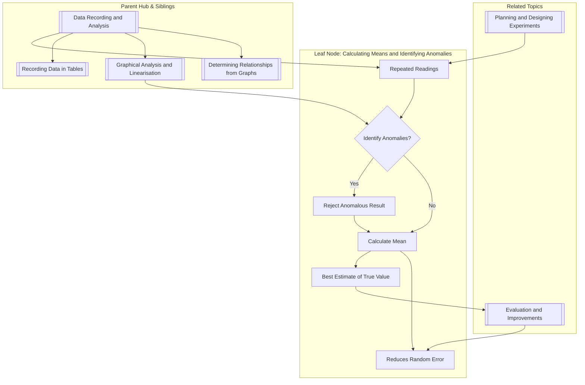

---
# Calculating Means and Identifying Anomalies / 计算平均值与识别异常值

---

# 1. Overview / 概述

**English:**
This sub-topic covers the fundamental skill of processing repeated measurements in A-Level Physics practical work. When you take multiple readings of the same quantity (e.g., time for 10 oscillations, diameter of a wire), you must calculate the **mean** to reduce the effect of random errors. Crucially, you must also **identify and reject anomalous results** (outliers) before calculating the mean, as these would skew the average and lead to inaccurate conclusions. This skill is essential for [[Recording Data in Tables]] and directly feeds into [[Graphical Analysis and Linearisation]] and [[Determining Relationships from Graphs]]. It is a core component of the [[Data Recording and Analysis]] hub and is assessed in both CAIE Paper 3/5 and Edexcel Unit 3/6 practical exams.

**中文:**
本子知识点涵盖在 A-Level 物理实验操作中处理重复测量的基本技能。当你对同一物理量（例如，10次摆动的时间、导线的直径）进行多次读数时，必须计算**平均值**以减少随机误差的影响。至关重要的是，在计算平均值之前，你必须**识别并剔除异常结果（离群值）**，因为这些值会扭曲平均值，导致不准确的结论。这项技能对于[[记录数据到表格]]至关重要，并直接服务于[[图形分析与线性化]]和[[从图形确定关系]]。它是[[数据记录与分析]]知识体系的核心组成部分，并在 CAIE Paper 3/5 和 Edexcel Unit 3/6 实验考试中进行评估。

---

# 2. Syllabus Learning Objectives / 考纲学习目标

| CAIE 9702 (Paper 3 & 5) | Edexcel IAL (WPH11 U3 & WPH14 U6) |
|--------------------------|------------------------------------|
| Identify and reject anomalous results in a set of data. | Identify and discard anomalous data points. |
| Calculate a mean value from a set of repeated readings. | Calculate a mean value, including the use of appropriate significant figures. |
| Understand that repeating readings and calculating a mean reduces the effect of random errors. | Understand the purpose of repeating measurements and calculating a mean to improve reliability. |

**Examiner Expectations / 考官期望:**
- **English:** You must show clear working. Circle or cross out the anomalous value in your table. Calculate the mean using only the remaining "good" values. The mean should be quoted to the same number of decimal places (or significant figures) as the raw data.
- **中文:** 你必须展示清晰的计算过程。在数据表中圈出或划掉异常值。仅使用剩余的“好”值计算平均值。平均值应保留与原始数据相同的小数位数（或有效数字）。

---

# 3. Core Definitions / 核心定义

| Term (EN/CN) | Definition (EN) | Definition (CN) | Common Mistakes / 常见错误 |
|--------------|-----------------|-----------------|---------------------------|
| **Mean (Average)** / 平均值 | The sum of a set of values divided by the number of values. | 一组数值之和除以数值的个数。 | Forgetting to divide by the correct number of values after rejecting anomalies. / 剔除异常值后忘记除以正确的数值个数。 |
| **Anomalous Result (Outlier)** / 异常结果 | A result that does not fit the pattern of the other results and is likely due to a mistake or a sudden, uncontrolled change in conditions. | 不符合其他结果模式的结果，很可能是由于错误或条件的突然、不受控制的变化造成的。 | Including the anomalous result in the mean calculation. / 将异常值包含在平均值计算中。 |
| **Random Error** / 随机误差 | Unpredictable variations in measurements that cause readings to be scattered around the true value. | 测量中不可预测的变化，导致读数在真值周围分散。 | Confusing with systematic error. Repeating readings reduces random error, not systematic error. / 与系统误差混淆。重复读数减少的是随机误差，而非系统误差。 |
| **Reliability** / 可靠性 | The degree to which repeated measurements of the same quantity give consistent results. | 对同一量进行重复测量得到一致结果的程度。 | Thinking one reading is reliable. Reliability is assessed through repetition. / 认为单次读数可靠。可靠性通过重复性来评估。 |

---

# 4. Key Concepts Explained / 关键概念详解

## 4.1 Why Calculate a Mean? / 为什么要计算平均值？

### Explanation / 解释
**English:** Every measurement is subject to [[Random Errors]]. By taking multiple readings (e.g., measuring the time for 10 oscillations three times), the values will be scattered around the true value. The **mean** of these readings provides the best estimate of the true value because the random errors tend to cancel each other out. This process is a cornerstone of [[Data Recording and Analysis]].

**中文:** 每次测量都会受到[[随机误差]]的影响。通过进行多次读数（例如，测量10次摆动的时间三次），这些值会围绕真值分散。这些读数的**平均值**提供了对真值的最佳估计，因为随机误差倾向于相互抵消。这是[[数据记录与分析]]的基石。

### Physical Meaning / 物理意义
**English:** The mean represents the most probable value of the measurement, given the data collected. It is not necessarily the "true" value, but it is the best approximation we have from our experiment.

**中文:** 平均值代表了根据所收集数据得出的最可能的测量值。它不一定是“真值”，但它是我们从实验中得出的最佳近似值。

### Common Misconceptions / 常见误区
- **English:** "The mean is the true value." (Incorrect. It's the best estimate, but systematic errors can still cause it to differ from the true value.)
- **中文:** “平均值就是真值。”（错误。它是最佳估计，但系统误差仍可能导致其与真值不同。）
- **English:** "You should always take the mean of all readings, even if one looks different." (Incorrect. Anomalies must be identified and rejected first.)
- **中文:** “你应该总是取所有读数的平均值，即使其中一个看起来不同。”（错误。必须先识别并剔除异常值。）

### Exam Tips / 考试提示
- **English:** Always show the sum of the "good" values and the number of values you are dividing by. E.g., `Mean = (12.4 + 12.5 + 12.4) / 3 = 12.43 s`.
- **中文:** 始终展示“好”值的总和以及你除以的数值个数。例如：`平均值 = (12.4 + 12.5 + 12.4) / 3 = 12.43 s`。

> 📷 **IMAGE PROMPT — DIAGRAM: [Scatter of Readings Around True Value]**
> A simple graph showing a horizontal line representing the "True Value". Several data points are scattered randomly above and below this line. An arrow points to the cluster of points and says "Mean (Best Estimate)". A single point far away from the cluster is labelled "Anomalous Result (Outlier)". The visual should clearly show how the mean is the centre of the cluster.

## 4.2 How to Identify Anomalies / 如何识别异常值

### Explanation / 解释
**English:** An anomalous result is one that lies far outside the expected pattern of the other readings. It is often caused by a blunder (e.g., misreading a scale, timing error, incorrect counting). You should look for a value that is significantly different from the others. In A-Level practicals, you are expected to use your judgement. If a value is clearly inconsistent, it should be rejected. You must **never** reject a result just because it doesn't fit your hypothesis; you need a valid experimental reason.

**中文:** 异常结果是那些远远超出其他读数预期模式的结果。它通常由操作失误引起（例如，读错刻度、计时错误、计数错误）。你应该寻找一个与其他值显著不同的值。在 A-Level 实验考试中，你需要运用自己的判断。如果一个值明显不一致，就应该被剔除。你**绝不能**仅仅因为一个结果不符合你的假设就将其剔除；你需要一个有效的实验理由。

### Physical Meaning / 物理意义
**English:** An anomaly indicates that something went wrong during that specific measurement. Including it in the mean would give a false representation of the measurement process.

**中文:** 异常值表明在特定测量过程中出现了问题。将其包含在平均值中会错误地代表测量过程。

### Common Misconceptions / 常见误区
- **English:** "If two readings are close and one is different, the different one is always an anomaly." (Incorrect. You need at least 3 readings to spot a clear outlier. With only 2, you cannot tell which is wrong.)
- **中文:** “如果两个读数接近，一个不同，那么不同的那个总是异常值。”（错误。你至少需要3个读数才能发现明显的离群值。如果只有2个，你无法判断哪个是错的。）
- **English:** "You can reject a result if it is more than 10% different from the others." (This is a rough guide, but examiners expect you to use common sense and visual inspection of your data table.)
- **中文:** “如果一个结果与其他结果相差超过10%，你就可以剔除它。”（这是一个粗略的指导，但考官希望你运用常识并对数据表进行目视检查。）

### Exam Tips / 考试提示
- **English:** In your table of results, clearly **circle** or **cross out** the anomalous value. Do not erase it. Then, in the space below the table, explain why you rejected it (e.g., "This reading was likely due to a timing error").
- **中文:** 在你的结果表中，清晰地**圈出**或**划掉**异常值。不要擦除它。然后，在表格下方的空白处解释你为何剔除它（例如，“该读数可能是由计时错误造成的”）。

---

# 5. Essential Equations / 核心公式

## 5.1 The Mean / 平均值

$$ \bar{x} = \frac{\sum_{i=1}^{n} x_i}{n} $$

| Symbol (符号) | Meaning (EN) | Meaning (CN) | Unit (单位) |
|--------------|-------------|-------------|------------|
| $\bar{x}$ | Mean value | 平均值 | Same as $x_i$ |
| $x_i$ | Individual reading | 单个读数 | Same as $\bar{x}$ |
| $n$ | Number of readings (after rejecting anomalies) | 读数个数（剔除异常值后） | No unit (无单位) |
| $\sum$ | Sum of | ...的总和 | - |

**Conditions / 适用条件:**
- **English:** The readings must be of the same physical quantity under the same conditions.
- **中文:** 这些读数必须是同一物理量在相同条件下测得的。

**Limitations / 局限性:**
- **English:** The mean is sensitive to outliers. This is why anomalies must be removed first. The mean does not reduce [[Systematic Errors]].
- **中文:** 平均值对离群值敏感。这就是为什么必须首先移除异常值。平均值不能减少[[系统误差]]。

---

# 6. Graphs and Relationships / 图表与关系

While this sub-topic is primarily about data tables, the concept of an anomaly is also crucial in graph plotting.

## 6.1 Anomalous Points on a Graph / 图表上的异常点

### Axes / 坐标轴 (EN+CN)
- **English:** Dependent variable (y-axis) vs. Independent variable (x-axis).
- **中文:** 因变量（y轴） vs. 自变量（x轴）。

### Shape / 形状 (EN+CN)
- **English:** A point that lies far from the best-fit line or curve.
- **中文:** 一个远离最佳拟合直线或曲线的点。

### Exam Interpretation / 考试解读 (EN+CN)
- **English:** When plotting a graph, if a point is clearly an outlier, you should **not** include it when drawing your line of best fit. You can circle it on the graph and label it "Anomaly". This is a key skill in [[Graphical Analysis and Linearisation]].
- **中文:** 在绘制图表时，如果一个点明显是离群值，你在画最佳拟合线时**不应**将其包含在内。你可以在图表上圈出它并标注为“异常值”。这是[[图形分析与线性化]]中的一项关键技能。

> 📷 **IMAGE PROMPT — GRAPH: [Graph with Anomalous Point]**
> A scatter graph with 6 data points. 5 points lie close to a straight line of best fit. One point is far away from the line. This point is circled and labelled "Anomalous result – not used for line of best fit". The line of best fit is drawn through the other 5 points.

---

# 7. Required Diagrams / 必备图表

## 7.1 Data Table with Anomaly / 包含异常值的数据表

### Description / 描述 (EN+CN)
- **English:** A standard table of repeated readings showing how to record and mark an anomalous result.
- **中文:** 一个标准的重复读数表格，展示如何记录和标记异常结果。

### Image Prompt / 图片生成提示
> 📷 **IMAGE PROMPT — TABLE: [Data Table with Anomaly]**
> A clear, hand-drawn or typed table. The title is "Table 1: Time for 10 Oscillations". Columns: "Reading Number (1, 2, 3, 4, 5)" and "Time / s". The values are: 12.4, 12.5, **15.2**, 12.4, 12.6. The value 15.2 is circled in red pen. Below the table, a calculation is shown: "Mean = (12.4 + 12.5 + 12.4 + 12.6) / 4 = 12.5 s". The anomalous value (15.2) is not included in the sum.

### Labels Required / 需要标注 (EN+CN)
- **English:** Column headings with units, the circled anomalous value, the sum of the good values, the number of good values, and the final mean.
- **中文:** 带单位的列标题、被圈出的异常值、好值的总和、好值的个数以及最终的平均值。

### Exam Importance / 考试重要性 (EN+CN)
- **English:** Extremely high. This is a direct skill tested in almost every practical exam.
- **中文:** 极高。这是几乎所有实验考试中都会直接测试的技能。

---

# 8. Worked Examples / 典型例题

## Example 1: Calculating the Mean Diameter of a Wire / 示例1：计算导线的平均直径

### Question / 题目
**English:** A student measures the diameter of a wire at different points along its length using a micrometer. The readings are: 0.72 mm, 0.74 mm, 0.73 mm, 0.91 mm, 0.73 mm. Calculate the mean diameter, identifying and rejecting any anomalous results.

**中文:** 一名学生使用千分尺测量导线沿长度方向不同点的直径。读数为：0.72 mm, 0.74 mm, 0.73 mm, 0.91 mm, 0.73 mm。计算平均直径，识别并剔除任何异常结果。

### Solution / 解答
1.  **Identify Anomaly / 识别异常值:** The value 0.91 mm is significantly larger than the others (0.72-0.74 mm). It is an anomalous result.
2.  **Reject Anomaly / 剔除异常值:** Circle 0.91 mm. Do not include it in the calculation.
3.  **Calculate Mean / 计算平均值:**
    $$ \text{Mean} = \frac{0.72 + 0.74 + 0.73 + 0.73}{4} $$
    $$ \text{Mean} = \frac{2.92}{4} = 0.73 \text{ mm} $$

### Final Answer / 最终答案
**Answer:** 0.73 mm | **答案：** 0.73 mm

### Quick Tip / 提示
(EN+CN)
- **English:** The mean should be quoted to the same number of decimal places as the raw data (2 d.p. in this case).
- **中文:** 平均值应保留与原始数据相同的小数位数（本例中为2位小数）。

---

# 9. Past Paper Question Types / 历年真题题型

| Question Type / 题型 | Frequency / 频率 | Difficulty / 难度 | Past Paper References / 真题索引 |
|----------------------|------------------|------------------|-------------------------------|
| Calculate mean from a table of repeated readings. | Very High | Easy | 📝 *待填入* |
| Identify and justify the rejection of an anomalous result. | Very High | Easy | 📝 *待填入* |
| Explain why repeating readings improves reliability. | Medium | Medium | 📝 *待填入* |
| Calculate a mean from a graph, excluding an anomalous point. | Medium | Medium | 📝 *待填入* |

**Common Command Words / 常见指令词:**
- **English:** Calculate, Determine, Identify, Explain, Suggest, Justify
- **中文:** 计算，确定，识别，解释，提出，证明...合理

---

# 10. Practical Skills Connections / 实验技能链接

**English:**
- **Measurements:** This skill is used whenever you take repeated readings of any quantity (length, time, current, voltage, temperature, etc.).
- **Uncertainties:** The spread of your "good" readings (after removing anomalies) is used to estimate the [[Random Uncertainty]] (e.g., range/2). This is a direct link to [[Evaluation and Improvements]].
- **Graph Plotting:** Anomalous points on a graph are identified and ignored when drawing the line of best fit.
- **Experimental Design:** When [[Planning and Designing Experiments]], you must specify that you will take multiple readings and calculate a mean to improve reliability.

**中文:**
- **测量：** 无论何时对任何物理量（长度、时间、电流、电压、温度等）进行重复读数，都会用到此技能。
- **不确定度：** 你的“好”读数（移除异常值后）的分散程度用于估计[[随机不确定度]]（例如，极差/2）。这与[[评估与改进]]直接相关。
- **图表绘制：** 图表上的异常点在绘制最佳拟合线时被识别并忽略。
- **实验设计：** 在[[规划和设计实验]]时，你必须指定将进行多次读数并计算平均值以提高可靠性。

---

# 11. Concept Map / 概念图谱

---

# 12. Quick Revision Sheet / 速查表

| Category / 类别 | Key Points / 要点 |
|----------------|------------------|
| **Definition / 定义** | **Mean:** Sum of values / number of values. **Anomaly:** A result that doesn't fit the pattern. / **平均值：** 数值之和/数值个数。**异常值：** 不符合模式的结果。 |
| **Key Formula / 核心公式** | $\bar{x} = \frac{\sum x_i}{n}$ |
| **Key Steps / 关键步骤** | 1. Look for outliers. 2. Reject them (circle in table). 3. Calculate mean using remaining values. / 1. 寻找离群值。2. 剔除它们（在表格中圈出）。3. 使用剩余值计算平均值。 |
| **Common Mistake / 常见错误** | Including the anomaly in the mean calculation. / 将异常值包含在平均值计算中。 |
| **Exam Tip / 考试提示** | Show your working: `Mean = (val1 + val2 + ...) / n`. Quote mean to same d.p. as data. / 展示你的计算过程：`平均值 = (值1 + 值2 + ...) / n`。平均值保留与数据相同的小数位数。 |