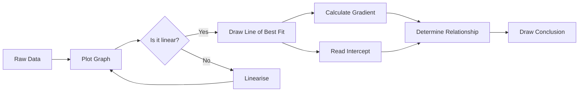
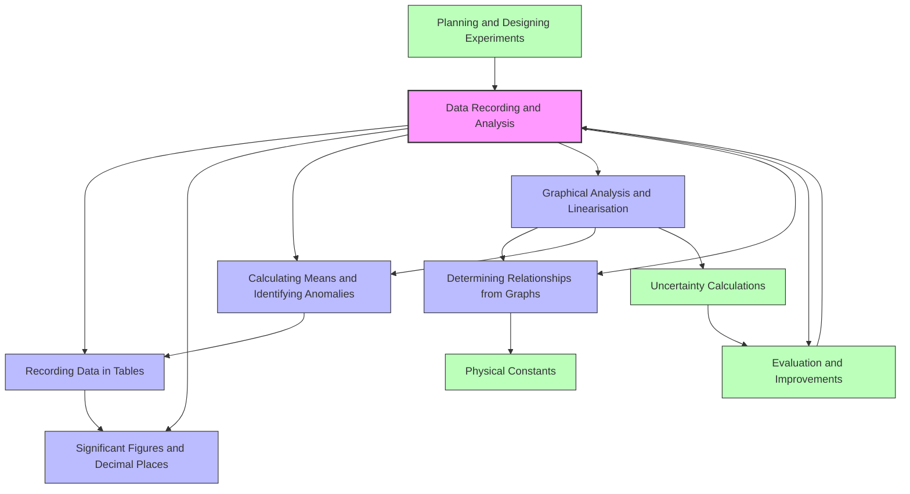

# 1. Overview / 概述

**English:**
Data Recording and Analysis is a foundational practical skill in A-Level Physics, forming the bridge between raw experimental measurements and meaningful physical conclusions. This topic covers how to systematically record data in tables, handle uncertainties, calculate means, identify anomalies, and use graphical techniques—including linearisation—to determine relationships between physical quantities. It is assessed in both Cambridge 9702 (Paper 3 for AS, Paper 5 for A2) and Edexcel IAL (Unit 3 for AS, Unit 6 for A2) through direct practical exams and theory questions.

Why it matters: Physics is an empirical science. Without proper data recording and analysis, even the most elegant experiment yields unreliable results. Mastering these skills enables students to evaluate experimental validity, communicate findings clearly, and derive physical laws from data. Real-world applications include quality control in manufacturing, medical diagnostics (e.g., analysing ECG data), environmental monitoring, and any field requiring evidence-based decision-making.

In examinations, students are expected to record raw data with correct [[Significant Figures and Decimal Places]], calculate [[Calculating Means and Identifying Anomalies]], plot graphs with appropriate scales, determine gradients and intercepts, and use [[Graphical Analysis and Linearisation]] to confirm theoretical relationships. The ability to [[Determining Relationships from Graphs]] is a high-level skill that distinguishes top candidates.

**中文：**
数据记录与分析是A-Level物理中的基础实验技能，是连接原始实验测量与有意义物理结论之间的桥梁。本主题涵盖如何系统地在表格中记录数据、处理不确定度、计算平均值、识别异常值，以及使用图形技术（包括线性化）来确定物理量之间的关系。该内容在剑桥9702（AS的Paper 3，A2的Paper 5）和爱德思IAL（AS的Unit 3，A2的Unit 6）中通过直接实验考试和理论题进行评估。

为什么重要：物理学是一门实证科学。没有正确的数据记录与分析，即使是最优雅的实验也会产生不可靠的结果。掌握这些技能使学生能够评估实验的有效性，清晰地传达发现，并从数据中推导出物理定律。实际应用包括制造业的质量控制、医疗诊断（如分析心电图数据）、环境监测以及任何需要基于证据做决策的领域。

在考试中，学生需要以正确的[[有效数字与小数位数]]记录原始数据，计算[[计算平均值与识别异常值]]，使用适当比例绘制图表，确定斜率和截距，并使用[[图形分析与线性化]]来确认理论关系。从图表中[[确定关系]]是一项高水平技能，能区分顶尖考生。

---

# 2. Syllabus Learning Objectives / 考纲学习目标

**English:**
The following table maps the specific learning objectives from Cambridge 9702 and Edexcel IAL syllabuses relevant to Data Recording and Analysis.

**中文：**
下表列出了剑桥9702和爱德思IAL考纲中与数据记录与分析相关的具体学习目标。

| CAIE 9702 | Edexcel IAL |
|-----------|-------------|
| Record data systematically in a table with correct headings, units, and consistent decimal places | Record measurements in a table with appropriate headings, units, and precision |
| Calculate means from repeated readings and identify anomalous results | Calculate mean values and identify anomalous data points |
| Plot graphs with appropriate scales, labelled axes, and error bars | Plot graphs with suitable scales, labelled axes, and line of best fit |
| Determine gradient and intercept from a straight-line graph | Determine gradient and y-intercept from a linear graph |
| Use logarithmic or reciprocal transformations to linearise relationships | Use appropriate transformations to obtain a straight-line graph |
| Calculate percentage uncertainty and combine uncertainties | Calculate absolute and percentage uncertainties |
| Draw conclusions consistent with experimental data | Interpret graphs and draw valid conclusions |
| Evaluate experimental procedures and suggest improvements | Evaluate methods and suggest improvements to reduce uncertainty |

> 📋 **CIE Only:** Cambridge 9702 Paper 3 specifically requires students to draw a graph with error bars and determine the uncertainty in gradient and intercept. Paper 5 requires planning experiments including data analysis methods.
>
> 📋 **Edexcel Only:** Edexcel IAL Unit 3 and Unit 6 require students to calculate percentage uncertainty and use the formula $\text{percentage uncertainty} = \frac{\text{absolute uncertainty}}{\text{measured value}} \times 100\%$. They also require plotting error bars on graphs.

**Examiner Expectations / 考官期望:**
- **English:** Examiners expect clear, logical presentation. Tables must have quantity/unit in the heading (e.g., "Length / m"), not in the data cells. Graphs must use at least half the grid area, with scales chosen so the data fills the page. Lines of best fit must be drawn with a sharp pencil and a transparent ruler.
- **中文：** 考官期望清晰、逻辑清晰的呈现。表格必须在表头中包含物理量/单位（例如"长度 / m"），而不是在数据单元格中。图表必须使用至少一半的网格面积，比例选择应使数据填满页面。最佳拟合线必须用削尖的铅笔和透明直尺绘制。

---

# 3. Core Definitions / 核心定义

**English:**
The following table provides official definitions with exam-standard wording, Chinese translations, and common mistakes.

**中文：**
下表提供了符合考试标准的官方定义、中文翻译及常见错误。

| Term (EN/CN) | Definition (EN) | Definition (CN) | Common Mistakes / 常见错误 |
|--------------|-----------------|-----------------|---------------------------|
| **[[Recording Data in Tables]] / 数据记录表格** | A systematic arrangement of experimental measurements with clear column headings showing quantity and unit, and data recorded to consistent precision. | 实验测量的系统排列，列标题清晰显示物理量和单位，数据记录到一致的精度。 | Writing units in every cell instead of in the heading; inconsistent decimal places. |
| **[[Significant Figures and Decimal Places]] / 有效数字与小数位数** | The number of meaningful digits in a measurement, including all certain digits plus one estimated digit. Decimal places count digits after the decimal point. | 测量中有意义的数字位数，包括所有确定数字加上一个估计数字。小数位数计算小数点后的数字个数。 | Confusing significant figures with decimal places; reporting too many or too few significant figures. |
| **[[Calculating Means and Identifying Anomalies]] / 计算平均值与识别异常值** | The arithmetic average of repeated readings, used to reduce random uncertainty. Anomalies are data points that lie outside the expected range and are likely due to experimental error. | 重复读数的算术平均值，用于减少随机不确定度。异常值是超出预期范围的数据点，可能由实验误差引起。 | Including anomalous results in the mean calculation; not repeating measurements. |
| **[[Graphical Analysis and Linearisation]] / 图形分析与线性化** | The process of plotting data on a graph, determining the line of best fit, and using transformations (e.g., $y = mx + c$) to obtain a linear relationship from a non-linear one. | 在图表上绘制数据、确定最佳拟合线，并使用变换（如 $y = mx + c$）从非线性关系中获得线性关系的过程。 | Forgetting to transform both axes correctly; misinterpreting the gradient. |
| **[[Determining Relationships from Graphs]] / 从图表确定关系** | Using the gradient and intercept of a linearised graph to find the values of physical constants or to confirm a theoretical relationship. | 使用线性化图表的斜率和截距来找到物理常数的值或确认理论关系。 | Using the wrong points for gradient calculation; not checking if the line passes through the origin. |
| **Uncertainty / 不确定度** | The range within which the true value of a measurement is expected to lie, expressed as absolute or percentage uncertainty. | 测量真值预期所在的区间，以绝对不确定度或百分比不确定度表示。 | Confusing uncertainty with error; not propagating uncertainties correctly. |
| **Line of Best Fit / 最佳拟合线** | A smooth straight line or curve drawn through the data points that best represents the trend, minimising the distances between the line and the points. | 穿过数据点的平滑直线或曲线，最能代表趋势，使线与点之间的距离最小化。 | Drawing a dot-to-dot line; forcing the line through the origin when not justified. |
| **Gradient / 斜率** | The rate of change of the dependent variable with respect to the independent variable, calculated as $\frac{\Delta y}{\Delta x}$ from a straight-line graph. | 因变量相对于自变量的变化率，从直线图中计算为 $\frac{\Delta y}{\Delta x}$。 | Using data points instead of points on the line of best fit; not using a large triangle. |

---

# 4. Key Concepts Explained / 关键概念详解

## 4.1 Recording Data in Tables / 数据记录表格

### Explanation / 解释
**English:**
A well-structured data table is the foundation of any experiment. The table must have clear column headings that include both the physical quantity and its unit, separated by a slash (/) or in brackets. For example, "Length / m" or "Length (m)". Data should be recorded to the same number of decimal places as the measuring instrument's precision. Repeated readings should be recorded in separate columns, with a final column for the mean. Anomalous results should be identified and either excluded or marked with a note.

**中文：**
结构良好的数据表格是任何实验的基础。表格必须有清晰的列标题，包括物理量及其单位，用斜杠（/）或括号分隔。例如"长度 / m"或"长度 (m)"。数据应记录到与测量仪器精度相同的小数位数。重复读数应记录在单独的列中，最后一列为平均值。异常结果应被识别并排除或标记备注。

### Physical Meaning / 物理意义
**English:**
A table organises raw data so that patterns, trends, and anomalies become visible. It allows easy calculation of means and uncertainties, and provides a permanent record that can be checked by others.

**中文：**
表格组织原始数据，使模式、趋势和异常值变得可见。它便于计算平均值和不确定度，并提供可供他人检查的永久记录。

### Common Misconceptions / 常见误区
- **English:** Students often write units in every data cell instead of in the column heading. This wastes time and can lead to errors.
- **中文：** 学生经常在每个数据单元格中写单位，而不是在列标题中。这浪费时间且可能导致错误。
- **English:** Some students record data to more decimal places than the instrument can measure (e.g., using a ruler marked in mm to record 12.345 cm).
- **中文：** 一些学生记录的数据小数位数超过仪器能测量的精度（例如，使用以毫米为刻度的尺子记录12.345厘米）。

### Exam Tips / 考试提示
**English:**
- Always leave a blank row or column for the mean.
- If you have an anomalous result, cross it out neatly and write a note like "anomalous – excluded from mean".
- Use a ruler to draw table lines; freehand tables lose marks.

**中文：**
- 始终留出一行或一列空白用于平均值。
- 如果有异常结果，整齐地划掉并写上备注如"异常——已排除在平均值外"。
- 使用直尺绘制表格线；手绘表格会扣分。

---

## 4.2 Significant Figures and Decimal Places / 有效数字与小数位数

### Explanation / 解释
**English:**
Significant figures (s.f.) indicate the precision of a measurement. All non-zero digits are significant; zeros between non-zero digits are significant; leading zeros are not significant; trailing zeros after a decimal point are significant. Decimal places (d.p.) count digits after the decimal point. The general rule is: the final answer should have the same number of significant figures as the least precise measurement used in the calculation.

**中文：**
有效数字表示测量的精度。所有非零数字都是有效的；非零数字之间的零是有效的；前导零无效；小数点后的尾随零有效。小数位数计算小数点后的数字个数。一般规则是：最终答案应与计算中使用的最不精确测量具有相同的有效数字位数。

### Physical Meaning / 物理意义
**English:**
Significant figures reflect the reliability of a measurement. Reporting 3.0 cm (2 s.f.) implies a precision of ±0.05 cm, while 3.00 cm (3 s.f.) implies ±0.005 cm. Using too many significant figures suggests false precision; using too few loses information.

**中文：**
有效数字反映测量的可靠性。报告3.0厘米（2位有效数字）意味着精度为±0.05厘米，而3.00厘米（3位有效数字）意味着±0.005厘米。使用过多有效数字暗示虚假精度；使用过少则丢失信息。

### Common Misconceptions / 常见误区
- **English:** Confusing significant figures with decimal places. For example, 0.0050 has 2 s.f. but 4 d.p.
- **中文：** 混淆有效数字与小数位数。例如，0.0050有2位有效数字但有4位小数。
- **English:** Reporting a mean value to more decimal places than the raw data.
- **中文：** 报告的平均值小数位数多于原始数据。

### Exam Tips / 考试提示
**English:**
- When calculating the mean, keep one extra decimal place during calculation, then round to the same precision as the raw data.
- For gradients, use 3 s.f. unless the data suggests otherwise.
- For intercepts, use the same precision as the graph scale allows.

**中文：**
- 计算平均值时，在计算过程中保留多一位小数，然后四舍五入到与原始数据相同的精度。
- 对于斜率，使用3位有效数字，除非数据另有指示。
- 对于截距，使用与图表刻度允许的相同精度。

---

## 4.3 Calculating Means and Identifying Anomalies / 计算平均值与识别异常值

### Explanation / 解释
**English:**
The mean (average) of repeated readings reduces the effect of random uncertainty. It is calculated as: $\text{mean} = \frac{\text{sum of readings}}{\text{number of readings}}$. An anomalous result is one that differs significantly from the others and is likely due to a systematic error or a blunder. Anomalies should be identified before calculating the mean. A common method is to check if a reading lies outside ±2 standard deviations from the mean, or simply by visual inspection if the data set is small.

**中文：**
重复读数的平均值减少随机不确定度的影响。计算公式为：$\text{平均值} = \frac{\text{读数之和}}{\text{读数个数}}$。异常结果是指与其他结果显著不同且可能由系统误差或重大错误引起的结果。应在计算平均值之前识别异常值。常用方法是检查读数是否超出平均值±2个标准差，或者对于小数据集通过目视检查。

### Physical Meaning / 物理意义
**English:**
Taking multiple readings and averaging them improves the reliability of the measurement. Identifying and excluding anomalies prevents them from skewing the result.

**中文：**
多次读数并取平均值提高了测量的可靠性。识别并排除异常值可防止它们扭曲结果。

### Common Misconceptions / 常见误区
- **English:** Including anomalous results in the mean calculation.
- **中文：** 将异常结果包含在平均值计算中。
- **English:** Not repeating readings at all, or only taking two readings.
- **中文：** 完全不重复读数，或只取两次读数。

### Exam Tips / 考试提示
**English:**
- Always take at least three readings for each data point.
- If one reading is anomalous, take a fourth reading.
- Show your working for the mean calculation.

**中文：**
- 每个数据点至少取三次读数。
- 如果有一个读数异常，取第四次读数。
- 展示平均值计算的过程。

---

## 4.4 Graphical Analysis and Linearisation / 图形分析与线性化

### Explanation / 解释
**English:**
Graphical analysis involves plotting the dependent variable (y-axis) against the independent variable (x-axis). The relationship between variables can often be expressed as $y = kx^n$ or $y = ae^{bx}$. To determine the constants, we linearise the equation. For a power law $y = kx^n$, taking logs gives $\log y = \log k + n \log x$, which is of the form $Y = mX + c$ where $Y = \log y$, $X = \log x$, $m = n$, and $c = \log k$. For an exponential $y = ae^{bx}$, taking natural logs gives $\ln y = \ln a + bx$, so $Y = \ln y$, $X = x$, $m = b$, $c = \ln a$.

**中文：**
图形分析涉及将因变量（y轴）对自变量（x轴）绘图。变量之间的关系通常可以表示为 $y = kx^n$ 或 $y = ae^{bx}$。为了确定常数，我们对方程进行线性化。对于幂律 $y = kx^n$，取对数得到 $\log y = \log k + n \log x$，这是 $Y = mX + c$ 的形式，其中 $Y = \log y$，$X = \log x$，$m = n$，$c = \log k$。对于指数函数 $y = ae^{bx}$，取自然对数得到 $\ln y = \ln a + bx$，所以 $Y = \ln y$，$X = x$，$m = b$，$c = \ln a$。

### Physical Meaning / 物理意义
**English:**
Linearisation transforms a curved relationship into a straight line, making it easy to determine constants from the gradient and intercept. This is essential for verifying theoretical models.

**中文：**
线性化将曲线关系转换为直线，便于从斜率和截距确定常数。这对于验证理论模型至关重要。

### Common Misconceptions / 常见误区
- **English:** Forgetting to take logs of both sides of the equation.
- **中文：** 忘记对方程两边取对数。
- **English:** Using log base 10 when natural log is required, or vice versa.
- **中文：** 在需要自然对数时使用以10为底的对数，反之亦然。

### Exam Tips / 考试提示
**English:**
- Check the syllabus: CIE often uses $\log_{10}$ for power laws; Edexcel often uses $\ln$ for exponentials.
- Always label transformed axes clearly (e.g., "log (T / s)" or "ln (I / A)").
- The gradient of the linearised graph gives the exponent or constant directly.

**中文：**
- 检查考纲：CIE通常对幂律使用 $\log_{10}$；Edexcel通常对指数使用 $\ln$。
- 始终清晰标记变换后的坐标轴（例如"log (T / s)"或"ln (I / A)"）。
- 线性化图表的斜率直接给出指数或常数。

---

## 4.5 Determining Relationships from Graphs / 从图表确定关系

### Explanation / 解释
**English:**
Once a graph is linearised, the relationship between the original variables can be determined. The gradient $m$ and intercept $c$ of the straight line are used to find physical constants. For example, in the simple pendulum experiment, plotting $T^2$ against $L$ gives a straight line through the origin with gradient $\frac{4\pi^2}{g}$, allowing $g$ to be calculated. The line of best fit should be drawn so that approximately equal numbers of points lie above and below the line. The gradient is calculated using a large triangle (at least half the line length) with points on the line, not data points.

**中文：**
一旦图表被线性化，原始变量之间的关系就可以确定。直线的斜率 $m$ 和截距 $c$ 用于找到物理常数。例如，在单摆实验中，绘制 $T^2$ 对 $L$ 的图表得到一条通过原点的直线，斜率为 $\frac{4\pi^2}{g}$，从而可以计算 $g$。最佳拟合线应绘制使得大约相等数量的点位于线上方和下方。斜率使用大三角形（至少线长的一半）计算，三角形顶点在线上，而不是数据点。

### Physical Meaning / 物理意义
**English:**
Graphs provide a visual representation of the relationship between variables. The gradient and intercept have physical meanings that can be linked to theoretical predictions.

**中文：**
图表提供了变量之间关系的可视化表示。斜率和截距具有物理意义，可以与理论预测联系起来。

### Common Misconceptions / 常见误区
- **English:** Using data points (rather than points on the line of best fit) to calculate the gradient.
- **中文：** 使用数据点（而不是最佳拟合线上的点）计算斜率。
- **English:** Forcing the line of best fit through the origin when the data does not support it.
- **中文：** 在数据不支持的情况下强制最佳拟合线通过原点。

### Exam Tips / 考试提示
**English:**
- Draw the gradient triangle with dashed lines and label the coordinates.
- Show the gradient calculation clearly: $m = \frac{\Delta y}{\Delta x}$.
- For the intercept, read directly from the graph where $x = 0$, or use the equation of the line.

**中文：**
- 用虚线绘制斜率三角形并标注坐标。
- 清晰展示斜率计算：$m = \frac{\Delta y}{\Delta x}$。
- 对于截距，直接从图表中 $x = 0$ 处读取，或使用直线方程。

---

# 5. Essential Equations / 核心公式

## 5.1 Mean Value / 平均值

**Equation / 公式:**
$$ \bar{x} = \frac{\sum_{i=1}^{n} x_i}{n} $$

**Variables / 变量:**
| Symbol (符号) | Meaning (EN) | Meaning (CN) | Unit (单位) |
|--------------|-------------|-------------|------------|
| $\bar{x}$ | Mean value | 平均值 | Same as $x$ |
| $x_i$ | Individual reading | 单个读数 | Same as $x$ |
| $n$ | Number of readings | 读数个数 | dimensionless |

**Derivation / 推导:**
**English:** The mean is the sum of all readings divided by the number of readings. It is the best estimate of the true value when random errors are present.
**中文：** 平均值是所有读数之和除以读数个数。当存在随机误差时，它是真值的最佳估计。

**Conditions / 适用条件:**
**English:** Readings must be taken under the same conditions. Anomalous results should be excluded.
**中文：** 读数必须在相同条件下进行。异常结果应被排除。

**Limitations / 局限性:**
**English:** The mean does not eliminate systematic errors. It only reduces random uncertainty.
**中文：** 平均值不能消除系统误差。它只能减少随机不确定度。

**Rearrangements / 变形:**
**English:** $\sum x_i = n \bar{x}$ (to check total)
**中文：** $\sum x_i = n \bar{x}$（用于检查总和）

---

## 5.2 Percentage Uncertainty / 百分比不确定度

**Equation / 公式:**
$$ \text{Percentage uncertainty} = \frac{\text{absolute uncertainty}}{\text{measured value}} \times 100\% $$

**Variables / 变量:**
| Symbol (符号) | Meaning (EN) | Meaning (CN) | Unit (单位) |
|--------------|-------------|-------------|------------|
| absolute uncertainty | Half the range or instrument precision | 绝对不确定度 | Same as measured value |
| measured value | The reading or mean | 测量值 | Same as measured value |

**Derivation / 推导:**
**English:** Percentage uncertainty expresses the relative size of the uncertainty compared to the measurement. It allows comparison of uncertainties across different scales.
**中文：** 百分比不确定度表示不确定度相对于测量值的相对大小。它允许在不同尺度上比较不确定度。

**Conditions / 适用条件:**
**English:** The measured value must be non-zero.
**中文：** 测量值必须非零。

**Limitations / 局限性:**
**English:** Percentage uncertainty can be misleading for very small measurements where absolute uncertainty is more meaningful.
**中文：** 对于非常小的测量，百分比不确定度可能具有误导性，此时绝对不确定度更有意义。

**Rearrangements / 变形:**
**English:** $\text{absolute uncertainty} = \frac{\text{percentage uncertainty}}{100\%} \times \text{measured value}$
**中文：** $\text{绝对不确定度} = \frac{\text{百分比不确定度}}{100\%} \times \text{测量值}$

---

## 5.3 Gradient of a Straight Line / 直线斜率

**Equation / 公式:**
$$ m = \frac{\Delta y}{\Delta x} = \frac{y_2 - y_1}{x_2 - x_1} $$

**Variables / 变量:**
| Symbol (符号) | Meaning (EN) | Meaning (CN) | Unit (单位) |
|--------------|-------------|-------------|------------|
| $m$ | Gradient | 斜率 | Units of $y/x$ |
| $(x_1, y_1)$ | First point on line | 线上第一点 | As per axes |
| $(x_2, y_2)$ | Second point on line | 线上第二点 | As per axes |

**Derivation / 推导:**
**English:** The gradient is the rate of change of $y$ with respect to $x$. For a straight line, it is constant.
**中文：** 斜率是 $y$ 相对于 $x$ 的变化率。对于直线，它是常数。

**Conditions / 适用条件:**
**English:** The relationship must be linear. Points must be on the line of best fit, not data points.
**中文：** 关系必须是线性的。点必须在最佳拟合线上，而不是数据点。

**Limitations / 局限性:**
**English:** The gradient is sensitive to the choice of points. Use points far apart to reduce uncertainty.
**中文：** 斜率对点的选择敏感。使用相距较远的点以减少不确定度。

**Rearrangements / 变形:**
**English:** $y_2 - y_1 = m(x_2 - x_1)$
**中文：** $y_2 - y_1 = m(x_2 - x_1)$

---

## 5.4 Equation of a Straight Line / 直线方程

**Equation / 公式:**
$$ y = mx + c $$

**Variables / 变量:**
| Symbol (符号) | Meaning (EN) | Meaning (CN) | Unit (单位) |
|--------------|-------------|-------------|------------|
| $y$ | Dependent variable | 因变量 | As per axis |
| $x$ | Independent variable | 自变量 | As per axis |
| $m$ | Gradient | 斜率 | Units of $y/x$ |
| $c$ | y-intercept | y轴截距 | Same as $y$ |

**Derivation / 推导:**
**English:** This is the general form of a linear relationship. The intercept $c$ is the value of $y$ when $x = 0$.
**中文：** 这是线性关系的一般形式。截距 $c$ 是 $x = 0$ 时 $y$ 的值。

**Conditions / 适用条件:**
**English:** The relationship must be linear. The axes must be correctly labelled.
**中文：** 关系必须是线性的。坐标轴必须正确标注。

**Limitations / 局限性:**
**English:** The intercept may not be physically meaningful if $x = 0$ is outside the range of data.
**中文：** 如果 $x = 0$ 在数据范围之外，截距可能没有物理意义。

**Rearrangements / 变形:**
**English:** $c = y - mx$; $x = \frac{y - c}{m}$
**中文：** $c = y - mx$；$x = \frac{y - c}{m}$

---

## 5.5 Linearisation of Power Law / 幂律线性化

**Equation / 公式:**
$$ y = kx^n \implies \log y = \log k + n \log x $$

**Variables / 变量:**
| Symbol (符号) | Meaning (EN) | Meaning (CN) | Unit (单位) |
|--------------|-------------|-------------|------------|
| $y$ | Dependent variable | 因变量 | As per context |
| $x$ | Independent variable | 自变量 | As per context |
| $k$ | Constant | 常数 | Units of $y/x^n$ |
| $n$ | Exponent | 指数 | dimensionless |

**Derivation / 推导:**
**English:** Taking logarithms of both sides of $y = kx^n$ gives $\log y = \log k + n \log x$. This is of the form $Y = mX + c$ with $Y = \log y$, $X = \log x$, $m = n$, $c = \log k$.
**中文：** 对 $y = kx^n$ 两边取对数得到 $\log y = \log k + n \log x$。这是 $Y = mX + c$ 的形式，其中 $Y = \log y$，$X = \log x$，$m = n$，$c = \log k$。

**Conditions / 适用条件:**
**English:** $x > 0$ and $y > 0$ (logarithms of zero or negative numbers are undefined).
**中文：** $x > 0$ 且 $y > 0$（零或负数的对数未定义）。

**Limitations / 局限性:**
**English:** The relationship must be a pure power law. If there is an additive constant, this method fails.
**中文：** 关系必须是纯幂律。如果存在加法常数，此方法失效。

**Rearrangements / 变形:**
**English:** $\ln y = \ln k + n \ln x$ (using natural logs)
**中文：** $\ln y = \ln k + n \ln x$（使用自然对数）

---

## 5.6 Linearisation of Exponential / 指数函数线性化

**Equation / 公式:**
$$ y = ae^{bx} \implies \ln y = \ln a + bx $$

**Variables / 变量:**
| Symbol (符号) | Meaning (EN) | Meaning (CN) | Unit (单位) |
|--------------|-------------|-------------|------------|
| $y$ | Dependent variable | 因变量 | As per context |
| $x$ | Independent variable | 自变量 | As per context |
| $a$ | Initial value (when $x=0$) | 初始值（当 $x=0$ 时） | Same as $y$ |
| $b$ | Growth/decay constant | 增长/衰减常数 | Units of $1/x$ |

**Derivation / 推导:**
**English:** Taking natural logarithms of both sides of $y = ae^{bx}$ gives $\ln y = \ln a + bx$. This is of the form $Y = mX + c$ with $Y = \ln y$, $X = x$, $m = b$, $c = \ln a$.
**中文：** 对 $y = ae^{bx}$ 两边取自然对数得到 $\ln y = \ln a + bx$。这是 $Y = mX + c$ 的形式，其中 $Y = \ln y$，$X = x$，$m = b$，$c = \ln a$。

**Conditions / 适用条件:**
**English:** $y > 0$ (natural logarithm of zero or negative numbers is undefined).
**中文：** $y > 0$（零或负数的自然对数未定义）。

**Limitations / 局限性:**
**English:** The relationship must be a pure exponential. If there is a constant offset, this method fails.
**中文：** 关系必须是纯指数函数。如果存在常数偏移，此方法失效。

**Rearrangements / 变形:**
**English:** $a = e^c$; $b = m$
**中文：** $a = e^c$；$b = m$

---

# 6. Graphs and Relationships / 图表与关系

## 6.1 Graph of Raw Data / 原始数据图表

### Axes / 坐标轴
**English:** x-axis: independent variable (e.g., length, time, temperature); y-axis: dependent variable (e.g., current, voltage, displacement).
**中文：** x轴：自变量（如长度、时间、温度）；y轴：因变量（如电流、电压、位移）。

### Shape / 形状
**English:** The shape depends on the physical relationship. It could be linear, quadratic, inverse, exponential, etc.
**中文：** 形状取决于物理关系。可能是线性、二次、反比、指数等。

### Gradient Meaning / 斜率含义
**English:** The gradient represents the rate of change of the dependent variable with respect to the independent variable.
**中文：** 斜率表示因变量相对于自变量的变化率。

### Area Meaning / 面积含义
**English:** The area under the graph (if applicable) represents the integral of the dependent variable with respect to the independent variable (e.g., area under force-displacement graph = work done).
**中文：** 图表下的面积（如适用）表示因变量对自变量的积分（例如，力-位移图下的面积 = 做功）。

### Exam Interpretation / 考试解读
**English:** Examiners expect students to describe the shape (e.g., "The graph is a straight line through the origin, indicating direct proportionality") or to identify a non-linear relationship and suggest a linearisation method.
**中文：** 考官期望学生描述形状（例如"图表是通过原点的直线，表明正比关系"）或识别非线性关系并建议线性化方法。

### Common Questions / 常见问题
**English:**
- "Describe the relationship between $x$ and $y$ shown by the graph."
- "Use the graph to determine the value of the constant $k$."
- "Suggest how the data could be plotted to obtain a straight line."

**中文：**
- "描述图表显示的 $x$ 和 $y$ 之间的关系。"
- "使用图表确定常数 $k$ 的值。"
- "建议如何绘制数据以获得直线。"

---

## 6.2 Linearised Graph / 线性化图表

### Axes / 坐标轴
**English:** x-axis: transformed variable (e.g., $\log x$, $1/x$, $x^2$); y-axis: transformed variable (e.g., $\log y$, $y$, $y/x$).
**中文：** x轴：变换后的变量（如 $\log x$、$1/x$、$x^2$）；y轴：变换后的变量（如 $\log y$、$y$、$y/x$）。

### Shape / 形状
**English:** A straight line (if the transformation is correct).
**中文：** 一条直线（如果变换正确）。

### Gradient Meaning / 斜率含义
**English:** The gradient gives the exponent (for power laws) or the growth/decay constant (for exponentials).
**中文：** 斜率给出指数（对于幂律）或增长/衰减常数（对于指数函数）。

### Area Meaning / 面积含义
**English:** Usually not physically meaningful for transformed axes.
**中文：** 对于变换后的坐标轴，通常没有物理意义。

### Exam Interpretation / 考试解读
**English:** Examiners expect students to read the gradient and intercept from the linearised graph and use them to find the original constants.
**中文：** 考官期望学生从线性化图表中读取斜率和截距，并用它们找到原始常数。

### Common Questions / 常见问题
**English:**
- "Calculate the gradient of the line."
- "Determine the value of $n$ and $k$ from the graph."
- "Explain why the graph is a straight line."

**中文：**
- "计算直线的斜率。"
- "从图表确定 $n$ 和 $k$ 的值。"
- "解释为什么图表是一条直线。"

---

## 6.3 Graph with Error Bars / 带误差线的图表

### Axes / 坐标轴
**English:** Same as raw data graph, but each data point has vertical (and possibly horizontal) error bars representing the uncertainty.
**中文：** 与原始数据图表相同，但每个数据点有垂直（可能还有水平）误差线表示不确定度。

### Shape / 形状
**English:** The line of best fit should pass through all error bars if possible. If not, it should pass within the error bars of most points.
**中文：** 最佳拟合线应尽可能穿过所有误差线。如果不能，应穿过大多数点的误差线内部。

### Gradient Meaning / 梯度含义
**English:** Same as raw data graph, but the uncertainty in gradient can be estimated from the steepest and shallowest possible lines that still fit the error bars.
**中文：** 与原始数据图表相同，但斜率的不确定度可以从仍然适合误差线的最陡和最缓的线估计。

### Area Meaning / 面积含义
**English:** Same as raw data graph.
**中文：** 与原始数据图表相同。

### Exam Interpretation / 考试解读
**English:** Examiners expect students to draw error bars correctly and use them to determine the uncertainty in the gradient and intercept.
**中文：** 考官期望学生正确绘制误差线，并使用它们确定斜率和截距的不确定度。

### Common Questions / 常见问题
**English:**
- "Draw error bars on the graph."
- "Determine the uncertainty in the gradient."
- "Comment on whether the line of best fit is consistent with the error bars."

**中文：**
- "在图表上绘制误差线。"
- "确定斜率的不确定度。"
- "评论最佳拟合线是否与误差线一致。"

---

> 📷 **IMAGE PROMPT — GRAPH-01: Example of a linearised graph with gradient triangle**
>
> A graph on grid paper showing a straight line of best fit through data points. A large right-angled triangle is drawn with dashed lines from two points on the line to the axes. The coordinates of the triangle vertices are labelled. The axes are labelled with transformed variables (e.g., "log (T / s)" on y-axis and "log (L / m)" on x-axis). The graph has a title: "Graph of log T against log L for a simple pendulum". The line has a positive gradient. The background is white grid paper, with blue line and black labels. Style: clean, educational diagram.

---

# 7. Required Diagrams / 必备图表

## 7.1 Data Table Template / 数据表格模板

### Description / 描述
**English:**
A template showing the correct format for a data table, including column headings with quantity/unit, repeated readings, mean column, and space for anomalies.

**中文：**
显示数据表格正确格式的模板，包括带有物理量/单位的列标题、重复读数、平均值列以及异常值空间。

### Image Prompt / 图片生成提示
> 📷 **IMAGE PROMPT — DIAG-01: Data Table Template**
>
> A clean, ruled table on white paper with 5 columns. Column headings: "Length / m", "Reading 1 / s", "Reading 2 / s", "Reading 3 / s", "Mean Time / s". The first column has values 0.200, 0.400, 0.600, 0.800, 1.000. The time columns have sample data like 0.89, 0.91, 0.90. The mean column shows calculated values. One cell in Reading 2 is crossed out with a note "anomalous". The table has a title: "Table 1: Period of a simple pendulum for different lengths". Style: clean, educational, black ink on white paper, ruled lines.

### Labels Required / 需要标注
**English:** Column headings with quantity/unit; data cells; mean column; anomalous result marked.
**中文：** 带有物理量/单位的列标题；数据单元格；平均值列；标记的异常结果。

### Exam Importance / 考试重要性
**English:** This is the standard format expected in all practical exams. Marks are awarded for correct table layout.
**中文：** 这是所有实验考试中期望的标准格式。正确的表格布局可获得分数。

---

## 7.2 Graph with Line of Best Fit and Gradient Triangle / 带最佳拟合线和斜率三角形的图表

### Description / 描述
**English:**
A graph showing data points, a line of best fit, and a large gradient triangle used to calculate the gradient. The triangle vertices are on the line, not on data points.

**中文：**
显示数据点、最佳拟合线和用于计算斜率的大斜率三角形的图表。三角形顶点在线上，而不是在数据点上。

### Image Prompt / 图片生成提示
> 📷 **IMAGE PROMPT — DIAG-02: Graph with Gradient Triangle**
>
> A graph on A4 grid paper with labelled axes: "Extension / m" (x-axis) and "Force / N" (y-axis). Six data points are plotted with small crosses. A straight line of best fit passes through the points. A large right-angled triangle is drawn with dashed lines from (0.02, 0.5) to (0.10, 2.5). The horizontal side is labelled "Δx = 0.08 m" and the vertical side is labelled "Δy = 2.0 N". The gradient is calculated as "m = Δy/Δx = 2.0/0.08 = 25 N/m". The graph has a title: "Graph of Force against Extension for a Spring". Style: clean, educational, black and white.

### Labels Required / 需要标注
**English:** Axes labels with units; data points; line of best fit; gradient triangle with Δx and Δy; gradient calculation.
**中文：** 带有单位的坐标轴标签；数据点；最佳拟合线；带有Δx和Δy的斜率三角形；斜率计算。

### Exam Importance / 考试重要性
**English:** This is the most common graph-based question in both CIE and Edexcel practical exams. Correct gradient calculation is essential.
**中文：** 这是CIE和Edexcel实验考试中最常见的基于图表的问题。正确的斜率计算至关重要。

---

## 7.3 Linearisation Example: Pendulum / 线性化示例：单摆

### Description / 描述
**English:**
A diagram showing the linearisation of the pendulum period equation $T = 2\pi \sqrt{L/g}$. The original graph of $T$ vs $L$ is curved; the linearised graph of $T^2$ vs $L$ is a straight line through the origin.

**中文：**
显示单摆周期方程 $T = 2\pi \sqrt{L/g}$ 线性化的图表。原始 $T$ 对 $L$ 的图表是曲线；线性化后的 $T^2$ 对 $L$ 的图表是通过原点的直线。

### Image Prompt / 图片生成提示
> 📷 **IMAGE PROMPT — DIAG-03: Pendulum Linearisation**
>
> Two graphs side by side on grid paper. Left graph: "T / s" vs "L / m" showing a curved line (square root shape) with data points. Right graph: "T² / s²" vs "L / m" showing a straight line through the origin with data points. The right graph has a gradient triangle. Below: "Gradient = 4π²/g, so g = 4π²/gradient". Style: clean, educational, two-panel diagram, black and white.

### Labels Required / 需要标注
**English:** Original graph: T vs L (curved); Linearised graph: T² vs L (straight); Gradient triangle; Equation for g.
**中文：** 原始图表：T对L（曲线）；线性化图表：T²对L（直线）；斜率三角形；g的计算公式。

### Exam Importance / 考试重要性
**English:** This is a classic example used in both syllabuses to test understanding of linearisation and determination of physical constants.
**中文：** 这是一个经典示例，在两个考纲中都用于测试对线性化和物理常数确定的理解。

---

# 8. Worked Examples / 典型例题

## Example 1: Calculating Mean and Identifying Anomalies / 计算平均值与识别异常值

### Question / 题目
**English:**
A student measures the time for 20 oscillations of a pendulum five times. The readings are: 18.2 s, 18.5 s, 18.3 s, 19.8 s, 18.4 s.
(a) Identify any anomalous result.
(b) Calculate the mean time for 20 oscillations.
(c) Calculate the period (time for one oscillation).

**中文：**
一名学生测量了单摆20次摆动的时间五次。读数分别为：18.2秒、18.5秒、18.3秒、19.8秒、18.4秒。
(a) 识别任何异常结果。
(b) 计算20次摆动的平均时间。
(c) 计算周期（一次摆动的时间）。

### Solution / 解答

**Step 1: Identify anomalies / 步骤1：识别异常值**
**English:**
The readings are: 18.2, 18.5, 18.3, 19.8, 18.4. The value 19.8 s is significantly larger than the others (which are all between 18.2 and 18.5 s). Therefore, 19.8 s is an anomalous result and should be excluded from the mean calculation.

**中文：**
读数分别为：18.2、18.5、18.3、19.8、18.4。19.8秒的值明显大于其他值（其他值都在18.2到18.5秒之间）。因此，19.8秒是异常结果，应排除在平均值计算之外。

**Step 2: Calculate mean / 步骤2：计算平均值**
**English:**
Excluding the anomalous result, the remaining readings are: 18.2, 18.5, 18.3, 18.4.
$$ \text{Mean time} = \frac{18.2 + 18.5 + 18.3 + 18.4}{4} = \frac{73.4}{4} = 18.35 \text{ s} $$
Round to the same precision as the raw data (1 decimal place): 18.4 s.

**中文：**
排除异常结果后，剩余读数为：18.2、18.5、18.3、18.4。
$$ \text{平均时间} = \frac{18.2 + 18.5 + 18.3 + 18.4}{4} = \frac{73.4}{4} = 18.35 \text{ 秒} $$
四舍五入到与原始数据相同的精度（1位小数）：18.4秒。

**Step 3: Calculate period / 步骤3：计算周期**
**English:**
The period $T$ is the time for one oscillation.
$$ T = \frac{\text{mean time for 20 oscillations}}{20} = \frac{18.4}{20} = 0.92 \text{ s} $$

**中文：**
周期 $T$ 是一次摆动的时间。
$$ T = \frac{20\text{次摆动的平均时间}}{20} = \frac{18.4}{20} = 0.92 \text{ 秒} $$

### Final Answer / 最终答案
**Answer:**
(a) Anomalous result: 19.8 s
(b) Mean time: 18.4 s
(c) Period: 0.92 s

**答案：**
(a) 异常结果：19.8秒
(b) 平均时间：18.4秒
(c) 周期：0.92秒

### Examiner Notes / 考官点评
**English:**
- The anomalous result was clearly identified and excluded.
- The mean was calculated correctly with the remaining readings.
- The final answer for period has 2 significant figures, consistent with the raw data (which had 3 s.f. but the mean was rounded to 1 d.p.).
- Common mistake: including the anomalous result in the mean calculation.

**中文：**
- 异常结果被清晰识别并排除。
- 使用剩余读数正确计算了平均值。
- 周期的最终答案有2位有效数字，与原始数据一致（原始数据有3位有效数字，但平均值四舍五入到1位小数）。
- 常见错误：将异常结果包含在平均值计算中。

---

## Example 2: Linearisation and Determining g from Pendulum Data / 线性化与从单摆数据确定g

### Question / 题目
**English:**
A student investigates the relationship between the period $T$ of a simple pendulum and its length $L$. The following data is obtained:

| L / m | T / s |
|-------|-------|
| 0.20  | 0.89  |
| 0.40  | 1.26  |
| 0.60  | 1.55  |
| 0.80  | 1.79  |
| 1.00  | 2.01  |

(a) Complete a table of $L$ and $T^2$.
(b) Plot a graph of $T^2$ against $L$.
(c) Determine the gradient of the graph.
(d) Use the gradient to calculate the acceleration due to gravity $g$, given that $T = 2\pi \sqrt{L/g}$.

**中文：**
一名学生研究单摆周期 $T$ 与其长度 $L$ 之间的关系。获得以下数据：

| L / 米 | T / 秒 |
|-------|-------|
| 0.20  | 0.89  |
| 0.40  | 1.26  |
| 0.60  | 1.55  |
| 0.80  | 1.79  |
| 1.00  | 2.01  |

(a) 完成 $L$ 和 $T^2$ 的表格。
(b) 绘制 $T^2$ 对 $L$ 的图表。
(c) 确定图表的斜率。
(d) 使用斜率计算重力加速度 $g$，已知 $T = 2\pi \sqrt{L/g}$。

### Solution / 解答

**Step 1: Complete table of $T^2$ / 步骤1：完成 $T^2$ 表格**
**English:**
Calculate $T^2$ for each value of $T$:

| L / m | T / s | T² / s² |
|-------|-------|---------|
| 0.20  | 0.89  | 0.7921  |
| 0.40  | 1.26  | 1.5876  |
| 0.60  | 1.55  | 2.4025  |
| 0.80  | 1.79  | 3.2041  |
| 1.00  | 2.01  | 4.0401  |

Round $T^2$ to 3 significant figures: 0.792, 1.59, 2.40, 3.20, 4.04.

**中文：**
计算每个 $T$ 值的 $T^2$：

| L / 米 | T / 秒 | T² / 秒² |
|-------|-------|---------|
| 0.20  | 0.89  | 0.7921  |
| 0.40  | 1.26  | 1.5876  |
| 0.60  | 1.55  | 2.4025  |
| 0.80  | 1.79  | 3.2041  |
| 1.00  | 2.01  | 4.0401  |

将 $T^2$ 四舍五入到3位有效数字：0.792、1.59、2.40、3.20、4.04。

**Step 2: Plot graph / 步骤2：绘制图表**
**English:**
Plot $T^2$ (y-axis) against $L$ (x-axis). The points should lie approximately on a straight line through the origin. Draw the line of best fit.

**中文：**
绘制 $T^2$（y轴）对 $L$（x轴）的图表。这些点应大致位于通过原点的直线上。绘制最佳拟合线。

**Step 3: Calculate gradient / 步骤3：计算斜率**
**English:**
Choose two points on the line of best fit (not data points). For example:
Point 1: (0.20, 0.80)
Point 2: (1.00, 4.04)

$$ \text{Gradient} = \frac{\Delta y}{\Delta x} = \frac{4.04 - 0.80}{1.00 - 0.20} = \frac{3.24}{0.80} = 4.05 \text{ s}^2/\text{m} $$

**中文：**
选择最佳拟合线上的两个点（不是数据点）。例如：
点1：(0.20, 0.80)
点2：(1.00, 4.04)

$$ \text{斜率} = \frac{\Delta y}{\Delta x} = \frac{4.04 - 0.80}{1.00 - 0.20} = \frac{3.24}{0.80} = 4.05 \text{ 秒}^2/\text{米} $$

**Step 4: Calculate $g$ / 步骤4：计算 $g$**
**English:**
From $T = 2\pi \sqrt{L/g}$, squaring both sides gives:
$$ T^2 = \frac{4\pi^2}{g} L $$
Comparing with $y = mx + c$, the gradient $m = \frac{4\pi^2}{g}$.
Therefore:
$$ g = \frac{4\pi^2}{\text{gradient}} = \frac{4\pi^2}{4.05} = \frac{39.478}{4.05} = 9.75 \text{ m/s}^2 $$

**中文：**
从 $T = 2\pi \sqrt{L/g}$，两边平方得到：
$$ T^2 = \frac{4\pi^2}{g} L $$
与 $y = mx + c$ 比较，斜率 $m = \frac{4\pi^2}{g}$。
因此：
$$ g = \frac{4\pi^2}{\text{斜率}} = \frac{4\pi^2}{4.05} = \frac{39.478}{4.05} = 9.75 \text{ 米/秒}^2 $$

### Final Answer / 最终答案
**Answer:**
(c) Gradient = 4.05 s²/m
(d) $g$ = 9.75 m/s²

**答案：**
(c) 斜率 = 4.05 秒²/米
(d) $g$ = 9.75 米/秒²

### Examiner Notes / 考官点评
**English:**
- The table of $T^2$ was correctly calculated and rounded to appropriate significant figures.
- The graph was plotted with $T^2$ on the y-axis and $L$ on the x-axis.
- The gradient was calculated using points on the line of best fit, not data points.
- The relationship $T^2 = \frac{4\pi^2}{g} L$ was correctly used to find $g$.
- Common mistake: using data points for gradient calculation, or forgetting to square the period.

**中文：**
- $T^2$ 表格正确计算并四舍五入到适当的有效数字。
- 图表以 $T^2$ 为y轴、$L$ 为x轴绘制。
- 斜率使用最佳拟合线上的点计算，而不是数据点。
- 正确使用关系 $T^2 = \frac{4\pi^2}{g} L$ 来求 $g$。
- 常见错误：使用数据点计算斜率，或忘记对周期平方。

---

# 9. Past Paper Question Types / 历年真题题型

**English:**
The following table summarises the common question types for Data Recording and Analysis in both CIE and Edexcel practical exams.

**中文：**
下表总结了CIE和Edexcel实验考试中数据记录与分析的常见题型。

| Question Type / 题型 | Frequency / 频率 | Difficulty / 难度 | Past Paper References / 真题索引 |
|----------------------|------------------|------------------|-------------------------------|
| Calculation / 计算 | High | Medium | 📝 *待填入* |
| Explanation / 解释 | High | Medium | 📝 *待填入* |
| Graph Analysis / 图表分析 | High | High | 📝 *待填入* |
| Practical / 实验 | High | High | 📝 *待填入* |
| Derivation / 推导 | Low | Medium | 📝 *待填入* |

> 📝 **题库整理中 / Question Bank Under Construction:** 具体试卷编号（如 9702/23/M/J/24 Q3）将在后续整理真题后填入上表。

**Common Command Words / 常见指令词:**

| Command Word (EN) | Command Word (CN) | Meaning (EN) | Meaning (CN) |
|-------------------|-------------------|--------------|--------------|
| State | 陈述 | Give a brief answer without explanation | 给出简短答案，无需解释 |
| Define | 定义 | Give the precise meaning | 给出精确含义 |
| Explain | 解释 | Give reasons or causes | 给出原因或理由 |
| Describe | 描述 | Give a detailed account | 给出详细说明 |
| Calculate | 计算 | Use numbers to find a value | 使用数字求值 |
| Determine | 确定 | Find a value using given data or graph | 使用给定数据或图表求值 |
| Suggest | 建议 | Propose a possible answer or method | 提出可能的答案或方法 |
| Plot | 绘制 | Draw a graph with data points | 用数据点绘制图表 |
| Draw | 画 | Sketch a line of best fit or diagram | 绘制最佳拟合线或图表 |
| Estimate | 估计 | Give an approximate value | 给出近似值 |

---

# 10. Practical Skills Connections / 实验技能链接

**English:**
Data Recording and Analysis is directly assessed in practical exams and underpins all experimental work.

**中文：**
数据记录与分析在实验考试中直接评估，是所有实验工作的基础。

**CAIE 9702 Connections / 剑桥9702链接:**
- **Paper 3 (AS):** Students are required to record raw data in a table, calculate means, plot graphs, determine gradients and intercepts, and draw conclusions. Error bars and uncertainty analysis are often required.
- **Paper 5 (A2):** Students must plan experiments including data analysis methods, and may be asked to analyse given data using graphical techniques.

**Edexcel IAL Connections / 爱德思IAL链接:**
- **Unit 3 (AS):** Students perform experiments and record data in tables, plot graphs, calculate uncertainties, and evaluate methods.
- **Unit 6 (A2):** Students plan experiments, analyse data using linearisation, and determine physical constants from graphs.

**Measurements / 测量:**
**English:** All measurements must be recorded with appropriate precision. For example, length measured with a ruler (mm precision), time with a stopwatch (0.01 s precision), current with an ammeter (0.01 A precision). The number of decimal places in the table should match the instrument precision.

**中文：** 所有测量必须以适当的精度记录。例如，用尺子测量长度（毫米精度），用秒表测量时间（0.01秒精度），用电流表测量电流（0.01安培精度）。表格中的小数位数应与仪器精度匹配。

**Uncertainties / 不确定度:**
**English:** Absolute uncertainty is typically half the smallest division of the measuring instrument. For repeated readings, the uncertainty can be estimated as half the range. Percentage uncertainty is calculated as $\frac{\text{absolute uncertainty}}{\text{measured value}} \times 100\%$. Uncertainties must be propagated through calculations.

**中文：** 绝对不确定度通常是测量仪器最小刻度的一半。对于重复读数，不确定度可以估计为范围的一半。百分比不确定度计算为 $\frac{\text{绝对不确定度}}{\text{测量值}} \times 100\%$。不确定度必须在计算中传播。

**Graph Plotting / 图表绘制:**
**English:** Use at least half the grid area. Choose scales so that the data fills the page. Label axes with quantity and unit. Plot points with small crosses (×). Draw a line of best fit with a sharp pencil and transparent ruler. Calculate gradient using a large triangle.

**中文：** 使用至少一半的网格面积。选择比例使数据填满页面。用物理量和单位标注坐标轴。用小十字（×）绘制点。用削尖的铅笔和透明直尺绘制最佳拟合线。使用大三角形计算斜率。

**Experimental Design / 实验设计:**
**English:** When planning an experiment, consider: range of independent variable, number of data points, repeats, control of variables, and data analysis method (including linearisation if needed).

**中文：** 规划实验时，考虑：自变量的范围、数据点数量、重复次数、变量控制以及数据分析方法（包括必要时进行线性化）。

> 📋 **CIE Only:** Paper 3 requires drawing error bars and determining the uncertainty in gradient and intercept. Paper 5 requires writing a detailed plan including data analysis.
>
> 📋 **Edexcel Only:** Unit 3 and Unit 6 require calculating percentage uncertainty and plotting error bars. Unit 6 requires planning an experiment including a table for data and a graph with a line of best fit.

---

# 11. Concept Map / 概念图谱

**English:**
The following concept map shows the relationships between Data Recording and Analysis and other practical skills topics.

**中文：**
以下概念图谱显示了数据记录与分析与其他实验技能主题之间的关系。

**English:**
The concept map shows that Data Recording and Analysis is central to practical skills. It connects to [[Planning and Designing Experiments]] as a prerequisite, and to [[Evaluation and Improvements]] as a related topic. The five sub-topics ([[Recording Data in Tables]], [[Significant Figures and Decimal Places]], [[Calculating Means and Identifying Anomalies]], [[Graphical Analysis and Linearisation]], [[Determining Relationships from Graphs]]) are all interconnected. Graphical analysis leads to determining physical constants and uncertainty calculations, which feed into evaluation and improvements.

**中文：**
概念图谱显示数据记录与分析是实验技能的核心。它与[[实验规划与设计]]作为先决条件相连，与[[评估与改进]]作为相关主题相连。五个子主题（[[数据记录表格]]、[[有效数字与小数位数]]、[[计算平均值与识别异常值]]、[[图形分析与线性化]]、[[从图表确定关系]]）都相互连接。图形分析导致确定物理常数和不确定度计算，这些又反馈到评估与改进中。

---

# 12. Quick Revision Sheet / 速查表

**English:**
A one-page bilingual summary for quick revision before exams.

**中文：**
考试前快速复习的一页双语总结。

| Category / 类别 | Key Points / 要点 |
|----------------|------------------|
| **Definitions / 定义** | **Data Table:** Column headings with quantity/unit (e.g., "Length / m"). **Mean:** $\bar{x} = \frac{\sum x_i}{n}$. **Anomaly:** A reading significantly different from others. **Gradient:** $m = \frac{\Delta y}{\Delta x}$ from line of best fit. **Linearisation:** Transform non-linear equations to $y = mx + c$ form. |
| | **数据表格：** 列标题带有物理量/单位（如"长度 / 米"）。**平均值：** $\bar{x} = \frac{\sum x_i}{n}$。**异常值：** 与其他读数显著不同的读数。**斜率：** $m = \frac{\Delta y}{\Delta x}$，从最佳拟合线计算。**线性化：** 将非线性方程变换为 $y = mx + c$ 形式。 |
| **Equations / 公式** | Mean: $\bar{x} = \frac{\sum x_i}{n}$. Percentage uncertainty: $\frac{\text{absolute uncertainty}}{\text{measured value}} \times 100\%$. Gradient: $m = \frac{y_2 - y_1}{x_2 - x_1}$. Line: $y = mx + c$. Power law: $\log y = \log k + n \log x$. Exponential: $\ln y = \ln a + bx$. |
| | **平均值：** $\bar{x} = \frac{\sum x_i}{n}$。**百分比不确定度：** $\frac{\text{绝对不确定度}}{\text{测量值}} \times 100\%$。**斜率：** $m = \frac{y_2 - y_1}{x_2 - x_1}$。**直线：** $y = mx + c$。**幂律：** $\log y = \log k + n \log x$。**指数：** $\ln y = \ln a + bx$。 |
| **Graphs / 图表** | **Axes:** Independent variable on x-axis, dependent on y-axis. **Scale:** Use at least half the grid. **Points:** Small crosses (×). **Line of best fit:** Smooth straight line or curve. **Gradient triangle:** Large, with points on the line. **Error bars:** Represent uncertainty. |
| | **坐标轴：** 自变量在x轴，因变量在y轴。**比例：** 使用至少一半网格。**点：** 小十字（×）。**最佳拟合线：** 平滑直线或曲线。**斜率三角形：** 大三角形，顶点在线上。**误差线：** 表示不确定度。 |
| **Key Facts / 关键事实** | 1. Always repeat readings (at least 3 times). 2. Exclude anomalies from mean. 3. Record data to instrument precision. 4. Use line of best fit, not dot-to-dot. 5. Gradient from line, not data points. 6. Linearise to find constants. 7. Check units and significant figures. |
| | 1. 始终重复读数（至少3次）。2. 从平均值中排除异常值。3. 记录数据到仪器精度。4. 使用最佳拟合线，不是点对点连线。5. 从线计算斜率，不是数据点。6. 线性化以找到常数。7. 检查单位和有效数字。 |
| **Exam Reminders / 考试提醒** | **CIE:** Error bars required on graphs; uncertainty in gradient and intercept. **Edexcel:** Percentage uncertainty calculation; error bars. **Both:** Use a sharp pencil and ruler for graphs. Label axes with quantity/unit. Show working for calculations. Draw gradient triangle with dashed lines. |
| | **CIE：** 图表上需要误差线；斜率和截距的不确定度。**Edexcel：** 百分比不确定度计算；误差线。**两者：** 使用削尖的铅笔和直尺绘制图表。用物理量/单位标注坐标轴。展示计算过程。用虚线绘制斜率三角形。 |

---

**End of Note / 笔记结束**

> 📝 **Note:** This is a HUB file for the topic "Data Recording and Analysis". It links to five leaf nodes: [[Recording Data in Tables]], [[Significant Figures and Decimal Places]], [[Calculating Means and Identifying Anomalies]], [[Graphical Analysis and Linearisation]], and [[Determining Relationships from Graphs]]. Each leaf node contains detailed, topic-specific content.