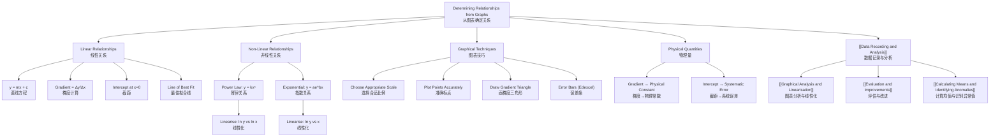

# Determining Relationships from Graphs / 从图表确定关系

---

# 1. Overview / 概述

**English:**
This sub-topic focuses on how to extract meaningful physical relationships from experimental graphs. In A-Level Physics practicals, you rarely get perfect straight-line graphs — instead, you must interpret curves, calculate gradients, determine intercepts, and use these to verify or derive physical laws. The key skill is **linearisation**: transforming a curved relationship into a straight line so that gradient and intercept yield physical constants. This is essential for both Paper 3 (CAIE) and Unit 3/6 (Edexcel) practical exams, as well as for evaluating experimental data in theory papers. Understanding this sub-topic connects directly to [[Graphical Analysis and Linearisation]] and [[Evaluation and Improvements]].

**中文:**
本子知识点专注于如何从实验图表中提取有意义的物理关系。在A-Level物理实验中，你很少能得到完美的直线图——相反，你必须解读曲线、计算梯度、确定截距，并利用这些来验证或推导物理定律。关键技能是**线性化**：将曲线关系转换为直线，使梯度和截距能得出物理常数。这对于CAIE Paper 3和Edexcel Unit 3/6实验考试，以及在理论试卷中评估实验数据都至关重要。理解本子知识点直接连接到[[Graphical Analysis and Linearisation]]和[[Evaluation and Improvements]]。

---

# 2. Syllabus Learning Objectives / 考纲学习目标

| CAIE 9702 (Paper 3/5) | Edexcel IAL (WPH11 U3 / WPH14 U6) |
|-----------|-------------|
| Plot graphs with appropriate scales and axes | Plot graphs with suitable scales, axes, and error bars |
| Determine gradient and intercept from a straight-line graph | Calculate gradient and intercept, including uncertainties |
| Recognise and interpret linear and non-linear relationships | Linearise non-linear relationships to obtain straight-line graphs |
| Use the gradient and intercept to determine physical quantities | Use gradient and intercept to determine physical constants |
| Draw and use a line of best fit | Draw and use a line of best fit with error bars |

**Examiner Expectations / 考官期望:**
- **English:** You must be able to choose appropriate scales (e.g., 1 cm = 2 units, not 1 cm = 3 units), plot points accurately, draw a line of best fit, and calculate gradient using a large triangle (at least half the line length). For non-linear graphs, you must suggest a suitable linearisation (e.g., plot $T^2$ vs $L$ for a pendulum). You must also interpret the physical meaning of gradient and intercept.
- **中文:** 你必须能够选择合适的比例（例如1厘米=2个单位，而不是1厘米=3个单位），准确标点，绘制最佳拟合线，并使用大三角形（至少线长的一半）计算梯度。对于非线性图表，你必须提出合适的线性化方法（例如，对于摆，绘制$T^2$ vs $L$）。你还必须解释梯度和截距的物理含义。

---

# 3. Core Definitions / 核心定义

| Term (EN/CN) | Definition (EN) | Definition (CN) | Common Mistakes / 常见错误 |
|--------------|-----------------|-----------------|---------------------------|
| **Gradient** / 梯度 | The slope of a straight-line graph, calculated as $\frac{\Delta y}{\Delta x}$ using a large triangle | 直线图的斜率，用大三角形计算$\frac{\Delta y}{\Delta x}$ | Using too small a triangle; not using the line of best fit points |
| **Intercept** / 截距 | The value of $y$ when $x = 0$ on a graph | 图表上$x=0$时的$y$值 | Reading from the plotted data instead of the line of best fit |
| **Line of Best Fit** / 最佳拟合线 | A single straight line that passes as close as possible to all data points, balancing points above and below | 一条尽可能接近所有数据点的直线，平衡上下方的点 | Forcing the line through the origin; ignoring outliers |
| **Linearisation** / 线性化 | Transforming a non-linear relationship into a linear form by plotting suitable variables | 通过绘制合适的变量将非线性关系转换为线性形式 | Not identifying the correct variables to plot |
| **Proportionality** / 正比关系 | A relationship where $y \propto x$, giving a straight line through the origin | $y \propto x$的关系，得到一条通过原点的直线 | Confirming proportionality from only two points |
| **Uncertainty** / 不确定度 | The range within which the true value is expected to lie, often shown as error bars | 真实值预期所在的区间，通常用误差条表示 | Ignoring error bars when drawing line of best fit |

---

# 4. Key Concepts Explained / 关键概念详解

## 4.1 Linear Relationships / 线性关系

### Explanation / 解释
**English:** A linear relationship between two variables $x$ and $y$ takes the form $y = mx + c$, where $m$ is the gradient and $c$ is the $y$-intercept. When you plot experimental data, you should draw a **line of best fit** — a single straight line that balances the points above and below it. The gradient is calculated using a **large triangle** (at least half the length of the line) with vertices on the line of best fit, not on data points. The intercept is read directly from the graph where the line crosses the $y$-axis. If the relationship is proportional ($y \propto x$), the line passes through the origin ($c = 0$). However, you must **not** force the line through the origin unless the theory explicitly requires it.

**中文:** 两个变量$x$和$y$之间的线性关系形式为$y = mx + c$，其中$m$是梯度，$c$是$y$截距。当你绘制实验数据时，你应该画一条**最佳拟合线**——一条平衡上下方数据点的直线。梯度使用**大三角形**（至少线长的一半）计算，三角形的顶点在最佳拟合线上，而不是在数据点上。截距直接从图表上直线与$y$轴的交点读取。如果关系是正比的（$y \propto x$），直线通过原点（$c = 0$）。但是，你**不能**强制直线通过原点，除非理论明确要求。

### Physical Meaning / 物理意义
**English:** The gradient represents the **rate of change** of $y$ with respect to $x$. For example, in a velocity-time graph, gradient = acceleration. The intercept often represents a **systematic offset** or a **background value** — for example, the initial reading of a sensor when the measured quantity is zero.

**中文:** 梯度表示$y$相对于$x$的**变化率**。例如，在速度-时间图中，梯度=加速度。截距通常表示**系统偏移**或**背景值**——例如，当被测物理量为零时传感器的初始读数。

### Common Misconceptions / 常见误区
- **English:**
  - "The line of best fit must pass through the origin" — Only if theory predicts $y \propto x$; otherwise, let the data decide.
  - "Gradient = $\frac{y_2 - y_1}{x_2 - x_1}$ using any two data points" — Always use points on the line of best fit, not data points.
  - "A larger triangle gives a more accurate gradient" — A larger triangle reduces percentage uncertainty in reading coordinates.
- **中文:**
  - "最佳拟合线必须通过原点" — 只有当理论预测$y \propto x$时才需要；否则让数据决定。
  - "梯度 = $\frac{y_2 - y_1}{x_2 - x_1}$ 使用任意两个数据点" — 始终使用最佳拟合线上的点，而不是数据点。
  - "三角形越大，梯度越准确" — 大三角形减少了读取坐标时的百分比不确定度。

### Exam Tips / 考试提示
- **English:** Always show your gradient triangle on the graph — draw it clearly with dashed lines and label the coordinates. Use at least half the line length. For the intercept, if the $y$-axis is not at $x=0$, you may need to read the intercept from the line equation or extend the line.
- **中文:** 始终在图表上显示你的梯度三角形——用虚线清晰地画出并标注坐标。使用至少线长的一半。对于截距，如果$y$轴不在$x=0$处，你可能需要从直线方程读取截距或延长直线。

> 📷 **IMAGE PROMPT — GRADIENT: Gradient Triangle on a Line of Best Fit**
> A graph with 6-8 data points scattered around a straight line of best fit. A large right-angled triangle is drawn on the line, with dashed lines from two points on the line to the axes. The coordinates of the two points are labelled (x1, y1) and (x2, y2). The triangle covers at least half the length of the line. The axes are labelled with physical quantities and units. The graph has a clear title: "Gradient Calculation Using a Large Triangle".

---

## 4.2 Non-Linear Relationships and Linearisation / 非线性关系与线性化

### Explanation / 解释
**English:** Most physical relationships are not linear — for example, the period of a pendulum $T = 2\pi\sqrt{L/g}$, or the resistance of a wire $R = \rho L/A$. To determine physical constants from such relationships, we **linearise** them: we choose new variables to plot so that the graph becomes a straight line. For $T = 2\pi\sqrt{L/g}$, squaring both sides gives $T^2 = (4\pi^2/g)L$, so plotting $T^2$ vs $L$ gives a straight line with gradient $4\pi^2/g$. The general approach is:
1. Identify the relationship (e.g., $y = kx^n$ or $y = ae^{bx}$).
2. Rearrange to the form $Y = mX + c$, where $Y$ and $X$ are functions of the original variables.
3. Plot $Y$ against $X$.
4. Gradient $m$ and intercept $c$ give the physical constants.

**中文:** 大多数物理关系不是线性的——例如，摆的周期$T = 2\pi\sqrt{L/g}$，或导线的电阻$R = \rho L/A$。要从这些关系中确定物理常数，我们**线性化**它们：我们选择新的变量来绘制，使图表变成直线。对于$T = 2\pi\sqrt{L/g}$，两边平方得到$T^2 = (4\pi^2/g)L$，所以绘制$T^2$ vs $L$得到一条直线，梯度为$4\pi^2/g$。一般方法是：
1. 识别关系（例如，$y = kx^n$ 或 $y = ae^{bx}$）。
2. 重排成$Y = mX + c$的形式，其中$Y$和$X$是原始变量的函数。
3. 绘制$Y$对$X$的图。
4. 梯度$m$和截距$c$给出物理常数。

### Physical Meaning / 物理意义
**English:** Linearisation allows you to use the simple tools of straight-line graphs (gradient, intercept) to extract physical constants from complex relationships. The gradient of the linearised graph always corresponds to a combination of physical constants, and the intercept often reveals a systematic error or a background effect.

**中文:** 线性化允许你使用直线图的简单工具（梯度、截距）从复杂关系中提取物理常数。线性化图的梯度总是对应于物理常数的组合，而截距通常揭示系统误差或背景效应。

### Common Misconceptions / 常见误区
- **English:**
  - "Linearisation means plotting a curve as a straight line" — No, you change the variables you plot.
  - "Any transformation works" — You must choose the correct transformation based on the theoretical relationship.
  - "The intercept is always zero after linearisation" — Only if the original relationship passes through the origin.
- **中文:**
  - "线性化意味着把曲线画成直线" — 不，你改变你绘制的变量。
  - "任何变换都有效" — 你必须根据理论关系选择正确的变换。
  - "线性化后截距总是零" — 只有当原始关系通过原点时才成立。

### Exam Tips / 考试提示
- **English:** Common linearisations to memorise: $T^2$ vs $L$ (pendulum), $R$ vs $1/A$ (resistance of wire), $\ln I$ vs $t$ (exponential decay), $\ln R$ vs $1/T$ (thermistor). Always state what you are plotting and why. Show the derived equation linking gradient to the physical constant.
- **中文:** 需要记忆的常见线性化：$T^2$ vs $L$（摆），$R$ vs $1/A$（导线电阻），$\ln I$ vs $t$（指数衰减），$\ln R$ vs $1/T$（热敏电阻）。始终说明你在绘制什么以及为什么。展示将梯度与物理常数联系起来的推导方程。

> 📷 **IMAGE PROMPT — LINEARISATION: Linearisation of Pendulum Data**
> Two graphs side by side. Left graph: a curve showing T (period) vs L (length) with data points following a square-root shape. Right graph: a straight line showing T² vs L with data points closely following the line. Both axes are labelled with units. The right graph has a gradient triangle drawn. A caption reads: "Linearisation: Plot T² vs L to obtain a straight line with gradient = 4π²/g".

---

## 4.3 Determining Physical Quantities from Gradient and Intercept / 从梯度和截距确定物理量

### Explanation / 解释
**English:** Once you have a straight-line graph (either directly or after linearisation), the gradient and intercept directly give physical quantities. For example:
- **Gradient:** If you plot $V$ vs $I$ for a resistor, gradient = resistance $R$.
- **Intercept:** If you plot $T^2$ vs $L$ for a pendulum, intercept should be zero (if the theory is exact), but a non-zero intercept might indicate a systematic error in measuring $L$ (e.g., the string length was measured from the wrong point).
- **Combined:** If you plot $y$ vs $x$ and the relationship is $y = mx + c$, then $m$ and $c$ each correspond to specific physical quantities or combinations.

**中文:** 一旦你有了直线图（直接或线性化后），梯度和截距直接给出物理量。例如：
- **梯度：** 如果你绘制电阻的$V$ vs $I$，梯度 = 电阻 $R$。
- **截距：** 如果你绘制摆的$T^2$ vs $L$，截距应为零（如果理论精确），但非零截距可能表明测量$L$时的系统误差（例如，从错误的位置测量了弦长）。
- **组合：** 如果你绘制$y$ vs $x$且关系为$y = mx + c$，那么$m$和$c$各自对应特定的物理量或组合。

### Physical Meaning / 物理意义
**English:** The gradient gives the **sensitivity** of one variable to another. The intercept often reveals **systematic errors** or **background effects** that are not accounted for in the simple theory.

**中文:** 梯度给出了一个变量对另一个变量的**灵敏度**。截距通常揭示了简单理论中未考虑到的**系统误差**或**背景效应**。

### Common Misconceptions / 常见误区
- **English:**
  - "The intercept is always physically meaningful" — Sometimes it's just an artefact of the graph scale.
  - "Gradient and intercept are independent" — They are correlated; a change in one affects the other if the line of best fit is adjusted.
- **中文:**
  - "截距总是有物理意义" — 有时只是图表比例的假象。
  - "梯度和截距是独立的" — 它们是相关的；如果调整最佳拟合线，一个的变化会影响另一个。

### Exam Tips / 考试提示
- **English:** Always write the equation linking the gradient to the physical quantity. For example: "Gradient $m = \frac{4\pi^2}{g}$, therefore $g = \frac{4\pi^2}{m}$." Include units in your final answer. If the intercept is not zero, discuss what it might represent physically.
- **中文:** 始终写出将梯度与物理量联系起来的方程。例如："梯度 $m = \frac{4\pi^2}{g}$，因此 $g = \frac{4\pi^2}{m}$。" 在最终答案中包含单位。如果截距不为零，讨论它在物理上可能代表什么。

---

# 5. Essential Equations / 核心公式

## Equation 1: Straight Line Equation / 直线方程

$$ y = mx + c $$

| Symbol (符号) | Meaning (EN) | Meaning (CN) | Unit (单位) |
|--------------|-------------|-------------|------------|
| $y$ | Dependent variable | 因变量 | Varies |
| $x$ | Independent variable | 自变量 | Varies |
| $m$ | Gradient (slope) | 梯度（斜率） | Units of $y/x$ |
| $c$ | $y$-intercept | $y$截距 | Same as $y$ |

**Derivation / 推导:** Standard form of a linear relationship.

**Conditions / 适用条件:**
- **English:** The relationship between $x$ and $y$ must be linear. For non-linear relationships, linearise first.
- **中文:** $x$和$y$之间的关系必须是线性的。对于非线性关系，先线性化。

**Limitations / 局限性:**
- **English:** Assumes no uncertainty in $x$; only $y$ has uncertainty. In practice, both may have uncertainties.
- **中文:** 假设$x$没有不确定度；只有$y$有不确定度。实际上，两者都可能有不确度。

---

## Equation 2: Gradient Formula / 梯度公式

$$ m = \frac{\Delta y}{\Delta x} = \frac{y_2 - y_1}{x_2 - x_1} $$

| Symbol (符号) | Meaning (EN) | Meaning (CN) | Unit (单位) |
|--------------|-------------|-------------|------------|
| $m$ | Gradient | 梯度 | Units of $y/x$ |
| $\Delta y$ | Change in $y$ | $y$的变化量 | Same as $y$ |
| $\Delta x$ | Change in $x$ | $x$的变化量 | Same as $x$ |
| $(x_1, y_1), (x_2, y_2)$ | Two points on the line of best fit | 最佳拟合线上的两个点 | — |

**Derivation / 推导:** From the definition of slope.

**Conditions / 适用条件:**
- **English:** Points must be on the line of best fit, not data points. The triangle should cover at least half the line length.
- **中文:** 点必须在最佳拟合线上，而不是数据点。三角形应覆盖至少线长的一半。

**Limitations / 局限性:**
- **English:** The gradient is an average over the range; it does not reveal local variations.
- **中文:** 梯度是范围内的平均值；它不揭示局部变化。

---

## Equation 3: Linearisation of Power Law / 幂律关系的线性化

$$ y = kx^n \quad \Rightarrow \quad \ln y = \ln k + n \ln x $$

| Symbol (符号) | Meaning (EN) | Meaning (CN) | Unit (单位) |
|--------------|-------------|-------------|------------|
| $y$ | Dependent variable | 因变量 | Varies |
| $x$ | Independent variable | 自变量 | Varies |
| $k$ | Constant | 常数 | Units of $y/x^n$ |
| $n$ | Exponent | 指数 | Dimensionless |

**Derivation / 推导:** Take natural logarithms of both sides: $\ln y = \ln(kx^n) = \ln k + n \ln x$. Plot $\ln y$ vs $\ln x$: gradient $= n$, intercept $= \ln k$.

**Conditions / 适用条件:**
- **English:** The relationship must be of the form $y = kx^n$. Both $x$ and $y$ must be positive (since $\ln$ of a negative is undefined).
- **中文:** 关系必须是$y = kx^n$的形式。$x$和$y$都必须为正（因为负数的$\ln$未定义）。

**Limitations / 局限性:**
- **English:** Logarithmic plotting compresses large values, which can hide small variations. Also, uncertainties in $\ln y$ are not the same as uncertainties in $y$.
- **中文:** 对数绘图压缩了大数值，可能隐藏小变化。此外，$\ln y$的不确定度与$y$的不确定度不同。

---

## Equation 4: Linearisation of Exponential Relationship / 指数关系的线性化

$$ y = ae^{bx} \quad \Rightarrow \quad \ln y = \ln a + bx $$

| Symbol (符号) | Meaning (EN) | Meaning (CN) | Unit (单位) |
|--------------|-------------|-------------|------------|
| $y$ | Dependent variable | 因变量 | Varies |
| $x$ | Independent variable | 自变量 | Varies |
| $a$ | Initial value (at $x=0$) | 初始值（$x=0$时） | Same as $y$ |
| $b$ | Growth/decay constant | 增长/衰减常数 | Units of $1/x$ |

**Derivation / 推导:** Take natural logarithms: $\ln y = \ln(ae^{bx}) = \ln a + bx$. Plot $\ln y$ vs $x$: gradient $= b$, intercept $= \ln a$.

**Conditions / 适用条件:**
- **English:** The relationship must be exponential. $y$ must be positive.
- **中文:** 关系必须是指数关系。$y$必须为正。

**Limitations / 局限性:**
- **English:** Same as for power law — logarithmic transformation changes uncertainty distribution.
- **中文:** 与幂律相同——对数变换改变了不确定度分布。

---

# 6. Graphs and Relationships / 图表与关系

## 6.1 Direct Linear Relationship / 直接线性关系

### Axes / 坐标轴
- **English:** $y$ (dependent variable) on vertical axis, $x$ (independent variable) on horizontal axis.
- **中文:** $y$（因变量）在纵轴，$x$（自变量）在横轴。

### Shape / 形状
- **English:** A straight line with gradient $m$ and intercept $c$.
- **中文:** 一条斜率为$m$、截距为$c$的直线。

### Gradient Meaning / 斜率含义
- **English:** Rate of change of $y$ with respect to $x$. For example, in $V$ vs $I$, gradient = resistance.
- **中文:** $y$相对于$x$的变化率。例如，在$V$ vs $I$中，梯度 = 电阻。

### Area Meaning / 面积含义
- **English:** Not typically used for linear relationships in practical skills. Area under a $v$-$t$ graph gives displacement, but that's a different context.
- **中文:** 在实验技能中通常不用于线性关系。$v$-$t$图下的面积给出位移，但那是不同的上下文。

### Exam Interpretation / 考试解读
- **English:** Check if the line passes through the origin (proportionality). If not, the intercept may indicate a systematic error. Always calculate gradient using a large triangle.
- **中文:** 检查直线是否通过原点（正比关系）。如果不通过，截距可能表示系统误差。始终使用大三角形计算梯度。

---

## 6.2 Linearised Graph (Power Law) / 线性化图（幂律）

### Axes / 坐标轴
- **English:** $\ln y$ on vertical axis, $\ln x$ on horizontal axis.
- **中文:** $\ln y$在纵轴，$\ln x$在横轴。

### Shape / 形状
- **English:** A straight line with gradient $n$ and intercept $\ln k$.
- **中文:** 一条斜率为$n$、截距为$\ln k$的直线。

### Gradient Meaning / 斜率含义
- **English:** The exponent $n$ in $y = kx^n$. If $n=1$, the relationship is linear; if $n=2$, it's quadratic; if $n=-1$, it's inverse.
- **中文:** $y = kx^n$中的指数$n$。如果$n=1$，关系是线性的；如果$n=2$，是二次的；如果$n=-1$，是反比的。

### Area Meaning / 面积含义
- **English:** Not applicable.
- **中文:** 不适用。

### Exam Interpretation / 考试解读
- **English:** The gradient directly gives the power $n$. The intercept gives $\ln k$, so $k = e^{\text{intercept}}$. Ensure you use natural logs ($\ln$), not log base 10 ($\log$), unless specified.
- **中文:** 梯度直接给出幂$n$。截距给出$\ln k$，所以$k = e^{\text{截距}}$。确保使用自然对数（$\ln$），而不是以10为底的对数（$\log$），除非另有说明。

---

## 6.3 Linearised Graph (Exponential) / 线性化图（指数）

### Axes / 坐标轴
- **English:** $\ln y$ on vertical axis, $x$ on horizontal axis.
- **中文:** $\ln y$在纵轴，$x$在横轴。

### Shape / 形状
- **English:** A straight line with gradient $b$ and intercept $\ln a$.
- **中文:** 一条斜率为$b$、截距为$\ln a$的直线。

### Gradient Meaning / 斜率含义
- **English:** The growth/decay constant $b$. For radioactive decay, $b = -\lambda$ (the decay constant).
- **中文:** 增长/衰减常数$b$。对于放射性衰变，$b = -\lambda$（衰变常数）。

### Area Meaning / 面积含义
- **English:** Not applicable.
- **中文:** 不适用。

### Exam Interpretation / 考试解读
- **English:** A negative gradient indicates exponential decay; a positive gradient indicates exponential growth. The half-life $t_{1/2} = \ln 2 / |b|$.
- **中文:** 负梯度表示指数衰减；正梯度表示指数增长。半衰期$t_{1/2} = \ln 2 / |b|$。

---

# 7. Required Diagrams / 必备图表

## 7.1 Line of Best Fit with Gradient Triangle / 最佳拟合线与梯度三角形

### Description / 描述
- **English:** A graph showing experimental data points, a line of best fit, and a large gradient triangle used to calculate the gradient. The triangle should cover at least half the length of the line.
- **中文:** 显示实验数据点、最佳拟合线和用于计算梯度的大梯度三角形的图表。三角形应覆盖至少线长的一半。

### Image Prompt / 图片生成提示
> 📷 **IMAGE PROMPT — GRADIENT_TRIANGLE: Line of Best Fit with Gradient Triangle**
> A graph with 8 data points scattered around a straight line of best fit. A large right-angled triangle is drawn on the line, with dashed vertical and horizontal lines from two points on the line to the axes. The coordinates of the two points are labelled (x1, y1) and (x2, y2). The triangle covers at least half the length of the line. The axes are labelled "Current / A" (x-axis) and "Voltage / V" (y-axis). The graph has a title: "Voltage vs Current for a Resistor". The line of best fit does not pass through the origin.

### Labels Required / 需要标注
- **English:** Axes with quantities and units, data points, line of best fit, gradient triangle with coordinates, calculated gradient value.
- **中文:** 带有物理量和单位的坐标轴、数据点、最佳拟合线、带有坐标的梯度三角形、计算出的梯度值。

### Exam Importance / 考试重要性
- **English:** This is the most common graph you will draw in practical exams. Marks are awarded for correct scale, accurate plotting, line of best fit, and gradient calculation.
- **中文:** 这是你在实验考试中最常绘制的图表。分数分配给正确的比例、准确的标点、最佳拟合线和梯度计算。

---

## 7.2 Linearisation Example / 线性化示例

### Description / 描述
- **English:** Two graphs side by side: the original non-linear relationship (e.g., $T$ vs $L$ for a pendulum) and the linearised version (e.g., $T^2$ vs $L$). The linearised graph shows a straight line with a gradient triangle.
- **中文:** 两个并排的图表：原始的非线性关系（例如，摆的$T$ vs $L$）和线性化版本（例如，$T^2$ vs $L$）。线性化图显示一条带有梯度三角形的直线。

### Image Prompt / 图片生成提示
> 📷 **IMAGE PROMPT — LINEARISATION_EXAMPLE: Linearisation of Pendulum Data**
> Two graphs side by side. Left graph: a curve showing T (period) vs L (length) with data points following a square-root shape. The curve is labelled "T = 2π√(L/g)". Right graph: a straight line showing T² vs L with data points closely following the line. A gradient triangle is drawn on the line. Both axes are labelled with units. A caption reads: "Linearisation: Plot T² vs L to obtain a straight line with gradient = 4π²/g". The right graph has a title: "T² vs L for a Simple Pendulum".

### Labels Required / 需要标注
- **English:** Original graph: axes with quantities and units, curve label. Linearised graph: axes with quantities and units, gradient triangle, calculated gradient value, derived value of $g$.
- **中文:** 原始图：带有物理量和单位的坐标轴、曲线标签。线性化图：带有物理量和单位的坐标轴、梯度三角形、计算出的梯度值、推导出的$g$值。

### Exam Importance / 考试重要性
- **English:** Linearisation is a key skill in both CAIE and Edexcel practical exams. You must be able to suggest an appropriate linearisation and explain why it works.
- **中文:** 线性化是CAIE和Edexcel实验考试中的关键技能。你必须能够提出合适的线性化方法并解释其原理。

---

# 8. Worked Examples / 典型例题

## Example 1: Determining Resistance from a V-I Graph / 从V-I图确定电阻

### Question / 题目
**English:**
A student measures the potential difference $V$ across a resistor for different currents $I$. The data is:

| $I$ / A | 0.10 | 0.20 | 0.30 | 0.40 | 0.50 |
|---------|------|------|------|------|------|
| $V$ / V | 0.52 | 1.08 | 1.55 | 2.10 | 2.58 |

Plot $V$ against $I$, draw a line of best fit, and determine the resistance $R$ of the resistor. Also determine the $y$-intercept and suggest what it might represent.

**中文:**
一名学生测量了电阻器在不同电流$I$下的电势差$V$。数据如下：

| $I$ / A | 0.10 | 0.20 | 0.30 | 0.40 | 0.50 |
|---------|------|------|------|------|------|
| $V$ / V | 0.52 | 1.08 | 1.55 | 2.10 | 2.58 |

绘制$V$对$I$的图，画一条最佳拟合线，并确定电阻器的电阻$R$。同时确定$y$截距并建议它可能代表什么。

### Solution / 解答

**Step 1: Plot the graph / 步骤1：绘制图表**
- **English:** Choose appropriate scales. For $I$: 0 to 0.60 A, 1 cm = 0.10 A. For $V$: 0 to 3.0 V, 1 cm = 0.50 V. Plot the points accurately.
- **中文:** 选择合适的比例。对于$I$：0到0.60 A，1厘米=0.10 A。对于$V$：0到3.0 V，1厘米=0.50 V。准确标点。

**Step 2: Draw line of best fit / 步骤2：画最佳拟合线**
- **English:** The points lie approximately on a straight line. Draw a single straight line that balances the points above and below. Do not force it through the origin.
- **中文:** 点大致在一条直线上。画一条平衡上下方数据点的直线。不要强制通过原点。

**Step 3: Calculate gradient / 步骤3：计算梯度**
- **English:** Choose two points on the line of best fit, far apart. For example:
  - Point 1: $(0.10, 0.50)$
  - Point 2: $(0.50, 2.60)$
  
  $$ m = \frac{2.60 - 0.50}{0.50 - 0.10} = \frac{2.10}{0.40} = 5.25 \, \text{V/A} $$

- **中文:** 选择最佳拟合线上相距较远的两个点。例如：
  - 点1：$(0.10, 0.50)$
  - 点2：$(0.50, 2.60)$
  
  $$ m = \frac{2.60 - 0.50}{0.50 - 0.10} = \frac{2.10}{0.40} = 5.25 \, \text{V/A} $$

**Step 4: Determine resistance / 步骤4：确定电阻**
- **English:** From Ohm's law, $V = IR$, so gradient $m = R$. Therefore:
  $$ R = 5.25 \, \Omega $$
- **中文:** 根据欧姆定律，$V = IR$，所以梯度$m = R$。因此：
  $$ R = 5.25 \, \Omega $$

**Step 5: Determine intercept / 步骤5：确定截距**
- **English:** Extend the line of best fit to the $y$-axis. The intercept is approximately $c = 0.02 \, \text{V}$. This is very close to zero, suggesting the voltmeter reads zero when no current flows. The small non-zero value could be due to a systematic error (e.g., zero error in the voltmeter).
- **中文:** 将最佳拟合线延长到$y$轴。截距约为$c = 0.02 \, \text{V}$。这非常接近零，表明没有电流时电压表读数为零。小的非零值可能是由于系统误差（例如，电压表的零误差）。

### Final Answer / 最终答案
**Answer:** $R = 5.25 \, \Omega$, intercept $c \approx 0.02 \, \text{V}$ (possibly zero error) | **答案：** $R = 5.25 \, \Omega$，截距 $c \approx 0.02 \, \text{V}$（可能是零误差）

### Quick Tip / 提示
- **English:** Always use points on the line of best fit, not data points, for gradient calculation. Show your triangle clearly on the graph.
- **中文:** 始终使用最佳拟合线上的点，而不是数据点，来计算梯度。在图表上清晰地显示你的三角形。

---

## Example 2: Linearisation of Pendulum Data / 摆数据的线性化

### Question / 题目
**English:**
A student investigates the relationship between the period $T$ of a simple pendulum and its length $L$. The data is:

| $L$ / m | 0.20 | 0.40 | 0.60 | 0.80 | 1.00 |
|---------|------|------|------|------|------|
| $T$ / s | 0.90 | 1.27 | 1.55 | 1.79 | 2.01 |

The theoretical relationship is $T = 2\pi\sqrt{L/g}$. Linearise the data, plot a suitable graph, and determine the acceleration due to gravity $g$.

**中文:**
一名学生研究单摆周期$T$与摆长$L$之间的关系。数据如下：

| $L$ / m | 0.20 | 0.40 | 0.60 | 0.80 | 1.00 |
|---------|------|------|------|------|------|
| $T$ / s | 0.90 | 1.27 | 1.55 | 1.79 | 2.01 |

理论关系为$T = 2\pi\sqrt{L/g}$。线性化数据，绘制合适的图表，并确定重力加速度$g$。

### Solution / 解答

**Step 1: Linearise the relationship / 步骤1：线性化关系**
- **English:** Square both sides of $T = 2\pi\sqrt{L/g}$:
  $$ T^2 = \frac{4\pi^2}{g} L $$
  This is of the form $y = mx$, where $y = T^2$, $x = L$, and $m = 4\pi^2/g$.
- **中文:** 将$T = 2\pi\sqrt{L/g}$两边平方：
  $$ T^2 = \frac{4\pi^2}{g} L $$
  这是$y = mx$的形式，其中$y = T^2$，$x = L$，$m = 4\pi^2/g$。

**Step 2: Calculate $T^2$ values / 步骤2：计算$T^2$值**

| $L$ / m | 0.20 | 0.40 | 0.60 | 0.80 | 1.00 |
|---------|------|------|------|------|------|
| $T$ / s | 0.90 | 1.27 | 1.55 | 1.79 | 2.01 |
| $T^2$ / s² | 0.81 | 1.61 | 2.40 | 3.20 | 4.04 |

**Step 3: Plot $T^2$ vs $L$ / 步骤3：绘制$T^2$ vs $L$**
- **English:** Plot $T^2$ on the $y$-axis and $L$ on the $x$-axis. Draw a line of best fit through the origin (since theory predicts $c=0$).
- **中文:** 在$y$轴上绘制$T^2$，在$x$轴上绘制$L$。画一条通过原点的最佳拟合线（因为理论预测$c=0$）。

**Step 4: Calculate gradient / 步骤4：计算梯度**
- **English:** Choose two points on the line. For example:
  - Point 1: $(0.20, 0.81)$
  - Point 2: $(1.00, 4.04)$
  
  $$ m = \frac{4.04 - 0.81}{1.00 - 0.20} = \frac{3.23}{0.80} = 4.04 \, \text{s}^2/\text{m} $$
- **中文:** 选择线上的两个点。例如：
  - 点1：$(0.20, 0.81)$
  - 点2：$(1.00, 4.04)$
  
  $$ m = \frac{4.04 - 0.81}{1.00 - 0.20} = \frac{3.23}{0.80} = 4.04 \, \text{s}^2/\text{m} $$

**Step 5: Determine $g$ / 步骤5：确定$g$**
- **English:** From $m = 4\pi^2/g$:
  $$ g = \frac{4\pi^2}{m} = \frac{4\pi^2}{4.04} = 9.77 \, \text{m/s}^2 $$
- **中文:** 由$m = 4\pi^2/g$：
  $$ g = \frac{4\pi^2}{m} = \frac{4\pi^2}{4.04} = 9.77 \, \text{m/s}^2 $$

### Final Answer / 最终答案
**Answer:** $g = 9.77 \, \text{m/s}^2$ | **答案：** $g = 9.77 \, \text{m/s}^2$

### Quick Tip / 提示
- **English:** When theory predicts a line through the origin, you may force the line of best fit through the origin. However, if the data clearly suggests a non-zero intercept, discuss the possible systematic error.
- **中文:** 当理论预测直线通过原点时，你可以强制最佳拟合线通过原点。但是，如果数据明显表明截距不为零，讨论可能的系统误差。

---

# 9. Past Paper Question Types / 历年真题题型

| Question Type / 题型 | Frequency / 频率 | Difficulty / 难度 | Past Paper References / 真题索引 |
|----------------------|------------------|------------------|-------------------------------|
| Plot graph and calculate gradient | Very High | Easy | 📝 *待填入* |
| Determine physical quantity from gradient | Very High | Medium | 📝 *待填入* |
| Linearise data and plot suitable graph | High | Medium-Hard | 📝 *待填入* |
| Interpret non-zero intercept | Medium | Medium | 📝 *待填入* |
| Draw line of best fit with error bars | Medium (Edexcel) | Medium | 📝 *待填入* |
| Calculate uncertainty in gradient | Medium (Edexcel) | Hard | 📝 *待填入* |

**Common Command Words / 常见指令词:**
- **English:** "Plot a graph of ... against ...", "Determine the gradient", "Determine the value of ...", "Linearise the data", "Suggest a suitable graph to obtain a straight line", "Comment on the intercept"
- **中文:** "绘制...对...的图"，"确定梯度"，"确定...的值"，"线性化数据"，"建议一个合适的图表以获得直线"，"评论截距"

---

# 10. Practical Skills Connections / 实验技能链接

**English:**
This sub-topic is central to all practical exams. Key connections include:

- **Measurements:** Accurate readings of $x$ and $y$ values are essential. Use appropriate instruments (ruler, stopwatch, voltmeter) with correct precision.
- **Uncertainties:** Error bars on graphs (especially Edexcel) show the uncertainty in each measurement. The line of best fit should pass through all error bars if possible. The uncertainty in gradient can be found by drawing lines of maximum and minimum slope.
- **Graph Plotting:** Choose scales such that the graph occupies at least half the page. Label axes with quantities and units. Plot points with sharp pencil crosses.
- **Experimental Design:** When planning an experiment, consider what graph you will plot and how you will linearise the data to determine the required physical constant.
- **Evaluation:** Compare your determined value (from gradient) with the accepted value. Discuss systematic errors that might cause a non-zero intercept.

**中文:**
本子知识点是所有实验考试的核心。关键联系包括：

- **测量：** 准确读取$x$和$y$值至关重要。使用具有正确精度的适当仪器（尺子、秒表、电压表）。
- **不确定度：** 图表上的误差条（尤其是Edexcel）显示每次测量的不确定度。如果可能，最佳拟合线应通过所有误差条。梯度的不确定度可以通过绘制最大和最小斜率线来找到。
- **图表绘制：** 选择比例使图表至少占据半页。用物理量和单位标注坐标轴。用尖锐的铅笔十字标点。
- **实验设计：** 在规划实验时，考虑你将绘制什么图表以及如何线性化数据以确定所需的物理常数。
- **评估：** 将你确定的值（从梯度）与公认值进行比较。讨论可能导致非零截距的系统误差。

---

# 11. Concept Map / 概念图谱

---

# 12. Quick Revision Sheet / 速查表

| Category / 类别 | Key Points / 要点 |
|----------------|------------------|
| **Definition / 定义** | Determining relationships from graphs means extracting physical constants (gradient, intercept) from experimental data plotted as straight-line graphs, either directly or after linearisation. / 从图表确定关系意味着从实验数据（直接或线性化后）绘制的直线图中提取物理常数（梯度、截距）。 |
| **Key Formula / 核心公式** | $y = mx + c$ (straight line); $m = \frac{y_2 - y_1}{x_2 - x_1}$ (gradient); $T^2 = \frac{4\pi^2}{g}L$ (pendulum linearisation); $\ln y = \ln k + n \ln x$ (power law); $\ln y = \ln a + bx$ (exponential) |
| **Key Graph / 核心图表** | Straight line with gradient triangle covering at least half the line length. Linearised graphs: $T^2$ vs $L$, $\ln y$ vs $\ln x$, $\ln y$ vs $x$. / 带有覆盖至少线长一半的梯度三角形的直线图。线性化图：$T^2$ vs $L$，$\ln y$ vs $\ln x$，$\ln y$ vs $x$。 |
| **Exam Tip / 考试提示** | Always use points on the line of best fit for gradient calculation. Show your triangle clearly. For linearisation, state what you plot and why. Discuss non-zero intercepts as possible systematic errors. / 始终使用最佳拟合线上的点计算梯度。清晰显示你的三角形。对于线性化，说明你绘制什么以及为什么。将非零截距讨论为可能的系统误差。 |
| **Common Mistake / 常见错误** | Using data points instead of line points for gradient; forcing line through origin; choosing poor scale (e.g., 1 cm = 3 units); not labelling axes with units. / 使用数据点而不是线上的点计算梯度；强制直线通过原点；选择不良比例（例如1厘米=3个单位）；未用单位标注坐标轴。 |
| **Edexcel Specific / Edexcel特有** | Error bars on graphs; calculating uncertainty in gradient using max/min slope lines. / 图表上的误差条；使用最大/最小斜率线计算梯度不确定度。 |
| **CAIE Specific / CAIE特有** | Focus on correct scale selection and accurate plotting. No error bars required in Paper 3. / 关注正确的比例选择和准确的标点。Paper 3不需要误差条。 |