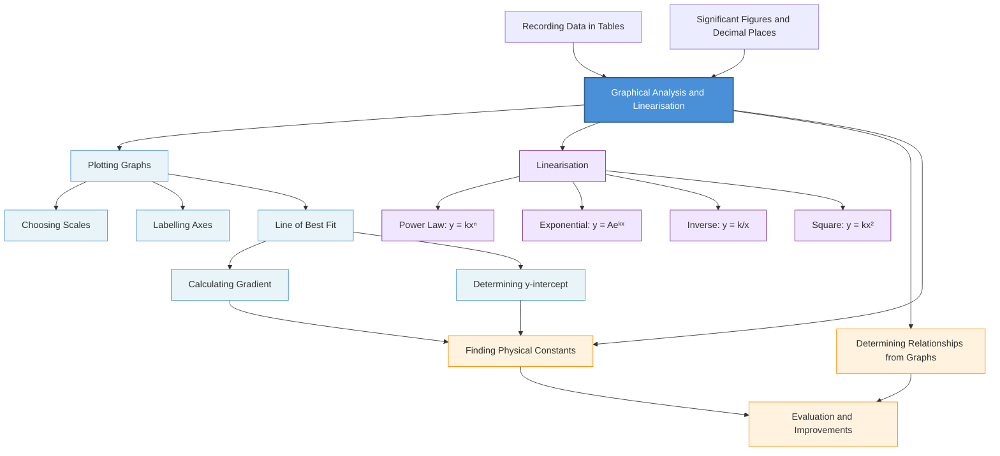

# Graphical Analysis and Linearisation / 图形分析与线性化

---

# 1. Overview / 概述

**English:**
Graphical analysis is the process of plotting experimental data to identify relationships between variables. Linearisation is a powerful technique that transforms curved graphs into straight lines, allowing you to determine unknown constants from the gradient and intercept. This sub-topic is fundamental to all A-Level practical papers — you will be expected to plot graphs, calculate gradients, determine intercepts, and use linearisation to verify theoretical relationships. Mastering this skill directly impacts your ability to analyse data in [[Recording Data in Tables]] and to [[Determining Relationships from Graphs]].

**中文:**
图形分析是将实验数据绘制成图表以识别变量之间关系的过程。线性化是一种强大的技术，它将曲线图转换为直线，从而可以通过斜率和截距确定未知常数。本子知识点是所有A-Level实验试卷的基础——你需要绘制图表、计算斜率、确定截距，并使用线性化来验证理论关系。掌握这项技能直接影响你在[[Recording Data in Tables]]和[[Determining Relationships from Graphs]]中分析数据的能力。

---

# 2. Syllabus Learning Objectives / 考纲学习目标

| CAIE 9702 | Edexcel IAL |
|-----------|-------------|
| Plot graphs with appropriate scales, axes labels, and units | Plot graphs with suitable scales, labelled axes, and error bars |
| Determine gradient and y-intercept from a straight-line graph | Calculate gradient and intercept from a line of best fit |
| Use logarithmic plotting to linearise exponential relationships | Use log-linear and log-log graphs to linearise data |
| Identify the relationship between variables from the shape of a graph | Determine the relationship between variables using linearisation |

**Examiner Expectations / 考官期望:**
- **English:** You must choose scales that use at least half the grid, label axes with quantity/unit, plot points accurately (±0.5 small square), draw a thin best-fit line, and calculate gradient using a large triangle (at least half the line length).
- **中文:** 你必须选择至少使用网格一半的刻度，用物理量/单位标注坐标轴，精确绘制数据点（±0.5小格），画一条细的最佳拟合线，并使用大三角形（至少线长的一半）计算斜率。

---

# 3. Core Definitions / 核心定义

| Term (EN/CN) | Definition (EN) | Definition (CN) | Common Mistakes / 常见错误 |
|--------------|-----------------|-----------------|---------------------------|
| **Gradient** / 斜率 | The rate of change of the dependent variable with respect to the independent variable, calculated as $\frac{\Delta y}{\Delta x}$ from a straight-line graph | 因变量相对于自变量的变化率，从直线图中计算为 $\frac{\Delta y}{\Delta x}$ | Using data points instead of line-of-best-fit points; triangle too small |
| **y-intercept** / y轴截距 | The value of y when x = 0, read from the graph where the line of best fit crosses the y-axis | 当 x=0 时 y 的值，从最佳拟合线与 y 轴的交点读取 | Extrapolating too far beyond data; not reading from the drawn line |
| **Linearisation** / 线性化 | Transforming a non-linear relationship into a linear form $y = mx + c$ by redefining variables or using logarithms | 通过重新定义变量或使用对数将非线性关系转换为线性形式 $y = mx + c$ | Forgetting to transform both axes correctly |
| **Line of Best Fit** / 最佳拟合线 | A single straight line drawn through the data points that minimises the total distance between points and the line | 通过数据点绘制的单一直线，使点与线之间的总距离最小化 | Joining point-to-point; drawing a thick line; forcing through origin |
| **Error Bar** / 误差棒 | A vertical/horizontal line through a data point representing the uncertainty range in that measurement | 通过数据点的垂直线/水平线，表示该测量值的不确定度范围 | Not drawing error bars when required; inconsistent lengths |

---

# 4. Key Concepts Explained / 关键概念详解

## 4.1 Choosing Scales and Axes / 选择刻度和坐标轴

### Explanation / 解释
**English:** The scale on each axis must be chosen so that the plotted data occupies **at least half** of the graph paper in both directions. Each 2 cm square should represent a **simple** number (1, 2, 5, or multiples of 10). The independent variable (controlled by the experimenter) goes on the x-axis; the dependent variable (measured) goes on the y-axis. Each axis must be labelled with the **quantity** and **unit** in the format: `Quantity / unit` (e.g., `V / V` or `t / s`).

**中文:** 每个坐标轴上的刻度必须使绘制的数据在两个方向上至少占据图纸的一半。每个2厘米方格应代表一个简单的数字（1、2、5或10的倍数）。自变量（实验者控制的变量）放在x轴上；因变量（测量的变量）放在y轴上。每个坐标轴必须用物理量和单位标注，格式为：`物理量 / 单位`（例如 `V / V` 或 `t / s`）。

### Physical Meaning / 物理意义
**English:** A well-chosen scale ensures that the experimental uncertainty is visible and that the gradient can be calculated with reasonable precision. Poor scaling (too small) hides the pattern; poor scaling (too large) wastes space and reduces accuracy.

**中文:** 选择良好的刻度可确保实验不确定度可见，并且可以以合理的精度计算斜率。刻度太小会隐藏模式；刻度太大会浪费空间并降低精度。

### Common Misconceptions / 常见误区
- **English:** "I should start the axes at (0,0) even if my data starts at (2, 15)." — **False.** Use a false origin (broken axis) if your data does not include zero.
- **中文:** "即使我的数据从 (2, 15) 开始，我也应该从 (0,0) 开始坐标轴。" — **错误。** 如果数据不包含零，请使用假原点（断轴）。
- **English:** "I can use any scale I like." — **False.** Scales must be simple (1, 2, 5 per square) for easy reading.
- **中文:** "我可以使用任何我喜欢的刻度。" — **错误。** 刻度必须简单（每方格1、2、5）以便于读取。

### Exam Tips / 考试提示
- **English:** Always check the data range first. If x goes from 2.0 to 8.0, your x-axis should start at 2.0 (or 0 if required) and end at 8.0 (or slightly beyond).
- **中文:** 始终先检查数据范围。如果 x 从 2.0 到 8.0，你的 x 轴应从 2.0（或如果需要从0）开始，到 8.0（或稍超出）结束。

> 📷 **IMAGE PROMPT — GRA01: Choosing Graph Scales**
> A diagram showing two graphs of the same data: one with poor scaling (data crammed into one corner) and one with good scaling (data fills at least half the grid). Labels indicate "Good Scale" and "Poor Scale" with annotations explaining why.

---

## 4.2 Drawing the Line of Best Fit / 绘制最佳拟合线

### Explanation / 解释
**English:** The line of best fit is a **single straight line** drawn through the data points. It should pass as close as possible to all points, with roughly equal numbers of points above and below the line. **Do not** force the line through the origin unless the theory requires it and the data supports it. **Do not** join points dot-to-dot. The line should be **thin** (use a sharp pencil) so that readings from it are precise.

**中文:** 最佳拟合线是通过数据点绘制的单一直线。它应尽可能靠近所有点，线上方和下方的点数量大致相等。不要强制线通过原点，除非理论要求且数据支持。不要逐点连接。线应该细（使用削尖的铅笔），以便从中读取数据时精确。

### Physical Meaning / 物理意义
**English:** The line of best fit represents the **average trend** of the data, smoothing out random experimental errors. It is the best estimate of the true relationship between the variables.

**中文:** 最佳拟合线代表数据的平均趋势，平滑了随机实验误差。它是变量之间真实关系的最佳估计。

### Common Misconceptions / 常见误区
- **English:** "The line must pass through every point." — **False.** The line is an average; points will scatter around it due to random error.
- **中文:** "线必须通过每个点。" — **错误。** 线是平均值；由于随机误差，点会围绕它分散。
- **English:** "I should draw a thick line so it's visible." — **False.** A thick line makes it impossible to read values accurately.
- **中文:** "我应该画一条粗线以便可见。" — **错误。** 粗线使得无法准确读取数值。

### Exam Tips / 考试提示
- **English:** Use a transparent ruler to see points on both sides. Draw the line in one smooth motion — don't sketch short segments.
- **中文:** 使用透明尺子可以看到两侧的点。一次性画出线——不要分段绘制。

> 📷 **IMAGE PROMPT — GRA02: Line of Best Fit**
> A graph with 8 data points showing random scatter. A thin, straight line of best fit passes through the middle of the points. Annotations show "Good fit — balanced scatter" and a second line shows "Bad fit — forced through origin" with points all above the line.

---

## 4.3 Calculating Gradient / 计算斜率

### Explanation / 解释
**English:** Gradient $m = \frac{\Delta y}{\Delta x} = \frac{y_2 - y_1}{x_2 - x_1}$. Choose two points **on the line of best fit** (not data points) that are far apart — at least half the length of the line. Draw a large triangle on the graph showing $\Delta y$ and $\Delta x$. Show the calculation clearly, including units. The gradient has the units of $\frac{\text{y-axis unit}}{\text{x-axis unit}}$.

**中文:** 斜率 $m = \frac{\Delta y}{\Delta x} = \frac{y_2 - y_1}{x_2 - x_1}$。选择最佳拟合线上（不是数据点）的两个相距较远的点——至少线长的一半。在图上画一个大三角形，显示 $\Delta y$ 和 $\Delta x$。清晰展示计算过程，包括单位。斜率的单位是 $\frac{\text{y轴单位}}{\text{x轴单位}}$。

### Physical Meaning / 物理意义
**English:** The gradient represents the **rate of change** of one variable with respect to another. In a linearised graph, the gradient often equals a physical constant (e.g., spring constant $k$, resistance $R$, acceleration $g$).

**中文:** 斜率表示一个变量相对于另一个变量的变化率。在线性化图中，斜率通常等于一个物理常数（例如弹簧常数 $k$、电阻 $R$、加速度 $g$）。

### Common Misconceptions / 常见误区
- **English:** "I can use any two data points." — **False.** Use points on the line of best fit to average out errors.
- **中文:** "我可以使用任意两个数据点。" — **错误。** 使用最佳拟合线上的点来平均误差。
- **English:** "The triangle can be small." — **False.** A small triangle gives large percentage uncertainty in gradient.
- **中文:** "三角形可以很小。" — **错误。** 小三角形会导致斜率百分比不确定度很大。

### Exam Tips / 考试提示
- **English:** Draw the triangle on the graph itself with clear labels. Show the coordinates of both points. Always include units in the final gradient value.
- **中文:** 在图上画出三角形并清晰标注。显示两个点的坐标。始终在最终斜率值中包含单位。

---

## 4.4 Determining y-intercept / 确定y轴截距

### Explanation / 解释
**English:** Read the y-intercept directly from the graph where the line of best fit crosses the y-axis (x = 0). If x = 0 is not on your graph (false origin), use the equation $c = y - mx$ with a point from the line. The intercept has the same units as the y-axis.

**中文:** 直接从图上读取最佳拟合线与y轴（x=0）的交点。如果x=0不在你的图上（假原点），使用方程 $c = y - mx$ 和线上的一个点。截距的单位与y轴相同。

### Physical Meaning / 物理意义
**English:** The y-intercept often represents the value of the dependent variable when the independent variable is zero. In linearised graphs, it may represent a systematic offset or a physical constant (e.g., initial velocity, background count rate).

**中文:** y轴截距通常表示自变量为零时因变量的值。在线性化图中，它可能表示系统偏移或物理常数（例如初速度、本底计数率）。

### Common Misconceptions / 常见误区
- **English:** "I can read the intercept from the table of data." — **False.** The intercept comes from the graph, not the raw data.
- **中文:** "我可以从数据表中读取截距。" — **错误。** 截距来自图表，而不是原始数据。

### Exam Tips / 考试提示
- **English:** If x=0 is not on your scale, extend the line backwards carefully and read the intercept. Alternatively, use the gradient and a point on the line to calculate $c$.
- **中文:** 如果x=0不在你的刻度上，小心向后延长线并读取截距。或者，使用斜率和线上的一个点计算 $c$。

---

## 4.5 Linearisation Techniques / 线性化技术

### Explanation / 解释
**English:** Many physical relationships are non-linear (e.g., $T = 2\pi\sqrt{\frac{l}{g}}$, $V = V_0 e^{-t/RC}$). Linearisation transforms these into the form $y = mx + c$ so that gradient and intercept can be used to find unknown constants.

**Common linearisations:**
1. **Power law** $y = kx^n$ → plot $\log y$ against $\log x$: $\log y = n\log x + \log k$ (gradient = $n$, intercept = $\log k$)
2. **Exponential** $y = Ae^{kx}$ → plot $\ln y$ against $x$: $\ln y = kx + \ln A$ (gradient = $k$, intercept = $\ln A$)
3. **Inverse** $y = \frac{k}{x}$ → plot $y$ against $\frac{1}{x}$: $y = k\left(\frac{1}{x}\right)$ (gradient = $k$)
4. **Square** $y = kx^2$ → plot $y$ against $x^2$: $y = k(x^2)$ (gradient = $k$)

**中文:** 许多物理关系是非线性的（例如 $T = 2\pi\sqrt{\frac{l}{g}}$，$V = V_0 e^{-t/RC}$）。线性化将这些关系转换为 $y = mx + c$ 的形式，以便使用斜率和截距来找到未知常数。

**常见线性化：**
1. **幂律** $y = kx^n$ → 绘制 $\log y$ 对 $\log x$ 的图：$\log y = n\log x + \log k$（斜率 = $n$，截距 = $\log k$）
2. **指数** $y = Ae^{kx}$ → 绘制 $\ln y$ 对 $x$ 的图：$\ln y = kx + \ln A$（斜率 = $k$，截距 = $\ln A$）
3. **反比** $y = \frac{k}{x}$ → 绘制 $y$ 对 $\frac{1}{x}$ 的图：$y = k\left(\frac{1}{x}\right)$（斜率 = $k$）
4. **平方** $y = kx^2$ → 绘制 $y$ 对 $x^2$ 的图：$y = k(x^2)$（斜率 = $k$）

### Physical Meaning / 物理意义
**English:** Linearisation reveals the underlying mathematical relationship. A straight line on a transformed graph confirms the hypothesised relationship. The gradient and intercept directly give physical constants.

**中文:** 线性化揭示了潜在的数学关系。变换后的图上的直线确认了假设的关系。斜率和截距直接给出物理常数。

### Common Misconceptions / 常见误区
- **English:** "I can linearise any graph by just taking logs." — **False.** You must know the expected relationship first. Taking logs of both sides only works for power and exponential relationships.
- **中文:** "我可以通过取对数来线性化任何图形。" — **错误。** 你必须先知道预期的关系。对两边取对数只适用于幂和指数关系。
- **English:** "Log-linear and log-log are the same." — **False.** Log-linear ($\ln y$ vs $x$) is for exponentials; log-log ($\log y$ vs $\log x$) is for power laws.
- **中文:** "对数-线性和对数-对数是一样的。" — **错误。** 对数-线性（$\ln y$ 对 $x$）用于指数关系；对数-对数（$\log y$ 对 $\log x$）用于幂律。

### Exam Tips / 考试提示
- **English:** Always write the linearised equation in the form $y = mx + c$ before plotting. Identify which column of data goes on which axis. Remember: if you plot $\ln y$, the y-axis label is `ln(y)`.
- **中文:** 在绘图之前，始终将线性化方程写成 $y = mx + c$ 的形式。确定哪列数据放在哪个轴上。记住：如果你绘制 $\ln y$，y轴标签是 `ln(y)`。

> 📷 **IMAGE PROMPT — GRA03: Linearisation Examples**
> Four small graphs side-by-side showing: (1) Original curved graph of T vs l for a pendulum; (2) Linearised graph of T² vs l; (3) Original exponential decay of V vs t; (4) Linearised graph of ln(V) vs t. Each pair shows the transformation with arrows.

---

# 5. Essential Equations / 核心公式

## 5.1 Gradient Formula / 斜率公式

$$ m = \frac{y_2 - y_1}{x_2 - x_1} = \frac{\Delta y}{\Delta x} $$

| Symbol (符号) | Meaning (EN) | Meaning (CN) | Unit (单位) |
|--------------|-------------|-------------|------------|
| $m$ | Gradient of line of best fit | 最佳拟合线的斜率 | y-unit / x-unit |
| $y_2, y_1$ | y-coordinates of two points on the line | 线上两点的y坐标 | y-axis unit |
| $x_2, x_1$ | x-coordinates of two points on the line | 线上两点的x坐标 | x-axis unit |

**Conditions / 适用条件:** Points must be on the line of best fit, not data points. Triangle must be at least half the line length.
**Limitations / 局限性:** Sensitive to the choice of points; always show the triangle on the graph.

---

## 5.2 Equation of a Straight Line / 直线方程

$$ y = mx + c $$

| Symbol (符号) | Meaning (EN) | Meaning (CN) | Unit (单位) |
|--------------|-------------|-------------|------------|
| $y$ | Dependent variable (plotted on y-axis) | 因变量（绘制在y轴上） | y-axis unit |
| $x$ | Independent variable (plotted on x-axis) | 自变量（绘制在x轴上） | x-axis unit |
| $m$ | Gradient | 斜率 | y-unit / x-unit |
| $c$ | y-intercept (value of y when x=0) | y轴截距（x=0时y的值） | y-axis unit |

**Conditions / 适用条件:** Only valid for linear relationships or linearised data.
**Limitations / 局限性:** Assumes a perfect linear relationship; real data has scatter.

---

## 5.3 Power Law Linearisation / 幂律线性化

$$ y = kx^n \quad \Rightarrow \quad \log y = n \log x + \log k $$

| Symbol (符号) | Meaning (EN) | Meaning (CN) | Unit (单位) |
|--------------|-------------|-------------|------------|
| $n$ | Exponent (gradient of log-log graph) | 指数（对数-对数图的斜率） | dimensionless |
| $k$ | Constant (antilog of intercept) | 常数（截距的反对数） | depends on relationship |
| $\log$ | Logarithm (base 10 or natural) | 对数（以10为底或自然对数） | dimensionless |

**Derivation / 推导:** Take logs of both sides: $\log y = \log(kx^n) = \log k + n\log x$. Compare to $y = mx + c$: $y \rightarrow \log y$, $x \rightarrow \log x$, $m = n$, $c = \log k$.

**Conditions / 适用条件:** Only for relationships of the form $y = kx^n$.
**Limitations / 局限性:** Cannot linearise relationships with additive constants (e.g., $y = kx^n + a$).

---

## 5.4 Exponential Linearisation / 指数线性化

$$ y = Ae^{kx} \quad \Rightarrow \quad \ln y = kx + \ln A $$

| Symbol (符号) | Meaning (EN) | Meaning (CN) | Unit (单位) |
|--------------|-------------|-------------|------------|
| $A$ | Initial value (when x=0) | 初始值（当x=0时） | y-axis unit |
| $k$ | Rate constant (gradient of ln-linear graph) | 速率常数（对数-线性图的斜率） | 1/x-unit |
| $\ln$ | Natural logarithm | 自然对数 | dimensionless |

**Derivation / 推导:** Take natural logs: $\ln y = \ln(Ae^{kx}) = \ln A + kx$. Compare to $y = mx + c$: $y \rightarrow \ln y$, $x \rightarrow x$, $m = k$, $c = \ln A$.

**Conditions / 适用条件:** Only for relationships of the form $y = Ae^{kx}$.
**Limitations / 局限性:** Cannot linearise if there is a constant offset (e.g., $y = Ae^{kx} + B$).

---

## 5.5 Inverse and Square Linearisation / 反比和平方线性化

$$ y = \frac{k}{x} \quad \Rightarrow \quad y = k\left(\frac{1}{x}\right) $$

$$ y = kx^2 \quad \Rightarrow \quad y = k(x^2) $$

| Symbol (符号) | Meaning (EN) | Meaning (CN) | Unit (单位) |
|--------------|-------------|-------------|------------|
| $k$ | Constant (gradient of transformed graph) | 常数（变换后图的斜率） | depends |

**Conditions / 适用条件:** Plot $y$ against $1/x$ for inverse; plot $y$ against $x^2$ for square.
**Limitations / 局限性:** Only works for pure inverse or pure square relationships.

---

# 6. Graphs and Relationships / 图表与关系

## 6.1 Direct Proportionality / 正比关系

### Axes / 坐标轴
- x-axis: Independent variable (e.g., $V$)
- y-axis: Dependent variable (e.g., $I$)

### Shape / 形状
- **English:** A straight line passing through the origin (0,0).
- **中文:** 通过原点 (0,0) 的直线。

### Gradient Meaning / 斜率含义
- **English:** The constant of proportionality (e.g., $1/R$ in $I = V/R$).
- **中文:** 比例常数（例如 $I = V/R$ 中的 $1/R$）。

### Area Meaning / 面积含义
- **English:** Not typically meaningful for proportionality graphs.
- **中文:** 对于正比图通常没有意义。

### Exam Interpretation / 考试解读
- **English:** If the line passes through the origin within experimental uncertainty, $y \propto x$. If it has a non-zero intercept, there is a systematic offset.
- **中文:** 如果在实验不确定度范围内线通过原点，则 $y \propto x$。如果截距非零，则存在系统偏移。

---

## 6.2 Linear Relationship with Intercept / 有截距的线性关系

### Axes / 坐标轴
- x-axis: Independent variable
- y-axis: Dependent variable

### Shape / 形状
- **English:** A straight line that does NOT pass through the origin.
- **中文:** 不通过原点的直线。

### Gradient Meaning / 斜率含义
- **English:** Rate of change of y with respect to x.
- **中文:** y相对于x的变化率。

### Area Meaning / 面积含义
- **English:** Not typically meaningful for linear graphs.
- **中文:** 对于线性图通常没有意义。

### Exam Interpretation / 考试解读
- **English:** The intercept gives the value of y when x=0. This may represent background, initial value, or systematic error.
- **中文:** 截距给出x=0时y的值。这可能代表本底、初始值或系统误差。

---

## 6.3 Log-Log Graph (Power Law) / 对数-对数图（幂律）

### Axes / 坐标轴
- x-axis: $\log x$ (or $\ln x$)
- y-axis: $\log y$ (or $\ln y$)

### Shape / 形状
- **English:** A straight line if $y = kx^n$.
- **中文:** 如果 $y = kx^n$，则为直线。

### Gradient Meaning / 斜率含义
- **English:** The exponent $n$ in $y = kx^n$.
- **中文:** $y = kx^n$ 中的指数 $n$。

### Area Meaning / 面积含义
- **English:** Not meaningful.
- **中文:** 没有意义。

### Exam Interpretation / 考试解读
- **English:** Gradient = $n$ (dimensionless). Intercept = $\log k$. To find $k$, take antilog: $k = 10^{\text{intercept}}$ (for log₁₀) or $k = e^{\text{intercept}}$ (for ln).
- **中文:** 斜率 = $n$（无量纲）。截距 = $\log k$。要找到 $k$，取反对数：$k = 10^{\text{截距}}$（对于log₁₀）或 $k = e^{\text{截距}}$（对于ln）。

---

## 6.4 Log-Linear Graph (Exponential) / 对数-线性图（指数）

### Axes / 坐标轴
- x-axis: $x$ (original independent variable)
- y-axis: $\ln y$ (or $\log y$)

### Shape / 形状
- **English:** A straight line if $y = Ae^{kx}$.
- **中文:** 如果 $y = Ae^{kx}$，则为直线。

### Gradient Meaning / 斜率含义
- **English:** The rate constant $k$ in $y = Ae^{kx}$.
- **中文:** $y = Ae^{kx}$ 中的速率常数 $k$。

### Area Meaning / 面积含义
- **English:** Not meaningful.
- **中文:** 没有意义。

### Exam Interpretation / 考试解读
- **English:** Gradient = $k$ (units: 1/x-unit). Intercept = $\ln A$. To find $A$: $A = e^{\text{intercept}}$.
- **中文:** 斜率 = $k$（单位：1/x单位）。截距 = $\ln A$。要找到 $A$：$A = e^{\text{截距}}$。

---

# 7. Required Diagrams / 必备图表

## 7.1 Gradient Triangle / 斜率三角形

### Description / 描述
**English:** A graph showing a line of best fit with a large right-angled triangle drawn to calculate the gradient. The triangle's hypotenuse is a segment of the line of best fit. The vertical side is labelled $\Delta y$ and the horizontal side is labelled $\Delta x$. The coordinates of the two chosen points are clearly marked.

**中文:** 显示最佳拟合线的图，画有一个大的直角三角形用于计算斜率。三角形的斜边是最佳拟合线的一段。垂直边标注为 $\Delta y$，水平边标注为 $\Delta x$。两个选定点的坐标清晰标注。

### Image Prompt / 图片生成提示
> 📷 **IMAGE PROMPT — GRA04: Gradient Triangle on Graph**
> A graph with 8 data points scattered around a thin straight line of best fit. A large right-angled triangle is drawn with the hypotenuse along the line. The vertical side is labelled "Δy = 6.0 V" and the horizontal side is labelled "Δx = 2.0 A". The two points used are circled and their coordinates shown: (1.0, 2.0) and (3.0, 8.0). The graph has labelled axes "V / V" and "I / A". The triangle occupies at least half the line length.

### Labels Required / 需要标注
- **English:** $\Delta y$, $\Delta x$, coordinates of both points, units on axes, line of best fit
- **中文:** $\Delta y$、$\Delta x$、两个点的坐标、坐标轴单位、最佳拟合线

### Exam Importance / 考试重要性
- **English:** **Critical.** You must draw the gradient triangle on the graph in the exam. Without it, you lose marks for gradient calculation.
- **中文:** **关键。** 你必须在考试中在图上画出斜率三角形。没有它，你会失去斜率计算的分数。

---

## 7.2 Linearisation Transformation / 线性化变换

### Description / 描述
**English:** A two-part diagram showing: (1) The original curved graph of an exponential decay $V = V_0 e^{-t/RC}$ with labelled axes; (2) The linearised graph of $\ln V$ against $t$ showing a straight line. Arrows connect the two graphs to show the transformation.

**中文:** 两部分图显示：(1) 指数衰减 $V = V_0 e^{-t/RC}$ 的原始曲线图，带有标注的坐标轴；(2) $\ln V$ 对 $t$ 的线性化图，显示一条直线。箭头连接两个图以显示变换。

### Image Prompt / 图片生成提示
> 📷 **IMAGE PROMPT — GRA05: Exponential Decay Linearisation**
> Left side: A curved graph showing exponential decay of voltage V against time t. The curve starts at V₀ on the y-axis and decreases rapidly, approaching zero. Axes labelled "V / V" and "t / s". Right side: A straight line graph of ln(V) against t. The line has negative gradient and positive intercept. Axes labelled "ln(V)" and "t / s". An arrow labelled "Take natural logs" connects the two graphs. The gradient is labelled "m = -1/RC" and the intercept is labelled "c = ln(V₀)".

### Labels Required / 需要标注
- **English:** Original curve, linearised line, gradient, intercept, transformation arrow, axis labels
- **中文:** 原始曲线、线性化线、斜率、截距、变换箭头、坐标轴标签

### Exam Importance / 考试重要性
- **English:** **High.** Understanding this transformation is essential for Paper 5 (CAIE) and Unit 6 (Edexcel).
- **中文:** **高。** 理解这种变换对于CAIE Paper 5和Edexcel Unit 6至关重要。

---

# 8. Worked Examples / 典型例题

## Example 1: Calculating Gradient and Intercept / 计算斜率和截距

### Question / 题目
**English:**
In an experiment to determine the spring constant $k$, a student measures the extension $x$ of a spring for different loads $F$. The graph of $F$ against $x$ is a straight line. Two points on the line of best fit are: (0.020 m, 1.5 N) and (0.080 m, 6.0 N). Calculate the gradient and y-intercept. What is the spring constant $k$?

**中文:**
在测定弹簧常数 $k$ 的实验中，学生测量了不同载荷 $F$ 下弹簧的伸长量 $x$。$F$ 对 $x$ 的图是一条直线。最佳拟合线上的两个点是：(0.020 m, 1.5 N) 和 (0.080 m, 6.0 N)。计算斜率和y轴截距。弹簧常数 $k$ 是多少？

### Solution / 解答

**Step 1: Calculate gradient / 计算斜率**

$$ m = \frac{y_2 - y_1}{x_2 - x_1} = \frac{6.0 - 1.5}{0.080 - 0.020} = \frac{4.5}{0.060} = 75 \, \text{N m}^{-1} $$

**Step 2: Calculate y-intercept / 计算y轴截距**

Using $y = mx + c$ with point (0.020, 1.5):

$$ 1.5 = 75(0.020) + c $$
$$ 1.5 = 1.5 + c $$
$$ c = 0 \, \text{N} $$

**Step 3: Interpret / 解释**

Since $F = kx$ (Hooke's Law), the gradient $m = k = 75 \, \text{N m}^{-1}$. The intercept is zero, confirming $F \propto x$.

### Final Answer / 最终答案
**Answer:** Gradient = $75 \, \text{N m}^{-1}$, y-intercept = $0 \, \text{N}$, $k = 75 \, \text{N m}^{-1}$ | **答案：** 斜率 = $75 \, \text{N m}^{-1}$，y轴截距 = $0 \, \text{N}$，$k = 75 \, \text{N m}^{-1}$

### Quick Tip / 提示
- **English:** Always include units in the gradient. The gradient triangle must be drawn on the graph in the exam.
- **中文:** 始终在斜率中包含单位。在考试中必须在图上画出斜率三角形。

---

## Example 2: Linearising an Exponential Relationship / 线性化指数关系

### Question / 题目
**English:**
The voltage across a discharging capacitor follows $V = V_0 e^{-t/RC}$. A student measures:
- $t = 0 \, \text{s}$, $V = 12.0 \, \text{V}$
- $t = 5.0 \, \text{s}$, $V = 7.3 \, \text{V}$
- $t = 10.0 \, \text{s}$, $V = 4.4 \, \text{V}$
- $t = 15.0 \, \text{s}$, $V = 2.7 \, \text{V}$
- $t = 20.0 \, \text{s}$, $V = 1.6 \, \text{V}$

(a) Complete a table of $t$ and $\ln V$.
(b) Plot $\ln V$ against $t$ and draw the line of best fit.
(c) Determine the time constant $RC$.

**中文:**
放电电容器两端的电压遵循 $V = V_0 e^{-t/RC}$。学生测量：
- $t = 0 \, \text{s}$，$V = 12.0 \, \text{V}$
- $t = 5.0 \, \text{s}$，$V = 7.3 \, \text{V}$
- $t = 10.0 \, \text{s}$，$V = 4.4 \, \text{V}$
- $t = 15.0 \, \text{s}$，$V = 2.7 \, \text{V}$
- $t = 20.0 \, \text{s}$，$V = 1.6 \, \text{V}$

(a) 完成 $t$ 和 $\ln V$ 的表格。
(b) 绘制 $\ln V$ 对 $t$ 的图并画出最佳拟合线。
(c) 确定时间常数 $RC$。

### Solution / 解答

**Step 1: Calculate $\ln V$ / 计算 $\ln V$**

| $t$ / s | $V$ / V | $\ln V$ |
|---------|---------|---------|
| 0.0 | 12.0 | 2.485 |
| 5.0 | 7.3 | 1.988 |
| 10.0 | 4.4 | 1.482 |
| 15.0 | 2.7 | 0.993 |
| 20.0 | 1.6 | 0.470 |

**Step 2: Linearised equation / 线性化方程**

$$ \ln V = -\frac{1}{RC}t + \ln V_0 $$

This is of the form $y = mx + c$ where $y = \ln V$, $x = t$, $m = -\frac{1}{RC}$, $c = \ln V_0$.

**Step 3: Calculate gradient from line of best fit / 从最佳拟合线计算斜率**

Using two points on the line: (0.0, 2.485) and (20.0, 0.470):

$$ m = \frac{0.470 - 2.485}{20.0 - 0.0} = \frac{-2.015}{20.0} = -0.101 \, \text{s}^{-1} $$

**Step 4: Find $RC$ / 求 $RC$**

$$ m = -\frac{1}{RC} \quad \Rightarrow \quad RC = -\frac{1}{m} = -\frac{1}{-0.101} = 9.90 \, \text{s} $$

**Step 5: Verify $V_0$ / 验证 $V_0$**

Intercept $c = \ln V_0 = 2.485$, so $V_0 = e^{2.485} = 12.0 \, \text{V}$ (matches the measured value).

### Final Answer / 最终答案
**Answer:** $RC = 9.9 \, \text{s}$ | **答案：** $RC = 9.9 \, \text{s}$

### Quick Tip / 提示
- **English:** The gradient is negative because voltage decreases with time. The time constant $RC$ is the time for voltage to fall to $1/e$ (about 37%) of its initial value.
- **中文:** 斜率为负，因为电压随时间减小。时间常数 $RC$ 是电压下降到初始值的 $1/e$（约37%）所需的时间。

---

# 9. Past Paper Question Types / 历年真题题型

| Question Type / 题型 | Frequency / 频率 | Difficulty / 难度 | Past Paper References / 真题索引 |
|----------------------|------------------|------------------|-------------------------------|
| Plot graph from data table | Very High | Easy | 📝 *待填入* |
| Calculate gradient using triangle | Very High | Medium | 📝 *待填入* |
| Determine y-intercept from graph | High | Medium | 📝 *待填入* |
| Linearise power law ($y = kx^n$) | High | Medium-Hard | 📝 *待填入* |
| Linearise exponential ($y = Ae^{kx}$) | High | Medium-Hard | 📝 *待填入* |
| Identify relationship from graph shape | Medium | Easy-Medium | 📝 *待填入* |
| Draw line of best fit with error bars | Medium | Medium | 📝 *待填入* |
| Use gradient to find physical constant | Very High | Medium | 📝 *待填入* |

**Common Command Words / 常见指令词:**
- **English:** Plot, Draw, Calculate, Determine, Estimate, Linearise, Show that, Find
- **中文:** 绘制、画出、计算、确定、估算、线性化、证明、求出

---

# 10. Practical Skills Connections / 实验技能链接

**English:**
Graphical analysis and linearisation connect directly to practical work:

1. **Data Collection:** You must collect enough data points (typically 6-8) to identify the relationship. Too few points make it impossible to draw a reliable line of best fit. See [[Recording Data in Tables]].

2. **Uncertainties:** Error bars on graphs show the uncertainty in each measurement. The line of best fit should pass through all error bars if possible. The gradient uncertainty can be estimated by drawing maximum and minimum slope lines.

3. **Graph Plotting:** Choose scales carefully. Label axes with quantity/unit. Plot points as small crosses (×) or dots with circles (⊙). Draw a thin line of best fit.

4. **Linearisation Strategy:** Before the experiment, decide which relationship you expect. Prepare a table with the transformed variables (e.g., $x^2$, $1/x$, $\ln y$) so you can plot the linearised graph directly.

5. **Evaluation:** After finding the gradient and intercept, compare with theoretical values. Calculate percentage difference. Discuss whether the intercept is consistent with zero within experimental uncertainty. See [[Evaluation and Improvements]].

**中文:**
图形分析和线性化直接与实验工作相关：

1. **数据收集：** 你必须收集足够的数据点（通常6-8个）来识别关系。点太少无法绘制可靠的最佳拟合线。参见[[Recording Data in Tables]]。

2. **不确定度：** 图上的误差棒显示每个测量值的不确定度。如果可能，最佳拟合线应通过所有误差棒。斜率不确定度可以通过绘制最大和最小斜率线来估算。

3. **图形绘制：** 仔细选择刻度。用物理量/单位标注坐标轴。用小叉号（×）或带圆圈的圆点（⊙）绘制数据点。画一条细的最佳拟合线。

4. **线性化策略：** 在实验之前，确定你预期的关系。准备一个包含变换变量（例如 $x^2$、$1/x$、$\ln y$）的表格，以便直接绘制线性化图。

5. **评估：** 找到斜率和截距后，与理论值进行比较。计算百分比差异。讨论截距在实验不确定度范围内是否与零一致。参见[[Evaluation and Improvements]]。

---

# 11. Concept Map / 概念图谱

---

# 12. Quick Revision Sheet / 速查表

| Category / 类别 | Key Points / 要点 |
|----------------|------------------|
| **Definition / 定义** | Graphical analysis: plotting data to find relationships. Linearisation: transforming curves to straight lines. |
| **Key Formula / 核心公式** | $m = \frac{\Delta y}{\Delta x}$; $y = mx + c$; $\log y = n\log x + \log k$; $\ln y = kx + \ln A$ |
| **Key Graph / 核心图表** | Log-log: straight line → power law $y = kx^n$ (gradient = $n$). Log-linear: straight line → exponential $y = Ae^{kx}$ (gradient = $k$). |
| **Scale Rules / 刻度规则** | Data fills ≥ half grid; simple scales (1, 2, 5 per square); label axes as `Quantity / unit` |
| **Line of Best Fit / 最佳拟合线** | Single thin straight line; balanced scatter; NOT forced through origin; NOT dot-to-dot |
| **Gradient Triangle / 斜率三角形** | Use points ON the line; triangle ≥ half line length; show $\Delta y$ and $\Delta x$; include units |
| **y-intercept / y轴截距** | Read where line crosses y-axis (x=0); or calculate $c = y - mx$ using a point on the line |
| **Linearisation Steps / 线性化步骤** | 1. Identify expected relationship → 2. Write in form $y = mx + c$ → 3. Transform variables → 4. Plot transformed data → 5. Find gradient/intercept → 6. Back-calculate constants |
| **Common Exam Mistakes / 常见考试错误** | Using data points (not line points) for gradient; small triangle; no units on gradient; forcing through origin; joining points; wrong axis labels |
| **Edexcel Specific / Edexcel特有** | Error bars required on graphs; use of log-linear and log-log graphs explicitly tested |
| **CAIE Specific / CAIE特有** | Paper 5: linearisation to find constants; Paper 3: plotting and gradient calculation |
| **Quick Check / 快速检查** | Does the line pass through all error bars? Is the gradient triangle large? Are axes labelled with units? Is the scale simple? |