# Recording Data in Tables / 数据表格记录

---

# 1. Overview / 概述

**English:**
Recording data in tables is the foundational skill in all A-Level Physics practical work. This sub-topic covers how to construct clear, well-structured tables that allow raw data to be recorded systematically, with appropriate headings, units, and uncertainty indications. A properly designed table is not just a place to write numbers — it is a tool that helps you spot patterns, identify anomalies, and prepare data for graphical analysis. This skill is assessed in both CAIE Paper 3/5 and Edexcel U3/U6 practical exams, and it directly supports [[Calculating Means and Identifying Anomalies]] and [[Graphical Analysis and Linearisation]].

**中文:**
数据表格记录是所有A-Level物理实验操作的基础技能。本子知识点涵盖如何构建清晰、结构良好的表格，以便系统地记录原始数据，包括适当的表头、单位和不确定度标注。一个设计良好的表格不仅仅是记录数字的地方——它是帮助你发现规律、识别异常值、并为[[图形分析与线性化]]准备数据的工具。这项技能在CAIE Paper 3/5和Edexcel U3/U6实验考试中都会被评估，并直接支持[[计算平均值与识别异常值]]和[[图形分析与线性化]]。

---

# 2. Syllabus Learning Objectives / 考纲学习目标

| CAIE 9702 | Edexcel IAL |
|-----------|-------------|
| Construct tables for recording raw data with correct headings, units, and uncertainties | Record data in a table with appropriate column headings and units |
| Record all raw readings to the correct precision | Include uncertainty estimates in data tables |
| Identify and record anomalous readings | Use consistent significant figures throughout |

**Examiner Expectations / 考官期望:**
- **English:** You must demonstrate the ability to design a table BEFORE taking measurements. The table must include all quantities to be measured, with correct symbols, units in the heading (not in the data cells), and space for repeated readings. Raw data must be recorded to the precision of the instrument, and any anomalies should be clearly identified.
- **中文:** 你必须在测量之前就设计好表格。表格必须包括所有待测量，带有正确的符号、表头中的单位（而非数据单元格中），以及重复读数的空间。原始数据必须记录到仪器的精度，任何异常值应清晰标注。

---

# 3. Core Definitions / 核心定义

| Term (EN/CN) | Definition (EN) | Definition (CN) | Common Mistakes / 常见错误 |
|--------------|-----------------|-----------------|---------------------------|
| **Raw Data** / 原始数据 | Data recorded directly from measurements, before any processing or calculation | 直接从测量中记录的数据，未经任何处理或计算 | Writing calculated values in the same table without clear separation |
| **Column Heading** / 列标题 | The label at the top of a table column that includes the quantity symbol and its unit | 表格列顶部的标签，包含物理量符号及其单位 | Writing units in every data cell instead of in the heading |
| **Uncertainty** / 不确定度 | The range within which the true value is expected to lie, often ± half the smallest division | 真实值预期所在的区间，通常为±最小分度值的一半 | Forgetting to include uncertainty in the table heading |
| **Repeated Reading** / 重复读数 | Multiple measurements of the same quantity under identical conditions | 在相同条件下对同一物理量进行多次测量 | Recording only one reading when the experiment requires repeats |
| **Anomalous Result** / 异常结果 | A reading that falls outside the expected pattern and is likely due to experimental error | 超出预期模式的读数，很可能是由实验误差导致 | Deleting anomalous results without noting them; they should be recorded but circled/identified |

---

# 4. Key Concepts Explained / 关键概念详解

## 4.1 Table Design Principles / 表格设计原则

### Explanation / 解释
**English:**
A well-designed table follows a standard format. The independent variable (the quantity you change) is typically placed in the first column. The dependent variable (the quantity you measure) follows in subsequent columns. For repeated readings, create separate columns for each trial (e.g., $d_1$, $d_2$, $d_3$) and then a column for the mean. The column heading must contain the quantity symbol and its unit, separated by a forward slash: e.g., **$l / \text{cm}$** or **$V / \text{V}$**. Never write units inside the data cells. Include a column for uncertainties if required.

**中文:**
设计良好的表格遵循标准格式。自变量（你改变的物理量）通常放在第一列。因变量（你测量的物理量）放在后续列中。对于重复读数，为每次试验创建单独的列（例如 $d_1$, $d_2$, $d_3$），然后是一列平均值。列标题必须包含物理量符号及其单位，用斜杠分隔：例如 **$l / \text{cm}$** 或 **$V / \text{V}$**。切勿在数据单元格内写单位。如果需要，包括不确定度列。

### Physical Meaning / 物理意义
**English:**
The table is a structured record of the experiment. It ensures traceability — anyone reading your table should be able to understand exactly what was measured, how, and with what precision. This is essential for reproducibility in science.

**中文:**
表格是实验的结构化记录。它确保可追溯性——任何阅读你表格的人都应该能够准确理解测量了什么、如何测量的、以及精度如何。这对于科学中的可重复性至关重要。

### Common Misconceptions / 常见误区
- **English:**
  - "I can design the table after taking measurements." ❌ — Tables must be designed beforehand.
  - "Units go in every cell." ❌ — Units only go in the column heading.
  - "I don't need to record anomalous readings." ❌ — All readings must be recorded; anomalies should be circled.
- **中文:**
  - "我可以在测量之后设计表格。" ❌ — 表格必须在测量之前设计好。
  - "单位要写在每个单元格里。" ❌ — 单位只写在列标题中。
  - "我不需要记录异常读数。" ❌ — 所有读数都必须记录；异常值应圈出。

### Exam Tips / 考试提示
- **English:** Always leave a blank row at the top of your table for the column headings. Use a ruler to draw straight lines. Leave enough space between columns for clear numbers. If you make a mistake, cross it out neatly with a single line — do not use correction fluid.
- **中文:** 始终在表格顶部留出一行空白用于列标题。用尺子画直线。列之间留出足够空间以便清晰书写数字。如果写错了，用单线整齐划掉——不要使用修正液。

> 📷 **IMAGE PROMPT — TBL-01: Well-Designed Data Table**
> A hand-drawn table on graph paper showing: first column "l / cm" with values 10.0, 20.0, 30.0; next three columns "T₁ / s", "T₂ / s", "T₃ / s" with repeated readings; final column "⟨T⟩ / s" with calculated means. Column headings clearly show symbol/unit format. All numbers written neatly in boxes. Ruler-drawn lines. No units in cells.

---

## 4.2 Uncertainty in Tables / 表格中的不确定度

### Explanation / 解释
**English:**
Every measurement has an uncertainty. For analogue instruments (e.g., ruler, protractor), the uncertainty is typically ± half the smallest division. For digital instruments (e.g., digital stopwatch, multimeter), the uncertainty is ± the smallest digit displayed. This uncertainty should be recorded in the table heading or in a separate column. For example, if using a ruler with mm divisions: **$l / \text{cm} \ (\pm 0.05)$**. If using a digital balance reading to 0.01 g: **$m / \text{g} \ (\pm 0.01)$**.

**中文:**
每个测量都有不确定度。对于模拟仪器（如尺子、量角器），不确定度通常为±最小分度值的一半。对于数字仪器（如数字秒表、万用表），不确定度为±显示的最小位数。这个不确定度应记录在表格标题或单独的列中。例如，如果使用分度为毫米的尺子：**$l / \text{cm} \ (\pm 0.05)$**。如果使用读数到0.01克的数字天平：**$m / \text{g} \ (\pm 0.01)$**。

### Common Misconceptions / 常见误区
- **English:** "Uncertainty is the same for all instruments." ❌ — It depends on the instrument's precision.
- **中文:** "所有仪器的不确定度都一样。" ❌ — 取决于仪器的精度。

### Exam Tips / 考试提示
- **English:** For CAIE, you are expected to include uncertainty in the column heading. For Edexcel, you may be asked to estimate and record uncertainties in a separate column. Always state the uncertainty explicitly.
- **中文:** 对于CAIE，你需要在列标题中包含不确定度。对于Edexcel，可能会要求你在单独的列中估计和记录不确定度。始终明确说明不确定度。

---

# 5. Essential Equations / 核心公式

There are no specific equations for recording data in tables, but the following relationship is essential:

$$ \text{Uncertainty} = \frac{\text{Smallest Division}}{2} \quad \text{(for analogue instruments)} $$

| Symbol (符号) | Meaning (EN) | Meaning (CN) | Unit (单位) |
|--------------|-------------|-------------|------------|
| Smallest Division | The smallest interval marked on the scale | 刻度上标记的最小间隔 | Same as measured quantity |

$$ \text{Uncertainty} = \pm \text{Smallest Digit} \quad \text{(for digital instruments)} $$

| Symbol (符号) | Meaning (EN) | Meaning (CN) | Unit (单位) |
|--------------|-------------|-------------|------------|
| Smallest Digit | The last digit displayed on the digital readout | 数字显示屏上显示的最后一位 | Same as measured quantity |

**Conditions / 适用条件:**
- **English:** These are standard estimates. In practice, uncertainty may be larger due to parallax error, reaction time, or other systematic effects.
- **中文:** 这些是标准估计值。实际中，不确定度可能因视差误差、反应时间或其他系统效应而更大。

**Limitations / 局限性:**
- **English:** These formulas give the reading uncertainty. The total uncertainty may also include calibration uncertainty and random uncertainty from repeated readings.
- **中文:** 这些公式给出的是读数不确定度。总不确定度还可能包括校准不确定度和重复读数的随机不确定度。

---

# 6. Graphs and Relationships / 图表与关系

No graphs are directly associated with recording data in tables. However, the table is the precursor to [[Graphical Analysis and Linearisation]]. The way you organise columns in your table directly determines how easily you can plot graphs.

## 6.1 Table-to-Graph Transition / 表格到图表的过渡

### Axes / 坐标轴
- **English:** The independent variable (first column of table) goes on the x-axis. The dependent variable (subsequent columns) goes on the y-axis.
- **中文:** 自变量（表格第一列）放在x轴。因变量（后续列）放在y轴。

### Exam Interpretation / 考试解读
- **English:** A well-organised table makes graph plotting faster and reduces errors. Always check that your table columns match your graph axes.
- **中文:** 组织良好的表格可以加快绘图速度并减少错误。始终检查表格列是否与图表轴匹配。

---

# 7. Required Diagrams / 必备图表

## 7.1 Standard Table Format / 标准表格格式

### Description / 描述
**English:** A diagram showing the correct layout of a data table with column headings, units, repeated readings, mean column, and uncertainty notation.

**中文:** 显示数据表格正确布局的图示，包括列标题、单位、重复读数、平均值列和不确定度标注。

### Image Prompt / 图片生成提示
> 📷 **IMAGE PROMPT — TBL-02: Standard Table Format**
> A clean, hand-drawn table on white graph paper with 5 columns. Column 1 heading: "l / cm (±0.05)" with values 10.0, 20.0, 30.0, 40.0, 50.0. Columns 2-4: "T₁ / s", "T₂ / s", "T₃ / s" with three repeated readings each. Column 5: "⟨T⟩ / s" with calculated means. All numbers written in neat, legible handwriting. Ruler-drawn grid lines. A circled anomalous reading in column 3. No units in data cells.

### Labels Required / 需要标注
- **English:** Column headings with symbol/unit format; repeated reading columns; mean column; uncertainty in heading; anomalous reading circled
- **中文:** 带有符号/单位格式的列标题；重复读数列；平均值列；标题中的不确定度；圈出的异常读数

### Exam Importance / 考试重要性
- **English:** This is the single most important diagram for practical exams. Examiners check table format in every practical paper.
- **中文:** 这是实验考试中最重要的图示。考官会在每份实验试卷中检查表格格式。

---

## 7.2 Table with Calculated Quantities / 带计算量的表格

### Description / 描述
**English:** A table that includes both raw data columns and columns for calculated quantities (e.g., period $T$, squared values $T^2$). The calculated columns must also have correct headings with units.

**中文:** 包含原始数据列和计算量列（如周期 $T$、平方值 $T^2$）的表格。计算列也必须带有正确的标题和单位。

### Image Prompt / 图片生成提示
> 📷 **IMAGE PROMPT — TBL-03: Table with Calculated Quantities**
> A table with 6 columns. Columns 1-4: same as TBL-02. Column 5: "T / s" with values calculated from mean (e.g., T = ⟨T⟩/10 for 10 oscillations). Column 6: "T² / s²" with squared values. All calculated values shown to correct significant figures. Column headings show units. Ruler-drawn lines.

### Labels Required / 需要标注
- **English:** Raw data columns; calculated quantity columns; correct significant figures in calculated values
- **中文:** 原始数据列；计算量列；计算值中的正确有效数字

### Exam Importance / 考试重要性
- **English:** Many experiments require you to calculate derived quantities (e.g., $T^2$, $1/l$, $\sin \theta$) before plotting graphs. Your table must include these.
- **中文:** 许多实验要求你在绘制图表之前计算导出量（如 $T^2$、$1/l$、$\sin \theta$）。你的表格必须包含这些。

---

# 8. Worked Examples / 典型例题

## Example 1: Designing a Table for a Pendulum Experiment / 摆实验表格设计

### Question / 题目
**English:**
A student investigates how the period $T$ of a simple pendulum depends on its length $l$. She measures the time for 10 oscillations at five different lengths, repeating each measurement three times. Design a suitable table for recording her data. Include uncertainty estimates.

**中文:**
一名学生研究单摆的周期 $T$ 如何随摆长 $l$ 变化。她在五个不同摆长下测量10次摆动的时间，每次测量重复三次。设计一个适合记录她数据的表格。包括不确定度估计。

### Solution / 解答

**Step 1: Identify variables / 步骤1：确定变量**
- Independent variable: length $l$ (cm)
- Dependent variable: time for 10 oscillations $t$ (s)
- Calculated quantity: period $T = t/10$ (s)

**Step 2: Determine uncertainties / 步骤2：确定不确定度**
- Ruler for length: smallest division 0.1 cm → uncertainty ±0.05 cm
- Digital stopwatch: smallest digit 0.01 s → uncertainty ±0.01 s

**Step 3: Draw table / 步骤3：绘制表格**

| $l / \text{cm} \ (\pm 0.05)$ | $t_1 / \text{s} \ (\pm 0.01)$ | $t_2 / \text{s} \ (\pm 0.01)$ | $t_3 / \text{s} \ (\pm 0.01)$ | $\langle t \rangle / \text{s}$ | $T / \text{s}$ | $T^2 / \text{s}^2$ |
|:---:|:---:|:---:|:---:|:---:|:---:|:---:|
| 20.0 | | | | | | |
| 30.0 | | | | | | |
| 40.0 | | | | | | |
| 50.0 | | | | | | |
| 60.0 | | | | | | |

### Final Answer / 最终答案
**Answer:** Table as shown above with correct headings, units, uncertainties, and space for repeated readings. | **答案：** 如上所示的表格，包含正确的标题、单位、不确定度和重复读数空间。

### Quick Tip / 提示
- **English:** Always include the calculated columns ($T$ and $T^2$) in your table design — this saves time later when plotting $T^2$ against $l$.
- **中文:** 始终在表格设计中包含计算列（$T$ 和 $T^2$）——这可以在之后绘制 $T^2$ 对 $l$ 的图表时节省时间。

---

## Example 2: Identifying and Recording Anomalies / 识别和记录异常值

### Question / 题目
**English:**
A student records the following readings for the diameter of a wire using a micrometer (smallest division 0.01 mm): 0.52 mm, 0.53 mm, 0.51 mm, 0.62 mm, 0.52 mm. How should these be recorded in a table?

**中文:**
一名学生使用千分尺（最小分度0.01 mm）记录了一根导线的直径读数：0.52 mm、0.53 mm、0.51 mm、0.62 mm、0.52 mm。这些应如何在表格中记录？

### Solution / 解答

**Step 1: Create table / 步骤1：创建表格**

| $d / \text{mm} \ (\pm 0.005)$ |
|:---:|
| 0.52 |
| 0.53 |
| 0.51 |
| ⭕ 0.62 |
| 0.52 |

**Step 2: Identify anomaly / 步骤2：识别异常值**
- The value 0.62 mm is significantly different from the others (0.51–0.53 mm). It should be circled but NOT deleted.

**Step 3: Calculate mean excluding anomaly / 步骤3：计算平均值（排除异常值）**
- Mean = (0.52 + 0.53 + 0.51 + 0.52) / 4 = 0.52 mm

### Final Answer / 最终答案
**Answer:** Record all five readings in the table. Circle the anomalous reading (0.62 mm). Calculate the mean using only the four consistent readings. | **答案：** 在表格中记录所有五个读数。圈出异常读数（0.62 mm）。仅使用四个一致的读数计算平均值。

### Quick Tip / 提示
- **English:** Never delete or erase anomalous readings. Circle them and explain in your evaluation why they might have occurred (e.g., zero error, parallax).
- **中文:** 切勿删除或擦除异常读数。圈出它们，并在你的评估中解释可能的原因（如零误差、视差）。

---

# 9. Past Paper Question Types / 历年真题题型

| Question Type / 题型 | Frequency / 频率 | Difficulty / 难度 | Past Paper References / 真题索引 |
|----------------------|------------------|------------------|-------------------------------|
| Design a table for given experiment | Very High | Easy | 📝 *待填入* |
| Complete a partially drawn table | High | Easy | 📝 *待填入* |
| Identify errors in a given table | Medium | Medium | 📝 *待填入* |
| Record readings with correct precision | High | Easy | 📝 *待填入* |
| Calculate means and record in table | Medium | Medium | 📝 *待填入* |

**Common Command Words / 常见指令词:**
- **English:** "Construct a table", "Record your results in a table", "Complete the table", "Identify any anomalous readings"
- **中文:** "构建一个表格"、"将你的结果记录在表格中"、"完成表格"、"识别任何异常读数"

---

# 10. Practical Skills Connections / 实验技能链接

**English:**
Recording data in tables is the first practical skill you apply in every experiment. It connects directly to:

- **[[Calculating Means and Identifying Anomalies]]:** The table provides the raw data needed for mean calculations and anomaly identification.
- **[[Graphical Analysis and Linearisation]]:** The table columns determine what you plot on each axis.
- **[[Significant Figures and Decimal Places]]:** All recorded values must follow the rules of significant figures.
- **[[Evaluation and Improvements]]:** A well-kept table makes it easier to identify sources of error and suggest improvements.

**Measurements:** Always record to the precision of the instrument. For analogue instruments, estimate to half the smallest division. For digital instruments, record all displayed digits.

**Uncertainties:** Include uncertainty in the column heading or in a separate column. For repeated readings, the uncertainty can be estimated as half the range.

**Graph Plotting:** The independent variable (first column) goes on the x-axis. The dependent variable (second/third columns) goes on the y-axis. Calculated quantities (e.g., $T^2$) are plotted as needed.

**中文:**
在表格中记录数据是你在每个实验中应用的第一个实验技能。它直接连接到：

- **[[计算平均值与识别异常值]]：** 表格提供平均值计算和异常值识别所需的原始数据。
- **[[图形分析与线性化]]：** 表格列决定了你在每个轴上绘制什么。
- **[[有效数字与小数位数]]：** 所有记录的值必须遵循有效数字规则。
- **[[评估与改进]]：** 维护良好的表格更容易识别误差来源并提出改进建议。

**测量：** 始终记录到仪器的精度。对于模拟仪器，估计到最小分度的一半。对于数字仪器，记录所有显示的数字。

**不确定度：** 在列标题或单独的列中包含不确定度。对于重复读数，不确定度可以估计为范围的一半。

**图表绘制：** 自变量（第一列）放在x轴。因变量（第二/第三列）放在y轴。根据需要绘制计算量（如 $T^2$）。

---

# 11. Concept Map / 概念图谱

```mermaid
graph TD
    RDT[Recording Data in Tables] --> CD[Core Definitions]
    RDT --> DP[Design Principles]
    RDT --> UC[Uncertainty in Tables]
    RDT --> WE[Worked Examples]
    
    DP --> IV[Independent Variable in First Column]
    DP --> DV[Dependent Variable in Subsequent Columns]
    DP --> RR[Repeated Readings Columns]
    DP --> MC[Mean Column]
    DP --> CH[Column Headings: symbol/unit]
    
    UC --> AI[Analogue Instruments: ± half smallest division]
    UC --> DI[Digital Instruments: ± smallest digit]
    UC --> CHU[Uncertainty in Column Heading]
    
    RDT --> SC[Skill Connections]
    SC --> CMA[Calculating Means and Anomalies]
    SC --> GAL[Graphical Analysis and Linearisation]
    SC --> SFDP[Significant Figures and Decimal Places]
    SC --> EI[Evaluation and Improvements]
    
    RDT --> PP[Past Paper Practice]
    PP --> DT[Design Table]
    PP --> CT[Complete Table]
    PP --> IE[Identify Errors]
```

---

# 12. Quick Revision Sheet / 速查表

| Category / 类别 | Key Points / 要点 |
|----------------|------------------|
| **Definition / 定义** | Systematic recording of raw data with correct headings, units, and precision / 系统记录原始数据，包含正确的标题、单位和精度 |
| **Key Rule / 核心规则** | Design table BEFORE taking measurements / 在测量之前设计表格 |
| **Column Heading / 列标题** | Format: **Quantity / Unit** (e.g., $l / \text{cm}$) — NEVER write units in cells / 格式：**物理量/单位**（如 $l / \text{cm}$）——切勿在单元格中写单位 |
| **Independent Variable / 自变量** | Always in the first column / 始终在第一列 |
| **Repeated Readings / 重复读数** | Use separate columns: $d_1$, $d_2$, $d_3$ / 使用单独的列：$d_1$、$d_2$、$d_3$ |
| **Mean Column / 平均值列** | Use angle brackets: $\langle d \rangle$ / 使用尖括号：$\langle d \rangle$ |
| **Uncertainty / 不确定度** | Analogue: ± half smallest division; Digital: ± smallest digit / 模拟：±最小分度的一半；数字：±最小位数 |
| **Anomalies / 异常值** | Circle them — do NOT delete / 圈出它们——不要删除 |
| **Calculated Quantities / 计算量** | Include columns for derived values (e.g., $T^2$, $1/l$) / 包括导出量的列（如 $T^2$、$1/l$） |
| **Common Mistake / 常见错误** | Writing units in data cells; not including uncertainty; deleting anomalies / 在数据单元格中写单位；不包括不确定度；删除异常值 |
| **Exam Tip / 考试提示** | Use a ruler; leave space; write neatly; cross out errors with a single line / 使用尺子；留出空间；书写整洁；用单线划掉错误 |