---
# Significant Figures and Decimal Places / 有效数字与小数位数

---

# 1. Overview / 概述

**English:**
This sub-topic covers the rules for determining and using **significant figures (s.f.)** and **decimal places (d.p.)** when recording and processing experimental data. In A-Level Physics practicals, the number of significant figures in a measurement reflects the precision of the instrument used, and this precision must be maintained consistently through calculations. This is a foundational skill for [[Recording Data in Tables]], [[Calculating Means and Identifying Anomalies]], and [[Graphical Analysis and Linearisation]]. Misapplication of significant figures is one of the most common errors in practical exams, costing students marks in both data recording and final answers.

**中文:**
本子知识点涵盖在记录和处理实验数据时确定和使用**有效数字 (s.f.)** 和**小数位数 (d.p.)** 的规则。在A-Level物理实验中，测量值的有效数字位数反映了所用仪器的精度，这种精度必须在计算过程中保持一致。这是[[Recording Data in Tables|数据表格记录]]、[[Calculating Means and Identifying Anomalies|计算平均值与识别异常值]]以及[[Graphical Analysis and Linearisation|图形分析与线性化]]的基础技能。有效数字的误用是实验考试中最常见的错误之一，会导致学生在数据记录和最终答案中失分。

---

# 2. Syllabus Learning Objectives / 考纲学习目标

| CAIE 9702 | Edexcel IAL |
|-----------|-------------|
| Record measurements to the precision of the instrument (e.g., ruler to 0.1 cm, stopwatch to 0.01 s) | Record raw readings to an appropriate number of decimal places based on instrument resolution |
| Process data to an appropriate number of significant figures (usually 3 s.f. for final answers) | Give final calculated quantities to an appropriate number of significant figures (typically 3 s.f.) |
| Understand that the number of significant figures in a result cannot exceed that of the least precise measurement | Understand that the precision of a calculated result is limited by the least precise measurement used |

**Examiner Expectations / 考官期望:**
- **English:** You must record raw data to the precision of the instrument (e.g., a ruler reading to 0.1 cm, a digital balance to 0.01 g). When calculating means or other derived quantities, the final answer should be given to the same number of significant figures as the least precise measurement used in the calculation. For most A-Level experiments, final answers are expected to be given to **3 significant figures** unless the data justifies otherwise.
- **中文:** 你必须按照仪器的精度记录原始数据（例如，尺子读数到0.1 cm，数字天平到0.01 g）。在计算平均值或其他导出量时，最终答案的有效数字位数应与计算中使用的最不精确测量值保持一致。对于大多数A-Level实验，除非数据另有要求，最终答案应保留**3位有效数字**。

---

# 3. Core Definitions / 核心定义

| Term (EN/CN) | Definition (EN) | Definition (CN) | Common Mistakes / 常见错误 |
|--------------|-----------------|-----------------|---------------------------|
| **Significant Figure (s.f.)** / 有效数字 | All digits in a measurement that are known with certainty plus one estimated digit. Non-zero digits are always significant; zeros between non-zero digits are significant; leading zeros are not significant; trailing zeros after a decimal point are significant. | 测量值中所有确定已知的数字加上一位估读数字。非零数字总是有效；非零数字之间的零是有效的；前导零无效；小数点后的尾随零有效。 | Confusing leading zeros (e.g., 0.0025 has 2 s.f., not 4) |
| **Decimal Place (d.p.)** / 小数位数 | The number of digits to the right of the decimal point in a number. | 数字中小数点右边的位数。 | Mixing up d.p. with s.f. (e.g., 3.14 has 2 d.p. but 3 s.f.) |
| **Precision** / 精度 | The smallest change in a quantity that can be detected by a measuring instrument. | 测量仪器能够检测到的量的最小变化。 | Confusing precision with accuracy |
| **Instrument Resolution** / 仪器分辨率 | The smallest division on the scale of a measuring instrument (e.g., 1 mm on a ruler, 0.01 g on a digital balance). | 测量仪器刻度上的最小分度（例如，尺子上的1 mm，数字天平上的0.01 g）。 | Recording more digits than the instrument can provide |
| **Least Precise Measurement** / 最不精确测量 | The measurement in a calculation with the fewest number of significant figures, which limits the precision of the final answer. | 计算中有效数字位数最少的测量值，它限制了最终答案的精度。 | Using the measurement with the most decimal places instead |

---

# 4. Key Concepts Explained / 关键概念详解

## 4.1 Rules for Determining Significant Figures / 确定有效数字的规则

### Explanation / 解释
**English:**
The rules for counting significant figures are:
1. **All non-zero digits are significant.** (e.g., 123 has 3 s.f.)
2. **Zeros between non-zero digits are significant.** (e.g., 1002 has 4 s.f.)
3. **Leading zeros (zeros to the left of the first non-zero digit) are NOT significant.** They are only placeholders. (e.g., 0.0012 has 2 s.f.)
4. **Trailing zeros after a decimal point ARE significant.** (e.g., 2.30 has 3 s.f.)
5. **Trailing zeros in a whole number without a decimal point are ambiguous.** (e.g., 1200 could have 2, 3, or 4 s.f. — use scientific notation to clarify: $1.2 \times 10^3$ has 2 s.f.)

**中文:**
计算有效数字的规则如下：
1. **所有非零数字都是有效的。**（例如，123有3位有效数字）
2. **非零数字之间的零是有效的。**（例如，1002有4位有效数字）
3. **前导零（第一个非零数字左边的零）无效。**它们只是占位符。（例如，0.0012有2位有效数字）
4. **小数点后的尾随零是有效的。**（例如，2.30有3位有效数字）
5. **没有小数点的整数中的尾随零是模糊的。**（例如，1200可能有2、3或4位有效数字——使用科学记数法来澄清：$1.2 \times 10^3$有2位有效数字）

### Physical Meaning / 物理意义
**English:**
Significant figures directly reflect the **precision** of a measurement. A measurement of 3.20 cm (3 s.f.) is more precise than 3.2 cm (2 s.f.) because the instrument used could measure to 0.01 cm. The number of significant figures tells the reader how many digits are reliable.

**中文:**
有效数字直接反映了测量的**精度**。测量值3.20 cm（3位有效数字）比3.2 cm（2位有效数字）更精确，因为所用仪器可以测量到0.01 cm。有效数字的位数告诉读者有多少位数字是可靠的。

### Common Misconceptions / 常见误区
- **Misconception:** "More decimal places always means more significant figures."
  **Correction:** 0.001 has 3 decimal places but only 1 significant figure.
- **Misconception:** "Zeros are never significant."
  **Correction:** Zeros between non-zero digits and trailing zeros after a decimal point are significant.
- **Misconception:** "I should record as many digits as possible."
  **Correction:** You should only record to the precision of the instrument. Extra digits are meaningless.

- **误区：** "小数位数越多，有效数字就越多。"
  **纠正：** 0.001有3位小数，但只有1位有效数字。
- **误区：** "零永远不是有效数字。"
  **纠正：** 非零数字之间的零和小数点后的尾随零是有效的。
- **误区：** "我应该记录尽可能多的数字。"
  **纠正：** 你应该只记录到仪器的精度。多余的数字是没有意义的。

### Exam Tips / 考试提示
- **English:** When in doubt, write the number in **scientific notation** (e.g., $1.20 \times 10^{-3}$) — this makes the number of significant figures unambiguous.
- **中文:** 如有疑问，请使用**科学记数法**书写数字（例如，$1.20 \times 10^{-3}$）——这可以使有效数字的位数明确无误。

---

## 4.2 Significant Figures in Calculations / 计算中的有效数字

### Explanation / 解释
**English:**
When performing calculations with measured quantities, the result cannot be more precise than the least precise measurement used. The rules are:
- **Multiplication and Division:** The result should have the same number of significant figures as the measurement with the **fewest** significant figures.
  - Example: $3.2 \times 4.567 = 14.6144 \rightarrow 15$ (2 s.f., because 3.2 has 2 s.f.)
- **Addition and Subtraction:** The result should have the same number of **decimal places** as the measurement with the **fewest** decimal places.
  - Example: $12.11 + 3.2 = 15.31 \rightarrow 15.3$ (1 d.p., because 3.2 has 1 d.p.)

**中文:**
当使用测量值进行计算时，结果不能比计算中使用的最不精确测量值更精确。规则如下：
- **乘法和除法：** 结果的有效数字位数应与**最少**有效数字位数的测量值相同。
  - 示例：$3.2 \times 4.567 = 14.6144 \rightarrow 15$（2位有效数字，因为3.2有2位有效数字）
- **加法和减法：** 结果的小数位数应与**最少**小数位数的测量值相同。
  - 示例：$12.11 + 3.2 = 15.31 \rightarrow 15.3$（1位小数，因为3.2有1位小数）

### Physical Meaning / 物理意义
**English:**
These rules ensure that the precision of the final answer honestly reflects the precision of the original measurements. You cannot create precision through calculation.

**中文:**
这些规则确保最终答案的精度诚实地反映了原始测量的精度。你不能通过计算来创造精度。

### Common Misconceptions / 常见误区
- **Misconception:** "I should round at every step of the calculation."
  **Correction:** Keep one extra digit during intermediate steps, and only round the final answer.
- **Misconception:** "The rules for addition and multiplication are the same."
  **Correction:** Addition/subtraction uses decimal places; multiplication/division uses significant figures.

- **误区：** "我应该在计算的每一步都进行四舍五入。"
  **纠正：** 在中间步骤中保留一位额外数字，只在最终答案中进行四舍五入。
- **误区：** "加法和乘法的规则是一样的。"
  **纠正：** 加/减法使用小数位数；乘/除法使用有效数字。

### Exam Tips / 考试提示
- **English:** For A-Level practical exams, final answers are almost always expected to **3 significant figures**. If your answer is not 3 s.f., check your working.
- **中文：** 对于A-Level实验考试，最终答案几乎总是要求**3位有效数字**。如果你的答案不是3位有效数字，请检查你的计算过程。

---

## 4.3 Recording Raw Data / 记录原始数据

### Explanation / 解释
**English:**
Raw data must be recorded to the **precision of the instrument**. This means:
- **Ruler (mm scale):** Record to 0.1 cm (e.g., 12.3 cm, 12.4 cm). The last digit is estimated.
- **Digital balance (0.01 g):** Record to 0.01 g (e.g., 25.34 g).
- **Stopwatch (0.01 s):** Record to 0.01 s (e.g., 12.45 s).
- **Ammeter/Voltmeter (analogue):** Record to half the smallest division (e.g., if smallest division is 0.1 A, record to 0.05 A).
- **Protractor:** Record to 1° (e.g., 45°, 46°).

All readings in a table should have the **same number of decimal places** (not necessarily the same number of significant figures).

**中文:**
原始数据必须记录到**仪器的精度**。这意味着：
- **尺子（毫米刻度）：** 记录到0.1 cm（例如，12.3 cm，12.4 cm）。最后一位是估读的。
- **数字天平（0.01 g）：** 记录到0.01 g（例如，25.34 g）。
- **秒表（0.01 s）：** 记录到0.01 s（例如，12.45 s）。
- **电流表/电压表（模拟式）：** 记录到最小分度的一半（例如，如果最小分度是0.1 A，则记录到0.05 A）。
- **量角器：** 记录到1°（例如，45°，46°）。

表格中的所有读数应具有**相同的小数位数**（不一定是相同的有效数字位数）。

### Physical Meaning / 物理意义
**English:**
Consistent decimal places in a table make it easy to spot anomalies and perform calculations. It also shows the examiner that you understand the precision of your instruments.

**中文:**
表格中一致的小数位数便于发现异常值和进行计算。这也向考官表明你理解仪器的精度。

### Common Misconceptions / 常见误区
- **Misconception:** "I can record 12.34 cm with a ruler because my calculator shows that many digits."
  **Correction:** A ruler with mm divisions can only be read to 0.1 cm. 12.34 cm implies a precision of 0.01 cm, which is not possible.
- **Misconception:** "All numbers in a table must have the same number of significant figures."
  **Correction:** They must have the same number of **decimal places**, not necessarily the same number of significant figures.

- **误区：** "我可以用尺子记录12.34 cm，因为我的计算器显示那么多位。"
  **纠正：** 具有毫米分度的尺子只能读到0.1 cm。12.34 cm意味着0.01 cm的精度，这是不可能的。
- **误区：** "表格中的所有数字必须具有相同的有效数字位数。"
  **纠正：** 它们必须具有相同的**小数位数**，不一定是相同的有效数字位数。

### Exam Tips / 考试提示
- **English:** Always include the **unit** in the column heading of your table (e.g., Length / cm). Do not write units next to every reading.
- **中文：** 始终在表格的列标题中包含**单位**（例如，长度 / cm）。不要在每次读数旁边都写单位。

> 📷 **IMAGE PROMPT — DIAGRAM: Recording Raw Data Table**
> A clear, hand-drawn table showing raw data for length measurements using a ruler. The table has columns for "Length / cm" with readings like 12.3, 12.4, 12.3, 12.5, all recorded to 0.1 cm. The column heading includes the unit. The table is neat and uses a ruler for lines.

---

# 5. Essential Equations / 核心公式

There are no specific equations for this sub-topic. The key is the **rules** for handling significant figures in calculations.

## Rule 1: Multiplication and Division / 规则1：乘法和除法

$$ \text{Final s.f.} = \text{Smallest s.f. in input values} $$

| Symbol (符号) | Meaning (EN) | Meaning (CN) | Unit (单位) |
|--------------|-------------|-------------|------------|
| s.f. | Significant figures | 有效数字 | dimensionless |

**Conditions / 适用条件:** Applies to all multiplication and division operations involving measured quantities.
**Limitations / 局限性:** Does not apply to exact numbers (e.g., conversion factors like 100 cm/m, or counted values like 3 trials).

## Rule 2: Addition and Subtraction / 规则2：加法和减法

$$ \text{Final d.p.} = \text{Smallest d.p. in input values} $$

| Symbol (符号) | Meaning (EN) | Meaning (CN) | Unit (单位) |
|--------------|-------------|-------------|------------|
| d.p. | Decimal places | 小数位数 | dimensionless |

**Conditions / 适用条件:** Applies to all addition and subtraction operations involving measured quantities.
**Limitations / 局限性:** Does not apply to exact numbers.

---

# 6. Graphs and Relationships / 图表与关系

There are no specific graphs for this sub-topic. However, the concept of significant figures is critical when reading values from graphs (see [[Graphical Analysis and Linearisation]]).

## 6.1 Reading Values from Graphs / 从图表中读取数值

### Axes / 坐标轴 (EN+CN)
- x-axis: Independent variable (自变量)
- y-axis: Dependent variable (因变量)

### Shape / 形状 (EN+CN)
- The graph is a best-fit line or curve (最佳拟合线或曲线)

### Gradient Meaning / 斜率含义 (EN+CN)
- The gradient is calculated from the best-fit line, not from data points (斜率从最佳拟合线计算，而不是从数据点)

### Area Meaning / 面积含义 (EN+CN)
- Area under the graph may represent another physical quantity (图表下的面积可能代表另一个物理量)

### Exam Interpretation / 考试解读 (EN+CN)
- **English:** When reading a value from a graph, you should read to the precision of the graph grid. Typically, this means reading to **half the smallest grid division**. For example, if the smallest grid division is 0.1 units, read to 0.05 units.
- **中文：** 从图表中读取数值时，你应该读取到图表网格的精度。通常，这意味着读取到**最小网格分度的一半**。例如，如果最小网格分度是0.1个单位，则读取到0.05个单位。

---

# 7. Required Diagrams / 必备图表

## 7.1 Table of Raw Data with Correct Decimal Places / 具有正确小数位数的原始数据表格

### Description / 描述 (EN+CN)
**English:**
A table showing raw data recorded to the correct number of decimal places based on instrument precision. All readings in a column have the same number of decimal places.

**中文:**
一个表格，显示根据仪器精度记录到正确小数位数的原始数据。一列中的所有读数具有相同的小数位数。

### Image Prompt / 图片生成提示
> 📷 **IMAGE PROMPT — DIAGRAM: Raw Data Table Example**
> A hand-drawn table with the title "Table 1: Length Measurements". The table has two columns: "Trial" and "Length / cm". Under "Trial": 1, 2, 3, 4, 5. Under "Length / cm": 12.3, 12.4, 12.3, 12.5, 12.4. All readings are to 0.1 cm. The table is drawn neatly with a ruler. The column heading includes the unit in brackets.

### Labels Required / 需要标注 (EN+CN)
- Column headings with units (带单位的列标题)
- Consistent decimal places (一致的小数位数)
- Table number and title (表格编号和标题)

### Exam Importance / 考试重要性 (EN+CN)
- **English:** This is a direct skill tested in Paper 3 (CAIE) and Unit 3 (Edexcel). Marks are awarded for correct decimal places in raw data tables.
- **中文：** 这是CAIE Paper 3和Edexcel Unit 3中直接测试的技能。原始数据表格中正确的小数位数可以获得分数。

---

# 8. Worked Examples / 典型例题

## Example 1: Determining Significant Figures in a Calculation / 示例1：确定计算中的有效数字

### Question / 题目
**English:**
A student measures the length of a wire as 25.4 cm using a ruler (precision 0.1 cm) and the diameter as 0.52 mm using a micrometer (precision 0.01 mm). Calculate the volume of the wire in cm³, giving your answer to an appropriate number of significant figures.

**中文:**
一名学生用尺子（精度0.1 cm）测量导线的长度为25.4 cm，用千分尺（精度0.01 mm）测量直径为0.52 mm。计算导线的体积（单位：cm³），并将答案保留到适当的有效数字位数。

### Solution / 解答
**Step 1: Convert units / 步骤1：单位换算**
Diameter in cm: $0.52 \text{ mm} = 0.052 \text{ cm}$

**Step 2: Calculate radius / 步骤2：计算半径**
$r = \frac{d}{2} = \frac{0.052}{2} = 0.026 \text{ cm}$

**Step 3: Calculate cross-sectional area / 步骤3：计算横截面积**
$A = \pi r^2 = \pi \times (0.026)^2 = \pi \times 0.000676 = 0.0021237... \text{ cm}^2$

**Step 4: Calculate volume / 步骤4：计算体积**
$V = A \times l = 0.0021237... \times 25.4 = 0.053942... \text{ cm}^3$

**Step 5: Determine significant figures / 步骤5：确定有效数字**
- Length: 25.4 cm → 3 s.f.
- Diameter: 0.52 mm → 2 s.f.
- The least precise measurement has **2 s.f.**, so the final answer should have 2 s.f.

$V = 0.054 \text{ cm}^3$ (2 s.f.)

### Final Answer / 最终答案
**Answer:** $0.054 \text{ cm}^3$ | **答案：** $0.054 \text{ cm}^3$

### Quick Tip / 提示
(EN+CN)
- **English:** Keep one extra digit in intermediate steps (e.g., 0.0021237) and only round the final answer to 2 s.f.
- **中文：** 在中间步骤中保留一位额外数字（例如，0.0021237），只在最终答案中四舍五入到2位有效数字。

---

## Example 2: Addition with Decimal Places / 示例2：小数位数的加法

### Question / 题目
**English:**
Three masses are measured: 12.34 g, 5.6 g, and 0.789 g. Calculate the total mass, giving your answer to an appropriate number of decimal places.

**中文:**
测量三个质量：12.34 g、5.6 g和0.789 g。计算总质量，并将答案保留到适当的小数位数。

### Solution / 解答
**Step 1: Add the numbers / 步骤1：相加**
$12.34 + 5.6 + 0.789 = 18.729 \text{ g}$

**Step 2: Determine decimal places / 步骤2：确定小数位数**
- 12.34 → 2 d.p.
- 5.6 → 1 d.p. (least precise)
- 0.789 → 3 d.p.

The least precise measurement has **1 d.p.**, so the final answer should have 1 d.p.

$18.729 \rightarrow 18.7 \text{ g}$ (1 d.p.)

### Final Answer / 最终答案
**Answer:** $18.7 \text{ g}$ | **答案：** $18.7 \text{ g}$

### Quick Tip / 提示
(EN+CN)
- **English:** For addition/subtraction, focus on decimal places, not significant figures.
- **中文：** 对于加/减法，关注小数位数，而不是有效数字。

---

# 9. Past Paper Question Types / 历年真题题型

| Question Type / 题型 | Frequency / 频率 | Difficulty / 难度 | Past Paper References / 真题索引 |
|----------------------|------------------|------------------|-------------------------------|
| Recording raw data in a table with correct d.p. | Very High | Easy | 📝 *待填入* |
| Calculating a derived quantity and giving answer to correct s.f. | Very High | Medium | 📝 *待填入* |
| Stating the number of significant figures in a given value | Medium | Easy | 📝 *待填入* |
| Explaining why a final answer has a certain number of s.f. | Low | Medium | 📝 *待填入* |

**Common Command Words / 常见指令词:**
- **English:** "Record", "Calculate", "Give your answer to an appropriate number of significant figures", "State the number of significant figures"
- **中文：** "记录"、"计算"、"将答案保留到适当的有效数字位数"、"说明有效数字的位数"

---

# 10. Practical Skills Connections / 实验技能链接

**English:**
This sub-topic is fundamental to all practical work in A-Level Physics. It connects directly to:
- **[[Recording Data in Tables]]:** All raw data must be recorded to the correct number of decimal places based on instrument precision.
- **[[Calculating Means and Identifying Anomalies]]:** The mean should be calculated to the same number of decimal places as the raw data (or one more if needed).
- **[[Graphical Analysis and Linearisation]]:** When reading values from a graph, read to half the smallest grid division. When calculating gradient, use the coordinates of two points on the best-fit line, and give the gradient to 3 s.f.
- **[[Determining Relationships from Graphs]]:** The final relationship (e.g., $y \propto x^2$) should be stated with constants given to an appropriate number of significant figures.
- **[[Evaluation and Improvements]]:** When evaluating uncertainties, the number of significant figures in the uncertainty should match the number of decimal places in the measurement.

**Measurements and Uncertainties:**
- The number of significant figures in a measurement is directly related to its **absolute uncertainty**. For example, a reading of 25.4 cm (0.1 cm precision) has an absolute uncertainty of ±0.05 cm.
- When calculating **percentage uncertainty**, the result should be given to 1 or 2 significant figures (e.g., 2.3% or 2%).

**Graph Plotting:**
- Axes labels should include units.
- Data points should be plotted with small crosses (×) or dots with circles (⊙).
- The best-fit line should be drawn as a thin, straight line.

**Experimental Design:**
- When planning an experiment, you must choose instruments with appropriate precision to achieve the required number of significant figures in the final answer.

**中文:**
本子知识点是A-Level物理所有实验工作的基础。它与以下内容直接相关：
- **[[Recording Data in Tables|数据表格记录]]：** 所有原始数据必须根据仪器精度记录到正确的小数位数。
- **[[Calculating Means and Identifying Anomalies|计算平均值与识别异常值]]：** 平均值应计算到与原始数据相同的小数位数（如果需要，可以多一位）。
- **[[Graphical Analysis and Linearisation|图形分析与线性化]]：** 从图表中读取数值时，读取到最小网格分度的一半。计算斜率时，使用最佳拟合线上两点的坐标，并将斜率保留到3位有效数字。
- **[[Determining Relationships from Graphs|从图表确定关系]]：** 最终关系（例如，$y \propto x^2$）应以常数保留适当有效数字位数的形式给出。
- **[[Evaluation and Improvements|评估与改进]]：** 评估不确定度时，不确定度的有效数字位数应与测量值的小数位数匹配。

**测量与不确定度：**
- 测量值的有效数字位数与其**绝对不确定度**直接相关。例如，读数25.4 cm（精度0.1 cm）的绝对不确定度为±0.05 cm。
- 计算**百分比不确定度**时，结果应保留1或2位有效数字（例如，2.3%或2%）。

**图表绘制：**
- 坐标轴标签应包含单位。
- 数据点应使用小叉号（×）或带圆圈的圆点（⊙）绘制。
- 最佳拟合线应画成细直线。

**实验设计：**
- 设计实验时，你必须选择具有适当精度的仪器，以达到最终答案所需的有效数字位数。

---

# 11. Concept Map / 概念图谱

```mermaid
graph TD
    A[Significant Figures and Decimal Places] --> B[Rules for Counting s.f.]
    A --> C[Rules for Calculations]
    A --> D[Recording Raw Data]
    A --> E[Reading from Graphs]

    B --> B1[Non-zero digits are significant]
    B --> B2[Zeros between non-zero digits are significant]
    B --> B3[Leading zeros are NOT significant]
    B --> B4[Trailing zeros after decimal ARE significant]

    C --> C1[Multiplication/Division: Use smallest s.f.]
    C --> C2[Addition/Subtraction: Use smallest d.p.]

    D --> D1[Record to instrument precision]
    D --> D2[Same d.p. in each column]

    E --> E1[Read to half smallest grid division]

    A --> F[Connects to]
    F --> G[Recording Data in Tables]
    F --> H[Calculating Means and Identifying Anomalies]
    F --> I[Graphical Analysis and Linearisation]
    F --> J[Evaluation and Improvements]
```

---

# 12. Quick Revision Sheet / 速查表

| Category / 类别 | Key Points / 要点 |
|----------------|------------------|
| **Definition / 定义** | Significant figures reflect the precision of a measurement. Decimal places are digits after the decimal point. |
| **Key Rule 1 / 核心规则1** | **Multiplication/Division:** Final answer has same s.f. as the least precise input. |
| **Key Rule 2 / 核心规则2** | **Addition/Subtraction:** Final answer has same d.p. as the least precise input. |
| **Key Rule 3 / 核心规则3** | **Raw Data:** Record to instrument precision. Same d.p. in each column. |
| **Key Rule 4 / 核心规则4** | **Final Answer:** Usually 3 s.f. for A-Level practicals. |
| **Common Mistake / 常见错误** | Confusing s.f. with d.p. (e.g., 0.001 has 3 d.p. but 1 s.f.) |
| **Exam Tip / 考试提示** | Use scientific notation to avoid ambiguity (e.g., $1.20 \times 10^{-3}$). |
| **Graph Tip / 图表提示** | Read values to half the smallest grid division. |
| **Calculation Tip / 计算提示** | Keep one extra digit in intermediate steps; round only the final answer. |