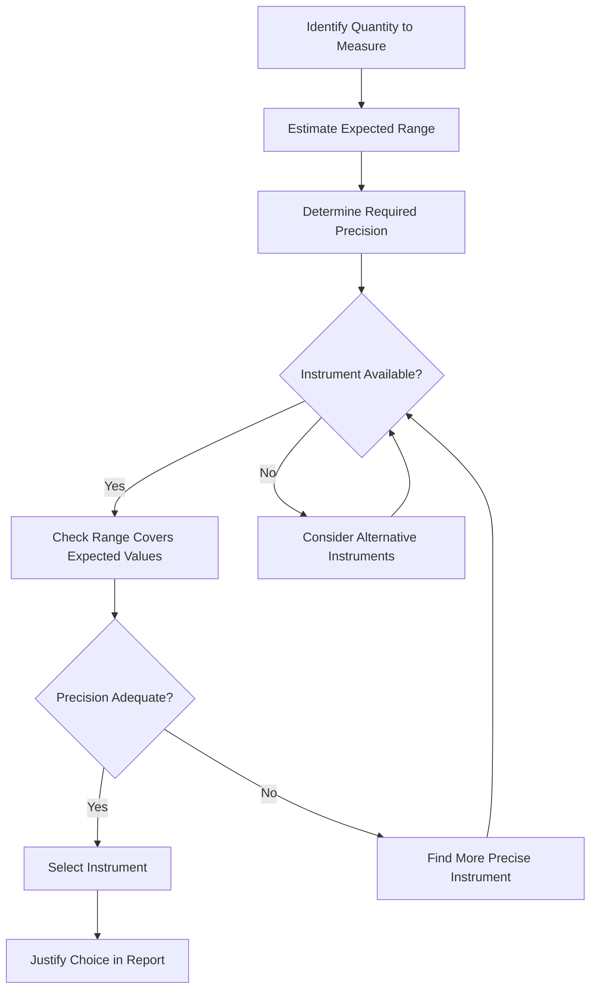

# 1. Overview / 概述

**English:**
Choosing Appropriate Apparatus is a fundamental skill in experimental physics that determines the quality and reliability of your data. This sub-topic covers how to select the right equipment for a given experiment, considering factors such as range, precision, sensitivity, and suitability. Making correct apparatus choices directly impacts the accuracy of measurements and the validity of conclusions. This skill is essential for [[Planning and Designing Experiments]] and connects closely to [[Identifying Variables (Independent, Dependent, Control)]] and [[Writing a Clear Method]].

**中文:**
选择合适的实验仪器是实验物理中的基本技能，它决定了数据的质量和可靠性。本子知识点涵盖如何为给定实验选择正确的设备，考虑量程、精度、灵敏度和适用性等因素。正确的仪器选择直接影响测量的准确性和结论的有效性。这项技能对于[[Planning and Designing Experiments]]至关重要，并与[[Identifying Variables (Independent, Dependent, Control)]]和[[Writing a Clear Method]]密切相关。

---

# 2. Syllabus Learning Objectives / 考纲学习目标

| CAIE 9702 | Edexcel IAL |
|-----------|-------------|
| Select and use appropriate apparatus for experiments | Select and use appropriate apparatus for experiments |
| Choose instruments with suitable range and precision | Choose instruments with suitable range and precision |
| Justify choice of apparatus in experimental contexts | Justify choice of apparatus in experimental contexts |

**Examiner Expectations / 考官期望:**
- **English:** You must be able to identify the most suitable apparatus for measuring specific quantities, justify your choices, and explain why alternative equipment would be less appropriate. Examiners look for awareness of precision, range, and practical limitations.
- **中文:** 你必须能够识别测量特定量的最合适仪器，证明你的选择合理，并解释为什么替代设备不太合适。考官期望你了解精度、量程和实际限制。

---

# 3. Core Definitions / 核心定义

| Term (EN/CN) | Definition (EN) | Definition (CN) | Common Mistakes / 常见错误 |
|--------------|-----------------|-----------------|---------------------------|
| **Apparatus** / 实验仪器 | The equipment and tools used to perform an experiment | 用于进行实验的设备和工具 | Confusing apparatus with materials (e.g., using "beaker" when "measuring cylinder" is needed) |
| **Range** / 量程 | The maximum and minimum values an instrument can measure | 仪器可以测量的最大值和最小值 | Choosing an instrument with too small a range for the expected values |
| **Precision** / 精度 | The smallest change in quantity that an instrument can detect (smallest scale division) | 仪器能检测到的最小量变化（最小刻度） | Confusing precision with accuracy; assuming smaller divisions always mean better results |
| **Sensitivity** / 灵敏度 | The ability of an instrument to detect small changes in the measured quantity | 仪器检测被测量微小变化的能力 | Using a sensitive instrument when the quantity changes rapidly |
| **Resolution** / 分辨力 | The smallest difference in readings that can be distinguished | 可以区分的读数之间的最小差异 | Interchangeable with precision in many contexts, but resolution refers to digital displays |
| **Suitability** / 适用性 | How well an instrument meets the requirements of the experiment | 仪器满足实验要求的程度 | Choosing based on availability rather than experimental needs |

---

# 4. Key Concepts Explained / 关键概念详解

## 4.1 Range and Precision Trade-off / 量程与精度的权衡

### Explanation / 解释
**English:** There is often an inverse relationship between range and precision. Instruments with a larger range typically have larger scale divisions (lower precision), while instruments with a smaller range have finer divisions (higher precision). For example, a 1-meter ruler has 1 mm divisions (precision 0.001 m) but a range of 1 m, while a 30 cm ruler also has 1 mm divisions but a smaller range. A micrometer screw gauge has precision of 0.01 mm but a range of only 25 mm. You must choose an instrument whose range covers the expected values while providing adequate precision for the required uncertainty.

**中文:** 量程和精度之间通常存在反比关系。量程较大的仪器通常具有较大的刻度（精度较低），而量程较小的仪器具有更精细的刻度（精度较高）。例如，1米尺有1毫米刻度（精度0.001米），量程为1米，而30厘米尺也有1毫米刻度，但量程较小。千分尺的精度为0.01毫米，但量程仅为25毫米。你必须选择量程覆盖预期值同时为所需不确定度提供足够精度的仪器。

### Physical Meaning / 物理意义
**English:** The choice of apparatus determines the smallest measurable change and the maximum value you can record. This directly affects the [[Uncertainties and Errors]] in your experiment.

**中文:** 仪器的选择决定了最小可测量变化和你能记录的最大值。这直接影响实验中的[[Uncertainties and Errors]]。

### Common Misconceptions / 常见误区
- **English:** "A more precise instrument is always better." — False. If the quantity changes rapidly, a very sensitive instrument may give unstable readings.
- **中文:** "更精密的仪器总是更好。" — 错误。如果量变化很快，非常灵敏的仪器可能给出不稳定的读数。
- **English:** "Any ruler can measure any length." — False. The ruler must be long enough to measure the full length without repositioning.
- **中文:** "任何尺子都能测量任何长度。" — 错误。尺子必须足够长，无需重新定位即可测量全长。

### Exam Tips / 考试提示
- **English:** Always state both the range AND precision when justifying apparatus choice. Example: "A 30 cm ruler with 1 mm divisions is suitable because the length to be measured is 25 cm, and the required precision is ±1 mm."
- **中文:** 在证明仪器选择合理时，始终同时说明量程和精度。例如："使用具有1毫米刻度的30厘米尺是合适的，因为要测量的长度为25厘米，所需精度为±1毫米。"

> 📷 **IMAGE PROMPT — RANGE-PRECISION: Comparison of Measuring Instruments**
> A side-by-side comparison of a 1-meter ruler (1 mm divisions), a 30 cm ruler (1 mm divisions), a micrometer screw gauge (0.01 mm precision, 25 mm range), and a vernier caliper (0.1 mm precision, 150 mm range). Each instrument should have its range and precision clearly labeled with arrows and text annotations. The image should visually demonstrate the trade-off between range and precision.

## 4.2 Types of Apparatus for Common Measurements / 常见测量的仪器类型

### Explanation / 解释
**English:** Different quantities require specific types of apparatus. For length measurements: rulers (1 mm precision), vernier calipers (0.1 mm), micrometers (0.01 mm). For time: stopwatches (0.01 s or 0.1 s), light gates (0.001 s). For mass: digital balances (0.01 g or 0.001 g). For electrical quantities: ammeters, voltmeters, multimeters. For temperature: thermometers (0.1°C or 0.5°C), thermocouples. For force: newton meters, force sensors.

**中文:** 不同的量需要特定类型的仪器。长度测量：尺子（1毫米精度）、游标卡尺（0.1毫米）、千分尺（0.01毫米）。时间：秒表（0.01秒或0.1秒）、光门（0.001秒）。质量：数字天平（0.01克或0.001克）。电学量：电流表、电压表、万用表。温度：温度计（0.1°C或0.5°C）、热电偶。力：牛顿计、力传感器。

### Physical Meaning / 物理意义
**English:** The choice of apparatus must match the physical quantity being measured and the expected magnitude of that quantity.

**中文:** 仪器的选择必须与被测量的物理量以及该量的预期大小相匹配。

### Common Misconceptions / 常见误区
- **English:** "A stopwatch is always the best for timing." — False. For very short times (<1 s), light gates are more appropriate.
- **中文:** "秒表总是计时的最佳选择。" — 错误。对于非常短的时间（<1秒），光门更合适。
- **English:** "Any thermometer works for any temperature range." — False. Mercury thermometers cannot measure below -39°C; alcohol thermometers are needed for lower temperatures.
- **中文:** "任何温度计都适用于任何温度范围。" — 错误。水银温度计不能测量低于-39°C的温度；需要酒精温度计用于更低的温度。

### Exam Tips / 考试提示
- **English:** Know the typical precision of common instruments: ruler ±1 mm, vernier caliper ±0.1 mm, micrometer ±0.01 mm, stopwatch ±0.1 s, digital balance ±0.01 g.
- **中文:** 了解常见仪器的典型精度：尺子±1毫米，游标卡尺±0.1毫米，千分尺±0.01毫米，秒表±0.1秒，数字天平±0.01克。

## 4.3 Justifying Apparatus Choices / 证明仪器选择合理

### Explanation / 解释
**English:** When justifying apparatus choices in exam answers, you must provide a clear rationale. The justification should include: (1) The quantity to be measured, (2) The expected range of values, (3) The required precision, (4) Why the chosen instrument meets these requirements, (5) Why alternative instruments are less suitable. For example: "A 30 cm ruler with 1 mm divisions is chosen to measure the extension of a spring (expected range 0-20 cm). The 1 mm precision is sufficient because the expected extension changes are at least 5 mm. A micrometer would be too precise and have insufficient range."

**中文:** 在考试答案中证明仪器选择合理时，必须提供清晰的理由。理由应包括：(1) 要测量的量，(2) 预期值范围，(3) 所需精度，(4) 为什么所选仪器满足这些要求，(5) 为什么替代仪器不太合适。例如："选择具有1毫米刻度的30厘米尺来测量弹簧的伸长量（预期范围0-20厘米）。1毫米的精度足够，因为预期的伸长变化至少为5毫米。千分尺过于精密且量程不足。"

### Physical Meaning / 物理意义
**English:** Justification demonstrates understanding of how apparatus characteristics affect experimental outcomes and [[Uncertainties and Errors]].

**中文:** 证明合理性展示了对仪器特性如何影响实验结果和[[Uncertainties and Errors]]的理解。

### Common Misconceptions / 常见误区
- **English:** "Just saying 'it's precise enough' is sufficient." — False. You must quantify the precision and compare it to the required uncertainty.
- **中文:** "只说'它足够精确'就够了。" — 错误。你必须量化精度并将其与所需不确定度进行比较。
- **English:** "Any instrument with the right range works." — False. You must also consider precision, sensitivity, and practical factors like ease of use.
- **中文:** "任何具有正确量程的仪器都适用。" — 错误。你还必须考虑精度、灵敏度和实际因素，如易用性。

### Exam Tips / 考试提示
- **English:** Use the formula: Required precision ≤ (expected change) / 10. For example, if expected change is 5 cm, required precision is at least 0.5 cm.
- **中文:** 使用公式：所需精度 ≤ (预期变化) / 10。例如，如果预期变化为5厘米，所需精度至少为0.5厘米。

---

# 5. Essential Equations / 核心公式

## 5.1 Precision Requirement / 精度要求

$$ \text{Required Precision} \leq \frac{\text{Expected Minimum Change}}{10} $$

| Symbol (符号) | Meaning (EN) | Meaning (CN) | Unit (单位) |
|--------------|-------------|-------------|------------|
| Required Precision | The smallest division needed on the instrument | 仪器上所需的最小刻度 | Same as measured quantity |
| Expected Minimum Change | The smallest change in the measured quantity you expect to detect | 你期望检测到的被测量的最小变化 | Same as measured quantity |

**Derivation / 推导:** This is a rule of thumb used in experimental design to ensure that the instrument can detect changes with reasonable certainty. It ensures that the uncertainty in each reading is at most 10% of the smallest change you want to measure.

**Conditions / 适用条件:**
- **English:** Applies when you need to detect changes in a quantity. Not applicable for single measurements.
- **中文:** 适用于需要检测量的变化时。不适用于单次测量。

**Limitations / 局限性:**
- **English:** This is a guideline, not a strict rule. Some experiments may require higher precision (e.g., 1/20 of the change) or can tolerate lower precision.
- **中文:** 这是一个指导原则，不是严格规则。某些实验可能需要更高的精度（例如变化的1/20）或可以容忍较低的精度。

## 5.2 Percentage Uncertainty from Apparatus / 仪器引起的百分比不确定度

$$ \text{Percentage Uncertainty} = \frac{\text{Smallest Scale Division}}{\text{Measured Value}} \times 100\% $$

| Symbol (符号) | Meaning (EN) | Meaning (CN) | Unit (单位) |
|--------------|-------------|-------------|------------|
| Smallest Scale Division | The smallest increment the instrument can measure | 仪器能测量的最小增量 | Same as measured quantity |
| Measured Value | The reading obtained from the instrument | 从仪器获得的读数 | Same as measured quantity |

**Derivation / 推导:** This comes from the definition of percentage uncertainty in [[Uncertainties and Errors]].

**Conditions / 适用条件:**
- **English:** For analogue instruments, the uncertainty is typically ± half the smallest scale division. For digital instruments, it's ± the last digit.
- **中文:** 对于模拟仪器，不确定度通常为±最小刻度的一半。对于数字仪器，为±最后一位数字。

**Limitations / 局限性:**
- **English:** This assumes the only source of uncertainty is the instrument's resolution. Other sources (e.g., parallax, zero error) may contribute.
- **中文:** 这假设不确定度的唯一来源是仪器的分辨力。其他来源（如视差、零误差）可能也有贡献。

---

# 6. Graphs and Relationships / 图表与关系

## 6.1 Apparatus Selection Flowchart / 仪器选择流程图

### Axes / 坐标轴
- **English:** Not applicable (flowchart, not a graph)
- **中文:** 不适用（流程图，不是图表）

### Shape / 形状
- **English:** Decision tree showing the selection process
- **中文:** 显示选择过程的决策树

### Gradient Meaning / 斜率含义
- **English:** Not applicable
- **中文:** 不适用

### Area Meaning / 面积含义
- **English:** Not applicable
- **中文:** 不适用

### Exam Interpretation / 考试解读
- **English:** Examiners may ask you to describe the steps you would take to select appropriate apparatus. A flowchart helps organize your thinking.
- **中文:** 考官可能要求你描述选择合适仪器的步骤。流程图有助于组织你的思路。

> 📷 **IMAGE PROMPT — FLOWCHART: Apparatus Selection Process**
> A clean, professional flowchart showing the decision-making process for selecting appropriate apparatus. Start with "Identify Quantity to Measure" at the top, then "Estimate Expected Range", "Determine Required Precision", a diamond decision node "Instrument Available?", then "Check Range Covers Expected Values", another diamond "Precision Adequate?", leading to "Select Instrument" and "Justify Choice in Report". Use blue boxes for actions, green diamonds for decisions, and arrows connecting them. The flowchart should be easy to read and suitable for A-Level physics students.

---

# 7. Required Diagrams / 必备图表

## 7.1 Common Laboratory Instruments with Precision Labels / 常见实验室仪器及精度标注

### Description / 描述
**English:** A diagram showing common laboratory instruments (ruler, vernier caliper, micrometer, stopwatch, digital balance, thermometer, ammeter, voltmeter) with their typical precision values labeled.

**中文:** 显示常见实验室仪器（尺子、游标卡尺、千分尺、秒表、数字天平、温度计、电流表、电压表）及其典型精度值的图表。

### Image Prompt / 图片生成提示
> 📷 **IMAGE PROMPT — INSTRUMENTS: Common Lab Apparatus with Precision**
> A clean, educational illustration showing eight common laboratory instruments arranged in a grid. Each instrument should be clearly drawn with its name and typical precision labeled below: (1) 30 cm ruler - ±1 mm, (2) Vernier caliper - ±0.1 mm, (3) Micrometer screw gauge - ±0.01 mm, (4) Digital stopwatch - ±0.01 s, (5) Digital balance - ±0.01 g, (6) Mercury thermometer - ±0.5°C, (7) Analogue ammeter - ±0.1 A, (8) Analogue voltmeter - ±0.1 V. Use a white background with clear, bold labels. The style should be suitable for educational materials.

### Labels Required / 需要标注
- **English:** Instrument name, typical precision value, measurement type (length, time, mass, temperature, current, voltage)
- **中文:** 仪器名称、典型精度值、测量类型（长度、时间、质量、温度、电流、电压）

### Exam Importance / 考试重要性
- **English:** High. Students must be able to identify instruments and state their precision from memory.
- **中文:** 高。学生必须能够识别仪器并从记忆中说出其精度。

## 7.2 Range and Precision Comparison Diagram / 量程与精度比较图

### Description / 描述
**English:** A diagram comparing three instruments for measuring length: a 1-meter ruler (range 1 m, precision 1 mm), a 30 cm ruler (range 30 cm, precision 1 mm), and a micrometer (range 25 mm, precision 0.01 mm). The diagram should show the scale divisions clearly.

**中文:** 比较三种长度测量仪器的图表：1米尺（量程1米，精度1毫米）、30厘米尺（量程30厘米，精度1毫米）和千分尺（量程25毫米，精度0.01毫米）。图表应清晰显示刻度。

### Image Prompt / 图片生成提示
> 📷 **IMAGE PROMPT — RANGE-PRECISION: Length Measurement Instruments Comparison**
> A side-by-side comparison of three length measurement instruments. Left: A 1-meter wooden ruler with millimeter markings clearly visible, labeled "Range: 1 m, Precision: ±1 mm". Center: A 30 cm plastic ruler with millimeter markings, labeled "Range: 30 cm, Precision: ±1 mm". Right: A micrometer screw gauge showing the thimble scale and main scale, labeled "Range: 25 mm, Precision: ±0.01 mm". Below each instrument, show a bar representing the range to scale. Use arrows and text boxes to highlight the trade-off between range and precision. Clean white background, suitable for textbook use.

### Labels Required / 需要标注
- **English:** Instrument name, range value, precision value, scale division size
- **中文:** 仪器名称、量程值、精度值、刻度大小

### Exam Importance / 考试重要性
- **English:** High. Understanding the range-precision trade-off is frequently tested.
- **中文:** 高。理解量程-精度权衡经常被测试。

---

# 8. Worked Examples / 典型例题

## Example 1: Selecting Apparatus for an Oscillation Experiment / 选择振荡实验的仪器

### Question / 题目
**English:** A student wants to measure the period of oscillation of a pendulum. The expected period is about 2 seconds. They need to measure the time for 10 oscillations. Which apparatus should they use for timing, and why? Consider a stopwatch (precision 0.01 s) and a light gate (precision 0.001 s).

**中文:** 一名学生想要测量摆的振荡周期。预期周期约为2秒。他们需要测量10次振荡的时间。他们应该使用哪种计时仪器，为什么？考虑秒表（精度0.01秒）和光门（精度0.001秒）。

### Solution / 解答
**Step 1: Calculate total time to measure**
- Time for 10 oscillations = 10 × 2 s = 20 s

**Step 2: Determine required precision**
- To detect a change of 0.1 s in period (if needed), total time change = 10 × 0.1 s = 1 s
- Required precision ≤ 1 s / 10 = 0.1 s

**Step 3: Evaluate each instrument**
- Stopwatch: precision 0.01 s < 0.1 s ✓, range covers 20 s ✓
- Light gate: precision 0.001 s < 0.1 s ✓, but more complex to set up

**Step 4: Make recommendation**
- A stopwatch is suitable because its precision (0.01 s) is better than required (0.1 s), and it is simple to use. A light gate would also work but is unnecessarily precise and more complicated.

**Step 1: 计算总测量时间**
- 10次振荡的时间 = 10 × 2秒 = 20秒

**Step 2: 确定所需精度**
- 要检测周期0.1秒的变化（如果需要），总时间变化 = 10 × 0.1秒 = 1秒
- 所需精度 ≤ 1秒 / 10 = 0.1秒

**Step 3: 评估每种仪器**
- 秒表：精度0.01秒 < 0.1秒 ✓，量程覆盖20秒 ✓
- 光门：精度0.001秒 < 0.1秒 ✓，但设置更复杂

**Step 4: 提出建议**
- 秒表是合适的，因为其精度（0.01秒）优于所需精度（0.1秒），且使用简单。光门也可以工作，但过于精密且更复杂。

### Final Answer / 最终答案
**Answer:** A stopwatch with 0.01 s precision is the most appropriate choice because it provides sufficient precision (0.01 s < required 0.1 s), has adequate range (0-20 s), and is simple to use. | **答案：** 精度为0.01秒的秒表是最合适的选择，因为它提供了足够的精度（0.01秒 < 所需0.1秒），有足够的量程（0-20秒），且使用简单。

### Quick Tip / 提示
- **English:** Always calculate the required precision before choosing an instrument. Don't automatically choose the most precise option.
- **中文:** 在选择仪器之前，始终先计算所需精度。不要自动选择最精密的选项。

## Example 2: Selecting Apparatus for a Spring Extension Experiment / 选择弹簧伸长实验的仪器

### Question / 题目
**English:** In an experiment to investigate Hooke's law, a student applies masses from 0 to 500 g to a spring and measures the extension. The expected extension range is 0-25 cm. Which apparatus should they use to measure length, and why? Consider a 1-meter ruler (1 mm divisions), a 30 cm ruler (1 mm divisions), and a micrometer (0.01 mm precision, 25 mm range).

**中文:** 在探究胡克定律的实验中，学生向弹簧施加0到500克的质量并测量伸长量。预期伸长量范围为0-25厘米。他们应该使用哪种仪器测量长度，为什么？考虑1米尺（1毫米刻度）、30厘米尺（1毫米刻度）和千分尺（0.01毫米精度，25毫米量程）。

### Solution / 解答
**Step 1: Identify the quantity and range**
- Quantity: extension (length)
- Expected range: 0-25 cm

**Step 2: Determine required precision**
- Expected minimum change in extension: about 0.5 cm (for 50 g mass increments)
- Required precision ≤ 0.5 cm / 10 = 0.05 cm = 0.5 mm

**Step 3: Evaluate each instrument**
- 1-meter ruler: precision 1 mm > 0.5 mm ✗ (not precise enough)
- 30 cm ruler: precision 1 mm > 0.5 mm ✗ (not precise enough)
- Micrometer: precision 0.01 mm < 0.5 mm ✓, but range 25 mm = 2.5 cm < 25 cm ✗ (range too small)

**Step 4: Make recommendation**
- None of the given instruments are ideal. A vernier caliper (precision 0.1 mm, range 15 cm) would be more suitable. If only these options exist, the 30 cm ruler is the best compromise, but the student should use larger mass increments (e.g., 100 g) to ensure detectable changes.

**Step 1: 确定量和量程**
- 量：伸长量（长度）
- 预期范围：0-25厘米

**Step 2: 确定所需精度**
- 预期最小伸长变化：约0.5厘米（对于50克质量增量）
- 所需精度 ≤ 0.5厘米 / 10 = 0.05厘米 = 0.5毫米

**Step 3: 评估每种仪器**
- 1米尺：精度1毫米 > 0.5毫米 ✗（不够精确）
- 30厘米尺：精度1毫米 > 0.5毫米 ✗（不够精确）
- 千分尺：精度0.01毫米 < 0.5毫米 ✓，但量程25毫米 = 2.5厘米 < 25厘米 ✗（量程太小）

**Step 4: 提出建议**
- 给定的仪器都不理想。游标卡尺（精度0.1毫米，量程15厘米）更合适。如果只有这些选项，30厘米尺是最好的折衷方案，但学生应使用更大的质量增量（例如100克）以确保可检测的变化。

### Final Answer / 最终答案
**Answer:** None of the given instruments are fully suitable. A vernier caliper (precision 0.1 mm, range 15 cm) would be ideal. If forced to choose, the 30 cm ruler is the best option, but larger mass increments should be used. | **答案：** 给定的仪器都不完全合适。游标卡尺（精度0.1毫米，量程15厘米）是理想的。如果必须选择，30厘米尺是最好的选择，但应使用更大的质量增量。

### Quick Tip / 提示
- **English:** Sometimes no single instrument is perfect. In such cases, suggest the best compromise and explain how to adjust the experiment to work with it.
- **中文：** 有时没有单一的仪器是完美的。在这种情况下，建议最佳折衷方案并解释如何调整实验以适应它。

---

# 9. Past Paper Question Types / 历年真题题型

| Question Type / 题型 | Frequency / 频率 | Difficulty / 难度 | Past Paper References / 真题索引 |
|----------------------|------------------|------------------|-------------------------------|
| Multiple choice: selecting correct apparatus | Medium | Easy | 📝 *待填入* |
| Short answer: justifying apparatus choice | High | Medium | 📝 *待填入* |
| Design question: describe apparatus needed | High | Medium-Hard | 📝 *待填入* |
| Error analysis: how apparatus choice affects uncertainty | Medium | Medium | 📝 *待填入* |
| Comparison: why one instrument is better than another | Medium | Medium | 📝 *待填入* |

**Common Command Words / 常见指令词:**
- **English:** "State", "Suggest", "Justify", "Explain why", "Compare", "Describe the apparatus"
- **中文:** "说明"、"建议"、"证明合理"、"解释为什么"、"比较"、"描述仪器"

---

# 10. Practical Skills Connections / 实验技能链接

**English:**
Choosing appropriate apparatus is directly tested in practical papers (CAIE Paper 3/5, Edexcel U3/U6). Key connections include:

1. **Measurements:** The apparatus you choose determines the precision of your measurements and the [[Uncertainties and Errors]] in your data.
2. **Graph Plotting:** Apparatus choice affects the range and number of data points you can collect, which impacts graph quality.
3. **Experimental Design:** In design questions, you must list all apparatus needed and justify each choice.
4. **Risk Assessment:** Some apparatus (e.g., mercury thermometers, lasers) require special safety considerations (see [[Risk Assessment and Safety Considerations]]).
5. **Preliminary Experiments:** You may need to test different apparatus in [[Preliminary Experiments and Range Finding]] to determine the best choice.

**中文:**
选择合适的仪器在实验考试中直接测试（CAIE Paper 3/5, Edexcel U3/U6）。关键联系包括：

1. **测量：** 你选择的仪器决定了测量的精度和数据的[[Uncertainties and Errors]]。
2. **绘图：** 仪器选择影响你能收集的数据点的范围和数量，这影响图表质量。
3. **实验设计：** 在设计题中，你必须列出所有需要的仪器并证明每个选择的合理性。
4. **风险评估：** 某些仪器（如水银温度计、激光）需要特殊的安全考虑（参见[[Risk Assessment and Safety Considerations]]）。
5. **初步实验：** 你可能需要在[[Preliminary Experiments and Range Finding]]中测试不同的仪器以确定最佳选择。

---

# 11. Concept Map / 概念图谱

```mermaid
graph TD
    A[Choosing Appropriate Apparatus] --> B[Consider Range]
    A --> C[Consider Precision]
    A --> D[Consider Sensitivity]
    A --> E[Consider Practical Factors]
    
    B --> F[Expected Values]
    B --> G[Maximum/Minimum]
    
    C --> H[Smallest Scale Division]
    C --> I[Required Uncertainty]
    
    D --> J[Detect Small Changes]
    D --> K[Stability of Readings]
    
    E --> L[Ease of Use]
    E --> M[Availability]
    E --> N[Safety]
    
    A --> O[Common Instruments]
    O --> P[Ruler ±1 mm]
    O --> Q[Vernier Caliper ±0.1 mm]
    O --> R[Micrometer ±0.01 mm]
    O --> S[Stopwatch ±0.01 s]
    O --> T[Digital Balance ±0.01 g]
    O --> U[Thermometer ±0.5°C]
    
    A --> V[Justification]
    V --> W[Quantify Precision]
    V --> X[Compare to Requirements]
    V --> Y[Explain Alternatives]
    
    A --> Z[Link to Uncertainties]
    Z --> AA[[Uncertainties and Errors]]
    
    A --> AB[Link to Experiment Design]
    AB --> AC[[Planning and Designing Experiments]]
    AB --> AD[[Writing a Clear Method]]
```

---

# 12. Quick Revision Sheet / 速查表

| Category / 类别 | Key Points / 要点 |
|----------------|------------------|
| **Definition / 定义** | Choosing apparatus based on range, precision, sensitivity, and suitability for the experiment / 根据量程、精度、灵敏度和实验适用性选择仪器 |
| **Key Formula / 核心公式** | Required Precision ≤ Expected Minimum Change / 10; Percentage Uncertainty = (Scale Division / Reading) × 100% / 所需精度 ≤ 预期最小变化 / 10；百分比不确定度 = (刻度 / 读数) × 100% |
| **Key Instruments / 关键仪器** | Ruler ±1 mm, Vernier caliper ±0.1 mm, Micrometer ±0.01 mm, Stopwatch ±0.01 s, Digital balance ±0.01 g, Thermometer ±0.5°C / 尺子±1毫米，游标卡尺±0.1毫米，千分尺±0.01毫米，秒表±0.01秒，数字天平±0.01克，温度计±0.5°C |
| **Key Graph / 核心图表** | Apparatus Selection Flowchart (decision tree) / 仪器选择流程图（决策树） |
| **Exam Tip / 考试提示** | Always justify with BOTH range AND precision. Use the "required precision ≤ change/10" rule. Know typical instrument precisions from memory. / 始终用量程和精度两者来证明合理性。使用"所需精度 ≤ 变化/10"规则。从记忆中知道典型仪器精度。 |
| **Common Mistake / 常见错误** | Choosing the most precise instrument without checking range; forgetting to consider practical factors like ease of use / 选择最精密的仪器而不检查量程；忘记考虑实际因素如易用性 |
| **Link to Other Topics / 与其他主题的联系** | [[Uncertainties and Errors]], [[Planning and Designing Experiments]], [[Writing a Clear Method]], [[Identifying Variables (Independent, Dependent, Control)]] |