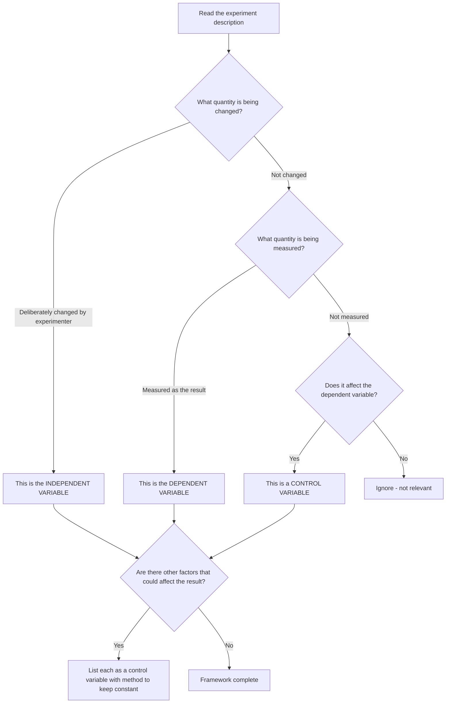

# 1. Overview / 概述

**English:**
Identifying variables is the foundational skill in experimental design. Before any experiment can be planned, you must clearly distinguish between three types of variables: the **independent variable** (what you change), the **dependent variable** (what you measure), and **control variables** (what you keep constant). This sub-topic teaches you how to correctly identify and state each variable type in any experimental context. Mastering this skill is essential because it directly determines the structure of your method, the choice of apparatus, and the validity of your conclusions. It forms the logical backbone of all practical work in [[Planning and Designing Experiments]].

**中文:**
识别变量是实验设计中的基础技能。在任何实验开始之前，你必须清楚区分三种变量：**自变量**（你改变的量）、**因变量**（你测量的量）和**控制变量**（你保持恒定的量）。本子知识点教你如何在任何实验情境中正确识别和陈述每种变量类型。掌握这项技能至关重要，因为它直接决定了你的方法结构、仪器选择以及结论的有效性。它是所有[[Planning and Designing Experiments]]实践工作的逻辑基础。

---

# 2. Syllabus Learning Objectives / 考纲学习目标

| CAIE 9702 | Edexcel IAL |
|-----------|-------------|
| Identify the independent variable, dependent variable, and control variables in an experiment | Identify the independent variable, dependent variable, and control variables in an experiment |
| State how control variables are kept constant | Describe how control variables are maintained |
| Explain why control variables are important for valid results | Justify the selection of control variables |

**Examiner Expectations:**
- **English:** You must state each variable clearly using the format: "Independent variable: [quantity] changed by [method]". Control variables must be listed with specific methods for keeping them constant. Vague statements like "keep everything else the same" receive zero marks.
- **中文:** 你必须使用以下格式清晰地陈述每个变量："自变量：[物理量]通过[方法]改变"。控制变量必须列出并说明保持其恒定的具体方法。模糊的陈述如"保持其他一切不变"将不得分。

---

# 3. Core Definitions / 核心定义

| Term (EN/CN) | Definition (EN) | Definition (CN) | Common Mistakes / 常见错误 |
|--------------|-----------------|-----------------|---------------------------|
| **Independent Variable** / 自变量 | The variable that is deliberately changed or selected by the experimenter to observe its effect on the dependent variable. | 实验者有意改变或选择的变量，以观察其对因变量的影响。 | Confusing with dependent variable. E.g., in "investigating how length affects period of a pendulum", some students say "period" is independent. |
| **Dependent Variable** / 因变量 | The variable that is measured or observed; its value depends on changes in the independent variable. | 被测量或观察的变量；其值取决于自变量的变化。 | Thinking it's the "result" without linking to measurement. |
| **Control Variable** / 控制变量 | A variable that is kept constant throughout the experiment to ensure a fair test and valid results. | 在整个实验中保持恒定的变量，以确保公平测试和有效结果。 | Listing too few or forgetting to state HOW to keep it constant. |
| **Fair Test** / 公平测试 | An experiment where only the independent variable affects the dependent variable; all other variables are controlled. | 只有自变量影响因变量的实验；所有其他变量都受到控制。 | Thinking "fair test" means equal treatment of all variables. |
| **Confounding Variable** / 混杂变量 | An uncontrolled variable that unintentionally affects the dependent variable, leading to invalid conclusions. | 一个未受控制的变量，无意中影响因变量，导致无效结论。 | Not recognizing that a poorly controlled variable becomes a confounding variable. |

---

# 4. Key Concepts Explained / 关键概念详解

## 4.1 The Three-Variable Framework / 三变量框架

### Explanation / 解释
**English:** Every experiment can be analyzed using the **IV-DV-CV** framework. The **independent variable (IV)** is the cause — what you intentionally change. The **dependent variable (DV)** is the effect — what you measure as a result. **Control variables (CVs)** are all other factors that could affect the DV; you must keep them constant to isolate the effect of the IV. This framework is the foundation of [[Writing a Clear Method]] and [[Choosing Appropriate Apparatus]].

**中文:** 每个实验都可以用**自变量-因变量-控制变量**框架来分析。**自变量**是原因——你有意改变的量。**因变量**是结果——你因此测量的量。**控制变量**是所有其他可能影响因变量的因素；你必须保持它们恒定，以隔离自变量的影响。这个框架是[[Writing a Clear Method]]和[[Choosing Appropriate Apparatus]]的基础。

### Physical Meaning / 物理意义
**English:** The IV-DV relationship represents cause and effect in physical systems. For example, changing the temperature of a gas (IV) causes its pressure to change (DV). Control variables (like volume and amount of gas) must be fixed to ensure that the pressure change is solely due to temperature. This reflects the principle of controlled experimentation in physics.

**中文:** 自变量-因变量关系代表了物理系统中的因果关系。例如，改变气体的温度（自变量）会导致其压力变化（因变量）。控制变量（如气体体积和量）必须固定，以确保压力变化完全由温度引起。这反映了物理中受控实验的原则。

### Common Misconceptions / 常见误区
- **English:**
  - Thinking the independent variable is "what you measure" — it's what you CHANGE, not measure.
  - Confusing control variables with the control experiment (a separate test).
  - Believing that "time" is always a control variable — time can be IV, DV, or CV depending on context.
- **中文:**
  - 认为自变量是"你测量的量"——自变量是你改变的，而不是测量的。
  - 混淆控制变量与对照实验（一个单独的测试）。
  - 认为"时间"总是控制变量——时间可以是自变量、因变量或控制变量，取决于情境。

### Exam Tips / 考试提示
- **English:** Always use the exact wording: "Independent variable: [quantity]". For control variables, state BOTH the variable AND how you keep it constant (e.g., "Temperature: kept constant by using a water bath").
- **中文:** 始终使用准确的措辞："自变量：[物理量]"。对于控制变量，同时说明变量和如何保持恒定（例如："温度：通过使用水浴保持恒定"）。

> 📷 **IMAGE PROMPT — IV-DV-CV: Three Variable Framework Diagram**
> A clear diagram showing three labeled boxes: "Independent Variable (IV) — What I Change" (left), "Dependent Variable (DV) — What I Measure" (right), and "Control Variables (CV) — What I Keep Constant" (bottom). Arrows show IV affecting DV, with CVs shown as barriers blocking other influences. Use a simple pendulum example: Length (IV) → Period (DV), with mass and amplitude as CVs.

---

# 5. Essential Equations / 核心公式

**Note:** There are no specific equations for identifying variables. However, the relationship between variables is often expressed as:

$$ \text{DV} = f(\text{IV}) \quad \text{with CVs held constant} $$

| Symbol (符号) | Meaning (EN) | Meaning (CN) | Unit (单位) |
|--------------|-------------|-------------|------------|
| DV | Dependent variable | 因变量 | Varies by context |
| IV | Independent variable | 自变量 | Varies by context |
| CV | Control variable(s) | 控制变量 | Varies by context |
| $f$ | Functional relationship | 函数关系 | N/A |

**Derivation / 推导:** Not applicable — this is a conceptual framework, not a derived equation.

**Conditions / 适用条件:**
- **English:** This framework applies to all controlled experiments where cause-and-effect relationships are investigated.
- **中文:** 该框架适用于所有研究因果关系的受控实验。

**Limitations / 局限性:**
- **English:** In some experiments (e.g., observational studies), variables cannot be directly controlled. In multi-variable experiments, more complex designs (e.g., factorial designs) are needed.
- **中文:** 在某些实验中（如观察性研究），变量无法直接控制。在多变量实验中，需要更复杂的设计（如析因设计）。

---

# 6. Graphs and Relationships / 图表与关系

## 6.1 Variable Identification Flowchart / 变量识别流程图

### Axes / 坐标轴
- **English:** Not a graph — this is a decision flowchart for identifying variables.
- **中文:** 不是图表——这是一个用于识别变量的决策流程图。

### Shape / 形状
- **English:** A flowchart with decision diamonds and action boxes.
- **中文:** 带有决策菱形和操作框的流程图。

### Gradient Meaning / 斜率含义
- **English:** N/A — flowchart has no gradient.
- **中文:** 不适用——流程图没有斜率。

### Area Meaning / 面积含义
- **English:** N/A — flowchart has no area.
- **中文:** 不适用——流程图没有面积。

### Exam Interpretation / 考试解读
- **English:** Use this flowchart to systematically identify variables in any exam question.
- **中文:** 使用此流程图系统性地识别任何考试题目中的变量。

---

# 7. Required Diagrams / 必备图表

## 7.1 Variable Identification Table / 变量识别表

### Description / 描述
**English:** A structured table template used to systematically identify and record all three variable types for any experiment. This is the standard format expected in exam answers.

**中文:** 一个结构化的表格模板，用于系统性地识别和记录任何实验的所有三种变量类型。这是考试答案中预期的标准格式。

### Image Prompt / 图片生成提示
> 📷 **IMAGE PROMPT — VAR-TABLE: Variable Identification Table Template**
> A clean, professional table with three rows labeled "Independent Variable", "Dependent Variable", and "Control Variables". The table has two columns: "Variable Name" and "How it is changed/measured/controlled". The control variables row shows 3-4 example entries with specific methods. Use a pendulum experiment as the example: IV = Length (changed by adjusting string), DV = Period (measured with stopwatch), CVs = Mass (same bob), Amplitude (small angle), Release method (gentle release). Use blue headers and white rows.

### Labels Required / 需要标注
- **English:** Independent Variable, Dependent Variable, Control Variables, Variable Name, How it is changed/measured/controlled
- **中文:** 自变量、因变量、控制变量、变量名称、如何改变/测量/控制

### Exam Importance / 考试重要性
- **English:** HIGH — This table format is directly tested in Paper 3 (CAIE) and Unit 3/6 (Edexcel). Students who use this structured approach consistently score higher marks.
- **中文:** 高——这种表格格式在CAIE Paper 3和Edexcel Unit 3/6中直接考查。使用这种结构化方法的学生 consistently 获得更高分数。

---

# 8. Worked Examples / 典型例题

## Example 1: Pendulum Experiment / 单摆实验

### Question / 题目
**English:** A student investigates how the length of a pendulum affects its period of oscillation. The student changes the length from 20 cm to 100 cm in 10 cm intervals. For each length, the student measures the time for 10 complete oscillations using a stopwatch. The mass of the bob is kept the same, and the amplitude is kept small (less than 10°). Identify the independent variable, dependent variable, and three control variables.

**中文:** 一名学生研究单摆的长度如何影响其摆动周期。学生将长度从20厘米改变到100厘米，间隔10厘米。对于每个长度，学生使用秒表测量10次完整摆动的时间。摆锤质量保持不变，振幅保持较小（小于10°）。请识别自变量、因变量和三个控制变量。

### Solution / 解答

**Step 1: Identify the Independent Variable**
- **English:** The quantity being deliberately changed is the **length of the pendulum**.
- **中文:** 被有意改变的量是**单摆的长度**。

**Step 2: Identify the Dependent Variable**
- **English:** The quantity being measured as a result is the **period of oscillation** (time for one complete swing).
- **中文:** 作为结果被测量的量是**摆动周期**（一次完整摆动的时间）。

**Step 3: Identify Control Variables**
- **English:** Three control variables:
  1. **Mass of the bob** — kept constant by using the same bob throughout.
  2. **Amplitude (angle of release)** — kept small (<10°) by releasing from the same small angle.
  3. **Method of timing** — kept constant by using the same stopwatch and same procedure (timing 10 oscillations).
- **中文:** 三个控制变量：
  1. **摆锤质量** — 通过始终使用同一个摆锤保持恒定。
  2. **振幅（释放角度）** — 通过从相同的小角度释放保持较小（<10°）。
  3. **计时方法** — 通过使用相同的秒表和相同的程序（计时10次摆动）保持恒定。

**Final Table:**

| Variable Type / 变量类型 | Variable Name / 变量名称 | How it is changed/measured/controlled / 如何改变/测量/控制 |
|--------------------------|--------------------------|-----------------------------------------------------------|
| Independent / 自变量 | Length of pendulum / 单摆长度 | Changed by adjusting the string length from 20 cm to 100 cm / 通过调整弦长从20厘米到100厘米改变 |
| Dependent / 因变量 | Period of oscillation / 摆动周期 | Measured by timing 10 oscillations with a stopwatch and dividing by 10 / 通过秒表计时10次摆动并除以10测量 |
| Control / 控制变量 | Mass of bob / 摆锤质量 | Kept constant by using the same bob / 通过使用同一个摆锤保持恒定 |
| Control / 控制变量 | Amplitude / 振幅 | Kept small (<10°) by releasing from the same small angle / 通过从相同的小角度释放保持较小（<10°） |
| Control / 控制变量 | Timing method / 计时方法 | Kept constant by using the same stopwatch and procedure / 通过使用相同的秒表和程序保持恒定 |

### Final Answer / 最终答案
**Answer:** IV = Length of pendulum; DV = Period of oscillation; CVs = Mass of bob, Amplitude, Timing method | **答案：** 自变量 = 单摆长度；因变量 = 摆动周期；控制变量 = 摆锤质量、振幅、计时方法

### Quick Tip / 提示
- **English:** Always state control variables with BOTH the variable name AND the specific method used to keep it constant. "Mass" alone is not enough — say "Mass of bob kept constant by using the same bob throughout".
- **中文:** 始终同时说明控制变量的名称和保持其恒定的具体方法。仅说"质量"是不够的——要说"摆锤质量通过始终使用同一个摆锤保持恒定"。

---

## Example 2: Resistance of a Wire / 金属丝电阻

### Question / 题目
**English:** A student investigates how the length of a wire affects its resistance. The student connects a wire to a circuit with a power supply, ammeter, and voltmeter. The length of the wire is changed from 0.50 m to 2.50 m in 0.50 m intervals. The current is kept constant at 0.50 A by adjusting the power supply. The diameter of the wire and the temperature are kept constant. Identify the independent variable, dependent variable, and control variables.

**中文:** 一名学生研究金属丝的长度如何影响其电阻。学生将金属丝连接到包含电源、电流表和电压表的电路中。金属丝长度从0.50米改变到2.50米，间隔0.50米。通过调节电源将电流保持在0.50安培恒定。金属丝的直径和温度保持恒定。请识别自变量、因变量和控制变量。

### Solution / 解答

**Step 1: Identify the Independent Variable**
- **English:** The quantity being deliberately changed is the **length of the wire**.
- **中文:** 被有意改变的量是**金属丝的长度**。

**Step 2: Identify the Dependent Variable**
- **English:** The quantity being measured is the **resistance of the wire**. Resistance is calculated from the measured voltage and current using $R = V/I$.
- **中文:** 被测量的量是**金属丝的电阻**。电阻通过测量的电压和电流使用$R = V/I$计算。

**Step 3: Identify Control Variables**
- **English:** Three control variables:
  1. **Current** — kept constant at 0.50 A by adjusting the power supply.
  2. **Diameter of the wire** — kept constant by using the same wire throughout.
  3. **Temperature** — kept constant by using a low current and allowing the wire to cool between readings.
- **中文:** 三个控制变量：
  1. **电流** — 通过调节电源保持在0.50安培恒定。
  2. **金属丝直径** — 通过始终使用同一根金属丝保持恒定。
  3. **温度** — 通过使用低电流并在每次读数之间让金属丝冷却保持恒定。

### Final Answer / 最终答案
**Answer:** IV = Length of wire; DV = Resistance of wire; CVs = Current (0.50 A), Diameter of wire, Temperature | **答案：** 自变量 = 金属丝长度；因变量 = 金属丝电阻；控制变量 = 电流（0.50 A）、金属丝直径、温度

### Quick Tip / 提示
- **English:** When resistance is calculated from $V$ and $I$, the dependent variable is resistance, not voltage. The voltmeter reading changes because resistance changes, but resistance is the quantity of interest.
- **中文:** 当电阻通过$V$和$I$计算时，因变量是电阻，而不是电压。电压表读数变化是因为电阻变化，但电阻才是我们关心的量。

---

# 9. Past Paper Question Types / 历年真题题型

| Question Type / 题型 | Frequency / 频率 | Difficulty / 难度 | Past Paper References / 真题索引 |
|----------------------|------------------|------------------|-------------------------------|
| Identify variables from a given experimental description | Very High | Easy | 📝 *待填入* |
| Complete a variable identification table | High | Easy-Medium | 📝 *待填入* |
| Explain why a specific variable must be controlled | Medium | Medium | 📝 *待填入* |
| Identify a confounding variable and suggest how to control it | Low-Medium | Medium-Hard | 📝 *待填入* |
| Justify the choice of control variables | Low | Medium | 📝 *待填入* |

**Common Command Words:**
- **English:** Identify, State, List, Explain, Suggest, Justify
- **中文:** 识别、陈述、列出、解释、建议、证明

---

# 10. Practical Skills Connections / 实验技能链接

**English:**
Identifying variables is the first step in the practical skills cycle. It directly connects to:
- **[[Writing a Clear Method]]:** The method must describe how the IV is changed, how the DV is measured, and how each CV is controlled.
- **[[Choosing Appropriate Apparatus]]:** The IV determines what apparatus is needed to change it; the DV determines what measuring instrument is needed.
- **[[Risk Assessment and Safety Considerations]]:** Control variables often relate to safety (e.g., controlling temperature to prevent burns).
- **[[Preliminary Experiments and Range Finding]]:** Preliminary experiments help identify which variables need to be controlled.
- **[[Uncertainties and Errors]]:** Poorly controlled variables introduce systematic errors.
- **[[Data Recording and Analysis]]:** The IV goes in the first column of a results table; the DV goes in subsequent columns.
- **[[Evaluation and Improvements]]:** If results are unreliable, the first thing to check is whether all control variables were properly maintained.

**中文:**
识别变量是实验技能循环中的第一步。它直接连接到：
- **[[Writing a Clear Method]]：** 方法必须描述如何改变自变量、如何测量因变量以及如何控制每个控制变量。
- **[[Choosing Appropriate Apparatus]]：** 自变量决定了需要什么仪器来改变它；因变量决定了需要什么测量仪器。
- **[[Risk Assessment and Safety Considerations]]：** 控制变量通常与安全相关（例如，控制温度以防止烫伤）。
- **[[Preliminary Experiments and Range Finding]]：** 初步实验有助于识别哪些变量需要控制。
- **[[Uncertainties and Errors]]：** 控制不当的变量会引入系统误差。
- **[[Data Recording and Analysis]]：** 自变量放在结果表的第一列；因变量放在后续列。
- **[[Evaluation and Improvements]]：** 如果结果不可靠，首先要检查的是所有控制变量是否得到妥善维护。

---

# 11. Concept Map / 概念图谱

```mermaid
graph TD
    %% Leaf Node: Identifying Variables
    IV[Identifying Variables] --> IND[Independent Variable]
    IV --> DEP[Dependent Variable]
    IV --> CON[Control Variables]
    
    %% Connections to parent hub
    IV -->|Foundation for| METHOD[[Writing a Clear Method]]
    IV -->|Determines| APPARATUS[[Choosing Appropriate Apparatus]]
    IV -->|Links to| SAFETY[[Risk Assessment and Safety Considerations]]
    IV -->|Informs| PRELIM[[Preliminary Experiments and Range Finding]]
    
    %% Connections to prerequisites
    IV -->|Uses| UNITS[[SI Units, Prefixes and Homogeneity of Equations]]
    IV -->|Affects| ERRORS[[Uncertainties and Errors]]
    
    %% Connections to related topics
    IV -->|First step in| DATA[[Data Recording and Analysis]]
    IV -->|Evaluated in| EVAL[[Evaluation and Improvements]]
    
    %% Detailed connections
    IND -->|Changed by| METHOD
    DEP -->|Measured by| APPARATUS
    CON -->|Maintained by| METHOD
    
    %% Styling
    classDef leaf fill:#e1f5fe,stroke:#01579b,stroke-width:2px;
    classDef hub fill:#fff3e0,stroke:#e65100,stroke-width:2px;
    classDef related fill:#f3e5f5,stroke:#7b1fa2,stroke-width:2px;
    classDef prereq fill:#e8f5e9,stroke:#1b5e20,stroke-width:2px;
    
    class IV leaf;
    class METHOD,APPARATUS,SAFETY,PRELIM hub;
    class DATA,EVAL related;
    class UNITS,ERRORS prereq;
```

---

# 12. Quick Revision Sheet / 速查表

| Category / 类别 | Key Points / 要点 |
|----------------|------------------|
| **Definition / 定义** | IV = what you CHANGE; DV = what you MEASURE; CV = what you KEEP CONSTANT |
| **Key Formula / 核心公式** | DV = f(IV) with CVs held constant (conceptual, not mathematical) |
| **Key Framework / 核心框架** | IV-DV-CV: Cause → Effect with controlled conditions |
| **Common Mistake / 常见错误** | Confusing IV with DV; forgetting to state HOW to control CVs |
| **Exam Tip / 考试提示** | Always use a table format: Variable Name + How it is changed/measured/controlled |
| **Command Words / 指令词** | Identify, State, List, Explain, Suggest, Justify |
| **Connection to Method / 与方法联系** | IV → how to change; DV → how to measure; CV → how to control |
| **Connection to Apparatus / 与仪器联系** | IV determines change apparatus; DV determines measuring instrument |
| **Connection to Errors / 与误差联系** | Poorly controlled CVs → systematic errors → invalid conclusions |
| **Quick Check / 快速检查** | "Am I changing it?" → IV; "Am I measuring it?" → DV; "Could it affect my result?" → CV |

> 📋 **CIE Only:** In CAIE Paper 3, you are often given a partially completed table and must fill in missing variables. Pay attention to the number of marks allocated — each control variable typically earns 1 mark.
>
> 📋 **Edexcel Only:** In Edexcel Unit 3/6, you may be asked to "justify" the selection of control variables, which requires explaining WHY each variable could affect the dependent variable if not controlled.