# 1. Overview / 概述

**English:**
This topic, "Planning and Designing Experiments," is the foundational skill for all practical physics. It covers the systematic process of creating a valid, reliable, and safe experimental procedure to test a hypothesis or investigate a relationship between physical quantities. This is not about memorising specific experiments but about mastering a transferable methodology: identifying variables, selecting appropriate apparatus, writing a clear and replicable method, assessing risks, and conducting preliminary trials. It is the core of the scientific method applied to the A-Level laboratory.

In both Cambridge 9702 (Paper 3 for AS, Paper 5 for A2) and Edexcel IAL (Unit 3 for AS, Unit 6 for A2), this skill is directly assessed. Students are often given an unfamiliar scenario and asked to plan an experiment from scratch. Success requires a deep understanding of [[SI Units, Prefixes and Homogeneity of Equations]] to choose correct instruments and [[Uncertainties and Errors]] to minimise and evaluate measurement quality. Real-world applications include designing quality control tests in manufacturing, planning clinical trials in medicine, and setting up environmental monitoring stations. Mastering this topic transforms a student from a passive follower of instructions into an active, critical investigator.

**中文：**
本主题“实验规划与设计”是所有物理实验的基础技能。它涵盖了创建有效、可靠且安全的实验程序以检验假设或研究物理量之间关系的系统过程。这并非关于记忆特定实验，而是掌握一种可迁移的方法论：识别变量、选择合适的仪器、编写清晰且可复现的方法、评估风险以及进行初步试验。这是应用于A-Level实验室的科学方法的核心。

在剑桥9702（AS的Paper 3，A2的Paper 5）和爱德思IAL（AS的Unit 3，A2的Unit 6）中，这项技能都受到直接评估。学生通常会被给予一个不熟悉的场景，并被要求从头开始规划一个实验。成功需要深入理解[[SI Units, Prefixes and Homogeneity of Equations]]以选择正确的仪器，以及[[Uncertainties and Errors]]以最小化和评估测量质量。现实世界的应用包括设计制造业中的质量控制测试、规划医学中的临床试验以及设置环境监测站。掌握这个主题将学生从被动的指令遵循者转变为主动的、批判性的研究者。

---

# 2. Syllabus Learning Objectives / 考纲学习目标

**English:**
The following table maps the specific learning objectives from both exam boards. While the wording differs, the core competencies are identical: the ability to plan a valid experiment.

**中文：**
下表列出了两个考试局的具体学习目标。虽然措辞不同，但核心能力是相同的：规划有效实验的能力。

| CAIE 9702 (Paper 3 & 5) | Edexcel IAL (Unit 3 & 6) |
|-----------|-------------|
| **Paper 3 (AS):**   - Define the problem, including identifying the independent and dependent variables.   - Select appropriate apparatus and plan how to use it.   - Identify and control other variables.   - Describe the method with sufficient detail for replication.   - Assess the risks of the experiment.   - Describe how to use the apparatus to collect data. | **Unit 3 (AS):**   - Plan an experiment to test a hypothesis.   - Identify the independent, dependent, and control variables.   - Select and justify the use of appropriate equipment.   - Write a detailed, logical method.   - Identify and manage safety hazards.   - Describe how to obtain a range of data. |
| **Paper 5 (A2):**   - Define the problem, including defining the relationship to be investigated.   - Design an experiment, including details of apparatus, procedures, and techniques.   - Identify and manage significant risks.   - Describe how to analyse the data to test the relationship.   - Suggest improvements to the experimental design. | **Unit 6 (A2):**   - Design an experiment to investigate a physical relationship.   - Justify the choice of apparatus and techniques.   - Produce a clear, sequential method.   - Carry out a risk assessment.   - Describe how to process and analyse the results.   - Evaluate the experimental design and suggest modifications. |

> 📋 **CIE Only:** CIE Paper 5 often requires a more detailed description of the data analysis, including the graph to be plotted and how the gradient/intercept will be used to test a given equation. The "Defining the Problem" section explicitly asks for the relationship to be stated.
>
> 📋 **Edexcel Only:** Edexcel Unit 3 and 6 often place a greater emphasis on the justification of equipment choice (e.g., "Why use a micrometer instead of a ruler?"). The "Planning" question is often a standalone question worth a significant number of marks.

**Examiner Expectations / 考官期望:**
- **English:** Examiners look for a logical, sequential plan that a technician could follow. They reward precision in language (e.g., "measure the diameter using a micrometer screw gauge" not "measure the size"). They penalise vague statements like "repeat the experiment" without specifying how many times or why. The plan must be "fit for purpose" – the apparatus must be capable of the required precision.
- **中文：** 考官寻找的是一个逻辑清晰、顺序明确的计划，技术人员可以遵循。他们奖励语言的精确性（例如，“使用千分尺测量直径”而不是“测量大小”）。他们会对模糊的陈述如“重复实验”而不说明次数或原因进行扣分。计划必须“适合目的”——仪器必须能够达到所需的精度。

---

# 3. Core Definitions / 核心定义

**English:**
These definitions are the precise language required for exam answers. Using them correctly demonstrates a deep understanding of experimental design.

**中文：**
这些定义是考试答案所需的精确语言。正确使用它们能展示对实验设计的深刻理解。

| Term (EN/CN) | Definition (EN) | Definition (CN) | Common Mistakes / 常见错误 |
|--------------|-----------------|-----------------|---------------------------|
| **Independent Variable / 自变量** | The quantity that is deliberately changed or selected by the experimenter. | 由实验者有意改变或选择的量。 | Confusing it with the dependent variable. "The thing we measure" is often the dependent variable. |
| **Dependent Variable / 因变量** | The quantity that is measured for each change in the independent variable. Its value depends on the independent variable. | 对于自变量的每次变化而测量的量。其值取决于自变量。 | Thinking it is the "result" without linking it to the independent variable. |
| **Control Variable / 控制变量** | A variable that is kept constant throughout the experiment to ensure a fair test and that only the independent variable affects the dependent variable. | 在整个实验过程中保持不变的变量，以确保公平测试，并确保只有自变量影响因变量。 | Forgetting to state *how* it will be controlled (e.g., "keep temperature constant" is insufficient; "place the apparatus in a water bath at 25°C" is better). |
| **Hypothesis / 假说** | A testable, predictive statement about the relationship between two or more variables. | 关于两个或多个变量之间关系的可检验的预测性陈述。 | Writing a vague aim instead of a specific, testable statement (e.g., "To see if length affects resistance" vs. "As the length of a wire increases, its resistance will increase proportionally"). |
| **Range / 范围** | The set of values over which the independent variable is varied. | 自变量变化的数值集合。 | Choosing a range that is too small to show a clear trend or too large for the apparatus to handle safely. |
| **Interval / 间隔** | The difference between successive values of the independent variable. | 自变量连续值之间的差值。 | Using uneven intervals without justification. |
| **Replicate / 重复测量** | Repeating a measurement under the same conditions to identify anomalies and calculate a mean to reduce the effect of random errors. | 在相同条件下重复测量，以识别异常值并计算平均值，从而减少随机误差的影响。 | Saying "repeat the experiment" without specifying the number of repeats (e.g., "repeat three times for each value"). |
| **Accuracy / 准确度** | How close a measured value is to the true value. | 测量值与真实值的接近程度。 | Confusing with precision. A measurement can be precise (consistent) but inaccurate (systematically wrong). |
| **Precision / 精密度** | How close repeated measurements are to each other. | 重复测量值之间的接近程度。 | Confusing with accuracy. A measurement can be accurate but imprecise (scattered around the true value). |
| **Resolution / 分辨力** | The smallest change in a quantity that an instrument can detect. | 仪器能检测到的量的最小变化。 | Using an instrument with a resolution too low for the expected change (e.g., using a metre ruler to measure a change of 0.5 mm). |
| **Risk Assessment / 风险评估** | The process of identifying potential hazards, evaluating the likelihood and severity of harm, and stating precautions to minimise risk. | 识别潜在危险、评估伤害的可能性和严重性，并说明将风险降至最低的预防措施的过程。 | Only stating the hazard without the precaution (e.g., "Hot water" is not a risk assessment; "Use a beaker tong to handle the hot water beaker" is). |

---

# 4. Key Concepts Explained / 关键概念详解

## 4.1 The Experimental Design Cycle / 实验设计循环

### Explanation / 解释
**English:** Planning an experiment is not a linear list of tasks; it is a cyclical process. You start with a [[Hypothesis]], then design a method to test it. After a [[Preliminary Experiments and Range Finding|preliminary experiment]], you may need to refine your range, interval, or apparatus. This cycle ensures the final plan is robust. The key stages are: 1) Define the Problem, 2) Identify Variables, 3) Select Apparatus, 4) Write Method, 5) Assess Risk, 6) Conduct Preliminary Trial, 7) Refine Plan.

**中文：** 规划实验不是线性的任务列表；它是一个循环过程。你从一个[[假说]]开始，然后设计一个方法来检验它。在进行[[初步实验与范围探索|初步实验]]后，你可能需要改进你的范围、间隔或仪器。这个循环确保了最终计划的稳健性。关键阶段是：1) 定义问题，2) 识别变量，3) 选择仪器，4) 编写方法，5) 评估风险，6) 进行初步试验，7) 改进计划。

### Physical Meaning / 物理意义
**English:** This cycle mirrors how real scientific research is conducted. A scientist does not just write a perfect plan on the first try. They test, observe, and adjust. This concept teaches students that failure in a preliminary trial is not a mistake but a valuable source of information for improvement.

**中文：** 这个循环反映了真实科学研究是如何进行的。科学家不会在第一次尝试时就写出完美的计划。他们会测试、观察和调整。这个概念教导学生，初步试验中的失败不是错误，而是改进的宝贵信息来源。

### Common Misconceptions / 常见误区
- **English:** Students think the plan is written once and never changed. They often skip the "Preliminary Experiment" step in their written plan.
- **中文：** 学生认为计划是一次性写好的，永远不会改变。他们经常在书面计划中跳过“初步实验”步骤。

### Exam Tips / 考试提示
**English:** When asked to "plan an experiment," always include a step for a preliminary investigation to determine a suitable range. This shows higher-level thinking. For example: "First, conduct a preliminary experiment to find the range of current that produces a measurable temperature change without damaging the component."

**中文：** 当被要求“规划一个实验”时，始终包括一个进行初步调查以确定合适范围的步骤。这展示了更高层次的思维。例如：“首先，进行一个初步实验，以找到能产生可测量温度变化且不损坏元件的电流范围。”

## 4.2 Identifying Variables / 识别变量

### Explanation / 解释
**English:** This is the most critical step. The entire experiment is built around the relationship between the [[Identifying Variables (Independent, Dependent, Control)|independent and dependent variables]]. The [[Identifying Variables (Independent, Dependent, Control)|control variables]] ensure the experiment is a fair test. A common exam scenario is to provide a hypothesis and ask the student to identify all three types of variables.

**中文：** 这是最关键的一步。整个实验都是围绕[[自变量与因变量|自变量和因变量]]之间的关系建立的。[[控制变量]]确保实验是公平测试。一个常见的考试场景是提供一个假说，并要求学生识别所有三种类型的变量。

### Physical Meaning / 物理意义
**English:** In real life, if you want to test if a new fertiliser makes plants grow taller, the fertiliser amount is the independent variable, the plant height is the dependent variable, and the control variables are things like water, sunlight, and soil type. If you don't control these, you can't be sure the fertiliser caused the change.

**中文：** 在现实生活中，如果你想测试一种新肥料是否能让植物长得更高，肥料用量是自变量，植物高度是因变量，控制变量是水、阳光和土壤类型等因素。如果你不控制这些，你就无法确定是肥料导致了变化。

### Common Misconceptions / 常见误区
- **English:** Students often list "time" as a control variable when it is actually the independent variable (e.g., in a cooling curve experiment). They also forget to state *how* a control variable will be kept constant.
- **中文：** 学生经常将“时间”列为控制变量，而它实际上是自变量（例如，在冷却曲线实验中）。他们也忘记说明*如何*保持控制变量恒定。

### Exam Tips / 考试提示
**English:** Use a table in your plan to clearly list the three types of variables. For each control variable, write both the variable and the method of control. For example: "Control Variable: Temperature. Method of Control: Use a water bath set to 25°C."

**中文：** 在你的计划中使用一个表格来清晰地列出三种类型的变量。对于每个控制变量，写出变量和控制方法。例如：“控制变量：温度。控制方法：使用设置为25°C的水浴锅。”

## 4.3 Choosing Appropriate Apparatus / 选择合适的仪器

### Explanation / 解释
**English:** The choice of [[Choosing Appropriate Apparatus|apparatus]] is driven by the required precision and the range of values to be measured. You must justify your choice. For example, to measure the diameter of a wire to 0.01 mm, you need a [[micrometer screw gauge]], not a ruler. To measure a small voltage, you might need a [[millivoltmeter]] instead of a standard voltmeter.

**中文：** 仪器的选择取决于所需的精度和要测量的值的范围。你必须证明你的选择是合理的。例如，要测量一根电线的直径到0.01毫米，你需要一个[[千分尺]]，而不是一把尺子。要测量一个小的电压，你可能需要一个[[毫伏表]]而不是标准的伏特表。

### Physical Meaning / 物理意义
**English:** This is about matching the tool to the task. Using a tool that is too coarse (low resolution) will hide the effect you are trying to measure. Using a tool that is too fine (high resolution) may be unnecessarily expensive or time-consuming.

**中文：** 这是关于使工具与任务相匹配。使用过于粗糙（低分辨率）的工具会隐藏你试图测量的效应。使用过于精细（高分辨率）的工具可能不必要地昂贵或耗时。

### Common Misconceptions / 常见误区
- **English:** Students choose the most precise instrument available without considering if it is appropriate. For example, using a micrometer to measure the length of a 1m wire is inappropriate because the micrometer's range is too small.
- **中文：** 学生选择最精密的可用仪器，而不考虑它是否合适。例如，使用千分尺测量1米长的电线是不合适的，因为千分尺的量程太小。

### Exam Tips / 考试提示
**English:** Always state the instrument and its resolution. For example: "Use a micrometer screw gauge (resolution 0.01 mm) to measure the diameter." Justify your choice by linking it to the expected change in the dependent variable.

**中文：** 始终说明仪器及其分辨率。例如：“使用千分尺（分辨率0.01毫米）测量直径。”通过将其与因变量的预期变化联系起来，证明你的选择是合理的。

## 4.4 Writing a Clear Method / 编写清晰的方法

### Explanation / 解释
**English:** The method must be a step-by-step, logical procedure that another person could follow without further explanation. It should include: 1) Set-up of apparatus, 2) How to vary the independent variable, 3) How to measure the dependent variable, 4) How to control control variables, 5) How many repeats, 6) How to record data (a table). This is detailed in the sub-topic [[Writing a Clear Method]].

**中文：** 方法必须是一个逐步的、逻辑清晰的程序，另一个人无需进一步解释即可遵循。它应包括：1) 仪器设置，2) 如何改变自变量，3) 如何测量因变量，4) 如何控制控制变量，5) 重复次数，6) 如何记录数据（一个表格）。这在子主题[[编写清晰的方法]]中有详细说明。

### Physical Meaning / 物理意义
**English:** A good method is the blueprint for the experiment. If the blueprint is flawed, the building (the data) will be flawed. It ensures reproducibility, which is a cornerstone of science.

**中文：** 一个好的方法是实验的蓝图。如果蓝图有缺陷，那么建筑（数据）就会有缺陷。它确保了可重复性，这是科学的基石。

### Common Misconceptions / 常见误区
- **English:** Writing a method that is too vague (e.g., "measure the current") or out of logical order (e.g., "record the data" before "set up the circuit"). Forgetting to mention how to set up the apparatus initially.
- **中文：** 编写的方法过于模糊（例如，“测量电流”）或逻辑顺序混乱（例如，在“设置电路”之前“记录数据”）。忘记提及最初如何设置仪器。

### Exam Tips / 考试提示
**English:** Use numbered steps. Include a diagram of the set-up. State the number of readings (e.g., "Take readings for six different values of the independent variable"). Explicitly state that you will repeat the experiment and calculate a mean.

**中文：** 使用编号步骤。包括设置图。说明读数的数量（例如，“对自变量的六个不同值进行读数”）。明确说明你将重复实验并计算平均值。

## 4.5 Risk Assessment and Safety / 风险评估与安全

### Explanation / 解释
**English:** A [[Risk Assessment and Safety Considerations|risk assessment]] is a formal process. You must identify the hazard (something with the potential to cause harm), state the risk (the likelihood of harm), and describe the precaution (the action to reduce the risk). Common hazards in physics labs include: electrical shocks, hot objects, heavy masses, sharp objects, lasers, and toxic chemicals.

**中文：** 风险评估是一个正式的过程。你必须识别危险（有可能造成伤害的事物），说明风险（伤害的可能性），并描述预防措施（降低风险的行动）。物理实验室中常见的危险包括：电击、热物体、重物、尖锐物体、激光和有毒化学品。

### Physical Meaning / 物理意义
**English:** Safety is not an afterthought; it is an integral part of experimental design. A well-designed experiment is a safe experiment. This skill is crucial for any professional scientist or engineer.

**中文：** 安全不是事后才想到的；它是实验设计的一个组成部分。一个设计良好的实验就是一个安全的实验。这项技能对任何专业科学家或工程师都至关重要。

### Common Misconceptions / 常见误区
- **English:** Students write "be careful" as a precaution. This is not acceptable. The precaution must be a specific action. They also often miss hazards that are not immediately obvious, like trailing wires or the risk of a heavy mass falling.
- **中文：** 学生将“小心”作为预防措施。这是不可接受的。预防措施必须是一个具体的行动。他们也经常错过那些不立即显而易见的危险，比如拖在地上的电线或重物掉落的风险。

### Exam Tips / 考试提示
**English:** Use a table format for your risk assessment: Hazard | Risk | Precaution. For example: "Hazard: Hot water (80°C). Risk: Scalding skin. Precaution: Use a beaker tong to handle the beaker. Wear safety goggles."

**中文：** 使用表格格式进行风险评估：危险 | 风险 | 预防措施。例如：“危险：热水（80°C）。风险：烫伤皮肤。预防措施：使用烧杯夹处理烧杯。佩戴护目镜。”

## 4.6 Preliminary Experiments and Range Finding / 初步实验与范围探索

### Explanation / 解释
**English:** A [[Preliminary Experiments and Range Finding|preliminary experiment]] is a small-scale, quick version of the main experiment. Its purpose is to: 1) Find a suitable range for the independent variable, 2) Check if the apparatus is sensitive enough, 3) Identify any unforeseen practical problems, 4) Determine a suitable interval. This is a high-level skill that examiners reward.

**中文：** 初步实验是主实验的一个小规模、快速的版本。其目的是：1) 找到自变量的合适范围，2) 检查仪器是否足够灵敏，3) 识别任何未预见的实际问题，4) 确定合适的间隔。这是一项高级技能，考官会给予奖励。

### Physical Meaning / 物理意义
**English:** This is the "test run." It saves time and resources in the long run by preventing a full-scale experiment from failing due to a poor design choice.

**中文：** 这是“试运行”。从长远来看，它通过防止因设计选择不当而导致大规模实验失败来节省时间和资源。

### Common Misconceptions / 常见误区
- **English:** Students think a preliminary experiment is only for finding a range. It is also for checking the sensitivity of the apparatus and the feasibility of the method.
- **中文：** 学生认为初步实验只是为了找到范围。它也是为了检查仪器的灵敏度和方法的可行性。

### Exam Tips / 考试提示
**English:** When writing a plan, explicitly include a step: "Conduct a preliminary experiment by taking a few readings at the extremes of the expected range to ensure the dependent variable changes measurably and the apparatus is not damaged."

**中文：** 在编写计划时，明确包含一个步骤：“通过在预期范围的极端值处进行几次读数来进行初步实验，以确保因变量发生可测量的变化，并且仪器不会损坏。”

---

# 5. Essential Equations / 核心公式

**English:**
There are no specific equations for "planning" itself. However, the equations you use to analyse the data from your planned experiment are crucial. The planning must be designed to allow these equations to be applied. The most common relationship is a linear one, $y = mx + c$, which is tested by plotting a graph.

**中文：**
“规划”本身没有特定的公式。然而，你用来分析规划实验数据的公式至关重要。规划必须设计成允许应用这些公式。最常见的关系是线性关系 $y = mx + c$，通过绘制图表来检验。

## 5.1 Linear Relationship / 线性关系

**Equation / 公式:**
$$ y = mx + c $$

**Variables / 变量:**
| Symbol (符号) | Meaning (EN) | Meaning (CN) | Unit (单位) |
|--------------|-------------|-------------|------------|
| $y$ | Dependent variable | 因变量 | Varies |
| $x$ | Independent variable | 自变量 | Varies |
| $m$ | Gradient of the line | 直线的斜率 | (units of y)/(units of x) |
| $c$ | y-intercept | y轴截距 | Same as y |

**Derivation / 推导:**
**English:** This is the general equation of a straight line. In experimental physics, we often hypothesise that two quantities are proportional ($y \propto x$) or have a linear relationship. We then design an experiment to measure $y$ for different values of $x$, plot the graph, and determine if the points lie on a straight line. The gradient and intercept often have physical meanings (e.g., the gradient of a voltage-current graph is resistance).

**中文：** 这是直线的一般方程。在实验物理学中，我们经常假设两个量成正比 ($y \propto x$) 或具有线性关系。然后我们设计一个实验来测量不同 $x$ 值下的 $y$，绘制图表，并确定这些点是否位于一条直线上。斜率和截距通常具有物理意义（例如，电压-电流图的斜率是电阻）。

**Conditions / 适用条件:**
**English:** The relationship between the variables must be linear, or the data must be transformed (e.g., by taking logs) to produce a linear graph.

**中文：** 变量之间的关系必须是线性的，或者必须对数据进行变换（例如，通过取对数）以产生线性图。

**Limitations / 局限性:**
**English:** Real data will have scatter due to random errors. The line of best fit is an approximation. The relationship may only be linear over a limited range.

**中文：** 由于随机误差，真实数据会有离散点。最佳拟合线是一个近似值。这种关系可能只在有限的范围内是线性的。

**Rearrangements / 变形:**
**English:** To find the gradient: $m = \frac{\Delta y}{\Delta x} = \frac{y_2 - y_1}{x_2 - x_1}$. To find the intercept: read directly from the graph where $x=0$, or use $c = y - mx$.

**中文：** 求斜率：$m = \frac{\Delta y}{\Delta x} = \frac{y_2 - y_1}{x_2 - x_1}$。求截距：直接从 $x=0$ 处的图表读取，或使用 $c = y - mx$。

## 5.2 Proportional Relationship / 正比关系

**Equation / 公式:**
$$ y \propto x \quad \text{or} \quad y = kx $$

**Variables / 变量:**
| Symbol (符号) | Meaning (EN) | Meaning (CN) | Unit (单位) |
|--------------|-------------|-------------|------------|
| $y$ | Dependent variable | 因变量 | Varies |
| $x$ | Independent variable | 自变量 | Varies |
| $k$ | Constant of proportionality | 比例常数 | (units of y)/(units of x) |

**Derivation / 推导:**
**English:** This is a special case of the linear relationship where the y-intercept $c = 0$. The graph passes through the origin. When planning an experiment to test proportionality, you must ensure you can measure the value at $x=0$ (or very close to it) to check if the line goes through the origin.

**中文：** 这是线性关系的一个特例，其中 y 轴截距 $c = 0$。图表通过原点。在规划实验来检验正比关系时，你必须确保你能测量 $x=0$（或非常接近它）处的值，以检查直线是否通过原点。

**Conditions / 适用条件:**
**English:** The dependent variable must be zero when the independent variable is zero.

**中文：** 当自变量为零时，因变量必须为零。

**Limitations / 局限性:**
**English:** Systematic errors can cause a false non-zero intercept, making a proportional relationship appear non-proportional.

**中文：** 系统误差可能导致错误的非零截距，使正比关系看起来不成正比。

**Rearrangements / 变形:**
**English:** $k = y/x$. The constant of proportionality is the gradient of the line.

**中文：** $k = y/x$。比例常数是直线的斜率。

---

# 6. Graphs and Relationships / 图表与关系

**English:**
The graph is the primary tool for analysing experimental data. The planning stage must anticipate the graph that will be plotted.

**中文：**
图表是分析实验数据的主要工具。规划阶段必须预见到将要绘制的图表。

## 6.1 Graph of Dependent vs. Independent Variable / 因变量对自变量图

### Axes / 坐标轴
**English:** x-axis: Independent Variable. y-axis: Dependent Variable.
**中文：** x轴：自变量。y轴：因变量。

### Shape / 形状
**English:** The shape depends on the relationship. It could be a straight line (linear), a curve (e.g., exponential, inverse square), or a scatter of points with no clear trend.
**中文：** 形状取决于关系。它可能是一条直线（线性）、一条曲线（例如，指数、反平方），或者是一组没有明显趋势的离散点。

### Gradient Meaning / 斜率含义
**English:** The gradient represents the rate of change of the dependent variable with respect to the independent variable. It often has a specific physical meaning (e.g., gradient of a distance-time graph is speed).
**中文：** 斜率表示因变量相对于自变量的变化率。它通常具有特定的物理意义（例如，距离-时间图的斜率是速度）。

### Area Meaning / 面积含义
**English:** The area under the graph represents the integral of the dependent variable with respect to the independent variable. For example, the area under a force-distance graph is work done.
**中文：** 图表下的面积表示因变量对自变量的积分。例如，力-距离图下的面积是所做的功。

### Exam Interpretation / 考试解读
**English:** Examiners will ask you to "plot a graph of y against x" and then "determine the gradient." You must be able to calculate the gradient from your line of best fit, using a large triangle. They may also ask you to "determine the value of k" from the gradient.
**中文：** 考官会要求你“绘制y对x的图表”，然后“确定斜率”。你必须能够从你的最佳拟合线计算斜率，使用一个大的三角形。他们也可能要求你从斜率“确定k的值”。

### Common Questions / 常见问题
**English:** "Describe how you would use your graph to determine the Young modulus." (Answer: Plot stress vs. strain, gradient = Young modulus).
**中文：** “描述你将如何使用你的图表来确定杨氏模量。”（答案：绘制应力对应变图，斜率 = 杨氏模量）。

## 6.2 Graph to Test a Linearised Relationship / 检验线性化关系的图表

### Axes / 坐标轴
**English:** x-axis: A function of the independent variable (e.g., $1/x$, $x^2$, $\ln x$). y-axis: A function of the dependent variable (e.g., $\ln y$, $1/y$).
**中文：** x轴：自变量的一个函数（例如，$1/x$, $x^2$, $\ln x$）。y轴：因变量的一个函数（例如，$\ln y$, $1/y$）。

### Shape / 形状
**English:** The aim is to produce a straight line. For example, if $T = 2\pi \sqrt{l/g}$, plotting $T^2$ against $l$ gives a straight line with gradient $4\pi^2/g$.
**中文：** 目标是产生一条直线。例如，如果 $T = 2\pi \sqrt{l/g}$，绘制 $T^2$ 对 $l$ 的图会得到一条斜率为 $4\pi^2/g$ 的直线。

### Gradient Meaning / 斜率含义
**English:** The gradient of the linearised graph is related to a physical constant.
**中文：** 线性化图的斜率与一个物理常数相关。

### Area Meaning / 面积含义
**English:** Usually not directly meaningful for linearised graphs.
**中文：** 对于线性化图，通常没有直接意义。

### Exam Interpretation / 考试解读
**English:** This is a very common A2 skill. The question will give you a non-linear equation and ask you to "suggest what quantities should be plotted on the axes to produce a straight-line graph." You must be able to rearrange the equation into the form $y = mx + c$.
**中文：** 这是一个非常常见的A2技能。问题会给你一个非线性方程，并要求你“建议应在坐标轴上绘制什么量以产生直线图”。你必须能够将方程重新排列成 $y = mx + c$ 的形式。

### Common Questions / 常见问题
**English:** "An experiment is performed to test the relationship $V = E - Ir$. Describe the graph you would plot to determine $E$ and $r$." (Answer: Plot $V$ on y-axis against $I$ on x-axis. Gradient = $-r$, y-intercept = $E$).
**中文：** “进行了一个实验来检验关系 $V = E - Ir$。描述你将绘制什么图表来确定 $E$ 和 $r$。”（答案：在y轴上绘制 $V$，在x轴上绘制 $I$。斜率 = $-r$，y轴截距 = $E$）。

---

# 7. Required Diagrams / 必备图表

## 7.1 Circuit Diagram for Investigating Resistance / 研究电阻的电路图

### Description / 描述
**English:** A standard circuit diagram showing a cell/battery, an ammeter in series with the component under test (e.g., a wire or a resistor), a voltmeter in parallel with the component, and a variable resistor (rheostat) to vary the current. The diagram should be drawn using standard circuit symbols.

**中文：** 一个标准电路图，显示一个电池/电源、一个与被测元件（例如，电线或电阻器）串联的电流表、一个与元件并联的电压表，以及一个用于改变电流的变阻器。图表应使用标准电路符号绘制。

### Image Prompt / 图片生成提示
> 📷 **IMAGE PROMPT — D01: Standard Circuit for Resistance Measurement**
>
> A clean, technical line drawing on a white background. A simple series circuit is shown: a battery (two parallel lines, one long and thin, one short and thick) connected to a switch, then to an ammeter (circle with 'A'), then to a variable resistor (zigzag line with an arrow through it), then to the unknown resistor (rectangle). A voltmeter (circle with 'V') is connected in parallel across the unknown resistor. All connections are made with straight, perpendicular lines. Labels in English: "Battery", "Switch", "Ammeter", "Variable Resistor", "Unknown Resistor", "Voltmeter". Style: black and white, high contrast, suitable for a textbook.

### Labels Required / 需要标注
- **English:** Battery, Switch, Ammeter (A), Variable Resistor, Unknown Resistor (R), Voltmeter (V)
- **中文：** 电池，开关，电流表 (A)，变阻器，未知电阻 (R)，电压表 (V)

### Exam Importance / 考试重要性
**English:** This is the most fundamental circuit diagram in A-Level physics. It is used for Ohm's law experiments, determining resistivity, and investigating the I-V characteristics of components. Students must be able to draw it from memory and explain the function of each component.

**中文：** 这是A-Level物理学中最基本的电路图。它用于欧姆定律实验、确定电阻率以及研究元件的I-V特性。学生必须能够凭记忆画出它，并解释每个元件的功能。

## 7.2 Set-up for Investigating Oscillations / 研究振动的装置图

### Description / 描述
**English:** A diagram showing a simple pendulum (a mass on a string) or a mass-spring system. For a pendulum, it shows a clamp stand holding a string, with a bob at the end. A protractor is shown to measure the initial angle of displacement. A ruler or metre rule is shown to measure the length of the string. For a mass-spring system, it shows a spring hanging from a clamp stand, with a mass hanger and masses attached. A ruler is placed next to the spring to measure the extension.

**中文：** 一个显示单摆（绳子上的重物）或质量-弹簧系统的图表。对于单摆，它显示一个夹持绳子的夹架，末端有一个摆锤。显示一个量角器来测量初始位移角度。显示一把尺子或米尺来测量绳子的长度。对于质量-弹簧系统，它显示一个从夹架上悬挂的弹簧，附有砝码钩和砝码。一把尺子放在弹簧旁边以测量伸长量。

### Image Prompt / 图片生成提示
> 📷 **IMAGE PROMPT — D02: Simple Pendulum Experiment Set-up**
>
> A realistic, isometric 3D illustration of a physics lab bench. A metal clamp stand is on the left. A thin, taut string is held by the clamp. At the end of the string is a small, metallic spherical bob. A large plastic protractor is placed behind the string at the point of suspension to show the angle. A metre rule is lying flat on the bench, aligned with the string to measure its length. The background is a soft, blurred lab environment. Labels in English: "Clamp Stand", "String", "Bob", "Protractor", "Metre Rule". Lighting is bright and even, from the top-left.

### Labels Required / 需要标注
- **English:** Clamp Stand, String, Bob (Mass), Protractor, Metre Rule, Point of Suspension
- **中文：** 夹架，绳子，摆锤（质量），量角器，米尺，悬挂点

### Exam Importance / 考试重要性
**English:** This set-up is used for the simple harmonic motion (SHM) experiment to determine the acceleration due to gravity ($g$). Students must be able to describe how to set it up, how to measure the period accurately, and what control variables are important (e.g., small angle, constant length).

**中文：** 这个装置用于简谐运动 (SHM) 实验，以确定重力加速度 ($g$)。学生必须能够描述如何设置它，如何准确测量周期，以及哪些控制变量是重要的（例如，小角度，恒定长度）。

## 7.3 Set-up for Investigating Thermal Insulation / 研究热绝缘的装置图

### Description / 描述
**English:** A diagram showing a beaker or calorimeter containing hot water. The beaker is wrapped in an insulating material (e.g., cotton wool, bubble wrap). A thermometer or temperature sensor is placed in the water to measure the temperature. A stopwatch is used to measure time. The diagram may show a lid on the beaker to reduce heat loss by evaporation.

**中文：** 一个显示装有热水的烧杯或量热器的图表。烧杯包裹在绝缘材料中（例如，棉花、气泡膜）。一个温度计或温度传感器放在水中以测量温度。使用秒表来测量时间。图表可能显示烧杯上的盖子以减少蒸发造成的热量损失。

### Image Prompt / 图片生成提示
> 📷 **IMAGE PROMPT — D03: Thermal Insulation Experiment Set-up**
>
> A cross-section diagram of a beaker. The beaker is filled with blue-tinted water. A layer of fluffy, white cotton wool is shown wrapped around the outside of the beaker. A digital thermometer probe is immersed in the water, connected to a digital display showing a temperature reading. A stopwatch is next to the beaker. The beaker has a cardboard lid with a hole for the thermometer. The background is a simple, clean grid. Labels in English: "Beaker", "Hot Water", "Insulation (Cotton Wool)", "Thermometer", "Lid", "Stopwatch". Style: clear, educational diagram, 2D, flat design.

### Labels Required / 需要标注
- **English:** Beaker, Hot Water, Insulation Material, Thermometer/Temperature Sensor, Lid, Stopwatch
- **中文：** 烧杯，热水，绝缘材料，温度计/温度传感器，盖子，秒表

### Exam Importance / 考试重要性
**English:** This set-up is used to investigate the rate of cooling and the effectiveness of different insulators. Students must be able to identify control variables (e.g., starting temperature, volume of water, type of beaker) and describe how to improve the experiment (e.g., use a data logger for more frequent readings).

**中文：** 这个装置用于研究冷却速率和不同绝缘体的有效性。学生必须能够识别控制变量（例如，起始温度、水的体积、烧杯类型），并描述如何改进实验（例如，使用数据记录器进行更频繁的读数）。

---

# 8. Worked Examples / 典型例题

## Example 1: Planning an Experiment to Determine the Resistivity of a Wire / 规划一个确定电线电阻率的实验

### Question / 题目
**English:** A student is given a reel of constantan wire of unknown diameter. Plan an experiment to determine the resistivity ($\rho$) of the wire. You are provided with standard laboratory equipment, including a power supply, ammeter, voltmeter, and a metre rule. Your plan should include:
(a) The variables involved.
(b) A labelled diagram of the apparatus.
(c) A step-by-step method.
(d) How you would use your results to find $\rho$.
(e) A risk assessment for one significant hazard.

**中文：** 一名学生得到一卷直径未知的康铜线。规划一个实验来确定该电线的电阻率 ($\rho$)。你配备了标准实验室设备，包括电源、电流表、电压表和米尺。你的计划应包括：
(a) 涉及的变量。
(b) 标有标签的仪器图。
(c) 逐步的方法。
(d) 你将如何使用你的结果来找到 $\rho$。
(e) 对一个重大危险的风险评估。

### Image Prompt / 图片提示
> 📷 **IMAGE PROMPT — E01: Diagram for Resistivity Experiment**
>
> A clean, schematic diagram of the circuit from D01, but with the "Unknown Resistor" replaced by a length of wire stretched between two crocodile clips on a metre rule. The metre rule is shown clearly. The wire is labelled "Constantan Wire". The crocodile clips are labelled "Crocodile Clips". The circuit is otherwise identical: battery, switch, ammeter in series, voltmeter in parallel across the wire. Labels in English.

### Solution / 解答

**Step 1: Identify Variables / 步骤1：识别变量**
- **English:**
    - **Independent Variable:** Length ($L$) of the wire.
    - **Dependent Variable:** Resistance ($R$) of the wire.
    - **Control Variables:** Material of the wire (constantan), cross-sectional area ($A$) of the wire (use the same piece of wire), temperature of the wire (keep current low to avoid heating).
- **中文：**
    - **自变量：** 电线的长度 ($L$)。
    - **因变量：** 电线的电阻 ($R$)。
    - **控制变量：** 电线的材料（康铜），电线的横截面积 ($A$)（使用同一段电线），电线的温度（保持低电流以避免加热）。

**Step 2: Diagram / 步骤2：图表**
- **English:** (See Image Prompt E01). The circuit is set up as shown. The metre rule is used to measure the length $L$ of the wire between the crocodile clips.
- **中文：** （见图示提示E01）。电路按图示设置。米尺用于测量鳄鱼夹之间电线的长度 $L$。

**Step 3: Method / 步骤3：方法**
- **English:**
    1.  Set up the circuit as shown in the diagram.
    2.  Measure the diameter of the wire at several points along its length using a micrometer screw gauge. Calculate the mean diameter $d$ and hence the cross-sectional area $A = \pi d^2/4$.
    3.  Set the crocodile clips to a suitable starting length, e.g., $L = 0.100$ m.
    4.  Close the switch. Adjust the variable resistor to give a small, safe current (e.g., 0.5 A) to minimise heating.
    5.  Record the voltmeter reading $V$ and the ammeter reading $I$.
    6.  Open the switch to prevent heating.
    7.  Repeat steps 3-6 for at least five more values of $L$ (e.g., 0.200 m, 0.300 m, 0.400 m, 0.500 m, 0.600 m).
    8.  For each length, repeat the measurement of $V$ and $I$ three times and calculate a mean $V$ and $I$.
    9.  Calculate the resistance for each length using $R = V/I$.
- **中文：**
    1.  按图示设置电路。
    2.  使用千分尺沿电线长度在几个点测量其直径。计算平均直径 $d$，从而得到横截面积 $A = \pi d^2/4$。
    3.  将鳄鱼夹设置到合适的起始长度，例如 $L = 0.100$ 米。
    4.  闭合开关。调节变阻器以给出一个小的、安全的电流（例如，0.5 A），以最小化加热。
    5.  记录电压表读数 $V$ 和电流表读数 $I$。
    6.  断开开关以防止加热。
    7.  对至少另外五个 $L$ 值（例如，0.200 米、0.300 米、0.400 米、0.500 米、0.600 米）重复步骤3-6。
    8.  对于每个长度，重复测量 $V$ 和 $I$ 三次，并计算平均值 $\bar{V}$ 和 $\bar{I}$。
    9.  使用 $R = V/I$ 计算每个长度的电阻。

**Step 4: Analysis / 步骤4：分析**
- **English:**
    1.  Tabulate the results: $L$ (m), $R$ ($\Omega$).
    2.  Plot a graph of $R$ on the y-axis against $L$ on the x-axis.
    3.  The relationship is $R = \frac{\rho L}{A}$. This is of the form $y = mx + c$, where $y = R$, $x = L$, $m = \rho/A$, and $c = 0$.
    4.  Draw a line of best fit. The graph should pass through the origin (if it doesn't, consider systematic errors like contact resistance).
    5.  Calculate the gradient $m$ of the line.
    6.  The resistivity is then $\rho = m \times A$.
- **中文：**
    1.  将结果制成表格：$L$ (米), $R$ (欧姆)。
    2.  在y轴上绘制 $R$ 对x轴上的 $L$ 的图表。
    3.  关系是 $R = \frac{\rho L}{A}$。这是 $y = mx + c$ 的形式，其中 $y = R$, $x = L$, $m = \rho/A$, $c = 0$。
    4.  画一条最佳拟合线。图表应通过原点（如果没有，考虑系统误差，如接触电阻）。
    5.  计算直线的斜率 $m$。
    6.  那么电阻率 $\rho = m \times A$。

**Step 5: Risk Assessment / 步骤5：风险评估**
- **English:**
    - **Hazard:** Electrical shock from the power supply.
    - **Risk:** If the circuit is touched when the switch is closed, a shock could occur.
    - **Precaution:** Use a low voltage (e.g., 3V) power supply. Ensure all connections are insulated. Open the switch when not taking readings. Do not touch the bare wires.
- **中文：**
    - **危险：** 来自电源的电击。
    - **风险：** 如果在开关闭合时触摸电路，可能会发生电击。
    - **预防措施：** 使用低电压（例如，3V）电源。确保所有连接都已绝缘。不读数时断开开关。不要触摸裸露的电线。

### Final Answer / 最终答案
**Answer:** See solution above. | **答案：** 见上述解答。

### Examiner Notes / 考官点评
**English:** This is a classic Paper 5 question. Key marks are for: (1) Measuring the diameter with a micrometer, not a ruler. (2) Stating that the current should be kept low to prevent heating (a control variable). (3) Plotting $R$ vs $L$ and using the gradient. (4) Including a risk assessment with a specific precaution. A common mistake is to plot $V$ vs $I$ for a single length, which only gives one resistance value, not a relationship.

**中文：** 这是一个经典的Paper 5问题。关键分数在于：(1) 使用千分尺而不是尺子测量直径。(2) 说明应保持低电流以防止加热（一个控制变量）。(3) 绘制 $R$ 对 $L$ 的图并使用斜率。(4) 包含一个带有具体预防措施的风险评估。一个常见的错误是为单个长度绘制 $V$ 对 $I$ 的图，这只能得到一个电阻值，而不是一个关系。

### Alternative Method / 替代方法
**English:** An ohmmeter could be used to directly measure the resistance, simplifying the circuit. However, using an ammeter and voltmeter allows for the investigation of the I-V characteristic and checking for ohmic behaviour.

**中文：** 可以使用欧姆表直接测量电阻，从而简化电路。然而，使用电流表和电压表可以研究I-V特性并检查欧姆行为。

## Example 2: Planning an Experiment to Find the Acceleration Due to Gravity ($g$) / 规划一个寻找重力加速度 ($g$) 的实验

### Question / 题目
**English:** A student has a long string, a small metal bob, a stopwatch, and a metre rule. Plan an experiment to determine the acceleration due to gravity ($g$) using a simple pendulum. Your plan should include:
(a) The variables involved.
(b) A labelled diagram.
(c) A step-by-step method.
(d) How you would use your results to find $g$.
(e) One source of error and how to minimise it.

**中文：** 一名学生有一根长绳子、一个小金属摆锤、一个秒表和一把米尺。规划一个使用单摆来确定重力加速度 ($g$) 的实验。你的计划应包括：
(a) 涉及的变量。
(b) 标有标签的图表。
(c) 逐步的方法。
(d) 你将如何使用你的结果来找到 $g$。
(e) 一个误差来源以及如何最小化它。

### Image Prompt / 图片提示
> 📷 **IMAGE PROMPT — E02: Diagram for Pendulum Experiment**
>
> Same as D02, but with an added callout box showing a close-up of the stopwatch. The diagram should clearly show the length $L$ being measured from the point of suspension to the centre of the bob. A small angle (less than 10 degrees) is indicated by the protractor.

### Solution / 解答

**Step 1: Identify Variables / 步骤1：识别变量**
- **English:**
    - **Independent Variable:** Length ($L$) of the pendulum.
    - **Dependent Variable:** Period ($T$) of the pendulum.
    - **Control Variables:** Mass of the bob, amplitude of swing (small angle, < 10°), same bob and string.
- **中文：**
    - **自变量：** 摆的长度 ($L$)。
    - **因变量：** 摆的周期 ($T$)。
    - **控制变量：** 摆锤的质量，摆动幅度（小角度，< 10°），相同的摆锤和绳子。

**Step 2: Diagram / 步骤2：图表**
- **English:** (See Image Prompt E02). The length $L$ is measured from the clamp to the centre of the bob.
- **中文：** （见图示提示E02）。长度 $L$ 是从夹子到摆锤中心测量的。

**Step 3: Method / 步骤3：方法**
- **English:**
    1.  Set up the pendulum as shown. Measure the length $L$ from the point of suspension to the centre of the bob using the metre rule.
    2.  Displace the bob to a small angle (less than 10°) and release it.
    3.  Start the stopwatch as the bob passes through the equilibrium position (the lowest point).
    4.  Measure the time for 20 complete oscillations ($t_{20}$). This reduces the percentage uncertainty in the timing.
    5.  Repeat the timing for 20 oscillations three times and calculate a mean $t_{20}$.
    6.  Calculate the period $T = t_{20} / 20$.
    7.  Repeat steps 1-6 for at least five different lengths (e.g., 0.30 m, 0.50 m, 0.70 m, 0.90 m, 1.10 m).
- **中文：**
    1.  按图示设置摆。使用米尺测量从悬挂点到摆锤中心的长度 $L$。
    2.  将摆锤偏移到一个小角度（小于10°）并释放它。
    3.  当摆锤通过平衡位置（最低点）时启动秒表。
    4.  测量20次完整摆动的时间 ($t_{20}$)。这减少了计时的百分比不确定度。
    5.  重复计时20次摆动三次，并计算平均值 $\bar{t}_{20}$。
    6.  计算周期 $T = \bar{t}_{20} / 20$。
    7.  对至少五个不同的长度（例如，0.30 米、0.50 米、0.70 米、0.90 米、1.10 米）重复步骤1-6。

**Step 4: Analysis / 步骤4：分析**
- **English:**
    1.  Tabulate the results: $L$ (m), $T$ (s), $T^2$ (s²).
    2.  Plot a graph of $T^2$ on the y-axis against $L$ on the x-axis.
    3.  The theoretical relationship is $T = 2\pi \sqrt{L/g}$. Squaring both sides gives $T^2 = \frac{4\pi^2}{g} L$.
    4.  This is of the form $y = mx + c$, where $y = T^2$, $x = L$, $m = 4\pi^2/g$, and $c = 0$.
    5.  Draw a line of best fit. Calculate the gradient $m$.
    6.  The acceleration due to gravity is then $g = \frac{4\pi^2}{m}$.
- **中文：**
    1.  将结果制成表格：$L$ (米), $T$ (秒), $T^2$ (秒²)。
    2.  在y轴上绘制 $T^2$ 对x轴上的 $L$ 的图表。
    3.  理论关系是 $T = 2\pi \sqrt{L/g}$。两边平方得到 $T^2 = \frac{4\pi^2}{g} L$。
    4.  这是 $y = mx + c$ 的形式，其中 $y = T^2$, $x = L$, $m = 4\pi^2/g$, $c = 0$。
    5.  画一条最佳拟合线。计算斜率 $m$。
    6.  那么重力加速度 $g = \frac{4\pi^2}{m}$。

**Step 5: Source of Error / 步骤5：误差来源**
- **English:**
    - **Error:** Reaction time when starting and stopping the stopwatch.
    - **Minimisation:** Measure the time for 20 oscillations instead of 1. This reduces the percentage error from reaction time by a factor of 20. Use a light gate and data logger for even greater precision.
- **中文：**
    - **误差：** 启动和停止秒表时的反应时间。
    - **最小化：** 测量20次摆动的时间而不是1次。这将反应时间的百分比误差减少了20倍。使用光门和数据记录器以获得更高的精度。

### Final Answer / 最终答案
**Answer:** See solution above. | **答案：** 见上述解答。

### Examiner Notes / 考官点评
**English:** This is a very common question. Key marks are for: (1) Measuring the time for multiple oscillations. (2) Plotting $T^2$ vs $L$ to get a straight line. (3) Using a small angle. (4) Identifying reaction time as a major source of random error. A common mistake is to plot $T$ vs $L$ and try to fit a curve, which is less accurate.

**中文：** 这是一个非常常见的问题。关键分数在于：(1) 测量多次摆动的时间。(2) 绘制 $T^2$ 对 $L$ 的图以获得直线。(3) 使用小角度。(4) 将反应时间识别为随机误差的主要来源。一个常见的错误是绘制 $T$ 对 $L$ 的图并试图拟合曲线，这不太准确。

### Alternative Method / 替代方法
**English:** A light gate connected to a data logger can be used to measure the period much more accurately, eliminating reaction time errors.

**中文：** 可以使用连接到数据记录器的光门来更准确地测量周期，从而消除反应时间误差。

---

# 9. Past Paper Question Types / 历年真题题型

**English:**
The following table summarises the common question types for this topic. The specific paper references will be filled in as the question bank is developed.

**中文：**
下表总结了本主题的常见题型。具体的试卷编号将在题库开发过程中填入。

| Question Type / 题型 | Frequency / 频率 | Difficulty / 难度 | Past Paper References / 真题索引 |
|----------------------|------------------|------------------|-------------------------------|
| **Calculation / 计算** (e.g., calculating gradient, resistivity, $g$) | High | Medium | 📝 *待填入* |
| **Explanation / 解释** (e.g., explain why a certain apparatus is chosen, explain a source of error) | High | Medium | 📝 *待填入* |
| **Graph Analysis / 图表分析** (e.g., plot a graph, determine gradient, suggest a linearisation) | High | High | 📝 *待填入* |
| **Practical / 实验** (e.g., write a full plan, identify variables, describe a method) | High | High | 📝 *待填入* |
| **Derivation / 推导** (e.g., derive the equation for $g$ from the pendulum formula) | Low | Medium | 📝 *待填入* |

> 📝 **题库整理中 / Question Bank Under Construction:** 具体试卷编号（如 9702/23/M/J/24 Q3）将在后续整理真题后填入上表。

**Common Command Words / 常见指令词:**
- **State / 陈述:** Give a brief answer without explanation. (e.g., "State the independent variable.")
- **Define / 定义:** Give the precise meaning. (e.g., "Define the term 'resistivity'.")
- **Explain / 解释:** Give reasons or causes. (e.g., "Explain why the current should be kept low.")
- **Describe / 描述:** Give a detailed account. (e.g., "Describe how you would measure the diameter of the wire.")
- **Calculate / 计算:** Work out a numerical value. (e.g., "Calculate the gradient of the graph.")
- **Determine / 确定:** Find a value from given data or a graph. (e.g., "Determine the value of $g$ from your graph.")
- **Suggest / 建议:** Propose a hypothesis or solution based on your knowledge. (e.g., "Suggest one improvement to the experiment.")

---

# 10. Practical Skills Connections / 实验技能链接

**English:**
This topic is the theoretical foundation for all practical exams. The skills learned here are directly applied in the lab.

**中文：**
本主题是所有实验考试的理论基础。这里学到的技能直接应用于实验室。

**Measurements / 测量:**
- **English:** Planning dictates what to measure and with what instrument. For example, planning to find the density of a cylinder requires measuring its mass (with a balance) and its dimensions (with a ruler or micrometer). The choice of instrument determines the [[Uncertainties and Errors|uncertainty]] in the final result.
- **中文：** 规划决定了测量什么以及用什么仪器测量。例如，规划寻找圆柱体的密度需要测量其质量（用天平）和尺寸（用尺子或千分尺）。仪器的选择决定了最终结果的[[不确定度与误差|不确定度]]。

**Uncertainties / 不确定度:**
- **English:** A good plan anticipates the uncertainty. For example, if you plan to measure the period of a pendulum, you know the stopwatch has an uncertainty of ±0.1 s. By measuring 20 oscillations, you reduce the uncertainty in a single period to ±0.005 s. This is a direct link to [[Uncertainties and Errors]].
- **中文：** 一个好的计划会预见到不确定度。例如，如果你计划测量摆的周期，你知道秒表的不确定度为 ±0.1 秒。通过测量20次摆动，你将单个周期的不确定度降低到 ±0.005 秒。这与[[不确定度与误差]]直接相关。

**Graph Plotting / 图表绘制:**
- **English:** The plan must specify which graph will be plotted. This determines the data to be collected. For example, to find the Young modulus, you plan to measure force and extension, then plot stress vs. strain. The gradient of this graph gives the Young modulus. This connects to [[Data Recording and Analysis]].
- **中文：** 计划必须指定将绘制哪个图表。这决定了要收集的数据。例如，为了找到杨氏模量，你计划测量力和伸长量，然后绘制应力对应变图。该图的斜率给出了杨氏模量。这与[[数据记录与分析]]相关。

**Experimental Design / 实验设计:**
- **English:** The plan is the blueprint. A poorly designed plan leads to unreliable data. For example, if you don't control the temperature in a resistance experiment, your results will be affected by the temperature coefficient of resistance. This is a core concept in [[Evaluation and Improvements]].
- **中文：** 计划是蓝图。设计不良的计划会导致不可靠的数据。例如，如果你在电阻实验中不控制温度，你的结果将受到电阻温度系数的影响。这是[[评估与改进]]中的一个核心概念。

> 📋 **Board-specific practical callouts:**
> - **CIE Only:** CIE Paper 3 (AS) has a specific question (usually Question 2) that asks you to plan an experiment. This is worth about 15 marks. The plan must be very detailed. CIE Paper 5 (A2) has a similar question worth about 12 marks, often with a more complex relationship.
> - **Edexcel Only:** Edexcel Unit 3 (AS) and Unit 6 (A2) have a "Planning" question that is often the last question on the paper. It is worth about 10-12 marks. Edexcel often provides a "Planning" template in the question paper, which students must fill in.

---

# 11. Concept Map / 概念图谱

**English:**
This concept map shows how "Planning and Designing Experiments" connects to its prerequisites, related topics, and sub-topics.

**中文：**
此概念图显示了“实验规划与设计”如何与其先决条件、相关主题和子主题相连接。

```mermaid
graph TD
    %% Core Topic
    P[Planning and Designing Experiments] --> V[Identifying Variables]
    P --> M[Writing a Clear Method]
    P --> A[Choosing Appropriate Apparatus]
    P --> R[Risk Assessment and Safety Considerations]
    P --> PR[Preliminary Experiments and Range Finding]

    %% Prerequisites
    P --> UNITS[[SI Units, Prefixes and Homogeneity of Equations]]
    P --> ERRORS[[Uncertainties and Errors]]

    %% Related Topics
    P --> DATA[[Data Recording and Analysis]]
    P --> EVAL[[Evaluation and Improvements]]

    %% Sub-topics connections
    V --> IV[Independent Variable]
    V --> DV[Dependent Variable]
    V --> CV[Control Variable]

    A --> RES[Resolution]
    A --> RANGE[Range of Instrument]

    M --> STEPS[Numbered Steps]
    M --> DIAGRAM[Labelled Diagram]
    M --> TABLE[Data Table]

    R --> HAZARD[Hazard Identification]
    R --> PRECAUTION[Precaution Statement]

    PR --> RANGE_FIND[Finding Suitable Range]
    PR --> SENSITIVITY[Checking Apparatus Sensitivity]

    %% Connections to other topics
    ERRORS --> SYSTEMATIC[Systematic Errors]
    ERRORS --> RANDOM[Random Errors]
    ERRORS --> UNCERTAINTY[Uncertainty Calculation]

    DATA --> GRAPH[Graph Plotting]
    DATA --> GRADIENT[Gradient Calculation]

    EVAL --> IMPROVEMENTS[Suggesting Improvements]
    EVAL --> LIMITATIONS[Identifying Limitations]

    %% Styling
    classDef core fill:#f9f,stroke:#333,stroke-width:4px;
    classDef sub fill:#bbf,stroke:#333,stroke-width:2px;
    classDef pre fill:#bfb,stroke:#333,stroke-width:2px;
    classDef rel fill:#fbb,stroke:#333,stroke-width:2px;

    class P core;
    class V,M,A,R,PR sub;
    class UNITS,ERRORS pre;
    class DATA,EVAL rel;
```

---

# 12. Quick Revision Sheet / 速查表

**English:**
This one-page summary contains the most critical information for exam revision.

**中文：**
此一页摘要包含考试复习最关键的信息。

| Category / 类别 | Key Points / 要点 |
|----------------|------------------|
| **Definitions / 定义** | **Independent Variable:** What you change. **Dependent Variable:** What you measure. **Control Variable:** What you keep constant. **Accuracy:** Closeness to true value. **Precision:** Closeness of repeats. **Resolution:** Smallest detectable change. |
| **Equations / 公式** | $R = \frac{V}{I}$ (Ohm's Law). $\rho = \frac{RA}{L}$ (Resistivity). $T = 2\pi\sqrt{\frac{L}{g}}$ (Pendulum). $y = mx + c$ (Linear graph). |
| **Graphs / 图表** | Plot **dependent** on y-axis vs. **independent** on x-axis. **Gradient** = $\frac{\Delta y}{\Delta x}$. **y-intercept** = value when $x=0$. To linearise, rearrange equation into $y = mx + c$ form. |
| **Key Facts / 关键事实** | 1. Always do a **preliminary experiment** to find range. 2. Measure **multiple oscillations** (e.g., 20) to reduce timing errors. 3. Use a **micrometer** for small diameters, not a ruler. 4. Keep current **low** to avoid heating effects. 5. Repeat readings to find a **mean** and identify **anomalies**. |
| **Exam Reminders / 考试提醒** | 1. **State the hazard AND the precaution** in risk assessments. 2. **Justify** your choice of apparatus (link to resolution). 3. **Number your steps** in the method. 4. **Draw a diagram** of the set-up. 5. **Describe the graph** you will plot and how you will use it. 6. **Use correct units** for all quantities. 7. **Check the range** of your independent variable is suitable. |