# 1. Overview / 概述

**English:**
Preliminary experiments and range finding are critical initial steps in the experimental design process. Before conducting a full investigation, scientists perform quick, exploratory trials to determine suitable ranges for independent variables, identify appropriate apparatus, and check for practical issues. This sub-topic covers why preliminary work is essential, how to conduct range-finding trials, and how to use the results to refine the main experiment. It directly supports the broader [[Planning and Designing Experiments]] hub by ensuring that the final method is feasible, efficient, and yields meaningful data. Without range finding, experiments risk wasted time, damaged equipment, or data that is entirely outside the measurable range.

**中文:**
初步实验和范围确定是实验设计过程中至关重要的初始步骤。在进行完整研究之前，科学家会进行快速的探索性试验，以确定自变量的合适范围、识别合适的仪器，并检查实际操作中可能出现的问题。本子知识点涵盖初步工作为何必不可少、如何进行范围确定试验，以及如何利用结果来优化主实验。它直接支持更广泛的 [[Planning and Designing Experiments]] 中心主题，确保最终方法可行、高效并能产生有意义的数据。没有范围确定，实验可能会浪费时间、损坏设备，或得到完全超出可测量范围的数据。

---

# 2. Syllabus Learning Objectives / 考纲学习目标

| CAIE 9702 | Edexcel IAL |
|-----------|-------------|
| Plan experiments and investigations, including preliminary work to determine appropriate ranges and values. | Design experimental procedures, including the use of preliminary experiments to determine the range and number of readings. |
| Identify and justify the choice of apparatus, including the need for range-finding. | Explain the purpose and importance of preliminary work in experimental design. |
| Use preliminary results to refine the experimental method and improve accuracy. | Use preliminary data to decide on the number and spacing of readings. |

**Examiner Expectations / 考官期望:**
- **English:** You must explicitly mention "preliminary experiment" or "range finding" in your plan. Show that you understand its purpose: to find a suitable range for the independent variable, to check that the dependent variable changes measurably, and to identify any practical problems (e.g., overheating, saturation, insufficient sensitivity). Marks are awarded for stating what you will do in the preliminary work and how you will use the results.
- **中文:** 你必须在实验计划中明确提到“初步实验”或“范围确定”。要表明你理解其目的：找到自变量的合适范围，检查因变量是否可测量地变化，并识别任何实际问题（例如过热、饱和、灵敏度不足）。分数将根据你在初步工作中要做什么以及如何使用结果来评定。

---

# 3. Core Definitions / 核心定义

| Term (EN/CN) | Definition (EN) | Definition (CN) | Common Mistakes / 常见错误 |
|--------------|-----------------|-----------------|---------------------------|
| **Preliminary Experiment** / 初步实验 | A quick, exploratory trial conducted before the main experiment to determine suitable ranges, check apparatus, and identify practical issues. | 在主实验之前进行的快速探索性试验，用于确定合适的范围、检查仪器并识别实际问题。 | Confusing it with the main experiment; thinking it must be as rigorous as the final data collection. |
| **Range Finding** / 范围确定 | The process of varying the independent variable over a wide range to identify the usable limits where the dependent variable changes measurably and safely. | 在宽范围内改变自变量，以识别因变量可测量且安全变化的可用极限的过程。 | Assuming the range must be the maximum possible; not considering safety or equipment limits. |
| **Working Range** / 工作范围 | The set of values of the independent variable over which the experiment will be conducted, chosen based on preliminary results. | 基于初步结果选择的、将在实验中进行测量的自变量值集合。 | Choosing a range that is too narrow (misses trends) or too wide (wastes time, risks damage). |
| **Saturation** / 饱和 | A condition where further increase in the independent variable produces no further change in the dependent variable (e.g., sensor maxed out). | 自变量进一步增加不再引起因变量变化的状态（例如传感器达到最大值）。 | Not checking for saturation during preliminary work; assuming linearity. |
| **Sensitivity** / 灵敏度 | The smallest change in the independent variable that produces a detectable change in the dependent variable. | 自变量产生可检测的因变量变化的最小变化量。 | Using apparatus with insufficient sensitivity for the expected range. |

---

# 4. Key Concepts Explained / 关键概念详解

## 4.1 Purpose of Preliminary Work / 初步工作的目的

### Explanation / 解释
**English:** Preliminary work serves multiple purposes. First, it helps determine the **working range** of the independent variable — the set of values over which the dependent variable changes measurably and safely. Second, it allows you to check that your chosen apparatus (e.g., sensors, meters, rulers) has sufficient **sensitivity** and **range** to detect the changes. Third, it identifies practical problems such as overheating, saturation, or excessive noise. Fourth, it helps decide the **number and spacing** of readings (e.g., equal intervals vs. logarithmic spacing). Finally, it provides data to estimate **uncertainties** and check for **repeatability**. This connects to [[Identifying Variables (Independent, Dependent, Control)]] because you must know which variable to vary and which to measure.

**中文:** 初步工作有多个目的。首先，它有助于确定自变量的**工作范围**——因变量可测量且安全变化的值集。其次，它允许你检查所选仪器（例如传感器、仪表、尺子）是否具有足够的**灵敏度**和**范围**来检测变化。第三，它识别实际问题，如过热、饱和或过度噪声。第四，它有助于决定读数的**数量和间距**（例如等间隔 vs. 对数间隔）。最后，它提供数据来估计**不确定度**并检查**可重复性**。这与 [[Identifying Variables (Independent, Dependent, Control)]] 相关，因为你必须知道要改变哪个变量以及要测量哪个变量。

### Physical Meaning / 物理意义
**English:** In physics, every measurement system has limits. A thermocouple saturates at high temperatures; a spring balance has a maximum load; a light gate has a minimum detectable time. Preliminary work finds these limits empirically, ensuring the main experiment operates within the linear, safe, and sensitive region of the apparatus.

**中文:** 在物理学中，每个测量系统都有极限。热电偶在高温下饱和；弹簧秤有最大负载；光门有最小可检测时间。初步工作通过实验找到这些极限，确保主实验在仪器的线性、安全和灵敏区域内运行。

### Common Misconceptions / 常见误区
- **English:**
  - "Preliminary work is optional." → No, it is essential for a well-designed experiment.
  - "The range should be as wide as possible." → Too wide wastes time and may damage equipment; too narrow misses trends.
  - "Preliminary results are part of the final data." → No, they are used for planning only.
- **中文:**
  - “初步工作是可选的。” → 不，对于设计良好的实验来说，这是必不可少的。
  - “范围应该尽可能宽。” → 太宽浪费时间并可能损坏设备；太窄会错过趋势。
  - “初步结果是最终数据的一部分。” → 不，它们仅用于规划。

### Exam Tips / 考试提示
- **English:** In exam questions, always state: "I will perform a preliminary experiment by varying X over a wide range to find the working range where Y changes measurably. I will then use this to choose suitable values for the main experiment." Mention checking for saturation, safety, and sensitivity.
- **中文:** 在考试问题中，始终说明：“我将通过在大范围内改变X来进行初步实验，以找到Y可测量变化的工作范围。然后我将使用此结果为主实验选择合适的值。” 提及检查饱和、安全和灵敏度。

> 📷 **IMAGE PROMPT — RANGE-001: Range Finding Flowchart**
> A flowchart showing the process: Start → Choose initial wide range → Perform preliminary trials → Check for saturation/safety → Narrow down to working range → Decide number and spacing of readings → Proceed to main experiment. Use clear boxes and arrows.

---

## 4.2 How to Conduct Range Finding / 如何进行范围确定

### Explanation / 解释
**English:** Range finding typically involves taking a small number of widely spaced readings (e.g., 5-10 points) across the entire possible range of the independent variable. For example, if investigating how the resistance of a thermistor varies with temperature, you might first test at 0°C, 20°C, 40°C, 60°C, 80°C, and 100°C. You then plot a quick graph or check the values to see where the dependent variable changes significantly and where it saturates or becomes unsafe. Based on this, you select a narrower working range (e.g., 20°C to 80°C) and decide on the number of readings (e.g., 6 equally spaced points). This connects to [[Choosing Appropriate Apparatus]] because the range finding may reveal that a different instrument is needed.

**中文:** 范围确定通常涉及在自变量的整个可能范围内取少量间隔较宽的读数（例如5-10个点）。例如，如果研究热敏电阻的电阻如何随温度变化，你可能首先在0°C、20°C、40°C、60°C、80°C和100°C下进行测试。然后你绘制一个快速图表或检查数值，以查看因变量在何处显著变化，以及在何处饱和或变得不安全。基于此，你选择一个较窄的工作范围（例如20°C到80°C），并决定读数的数量（例如6个等间距点）。这与 [[Choosing Appropriate Apparatus]] 相关，因为范围确定可能揭示需要不同的仪器。

### Physical Meaning / 物理意义
**English:** The physical principle is that many relationships are only linear or well-behaved over a limited range. For example, Hooke's law only holds within the elastic limit; Ohm's law only for ohmic conductors at constant temperature. Range finding identifies this valid region.

**中文:** 物理原理是许多关系仅在有限范围内是线性的或表现良好。例如，胡克定律仅在弹性极限内成立；欧姆定律仅适用于恒定温度下的欧姆导体。范围确定识别出这个有效区域。

### Common Misconceptions / 常见误区
- **English:**
  - "Range finding means taking many precise readings." → No, it uses few, quick readings.
  - "The working range must include the extremes." → Not necessarily; avoid regions where the apparatus is inaccurate or unsafe.
- **中文:**
  - “范围确定意味着取许多精确读数。” → 不，它使用少量快速读数。
  - “工作范围必须包括极端值。” → 不一定；避免仪器不准确或不安全的区域。

### Exam Tips / 考试提示
- **English:** When describing range finding, be specific: "I will take readings at 10°C intervals from 0°C to 100°C. I will then plot a graph of resistance against temperature to identify the linear region between 20°C and 80°C. I will use this range for the main experiment with 6 equally spaced readings."
- **中文:** 在描述范围确定时，要具体：“我将从0°C到100°C以10°C为间隔取读数。然后我将绘制电阻对温度的图表，以识别20°C到80°C之间的线性区域。我将使用此范围进行主实验，取6个等间距读数。”

---

# 5. Essential Equations / 核心公式

This sub-topic does not introduce new equations, but uses existing ones for analysis. The key is understanding how preliminary data informs the choice of range.

| Concept | Equation | Purpose in Range Finding |
|---------|----------|--------------------------|
| **Percentage Uncertainty** | $$ \text{Percentage Uncertainty} = \frac{\text{Uncertainty}}{\text{Measured Value}} \times 100\% $$ | To check if the uncertainty is acceptable across the chosen range. |
| **Resolution** | $$ \text{Resolution} = \text{Smallest scale division} $$ | To ensure the apparatus can detect the expected changes. |
| **Sensitivity** | $$ \text{Sensitivity} = \frac{\Delta \text{Output}}{\Delta \text{Input}} $$ | To check if the dependent variable changes enough to be measured accurately. |

**Derivation / 推导:** Not applicable — these are standard definitions.

**Conditions / 适用条件:**
- **English:** These equations apply to any measurement. In range finding, you use them to evaluate whether the chosen range and apparatus are suitable.
- **中文:** 这些方程适用于任何测量。在范围确定中，你使用它们来评估所选范围和仪器是否合适。

**Limitations / 局限性:**
- **English:** Preliminary data is sparse, so uncertainty estimates are rough. They are sufficient for planning but not for final conclusions.
- **中文:** 初步数据稀疏，因此不确定度估计是粗略的。它们足以用于规划，但不适用于最终结论。

---

# 6. Graphs and Relationships / 图表与关系

## 6.1 Preliminary Graph / 初步图表

### Axes / 坐标轴
- **X-axis:** Independent variable (e.g., temperature, voltage, mass)
- **Y-axis:** Dependent variable (e.g., resistance, current, extension)

### Shape / 形状
- **English:** The graph from preliminary data may show a curve, a straight line, or a plateau. The plateau indicates saturation. The region of steepest slope indicates high sensitivity.
- **中文:** 来自初步数据的图表可能显示曲线、直线或平台。平台表示饱和。斜率最陡的区域表示高灵敏度。

### Gradient Meaning / 斜率含义
- **English:** The gradient at any point is the sensitivity. A steep gradient means a small change in the independent variable produces a large change in the dependent variable.
- **中文:** 任何点的斜率都是灵敏度。陡峭的斜率意味着自变量的微小变化会导致因变量的较大变化。

### Area Meaning / 面积含义
- **English:** Not typically used in range finding graphs.
- **中文:** 在范围确定图表中通常不使用面积。

### Exam Interpretation / 考试解读
- **English:** You may be asked to use a preliminary graph to choose a working range. Look for the region where the graph is linear (for simple relationships) or where the dependent variable changes significantly without saturating. Avoid regions where the graph flattens (saturation) or where the uncertainty is large relative to the change.
- **中文:** 你可能会被要求使用初步图表来选择工作范围。寻找图表线性（对于简单关系）或因变量显著变化而不饱和的区域。避免图表变平（饱和）或不确定度相对于变化较大的区域。

> 📷 **IMAGE PROMPT — GRAPH-001: Preliminary Graph for Range Finding**
> A graph showing resistance (Y-axis) vs. temperature (X-axis) for a thermistor. The curve is steep at low temperatures, then flattens above 80°C. A shaded region from 20°C to 80°C is labeled "Working Range." Arrows indicate "High Sensitivity" and "Saturation."

---

# 7. Required Diagrams / 必备图表

## 7.1 Range Finding Flowchart / 范围确定流程图

### Description / 描述
- **English:** A flowchart showing the logical steps from initial idea to final experimental plan, emphasizing the role of preliminary work.
- **中文:** 一个流程图，显示从初始想法到最终实验计划的逻辑步骤，强调初步工作的作用。

### Image Prompt / 图片生成提示
> 📷 **IMAGE PROMPT — DIAG-001: Range Finding Flowchart**
> A clean, professional flowchart with rounded boxes and arrows. Boxes: "Define Variables" → "Choose Initial Wide Range" → "Perform Preliminary Trials (5-10 readings)" → "Plot Preliminary Graph" → "Check for Saturation/Safety" → "Select Working Range" → "Decide Number & Spacing of Readings" → "Proceed to Main Experiment." Use blue and green colors.

### Labels Required / 需要标注
- **English:** Each box should be labeled with the step. Arrows should indicate the flow. A decision diamond "Is range suitable?" with "Yes" and "No" branches.
- **中文:** 每个框都应标有步骤。箭头应指示流程。一个决策菱形“范围是否合适？”带有“是”和“否”分支。

### Exam Importance / 考试重要性
- **English:** High. Flowcharts are a common way to present experimental plans in exam answers. Understanding the logical sequence shows examiner you have a systematic approach.
- **中文:** 高。流程图是在考试答案中呈现实验计划的常见方式。理解逻辑顺序向考官表明你有系统的方法。

---

## 7.2 Preliminary Data Table / 初步数据表

### Description / 描述
- **English:** A simple table showing a few widely spaced readings from the preliminary experiment, with columns for independent variable, dependent variable, and notes (e.g., "saturation observed").
- **中文:** 一个简单的表格，显示初步实验中的几个间隔较宽的读数，包含自变量、因变量和备注（例如“观察到饱和”）列。

### Image Prompt / 图片生成提示
> 📷 **IMAGE PROMPT — DIAG-002: Preliminary Data Table**
> A table with 3 columns: "Temperature / °C" (0, 20, 40, 60, 80, 100), "Resistance / Ω" (5000, 1200, 300, 80, 25, 20), "Notes" (empty, empty, empty, empty, "saturation begins", "fully saturated"). Use a clean, academic style.

### Labels Required / 需要标注
- **English:** Column headers with units. A note at the bottom: "Preliminary data — not for final analysis."
- **中文:** 带有单位的列标题。底部备注：“初步数据——不用于最终分析。”

### Exam Importance / 考试重要性
- **English:** Medium. You may be asked to design a data table for preliminary work. Show that you understand it is simpler than the main data table.
- **中文:** 中等。你可能会被要求为初步工作设计一个数据表。表明你理解它比主数据表更简单。

---

# 8. Worked Examples / 典型例题

## Example 1: Thermistor Range Finding / 示例1：热敏电阻范围确定

### Question / 题目
**English:** A student wants to investigate how the resistance of a thermistor varies with temperature. She has a thermistor, a multimeter, a beaker of water, a thermometer, and a Bunsen burner. Describe the preliminary experiment she should perform to determine a suitable temperature range for the main experiment. Include what data she would collect and how she would use it.

**中文:** 一名学生想研究热敏电阻的电阻如何随温度变化。她有一个热敏电阻、一个万用表、一烧杯水、一个温度计和一个本生灯。描述她应该进行的初步实验，以确定主实验的合适温度范围。包括她将收集什么数据以及如何使用这些数据。

### Solution / 解答
**Step 1: Set up apparatus / 步骤1：设置仪器**
- **English:** Connect the thermistor to the multimeter set to resistance mode. Place the thermistor and thermometer in the beaker of water. Heat the water gently with the Bunsen burner.
- **中文:** 将热敏电阻连接到设置为电阻模式的万用表。将热敏电阻和温度计放入烧杯的水中。用本生灯轻轻加热水。

**Step 2: Collect preliminary data / 步骤2：收集初步数据**
- **English:** Take resistance readings at 10°C intervals from 0°C to 100°C. Record the temperature and corresponding resistance in a simple table. Note any observations (e.g., "resistance changes very little above 80°C").
- **中文:** 从0°C到100°C以10°C为间隔取电阻读数。在简单表格中记录温度和相应的电阻。记录任何观察结果（例如“80°C以上电阻变化很小”）。

**Step 3: Analyze preliminary data / 步骤3：分析初步数据**
- **English:** Plot a graph of resistance against temperature. Identify the region where the resistance changes significantly (steep slope) and where it flattens (saturation). For a typical NTC thermistor, the resistance drops rapidly from 0°C to about 60°C, then levels off above 80°C.
- **中文:** 绘制电阻对温度的图表。识别电阻显著变化（陡坡）和变平（饱和）的区域。对于典型的NTC热敏电阻，电阻从0°C到约60°C迅速下降，然后在80°C以上趋于平稳。

**Step 4: Choose working range / 步骤4：选择工作范围**
- **English:** Select a working range of 20°C to 70°C, where the resistance changes by a factor of about 10 (from ~1200 Ω to ~100 Ω). This range avoids saturation and provides good sensitivity. Decide to take 6 equally spaced readings (20, 30, 40, 50, 60, 70°C).
- **中文:** 选择20°C到70°C的工作范围，其中电阻变化约10倍（从约1200 Ω到约100 Ω）。此范围避免了饱和并提供了良好的灵敏度。决定取6个等间距读数（20、30、40、50、60、70°C）。

### Final Answer / 最终答案
**Answer:** The preliminary experiment involves heating water from 0°C to 100°C, taking resistance readings every 10°C. A graph shows saturation above 80°C. The working range is 20°C to 70°C with 6 equally spaced readings. | **答案：** 初步实验包括将水从0°C加热到100°C，每10°C取一次电阻读数。图表显示80°C以上饱和。工作范围为20°C到70°C，取6个等间距读数。

### Quick Tip / 提示
- **English:** Always mention that preliminary data is not used in the final analysis. It is only for planning.
- **中文:** 始终提到初步数据不用于最终分析。它仅用于规划。

---

## Example 2: Spring Constant Range Finding / 示例2：弹簧常数范围确定

### Question / 题目
**English:** A student wants to determine the spring constant of a spring by measuring extension for different masses. Describe the preliminary experiment to find the elastic limit and choose a suitable mass range.

**中文:** 一名学生想通过测量不同质量下的伸长量来确定弹簧的弹簧常数。描述找到弹性极限并选择合适的质量范围的初步实验。

### Solution / 解答
**Step 1: Set up / 步骤1：设置**
- **English:** Hang the spring from a clamp. Attach a mass hanger. Use a ruler to measure extension.
- **中文:** 将弹簧挂在夹子上。连接一个质量挂盘。使用尺子测量伸长量。

**Step 2: Preliminary data / 步骤2：初步数据**
- **English:** Add masses in 50 g increments from 0 g to 500 g. Record extension for each mass. Note when the spring no longer returns to its original length (elastic limit exceeded).
- **中文:** 从0 g到500 g以50 g为增量添加质量。记录每个质量的伸长量。记录弹簧不再恢复到原始长度的时间（超过弹性极限）。

**Step 3: Analysis / 步骤3：分析**
- **English:** Plot extension against mass. The graph is linear up to the elastic limit, then curves. Identify the linear region (e.g., 0 g to 300 g). Choose a working range of 50 g to 250 g with 5 readings.
- **中文:** 绘制伸长量对质量的图表。图表在弹性极限之前是线性的，然后弯曲。识别线性区域（例如0 g到300 g）。选择50 g到250 g的工作范围，取5个读数。

### Final Answer / 最终答案
**Answer:** Preliminary experiment with 50 g increments from 0 g to 500 g shows elastic limit at 300 g. Working range: 50 g to 250 g with 5 readings. | **答案：** 从0 g到500 g以50 g为增量的初步实验显示弹性极限在300 g。工作范围：50 g到250 g，取5个读数。

### Quick Tip / 提示
- **English:** Always check that the spring returns to its original length after removing masses. This confirms you are within the elastic limit.
- **中文:** 始终检查移除质量后弹簧是否恢复到原始长度。这确认你在弹性极限内。

---

# 9. Past Paper Question Types / 历年真题题型

| Question Type / 题型 | Frequency / 频率 | Difficulty / 难度 | Past Paper References / 真题索引 |
|----------------------|------------------|------------------|-------------------------------|
| Describe preliminary experiment / 描述初步实验 | High | Medium | 📝 *待填入* |
| Use preliminary data to choose range / 使用初步数据选择范围 | High | Medium | 📝 *待填入* |
| Explain purpose of range finding / 解释范围确定的目的 | Medium | Easy | 📝 *待填入* |
| Design data table for preliminary work / 为初步工作设计数据表 | Low | Easy | 📝 *待填入* |
| Evaluate a given preliminary method / 评估给定的初步方法 | Medium | Hard | 📝 *待填入* |

**Common Command Words / 常见指令词:**
- **English:** "Describe", "Explain", "Suggest", "Outline", "Justify", "Evaluate"
- **中文:** “描述”、“解释”、“建议”、“概述”、“证明合理”、“评估”

---

# 10. Practical Skills Connections / 实验技能链接

**English:**
This sub-topic directly connects to practical skills assessed in both CAIE Paper 3/5 and Edexcel U3/U6. Key connections include:

1. **Measurements and Uncertainties:** Preliminary work helps estimate the magnitude of uncertainties. For example, if the preliminary data shows the dependent variable changes by only 0.1 mm per 10 g, you know you need a more sensitive ruler or a different range. See [[Uncertainties and Errors]].

2. **Graph Plotting:** Preliminary graphs are quick sketches, not final plots. They help identify linear regions and saturation. This connects to [[Data Recording and Analysis]].

3. **Experimental Design:** The results of range finding directly inform the method, apparatus choice, and number of readings. This is a core part of [[Writing a Clear Method]].

4. **Risk Assessment:** Range finding can reveal safety issues, such as excessive temperatures or voltages. This connects to [[Risk Assessment and Safety Considerations]].

5. **Evaluation:** After the main experiment, you may compare results to the preliminary data to check for consistency. This connects to [[Evaluation and Improvements]].

**中文:**
本子知识点直接与CAIE Paper 3/5和Edexcel U3/U6评估的实验技能相关。关键联系包括：

1. **测量和不确定度：** 初步工作有助于估计不确定度的大小。例如，如果初步数据显示因变量每10 g仅变化0.1 mm，你就知道需要更灵敏的尺子或不同的范围。参见 [[Uncertainties and Errors]]。

2. **图表绘制：** 初步图表是快速草图，不是最终图。它们有助于识别线性区域和饱和。这与 [[Data Recording and Analysis]] 相关。

3. **实验设计：** 范围确定的结果直接影响方法、仪器选择和读数数量。这是 [[Writing a Clear Method]] 的核心部分。

4. **风险评估：** 范围确定可以揭示安全问题，例如过高的温度或电压。这与 [[Risk Assessment and Safety Considerations]] 相关。

5. **评估：** 在主实验之后，你可以将结果与初步数据进行比较，以检查一致性。这与 [[Evaluation and Improvements]] 相关。

---

# 11. Concept Map / 概念图谱

```mermaid
graph TD
    %% Leaf node: Preliminary Experiments and Range Finding
    A[Preliminary Experiments and Range Finding] --> B[Purpose]
    A --> C[Method]
    A --> D[Outcome]
    
    B --> B1[Find working range]
    B --> B2[Check apparatus sensitivity]
    B --> B3[Identify saturation/safety issues]
    B --> B4[Decide number & spacing of readings]
    
    C --> C1[Choose initial wide range]
    C --> C2[Take few, widely spaced readings]
    C --> C3[Plot quick graph]
    C --> C4[Analyze for linear region & saturation]
    
    D --> D1[Working range selected]
    D --> D2[Apparatus confirmed]
    D --> D3[Method refined]
    D --> D4[Uncertainties estimated]
    
    %% Links to parent and siblings
    A --> E[Parent: Planning and Designing Experiments]
    E --> F[Sibling: Identifying Variables]
    E --> G[Sibling: Writing a Clear Method]
    E --> H[Sibling: Choosing Appropriate Apparatus]
    E --> I[Sibling: Risk Assessment]
    
    %% Links to prerequisites
    A --> J[Prerequisite: SI Units and Prefixes]
    A --> K[Prerequisite: Uncertainties and Errors]
    
    %% Links to related topics
    D --> L[Related: Data Recording and Analysis]
    D --> M[Related: Evaluation and Improvements]
```

---

# 12. Quick Revision Sheet / 速查表

| Category / 类别 | Key Points / 要点 |
|----------------|------------------|
| **Definition / 定义** | Preliminary experiment: quick trial before main experiment to find suitable range and check apparatus. / 初步实验：主实验前的快速试验，以找到合适的范围并检查仪器。 |
| **Purpose / 目的** | Find working range, check sensitivity, identify saturation/safety, decide number/spacing of readings. / 找到工作范围，检查灵敏度，识别饱和/安全，决定读数的数量/间距。 |
| **Method / 方法** | Vary independent variable over wide range, take few readings (5-10), plot quick graph, analyze for linear region. / 在宽范围内改变自变量，取少量读数（5-10），绘制快速图表，分析线性区域。 |
| **Key Graph / 核心图表** | Preliminary graph: dependent vs. independent. Look for steep slope (good sensitivity) and plateau (saturation). / 初步图表：因变量 vs. 自变量。寻找陡坡（良好灵敏度）和平台（饱和）。 |
| **Common Mistakes / 常见错误** | Using preliminary data in final analysis; choosing too wide or too narrow range; not checking for saturation. / 在最终分析中使用初步数据；选择过宽或过窄的范围；未检查饱和。 |
| **Exam Tip / 考试提示** | Always explicitly mention "preliminary experiment" in your plan. State what you will do and how you will use the results. / 始终在计划中明确提到“初步实验”。说明你将做什么以及如何使用结果。 |
| **Key Equation / 核心公式** | Percentage uncertainty = (uncertainty/measured value) × 100%. Used to check if range is suitable. / 百分比不确定度 = (不确定度/测量值) × 100%。用于检查范围是否合适。 |
| **Linked Topics / 关联主题** | [[Planning and Designing Experiments]], [[Identifying Variables]], [[Writing a Clear Method]], [[Choosing Appropriate Apparatus]], [[Risk Assessment]], [[Uncertainties and Errors]], [[Data Recording and Analysis]], [[Evaluation and Improvements]] |