# 1. Overview / 概述

**English:**
Risk assessment and safety considerations are a critical component of experimental planning in A-Level Physics. This sub-topic covers how to identify potential hazards in a laboratory setting, evaluate the risks associated with those hazards, and implement appropriate control measures to ensure the safety of yourself and others. While risk assessment is often an implicit skill assessed in practical papers (CAIE Paper 3/5 and Edexcel Unit 3/6), it is explicitly tested in planning questions where you must justify apparatus choices and procedural steps with safety in mind. Understanding risk assessment connects directly to [[Choosing Appropriate Apparatus]] and [[Writing a Clear Method]], as safety considerations often dictate which equipment is selected and how procedures are sequenced. This skill is also a prerequisite for [[Evaluation and Improvements]], where you may need to suggest safety improvements to an experimental design.

**中文:**
风险评估和安全考虑是A-Level物理实验规划中的关键组成部分。本子知识点涵盖如何识别实验室环境中的潜在危险、评估与这些危险相关的风险，并实施适当的控制措施以确保自己和他人的安全。虽然风险评估通常是实验试卷（CAIE Paper 3/5 和 Edexcel Unit 3/6）中评估的隐性技能，但在规划问题中会明确测试，你必须以安全为出发点证明仪器选择和程序步骤的合理性。理解风险评估直接关系到[[选择合适的仪器]]和[[编写清晰的方法]]，因为安全考虑通常决定选择哪些设备以及如何安排程序顺序。这项技能也是[[评估与改进]]的先决条件，你可能需要建议对实验设计进行安全改进。

---

# 2. Syllabus Learning Objectives / 考纲学习目标

| CAIE 9702 | Edexcel IAL |
|-----------|-------------|
| Identify potential hazards in experimental procedures (Paper 3/5) | Identify hazards and assess risks in practical investigations (Unit 3/6) |
| Suggest appropriate safety precautions for given experiments | Describe safety procedures and justify their inclusion |
| Evaluate experimental designs including safety aspects | Evaluate experimental methods with reference to safety |
| Demonstrate safe working practices during practical sessions | Demonstrate awareness of health and safety issues in laboratory work |

**Examiner Expectations / 考官期望:**
- **English:** You must be able to identify at least 2-3 specific hazards for any given experiment, explain why each is a risk, and state a precise control measure. Vague answers like "be careful" or "wear goggles" without context will lose marks. The best answers link safety to specific apparatus or procedural steps.
- **中文:** 你必须能够针对任何给定的实验识别至少2-3个具体危险，解释每个危险为何是风险，并说明精确的控制措施。像"小心"或"戴护目镜"这样没有上下文的模糊答案会失分。最好的答案将安全与特定的仪器或程序步骤联系起来。

---

# 3. Core Definitions / 核心定义

| Term (EN/CN) | Definition (EN) | Definition (CN) | Common Mistakes / 常见错误 |
|--------------|-----------------|-----------------|---------------------------|
| **Hazard** / 危险 | A potential source of harm or adverse health effect in the laboratory | 实验室中可能造成伤害或不良健康影响的潜在来源 | Confusing hazard with risk — a hazard is the source, risk is the likelihood of harm |
| **Risk** / 风险 | The likelihood that a hazard will cause harm, combined with the severity of that harm | 危险造成伤害的可能性与该伤害严重程度的结合 | Saying "risk" when meaning "hazard" — e.g., "the risk is the hot object" (incorrect) |
| **Risk Assessment** / 风险评估 | A systematic process of identifying hazards, evaluating risks, and implementing control measures | 识别危险、评估风险和实施控制措施的系统过程 | Thinking it's just a list of hazards — must include control measures |
| **Control Measure** / 控制措施 | An action or equipment used to eliminate or reduce a risk to an acceptable level | 用于消除或将风险降低到可接受水平的行动或设备 | Suggesting vague measures like "be careful" instead of specific actions like "use heat-resistant gloves" |
| **Personal Protective Equipment (PPE)** / 个人防护装备 | Equipment worn to minimize exposure to hazards (e.g., safety goggles, lab coat, gloves) | 为尽量减少接触危险而穿戴的设备（例如安全护目镜、实验服、手套） | Only mentioning goggles — PPE includes lab coats, gloves, safety screens, etc. |
| **COSHH** / 有害物质控制法规 | Control of Substances Hazardous to Health — regulations governing the use of hazardous chemicals | 有害物质控制法规 — 管理有害化学品使用的法规 | Not relevant for most A-Level physics experiments (mainly chemistry) |

---

# 4. Key Concepts Explained / 关键概念详解

## 4.1 The Hazard-Risk-Control Framework / 危险-风险-控制框架

### Explanation / 解释
**English:** The fundamental structure for any risk assessment is the hazard-risk-control framework. First, identify the **hazard** (what could cause harm). Second, evaluate the **risk** (how likely is harm and how severe would it be?). Third, implement **control measures** (what will you do to reduce the risk?). In A-Level physics, common hazards include: electrical equipment (shock/fire), hot objects (burns), heavy apparatus (crushing), sharp objects (cuts), lasers (eye damage), radioactive sources (radiation exposure), falling objects (impact injuries), and trip hazards (cables on floor). The risk is often described qualitatively as low, medium, or high based on likelihood and severity. Control measures should follow the hierarchy: elimination (remove the hazard entirely), substitution (replace with safer alternative), engineering controls (safety guards, fume hoods), administrative controls (signs, training, procedures), and PPE (last line of defense).

**中文:** 任何风险评估的基本结构是危险-风险-控制框架。首先，识别**危险**（什么可能造成伤害）。其次，评估**风险**（伤害的可能性有多大，严重程度如何？）。第三，实施**控制措施**（你将采取什么措施来降低风险？）。在A-Level物理中，常见的危险包括：电气设备（电击/火灾）、高温物体（烫伤）、重型仪器（压伤）、尖锐物体（割伤）、激光（眼睛损伤）、放射源（辐射暴露）、坠落物体（撞击伤害）和绊倒危险（地板上的电缆）。风险通常根据可能性和严重程度定性描述为低、中或高。控制措施应遵循层级：消除（完全移除危险）、替代（用更安全的替代品替换）、工程控制（安全防护罩、通风橱）、行政控制（标志、培训、程序）和个人防护装备（最后一道防线）。

### Physical Meaning / 物理意义
**English:** In a physics context, risk assessment is about understanding the physical properties of equipment and materials that make them hazardous. For example, a high-voltage power supply is hazardous because of the electrical potential difference (voltage) that can drive a dangerous current through the body. A hot object is hazardous because of its thermal energy content and temperature. Understanding the underlying physics helps you identify hazards that might not be obvious — for instance, a capacitor can store charge even after the power supply is switched off, creating a shock hazard.

**中文:** 在物理背景下，风险评估是关于理解设备和材料的物理特性，这些特性使其具有危险性。例如，高压电源之所以危险，是因为电势差（电压）可以驱动危险电流通过人体。高温物体之所以危险，是因为其热能和温度。理解基础物理有助于你识别可能不明显的危险——例如，电容器即使在电源关闭后仍可储存电荷，造成电击危险。

### Common Misconceptions / 常见误区
- **English:**
  - "Safety goggles are only needed for chemistry experiments" — Physics experiments with springs, elastic bands, or projectiles also require eye protection
  - "Low voltage means no electrical hazard" — Even 12V can be dangerous if high current is available or if the person has wet hands
  - "Risk assessment is just common sense" — Examiners expect specific, named hazards and measures, not general statements
  - "Once the risk assessment is written, safety is done" — Risk assessment is ongoing; you must remain aware during the experiment

- **中文:**
  - "安全护目镜只用于化学实验" — 涉及弹簧、橡皮筋或抛射物的物理实验也需要眼睛保护
  - "低电压意味着没有电气危险" — 如果有大电流可用或人手潮湿，即使12V也可能危险
  - "风险评估只是常识" — 考官期望具体、命名的危险和措施，而不是一般性陈述
  - "风险评估写完了，安全就完成了" — 风险评估是持续进行的；实验过程中必须保持警惕

### Exam Tips / 考试提示
- **English:** In planning questions, always include at least one safety point that is specific to the experiment. For example: "The laser should be directed away from eyes and a warning sign displayed" is better than "be safe with the laser." Link safety to the apparatus you have chosen — if you select a low-voltage power supply, state that this reduces electrical risk. For experiments involving motion, mention securing equipment to prevent it falling.
- **中文:** 在规划问题中，始终包括至少一个针对实验的安全要点。例如："激光应远离眼睛方向，并展示警告标志"比"小心使用激光"更好。将安全与你选择的仪器联系起来——如果你选择低压电源，说明这降低了电气风险。对于涉及运动的实验，提及固定设备以防止其掉落。

> 📷 **IMAGE PROMPT — HAZARD: Risk Assessment Framework Diagram**
> A clear flowchart showing: Hazard Identification → Risk Evaluation (Likelihood × Severity) → Control Measures (Hierarchy: Elimination → Substitution → Engineering Controls → Administrative Controls → PPE) → Review. Use a physics lab context with icons for electrical, thermal, mechanical, radiation, and laser hazards.

---

## 4.2 Common Physics Laboratory Hazards / 常见物理实验室危险

### Explanation / 解释
**English:** Physics laboratories have unique hazards that differ from chemistry or biology labs. The most common categories are:

1. **Electrical Hazards:** Exposed wires, wet hands near electrical equipment, high voltages (above 50V AC or 120V DC), capacitors storing charge, overloaded circuits. Risk: electric shock, burns, fire.

2. **Thermal Hazards:** Hot plates, Bunsen burners, heated objects (metal blocks in specific heat capacity experiments), steam from boiling water. Risk: burns, scalds, fire.

3. **Mechanical Hazards:** Moving parts (pulleys, motors), stretched springs or elastic bands (snapping), falling masses, swinging pendulums, rotating objects. Risk: impact injuries, cuts, crushing.

4. **Optical Hazards:** Lasers (especially Class 2, 3R, 3B), intense light sources, UV lamps. Risk: eye damage (retinal burns, cataracts), skin burns.

5. **Radiation Hazards:** Radioactive sources (alpha, beta, gamma emitters) used in nuclear physics experiments. Risk: radiation exposure, contamination.

6. **Trip and Fall Hazards:** Trailing cables, cluttered bench space, wet floors. Risk: falls, equipment damage.

**中文:** 物理实验室具有与化学或生物实验室不同的独特危险。最常见的类别是：

1. **电气危险：** 裸露的电线、湿手靠近电气设备、高电压（超过50V交流或120V直流）、储存电荷的电容器、过载电路。风险：电击、烧伤、火灾。

2. **热危险：** 加热板、本生灯、加热物体（比热容实验中的金属块）、沸水产生的蒸汽。风险：烧伤、烫伤、火灾。

3. **机械危险：** 运动部件（滑轮、电机）、拉伸的弹簧或橡皮筋（断裂）、下落的重物、摆动的摆锤、旋转物体。风险：撞击伤害、割伤、压伤。

4. **光学危险：** 激光（特别是2类、3R类、3B类）、强光源、紫外线灯。风险：眼睛损伤（视网膜烧伤、白内障）、皮肤烧伤。

5. **辐射危险：** 核物理实验中使用的放射源（α、β、γ发射体）。风险：辐射暴露、污染。

6. **绊倒和坠落危险：** 拖曳的电缆、杂乱的工作台面、湿滑的地板。风险：跌倒、设备损坏。

### Common Misconceptions / 常见误区
- **English:**
  - "Lasers are always dangerous" — Class 1 lasers are safe under normal use; hazard depends on class
  - "Radioactive sources are the most dangerous thing in the lab" — In A-Level physics, sources are sealed and low-activity; electrical hazards cause more accidents
  - "If I'm not doing the experiment, I don't need to worry about safety" — You must be aware of hazards in the entire lab environment

- **中文:**
  - "激光总是危险的" — 1类激光在正常使用下是安全的；危险取决于等级
  - "放射源是实验室最危险的东西" — 在A-Level物理中，源是密封且低活性的；电气危险造成更多事故
  - "如果我不做实验，就不需要担心安全" — 你必须注意整个实验室环境中的危险

### Exam Tips / 考试提示
- **English:** When asked to identify hazards, be specific about the experiment context. For an experiment measuring the specific heat capacity of a metal block: "The metal block becomes hot when heated by the immersion heater — risk of burns when handling." For an experiment with a pendulum: "The swinging bob could hit someone if the amplitude is too large — ensure a clear area around the apparatus."
- **中文:** 当被要求识别危险时，要具体说明实验背景。对于测量金属块比热容的实验："金属块在被浸入式加热器加热时会变热——处理时有烫伤风险。"对于摆锤实验："如果振幅太大，摆动的摆锤可能击中某人——确保仪器周围区域畅通。"

---

## 4.3 Control Measures Hierarchy / 控制措施层级

### Explanation / 解释
**English:** The hierarchy of control measures is a systematic approach to managing risks, ordered from most to least effective:

1. **Elimination:** Remove the hazard entirely. Example: Use a data logger instead of a manual stopwatch to eliminate the need to stand near moving equipment.

2. **Substitution:** Replace with something less hazardous. Example: Use a low-voltage power supply (12V) instead of mains voltage (230V) for heating experiments.

3. **Engineering Controls:** Isolate people from the hazard. Example: Use a safety screen between the experimenter and a stretched elastic band that might snap.

4. **Administrative Controls:** Change how people work. Example: Display warning signs, provide training, establish safe procedures (e.g., "switch off power before connecting wires").

5. **Personal Protective Equipment (PPE):** Protect the individual. Example: Wear safety goggles when working with springs or elastic bands.

In A-Level physics, you are most likely to suggest engineering controls and PPE, as elimination and substitution are often predetermined by the experiment design.

**中文:** 控制措施层级是一种系统性的风险管理方法，按从最有效到最不有效的顺序排列：

1. **消除：** 完全移除危险。示例：使用数据记录器代替手动秒表，以消除靠近运动设备的需要。

2. **替代：** 用危险性较小的东西替换。示例：使用低压电源（12V）代替市电电压（230V）进行加热实验。

3. **工程控制：** 将人与危险隔离。示例：在实验者和可能断裂的拉伸橡皮筋之间使用安全屏。

4. **行政控制：** 改变人们的工作方式。示例：展示警告标志、提供培训、建立安全程序（例如"连接电线前关闭电源"）。

5. **个人防护装备：** 保护个人。示例：使用弹簧或橡皮筋时佩戴安全护目镜。

在A-Level物理中，你最可能建议工程控制和个人防护装备，因为消除和替代通常由实验设计预先确定。

### Exam Tips / 考试提示
- **English:** When suggesting control measures, aim for the highest level possible in the hierarchy. "Use a clamp to secure the apparatus" (engineering control) is better than "be careful not to knock it over" (administrative control). However, be realistic — you cannot eliminate all hazards in a physics experiment.
- **中文:** 在建议控制措施时，尽可能争取层级中的最高级别。"使用夹具固定仪器"（工程控制）比"小心不要碰倒它"（行政控制）更好。但是，要现实——你无法消除物理实验中的所有危险。

---

# 5. Essential Equations / 核心公式

Risk assessment in A-Level physics does not typically involve quantitative equations. However, the concept of risk can be expressed qualitatively:

$$ \text{Risk} = \text{Likelihood of Harm} \times \text{Severity of Harm} $$

| Symbol (符号) | Meaning (EN) | Meaning (CN) | Unit (单位) |
|--------------|-------------|-------------|------------|
| Risk | The overall level of danger | 总体危险程度 | Qualitative (Low/Medium/High) |
| Likelihood | Probability that harm occurs | 伤害发生的概率 | Qualitative (Unlikely/Possible/Likely) |
| Severity | How serious the harm would be | 伤害的严重程度 | Qualitative (Minor/Moderate/Severe) |

**Derivation / 推导:** This is a conceptual framework, not a mathematical derivation. It is used to prioritize which hazards need the most attention.

**Conditions / 适用条件:**
- **English:** This qualitative model is used when precise numerical data is unavailable. In A-Level physics, you will not be asked to calculate numerical risk values.
- **中文:** 当没有精确数值数据时使用这种定性模型。在A-Level物理中，你不会被要求计算数值风险值。

**Limitations / 局限性:**
- **English:** The qualitative nature means different people may assess the same hazard differently. It does not account for cumulative risks or interactions between multiple hazards.
- **中文:** 定性性质意味着不同的人可能对同一危险做出不同的评估。它不考虑累积风险或多个危险之间的相互作用。

---

# 6. Graphs and Relationships / 图表与关系

Risk assessment does not typically involve graphs in A-Level physics. However, the relationship between hazard severity and control measure effectiveness can be visualized:

## 6.1 Control Measure Effectiveness vs. Hierarchy Level / 控制措施有效性 vs. 层级水平

### Axes / 坐标轴
- **X-axis:** Hierarchy Level (Elimination → Substitution → Engineering → Administrative → PPE)
- **Y-axis:** Effectiveness (High → Low)

### Shape / 形状
- **English:** A decreasing step function — effectiveness decreases as you move down the hierarchy.
- **中文:** 递减的阶梯函数——随着层级下降，有效性降低。

### Gradient Meaning / 斜率含义
- **English:** The steep drop between elimination and PPE shows that higher-level controls are significantly more effective.
- **中文:** 消除和PPE之间的陡峭下降表明更高级别的控制显著更有效。

### Area Meaning / 面积含义
- **English:** Not applicable for this conceptual relationship.
- **中文:** 不适用于这种概念关系。

### Exam Interpretation / 考试解读
- **English:** This relationship explains why examiners expect you to suggest specific, effective control measures rather than just "wear goggles." The higher up the hierarchy your suggestion, the better the mark.
- **中文:** 这种关系解释了为什么考官期望你建议具体、有效的控制措施，而不仅仅是"戴护目镜"。你的建议在层级中越高，分数越好。

---

# 7. Required Diagrams / 必备图表

## 7.1 Risk Assessment Flowchart / 风险评估流程图

### Description / 描述
**English:** A flowchart showing the systematic process of risk assessment: Identify Hazard → Determine Who Might Be Harmed → Evaluate Risk (Likelihood × Severity) → Decide Control Measures → Record Findings → Review and Update.

**中文:** 显示风险评估系统过程的流程图：识别危险 → 确定谁可能受到伤害 → 评估风险（可能性 × 严重程度） → 决定控制措施 → 记录发现 → 审查和更新。

### Image Prompt / 图片生成提示
> 📷 **IMAGE PROMPT — DIAGRAM: Risk Assessment Process Flowchart**
> A clean, professional flowchart with 6 rectangular boxes connected by arrows. Box 1: "Identify Hazard" with icons (lightning bolt for electrical, flame for thermal, eye for laser). Box 2: "Who is at Risk?" with silhouette figures. Box 3: "Evaluate Risk" with a 3×3 matrix showing Likelihood vs Severity. Box 4: "Control Measures" with hierarchy pyramid. Box 5: "Record Findings" with clipboard icon. Box 6: "Review & Update" with refresh arrows. Color scheme: blue for identification, yellow for evaluation, green for control, red for review. Suitable for A-Level physics textbook.

### Labels Required / 需要标注
- **English:** Each box should be labeled with the step name. Arrows should show the direction of the process. A feedback loop from "Review" back to "Identify" should be shown.
- **中文:** 每个方框应标注步骤名称。箭头应显示过程方向。应从"审查"回到"识别"显示反馈循环。

### Exam Importance / 考试重要性
- **English:** This flowchart represents the complete risk assessment process that examiners expect you to understand. In planning questions, you may be asked to "describe how you would ensure safety" — following this process ensures you cover all aspects.
- **中文:** 此流程图代表了考官期望你理解的完整风险评估过程。在规划问题中，你可能会被要求"描述如何确保安全"——遵循此过程可确保你涵盖所有方面。

---

## 7.2 Common Physics Experiment Safety Setup / 常见物理实验安全设置

### Description / 描述
**English:** A diagram showing a typical physics experiment setup with safety annotations. Example: A specific heat capacity experiment with an immersion heater, metal block, thermometer, and power supply. Safety annotations should highlight: electrical cable routing (away from water), clamp securing the apparatus, heat-resistant mat underneath, warning sign for hot surface, and safety goggles nearby.

**中文:** 显示典型物理实验装置及安全标注的图表。示例：比热容实验，带有浸入式加热器、金属块、温度计和电源。安全标注应突出：电缆布线（远离水）、固定仪器的夹具、下方的隔热垫、热表面警告标志和附近的安全护目镜。

### Image Prompt / 图片生成提示
> 📷 **IMAGE PROMPT — DIAGRAM: Physics Experiment Safety Setup**
> A detailed laboratory bench setup showing a specific heat capacity experiment. A metal block with two holes (one for immersion heater, one for thermometer) sits on a heat-resistant mat. The immersion heater is connected to a low-voltage power supply via cables that are neatly routed away from any water. A clamp secures the thermometer in place. Safety goggles are visible on the bench. A warning sign "HOT SURFACE" is placed near the block. Labels with arrows point to: "Cable management (trip hazard reduction)", "Heat-resistant mat (thermal protection)", "Clamp (prevents movement)", "Low voltage supply (reduced electrical risk)", "Safety goggles (eye protection)", "Warning sign (administrative control)". Clean, educational illustration style.

### Labels Required / 需要标注
- **English:** Each safety feature should be labeled with its purpose. The type of control measure (engineering, administrative, PPE) could be indicated in brackets.
- **中文:** 每个安全特征应标注其目的。控制措施类型（工程、行政、PPE）可在括号中标明。

### Exam Importance / 考试重要性
- **English:** This diagram shows how multiple control measures work together in a real experiment. Examiners expect you to be able to annotate experimental diagrams with safety features.
- **中文:** 此图显示多个控制措施如何在真实实验中协同工作。考官期望你能够用安全特征标注实验图表。

---

# 8. Worked Examples / 典型例题

## Example 1: Identifying Hazards and Control Measures / 识别危险和控制措施

### Question / 题目
**English:** A student plans to investigate how the extension of a spring varies with the applied force. The student will hang masses on a spring suspended from a clamp stand and measure the extension using a ruler. Identify two hazards in this experiment and suggest appropriate control measures for each.

**中文:** 一名学生计划研究弹簧的伸长量如何随施加的力变化。该学生将把质量挂在从夹具支架上悬挂的弹簧上，并使用尺子测量伸长量。请识别此实验中的两个危险，并为每个危险建议适当的控制措施。

### Solution / 解答

**Step 1: Identify Hazard 1 — Falling masses / 危险1：下落的重物**
- **English:** The masses hanging from the spring could fall if the spring breaks or if the masses are not securely attached. This could cause injury to feet or damage to equipment.
- **中文:** 如果弹簧断裂或重物未牢固连接，悬挂在弹簧上的重物可能掉落。这可能导致脚部受伤或设备损坏。

**Control Measure 1 / 控制措施1:**
- **English:** Place a soft mat or cushion underneath the hanging masses to catch them if they fall. Alternatively, use a safety screen around the apparatus. This is an engineering control that isolates the hazard from people.
- **中文:** 在悬挂重物下方放置软垫或垫子，以便在重物掉落时接住它们。或者，在仪器周围使用安全屏。这是一种将危险与人隔离的工程控制。

**Step 2: Identify Hazard 2 — Spring snapping / 危险2：弹簧断裂**
- **English:** If too much mass is added, the spring may exceed its elastic limit and snap. The broken spring could fly towards the experimenter's eyes.
- **中文:** 如果添加过多质量，弹簧可能超过其弹性极限并断裂。断裂的弹簧可能飞向实验者的眼睛。

**Control Measure 2 / 控制措施2:**
- **English:** Wear safety goggles to protect the eyes. Also, perform a preliminary experiment to determine the maximum safe load for the spring and do not exceed this value. The goggles are PPE; the preliminary test is an administrative control.
- **中文:** 佩戴安全护目镜以保护眼睛。同时，进行初步实验以确定弹簧的最大安全负载，并且不要超过此值。护目镜是PPE；初步测试是行政控制。

### Final Answer / 最终答案
**Answer:** Hazard 1: Falling masses — place a soft mat underneath. Hazard 2: Spring snapping — wear safety goggles and determine maximum safe load in a preliminary test. | **答案：** 危险1：下落的重物——在下方放置软垫。危险2：弹簧断裂——佩戴安全护目镜并在初步测试中确定最大安全负载。

### Quick Tip / 提示
- **English:** Always link the control measure directly to the hazard. "Wear goggles" alone is not enough — explain why (to protect from flying spring fragments).
- **中文:** 始终将控制措施直接与危险联系起来。仅"戴护目镜"是不够的——解释原因（防止飞溅的弹簧碎片）。

---

## Example 2: Safety Justification in Apparatus Selection / 仪器选择中的安全论证

### Question / 题目
**English:** A student is designing an experiment to investigate the cooling curve of a liquid. They need to heat the liquid to 80°C and then record temperature every 30 seconds as it cools. The student has two options for heating: a Bunsen burner or an electric immersion heater. Justify which option is safer and state one additional safety precaution.

**中文:** 一名学生正在设计一个实验来研究液体的冷却曲线。他们需要将液体加热到80°C，然后每30秒记录一次温度，直到冷却。该学生有两种加热选择：本生灯或电动浸入式加热器。论证哪种选择更安全，并说明一项额外的安全预防措施。

### Solution / 解答

**Step 1: Compare the two options / 比较两种选择**
- **English:** The electric immersion heater is safer than the Bunsen burner for the following reasons:
  1. No open flame — eliminates the risk of fire and burns from the flame
  2. No flammable gas — eliminates the risk of gas leaks or explosions
  3. Easier to control temperature — reduces the risk of overheating the liquid
  4. Can be used with a low-voltage supply — reduces electrical risk compared to mains voltage
- **中文:** 电动浸入式加热器比本生灯更安全，原因如下：
  1. 无明火——消除了火灾和火焰烧伤的风险
  2. 无可燃气体——消除了气体泄漏或爆炸的风险
  3. 更容易控制温度——降低了液体过热的风险
  4. 可使用低压电源——与市电电压相比降低了电气风险

**Step 2: Additional safety precaution / 额外的安全预防措施**
- **English:** Ensure the immersion heater is fully submerged in the liquid before switching on the power. If the heater is exposed to air, it could overheat and damage the equipment or cause a fire. This is an administrative control (safe operating procedure).
- **中文:** 确保在打开电源前将浸入式加热器完全浸没在液体中。如果加热器暴露在空气中，可能过热并损坏设备或引起火灾。这是一种行政控制（安全操作程序）。

### Final Answer / 最终答案
**Answer:** The electric immersion heater is safer because it has no open flame and reduces fire risk. Additional precaution: ensure the heater is fully submerged before switching on. | **答案：** 电动浸入式加热器更安全，因为它没有明火，降低了火灾风险。额外预防措施：确保在打开电源前将加热器完全浸没。

### Quick Tip / 提示
- **English:** When justifying apparatus choices, always consider safety alongside accuracy and precision. Examiners award marks for recognizing that safer equipment is often preferred even if slightly less accurate.
- **中文:** 在论证仪器选择时，始终将安全与准确性和精密度一起考虑。考官会为认识到即使稍微不太准确，更安全的设备也通常更受青睐而给分。

---

# 9. Past Paper Question Types / 历年真题题型

| Question Type / 题型 | Frequency / 频率 | Difficulty / 难度 | Past Paper References / 真题索引 |
|----------------------|------------------|------------------|-------------------------------|
| Identify hazards in a given experimental setup | Very High | Easy | 📝 *待填入* |
| Suggest control measures for identified hazards | Very High | Easy-Medium | 📝 *待填入* |
| Justify apparatus choice with safety reasoning | Medium | Medium | 📝 *待填入* |
| Evaluate safety of an experimental design | Low | Medium-Hard | 📝 *待填入* |
| Describe how to modify a procedure to improve safety | Medium | Medium | 📝 *待填入* |
| Explain why a specific safety precaution is necessary | Medium | Easy-Medium | 📝 *待填入* |

**Common Command Words / 常见指令词:**
- **English:** Identify, Suggest, State, Describe, Explain, Justify, Evaluate, Outline
- **中文:** 识别、建议、陈述、描述、解释、论证、评估、概述

**Exam Strategy / 考试策略:**
- **English:** For "identify" questions, list hazards separately and clearly. For "suggest control measures," be specific and link each measure to a hazard. For "justify" questions, compare options and explain why one is safer. For "evaluate" questions, consider both strengths and weaknesses of the safety provisions.
- **中文:** 对于"识别"问题，分别且清晰地列出危险。对于"建议控制措施"，要具体并将每个措施与危险联系起来。对于"论证"问题，比较选项并解释为什么一个更安全。对于"评估"问题，考虑安全规定的优点和缺点。

---

# 10. Practical Skills Connections / 实验技能链接

**English:**
Risk assessment connects to practical skills in several ways:

1. **Preliminary Experiments:** Before the main experiment, a preliminary test helps identify hazards (e.g., maximum safe load for a spring, maximum safe temperature for a liquid). This is linked to [[Preliminary Experiments and Range Finding]].

2. **Apparatus Selection:** Safety considerations influence which apparatus you choose. For example, choosing a low-voltage power supply over mains voltage, or using a digital thermometer instead of a mercury thermometer (mercury is toxic). This connects to [[Choosing Appropriate Apparatus]].

3. **Method Writing:** Safety steps should be integrated into the method, not added as an afterthought. For example, "Switch off the power supply before adjusting the circuit" is a safety step that should appear in the procedure. This links to [[Writing a Clear Method]].

4. **Data Recording:** Safety also involves recording unexpected observations that might indicate a hazard (e.g., unusual heating of a component, strange smells). This connects to [[Data Recording and Analysis]].

5. **Evaluation and Improvements:** In the evaluation section, you may need to suggest safety improvements to the experimental design. For example, "The experiment could be made safer by using a clamp to secure the apparatus." This links to [[Evaluation and Improvements]].

6. **Uncertainties:** Safety can affect uncertainty — rushing due to safety concerns can lead to reading errors. Taking time to work safely improves data quality. This connects to [[Uncertainties and Errors]].

**中文:**
风险评估以多种方式与实验技能相联系：

1. **初步实验：** 在主实验之前，初步测试有助于识别危险（例如，弹簧的最大安全负载、液体的最高安全温度）。这与[[初步实验和范围确定]]相关。

2. **仪器选择：** 安全考虑影响你选择的仪器。例如，选择低压电源而不是市电电压，或使用数字温度计代替水银温度计（水银有毒）。这与[[选择合适的仪器]]相关。

3. **方法编写：** 安全步骤应整合到方法中，而不是事后添加。例如，"在调整电路前关闭电源"是应出现在程序中的安全步骤。这与[[编写清晰的方法]]相关。

4. **数据记录：** 安全还包括记录可能表明危险的意外观察结果（例如，组件异常发热、奇怪的气味）。这与[[数据记录和分析]]相关。

5. **评估与改进：** 在评估部分，你可能需要建议对实验设计进行安全改进。例如，"通过使用夹具固定仪器可以使实验更安全。"这与[[评估与改进]]相关。

6. **不确定度：** 安全会影响不确定度——由于安全考虑而匆忙可能导致读数错误。花时间安全工作可以提高数据质量。这与[[不确定度和误差]]相关。

---

# 11. Concept Map / 概念图谱

```mermaid
graph TD
    %% Risk Assessment and Safety Considerations - Leaf Node Concept Map
    RA[Risk Assessment and Safety Considerations] --> HAZ[Hazard Identification]
    RA --> RISK[Risk Evaluation]
    RA --> CON[Control Measures]
    
    HAZ --> ELEC[Electrical Hazards]
    HAZ --> THERM[Thermal Hazards]
    HAZ --> MECH[Mechanical Hazards]
    HAZ --> OPT[Optical Hazards]
    HAZ --> RAD[Radiation Hazards]
    HAZ --> TRIP[Trip/Fall Hazards]
    
    RISK --> LIK[Likelihood]
    RISK --> SEV[Severity]
    
    CON --> ELIM[Elimination]
    CON --> SUB[Substitution]
    CON --> ENG[Engineering Controls]
    CON --> ADMIN[Administrative Controls]
    CON --> PPE[Personal Protective Equipment]
    
    %% Links to parent and sibling topics
    RA -->|Part of| PARENT[Planning and Designing Experiments]
    PARENT --> SIB1[Identifying Variables]
    PARENT --> SIB2[Writing a Clear Method]
    PARENT --> SIB3[Choosing Appropriate Apparatus]
    PARENT --> SIB4[Preliminary Experiments]
    
    %% Links to prerequisites
    RA -->|Requires| PREREQ1[SI Units and Prefixes]
    RA -->|Requires| PREREQ2[Uncertainties and Errors]
    
    %% Links to related topics
    RA -->|Connects to| REL1[Data Recording and Analysis]
    RA -->|Connects to| REL2[Evaluation and Improvements]
    
    %% Styling
    classDef hazard fill:#ff6b6b,stroke:#c0392b,color:white
    classDef control fill:#2ecc71,stroke:#27ae60,color:white
    classDef topic fill:#3498db,stroke:#2980b9,color:white
    classDef parent fill:#9b59b6,stroke:#8e44ad,color:white
    
    class HAZ,ELEC,THERM,MECH,OPT,RAD,TRIP hazard
    class CON,ELIM,SUB,ENG,ADMIN,PPE control
    class RA,PREREQ1,PREREQ2,REL1,REL2 topic
    class PARENT,SIB1,SIB2,SIB3,SIB4 parent
```

---

# 12. Quick Revision Sheet / 速查表

| Category / 类别 | Key Points / 要点 |
|----------------|------------------|
| **Definition / 定义** | **Hazard** = potential source of harm; **Risk** = likelihood × severity of harm; **Control Measure** = action to reduce risk |
| **Key Framework / 核心框架** | Identify Hazard → Evaluate Risk → Implement Control Measures → Review |
| **Common Hazards / 常见危险** | Electrical (shock/fire), Thermal (burns), Mechanical (impact/cuts), Optical (eye damage), Radiation (exposure), Trip (falls) |
| **Control Hierarchy / 控制层级** | Elimination > Substitution > Engineering > Administrative > PPE (most to least effective) |
| **Key Exam Tip / 核心考试提示** | Be SPECIFIC — "use a clamp to secure the apparatus" not "be careful"; link each control measure to a specific hazard |
| **Common Mistake / 常见错误** | Confusing hazard with risk; giving vague control measures; forgetting to mention PPE for eye protection in mechanical experiments |
| **Apparatus Safety / 仪器安全** | Low voltage = safer; secure all equipment with clamps; route cables away from walkways; use heat-resistant mats for thermal experiments |
| **Laser Safety / 激光安全** | Never point at eyes; use Class 1 or 2 for student experiments; display warning signs; use beam stops |
| **Electrical Safety / 电气安全** | Check insulation; keep dry; use low voltage where possible; switch off before adjusting circuits; capacitors can hold charge after power off |
| **Radiation Safety / 辐射安全** | Use sealed sources only; minimize exposure time; maximize distance; use tongs for handling; store in shielded container when not in use |
| **Preliminary Tests / 初步测试** | Determine safe ranges (max load, max temperature) before main experiment to prevent equipment failure |
| **Evaluation Link / 评估链接** | In evaluation, suggest safety improvements: "add a safety screen," "use a lower voltage," "secure the apparatus with a clamp" |