# Writing a Clear Method / 撰写清晰的实验步骤

---

# 1. Overview / 概述

**English:**
Writing a clear method is one of the most critical skills in A-Level Physics practical assessments. This sub-topic focuses on how to construct a logical, reproducible, and precise set of experimental instructions that another scientist could follow exactly. A well-written method demonstrates your understanding of [[Identifying Variables (Independent, Dependent, Control)]], your ability to [[Choosing Appropriate Apparatus]], and your awareness of [[Risk Assessment and Safety Considerations]]. The method forms the backbone of any experiment — it connects the aim to the results and must include sufficient detail about measurements, repetitions, and control of variables. In both CAIE Paper 3/5 and Edexcel U3/U6, examiners look for methods that are systematic, include preliminary work, and show clear steps for data collection.

**中文:**
撰写清晰的实验步骤是A-Level物理实验考试中最关键的技能之一。本子知识点专注于如何构建一套逻辑清晰、可重复、精确的实验指令，使其他科学家能够准确复现。一个良好的实验步骤体现了你对[[Identifying Variables (Independent, Dependent, Control)]]的理解、[[Choosing Appropriate Apparatus]]的能力以及对[[Risk Assessment and Safety Considerations]]的意识。实验步骤是任何实验的骨架——它将实验目的与结果连接起来，必须包含关于测量、重复和控制变量的足够细节。在CAIE Paper 3/5和Edexcel U3/U6中，考官寻找的是系统化、包含初步工作并展示清晰数据收集步骤的实验方法。

---

# 2. Syllabus Learning Objectives / 考纲学习目标

| CAIE 9702 | Edexcel IAL |
|-----------|-------------|
| Describe a logical sequence of steps to obtain data (Paper 3/5) | Plan a procedure to test a hypothesis (U3/U6) |
| Include details of measurements, repetitions, and control of variables | Describe how to vary the independent variable and measure the dependent variable |
| Show awareness of safety and preliminary work | Include details of range, interval, and number of readings |
| Write a method that is reproducible and precise | Demonstrate understanding of control variables and their importance |

**Examiner Expectations / 考官期望:**
- **English:** The method must be written in the **imperative mood** (e.g., "Measure the length...", "Record the time...") — not in the first person ("I measured...") or passive voice ("The length was measured..."). Each step should be a complete instruction. The method must include: (1) how to set up apparatus, (2) how to vary the independent variable, (3) how to measure the dependent variable, (4) how many times to repeat, (5) how to control other variables, and (6) any safety precautions. Preliminary work (range finding) should be mentioned.
- **中文:** 实验步骤必须使用**祈使句**（例如"测量长度……"、"记录时间……"）——不要使用第一人称（"我测量了……"）或被动语态（"长度被测量了……"）。每一步都应该是完整的指令。实验步骤必须包括：(1)如何搭建装置，(2)如何改变自变量，(3)如何测量因变量，(4)重复次数，(5)如何控制其他变量，以及(6)任何安全预防措施。应提及初步工作（范围探索）。

---

# 3. Core Definitions / 核心定义

| Term (EN/CN) | Definition (EN) | Definition (CN) | Common Mistakes / 常见错误 |
|--------------|-----------------|-----------------|---------------------------|
| **Method** / 实验步骤 | A logical sequence of instructions describing how to perform an experiment to collect valid data | 描述如何进行实验以收集有效数据的逻辑指令序列 | Writing in past tense or first person; missing key details |
| **Reproducibility** / 可重复性 | The ability of another scientist to obtain the same results by following the same method | 其他科学家通过遵循相同步骤获得相同结果的能力 | Omitting specific values (e.g., "a small mass" instead of "50 g") |
| **Preliminary Experiment** / 初步实验 | A trial run to determine suitable ranges, intervals, and apparatus settings before the main experiment | 在主实验前进行的试运行，以确定合适的范围、间隔和装置设置 | Skipping this step entirely in the method |
| **Control Variable** / 控制变量 | A variable kept constant throughout the experiment to ensure a fair test | 在整个实验中保持不变的变量，以确保公平测试 | Not specifying how to control it (e.g., "keep temperature constant" without saying how) |
| **Range** / 范围 | The set of values over which the independent variable is varied | 自变量变化的数值集合 | Choosing too narrow or too wide a range without justification |
| **Interval** / 间隔 | The spacing between successive values of the independent variable | 自变量连续值之间的间距 | Using uneven intervals without reason |

---

# 4. Key Concepts Explained / 关键概念详解

## 4.1 Structure of a Good Method / 良好实验步骤的结构

### Explanation / 解释
**English:** A clear method follows a logical structure that mirrors the experimental process. It typically includes: (1) **Setup** — how to assemble the apparatus, including diagrams if needed; (2) **Preliminary work** — a brief description of a trial run to find suitable range and interval; (3) **Procedure** — step-by-step instructions for varying the independent variable, measuring the dependent variable, and recording data; (4) **Repetition** — how many times to repeat each reading and how to calculate a mean; (5) **Control** — how to keep control variables constant; (6) **Safety** — specific precautions relevant to the experiment. Each step should be numbered or bulleted for clarity. The method should be written in the **imperative mood** (command form) — e.g., "Set the ramp at an angle of 10°," not "The ramp was set at 10°" or "I set the ramp at 10°."

**中文:** 一个清晰的实验步骤遵循反映实验过程的逻辑结构。通常包括：(1)**搭建**——如何组装装置，必要时包括图示；(2)**初步工作**——简要描述试运行以找到合适的范围和间隔；(3)**步骤**——改变自变量、测量因变量和记录数据的分步指令；(4)**重复**——每次读数重复的次数以及如何计算平均值；(5)**控制**——如何保持控制变量恒定；(6)**安全**——与实验相关的具体预防措施。每一步应编号或使用项目符号以便清晰。实验步骤应使用**祈使句**（命令形式）——例如"将斜面设置为10°角"，而不是"斜面被设置为10°"或"我将斜面设置为10°"。

### Physical Meaning / 物理意义
**English:** The method is the bridge between theory and practice. A well-written method ensures that the data collected is valid, reliable, and can be used to test the hypothesis or determine the relationship between variables. It also ensures that the experiment can be replicated by others, which is a fundamental principle of scientific inquiry.

**中文:** 实验步骤是理论与实践之间的桥梁。一个写得好的实验步骤确保收集的数据有效、可靠，并可用于检验假设或确定变量之间的关系。它还确保实验可以被他人复现，这是科学探究的基本原则。

### Common Misconceptions / 常见误区
- **English:**
  - Writing in past tense ("I measured...") instead of imperative ("Measure...")
  - Omitting specific numerical values (e.g., "use a large mass" instead of "use a 200 g mass")
  - Forgetting to mention repetitions (e.g., "Record the time" without saying "Repeat three times and calculate the mean")
  - Not specifying how to control variables (e.g., "keep the temperature constant" without saying "use a water bath set to 25°C")
  - Including irrelevant details (e.g., "turn on the switch" when it's obvious)
- **中文:**
  - 使用过去时态（"我测量了……"）而不是祈使句（"测量……"）
  - 省略具体的数值（例如"使用大质量"而不是"使用200克质量"）
  - 忘记提及重复（例如"记录时间"而没有说"重复三次并计算平均值"）
  - 没有说明如何控制变量（例如"保持温度恒定"而没有说"使用设置为25°C的水浴"）
  - 包含无关细节（例如"打开开关"当这是显而易见的）

### Exam Tips / 考试提示
- **English:** Use bullet points or numbered steps. Include at least one repetition (e.g., "Repeat steps 3-5 three times and calculate the mean value"). Mention preliminary work explicitly: "Carry out a preliminary experiment to determine a suitable range and interval for the independent variable." For CAIE Paper 5, you may need to write a full plan including method; for Edexcel U3/U6, the method is part of a planning question. Always link the method to the variables you identified earlier.
- **中文:** 使用项目符号或编号步骤。至少包含一次重复（例如"重复步骤3-5三次并计算平均值"）。明确提及初步工作："进行初步实验以确定自变量的合适范围和间隔。"对于CAIE Paper 5，你可能需要撰写包括实验步骤在内的完整计划；对于Edexcel U3/U6，实验步骤是计划问题的一部分。始终将实验步骤与你之前确定的变量联系起来。

> 📷 **IMAGE PROMPT — M01: Structure of a Good Method**
> A flowchart showing the six components of a good method: Setup → Preliminary Work → Procedure → Repetition → Control → Safety. Each box contains a brief description. Arrows connect them in sequence. Clean, educational diagram style with blue and green color scheme. Suitable for A-Level physics students.

---

## 4.2 Writing in the Imperative Mood / 使用祈使句写作

### Explanation / 解释
**English:** The imperative mood is the command form of verbs. It is the standard for writing experimental methods in A-Level physics. Examples: "Measure the length of the wire using a metre rule," "Record the current from the ammeter," "Repeat the experiment three times." Avoid: "I measured the length..." (first person), "The length was measured..." (passive voice), "You should measure..." (second person). The imperative is direct, clear, and universal — anyone can follow it regardless of who wrote it.

**中文:** 祈使句是动词的命令形式。它是A-Level物理中撰写实验步骤的标准。例如："使用米尺测量导线的长度"、"从电流表记录电流"、"重复实验三次"。避免："我测量了长度……"（第一人称）、"长度被测量了……"（被动语态）、"你应该测量……"（第二人称）。祈使句直接、清晰且通用——无论谁写的，任何人都可以遵循。

### Common Mistakes / 常见错误
- **English:** Mixing tenses within the method (e.g., "Set up the apparatus. Then I recorded the data."). Keep all steps in the present imperative.
- **中文:** 在实验步骤中混用时态（例如"搭建装置。然后我记录了数据。"）。所有步骤都应使用现在时祈使句。

### Exam Tips / 考试提示
- **English:** Before writing, mentally say "I am giving a command to someone." If your sentence doesn't sound like a command, rewrite it. Practice converting sentences: "The student should measure the diameter" → "Measure the diameter." "The temperature was recorded" → "Record the temperature."
- **中文:** 写作前，在心里说"我在向某人发出命令。"如果你的句子听起来不像命令，重写它。练习转换句子："学生应该测量直径" → "测量直径。""温度被记录了" → "记录温度。"

---

## 4.3 Including Preliminary Work / 包含初步工作

### Explanation / 解释
**English:** Preliminary work (also called a trial run or range-finding experiment) is a short experiment done before the main data collection. Its purpose is to: (1) determine a suitable range for the independent variable, (2) choose appropriate intervals, (3) check that the apparatus works correctly, (4) identify any practical problems, and (5) ensure safety. In your written method, you should mention that a preliminary experiment was carried out and briefly state what was determined from it. For example: "Carry out a preliminary experiment to find a suitable range of masses (e.g., 50 g to 500 g) and an appropriate interval (e.g., 50 g) that gives a measurable extension."

**中文:** 初步工作（也称为试运行或范围探索实验）是在主要数据收集之前进行的简短实验。其目的是：(1)确定自变量的合适范围，(2)选择合适的间隔，(3)检查装置是否正常工作，(4)识别任何实际问题，(5)确保安全。在你的书面实验步骤中，你应该提及进行了初步实验，并简要说明从中确定了什么。例如："进行初步实验以找到合适的质量范围（例如50克到500克）和适当的间隔（例如50克），以产生可测量的伸长。"

### Exam Tips / 考试提示
- **English:** Always include a sentence about preliminary work in your method. It shows the examiner that you understand the importance of planning and optimization. For CAIE Paper 5, this is often explicitly required.
- **中文:** 始终在你的实验步骤中包含一句关于初步工作的话。它向考官表明你理解计划和优化的重要性。对于CAIE Paper 5，这通常是明确要求的。

---

# 5. Essential Equations / 核心公式

While writing a method does not have its own equations, the method must enable the calculation of derived quantities. Key equations that the method should support include:

$$ \text{Mean} = \frac{\sum_{i=1}^{n} x_i}{n} $$

| Symbol (符号) | Meaning (EN) | Meaning (CN) | Unit (单位) |
|--------------|-------------|-------------|------------|
| $x_i$ | Individual reading | 单个读数 | varies |
| $n$ | Number of readings | 读数次数 | dimensionless |
| Mean | Average value | 平均值 | same as $x_i$ |

**Derivation / 推导:** Not applicable — this is a definition.
**Conditions / 适用条件:** The method must specify that readings are repeated and the mean is calculated.
**Limitations / 局限性:** The method must also specify how to handle anomalous results (e.g., "Ignore any readings that differ significantly from the others and repeat the measurement").

$$ \text{Percentage Uncertainty} = \frac{\text{Uncertainty}}{\text{Measured Value}} \times 100\% $$

| Symbol (符号) | Meaning (EN) | Meaning (CN) | Unit (单位) |
|--------------|-------------|-------------|------------|
| Uncertainty | Absolute uncertainty in measurement | 测量的绝对不确定度 | same as measured value |
| Measured Value | The reading obtained | 获得的读数 | varies |

**Derivation / 推导:** Not applicable.
**Conditions / 适用条件:** The method must include details of apparatus precision (e.g., "using a metre rule with ±1 mm precision").
**Limitations / 局限性:** The method should also describe how to reduce uncertainty (e.g., "measure the diameter at several points and take the mean").

---

# 6. Graphs and Relationships / 图表与关系

While writing a method does not directly produce graphs, the method must describe how data will be collected for graphing. Key considerations:

## 6.1 Data Collection for Graphs / 为图表收集数据

### Axes / 坐标轴 (EN+CN)
- **English:** The method must specify which variable goes on the x-axis (independent variable) and which on the y-axis (dependent variable). For example: "Plot a graph of extension (y-axis) against load (x-axis)."
- **中文:** 实验步骤必须指定哪个变量在x轴（自变量）上，哪个在y轴（因变量）上。例如："绘制伸长（y轴）对负载（x轴）的图表。"

### Shape / 形状 (EN+CN)
- **English:** The method should mention the expected shape of the graph (e.g., "The graph is expected to be a straight line through the origin, confirming Hooke's law").
- **中文:** 实验步骤应提及图表的预期形状（例如"图表预计是通过原点的直线，确认胡克定律"）。

### Gradient Meaning / 斜率含义 (EN+CN)
- **English:** The method should state what the gradient represents (e.g., "The gradient of the graph gives the spring constant k").
- **中文:** 实验步骤应说明斜率的含义（例如"图表的斜率给出弹簧常数k"）。

### Area Meaning / 面积含义 (EN+CN)
- **English:** If applicable, the method should mention what the area under the graph represents (e.g., "The area under the force-extension graph gives the work done").
- **中文:** 如果适用，实验步骤应提及图表下面积的含义（例如"力-伸长图表下的面积给出所做的功"）。

### Exam Interpretation / 考试解读 (EN+CN)
- **English:** The method must include enough data points (typically 6-8) to plot a meaningful graph. The range should be chosen so that the graph shows the expected relationship clearly. The method should also mention that a line of best fit will be drawn.
- **中文:** 实验步骤必须包含足够的数据点（通常6-8个）以绘制有意义的图表。应选择范围，使图表清晰显示预期关系。实验步骤还应提及将绘制最佳拟合线。

---

# 7. Required Diagrams / 必备图表

## 7.1 Experimental Setup Diagram / 实验装置图

### Description / 描述 (EN+CN)
- **English:** A clear diagram of the experimental setup is often required alongside the method. It should show all apparatus in their correct positions, with labels for each component. The diagram should be drawn with a ruler and pencil (in written exams) or using clear shapes (in typed responses).
- **中文:** 实验装置图通常需要与实验步骤一起提供。它应显示所有装置在正确位置，并标注每个组件。图表应使用尺子和铅笔绘制（在笔试中）或使用清晰的形状（在打字回答中）。

### Image Prompt / 图片生成提示
> 📷 **IMAGE PROMPT — D01: Experimental Setup Diagram Example**
> A clean, labeled diagram of a simple pendulum experiment. Shows a clamp stand holding a string with a bob at the end. A protractor is shown for measuring angle. A stopwatch is shown nearby. Labels: "Clamp stand," "String," "Bob," "Protractor," "Stopwatch." The diagram is drawn in a simple, educational style with clear lines and text. Suitable for A-Level physics.

### Labels Required / 需要标注 (EN+CN)
- **English:** All apparatus must be labeled. Include: (1) name of each component, (2) any relevant dimensions (e.g., "length of string = 1.0 m"), (3) positions of measurements (e.g., "measure angle here"), (4) direction of motion if applicable.
- **中文:** 所有装置必须标注。包括：(1)每个组件的名称，(2)任何相关尺寸（例如"弦长 = 1.0米"），(3)测量位置（例如"在此处测量角度"），(4)运动方向（如果适用）。

### Exam Importance / 考试重要性 (EN+CN)
- **English:** A diagram can save many words. In CAIE Paper 5, a diagram is often required as part of the plan. In Edexcel U3/U6, a diagram may be requested or can help clarify the method. Always include a diagram if it helps explain the setup.
- **中文:** 图表可以节省很多文字。在CAIE Paper 5中，图表通常是计划的一部分。在Edexcel U3/U6中，可能会要求提供图表，或者图表有助于澄清实验步骤。如果图表有助于解释装置，始终包含它。

---

## 7.2 Table for Results / 结果记录表

### Description / 描述 (EN+CN)
- **English:** A well-designed results table is part of a good method. It should include: (1) columns for independent variable, dependent variable, and any calculated quantities, (2) units in the column headers, (3) space for repeated readings and mean values, (4) uncertainty estimates if required.
- **中文:** 设计良好的结果记录表是良好实验步骤的一部分。它应包括：(1)自变量、因变量和任何计算量的列，(2)列标题中的单位，(3)重复读数和平均值的空间，(4)不确定度估计（如果需要）。

### Image Prompt / 图片生成提示
> 📷 **IMAGE PROMPT — D02: Results Table Template**
> A blank results table with columns: "Mass / g" (independent variable), "Extension Trial 1 / mm," "Extension Trial 2 / mm," "Extension Trial 3 / mm," "Mean Extension / mm." The table has 6 rows for data. Clean, professional layout with clear borders and headers. Suitable for A-Level physics practical work.

### Labels Required / 需要标注 (EN+CN)
- **English:** Column headers must include the quantity name and unit (e.g., "Length / m" not just "Length"). The table should have a title (e.g., "Table 1: Results for extension of a spring under different loads").
- **中文:** 列标题必须包括量名称和单位（例如"长度/米"而不仅仅是"长度"）。表格应有标题（例如"表1：不同负载下弹簧伸长的结果"）。

### Exam Importance / 考试重要性 (EN+CN)
- **English:** Including a results table in your method shows the examiner that you have thought about how to record data systematically. It is often required in planning questions.
- **中文:** 在实验步骤中包含结果记录表向考官表明你已经考虑了如何系统地记录数据。这在计划问题中通常是必需的。

---

# 8. Worked Examples / 典型例题

## Example 1: Writing a Method for a Pendulum Experiment / 摆实验的实验步骤撰写

### Question / 题目
**English:** You are investigating how the period T of a simple pendulum depends on its length L. Write a clear method for this experiment. Include details of: (1) apparatus, (2) how to vary the independent variable, (3) how to measure the dependent variable, (4) repetitions, (5) control variables, and (6) safety.

**中文:** 你正在研究单摆的周期T如何取决于其长度L。为这个实验撰写一个清晰的实验步骤。包括：(1)装置，(2)如何改变自变量，(3)如何测量因变量，(4)重复，(5)控制变量，(6)安全。

### Solution / 解答

**Step 1: Apparatus Setup**
Set up a clamp stand with a clamp holding a string. Attach a small metal bob to the end of the string. Measure the length L from the point of suspension to the center of the bob using a metre rule.

**Step 2: Preliminary Work**
Carry out a preliminary experiment to determine a suitable range of lengths (e.g., 0.20 m to 1.00 m) and an appropriate interval (e.g., 0.10 m) that gives a measurable period.

**Step 3: Procedure**
1. Set the length L to 0.20 m.
2. Displace the bob by a small angle (less than 10°) and release it.
3. Start the stopwatch when the bob passes through the equilibrium position.
4. Measure the time for 10 complete oscillations.
5. Record the time in a results table.
6. Repeat steps 2-5 three times and calculate the mean time for 10 oscillations.
7. Divide the mean time by 10 to find the period T.
8. Repeat steps 1-7 for L = 0.30 m, 0.40 m, ..., up to 1.00 m.

**Step 4: Control Variables**
- Keep the mass of the bob constant (use the same bob throughout).
- Keep the amplitude small (less than 10°) to ensure simple harmonic motion.
- Use the same stopwatch for all measurements.

**Step 5: Safety**
- Ensure the clamp stand is stable to prevent it from falling.
- Keep the area clear of obstacles to avoid tripping.

**中文解答:**

**步骤1：装置搭建**
使用夹子将绳子固定在夹架上。在绳子末端系一个小金属摆锤。使用米尺测量从悬挂点到摆锤中心的长度L。

**步骤2：初步工作**
进行初步实验以确定合适的长度范围（例如0.20米到1.00米）和适当的间隔（例如0.10米），以产生可测量的周期。

**步骤3：步骤**
1. 将长度L设置为0.20米。
2. 将摆锤偏移一个小角度（小于10°）并释放。
3. 当摆锤通过平衡位置时启动秒表。
4. 测量10次完整摆动的时间。
5. 将时间记录在结果表中。
6. 重复步骤2-5三次并计算10次摆动的平均时间。
7. 将平均时间除以10以找到周期T。
8. 对L = 0.30米、0.40米、……直到1.00米重复步骤1-7。

**步骤4：控制变量**
- 保持摆锤质量恒定（全程使用同一个摆锤）。
- 保持振幅小（小于10°）以确保简谐运动。
- 所有测量使用同一个秒表。

**步骤5：安全**
- 确保夹架稳定以防止倾倒。
- 保持区域无障碍物以避免绊倒。

### Final Answer / 最终答案
**Answer:** See method above. | **答案：** 见上述实验步骤。

### Quick Tip / 提示
- **English:** Always mention "10 oscillations" rather than "one oscillation" to reduce timing uncertainty. The method should explicitly state that the time for 10 oscillations is divided by 10 to get the period.
- **中文:** 始终提及"10次摆动"而不是"一次摆动"以减少计时不确定度。实验步骤应明确说明将10次摆动的时间除以10以获得周期。

---

## Example 2: Writing a Method for Hooke's Law / 胡克定律的实验步骤撰写

### Question / 题目
**English:** You are investigating the relationship between the force F applied to a spring and its extension x. Write a clear method. Include how you will determine the spring constant k from your results.

**中文:** 你正在研究施加在弹簧上的力F与其伸长x之间的关系。撰写一个清晰的实验步骤。包括你将如何从结果中确定弹簧常数k。

### Solution / 解答

**Step 1: Apparatus Setup**
Clamp a spring vertically from a clamp stand. Attach a mass hanger to the bottom of the spring. Place a metre rule vertically beside the spring, with the zero mark aligned with the bottom of the hanger when no mass is attached.

**Step 2: Preliminary Work**
Carry out a preliminary experiment to find a suitable range of masses (e.g., 50 g to 500 g) and an appropriate interval (e.g., 50 g) that gives a measurable extension without exceeding the elastic limit.

**Step 3: Procedure**
1. Record the initial position of the bottom of the hanger on the metre rule (this is the zero extension position).
2. Add a 50 g mass to the hanger.
3. Record the new position of the bottom of the hanger.
4. Calculate the extension by subtracting the initial position from the new position.
5. Repeat steps 2-4 three times and calculate the mean extension for each mass.
6. Repeat for masses of 100 g, 150 g, ..., up to 500 g.
7. Calculate the force F using F = mg (where g = 9.81 m/s²).
8. Plot a graph of extension x (y-axis) against force F (x-axis).
9. The gradient of the straight line gives the spring constant k.

**Step 4: Control Variables**
- Use the same spring throughout.
- Ensure the spring is not stretched beyond its elastic limit (check that it returns to its original length after each mass is removed).
- Keep the metre rule vertical and at the same position.

**Step 5: Safety**
- Wear safety goggles in case the spring breaks.
- Place a soft mat under the masses to prevent damage if they fall.

**中文解答:**

**步骤1：装置搭建**
将弹簧垂直夹在夹架上。在弹簧底部挂一个质量挂钩。在弹簧旁边垂直放置一把米尺，当没有质量时，零刻度与挂钩底部对齐。

**步骤2：初步工作**
进行初步实验以找到合适的质量范围（例如50克到500克）和适当的间隔（例如50克），以产生可测量的伸长而不超过弹性极限。

**步骤3：步骤**
1. 记录米尺上挂钩底部的初始位置（这是零伸长位置）。
2. 在挂钩上添加50克质量。
3. 记录挂钩底部的新位置。
4. 通过从新位置减去初始位置计算伸长。
5. 重复步骤2-4三次并计算每个质量的平均伸长。
6. 对100克、150克、……直到500克的质量重复。
7. 使用F = mg（其中g = 9.81米/秒²）计算力F。
8. 绘制伸长x（y轴）对力F（x轴）的图表。
9. 直线的斜率给出弹簧常数k。

**步骤4：控制变量**
- 全程使用同一个弹簧。
- 确保弹簧没有被拉伸超过其弹性极限（检查每次移除质量后弹簧是否恢复到原始长度）。
- 保持米尺垂直且在同一位置。

**步骤5：安全**
- 佩戴安全护目镜以防弹簧断裂。
- 在质量下方放置软垫以防止掉落时损坏。

### Final Answer / 最终答案
**Answer:** See method above. The spring constant k is found from the gradient of the force-extension graph. | **答案：** 见上述实验步骤。弹簧常数k从力-伸长图表的斜率得到。

### Quick Tip / 提示
- **English:** Always mention how you will calculate derived quantities (like force from mass) and how you will analyze the data (like plotting a graph to find the gradient). This shows the examiner you understand the full experimental process.
- **中文:** 始终提及你将如何计算导出量（如从质量计算力）以及你将如何分析数据（如绘制图表以找到斜率）。这向考官表明你理解完整的实验过程。

---

# 9. Past Paper Question Types / 历年真题题型

| Question Type / 题型 | Frequency / 频率 | Difficulty / 难度 | Past Paper References / 真题索引 |
|----------------------|------------------|------------------|-------------------------------|
| Write a full method for a given experiment | High | Medium | 📝 *待填入* |
| Identify errors in a given method | Medium | Easy | 📝 *待填入* |
| Complete a partially written method | Medium | Easy | 📝 *待填入* |
| Write a method including diagram and table | High | Medium-Hard | 📝 *待填入* |
| Suggest improvements to a method | High | Medium | 📝 *待填入* |

**Common Command Words / 常见指令词:**
- **English:** Describe, Outline, Write, Plan, Suggest, Explain, State, Give
- **中文:** 描述、概述、撰写、计划、建议、解释、说明、给出

**Exam Tips / 考试提示:**
- **English:** For "Describe" or "Outline" questions, write a concise method with key steps. For "Plan" questions (CAIE Paper 5), write a full plan including method, diagram, table, and analysis. For "Suggest improvements" questions, focus on reducing uncertainty, improving control of variables, and increasing reliability.
- **中文:** 对于"描述"或"概述"问题，撰写包含关键步骤的简洁实验步骤。对于"计划"问题（CAIE Paper 5），撰写包括实验步骤、图表、表格和分析的完整计划。对于"建议改进"问题，专注于减少不确定度、改进变量控制和提高可靠性。

---

# 10. Practical Skills Connections / 实验技能链接

**English:**
Writing a clear method connects directly to several practical skills assessed in both CAIE and Edexcel practical papers:

1. **Measurements and Uncertainties:** The method must specify the precision of each measurement (e.g., "using a micrometer screw gauge with ±0.01 mm precision"). This links to [[Uncertainties and Errors]].

2. **Graph Plotting:** The method must describe how data will be collected for graphing, including the number of data points and the range. This connects to [[Data Recording and Analysis]].

3. **Experimental Design:** The method is the core of experimental design. It must show understanding of [[Identifying Variables (Independent, Dependent, Control)]] and [[Choosing Appropriate Apparatus]].

4. **Safety:** The method must include relevant safety precautions, linking to [[Risk Assessment and Safety Considerations]].

5. **Evaluation:** After data collection, the method can be evaluated for improvements. This connects to [[Evaluation and Improvements]].

6. **Preliminary Work:** The method should mention preliminary experiments, which links to [[Preliminary Experiments and Range Finding]].

**中文:**
撰写清晰的实验步骤直接连接到CAIE和Edexcel实验考试中评估的几个实验技能：

1. **测量和不确定度：** 实验步骤必须指定每个测量的精度（例如"使用精度为±0.01毫米的千分尺"）。这链接到[[Uncertainties and Errors]]。

2. **图表绘制：** 实验步骤必须描述如何为图表收集数据，包括数据点数量和范围。这连接到[[Data Recording and Analysis]]。

3. **实验设计：** 实验步骤是实验设计的核心。它必须展示对[[Identifying Variables (Independent, Dependent, Control)]]和[[Choosing Appropriate Apparatus]]的理解。

4. **安全：** 实验步骤必须包括相关的安全预防措施，链接到[[Risk Assessment and Safety Considerations]]。

5. **评估：** 数据收集后，可以评估实验步骤以进行改进。这连接到[[Evaluation and Improvements]]。

6. **初步工作：** 实验步骤应提及初步实验，这链接到[[Preliminary Experiments and Range Finding]]。

---

# 11. Concept Map / 概念图谱

```mermaid
graph TD
    %% Writing a Clear Method - Concept Map
    WCM[Writing a Clear Method] --> IMP[Imperative Mood]
    WCM --> STR[Structure]
    WCM --> PRE[Preliminary Work]
    WCM --> REP[Repetition & Mean]
    WCM --> CON[Control Variables]
    WCM --> SAF[Safety]
    
    STR --> SET[Setup]
    STR --> PROC[Procedure]
    STR --> DATA[Data Recording]
    
    DATA --> TABLE[Results Table]
    DATA --> GRAPH[Graph Plotting]
    
    IMP --> AVOID[Avoid: Past Tense, Passive Voice]
    
    PRE --> RANGE[Range & Interval]
    PRE --> TRIAL[Trial Run]
    
    REP --> REDUCE[Reduce Uncertainty]
    REP --> RELIABLE[Increase Reliability]
    
    CON --> FAIR[Fair Test]
    CON --> VALID[Valid Results]
    
    SAF --> GOGGLES[Safety Goggles]
    SAF --> MAT[Soft Mat]
    SAF --> STABLE[Stable Setup]
    
    %% Links to other topics
    WCM --> |Prerequisite| SI[SI Units, Prefixes]
    WCM --> |Prerequisite| UNC[Uncertainties and Errors]
    WCM --> |Sibling| VAR[Identifying Variables]
    WCM --> |Sibling| APP[Choosing Apparatus]
    WCM --> |Sibling| RISK[Risk Assessment]
    WCM --> |Sibling| PREL[Preliminary Experiments]
    WCM --> |Related| DRA[Data Recording and Analysis]
    WCM --> |Related| EVA[Evaluation and Improvements]
    
    %% Styling
    classDef main fill:#4a90d9,stroke:#2c5f8a,color:#fff
    classDef sub fill:#6ab04c,stroke:#3d7a2e,color:#fff
    classDef link fill:#f39c12,stroke:#d68910,color:#fff
    classDef prereq fill:#e74c3c,stroke:#c0392b,color:#fff
    classDef sibling fill:#9b59b6,stroke:#7d3c98,color:#fff
    classDef related fill:#1abc9c,stroke:#16a085,color:#fff
    
    class WCM main
    class IMP,STR,PRE,REP,CON,SAF sub
    class SET,PROC,DATA,TABLE,GRAPH,AVOID,RANGE,TRIAL,REDUCE,RELIABLE,FAIR,VALID,GOGGLES,MAT,STABLE link
    class SI,UNC prereq
    class VAR,APP,RISK,PREL sibling
    class DRA,EVA related
```

---

# 12. Quick Revision Sheet / 速查表

| Category / 类别 | Key Points / 要点 |
|----------------|------------------|
| **Definition / 定义** | A logical sequence of instructions describing how to perform an experiment to collect valid data / 描述如何进行实验以收集有效数据的逻辑指令序列 |
| **Key Formula / 核心公式** | Mean = Σx/n; Percentage Uncertainty = (Uncertainty/Measured Value) × 100% / 平均值 = Σx/n；百分比不确定度 = (不确定度/测量值) × 100% |
| **Key Graph / 核心图表** | Experimental setup diagram showing all apparatus with labels / 显示所有装置并标注的实验装置图 |
| **Exam Tip / 考试提示** | Write in imperative mood (command form). Include: setup, preliminary work, procedure, repetitions, control variables, safety. Use bullet points or numbered steps. Always mention at least one repetition. / 使用祈使句（命令形式）。包括：搭建、初步工作、步骤、重复、控制变量、安全。使用项目符号或编号步骤。始终提及至少一次重复。 |
| **Common Mistake / 常见错误** | Writing in past tense or first person; omitting specific values; forgetting repetitions; not specifying how to control variables / 使用过去时态或第一人称；省略具体数值；忘记重复；没有说明如何控制变量 |
| **Key Structure / 关键结构** | Setup → Preliminary Work → Procedure → Repetition → Control → Safety / 搭建 → 初步工作 → 步骤 → 重复 → 控制 → 安全 |
| **Must Include / 必须包含** | (1) How to vary independent variable, (2) How to measure dependent variable, (3) Number of repetitions, (4) How to control other variables, (5) Safety precautions, (6) Preliminary work / (1)如何改变自变量，(2)如何测量因变量，(3)重复次数，(4)如何控制其他变量，(5)安全预防措施，(6)初步工作 |
| **Command Words / 指令词** | Describe, Outline, Write, Plan, Suggest, Explain, State, Give / 描述、概述、撰写、计划、建议、解释、说明、给出 |

---

> 📋 **CIE Only:** In CAIE Paper 5, you are often required to write a full plan including method, diagram, table, and analysis. The method must be detailed enough for another person to follow exactly. Marks are awarded for: (1) logical sequence, (2) details of measurements, (3) repetitions, (4) control of variables, (5) safety, and (6) preliminary work. A diagram is usually required.

> 📋 **Edexcel Only:** In Edexcel U3/U6, planning questions often ask you to "describe a procedure" or "plan an experiment." The method should be concise but include all key steps. Marks are awarded for: (1) how to vary the independent variable, (2) how to measure the dependent variable, (3) control variables, (4) range and interval, (5) repetitions, and (6) safety. A diagram is not always required but can help.