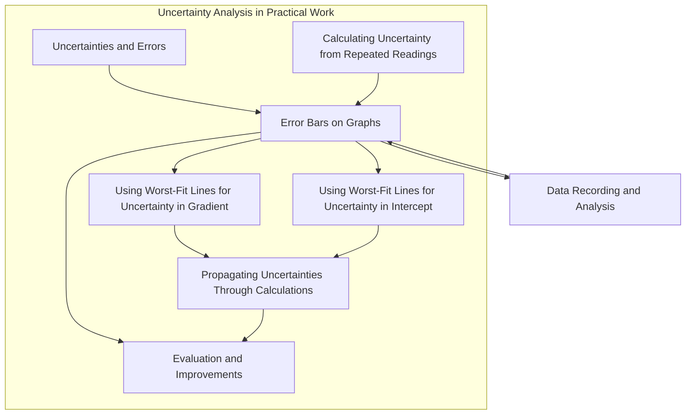

---
# 1. Overview / 概述

**English:**
This sub-topic focuses on the graphical representation of uncertainty using **error bars**. Error bars are a crucial tool in experimental physics for visually displaying the range within which a true value is expected to lie, based on the uncertainty of a measurement. When plotting data points on a graph, each point has an associated uncertainty in both the x- and y-directions. An error bar is a line drawn through a data point, extending ± one uncertainty in that direction, to show this range. This leaf node explains how to draw, interpret, and use error bars to determine the reliability of data and to construct **worst-fit lines** for uncertainty analysis. Mastering error bars is essential for [[Evaluation and Improvements]] and is a core skill for [[Uncertainty Analysis in Practical Work]].

**中文:**
本子知识点专注于使用**误差线**来图形化表示不确定度。误差线是实验物理学中的一个关键工具，用于直观地显示基于测量不确定度的真值预期所在的范围。在图表上绘制数据点时，每个点在 x 和 y 方向都有其相关的不确定度。误差线是通过数据点绘制的一条线段，在每个方向上延伸 ± 一个不确定度，以显示这个范围。本叶节点解释了如何绘制、解释和使用误差线来确定数据的可靠性，并构建用于不确定度分析的**最差拟合线**。掌握误差线对于[[Evaluation and Improvements]]至关重要，也是[[Uncertainty Analysis in Practical Work]]的核心技能。

---

# 2. Syllabus Learning Objectives / 考纲学习目标

| CAIE 9702 | Edexcel IAL |
|-----------|-------------|
| Plot data points with error bars representing the uncertainty in the measured quantity. | Draw error bars on graphs to represent the range of possible values for a data point. |
| Use error bars to determine the uncertainty in the gradient and intercept of a straight-line graph. | Use error bars to determine the uncertainty in the gradient and intercept of a straight-line graph. |
| Draw the line of best fit and the worst acceptable line (steepest and shallowest) using error bars. | Draw the line of best fit and the worst acceptable line (steepest and shallowest) using error bars. |
| Estimate the uncertainty in the gradient and intercept from the worst acceptable lines. | Estimate the uncertainty in the gradient and intercept from the worst acceptable lines. |

**Examiner Expectations / 考官期望:**
- **EN:** You must be able to draw error bars accurately, showing the correct length relative to the scale of the axes. You must be able to draw a line of best fit that passes through all error bars (or as many as possible) and then draw the steepest and shallowest worst-fit lines that still pass through all error bars. The uncertainty in the gradient is then half the difference between the steepest and shallowest gradients.
- **CN:** 你必须能够准确地绘制误差线，显示相对于坐标轴刻度的正确长度。你必须能够绘制一条穿过所有误差线（或尽可能多的误差线）的最佳拟合线，然后绘制仍然穿过所有误差线的最陡和最平缓的最差拟合线。梯度的不确定度是最陡和最平缓梯度差的一半。

---

# 3. Core Definitions / 核心定义

| Term (EN/CN) | Definition (EN) | Definition (CN) | Common Mistakes / 常见错误 |
|--------------|-----------------|-----------------|---------------------------|
| **Error Bar** / 误差线 | A line drawn through a data point, extending ± one uncertainty in a given direction (x or y), representing the range of possible true values. | 通过数据点绘制的一条线段，在给定方向（x 或 y）上延伸 ± 一个不确定度，表示可能的真值范围。 | Confusing the length of the error bar with the uncertainty value itself. The *total length* is 2 × uncertainty. |
| **Line of Best Fit** / 最佳拟合线 | A smooth line (usually straight) drawn through the data points, balancing the points above and below the line, and passing through all error bars. | 穿过数据点绘制的平滑线（通常是直线），平衡线上方和下方的点，并穿过所有误差线。 | Drawing a line that connects the first and last points, or forcing it through the origin. |
| **Worst Acceptable Line (Worst-Fit Line)** / 最差可接受线 | The steepest or shallowest straight line that can be drawn while still passing through all error bars. Used to estimate uncertainty in gradient and intercept. | 在仍然穿过所有误差线的条件下，可以绘制的最陡或最平缓的直线。用于估计梯度和截距的不确定度。 | Drawing a line that does not pass through all error bars, or using a line that is clearly not the steepest/shallowest possible. |
| **Gradient Uncertainty** / 梯度不确定度 | The range of possible gradient values, calculated as half the difference between the steepest and shallowest worst-fit line gradients. | 可能的梯度值范围，计算为最陡和最平缓最差拟合线梯度差的一半。 | Forgetting to divide the difference by 2. |
| **Intercept Uncertainty** / 截距不确定度 | The range of possible y-intercept values, calculated as half the difference between the y-intercepts of the steepest and shallowest worst-fit lines. | 可能的 y 轴截距值范围，计算为最陡和最平缓最差拟合线 y 轴截距差的一半。 | Forgetting to divide the difference by 2. |

---

# 4. Key Concepts Explained / 关键概念详解

## 4.1 Drawing Error Bars / 绘制误差线

### Explanation / 解释
**English:** An error bar is drawn for each data point. If the uncertainty is only in the y-direction (e.g., measuring voltage with a voltmeter), you draw a vertical line through the point, extending from $(y_i - \Delta y)$ to $(y_i + \Delta y)$. The top and bottom of the line are usually capped with small horizontal ticks (like an "I" shape) for clarity. If uncertainty is in both x and y, you draw both a vertical and a horizontal error bar. The length of the error bar is $2 \times \text{uncertainty}$. For example, if a voltage measurement is $V = 5.0 \pm 0.2 \text{ V}$, the error bar extends from 4.8 V to 5.2 V.

**中文:** 每个数据点都要绘制误差线。如果不确定度仅在 y 方向（例如，用电压表测量电压），则通过该点绘制一条垂直线，从 $(y_i - \Delta y)$ 延伸到 $(y_i + \Delta y)$。为了清晰起见，线的顶部和底部通常用小水平线帽封住（像 "I" 形）。如果 x 和 y 方向都有不确定度，则需同时绘制垂直和水平的误差线。误差线的长度为 $2 \times \text{不确定度}$。例如，如果电压测量值为 $V = 5.0 \pm 0.2 \text{ V}$，则误差线从 4.8 V 延伸到 5.2 V。

### Physical Meaning / 物理意义
**English:** The error bar represents the range of values within which the true value of the measurement is most likely to lie. A longer error bar indicates a less precise measurement. When multiple data points are plotted, the overlap of their error bars gives a visual indication of the consistency of the data.

**中文:** 误差线代表了测量真值最有可能位于的值范围。较长的误差线表示测量精度较低。当绘制多个数据点时，它们误差线的重叠部分直观地表明了数据的一致性。

### Common Misconceptions / 常见误区
- **EN:** Thinking the error bar length is the uncertainty, not twice the uncertainty.
- **CN:** 认为误差线的长度就是不确定度，而不是两倍的不确定度。
- **EN:** Forgetting to add the caps to the error bars.
- **CN:** 忘记给误差线添加线帽。
- **EN:** Drawing error bars that are too small to be seen on the graph scale.
- **CN:** 绘制的误差线太小，在图表刻度上无法看清。

### Exam Tips / 考试提示
- **EN:** Use a sharp pencil and a ruler to draw error bars. Make sure the caps are clearly visible but not too large.
- **CN:** 使用削尖的铅笔和直尺绘制误差线。确保线帽清晰可见但不要太大。
- **EN:** If the uncertainty is smaller than the size of the plotted point, you may not need to draw an error bar, but you should state this in your report.
- **CN:** 如果不确定度小于绘制点的大小，你可能不需要绘制误差线，但应在报告中说明这一点。

> 📷 **IMAGE PROMPT — ERR-01: Drawing Error Bars**
> A graph with 5 data points. Each point has a vertical error bar with caps. The first point has a small error bar, the third point has a large error bar. The axes are labeled "Voltage / V" and "Current / A". The error bars are clearly drawn with a ruler.

---

## 4.2 Using Error Bars to Find Worst-Fit Lines / 使用误差线寻找最差拟合线

### Explanation / 解释
**English:** Once the line of best fit is drawn, the worst-fit lines are used to quantify the uncertainty in the gradient and intercept. The **steepest worst-fit line** is the line with the largest positive gradient that still passes through all error bars. The **shallowest worst-fit line** is the line with the smallest positive gradient (or most negative) that still passes through all error bars. These lines must be drawn carefully, often by rotating a ruler while keeping it passing through the error bars.

**中文:** 一旦绘制了最佳拟合线，就使用最差拟合线来量化梯度和截距的不确定度。**最陡最差拟合线**是仍然穿过所有误差线的、具有最大正梯度的线。**最平缓最差拟合线**是仍然穿过所有误差线的、具有最小正梯度（或最负）的线。必须仔细绘制这些线，通常通过旋转直尺同时使其穿过误差线来实现。

### Physical Meaning / 物理意义
**English:** The worst-fit lines represent the extreme possible relationships between the variables, given the uncertainties in the measurements. The difference between the best-fit and worst-fit gradients gives a measure of how reliable the calculated gradient is.

**中文:** 最差拟合线代表了在给定测量不确定度的情况下，变量之间可能存在的极端关系。最佳拟合线与最差拟合线梯度之间的差异，衡量了计算出的梯度的可靠性。

### Common Misconceptions / 常见误区
- **EN:** Drawing the worst-fit lines through the *ends* of the error bars, not through the *entire* error bar.
- **CN:** 将最差拟合线穿过误差线的*端点*，而不是穿过*整个*误差线。
- **EN:** Using a line that is not the steepest or shallowest possible.
- **CN:** 使用的线不是可能的最陡或最平缓的线。
- **EN:** Forgetting to draw the worst-fit lines at all.
- **CN:** 完全忘记绘制最差拟合线。

### Exam Tips / 考试提示
- **EN:** Clearly label the three lines: "Best Fit", "Steepest", "Shallowest".
- **CN:** 清晰标注三条线："最佳拟合"、"最陡"、"最平缓"。
- **EN:** Calculate the gradient of each line using two widely separated points on the line (not data points).
- **CN:** 使用线上两个相距较远的点（不是数据点）来计算每条线的梯度。

> 📷 **IMAGE PROMPT — ERR-02: Worst-Fit Lines**
> A graph with 6 data points, each with vertical error bars. Three straight lines are drawn: a central "Best Fit" line, a steeper "Steepest" line, and a shallower "Shallowest" line. All three lines pass through all error bars. The lines are labeled.

---

# 5. Essential Equations / 核心公式

## 5.1 Error Bar Length / 误差线长度

$$ \text{Error Bar Length} = 2 \times \text{Uncertainty} $$

| Symbol (符号) | Meaning (EN) | Meaning (CN) | Unit (单位) |
|--------------|-------------|-------------|------------|
| - | The total length of the error bar drawn on the graph. | 在图表上绘制的误差线的总长度。 | Same as the measured quantity (e.g., V, A, m) |
| Uncertainty | The absolute uncertainty in the measurement. | 测量的绝对不确定度。 | Same as the measured quantity |

**Derivation / 推导:** The error bar extends from $(value - uncertainty)$ to $(value + uncertainty)$, so the total length is $(value + uncertainty) - (value - uncertainty) = 2 \times \text{uncertainty}$.

**Conditions / 适用条件:** This applies to any measurement with a defined absolute uncertainty.

**Limitations / 局限性:** This assumes the uncertainty is symmetric (i.e., the true value is equally likely to be above or below the measured value).

## 5.2 Uncertainty in Gradient / 梯度不确定度

$$ \Delta m = \frac{m_{\text{steepest}} - m_{\text{shallowest}}}{2} $$

| Symbol (符号) | Meaning (EN) | Meaning (CN) | Unit (单位) |
|--------------|-------------|-------------|------------|
| $\Delta m$ | Uncertainty in the gradient | 梯度的不确定度 | Same as gradient (e.g., V/A, m/s) |
| $m_{\text{steepest}}$ | Gradient of the steepest worst-fit line | 最陡最差拟合线的梯度 | Same as gradient |
| $m_{\text{shallowest}}$ | Gradient of the shallowest worst-fit line | 最平缓最差拟合线的梯度 | Same as gradient |

**Derivation / 推导:** The true gradient is assumed to lie between the steepest and shallowest gradients. The range is $m_{\text{steepest}} - m_{\text{shallowest}}$, and the uncertainty is half this range.

**Conditions / 适用条件:** This method is valid when the data points have error bars and the relationship is linear.

**Limitations / 局限性:** This is an estimate. A more rigorous statistical method (e.g., linear regression with weighted errors) is more accurate but is not required at A-Level.

## 5.3 Uncertainty in Intercept / 截距不确定度

$$ \Delta c = \frac{c_{\text{steepest}} - c_{\text{shallowest}}}{2} $$

| Symbol (符号) | Meaning (EN) | Meaning (CN) | Unit (单位) |
|--------------|-------------|-------------|------------|
| $\Delta c$ | Uncertainty in the y-intercept | y轴截距的不确定度 | Same as y-intercept (e.g., V, m) |
| $c_{\text{steepest}}$ | y-intercept of the steepest worst-fit line | 最陡最差拟合线的y轴截距 | Same as y-intercept |
| $c_{\text{shallowest}}$ | y-intercept of the shallowest worst-fit line | 最平缓最差拟合线的y轴截距 | Same as y-intercept |

**Derivation / 推导:** Same logic as gradient uncertainty.

**Conditions / 适用条件:** Same as gradient uncertainty.

**Limitations / 局限性:** Same as gradient uncertainty.

---

# 6. Graphs and Relationships / 图表与关系

## 6.1 Graph with Error Bars and Worst-Fit Lines / 带有误差线和最差拟合线的图表

### Axes / 坐标轴 (EN+CN)
- **X-axis:** Independent variable (e.g., Current / A)
- **Y-axis:** Dependent variable (e.g., Voltage / V)

### Shape / 形状 (EN+CN)
- **Best Fit Line:** A straight line that passes through all error bars, balancing the points above and below.
- **Steepest Line:** A straight line with the maximum possible gradient that still passes through all error bars.
- **Shallowest Line:** A straight line with the minimum possible gradient that still passes through all error bars.

### Gradient Meaning / 斜率含义 (EN+CN)
- The gradient of the best-fit line represents the best estimate of the relationship between the variables (e.g., resistance $R = \Delta V / \Delta I$).
- The steepest and shallowest gradients define the range of possible values for this relationship.

### Area Meaning / 面积含义 (EN+CN)
- Not applicable for this type of graph.

### Exam Interpretation / 考试解读 (EN+CN)
- **EN:** You will be asked to draw the best-fit line and the two worst-fit lines. You must then calculate the gradients and intercepts of all three lines and use them to find the uncertainties.
- **CN:** 你将被要求绘制最佳拟合线和两条最差拟合线。然后必须计算所有三条线的梯度和截距，并用它们来找出不确定度。

```mermaid
graph LR
    subgraph Graph
        A[Data Points with Error Bars] --> B[Line of Best Fit]
        A --> C[Steepest Worst-Fit Line]
        A --> D[Shallowest Worst-Fit Line]
    end
    B --> E[Best Gradient m_best]
    C --> F[Steepest Gradient m_steep]
    D --> G[Shallowest Gradient m_shallow]
    E --> H[Δm = (m_steep - m_shallow)/2]
    F --> H
    G --> H
```

---

# 7. Required Diagrams / 必备图表

## 7.1 Diagram: Error Bar Construction / 图表：误差线构造

### Description / 描述 (EN+CN)
- **EN:** A close-up diagram showing a single data point with a vertical error bar. The point is at (x, y). The error bar extends from (x, y - Δy) to (x, y + Δy). The caps are shown at the top and bottom. The length of the error bar is labeled as "2 × Δy".
- **CN:** 一个特写图，显示一个带有垂直误差线的单个数据点。该点位于 (x, y)。误差线从 (x, y - Δy) 延伸到 (x, y + Δy)。顶部和底部显示线帽。误差线的长度被标记为 "2 × Δy"。

### Image Prompt / 图片生成提示
> 📷 **IMAGE PROMPT — ERR-03: Error Bar Construction**
> A close-up diagram of a single data point (a small cross) on a graph grid. A vertical error bar is drawn through the point, with small horizontal caps at the top and bottom. The distance from the point to the top cap is labeled "Δy", and the total length of the error bar is labeled "2 × Δy". The axes are not labeled, focusing only on the error bar.

### Labels Required / 需要标注 (EN+CN)
- Data Point / 数据点
- Error Bar / 误差线
- Cap / 线帽
- Δy (Uncertainty / 不确定度)
- 2 × Δy (Total Length / 总长度)

### Exam Importance / 考试重要性 (EN+CN)
- **EN:** High. Understanding this diagram is fundamental to drawing and interpreting error bars correctly.
- **CN:** 高。理解此图是正确绘制和解释误差线的基础。

## 7.2 Diagram: Worst-Fit Lines on a Graph / 图表：图表上的最差拟合线

### Description / 描述 (EN+CN)
- **EN:** A full graph with 5-6 data points, each with vertical error bars. Three straight lines are drawn: a central "Best Fit" line, a steeper "Steepest" line, and a shallower "Shallowest" line. All three lines pass through all error bars. The gradients of the steepest and shallowest lines are calculated and shown.
- **CN:** 一个完整的图表，包含 5-6 个数据点，每个点都有垂直误差线。绘制了三条直线：一条居中的"最佳拟合"线，一条更陡的"最陡"线，和一条更平缓的"最平缓"线。所有三条线都穿过所有误差线。计算并显示了最陡和最平缓线的梯度。

### Image Prompt / 图片生成提示
> 📷 **IMAGE PROMPT — ERR-04: Worst-Fit Lines on a Graph**
> A graph with 6 data points, each with vertical error bars. Three straight lines are drawn: a central "Best Fit" line, a steeper "Steepest" line, and a shallower "Shallowest" line. All three lines pass through all error bars. The lines are labeled. The axes are labeled "Voltage / V" and "Current / A". The gradients are calculated: m_best = 2.5, m_steep = 2.8, m_shallow = 2.2.

### Labels Required / 需要标注 (EN+CN)
- Best Fit Line / 最佳拟合线
- Steepest Worst-Fit Line / 最陡最差拟合线
- Shallowest Worst-Fit Line / 最平缓最差拟合线
- Data Points with Error Bars / 带误差线的数据点
- Gradient Calculations / 梯度计算

### Exam Importance / 考试重要性 (EN+CN)
- **EN:** Very High. This is the most common type of graph question in practical exams.
- **CN:** 非常高。这是实验考试中最常见的图表题型。

---

# 8. Worked Examples / 典型例题

## Example 1: Finding Uncertainty in Gradient / 例题1：求梯度的不确定度

### Question / 题目
**English:**
In an experiment to determine the resistance of a wire, the following data was obtained:

| Current / A (±0.05 A) | Voltage / V (±0.1 V) |
|-----------------------|----------------------|
| 0.00                  | 0.0                  |
| 0.20                  | 0.5                  |
| 0.40                  | 1.1                  |
| 0.60                  | 1.6                  |
| 0.80                  | 2.0                  |
| 1.00                  | 2.6                  |

Plot the data with error bars. Draw the line of best fit, the steepest worst-fit line, and the shallowest worst-fit line. Calculate the best estimate of the resistance and its uncertainty.

**中文:**
在一个测定导线电阻的实验中，获得了以下数据：

| 电流 / A (±0.05 A) | 电压 / V (±0.1 V) |
|-----------------------|----------------------|
| 0.00                  | 0.0                  |
| 0.20                  | 0.5                  |
| 0.40                  | 1.1                  |
| 0.60                  | 1.6                  |
| 0.80                  | 2.0                  |
| 1.00                  | 2.6                  |

绘制带有误差线的数据。绘制最佳拟合线、最陡最差拟合线和最平缓最差拟合线。计算电阻的最佳估计值及其不确定度。

### Solution / 解答
**Step 1: Plot the data with error bars.**
- For each point, draw a vertical error bar from $(V - 0.1)$ to $(V + 0.1)$.
- For the current, draw a horizontal error bar from $(I - 0.05)$ to $(I + 0.05)$.

**Step 2: Draw the line of best fit.**
- Draw a straight line that passes through all error bars. The line should go through the origin (0,0) as it's a resistance measurement.

**Step 3: Draw the steepest worst-fit line.**
- Rotate a ruler to find the steepest line that still passes through all error bars.

**Step 4: Draw the shallowest worst-fit line.**
- Rotate a ruler to find the shallowest line that still passes through all error bars.

**Step 5: Calculate the gradients.**
- **Best Fit:** Using points (0.00, 0.0) and (1.00, 2.6):
  $$ m_{\text{best}} = \frac{2.6 - 0.0}{1.00 - 0.00} = 2.6 \text{ V/A} $$
- **Steepest:** Using points (0.00, 0.0) and (1.00, 2.8):
  $$ m_{\text{steep}} = \frac{2.8 - 0.0}{1.00 - 0.00} = 2.8 \text{ V/A} $$
- **Shallowest:** Using points (0.00, 0.0) and (1.00, 2.4):
  $$ m_{\text{shallow}} = \frac{2.4 - 0.0}{1.00 - 0.00} = 2.4 \text{ V/A} $$

**Step 6: Calculate the uncertainty in gradient.**
$$ \Delta m = \frac{2.8 - 2.4}{2} = 0.2 \text{ V/A} $$

### Final Answer / 最终答案
**Answer:** Resistance = $2.6 \pm 0.2 \text{ V/A}$ (or $\Omega$) | **答案：** 电阻 = $2.6 \pm 0.2 \text{ V/A}$ (或 $\Omega$)

### Quick Tip / 提示
- **EN:** Always use two widely separated points on the line (not data points) to calculate the gradient.
- **CN:** 始终使用线上两个相距较远的点（不是数据点）来计算梯度。

---

## Example 2: Finding Uncertainty in Intercept / 例题2：求截距的不确定度

### Question / 题目
**English:**
In an experiment to measure the decay of a capacitor, the voltage $V$ across the capacitor was measured at different times $t$. The graph of $\ln(V)$ against $t$ gave a straight line. The best-fit line has an intercept of 2.30, the steepest line has an intercept of 2.35, and the shallowest line has an intercept of 2.25. Find the uncertainty in the intercept.

**中文:**
在一个测量电容器放电的实验中，测量了电容器在不同时间 $t$ 下的电压 $V$。$\ln(V)$ 对 $t$ 的图表得到一条直线。最佳拟合线的截距为 2.30，最陡线的截距为 2.35，最平缓线的截距为 2.25。求截距的不确定度。

### Solution / 解答
**Step 1: Identify the steepest and shallowest intercepts.**
- $c_{\text{steep}} = 2.35$
- $c_{\text{shallow}} = 2.25$

**Step 2: Calculate the uncertainty.**
$$ \Delta c = \frac{2.35 - 2.25}{2} = 0.05 $$

### Final Answer / 最终答案
**Answer:** Intercept uncertainty = $\pm 0.05$ | **答案：** 截距不确定度 = $\pm 0.05$

### Quick Tip / 提示
- **EN:** The intercept uncertainty is found the same way as gradient uncertainty.
- **CN:** 截距不确定度的求法与梯度不确定度相同。

---

# 9. Past Paper Question Types / 历年真题题型

| Question Type / 题型 | Frequency / 频率 | Difficulty / 难度 | Past Paper References / 真题索引 |
|----------------------|------------------|------------------|-------------------------------|
| Draw error bars on a graph | Very High | Easy | 📝 *待填入* |
| Draw best-fit and worst-fit lines | Very High | Medium | 📝 *待填入* |
| Calculate uncertainty in gradient | Very High | Medium | 📝 *待填入* |
| Calculate uncertainty in intercept | High | Medium | 📝 *待填入* |
| Explain the meaning of error bars | Medium | Easy | 📝 *待填入* |
| Evaluate the reliability of data using error bars | Medium | Hard | 📝 *待填入* |

**Common Command Words / 常见指令词:**
- **EN:** Plot, Draw, Calculate, Determine, Estimate, Explain, Evaluate
- **CN:** 绘制，画出，计算，确定，估计，解释，评估

---

# 10. Practical Skills Connections / 实验技能链接

**English:**
Error bars are directly connected to practical skills in Papers 3 and 5 (CAIE) and Units 3 and 6 (Edexcel). When you record data with uncertainties, you must be able to represent them graphically. This skill is tested in:
- **Data Recording:** Recording measurements with their uncertainties.
- **Graph Plotting:** Plotting points with error bars.
- **Analysis:** Drawing best-fit and worst-fit lines to find uncertainties in gradients and intercepts.
- **Evaluation:** Using error bars to comment on the reliability of the data and the validity of the conclusion. For example, if the error bars are very large, the data is less reliable. If the worst-fit lines give a wide range of gradients, the uncertainty is large.

**中文:**
误差线与（CAIE）Paper 3 和 5 以及（Edexcel）Unit 3 和 6 的实验技能直接相关。当你记录带有不确定度的数据时，你必须能够以图形方式表示它们。这项技能在以下方面受到测试：
- **数据记录：** 记录带有不确定度的测量值。
- **图表绘制：** 绘制带有误差线的点。
- **分析：** 绘制最佳拟合线和最差拟合线，以找出梯度和截距的不确定度。
- **评估：** 使用误差线来评论数据的可靠性和结论的有效性。例如，如果误差线非常大，则数据可靠性较低。如果最差拟合线给出的梯度范围很宽，则不确定度很大。

---

# 11. Concept Map / 概念图谱



---

# 12. Quick Revision Sheet / 速查表

| Category / 类别 | Key Points / 要点 |
|----------------|------------------|
| Definition / 定义 | Error bars show the range of possible true values for a data point. |
| Key Formula / 核心公式 | Error Bar Length = 2 × Uncertainty; Δm = (m_steep - m_shallow)/2; Δc = (c_steep - c_shallow)/2 |
| Key Graph / 核心图表 | Graph with data points, error bars, best-fit line, steepest and shallowest worst-fit lines. |
| Exam Tip / 考试提示 | Always use a ruler and pencil. Label all lines. Calculate gradients using two widely separated points on the line. |