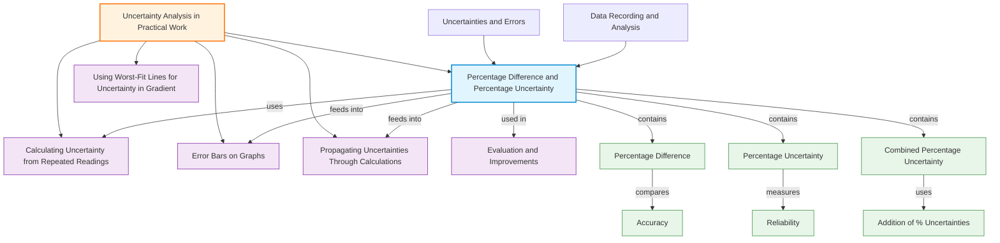

# 1. Overview / 概述

**English:**
Percentage difference and percentage uncertainty are two distinct but commonly confused concepts in practical physics. **Percentage difference** (also called percentage discrepancy) compares an experimental result to a theoretical or accepted value, measuring accuracy. **Percentage uncertainty** quantifies the reliability of a measurement by expressing the absolute uncertainty as a fraction of the measured value. This sub-topic is critical for Paper 3/5 (CAIE) and Unit 3/6 (Edexcel) where students must evaluate experimental results and justify conclusions. Understanding the distinction prevents common errors in practical write-ups and data analysis. This leaf node connects to [[Calculating Uncertainty from Repeated Readings]] and [[Propagating Uncertainties Through Calculations]].

**中文:**
百分比差异和百分比不确定度是实验物理中两个不同但常被混淆的概念。**百分比差异**（也称百分比偏差）将实验结果与理论值或公认值进行比较，衡量准确度。**百分比不确定度**通过将绝对不确定度表示为测量值的分数来量化测量的可靠性。本子知识点对CAIE Paper 3/5和Edexcel Unit 3/6考试至关重要，学生需要评估实验结果并证明结论。理解两者的区别可以防止实验报告和数据分析中的常见错误。本叶节点连接到[[Calculating Uncertainty from Repeated Readings]]和[[Propagating Uncertainties Through Calculations]]。

---

# 2. Syllabus Learning Objectives / 考纲学习目标

| CAIE 9702 | Edexcel IAL |
|-----------|-------------|
| Calculate percentage difference between experimental and accepted values | Calculate percentage uncertainty from absolute uncertainty |
| Express experimental results with appropriate percentage uncertainties | Compare experimental results using percentage difference |
| Use percentage uncertainty to justify reliability of measurements | Evaluate whether percentage difference is within experimental uncertainty |

**Examiner Expectations / 考官期望:**
- **English:** Students must clearly distinguish between percentage difference (comparing to a known value) and percentage uncertainty (reliability of measurement). In evaluation questions, students should compare percentage difference to percentage uncertainty to determine if results are consistent with accepted values.
- **中文:** 学生必须清楚区分百分比差异（与已知值比较）和百分比不确定度（测量的可靠性）。在评估题中，学生应比较百分比差异和百分比不确定度，以判断结果是否与公认值一致。

---

# 3. Core Definitions / 核心定义

| Term (EN/CN) | Definition (EN) | Definition (CN) | Common Mistakes / 常见错误 |
|--------------|-----------------|-----------------|---------------------------|
| **Percentage Difference** / 百分比差异 | The absolute difference between experimental and accepted values, expressed as a percentage of the accepted value: $\frac{\lvert \text{experimental} - \text{accepted} \rvert}{\text{accepted}} \times 100\%$ | 实验值与公认值之间的绝对差值，表示为公认值的百分比 | Confusing with percentage uncertainty; using experimental value as denominator |
| **Percentage Uncertainty** / 百分比不确定度 | The absolute uncertainty expressed as a percentage of the measured value: $\frac{\text{absolute uncertainty}}{\text{measured value}} \times 100\%$ | 绝对不确定度表示为测量值的百分比 | Using accepted value instead of measured value; forgetting to multiply by 100% |
| **Absolute Uncertainty** / 绝对不确定度 | The range of values within which the true value is expected to lie, with units | 真实值预期所在的数值范围，带单位 | Not including units; confusing with percentage uncertainty |
| **Accuracy** / 准确度 | How close a measurement is to the true or accepted value | 测量值与真实值或公认值的接近程度 | Confusing with precision |
| **Precision** / 精密度 | How consistent repeated measurements are with each other | 重复测量之间的一致性程度 | Confusing with accuracy |

> 📋 **CIE Only:** In Paper 5, students must calculate percentage difference and compare it to percentage uncertainty to evaluate whether results support a hypothesis.
> 
> 📋 **Edexcel Only:** In Unit 3, students may be asked to calculate percentage uncertainty from instrument precision and use it to determine if percentage difference is significant.

---

# 4. Key Concepts Explained / 关键概念详解

## 4.1 Percentage Difference vs Percentage Uncertainty / 百分比差异与百分比不确定度

### Explanation / 解释
**English:**
Percentage difference and percentage uncertainty serve different purposes in experimental analysis. **Percentage difference** answers: "How far off is my result from the known value?" It is a measure of **accuracy**. **Percentage uncertainty** answers: "How reliable is my measurement?" It is a measure of **precision** and reliability.

The key relationship for evaluation: If the percentage difference is **less than** the percentage uncertainty, the experimental result is consistent with the accepted value within experimental error. If the percentage difference is **greater than** the percentage uncertainty, there may be systematic errors or the result does not support the hypothesis.

**中文:**
百分比差异和百分比不确定度在实验分析中用途不同。**百分比差异**回答："我的结果与已知值相差多少？"它是**准确度**的衡量。**百分比不确定度**回答："我的测量有多可靠？"它是**精密度**和可靠性的衡量。

评估的关键关系：如果百分比差异**小于**百分比不确定度，则实验结果在实验误差范围内与公认值一致。如果百分比差异**大于**百分比不确定度，则可能存在系统误差或结果不支持假设。

### Physical Meaning / 物理意义
**English:**
- **Percentage difference** tells us how accurate our experiment was — did we get close to the true value?
- **Percentage uncertainty** tells us how confident we can be in our measurement — how much could the true value reasonably differ from our measured value?

**中文:**
- **百分比差异**告诉我们实验的准确度——我们是否接近真实值？
- **百分比不确定度**告诉我们我们对测量有多大的信心——真实值可能与测量值合理相差多少？

### Common Misconceptions / 常见误区
- ❌ **Using the wrong denominator:** Percentage difference uses the **accepted** value as denominator; percentage uncertainty uses the **measured** value.
- ❌ **Forgetting absolute value:** Percentage difference always uses the absolute difference (no negative sign).
- ❌ **Confusing accuracy with precision:** A precise measurement (small percentage uncertainty) can still be inaccurate (large percentage difference).
- ❌ **Omitting the % sign:** Both quantities must be expressed with a % symbol.

### Exam Tips / 考试提示
- **English:** Always state both values when evaluating: "The percentage difference is X%, which is less/greater than the percentage uncertainty of Y%, therefore..."
- **中文:** 评估时始终同时说明两个值："百分比差异为X%，小于/大于百分比不确定度Y%，因此..."

> 📷 **IMAGE PROMPT — VENN: Percentage Difference vs Percentage Uncertainty**
> A Venn diagram comparing percentage difference and percentage uncertainty. Left circle: "Percentage Difference" with features "Compares to accepted value", "Measures accuracy", "Uses accepted value as denominator". Right circle: "Percentage Uncertainty" with features "From measurement precision", "Measures reliability", "Uses measured value as denominator". Overlap: "Both expressed as %", "Used in evaluation", "Compare to determine consistency". Clean white background, educational style.

---

## 4.2 Calculating Percentage Uncertainty from Multiple Sources / 从多个来源计算百分比不确定度

### Explanation / 解释
**English:**
When a measurement involves multiple instruments or steps, the total percentage uncertainty is found by **adding** the individual percentage uncertainties. This is because uncertainties add in quadrature for random errors, but at A-Level, simple addition is accepted for percentage uncertainties.

For example, if measuring velocity using distance and time:
- Percentage uncertainty in distance: $\frac{0.1 \text{ cm}}{25.0 \text{ cm}} \times 100\% = 0.4\%$
- Percentage uncertainty in time: $\frac{0.01 \text{ s}}{2.50 \text{ s}} \times 100\% = 0.4\%$
- Total percentage uncertainty in velocity: $0.4\% + 0.4\% = 0.8\%$

**中文:**
当测量涉及多个仪器或步骤时，总百分比不确定度通过**相加**各个百分比不确定度得到。这是因为随机误差的不确定度以平方和方式相加，但在A-Level中，百分比不确定度的简单加法是可以接受的。

例如，使用距离和时间测量速度：
- 距离的百分比不确定度：$\frac{0.1 \text{ cm}}{25.0 \text{ cm}} \times 100\% = 0.4\%$
- 时间的百分比不确定度：$\frac{0.01 \text{ s}}{2.50 \text{ s}} \times 100\% = 0.4\%$
- 速度的总百分比不确定度：$0.4\% + 0.4\% = 0.8\%$

### Physical Meaning / 物理意义
**English:**
Adding percentage uncertainties reflects that each measurement contributes to the overall uncertainty. A measurement with a large percentage uncertainty dominates the total uncertainty — this tells us which part of the experiment needs improvement.

**中文:**
相加百分比不确定度反映了每个测量对总不确定度的贡献。百分比不确定度大的测量主导总不确定度——这告诉我们实验的哪个部分需要改进。

### Common Misconceptions / 常见误区
- ❌ **Multiplying uncertainties instead of adding:** For multiplication/division, add percentage uncertainties; don't multiply them.
- ❌ **Forgetting to convert to percentage first:** Always calculate each percentage uncertainty before adding.
- ❌ **Adding absolute uncertainties:** For combined quantities, add percentage uncertainties, not absolute ones.

### Exam Tips / 考试提示
- **English:** Show each step: "Percentage uncertainty in X = ...%, Percentage uncertainty in Y = ...%, Total = ...%"
- **中文:** 展示每一步："X的百分比不确定度 = ...%，Y的百分比不确定度 = ...%，总计 = ...%"

---

# 5. Essential Equations / 核心公式

## 5.1 Percentage Difference / 百分比差异

$$ \text{Percentage Difference} = \frac{\lvert \text{Experimental Value} - \text{Accepted Value} \rvert}{\text{Accepted Value}} \times 100\% $$

| Symbol (符号) | Meaning (EN) | Meaning (CN) | Unit (单位) |
|--------------|-------------|-------------|------------|
| Experimental Value | Value obtained from experiment | 实验获得的值 | Same as measured quantity |
| Accepted Value | Known theoretical or standard value | 已知的理论值或标准值 | Same as measured quantity |
| Percentage Difference | Accuracy measure | 准确度衡量 | % |

**Conditions / 适用条件:**
- **English:** Only use when an accepted/theoretical value is known. The accepted value must be in the same units as the experimental value.
- **中文:** 仅在已知公认值/理论值时使用。公认值必须与实验值单位相同。

**Limitations / 局限性:**
- **English:** Does not indicate direction of error (always positive). Does not account for uncertainty in the accepted value itself.
- **中文:** 不指示误差方向（始终为正）。不考虑公认值本身的不确定度。

## 5.2 Percentage Uncertainty / 百分比不确定度

$$ \text{Percentage Uncertainty} = \frac{\text{Absolute Uncertainty}}{\text{Measured Value}} \times 100\% $$

| Symbol (符号) | Meaning (EN) | Meaning (CN) | Unit (单位) |
|--------------|-------------|-------------|------------|
| Absolute Uncertainty | Range of possible true values | 可能真实值的范围 | Same as measured quantity |
| Measured Value | Value obtained from measurement | 测量获得的值 | Same as measured quantity |
| Percentage Uncertainty | Reliability measure | 可靠性衡量 | % |

**Conditions / 适用条件:**
- **English:** Absolute uncertainty must be in the same units as the measured value. For repeated readings, use half the range or standard deviation.
- **中文:** 绝对不确定度必须与测量值单位相同。对于重复读数，使用半范围或标准偏差。

**Limitations / 局限性:**
- **English:** Assumes uncertainty is symmetric around the measured value. Does not account for systematic errors.
- **中文:** 假设不确定度围绕测量值对称。不考虑系统误差。

## 5.3 Combined Percentage Uncertainty (for multiplication/division) / 组合百分比不确定度（乘除运算）

$$ \text{Total \% Uncertainty} = \%U_1 + \%U_2 + \%U_3 + \dots $$

| Symbol (符号) | Meaning (EN) | Meaning (CN) | Unit (单位) |
|--------------|-------------|-------------|------------|
| $\%U_1, \%U_2$ | Individual percentage uncertainties | 各个百分比不确定度 | % |
| Total \% Uncertainty | Combined percentage uncertainty in result | 结果的组合百分比不确定度 | % |

**Conditions / 适用条件:**
- **English:** For multiplication and division only. For addition/subtraction, add absolute uncertainties.
- **中文:** 仅适用于乘法和除法。对于加法和减法，相加绝对不确定度。

**Limitations / 局限性:**
- **English:** This is a simplified method. The more accurate method (quadrature) is not required at AS Level.
- **中文:** 这是简化方法。更精确的方法（平方和）在AS Level不要求。

> 📷 **IMAGE PROMPT — FLOWCHART: Choosing the Right Uncertainty Calculation**
> A flowchart showing decision process: "Do you have an accepted value?" → Yes → "Calculate Percentage Difference" → "Compare to Percentage Uncertainty" → "Is %Diff < %Unc?" → Yes: "Result consistent" / No: "Systematic error possible". No branch: "Calculate Percentage Uncertainty only". Clean educational flowchart style.

---

# 6. Graphs and Relationships / 图表与关系

## 6.1 Percentage Uncertainty vs Measured Value / 百分比不确定度与测量值的关系

### Axes / 坐标轴
- **X-axis:** Measured Value (测量值)
- **Y-axis:** Percentage Uncertainty (百分比不确定度)

### Shape / 形状
**English:** A **hyperbolic** curve. As the measured value increases, percentage uncertainty decreases. This is because the absolute uncertainty is often constant (e.g., ±0.1 cm for a ruler), so dividing by a larger value gives a smaller percentage.

**中文:** **双曲线**形状。随着测量值增加，百分比不确定度减小。这是因为绝对不确定度通常是常数（例如，尺子的±0.1 cm），所以除以更大的值得到更小的百分比。

### Gradient Meaning / 斜率含义
**English:** The gradient is negative and decreasing in magnitude. It shows how sensitive percentage uncertainty is to changes in the measured value. A steep gradient means small measurements have very large percentage uncertainties.

**中文:** 斜率为负且大小递减。它显示百分比不确定度对测量值变化的敏感程度。陡峭的斜率意味着小测量值有非常大的百分比不确定度。

### Area Meaning / 面积含义
**English:** No meaningful physical interpretation for area under this curve.

**中文:** 该曲线下的面积没有有意义的物理解释。

### Exam Interpretation / 考试解读
**English:** This relationship explains why we should take large measurements when possible — to minimize percentage uncertainty. For example, measuring 50 cm with a ruler gives 0.2% uncertainty, while measuring 5 cm gives 2% uncertainty.

**中文:** 这种关系解释了为什么我们应尽可能取大测量值——以最小化百分比不确定度。例如，用尺子测量50 cm给出0.2%的不确定度，而测量5 cm给出2%的不确定度。

---

# 7. Required Diagrams / 必备图表

## 7.1 Comparison Diagram: Percentage Difference vs Percentage Uncertainty / 比较图：百分比差异与百分比不确定度

### Description / 描述
**English:** A side-by-side comparison showing the calculation of percentage difference (using accepted value as denominator) and percentage uncertainty (using measured value as denominator). Include a worked example with the same numbers to highlight the difference.

**中文:** 并排比较，显示百分比差异（使用公认值作为分母）和百分比不确定度（使用测量值作为分母）的计算。包含使用相同数字的工作示例以突出差异。

### Image Prompt / 图片生成提示
> 📷 **IMAGE PROMPT — COMPARISON: Percentage Difference vs Percentage Uncertainty Calculation**
> A split diagram. Left side: "Percentage Difference" with formula shown, example: Experimental = 9.8 m/s², Accepted = 9.81 m/s², %Diff = |9.8-9.81|/9.81 × 100% = 0.10%. Right side: "Percentage Uncertainty" with formula shown, example: Measured = 9.8 m/s², Absolute Uncertainty = ±0.2 m/s², %Unc = 0.2/9.8 × 100% = 2.04%. Both calculations shown step-by-step with color coding. Clean educational style.

### Labels Required / 需要标注
- **English:** Experimental Value, Accepted Value, Absolute Uncertainty, Percentage Difference, Percentage Uncertainty, Denominator
- **中文:** 实验值，公认值，绝对不确定度，百分比差异，百分比不确定度，分母

### Exam Importance / 考试重要性
**English:** High — This distinction is tested in almost every practical exam. Students must know which formula to use and when.

**中文:** 高——这个区别在几乎每次实验考试中都会考到。学生必须知道何时使用哪个公式。

---

## 7.2 Evaluation Flowchart / 评估流程图

### Description / 描述
**English:** A flowchart showing the decision process when evaluating experimental results: calculate percentage difference, calculate percentage uncertainty, compare them, and draw a conclusion.

**中文:** 显示评估实验结果时的决策过程的流程图：计算百分比差异，计算百分比不确定度，比较它们，得出结论。

### Image Prompt / 图片生成提示
> 📷 **IMAGE PROMPT — FLOWCHART: Evaluating Experimental Results**
> Flowchart with 5 boxes connected by arrows. Box 1: "Calculate Percentage Difference" → Box 2: "Calculate Percentage Uncertainty" → Box 3: "Compare: Is %Diff < %Unc?" → Yes arrow to Box 4: "Result consistent with accepted value" → No arrow to Box 5: "Systematic error likely / Hypothesis not supported". Each box has a small example calculation. Clean professional flowchart style.

### Labels Required / 需要标注
- **English:** Percentage Difference, Percentage Uncertainty, Consistent, Systematic Error, Conclusion
- **中文:** 百分比差异，百分比不确定度，一致，系统误差，结论

### Exam Importance / 考试重要性
**English:** High — This evaluation process is required in Paper 5 (CAIE) and Unit 6 (Edexcel) evaluation questions.

**中文:** 高——这个评估过程在Paper 5（CAIE）和Unit 6（Edexcel）的评估题中要求使用。

---

# 8. Worked Examples / 典型例题

## Example 1: Comparing Percentage Difference and Percentage Uncertainty / 示例1：比较百分比差异和百分比不确定度

### Question / 题目
**English:**
A student measures the acceleration due to gravity using a pendulum and obtains $g = 9.72 \text{ m/s}^2$. The accepted value is $g = 9.81 \text{ m/s}^2$. The percentage uncertainty in the measurement is calculated to be 1.5%.

(a) Calculate the percentage difference between the experimental and accepted values.
(b) Determine whether the experimental result is consistent with the accepted value.
(c) State what the comparison tells us about possible errors.

**中文:**
一名学生使用单摆测量重力加速度，得到 $g = 9.72 \text{ m/s}^2$。公认值为 $g = 9.81 \text{ m/s}^2$。测量的百分比不确定度计算为1.5%。

(a) 计算实验值与公认值之间的百分比差异。
(b) 判断实验结果是否与公认值一致。
(c) 说明比较结果告诉我们可能的误差情况。

### Solution / 解答

**(a) Percentage Difference / 百分比差异**

$$ \text{Percentage Difference} = \frac{\lvert 9.72 - 9.81 \rvert}{9.81} \times 100\% = \frac{0.09}{9.81} \times 100\% = 0.917\% $$

**(b) Comparison / 比较**

Percentage Difference = 0.917%
Percentage Uncertainty = 1.5%

Since 0.917% < 1.5%, the percentage difference is **less than** the percentage uncertainty.

**Conclusion:** The experimental result is **consistent** with the accepted value within experimental uncertainty.

**(c) Error Analysis / 误差分析**

Since the result is consistent, there is **no evidence of significant systematic error**. The difference between the experimental and accepted values can be explained by random errors alone. However, small systematic errors may still be present but are masked by the random uncertainty.

### Final Answer / 最终答案
**Answer:** (a) 0.917% (b) Consistent — %Diff < %Unc (c) No significant systematic error detected | **答案：** (a) 0.917% (b) 一致——%Diff < %Unc (c) 未检测到显著系统误差

### Quick Tip / 提示
**English:** Always compare the two percentages directly. If %Diff < %Unc, the result is consistent. If %Diff > %Unc, there may be systematic errors.

**中文:** 始终直接比较两个百分比。如果%Diff < %Unc，结果一致。如果%Diff > %Unc，可能存在系统误差。

---

## Example 2: Calculating Combined Percentage Uncertainty / 示例2：计算组合百分比不确定度

### Question / 题目
**English:**
A student measures the density of a metal cylinder. The mass is measured as $m = 50.0 \pm 0.1 \text{ g}$. The volume is calculated from diameter $d = 2.00 \pm 0.01 \text{ cm}$ and height $h = 5.00 \pm 0.05 \text{ cm}$.

(a) Calculate the percentage uncertainty in the mass measurement.
(b) Calculate the percentage uncertainty in the volume measurement.
(c) Calculate the total percentage uncertainty in the density.
(d) Express the density with its absolute uncertainty.

**中文:**
一名学生测量金属圆柱体的密度。质量测量为 $m = 50.0 \pm 0.1 \text{ g}$。体积由直径 $d = 2.00 \pm 0.01 \text{ cm}$ 和高度 $h = 5.00 \pm 0.05 \text{ cm}$ 计算得出。

(a) 计算质量测量的百分比不确定度。
(b) 计算体积测量的百分比不确定度。
(c) 计算密度的总百分比不确定度。
(d) 用绝对不确定度表示密度。

### Solution / 解答

**(a) Percentage uncertainty in mass / 质量的百分比不确定度**

$$ \%U_m = \frac{0.1}{50.0} \times 100\% = 0.20\% $$

**(b) Percentage uncertainty in volume / 体积的百分比不确定度**

Volume of cylinder: $V = \pi r^2 h = \pi \left(\frac{d}{2}\right)^2 h$

Percentage uncertainty in diameter: $\%U_d = \frac{0.01}{2.00} \times 100\% = 0.50\%$

Since $r = d/2$, $\%U_r = \%U_d = 0.50\%$ (division by constant doesn't change % uncertainty)

Since $V \propto r^2$, $\%U_{r^2} = 2 \times \%U_r = 2 \times 0.50\% = 1.00\%$

Percentage uncertainty in height: $\%U_h = \frac{0.05}{5.00} \times 100\% = 1.00\%$

Total percentage uncertainty in volume: $\%U_V = \%U_{r^2} + \%U_h = 1.00\% + 1.00\% = 2.00\%$

**(c) Total percentage uncertainty in density / 密度的总百分比不确定度**

Density: $\rho = \frac{m}{V}$

$$ \%U_\rho = \%U_m + \%U_V = 0.20\% + 2.00\% = 2.20\% $$

**(d) Density with absolute uncertainty / 带绝对不确定度的密度**

First calculate density: $\rho = \frac{50.0}{\pi (1.00)^2 (5.00)} = \frac{50.0}{15.708} = 3.183 \text{ g/cm}^3$

Absolute uncertainty: $\Delta \rho = \frac{2.20}{100} \times 3.183 = 0.070 \text{ g/cm}^3$

**Final answer:** $\rho = 3.18 \pm 0.07 \text{ g/cm}^3$

### Final Answer / 最终答案
**Answer:** (a) 0.20% (b) 2.00% (c) 2.20% (d) $\rho = 3.18 \pm 0.07 \text{ g/cm}^3$ | **答案：** (a) 0.20% (b) 2.00% (c) 2.20% (d) $\rho = 3.18 \pm 0.07 \text{ g/cm}^3$

### Quick Tip / 提示
**English:** When a quantity is squared (like $r^2$), multiply its percentage uncertainty by 2. When a quantity is square-rooted, multiply by 0.5.

**中文:** 当一个量被平方时（如 $r^2$），将其百分比不确定度乘以2。当一个量被开方时，乘以0.5。

---

# 9. Past Paper Question Types / 历年真题题型

| Question Type / 题型 | Frequency / 频率 | Difficulty / 难度 | Past Paper References / 真题索引 |
|----------------------|------------------|------------------|-------------------------------|
| Calculate percentage difference from given values | High | Easy | 📝 *待填入* |
| Calculate percentage uncertainty from instrument precision | High | Medium | 📝 *待填入* |
| Compare %Diff and %Unc to evaluate consistency | High | Medium | 📝 *待填入* |
| Calculate combined percentage uncertainty (multi-step) | Medium | Hard | 📝 *待填入* |
| Explain whether result supports hypothesis using %Diff and %Unc | Medium | Hard | 📝 *待填入* |

**Common Command Words / 常见指令词:**
- **English:** Calculate, Determine, Compare, Evaluate, State, Explain, Justify
- **中文:** 计算，确定，比较，评估，说明，解释，证明

> 📋 **CIE Only:** Paper 5 often asks students to "calculate the percentage difference between your value and the accepted value" and then "comment on whether your result supports the hypothesis."
> 
> 📋 **Edexcel Only:** Unit 3/6 questions often ask students to "calculate the percentage uncertainty in your measurement" and "use this to determine if the percentage difference is significant."

---

# 10. Practical Skills Connections / 实验技能链接

**English:**
This sub-topic connects directly to practical skills in several ways:

1. **Data Recording:** When recording measurements, always note the precision of instruments to calculate percentage uncertainty later.
2. **Graph Plotting:** Percentage uncertainty determines the size of [[Error Bars on Graphs]] — larger percentage uncertainty means larger error bars.
3. **Experimental Design:** Understanding percentage uncertainty helps choose appropriate instruments and measurement ranges to minimize uncertainty.
4. **Evaluation:** The comparison of percentage difference and percentage uncertainty is a key evaluation skill — it determines whether results support the hypothesis or if systematic errors exist.
5. **Improvements:** If percentage uncertainty is large, suggest improvements to reduce it (e.g., use more precise instruments, take larger measurements). If percentage difference is large but percentage uncertainty is small, suggest checking for systematic errors.

**中文:**
本子知识点通过多种方式直接连接到实验技能：

1. **数据记录：** 记录测量值时，始终注意仪器的精度，以便后续计算百分比不确定度。
2. **图表绘制：** 百分比不确定度决定[[Error Bars on Graphs]]的大小——百分比不确定度越大，误差棒越大。
3. **实验设计：** 理解百分比不确定度有助于选择合适的仪器和测量范围以最小化不确定度。
4. **评估：** 百分比差异和百分比不确定度的比较是关键评估技能——它决定结果是否支持假设或是否存在系统误差。
5. **改进：** 如果百分比不确定度大，建议改进以减少它（例如，使用更精确的仪器，取更大的测量值）。如果百分比差异大但百分比不确定度小，建议检查系统误差。

---

# 11. Concept Map / 概念图谱

---

# 12. Quick Revision Sheet / 速查表

| Category / 类别 | Key Points / 要点 |
|----------------|------------------|
| **Definition / 定义** | **%Diff** = accuracy measure comparing to accepted value; **%Unc** = reliability measure from measurement precision |
| **Key Formula / 核心公式** | %Diff = $\frac{\lvert \text{Exp} - \text{Acc} \rvert}{\text{Acc}} \times 100\%$; %Unc = $\frac{\text{Abs Unc}}{\text{Measured}} \times 100\%$ |
| **Denominator / 分母** | %Diff uses **accepted** value; %Unc uses **measured** value |
| **Combined %Unc / 组合%Unc** | For ×/÷: **add** individual % uncertainties; For $x^2$: multiply %Unc by 2 |
| **Evaluation Rule / 评估规则** | If %Diff < %Unc → **consistent** (random error explains difference); If %Diff > %Unc → **systematic error** likely |
| **Key Graph / 核心图表** | %Unc vs Measured Value: **hyperbolic** — larger measurements give smaller %Unc |
| **Common Mistake / 常见错误** | Using wrong denominator; forgetting absolute value; confusing %Diff with %Unc |
| **Exam Tip / 考试提示** | Always state both values: "%Diff = X%, %Unc = Y%, therefore..." |
| **Practical Link / 实验链接** | Use to determine error bar size; use in evaluation to justify conclusions |
| **Improvement / 改进** | Large %Unc → use more precise instruments or larger measurements; Large %Diff with small %Unc → check for systematic errors |