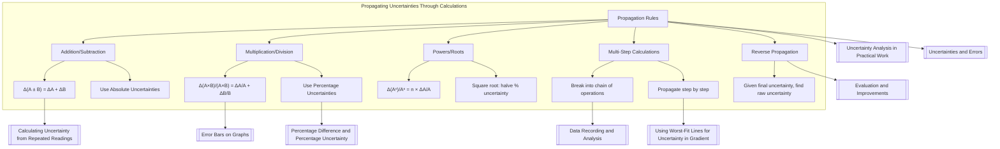

# Propagating Uncertainties Through Calculations / 通过计算传播不确定度

---

# 1. Overview / 概述

**English:**
When you perform calculations on measured quantities (e.g., adding lengths, multiplying forces, or taking the square root of a time), the uncertainties in the raw measurements must be **propagated** — carried through — to the final result. This sub-topic covers the **rules for combining uncertainties** in addition, subtraction, multiplication, division, powers, and roots. Mastering propagation is essential for evaluating whether experimental results agree with theoretical predictions and for justifying improvements in practical work. This leaf node sits within the broader [[Uncertainty Analysis in Practical Work]] hub and builds directly on [[Uncertainties and Errors]] and [[Data Recording and Analysis]].

**中文:**
当对测量量进行计算时（例如，将长度相加、将力相乘、或对时间取平方根），原始测量中的不确定度必须**传播**到最终结果中。本子知识点涵盖**加、减、乘、除、幂和根运算中不确定度的组合规则**。掌握传播方法对于评估实验结果是否与理论预测一致以及证明实验改进的合理性至关重要。本叶节点属于[[Uncertainty Analysis in Practical Work]]知识图谱的一部分，并直接建立在[[Uncertainties and Errors]]和[[Data Recording and Analysis]]的基础上。

---

# 2. Syllabus Learning Objectives / 考纲学习目标

| CAIE 9702 | Edexcel IAL |
|-----------|-------------|
| Combine uncertainties in calculations (addition, subtraction, multiplication, division, powers, roots) | Propagate uncertainties through calculations using absolute and percentage uncertainties |
| Determine the uncertainty in a derived quantity | Combine uncertainties in sums, differences, products, quotients, and powers |
| Use the concept of percentage uncertainty to compare uncertainties | Use the rule: when adding/subtracting, add absolute uncertainties; when multiplying/dividing, add percentage uncertainties |

**Examiner Expectations / 考官期望:**
- **English:** You must be able to apply the correct rule for each operation type. For addition/subtraction, use **absolute uncertainties**. For multiplication/division/powers/roots, use **percentage uncertainties**. You must also be able to **reverse** the process — given a final uncertainty, deduce the uncertainty in a raw measurement.
- **中文:** 你必须能够对每种运算类型应用正确的规则。对于加/减法，使用**绝对不确定度**。对于乘/除/幂/根，使用**百分比不确定度**。你还必须能够**逆向**应用——给定最终不确定度，推导出原始测量的不确定度。

---

# 3. Core Definitions / 核心定义

| Term (EN/CN) | Definition (EN) | Definition (CN) | Common Mistakes / 常见错误 |
|--------------|-----------------|-----------------|---------------------------|
| **Propagation of Uncertainty** / 不确定度传播 | The process of determining the uncertainty in a calculated result from the uncertainties in the input measurements. | 根据输入测量的不确定度确定计算结果不确定度的过程。 | Confusing propagation with error analysis of systematic errors. |
| **Absolute Uncertainty** / 绝对不确定度 | The actual range of possible values for a measurement, expressed in the same units as the measurement (e.g., ±0.1 cm). | 测量可能值的实际范围，以与测量相同的单位表示（例如，±0.1 cm）。 | Forgetting to keep the same number of decimal places. |
| **Percentage Uncertainty** / 百分比不确定度 | The absolute uncertainty expressed as a percentage of the measured value: $\frac{\Delta x}{x} \times 100\%$. | 绝对不确定度表示为测量值的百分比：$\frac{\Delta x}{x} \times 100\%$。 | Using percentage uncertainty when adding/subtracting. |
| **Combined Uncertainty** / 组合不确定度 | The total uncertainty in a calculated result after propagation. | 传播后计算结果中的总不确定度。 | Forgetting to propagate through all steps of a multi-step calculation. |
| **Derived Quantity** / 导出量 | A quantity calculated from two or more directly measured quantities (e.g., density from mass and volume). | 由两个或多个直接测量量计算得出的量（例如，由质量和体积计算密度）。 | Confusing derived quantity with raw measurement. |

---

# 4. Key Concepts Explained / 关键概念详解

## 4.1 The Two Golden Rules / 两条黄金法则

### Explanation / 解释
**English:**
There are only **two rules** you need to remember for propagating uncertainties through any calculation:

1. **Addition and Subtraction:** Add the **absolute uncertainties**.
   $$ \Delta (A \pm B) = \Delta A + \Delta B $$

2. **Multiplication, Division, Powers, and Roots:** Add the **percentage uncertainties**.
   $$ \frac{\Delta (A \times B)}{A \times B} = \frac{\Delta A}{A} + \frac{\Delta B}{B} $$
   $$ \frac{\Delta (A^n)}{A^n} = n \times \frac{\Delta A}{A} $$

These rules come from the **worst-case** combination of uncertainties — we assume all uncertainties act in the same direction to give the largest possible error in the final result.

**中文:**
你只需要记住**两条规则**即可在任何计算中传播不确定度：

1. **加法和减法：** 将**绝对不确定度**相加。
   $$ \Delta (A \pm B) = \Delta A + \Delta B $$

2. **乘法、除法、幂和根：** 将**百分比不确定度**相加。
   $$ \frac{\Delta (A \times B)}{A \times B} = \frac{\Delta A}{A} + \frac{\Delta B}{B} $$
   $$ \frac{\Delta (A^n)}{A^n} = n \times \frac{\Delta A}{A} $$

这些规则基于不确定度的**最坏情况**组合——我们假设所有不确定度都朝同一方向作用，以在最终结果中产生最大可能的误差。

### Physical Meaning / 物理意义
**English:**
When you add or subtract, the absolute size of the uncertainty range adds up directly. When you multiply or divide, the **fractional** (percentage) uncertainty in each input contributes to the fractional uncertainty in the output. For powers, the exponent amplifies the percentage uncertainty.

**中文:**
当进行加法或减法时，不确定度范围的绝对大小直接相加。当进行乘法或除法时，每个输入的**分数**（百分比）不确定度会贡献给输出的分数不确定度。对于幂运算，指数会放大百分比不确定度。

### Common Misconceptions / 常见误区
- ❌ **Using percentage uncertainties for addition/subtraction** — This is the most common error. Always use absolute uncertainties for ±.
- ❌ **Forgetting to convert back to absolute uncertainty** — After multiplying/dividing, you get a percentage uncertainty. You must convert it back to absolute uncertainty at the end.
- ❌ **Adding absolute uncertainties for multiplication** — This gives a meaningless result.
- ❌ **Ignoring constants** — Constants (like $\pi$, $g$, $2$) have zero uncertainty and do not contribute.

### Exam Tips / 考试提示
- **English:** Always write the percentage uncertainty as a fraction first: $\frac{\Delta A}{A}$, then multiply by 100% at the end. This avoids decimal errors.
- **中文:** 始终先将百分比不确定度写为分数形式：$\frac{\Delta A}{A}$，最后再乘以100%。这样可以避免小数错误。

> 📷 **IMAGE PROMPT — FLOWCHART: Decision Tree for Propagation Rules**
> A flowchart showing: "Start → Is the operation addition or subtraction? → Yes: Use absolute uncertainties (add them). → No: Is it multiplication, division, power, or root? → Yes: Use percentage uncertainties (add them). → End: Convert to absolute uncertainty if needed." Use clean, exam-style layout with arrows and boxes.

---

## 4.2 Multi-Step Calculations / 多步计算

### Explanation / 解释
**English:**
Many practical calculations involve multiple steps (e.g., $T = 2\pi \sqrt{\frac{l}{g}}$). You must propagate uncertainties **step by step** through the calculation. The key strategy is:

1. Identify each operation in order.
2. Apply the correct rule at each step.
3. Keep track of whether you are working in absolute or percentage form.
4. Convert back to absolute uncertainty only at the very end.

**中文:**
许多实际计算涉及多个步骤（例如，$T = 2\pi \sqrt{\frac{l}{g}}$）。你必须**逐步**通过计算传播不确定度。关键策略是：

1. 按顺序识别每个运算。
2. 在每一步应用正确的规则。
3. 跟踪你是在使用绝对形式还是百分比形式。
4. 仅在最后转换回绝对不确定度。

### Common Misconceptions / 常见误区
- ❌ **Applying all rules at once** — You must propagate step by step, not combine all uncertainties in one formula.
- ❌ **Forgetting that constants have zero uncertainty** — $2\pi$ has no uncertainty.

### Exam Tips / 考试提示
- **English:** For complex formulas, break the calculation into a **chain** of simple operations. Propagate at each link.
- **中文:** 对于复杂公式，将计算分解为一系列简单运算的**链条**。在每个环节进行传播。

---

# 5. Essential Equations / 核心公式

## Equation 1: Addition and Subtraction / 加法和减法

$$ \Delta (A \pm B) = \Delta A + \Delta B $$

| Symbol (符号) | Meaning (EN) | Meaning (CN) | Unit (单位) |
|--------------|-------------|-------------|------------|
| $\Delta A$ | Absolute uncertainty in A | A的绝对不确定度 | Same as A |
| $\Delta B$ | Absolute uncertainty in B | B的绝对不确定度 | Same as B |
| $\Delta (A \pm B)$ | Combined absolute uncertainty | 组合绝对不确定度 | Same as A and B |

**Derivation / 推导:**
The worst-case scenario: $A$ could be $A + \Delta A$ and $B$ could be $B + \Delta B$, so $(A+B)$ could be as large as $(A+B) + (\Delta A + \Delta B)$. Similarly, $(A-B)$ could be as large as $(A-B) + (\Delta A + \Delta B)$.

**Conditions / 适用条件:**
- **English:** Only for addition and subtraction. The uncertainties are assumed to be independent and random.
- **中文:** 仅适用于加法和减法。假设不确定度是独立且随机的。

**Limitations / 局限性:**
- **English:** This is a worst-case (maximum) estimate. In reality, uncertainties may partially cancel, but A-Level exams require the worst-case approach.
- **中文:** 这是最坏情况（最大）估计。实际上，不确定度可能部分抵消，但A-Level考试要求使用最坏情况方法。

---

## Equation 2: Multiplication and Division / 乘法和除法

$$ \frac{\Delta (A \times B)}{A \times B} = \frac{\Delta A}{A} + \frac{\Delta B}{B} $$

$$ \frac{\Delta (A / B)}{A / B} = \frac{\Delta A}{A} + \frac{\Delta B}{B} $$

| Symbol (符号) | Meaning (EN) | Meaning (CN) | Unit (单位) |
|--------------|-------------|-------------|------------|
| $\frac{\Delta A}{A}$ | Fractional uncertainty in A | A的分数不确定度 | Dimensionless |
| $\frac{\Delta B}{B}$ | Fractional uncertainty in B | B的分数不确定度 | Dimensionless |
| $\frac{\Delta (A \times B)}{A \times B}$ | Fractional uncertainty in product | 乘积的分数不确定度 | Dimensionless |

**Derivation / 推导:**
Consider $P = A \times B$. The maximum possible value is $(A + \Delta A)(B + \Delta B) = AB + A\Delta B + B\Delta A + \Delta A \Delta B$. Ignoring the small $\Delta A \Delta B$ term, the maximum change is $A\Delta B + B\Delta A$. Dividing by $AB$ gives $\frac{\Delta B}{B} + \frac{\Delta A}{A}$.

**Conditions / 适用条件:**
- **English:** Only for multiplication and division. The fractional uncertainties must be small (<10%) for the approximation to be valid.
- **中文:** 仅适用于乘法和除法。分数不确定度必须较小（<10%）才能使近似有效。

**Limitations / 局限性:**
- **English:** The derivation ignores the product of two small uncertainties ($\Delta A \Delta B$). This is acceptable for A-Level.
- **中文:** 推导忽略了两个小不确定度的乘积（$\Delta A \Delta B$）。这在A-Level中是可以接受的。

---

## Equation 3: Powers and Roots / 幂和根

$$ \frac{\Delta (A^n)}{A^n} = n \times \frac{\Delta A}{A} $$

$$ \frac{\Delta (A^{1/n})}{A^{1/n}} = \frac{1}{n} \times \frac{\Delta A}{A} $$

| Symbol (符号) | Meaning (EN) | Meaning (CN) | Unit (单位) |
|--------------|-------------|-------------|------------|
| $n$ | Exponent (power) | 指数（幂） | Dimensionless |
| $\frac{\Delta (A^n)}{A^n}$ | Fractional uncertainty in $A^n$ | $A^n$的分数不确定度 | Dimensionless |

**Derivation / 推导:**
This is a special case of the multiplication rule. $A^n = A \times A \times ... \times A$ (n times). Adding the fractional uncertainties $n$ times gives $n \times \frac{\Delta A}{A}$.

**Conditions / 适用条件:**
- **English:** Works for any real exponent $n$ (positive, negative, fractional). For negative exponents, the absolute value of $n$ is used.
- **中文:** 适用于任何实数指数$n$（正数、负数、分数）。对于负指数，使用$n$的绝对值。

**Limitations / 局限性:**
- **English:** Same as multiplication — assumes small fractional uncertainties.
- **中文:** 与乘法相同——假设分数不确定度较小。

> 📷 **IMAGE PROMPT — FORMULA CARD: Summary of Propagation Rules**
> A clean, exam-style formula card showing three boxes: (1) Addition/Subtraction: $\Delta(A \pm B) = \Delta A + \Delta B$; (2) Multiplication/Division: $\frac{\Delta(A \times B)}{A \times B} = \frac{\Delta A}{A} + \frac{\Delta B}{B}$; (3) Powers/Roots: $\frac{\Delta(A^n)}{A^n} = n \times \frac{\Delta A}{A}$. Use color coding: blue for absolute, red for percentage.

---

# 6. Graphs and Relationships / 图表与关系

## 6.1 Visualizing Propagation: Error Bars on Calculated Results / 可视化传播：计算结果上的误差线

### Axes / 坐标轴 (EN+CN)
- **English:** x-axis: Input measurement value; y-axis: Calculated result value
- **中文:** x轴：输入测量值；y轴：计算结果值

### Shape / 形状 (EN+CN)
- **English:** For a linear relationship ($y = mx + c$), the uncertainty in $y$ due to uncertainty in $x$ is $\Delta y = m \Delta x$. For a power relationship ($y = kx^n$), the percentage uncertainty in $y$ is $n$ times the percentage uncertainty in $x$.
- **中文:** 对于线性关系（$y = mx + c$），由$x$的不确定度引起的$y$的不确定度为$\Delta y = m \Delta x$。对于幂关系（$y = kx^n$），$y$的百分比不确定度是$x$的百分比不确定度的$n$倍。

### Gradient Meaning / 斜率含义 (EN+CN)
- **English:** The gradient $m$ amplifies the absolute uncertainty in $x$ when propagating to $y$.
- **中文:** 斜率$m$在传播到$y$时会放大$x$的绝对不确定度。

### Area Meaning / 面积含义 (EN+CN)
- **English:** Not applicable for propagation rules directly.
- **中文:** 不直接适用于传播规则。

### Exam Interpretation / 考试解读 (EN+CN)
- **English:** If a graph shows error bars on the y-axis, the uncertainty in the gradient can be found using [[Using Worst-Fit Lines for Uncertainty in Gradient]].
- **中文:** 如果图表显示y轴上的误差线，则可以使用[[Using Worst-Fit Lines for Uncertainty in Gradient]]找到斜率的不可确定度。

---

# 7. Required Diagrams / 必备图表

## 7.1 Propagation Flowchart / 传播流程图

### Description / 描述 (EN+CN)
- **English:** A flowchart showing the decision process for choosing the correct propagation rule based on the type of mathematical operation.
- **中文:** 一个流程图，显示根据数学运算类型选择正确传播规则的决策过程。

### Image Prompt / 图片生成提示
> 📷 **IMAGE PROMPT — FLOWCHART: Propagation Decision Tree**
> A clean, exam-style flowchart with four decision diamonds: "Is it addition or subtraction?" → Yes: "Use absolute uncertainties: add them." → No: "Is it multiplication, division, power, or root?" → Yes: "Use percentage uncertainties: add them." → End: "Convert to absolute uncertainty if needed." Use blue for absolute paths, red for percentage paths. Include example formulas in boxes.

### Labels Required / 需要标注 (EN+CN)
- **English:** "Addition/Subtraction", "Multiplication/Division", "Powers/Roots", "Absolute Uncertainty", "Percentage Uncertainty"
- **中文:** "加法/减法", "乘法/除法", "幂/根", "绝对不确定度", "百分比不确定度"

### Exam Importance / 考试重要性 (EN+CN)
- **English:** High — students often confuse which rule to apply. A flowchart helps avoid this error.
- **中文:** 高——学生经常混淆应用哪条规则。流程图有助于避免此错误。

---

## 7.2 Worked Example Diagram: Density Calculation / 示例图：密度计算

### Description / 描述 (EN+CN)
- **English:** A diagram showing a metal cylinder with measured mass $m = 50.0 \pm 0.1$ g and volume $V = 20.0 \pm 0.2$ cm³, with the propagation steps shown: (1) Calculate density $\rho = m/V = 2.50$ g/cm³; (2) Calculate percentage uncertainties: $\frac{\Delta m}{m} = 0.2\%$, $\frac{\Delta V}{V} = 1.0\%$; (3) Add: total percentage uncertainty = 1.2%; (4) Convert to absolute: $\Delta \rho = 0.030$ g/cm³; (5) Final: $\rho = 2.50 \pm 0.03$ g/cm³.
- **中文:** 一个图表显示一个金属圆柱体，测量质量$m = 50.0 \pm 0.1$ g，体积$V = 20.0 \pm 0.2$ cm³，并显示传播步骤：(1) 计算密度 $\rho = m/V = 2.50$ g/cm³；(2) 计算百分比不确定度：$\frac{\Delta m}{m} = 0.2\%$，$\frac{\Delta V}{V} = 1.0\%$；(3) 相加：总百分比不确定度 = 1.2%；(4) 转换为绝对：$\Delta \rho = 0.030$ g/cm³；(5) 最终：$\rho = 2.50 \pm 0.03$ g/cm³。

### Image Prompt / 图片生成提示
> 📷 **IMAGE PROMPT — DIAGRAM: Density Propagation Worked Example**
> A step-by-step visual showing a metal cylinder with labeled mass and volume. Below, five numbered boxes showing each propagation step with formulas. Use arrows connecting steps. Color code: blue for absolute uncertainties, red for percentage uncertainties, green for final result.

### Labels Required / 需要标注 (EN+CN)
- **English:** "Mass m = 50.0 ± 0.1 g", "Volume V = 20.0 ± 0.2 cm³", "Density ρ = m/V", "Percentage uncertainty in m: 0.2%", "Percentage uncertainty in V: 1.0%", "Combined: 1.2%", "Final: ρ = 2.50 ± 0.03 g/cm³"
- **中文:** "质量 m = 50.0 ± 0.1 g", "体积 V = 20.0 ± 0.2 cm³", "密度 ρ = m/V", "m的百分比不确定度：0.2%", "V的百分比不确定度：1.0%", "组合：1.2%", "最终：ρ = 2.50 ± 0.03 g/cm³"

### Exam Importance / 考试重要性 (EN+CN)
- **English:** Very high — density calculations are a common exam context for propagation.
- **中文:** 非常高——密度计算是传播的常见考试背景。

---

# 8. Worked Examples / 典型例题

## Example 1: Simple Propagation — Addition and Multiplication / 简单传播——加法和乘法

### Question / 题目
**English:**
A student measures the length of a table as $L = 1.200 \pm 0.005$ m and the width as $W = 0.800 \pm 0.005$ m. Calculate:
(a) The perimeter $P = 2(L + W)$ and its absolute uncertainty.
(b) The area $A = L \times W$ and its absolute uncertainty.

**中文:**
一名学生测量桌子的长度为 $L = 1.200 \pm 0.005$ m，宽度为 $W = 0.800 \pm 0.005$ m。计算：
(a) 周长 $P = 2(L + W)$ 及其绝对不确定度。
(b) 面积 $A = L \times W$ 及其绝对不确定度。

### Solution / 解答

**Part (a): Perimeter / 周长**

1. **Calculate the sum:** $L + W = 1.200 + 0.800 = 2.000$ m
2. **Propagate uncertainty for addition:** $\Delta(L + W) = \Delta L + \Delta W = 0.005 + 0.005 = 0.010$ m
3. **Multiply by constant 2:** $P = 2 \times 2.000 = 4.000$ m. The constant 2 has no uncertainty, so $\Delta P = 2 \times \Delta(L + W) = 2 \times 0.010 = 0.020$ m
4. **Final answer:** $P = 4.000 \pm 0.020$ m

**Part (b): Area / 面积**

1. **Calculate the product:** $A = L \times W = 1.200 \times 0.800 = 0.960$ m²
2. **Calculate percentage uncertainties:**
   - $\frac{\Delta L}{L} = \frac{0.005}{1.200} = 0.00417 = 0.417\%$
   - $\frac{\Delta W}{W} = \frac{0.005}{0.800} = 0.00625 = 0.625\%$
3. **Add percentage uncertainties:** Total percentage uncertainty = $0.417\% + 0.625\% = 1.042\%$
4. **Convert to absolute uncertainty:** $\Delta A = 0.960 \times \frac{1.042}{100} = 0.0100$ m²
5. **Final answer:** $A = 0.960 \pm 0.010$ m²

### Final Answer / 最终答案
**Answer:** (a) $P = 4.000 \pm 0.020$ m; (b) $A = 0.960 \pm 0.010$ m² | **答案：** (a) $P = 4.000 \pm 0.020$ m; (b) $A = 0.960 \pm 0.010$ m²

### Quick Tip / 提示
- **English:** For part (a), note that the constant 2 multiplies both the value and the uncertainty. For part (b), always convert to percentage uncertainties before adding.
- **中文:** 对于(a)部分，注意常数2同时乘以数值和不确定度。对于(b)部分，始终在相加前转换为百分比不确定度。

---

## Example 2: Propagation with Powers — Period of a Pendulum / 带幂的传播——单摆周期

### Question / 题目
**English:**
The period $T$ of a simple pendulum is given by $T = 2\pi \sqrt{\frac{l}{g}}$, where $l$ is the length and $g$ is the acceleration due to gravity. A student measures $l = 0.500 \pm 0.005$ m and uses $g = 9.81$ m/s² (assumed exact). Calculate $T$ and its absolute uncertainty.

**中文:**
单摆的周期 $T$ 由 $T = 2\pi \sqrt{\frac{l}{g}}$ 给出，其中 $l$ 是摆长，$g$ 是重力加速度。一名学生测量 $l = 0.500 \pm 0.005$ m，并使用 $g = 9.81$ m/s²（假设精确）。计算 $T$ 及其绝对不确定度。

### Solution / 解答

1. **Calculate the value of $T$:**
   $$ T = 2\pi \sqrt{\frac{0.500}{9.81}} = 2\pi \times 0.2257 = 1.418 \text{ s} $$

2. **Identify the operations:**
   - Division: $l / g$
   - Square root: $\sqrt{l/g}$
   - Multiplication by constant: $2\pi \times \sqrt{l/g}$

3. **Propagate step by step:**

   **Step 1: Division $l/g$**
   - Percentage uncertainty in $l$: $\frac{0.005}{0.500} \times 100\% = 1.0\%$
   - $g$ is exact, so its percentage uncertainty is 0%.
   - Total percentage uncertainty in $l/g$: $1.0\% + 0\% = 1.0\%$

   **Step 2: Square root $\sqrt{l/g}$**
   - For a square root, $n = 1/2$, so percentage uncertainty is halved:
   - $\frac{\Delta (\sqrt{l/g})}{\sqrt{l/g}} = \frac{1}{2} \times 1.0\% = 0.5\%$

   **Step 3: Multiply by constant $2\pi$**
   - Constant has no uncertainty, so percentage uncertainty remains 0.5%.

4. **Convert to absolute uncertainty:**
   $$ \Delta T = 1.418 \times \frac{0.5}{100} = 0.00709 \text{ s} \approx 0.007 \text{ s} $$

5. **Final answer:**
   $$ T = 1.418 \pm 0.007 \text{ s} $$

### Final Answer / 最终答案
**Answer:** $T = 1.418 \pm 0.007$ s | **答案：** $T = 1.418 \pm 0.007$ s

### Quick Tip / 提示
- **English:** When taking a square root, the percentage uncertainty is **halved**. For a cube root, it is divided by 3. Remember: $\frac{\Delta (A^{1/n})}{A^{1/n}} = \frac{1}{n} \times \frac{\Delta A}{A}$.
- **中文:** 取平方根时，百分比不确定度**减半**。对于立方根，除以3。记住：$\frac{\Delta (A^{1/n})}{A^{1/n}} = \frac{1}{n} \times \frac{\Delta A}{A}$。

---

# 9. Past Paper Question Types / 历年真题题型

| Question Type / 题型 | Frequency / 频率 | Difficulty / 难度 | Past Paper References / 真题索引 |
|----------------------|------------------|------------------|-------------------------------|
| Calculate combined uncertainty from given measurements (addition/multiplication) | Very High | Medium | 📝 *待填入* |
| Propagate uncertainty through a formula with powers/roots | High | Hard | 📝 *待填入* |
| Given final uncertainty, find uncertainty in a raw measurement (reverse propagation) | Medium | Hard | 📝 *待填入* |
| Compare two results using percentage uncertainty after propagation | Medium | Medium | 📝 *待填入* |
| Evaluate whether a result agrees with a theoretical value using propagated uncertainty | High | Medium | 📝 *待填入* |

**Common Command Words / 常见指令词:**
- **English:** "Calculate the uncertainty in...", "Determine the percentage uncertainty in...", "Show that the uncertainty in... is...", "Use your results to find the uncertainty in..."
- **中文:** "计算...的不确定度"，"确定...的百分比不确定度"，"证明...的不确定度为..."，"利用你的结果找出...的不确定度"

---

# 10. Practical Skills Connections / 实验技能链接

**English:**
Propagating uncertainties is a **core skill** in practical papers (CAIE Paper 3/5, Edexcel U3/U6). You will need to:

- **Record raw data** with appropriate uncertainties (see [[Data Recording and Analysis]]).
- **Calculate derived quantities** (e.g., $T^2$, $1/d$, $v^2$) and propagate uncertainties into these derived values.
- **Plot graphs** with error bars on derived quantities (see [[Error Bars on Graphs]]).
- **Use worst-fit lines** to find uncertainty in gradient (see [[Using Worst-Fit Lines for Uncertainty in Gradient]]).
- **Evaluate** whether your final result agrees with a theoretical value by comparing the propagated uncertainty range.

**Common practical contexts:**
- **Density:** $\rho = m/V$ — propagate uncertainties in mass and volume.
- **Resistivity:** $\rho = \frac{RA}{L}$ — propagate uncertainties in resistance, cross-sectional area, and length.
- **Young's modulus:** $E = \frac{FL}{A\Delta L}$ — propagate uncertainties in force, length, area, and extension.
- **Pendulum period:** $T = 2\pi \sqrt{l/g}$ — propagate uncertainty in length to find uncertainty in $g$.

**中文:**
传播不确定度是实验考试（CAIE Paper 3/5，Edexcel U3/U6）中的**核心技能**。你需要：

- **记录原始数据**并附上适当的不确定度（参见[[Data Recording and Analysis]]）。
- **计算导出量**（例如，$T^2$，$1/d$，$v^2$）并将不确定度传播到这些导出值中。
- **绘制图表**，在导出量上添加误差线（参见[[Error Bars on Graphs]]）。
- **使用最差拟合线**找出斜率的不确定度（参见[[Using Worst-Fit Lines for Uncertainty in Gradient]]）。
- **评估**你的最终结果是否与理论值一致，通过比较传播后的不确定度范围。

**常见实验背景：**
- **密度：** $\rho = m/V$ — 传播质量和体积的不确定度。
- **电阻率：** $\rho = \frac{RA}{L}$ — 传播电阻、横截面积和长度的不确定度。
- **杨氏模量：** $E = \frac{FL}{A\Delta L}$ — 传播力、长度、面积和伸长量的不确定度。
- **单摆周期：** $T = 2\pi \sqrt{l/g}$ — 传播长度的不确定度以找出$g$的不确定度。

---

# 11. Concept Map / 概念图谱

---

# 12. Quick Revision Sheet / 速查表

| Category / 类别 | Key Points / 要点 |
|----------------|------------------|
| **Definition / 定义** | Propagation = carrying uncertainties through calculations to find uncertainty in the final result. / 传播 = 将不确定度通过计算传递，找出最终结果的不确定度。 |
| **Key Formula 1 / 核心公式1** | **Addition/Subtraction:** $\Delta(A \pm B) = \Delta A + \Delta B$ — use **absolute** uncertainties. / **加法/减法：** $\Delta(A \pm B) = \Delta A + \Delta B$ — 使用**绝对**不确定度。 |
| **Key Formula 2 / 核心公式2** | **Multiplication/Division:** $\frac{\Delta(A \times B)}{A \times B} = \frac{\Delta A}{A} + \frac{\Delta B}{B}$ — use **percentage** uncertainties. / **乘法/除法：** $\frac{\Delta(A \times B)}{A \times B} = \frac{\Delta A}{A} + \frac{\Delta B}{B}$ — 使用**百分比**不确定度。 |
| **Key Formula 3 / 核心公式3** | **Powers/Roots:** $\frac{\Delta(A^n)}{A^n} = n \times \frac{\Delta A}{A}$ — exponent amplifies percentage uncertainty. / **幂/根：** $\frac{\Delta(A^n)}{A^n} = n \times \frac{\Delta A}{A}$ — 指数放大百分比不确定度。 |
| **Key Graph / 核心图表** | Propagation flowchart: Addition/Subtraction → Absolute; Multiplication/Division/Powers/Roots → Percentage. / 传播流程图：加法/减法 → 绝对；乘法/除法/幂/根 → 百分比。 |
| **Common Mistake / 常见错误** | Using percentage uncertainties for addition/subtraction. Always use absolute for ±. / 对加法/减法使用百分比不确定度。对于±始终使用绝对不确定度。 |
| **Exam Tip / 考试提示** | Break multi-step calculations into a chain. Propagate at each step. Convert to absolute only at the end. / 将多步计算分解为链条。在每一步进行传播。仅在最后转换为绝对不确定度。 |
| **Practical Link / 实验链接** | Used in density, resistivity, Young's modulus, pendulum experiments. / 用于密度、电阻率、杨氏模量、单摆实验。 |