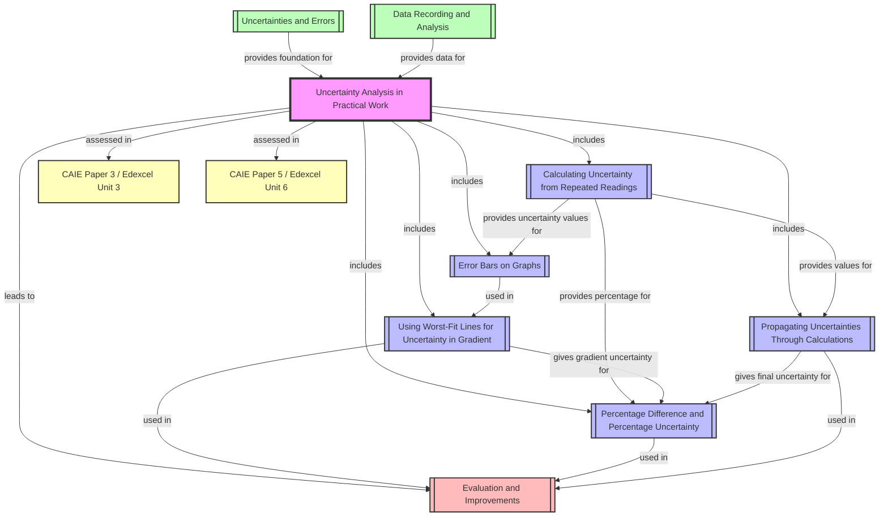

# Uncertainty Analysis in Practical Work / 实验中的不确定度分析

---

# 1. Overview / 概述

**English:**
Uncertainty analysis is the systematic process of quantifying the doubt associated with experimental measurements. In A-Level Physics, this topic is fundamental to all practical work — it transforms raw data into meaningful results with known reliability. Every measurement, no matter how carefully taken, has an inherent uncertainty due to instrument limitations, human reaction time, environmental factors, and random fluctuations. Understanding how to calculate, propagate, and represent uncertainties is essential for evaluating the quality of experimental evidence and drawing valid conclusions.

This topic bridges theoretical physics with real-world measurement science. It is directly assessed in:
- **CAIE 9702 Paper 3 (AS Practical)** and **Paper 5 (A2 Planning, Analysis & Evaluation)**
- **Edexcel IAL Unit 3 (AS Practical Skills)** and **Unit 6 (A2 Practical Skills)**

Real-world applications include quality control in manufacturing, calibration of scientific instruments, medical diagnostics (e.g., blood test accuracy), environmental monitoring, and engineering design tolerances. In examinations, candidates are expected to calculate uncertainties from repeated readings, draw error bars on graphs, determine uncertainty in gradients using worst-fit lines, propagate uncertainties through calculations, and evaluate whether experimental results are consistent with theoretical predictions.

**中文:**
不确定度分析是系统量化实验测量中固有怀疑度的过程。在A-Level物理中，这一主题是所有实验工作的基础——它将原始数据转化为具有已知可靠性的有意义结果。每一次测量，无论多么仔细，都由于仪器限制、人体反应时间、环境因素和随机波动而具有固有的不确定度。理解如何计算、传播和表示不确定度，对于评估实验证据的质量和得出有效结论至关重要。

该主题将理论物理与现实测量科学联系起来。它直接考核于：
- **CAIE 9702 试卷3（AS实验）** 和 **试卷5（A2计划、分析与评估）**
- **Edexcel IAL 单元3（AS实验技能）** 和 **单元6（A2实验技能）**

实际应用包括制造业的质量控制、科学仪器的校准、医学诊断（如血液检测准确性）、环境监测和工程设计公差。在考试中，考生需要从重复读数计算不确定度、在图表上绘制误差棒、使用最差拟合线确定斜率的不确定度、通过计算传播不确定度，以及评估实验结果是否与理论预测一致。

---

# 2. Syllabus Learning Objectives / 考纲学习目标

| CAIE 9702 | Edexcel IAL |
|-----------|-------------|
| **Paper 3 (AS):** Identify and quantify sources of uncertainty; calculate absolute and percentage uncertainties; combine uncertainties using addition, subtraction, multiplication, division, and powers; draw error bars on graphs; determine uncertainty in gradient using worst-fit lines; evaluate whether results are consistent with given values. | **Unit 3 (AS):** Identify random and systematic errors; calculate mean and range; determine absolute and percentage uncertainties; propagate uncertainties through simple calculations; draw error bars; determine gradient uncertainty using worst-fit lines; evaluate reliability of results. |
| **Paper 5 (A2):** Plan experiments that minimise uncertainties; analyse data with full uncertainty propagation; evaluate experimental methods and suggest improvements; determine whether results support a hypothesis within stated uncertainties. | **Unit 6 (A2):** Analyse complex data sets with uncertainties; propagate uncertainties through multi-step calculations; evaluate experimental designs; determine uncertainty in intercepts and gradients; use percentage difference to compare experimental and theoretical values. |

**Examiner Expectations / 考官期望:**

**English:**
- Candidates must distinguish between **random errors** (reduced by repeats) and **systematic errors** (reduced by calibration).
- For repeated readings, the **uncertainty** is half the range (or ± range/2).
- For single readings, the uncertainty is ± half the smallest division of the instrument.
- Error bars must be drawn as vertical/horizontal lines of length ± uncertainty.
- Worst-fit lines must be drawn with maximum and minimum plausible slopes.
- Percentage uncertainty = (absolute uncertainty / measured value) × 100%.
- Propagated uncertainty rules must be applied correctly.
- Final answers should be quoted to the same number of decimal places as the uncertainty.

**中文:**
- 考生必须区分**随机误差**（通过重复测量减少）和**系统误差**（通过校准减少）。
- 对于重复读数，**不确定度**是极差的一半（或 ± 极差/2）。
- 对于单次读数，不确定度是 ± 仪器最小刻度的一半。
- 误差棒必须绘制为长度为 ± 不确定度的垂直线/水平线。
- 最差拟合线必须绘制具有最大和最小合理斜率的线。
- 百分比不确定度 = （绝对不确定度 / 测量值）× 100%。
- 必须正确应用传播不确定度规则。
- 最终答案应引用与不确定度相同的小数位数。

> 📋 **CIE Only:** Paper 5 requires candidates to plan experiments that minimise uncertainties and to evaluate whether results support a hypothesis within stated uncertainties. The "percentage difference" formula is explicitly tested: percentage difference = |experimental value - theoretical value| / theoretical value × 100%.
>
> 📋 **Edexcel Only:** Unit 6 requires propagation through multi-step calculations and determination of uncertainty in intercepts as well as gradients. Edexcel also emphasises the use of "range" rather than "half-range" for uncertainty in some contexts.

---

# 3. Core Definitions / 核心定义

| Term (EN/CN) | Definition (EN) | Definition (CN) | Common Mistakes / 常见错误 |
|--------------|-----------------|-----------------|---------------------------|
| **Uncertainty / 不确定度** | The range of values within which the true value is expected to lie, with a given level of confidence. | 真实值预期所在的数值范围，具有给定的置信水平。 | Confusing uncertainty with error; uncertainty is a range, error is the difference from true value. |
| **Absolute Uncertainty / 绝对不确定度** | The actual magnitude of uncertainty, expressed in the same units as the measurement (e.g., ±0.1 cm). | 不确定度的实际大小，以与测量相同的单位表示（如 ±0.1 cm）。 | Forgetting the ± sign; quoting too many significant figures. |
| **Percentage Uncertainty / 百分比不确定度** | The absolute uncertainty expressed as a percentage of the measured value. | 绝对不确定度表示为测量值的百分比。 | Using wrong formula; forgetting to multiply by 100%. |
| **Random Error / 随机误差** | Errors that cause readings to scatter randomly around the true value; reduced by taking more readings. | 导致读数围绕真实值随机散布的误差；通过取更多读数减少。 | Confusing with systematic error; thinking repeats eliminate all errors. |
| **Systematic Error / 系统误差** | Errors that cause readings to be consistently too high or too low; not reduced by repeats. | 导致读数一致偏高或偏低的误差；不能通过重复测量减少。 | Thinking calibration fixes all systematic errors; ignoring zero error. |
| **Error Bar / 误差棒** | A vertical or horizontal line on a graph representing the uncertainty in a data point. | 图表上表示数据点不确定度的垂直线或水平线。 | Drawing error bars too short/long; forgetting to label them. |
| **Worst-Fit Line / 最差拟合线** | A line of maximum or minimum plausible slope drawn through error bars to determine uncertainty in gradient. | 通过误差棒绘制的最大或最小合理斜率的线，用于确定斜率的不确定度。 | Drawing lines that don't pass through all error bars; using best-fit line instead. |
| **Propagation of Uncertainty / 不确定度传播** | The process of combining uncertainties from multiple measurements to find the uncertainty in a calculated result. | 将多个测量的不确定度组合以找到计算结果不确定度的过程。 | Using wrong rules for addition vs. multiplication; forgetting to convert to percentage for multiplication. |
| **Percentage Difference / 百分比差异** | The difference between experimental and theoretical values expressed as a percentage of the theoretical value. | 实验值与理论值之间的差异表示为理论值的百分比。 | Using experimental value as denominator; confusing with percentage uncertainty. |
| **Resolution / 分辨率** | The smallest change in a quantity that can be detected by an instrument. | 仪器可以检测到的量的最小变化。 | Confusing with uncertainty; resolution is a limit, uncertainty may be larger. |

---

# 4. Key Concepts Explained / 关键概念详解

## 4.1 Sources of Uncertainty / 不确定度来源

### Explanation / 解释
**English:**
Uncertainties arise from multiple sources in any experiment. The main categories are:
1. **Instrumental uncertainty:** Limited resolution of measuring devices (e.g., ruler ±0.5 mm, stopwatch ±0.01 s, digital balance ±0.001 g).
2. **Human uncertainty:** Reaction time in timing experiments, parallax error in reading scales, judgment in aligning objects.
3. **Environmental uncertainty:** Temperature fluctuations, air currents, vibrations affecting sensitive measurements.
4. **Random fluctuations:** Inherent variability in the quantity being measured (e.g., radioactive decay, thermal noise).
5. **Systematic effects:** Calibration errors, zero errors, parallax errors that consistently bias readings.

For a single reading, the uncertainty is typically taken as ± half the smallest division of the instrument. For repeated readings, the uncertainty is half the range (range = maximum - minimum). The final uncertainty should be quoted to one significant figure, and the measured value should be quoted to the same decimal place.

**中文:**
不确定度在任何实验中都有多个来源。主要类别包括：
1. **仪器不确定度：** 测量设备的分辨率有限（如尺子 ±0.5 mm，秒表 ±0.01 s，数字天平 ±0.001 g）。
2. **人为不确定度：** 计时实验中的反应时间、读取刻度时的视差误差、对齐物体时的判断。
3. **环境不确定度：** 温度波动、气流、影响敏感测量的振动。
4. **随机波动：** 被测量量的固有变异性（如放射性衰变、热噪声）。
5. **系统效应：** 校准误差、零点误差、一致偏置读数的视差误差。

对于单次读数，不确定度通常取为 ± 仪器最小刻度的一半。对于重复读数，不确定度是极差的一半（极差 = 最大值 - 最小值）。最终不确定度应引用到一位有效数字，测量值应引用到相同的小数位数。

### Physical Meaning / 物理意义
**English:**
Uncertainty represents the range within which the true value of a measurement is likely to lie. For example, if a length is measured as 25.0 cm ± 0.2 cm, the true length is expected to be between 24.8 cm and 25.2 cm. This does not mean the measurement is "wrong" — it means we acknowledge the inherent limitations of our measurement process.

**中文:**
不确定度表示测量的真实值可能所在的数值范围。例如，如果长度测量为 25.0 cm ± 0.2 cm，则真实长度预期在 24.8 cm 和 25.2 cm 之间。这并不意味着测量是"错误的"——它意味着我们承认测量过程的固有局限性。

### Common Misconceptions / 常见误区
1. **"Uncertainty means the measurement is inaccurate"** — Uncertainty quantifies precision, not accuracy. A precise measurement can have small uncertainty but still be inaccurate due to systematic error.
2. **"More readings always reduce uncertainty"** — More readings reduce random uncertainty but do not affect systematic uncertainty.
3. **"The uncertainty is always half the smallest division"** — This applies only to single readings; for repeated readings, use half the range.
4. **"Digital instruments have zero uncertainty"** — Digital instruments have uncertainty of ±1 in the last digit (e.g., ±0.001 g for a balance reading 12.345 g).

### Exam Tips / 考试提示
**English:**
- Always state the source of uncertainty explicitly (e.g., "reaction time of ±0.1 s").
- For timing experiments, human reaction time (~0.1-0.2 s) is often the dominant uncertainty.
- When calculating uncertainty from repeated readings, show the range calculation clearly.
- In Paper 5 (CIE) and Unit 6 (Edexcel), you may need to suggest how to reduce uncertainties (e.g., use a more precise instrument, take more readings, use a fiducial marker).

**中文:**
- 始终明确说明不确定度的来源（如"反应时间 ±0.1 s"）。
- 对于计时实验，人体反应时间（~0.1-0.2 s）通常是主要不确定度。
- 从重复读数计算不确定度时，清晰显示极差计算。
- 在试卷5（CIE）和单元6（Edexcel）中，你可能需要建议如何减少不确定度（如使用更精密的仪器、取更多读数、使用参考标记）。

---

## 4.2 Calculating Uncertainty from Repeated Readings / 从重复读数计算不确定度

### Explanation / 解释
**English:**
When a measurement is repeated multiple times, the best estimate of the true value is the **mean** (average). The uncertainty is given by **half the range**:

$$\text{Uncertainty} = \frac{\text{Maximum value} - \text{Minimum value}}{2}$$

The result is quoted as: $$\text{Mean} \pm \text{Uncertainty}$$

For example, if five readings of time are: 12.3 s, 12.5 s, 12.4 s, 12.6 s, 12.3 s:
- Mean = (12.3 + 12.5 + 12.4 + 12.6 + 12.3) / 5 = 12.42 s
- Range = 12.6 - 12.3 = 0.3 s
- Uncertainty = 0.3 / 2 = 0.15 s
- Final result: 12.42 s ± 0.15 s (or 12.4 s ± 0.2 s when rounded appropriately)

**Important:** The uncertainty should be quoted to one significant figure, and the mean should be quoted to the same decimal place as the uncertainty.

**中文:**
当测量重复多次时，真实值的最佳估计是**平均值**。不确定度由**极差的一半**给出：

$$\text{不确定度} = \frac{\text{最大值} - \text{最小值}}{2}$$

结果引用为：$$\text{平均值} \pm \text{不确定度}$$

例如，如果五次时间读数为：12.3 s, 12.5 s, 12.4 s, 12.6 s, 12.3 s：
- 平均值 = (12.3 + 12.5 + 12.4 + 12.6 + 12.3) / 5 = 12.42 s
- 极差 = 12.6 - 12.3 = 0.3 s
- 不确定度 = 0.3 / 2 = 0.15 s
- 最终结果：12.42 s ± 0.15 s（适当四舍五入后为 12.4 s ± 0.2 s）

**重要：** 不确定度应引用到一位有效数字，平均值应引用到与不确定度相同的小数位数。

### Physical Meaning / 物理意义
**English:**
The half-range method assumes that the true value lies somewhere within the spread of readings. This is a simple but robust method suitable for A-Level practical work. For a more rigorous statistical treatment, standard deviation would be used, but half-range is the accepted method in both CAIE and Edexcel syllabuses.

**中文:**
极差一半法假设真实值位于读数散布范围内的某处。这是一种简单但稳健的方法，适用于A-Level实验工作。对于更严格的统计处理，会使用标准偏差，但极差一半法是CAIE和Edexcel考纲中公认的方法。

### Common Misconceptions / 常见误区
1. **"Using more readings always gives a smaller uncertainty"** — The range may actually increase with more readings as you capture more variability.
2. **"I should use the standard deviation instead of half-range"** — A-Level syllabuses explicitly require half-range, not standard deviation.
3. **"I can ignore outliers"** — Outliers should be investigated, not automatically discarded. If a reading is clearly anomalous (e.g., due to a timing error), it may be excluded, but this must be justified.

### Exam Tips / 考试提示
**English:**
- Show the calculation of mean and range explicitly.
- Round the uncertainty to one significant figure first, then round the mean to match.
- If all readings are identical, the uncertainty is still ± half the smallest division of the instrument (not zero).
- In Edexcel, you may be asked to calculate the "range" directly; in CIE, "half the range" is the uncertainty.

**中文:**
- 明确显示平均值和极差的计算。
- 先将不确定度四舍五入到一位有效数字，然后将平均值四舍五入以匹配。
- 如果所有读数都相同，不确定度仍然是 ± 仪器最小刻度的一半（不是零）。
- 在Edexcel中，你可能被要求直接计算"极差"；在CIE中，"极差的一半"是不确定度。

---

## 4.3 Error Bars on Graphs / 图表上的误差棒

### Explanation / 解释
**English:**
Error bars are graphical representations of uncertainty on data points. They are drawn as vertical and/or horizontal lines extending ± uncertainty from the data point. The length of the error bar is 2 × uncertainty (i.e., from -uncertainty to +uncertainty).

**Rules for drawing error bars:**
1. Draw a vertical line through the data point, extending from (y - Δy) to (y + Δy).
2. Draw horizontal crossbars at the top and bottom (or use a rectangle).
3. If the uncertainty is too small to be visible on the graph scale, state this explicitly.
4. Error bars should be drawn for both dependent and independent variables if both have uncertainties.
5. The line of best fit should pass through all error bars (i.e., within the uncertainty range of each point).

**中文:**
误差棒是数据点上不确定度的图形表示。它们被绘制为从数据点延伸 ± 不确定度的垂直线和/或水平线。误差棒的长度是 2 × 不确定度（即从 -不确定度 到 +不确定度）。

**绘制误差棒的规则：**
1. 通过数据点绘制垂直线，从 (y - Δy) 延伸到 (y + Δy)。
2. 在顶部和底部绘制水平横线（或使用矩形）。
3. 如果不确定度太小而在图表比例上不可见，则明确说明这一点。
4. 如果因变量和自变量都有不确定度，则两者都应绘制误差棒。
5. 最佳拟合线应穿过所有误差棒（即每个点的不确定度范围内）。

### Physical Meaning / 物理意义
**English:**
Error bars communicate the reliability of each data point. A point with large error bars is less reliable than one with small error bars. When drawing a line of best fit, the line should pass through all error bars — if it cannot, this suggests either the uncertainties are underestimated or the relationship is not linear.

**中文:**
误差棒传达每个数据点的可靠性。具有大误差棒的点比具有小误差棒的点可靠性低。绘制最佳拟合线时，线应穿过所有误差棒——如果不能，这表明要么不确定度被低估，要么关系不是线性的。

### Common Misconceptions / 常见误区
1. **"Error bars show the range of possible values"** — They show the uncertainty range, not the range of possible values.
2. **"I should draw error bars only on the y-axis"** — If x has uncertainty, draw horizontal error bars too.
3. **"The best-fit line must go through every data point"** — It must go through the error bars, not necessarily through the points themselves.
4. **"I can ignore error bars when drawing the line of best fit"** — Error bars must be considered; the line should be within all error bars if possible.

### Exam Tips / 考试提示
**English:**
- In CIE Paper 3, you are often given a pre-drawn grid and asked to plot points with error bars.
- In Edexcel Unit 3, you may need to draw error bars on a graph you have plotted.
- Always use a sharp pencil and ruler for error bars.
- If error bars overlap, the points are consistent within uncertainty.
- A line that passes through all error bars is a "good fit"; if it doesn't, the relationship may not be linear.

**中文:**
- 在CIE试卷3中，你通常会被给予预绘制的网格，并要求绘制带误差棒的点。
- 在Edexcel单元3中，你可能需要在已绘制的图表上绘制误差棒。
- 始终使用削尖的铅笔和尺子绘制误差棒。
- 如果误差棒重叠，则这些点在不确定度范围内是一致的。
- 穿过所有误差棒的线是"良好拟合"；如果没有，则关系可能不是线性的。

---

## 4.4 Using Worst-Fit Lines for Uncertainty in Gradient / 使用最差拟合线确定斜率不确定度

### Explanation / 解释
**English:**
The uncertainty in the gradient of a straight-line graph is determined using **worst-fit lines**. The process is:

1. Draw the **best-fit line** (line that passes through all error bars, balancing points above and below).
2. Calculate the gradient of the best-fit line: $$m_{\text{best}} = \frac{\Delta y_{\text{best}}}{\Delta x_{\text{best}}}$$
3. Draw the **worst-fit line** with the **maximum plausible slope** that still passes through all error bars.
4. Draw the **worst-fit line** with the **minimum plausible slope** that still passes through all error bars.
5. Calculate the gradients of both worst-fit lines: $$m_{\text{max}}$$ and $$m_{\text{min}}$$
6. The uncertainty in gradient is: $$\Delta m = \frac{m_{\text{max}} - m_{\text{min}}}{2}$$
7. The final gradient is quoted as: $$m_{\text{best}} \pm \Delta m$$

**Important:** The worst-fit lines must still pass through all error bars — they are not arbitrary lines. They represent the steepest and shallowest lines that are consistent with the data within uncertainty.

**中文:**
直线图斜率的**不确定度**使用**最差拟合线**确定。过程如下：

1. 绘制**最佳拟合线**（穿过所有误差棒、平衡上下点的线）。
2. 计算最佳拟合线的斜率：$$m_{\text{最佳}} = \frac{\Delta y_{\text{最佳}}}{\Delta x_{\text{最佳}}}$$
3. 绘制具有**最大合理斜率**且仍穿过所有误差棒的**最差拟合线**。
4. 绘制具有**最小合理斜率**且仍穿过所有误差棒的**最差拟合线**。
5. 计算两条最差拟合线的斜率：$$m_{\text{最大}}$$ 和 $$m_{\text{最小}}$$
6. 斜率的不确定度为：$$\Delta m = \frac{m_{\text{最大}} - m_{\text{最小}}}{2}$$
7. 最终斜率引用为：$$m_{\text{最佳}} \pm \Delta m$$

**重要：** 最差拟合线必须仍然穿过所有误差棒——它们不是任意线。它们代表在不确定度范围内与数据一致的最陡和最缓的线。

### Physical Meaning / 物理意义
**English:**
The uncertainty in gradient reflects how much the slope could vary while still being consistent with the experimental data. A large uncertainty in gradient indicates that the data points are scattered or the relationship is weak. This is crucial when comparing experimental results with theoretical predictions — if the theoretical gradient falls within the uncertainty range, the experiment supports the theory.

**中文:**
斜率的不确定度反映了在仍与实验数据一致的情况下斜率可能变化的程度。斜率不确定度大表明数据点分散或关系较弱。这在将实验结果与理论预测进行比较时至关重要——如果理论斜率落在不确定度范围内，则实验支持该理论。

### Common Misconceptions / 常见误区
1. **"The worst-fit line should be as far from the best-fit line as possible"** — It must still pass through all error bars.
2. **"I can draw the worst-fit line through the extreme data points"** — It must pass through the error bars of all points, not just the extremes.
3. **"The uncertainty in gradient is the difference between best and worst gradients"** — It is half the difference (i.e., (m_max - m_min)/2).
4. **"I only need one worst-fit line"** — You need both maximum and minimum slopes.

### Exam Tips / 考试提示
**English:**
- In CIE Paper 5, you are often asked to determine the uncertainty in gradient explicitly.
- In Edexcel Unit 6, you may need to determine uncertainty in both gradient and intercept.
- Always show the triangle used to calculate each gradient on the graph.
- Use large triangles (at least half the length of the line) to minimise reading errors.
- The worst-fit lines should be clearly labelled (e.g., "max slope", "min slope").

**中文:**
- 在CIE试卷5中，你通常被要求明确确定斜率的不确定度。
- 在Edexcel单元6中，你可能需要确定斜率和截距的不确定度。
- 始终在图表上显示用于计算每个斜率的三角形。
- 使用大三角形（至少线长的一半）以最小化读数误差。
- 最差拟合线应清晰标注（如"最大斜率"、"最小斜率"）。

---

## 4.5 Percentage Difference and Percentage Uncertainty / 百分比差异和百分比不确定度

### Explanation / 解释
**English:**
**Percentage uncertainty** quantifies the relative size of uncertainty:
$$\text{Percentage uncertainty} = \frac{\text{Absolute uncertainty}}{\text{Measured value}} \times 100\%$$

**Percentage difference** compares an experimental value with a theoretical or accepted value:
$$\text{Percentage difference} = \frac{|\text{Experimental value} - \text{Theoretical value}|}{\text{Theoretical value}} \times 100\%$$

**Interpretation:**
- If percentage difference < percentage uncertainty: The experimental result is consistent with the theoretical value within experimental uncertainty.
- If percentage difference > percentage uncertainty: There may be a systematic error or the theory may not be supported.
- A percentage difference of less than 5% is often considered "good agreement" in A-Level practical work.

**中文:**
**百分比不确定度**量化不确定度的相对大小：
$$\text{百分比不确定度} = \frac{\text{绝对不确定度}}{\text{测量值}} \times 100\%$$

**百分比差异**将实验值与理论值或公认值进行比较：
$$\text{百分比差异} = \frac{|\text{实验值} - \text{理论值}|}{\text{理论值}} \times 100\%$$

**解释：**
- 如果百分比差异 < 百分比不确定度：实验结果在实验不确定度范围内与理论值一致。
- 如果百分比差异 > 百分比不确定度：可能存在系统误差或理论可能不被支持。
- 在A-Level实验工作中，小于5%的百分比差异通常被认为是"良好一致性"。

### Physical Meaning / 物理意义
**English:**
Percentage uncertainty tells you how precise your measurement is relative to the quantity being measured. A 1% uncertainty in a 100 cm measurement means ±1 cm, while the same percentage uncertainty in a 1 cm measurement means ±0.01 cm. Percentage difference tells you how accurate your result is relative to the accepted value.

**中文:**
百分比不确定度告诉你测量相对于被测量量的精确程度。100 cm测量中的1%不确定度意味着 ±1 cm，而1 cm测量中的相同百分比不确定度意味着 ±0.01 cm。百分比差异告诉你结果相对于公认值的准确程度。

### Common Misconceptions / 常见误区
1. **"Percentage difference and percentage uncertainty are the same thing"** — They measure different things: uncertainty is about precision, difference is about accuracy.
2. **"I should use the experimental value as the denominator in percentage difference"** — The theoretical value is the denominator.
3. **"A small percentage difference means the experiment is perfect"** — It could be due to large uncertainties masking systematic errors.
4. **"I can ignore percentage difference if it's less than 5%"** — You must still discuss whether it's within the uncertainty range.

### Exam Tips / 考试提示
**English:**
- In CIE Paper 5, you are often asked to calculate percentage difference and comment on whether the result supports the theory.
- In Edexcel Unit 6, you may need to calculate percentage uncertainty and use it to evaluate reliability.
- Always state the conclusion clearly: "The experimental value agrees with the theoretical value within experimental uncertainty" or "There is a significant discrepancy suggesting systematic error."
- Quote percentage uncertainties to 1-2 significant figures.

**中文:**
- 在CIE试卷5中，你通常被要求计算百分比差异并评论结果是否支持理论。
- 在Edexcel单元6中，你可能需要计算百分比不确定度并用它来评估可靠性。
- 始终清晰陈述结论："实验值与理论值在实验不确定度范围内一致"或"存在显著差异，表明存在系统误差。"
- 将百分比不确定度引用到1-2位有效数字。

---

## 4.6 Propagating Uncertainties Through Calculations / 通过计算传播不确定度

### Explanation / 解释
**English:**
When a calculated result depends on multiple measured quantities, the uncertainties in the measurements must be combined to find the uncertainty in the result. The rules are:

**Addition and Subtraction:**
$$\text{If } Z = A + B \text{ or } Z = A - B, \text{ then } \Delta Z = \Delta A + \Delta B$$

**Multiplication and Division:**
$$\text{If } Z = A \times B \text{ or } Z = \frac{A}{B}, \text{ then } \frac{\Delta Z}{Z} = \frac{\Delta A}{A} + \frac{\Delta B}{B}$$

**Powers:**
$$\text{If } Z = A^n, \text{ then } \frac{\Delta Z}{Z} = n \times \frac{\Delta A}{A}$$

**For a constant multiplied by a measurement:**
$$\text{If } Z = kA, \text{ then } \Delta Z = k \times \Delta A$$

**General approach:**
1. Identify all measured quantities and their absolute uncertainties.
2. Determine which operations are involved.
3. Apply the appropriate rule for each operation.
4. Convert back to absolute uncertainty at the end if needed.

**中文:**
当计算结果依赖于多个测量量时，必须组合测量中的不确定度以找到结果的不确定度。规则如下：

**加法和减法：**
$$\text{如果 } Z = A + B \text{ 或 } Z = A - B, \text{ 则 } \Delta Z = \Delta A + \Delta B$$

**乘法和除法：**
$$\text{如果 } Z = A \times B \text{ 或 } Z = \frac{A}{B}, \text{ 则 } \frac{\Delta Z}{Z} = \frac{\Delta A}{A} + \frac{\Delta B}{B}$$

**幂：**
$$\text{如果 } Z = A^n, \text{ 则 } \frac{\Delta Z}{Z} = n \times \frac{\Delta A}{A}$$

**常数乘以测量值：**
$$\text{如果 } Z = kA, \text{ 则 } \Delta Z = k \times \Delta A$$

**一般方法：**
1. 识别所有测量量及其绝对不确定度。
2. 确定涉及哪些运算。
3. 对每个运算应用适当的规则。
4. 如果需要，最后转换回绝对不确定度。

### Physical Meaning / 物理意义
**English:**
Propagation of uncertainty ensures that the final result includes all sources of uncertainty from the original measurements. This is essential for honest reporting of experimental results. For example, if you measure length and time to calculate velocity, the uncertainty in velocity depends on uncertainties in both length and time measurements.

**中文:**
不确定度传播确保最终结果包含来自原始测量的所有不确定度来源。这对于诚实报告实验结果至关重要。例如，如果你测量长度和时间来计算速度，速度的不确定度取决于长度和时间测量两者的不确定度。

### Common Misconceptions / 常见误区
1. **"I can add absolute uncertainties for multiplication"** — For multiplication, add percentage uncertainties, not absolute.
2. **"I can ignore uncertainties in constants"** — Constants (like π, g) have negligible uncertainty compared to measured values.
3. **"The uncertainty always increases"** — Yes, uncertainties always add, never cancel.
4. **"I should use the same rule for all operations"** — Different operations require different rules.

### Exam Tips / 考试提示
**English:**
- In CIE Paper 3, propagation is usually limited to simple cases (addition, multiplication by constant).
- In CIE Paper 5 and Edexcel Unit 6, more complex propagation (division, powers) is expected.
- Always show your working for propagation step by step.
- Convert to percentage uncertainties for multiplication/division, then convert back to absolute at the end.
- Remember: for powers, multiply the percentage uncertainty by the power.

**中文:**
- 在CIE试卷3中，传播通常限于简单情况（加法、乘以常数）。
- 在CIE试卷5和Edexcel单元6中，预期更复杂的传播（除法、幂）。
- 始终逐步展示传播的计算过程。
- 对于乘法/除法，转换为百分比不确定度，最后再转换回绝对不确定度。
- 记住：对于幂，将百分比不确定度乘以幂指数。

---

# 5. Essential Equations / 核心公式

## 5.1 Uncertainty from Repeated Readings / 从重复读数计算不确定度

**Equation / 公式:**
$$\text{Uncertainty} = \frac{\text{Range}}{2} = \frac{x_{\text{max}} - x_{\text{min}}}{2}$$

**Variables / 变量:**
| Symbol (符号) | Meaning (EN) | Meaning (CN) | Unit (单位) |
|--------------|-------------|-------------|------------|
| $x_{\text{max}}$ | Maximum reading | 最大读数 | Same as measured quantity |
| $x_{\text{min}}$ | Minimum reading | 最小读数 | Same as measured quantity |
| Range | Spread of readings | 读数散布范围 | Same as measured quantity |

**Derivation / 推导:**
**English:** The half-range method assumes the true value lies at the midpoint of the range of readings. The maximum deviation from this midpoint is half the range. This is a simplified approach suitable for A-Level practical work; a more rigorous treatment uses standard deviation.

**中文:** 极差一半法假设真实值位于读数范围的中点。与该中点的最大偏差是极差的一半。这是一种适用于A-Level实验工作的简化方法；更严格的处理使用标准偏差。

**Conditions / 适用条件:**
**English:** At least 3-5 repeated readings should be taken. The readings should be randomly distributed around the mean (no systematic trend).

**中文:** 应至少取3-5次重复读数。读数应随机分布在平均值周围（无系统趋势）。

**Limitations / 局限性:**
**English:** This method is sensitive to outliers. It does not account for the number of readings (unlike standard deviation). For very small numbers of readings (2-3), the uncertainty may be underestimated.

**中文:** 该方法对异常值敏感。它不考虑读数的数量（与标准偏差不同）。对于非常少的读数（2-3），不确定度可能被低估。

**Rearrangements / 变形:**
**English:** Range = 2 × Uncertainty; Maximum = Mean + Uncertainty; Minimum = Mean - Uncertainty

**中文:** 极差 = 2 × 不确定度；最大值 = 平均值 + 不确定度；最小值 = 平均值 - 不确定度

---

## 5.2 Percentage Uncertainty / 百分比不确定度

**Equation / 公式:**
$$\text{Percentage uncertainty} = \frac{\Delta x}{x} \times 100\%$$

**Variables / 变量:**
| Symbol (符号) | Meaning (EN) | Meaning (CN) | Unit (单位) |
|--------------|-------------|-------------|------------|
| $\Delta x$ | Absolute uncertainty | 绝对不确定度 | Same as x |
| $x$ | Measured value | 测量值 | Same as Δx |

**Derivation / 推导:**
**English:** Percentage uncertainty expresses the absolute uncertainty as a fraction of the measured value, multiplied by 100% to convert to a percentage. This allows comparison of uncertainties across different scales.

**中文:** 百分比不确定度将绝对不确定度表示为测量值的分数，乘以100%转换为百分比。这允许跨不同尺度比较不确定度。

**Conditions / 适用条件:**
**English:** The measured value must be non-zero. The absolute uncertainty must be in the same units as the measured value.

**中文:** 测量值必须非零。绝对不确定度必须与测量值单位相同。

**Limitations / 局限性:**
**English:** For very small measured values, percentage uncertainty can become very large (>100%), which may be misleading. In such cases, absolute uncertainty may be more meaningful.

**中文:** 对于非常小的测量值，百分比不确定度可能变得非常大（>100%），这可能具有误导性。在这种情况下，绝对不确定度可能更有意义。

**Rearrangements / 变形:**
**English:** $\Delta x = \frac{\text{Percentage uncertainty}}{100\%} \times x$

**中文:** $\Delta x = \frac{\text{百分比不确定度}}{100\%} \times x$

---

## 5.3 Propagation: Addition and Subtraction / 传播：加法和减法

**Equation / 公式:**
$$\Delta Z = \Delta A + \Delta B \quad \text{where } Z = A + B \text{ or } Z = A - B$$

**Variables / 变量:**
| Symbol (符号) | Meaning (EN) | Meaning (CN) | Unit (单位) |
|--------------|-------------|-------------|------------|
| $\Delta Z$ | Uncertainty in result | 结果的不确定度 | Same as A, B |
| $\Delta A$ | Uncertainty in A | A的不确定度 | Same as A |
| $\Delta B$ | Uncertainty in B | B的不确定度 | Same as B |

**Derivation / 推导:**
**English:** For addition, the maximum possible value of Z is (A + ΔA) + (B + ΔB) = (A+B) + (ΔA+ΔB). The minimum is (A - ΔA) + (B - ΔB) = (A+B) - (ΔA+ΔB). Therefore, the uncertainty in Z is ΔA + ΔB. The same logic applies to subtraction.

**中文:** 对于加法，Z的最大可能值是 (A + ΔA) + (B + ΔB) = (A+B) + (ΔA+ΔB)。最小值是 (A - ΔA) + (B - ΔB) = (A+B) - (ΔA+ΔB)。因此，Z的不确定度是 ΔA + ΔB。同样的逻辑适用于减法。

**Conditions / 适用条件:**
**English:** A and B must be independent measurements. The uncertainties are absolute (same units as A and B).

**中文:** A和B必须是独立测量。不确定度是绝对的（与A和B单位相同）。

**Limitations / 局限性:**
**English:** This gives the maximum possible uncertainty (worst-case). In reality, uncertainties may partially cancel, but A-Level syllabuses use the worst-case addition method.

**中文:** 这给出了最大可能的不确定度（最坏情况）。实际上，不确定度可能部分抵消，但A-Level考纲使用最坏情况加法方法。

**Rearrangements / 变形:**
**English:** For more than two quantities: ΔZ = ΔA + ΔB + ΔC + ...

**中文:** 对于多于两个量：ΔZ = ΔA + ΔB + ΔC + ...

---

## 5.4 Propagation: Multiplication and Division / 传播：乘法和除法

**Equation / 公式:**
$$\frac{\Delta Z}{Z} = \frac{\Delta A}{A} + \frac{\Delta B}{B} \quad \text{where } Z = A \times B \text{ or } Z = \frac{A}{B}$$

**Variables / 变量:**
| Symbol (符号) | Meaning (EN) | Meaning (CN) | Unit (单位) |
|--------------|-------------|-------------|------------|
| $\frac{\Delta Z}{Z}$ | Fractional uncertainty in Z | Z的分数不确定度 | Dimensionless |
| $\frac{\Delta A}{A}$ | Fractional uncertainty in A | A的分数不确定度 | Dimensionless |
| $\frac{\Delta B}{B}$ | Fractional uncertainty in B | B的分数不确定度 | Dimensionless |

**Derivation / 推导:**
**English:** For multiplication, Z = A × B. The maximum value is (A+ΔA)(B+ΔB) = AB + AΔB + BΔA + ΔAΔB. Neglecting the small term ΔAΔB, the maximum deviation from AB is AΔB + BΔA. Dividing by Z = AB gives ΔZ/Z = ΔA/A + ΔB/B. The same result applies for division.

**中文:** 对于乘法，Z = A × B。最大值是 (A+ΔA)(B+ΔB) = AB + AΔB + BΔA + ΔAΔB。忽略小项 ΔAΔB，与AB的最大偏差是 AΔB + BΔA。除以 Z = AB 得到 ΔZ/Z = ΔA/A + ΔB/B。同样的结果适用于除法。

**Conditions / 适用条件:**
**English:** A and B must be independent measurements. The uncertainties are fractional (dimensionless). This rule applies to both multiplication and division.

**中文:** A和B必须是独立测量。不确定度是分数（无量纲）。该规则适用于乘法和除法。

**Limitations / 局限性:**
**English:** The small term ΔAΔB is neglected, which is valid when uncertainties are small (<10%). For larger uncertainties, the approximation becomes less accurate.

**中文:** 小项 ΔAΔB 被忽略，这在不确定度较小（<10%）时有效。对于较大的不确定度，近似变得不太准确。

**Rearrangements / 变形:**
**English:** For more than two quantities: ΔZ/Z = ΔA/A + ΔB/B + ΔC/C + ...

**中文:** 对于多于两个量：ΔZ/Z = ΔA/A + ΔB/B + ΔC/C + ...

---

## 5.5 Propagation: Powers / 传播：幂

**Equation / 公式:**
$$\frac{\Delta Z}{Z} = n \times \frac{\Delta A}{A} \quad \text{where } Z = A^n$$

**Variables / 变量:**
| Symbol (符号) | Meaning (EN) | Meaning (CN) | Unit (单位) |
|--------------|-------------|-------------|------------|
| $n$ | Power (exponent) | 幂指数 | Dimensionless |
| $\frac{\Delta Z}{Z}$ | Fractional uncertainty in Z | Z的分数不确定度 | Dimensionless |
| $\frac{\Delta A}{A}$ | Fractional uncertainty in A | A的分数不确定度 | Dimensionless |

**Derivation / 推导:**
**English:** For Z = A^n, the fractional uncertainty in Z is n times the fractional uncertainty in A. This follows from the multiplication rule applied n times: ΔZ/Z = ΔA/A + ΔA/A + ... (n times) = n × ΔA/A.

**中文:** 对于 Z = A^n，Z的分数不确定度是A的分数不确定度的n倍。这来自于乘法规则应用n次：ΔZ/Z = ΔA/A + ΔA/A + ...（n次）= n × ΔA/A。

**Conditions / 适用条件:**
**English:** n can be positive or negative. For negative powers (e.g., Z = A^{-2}), n = -2, so ΔZ/Z = |-2| × ΔA/A = 2 × ΔA/A.

**中文:** n可以是正数或负数。对于负幂（如 Z = A^{-2}），n = -2，所以 ΔZ/Z = |-2| × ΔA/A = 2 × ΔA/A。

**Limitations / 局限性:**
**English:** This rule assumes n is a constant. If n has its own uncertainty, more complex propagation is needed (beyond A-Level scope).

**中文:** 该规则假设n是常数。如果n有自己的不确定度，则需要更复杂的传播（超出A-Level范围）。

**Rearrangements / 变形:**
**English:** For Z = A^{1/2} (square root): ΔZ/Z = (1/2) × ΔA/A. For Z = A^{-1}: ΔZ/Z = ΔA/A.

**中文:** 对于 Z = A^{1/2}（平方根）：ΔZ/Z = (1/2) × ΔA/A。对于 Z = A^{-1}：ΔZ/Z = ΔA/A。

---

## 5.6 Percentage Difference / 百分比差异

**Equation / 公式:**
$$\text{Percentage difference} = \frac{|\text{Experimental value} - \text{Theoretical value}|}{\text{Theoretical value}} \times 100\%$$

**Variables / 变量:**
| Symbol (符号) | Meaning (EN) | Meaning (CN) | Unit (单位) |
|--------------|-------------|-------------|------------|
| Experimental value | Measured or calculated result | 测量或计算结果 | Any |
| Theoretical value | Accepted or predicted value | 公认或预测值 | Same as experimental |

**Derivation / 推导:**
**English:** Percentage difference quantifies the relative deviation of an experimental result from the accepted value. It is a measure of accuracy (how close to the true value), as opposed to precision (how reproducible).

**中文:** 百分比差异量化实验结果与公认值的相对偏差。它是准确度（与真实值的接近程度）的度量，与精密度（可重复性）相对。

**Conditions / 适用条件:**
**English:** The theoretical value must be non-zero. The experimental and theoretical values must be in the same units.

**中文:** 理论值必须非零。实验值和理论值必须单位相同。

**Limitations / 局限性:**
**English:** Percentage difference does not account for experimental uncertainty. A small percentage difference could be due to large uncertainties masking systematic errors. Always compare percentage difference with percentage uncertainty.

**中文:** 百分比差异不考虑实验不确定度。小的百分比差异可能是由于大的不确定度掩盖了系统误差。始终将百分比差异与百分比不确定度进行比较。

**Rearrangements / 变形:**
**English:** Fractional difference = |Experimental - Theoretical| / Theoretical (without × 100%)

**中文:** 分数差异 = |实验值 - 理论值| / 理论值（不乘以100%）

---

# 6. Graphs and Relationships / 图表与关系

## 6.1 Error Bars on a Linear Graph / 线性图上的误差棒

### Axes / 坐标轴
**English:** x-axis: Independent variable (e.g., length, time, mass); y-axis: Dependent variable (e.g., force, voltage, temperature)

**中文:** x轴：自变量（如长度、时间、质量）；y轴：因变量（如力、电压、温度）

### Shape / 形状
**English:** Data points with vertical error bars (and possibly horizontal error bars). The line of best fit should pass through all error bars.

**中文:** 带有垂直误差棒（可能还有水平误差棒）的数据点。最佳拟合线应穿过所有误差棒。

### Gradient Meaning / 斜率含义
**English:** The gradient represents the rate of change of the dependent variable with respect to the independent variable. For example, in a force-extension graph, gradient = spring constant.

**中文:** 斜率表示因变量相对于自变量的变化率。例如，在力-伸长图中，斜率 = 弹簧常数。

### Area Meaning / 面积含义
**English:** The area under the graph (if applicable) represents the integral of y with respect to x. For example, in a force-distance graph, area = work done.

**中文:** 图下的面积（如果适用）表示y对x的积分。例如，在力-距离图中，面积 = 做功。

### Exam Interpretation / 考试解读
**English:**
- If the best-fit line passes through all error bars, the data is consistent with a linear relationship.
- If the line does not pass through all error bars, the uncertainties may be underestimated or the relationship may not be linear.
- The uncertainty in gradient (from worst-fit lines) tells you how reliable the gradient is.

**中文:**
- 如果最佳拟合线穿过所有误差棒，则数据与线性关系一致。
- 如果线没有穿过所有误差棒，则不确定度可能被低估或关系可能不是线性的。
- 斜率的不确定度（来自最差拟合线）告诉你斜率的可靠性。

### Common Questions / 常见问题
**English:**
1. "Draw error bars on the graph for each data point."
2. "Determine the uncertainty in the gradient using worst-fit lines."
3. "Does the line of best fit pass through all error bars? What does this suggest?"
4. "Calculate the percentage uncertainty in the gradient."

**中文:**
1. "在图表上为每个数据点绘制误差棒。"
2. "使用最差拟合线确定斜率的不确定度。"
3. "最佳拟合线是否穿过所有误差棒？这表明什么？"
4. "计算斜率的百分比不确定度。"

---

## 6.2 Worst-Fit Lines for Gradient Uncertainty / 用于斜率不确定度的最差拟合线

### Axes / 坐标轴
**English:** Same as the original graph. Three lines are drawn: best-fit, max slope, min slope.

**中文:** 与原始图表相同。绘制三条线：最佳拟合、最大斜率、最小斜率。

### Shape / 形状
**English:** Three straight lines passing through the error bars. The best-fit line balances points above and below. The max slope line is the steepest line that still passes through all error bars. The min slope line is the shallowest line that still passes through all error bars.

**中文:** 三条穿过误差棒的直线。最佳拟合线平衡上下点。最大斜率线是最陡但仍穿过所有误差棒的线。最小斜率线是最缓但仍穿过所有误差棒的线。

### Gradient Meaning / 斜率含义
**English:** The best-fit gradient is the most likely value. The max and min gradients define the range of possible values consistent with the data.

**中文:** 最佳拟合斜率是最可能的值。最大和最小斜率定义了与数据一致的可能值范围。

### Area Meaning / 面积含义
**English:** Not applicable for worst-fit lines.

**中文:** 不适用于最差拟合线。

### Exam Interpretation / 考试解读
**English:**
- The uncertainty in gradient = (max gradient - min gradient) / 2.
- A large uncertainty indicates scattered data or a weak relationship.
- If the theoretical gradient falls within the range [best - Δm, best + Δm], the experiment supports the theory.

**中文:**
- 斜率的不确定度 = （最大斜率 - 最小斜率）/ 2。
- 大的不确定度表明数据分散或关系较弱。
- 如果理论斜率落在范围 [最佳 - Δm, 最佳 + Δm] 内，则实验支持该理论。

### Common Questions / 常见问题
**English:**
1. "Draw the line of best fit and the worst-fit lines on the graph."
2. "Calculate the gradient of the best-fit line and the uncertainty in the gradient."
3. "The theoretical gradient is 2.5 N/m. Does your experimental result agree with this value within uncertainty?"
4. "Suggest how the uncertainty in the gradient could be reduced."

**中文:**
1. "在图表上绘制最佳拟合线和最差拟合线。"
2. "计算最佳拟合线的斜率和斜率的不确定度。"
3. "理论斜率为2.5 N/m。你的实验结果是否在不确定度范围内与该值一致？"
4. "建议如何减少斜率的不确定度。"

---

## 6.3 Percentage Difference vs. Percentage Uncertainty / 百分比差异与百分比不确定度

### Axes / 坐标轴
**English:** Not a graph — a comparison concept.

**中文:** 不是图表——是一个比较概念。

### Shape / 形状
**English:** Two values are compared: percentage difference (accuracy) and percentage uncertainty (precision).

**中文:** 比较两个值：百分比差异（准确度）和百分比不确定度（精密度）。

### Gradient Meaning / 斜率含义
**English:** Not applicable.

**中文:** 不适用。

### Area Meaning / 面积含义
**English:** Not applicable.

**中文:** 不适用。

### Exam Interpretation / 考试解读
**English:**
- If percentage difference < percentage uncertainty: Result is consistent with theory within experimental uncertainty.
- If percentage difference > percentage uncertainty: Result is inconsistent — possible systematic error or theory not supported.
- Example: Experimental g = 9.6 m/s² ± 5%, Theoretical g = 9.81 m/s². Percentage difference = |9.6 - 9.81|/9.81 × 100% = 2.1%. Since 2.1% < 5%, the result is consistent.

**中文:**
- 如果百分比差异 < 百分比不确定度：结果在实验不确定度范围内与理论一致。
- 如果百分比差异 > 百分比不确定度：结果不一致——可能存在系统误差或理论不被支持。
- 示例：实验 g = 9.6 m/s² ± 5%，理论 g = 9.81 m/s²。百分比差异 = |9.6 - 9.81|/9.81 × 100% = 2.1%。由于 2.1% < 5%，结果一致。

### Common Questions / 常见问题
**English:**
1. "Calculate the percentage difference between your experimental value and the accepted value."
2. "Calculate the percentage uncertainty in your experimental value."
3. "Comment on whether your experimental result supports the theoretical prediction."
4. "Suggest a reason for any discrepancy."

**中文:**
1. "计算你的实验值与公认值之间的百分比差异。"
2. "计算你实验值的百分比不确定度。"
3. "评论你的实验结果是否支持理论预测。"
4. "建议任何差异的原因。"

---

# 7. Required Diagrams / 必备图表

## 7.1 Error Bars on a Linear Graph / 线性图上的误差棒

### Description / 描述
**English:** A scatter graph showing data points with vertical error bars representing the uncertainty in the y-values. The line of best fit passes through all error bars. The graph should have labelled axes with units, a title, and a scale that allows the error bars to be clearly visible.

**中文:** 一个散点图，显示带有垂直误差棒的数据点，误差棒表示y值的不确定度。最佳拟合线穿过所有误差棒。图表应有带单位的标注轴、标题和使误差棒清晰可见的比例。

### Image Prompt / 图片生成提示
> 📷 **IMAGE PROMPT — UNC-01: Error Bars on a Linear Graph**
>
> A clean scientific graph on white background with grid lines. Five data points plotted as small circles with vertical error bars (I-shaped, with crossbars at top and bottom). The error bars vary in length. A straight line of best fit passes through all error bars. Axes are labelled "Force / N" (y-axis) and "Extension / cm" (x-axis). The graph has a title: "Force vs Extension for a Spring". Use a professional, textbook-style layout with clear fonts and proper scaling. No shadows or 3D effects. Minimalist, high-contrast design suitable for an A-Level physics textbook.

### Labels Required / 需要标注
**English:** Axes labels with units (e.g., "Force / N", "Extension / cm"), data points, error bars (vertical lines with crossbars), line of best fit, graph title.

**中文:** 带单位的轴标签（如"力 / N"、"伸长 / cm"）、数据点、误差棒（带横线的垂直线）、最佳拟合线、图表标题。

### Exam Importance / 考试重要性
**English:** This is the most common graph type in A-Level practical exams. Candidates must be able to plot points, draw error bars, and draw the line of best fit. It tests understanding of uncertainty representation and graphical analysis.

**中文:** 这是A-Level实验考试中最常见的图表类型。考生必须能够绘制点、绘制误差棒和绘制最佳拟合线。它测试对不确定度表示和图形分析的理解。

---

## 7.2 Worst-Fit Lines for Gradient Uncertainty / 用于斜率不确定度的最差拟合线

### Description / 描述
**English:** The same graph as above but with three lines: the best-fit line (solid), the maximum slope line (dashed), and the minimum slope line (dashed). Each line passes through all error bars. Triangles are drawn on each line to show the points used for gradient calculation. The gradients are labelled.

**中文:** 与上述相同的图表，但有三条线：最佳拟合线（实线）、最大斜率线（虚线）和最小斜率线（虚线）。每条线穿过所有误差棒。每条线上绘制三角形以显示用于斜率计算的点。斜率被标注。

### Image Prompt / 图片生成提示
> 📷 **IMAGE PROMPT — UNC-02: Worst-Fit Lines for Gradient Uncertainty**
>
> A scientific graph with grid lines showing five data points with vertical error bars. Three straight lines are drawn: one solid line (best-fit) through the center of all error bars, one dashed line (max slope) that is steeper but still passes through all error bars, and one dashed line (min slope) that is shallower but still passes through all error bars. Each line has a large right-angled triangle drawn to show the gradient calculation points. Labels: "Best fit", "Max slope", "Min slope". Axes: "Current / A" (y-axis) and "Voltage / V" (x-axis). Title: "Current vs Voltage for a Resistor". Professional, textbook-style, high-contrast, no 3D effects.

### Labels Required / 需要标注
**English:** Axes labels with units, data points, error bars, best-fit line (solid), max slope line (dashed), min slope line (dashed), gradient triangles, gradient values (e.g., "m_best = 0.25 A/V", "m_max = 0.28 A/V", "m_min = 0.22 A/V").

**中文:** 带单位的轴标签、数据点、误差棒、最佳拟合线（实线）、最大斜率线（虚线）、最小斜率线（虚线）、梯度三角形、斜率值（如"m_最佳 = 0.25 A/V"、"m_最大 = 0.28 A/V"、"m_最小 = 0.22 A/V"）。

### Exam Importance / 考试重要性
**English:** This is a key skill in CIE Paper 5 and Edexcel Unit 6. Candidates must demonstrate understanding of how to determine uncertainty in gradient using worst-fit lines. It tests the ability to draw lines that are consistent with error bars and to calculate gradients accurately.

**中文:** 这是CIE试卷5和Edexcel单元6中的关键技能。考生必须展示如何使用最差拟合线确定斜率不确定度的理解。它测试绘制与误差棒一致的线和准确计算斜率的能力。

---

## 7.3 Propagation of Uncertainty Flowchart / 不确定度传播流程图

### Description / 描述
**English:** A flowchart showing the step-by-step process of propagating uncertainties through a calculation. It starts with measured quantities and their absolute uncertainties, shows conversion to percentage uncertainties for multiplication/division, application of rules, and conversion back to absolute uncertainty for the final result.

**中文:** 一个流程图，显示通过计算传播不确定度的逐步过程。它从测量量及其绝对不确定度开始，显示转换为百分比不确定度用于乘法/除法，应用规则，以及转换回绝对不确定度以获得最终结果。

### Image Prompt / 图片生成提示
> 📷 **IMAGE PROMPT — UNC-03: Propagation of Uncertainty Flowchart**
>
> A clean, educational flowchart with rectangular boxes connected by arrows. The flowchart reads: "Measured quantities (A ± ΔA, B ± ΔB)" → "Identify operations (+, -, ×, ÷, ^n)" → "For + or -: Add absolute uncertainties" → "For × or ÷: Convert to % uncertainties, add % uncertainties" → "For powers: Multiply % uncertainty by power" → "Convert final % uncertainty back to absolute uncertainty" → "Final result: Z ± ΔZ". Use a professional, minimalist design with blue and black colors, clear fonts, and proper spacing. Suitable for an A-Level physics revision guide.

### Labels Required / 需要标注
**English:** Each box should contain the rule or instruction. Arrows show the flow. The final box shows the result format.

**中文:** 每个框应包含规则或指令。箭头显示流程。最终框显示结果格式。

### Exam Importance / 考试重要性
**English:** This diagram helps candidates visualise the systematic process of uncertainty propagation. It is particularly useful for revision and for answering multi-step calculation questions in Paper 5 and Unit 6.

**中文:** 该图表帮助考生可视化不确定度传播的系统过程。它对于复习和回答试卷5和单元6中的多步计算问题特别有用。

---

# 8. Worked Examples / 典型例题

## Example 1: Calculating Uncertainty from Repeated Readings / 示例1：从重复读数计算不确定度

### Question / 题目
**English:**
A student measures the time for 20 oscillations of a pendulum five times. The readings are:
12.3 s, 12.5 s, 12.4 s, 12.6 s, 12.3 s

(a) Calculate the mean time.
(b) Calculate the uncertainty in the time measurement.
(c) Express the result as mean ± uncertainty.
(d) Calculate the percentage uncertainty.

**中文:**
一名学生测量了单摆20次摆动的时间五次。读数为：
12.3 s, 12.5 s, 12.4 s, 12.6 s, 12.3 s

(a) 计算平均时间。
(b) 计算时间测量的不确定度。
(c) 将结果表示为平均值 ± 不确定度。
(d) 计算百分比不确定度。

### Solution / 解答

**Step 1: Calculate the mean**
$$\text{Mean} = \frac{12.3 + 12.5 + 12.4 + 12.6 + 12.3}{5} = \frac{62.1}{5} = 12.42 \text{ s}$$

**Step 2: Calculate the range**
$$\text{Range} = 12.6 - 12.3 = 0.3 \text{ s}$$

**Step 3: Calculate the uncertainty**
$$\text{Uncertainty} = \frac{\text{Range}}{2} = \frac{0.3}{2} = 0.15 \text{ s}$$

**Step 4: Round appropriately**
Uncertainty to 1 significant figure: 0.15 s → 0.2 s (rounding to 1 s.f.)
Mean to same decimal place: 12.42 s → 12.4 s

**Step 5: Express result**
$$\text{Time} = 12.4 \text{ s} \pm 0.2 \text{ s}$$

**Step 6: Calculate percentage uncertainty**
$$\text{Percentage uncertainty} = \frac{0.2}{12.4} \times 100\% = 1.6\%$$

### Final Answer / 最终答案
**Answer:** (a) 12.42 s (b) 0.15 s (c) 12.4 s ± 0.2 s (d) 1.6%
**答案：** (a) 12.42 s (b) 0.15 s (c) 12.4 s ± 0.2 s (d) 1.6%

### Examiner Notes / 考官点评
**English:**
- Full marks require showing the calculation of mean and range explicitly.
- Rounding the uncertainty to 1 s.f. (0.2 s) is essential — leaving it as 0.15 s loses marks.
- The mean must be rounded to match the uncertainty (12.4 s, not 12.42 s).
- Percentage uncertainty should be quoted to 1-2 s.f. (1.6% is acceptable; 2% is also acceptable).

**中文:**
- 满分需要明确显示平均值和极差的计算。
- 将不确定度四舍五入到1位有效数字（0.2 s）是必要的——保留为0.15 s会失分。
- 平均值必须四舍五入以匹配不确定度（12.4 s，不是12.42 s）。
- 百分比不确定度应引用到1-2位有效数字（1.6%可接受；2%也可接受）。

### Alternative Method / 替代方法
**English:** Some candidates may calculate the uncertainty as ± half the smallest division of the stopwatch (e.g., ±0.01 s for a digital stopwatch). However, since repeated readings show a larger spread (0.3 s), the half-range method gives the correct uncertainty. The instrument uncertainty is only used for single readings.

**中文:** 一些考生可能将不确定度计算为 ± 秒表最小刻度的一半（如数字秒表为 ±0.01 s）。然而，由于重复读数显示更大的散布（0.3 s），极差一半法给出了正确的不确定度。仪器不确定度仅用于单次读数。

---

## Example 2: Propagating Uncertainties Through a Calculation / 示例2：通过计算传播不确定度

### Question / 题目
**English:**
A student measures the length and diameter of a wire to calculate its cross-sectional area and then its resistivity.

Length, L = 1.25 m ± 0.01 m
Diameter, d = 0.52 mm ± 0.02 mm
Resistance, R = 3.8 Ω ± 0.1 Ω

The resistivity is given by: $$\rho = \frac{RA}{L} = \frac{R \pi (d/2)^2}{L}$$

Calculate:
(a) The cross-sectional area A and its uncertainty.
(b) The resistivity ρ and its uncertainty.
(c) The percentage uncertainty in ρ.

**中文:**
一名学生测量了一根导线的长度和直径，以计算其横截面积，然后计算其电阻率。

长度，L = 1.25 m ± 0.01 m
直径，d = 0.52 mm ± 0.02 mm
电阻，R = 3.8 Ω ± 0.1 Ω

电阻率由下式给出：$$\rho = \frac{RA}{L} = \frac{R \pi (d/2)^2}{L}$$

计算：
(a) 横截面积A及其不确定度。
(b) 电阻率ρ及其不确定度。
(c) ρ的百分比不确定度。

### Solution / 解答

**Part (a): Cross-sectional area**

**Step 1: Calculate radius**
$$r = \frac{d}{2} = \frac{0.52}{2} = 0.26 \text{ mm}$$

**Step 2: Calculate area**
$$A = \pi r^2 = \pi (0.26)^2 = \pi \times 0.0676 = 0.2124 \text{ mm}^2$$

**Step 3: Calculate uncertainty in radius**
For division by a constant: Δr = Δd / 2 = 0.02 / 2 = 0.01 mm

**Step 4: Calculate uncertainty in area (power rule)**
For A = πr², the constant π has no uncertainty.
$$\frac{\Delta A}{A} = 2 \times \frac{\Delta r}{r} = 2 \times \frac{0.01}{0.26} = 2 \times 0.03846 = 0.07692$$

**Step 5: Calculate absolute uncertainty in area**
$$\Delta A = 0.07692 \times 0.2124 = 0.01634 \text{ mm}^2$$

**Step 6: Round appropriately**
A = 0.212 mm² ± 0.016 mm² (or 0.21 mm² ± 0.02 mm² when rounded)

**Part (b): Resistivity**

**Step 1: Convert units**
A = 0.2124 mm² = 0.2124 × 10⁻⁶ m² = 2.124 × 10⁻⁷ m²
L = 1.25 m

**Step 2: Calculate resistivity**
$$\rho = \frac{RA}{L} = \frac{3.8 \times 2.124 \times 10^{-7}}{1.25} = \frac{8.0712 \times 10^{-7}}{1.25} = 6.457 \times 10^{-7} \text{ Ωm}$$

**Step 3: Calculate percentage uncertainties**
$$\text{Percentage uncertainty in } R = \frac{0.1}{3.8} \times 100\% = 2.63\%$$
$$\text{Percentage uncertainty in } A = \frac{0.01634}{0.2124} \times 100\% = 7.69\%$$
$$\text{Percentage uncertainty in } L = \frac{0.01}{1.25} \times 100\% = 0.80\%$$

**Step 4: Combine percentage uncertainties (multiplication/division)**
$$\frac{\Delta \rho}{\rho} = \frac{\Delta R}{R} + \frac{\Delta A}{A} + \frac{\Delta L}{L} = 2.63\% + 7.69\% + 0.80\% = 11.12\%$$

**Step 5: Calculate absolute uncertainty in ρ**
$$\Delta \rho = 0.1112 \times 6.457 \times 10^{-7} = 7.18 \times 10^{-8} \text{ Ωm}$$

**Step 6: Round appropriately**
ρ = (6.5 ± 0.7) × 10⁻⁷ Ωm (uncertainty to 1 s.f., value to match)

**Part (c): Percentage uncertainty in ρ**
$$\text{Percentage uncertainty} = 11\%$$

### Final Answer / 最终答案
**Answer:** (a) A = 0.21 mm² ± 0.02 mm² (b) ρ = (6.5 ± 0.7) × 10⁻⁷ Ωm (c) 11%
**答案：** (a) A = 0.21 mm² ± 0.02 mm² (b) ρ = (6.5 ± 0.7) × 10⁻⁷ Ωm (c) 11%

### Examiner Notes / 考官点评
**English:**
- The largest contribution to uncertainty comes from the diameter measurement (7.69%). This suggests the student should use a more precise instrument (e.g., micrometer screw gauge) to measure diameter.
- Note that the uncertainty in L (0.80%) is much smaller and contributes little to the final uncertainty.
- The final answer must be in standard form with the uncertainty quoted to 1 s.f.
- Common mistake: forgetting to convert mm² to m² for the area.

**中文:**
- 不确定度的最大贡献来自直径测量（7.69%）。这表明学生应使用更精密的仪器（如千分尺）测量直径。
- 注意L的不确定度（0.80%）小得多，对最终不确定度贡献很小。
- 最终答案必须采用标准形式，不确定度引用到1位有效数字。
- 常见错误：忘记将mm²转换为m²用于面积。

### Alternative Method / 替代方法
**English:** Some candidates may prefer to work entirely in percentage uncertainties and only convert to absolute at the end. This is equally valid and may be more efficient for complex calculations.

**中文:** 一些考生可能更喜欢完全使用百分比不确定度，只在最后转换为绝对不确定度。这同样有效，对于复杂计算可能更高效。

---

# 9. Past Paper Question Types / 历年真题题型

| Question Type / 题型 | Frequency / 频率 | Difficulty / 难度 | Past Paper References / 真题索引 |
|----------------------|------------------|------------------|-------------------------------|
| Calculation of uncertainty from repeated readings / 从重复读数计算不确定度 | High | Medium | 📝 *待填入* |
| Drawing error bars on graphs / 在图表上绘制误差棒 | High | Medium | 📝 *待填入* |
| Determining gradient uncertainty using worst-fit lines / 使用最差拟合线确定斜率不确定度 | High | High | 📝 *待填入* |
| Propagating uncertainties through calculations / 通过计算传播不确定度 | High | High | 📝 *待填入* |
| Calculating percentage difference and evaluating consistency / 计算百分比差异并评估一致性 | Medium | Medium | 📝 *待填入* |
| Suggesting improvements to reduce uncertainties / 建议减少不确定度的改进 | Medium | Medium | 📝 *待填入* |
| Identifying sources of uncertainty / 识别不确定度来源 | Medium | Low | 📝 *待填入* |
| Determining uncertainty in intercept / 确定截距的不确定度 | Low (CIE) / Medium (Edexcel) | High | 📝 *待填入* |

> 📝 **题库整理中 / Question Bank Under Construction:** 具体试卷编号（如 9702/23/M/J/24 Q3）将在后续整理真题后填入上表。

**Common Command Words / 常见指令词:**

| Command Word (EN) | Command Word (CN) | What is Required / 要求 |
|-------------------|-------------------|------------------------|
| **State** | **陈述** | Give a brief answer without explanation. |
| **Define** | **定义** | Give the precise meaning of a term. |
| **Calculate** | **计算** | Use mathematical operations to find a numerical answer. |
| **Determine** | **确定** | Find a value using given data or a graph. |
| **Draw** | **绘制** | Produce a diagram, graph, or line. |
| **Plot** | **标绘** | Mark points on a graph. |
| **Estimate** | **估计** | Give an approximate value. |
| **Suggest** | **建议** | Propose a possible reason or improvement. |
| **Comment** | **评论** | Give a judgement based on the data. |
| **Evaluate** | **评估** | Assess the quality or reliability of results. |
| **Explain** | **解释** | Give reasons for an observation or result. |
| **Show that** | **证明** | Demonstrate that a given result follows from the data. |

---

# 10. Practical Skills Connections / 实验技能链接

**English:**
Uncertainty analysis is the backbone of all A-Level practical work. It connects directly to:

**CAIE Paper 3 (AS Practical):**
- **Planning:** Candidates must identify sources of uncertainty and suggest how to minimise them (e.g., using a fiducial marker to reduce parallax error, taking multiple readings to reduce random error).
- **Data Collection:** Candidates must record readings with appropriate precision and repeat measurements to calculate uncertainties.
- **Graphing:** Candidates must plot points with error bars and draw lines of best fit that pass through all error bars.
- **Analysis:** Candidates must calculate gradients and intercepts, and determine uncertainties using worst-fit lines.

**CAIE Paper 5 (A2 Planning, Analysis & Evaluation):**
- **Planning:** Candidates must design experiments that minimise uncertainties, including choice of instruments, range of measurements, and number of repeats.
- **Analysis:** Candidates must propagate uncertainties through multi-step calculations and determine whether results support a hypothesis within stated uncertainties.
- **Evaluation:** Candidates must evaluate the reliability of results, identify the largest sources of uncertainty, and suggest improvements.

**Edexcel Unit 3 (AS Practical Skills):**
- **Measurements:** Candidates must record readings with appropriate precision and calculate uncertainties.
- **Graphs:** Candidates must draw error bars and determine gradient uncertainty.
- **Conclusions:** Candidates must evaluate whether results are consistent with predicted values.

**Edexcel Unit 6 (A2 Practical Skills):**
- **Complex Analysis:** Candidates must propagate uncertainties through multi-step calculations.
- **Evaluation:** Candidates must evaluate experimental designs and suggest improvements.
- **Intercepts:** Candidates must determine uncertainty in intercepts as well as gradients.

**Measurements and Uncertainties:**
- **Length:** Use a ruler (±0.5 mm), vernier caliper (±0.01 mm), or micrometer (±0.001 mm). The choice depends on the required precision.
- **Time:** Use a stopwatch (±0.01 s digital, ±0.1 s manual). Human reaction time (~0.1-0.2 s) is often the limiting factor.
- **Mass:** Use a digital balance (±0.001 g or ±0.01 g depending on precision).
- **Temperature:** Use a thermometer (±0.5°C) or thermocouple (±0.1°C).
- **Voltage/Current:** Use a digital multimeter (±0.5% of reading + 1 digit).

**Graph Plotting Skills:**
- Choose scales so that data points occupy at least half the graph paper.
- Label axes with quantity/unit (e.g., "Force / N").
- Plot points as small crosses (×) or dots with circles.
- Draw error bars as vertical/horizontal lines with crossbars.
- Draw the line of best fit using a transparent ruler.
- Draw worst-fit lines for gradient uncertainty.

**中文:**
不确定度分析是所有A-Level实验工作的基础。它直接连接到：

**CAIE 试卷3（AS实验）：**
- **计划：** 考生必须识别不确定度来源并建议如何最小化它们（如使用参考标记减少视差误差、取多次读数减少随机误差）。
- **数据收集：** 考生必须以适当的精度记录读数并重复测量以计算不确定度。
- **绘图：** 考生必须绘制带有误差棒的点并绘制穿过所有误差棒的最佳拟合线。
- **分析：** 考生必须计算斜率和截距，并使用最差拟合线确定不确定度。

**CAIE 试卷5（A2计划、分析与评估）：**
- **计划：** 考生必须设计最小化不确定度的实验，包括仪器选择、测量范围和重复次数。
- **分析：** 考生必须通过多步计算传播不确定度，并确定结果是否在陈述的不确定度范围内支持假设。
- **评估：** 考生必须评估结果的可靠性，识别最大的不确定度来源，并建议改进。

**Edexcel 单元3（AS实验技能）：**
- **测量：** 考生必须以适当的精度记录读数并计算不确定度。
- **图表：** 考生必须绘制误差棒并确定斜率不确定度。
- **结论：** 考生必须评估结果是否与预测值一致。

**Edexcel 单元6（A2实验技能）：**
- **复杂分析：** 考生必须通过多步计算传播不确定度。
- **评估：** 考生必须评估实验设计并建议改进。
- **截距：** 考生必须确定截距和斜率的不确定度。

**测量与不确定度：**
- **长度：** 使用尺子（±0.5 mm）、游标卡尺（±0.01 mm）或千分尺（±0.001 mm）。选择取决于所需精度。
- **时间：** 使用秒表（数字±0.01 s，手动±0.1 s）。人体反应时间（~0.1-0.2 s）通常是限制因素。
- **质量：** 使用数字天平（±0.001 g 或 ±0.01 g，取决于精度）。
- **温度：** 使用温度计（±0.5°C）或热电偶（±0.1°C）。
- **电压/电流：** 使用数字万用表（读数的±0.5% + 1位数字）。

**图表绘制技能：**
- 选择比例使数据点占据至少一半的图纸。
- 用量/单位标注轴（如"力 / N"）。
- 将点绘制为小十字（×）或带圆圈的圆点。
- 绘制误差棒为带横线的垂直线/水平线。
- 使用透明尺子绘制最佳拟合线。
- 绘制最差拟合线用于斜率不确定度。

> 📋 **CIE Only:** Paper 5 requires candidates to plan experiments that minimise uncertainties. This includes choosing appropriate instruments, determining the range of measurements, and calculating the number of repeats needed to achieve a target uncertainty.
>
> 📋 **Edexcel Only:** Unit 6 requires candidates to determine uncertainty in intercepts as well as gradients. This involves drawing worst-fit lines and finding where they cross the y-axis.

---

# 11. Concept Map / 概念图谱

**Concept Map Explanation / 概念图谱说明:**

**English:**
The concept map shows how [[Uncertainty Analysis in Practical Work]] connects to its prerequisites, sub-topics, and related topics. The prerequisites [[Uncertainties and Errors]] and [[Data Recording and Analysis]] provide the foundation. The five sub-topics are the specific skills tested in exams. The related topic [[Evaluation and Improvements]] uses the results of uncertainty analysis to evaluate experimental quality. The practical skills connections show which exam papers assess these skills.

**中文:**
概念图谱显示了[[Uncertainty Analysis in Practical Work]]如何连接到其先决条件、子主题和相关主题。先决条件[[Uncertainties and Errors]]和[[Data Recording and Analysis]]提供了基础。五个子主题是考试中测试的具体技能。相关主题[[Evaluation and Improvements]]使用不确定度分析的结果来评估实验质量。实验技能连接显示了哪些试卷评估这些技能。

---

# 12. Quick Revision Sheet / 速查表

| Category / 类别 | Key Points / 要点 |
|----------------|------------------|
| **Definitions / 定义** | **Uncertainty:** Range where true value lies (± value). **Absolute uncertainty:** Same units as measurement. **Percentage uncertainty:** (Δx/x) × 100%. **Random error:** Scatter, reduced by repeats. **Systematic error:** Consistent bias, not reduced by repeats. **Error bar:** Graphical representation of uncertainty (± length). **Worst-fit line:** Max/min slope through error bars. |
| **Equations / 公式** | **Uncertainty from repeats:** Δx = (max - min)/2. **Percentage uncertainty:** (Δx/x) × 100%. **Addition/Subtraction:** ΔZ = ΔA + ΔB. **Multiplication/Division:** ΔZ/Z = ΔA/A + ΔB/B. **Powers:** ΔZ/Z = n × ΔA/A. **Percentage difference:** \|Exp - Theo\|/Theo × 100%. |
| **Graphs / 图表** | **Error bars:** Vertical/horizontal lines of length 2× uncertainty. **Best-fit line:** Passes through all error bars. **Worst-fit lines:** Max and min slopes through error bars. **Gradient uncertainty:** Δm = (m_max - m_min)/2. **Triangle size:** At least half the line length. |
| **Key Facts / 关键事实** | 1. Uncertainty quoted to 1 s.f., value to same decimal place. 2. For single readings: ± half smallest division. 3. For repeats: ± half range. 4. Uncertainties always add, never cancel. 5. Constants (π, g) have negligible uncertainty. 6. Percentage difference < percentage uncertainty → consistent. 7. Largest uncertainty source → priority for improvement. |
| **Exam Reminders / 考试提醒** | 1. Show all working for uncertainty calculations. 2. Use sharp pencil and ruler for graphs. 3. Label worst-fit lines clearly (max/min). 4. Convert units consistently (mm² → m²). 5. Round uncertainty first, then value. 6. Compare percentage difference with percentage uncertainty. 7. Suggest specific improvements (not just "be more careful"). 8. State conclusion clearly: "consistent within uncertainty" or "significant discrepancy". |

---

# Final Notes / 最终说明

**English:**
This comprehensive guide covers all aspects of uncertainty analysis required for Cambridge International A-Level Physics (9702) and Edexcel A-Level Physics. Mastery of these skills is essential for success in practical examinations and for developing a rigorous scientific approach to experimental work. Remember that uncertainty analysis is not just about passing exams — it is a fundamental skill for any scientist or engineer who needs to make reliable measurements and draw valid conclusions from data.

**中文:**
本综合指南涵盖了剑桥国际A-Level物理（9702）和Edexcel A-Level物理所需的不确定度分析的所有方面。掌握这些技能对于在实验考试中取得成功以及培养严谨的实验工作科学方法至关重要。记住，不确定度分析不仅仅是为了通过考试——它是任何需要从数据中进行可靠测量和得出有效结论的科学家或工程师的基本技能。

> 📋 **CIE Only:** For Paper 5, remember that you may be asked to plan an experiment to achieve a specific percentage uncertainty. This requires calculating the required precision of measurements and the number of repeats needed.
>
> 📋 **Edexcel Only:** For Unit 6, remember that you may need to determine uncertainty in intercepts as well as gradients. The method is similar: draw worst-fit lines and find where they cross the y-axis.

---

*Last updated: 2025*