# Commenting on Reliability and Validity / 评价可靠性与有效性

---

# 1. Overview / 概述

**English:**
This sub-topic focuses on the critical skill of evaluating experimental work by distinguishing between **reliability** and **validity** — two of the most commonly confused concepts in A-Level Physics practical assessments. Reliability refers to the **consistency and repeatability** of measurements, while validity concerns whether the experiment actually **measures what it claims to measure**. Students must learn to comment on both aspects when evaluating experimental procedures, data, and conclusions. This skill is essential for Papers 3/5 (CAIE) and Units 3/6 (Edexcel), where candidates are expected to identify weaknesses in experimental design and suggest improvements. Mastering this sub-topic enables students to move beyond simply describing errors to critically evaluating the **trustworthiness** of experimental results. It connects directly to [[Identifying Sources of Error and Uncertainty]] and [[Suggesting Realistic Improvements]].

**中文:**
本子知识点聚焦于评价实验工作的关键技能：区分**可靠性**和**有效性**——这是A-Level物理实验评估中最常被混淆的两个概念。可靠性指测量的**一致性和可重复性**，而有效性涉及实验是否**真正测量了它声称要测量的内容**。学生必须学会在评价实验程序、数据和结论时对这两个方面进行评论。这项技能对于CAIE Paper 3/5和Edexcel Unit 3/6至关重要，考生需要识别实验设计的弱点并提出改进建议。掌握本子知识点使学生能够超越简单地描述误差，进而批判性地评价实验结果的**可信度**。它与[[Identifying Sources of Error and Uncertainty]]和[[Suggesting Realistic Improvements]]直接相关。

---

# 2. Syllabus Learning Objectives / 考纲学习目标

| CAIE 9702 | Edexcel IAL |
|-----------|-------------|
| Comment on the reliability of experimental data and suggest improvements | Evaluate the reliability of experimental methods and data |
| Assess the validity of experimental procedures and conclusions | Comment on the validity of experimental designs and conclusions |
| Distinguish between random and systematic errors in relation to reliability and validity | Identify factors affecting reliability and validity in practical work |

**Examiner Expectations / 考官期望:**
- **English:** Candidates must use the terms "reliability" and "validity" correctly and precisely. They should be able to explain why data is unreliable (e.g., large spread, few repeats) or why a method lacks validity (e.g., poor control of variables, inappropriate apparatus). Marks are often awarded for linking reliability to **repeatability** and validity to **accuracy of measurement**.
- **中文:** 考生必须正确且精确地使用"可靠性"和"有效性"这两个术语。他们应能解释数据为何不可靠（如分散度大、重复次数少）或方法为何缺乏有效性（如变量控制不当、仪器不合适）。分数通常授予将可靠性与**可重复性**、有效性与**测量准确性**联系起来的能力。

---

# 3. Core Definitions / 核心定义

| Term (EN/CN) | Definition (EN) | Definition (CN) | Common Mistakes / 常见错误 |
|--------------|-----------------|-----------------|---------------------------|
| **Reliability** / 可靠性 | The extent to which repeated measurements of the same quantity under the same conditions give consistent results. | 在相同条件下对同一量进行重复测量时，结果一致的程度。 | Confusing reliability with accuracy — reliable data can be inaccurate if there is a systematic error. |
| **Validity** / 有效性 | The extent to which an experiment actually measures what it claims to measure, and the conclusions drawn are justified by the data. | 实验实际测量了它声称要测量的内容，且结论得到数据支持的程度。 | Thinking validity only depends on equipment — it also depends on experimental design and control of variables. |
| **Repeatability** / 可重复性 | The closeness of agreement between results of successive measurements of the same measurand carried out under the same conditions. | 在相同条件下对同一被测量进行连续测量时，结果之间的一致程度。 | Using "repeatability" interchangeably with "reproducibility" — they are distinct concepts. |
| **Reproducibility** / 可再现性 | The closeness of agreement between results of measurements of the same measurand carried out under changed conditions (e.g., different observer, different apparatus). | 在不同条件下（如不同观察者、不同仪器）对同一被测量进行测量时，结果之间的一致程度。 | Not distinguishing from repeatability in exam answers. |
| **Systematic Error** / 系统误差 | An error that causes measurements to differ from the true value by a consistent amount in the same direction. | 使测量值与真值产生一致方向偏差的误差。 | Thinking systematic errors affect reliability — they affect validity (accuracy), not reliability. |
| **Random Error** / 随机误差 | An error that causes measurements to scatter around the true value due to unpredictable variations. | 由于不可预测的变化导致测量值围绕真值分散的误差。 | Thinking random errors affect validity — they affect reliability (precision), not validity. |

---

# 4. Key Concepts Explained / 关键概念详解

## 4.1 Reliability vs. Validity / 可靠性与有效性

### Explanation / 解释
**English:**
Reliability and validity are **distinct but related** concepts in experimental evaluation. **Reliability** concerns the **consistency** of measurements — if you repeat an experiment under the same conditions, do you get similar results? High reliability means small random errors and good precision. **Validity** concerns whether the experiment **measures what it intends to measure** — does the method actually test the hypothesis? High validity requires appropriate apparatus, correct procedures, and proper control of variables. A reliable experiment can be invalid (e.g., a consistently wrong measurement due to a calibration error), and a valid experiment can be unreliable (e.g., poor technique causing large scatter). In exam contexts, reliability is often assessed by looking at the **spread of data points** on a graph or the **range of repeated readings**, while validity is assessed by examining the **experimental design** and whether the **conclusion follows logically from the data**. This distinction is crucial for [[Writing a Conclusion]] and [[Evaluating Method and Apparatus Limitations]].

**中文:**
可靠性和有效性是实验评价中**不同但相关**的概念。**可靠性**涉及测量的**一致性**——如果在相同条件下重复实验，是否得到相似的结果？高可靠性意味着随机误差小、精密度好。**有效性**涉及实验是否**测量了它意图测量的内容**——方法是否真正检验了假设？高有效性需要合适的仪器、正确的程序和适当的变量控制。可靠的实验可能无效（如因校准误差导致的一致错误测量），有效的实验可能不可靠（如技术不佳导致数据分散大）。在考试中，可靠性通常通过查看图表上**数据点的分散程度**或**重复读数的范围**来评估，而有效性则通过检查**实验设计**以及**结论是否逻辑上来自数据**来评估。这一区别对于[[Writing a Conclusion]]和[[Evaluating Method and Apparatus Limitations]]至关重要。

### Physical Meaning / 物理意义
**English:**
Physically, reliability tells us about the **precision** of an experiment — how closely repeated measurements agree. Validity tells us about the **accuracy** of the experimental design — whether the measured quantity truly represents the physical quantity of interest. For example, when measuring the acceleration due to gravity using a pendulum, reliability is about getting the same value for $g$ each time you repeat the experiment, while validity is about whether the pendulum method actually measures $g$ correctly (considering small-angle approximation, air resistance, etc.).

**中文:**
从物理意义上讲，可靠性告诉我们实验的**精密度**——重复测量之间的一致程度。有效性告诉我们实验设计的**准确性**——测量量是否真正代表了感兴趣的物理量。例如，在用单摆测量重力加速度时，可靠性是关于每次重复实验时是否得到相同的$g$值，而有效性是关于单摆方法是否真正正确测量了$g$（考虑小角度近似、空气阻力等）。

### Common Misconceptions / 常见误区
- **English:**
  - ❌ "Reliability means the experiment is correct." → Reliability is about consistency, not correctness.
  - ❌ "Validity only depends on the equipment used." → Validity also depends on experimental design and procedure.
  - ❌ "If data is reliable, the conclusion must be valid." → Reliable data can lead to invalid conclusions if the method is flawed.
  - ❌ "Systematic errors affect reliability." → Systematic errors affect validity (accuracy), not reliability.
- **中文:**
  - ❌ "可靠性意味着实验是正确的。" → 可靠性是关于一致性，而非正确性。
  - ❌ "有效性只取决于使用的仪器。" → 有效性还取决于实验设计和程序。
  - ❌ "如果数据可靠，结论一定有效。" → 如果方法有缺陷，可靠的数据可能导致无效的结论。
  - ❌ "系统误差影响可靠性。" → 系统误差影响有效性（准确性），而非可靠性。

### Exam Tips / 考试提示
- **English:**
  - Always use the terms "reliability" and "validity" explicitly in your answers — examiners look for these keywords.
  - When commenting on reliability, mention **repeatability**, **spread of data**, **number of repeats**, and **range of values**.
  - When commenting on validity, mention **control of variables**, **appropriateness of apparatus**, **suitability of method**, and **whether the conclusion is justified**.
  - Link reliability to **random errors** and validity to **systematic errors**.
  - Use phrases like "The data is reliable because repeated readings show little variation" or "The method lacks validity because the independent variable was not properly controlled."
- **中文:**
  - 在答案中始终明确使用"可靠性"和"有效性"这两个术语——考官会寻找这些关键词。
  - 评论可靠性时，提及**可重复性**、**数据分散度**、**重复次数**和**数值范围**。
  - 评论有效性时，提及**变量控制**、**仪器适用性**、**方法合适性**以及**结论是否合理**。
  - 将可靠性与**随机误差**、有效性与**系统误差**联系起来。
  - 使用如"数据可靠，因为重复读数变化很小"或"方法缺乏有效性，因为自变量没有得到适当控制"等表述。

---

# 5. Essential Equations / 核心公式

While reliability and validity are qualitative concepts, the following quantitative measures help assess them:

## 5.1 Range of Repeated Readings / 重复读数范围

$$ \text{Range} = x_{\text{max}} - x_{\text{min}} $$

| Symbol (符号) | Meaning (EN) | Meaning (CN) | Unit (单位) |
|--------------|-------------|-------------|------------|
| $x_{\text{max}}$ | Maximum value | 最大值 | Same as measured quantity |
| $x_{\text{min}}$ | Minimum value | 最小值 | Same as measured quantity |

**Derivation / 推导:** Not applicable — this is a definition.
**Conditions / 适用条件:** Used to assess reliability — a smaller range indicates higher reliability.
**Limitations / 局限性:** Range alone does not account for the number of readings or outliers.

## 5.2 Percentage Uncertainty from Repeatability / 从可重复性计算百分比不确定度

$$ \text{Percentage Uncertainty} = \frac{\text{Range}}{2 \times \text{Mean}} \times 100\% $$

| Symbol (符号) | Meaning (EN) | Meaning (CN) | Unit (单位) |
|--------------|-------------|-------------|------------|
| Range | $x_{\text{max}} - x_{\text{min}}$ | 最大值与最小值之差 | Same as measured quantity |
| Mean | Average of repeated readings | 重复读数的平均值 | Same as measured quantity |

**Derivation / 推导:** The uncertainty is estimated as half the range, then expressed as a percentage of the mean.
**Conditions / 适用条件:** Only valid when random errors dominate and there are at least 3-5 repeated readings.
**Limitations / 局限性:** This is a simplified estimate — more rigorous statistical methods exist but are not required at A-Level.

> 📷 **IMAGE PROMPT — RLV-01: Reliability vs. Validity Comparison Diagram**
> A split diagram showing two target boards. Left target: arrows clustered tightly but far from bullseye (high reliability, low validity — systematic error). Right target: arrows scattered widely around bullseye (low reliability, high validity — random error). Labels: "Reliability = Precision (consistency)" and "Validity = Accuracy (correctness)". Clean, educational style with clear annotations.

---

# 6. Graphs and Relationships / 图表与关系

## 6.1 Data Spread on a Graph / 图表上的数据分散度

### Axes / 坐标轴
- **English:** Independent variable (x-axis) vs. Dependent variable (y-axis)
- **中文:** 自变量（x轴） vs. 因变量（y轴）

### Shape / 形状
- **English:** Points should lie close to the line of best fit for high reliability. Large scatter indicates low reliability.
- **中文:** 点应靠近最佳拟合线以获得高可靠性。分散度大表示可靠性低。

### Gradient Meaning / 斜率含义
- **English:** The gradient represents the relationship between variables. Reliability of the gradient depends on how well the points define the line.
- **中文:** 斜率表示变量之间的关系。斜率的可靠性取决于点对直线的定义程度。

### Area Meaning / 面积含义
- **English:** Not typically used for reliability/validity assessment.
- **中文:** 通常不用于可靠性/有效性评估。

### Exam Interpretation / 考试解读
- **English:**
  - **High reliability:** Points lie close to the line of best fit; small error bars; consistent pattern.
  - **Low reliability:** Points are widely scattered; large error bars; no clear pattern.
  - **Validity issues:** Points may show a systematic deviation from the expected relationship (e.g., curve where straight line expected), indicating the method may not be measuring the intended quantity.
- **中文:**
  - **高可靠性：** 点靠近最佳拟合线；误差棒小；模式一致。
  - **低可靠性：** 点分散广泛；误差棒大；无清晰模式。
  - **有效性问题：** 点可能显示与预期关系的系统性偏差（如预期直线却出现曲线），表明方法可能未测量意图的量。

> 📷 **IMAGE PROMPT — RLV-02: Graph Showing Reliability vs. Validity**
> Two scatter graphs side by side. Left graph: points tightly clustered around a straight line (high reliability), but the line has a different slope from the theoretical line shown dashed (low validity — systematic error). Right graph: points widely scattered around the theoretical line (low reliability), but the line of best fit matches the theoretical line (high validity). Labels: "High Reliability, Low Validity" and "Low Reliability, High Validity". Clear, educational style.

---

# 7. Required Diagrams / 必备图表

## 7.1 Reliability and Validity Target Diagram / 可靠性与有效性靶心图

### Description / 描述
- **English:** A diagram using target boards to illustrate the difference between reliability and validity. Four quadrants show combinations of high/low reliability and high/low validity.
- **中文:** 使用靶心图说明可靠性与有效性之间的区别。四个象限显示高/低可靠性与高/低有效性的组合。

### Image Prompt / 图片生成提示
> 📷 **IMAGE PROMPT — RLV-03: Four Quadrant Reliability-Validity Matrix**
> A 2×2 grid of target boards. Top-left: arrows clustered at bullseye (high reliability, high validity) — labeled "Ideal". Top-right: arrows clustered away from bullseye (high reliability, low validity) — labeled "Systematic Error". Bottom-left: arrows scattered around bullseye (low reliability, high validity) — labeled "Random Error". Bottom-right: arrows scattered away from bullseye (low reliability, low validity) — labeled "Poor Experiment". Clean, educational style with clear quadrant labels.

### Labels Required / 需要标注
- **English:** "High Reliability" / "Low Reliability" (rows); "High Validity" / "Low Validity" (columns); "Systematic Error" / "Random Error" / "Ideal" / "Poor Experiment"
- **中文:** "高可靠性" / "低可靠性"（行）；"高有效性" / "低有效性"（列）；"系统误差" / "随机误差" / "理想" / "糟糕实验"

### Exam Importance / 考试重要性
- **English:** This diagram is frequently used in exam questions to test understanding of the distinction between reliability and validity. Candidates may be asked to identify which quadrant a described experiment falls into.
- **中文:** 该图常用于考试题中测试对可靠性与有效性区别的理解。考生可能被要求判断所描述的实验属于哪个象限。

---

# 8. Worked Examples / 典型例题

## Example 1: Commenting on Reliability / 示例1：评论可靠性

### Question / 题目
**English:**
A student measures the resistance of a wire five times using the same apparatus. The readings are: 4.8 Ω, 5.1 Ω, 4.9 Ω, 5.2 Ω, 4.7 Ω. The student claims the data is reliable. Comment on the reliability of these measurements.

**中文:**
一名学生使用相同仪器测量一根导线的电阻五次。读数为：4.8 Ω、5.1 Ω、4.9 Ω、5.2 Ω、4.7 Ω。该学生声称数据可靠。请评论这些测量的可靠性。

### Solution / 解答
**Step 1: Calculate the range and mean / 步骤1：计算范围和平均值**
$$ \text{Range} = 5.2 - 4.7 = 0.5 \, \Omega $$
$$ \text{Mean} = \frac{4.8 + 5.1 + 4.9 + 5.2 + 4.7}{5} = \frac{24.7}{5} = 4.94 \, \Omega $$

**Step 2: Assess the spread / 步骤2：评估分散度**
The range is 0.5 Ω, which is about 10% of the mean value (0.5/4.94 × 100% ≈ 10.1%). This is a relatively large spread for resistance measurements, suggesting moderate random error.

**Step 3: Comment on reliability / 步骤3：评论可靠性**
The data shows some variation but the readings are all within 0.5 Ω of each other. With five repeats, the data is **reasonably reliable** but could be improved by taking more readings and calculating a mean. The percentage uncertainty of approximately 5% (half-range/mean) indicates acceptable precision for this type of measurement.

### Final Answer / 最终答案
**Answer:** The data is moderately reliable. The readings range from 4.7 Ω to 5.2 Ω (range 0.5 Ω), showing some random variation. However, with five repeats and a mean of 4.94 Ω, the measurements are consistent enough to be considered reliable, though further repeats would improve reliability. | **答案：** 数据中等可靠。读数范围从4.7 Ω到5.2 Ω（范围0.5 Ω），显示一定的随机变化。然而，有五次重复且平均值为4.94 Ω，测量结果足够一致可视为可靠，但更多重复可提高可靠性。

### Quick Tip / 提示
- **English:** Always mention the **number of repeats** and the **range/spread** when commenting on reliability. Use quantitative evidence from the data.
- **中文：** 评论可靠性时始终提及**重复次数**和**范围/分散度**。使用数据中的定量证据。

---

## Example 2: Commenting on Validity / 示例2：评论有效性

### Question / 题目
**English:**
A student investigates how the resistance of a thermistor varies with temperature. They place the thermistor in a beaker of water, heat the water, and measure resistance using a multimeter. The student concludes that resistance decreases linearly with temperature. Comment on the validity of this conclusion.

**中文:**
一名学生研究热敏电阻的电阻如何随温度变化。他们将热敏电阻放入烧杯水中，加热水，并使用万用表测量电阻。学生得出结论：电阻随温度线性下降。请评论这一结论的有效性。

### Solution / 解答
**Step 1: Identify the intended measurement / 步骤1：确定意图测量**
The student intends to measure the relationship between thermistor resistance and temperature.

**Step 2: Assess the method / 步骤2：评估方法**
- The thermistor is placed in water, which should ensure good thermal contact.
- However, the thermistor may self-heat due to the current from the multimeter, affecting its temperature.
- The water may not be uniformly heated — temperature gradients could exist.
- The conclusion states a **linear** relationship, but thermistors typically have an **exponential** relationship between resistance and temperature.

**Step 3: Comment on validity / 步骤3：评论有效性**
The conclusion that resistance decreases **linearly** with temperature is **not valid** because thermistors have a non-linear (exponential) resistance-temperature characteristic. The method may be valid for measuring resistance at different temperatures, but the conclusion drawn from the data is invalid due to incorrect interpretation of the expected relationship.

### Final Answer / 最终答案
**Answer:** The conclusion lacks validity. While the method may measure resistance at different temperatures, thermistors exhibit an exponential, not linear, relationship between resistance and temperature. The conclusion does not match the known physical behavior, so it is not justified by the data. | **答案：** 结论缺乏有效性。虽然方法可能测量不同温度下的电阻，但热敏电阻的电阻-温度关系是指数型而非线性的。结论与已知物理行为不符，因此数据不支持该结论。

### Quick Tip / 提示
- **English:** Validity often depends on whether the **conclusion matches the expected physical relationship**. Check if the method actually tests the hypothesis.
- **中文：** 有效性通常取决于**结论是否与预期的物理关系一致**。检查方法是否真正检验了假设。

---

# 9. Past Paper Question Types / 历年真题题型

| Question Type / 题型 | Frequency / 频率 | Difficulty / 难度 | Past Paper References / 真题索引 |
|----------------------|------------------|------------------|-------------------------------|
| Comment on reliability of data given repeated readings | High | Easy | 📝 *待填入* |
| Comment on validity of experimental method or conclusion | High | Medium | 📝 *待填入* |
| Distinguish between reliability and validity in a given context | Medium | Medium | 📝 *待填入* |
| Suggest improvements to increase reliability or validity | High | Medium | 📝 *待填入* |
| Evaluate whether a conclusion is justified (validity) | Medium | Hard | 📝 *待填入* |

**Common Command Words / 常见指令词:**
- **English:** "Comment on", "Evaluate", "Suggest", "Explain why", "Justify", "Assess"
- **中文：** "评论"、"评价"、"建议"、"解释为什么"、"证明"、"评估"

---

# 10. Practical Skills Connections / 实验技能链接

**English:**
This sub-topic directly connects to practical assessment in several ways:

1. **Data Recording:** When recording repeated readings, students must consider how the number of repeats affects reliability. More repeats generally improve reliability by reducing the impact of random errors.

2. **Graph Plotting:** The scatter of points around the line of best fit provides visual evidence of reliability. Students should comment on whether points lie close to the line (high reliability) or are widely scattered (low reliability).

3. **Uncertainty Analysis:** Reliability is quantified through uncertainty calculations. A smaller percentage uncertainty indicates higher reliability. Students should link reliability to the **precision** of measurements.

4. **Experimental Design:** Validity is determined before data collection begins. Students must evaluate whether the apparatus and procedure are appropriate for measuring the intended quantity. This connects to [[Planning and Designing Experiments]].

5. **Conclusion Writing:** A valid conclusion must be supported by the data and must address the original aim. Students should check whether the conclusion logically follows from the results, considering any limitations in the method.

6. **Improvements:** Suggestions for improvement should target either reliability (e.g., more repeats, better technique) or validity (e.g., better control of variables, more appropriate apparatus). This connects to [[Suggesting Realistic Improvements]].

**中文:**
本子知识点以多种方式直接联系到实验评估：

1. **数据记录：** 记录重复读数时，学生必须考虑重复次数如何影响可靠性。更多重复通常通过减少随机误差的影响来提高可靠性。

2. **图表绘制：** 点围绕最佳拟合线的分散程度提供了可靠性的视觉证据。学生应评论点是靠近直线（高可靠性）还是广泛分散（低可靠性）。

3. **不确定度分析：** 可靠性通过不确定度计算来量化。较小的百分比不确定度表示较高的可靠性。学生应将可靠性与测量的**精密度**联系起来。

4. **实验设计：** 有效性在数据收集开始前就已确定。学生必须评估仪器和程序是否适合测量意图的量。这与[[Planning and Designing Experiments]]相关。

5. **结论撰写：** 有效的结论必须得到数据支持，并且必须针对原始目标。学生应检查结论是否逻辑上来自结果，同时考虑方法中的任何局限性。

6. **改进：** 改进建议应针对可靠性（如更多重复、更好的技术）或有效性（如更好的变量控制、更合适的仪器）。这与[[Suggesting Realistic Improvements]]相关。

---

# 11. Concept Map / 概念图谱

```mermaid
graph TD
    %% Commenting on Reliability and Validity - Concept Map
    RLV[Commenting on Reliability and Validity] --> REL[Reliability / 可靠性]
    RLV --> VAL[Validity / 有效性]
    
    REL --> DEF_REL[Definition: Consistency of repeated measurements]
    REL --> ASSESS_REL[How to Assess: Spread of data, number of repeats, range]
    REL --> LINK_REL[Linked to: Random errors, precision]
    REL --> IMPROVE_REL[Improvements: More repeats, better technique, averaging]
    
    VAL --> DEF_VAL[Definition: Measures what it claims to measure]
    VAL --> ASSESS_VAL[How to Assess: Control of variables, apparatus suitability, conclusion justification]
    VAL --> LINK_VAL[Linked to: Systematic errors, accuracy]
    VAL --> IMPROVE_VAL[Improvements: Better experimental design, appropriate apparatus, control variables]
    
    REL --> COMPARE{Comparison}
    VAL --> COMPARE
    COMPARE --> HIGH_BOTH[High Reliability + High Validity = Ideal]
    COMPARE --> HIGH_REL_LOW_VAL[High Reliability + Low Validity = Systematic Error]
    COMPARE --> LOW_REL_HIGH_VAL[Low Reliability + High Validity = Random Error]
    COMPARE --> LOW_BOTH[Low Reliability + Low Validity = Poor Experiment]
    
    RLV --> CONNECTIONS[Connections to Other Skills]
    CONNECTIONS --> ERRORS[[Identifying Sources of Error and Uncertainty]]
    CONNECTIONS --> IMPROVEMENTS[[Suggesting Realistic Improvements]]
    CONNECTIONS --> CONCLUSION[[Writing a Conclusion]]
    CONNECTIONS --> EVALUATION[[Evaluating Method and Apparatus Limitations]]
    
    RLV --> PREREQS[Prerequisites]
    PREREQS --> PLANNING[[Planning and Designing Experiments]]
    PREREQS --> DATA[[Data Recording and Analysis]]
```

---

# 12. Quick Revision Sheet / 速查表

| Category / 类别 | Key Points / 要点 |
|----------------|------------------|
| **Definition / 定义** | **Reliability:** Consistency of repeated measurements (precision) / **可靠性：** 重复测量的一致性（精密度） |
| | **Validity:** Whether experiment measures what it claims (accuracy) / **有效性：** 实验是否测量了它声称的内容（准确性） |
| **Key Formula / 核心公式** | Range = $x_{\text{max}} - x_{\text{min}}$; % Uncertainty = (Range/2Mean) × 100% |
| **Key Graph / 核心图表** | Target diagram (4 quadrants) showing combinations of reliability and validity / 靶心图（4象限）显示可靠性和有效性的组合 |
| **How to Assess Reliability / 如何评估可靠性** | Look at: spread of data, number of repeats, range of values, scatter on graph / 查看：数据分散度、重复次数、数值范围、图表上的分散程度 |
| **How to Assess Validity / 如何评估有效性** | Look at: control of variables, apparatus suitability, whether conclusion is justified by data / 查看：变量控制、仪器适用性、结论是否得到数据支持 |
| **Common Error / 常见错误** | Confusing reliability with validity; thinking systematic errors affect reliability / 混淆可靠性与有效性；认为系统误差影响可靠性 |
| **Exam Tip / 考试提示** | Always use both terms explicitly; link reliability to random errors and validity to systematic errors; use quantitative evidence / 始终明确使用两个术语；将可靠性与随机误差、有效性与系统误差联系起来；使用定量证据 |
| **Improvements for Reliability / 提高可靠性** | More repeats, use more precise apparatus, improve technique, calculate mean / 更多重复、使用更精密的仪器、改进技术、计算平均值 |
| **Improvements for Validity / 提高有效性** | Better control of variables, use more appropriate apparatus, improve experimental design / 更好的变量控制、使用更合适的仪器、改进实验设计 |