# Evaluating Method and Apparatus Limitations
# 评估方法与装置局限性

---

# 1. Overview / 概述

**English:**
This sub-topic focuses on the critical skill of identifying and evaluating the limitations inherent in experimental methods and apparatus used in A-Level Physics practical work. Students must learn to distinguish between random errors (which affect precision) and systematic errors (which affect accuracy), and to pinpoint specific design flaws or equipment inadequacies that compromise the reliability and validity of experimental results. This skill is essential for Papers 3 and 5 in CAIE and Unit 3/6 in Edexcel, where candidates are required to critically appraise their own experimental procedures and suggest improvements. Mastering this sub-topic directly feeds into [[Identifying Sources of Error and Uncertainty]] and [[Suggesting Realistic Improvements]], forming the analytical backbone of the [[Evaluation and Improvements]] hub.

**中文:**
本子知识点专注于识别和评估A-Level物理实验工作中实验方法和装置固有局限性的关键技能。学生必须学会区分随机误差（影响精密度）和系统误差（影响准确度），并明确指出损害实验结果可靠性和有效性的特定设计缺陷或设备不足。这项技能对于CAIE试卷3和5以及Edexcel单元3/6至关重要，考生需要批判性地评估自己的实验程序并提出改进建议。掌握本子知识点直接服务于[[Identifying Sources of Error and Uncertainty]]和[[Suggesting Realistic Improvements]]，构成了[[Evaluation and Improvements]]知识枢纽的分析基础。

---

# 2. Syllabus Learning Objectives / 考纲学习目标

| CAIE 9702 | Edexcel IAL |
|-----------|-------------|
| Identify limitations in experimental procedures and apparatus | Evaluate the effectiveness of experimental methods and apparatus |
| Suggest modifications to improve the experiment | Identify systematic and random errors in practical work |
| Comment on the reliability of results based on method limitations | Assess the suitability of equipment for a given experiment |

**Examiner Expectations / 考官期望:**
- **English:** Candidates must be able to identify specific, concrete limitations (e.g., "the ruler has a parallax error when reading the meniscus") rather than vague statements (e.g., "the equipment was not accurate"). They must link limitations to their effect on the final result (e.g., "this causes a systematic overestimate of the volume").
- **中文:** 考生必须能够识别具体、明确的局限性（例如“读取弯月面时尺子存在视差误差”），而不是模糊的陈述（例如“设备不准确”）。他们必须将局限性与对最终结果的影响联系起来（例如“这会导致体积的系统性高估”）。

---

# 3. Core Definitions / 核心定义

| Term (EN/CN) | Definition (EN) | Definition (CN) | Common Mistakes / 常见错误 |
|--------------|-----------------|-----------------|---------------------------|
| **Limitation** / 局限性 | A specific flaw or constraint in the experimental method or apparatus that affects the quality of data collected. | 实验方法或装置中影响所收集数据质量的特定缺陷或约束。 | Confusing a limitation with a general error; e.g., "human error" is too vague. |
| **Systematic Error** / 系统误差 | An error that consistently shifts measurements in one direction, caused by a flaw in the apparatus or method. | 由装置或方法缺陷引起，持续将测量值向一个方向偏移的误差。 | Thinking systematic errors can be reduced by repeating measurements (they cannot). |
| **Random Error** / 随机误差 | Unpredictable fluctuations in measurements due to uncontrollable factors, affecting precision. | 由不可控因素引起的测量值不可预测的波动，影响精密度。 | Confusing random error with a mistake (e.g., misreading a scale). |
| **Apparatus Limitation** / 装置局限性 | A constraint arising from the equipment itself, such as resolution, range, or calibration issues. | 由设备本身引起的约束，如分辨率、量程或校准问题。 | Saying "the ruler was not accurate" instead of "the ruler had a resolution of ±1 mm". |
| **Method Limitation** / 方法局限性 | A flaw in the experimental procedure that introduces error, such as reaction time or heat loss. | 实验程序中的缺陷，会引入误差，如反应时间或热量损失。 | Suggesting an improvement that changes the aim of the experiment. |

---

# 4. Key Concepts Explained / 关键概念详解

## 4.1 Distinguishing Method vs. Apparatus Limitations / 区分方法局限性与装置局限性

### Explanation / 解释
**English:**
A **method limitation** arises from how the experiment is conducted. For example, in an experiment to measure the specific heat capacity of a metal block, heat loss to the surroundings is a method limitation because the procedure does not perfectly insulate the block. An **apparatus limitation** arises from the equipment used. For example, using a thermometer with a resolution of ±1°C limits the precision of temperature readings. Students must learn to categorize limitations correctly, as this determines the type of improvement suggested. This distinction is crucial when [[Identifying Sources of Error and Uncertainty]].

**中文:**
**方法局限性**源于实验的进行方式。例如，在测量金属块比热容的实验中，热量散失到周围环境是一种方法局限性，因为程序没有完美地隔热。**装置局限性**源于所使用的设备。例如，使用分辨率为±1°C的温度计限制了温度读数的精密度。学生必须学会正确分类局限性，因为这决定了所建议的改进类型。这种区分在[[Identifying Sources of Error and Uncertainty]]中至关重要。

### Physical Meaning / 物理意义
**English:**
Method limitations affect the **validity** of the experiment — whether you are actually measuring what you intend to measure. Apparatus limitations affect the **precision** and **accuracy** of the measurements themselves.

**中文:**
方法局限性影响实验的**有效性**——你是否实际测量了你打算测量的量。装置局限性影响测量本身的**精密度**和**准确度**。

### Common Misconceptions / 常见误区
- **English:**
  - "All limitations are due to equipment." → Many are due to the method (e.g., timing reaction time).
  - "A limitation is the same as an error." → A limitation is the *cause*; an error is the *effect*.
  - "Repeating measurements removes all limitations." → Repeating only reduces random error, not systematic error.
- **中文:**
  - "所有局限性都源于设备。" → 许多源于方法（例如，计时反应时间）。
  - "局限性等同于误差。" → 局限性是*原因*；误差是*结果*。
  - "重复测量消除所有局限性。" → 重复只能减少随机误差，不能减少系统误差。

### Exam Tips / 考试提示
- **English:** Always state the limitation AND its effect on the result. For example: "The thermometer has a resolution of ±1°C, so the temperature change reading has an uncertainty of ±2°C."
- **中文:** 始终说明局限性及其对结果的影响。例如："温度计的分辨率为±1°C，因此温度变化读数的不确定度为±2°C。"

> 📷 **IMAGE PROMPT — DIAGRAM-01: Method vs Apparatus Limitation Comparison**
> A split diagram showing two scenarios: Left side shows a method limitation (heat loss from an uninsulated metal block with arrows showing thermal energy escaping to the surroundings). Right side shows an apparatus limitation (a thermometer with a magnified view showing the scale division of 1°C, with a label "Resolution: ±1°C"). Both have callout boxes explaining the type of limitation and its effect.

---

## 4.2 Identifying Systematic vs. Random Errors from Limitations / 从局限性识别系统误差与随机误差

### Explanation / 解释
**English:**
A **systematic error** arises from a limitation that consistently affects all measurements in the same way. For example, a zero error on a balance causes every mass reading to be offset by the same amount. A **random error** arises from limitations that cause unpredictable fluctuations. For example, judging the exact moment a pendulum passes a marker introduces random timing errors. Students must analyze a limitation to determine whether it produces systematic or random errors, as this dictates whether averaging helps (random) or calibration is needed (systematic).

**中文:**
**系统误差**源于持续以相同方式影响所有测量的局限性。例如，天平上的零点误差导致每次质量读数都偏移相同的量。**随机误差**源于导致不可预测波动的局限性。例如，判断摆锤经过标记点的确切时刻会引入随机计时误差。学生必须分析局限性以确定它产生系统误差还是随机误差，因为这决定了取平均值是否有帮助（随机）还是需要校准（系统）。

### Physical Meaning / 物理意义
**English:**
Systematic errors shift the **mean** of the data away from the true value. Random errors increase the **spread** of the data around the mean.

**中文:**
系统误差将数据的**平均值**从真实值偏移开。随机误差增加数据围绕平均值的**散布**。

### Common Misconceptions / 常见误区
- **English:**
  - "All limitations cause random errors." → Zero errors, parallax errors, and calibration errors cause systematic errors.
  - "Systematic errors can be reduced by taking more readings." → No, they require changing the method or calibrating the apparatus.
- **中文:**
  - "所有局限性都导致随机误差。" → 零点误差、视差误差和校准误差导致系统误差。
  - "系统误差可以通过读取更多读数来减少。" → 不能，它们需要改变方法或校准装置。

### Exam Tips / 考试提示
- **English:** Use the "one-direction test": if the error always shifts readings in the same direction, it's systematic. If it shifts randomly, it's random.
- **中文:** 使用"单向测试"：如果误差总是将读数向同一方向偏移，则是系统误差。如果随机偏移，则是随机误差。

---

## 4.3 Common Apparatus Limitations in A-Level Physics / A-Level物理中常见的装置局限性

### Explanation / 解释
**English:**
Common apparatus limitations include:
1. **Resolution:** The smallest change a device can detect (e.g., a ruler with 1 mm divisions).
2. **Range:** The maximum and minimum values a device can measure (e.g., a thermometer that only goes to 100°C).
3. **Calibration:** Whether the device reads correctly at known points (e.g., a balance that reads 0.5 g when empty).
4. **Response Time:** How quickly the device reacts to changes (e.g., a thermometer with a slow response).
5. **Parallax Error:** Reading a scale from an angle rather than directly in line.
6. **Friction/Stiction:** Mechanical resistance that prevents free movement (e.g., in a pulley system).

**中文:**
常见的装置局限性包括：
1. **分辨率：** 设备能检测到的最小变化（例如，分度为1毫米的尺子）。
2. **量程：** 设备能测量的最大值和最小值（例如，只能测量到100°C的温度计）。
3. **校准：** 设备在已知点读数是否正确（例如，空载时读数为0.5克的天平）。
4. **响应时间：** 设备对变化做出反应的速度（例如，响应缓慢的温度计）。
5. **视差误差：** 从角度而不是直接正对读取刻度。
6. **摩擦/静摩擦：** 阻止自由运动的机械阻力（例如，在滑轮系统中）。

### Physical Meaning / 物理意义
**English:**
Each apparatus limitation introduces a specific type of error. Resolution limits precision. Calibration errors cause systematic offsets. Parallax errors cause systematic over- or under-reading depending on the viewing angle.

**中文:**
每种装置局限性都会引入特定类型的误差。分辨率限制精密度。校准误差导致系统性偏移。视差误差根据观察角度导致系统性读高或读低。

### Common Misconceptions / 常见误区
- **English:**
  - "Using a digital device eliminates all errors." → Digital devices still have resolution and calibration limitations.
  - "A larger range is always better." → A larger range often comes with lower resolution.
- **中文:**
  - "使用数字设备消除所有误差。" → 数字设备仍然有分辨率和校准局限性。
  - "量程越大越好。" → 更大的量程通常伴随着更低的分辨率。

### Exam Tips / 考试提示
- **English:** When asked to identify a limitation, be specific: "The ammeter has a resolution of ±0.1 A" is better than "The ammeter is not very accurate."
- **中文:** 当被要求识别局限性时，要具体："电流表的分辨率为±0.1 A"比"电流表不太准确"更好。

> 📷 **IMAGE PROMPT — DIAGRAM-02: Common Apparatus Limitations**
> A collage-style diagram showing four common apparatus limitations: (1) A ruler with a magnified view showing 1 mm divisions, labeled "Resolution: ±0.5 mm"; (2) A person reading a thermometer from an angle with an arrow showing the correct line of sight, labeled "Parallax Error"; (3) A balance showing a non-zero reading when empty, labeled "Zero Error"; (4) A thermometer with a slow response shown as a lagging reading behind a rapidly changing temperature, labeled "Response Time Lag".

---

## 4.4 Common Method Limitations in A-Level Physics / A-Level物理中常见的方法局限性

### Explanation / 解释
**English:**
Common method limitations include:
1. **Heat Loss/Gain:** In calorimetry experiments, thermal energy is lost to or gained from the surroundings.
2. **Reaction Time:** In timing experiments, human reaction time introduces random errors.
3. **Friction:** In mechanics experiments, friction is often neglected but always present.
4. **Air Resistance:** In projectile or pendulum experiments, air resistance is often ignored.
5. **Assumptions:** The experiment assumes ideal conditions (e.g., no air resistance, perfect insulation).
6. **Timing of Measurements:** Taking readings at the wrong moment (e.g., reading a thermometer before it stabilizes).

**中文:**
常见的方法局限性包括：
1. **热量损失/获得：** 在量热实验中，热能损失到或获得自周围环境。
2. **反应时间：** 在计时实验中，人的反应时间引入随机误差。
3. **摩擦力：** 在力学实验中，摩擦力常被忽略但始终存在。
4. **空气阻力：** 在抛体或摆实验中，空气阻力常被忽略。
5. **假设：** 实验假设理想条件（例如，无空气阻力、完美隔热）。
6. **测量时机：** 在错误时刻读取读数（例如，在温度计稳定之前读取）。

### Physical Meaning / 物理意义
**English:**
Method limitations often violate the assumptions of the theoretical model being tested. This means the experimental results will systematically deviate from theoretical predictions.

**中文:**
方法局限性通常违反了所测试理论模型的假设。这意味着实验结果将系统地偏离理论预测。

### Common Misconceptions / 常见误区
- **English:**
  - "Method limitations can be fixed by using better equipment." → Some require changing the procedure (e.g., adding insulation).
  - "All method limitations are systematic." → Reaction time is random; heat loss is systematic.
- **中文:**
  - "方法局限性可以通过使用更好的设备来修复。" → 有些需要改变程序（例如，添加隔热层）。
  - "所有方法局限性都是系统性的。" → 反应时间是随机的；热量损失是系统性的。

### Exam Tips / 考试提示
- **English:** Link the method limitation to the specific equation being tested. For example: "The equation assumes no heat loss, but in practice heat is lost to the surroundings, so the measured temperature change is lower than expected."
- **中文:** 将方法局限性与所测试的具体方程联系起来。例如："该方程假设没有热量损失，但实际上热量散失到周围环境中，因此测得的温度变化低于预期。"

---

# 5. Essential Equations / 核心公式

While this sub-topic does not introduce new equations, the following are essential for evaluating limitations:

## 5.1 Percentage Uncertainty / 百分比不确定度

$$ \text{Percentage Uncertainty} = \frac{\text{Absolute Uncertainty}}{\text{Measured Value}} \times 100\% $$

| Symbol (符号) | Meaning (EN) | Meaning (CN) | Unit (单位) |
|--------------|-------------|-------------|------------|
| Absolute Uncertainty | The ± value of the measurement | 测量的±值 | Same as measured value |
| Measured Value | The reading obtained | 获得的读数 | Varies |

**Derivation / 推导:** N/A — this is a definition.
**Conditions / 适用条件:** Used to compare the precision of different measurements.
**Limitations / 局限性:** Does not account for systematic errors.

## 5.2 Combining Uncertainties / 合成不确定度

For addition/subtraction: $$ \Delta Z = \Delta A + \Delta B $$
For multiplication/division: $$ \frac{\Delta Z}{Z} = \frac{\Delta A}{A} + \frac{\Delta B}{B} $$

| Symbol (符号) | Meaning (EN) | Meaning (CN) | Unit (单位) |
|--------------|-------------|-------------|------------|
| $\Delta Z$ | Absolute uncertainty in result Z | 结果Z的绝对不确定度 | Same as Z |
| $\Delta A$ | Absolute uncertainty in A | A的绝对不确定度 | Same as A |

**Derivation / 推导:** Based on worst-case error propagation.
**Conditions / 适用条件:** Only for independent random errors.
**Limitations / 局限性:** Overestimates uncertainty for correlated errors.

> 📷 **IMAGE PROMPT — DIAGRAM-03: Uncertainty Propagation Flowchart**
> A flowchart showing how uncertainties combine: Input A (±ΔA) and Input B (±ΔB) feed into a central box "Calculation (Z = A + B or Z = A × B)". Two branches come out: "Addition/Subtraction: ΔZ = ΔA + ΔB" and "Multiplication/Division: ΔZ/Z = ΔA/A + ΔB/B". The final output is "Result Z ± ΔZ".

---

# 6. Graphs and Relationships / 图表与关系

## 6.1 Error Bars and Line of Best Fit / 误差棒与最佳拟合线

### Axes / 坐标轴 (EN+CN)
- **X-axis:** Independent variable / 自变量
- **Y-axis:** Dependent variable / 因变量

### Shape / 形状 (EN+CN)
- Data points with vertical error bars representing the uncertainty in the y-measurement.
- A line of best fit drawn through the error bars.
- 数据点带有垂直误差棒，表示y测量的不确定度。
- 通过误差棒绘制的最佳拟合线。

### Gradient Meaning / 斜率含义 (EN+CN)
- The gradient represents the relationship between variables. The uncertainty in the gradient is determined by the steepest and shallowest possible lines that still pass through all error bars.
- 斜率表示变量之间的关系。斜率的不确定度由仍能通过所有误差棒的最陡和最平缓的线确定。

### Area Meaning / 面积含义 (EN+CN)
- Not typically used for error analysis in this context.
- 在此上下文中通常不用于误差分析。

### Exam Interpretation / 考试解读 (EN+CN)
- **English:** If the line of best fit passes through all error bars, the data is consistent with the model. If not, there may be a systematic error or the model is incorrect.
- **中文:** 如果最佳拟合线通过所有误差棒，则数据与模型一致。如果不是，则可能存在系统误差或模型不正确。

> 📷 **IMAGE PROMPT — DIAGRAM-04: Error Bars and Line of Best Fit**
> A graph with 5 data points, each with vertical error bars. A line of best fit passes through all error bars. Two additional dashed lines show the steepest and shallowest possible lines that still pass through all error bars, with labels "Max Gradient" and "Min Gradient". The gradient uncertainty is calculated as (Max - Min)/2.

---

# 7. Required Diagrams / 必备图表

## 7.1 Identifying Parallax Error / 识别视差误差

### Description / 描述 (EN+CN)
**English:** A diagram showing the correct and incorrect way to read a scale on a measuring cylinder or thermometer. The correct reading is taken with the eye level with the meniscus. An incorrect reading from above or below introduces parallax error.
**中文:** 显示读取量筒或温度计刻度正确和错误方式的图表。正确读数时眼睛与弯月面水平。从上方或下方读取会引入视差误差。

### Image Prompt / 图片生成提示
> 📷 **IMAGE PROMPT — DIAGRAM-05: Parallax Error in Reading a Meniscus**
> A measuring cylinder with water showing a concave meniscus. Three eye positions are shown: (1) Eye above the meniscus, with a dashed line showing the incorrect reading (too high); (2) Eye at the same level as the meniscus, with a dashed line showing the correct reading at the bottom of the meniscus; (3) Eye below the meniscus, with a dashed line showing the incorrect reading (too low). Labels: "Parallax Error: Reading too high", "Correct Reading", "Parallax Error: Reading too low".

### Labels Required / 需要标注 (EN+CN)
- Meniscus / 弯月面
- Correct line of sight / 正确视线
- Incorrect line of sight (above) / 错误视线（上方）
- Incorrect line of sight (below) / 错误视线（下方）
- Correct reading / 正确读数
- Incorrect reading / 错误读数

### Exam Importance / 考试重要性 (EN+CN)
- **English:** High — parallax error is a common systematic error in practical exams. Students must be able to identify it and suggest using a set square or reading at eye level to eliminate it.
- **中文:** 高——视差误差是实验考试中常见的系统误差。学生必须能够识别它，并建议使用直角尺或在眼睛水平读取来消除它。

---

## 7.2 Zero Error on a Balance / 天平零点误差

### Description / 描述 (EN+CN)
**English:** A diagram showing a digital balance displaying a non-zero reading when nothing is placed on it. This is a zero error that causes all subsequent mass readings to be systematically offset.
**中文:** 显示数字天平在未放置任何物品时显示非零读数的图表。这是一种零点误差，会导致所有后续质量读数系统性偏移。

### Image Prompt / 图片生成提示
> 📷 **IMAGE PROMPT — DIAGRAM-06: Zero Error on a Digital Balance**
> A digital balance with an empty pan. The display shows "0.5 g" instead of "0.0 g". A callout box explains: "Zero Error: The balance reads 0.5 g when empty. All mass readings will be 0.5 g too high. Solution: Press the 'Tare' or 'Zero' button before use, or subtract 0.5 g from all readings."

### Labels Required / 需要标注 (EN+CN)
- Display showing non-zero reading / 显示非零读数的显示屏
- Empty pan / 空托盘
- Zero error value / 零点误差值
- Effect on readings / 对读数的影响

### Exam Importance / 考试重要性 (EN+CN)
- **English:** Medium — zero errors are common in weighing experiments. Students should know to check for zero error before starting and to either zero the balance or record the error and correct readings.
- **中文:** 中——零点误差在称重实验中很常见。学生应该知道在开始前检查零点误差，并要么将天平归零，要么记录误差并修正读数。

---

# 8. Worked Examples / 典型例题

## Example 1: Identifying Limitations in a Calorimetry Experiment / 示例1：识别量热实验中的局限性

### Question / 题目
**English:**
A student performs an experiment to determine the specific heat capacity of a metal block. The block is heated using an electric heater, and the temperature is measured using a thermometer with a resolution of ±1°C. The student records the temperature every 30 seconds for 5 minutes. The block is not insulated. Identify TWO limitations of this experiment, stating whether each is a method or apparatus limitation and whether it causes systematic or random error.

**中文:**
一名学生进行实验以确定金属块的比热容。使用电加热器加热金属块，并使用分辨率为±1°C的温度计测量温度。学生每30秒记录一次温度，持续5分钟。金属块没有隔热。识别该实验的两个局限性，说明每个是方法局限性还是装置局限性，以及它导致系统误差还是随机误差。

### Solution / 解答

**Step 1: Identify the first limitation — Heat loss to surroundings**
- **Type:** Method limitation / 方法局限性
- **Error type:** Systematic error / 系统误差
- **Explanation:** The block is not insulated, so thermal energy is lost to the surroundings. This means the measured temperature rise is lower than it would be if all the electrical energy went into heating the block. This consistently underestimates the temperature change, so it is a systematic error.

**Step 2: Identify the second limitation — Thermometer resolution**
- **Type:** Apparatus limitation / 装置局限性
- **Error type:** Random error / 随机误差
- **Explanation:** The thermometer has a resolution of ±1°C. When reading the temperature, the student can only estimate to the nearest degree. This introduces random fluctuations in the temperature readings, affecting precision.

**Step 3: State the effect on the final result**
- Heat loss causes the calculated specific heat capacity to be **overestimated** (because a smaller temperature rise is measured for the same energy input).
- Thermometer resolution causes **uncertainty** in the specific heat capacity value.

### Final Answer / 最终答案
**Answer:** 
1. **Heat loss to surroundings** — Method limitation, systematic error. The block is not insulated, so heat escapes, causing the measured temperature rise to be too low. This leads to an overestimate of specific heat capacity.
2. **Thermometer resolution (±1°C)** — Apparatus limitation, random error. The coarse scale limits precision, introducing random uncertainty in temperature readings.

**答案：**
1. **热量散失到周围环境** — 方法局限性，系统误差。金属块没有隔热，因此热量散失，导致测得的温升过低。这导致比热容被高估。
2. **温度计分辨率（±1°C）** — 装置局限性，随机误差。粗糙的刻度限制了精密度，在温度读数中引入了随机不确定度。

### Quick Tip / 提示
(EN+CN)
- **English:** Always link the limitation to the specific equation: $E = mc\Delta T$. If $\Delta T$ is too low, $c$ will be too high.
- **中文:** 始终将局限性与具体方程联系起来：$E = mc\Delta T$。如果$\Delta T$过低，则$c$会过高。

---

## Example 2: Evaluating Apparatus for a Timing Experiment / 示例2：评估计时实验的装置

### Question / 题目
**English:**
A student uses a stopwatch with a resolution of ±0.1 s to measure the time for a pendulum to complete 20 oscillations. The student starts and stops the stopwatch manually. The measured time is 15.2 s. Evaluate the limitations of this method and apparatus, and calculate the percentage uncertainty in the time for one oscillation.

**中文:**
一名学生使用分辨率为±0.1秒的秒表测量摆锤完成20次全振动的时间。学生手动启动和停止秒表。测得的时间为15.2秒。评估这种方法和装置的局限性，并计算一次振动时间的百分比不确定度。

### Solution / 解答

**Step 1: Identify apparatus limitation — Stopwatch resolution**
- The stopwatch has a resolution of ±0.1 s. This means the absolute uncertainty in the total time is ±0.1 s.
- However, because the student starts and stops manually, the reaction time adds additional uncertainty. Typically, reaction time is about ±0.2 s for each action, so total reaction time uncertainty is ±0.4 s (start + stop).

**Step 2: Identify method limitation — Reaction time**
- Manual timing introduces random errors due to human reaction time. The student may start the stopwatch slightly late and stop it slightly early (or vice versa).

**Step 3: Calculate total uncertainty in total time**
- Total uncertainty = Stopwatch resolution + Reaction time uncertainty
- Total uncertainty = ±0.1 s + ±0.4 s = ±0.5 s

**Step 4: Calculate time for one oscillation**
- Time for one oscillation = 15.2 s / 20 = 0.76 s

**Step 5: Calculate percentage uncertainty**
- Percentage uncertainty in total time = (0.5 / 15.2) × 100% = 3.29%
- Percentage uncertainty in time for one oscillation = Same as total time = 3.29%

### Final Answer / 最终答案
**Answer:** 
- **Limitations:** Stopwatch resolution (±0.1 s) is an apparatus limitation causing random error. Manual reaction time (±0.4 s total) is a method limitation causing random error.
- **Percentage uncertainty in time for one oscillation:** 3.29% (or approximately 3.3%)

**答案：**
- **局限性：** 秒表分辨率（±0.1秒）是导致随机误差的装置局限性。手动反应时间（总计±0.4秒）是导致随机误差的方法局限性。
- **一次振动时间的百分比不确定度：** 3.29%（或约3.3%）

### Quick Tip / 提示
(EN+CN)
- **English:** Measuring multiple oscillations (e.g., 20 instead of 1) reduces the percentage uncertainty in the time for one oscillation because the absolute uncertainty is divided by the number of oscillations.
- **中文:** 测量多次振动（例如20次而不是1次）可以降低一次振动时间的百分比不确定度，因为绝对不确定度被振动次数除。

---

# 9. Past Paper Question Types / 历年真题题型

| Question Type / 题型 | Frequency / 频率 | Difficulty / 难度 | Past Paper References / 真题索引 |
|----------------------|------------------|------------------|-------------------------------|
| Identify limitations in a described experiment | Very High / 非常高 | Medium / 中等 | 📝 *待填入* |
| State whether a limitation causes systematic or random error | High / 高 | Easy / 简单 | 📝 *待填入* |
| Suggest how a specific limitation affects the final result | High / 高 | Medium / 中等 | 📝 *待填入* |
| Evaluate the suitability of apparatus for an experiment | Medium / 中 | Hard / 困难 | 📝 *待填入* |
| Calculate uncertainty from apparatus limitations | Medium / 中 | Medium / 中等 | 📝 *待填入* |

**Common Command Words / 常见指令词:**
- **Identify / 识别:** List specific limitations.
- **State / 说明:** Give a brief answer without explanation.
- **Explain / 解释:** Give reasons for the limitation and its effect.
- **Evaluate / 评估:** Judge the quality of the method or apparatus.
- **Suggest / 建议:** Propose an improvement (linked to [[Suggesting Realistic Improvements]]).

---

# 10. Practical Skills Connections / 实验技能链接

**English:**
This sub-topic is directly assessed in practical papers:
- **CAIE Paper 3 (AS):** Question often asks candidates to identify limitations in their own experimental procedure and suggest improvements.
- **CAIE Paper 5 (A2):** Candidates must evaluate the method described in the question and identify apparatus limitations.
- **Edexcel Unit 3 (AS):** Practical skills assessment includes evaluating the effectiveness of the method.
- **Edexcel Unit 6 (A2):** Candidates must critically evaluate experimental procedures.

**Key practical connections:**
- **Measurements:** Always record the resolution of measuring instruments and use it to calculate uncertainties.
- **Uncertainties:** Use apparatus limitations to determine absolute and percentage uncertainties.
- **Graph plotting:** Error bars should reflect the uncertainty from apparatus limitations.
- **Experimental design:** When [[Planning and Designing Experiments]], anticipate limitations and design to minimize them.

**中文:**
本子知识点在实验试卷中直接评估：
- **CAIE 试卷3（AS）：** 问题通常要求考生识别自己实验程序中的局限性并提出改进建议。
- **CAIE 试卷5（A2）：** 考生必须评估问题中描述的方法并识别装置局限性。
- **Edexcel 单元3（AS）：** 实验技能评估包括评估方法的有效性。
- **Edexcel 单元6（A2）：** 考生必须批判性地评估实验程序。

**关键实验联系：**
- **测量：** 始终记录测量仪器的分辨率，并用它来计算不确定度。
- **不确定度：** 使用装置局限性来确定绝对和百分比不确定度。
- **绘图：** 误差棒应反映装置局限性的不确定度。
- **实验设计：** 在[[Planning and Designing Experiments]]时，预测局限性并设计以最小化它们。

---

# 11. Concept Map / 概念图谱

```mermaid
graph TD
    %% Central Node
    A["Evaluating Method and Apparatus Limitations<br/>评估方法与装置局限性"] --> B["Types of Limitations<br/>局限性类型"]
    A --> C["Error Types<br/>误差类型"]
    A --> D["Evaluation Process<br/>评估过程"]
    A --> E["Connection to Other Skills<br/>与其他技能的联系"]

    %% Types of Limitations
    B --> B1["Method Limitations<br/>方法局限性"]
    B --> B2["Apparatus Limitations<br/>装置局限性"]
    B1 --> B1a["Heat Loss / 热量损失"]
    B1 --> B1b["Reaction Time / 反应时间"]
    B1 --> B1c["Friction / 摩擦力"]
    B1 --> B1d["Air Resistance / 空气阻力"]
    B2 --> B2a["Resolution / 分辨率"]
    B2 --> B2b["Range / 量程"]
    B2 --> B2c["Calibration / 校准"]
    B2 --> B2d["Parallax Error / 视差误差"]

    %% Error Types
    C --> C1["Systematic Error<br/>系统误差"]
    C --> C2["Random Error<br/>随机误差"]
    C1 --> C1a["Affects Accuracy<br/>影响准确度"]
    C1 --> C1b["Cannot be reduced by averaging<br/>不能通过平均减少"]
    C2 --> C2a["Affects Precision<br/>影响精密度"]
    C2 --> C2b["Can be reduced by averaging<br/>可以通过平均减少"]

    %% Evaluation Process
    D --> D1["Identify Limitation<br/>识别局限性"]
    D --> D2["Classify Type<br/>分类类型"]
    D --> D3["Determine Error Type<br/>确定误差类型"]
    D --> D4["State Effect on Result<br/>说明对结果的影响"]

    %% Connections
    E --> E1["Identifying Sources of Error<br/>识别误差来源"]
    E --> E2["Suggesting Improvements<br/>建议改进"]
    E --> E3["Uncertainty Analysis<br/>不确定度分析"]
    E --> E4["Planning Experiments<br/>实验规划"]

    %% Styling
    classDef central fill:#f9f,stroke:#333,stroke-width:4px;
    classDef type fill:#bbf,stroke:#333,stroke-width:2px;
    classDef error fill:#bfb,stroke:#333,stroke-width:2px;
    classDef process fill:#fbb,stroke:#333,stroke-width:2px;
    classDef connect fill:#ffb,stroke:#333,stroke-width:2px;

    class A central;
    class B,B1,B2 type;
    class C,C1,C2 error;
    class D,D1,D2,D3,D4 process;
    class E,E1,E2,E3,E4 connect;
```

---

# 12. Quick Revision Sheet / 速查表

| Category / 类别 | Key Points / 要点 |
|----------------|------------------|
| **Definition / 定义** | A **limitation** is a specific flaw in the method or apparatus that affects data quality. It is the *cause*; an error is the *effect*. / **局限性**是方法或装置中影响数据质量的特定缺陷。它是*原因*；误差是*结果*。 |
| **Method vs. Apparatus / 方法与装置** | **Method:** How the experiment is done (e.g., heat loss, reaction time). **Apparatus:** The equipment used (e.g., resolution, calibration). / **方法：** 实验如何进行（例如，热量损失、反应时间）。**装置：** 使用的设备（例如，分辨率、校准）。 |
| **Systematic vs. Random / 系统与随机** | **Systematic:** Consistent shift in one direction (e.g., zero error). **Random:** Unpredictable fluctuations (e.g., reaction time). / **系统：** 向一个方向持续偏移（例如，零点误差）。**随机：** 不可预测的波动（例如，反应时间）。 |
| **Key Formula / 核心公式** | Percentage Uncertainty = (Absolute Uncertainty / Measured Value) × 100% / 百分比不确定度 = (绝对不确定度 / 测量值) × 100% |
| **Key Graph / 核心图表** | Error bars on data points; line of best fit should pass through all error bars. / 数据点上的误差棒；最佳拟合线应通过所有误差棒。 |
| **Common Apparatus Limitations / 常见装置局限性** | Resolution, range, calibration, parallax error, response time, friction. / 分辨率、量程、校准、视差误差、响应时间、摩擦。 |
| **Common Method Limitations / 常见方法局限性** | Heat loss, reaction time, friction, air resistance, assumptions, timing. / 热量损失、反应时间、摩擦、空气阻力、假设、计时。 |
| **Exam Tip / 考试提示** | Always state the limitation AND its effect on the result. Be specific — "resolution of ±1°C" not "not accurate". / 始终说明局限性及其对结果的影响。要具体——"分辨率为±1°C"而不是"不准确"。 |
| **Improvement Link / 改进链接** | See [[Suggesting Realistic Improvements]] for how to fix identified limitations. / 参见[[Suggesting Realistic Improvements]]了解如何修复已识别的局限性。 |
| **Error Analysis Link / 误差分析链接** | See [[Identifying Sources of Error and Uncertainty]] for deeper analysis. / 参见[[Identifying Sources of Error and Uncertainty]]进行更深入的分析。 |