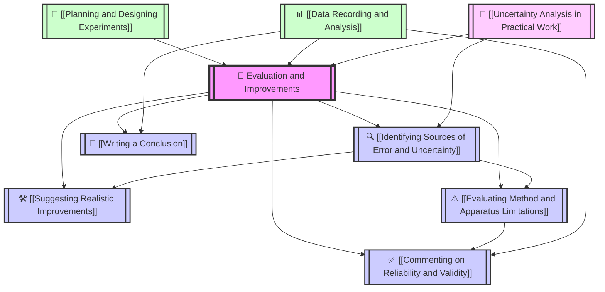

# 1. Overview / 概述

**English:**
This topic, "Evaluation and Improvements," is a cornerstone of practical physics assessment in both Cambridge 9702 (Papers 3 & 5) and Edexcel IAL (Units 3 & 6). It moves beyond simply performing an experiment to critically analyzing its quality, identifying weaknesses, and proposing realistic enhancements. This skill is essential because real-world scientific research is iterative—experiments are rarely perfect on the first attempt. In examinations, this topic assesses a student's ability to think like a scientist: to judge the reliability of data, to identify systematic and random errors, and to suggest modifications that would yield more accurate and precise results. It directly builds upon [[Planning and Designing Experiments]] and [[Data Recording and Analysis]], and is deeply connected to [[Uncertainty Analysis in Practical Work]]. Mastery of this topic is crucial for achieving high marks in the practical components of both exam boards, as it demonstrates a deep understanding of the scientific method beyond rote procedure.

**中文：**
“评估与改进”这一主题是剑桥 9702（试卷 3 和 5）以及爱德思 IAL（单元 3 和 6）实践物理评估的基石。它超越了简单地执行实验，而是批判性地分析实验质量，识别弱点，并提出切实可行的改进方案。这项技能至关重要，因为现实世界的科学研究是迭代的——实验很少在第一次尝试时就完美无缺。在考试中，该主题评估学生像科学家一样思考的能力：判断数据的可靠性，识别系统误差和随机误差，并提出能够产生更准确和精确结果的修改建议。它直接建立在[[实验规划与设计]]和[[数据记录与分析]]的基础上，并与[[实践工作中的不确定度分析]]密切相关。掌握这一主题对于在两大考试局的实践部分获得高分至关重要，因为它展示了超越机械步骤的对科学方法的深刻理解。

---

# 2. Syllabus Learning Objectives / 考纲学习目标

**English:**
The following table outlines the specific learning objectives from the CAIE 9702 and Edexcel IAL syllabuses that relate to evaluating and improving experiments. These objectives are assessed in the practical examination papers.

**中文：**
下表概述了 CAIE 9702 和 Edexcel IAL 考纲中与评估和改进实验相关的具体学习目标。这些目标在实践考试试卷中进行评估。

| CAIE 9702 (Paper 3 & 5) | Edexcel IAL (Unit 3 & 6) |
|-----------|-------------|
| **Paper 3 (AS):**   - Identify significant sources of error in an experiment.   - Suggest improvements to the apparatus or procedure to reduce errors.   - Comment on the reliability of results, including the use of a line of best fit and the distribution of points.   - Draw a conclusion consistent with the data.   **Paper 5 (A2):**   - Evaluate the experimental procedure, identifying limitations and suggesting improvements.   - Discuss the reliability of the data and the validity of the conclusion.   - Suggest further investigations that could be carried out. | **Unit 3 (AS):**   - Identify and explain the main sources of uncertainty in an experiment.   - Suggest modifications to experimental procedures to reduce uncertainty.   - Evaluate the effectiveness of an experimental design.   - Draw valid conclusions from experimental data, considering the limitations.   **Unit 6 (A2):**   - Critically evaluate experimental methods and data.   - Identify systematic errors and suggest how they can be eliminated or reduced.   - Assess the reliability and validity of conclusions.   - Propose improvements to experimental design and further work. |

**Examiner Expectations / 考官期望:**
- **English:** Examiners expect students to be specific. Instead of saying "there were errors," they want "a systematic error due to heat loss to the surroundings." Instead of "improve the experiment," they want "use a lid on the calorimeter to reduce heat loss." The evaluation must be linked to the specific context of the experiment. For reliability, they expect a comment on the scatter of data points around a line of best fit and the range of values taken. For validity, they expect a check on whether the experiment actually measures what it claims to measure.
- **中文：** 考官期望学生具体说明。不要说“存在误差”，而要说“由于向周围环境散热导致的系统误差”。不要说“改进实验”，而要说“在量热器上加盖以减少热量损失”。评估必须与实验的具体背景联系起来。关于可靠性，他们期望对数据点围绕最佳拟合线的分散程度以及所取值的范围进行评论。关于有效性，他们期望检查实验是否真正测量了其声称要测量的内容。

> 📋 **CIE Only:** In Paper 3, the evaluation is often a separate section (e.g., "Sources of Error" or "Conclusion and Evaluation"). In Paper 5, it is a major part of the design question. Students must be able to write a coherent paragraph evaluating the method.
> 📋 **Edexcel Only:** In Unit 3, the evaluation is integrated into the practical paper. Students are often asked to "evaluate the procedure" or "suggest improvements" in short-answer questions. In Unit 6, the evaluation is more detailed and requires a critical analysis of the entire experimental design.

---

# 3. Core Definitions / 核心定义

**English:**
The following table provides the key terms used in evaluation and improvement, along with their definitions and common student mistakes.

**中文：**
下表提供了评估与改进中使用的关键术语，以及它们的定义和常见学生错误。

| Term (EN/CN) | Definition (EN) | Definition (CN) | Common Mistakes / 常见错误 |
|--------------|-----------------|-----------------|---------------------------|
| **Accuracy / 准确度** | How close a measured value is to the true value. | 测量值与真实值的接近程度。 | Confusing accuracy with precision. An accurate result has little systematic error. |
| **Precision / 精密度** | How close repeated measurements are to each other. | 重复测量值之间的接近程度。 | Confusing precision with accuracy. A precise result has little random error but could be inaccurate. |
| **Reliability / 可靠性** | The degree of trust in the results, often assessed by the consistency of repeated readings and the scatter of points on a graph. | 对结果的信任程度，通常通过重复读数的一致性和图表上点的分散程度来评估。 | Saying "the results are reliable" without justification. Must be linked to the spread of data or the line of best fit. |
| **Validity / 有效性** | Whether the experiment actually measures what it intends to measure, and whether the conclusion is justified by the data. | 实验是否真正测量了其意图测量的内容，以及结论是否由数据证明合理。 | Assuming a valid conclusion just because the data is precise. Validity requires a correct experimental design. |
| **Systematic Error / 系统误差** | An error that is consistent and reproducible, shifting all measurements in one direction. It affects accuracy. | 一种一致且可重复的误差，将所有测量值向一个方向偏移。它影响准确度。 | Attributing a systematic error to random fluctuations. Examples: zero error on a balance, heat loss. |
| **Random Error / 随机误差** | An error that varies unpredictably between measurements, causing scatter. It affects precision. | 一种在测量之间不可预测地变化的误差，导致分散。它影响精密度。 | Saying random errors can be eliminated. They can only be reduced by taking more readings. |
| **Uncertainty / 不确定度** | The range of values within which the true value is likely to lie. | 真实值可能位于其中的值范围。 | Not distinguishing between absolute and percentage uncertainty. |
| **Limitation / 局限性** | A fundamental weakness in the experimental design or apparatus that cannot be easily corrected. | 实验设计或仪器中无法轻易纠正的根本性弱点。 | Confusing a limitation with a simple error. A limitation is often inherent to the method. |
| **Improvement / 改进** | A specific, realistic change to the apparatus or procedure that reduces error or increases reliability. | 对仪器或程序进行的特定、现实的更改，以减少误差或提高可靠性。 | Suggesting vague improvements like "be more careful" or "use better equipment" without specifying what or how. |
| **Conclusion / 结论** | A statement that relates the findings of the experiment to the hypothesis or aim. | 将实验结果与假设或目标联系起来的陈述。 | Writing a conclusion that only describes the data (e.g., "the graph went up") without stating the relationship or comparing to a known value. |

---

# 4. Key Concepts Explained / 关键概念详解

## 4.1 Identifying Sources of Error and Uncertainty / 识别误差和不确定度来源

### Explanation / 解释
**English:** This is the first step in evaluation. You must systematically think about every stage of the experiment—from setting up the apparatus to taking readings—and identify where errors could be introduced. Errors are broadly classified as **systematic** (affecting accuracy) or **random** (affecting precision). Common sources include: parallax error when reading a scale, reaction time when using a stopwatch, heat loss in a calorimetry experiment, friction in a mechanics experiment, zero error on an instrument, and the difficulty of measuring a changing quantity (e.g., a cooling temperature). This skill is directly linked to [[Uncertainty Analysis in Practical Work]] because identifying the source helps quantify the uncertainty.

**中文：** 这是评估的第一步。你必须系统地思考实验的每个阶段——从搭建仪器到读取数据——并识别可能引入误差的地方。误差大致分为**系统误差**（影响准确度）和**随机误差**（影响精密度）。常见来源包括：读取刻度时的视差误差、使用秒表时的反应时间、量热实验中的热量损失、力学实验中的摩擦力、仪器的零点误差以及测量变化量（例如冷却温度）的困难。这项技能与[[实践工作中的不确定度分析]]直接相关，因为识别来源有助于量化不确定度。

### Physical Meaning / 物理意义
**English:** In a real-world experiment, no measurement is perfect. Understanding where errors come from allows you to judge how much you can trust your final result. For example, if you measure the acceleration due to gravity ($g$) and get 9.2 m/s² instead of 9.81 m/s², identifying a systematic error (e.g., air resistance on a falling object) explains the discrepancy.

**中文：** 在现实世界的实验中，没有完美的测量。理解误差的来源可以让你判断最终结果的可信度。例如，如果你测量重力加速度 ($g$) 得到 9.2 m/s² 而不是 9.81 m/s²，识别出系统误差（例如下落物体上的空气阻力）可以解释这种差异。

### Common Misconceptions / 常见误区
- **English:** Students often say "human error" without being specific. This is too vague. You must state the *type* of human error (e.g., "parallax error when reading the meniscus").
- **中文：** 学生经常笼统地说“人为误差”。这太模糊了。你必须说明人为误差的*类型*（例如，“读取弯月面时的视差误差”）。
- **English:** Students confuse random and systematic errors. A systematic error is consistent; a random error is not.
- **中文：** 学生混淆了随机误差和系统误差。系统误差是一致的；随机误差则不是。

### Exam Tips / 考试提示
**English:** Examiners look for specific, context-based errors. For a pendulum experiment, "reaction time in starting/stopping the stopwatch" is a good random error. For a resistivity experiment, "the wire heating up, changing its resistance" is a good systematic error. Always link the error to the quantity being measured.
**中文：** 考官寻找具体的、基于背景的误差。对于单摆实验，“启动/停止秒表时的反应时间”是一个好的随机误差。对于电阻率实验，“导线发热，改变其电阻”是一个好的系统误差。始终将误差与被测量的量联系起来。

---

## 4.2 Suggesting Realistic Improvements / 提出切实可行的改进

### Explanation / 解释
**English:** Once you have identified an error, you must suggest a specific, realistic, and practical improvement. The improvement must directly address the error. For example:
- **Error:** Parallax error when reading a thermometer.
- **Improvement:** Use a digital thermometer with a digital display to eliminate parallax error.
- **Error:** Heat loss to the surroundings in a calorimetry experiment.
- **Improvement:** Place a lid on the calorimeter and insulate the sides with cotton wool.
- **Error:** Large random uncertainty due to a small number of readings.
- **Improvement:** Repeat the experiment several times and calculate a mean value.
The improvement must be feasible in a school laboratory setting. Avoid suggesting expensive or unrealistic equipment (e.g., "use a laser interferometer" for a simple optics experiment). This skill is a key part of [[Planning and Designing Experiments]].

**中文：** 一旦你识别出一个误差，就必须提出一个具体、现实且实用的改进方案。改进必须直接针对该误差。例如：
- **误差：** 读取温度计时的视差误差。
- **改进：** 使用带有数字显示的数字温度计以消除视差误差。
- **误差：** 量热实验中向周围环境的热量损失。
- **改进：** 在量热器上加盖，并用棉花包裹侧面以隔热。
- **误差：** 由于读数次数少而导致的大随机不确定度。
- **改进：** 多次重复实验并计算平均值。
改进必须在学校实验室环境中可行。避免建议昂贵或不切实际的设备（例如，对于简单的光学实验，“使用激光干涉仪”）。这项技能是[[实验规划与设计]]的关键部分。

### Physical Meaning / 物理意义
**English:** In engineering and research, improving an experiment is about making the result more trustworthy. A small, cheap improvement (like adding a lid) can have a significant impact on the accuracy of a result.

**中文：** 在工程和研究中，改进实验是为了使结果更可信。一个小的、廉价的改进（比如加一个盖子）可以对结果的准确度产生重大影响。

### Common Misconceptions / 常见误区
- **English:** Suggesting "repeat the experiment" without explaining *why* it helps. Repeating reduces random error, not systematic error.
- **中文：** 建议“重复实验”而不解释*为什么*有帮助。重复可以减少随机误差，但不能减少系统误差。
- **English:** Suggesting an improvement that is not specific. "Use a more accurate instrument" is vague. "Use a micrometer screw gauge instead of a ruler" is specific.
- **中文：** 提出不具体的改进。“使用更精确的仪器”很模糊。“使用千分尺代替尺子”则很具体。

### Exam Tips / 考试提示
**English:** For each improvement, state *what* you would change, *how* you would change it, and *why* it would reduce the error. This three-part structure is very effective. For example: "To reduce heat loss, I would place a lid on the calorimeter. This would trap the heat inside, making the temperature reading more accurate."
**中文：** 对于每项改进，说明*改变什么*、*如何改变*以及*为什么*会减少误差。这种三部分结构非常有效。例如：“为了减少热量损失，我会在量热器上加一个盖子。这会将热量困在里面，使温度读数更准确。”

---

## 4.3 Evaluating Method and Apparatus Limitations / 评估方法和仪器局限性

### Explanation / 解释
**English:** A limitation is a fundamental weakness in the experimental design that cannot be easily fixed by a simple improvement. It is often inherent to the method itself. For example:
- **Limitation:** In an experiment to find the specific heat capacity of a liquid, it is impossible to prevent *all* heat loss to the surroundings.
- **Limitation:** In an experiment to measure the speed of sound using a resonance tube, the position of the antinode is not perfectly defined.
- **Limitation:** Using a stopwatch to measure a short time interval is limited by human reaction time.
Evaluating limitations requires a higher level of thinking. You must recognize that some errors are unavoidable and discuss their impact on the final result. This is closely related to [[Identifying Sources of Error and Uncertainty]].

**中文：** 局限性是实验设计中无法通过简单改进轻易纠正的根本性弱点。它通常是方法本身固有的。例如：
- **局限性：** 在寻找液体比热容的实验中，不可能阻止*所有*向周围环境的热量损失。
- **局限性：** 在使用共鸣管测量声速的实验中，波腹的位置并非完美确定。
- **局限性：** 使用秒表测量短时间间隔受到人类反应时间的限制。
评估局限性需要更高层次的思考。你必须认识到某些误差是不可避免的，并讨论它们对最终结果的影响。这与[[识别误差和不确定度来源]]密切相关。

### Physical Meaning / 物理意义
**English:** Acknowledging limitations shows scientific honesty. No experiment is perfect, and a good scientist knows the limits of their method. This is crucial for interpreting results and drawing valid conclusions.

**中文：** 承认局限性显示了科学诚实。没有完美的实验，一个好的科学家知道他们方法的局限性。这对于解释结果和得出有效结论至关重要。

### Common Misconceptions / 常见误区
- **English:** Confusing a limitation with a simple error. An error can often be reduced; a limitation is a fundamental constraint of the method.
- **中文：** 将局限性与简单误差混淆。误差通常可以减少；局限性是方法的根本性约束。
- **English:** Not explaining *why* something is a limitation. Just stating "heat loss is a limitation" is not enough. You must explain *why* it is difficult to eliminate.
- **中文：** 不解释*为什么*某件事是局限性。仅仅陈述“热量损失是一个局限性”是不够的。你必须解释*为什么*难以消除。

### Exam Tips / 考试提示
**English:** In A2 papers (Paper 5 / Unit 6), you are often asked to "evaluate the experimental procedure." This is where you discuss limitations. A good answer will identify 2-3 key limitations and explain their impact on the accuracy or reliability of the results.
**中文：** 在 A2 试卷（试卷 5 / 单元 6）中，你经常被要求“评估实验程序”。这就是你讨论局限性的地方。一个好的答案会识别 2-3 个关键局限性，并解释它们对结果准确度或可靠性的影响。

---

## 4.4 Commenting on Reliability and Validity / 评论可靠性和有效性

### Explanation / 解释
**English:**
- **Reliability** is about the consistency of the data. It is assessed by looking at the scatter of repeated readings or the scatter of points around a line of best fit on a graph. If the points are close to the line and repeated readings are similar, the data is reliable. A large scatter indicates poor reliability, often due to large random errors.
- **Validity** is about whether the experiment actually tests the hypothesis or measures the intended quantity. A valid experiment has a correct design that controls variables appropriately. For example, an experiment to investigate the relationship between the length of a pendulum and its period is valid if only the length is changed and all other variables (mass, amplitude) are kept constant. A conclusion is valid if it is directly supported by the data and the experimental design is sound.

**中文：**
- **可靠性** 关乎数据的一致性。它通过查看重复读数的分散程度或图表上数据点围绕最佳拟合线的分散程度来评估。如果点靠近线且重复读数相似，则数据可靠。分散程度大表明可靠性差，通常是由于大的随机误差造成的。
- **有效性** 关乎实验是否真正检验了假设或测量了预期的量。一个有效的实验具有正确的设计，能够适当地控制变量。例如，一个研究摆长与其周期之间关系的实验，如果只改变摆长而所有其他变量（质量、振幅）保持不变，则该实验是有效的。如果结论直接得到数据的支持并且实验设计合理，则该结论是有效的。

### Physical Meaning / 物理意义
**English:** A reliable experiment gives consistent results, but it might be consistently wrong (e.g., a faulty balance always reads 0.5 g too high). A valid experiment gives results that are meaningful and answer the research question. Both are needed for a trustworthy conclusion.

**中文：** 一个可靠的实验给出了一致的结果，但它可能始终是错误的（例如，一个有故障的天平总是多读 0.5 克）。一个有效的实验给出了有意义且能回答研究问题的结果。两者都是得出可信结论所必需的。

### Common Misconceptions / 常见误区
- **English:** Thinking reliability and validity are the same thing. They are distinct concepts.
- **中文：** 认为可靠性和有效性是同一回事。它们是不同的概念。
- **English:** Saying "the results are reliable" without looking at the data. You must comment on the scatter or the line of best fit.
- **中文：** 不查看数据就说“结果是可靠的”。你必须评论分散程度或最佳拟合线。

### Exam Tips / 考试提示
**English:** For reliability, a common question is: "Comment on the reliability of your results." A good answer: "The points on the graph lie close to the line of best fit, indicating good reliability. However, the range of the independent variable was small, so the reliability could be improved by taking readings over a wider range." For validity, a common question is: "Is your conclusion valid?" A good answer: "The conclusion is valid because the experiment controlled all other variables, and the data directly supports the relationship stated."
**中文：** 关于可靠性，一个常见的问题是：“评论你结果的可靠性。”一个好的答案：“图表上的点非常接近最佳拟合线，表明可靠性良好。然而，自变量的范围很小，因此可以通过在更宽的范围内读取数据来提高可靠性。”关于有效性，一个常见的问题是：“你的结论有效吗？”一个好的答案：“结论是有效的，因为实验控制了所有其他变量，并且数据直接支持所陈述的关系。”

---

## 4.5 Writing a Conclusion / 撰写结论

### Explanation / 解释
**English:** A conclusion is a concise statement that links the experimental findings to the aim or hypothesis. It should:
1.  State the relationship between the variables (e.g., "The period $T$ is proportional to the square root of the length $L$").
2.  Provide quantitative evidence if possible (e.g., "The gradient of the $T^2$ against $L$ graph was 4.0 s²/m, which gives a value of $g = 9.87 \text{ m/s}^2$").
3.  Compare the result to a known or expected value (e.g., "This is within 0.6% of the accepted value of $9.81 \text{ m/s}^2$").
4.  Comment on the strength of the evidence (e.g., "The data supports the hypothesis, as the graph is a straight line through the origin").
A conclusion should *not* simply describe the data (e.g., "The graph went up"). It must interpret the data in the context of the experiment's aim.

**中文：** 结论是一个简洁的陈述，将实验结果与目标或假设联系起来。它应该：
1.  陈述变量之间的关系（例如，“周期 $T$ 与摆长 $L$ 的平方根成正比”）。
2.  如果可能，提供定量证据（例如，“$T^2$ 对 $L$ 的图表的斜率为 4.0 s²/m，这给出了 $g = 9.87 \text{ m/s}^2$ 的值”）。
3.  将结果与已知或预期值进行比较（例如，“这与公认值 $9.81 \text{ m/s}^2$ 相差在 0.6% 以内”）。
4.  评论证据的强度（例如，“数据支持该假设，因为图表是一条通过原点的直线”）。
结论*不应*仅仅描述数据（例如，“图表上升了”）。它必须在实验目标的背景下解释数据。

### Physical Meaning / 物理意义
**English:** The conclusion is the final answer to the scientific question you were investigating. It is the most important part of any scientific report.

**中文：** 结论是你正在研究的科学问题的最终答案。它是任何科学报告中最重要的部分。

### Common Misconceptions / 常见误区
- **English:** Writing a conclusion that is too long or includes irrelevant details. Keep it focused on the aim.
- **中文：** 撰写过长或包含无关细节的结论。保持专注于目标。
- **English:** Not comparing the result to a known value when one is available. This is a key part of a good conclusion.
- **中文：** 在有已知值可用时不将结果与之比较。这是一个好结论的关键部分。

### Exam Tips / 考试提示
**English:** In CAIE Paper 3, the conclusion is often a separate question. Use the structure: "The [relationship] is [stated]. The graph of [y] against [x] is a straight line through the origin, confirming this. The gradient is [value], which gives [calculated quantity] = [value]. This is [percentage difference] from the accepted value of [accepted value]."
**中文：** 在 CAIE 试卷 3 中，结论通常是一个单独的问题。使用结构：“[关系] 是 [陈述]。 [y] 对 [x] 的图表是一条通过原点的直线，证实了这一点。斜率为 [值]，这给出 [计算量] = [值]。这与公认值 [公认值] 相差 [百分比差异]。”

---

# 5. Essential Equations / 核心公式

**English:**
While "Evaluation and Improvements" is not about a single equation, it relies on equations from other topics to calculate results and assess their accuracy. The key "equation" here is the one used to compare an experimental result to a known value.

**中文：**
虽然“评估与改进”不涉及单一公式，但它依赖于其他主题的公式来计算结果并评估其准确性。这里关键的“公式”是用于将实验结果与已知值进行比较的公式。

## 5.1 Percentage Difference / 百分比差异

**Equation / 公式:**
$$ \text{Percentage Difference} = \frac{|\text{Experimental Value} - \text{Accepted Value}|}{\text{Accepted Value}} \times 100\% $$

**Variables / 变量:**
| Symbol (符号) | Meaning (EN) | Meaning (CN) | Unit (单位) |
|--------------|-------------|-------------|------------|
| - | Experimental Value | 实验值 | Same as the quantity |
| - | Accepted Value | 公认值 / 标准值 | Same as the quantity |
| - | Percentage Difference | 百分比差异 | % (dimensionless) |

**Derivation / 推导:**
**English:** This is not a derived equation but a definition. It quantifies the fractional difference between an experimental result and a known standard, expressed as a percentage.
**中文：** 这不是一个推导公式，而是一个定义。它量化了实验结果与已知标准之间的分数差异，以百分比表示。

**Conditions / 适用条件:**
**English:** Only applicable when there is a well-established accepted or theoretical value for comparison.
**中文：** 仅当存在公认的或理论值可供比较时适用。

**Limitations / 局限性:**
**English:** A small percentage difference does not guarantee a good experiment if the uncertainties are large. It must be considered alongside the uncertainty in the measurement.
**中文：** 如果不确定度很大，小的百分比差异并不能保证实验良好。必须与测量的不确定度一起考虑。

**Rearrangements / 变形:**
**English:** None. It is a simple formula.
**中文：** 无。这是一个简单的公式。

---

## 5.2 Percentage Uncertainty / 百分比不确定度

**Equation / 公式:**
$$ \text{Percentage Uncertainty} = \frac{\text{Absolute Uncertainty}}{\text{Measured Value}} \times 100\% $$

**Variables / 变量:**
| Symbol (符号) | Meaning (EN) | Meaning (CN) | Unit (单位) |
|--------------|-------------|-------------|------------|
| - | Absolute Uncertainty | 绝对不确定度 | Same as the measured value |
| - | Measured Value | 测量值 | Same as the quantity |
| - | Percentage Uncertainty | 百分比不确定度 | % (dimensionless) |

**Derivation / 推导:**
**English:** This is a definition used to express the precision of a measurement relative to its magnitude.
**中文：** 这是一个用于表示测量精密度相对于其大小的定义。

**Conditions / 适用条件:**
**English:** Used to compare the precision of different measurements or to combine uncertainties in calculations.
**中文：** 用于比较不同测量的精密度或在计算中组合不确定度。

**Limitations / 局限性:**
**English:** It does not account for systematic errors. A measurement can have a small percentage uncertainty (high precision) but be very inaccurate.
**中文：** 它不考虑系统误差。一个测量可以有很小的百分比不确定度（高精密度），但可能非常不准确。

**Rearrangements / 变形:**
**English:** $\text{Absolute Uncertainty} = \frac{\text{Percentage Uncertainty} \times \text{Measured Value}}{100}$
**中文：** $\text{绝对不确定度} = \frac{\text{百分比不确定度} \times \text{测量值}}{100}$

---

# 6. Graphs and Relationships / 图表与关系

**English:**
Graphs are central to evaluation. They are used to assess reliability, identify outliers, and determine relationships. The key graph-related skill is analyzing the scatter of points around a line of best fit.

**中文：**
图表是评估的核心。它们用于评估可靠性、识别异常值以及确定关系。关键的图表相关技能是分析点围绕最佳拟合线的分散程度。

## 6.1 Graph of Data with Line of Best Fit / 带有最佳拟合线的数据图

### Axes / 坐标轴
**English:** Dependent variable (y-axis) vs. Independent variable (x-axis).
**中文：** 因变量（y 轴） vs. 自变量（x 轴）。

### Shape / 形状
**English:** Ideally, a straight line or a smooth curve that represents the trend of the data.
**中文：** 理想情况下，是一条代表数据趋势的直线或平滑曲线。

### Gradient Meaning / 斜率含义
**English:** The gradient of the line of best fit represents the rate of change of the dependent variable with respect to the independent variable. It is often used to calculate a physical constant.
**中文：** 最佳拟合线的斜率表示因变量相对于自变量的变化率。它通常用于计算物理常数。

### Area Meaning / 面积含义
**English:** The area under a graph (e.g., force-distance for work, current-time for charge) represents the integral of the y-axis quantity with respect to the x-axis quantity.
**中文：** 图表下的面积（例如，力-距离图表示功，电流-时间图表示电荷）表示 y 轴量相对于 x 轴量的积分。

### Exam Interpretation / 考试解读
**English:** Examiners will ask you to:
- **Comment on reliability:** "Are the points close to the line of best fit?" If yes, the data is reliable. If there is a large scatter, the data is less reliable.
- **Identify an anomalous point:** "Is there a point that lies far from the line of best fit?" This is an outlier, possibly due to a random error.
- **Determine the relationship:** "Is the graph a straight line through the origin?" If yes, the variables are directly proportional. If it is a straight line with an intercept, they are linearly related.
- **Calculate a quantity from the gradient:** "Use the gradient of the graph to determine the value of [constant]."

**中文：** 考官会要求你：
- **评论可靠性：** “点是否靠近最佳拟合线？”如果是，则数据可靠。如果分散程度大，则数据可靠性较低。
- **识别异常点：** “是否存在远离最佳拟合线的点？”这是一个异常值，可能是由随机误差引起的。
- **确定关系：** “图表是一条通过原点的直线吗？”如果是，则变量成正比。如果是一条有截距的直线，则它们是线性相关的。
- **从斜率计算一个量：** “利用图表的斜率确定 [常数] 的值。”

### Common Questions / 常见问题
**English:**
- "Explain why the line of best fit does not pass through all the points." (Answer: Due to random errors in the measurements.)
- "How could the reliability of the graph be improved?" (Answer: Take more readings over a wider range of the independent variable to establish a clearer trend.)
- "Is the relationship between X and Y proportional? Justify your answer." (Answer: Yes, because the graph is a straight line that passes through the origin.)

**中文：**
- “解释为什么最佳拟合线没有通过所有点。”（答案：由于测量中的随机误差。）
- “如何提高图表的可靠性？”（答案：在更宽的自变量范围内读取更多数据，以建立更清晰的趋势。）
- “X 和 Y 之间的关系是正比吗？证明你的答案。”（答案：是的，因为图表是一条通过原点的直线。）

---

# 7. Required Diagrams / 必备图表

## 7.1 Diagram Showing Systematic vs. Random Error on a Target / 显示系统误差与随机误差的靶心图

### Description / 描述
**English:** A diagram of a dartboard (or target) with darts. One target shows darts clustered tightly together but far from the bullseye (high precision, low accuracy = systematic error). Another target shows darts scattered widely around the bullseye (low precision, high accuracy = random error). A third target shows darts clustered tightly around the bullseye (high precision, high accuracy = good experiment).

**中文：** 一个飞镖靶（或靶心）的图，上面有飞镖。一个靶心显示飞镖紧密聚集在一起但远离靶心（高精密度，低准确度 = 系统误差）。另一个靶心显示飞镖广泛分散在靶心周围（低精密度，高准确度 = 随机误差）。第三个靶心显示飞镖紧密聚集在靶心周围（高精密度，高准确度 = 良好实验）。

### Image Prompt / 图片生成提示
> 📷 **IMAGE PROMPT — DG-01: Systematic vs Random Error Dartboard Analogy**
>
> A clean, educational diagram showing three dartboards side-by-side. The first dartboard is labeled "Systematic Error" with all darts clustered in the top-left corner, far from the bullseye. The second is labeled "Random Error" with darts scattered all over the board, some near the bullseye. The third is labeled "Good Experiment" with all darts clustered tightly around the bullseye. Use a white background, clear labels, and a simple, vector-style illustration. The darts should be small and red. The bullseye should be clearly marked.

### Labels Required / 需要标注
- **English:** "Systematic Error (High Precision, Low Accuracy)", "Random Error (Low Precision, High Accuracy)", "Good Experiment (High Precision, High Accuracy)"
- **中文：** “系统误差（高精密度，低准确度）”、“随机误差（低精密度，高准确度）”、“良好实验（高精密度，高准确度）”

### Exam Importance / 考试重要性
**English:** This diagram is a classic analogy used in exam questions to test the understanding of accuracy and precision. It is a quick way to assess a fundamental concept.
**中文：** 这个图表是一个经典的类比，用于考试问题中测试对准确度和精密度的理解。它是评估基本概念的快速方法。

---

## 7.2 Graph Showing Scatter and Line of Best Fit / 显示分散程度和最佳拟合线的图表

### Description / 描述
**English:** A graph with data points plotted. A line of best fit is drawn through the points. Some points are close to the line, and one point is clearly an outlier (anomalous result). The graph should have labeled axes (e.g., "Length / m" on x-axis, "Period² / s²" on y-axis).

**中文：** 一个绘制了数据点的图表。一条最佳拟合线穿过这些点。一些点靠近线，一个点明显是异常值（异常结果）。图表应有标注的坐标轴（例如，x 轴为“长度 / m”，y 轴为“周期² / s²”）。

### Image Prompt / 图片生成提示
> 📷 **IMAGE PROMPT — DG-02: Graph with Scatter and Outlier**
>
> A scientific graph on a white background. The x-axis is labeled "Independent Variable / units" and the y-axis is labeled "Dependent Variable / units". There are 8 data points plotted as small black crosses. A straight line of best fit is drawn through most of the points. One point is clearly far from the line and is circled in red, labeled "Anomalous Result". The graph should look like it was drawn on graph paper, with a light blue grid.

### Labels Required / 需要标注
- **English:** "Line of best fit", "Anomalous result / Outlier", "Axes labels with units"
- **中文：** “最佳拟合线”、“异常结果 / 异常值”、“带单位的坐标轴标签”

### Exam Importance / 考试重要性
**English:** This is the most common type of graph in practical exams. Students must be able to draw a line of best fit, identify outliers, and comment on the scatter. This diagram is essential for teaching these skills.
**中文：** 这是实践考试中最常见的图表类型。学生必须能够绘制最佳拟合线、识别异常值并评论分散程度。这个图表对于教授这些技能至关重要。

---

## 7.3 Diagram of an Experimental Setup with Identified Error Sources / 带有已识别误差来源的实验装置图

### Description / 描述
**English:** A diagram of a simple experiment (e.g., a pendulum, a calorimeter, a circuit for Ohm's law) with annotations pointing to specific parts of the apparatus and describing the source of error. For example, for a pendulum: an arrow pointing to the stopwatch labeled "Reaction time error", an arrow pointing to the ruler labeled "Parallax error", and an arrow pointing to the string labeled "String has mass, not a point mass".

**中文：** 一个简单实验（例如，单摆、量热器、欧姆定律电路）的图表，带有指向仪器特定部分的注释，并描述误差来源。例如，对于单摆：一个指向秒表的箭头，标注为“反应时间误差”；一个指向尺子的箭头，标注为“视差误差”；一个指向绳子的箭头，标注为“绳子有质量，不是质点”。

### Image Prompt / 图片生成提示
> 📷 **IMAGE PROMPT — DG-03: Pendulum Experiment with Error Annotations**
>
> A simple line drawing of a pendulum experiment. A mass is hanging from a string attached to a clamp. A protractor is shown to measure the angle. A stopwatch is in a hand. A meter ruler is next to the pendulum. Red dashed arrows point to the stopwatch (label: "Reaction Time"), the ruler (label: "Parallax Error"), the string (label: "String Mass"), and the point of suspension (label: "Friction at Pivot"). The diagram should be clear, educational, and on a white background.

### Labels Required / 需要标注
- **English:** "Reaction Time Error", "Parallax Error", "String Mass", "Friction at Pivot", "Air Resistance"
- **中文：** “反应时间误差”、“视差误差”、“绳子质量”、“支点摩擦”、“空气阻力”

### Exam Importance / 考试重要性
**English:** This diagram teaches students to think visually about error sources. It is a common exam technique to ask students to "draw a diagram of the apparatus and label the main sources of error." This diagram serves as a model answer.
**中文：** 这个图表教学生直观地思考误差来源。一种常见的考试技巧是要求学生“画出仪器图并标出主要的误差来源”。这个图表作为一个模型答案。

---

# 8. Worked Examples / 典型例题

## Example 1: Evaluating a Pendulum Experiment / 评估单摆实验

### Question / 题目
**English:** A student investigates how the period $T$ of a simple pendulum depends on its length $L$. They measure the time for 10 oscillations for five different lengths. Their results are plotted on a graph of $T^2$ against $L$, and the line of best fit has a gradient of 4.05 s²/m. The accepted value for the acceleration due to gravity is $g = 9.81 \text{ m/s}^2$.
(a) Calculate the experimental value of $g$ using the formula $T = 2\pi \sqrt{\frac{L}{g}}$.
(b) Calculate the percentage difference between the experimental and accepted values of $g$.
(c) The student's graph shows a significant scatter of points around the line of best fit. Suggest two sources of random error in this experiment.
(d) Suggest one improvement to reduce the random error.
(e) The student's value of $g$ is lower than the accepted value. Suggest one source of systematic error that could cause this.

**中文：** 一名学生研究单摆的周期 $T$ 如何取决于其长度 $L$。他们测量了五个不同长度下 10 次摆动的时间。他们的结果绘制在 $T^2$ 对 $L$ 的图表上，最佳拟合线的斜率为 4.05 s²/m。重力加速度的公认值为 $g = 9.81 \text{ m/s}^2$。
(a) 使用公式 $T = 2\pi \sqrt{\frac{L}{g}}$ 计算 $g$ 的实验值。
(b) 计算实验值与公认值之间的百分比差异。
(c) 学生的图表显示点围绕最佳拟合线有显著分散。提出该实验中两个随机误差的来源。
(d) 提出一项减少随机误差的改进。
(e) 学生的 $g$ 值低于公认值。提出一个可能导致此情况的系统误差来源。

### Image Prompt / 图片提示
> 📷 **IMAGE PROMPT — WE-01: Pendulum Setup for Evaluation Question**
>
> A simple line diagram of a pendulum. A mass (bob) is attached to a string, which is clamped at the top. A ruler is placed next to the string to measure length. A stopwatch is shown. The diagram should be clean and uncluttered, suitable for a physics exam paper.

### Solution / 解答
**English:**
**(a)** The formula $T = 2\pi \sqrt{\frac{L}{g}}$ can be rearranged to $T^2 = \frac{4\pi^2}{g} L$.
The gradient of the $T^2$ vs $L$ graph is $\frac{4\pi^2}{g}$.
Therefore, $g_{\text{exp}} = \frac{4\pi^2}{\text{gradient}} = \frac{4\pi^2}{4.05} = 9.75 \text{ m/s}^2$.

**(b)** Percentage difference $= \frac{|9.75 - 9.81|}{9.81} \times 100\% = \frac{0.06}{9.81} \times 100\% = 0.61\%$.

**(c)** Two sources of random error:
1.  **Reaction time:** The student's reaction time when starting and stopping the stopwatch for 10 oscillations.
2.  **Judging the amplitude:** Difficulty in releasing the pendulum from the exact same angle each time, leading to slight variations in the period.

**(d)** **Improvement:** To reduce random error, the student could measure the time for a larger number of oscillations (e.g., 20 oscillations) and then divide by the number of oscillations to find the period. This reduces the percentage uncertainty due to reaction time.

**(e)** **Systematic error:** The student may have measured the length of the pendulum from the point of suspension to the center of the bob, but if they measured to the bottom of the bob, the length would be overestimated. However, a lower value of $g$ suggests the period was longer than expected. A systematic error that increases the period is **air resistance** or **friction at the pivot**, which slows the pendulum down. Alternatively, if the angle of release was too large ( > 10°), the small-angle approximation is no longer valid, and the period becomes longer, leading to a lower calculated $g$.

**中文：**
**(a)** 公式 $T = 2\pi \sqrt{\frac{L}{g}}$ 可以重排为 $T^2 = \frac{4\pi^2}{g} L$。
$T^2$ 对 $L$ 图表的斜率为 $\frac{4\pi^2}{g}$。
因此，$g_{\text{exp}} = \frac{4\pi^2}{\text{斜率}} = \frac{4\pi^2}{4.05} = 9.75 \text{ m/s}^2$。

**(b)** 百分比差异 $= \frac{|9.75 - 9.81|}{9.81} \times 100\% = \frac{0.06}{9.81} \times 100\% = 0.61\%$。

**(c)** 两个随机误差来源：
1.  **反应时间：** 学生在启动和停止 10 次摆动的秒表时的反应时间。
2.  **判断振幅：** 每次难以从完全相同的角度释放摆锤，导致周期略有变化。

**(d)** **改进：** 为了减少随机误差，学生可以测量更多次摆动（例如 20 次摆动）的时间，然后除以摆动次数来求周期。这减少了由于反应时间引起的百分比不确定度。

**(e)** **系统误差：** 学生可能测量了从悬挂点到摆锤中心的摆长，但如果他们测量到摆锤底部，则摆长会被高估。然而，较低的 $g$ 值表明周期比预期的要长。增加周期的系统误差是**空气阻力**或**支点处的摩擦**，这会减慢摆锤的速度。或者，如果释放角度太大（> 10°），小角度近似不再有效，周期变长，导致计算出的 $g$ 值更低。

### Final Answer / 最终答案
**Answer:** (a) $g = 9.75 \text{ m/s}^2$ (b) 0.61% (c) Reaction time, judging amplitude (d) Measure time for more oscillations (e) Air resistance / friction / large angle
**答案：** (a) $g = 9.75 \text{ m/s}^2$ (b) 0.61% (c) 反应时间，判断振幅 (d) 测量更多次摆动的时间 (e) 空气阻力 / 摩擦 / 大角度

### Examiner Notes / 考官点评
**English:** This is a typical CAIE Paper 3 question. Part (a) tests the ability to rearrange an equation and use a gradient. Part (b) tests the calculation of percentage difference. Parts (c) and (d) test the core evaluation skills of identifying errors and suggesting improvements. Part (e) tests the understanding of systematic errors. A common mistake is to suggest "use a more accurate stopwatch" for part (d), which is not specific enough. "Measure time for 20 oscillations" is a specific, realistic improvement.
**中文：** 这是一个典型的 CAIE 试卷 3 问题。第 (a) 部分测试重排公式和使用斜率的能力。第 (b) 部分测试百分比差异的计算。第 (c) 和 (d) 部分测试识别误差和提出改进的核心评估技能。第 (e) 部分测试对系统误差的理解。一个常见错误是在第 (d) 部分建议“使用更精确的秒表”，这不够具体。“测量 20 次摆动的时间”是一个具体、现实的改进。

### Alternative Method / 替代方法
**English:** For part (a), the student could have plotted $T$ against $\sqrt{L}$ and used the gradient. The method is equivalent.
**中文：** 对于第 (a) 部分，学生可以绘制 $T$ 对 $\sqrt{L}$ 的图表并使用斜率。方法是等效的。

---

## Example 2: Evaluating a Calorimetry Experiment / 评估量热实验

### Question / 题目
**English:** A student performs an experiment to determine the specific heat capacity $c$ of a metal block. They heat the block using an electric heater and measure the temperature rise. The mass of the block is 1.00 kg, the power of the heater is 50 W, and the heater is switched on for 5 minutes. The temperature of the block rises from 20.0 °C to 34.5 °C.
(a) Calculate the experimental value of $c$ using the formula $E = mc\Delta\theta$, where $E$ is the electrical energy supplied.
(b) The accepted value for the specific heat capacity of the metal is 900 J/(kg·°C). Calculate the percentage difference.
(c) The student's value of $c$ is higher than the accepted value. Suggest one source of systematic error that could cause this.
(d) Suggest one improvement to the apparatus to reduce this systematic error.
(e) The student only took one set of readings. Explain why this makes the experiment less reliable and suggest an improvement.

**中文：** 一名学生进行实验以确定金属块的比热容 $c$。他们使用电加热器加热金属块并测量温升。金属块的质量为 1.00 kg，加热器的功率为 50 W，加热器接通了 5 分钟。金属块的温度从 20.0 °C 上升到 34.5 °C。
(a) 使用公式 $E = mc\Delta\theta$ 计算 $c$ 的实验值，其中 $E$ 是提供的电能。
(b) 该金属比热容的公认值为 900 J/(kg·°C)。计算百分比差异。
(c) 学生的 $c$ 值高于公认值。提出一个可能导致此情况的系统误差来源。
(d) 提出一项对仪器的改进以减少此系统误差。
(e) 学生只进行了一组读数。解释为什么这会使实验可靠性降低，并提出一项改进。

### Solution / 解答
**English:**
**(a)** Electrical energy supplied, $E = Pt = 50 \times (5 \times 60) = 15000 \text{ J}$.
Temperature rise, $\Delta\theta = 34.5 - 20.0 = 14.5 \text{ °C}$.
Using $E = mc\Delta\theta$, $c_{\text{exp}} = \frac{E}{m\Delta\theta} = \frac{15000}{1.00 \times 14.5} = 1034 \text{ J/(kg·°C)}$.

**(b)** Percentage difference $= \frac{|1034 - 900|}{900} \times 100\% = \frac{134}{900} \times 100\% = 14.9\%$.

**(c)** The experimental value of $c$ is too high. This means the calculated energy input ($E$) appears too large for the observed temperature rise. A systematic error that causes this is **heat loss to the surroundings**. The block loses heat to the air, so the measured temperature rise is less than it should be for the given energy input. This makes $c$ appear larger.

**(d)** **Improvement:** To reduce heat loss, the student should **insulate the metal block** by wrapping it in cotton wool or placing it in a polystyrene container. They could also **add a lid** to reduce heat loss from the top surface.

**(e)** **Explanation:** Taking only one set of readings means there is no way to assess the precision of the result. A single reading could be affected by a random error (e.g., misreading the thermometer), and the student would not know. This makes the result less reliable.
**Improvement:** The student should **repeat the experiment** several times (e.g., 3-5 times) and calculate a mean value for $c$. They should also calculate the range or standard deviation to quantify the random uncertainty.

**中文：**
**(a)** 提供的电能，$E = Pt = 50 \times (5 \times 60) = 15000 \text{ J}$。
温升，$\Delta\theta = 34.5 - 20.0 = 14.5 \text{ °C}$。
使用 $E = mc\Delta\theta$，$c_{\text{exp}} = \frac{E}{m\Delta\theta} = \frac{15000}{1.00 \times 14.5} = 1034 \text{ J/(kg·°C)}$。

**(b)** 百分比差异 $= \frac{|1034 - 900|}{900} \times 100\% = \frac{134}{900} \times 100\% = 14.9\%$。

**(c)** $c$ 的实验值太高。这意味着对于观察到的温升，计算出的能量输入 ($E$) 显得过大。导致此情况的系统误差是**向周围环境的热量损失**。金属块向空气散失热量，因此测得的温升低于给定能量输入应有的温升。这使得 $c$ 看起来更大。

**(d)** **改进：** 为了减少热量损失，学生应该**隔热金属块**，用棉花包裹或将其放入聚苯乙烯容器中。他们还可以**加一个盖子**以减少从顶部的热量损失。

**(e)** **解释：** 只进行一组读数意味着无法评估结果的精密度。单个读数可能受到随机误差的影响（例如，误读温度计），而学生不会知道。这使得结果可靠性降低。
**改进：** 学生应该**多次重复实验**（例如 3-5 次），并计算 $c$ 的平均值。他们还应该计算范围或标准偏差以量化随机不确定度。

### Final Answer / 最终答案
**Answer:** (a) $c = 1034 \text{ J/(kg·°C)}$ (b) 14.9% (c) Heat loss to surroundings (d) Insulate the block (e) Repeat experiment for mean value
**答案：** (a) $c = 1034 \text{ J/(kg·°C)}$ (b) 14.9% (c) 向周围环境的热量损失 (d) 隔热金属块 (e) 重复实验取平均值

### Examiner Notes / 考官点评
**English:** This is a typical Edexcel Unit 3 style question. Part (a) is a straightforward calculation. Part (b) tests percentage difference. Part (c) requires understanding of systematic error in a thermal context. A common mistake is to say "the thermometer was wrong," which is too vague. "Heat loss" is a specific, common systematic error. Part (e) tests the concept of reliability through repetition. The improvement must be "repeat and calculate a mean."
**中文：** 这是一个典型的 Edexcel 单元 3 风格问题。第 (a) 部分是一个直接的计算。第 (b) 部分测试百分比差异。第 (c) 部分需要理解热学背景下的系统误差。一个常见的错误是说“温度计坏了”，这太模糊了。“热量损失”是一个具体的、常见的系统误差。第 (e) 部分通过重复测试了可靠性的概念。改进必须是“重复并计算平均值”。

---

# 9. Past Paper Question Types / 历年真题题型

**English:**
The following table summarizes the common question types related to evaluation and improvements in past papers.

**中文：**
下表总结了历年试卷中与评估和改进相关的常见问题类型。

| Question Type / 题型 | Frequency / 频率 | Difficulty / 难度 | Past Paper References / 真题索引 |
|----------------------|------------------|------------------|-------------------------------|
| Calculation / 计算 (e.g., percentage difference, gradient) | High | Low-Medium | 📝 *待填入* |
| Explanation / 解释 (e.g., explain why a result is different) | High | Medium | 📝 *待填入* |
| Graph Analysis / 图表分析 (e.g., comment on scatter, identify outlier) | High | Medium | 📝 *待填入* |
| Practical / 实验 (e.g., suggest an improvement to apparatus) | High | Medium | 📝 *待填入* |
| Derivation / 推导 (e.g., derive an equation from a graph) | Medium | Medium-High | 📝 *待填入* |
| Evaluation / 评估 (e.g., evaluate the procedure, discuss validity) | Medium (A2) | High | 📝 *待填入* |

> 📝 **题库整理中 / Question Bank Under Construction:** 具体试卷编号（如 9702/23/M/J/24 Q3）将在后续整理真题后填入上表。

**Common Command Words / 常见指令词:**
- **State / 陈述:** Give a brief answer without explanation. (e.g., "State one source of random error.")
- **Define / 定义:** Give the precise meaning of a term. (e.g., "Define the term 'systematic error'.")
- **Explain / 解释:** Give a detailed account of why or how something happens. (e.g., "Explain why the line of best fit does not pass through all the points.")
- **Describe / 描述:** Give a detailed account of what is seen or what happens. (e.g., "Describe the relationship shown by the graph.")
- **Calculate / 计算:** Use a mathematical formula to find a numerical value. (e.g., "Calculate the percentage uncertainty.")
- **Determine / 确定:** Find a value from a graph or data. (e.g., "Determine the value of $g$ from the gradient of the graph.")
- **Suggest / 建议:** Propose a possible reason or improvement. (e.g., "Suggest an improvement to the experimental procedure.")
- **Evaluate / 评估:** Judge the quality of the experiment, discussing strengths and weaknesses. (e.g., "Evaluate the reliability of the results.")
- **Comment on / 评论:** Give an opinion or observation, often with justification. (e.g., "Comment on the validity of the conclusion.")

---

# 10. Practical Skills Connections / 实验技能链接

**English:**
The skill of evaluation and improvement is the culmination of all practical work. It is directly assessed in the following papers:

- **CAIE Paper 3 (AS):** The final section of this paper often asks you to "identify sources of error," "suggest improvements," and "draw a conclusion." You must be able to look at your own data and the experimental setup and critically analyze it.
- **CAIE Paper 5 (A2):** The design question (Question 1) requires you to plan an experiment. A major part of the marks is for "evaluation," where you must identify limitations of your proposed method and suggest improvements. The analysis question (Question 2) also requires you to evaluate the reliability of the data and the validity of the conclusion.
- **Edexcel Unit 3 (AS):** The practical paper includes questions that ask you to "evaluate the procedure" and "suggest improvements" based on a given experiment.
- **Edexcel Unit 6 (A2):** This paper requires a more critical evaluation, including discussing systematic errors, reliability, and validity in detail.

**Key Practical Skills Linked to Evaluation:**
1.  **Measurements / 测量:** The quality of your measurements (e.g., using a ruler vs. a micrometer) directly affects the errors you will identify.
2.  **Uncertainties / 不确定度:** Calculating absolute and percentage uncertainties is the quantitative basis for evaluation. A large percentage uncertainty indicates a need for improvement.
3.  **Graph Plotting / 图表绘制:** Drawing a line of best fit and analyzing scatter is a key evaluation tool. A poor graph (e.g., points not on a line) indicates poor experimental technique.
4.  **Experimental Design / 实验设计:** A well-designed experiment (e.g., with proper control of variables) will have fewer limitations and yield more valid conclusions. Evaluation often involves critiquing the design itself.

**中文：**
评估和改进的技能是所有实践工作的顶峰。它在以下试卷中直接进行评估：

- **CAIE 试卷 3 (AS):** 该试卷的最后部分通常要求你“识别误差来源”、“提出改进”和“得出结论”。你必须能够查看自己的数据和实验装置，并对其进行批判性分析。
- **CAIE 试卷 5 (A2):** 设计题（问题 1）要求你规划一个实验。分数的很大一部分用于“评估”，你必须识别你提出方法的局限性并提出改进。分析题（问题 2）也要求你评估数据的可靠性和结论的有效性。
- **Edexcel 单元 3 (AS):** 实践试卷包括要求你根据给定的实验“评估程序”和“提出改进”的问题。
- **Edexcel 单元 6 (A2):** 该试卷要求更批判性的评估，包括详细讨论系统误差、可靠性和有效性。

**与评估相关的关键实践技能：**
1.  **测量：** 你的测量质量（例如，使用尺子与千分尺）直接影响你将识别的误差。
2.  **不确定度：** 计算绝对和百分比不确定度是评估的定量基础。大的百分比不确定度表明需要改进。
3.  **图表绘制：** 绘制最佳拟合线和分析分散程度是一个关键的评估工具。糟糕的图表（例如，点不在线上）表明实验技术不佳。
4.  **实验设计：** 设计良好的实验（例如，适当控制变量）将具有更少的局限性并产生更有效的结论。评估通常涉及对设计本身的批评。

> 📋 **CIE Only:** In Paper 5, you are often asked to "evaluate the procedure" as a separate section. You must write in full sentences and paragraphs, not bullet points.
> 📋 **Edexcel Only:** In Unit 6, you may be asked to "critically evaluate" a method, which requires a higher level of analysis, including discussing the assumptions made in the experiment.

---

# 11. Concept Map / 概念图谱

**English:**
The following concept map shows how "Evaluation and Improvements" connects to other practical skills and topics.

**中文：**
以下概念图显示了“评估与改进”如何与其他实践技能和主题相关联。

---

# 12. Quick Revision Sheet / 速查表

**English:**
This one-page summary provides the key points for evaluating and improving experiments.

**中文：**
此一页摘要提供了评估和改进实验的要点。

| Category / 类别 | Key Points / 要点 |
|----------------|------------------|
| **Definitions / 定义** | **Accuracy:** closeness to true value. **Precision:** closeness of repeats. **Reliability:** consistency of data (scatter on graph). **Validity:** does experiment measure what it claims? **Systematic Error:** consistent, affects accuracy. **Random Error:** unpredictable, affects precision. |
| **Equations / 公式** | **Percentage Difference:** $\frac{|\text{Exp} - \text{Acc}|}{\text{Acc}} \times 100\%$. **Percentage Uncertainty:** $\frac{\text{Absolute Uncertainty}}{\text{Measured Value}} \times 100\%$. |
| **Graphs / 图表** | **Line of best fit:** shows trend. **Scatter:** indicates random error. **Outlier:** point far from line. **Gradient:** used to calculate constants. **Reliability:** points close to line = reliable. |
| **Key Facts / 关键事实** | 1. Always be specific about errors (e.g., "parallax error," not "human error"). 2. Improvements must be realistic and directly address the error. 3. A limitation is a fundamental weakness, not a simple fix. 4. Reliability is about scatter; validity is about design. 5. A conclusion must state the relationship and compare to a known value. |
| **Exam Reminders / 考试提醒** | 1. For "suggest an improvement," state *what*, *how*, and *why*. 2. For "comment on reliability," look at the graph scatter. 3. For "evaluate the procedure," discuss 2-3 key limitations. 4. For "draw a conclusion," use the gradient and compare to the accepted value. 5. Do not use vague terms like "be more careful." |