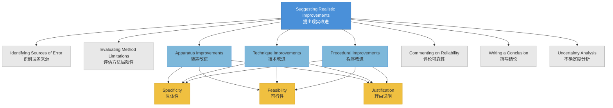

# 1. Overview / 概述

**English:**
This sub-topic focuses on the skill of suggesting **realistic, practical, and specific improvements** to experimental procedures. After identifying sources of error and limitations in a method (see [[Identifying Sources of Error and Uncertainty]]), students must propose modifications that are achievable in a school laboratory setting. This is a critical skill in both CAIE Paper 3/5 and Edexcel U3/U6 practical assessments. The ability to suggest realistic improvements demonstrates a deep understanding of the underlying physics principles and the practical constraints of measurement. This leaf node connects directly to [[Evaluating Method and Apparatus Limitations]] and [[Commenting on Reliability and Validity]].

**中文:**
本子知识点专注于提出**现实、实用且具体**的实验改进建议的技能。在识别了误差来源和方法局限性（参见[[Identifying Sources of Error and Uncertainty]]）之后，学生必须提出在学校实验室条件下可行的修改方案。这是CAIE Paper 3/5和Edexcel U3/U6实验评估中的关键技能。提出现实改进的能力体现了对基础物理原理和测量实际限制的深刻理解。本节点直接连接到[[Evaluating Method and Apparatus Limitations]]和[[Commenting on Reliability and Validity]]。

---

# 2. Syllabus Learning Objectives / 考纲学习目标

| CAIE 9702 | Edexcel IAL |
|-----------|-------------|
| Suggest improvements to apparatus and techniques to reduce uncertainty | Suggest modifications to experimental procedures to improve accuracy and reliability |
| Explain how suggested improvements would reduce errors | Justify how proposed changes address identified limitations |
| Propose modifications that are practical and achievable | Evaluate the feasibility of suggested improvements |

**Examiner Expectations / 考官期望:**
- **English:** Improvements must be specific (e.g., "use a micrometer screw gauge" not "use a better instrument"), practical (achievable in a school lab), and directly linked to identified errors. Avoid vague suggestions like "be more careful."
- **中文:** 改进建议必须具体（例如“使用千分尺”而非“使用更好的仪器”）、实用（在学校实验室可实现），并直接与已识别的误差相关联。避免模糊的建议，如“更小心”。

---

# 3. Core Definitions / 核心定义

| Term (EN/CN) | Definition (EN) | Definition (CN) | Common Mistakes / 常见错误 |
|--------------|-----------------|-----------------|---------------------------|
| **Realistic Improvement** / 现实改进 | A modification to apparatus, technique, or procedure that is achievable within a standard school laboratory setting and directly addresses a specific source of error. | 在标准学校实验室条件下可实现、并直接针对特定误差来源的装置、技术或程序修改。 | Suggesting expensive equipment (e.g., "use a laser interferometer") or impossible changes (e.g., "remove air resistance"). |
| **Specific Suggestion** / 具体建议 | A clearly described change that names the exact equipment, technique, or procedural step to be modified. | 明确描述的改变，指明要修改的确切设备、技术或程序步骤。 | Vague suggestions like "improve accuracy" or "use better equipment." |
| **Justification** / 理由说明 | An explanation of how the suggested improvement reduces the identified error or uncertainty. | 解释建议的改进如何减少已识别的误差或不确定度。 | Stating the improvement without linking it to the error. |
| **Feasibility** / 可行性 | The practicality of implementing the improvement given time, equipment, and resource constraints. | 在时间、设备和资源限制下实施改进的实用性。 | Suggesting changes that require specialist equipment not found in schools. |
| **Systematic Error Reduction** / 系统误差减少 | Improvements that address consistent, repeatable errors (e.g., zero error, parallax error). | 针对一致、可重复误差（如零误差、视差误差）的改进。 | Confusing systematic error reduction with random error reduction. |

---

# 4. Key Concepts Explained / 关键概念详解

## 4.1 The Improvement Framework / 改进框架

### Explanation / 解释
**English:** The process of suggesting realistic improvements follows a logical framework:
1. **Identify** the specific error or limitation (see [[Identifying Sources of Error and Uncertainty]])
2. **Propose** a specific, achievable modification
3. **Justify** how the modification reduces the error
4. **Consider** feasibility (time, equipment, safety)

For example, if parallax error is identified when reading a ruler, the improvement is: "Use a set square to ensure the eye is perpendicular to the scale, reducing parallax error." This is specific, realistic, and justified.

**中文:** 提出现实改进的过程遵循逻辑框架：
1. **识别** 具体的误差或局限性（参见[[Identifying Sources of Error and Uncertainty]]）
2. **提出** 具体、可实现的修改
3. **说明理由** 修改如何减少误差
4. **考虑** 可行性（时间、设备、安全）

例如，如果读取尺子时识别出视差误差，改进建议为：“使用直角三角板确保眼睛垂直于刻度，减少视差误差。”这具体、现实且有理由说明。

### Physical Meaning / 物理意义
**English:** The physical meaning is that every measurement has inherent uncertainties. Realistic improvements target the dominant sources of uncertainty to reduce the overall uncertainty in the final result. This aligns with the principle that the weakest link in the measurement chain determines the overall precision.

**中文:** 物理意义在于每次测量都有固有的不确定度。现实改进针对不确定度的主要来源，以减少最终结果的总体不确定度。这与测量链中最薄弱的环节决定整体精度的原理一致。

### Common Misconceptions / 常见误区
- **English:**
  - ❌ Thinking "more repeats" is always the best improvement (it only reduces random error, not systematic)
  - ❌ Suggesting improvements that are too expensive or complex for school labs
  - ❌ Forgetting to justify *how* the improvement reduces the error
  - ❌ Confusing "improving accuracy" with "improving precision"
- **中文:**
  - ❌ 认为“增加重复次数”总是最好的改进（只能减少随机误差，不能减少系统误差）
  - ❌ 提出对学校实验室来说过于昂贵或复杂的改进
  - ❌ 忘记说明改进*如何*减少误差
  - ❌ 混淆“提高准确度”和“提高精密度”

### Exam Tips / 考试提示
- **English:** Always link your improvement to a specific error you identified earlier. Use the structure: "To reduce [error], I would [specific change] because [reason]." Avoid generic answers.
- **中文:** 始终将你的改进与你之前识别的具体误差联系起来。使用结构：“为了减少[误差]，我会[具体改变]，因为[理由]。”避免泛泛而答。

> 📷 **IMAGE PROMPT — FRAMEWORK: Improvement Decision Flowchart**
> A flowchart showing the decision process: Identify Error → Is it systematic or random? → Propose specific modification → Is it feasible? → Justify → Implement. Use a clean, educational style with arrows and decision diamonds.

---

## 4.2 Categories of Improvements / 改进类别

### Explanation / 解释
**English:** Improvements can be categorized into three main types:
1. **Apparatus Improvements:** Changing or upgrading equipment (e.g., using a digital balance instead of a spring balance, using a micrometer instead of a ruler)
2. **Technique Improvements:** Changing how measurements are taken (e.g., using a fiducial marker to reduce parallax, taking readings at the centre of oscillation)
3. **Procedural Improvements:** Changing the experimental method (e.g., using a cooling curve method instead of direct temperature measurement, using a light gate instead of stopwatch)

**中文:** 改进可分为三大类：
1. **装置改进：** 更换或升级设备（例如，使用数字天平代替弹簧秤，使用千分尺代替尺子）
2. **技术改进：** 改变测量方式（例如，使用基准标记减少视差，在振荡中心读数）
3. **程序改进：** 改变实验方法（例如，使用冷却曲线法代替直接温度测量，使用光门代替秒表）

### Common Misconceptions / 常见误区
- **English:** Students often suggest apparatus improvements when technique improvements would be more practical and cost-effective.
- **中文:** 学生经常建议装置改进，而技术改进可能更实用且成本效益更高。

### Exam Tips / 考试提示
- **English:** For each improvement, ask yourself: "Can this be done in 5 minutes with standard school equipment?" If not, it's probably not realistic.
- **中文:** 对于每个改进，问自己：“这能在5分钟内用标准学校设备完成吗？”如果不能，可能就不现实。

---

# 5. Essential Equations / 核心公式

While this sub-topic is qualitative, the following equation helps understand *why* improvements work:

$$ \text{Total Uncertainty} = \sqrt{(\Delta x_1)^2 + (\Delta x_2)^2 + ... + (\Delta x_n)^2} $$

| Symbol (符号) | Meaning (EN) | Meaning (CN) | Unit (单位) |
|--------------|-------------|-------------|------------|
| $\Delta x_i$ | Individual uncertainty component | 单个不确定度分量 | Same as measured quantity |
| Total Uncertainty | Combined uncertainty from all sources | 所有来源的合成不确定度 | Same as measured quantity |

**Derivation / 推导:** This is the formula for combining independent random uncertainties (see [[Uncertainty Analysis in Practical Work]]).

**Conditions / 适用条件:**
- **English:** Only applies to random uncertainties that are independent of each other. Systematic errors must be addressed separately.
- **中文:** 仅适用于相互独立的随机不确定度。系统误差必须单独处理。

**Limitations / 局限性:**
- **English:** This formula assumes uncertainties are random and normally distributed. It does not account for systematic errors.
- **中文:** 该公式假设不确定度是随机的且呈正态分布。它不考虑系统误差。

**Practical Application / 实际应用:**
- **English:** To reduce total uncertainty, target the largest $\Delta x_i$ component. This is why realistic improvements focus on the dominant source of error.
- **中文:** 要减少总不确定度，应针对最大的$\Delta x_i$分量。这就是为什么现实改进关注主要的误差来源。

---

# 6. Graphs and Relationships / 图表与关系

While this sub-topic does not have specific graphs, understanding how improvements affect data quality is important.

## 6.1 Effect of Improvements on Data Spread / 改进对数据分散程度的影响

### Axes / 坐标轴
- **X-axis:** Measurement number / 测量序号
- **Y-axis:** Measured value / 测量值

### Shape / 形状
- **English:** Before improvement: data points show large scatter (high random uncertainty). After improvement: data points cluster more tightly around the mean (reduced random uncertainty).
- **中文:** 改进前：数据点分散较大（高随机不确定度）。改进后：数据点更紧密地聚集在平均值周围（随机不确定度减少）。

### Gradient Meaning / 斜率含义
- **English:** Not applicable for this comparison graph.
- **中文:** 不适用于此比较图。

### Area Meaning / 面积含义
- **English:** Not applicable.
- **中文:** 不适用。

### Exam Interpretation / 考试解读
- **English:** If a student suggests an improvement that reduces random error, the expected outcome is less scatter in the data. If the improvement targets systematic error, the data should shift closer to the true value.
- **中文:** 如果学生建议减少随机误差的改进，预期结果是数据分散程度减小。如果改进针对系统误差，数据应更接近真实值。

> 📷 **IMAGE PROMPT — GRAPH: Before and After Improvement Data Comparison**
> Two sets of data points on the same graph. Left set (before improvement) shows wide scatter around a mean. Right set (after improvement) shows tight clustering around the same mean. Label "Before" and "After" with arrows showing reduced spread. Use different colors for clarity.

---

# 7. Required Diagrams / 必备图表

## 7.1 Common Improvement Scenarios / 常见改进场景

### Description / 描述
**English:** A visual reference showing common experimental setups and the corresponding realistic improvements for each identified error.

**中文:** 一个视觉参考，展示常见实验装置以及针对每个已识别误差的相应现实改进。

### Image Prompt / 图片生成提示
> 📷 **IMAGE PROMPT — DIAGRAM: Common Improvement Scenarios**
> A split-panel diagram showing four common school lab experiments. Panel 1: Pendulum experiment with parallax error when measuring length → improvement: use set square. Panel 2: Young's modulus experiment with wire stretching → improvement: use vernier scale. Panel 3: Electrical circuit with heating affecting resistance → improvement: use switch to only connect when measuring. Panel 4: Calorimetry with heat loss → improvement: use insulating jacket. Each panel shows "Before" (with error highlighted) and "After" (with improvement shown). Clean educational style with labels.

### Labels Required / 需要标注
- **English:** Error type (e.g., "Parallax Error"), Improvement (e.g., "Use Set Square"), Justification (e.g., "Ensures perpendicular viewing")
- **中文:** 误差类型（如“视差误差”）、改进（如“使用直角三角板”）、理由（如“确保垂直观察”）

### Exam Importance / 考试重要性
- **English:** High. Students are expected to visualize how improvements work in practice. This diagram helps connect theory to practical application.
- **中文:** 高。学生应能可视化改进在实际中如何工作。此图有助于将理论与实践应用联系起来。

---

# 8. Worked Examples / 典型例题

## Example 1: Pendulum Experiment Improvement / 摆实验改进

### Question / 题目
**English:**
A student measures the period of a pendulum using a stopwatch. She identifies that her reaction time when starting and stopping the stopwatch introduces significant uncertainty. Suggest a realistic improvement to reduce this uncertainty and justify your answer.

**中文:**
一名学生使用秒表测量摆的周期。她发现启动和停止秒表时的反应时间引入了显著的不确定度。提出一个现实的改进以减少这种不确定度，并说明理由。

### Solution / 解答
**Step 1: Identify the specific error**
- **English:** The error is random uncertainty due to human reaction time when using a stopwatch.
- **中文:** 误差是由于使用秒表时的人为反应时间导致的随机不确定度。

**Step 2: Propose a specific improvement**
- **English:** Measure the time for 10 complete oscillations (instead of 1) and then divide by 10 to find the period.
- **中文:** 测量10次完整振荡的时间（而不是1次），然后除以10得到周期。

**Step 3: Justify the improvement**
- **English:** The reaction time uncertainty ($\Delta t_{reaction} \approx 0.2 \text{ s}$) is approximately constant for each timing measurement. By measuring 10 oscillations, the total time measured is 10 times larger, so the percentage uncertainty in the period is reduced by a factor of 10:
  $$ \text{Percentage uncertainty in } T = \frac{\Delta t_{reaction}}{10T} \times 100\% $$
  This is much smaller than measuring a single period:
  $$ \text{Percentage uncertainty in } T = \frac{\Delta t_{reaction}}{T} \times 100\% $$
- **中文:** 反应时间不确定度（$\Delta t_{reaction} \approx 0.2 \text{ s}$）对每次计时测量大致恒定。通过测量10次振荡，测量的总时间大了10倍，因此周期的百分比不确定度减少了10倍：
  $$ \text{周期的百分比不确定度} = \frac{\Delta t_{reaction}}{10T} \times 100\% $$
  这比测量单个周期小得多：
  $$ \text{周期的百分比不确定度} = \frac{\Delta t_{reaction}}{T} \times 100\% $$

**Step 4: Consider feasibility**
- **English:** This improvement requires no additional equipment and takes only slightly more time. It is highly realistic.
- **中文:** 此改进不需要额外设备，只多花一点时间。非常现实。

### Final Answer / 最终答案
**Answer:** Measure the time for 10 complete oscillations and divide by 10 to find the period. This reduces the percentage uncertainty from reaction time by a factor of 10. | **答案：** 测量10次完整振荡的时间，除以10得到周期。这将反应时间的百分比不确定度减少了10倍。

### Quick Tip / 提示
- **English:** Always quantify the improvement if possible. Showing the percentage uncertainty reduction demonstrates deeper understanding.
- **中文:** 如果可能，始终量化改进效果。显示百分比不确定度的减少能展示更深的理解。

---

## Example 2: Electrical Circuit Improvement / 电路实验改进

### Question / 题目
**English:**
In an experiment to determine the resistance of a wire using a voltmeter and ammeter, a student notices that the wire heats up during the experiment, causing the resistance to increase. Suggest a realistic improvement to reduce this effect.

**中文:**
在使用伏特表和安培表测量导线电阻的实验中，学生注意到导线在实验过程中发热，导致电阻增加。提出一个现实的改进以减少这种影响。

### Solution / 解答
**Step 1: Identify the specific error**
- **English:** The error is a systematic change in resistance due to heating (temperature increase) of the wire.
- **中文:** 误差是由于导线发热（温度升高）导致的电阻系统性变化。

**Step 2: Propose a specific improvement**
- **English:** Use a switch to only connect the circuit when taking a reading. Alternatively, use a lower current by increasing the resistance in the circuit (e.g., add a variable resistor in series).
- **中文:** 使用开关仅在读数时接通电路。或者，通过增加电路中的电阻（例如，串联一个可变电阻器）使用更小的电流。

**Step 3: Justify the improvement**
- **English:** Heating is caused by $P = I^2R$ (power dissipated). By reducing the time the current flows (using a switch) or reducing the current itself, less thermal energy is generated, minimizing the temperature rise and keeping the resistance approximately constant.
- **中文:** 发热由$P = I^2R$（耗散功率）引起。通过减少电流流动的时间（使用开关）或减少电流本身，产生的热能更少，从而最小化温度升高，使电阻大致保持恒定。

**Step 4: Consider feasibility**
- **English:** Both improvements are simple and require only standard equipment (switch or variable resistor). They are highly realistic.
- **中文:** 两种改进都很简单，只需要标准设备（开关或可变电阻器）。非常现实。

### Final Answer / 最终答案
**Answer:** Use a switch to only connect the circuit momentarily when taking readings, reducing heating. | **答案：** 使用开关仅在读数时短暂接通电路，减少发热。

### Quick Tip / 提示
- **English:** When suggesting improvements for thermal effects, always mention the underlying physics ($P = I^2R$ or $Q = mc\Delta T$) to show understanding.
- **中文:** 当建议针对热效应的改进时，始终提及基础物理原理（$P = I^2R$或$Q = mc\Delta T$）以展示理解。

---

# 9. Past Paper Question Types / 历年真题题型

| Question Type / 题型 | Frequency / 频率 | Difficulty / 难度 | Past Paper References / 真题索引 |
|----------------------|------------------|------------------|-------------------------------|
| Suggest improvement for identified error | Very High | Medium | 📝 *待填入* |
| Justify how improvement reduces error | Very High | Medium | 📝 *待填入* |
| Evaluate feasibility of suggested improvement | Medium | Hard | 📝 *待填入* |
| Compare two possible improvements | Low | Hard | 📝 *待填入* |
| Suggest improvement without being given the error | Medium | Hard | 📝 *待填入* |

**Common Command Words / 常见指令词:**
- **English:** Suggest, Propose, Describe, Justify, Explain, Evaluate, Modify, Improve
- **中文:** 建议、提出、描述、说明理由、解释、评估、修改、改进

**Typical Mark Scheme / 典型评分方案:**
- **English:** 1 mark for specific improvement, 1 mark for justification linking to error, 1 mark for feasibility consideration (if required)
- **中文:** 1分给具体改进，1分给与误差关联的理由说明，1分给可行性考虑（如要求）

---

# 10. Practical Skills Connections / 实验技能链接

**English:**
This sub-topic directly connects to practical assessment in several ways:

1. **Paper 3 (CAIE) / U3 (Edexcel):** After completing an experiment, students are asked to evaluate the method and suggest improvements. This is typically worth 2-4 marks.
2. **Paper 5 (CAIE) / U6 (Edexcel):** In planning questions, students must anticipate potential errors and pre-emptively suggest improvements in their experimental design.
3. **Data Analysis:** When plotting graphs, students may notice systematic deviations from the expected relationship and suggest improvements to the method.
4. **Uncertainty Calculations:** Improvements should target the largest source of uncertainty (see [[Uncertainty Analysis in Practical Work]]).

**Key Measurements / 关键测量:**
- **English:** Improvements often involve changing how measurements of length, time, temperature, voltage, current, or mass are taken.
- **中文:** 改进通常涉及改变长度、时间、温度、电压、电流或质量的测量方式。

**Experimental Design / 实验设计:**
- **English:** When designing experiments (see [[Planning and Designing Experiments]]), always include a section on potential improvements. This shows examiner that you have considered limitations.
- **中文:** 在设计实验时（参见[[Planning and Designing Experiments]]），始终包含潜在改进的部分。这向考官展示你已考虑了局限性。

**Common Practical Setups / 常见实验装置:**
- **English:** Pendulum, Young's modulus, resistivity of wire, specific heat capacity, electrical circuits, optics experiments
- **中文:** 摆实验、杨氏模量、导线电阻率、比热容、电路、光学实验

---

# 11. Concept Map / 概念图谱

---

# 12. Quick Revision Sheet / 速查表

| Category / 类别 | Key Points / 要点 |
|----------------|------------------|
| **Definition / 定义** | Realistic improvements are specific, achievable modifications that directly address identified errors. / 现实改进是直接针对已识别误差的具体、可实现的修改。 |
| **Three Categories / 三大类别** | 1. Apparatus (change equipment) / 装置（更换设备） 2. Technique (change how you measure) / 技术（改变测量方式） 3. Procedural (change the method) / 程序（改变方法） |
| **Key Principles / 关键原则** | **Specific** (name exact equipment/technique) / **具体**（指明确切设备/技术） **Feasible** (achievable in school lab) / **可行**（在学校实验室可实现） **Justified** (explain how it reduces error) / **有理由**（解释如何减少误差） |
| **Common Errors to Target / 常见目标误差** | Parallax error → use set square / 视差误差 → 使用直角三角板 Reaction time → measure multiple oscillations / 反应时间 → 测量多次振荡 Heating effects → use switch or lower current / 热效应 → 使用开关或更小电流 Zero error → zero adjustment / 零误差 → 调零 Heat loss → insulation / 热损失 → 隔热 |
| **Formula Connection / 公式联系** | Total uncertainty = $\sqrt{\sum (\Delta x_i)^2}$ → Target the largest $\Delta x_i$ / 总不确定度 = $\sqrt{\sum (\Delta x_i)^2}$ → 针对最大的$\Delta x_i$ |
| **Exam Tip / 考试提示** | Always use the structure: "To reduce [error], I would [specific change] because [reason]." / 始终使用结构：“为了减少[误差]，我会[具体改变]，因为[理由]。” |
| **Common Mistakes / 常见错误** | ❌ Vague suggestions ("be more careful") / 模糊建议（“更小心”） ❌ Unrealistic equipment ("laser interferometer") / 不现实的设备（“激光干涉仪”） ❌ No justification / 没有理由说明 ❌ Confusing accuracy with precision / 混淆准确度和精密度 |
| **Mark Scheme / 评分标准** | 1 mark: Specific improvement / 具体改进 1 mark: Justification linked to error / 与误差关联的理由说明 1 mark: Feasibility (if required) / 可行性（如要求） |