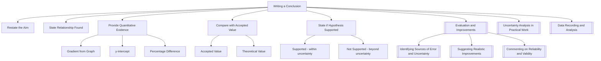

# Writing a Conclusion / 撰写结论

---

# 1. Overview / 概述

**English:**
Writing a conclusion is a critical skill in A-Level Physics practical assessments. This sub-topic focuses on how to construct a valid, evidence-based conclusion that directly answers the experimental aim or hypothesis. A strong conclusion must be supported by the data collected, reference the relationship between variables, and include a quantitative comparison with accepted values or theoretical predictions. It is distinct from "evaluation" — the conclusion states what the experiment shows, while evaluation discusses how reliable that conclusion is.

This leaf node sits within the broader [[Evaluation and Improvements]] hub. It connects closely to [[Identifying Sources of Error and Uncertainty]] (since errors affect what you can conclude) and [[Commenting on Reliability and Validity]] (since a conclusion is only valid if the method is sound). Prerequisites include understanding [[Data Recording and Analysis]] and [[Uncertainty Analysis in Practical Work]].

**中文:**
撰写结论是A-Level物理实验考试中的关键技能。本子知识点专注于如何构建一个有效、基于证据的结论，该结论必须直接回答实验目的或假设。一个强有力的结论必须得到所收集数据的支持，引用变量之间的关系，并包括与公认值或理论预测的定量比较。它不同于"评估"——结论陈述实验显示了什么，而评估讨论该结论的可靠性如何。

本叶节点位于更广泛的[[Evaluation and Improvements]]知识图谱中。它与[[Identifying Sources of Error and Uncertainty]]（因为误差影响你能得出的结论）和[[Commenting on Reliability and Validity]]（因为只有方法可靠，结论才有效）密切相关。先决条件包括理解[[Data Recording and Analysis]]和[[Uncertainty Analysis in Practical Work]]。

---

# 2. Syllabus Learning Objectives / 考纲学习目标

| CAIE 9702 | Edexcel IAL |
|-----------|-------------|
| Draw conclusions from experimental data, relating to the aim of the experiment | Draw valid conclusions from experimental results, relating to the hypothesis or aim |
| State whether the results support a given hypothesis or relationship | Comment on whether the experimental data supports the stated relationship |
| Compare experimental results with accepted values or theoretical predictions | Compare experimental findings with known values or theoretical expectations |
| Justify conclusions using quantitative evidence from the data | Use quantitative evidence to support or refute a hypothesis |

**Examiner Expectations / 考官期望:**
- **English:** The conclusion must be a direct response to the aim. It must reference specific data (e.g., gradient values, intercepts, percentage differences). It must not introduce new information or speculation. A conclusion without quantitative support will lose marks.
- **中文:** 结论必须直接回应实验目的。必须引用具体数据（如斜率值、截距、百分比差异）。不得引入新信息或推测。没有定量支持的结论会失分。

---

# 3. Core Definitions / 核心定义

| Term (EN/CN) | Definition (EN) | Definition (CN) | Common Mistakes / 常见错误 |
|--------------|-----------------|-----------------|---------------------------|
| **Conclusion** / 结论 | A statement that answers the experimental aim, supported by quantitative evidence from the data | 回答实验目的的陈述，由数据中的定量证据支持 | Confusing conclusion with evaluation or discussion of errors |
| **Hypothesis** / 假设 | A proposed relationship between variables, to be tested by experiment | 变量之间提出的关系，通过实验进行检验 | Stating the hypothesis as the conclusion |
| **Quantitative evidence** / 定量证据 | Numerical data (e.g., gradient, intercept, percentage difference) used to support a conclusion | 用于支持结论的数值数据（如斜率、截距、百分比差异） | Using vague qualitative statements like "the results were close" |
| **Accepted value** / 公认值 | A known theoretical or standard value used for comparison (e.g., g = 9.81 m s⁻²) | 用于比较的已知理论或标准值（如 g = 9.81 m s⁻²） | Not stating the accepted value explicitly |
| **Percentage difference** / 百分比差异 | $\frac{|\text{experimental} - \text{accepted}|}{\text{accepted}} \times 100\%$ | $\frac{|\text{实验值} - \text{公认值}|}{\text{公认值}} \times 100\%$ | Using absolute difference without normalising |
| **Reliability** / 可靠性 | The degree to which repeated measurements give consistent results | 重复测量结果一致的程度 | Confusing with accuracy or validity |

---

# 4. Key Concepts Explained / 关键概念详解

## 4.1 Structure of a Good Conclusion / 好结论的结构

### Explanation / 解释
**English:**
A well-written conclusion follows a clear structure:

1. **Restate the aim** — Briefly remind the reader what the experiment was investigating.
2. **State the relationship found** — Describe the relationship between variables (e.g., "The extension of the spring is directly proportional to the applied force").
3. **Provide quantitative evidence** — Reference specific numerical values from your analysis (e.g., "The gradient of the line of best fit was 0.245 N m⁻¹, with a y-intercept of 0.02 N, which is within the uncertainty range of zero").
4. **Compare with accepted/theoretical value** — If applicable, state the accepted value and calculate the percentage difference.
5. **State whether the hypothesis is supported** — Make a clear judgement: "The results support the hypothesis that..." or "The results do not support the hypothesis because..."

**中文:**
一个写得好结论遵循清晰的结构：

1. **重述目的** — 简要提醒读者实验调查的内容。
2. **陈述发现的关系** — 描述变量之间的关系（例如："弹簧的伸长量与施加的力成正比"）。
3. **提供定量证据** — 引用分析中的具体数值（例如："最佳拟合线的斜率为0.245 N m⁻¹，y截距为0.02 N，在零的不确定度范围内"）。
4. **与公认值/理论值比较** — 如适用，陈述公认值并计算百分比差异。
5. **说明假设是否得到支持** — 做出明确判断："结果支持假设..."或"结果不支持假设，因为..."

### Physical Meaning / 物理意义
**English:**
A conclusion is not just a summary — it is a logical inference drawn from the data. It connects the experimental observations to the underlying physical principle being tested. For example, if you measure the acceleration of a falling object and find it close to 9.81 m s⁻², your conclusion is that the motion is consistent with uniform gravitational acceleration.

**中文:**
结论不仅仅是总结——它是从数据中得出的逻辑推论。它将实验观察与正在测试的基本物理原理联系起来。例如，如果你测量下落物体的加速度并发现它接近9.81 m s⁻²，你的结论是运动与均匀重力加速度一致。

### Common Misconceptions / 常见误区
- ❌ **Confusing conclusion with evaluation** — "The experiment was accurate" is evaluation, not conclusion. The conclusion is what the experiment *shows*, not how good the experiment was.
- ❌ **Making unsupported claims** — "The relationship is linear" without quoting the gradient or correlation coefficient.
- ❌ **Ignoring uncertainties** — A conclusion must acknowledge whether the data supports the hypothesis *within the limits of experimental uncertainty*.
- ❌ **Repeating the procedure** — The conclusion should not describe what was done, only what was found.
- ❌ **Being vague** — "The results were good" is not acceptable. Use specific numbers.

- ❌ **混淆结论与评估** — "实验很准确"是评估，不是结论。结论是实验*显示*了什么，而不是实验有多好。
- ❌ **做出无支持的声明** — 不引用斜率或相关系数就说"关系是线性的"。
- ❌ **忽略不确定度** — 结论必须承认数据是否*在实验不确定度范围内*支持假设。
- ❌ **重复步骤** — 结论不应描述做了什么，只应描述发现了什么。
- ❌ **含糊不清** — "结果很好"不可接受。使用具体数字。

### Exam Tips / 考试提示
- **English:** Always use the phrase "within the limits of experimental uncertainty" when stating your conclusion. This shows examiner awareness of errors.
- **English:** For CAIE Paper 5, you must include a quantitative comparison with the accepted value.
- **English:** For Edexcel, ensure your conclusion directly addresses the hypothesis stated in the introduction.
- **中文:** 陈述结论时，始终使用"在实验不确定度范围内"这一短语。这向考官表明你意识到误差的存在。
- **中文:** 对于CAIE Paper 5，你必须包括与公认值的定量比较。
- **中文:** 对于Edexcel，确保你的结论直接回应引言中陈述的假设。

> 📷 **IMAGE PROMPT — CONC-01: Conclusion Structure Flowchart**
> A flowchart showing the 5-step structure of a good conclusion: Aim → Relationship Found → Quantitative Evidence → Comparison with Accepted Value → Hypothesis Supported or Not. Use arrows and clear boxes. Include example text in each box. Clean, educational diagram style suitable for A-Level physics revision.

---

## 4.2 Quantitative Comparison / 定量比较

### Explanation / 解释
**English:**
A quantitative comparison involves calculating the **percentage difference** between your experimental value and the accepted or theoretical value. This is a key skill for both CAIE and Edexcel.

$$ \text{Percentage difference} = \frac{|\text{experimental value} - \text{accepted value}|}{\text{accepted value}} \times 100\% $$

You must then interpret this value:
- **< 5%** : Generally considered good agreement (within typical experimental uncertainty)
- **5–10%** : Moderate agreement — may indicate systematic errors
- **> 10%** : Poor agreement — likely significant systematic errors or flawed method

**中文:**
定量比较涉及计算你的实验值与公认值或理论值之间的**百分比差异**。这是CAIE和Edexcel的关键技能。

$$ \text{百分比差异} = \frac{|\text{实验值} - \text{公认值}|}{\text{公认值}} \times 100\% $$

然后你必须解释这个值：
- **< 5%** ：通常认为一致性良好（在典型实验不确定度范围内）
- **5–10%** ：中等一致性——可能表明存在系统误差
- **> 10%** ：一致性差——可能存在显著系统误差或方法缺陷

### Common Misconceptions / 常见误区
- ❌ **Not stating the accepted value** — You must explicitly state what value you are comparing against.
- ❌ **Using percentage difference when the accepted value is zero** — Use absolute difference instead.
- ❌ **Forgetting to include units** — All values must have correct SI units.

### Exam Tips / 考试提示
- **English:** Always show your calculation of percentage difference in full.
- **English:** After calculating, state clearly: "This is within/beyond the expected experimental uncertainty of ±X%."
- **中文:** 始终完整展示百分比差异的计算过程。
- **中文:** 计算后，清楚说明："这在预期的实验不确定度±X%之内/之外。"

---

## 4.3 Supporting or Refuting a Hypothesis / 支持或反驳假设

### Explanation / 解释
**English:**
Many experiments test a specific hypothesis. Your conclusion must state whether the data supports or refutes the hypothesis. This is not a simple "yes" or "no" — you must explain *why* using quantitative evidence.

**Example:**
- **Hypothesis:** "The period of a pendulum is independent of the amplitude for small angles."
- **Conclusion:** "The results support the hypothesis. For amplitudes up to 15°, the period varied by only 0.03 s, which is within the experimental uncertainty of ±0.05 s. Therefore, within the limits of experimental uncertainty, the period is independent of amplitude for small angles."

**中文:**
许多实验测试特定的假设。你的结论必须说明数据是支持还是反驳假设。这不是简单的"是"或"否"——你必须用定量证据解释*为什么*。

**示例：**
- **假设：** "对于小角度，单摆的周期与振幅无关。"
- **结论：** "结果支持该假设。对于高达15°的振幅，周期仅变化0.03 s，这在实验不确定度±0.05 s范围内。因此，在实验不确定度范围内，对于小角度，周期与振幅无关。"

### Exam Tips / 考试提示
- **English:** Use the phrase "within the limits of experimental uncertainty" to qualify your conclusion.
- **English:** If the data does not support the hypothesis, suggest possible reasons (e.g., systematic errors, flawed assumptions) — but keep this brief; detailed evaluation comes later.
- **中文:** 使用"在实验不确定度范围内"这一短语来限定你的结论。
- **中文:** 如果数据不支持假设，建议可能的原因（如系统误差、有缺陷的假设）——但要简短；详细的评估在后面。

---

# 5. Essential Equations / 核心公式

## 5.1 Percentage Difference / 百分比差异

$$ \text{Percentage difference} = \frac{|\text{experimental} - \text{accepted}|}{\text{accepted}} \times 100\% $$

| Symbol (符号) | Meaning (EN) | Meaning (CN) | Unit (单位) |
|--------------|-------------|-------------|------------|
| experimental | Measured value from experiment | 实验测量值 | Same as accepted |
| accepted | Known theoretical or standard value | 已知理论或标准值 | Same as experimental |

**Derivation / 推导:** N/A — this is a definition.
**Conditions / 适用条件:** The accepted value must be non-zero. If the accepted value is zero, use absolute difference instead.
**Limitations / 局限性:** Percentage difference does not indicate the direction of error (whether experimental value is higher or lower than accepted).

## 5.2 Absolute Difference / 绝对差异

$$ \text{Absolute difference} = |\text{experimental} - \text{accepted}| $$

| Symbol (符号) | Meaning (EN) | Meaning (CN) | Unit (单位) |
|--------------|-------------|-------------|------------|
| experimental | Measured value | 测量值 | Same as accepted |
| accepted | Known value | 已知值 | Same as experimental |

**Conditions / 适用条件:** Use when accepted value is zero or very small.
**Limitations / 局限性:** Does not normalise for scale — a 0.1 m difference is significant for a 0.5 m measurement but negligible for a 100 m measurement.

## 5.3 Gradient from Line of Best Fit / 最佳拟合线斜率

$$ m = \frac{\Delta y}{\Delta x} $$

| Symbol (符号) | Meaning (EN) | Meaning (CN) | Unit (单位) |
|--------------|-------------|-------------|------------|
| m | Gradient of line of best fit | 最佳拟合线的斜率 | y unit / x unit |
| Δy | Change in y-coordinate | y坐标的变化 | y unit |
| Δx | Change in x-coordinate | x坐标的变化 | x unit |

**Conditions / 适用条件:** Only use for linear relationships. For non-linear relationships, linearise the data first (e.g., plot T² vs L for a pendulum).

> 📷 **IMAGE PROMPT — CONC-02: Percentage Difference Calculation Example**
> A worked example showing the calculation of percentage difference between an experimental value of g = 9.65 m s⁻² and the accepted value of 9.81 m s⁻². Show the formula, substitution, and final answer of 1.63%. Include a comment: "This is within typical experimental uncertainty of ±5%, so the result is consistent with the accepted value."

---

# 6. Graphs and Relationships / 图表与关系

## 6.1 Line of Best Fit and Conclusion / 最佳拟合线与结论

### Axes / 坐标轴
- **English:** Independent variable on x-axis, dependent variable on y-axis
- **中文:** 自变量在x轴，因变量在y轴

### Shape / 形状
- **English:** A straight line through the data points (if relationship is linear)
- **中文:** 穿过数据点的直线（如果关系是线性的）

### Gradient Meaning / 斜率含义
- **English:** The gradient represents the constant of proportionality or a physical quantity (e.g., spring constant, acceleration)
- **中文:** 斜率代表比例常数或物理量（如弹簧常数、加速度）

### Area Meaning / 面积含义
- **English:** Area under the graph may represent another physical quantity (e.g., work done, impulse)
- **中文:** 图线下面积可能代表另一个物理量（如做功、冲量）

### Exam Interpretation / 考试解读
- **English:** When writing a conclusion, always quote the gradient value from your line of best fit. Compare it with the theoretical gradient expected from the relationship. For example, if plotting T² vs L for a pendulum, the theoretical gradient is $4\pi^2/g$. Calculate the experimental gradient and compare.
- **中文:** 撰写结论时，始终引用最佳拟合线的斜率值。将其与关系预期的理论斜率进行比较。例如，如果绘制单摆的T²与L的关系图，理论斜率为$4\pi^2/g$。计算实验斜率并进行比较。

> 📷 **IMAGE PROMPT — CONC-03: Graph with Line of Best Fit for Conclusion**
> A scatter graph with 6 data points showing a linear relationship. Include a line of best fit. Annotate the gradient calculation (Δy/Δx) on the graph. Show the equation of the line: y = 0.245x + 0.02. Include error bars on each point. The graph should look like a typical A-Level physics practical graph.

---

# 7. Required Diagrams / 必备图表

## 7.1 Conclusion Structure Diagram / 结论结构图

### Description / 描述
**English:** A flowchart showing the logical steps from experimental aim to final conclusion.
**中文:** 显示从实验目的到最终结论的逻辑步骤的流程图。

### Image Prompt / 图片生成提示
> 📷 **IMAGE PROMPT — CONC-04: Conclusion Writing Flowchart**
> A clean, educational flowchart with 5 boxes connected by arrows. Box 1: "State the aim" (e.g., "To determine the acceleration due to gravity"). Box 2: "Describe the relationship found" (e.g., "T² is proportional to L"). Box 3: "Provide quantitative evidence" (e.g., "Gradient = 4.02 s² m⁻¹"). Box 4: "Compare with accepted value" (e.g., "Theoretical gradient = 4π²/g = 4.03 s² m⁻¹, % difference = 0.25%"). Box 5: "State conclusion" (e.g., "The results support the relationship T = 2π√(L/g) within experimental uncertainty"). Use a professional, textbook-style layout with blue and white colour scheme.

### Labels Required / 需要标注
- **English:** Each box should have a heading (e.g., "Step 1: Aim") and example text
- **中文:** 每个框应有标题（如"步骤1：目的"）和示例文本

### Exam Importance / 考试重要性
- **English:** High — this structure is directly tested in both CAIE Paper 5 and Edexcel Unit 3/6
- **中文:** 高——此结构在CAIE Paper 5和Edexcel Unit 3/6中直接测试

---

## 7.2 Graph with Annotated Conclusion / 带注释结论的图表

### Description / 描述
**English:** A graph showing experimental data with a line of best fit, annotated with the gradient value and its comparison to the theoretical value.
**中文:** 显示实验数据及最佳拟合线的图表，标注斜率值及其与理论值的比较。

### Image Prompt / 图片生成提示
> 📷 **IMAGE PROMPT — CONC-05: Annotated Graph for Conclusion**
> A graph of T² (y-axis) vs L (x-axis) for a simple pendulum experiment. 6 data points with error bars. A line of best fit drawn through the points. Annotate: "Gradient = 4.02 s² m⁻¹" near the line. Add a note: "Theoretical gradient = 4π²/g = 4.03 s² m⁻¹. % difference = 0.25%." Include axis labels with units. Professional, clean style suitable for A-Level physics.

### Labels Required / 需要标注
- **English:** Gradient value, theoretical gradient, percentage difference, axis labels with units
- **中文:** 斜率值、理论斜率、百分比差异、带单位的坐标轴标签

### Exam Importance / 考试重要性
- **English:** High — examiners expect you to use graph data in your conclusion
- **中文:** 高——考官期望你在结论中使用图表数据

---

# 8. Worked Examples / 典型例题

## Example 1: Simple Pendulum Experiment / 示例1：单摆实验

### Question / 题目
**English:**
A student investigates the relationship between the period T of a simple pendulum and its length L. The hypothesis is that $T = 2\pi\sqrt{L/g}$. The student plots a graph of T² against L and obtains a line of best fit with gradient 4.12 s² m⁻¹. The accepted value of g is 9.81 m s⁻². Write a conclusion for this experiment.

**中文:**
一名学生研究单摆周期T与其长度L之间的关系。假设为$T = 2\pi\sqrt{L/g}$。学生绘制了T²与L的关系图，得到最佳拟合线的斜率为4.12 s² m⁻¹。g的公认值为9.81 m s⁻²。为这个实验撰写结论。

### Solution / 解答

**Step 1: Restate the aim**
The aim was to determine the relationship between the period and length of a simple pendulum, and to verify the equation $T = 2\pi\sqrt{L/g}$.

**Step 2: State the relationship found**
The graph of T² against L shows a linear relationship passing through the origin, confirming that T² is directly proportional to L.

**Step 3: Provide quantitative evidence**
The gradient of the line of best fit is 4.12 s² m⁻¹. The y-intercept is 0.03 s², which is within the uncertainty of zero.

**Step 4: Compare with accepted value**
The theoretical gradient is given by:
$$ \text{Theoretical gradient} = \frac{4\pi^2}{g} = \frac{4\pi^2}{9.81} = 4.03 \text{ s}^2 \text{ m}^{-1} $$

Percentage difference:
$$ \frac{|4.12 - 4.03|}{4.03} \times 100\% = 2.23\% $$

**Step 5: State conclusion**
The experimental gradient of 4.12 s² m⁻¹ differs from the theoretical value of 4.03 s² m⁻¹ by only 2.23%. This is within typical experimental uncertainty. Therefore, the results support the hypothesis that $T = 2\pi\sqrt{L/g}$ within the limits of experimental uncertainty.

**中文解答：**

**步骤1：重述目的**
目的是确定单摆周期与长度之间的关系，并验证方程$T = 2\pi\sqrt{L/g}$。

**步骤2：陈述发现的关系**
T²与L的关系图显示线性关系并通过原点，确认T²与L成正比。

**步骤3：提供定量证据**
最佳拟合线的斜率为4.12 s² m⁻¹。y截距为0.03 s²，在零的不确定度范围内。

**步骤4：与公认值比较**
理论斜率由下式给出：
$$ \text{理论斜率} = \frac{4\pi^2}{g} = \frac{4\pi^2}{9.81} = 4.03 \text{ s}^2 \text{ m}^{-1} $$

百分比差异：
$$ \frac{|4.12 - 4.03|}{4.03} \times 100\% = 2.23\% $$

**步骤5：陈述结论**
实验斜率4.12 s² m⁻¹与理论值4.03 s² m⁻¹仅相差2.23%。这在典型实验不确定度范围内。因此，在实验不确定度范围内，结果支持假设$T = 2\pi\sqrt{L/g}$。

### Final Answer / 最终答案
**Answer:** The results support the hypothesis. The experimental gradient of 4.12 s² m⁻¹ is within 2.23% of the theoretical value of 4.03 s² m⁻¹, which is within experimental uncertainty. | **答案：** 结果支持假设。实验斜率4.12 s² m⁻¹与理论值4.03 s² m⁻¹相差2.23%，在实验不确定度范围内。

### Quick Tip / 提示
- **English:** Always include the percentage difference calculation in your conclusion. It is a direct way to show quantitative comparison.
- **中文:** 始终在结论中包含百分比差异计算。这是展示定量比较的直接方式。

---

## Example 2: Hooke's Law Experiment / 示例2：胡克定律实验

### Question / 题目
**English:**
A student investigates Hooke's Law: $F = kx$, where F is the applied force and x is the extension of a spring. The student plots a graph of F against x and obtains a line of best fit with gradient 24.5 N m⁻¹. The spring is labelled as having a spring constant of 25.0 N m⁻¹. Write a conclusion.

**中文:**
一名学生研究胡克定律：$F = kx$，其中F是施加的力，x是弹簧的伸长量。学生绘制了F与x的关系图，得到最佳拟合线的斜率为24.5 N m⁻¹。弹簧标称的弹簧常数为25.0 N m⁻¹。撰写结论。

### Solution / 解答

**Step 1: Restate the aim**
The aim was to verify Hooke's Law and determine the spring constant of the spring.

**Step 2: State the relationship found**
The graph of F against x shows a linear relationship passing through the origin, confirming that force is directly proportional to extension, as predicted by Hooke's Law.

**Step 3: Provide quantitative evidence**
The gradient of the line of best fit is 24.5 N m⁻¹, which represents the experimental spring constant. The y-intercept is 0.1 N, which is within the uncertainty of zero.

**Step 4: Compare with accepted value**
The labelled spring constant is 25.0 N m⁻¹.

Percentage difference:
$$ \frac{|24.5 - 25.0|}{25.0} \times 100\% = 2.0\% $$

**Step 5: State conclusion**
The experimental spring constant of 24.5 N m⁻¹ differs from the labelled value of 25.0 N m⁻¹ by only 2.0%. This is within typical experimental uncertainty. Therefore, the results support Hooke's Law and the spring constant is consistent with the labelled value within the limits of experimental uncertainty.

**中文解答：**

**步骤1：重述目的**
目的是验证胡克定律并确定弹簧的弹簧常数。

**步骤2：陈述发现的关系**
F与x的关系图显示线性关系并通过原点，确认力与伸长量成正比，符合胡克定律的预测。

**步骤3：提供定量证据**
最佳拟合线的斜率为24.5 N m⁻¹，代表实验弹簧常数。y截距为0.1 N，在零的不确定度范围内。

**步骤4：与公认值比较**
标称弹簧常数为25.0 N m⁻¹。

百分比差异：
$$ \frac{|24.5 - 25.0|}{25.0} \times 100\% = 2.0\% $$

**步骤5：陈述结论**
实验弹簧常数24.5 N m⁻¹与标称值25.0 N m⁻¹仅相差2.0%。这在典型实验不确定度范围内。因此，在实验不确定度范围内，结果支持胡克定律，弹簧常数与标称值一致。

### Final Answer / 最终答案
**Answer:** The results support Hooke's Law. The experimental spring constant of 24.5 N m⁻¹ is within 2.0% of the labelled value of 25.0 N m⁻¹, which is within experimental uncertainty. | **答案：** 结果支持胡克定律。实验弹簧常数24.5 N m⁻¹与标称值25.0 N m⁻¹相差2.0%，在实验不确定度范围内。

### Quick Tip / 提示
- **English:** When the accepted value comes from a manufacturer's label, mention this explicitly.
- **中文:** 当公认值来自制造商标签时，明确提及这一点。

---

# 9. Past Paper Question Types / 历年真题题型

| Question Type / 题型 | Frequency / 频率 | Difficulty / 难度 | Past Paper References / 真题索引 |
|----------------------|------------------|------------------|-------------------------------|
| Write a conclusion based on given data and graph | Very High | Medium | 📝 *待填入* |
| Compare experimental value with accepted value | Very High | Easy | 📝 *待填入* |
| State whether results support a hypothesis | High | Medium | 📝 *待填入* |
| Justify a conclusion using quantitative evidence | High | Medium-Hard | 📝 *待填入* |
| Identify errors in a given conclusion | Medium | Hard | 📝 *待填入* |

**Common Command Words / 常见指令词:**
- **English:** "State a conclusion", "Write a conclusion", "Comment on whether the results support the hypothesis", "Compare your value with the accepted value", "Justify your conclusion"
- **中文:** "陈述结论"、"撰写结论"、"评论结果是否支持假设"、"将你的值与公认值比较"、"证明你的结论"

---

# 10. Practical Skills Connections / 实验技能链接

**English:**
Writing a conclusion connects directly to several practical skills:

1. **Data Analysis:** You must calculate gradients, intercepts, and percentage differences before you can write a conclusion. See [[Data Recording and Analysis]].
2. **Uncertainty Analysis:** Your conclusion must acknowledge uncertainties. If the percentage difference is within the estimated uncertainty, the conclusion is that results are consistent. See [[Uncertainty Analysis in Practical Work]].
3. **Graph Plotting:** The line of best fit provides the gradient value that forms the quantitative basis of your conclusion. See [[Graph Plotting Techniques]].
4. **Evaluation:** After writing your conclusion, you evaluate its reliability. See [[Commenting on Reliability and Validity]].

**For CAIE Paper 5:** The conclusion is typically worth 2-3 marks. You must include a quantitative comparison with the accepted value.

**For Edexcel Unit 3/6:** The conclusion is often part of a longer answer. Ensure you address the hypothesis directly.

**中文:**
撰写结论直接与几个实验技能相关：

1. **数据分析：** 在撰写结论之前，你必须计算斜率、截距和百分比差异。参见[[Data Recording and Analysis]]。
2. **不确定度分析：** 你的结论必须承认不确定度。如果百分比差异在估计的不确定度范围内，结论是结果一致。参见[[Uncertainty Analysis in Practical Work]]。
3. **图表绘制：** 最佳拟合线提供构成结论定量基础的斜率值。参见[[Graph Plotting Techniques]]。
4. **评估：** 撰写结论后，你评估其可靠性。参见[[Commenting on Reliability and Validity]]。

**对于CAIE Paper 5：** 结论通常值2-3分。你必须包括与公认值的定量比较。

**对于Edexcel Unit 3/6：** 结论通常是较长答案的一部分。确保直接回应假设。

---

# 11. Concept Map / 概念图谱

---

# 12. Quick Revision Sheet / 速查表

| Category / 类别 | Key Points / 要点 |
|----------------|------------------|
| **Definition / 定义** | A conclusion answers the experimental aim using quantitative evidence from the data. It is NOT an evaluation. / 结论使用数据中的定量证据回答实验目的。它不是评估。 |
| **Key Formula / 核心公式** | Percentage difference = $\frac{|\text{experimental} - \text{accepted}|}{\text{accepted}} \times 100\%$ / 百分比差异 = $\frac{|\text{实验值} - \text{公认值}|}{\text{公认值}} \times 100\%$ |
| **Key Graph / 核心图表** | Line of best fit with gradient annotated. Compare experimental gradient to theoretical gradient. / 标注斜率的最佳拟合线。将实验斜率与理论斜率比较。 |
| **Structure / 结构** | 1. Restate aim → 2. State relationship → 3. Quantitative evidence → 4. Compare with accepted → 5. Judge hypothesis / 1. 重述目的 → 2. 陈述关系 → 3. 定量证据 → 4. 与公认值比较 → 5. 判断假设 |
| **Key Phrase / 关键短语** | "Within the limits of experimental uncertainty" / "在实验不确定度范围内" |
| **Common Mistake / 常见错误** | Confusing conclusion with evaluation. Being vague without numbers. / 混淆结论与评估。含糊不清没有数字。 |
| **Exam Tip / 考试提示** | Always calculate and quote the percentage difference. Show full working. / 始终计算并引用百分比差异。展示完整计算过程。 |
| **CAIE Specific / CAIE特定** | Paper 5: Conclusion worth 2-3 marks. Must include quantitative comparison. / Paper 5：结论值2-3分。必须包括定量比较。 |
| **Edexcel Specific / Edexcel特定** | Unit 3/6: Address the hypothesis directly. Use data from your graph. / Unit 3/6：直接回应假设。使用图表中的数据。 |

---

> **Related Leaf Nodes:** [[Identifying Sources of Error and Uncertainty]], [[Suggesting Realistic Improvements]], [[Evaluating Method and Apparatus Limitations]], [[Commenting on Reliability and Validity]]
> **Parent Hub:** [[Evaluation and Improvements]]
> **Prerequisites:** [[Planning and Designing Experiments]], [[Data Recording and Analysis]], [[Uncertainty Analysis in Practical Work]]