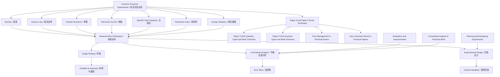

# Common Practical Experiments to Know / 常见实验必知

---

# 1. Overview / 概述

**English:**
This sub-topic covers the **most frequently tested practical experiments** in CAIE Paper 3 (AS) and Paper 5 (A2), as well as Edexcel Unit 3 (AS) and Unit 6 (A2). Rather than memorising every possible experiment, you need to understand the **core experimental setups, measurement techniques, and common sources of error** for a limited set of recurring experiments. These include: determining density, Hooke's law and spring constants, oscillations (simple pendulum and mass-spring), electrical circuits (resistance, Ohm's law, internal resistance), specific heat capacity, refractive index, and Young's modulus. Mastering these experiments gives you a strong foundation for tackling any practical question, as the underlying principles (control of variables, uncertainty analysis, graph plotting, and evaluation) are transferable. This leaf node is part of the broader [[Paper 3 and Paper 5 Exam Technique]] hub and connects closely to [[Planning and Designing Experiments]] and [[Evaluation and Improvements]].

**中文:**
本子知识点涵盖CAIE Paper 3（AS）和Paper 5（A2）以及Edexcel Unit 3（AS）和Unit 6（A2）中**最常考的实验**。你不需要记住所有可能的实验，而是要理解**核心实验装置、测量方法和常见误差来源**，掌握一组反复出现的实验。这些实验包括：测定密度、胡克定律与弹簧常数、振动（单摆和弹簧振子）、电路（电阻、欧姆定律、内阻）、比热容、折射率和杨氏模量。掌握这些实验为你应对任何实验题打下坚实基础，因为基本原则（变量控制、不确定度分析、作图、评估）是可迁移的。本叶节点是[[Paper 3 and Paper 5 Exam Technique]]知识图谱的一部分，与[[Planning and Designing Experiments]]和[[Evaluation and Improvements]]紧密相连。

---

# 2. Syllabus Learning Objectives / 考纲学习目标

| CAIE 9702 | Edexcel IAL |
|-----------|-------------|
| Paper 3: Plan and carry out experiments, record results, plot graphs, draw conclusions, evaluate procedures | Unit 3: Demonstrate practical skills, analyse data, evaluate methods, identify sources of error |
| Paper 5: Design experiments, analyse complex data, evaluate experimental methods | Unit 6: Design experiments, analyse data with uncertainties, evaluate and suggest improvements |
| Specific experiments: density, Hooke's law, oscillations, electrical circuits, specific heat capacity, refractive index, Young's modulus | Specific experiments: similar range plus gas laws, resistivity, and electromagnetic induction |

**Examiner Expectations / 考官期望:**
- **English:** You must be able to **describe the experimental setup** (including labelled diagrams), **identify independent/dependent/control variables**, **explain how to take measurements** (including repeated readings), **calculate derived quantities**, **plot and interpret graphs**, **evaluate the method** (identify limitations and suggest improvements), and **calculate uncertainties**.
- **中文:** 你必须能够**描述实验装置**（包括标注图表）、**识别自变量/因变量/控制变量**、**解释如何测量**（包括重复读数）、**计算导出量**、**作图并解读**、**评估方法**（找出局限并提出改进）以及**计算不确定度**。

---

# 3. Core Definitions / 核心定义

| Term (EN/CN) | Definition (EN) | Definition (CN) | Common Mistakes / 常见错误 |
|--------------|-----------------|-----------------|---------------------------|
| **Independent Variable** / 自变量 | The variable deliberately changed by the experimenter | 实验者故意改变的变量 | Confusing with dependent variable; not stating units |
| **Dependent Variable** / 因变量 | The variable measured as a result of changing the independent variable | 因自变量改变而测量的变量 | Not specifying how it is measured |
| **Control Variable** / 控制变量 | A variable kept constant to ensure a fair test | 保持恒定以确保公平测试的变量 | Forgetting to list at least one control variable |
| **Systematic Error** / 系统误差 | An error that shifts all measurements in the same direction (e.g., zero error) | 使所有测量值向同一方向偏移的误差（如零误差） | Confusing with random error; not suggesting how to reduce it |
| **Random Error** / 随机误差 | Unpredictable variations in measurements (e.g., parallax error) | 测量中不可预测的变化（如视差误差） | Thinking it can be eliminated (it can only be reduced by repetition) |
| **Uncertainty** / 不确定度 | The range within which the true value is expected to lie | 真值预期所在的区间 | Not including units; confusing with error |

---

# 4. Key Concepts Explained / 关键概念详解

## 4.1 Experimental Design Principles / 实验设计原则

### Explanation / 解释
**English:** Every practical experiment follows a standard structure: **aim → apparatus → procedure → measurements → analysis → conclusion → evaluation**. The **aim** states what you are investigating (e.g., "To determine the spring constant of a spring"). The **apparatus** list must include all equipment with sizes/ranges (e.g., "metre ruler ±0.1 cm", "spring of unknown spring constant"). The **procedure** must be step-by-step, including how to set up, how to change the independent variable, how to measure the dependent variable, and how to control other variables. Always include **repeated readings** to reduce random error. The **analysis** involves calculating derived quantities, plotting graphs, and determining gradients/intercepts. The **conclusion** states the relationship or value found. The **evaluation** identifies limitations and suggests improvements.

**中文:** 每个实验都遵循标准结构：**目的 → 器材 → 步骤 → 测量 → 分析 → 结论 → 评估**。**目的**说明你要研究什么（如"测定弹簧的弹簧常数"）。**器材清单**必须包括所有设备及其规格/量程（如"米尺 ±0.1 cm"、"未知弹簧常数的弹簧"）。**步骤**必须逐步说明，包括如何搭建装置、如何改变自变量、如何测量因变量、如何控制其他变量。始终包括**重复读数**以减少随机误差。**分析**涉及计算导出量、作图、确定斜率和截距。**结论**说明找到的关系或数值。**评估**找出局限并提出改进。

### Physical Meaning / 物理意义
**English:** Good experimental design ensures **validity** (you measure what you intend to), **reliability** (results are repeatable), and **accuracy** (results are close to the true value). Control variables ensure a fair test; repeated readings reduce random error; using appropriate instruments reduces systematic error.

**中文:** 良好的实验设计确保**有效性**（测量你想测量的）、**可靠性**（结果可重复）和**准确性**（结果接近真值）。控制变量确保公平测试；重复读数减少随机误差；使用合适的仪器减少系统误差。

### Common Misconceptions / 常见误区
- **English:** "More readings always improve accuracy" — only if they reduce random error; systematic errors remain. "A graph is only for finding a value" — graphs also show relationships and identify outliers.
- **中文:** "更多读数总能提高准确性" — 只有减少随机误差时才有效；系统误差仍然存在。"作图只是为了求值" — 作图还能显示关系并识别异常值。

### Exam Tips / 考试提示
- **English:** Always **label diagrams** clearly. State **units** for all measurements. Include **at least one control variable**. For graphs, use **error bars** if uncertainties are given. For evaluations, suggest **specific improvements** (e.g., "use a data logger to reduce timing errors").
- **中文:** 始终**清晰标注图表**。所有测量都要写**单位**。包括**至少一个控制变量**。对于图表，如果给出了不确定度，要使用**误差棒**。对于评估，提出**具体的改进**（如"使用数据记录器减少计时误差"）。

> 📷 **IMAGE PROMPT — EXP-01: Experimental Setup Diagram**
> A clean, labelled line drawing of a simple pendulum setup: a string attached to a clamp stand, with a bob at the bottom, a protractor to measure angle, and a stopwatch. Labels: "clamp stand", "string", "bob", "protractor", "stopwatch", "metre ruler". White background, black lines, clear font.

---

## 4.2 Common Measurement Techniques / 常用测量技术

### Explanation / 解释
**English:** Different experiments require different measurement techniques. For **length**, use a metre ruler (±0.1 cm) or vernier callipers (±0.01 cm) for small lengths. For **time**, use a stopwatch (±0.1 s) or a data logger (±0.001 s) for precise timing. For **mass**, use a digital balance (±0.1 g or ±0.01 g). For **temperature**, use a thermometer (±0.5°C) or a thermocouple (±0.1°C). For **electrical quantities**, use an ammeter (±0.01 A), voltmeter (±0.01 V), or multimeter. Always **record raw data** in a table with units and uncertainties. **Repeat readings** at least three times and calculate the mean.

**中文:** 不同实验需要不同的测量技术。对于**长度**，使用米尺（±0.1 cm）或游标卡尺（±0.01 cm）测量小长度。对于**时间**，使用秒表（±0.1 s）或数据记录器（±0.001 s）进行精确计时。对于**质量**，使用数字天平（±0.1 g 或 ±0.01 g）。对于**温度**，使用温度计（±0.5°C）或热电偶（±0.1°C）。对于**电学量**，使用电流表（±0.01 A）、电压表（±0.01 V）或万用表。始终在表格中**记录原始数据**，包括单位和不确定度。**重复读数**至少三次并计算平均值。

### Physical Meaning / 物理意义
**English:** The choice of instrument affects the **resolution** (smallest measurable change) and **uncertainty** of measurements. Higher resolution reduces random error but may not reduce systematic error. Using the correct technique (e.g., reading at eye level to avoid parallax) reduces systematic error.

**中文:** 仪器的选择影响测量的**分辨率**（最小可测量变化）和**不确定度**。更高的分辨率减少随机误差，但可能不减少系统误差。使用正确的技术（如平视读数以避免视差）减少系统误差。

### Common Misconceptions / 常见误区
- **English:** "Using a more precise instrument always gives better results" — if the instrument is not calibrated correctly, it introduces systematic error. "You should always use the smallest scale division as uncertainty" — sometimes half the smallest division is more appropriate.
- **中文:** "使用更精密的仪器总能得到更好的结果" — 如果仪器未正确校准，会引入系统误差。"应始终使用最小刻度作为不确定度" — 有时使用最小刻度的一半更合适。

### Exam Tips / 考试提示
- **English:** For **timing experiments** (pendulum, oscillations), measure the time for **multiple oscillations** (e.g., 10 oscillations) and divide to reduce timing uncertainty. For **electrical circuits**, always **open the switch** when not taking readings to avoid heating effects. For **temperature experiments**, **stir** the liquid to ensure uniform temperature.
- **中文:** 对于**计时实验**（单摆、振动），测量**多次振动**的时间（如10次）并除以次数以减少计时不确定度。对于**电路**，不读数时始终**断开开关**以避免加热效应。对于**温度实验**，**搅拌**液体以确保温度均匀。

---

# 5. Essential Equations / 核心公式

## 5.1 Density / 密度

$$ \rho = \frac{m}{V} $$

| Symbol (符号) | Meaning (EN) | Meaning (CN) | Unit (单位) |
|--------------|-------------|-------------|------------|
| $\rho$ | density | 密度 | kg m⁻³ or g cm⁻³ |
| $m$ | mass | 质量 | kg or g |
| $V$ | volume | 体积 | m³ or cm³ |

**Derivation / 推导:** Definition of density as mass per unit volume.
**Conditions / 适用条件:** For regular solids, measure dimensions with vernier callipers; for irregular solids, use displacement method (Eureka can).
**Limitations / 局限性:** For irregular objects, the displacement method assumes the object is insoluble and sinks completely.

## 5.2 Hooke's Law / 胡克定律

$$ F = kx $$

| Symbol (符号) | Meaning (EN) | Meaning (CN) | Unit (单位) |
|--------------|-------------|-------------|------------|
| $F$ | applied force | 施加的力 | N |
| $k$ | spring constant | 弹簧常数 | N m⁻¹ |
| $x$ | extension | 伸长量 | m |

**Derivation / 推导:** Experimental observation that force is proportional to extension for elastic materials within the limit of proportionality.
**Conditions / 适用条件:** Only valid within the **elastic limit** (linear region). Beyond this, the spring deforms permanently.
**Limitations / 局限性:** Does not apply to plastic deformation; assumes the spring is ideal (no mass, no internal friction).

## 5.3 Simple Pendulum / 单摆

$$ T = 2\pi \sqrt{\frac{l}{g}} $$

| Symbol (符号) | Meaning (EN) | Meaning (CN) | Unit (单位) |
|--------------|-------------|-------------|------------|
| $T$ | period of oscillation | 振动周期 | s |
| $l$ | length of pendulum | 摆长 | m |
| $g$ | acceleration due to gravity | 重力加速度 | m s⁻² |

**Derivation / 推导:** From the equation of motion for simple harmonic motion (SHM).
**Conditions / 适用条件:** Small angle approximation ($\theta < 10^\circ$); string is light and inextensible; bob is a point mass.
**Limitations / 局限性:** For large angles, the period increases; air resistance causes damping.

## 5.4 Ohm's Law / 欧姆定律

$$ V = IR $$

| Symbol (符号) | Meaning (EN) | Meaning (CN) | Unit (单位) |
|--------------|-------------|-------------|------------|
| $V$ | potential difference | 电势差 | V |
| $I$ | current | 电流 | A |
| $R$ | resistance | 电阻 | $\Omega$ |

**Derivation / 推导:** Experimental relationship for metallic conductors at constant temperature.
**Conditions / 适用条件:** Constant temperature; ohmic conductors only (metals at constant temperature).
**Limitations / 局限性:** Does not apply to non-ohmic conductors (diodes, thermistors, filament lamps).

## 5.5 Specific Heat Capacity / 比热容

$$ E = mc\Delta\theta $$

| Symbol (符号) | Meaning (EN) | Meaning (CN) | Unit (单位) |
|--------------|-------------|-------------|------------|
| $E$ | thermal energy | 热能 | J |
| $m$ | mass | 质量 | kg |
| $c$ | specific heat capacity | 比热容 | J kg⁻¹ K⁻¹ |
| $\Delta\theta$ | temperature change | 温度变化 | K or °C |

**Derivation / 推导:** Definition of specific heat capacity as energy required to raise 1 kg by 1 K.
**Conditions / 适用条件:** No phase change; assumes all energy goes into heating the substance (no heat loss).
**Limitations / 局限性:** Heat loss to surroundings is a major source of error; electrical method requires correction for heat capacity of the container.

## 5.6 Refractive Index / 折射率

$$ n = \frac{\sin i}{\sin r} $$

| Symbol (符号) | Meaning (EN) | Meaning (CN) | Unit (单位) |
|--------------|-------------|-------------|------------|
| $n$ | refractive index | 折射率 | dimensionless |
| $i$ | angle of incidence | 入射角 | degrees (°) |
| $r$ | angle of refraction | 折射角 | degrees (°) |

**Derivation / 推导:** Snell's law from wave theory.
**Conditions / 适用条件:** Light travelling from vacuum (or air) into the medium; angles measured from the normal.
**Limitations / 局限性:** Assumes the medium is isotropic; does not account for dispersion (different wavelengths have different refractive indices).

## 5.7 Young's Modulus / 杨氏模量

$$ E = \frac{FL}{A\Delta L} $$

| Symbol (符号) | Meaning (EN) | Meaning (CN) | Unit (单位) |
|--------------|-------------|-------------|------------|
| $E$ | Young's modulus | 杨氏模量 | Pa or N m⁻² |
| $F$ | applied force | 施加的力 | N |
| $L$ | original length | 原长 | m |
| $A$ | cross-sectional area | 横截面积 | m² |
| $\Delta L$ | extension | 伸长量 | m |

**Derivation / 推导:** Ratio of tensile stress to tensile strain.
**Conditions / 适用条件:** Within the elastic limit; uniform cross-section; material is isotropic.
**Limitations / 局限性:** Only valid for elastic deformation; assumes the wire is perfectly uniform.

> 📷 **IMAGE PROMPT — EXP-02: Young's Modulus Setup**
> A labelled diagram of a Young's modulus experiment: a long wire suspended from a ceiling, with a marker (e.g., a piece of tape) attached, a vernier scale or travelling microscope to measure extension, and weights hanging from the bottom. Labels: "wire", "marker", "vernier scale", "weights", "original length L". Clean, educational style.

---

# 6. Graphs and Relationships / 图表与关系

## 6.1 Force vs Extension (Hooke's Law) / 力与伸长量（胡克定律）

### Axes / 坐标轴
- **x-axis:** Extension $x$ (m) / 伸长量 $x$ (m)
- **y-axis:** Force $F$ (N) / 力 $F$ (N)

### Shape / 形状
- **English:** A straight line through the origin (within the elastic limit), then a curve as the spring approaches its elastic limit.
- **中文:** 通过原点的直线（在弹性限度内），然后当弹簧接近弹性限度时变为曲线。

### Gradient Meaning / 斜率含义
- **English:** Gradient = spring constant $k$ (N m⁻¹). A steeper gradient means a stiffer spring.
- **中文:** 斜率 = 弹簧常数 $k$ (N m⁻¹)。斜率越大，弹簧越硬。

### Area Meaning / 面积含义
- **English:** Area under the graph = work done to stretch the spring (elastic potential energy) = $\frac{1}{2}kx^2$.
- **中文:** 图线下面积 = 拉伸弹簧所做的功（弹性势能）= $\frac{1}{2}kx^2$。

### Exam Interpretation / 考试解读
- **English:** If the graph is not a straight line, the spring has exceeded its elastic limit. The gradient of the linear portion gives $k$. Use the graph to find $k$ by calculating the gradient of the best-fit line.
- **中文:** 如果图线不是直线，则弹簧已超过弹性限度。线性部分的斜率给出 $k$。通过计算最佳拟合线的斜率来求 $k$。

## 6.2 $T^2$ vs $l$ (Simple Pendulum) / $T^2$ 与 $l$（单摆）

### Axes / 坐标轴
- **x-axis:** Length $l$ (m) / 摆长 $l$ (m)
- **y-axis:** $T^2$ (s²) / $T^2$ (s²)

### Shape / 形状
- **English:** A straight line through the origin (since $T^2 = \frac{4\pi^2}{g} l$).
- **中文:** 通过原点的直线（因为 $T^2 = \frac{4\pi^2}{g} l$）。

### Gradient Meaning / 斜率含义
- **English:** Gradient = $\frac{4\pi^2}{g}$. Therefore, $g = \frac{4\pi^2}{\text{gradient}}$.
- **中文:** 斜率 = $\frac{4\pi^2}{g}$。因此，$g = \frac{4\pi^2}{\text{斜率}}$。

### Area Meaning / 面积含义
- **English:** Not applicable (area has no physical meaning).
- **中文:** 不适用（面积没有物理意义）。

### Exam Interpretation / 考试解读
- **English:** Plot $T^2$ against $l$ to obtain a straight line. The gradient gives $g$. If the line does not pass through the origin, there may be a systematic error (e.g., measuring length from the clamp rather than the centre of the bob).
- **中文:** 绘制 $T^2$ 与 $l$ 的关系图以获得直线。斜率给出 $g$。如果直线不通过原点，可能存在系统误差（如从夹子而不是摆球中心测量长度）。

## 6.3 $V$ vs $I$ (Ohm's Law) / $V$ 与 $I$（欧姆定律）

### Axes / 坐标轴
- **x-axis:** Current $I$ (A) / 电流 $I$ (A)
- **y-axis:** Potential difference $V$ (V) / 电势差 $V$ (V)

### Shape / 形状
- **English:** A straight line through the origin for ohmic conductors. For non-ohmic conductors (e.g., filament lamp), the line curves.
- **中文:** 对于欧姆导体，是通过原点的直线。对于非欧姆导体（如白炽灯），图线弯曲。

### Gradient Meaning / 斜率含义
- **English:** Gradient = resistance $R$ ($\Omega$). For a filament lamp, the gradient increases as current increases (resistance increases with temperature).
- **中文:** 斜率 = 电阻 $R$ ($\Omega$)。对于白炽灯，斜率随电流增大而增大（电阻随温度升高而增大）。

### Area Meaning / 面积含义
- **English:** Area under the graph = power dissipated = $VI$ (W).
- **中文:** 图线下面积 = 耗散功率 = $VI$ (W)。

### Exam Interpretation / 考试解读
- **English:** If the graph is a straight line, the component obeys Ohm's law. The gradient gives the resistance. For a filament lamp, the curved shape shows that resistance increases with temperature.
- **中文:** 如果图线是直线，则元件服从欧姆定律。斜率给出电阻。对于白炽灯，弯曲形状表明电阻随温度升高而增大。

---

# 7. Required Diagrams / 必备图表

## 7.1 Simple Pendulum Setup / 单摆装置

### Description / 描述
**English:** A labelled diagram showing a string attached to a clamp stand, with a bob at the bottom. A protractor is used to measure the angle of release (should be <10°). A metre ruler measures the length from the clamp to the centre of the bob. A stopwatch measures the time for 10 oscillations.
**中文:** 标注图显示一根绳子连接到夹持架上，底部有一个摆球。使用量角器测量释放角度（应<10°）。米尺测量从夹持点到摆球中心的长度。秒表测量10次振动的时间。

### Image Prompt / 图片生成提示
> 📷 **IMAGE PROMPT — EXP-03: Simple Pendulum Diagram**
> A clean, labelled line drawing of a simple pendulum: a clamp stand with a horizontal clamp, a string hanging down, a spherical bob at the bottom. Labels: "clamp stand", "string", "bob", "protractor (angle <10°)", "metre ruler (length l)", "stopwatch". White background, black lines, clear font.

### Labels Required / 需要标注
- **English:** Clamp stand, string, bob, protractor, metre ruler, stopwatch, length $l$, angle $\theta$
- **中文:** 夹持架、绳子、摆球、量角器、米尺、秒表、长度 $l$、角度 $\theta$

### Exam Importance / 考试重要性
- **English:** Very high — the simple pendulum is one of the most common experiments for determining $g$. You must be able to draw and label the setup, explain how to measure $l$ and $T$, and identify sources of error.
- **中文:** 非常高——单摆是测定 $g$ 的最常见实验之一。你必须能够绘制和标注装置，解释如何测量 $l$ 和 $T$，并找出误差来源。

## 7.2 Electrical Circuit for Resistance Measurement / 电阻测量电路

### Description / 描述
**English:** A circuit diagram showing a cell (or power supply), an ammeter in series with the resistor, a voltmeter in parallel with the resistor, and a variable resistor (rheostat) to vary the current. A switch is included to control the circuit.
**中文:** 电路图显示一个电池（或电源）、与电阻串联的电流表、与电阻并联的电压表、以及一个可变电阻器（变阻器）来改变电流。包括一个开关来控制电路。

### Image Prompt / 图片生成提示
> 📷 **IMAGE PROMPT — EXP-04: Resistance Measurement Circuit**
> A clean circuit diagram: a cell (battery symbol), a switch, an ammeter (A), a resistor (R), a voltmeter (V) in parallel with the resistor, and a variable resistor (rheostat) in series. All components connected with straight lines. Labels: "cell", "switch", "ammeter", "resistor", "voltmeter", "variable resistor". White background, black lines.

### Labels Required / 需要标注
- **English:** Cell, switch, ammeter (A), resistor (R), voltmeter (V), variable resistor
- **中文:** 电池、开关、电流表 (A)、电阻 (R)、电压表 (V)、可变电阻器

### Exam Importance / 考试重要性
- **English:** Very high — electrical circuits are tested in almost every practical paper. You must know how to connect ammeters (in series) and voltmeters (in parallel), and how to use a variable resistor to vary current.
- **中文:** 非常高——电路几乎在每次实验考试中都会出现。你必须知道如何连接电流表（串联）和电压表（并联），以及如何使用可变电阻器改变电流。

---

# 8. Worked Examples / 典型例题

## Example 1: Determining the Spring Constant / 测定弹簧常数

### Question / 题目
**English:** A student investigates Hooke's law using a spring. She hangs masses on the spring and measures the extension. The results are:

| Mass (g) | Extension (cm) |
|----------|----------------|
| 0        | 0.0            |
| 50       | 2.1            |
| 100      | 4.0            |
| 150      | 6.2            |
| 200      | 7.9            |
| 250      | 10.1           |

(a) Plot a graph of force (N) against extension (m). (b) Determine the spring constant $k$. (c) Suggest one source of error and how to reduce it.

**中文:** 一名学生使用弹簧研究胡克定律。她在弹簧上悬挂砝码并测量伸长量。结果如下：

| 质量 (g) | 伸长量 (cm) |
|----------|-------------|
| 0        | 0.0         |
| 50       | 2.1         |
| 100      | 4.0         |
| 150      | 6.2         |
| 200      | 7.9         |
| 250      | 10.1        |

(a) 绘制力 (N) 与伸长量 (m) 的关系图。(b) 确定弹簧常数 $k$。(c) 提出一个误差来源及如何减少。

### Solution / 解答

**Step 1: Convert units / 转换单位**
- Mass to force: $F = mg$ (use $g = 9.81 \text{ m s}^{-2}$)
- Extension to metres: divide by 100

| $F$ (N) | $x$ (m) |
|---------|---------|
| 0       | 0.000   |
| 0.491   | 0.021   |
| 0.981   | 0.040   |
| 1.472   | 0.062   |
| 1.962   | 0.079   |
| 2.453   | 0.101   |

**Step 2: Plot graph / 作图**
- Plot $F$ on y-axis, $x$ on x-axis
- Draw best-fit straight line through the points (should pass through origin)

**Step 3: Calculate gradient / 计算斜率**
- Choose two points on the best-fit line (not data points)
- Example: (0.020 m, 0.50 N) and (0.100 m, 2.45 N)
- Gradient $k = \frac{2.45 - 0.50}{0.100 - 0.020} = \frac{1.95}{0.080} = 24.4 \text{ N m}^{-1}$

**Step 4: Source of error / 误差来源**
- **English:** Parallax error when reading the ruler to measure extension. **Reduction:** Use a set square to read the ruler at eye level.
- **中文:** 读取米尺测量伸长量时的视差误差。**减少方法：** 使用三角尺平视读数。

### Final Answer / 最终答案
**Answer:** $k = 24.4 \text{ N m}^{-1}$ | **答案：** $k = 24.4 \text{ N m}^{-1}$

### Quick Tip / 提示
- **English:** Always convert units to SI (metres, kilograms) before plotting. Use the best-fit line, not individual data points, to calculate the gradient.
- **中文:** 作图前始终将单位转换为SI单位（米、千克）。使用最佳拟合线而不是单个数据点来计算斜率。

---

## Example 2: Determining $g$ Using a Simple Pendulum / 使用单摆测定 $g$

### Question / 题目
**English:** A student measures the period $T$ of a simple pendulum for different lengths $l$. The results are:

| $l$ (m) | $T$ (s) |
|---------|---------|
| 0.20    | 0.90    |
| 0.40    | 1.27    |
| 0.60    | 1.55    |
| 0.80    | 1.79    |
| 1.00    | 2.01    |

(a) Calculate $T^2$ for each length. (b) Plot a graph of $T^2$ against $l$. (c) Use the gradient to determine $g$.

**中文:** 一名学生测量不同摆长 $l$ 下单摆的周期 $T$。结果如下：

| $l$ (m) | $T$ (s) |
|---------|---------|
| 0.20    | 0.90    |
| 0.40    | 1.27    |
| 0.60    | 1.55    |
| 0.80    | 1.79    |
| 1.00    | 2.01    |

(a) 计算每个长度的 $T^2$。(b) 绘制 $T^2$ 与 $l$ 的关系图。(c) 使用斜率确定 $g$。

### Solution / 解答

**Step 1: Calculate $T^2$ / 计算 $T^2$**

| $l$ (m) | $T$ (s) | $T^2$ (s²) |
|---------|---------|------------|
| 0.20    | 0.90    | 0.81       |
| 0.40    | 1.27    | 1.61       |
| 0.60    | 1.55    | 2.40       |
| 0.80    | 1.79    | 3.20       |
| 1.00    | 2.01    | 4.04       |

**Step 2: Plot graph / 作图**
- Plot $T^2$ on y-axis, $l$ on x-axis
- Draw best-fit straight line through the points (should pass through origin)

**Step 3: Calculate gradient / 计算斜率**
- Choose two points on the best-fit line: (0.20 m, 0.80 s²) and (1.00 m, 4.04 s²)
- Gradient $m = \frac{4.04 - 0.80}{1.00 - 0.20} = \frac{3.24}{0.80} = 4.05 \text{ s}^2\text{m}^{-1}$

**Step 4: Calculate $g$ / 计算 $g$**
- From $T^2 = \frac{4\pi^2}{g} l$, gradient $m = \frac{4\pi^2}{g}$
- Therefore $g = \frac{4\pi^2}{m} = \frac{4\pi^2}{4.05} = 9.75 \text{ m s}^{-2}$

### Final Answer / 最终答案
**Answer:** $g = 9.75 \text{ m s}^{-2}$ | **答案：** $g = 9.75 \text{ m s}^{-2}$

### Quick Tip / 提示
- **English:** The theoretical value of $g$ is 9.81 m s⁻². If your calculated value is different, suggest reasons (e.g., air resistance, timing errors, large angle).
- **中文:** $g$ 的理论值是 9.81 m s⁻²。如果计算值不同，提出原因（如空气阻力、计时误差、角度过大）。

---

# 9. Past Paper Question Types / 历年真题题型

| Question Type / 题型 | Frequency / 频率 | Difficulty / 难度 | Past Paper References / 真题索引 |
|----------------------|------------------|------------------|-------------------------------|
| Describe experimental setup (draw and label diagram) | Very High | Easy | 📝 *待填入* |
| Explain how to measure a quantity (e.g., extension, period) | Very High | Medium | 📝 *待填入* |
| Plot graph and calculate gradient/intercept | Very High | Medium | 📝 *待填入* |
| Determine a physical constant from graph (e.g., $g$, $k$, $n$) | High | Medium-Hard | 📝 *待填入* |
| Identify sources of error and suggest improvements | Very High | Medium | 📝 *待填入* |
| Calculate uncertainties and percentage errors | High | Hard | 📝 *待填入* |
| Design an experiment (Paper 5 / Unit 6) | High | Hard | 📝 *待填入* |

**Common Command Words / 常见指令词:**
- **English:** Describe, Explain, Plot, Determine, Calculate, Suggest, Identify, Evaluate, Improve
- **中文:** 描述、解释、绘制、确定、计算、提出、识别、评估、改进

---

# 10. Practical Skills Connections / 实验技能链接

**English:**
This sub-topic directly connects to the practical skills tested in CAIE Paper 3 (AS) and Paper 5 (A2), and Edexcel Unit 3 (AS) and Unit 6 (A2). Key connections include:

- **Measurements:** Using rulers, vernier callipers, stopwatches, balances, ammeters, voltmeters, thermometers, and protractors correctly. Recording readings with appropriate precision and units.
- **Uncertainties:** Calculating absolute and percentage uncertainties, combining uncertainties, and drawing error bars on graphs. See [[Uncertainty Analysis in Practical Work]].
- **Graph Plotting:** Choosing appropriate scales, plotting points accurately, drawing best-fit lines (straight or curved), calculating gradients and intercepts, and using error bars.
- **Experimental Design:** Identifying independent, dependent, and control variables. Writing a clear, step-by-step procedure. Including repeated readings and calculating means.
- **Evaluation:** Identifying systematic and random errors. Suggesting specific, practical improvements (e.g., "use a data logger to reduce timing errors", "use a set square to avoid parallax error").
- **Data Analysis:** Calculating derived quantities (e.g., $T^2$, $F = mg$, $\sin i$, $\sin r$). Using graphs to determine physical constants.

**中文:**
本子知识点直接连接到CAIE Paper 3（AS）和Paper 5（A2）以及Edexcel Unit 3（AS）和Unit 6（A2）中测试的实验技能。关键连接包括：

- **测量：** 正确使用尺子、游标卡尺、秒表、天平、电流表、电压表、温度计和量角器。以适当的精度和单位记录读数。
- **不确定度：** 计算绝对和百分比不确定度、组合不确定度、在图表上绘制误差棒。参见[[Uncertainty Analysis in Practical Work]]。
- **作图：** 选择合适的比例、准确绘制数据点、绘制最佳拟合线（直线或曲线）、计算斜率和截距、使用误差棒。
- **实验设计：** 识别自变量、因变量和控制变量。写出清晰、逐步的步骤。包括重复读数和计算平均值。
- **评估：** 识别系统误差和随机误差。提出具体、实用的改进（如"使用数据记录器减少计时误差"、"使用三角尺避免视差误差"）。
- **数据分析：** 计算导出量（如 $T^2$、$F = mg$、$\sin i$、$\sin r$）。使用图表确定物理常数。

---

# 11. Concept Map / 概念图谱

---

# 12. Quick Revision Sheet / 速查表

| Category / 类别 | Key Points / 要点 |
|----------------|------------------|
| **Definition / 定义** | Common experiments: density, Hooke's law, pendulum, circuits, specific heat capacity, refractive index, Young's modulus. Each has a standard setup and measurement technique. |
| **Key Formula / 核心公式** | $\rho = m/V$, $F = kx$, $T = 2\pi\sqrt{l/g}$, $V = IR$, $E = mc\Delta\theta$, $n = \sin i/\sin r$, $E = FL/(A\Delta L)$ |
| **Key Graph / 核心图表** | $F$ vs $x$ (gradient = $k$), $T^2$ vs $l$ (gradient = $4\pi^2/g$), $V$ vs $I$ (gradient = $R$), $\sin i$ vs $\sin r$ (gradient = $n$) |
| **Exam Tip / 考试提示** | Always convert to SI units. Label diagrams clearly. Include control variables. Repeat readings. Use best-fit lines for gradients. Suggest specific improvements for errors. |
| **Common Error / 常见错误** | Forgetting units on graph axes. Not drawing best-fit lines. Confusing systematic and random errors. Not suggesting specific improvements. |
| **Key Command Words / 关键指令词** | Describe (描述), Explain (解释), Plot (绘制), Determine (确定), Calculate (计算), Suggest (提出), Evaluate (评估) |

---

**End of Leaf Node: Common Practical Experiments to Know / 常见实验必知**