# Key Command Words in Practical Papers / 实验试卷中的关键指令词

---

# 1. Overview / 概述

**English:**
This sub-topic focuses on the specific command words used in CAIE Paper 3 (AS) and Paper 5 (A2), as well as Edexcel Unit 3 (AS) and Unit 6 (A2) practical examinations. Understanding these command words is critical because they tell you exactly what the examiner expects you to do. Misinterpreting a command word is one of the most common reasons students lose marks in practical papers. This leaf node covers the most frequently tested command words, their precise meanings, and how to respond to each one correctly. It connects directly to [[Paper 3 (AS) Question Types and Mark Schemes]] and [[Paper 5 (A2) Question Types and Mark Schemes]], and builds on prerequisite knowledge from [[Planning and Designing Experiments]] and [[Evaluation and Improvements]].

**中文:**
本子知识点聚焦于CAIE Paper 3（AS）和Paper 5（A2），以及Edexcel Unit 3（AS）和Unit 6（A2）实验考试中使用的特定指令词。理解这些指令词至关重要，因为它们精确地告诉您考官期望您做什么。误解指令词是学生在实验试卷中失分的最常见原因之一。本叶节点涵盖最常考的指令词、它们的精确含义以及如何正确回应每个指令词。它与[[Paper 3 (AS) Question Types and Mark Schemes]]和[[Paper 5 (A2) Question Types and Mark Schemes]]直接相关，并建立在[[Planning and Designing Experiments]]和[[Evaluation and Improvements]]的先决知识之上。

---

# 2. Syllabus Learning Objectives / 考纲学习目标

| CAIE 9702 | Edexcel IAL |
|-----------|-------------|
| Interpret and respond correctly to command words in Paper 3 (AS) and Paper 5 (A2) practical questions | Interpret and respond correctly to command words in Unit 3 (AS) and Unit 6 (A2) practical questions |
| Use appropriate command words when writing experimental plans and evaluations | Use appropriate command words when writing experimental plans and evaluations |
| Distinguish between similar command words (e.g., "explain" vs "describe", "calculate" vs "determine") | Distinguish between similar command words (e.g., "explain" vs "describe", "calculate" vs "determine") |

**Examiner Expectations / 考官期望:**
- **English:** You must respond exactly as the command word requires. For example, if the question says "State", a single word or short phrase is sufficient; if it says "Explain", you must give a reason or mechanism. Examiners look for the specific type of response indicated by the command word.
- **中文:** 您必须完全按照指令词的要求作答。例如，如果问题说"State"（陈述），一个单词或短语就足够了；如果说"Explain"（解释），您必须给出原因或机制。考官会寻找指令词所指示的特定类型的回答。

---

# 3. Core Definitions / 核心定义

| Term (EN/CN) | Definition (EN) | Definition (CN) | Common Mistakes / 常见错误 |
|--------------|-----------------|-----------------|---------------------------|
| **State** / 陈述 | Give a brief, specific answer without explanation. Often a single word, number, or short phrase. | 给出简短、具体的答案，无需解释。通常是一个单词、数字或短语。 | Writing too much detail; giving an explanation when only a statement is needed. |
| **Describe** / 描述 | Give a detailed account of what is observed or what happens. Focus on features, patterns, or trends. | 详细说明观察到的情况或发生的事情。关注特征、模式或趋势。 | Confusing with "explain" — describing does not require reasons. |
| **Explain** / 解释 | Give reasons or causes for an observation, result, or phenomenon. Use scientific principles. | 为观察、结果或现象给出原因。使用科学原理。 | Giving a description instead of reasons; not linking to theory. |
| **Calculate** / 计算 | Use mathematical operations to find a numerical answer. Show all working. | 使用数学运算找到数值答案。展示所有计算步骤。 | Not showing working; using wrong formula; missing units. |
| **Determine** / 确定 | Find a value using a method, often from a graph or experimental data. | 通过方法（通常来自图表或实验数据）找到一个值。 | Confusing with "calculate" — "determine" often implies using a graphical method. |
| **Plot** / 绘制 | Mark points on a graph grid using given data. | 使用给定数据在图表网格上标记点。 | Plotting points incorrectly; not using a sharp pencil; not labelling axes. |
| **Draw** / 画 | Produce a diagram, graph, or line. For graphs, draw the line of best fit. | 制作图表、图形或线条。对于图表，画出最佳拟合线。 | Drawing a dot-to-dot line instead of a line of best fit; drawing freehand instead of using a ruler. |
| **Suggest** / 建议 | Propose a possible explanation, improvement, or hypothesis. There may be more than one correct answer. | 提出可能的解释、改进或假设。可能有多个正确答案。 | Giving only one possibility when multiple are acceptable; not being specific. |
| **Evaluate** / 评估 | Judge the quality, accuracy, or reliability of results, procedures, or conclusions. | 判断结果、程序或结论的质量、准确性或可靠性。 | Simply describing without making a judgement; not using evidence. |
| **Justify** / 证明合理 | Give evidence or reasons to support a statement, conclusion, or choice. | 提供证据或理由来支持陈述、结论或选择。 | Giving reasons that are not linked to the specific context. |

> 📋 **CIE Only:** Paper 3 (AS) frequently uses "State", "Describe", "Explain", "Calculate", "Plot", "Draw", "Suggest". Paper 5 (A2) adds "Evaluate", "Justify", "Determine", "Design".
> 
> 📋 **Edexcel Only:** Unit 3 (AS) and Unit 6 (A2) use similar command words but may phrase questions differently (e.g., "What is meant by..." instead of "State").

---

# 4. Key Concepts Explained / 关键概念详解

## 4.1 Distinguishing "Describe" vs "Explain" / 区分"描述"与"解释"

### Explanation / 解释
**English:** This is the most common confusion in practical papers. "Describe" asks you to say WHAT you see or what happens. "Explain" asks you to say WHY it happens. For example:
- **Describe** the graph: "As temperature increases, the resistance decreases."
- **Explain** the graph: "As temperature increases, more charge carriers are released in the semiconductor, so resistance decreases."

**中文:** 这是实验试卷中最常见的混淆。"Describe"（描述）要求您说出您看到了什么或发生了什么。"Explain"（解释）要求您说出为什么会发生。例如：
- **描述**图表："随着温度升高，电阻减小。"
- **解释**图表："随着温度升高，半导体中释放出更多载流子，因此电阻减小。"

### Physical Meaning / 物理意义
**English:** Describing is about observation and data. Explaining is about theory and mechanism. In practical exams, you must know which one is required.
**中文:** 描述是关于观察和数据的。解释是关于理论和机制的。在实验考试中，您必须知道需要哪一个。

### Common Misconceptions / 常见误区
- **English:** Students often write "because" in a "describe" question, which wastes time and may lose marks if the explanation is wrong.
- **中文:** 学生经常在"describe"问题中写"because"，这浪费了时间，如果解释错误还可能失分。
- **English:** Students give only a description when "explain" is required, missing the reason entirely.
- **中文:** 当需要"explain"时，学生只给出描述，完全遗漏了原因。

### Exam Tips / 考试提示
- **English:** Read the command word first. If it says "Describe", do NOT give reasons. If it says "Explain", ALWAYS give a reason using physics principles.
- **中文:** 先阅读指令词。如果它说"Describe"，不要给出原因。如果它说"Explain"，始终使用物理原理给出原因。

---

## 4.2 "Plot" vs "Draw" on Graphs / 图表上的"绘制"与"画"

### Explanation / 解释
**English:** "Plot" means to mark individual data points on a graph grid. You must use a sharp pencil and plot points accurately (to within half a small square). "Draw" means to add a line to the graph — usually a line of best fit (straight or curved). You must use a ruler for straight lines and draw a smooth curve for curved lines.

**中文:** "Plot"（绘制）意味着在图表网格上标记单个数据点。您必须使用削尖的铅笔并准确绘制点（在半小格内）。"Draw"（画）意味着在图表上添加一条线——通常是最佳拟合线（直线或曲线）。您必须使用直尺画直线，并画平滑曲线。

### Physical Meaning / 物理意义
**English:** Accurate plotting and drawing are essential for determining gradients, intercepts, and relationships from graphs.
**中文:** 准确的绘制和画线对于从图表中确定梯度、截距和关系至关重要。

### Common Misconceptions / 常见误区
- **English:** Students plot points with a pen or too thick a pencil.
- **中文:** 学生用钢笔或太粗的铅笔绘制点。
- **English:** Students draw a dot-to-dot line instead of a line of best fit.
- **中文:** 学生画点对点连线而不是最佳拟合线。
- **English:** Students draw a line that does not pass through the origin when theory suggests it should.
- **中文:** 当理论表明应通过原点时，学生画了一条不通过原点的线。

### Exam Tips / 考试提示
- **English:** Use a sharp HB pencil for plotting. Use a ruler for straight lines. For curved lines, draw a single smooth curve — do not use multiple short straight segments.
- **中文:** 使用削尖的HB铅笔绘制点。使用直尺画直线。对于曲线，画一条平滑曲线——不要使用多个短直线段。

---

## 4.3 "Calculate" vs "Determine" / "计算"与"确定"

### Explanation / 解释
**English:** "Calculate" means to find a numerical answer using a formula or mathematical operation. You must show all working. "Determine" often means to find a value using a graphical method (e.g., gradient of a graph gives a physical quantity). Sometimes "determine" can mean using experimental data with a formula, but in practical papers it usually implies a graphical method.

**中文:** "Calculate"（计算）意味着使用公式或数学运算找到数值答案。您必须展示所有计算步骤。"Determine"（确定）通常意味着使用图形方法找到一个值（例如，图表的梯度给出一个物理量）。有时"determine"可能意味着使用实验数据和公式，但在实验试卷中通常意味着图形方法。

### Physical Meaning / 物理意义
**English:** "Calculate" tests your ability to apply formulas. "Determine" tests your ability to extract information from graphs or experimental data.
**中文:** "Calculate"测试您应用公式的能力。"Determine"测试您从图表或实验数据中提取信息的能力。

### Common Misconceptions / 常见误区
- **English:** Students use a formula when a graphical method is expected for "determine".
- **中文:** 当"determine"期望使用图形方法时，学生使用了公式。
- **English:** Students do not show working for "calculate" and lose method marks.
- **中文:** 学生没有为"calculate"展示计算步骤，失去了方法分。

### Exam Tips / 考试提示
- **English:** For "determine", look for clues like "from the graph" or "using your graph". For "calculate", always write the formula first, then substitute values.
- **中文:** 对于"determine"，寻找诸如"from the graph"或"using your graph"的线索。对于"calculate"，始终先写公式，然后代入数值。

---

## 4.4 "Evaluate" and "Justify" in Paper 5 (A2) / Paper 5 (A2)中的"评估"与"证明合理"

### Explanation / 解释
**English:** "Evaluate" requires you to make a judgement about the quality, accuracy, or reliability of results, procedures, or conclusions. You must use evidence (e.g., percentage uncertainty, anomalies, limitations). "Justify" requires you to give reasons to support a choice or statement — for example, justifying why a particular apparatus was chosen or why a certain procedure was used.

**中文:** "Evaluate"（评估）要求您对结果、程序或结论的质量、准确性或可靠性做出判断。您必须使用证据（例如，百分比不确定度、异常值、局限性）。"Justify"（证明合理）要求您给出理由来支持选择或陈述——例如，证明为什么选择了特定设备或为什么使用了某个程序。

### Physical Meaning / 物理意义
**English:** These command words test higher-order thinking — you must analyse and critique, not just describe.
**中文:** 这些指令词测试高阶思维——您必须分析和批判，而不仅仅是描述。

### Common Misconceptions / 常见误区
- **English:** Students describe limitations without evaluating their impact on results.
- **中文:** 学生描述局限性而不评估它们对结果的影响。
- **English:** Students give vague justifications (e.g., "it's more accurate") without specific reasons.
- **中文:** 学生给出模糊的证明（例如，"它更准确"）而没有具体原因。

### Exam Tips / 考试提示
- **English:** For "evaluate", use phrases like "This leads to a systematic error of..." or "The percentage uncertainty is...". For "justify", link your reason to the specific aim of the experiment.
- **中文:** 对于"evaluate"，使用诸如"这导致...的系统误差"或"百分比不确定度是..."的短语。对于"justify"，将您的理由与实验的具体目的联系起来。

---

# 5. Essential Equations / 核心公式

This sub-topic does not have its own equations, but you must know how to respond to command words that involve equations:

| Command Word / 指令词 | Equation-Related Expectation / 与方程相关的期望 |
|----------------------|------------------------------------------------|
| **Calculate** | Write formula → substitute values → calculate answer → include units |
| **Determine** | Often use gradient from graph: $m = \frac{\Delta y}{\Delta x}$ |
| **Show that** | Demonstrate that a given value is correct using calculations |

**Derivation / 推导:** Not applicable for this sub-topic.
**Conditions / 适用条件:** Always check the command word before using any equation.
**Limitations / 局限性:** None specific to this sub-topic.

---

# 6. Graphs and Relationships / 图表与关系

This sub-topic does not have specific graphs, but understanding command words helps you interpret graph-related questions correctly.

## 6.1 Graph-Related Command Words / 与图表相关的指令词

### "Plot" / "绘制"
- **Axes / 坐标轴:** Label with quantity and unit (e.g., "Voltage / V")
- **Shape / 形状:** Points marked accurately with crosses (×) or dots in circles (⊙)
- **Gradient Meaning / 斜率含义:** Not applicable for plotting
- **Area Meaning / 面积含义:** Not applicable for plotting
- **Exam Interpretation / 考试解读:** Use a sharp pencil; plot to within half a small square

### "Draw" (line of best fit) / "画"（最佳拟合线）
- **Axes / 坐标轴:** Already plotted
- **Shape / 形状:** Straight line (use ruler) or smooth curve
- **Gradient Meaning / 斜率含义:** Represents the relationship between variables
- **Area Meaning / 面积含义:** May represent a physical quantity (e.g., area under force-extension graph = work done)
- **Exam Interpretation / 考试解读:** Line should pass through as many points as possible, with equal numbers of points above and below

> 📷 **IMAGE PROMPT — GRAPH: Correct vs Incorrect Plotting and Line Drawing**
> A split diagram showing: (Left) Correct plotting with sharp pencil crosses, line of best fit through points with equal distribution above and below. (Right) Incorrect plotting with thick pen dots, dot-to-dot line, and line forced through origin when not appropriate. Labels: "Correct" and "Incorrect" with annotations explaining each error.

---

# 7. Required Diagrams / 必备图表

## 7.1 Command Word Decision Flowchart / 指令词决策流程图

### Description / 描述
**English:** A flowchart that helps students decide how to respond based on the command word in the question.
**中文:** 一个帮助学生根据问题中的指令词决定如何回答的流程图。

### Image Prompt / 图片生成提示
> 📷 **IMAGE PROMPT — FLOWCHART: Command Word Decision Flowchart for Practical Exams**
> A clear, student-friendly flowchart with rounded rectangles and arrows. Start at top: "Read the command word". Then branch: "State" → "Give a brief answer (word/phrase)". "Describe" → "Say what you see/observe". "Explain" → "Give reasons using physics". "Calculate" → "Write formula → substitute → answer with units". "Determine" → "Use graph or data to find value". "Plot" → "Mark points accurately on grid". "Draw" → "Add line of best fit". "Suggest" → "Propose a possible idea". "Evaluate" → "Judge quality using evidence". "Justify" → "Give reasons for choice". Use different colours for different categories (e.g., blue for data handling, green for analysis, orange for evaluation). Clean, minimalist design suitable for A-Level students.

### Labels Required / 需要标注
- **English:** Each command word with its response type
- **中文:** 每个指令词及其回答类型

### Exam Importance / 考试重要性
- **English:** This flowchart is a quick reference for exam technique. Memorise it for Paper 3 and Paper 5.
- **中文:** 此流程图是考试技巧的快速参考。为Paper 3和Paper 5记住它。

---

## 7.2 Example Question with Command Words Highlighted / 带有指令词高亮的例题

### Description / 描述
**English:** A sample practical question with command words highlighted and annotated to show expected responses.
**中文:** 一个示例实验问题，指令词被高亮并标注以显示预期回答。

### Image Prompt / 图片生成提示
> 📷 **IMAGE PROMPT — DIAGRAM: Annotated Practical Question with Command Words**
> A CAIE Paper 3 style question about measuring the resistance of a wire. The question has three parts: (a) "State the independent variable" — highlighted in blue with annotation "Give one word answer". (b) "Describe how you would vary the length of the wire" — highlighted in green with annotation "Say what you do, not why". (c) "Explain why the resistance increases with length" — highlighted in orange with annotation "Give a reason using physics (resistivity formula)". The annotations are in speech bubbles with arrows pointing to each command word. Clean, textbook-style layout.

### Labels Required / 需要标注
- **English:** Command words highlighted; annotations explaining expected response
- **中文:** 指令词高亮；标注解释预期回答

### Exam Importance / 考试重要性
- **English:** Practise identifying command words in past papers and planning your response before writing.
- **中文:** 练习在历年真题中识别指令词，并在写作前计划您的回答。

---

# 8. Worked Examples / 典型例题

## Example 1: Distinguishing "Describe" and "Explain" / 区分"描述"和"解释"

### Question / 题目
**English:**
A student investigates how the current through a filament lamp varies with the potential difference across it. The results are shown in the table.

| p.d. / V | Current / A |
|----------|-------------|
| 0.0      | 0.00        |
| 1.0      | 0.20        |
| 2.0      | 0.35        |
| 3.0      | 0.45        |
| 4.0      | 0.50        |
| 5.0      | 0.53        |

(a) **Describe** the relationship between current and p.d.
(b) **Explain** why the current does not increase linearly with p.d.

**中文:**
一个学生研究通过灯丝的电流如何随其两端电势差变化。结果如下表所示。

| 电势差 / V | 电流 / A |
|------------|----------|
| 0.0        | 0.00     |
| 1.0        | 0.20     |
| 2.0        | 0.35     |
| 3.0        | 0.45     |
| 4.0        | 0.50     |
| 5.0        | 0.53     |

(a) **描述** 电流与电势差之间的关系。
(b) **解释** 为什么电流不随电势差线性增加。

### Solution / 解答

**Part (a) — "Describe" / 第(a)部分 — "描述"**

**English:**
The command word is "Describe", so we only say what we observe — no reasons.

"As the p.d. increases, the current increases, but the rate of increase decreases (the graph curves)."

**中文:**
指令词是"Describe"，所以我们只说我们观察到的情况——没有原因。

"随着电势差增加，电流增加，但增加速率减小（图表弯曲）。"

**Part (b) — "Explain" / 第(b)部分 — "解释"**

**English:**
The command word is "Explain", so we must give a reason using physics.

"As the current increases, the filament gets hotter. This increases the resistance of the filament because the metal ions vibrate more, making it harder for electrons to pass through. Therefore, the current does not increase linearly."

**中文:**
指令词是"Explain"，所以我们必须使用物理原理给出原因。

"随着电流增加，灯丝变热。这增加了灯丝的电阻，因为金属离子振动更剧烈，使电子更难通过。因此，电流不线性增加。"

### Final Answer / 最终答案
**Answer:**
(a) Current increases with p.d., but at a decreasing rate.
(b) Increased current → higher temperature → increased resistance → non-linear relationship.

**答案：**
(a) 电流随电势差增加，但增加速率减小。
(b) 电流增加 → 温度升高 → 电阻增加 → 非线性关系。

### Quick Tip / 提示
- **English:** For "describe", use phrases like "as X increases, Y increases/decreases". For "explain", use "because" or "due to" and link to a physics principle.
- **中文:** 对于"describe"，使用诸如"随着X增加，Y增加/减小"的短语。对于"explain"，使用"because"或"due to"并联系物理原理。

---

## Example 2: "Calculate" vs "Determine" / "计算"与"确定"

### Question / 题目
**English:**
A student measures the extension of a spring for different loads. The graph of load (F) against extension (x) is a straight line with gradient 25 N/m.

(a) **Calculate** the spring constant k.
(b) **Determine** the work done to extend the spring by 0.10 m.

**中文:**
一个学生测量了弹簧在不同负载下的伸长量。负载(F)对伸长量(x)的图表是一条直线，梯度为25 N/m。

(a) **计算** 弹簧常数k。
(b) **确定** 将弹簧拉伸0.10 m所做的功。

### Solution / 解答

**Part (a) — "Calculate" / 第(a)部分 — "计算"**

**English:**
"Calculate" means use a formula directly.

$k = \text{gradient} = 25 \, \text{N/m}$

**中文:**
"Calculate"意味着直接使用公式。

$k = \text{梯度} = 25 \, \text{N/m}$

**Part (b) — "Determine" / 第(b)部分 — "确定"**

**English:**
"Determine" often means use a graphical method. Work done = area under F-x graph.

For a spring, $F = kx$, so the graph is a straight line through the origin. Work done = area under graph = $\frac{1}{2} \times \text{base} \times \text{height} = \frac{1}{2} \times x \times F$.

At $x = 0.10 \, \text{m}$, $F = kx = 25 \times 0.10 = 2.5 \, \text{N}$.

Work done = $\frac{1}{2} \times 0.10 \times 2.5 = 0.125 \, \text{J}$

**中文:**
"Determine"通常意味着使用图形方法。做功 = F-x图下的面积。

对于弹簧，$F = kx$，所以图表是通过原点的直线。做功 = 图表下面积 = $\frac{1}{2} \times \text{底} \times \text{高} = \frac{1}{2} \times x \times F$。

在 $x = 0.10 \, \text{m}$ 时，$F = kx = 25 \times 0.10 = 2.5 \, \text{N}$。

做功 = $\frac{1}{2} \times 0.10 \times 2.5 = 0.125 \, \text{J}$

### Final Answer / 最终答案
**Answer:**
(a) $k = 25 \, \text{N/m}$
(b) Work done = $0.125 \, \text{J}$

**答案：**
(a) $k = 25 \, \text{N/m}$
(b) 做功 = $0.125 \, \text{J}$

### Quick Tip / 提示
- **English:** For "determine", always ask: "Can I find this from a graph?" If yes, use the graphical method. For "calculate", use the formula directly.
- **中文:** 对于"determine"，始终问："我能从图表中找到这个吗？"如果可以，使用图形方法。对于"calculate"，直接使用公式。

---

# 9. Past Paper Question Types / 历年真题题型

| Question Type / 题型 | Frequency / 频率 | Difficulty / 难度 | Past Paper References / 真题索引 |
|----------------------|------------------|------------------|-------------------------------|
| "State" a variable or value | Very High | Easy | 📝 *待填入* |
| "Describe" a relationship or trend | Very High | Medium | 📝 *待填入* |
| "Explain" a result or observation | High | Medium-Hard | 📝 *待填入* |
| "Calculate" a quantity | High | Medium | 📝 *待填入* |
| "Determine" from graph | Medium | Medium | 📝 *待填入* |
| "Plot" points on graph | High | Easy | 📝 *待填入* |
| "Draw" line of best fit | High | Easy | 📝 *待填入* |
| "Suggest" an improvement or explanation | Medium | Medium | 📝 *待填入* |
| "Evaluate" results or procedure | Low (A2 only) | Hard | 📝 *待填入* |
| "Justify" a choice | Low (A2 only) | Hard | 📝 *待填入* |

**Common Command Words for This Sub-topic / 本子知识点的常见指令词:**
- **English:** State, Describe, Explain, Calculate, Determine, Plot, Draw, Suggest, Evaluate, Justify
- **中文:** 陈述、描述、解释、计算、确定、绘制、画、建议、评估、证明合理

---

# 10. Practical Skills Connections / 实验技能链接

**English:**
Understanding command words is essential for all practical skills:
- **Measurements and uncertainties:** Command words like "determine" often require you to calculate uncertainties from graph gradients.
- **Graph plotting:** "Plot" and "draw" are directly linked to graph skills.
- **Experimental design:** "Suggest" and "justify" are used when designing experiments or proposing improvements.
- **Evaluation:** "Evaluate" is used when assessing the reliability of results and suggesting improvements.

In [[Paper 3 (AS) Question Types and Mark Schemes]], command words determine the mark scheme structure. In [[Paper 5 (A2) Question Types and Mark Schemes]], command words like "evaluate" and "justify" are more common.

**中文:**
理解指令词对所有实验技能至关重要：
- **测量和不确定度：** 像"determine"这样的指令词通常要求您从图表梯度计算不确定度。
- **图表绘制：** "Plot"和"draw"直接与图表技能相关。
- **实验设计：** "Suggest"和"justify"用于设计实验或提出改进。
- **评估：** "Evaluate"用于评估结果的可靠性和提出改进。

在[[Paper 3 (AS) Question Types and Mark Schemes]]中，指令词决定了评分方案结构。在[[Paper 5 (A2) Question Types and Mark Schemes]]中，像"evaluate"和"justify"这样的指令词更常见。

---

# 11. Concept Map / 概念图谱

```mermaid
graph TD
    %% Key Command Words in Practical Papers
    A["Key Command Words<br/>关键指令词"] --> B["State / 陈述"]
    A --> C["Describe / 描述"]
    A --> D["Explain / 解释"]
    A --> E["Calculate / 计算"]
    A --> F["Determine / 确定"]
    A --> G["Plot / 绘制"]
    A --> H["Draw / 画"]
    A --> I["Suggest / 建议"]
    A --> J["Evaluate / 评估"]
    A --> K["Justify / 证明合理"]

    B --> B1["Brief answer<br/>简短回答"]
    C --> C1["What you observe<br/>观察结果"]
    D --> D1["Reasons using physics<br/>物理原因"]
    E --> E1["Formula → substitution<br/>公式→代入"]
    F --> F1["Graphical method<br/>图形方法"]
    G --> G1["Accurate points<br/>准确点"]
    H --> H1["Line of best fit<br/>最佳拟合线"]
    I --> I1["Possible idea<br/>可能想法"]
    J --> J1["Judgement with evidence<br/>有证据的判断"]
    K --> K1["Reasons for choice<br/>选择理由"]

    A --> L["Paper 3 (AS)<br/>Paper 3 (AS)"]
    A --> M["Paper 5 (A2)<br/>Paper 5 (A2)"]

    L --> L1["State, Describe, Explain<br/>Calculate, Plot, Draw, Suggest"]
    M --> M1["Evaluate, Justify<br/>Determine, Design"]

    A --> N["Common Mistakes<br/>常见错误"]
    N --> N1["Describe vs Explain<br/>描述 vs 解释"]
    N --> N2["Calculate vs Determine<br/>计算 vs 确定"]
    N --> N3["Plot vs Draw<br/>绘制 vs 画"]
```

---

# 12. Quick Revision Sheet / 速查表

| Category / 类别 | Key Points / 要点 |
|----------------|------------------|
| **Definition / 定义** | Command words tell you exactly what the examiner expects. Misinterpreting them loses marks. / 指令词精确告诉您考官期望什么。误解它们会失分。 |
| **Most Confused Pair / 最易混淆的一对** | **Describe** = say what you see (no reasons). **Explain** = give reasons using physics. / **Describe** = 说出您看到的（无原因）。**Explain** = 使用物理原理给出原因。 |
| **Graph Command Words / 图表指令词** | **Plot** = mark points accurately. **Draw** = add line of best fit. / **Plot** = 准确标记点。**Draw** = 添加最佳拟合线。 |
| **Calculation Command Words / 计算指令词** | **Calculate** = use formula directly. **Determine** = often use graphical method (gradient/area). / **Calculate** = 直接使用公式。**Determine** = 通常使用图形方法（梯度/面积）。 |
| **Higher-Order Command Words / 高阶指令词** | **Evaluate** = judge quality using evidence. **Justify** = give reasons for choice. / **Evaluate** = 使用证据判断质量。**Justify** = 给出选择理由。 |
| **Exam Tip / 考试提示** | Read the command word FIRST. Plan your response type before writing. Use a sharp pencil for graphs. Show all working for calculations. / 先阅读指令词。在写作前计划您的回答类型。使用削尖的铅笔绘制图表。展示所有计算步骤。 |
| **Common Mistake / 常见错误** | Writing "because" in a "describe" question. Giving description when "explain" is required. / 在"describe"问题中写"because"。当需要"explain"时给出描述。 |
| **Revision Strategy / 复习策略** | Practise with past papers: highlight command words, then write your response. Check against mark schemes. / 用历年真题练习：高亮指令词，然后写您的回答。对照评分方案检查。 |