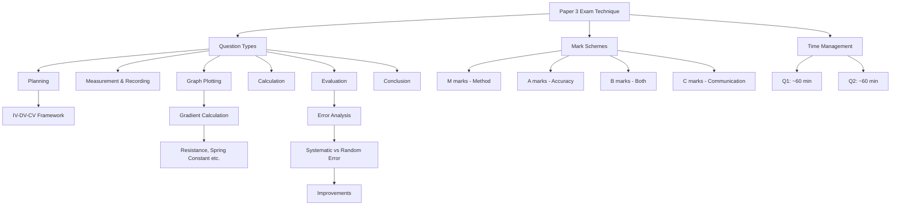

# Paper 3 (AS) Question Types and Mark Schemes
# Paper 3 (AS) 题型与评分方案

---

# 1. Overview / 概述

**English:**
This sub-topic focuses on the structure, question types, and mark schemes for **CAIE Paper 3 (AS)** and **Edexcel Unit 3 (AS)** practical examinations. Understanding the specific question formats — including planning, analysis, and evaluation — is essential for maximising marks. Each question type has a predictable mark scheme pattern, and knowing these patterns allows students to allocate time effectively and avoid common pitfalls. This leaf node connects to the broader [[Paper 3 and Paper 5 Exam Technique]] hub and complements [[Paper 5 (A2) Question Types and Mark Schemes]].

**中文:**
本子知识点聚焦于 **CAIE Paper 3 (AS)** 和 **Edexcel Unit 3 (AS)** 实验考试的题型结构与评分方案。理解具体的题目格式——包括实验设计、数据分析和评估——对于最大化得分至关重要。每种题型都有可预测的评分模式，掌握这些模式可以帮助学生有效分配时间并避免常见错误。本节点是 [[Paper 3 and Paper 5 Exam Technique]] 知识图谱的一部分，并与 [[Paper 5 (A2) Question Types and Mark Schemes]] 互补。

---

# 2. Syllabus Learning Objectives / 考纲学习目标

| CAIE 9702 (Paper 3) | Edexcel IAL (Unit 3) |
|---------------------|----------------------|
| Plan and carry out experiments safely and accurately | Plan and carry out experiments safely and accurately |
| Record observations and measurements systematically | Record observations and measurements systematically |
| Analyse data using graphs and calculations | Analyse data using graphs and calculations |
| Evaluate experimental methods and suggest improvements | Evaluate experimental methods and suggest improvements |
| Identify and reduce sources of uncertainty | Identify and reduce sources of uncertainty |

**Examiner Expectations / 考官期望:**
- **English:** Candidates must demonstrate competence in all four skill areas: planning, analysis, evaluation, and communication. Marks are awarded for correct procedures, accurate data handling, and logical reasoning.
- **中文:** 考生必须在四个技能领域展示能力：规划、分析、评估和沟通。分数授予正确的实验步骤、准确的数据处理和逻辑推理。

---

# 3. Core Definitions / 核心定义

| Term (EN/CN) | Definition (EN) | Definition (CN) | Common Mistakes / 常见错误 |
|--------------|-----------------|-----------------|---------------------------|
| **Independent Variable** / 自变量 | The variable deliberately changed by the experimenter | 实验者有意改变的变量 | Confusing with dependent variable |
| **Dependent Variable** / 因变量 | The variable measured in response to changes in the independent variable | 因自变量变化而测量的变量 | Confusing with independent variable |
| **Control Variable** / 控制变量 | A variable kept constant to ensure a fair test | 保持恒定以确保公平测试的变量 | Not identifying all relevant controls |
| **Uncertainty** / 不确定度 | The range within which the true value is expected to lie | 真实值预期所在的区间 | Using ± half smallest division incorrectly |
| **Systematic Error** / 系统误差 | An error that consistently shifts measurements in one direction | 使测量值一致偏向一个方向的误差 | Confusing with random error |
| **Random Error** / 随机误差 | Unpredictable fluctuations in measurements | 测量中不可预测的波动 | Confusing with systematic error |

---

# 4. Key Concepts Explained / 关键概念详解

## 4.1 Paper 3 Structure / Paper 3 结构

### Explanation / 解释
**English:**
CAIE Paper 3 (AS) is a **2-hour** practical exam worth **40 marks** (23% of total AS). It typically contains **two questions**:
- **Question 1:** A quantitative experiment requiring measurements, graph plotting, and calculation of a physical quantity (e.g., resistance, Young modulus, acceleration).
- **Question 2:** A qualitative or semi-quantitative investigation involving planning, observation, and evaluation (e.g., investigating how a variable affects a physical property).

Edexcel Unit 3 (AS) is a **1 hour 20 minute** practical exam worth **50 marks** (20% of total AS). It contains **one or two questions** with similar skill requirements.

**中文:**
CAIE Paper 3 (AS) 是 **2小时** 的实验考试，满分 **40分**（占AS总分的23%）。通常包含 **两道题**：
- **第1题：** 定量实验，需要测量、绘制图表并计算物理量（如电阻、杨氏模量、加速度）。
- **第2题：** 定性或半定量调查，涉及规划、观察和评估（如研究变量如何影响物理性质）。

Edexcel Unit 3 (AS) 是 **1小时20分钟** 的实验考试，满分 **50分**（占AS总分的20%）。包含 **一道或两道题**，技能要求类似。

### Physical Meaning / 物理意义
**English:** The structure ensures that candidates demonstrate both **practical competence** (setting up, measuring, recording) and **analytical ability** (graphing, calculating, evaluating).
**中文:** 这种结构确保考生同时展示 **实践能力**（搭建、测量、记录）和 **分析能力**（绘图、计算、评估）。

### Common Misconceptions / 常见误区
- **English:** Thinking that only the final answer matters — marks are awarded for method, data, and reasoning.
- **中文:** 认为只有最终答案重要——分数是根据方法、数据和推理授予的。
- **English:** Believing that qualitative questions require less precision — they still need clear observations and logical conclusions.
- **中文:** 认为定性问题不需要精确性——它们仍然需要清晰的观察和逻辑结论。

### Exam Tips / 考试提示
- **English:** Read both questions fully before starting. Allocate time: ~60 min for Q1, ~60 min for Q2.
- **中文:** 开始前完整阅读两道题。时间分配：第1题约60分钟，第2题约60分钟。
- **English:** For Edexcel, manage time carefully — 1h20m for one or two questions.
- **中文:** 对于Edexcel，仔细管理时间——1小时20分钟完成一道或两道题。

> 📷 **IMAGE PROMPT — P3-01: Paper 3 Structure Diagram**
> A flowchart showing the two-question structure of CAIE Paper 3. Left branch: Question 1 (quantitative) with sub-steps: set-up, measurements, table, graph, calculation. Right branch: Question 2 (qualitative/semi-quantitative) with sub-steps: planning, observations, evaluation, improvements. Use clean, educational style with colour coding.

---

## 4.2 Mark Scheme Patterns / 评分方案模式

### Explanation / 解释
**English:**
CAIE Paper 3 mark schemes follow a **points-based** system. Each question is broken into **sub-questions** with specific mark allocations. Common mark categories include:
- **M marks:** Method marks — for correct experimental procedures and calculations.
- **A marks:** Accuracy marks — for precise measurements and correct final answers.
- **B marks:** Both method and accuracy — for steps requiring both.
- **C marks:** Communication marks — for clear presentation (tables, graphs, conclusions).

Edexcel uses a similar **points-based** system but often includes **level of response** (LoR) marks for evaluation questions.

**中文:**
CAIE Paper 3 评分方案采用 **基于分数点** 的系统。每道题分为 **子题**，有特定的分数分配。常见分数类别包括：
- **M分：** 方法分——用于正确的实验步骤和计算。
- **A分：** 准确度分——用于精确测量和正确的最终答案。
- **B分：** 方法和准确度——用于需要两者的步骤。
- **C分：** 沟通分——用于清晰的呈现（表格、图表、结论）。

Edexcel 使用类似的 **基于分数点** 系统，但评估题常包含 **响应层级** (LoR) 分数。

### Physical Meaning / 物理意义
**English:** Understanding mark scheme patterns helps students focus effort on high-yield areas (e.g., graph plotting, uncertainty calculations) and avoid wasting time on low-yield details.
**中文:** 理解评分方案模式有助于学生将精力集中在高回报领域（如绘图、不确定度计算），避免在低回报细节上浪费时间。

### Common Misconceptions / 常见误区
- **English:** Thinking that writing more always earns more marks — concise, relevant answers are better.
- **中文:** 认为写得越多得分越多——简洁、相关的答案更好。
- **English:** Believing that a wrong final answer means zero marks — method marks can still be earned.
- **中文:** 认为最终答案错误就得零分——方法分仍然可以获得。

### Exam Tips / 考试提示
- **English:** Look at the mark allocation for each sub-question — it tells you how many points to include.
- **中文:** 查看每个子题的分数分配——它告诉你需要包含多少个要点。
- **English:** For "suggest" or "explain" questions (2-3 marks), write 2-3 distinct points.
- **中文:** 对于"建议"或"解释"题（2-3分），写2-3个不同的要点。

---

## 4.3 Common Question Types / 常见题型

### Explanation / 解释
**English:**
The main question types in Paper 3 are:
1. **Planning Questions:** Design an experiment to investigate a relationship. (4-6 marks)
2. **Measurement and Recording:** Take readings, record in a table with units and uncertainties. (6-8 marks)
3. **Graph Plotting:** Plot data points, draw line of best fit, determine gradient. (6-8 marks)
4. **Calculation:** Use gradient or formula to find a physical quantity. (4-6 marks)
5. **Evaluation:** Identify sources of error, suggest improvements. (4-6 marks)
6. **Conclusion:** State the relationship or value found. (2-3 marks)

**中文:**
Paper 3 的主要题型包括：
1. **规划题：** 设计实验研究关系。（4-6分）
2. **测量与记录：** 读取数据，在表格中记录，包含单位和不确定度。（6-8分）
3. **绘图题：** 绘制数据点，画最佳拟合线，确定斜率。（6-8分）
4. **计算题：** 使用斜率或公式求物理量。（4-6分）
5. **评估题：** 识别误差来源，提出改进建议。（4-6分）
6. **结论题：** 陈述发现的关系或数值。（2-3分）

### Physical Meaning / 物理意义
**English:** Each question type tests a specific skill. Planning tests experimental design; measurement tests precision; graph plotting tests data handling; calculation tests mathematical application; evaluation tests critical thinking.
**中文:** 每种题型测试特定技能。规划测试实验设计；测量测试精确性；绘图测试数据处理；计算测试数学应用；评估测试批判性思维。

### Common Misconceptions / 常见误区
- **English:** Thinking that graph plotting is just drawing points — you must include error bars, line of best fit, and correct scales.
- **中文:** 认为绘图只是画点——必须包含误差棒、最佳拟合线和正确的刻度。
- **English:** Believing that evaluation only needs one improvement — list multiple distinct improvements.
- **中文:** 认为评估只需要一个改进——列出多个不同的改进。

### Exam Tips / 考试提示
- **English:** For planning questions, use the **IV-DV-CV** framework: Independent Variable, Dependent Variable, Control Variables.
- **中文:** 对于规划题，使用 **IV-DV-CV** 框架：自变量、因变量、控制变量。
- **English:** For graph questions, always use a sharp pencil and ruler.
- **中文:** 对于绘图题，始终使用削尖的铅笔和直尺。

> 📷 **IMAGE PROMPT — P3-02: Question Types Flowchart**
> A flowchart showing six question types in Paper 3: Planning → Measurement → Graph → Calculation → Evaluation → Conclusion. Each box has a brief description and typical mark range. Use clean, educational style with arrows showing the logical flow.

---

# 5. Essential Equations / 核心公式

## 5.1 Gradient Calculation / 斜率计算

$$ m = \frac{\Delta y}{\Delta x} = \frac{y_2 - y_1}{x_2 - x_1} $$

| Symbol (符号) | Meaning (EN) | Meaning (CN) | Unit (单位) |
|--------------|-------------|-------------|------------|
| $m$ | Gradient of line of best fit | 最佳拟合线的斜率 | Depends on axes |
| $\Delta y$ | Change in y-coordinate | y坐标的变化量 | Depends on y-axis |
| $\Delta x$ | Change in x-coordinate | x坐标的变化量 | Depends on x-axis |

**Derivation / 推导:** From the definition of slope as rise over run.
**Conditions / 适用条件:** Only for linear relationships or linearised data.
**Limitations / 局限性:** Does not account for uncertainties in individual points.

## 5.2 Percentage Uncertainty / 百分比不确定度

$$ \text{Percentage Uncertainty} = \frac{\text{Absolute Uncertainty}}{\text{Measured Value}} \times 100\% $$

| Symbol (符号) | Meaning (EN) | Meaning (CN) | Unit (单位) |
|--------------|-------------|-------------|------------|
| Absolute Uncertainty | ± half smallest division or given value | ±最小刻度的一半或给定值 | Same as measured value |
| Measured Value | The reading taken | 读取的数值 | Depends on measurement |

**Derivation / 推导:** From definition of relative error.
**Conditions / 适用条件:** For single measurements or repeated measurements.
**Limitations / 局限性:** Does not account for systematic errors.

## 5.3 Line of Best Fit Criteria / 最佳拟合线标准

$$ \text{Points above line} \approx \text{Points below line} $$

**Conditions / 适用条件:** For data with random scatter.
**Limitations / 局限性:** Outliers should be identified and possibly excluded.

> 📷 **IMAGE PROMPT — P3-03: Gradient Calculation Diagram**
> A graph showing data points with error bars, a line of best fit, and two points (x1,y1) and (x2,y2) marked on the line. A triangle shows Δy and Δx. Clean educational style with labels.

---

# 6. Graphs and Relationships / 图表与关系

## 6.1 Graph Plotting Checklist / 绘图检查清单

### Axes / 坐标轴 (EN+CN)
- **English:** Label axes with quantity and unit (e.g., "Current / A"). Use a sensible scale (1, 2, 5 or multiples).
- **中文:** 标注坐标轴，包含物理量和单位（如"电流 / A"）。使用合理的刻度（1, 2, 5 或其倍数）。

### Shape / 形状 (EN+CN)
- **English:** Plot points as small crosses (×) or dots with circles (⊙). Draw a line of best fit — straight line if linear, smooth curve if non-linear.
- **中文:** 用小的十字叉 (×) 或带圆圈的圆点 (⊙) 绘制数据点。画最佳拟合线——线性关系画直线，非线性关系画平滑曲线。

### Gradient Meaning / 斜率含义 (EN+CN)
- **English:** The gradient often represents a physical constant (e.g., resistance from V-I graph, spring constant from F-x graph).
- **中文:** 斜率通常代表一个物理常数（如V-I图的电阻，F-x图的弹簧常数）。

### Area Meaning / 面积含义 (EN+CN)
- **English:** Area under a graph often represents a physical quantity (e.g., area under F-x graph = work done, area under V-t graph = displacement).
- **中文:** 图线下的面积通常代表一个物理量（如F-x图下的面积=做功，V-t图下的面积=位移）。

### Exam Interpretation / 考试解读 (EN+CN)
- **English:** Always check if the graph should pass through the origin. If theory predicts a proportional relationship, the line should go through (0,0).
- **中文:** 始终检查图线是否应通过原点。如果理论预测是正比关系，图线应通过 (0,0) 点。

> 📷 **IMAGE PROMPT — P3-04: Graph Plotting Example**
> A graph with labelled axes (e.g., "Voltage / V" on y-axis, "Current / A" on x-axis). Six data points plotted as crosses, a straight line of best fit through them, with one outlier clearly marked. Error bars shown on each point. Clean educational style.

---

# 7. Required Diagrams / 必备图表

## 7.1 Experimental Set-Up Diagram / 实验装置图

### Description / 描述 (EN+CN)
- **English:** A clear, labelled diagram of the experimental apparatus used in the practical. This is often required in planning questions.
- **中文:** 实验中使用的实验装置的清晰、标注图。规划题中常要求绘制。

### Image Prompt / 图片生成提示
> 📷 **IMAGE PROMPT — P3-05: Experimental Set-Up Example**
> A simple line diagram showing a spring hanging from a clamp stand, with masses attached to the bottom. A ruler is placed vertically next to the spring to measure extension. Labels: "clamp stand", "spring", "mass hanger", "ruler", "pointer". Clean educational style, no shading.

### Labels Required / 需要标注 (EN+CN)
- **English:** All equipment must be labelled: power supply, wires, components, measuring instruments.
- **中文:** 所有设备必须标注：电源、导线、元件、测量仪器。

### Exam Importance / 考试重要性 (EN+CN)
- **English:** A clear diagram can earn 2-3 marks in planning questions. It shows the examiner you understand the set-up.
- **中文:** 清晰的图可以在规划题中获得2-3分。它向考官展示你理解实验装置。

## 7.2 Table of Results / 结果表格

### Description / 描述 (EN+CN)
- **English:** A pre-drawn table with correct column headings, units, and space for repeated readings.
- **中文:** 预先画好的表格，包含正确的列标题、单位和重复读数的空间。

### Image Prompt / 图片生成提示
> 📷 **IMAGE PROMPT — P3-06: Results Table Example**
> A table with columns: "Mass / g", "Extension 1 / mm", "Extension 2 / mm", "Average Extension / mm", "Force / N". Three rows of data filled in. Clean educational style.

### Labels Required / 需要标注 (EN+CN)
- **English:** Each column must have a heading with quantity and unit (e.g., "Current / A"). Include a column for average if repeated readings are taken.
- **中文:** 每列必须有包含物理量和单位的标题（如"电流 / A"）。如果进行重复读数，需包含平均值列。

### Exam Importance / 考试重要性 (EN+CN)
- **English:** A well-structured table can earn 2-3 marks. It shows systematic data recording.
- **中文:** 结构良好的表格可以获得2-3分。它展示系统化的数据记录。

---

# 8. Worked Examples / 典型例题

## Example 1: Graph Plotting and Gradient Calculation / 绘图与斜率计算

### Question / 题目
**English:**
A student investigates the relationship between voltage $V$ and current $I$ for a resistor. The data is:

| $V$ / V | $I$ / A |
|---------|---------|
| 0.0     | 0.00    |
| 1.0     | 0.20    |
| 2.0     | 0.41    |
| 3.0     | 0.59    |
| 4.0     | 0.80    |
| 5.0     | 1.01    |

Plot a graph of $V$ (y-axis) against $I$ (x-axis). Draw a line of best fit and calculate its gradient. Hence determine the resistance $R$.

**中文:**
学生研究电阻两端电压 $V$ 与电流 $I$ 的关系。数据如下：

| $V$ / V | $I$ / A |
|---------|---------|
| 0.0     | 0.00    |
| 1.0     | 0.20    |
| 2.0     | 0.41    |
| 3.0     | 0.59    |
| 4.0     | 0.80    |
| 5.0     | 1.01    |

绘制 $V$（y轴）对 $I$（x轴）的图。画最佳拟合线并计算斜率。由此确定电阻 $R$。

### Solution / 解答
**Step 1: Plot the graph**
- x-axis: $I$ / A, scale 0 to 1.2 A (1 cm = 0.1 A)
- y-axis: $V$ / V, scale 0 to 6.0 V (1 cm = 0.5 V)
- Plot points as small crosses (×)
- Draw a straight line of best fit through the points

**Step 2: Calculate gradient**
Choose two points on the line (not data points):
- Point 1: $(I_1, V_1) = (0.20, 1.0)$
- Point 2: $(I_2, V_2) = (1.00, 5.0)$

$$ m = \frac{V_2 - V_1}{I_2 - I_1} = \frac{5.0 - 1.0}{1.00 - 0.20} = \frac{4.0}{0.80} = 5.0 \, \text{V A}^{-1} $$

**Step 3: Determine resistance**
From Ohm's law: $V = IR$, so gradient $m = R$.
$$ R = 5.0 \, \Omega $$

### Final Answer / 最终答案
**Answer:** $R = 5.0 \, \Omega$ | **答案：** $R = 5.0 \, \Omega$

### Quick Tip / 提示
- **English:** Always use points on the line of best fit, not data points, for gradient calculation.
- **中文:** 始终使用最佳拟合线上的点，而不是数据点，来计算斜率。

---

## Example 2: Evaluation and Improvements / 评估与改进

### Question / 题目
**English:**
A student measures the period $T$ of a pendulum for different lengths $L$. The results show scatter. Suggest **two** sources of error and **two** improvements.

**中文:**
学生测量不同长度 $L$ 下单摆的周期 $T$。结果有分散。建议 **两个** 误差来源和 **两个** 改进方法。

### Solution / 解答
**Source of Error 1:** Reaction time when starting/stopping the stopwatch.
**Improvement 1:** Measure the time for 10 oscillations and divide by 10 to reduce percentage uncertainty.

**Source of Error 2:** Difficulty in measuring the exact length from pivot to centre of mass.
**Improvement 2:** Use a metre ruler with a set square to ensure vertical alignment; measure from the point of suspension to the centre of the bob.

### Final Answer / 最终答案
**Answer:** See above | **答案：** 见上

### Quick Tip / 提示
- **English:** For evaluation questions, link each improvement directly to a specific error.
- **中文:** 对于评估题，将每个改进直接与特定误差关联。

---

# 9. Past Paper Question Types / 历年真题题型

| Question Type / 题型 | Frequency / 频率 | Difficulty / 难度 | Past Paper References / 真题索引 |
|----------------------|------------------|------------------|-------------------------------|
| Graph plotting + gradient calculation | Very High | Medium | 📝 *待填入* |
| Planning an experiment | High | Medium-Hard | 📝 *待填入* |
| Evaluation and improvements | High | Medium | 📝 *待填入* |
| Table of results with uncertainties | Medium | Easy-Medium | 📝 *待填入* |
| Conclusion from graph | Medium | Easy | 📝 *待填入* |
| Error analysis (systematic vs random) | Low-Medium | Medium | 📝 *待填入* |

**Common Command Words / 常见指令词:**
- **English:** Plot, Draw, Calculate, Determine, Suggest, Explain, Evaluate, Improve, State
- **中文:** 绘制、画、计算、确定、建议、解释、评估、改进、陈述

---

# 10. Practical Skills Connections / 实验技能链接

**English:**
This sub-topic directly connects to practical skills tested in [[Planning and Designing Experiments]] and [[Evaluation and Improvements]]. Key connections include:
- **Measurements:** Using rulers, stopwatches, ammeters, voltmeters correctly.
- **Uncertainties:** Recording ± half smallest division, calculating percentage uncertainty.
- **Graph Plotting:** Choosing scales, plotting points, drawing lines of best fit.
- **Experimental Design:** Identifying IV, DV, CV; writing a step-by-step method.

For more on uncertainty analysis, see [[Uncertainty Analysis in Practical Work]].

**中文:**
本子知识点直接连接到 [[Planning and Designing Experiments]] 和 [[Evaluation and Improvements]] 中测试的实验技能。关键联系包括：
- **测量：** 正确使用直尺、秒表、电流表、电压表。
- **不确定度：** 记录 ± 最小刻度的一半，计算百分比不确定度。
- **绘图：** 选择刻度、绘制数据点、画最佳拟合线。
- **实验设计：** 识别自变量、因变量、控制变量；写出分步方法。

更多关于不确定度分析的内容，请参见 [[Uncertainty Analysis in Practical Work]]。

---

# 11. Concept Map / 概念图谱

---

# 12. Quick Revision Sheet / 速查表

| Category / 类别 | Key Points / 要点 |
|----------------|------------------|
| **Definition / 定义** | Paper 3 (AS) = 2-hour practical exam, 40 marks (CAIE) / 1h20m, 50 marks (Edexcel) |
| **Key Formula / 核心公式** | Gradient $m = \frac{\Delta y}{\Delta x}$; Percentage Uncertainty $= \frac{\text{Absolute Uncertainty}}{\text{Measured Value}} \times 100\%$ |
| **Key Graph / 核心图表** | V-I graph → gradient = resistance; F-x graph → gradient = spring constant |
| **Exam Tip / 考试提示** | Always use points on line of best fit for gradient; link improvements to specific errors; label axes with quantity and unit |
| **Common Mistake / 常见错误** | Using data points instead of line points for gradient; not including units in table headings; writing vague improvements |
| **Command Words / 指令词** | Plot, Draw, Calculate, Determine, Suggest, Explain, Evaluate, Improve, State |

---

**Related Notes / 相关笔记:**
- [[Paper 5 (A2) Question Types and Mark Schemes]]
- [[Common Practical Experiments to Know]]
- [[Time Management in Practical Exams]]
- [[Key Command Words in Practical Papers]]
- [[Planning and Designing Experiments]]
- [[Evaluation and Improvements]]
- [[Uncertainty Analysis in Practical Work]]