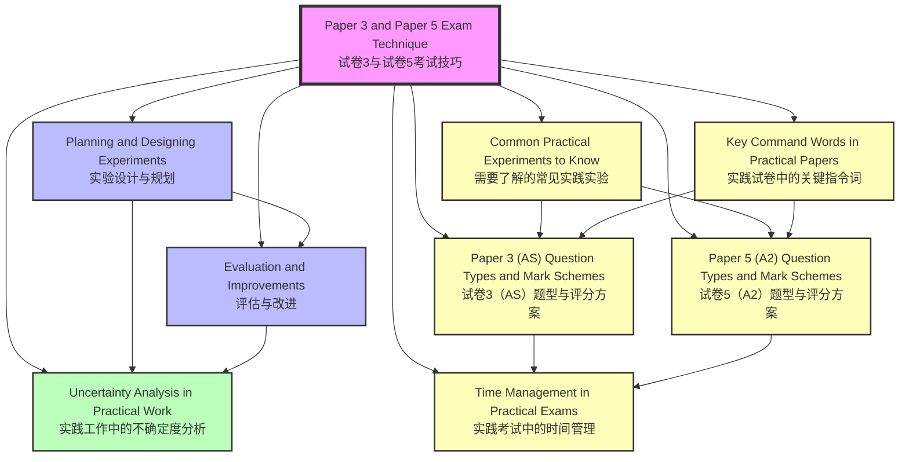

# Paper 3 and Paper 5 Exam Technique / 试卷3与试卷5考试技巧

---

# 1. Overview / 概述

**English:**
This topic provides a comprehensive guide to mastering the exam technique required for the Cambridge International AS & A Level Physics (9702) practical examinations: Paper 3 (AS Level) and Paper 5 (A2 Level). It also covers the equivalent Edexcel IAL practical assessments in Units 3 and 6. Unlike theory papers, practical exams test your ability to design, execute, analyse, and evaluate experiments under timed conditions. Success depends not only on understanding physics principles but also on precise measurement, accurate data recording, correct graph plotting, proper uncertainty analysis, and clear communication of results. This guide covers question types, mark schemes, time management, common experiments, and key command words. It is the central hub linking all practical exam technique sub-topics, including [[Planning and Designing Experiments]], [[Evaluation and Improvements]], and [[Uncertainty Analysis in Practical Work]].

**中文：**
本主题全面指导如何掌握剑桥国际AS与A-Level物理（9702）实践考试所需的考试技巧：试卷3（AS Level）和试卷5（A2 Level）。同时涵盖爱德思IAL Units 3和6中相应的实践评估。与理论试卷不同，实践考试测试你在限时条件下设计、执行、分析和评估实验的能力。成功不仅取决于理解物理原理，还取决于精确测量、准确记录数据、正确绘制图表、恰当的不确定度分析以及清晰传达结果。本指南涵盖题型、评分方案、时间管理、常见实验和关键指令词。它是连接所有实践考试技巧子主题的中心枢纽，包括[[实验设计与规划]]、[[评估与改进]]和[[实践工作中的不确定度分析]]。

---

# 2. Syllabus Learning Objectives / 考纲学习目标

| CAIE 9702 | Edexcel IAL |
|-----------|-------------|
| **Paper 3 (AS):** 1 hour, 40 marks. Assesses practical skills including: following instructions, measuring, recording data, presenting data in tables and graphs, analysing results, drawing conclusions, and evaluating procedures. | **Unit 3 (AS):** 1 hour 20 minutes, 50 marks. Assesses practical skills including: planning, implementing, analysing, and evaluating experiments. Includes multiple-choice and short-answer questions based on practical scenarios. |
| **Paper 5 (A2):** 1 hour 15 minutes, 30 marks. Two questions: Q1 (planning) and Q2 (analysis, conclusions, evaluation). Assesses higher-order skills: experimental design, data analysis, error analysis, and suggesting improvements. | **Unit 6 (A2):** 1 hour 20 minutes, 50 marks. Assesses practical skills including: planning, implementing, analysing, and evaluating experiments. Includes longer structured questions requiring detailed experimental design and data analysis. |
| **Examiner Expectations:** Candidates must demonstrate competence in: (1) selecting and using appropriate apparatus, (2) making accurate measurements with correct precision, (3) recording data in well-structured tables with units, (4) plotting graphs with appropriate scales and best-fit lines, (5) calculating gradients and intercepts, (6) determining uncertainties, (7) drawing valid conclusions, and (8) evaluating procedures and suggesting improvements. | **Examiner Expectations:** Candidates must demonstrate: (1) ability to plan a valid experimental procedure, (2) correct use of measuring instruments, (3) accurate data recording and presentation, (4) graph plotting and analysis, (5) error analysis and uncertainty calculations, (6) drawing conclusions consistent with evidence, and (7) critical evaluation of methods. |

> 📋 **CIE Only:** Paper 3 is a hands-on practical exam where candidates perform experiments in a laboratory. Paper 5 is a written paper testing planning and analysis skills without actual apparatus. Both papers are compulsory for the full A-Level.
>
> 📋 **Edexcel Only:** Units 3 and 6 are written papers based on practical scenarios. Candidates do not perform actual experiments but answer questions about experimental design, data analysis, and evaluation. Both units are compulsory for the full IAL.

---

# 3. Core Definitions / 核心定义

| Term (EN/CN) | Definition (EN) | Definition (CN) | Common Mistakes / 常见错误 |
|--------------|-----------------|-----------------|---------------------------|
| **Independent Variable / 自变量** | The variable that is deliberately changed or selected by the experimenter. | 由实验者有意改变或选择的变量。 | Confusing with dependent variable. Remember: you control the independent variable. |
| **Dependent Variable / 因变量** | The variable that is measured; its value depends on the independent variable. | 被测量的变量；其值取决于自变量。 | Confusing with independent variable. Remember: you measure the dependent variable. |
| **Control Variable / 控制变量** | Variables that are kept constant to ensure a fair test. | 保持恒定以确保公平测试的变量。 | Forgetting to state control variables in planning questions. |
| **Uncertainty / 不确定度** | The range within which the true value of a measurement is expected to lie. | 测量真值预期所在的区间。 | Confusing uncertainty with error. Uncertainty is a range; error is the difference from true value. |
| **Absolute Uncertainty / 绝对不确定度** | The actual size of the uncertainty, with the same unit as the measurement. | 不确定度的实际大小，与测量值单位相同。 | Forgetting to include units. |
| **Percentage Uncertainty / 百分比不确定度** | (Absolute Uncertainty / Measured Value) × 100%. | (绝对不确定度 / 测量值) × 100%。 | Using wrong formula or forgetting to multiply by 100. |
| **Precision / 精密度** | How close repeated measurements are to each other. | 重复测量值之间的接近程度。 | Confusing with accuracy. Precision is about consistency, not correctness. |
| **Accuracy / 准确度** | How close a measurement is to the true value. | 测量值与真值的接近程度。 | Confusing with precision. Accuracy is about correctness, not consistency. |
| **Resolution / 分辨力** | The smallest change in a quantity that can be detected by an instrument. | 仪器能检测到的最小量变化。 | Confusing with uncertainty. Resolution is a property of the instrument; uncertainty includes other factors. |
| **Systematic Error / 系统误差** | An error that consistently shifts measurements in one direction. | 使测量值一致偏向一个方向的误差。 | Thinking systematic errors can be reduced by repeating measurements. They cannot; they require calibration. |
| **Random Error / 随机误差** | An error that causes unpredictable variation in measurements. | 导致测量值不可预测变化的误差。 | Thinking random errors can be eliminated. They can only be reduced by averaging. |
| **Best-Fit Line / 最佳拟合线** | A straight line or smooth curve drawn through data points to show the trend, balancing points above and below. | 穿过数据点以显示趋势的直线或平滑曲线，平衡上下方的点。 | Drawing a line that passes through all points (overfitting) or ignoring outliers. |
| **Gradient / 斜率** | The slope of a graph, calculated as Δy/Δx. | 图表的斜率，计算为 Δy/Δx。 | Using data points instead of points on the best-fit line. |
| **y-Intercept / y轴截距** | The value of y when x = 0. | 当 x = 0 时 y 的值。 | Reading from the graph incorrectly when the scale does not start at zero. |
| **Outlier / 异常值** | A data point that does not fit the general trend. | 不符合总体趋势的数据点。 | Ignoring outliers without justification. They should be identified and possibly excluded with reason. |
| **Reliability / 可靠性** | The consistency of results when an experiment is repeated. | 重复实验时结果的一致性。 | Confusing with validity. Reliability is about repeatability; validity is about measuring what you intend to measure. |
| **Validity / 有效性** | Whether an experiment actually measures what it claims to measure. | 实验是否真正测量了其声称要测量的内容。 | Confusing with reliability. An experiment can be reliable but not valid. |

---

# 4. Key Concepts Explained / 关键概念详解

## 4.1 Understanding the Exam Structure / 理解考试结构

### Explanation / 解释
**English:** The CAIE 9702 practical exams have two distinct formats. **Paper 3 (AS)** is a 1-hour hands-on practical where you perform an experiment, record data, plot a graph, and draw conclusions. You are given a set of instructions and must follow them precisely. **Paper 5 (A2)** is a 1-hour 15-minute written paper with two questions: Question 1 tests your ability to plan an experiment (design, apparatus, procedure, safety, variables), and Question 2 tests your ability to analyse given data (plot graph, calculate gradient, determine uncertainties, evaluate method, suggest improvements). For Edexcel IAL, Units 3 and 6 are both written papers based on practical scenarios, with Unit 6 being more advanced. Understanding the structure helps you allocate time effectively and know what skills to demonstrate. This topic links to [[Paper 3 (AS) Question Types and Mark Schemes]] and [[Paper 5 (A2) Question Types and Mark Schemes]].

**中文：** CAIE 9702实践考试有两种不同的形式。**试卷3（AS）** 是1小时动手实践考试，你需要进行实验、记录数据、绘制图表并得出结论。你会得到一套指令，必须精确遵循。**试卷5（A2）** 是1小时15分钟的笔试，包含两个问题：问题1测试你规划实验的能力（设计、装置、步骤、安全、变量），问题2测试你分析给定数据的能力（绘制图表、计算斜率、确定不确定度、评估方法、提出改进建议）。对于爱德思IAL，Units 3和6都是基于实践场景的笔试，Unit 6更高级。理解结构有助于你有效分配时间，并知道需要展示哪些技能。本主题链接到[[试卷3（AS）题型与评分方案]]和[[试卷5（A2）题型与评分方案]]。

### Physical Meaning / 物理意义
**English:** In real-world physics, experiments are the foundation of knowledge. The exam structure mirrors real scientific practice: you design an experiment (Paper 5 Q1), perform it (Paper 3), analyse data (Paper 5 Q2), and evaluate your methods (both papers). Mastering these skills prepares you for university-level research and professional scientific work.

**中文：** 在现实物理中，实验是知识的基础。考试结构反映了真实的科学实践：你设计实验（试卷5问题1），进行实验（试卷3），分析数据（试卷5问题2），并评估你的方法（两份试卷）。掌握这些技能为你大学水平的研究和专业科学工作做好准备。

### Common Misconceptions / 常见误区
- **English:** Thinking Paper 3 is easier than Paper 5. Both require different skills; Paper 3 tests manual dexterity and following instructions, while Paper 5 tests higher-order thinking.
- **中文：** 认为试卷3比试卷5容易。两者需要不同的技能；试卷3测试动手能力和遵循指令，而试卷5测试高阶思维。
- **English:** Believing you can memorise answers for practical exams. Each exam presents a unique experiment; you must apply skills flexibly.
- **中文：** 相信可以死记硬背实践考试的答案。每次考试都呈现独特的实验；你必须灵活运用技能。

### Exam Tips / 考试提示
**English:** For Paper 3, practice with past papers under timed conditions. For Paper 5, focus on planning questions (Q1) as they are often less practised. Always read the entire question paper before starting. Link to [[Time Management in Practical Exams]].
**中文：** 对于试卷3，在限时条件下练习往年试卷。对于试卷5，重点关注规划问题（问题1），因为它们通常练习较少。始终在开始前阅读整份试卷。链接到[[实践考试中的时间管理]]。

---

## 4.2 Data Recording and Tables / 数据记录与表格

### Explanation / 解释
**English:** Data must be recorded in a well-structured table. The table should have: (1) a clear heading for each column with the quantity name and unit (e.g., "Length / cm"), (2) the independent variable in the first column, (3) the dependent variable in subsequent columns, (4) repeated readings if required, (5) calculated quantities (e.g., mean, 1/T, T²) in additional columns, and (6) all raw data recorded to the correct precision (same number of decimal places as the instrument resolution). For Paper 3, you create the table yourself; for Paper 5, a table is often provided. Always include units in column headings, not in the data cells. This links to [[Common Practical Experiments to Know]].

**中文：** 数据必须记录在结构良好的表格中。表格应有：(1) 每列清晰的标题，包含量名称和单位（例如"长度 / cm"），(2) 自变量在第一列，(3) 因变量在后续列，(4) 如有需要则记录重复读数，(5) 计算量（如平均值、1/T、T²）在额外列中，(6) 所有原始数据记录到正确的精度（与仪器分辨力相同的小数位数）。对于试卷3，你自己创建表格；对于试卷5，通常会提供表格。始终在列标题中包含单位，而不是在数据单元格中。这链接到[[需要了解的常见实践实验]]。

### Physical Meaning / 物理意义
**English:** A well-organised table allows anyone to understand your experiment and reproduce your results. In scientific research, data tables are the primary way to present raw data before analysis.

**中文：** 组织良好的表格使任何人都能理解你的实验并重现你的结果。在科学研究中，数据表格是分析前呈现原始数据的主要方式。

### Common Misconceptions / 常见误区
- **English:** Writing units in every cell of the table. Units should only be in the column heading.
- **中文：** 在表格的每个单元格中写单位。单位应仅在列标题中。
- **English:** Recording data with too many or too few decimal places. Use the same precision as the measuring instrument.
- **中文：** 记录数据时小数位数过多或过少。使用与测量仪器相同的精度。

### Exam Tips / 考试提示
**English:** For Paper 3, draw your table before starting measurements. Leave enough rows for all readings. Use a ruler for straight lines. For Paper 5, if a table is provided, check it carefully before using it. Link to [[Paper 3 (AS) Question Types and Mark Schemes]].
**中文：** 对于试卷3，在开始测量前绘制表格。留出足够的行用于所有读数。使用直尺画直线。对于试卷5，如果提供了表格，在使用前仔细检查。链接到[[试卷3（AS）题型与评分方案]]。

---

## 4.3 Graph Plotting and Analysis / 图表绘制与分析

### Explanation / 解释
**English:** Graphs are essential for visualising relationships and calculating quantities. Key rules: (1) Choose scales so the graph occupies at least half the grid (ideally more). (2) Label axes with quantity and unit (e.g., "T² / s²"). (3) Plot points accurately with small crosses (×) or dots with circles. (4) Draw a best-fit line (straight line or smooth curve) that balances points above and below. (5) Calculate gradient using two points on the best-fit line (not data points), spaced far apart. (6) Determine y-intercept by extending the line to x=0 or using the equation. (7) Include error bars if required (Paper 5 Q2). This links to [[Uncertainty Analysis in Practical Work]].

**中文：** 图表对于可视化关系和计算量至关重要。关键规则：(1) 选择刻度使图表至少占据网格的一半（最好更多）。(2) 用量和单位标注坐标轴（例如"T² / s²"）。(3) 用小叉号（×）或带圆圈的圆点精确绘制点。(4) 绘制最佳拟合线（直线或平滑曲线），平衡上下方的点。(5) 使用最佳拟合线上的两个点（不是数据点）计算斜率，两点应相距较远。(6) 通过将线延伸到x=0或使用方程确定y轴截距。(7) 如有需要，包含误差棒（试卷5问题2）。这链接到[[实践工作中的不确定度分析]]。

### Physical Meaning / 物理意义
**English:** Graphs reveal patterns that raw data cannot. The gradient often represents a physical quantity (e.g., gradient of a distance-time graph is speed). The y-intercept can represent a starting value or a systematic error.

**中文：** 图表揭示了原始数据无法显示的规律。斜率通常代表一个物理量（例如位移-时间图表的斜率是速度）。y轴截距可以代表起始值或系统误差。

### Common Misconceptions / 常见误区
- **English:** Plotting points as blobs or using a line that connects all points (dot-to-dot). Use a best-fit line instead.
- **中文：** 将点绘制成团块或使用连接所有点的线（点对点）。应使用最佳拟合线。
- **English:** Choosing scales that are too small (graph cramped) or too large (graph too small). Aim for at least 50% grid usage.
- **中文：** 选择过小的刻度（图表拥挤）或过大的刻度（图表太小）。目标是至少使用50%的网格。

### Exam Tips / 考试提示
**English:** For Paper 3, you may need to plot a graph from your own data. For Paper 5 Q2, data is given. Always check the gradient calculation: show your triangle on the graph and state the coordinates. Link to [[Paper 5 (A2) Question Types and Mark Schemes]].
**中文：** 对于试卷3，你可能需要根据自己数据绘制图表。对于试卷5问题2，数据是给定的。始终检查斜率计算：在图表上显示你的三角形并注明坐标。链接到[[试卷5（A2）题型与评分方案]]。

---

## 4.4 Uncertainty and Error Analysis / 不确定度与误差分析

### Explanation / 解释
**English:** Every measurement has uncertainty. You must: (1) State the absolute uncertainty of each measurement (e.g., ±0.1 cm for a ruler). (2) Calculate percentage uncertainty. (3) Propagate uncertainties through calculations (addition/subtraction: add absolute uncertainties; multiplication/division: add percentage uncertainties). (4) Draw error bars on graphs (Paper 5 Q2). (5) Determine the uncertainty in gradient and intercept using maximum/minimum slope lines. (6) Identify systematic and random errors. (7) Suggest improvements to reduce uncertainties. This is a key skill in [[Evaluation and Improvements]].

**中文：** 每次测量都有不确定度。你必须：(1) 陈述每次测量的绝对不确定度（例如尺子为±0.1 cm）。(2) 计算百分比不确定度。(3) 通过计算传播不确定度（加法/减法：加绝对不确定度；乘法/除法：加百分比不确定度）。(4) 在图表上绘制误差棒（试卷5问题2）。(5) 使用最大/最小斜率线确定斜率和截距的不确定度。(6) 识别系统误差和随机误差。(7) 提出减少不确定度的改进建议。这是[[评估与改进]]中的关键技能。

### Physical Meaning / 物理意义
**English:** Uncertainty tells us how confident we are in our results. A small uncertainty means high confidence; a large uncertainty means low confidence. In science, reporting uncertainty is as important as reporting the value itself.

**中文：** 不确定度告诉我们对自己结果的信心程度。小不确定度意味着高信心；大不确定度意味着低信心。在科学中，报告不确定度与报告数值本身同样重要。

### Common Misconceptions / 常见误区
- **English:** Thinking uncertainty is the same as error. Uncertainty is a range; error is the difference from true value.
- **中文：** 认为不确定度与误差相同。不确定度是一个区间；误差是与真值的差异。
- **English:** Forgetting to propagate uncertainties in calculations. Always check if the question requires it.
- **中文：** 忘记在计算中传播不确定度。始终检查问题是否要求这样做。

### Exam Tips / 考试提示
**English:** For Paper 5 Q2, drawing maximum and minimum slope lines is a common requirement. Use a dashed line for these. The uncertainty in gradient is half the difference between max and min gradients. Link to [[Uncertainty Analysis in Practical Work]].
**中文：** 对于试卷5问题2，绘制最大和最小斜率线是常见要求。对这些线使用虚线。斜率的不确定度是最大和最小斜率差的一半。链接到[[实践工作中的不确定度分析]]。

---

## 4.5 Evaluation and Improvements / 评估与改进

### Explanation / 解释
**English:** After analysing results, you must evaluate the experiment. This includes: (1) Identifying sources of error (systematic and random). (2) Discussing the reliability of results (e.g., by comparing repeated readings). (3) Suggesting specific improvements to reduce errors. (4) Proposing additional experiments to confirm findings. (5) Commenting on the validity of the conclusion. Common improvements include: using more precise instruments, repeating measurements, controlling variables better, using a larger range of values, and reducing parallax error. This is covered in detail in [[Evaluation and Improvements]].

**中文：** 分析结果后，你必须评估实验。这包括：(1) 识别误差来源（系统误差和随机误差）。(2) 讨论结果的可靠性（例如通过比较重复读数）。(3) 提出减少误差的具体改进建议。(4) 提出额外实验以确认发现。(5) 评论结论的有效性。常见的改进包括：使用更精密的仪器、重复测量、更好地控制变量、使用更大范围的值、减少视差误差。这在[[评估与改进]]中有详细说明。

### Physical Meaning / 物理意义
**English:** Evaluation is a critical part of the scientific method. No experiment is perfect; scientists must always assess the limitations of their work and suggest how to improve it.

**中文：** 评估是科学方法的关键部分。没有完美的实验；科学家必须始终评估其工作的局限性并提出改进方法。

### Common Misconceptions / 常见误区
- **English:** Giving vague improvements like "be more careful." Be specific: "Use a digital vernier calliper with resolution 0.01 mm instead of a ruler with resolution 1 mm."
- **中文：** 给出模糊的改进建议，如"更小心"。要具体："使用分辨力0.01 mm的数字游标卡尺代替分辨力1 mm的尺子。"
- **English:** Only mentioning random errors and ignoring systematic errors. Both must be addressed.
- **中文：** 只提到随机误差而忽略系统误差。两者都必须处理。

### Exam Tips / 考试提示
**English:** For Paper 5 Q2, the evaluation section often carries significant marks. Structure your answer: state the error, explain its effect, and suggest a specific improvement. Link to [[Paper 5 (A2) Question Types and Mark Schemes]].
**中文：** 对于试卷5问题2，评估部分通常占很大分数。组织你的答案：陈述误差，解释其影响，并提出具体的改进建议。链接到[[试卷5（A2）题型与评分方案]]。

---

## 4.6 Planning an Experiment (Paper 5 Q1) / 规划实验（试卷5问题1）

### Explanation / 解释
**English:** Planning an experiment requires: (1) Stating the aim clearly. (2) Identifying independent, dependent, and control variables. (3) Listing apparatus with specific details (e.g., "metre ruler with mm resolution"). (4) Describing the procedure step-by-step, including how to change the independent variable, measure the dependent variable, and control other variables. (5) Including a diagram of the setup. (6) Describing how to ensure safety. (7) Explaining how to analyse data (e.g., plot a graph, calculate gradient). (8) Discussing how to reduce uncertainties. This is covered in [[Planning and Designing Experiments]].

**中文：** 规划实验需要：(1) 清晰陈述目的。(2) 识别自变量、因变量和控制变量。(3) 列出具体细节的装置（例如"分辨力为mm的米尺"）。(4) 逐步描述步骤，包括如何改变自变量、测量因变量以及控制其他变量。(5) 包含装置图。(6) 描述如何确保安全。(7) 解释如何分析数据（例如绘制图表、计算斜率）。(8) 讨论如何减少不确定度。这在[[实验设计与规划]]中有说明。

### Physical Meaning / 物理意义
**English:** Planning is the first step of any scientific investigation. A well-planned experiment saves time, reduces errors, and produces reliable results.

**中文：** 规划是任何科学调查的第一步。规划良好的实验节省时间、减少错误并产生可靠结果。

### Common Misconceptions / 常见误区
- **English:** Writing a procedure that is too brief. Include enough detail for someone else to repeat the experiment.
- **中文：** 写过于简短的步骤。包含足够的细节，使其他人能够重复实验。
- **English:** Forgetting to mention safety precautions. Always include at least one safety point.
- **中文：** 忘记提到安全预防措施。始终包含至少一个安全点。

### Exam Tips / 考试提示
**English:** For Paper 5 Q1, draw a clear labelled diagram. Use a ruler. Include all apparatus. Describe the procedure in numbered steps. Link to [[Paper 5 (A2) Question Types and Mark Schemes]].
**中文：** 对于试卷5问题1，绘制清晰标注的图表。使用尺子。包含所有装置。用编号步骤描述步骤。链接到[[试卷5（A2）题型与评分方案]]。

---

# 5. Essential Equations / 核心公式

## 5.1 Percentage Uncertainty / 百分比不确定度

**Equation / 公式:**
$$ \text{Percentage Uncertainty} = \frac{\text{Absolute Uncertainty}}{\text{Measured Value}} \times 100\% $$

**Variables / 变量:**
| Symbol (符号) | Meaning (EN) | Meaning (CN) | Unit (单位) |
|--------------|-------------|-------------|------------|
| - | Absolute Uncertainty | 绝对不确定度 | Same as measured value |
| - | Measured Value | 测量值 | Any |
| - | Percentage Uncertainty | 百分比不确定度 | % |

**Derivation / 推导:**
**English:** This is a definition, not derived. It expresses the relative size of the uncertainty compared to the measurement.
**中文：** 这是一个定义，不是推导出来的。它表示不确定度相对于测量值的相对大小。

**Conditions / 适用条件:**
**English:** Used for any single measurement or for combining uncertainties in multiplication/division.
**中文：** 用于任何单次测量或乘法/除法中组合不确定度。

**Limitations / 局限性:**
**English:** Not meaningful when the measured value is zero or very small (percentage uncertainty becomes infinite or very large).
**中文：** 当测量值为零或非常小时无意义（百分比不确定度变为无穷大或非常大）。

**Rearrangements / 变形:**
$$ \text{Absolute Uncertainty} = \frac{\text{Percentage Uncertainty} \times \text{Measured Value}}{100} $$

---

## 5.2 Gradient of a Straight Line / 直线斜率

**Equation / 公式:**
$$ m = \frac{\Delta y}{\Delta x} = \frac{y_2 - y_1}{x_2 - x_1} $$

**Variables / 变量:**
| Symbol (符号) | Meaning (EN) | Meaning (CN) | Unit (单位) |
|--------------|-------------|-------------|------------|
| m | Gradient | 斜率 | Units of y/x |
| Δy | Change in y | y的变化量 | Units of y |
| Δx | Change in x | x的变化量 | Units of x |
| (x₁, y₁), (x₂, y₂) | Two points on the best-fit line | 最佳拟合线上的两个点 | Various |

**Derivation / 推导:**
**English:** The gradient is the rate of change of y with respect to x. For a linear relationship y = mx + c, m is the gradient.
**中文：** 斜率是y相对于x的变化率。对于线性关系 y = mx + c，m是斜率。

**Conditions / 适用条件:**
**English:** Only for linear graphs or linear portions of graphs. Points must be on the best-fit line, not data points.
**中文：** 仅适用于线性图表或图表的线性部分。点必须在最佳拟合线上，而不是数据点。

**Limitations / 局限性:**
**English:** Cannot be used for curved graphs unless a specific portion is approximately linear.
**中文：** 不能用于曲线图表，除非特定部分近似线性。

**Rearrangements / 变形:**
$$ y_2 = m(x_2 - x_1) + y_1 $$

---

## 5.3 y-Intercept / y轴截距

**Equation / 公式:**
$$ c = y - mx $$
or read directly from the graph where x = 0.

**Variables / 变量:**
| Symbol (符号) | Meaning (EN) | Meaning (CN) | Unit (单位) |
|--------------|-------------|-------------|------------|
| c | y-intercept | y轴截距 | Units of y |
| y, x | Coordinates of a point on the line | 线上一点的坐标 | Various |
| m | Gradient | 斜率 | Units of y/x |

**Derivation / 推导:**
**English:** From the equation of a straight line y = mx + c, rearranging gives c = y - mx.
**中文：** 从直线方程 y = mx + c 重新排列得到 c = y - mx。

**Conditions / 适用条件:**
**English:** Only for linear graphs. The line must be extended to x = 0 if the graph does not start at zero.
**中文：** 仅适用于线性图表。如果图表不从零开始，必须将线延伸到 x = 0。

**Limitations / 局限性:**
**English:** If the graph scale does not include x = 0, extrapolation may be unreliable.
**中文：** 如果图表刻度不包含 x = 0，外推可能不可靠。

**Rearrangements / 变形:**
$$ y = mx + c $$

---

## 5.4 Uncertainty in Gradient (Using Max/Min Lines) / 斜率的不确定度（使用最大/最小线）

**Equation / 公式:**
$$ \Delta m = \frac{m_{\text{max}} - m_{\text{min}}}{2} $$

**Variables / 变量:**
| Symbol (符号) | Meaning (EN) | Meaning (CN) | Unit (单位) |
|--------------|-------------|-------------|------------|
| Δm | Uncertainty in gradient | 斜率的不确定度 | Same as m |
| m_max | Gradient of maximum slope line | 最大斜率线的斜率 | Same as m |
| m_min | Gradient of minimum slope line | 最小斜率线的斜率 | Same as m |

**Derivation / 推导:**
**English:** The maximum and minimum slope lines represent the extremes of possible best-fit lines given the error bars. The uncertainty is half the range.
**中文：** 最大和最小斜率线代表给定误差棒下可能的最佳拟合线的极端情况。不确定度是范围的一半。

**Conditions / 适用条件:**
**English:** Used when error bars are drawn on the graph (Paper 5 Q2). The max/min lines must pass through all error bars.
**中文：** 当图表上绘制了误差棒时使用（试卷5问题2）。最大/最小线必须穿过所有误差棒。

**Limitations / 局限性:**
**English:** Assumes symmetric uncertainty. Not applicable if error bars are not provided or not drawn.
**中文：** 假设对称不确定度。如果未提供或未绘制误差棒则不适用。

**Rearrangements / 变形:**
$$ m = m_{\text{best}} \pm \Delta m $$

---

## 5.5 Propagation of Uncertainties (Addition/Subtraction) / 不确定度传播（加法/减法）

**Equation / 公式:**
$$ \Delta Z = \Delta A + \Delta B $$
where Z = A + B or Z = A - B.

**Variables / 变量:**
| Symbol (符号) | Meaning (EN) | Meaning (CN) | Unit (单位) |
|--------------|-------------|-------------|------------|
| ΔZ | Absolute uncertainty in Z | Z的绝对不确定度 | Same as Z |
| ΔA | Absolute uncertainty in A | A的绝对不确定度 | Same as A |
| ΔB | Absolute uncertainty in B | B的绝对不确定度 | Same as B |

**Derivation / 推导:**
**English:** The worst-case scenario for addition/subtraction is when uncertainties add in the same direction. This gives the maximum possible uncertainty.
**中文：** 加法/减法的最坏情况是不确定度在同一方向相加。这给出了最大可能的不确定度。

**Conditions / 适用条件:**
**English:** For addition and subtraction only.
**中文：** 仅适用于加法和减法。

**Limitations / 局限性:**
**English:** This is a conservative estimate. More sophisticated methods (e.g., quadrature) are not required at A-Level.
**中文：** 这是一个保守估计。A-Level不要求更复杂的方法（如平方和根法）。

**Rearrangements / 变形:**
N/A

---

## 5.6 Propagation of Uncertainties (Multiplication/Division) / 不确定度传播（乘法/除法）

**Equation / 公式:**
$$ \frac{\Delta Z}{Z} = \frac{\Delta A}{A} + \frac{\Delta B}{B} $$
or
$$ \text{Percentage Uncertainty in } Z = \text{Percentage Uncertainty in } A + \text{Percentage Uncertainty in } B $$
where Z = A × B or Z = A / B.

**Variables / 变量:**
| Symbol (符号) | Meaning (EN) | Meaning (CN) | Unit (单位) |
|--------------|-------------|-------------|------------|
| ΔZ/Z | Fractional uncertainty in Z | Z的分数不确定度 | No unit |
| ΔA/A | Fractional uncertainty in A | A的分数不确定度 | No unit |
| ΔB/B | Fractional uncertainty in B | B的分数不确定度 | No unit |

**Derivation / 推导:**
**English:** For multiplication/division, the fractional (percentage) uncertainties add. This is derived from calculus but is used as a rule at A-Level.
**中文：** 对于乘法/除法，分数（百分比）不确定度相加。这来自微积分，但在A-Level中作为规则使用。

**Conditions / 适用条件:**
**English:** For multiplication and division only.
**中文：** 仅适用于乘法和除法。

**Limitations / 局限性:**
**English:** Assumes uncertainties are independent and small. Not valid for powers or functions without modification.
**中文：** 假设不确定度独立且较小。未经修改不适用于幂或函数。

**Rearrangements / 变形:**
$$ \Delta Z = Z \left( \frac{\Delta A}{A} + \frac{\Delta B}{B} \right) $$

---

# 6. Graphs and Relationships / 图表与关系

## 6.1 Graph of Raw Data (Paper 3 and Paper 5) / 原始数据图表（试卷3和试卷5）

### Axes / 坐标轴
**English:** x-axis: independent variable (with unit). y-axis: dependent variable (with unit).
**中文：** x轴：自变量（带单位）。y轴：因变量（带单位）。

### Shape / 形状
**English:** Varies depending on the experiment. Could be linear, curved (e.g., exponential, inverse square), or have a specific theoretical shape.
**中文：** 取决于实验而变化。可能是线性、曲线（例如指数、平方反比），或具有特定的理论形状。

### Gradient Meaning / 斜率含义
**English:** The gradient represents the rate of change of the dependent variable with respect to the independent variable. For example, gradient of a distance-time graph is speed.
**中文：** 斜率代表因变量相对于自变量的变化率。例如，位移-时间图表的斜率是速度。

### Area Meaning / 面积含义
**English:** The area under a graph can represent another physical quantity. For example, area under a force-extension graph is work done (energy).
**中文：** 图表下的面积可以代表另一个物理量。例如，力-伸长图表下的面积是做功（能量）。

### Exam Interpretation / 考试解读
**English:** For Paper 3, you plot your own data. For Paper 5 Q2, data is given. Always check if the relationship is expected to be linear. If not, you may need to plot a derived quantity (e.g., T² vs L for a pendulum).
**中文：** 对于试卷3，你绘制自己的数据。对于试卷5问题2，数据是给定的。始终检查关系是否预期为线性。如果不是，你可能需要绘制导出量（例如摆的T² vs L）。

### Common Questions / 常见问题
**English:** "Plot a graph of y against x." "Draw the best-fit line." "Calculate the gradient." "Determine the y-intercept." "Use your graph to find the value of ..."
**中文：** "绘制y对x的图表。""绘制最佳拟合线。""计算斜率。""确定y轴截距。""使用你的图表找到...的值。"

---

## 6.2 Graph with Error Bars (Paper 5 Q2) / 带误差棒的图表（试卷5问题2）

### Axes / 坐标轴
**English:** Same as above, but each data point has vertical (and sometimes horizontal) error bars.
**中文：** 同上，但每个数据点有垂直（有时水平）误差棒。

### Shape / 形状
**English:** The best-fit line should pass through all error bars. If not, the line is drawn to balance points above and below, considering the error bar lengths.
**中文：** 最佳拟合线应穿过所有误差棒。如果不能，则考虑误差棒长度，绘制平衡上下点的线。

### Gradient Meaning / 斜率含义
**English:** Same as above, but the uncertainty in gradient is determined using max/min slope lines.
**中文：** 同上，但斜率的不确定度使用最大/最小斜率线确定。

### Area Meaning / 面积含义
**English:** Same as above.
**中文：** 同上。

### Exam Interpretation / 考试解读
**English:** You must draw error bars accurately. The length of each error bar corresponds to ± the absolute uncertainty in the y-value. Then draw the best-fit line, followed by the maximum and minimum slope lines.
**中文：** 你必须精确绘制误差棒。每个误差棒的长度对应于y值绝对不确定度的±。然后绘制最佳拟合线，接着是最大和最小斜率线。

### Common Questions / 常见问题
**English:** "Draw error bars on the graph." "Draw the line of best fit." "Draw the line of worst fit (maximum/minimum slope)." "Determine the uncertainty in the gradient."
**中文：** "在图表上绘制误差棒。""绘制最佳拟合线。""绘制最差拟合线（最大/最小斜率）。""确定斜率的不确定度。"

---

## 6.3 Calibration Curve / 校准曲线

### Axes / 坐标轴
**English:** x-axis: known standard values. y-axis: instrument reading.
**中文：** x轴：已知标准值。y轴：仪器读数。

### Shape / 形状
**English:** Ideally a straight line through the origin (perfect calibration). In practice, it may be curved or have an offset.
**中文：** 理想情况下是通过原点的直线（完美校准）。实际上，可能是曲线或有偏移。

### Gradient Meaning / 斜率含义
**English:** The sensitivity of the instrument. A gradient of 1 means the instrument reads correctly.
**中文：** 仪器的灵敏度。斜率为1意味着仪器读数正确。

### Area Meaning / 面积含义
**English:** Not typically used.
**中文：** 通常不使用。

### Exam Interpretation / 考试解读
**English:** Used to convert instrument readings to actual values. The calibration curve is created using known standards.
**中文：** 用于将仪器读数转换为实际值。校准曲线使用已知标准创建。

### Common Questions / 常见问题
**English:** "Use the calibration curve to determine the actual value." "Explain why the calibration curve is not a straight line."
**中文：** "使用校准曲线确定实际值。""解释为什么校准曲线不是直线。"

---

# 7. Required Diagrams / 必备图表

## 7.1 Experimental Setup Diagram (Paper 3 and Paper 5 Q1) / 实验装置图（试卷3和试卷5问题1）

### Description / 描述
**English:** A clear, labelled diagram showing all apparatus used in the experiment. For Paper 3, you may need to draw the setup you used. For Paper 5 Q1, you draw the proposed setup for your planned experiment. The diagram should be drawn with a ruler, showing the relative positions of all components. Labels should include the name of each piece of apparatus and any relevant measurements (e.g., "metre ruler", "pendulum bob", "protractor").
**中文：** 清晰标注的图表，显示实验中使用的所有装置。对于试卷3，你可能需要绘制你使用的装置。对于试卷5问题1，你绘制你规划实验的拟议装置。图表应使用尺子绘制，显示所有组件的相对位置。标签应包括每件装置的名称和任何相关测量（例如"米尺"、"摆锤"、"量角器"）。

### Image Prompt / 图片生成提示
> 📷 **IMAGE PROMPT — DIAGRAM-01: Experimental Setup for Pendulum Experiment**
>
> A clean, technical line drawing of a simple pendulum experiment setup. A clamp stand holds a string with a metal bob at the end. A metre ruler is placed vertically next to the pendulum to measure length. A protractor is shown at the pivot point to measure angle. The diagram is drawn in black and white with clear labels: "clamp stand", "string", "pendulum bob", "metre ruler", "protractor", "angle θ". The style is schematic, like a textbook diagram, with all lines straight and drawn with a ruler. No shading or colour. White background.

### Labels Required / 需要标注
**English:** All apparatus names: clamp stand, string, pendulum bob, metre ruler, protractor, angle indicator. Also label the length L and angle θ.
**中文：** 所有装置名称：夹架、绳子、摆锤、米尺、量角器、角度指示器。同时标注长度L和角度θ。

### Exam Importance / 考试重要性
**English:** A clear diagram shows the examiner that you understand the experimental setup. It is often worth 2-3 marks in Paper 5 Q1. A poorly drawn or unlabelled diagram loses marks.
**中文：** 清晰的图表向考官展示你理解实验装置。在试卷5问题1中通常值2-3分。绘制不佳或未标注的图表会失分。

---

## 7.2 Graph with Best-Fit Line and Gradient Triangle / 带最佳拟合线和斜率三角形的图表

### Description / 描述
**English:** A graph showing data points plotted as small crosses (×), a best-fit straight line drawn through them, and a large gradient triangle drawn on the line. The triangle should use points on the best-fit line (not data points) that are far apart. The coordinates of these points should be written clearly. The graph axes must be labelled with quantity and unit. The scale should be chosen so the graph occupies at least half the grid.
**中文：** 显示数据点（用小叉号×绘制）、穿过它们的最佳拟合直线以及在线上绘制的大的斜率三角形的图表。三角形应使用最佳拟合线上相距较远的点（不是数据点）。这些点的坐标应清晰写出。图表坐标轴必须用量和单位标注。应选择刻度使图表至少占据网格的一半。

### Image Prompt / 图片生成提示
> 📷 **IMAGE PROMPT — DIAGRAM-02: Graph with Best-Fit Line and Gradient Triangle**
>
> A technical graph drawn on graph paper. The x-axis is labelled "Length / m" and the y-axis is labelled "Period² / s²". Six data points are plotted as small crosses (×). A straight best-fit line passes through the points, balancing those above and below. A large right-angled triangle is drawn on the line, with the hypotenuse along the best-fit line. The horizontal side is labelled "Δx = 0.40 m" and the vertical side is labelled "Δy = 1.60 s²". The coordinates of the two points used are written: (0.20, 0.80) and (0.60, 2.40). The graph paper grid is visible. Black and white, clean, textbook style.

### Labels Required / 需要标注
**English:** Axes labels with units, data points, best-fit line, gradient triangle, Δx, Δy, coordinates of triangle vertices.
**中文：** 带单位的坐标轴标签、数据点、最佳拟合线、斜率三角形、Δx、Δy、三角形顶点坐标。

### Exam Importance / 考试重要性
**English:** This is the most common graph question in both Paper 3 and Paper 5. Correctly drawing the best-fit line and gradient triangle is essential for full marks. The gradient triangle must be large (at least half the line length).
**中文：** 这是试卷3和试卷5中最常见的图表问题。正确绘制最佳拟合线和斜率三角形对于获得满分至关重要。斜率三角形必须大（至少线长的一半）。

---

## 7.3 Graph with Error Bars and Max/Min Slope Lines / 带误差棒和最大/最小斜率线的图表

### Description / 描述
**English:** A graph similar to 7.2, but each data point has vertical error bars representing the uncertainty in the y-value. The best-fit line is drawn as a solid line. Two additional dashed lines are drawn: one with the maximum possible slope (steepest line that still passes through all error bars) and one with the minimum possible slope (shallowest line that still passes through all error bars). These are called the "line of worst fit" or "maximum/minimum slope lines."
**中文：** 类似于7.2的图表，但每个数据点有垂直误差棒，代表y值的不确定度。最佳拟合线绘制为实线。另外绘制两条虚线：一条具有最大可能斜率（仍穿过所有误差棒的最陡线），一条具有最小可能斜率（仍穿过所有误差棒的最缓线）。这些称为"最差拟合线"或"最大/最小斜率线"。

### Image Prompt / 图片生成提示
> 📷 **IMAGE PROMPT — DIAGRAM-03: Graph with Error Bars and Max/Min Slope Lines**
>
> A technical graph on graph paper. Six data points with vertical error bars (I-shaped, with top and bottom caps). A solid straight best-fit line passes through all error bars. Two dashed lines are also drawn: one steeper (maximum slope) and one shallower (minimum slope), both also passing through all error bars. The three lines are clearly distinguished: solid for best fit, dashed for max and min. Axes are labelled. The graph is black and white, clean, textbook style. The error bars are of different lengths, reflecting different uncertainties.

### Labels Required / 需要标注
**English:** Axes labels with units, data points, error bars, best-fit line (solid), maximum slope line (dashed), minimum slope line (dashed), gradient values for each line (optional but helpful).
**中文：** 带单位的坐标轴标签、数据点、误差棒、最佳拟合线（实线）、最大斜率线（虚线）、最小斜率线（虚线）、每条线的斜率值（可选但有帮助）。

### Exam Importance / 考试重要性
**English:** This is a key skill for Paper 5 Q2. Drawing error bars and max/min lines correctly can earn 4-6 marks. The max/min lines must be drawn carefully; they should be the steepest/shallowest lines that still pass through all error bars.
**中文：** 这是试卷5问题2的关键技能。正确绘制误差棒和最大/最小线可以获得4-6分。最大/最小线必须仔细绘制；它们应该是仍能穿过所有误差棒的最陡/最缓线。

---

# 8. Worked Examples / 典型例题

## Example 1: Paper 3 — Plotting a Graph and Calculating Gradient / 试卷3 — 绘制图表并计算斜率

### Question / 题目
**English:** A student investigates the relationship between the length L of a simple pendulum and its period T. The following data is obtained:

| L / m | T / s |
|-------|-------|
| 0.20  | 0.90  |
| 0.30  | 1.10  |
| 0.40  | 1.27  |
| 0.50  | 1.42  |
| 0.60  | 1.55  |
| 0.70  | 1.67  |

(a) Plot a graph of T² (y-axis) against L (x-axis).
(b) Draw the best-fit straight line.
(c) Calculate the gradient of the line.
(d) Determine the y-intercept.

**中文：** 一名学生研究单摆长度L与其周期T之间的关系。获得以下数据：

| L / m | T / s |
|-------|-------|
| 0.20  | 0.90  |
| 0.30  | 1.10  |
| 0.40  | 1.27  |
| 0.50  | 1.42  |
| 0.60  | 1.55  |
| 0.70  | 1.67  |

(a) 绘制T²（y轴）对L（x轴）的图表。
(b) 绘制最佳拟合直线。
(c) 计算线的斜率。
(d) 确定y轴截距。

### Image Prompt / 图片提示
> 📷 **IMAGE PROMPT — EXAMPLE-01: Graph for Pendulum Data**
>
> A graph on graph paper with x-axis "L / m" from 0 to 0.80 and y-axis "T² / s²" from 0 to 3.00. Six data points plotted as crosses. A straight best-fit line passes through them. A large gradient triangle is drawn on the line. The graph is clean, black and white, textbook style.

### Solution / 解答
**Step 1: Calculate T² values.**
| L / m | T / s | T² / s² |
|-------|-------|----------|
| 0.20  | 0.90  | 0.81     |
| 0.30  | 1.10  | 1.21     |
| 0.40  | 1.27  | 1.61     |
| 0.50  | 1.42  | 2.02     |
| 0.60  | 1.55  | 2.40     |
| 0.70  | 1.67  | 2.79     |

**Step 2: Plot graph.**
- x-axis: L / m, scale: 0 to 0.80 m (use 1 cm = 0.10 m)
- y-axis: T² / s², scale: 0 to 3.00 s² (use 1 cm = 0.50 s²)
- Plot points as small crosses (×).

**Step 3: Draw best-fit line.**
- The line should pass through or near all points, balancing those above and below.

**Step 4: Calculate gradient.**
- Choose two points on the best-fit line, far apart.
- Point 1: (0.20, 0.80) — on the line
- Point 2: (0.70, 2.80) — on the line
- Gradient m = Δy / Δx = (2.80 - 0.80) / (0.70 - 0.20) = 2.00 / 0.50 = 4.00 s²/m

**Step 5: Determine y-intercept.**
- Extend the line to x = 0.
- From the graph, when L = 0, T² ≈ 0.00 s².
- Alternatively, using y = mx + c: c = y - mx = 0.80 - (4.00 × 0.20) = 0.80 - 0.80 = 0.00 s².

### Final Answer / 最终答案
**Answer:** Gradient = 4.0 s²/m (to 2 significant figures). y-intercept = 0.0 s².
**答案：** 斜率 = 4.0 s²/m（保留2位有效数字）。y轴截距 = 0.0 s²。

### Examiner Notes / 考官点评
**English:** The candidate correctly calculated T², plotted the graph with appropriate scales, drew a reasonable best-fit line, and calculated the gradient using points on the line. The gradient triangle was large (covering more than half the line). The y-intercept was correctly read from the graph. Common mistakes include: using data points instead of line points for gradient, drawing a dot-to-dot line, and choosing scales that make the graph too small.
**中文：** 考生正确计算了T²，使用适当的刻度绘制了图表，绘制了合理的最佳拟合线，并使用线上的点计算了斜率。斜率三角形很大（覆盖了线的一半以上）。y轴截距正确地从图表中读出。常见错误包括：使用数据点而不是线上的点计算斜率，绘制点对点线，以及选择使图表太小的刻度。

### Alternative Method / 替代方法
**English:** Use the equation of the line: T² = 4π²L/g. The gradient should equal 4π²/g. Therefore, g = 4π²/gradient = 4π²/4.0 = 9.87 m/s². This can be used to check the result.
**中文：** 使用直线方程：T² = 4π²L/g。斜率应等于4π²/g。因此，g = 4π²/斜率 = 4π²/4.0 = 9.87 m/s²。这可用于检查结果。

---

## Example 2: Paper 5 Q2 — Error Analysis and Evaluation / 试卷5问题2 — 误差分析与评估

### Question / 题目
**English:** In an experiment to determine the Young modulus of a metal wire, the following data is obtained for the extension e of a wire of length L = 2.000 ± 0.001 m and diameter d = 0.50 ± 0.01 mm when a mass m = 500 ± 1 g is hung from it.

| Load / N | Extension / mm |
|----------|----------------|
| 1.0      | 0.12           |
| 2.0      | 0.25           |
| 3.0      | 0.37           |
| 4.0      | 0.50           |
| 5.0      | 0.62           |
| 6.0      | 0.74           |

(a) Plot a graph of extension (y-axis) against load (x-axis). Include error bars for extension assuming an uncertainty of ±0.02 mm in each reading.
(b) Draw the best-fit line and the maximum and minimum slope lines.
(c) Determine the gradient and its uncertainty.
(d) Calculate the Young modulus E using E = (FL) / (Ae), where F is load, A is cross-sectional area, and e is extension. Use the gradient from your graph.
(e) Evaluate the experiment and suggest two improvements.

**中文：** 在测定金属丝杨氏模量的实验中，当悬挂质量m = 500 ± 1 g时，获得长度L = 2.000 ± 0.001 m、直径d = 0.50 ± 0.01 mm的金属丝的伸长量e的以下数据：

| 载荷 / N | 伸长量 / mm |
|----------|-------------|
| 1.0      | 0.12        |
| 2.0      | 0.25        |
| 3.0      | 0.37        |
| 4.0      | 0.50        |
| 5.0      | 0.62        |
| 6.0      | 0.74        |

(a) 绘制伸长量（y轴）对载荷（x轴）的图表。假设每次读数的伸长量不确定度为±0.02 mm，在图表上包含误差棒。
(b) 绘制最佳拟合线以及最大和最小斜率线。
(c) 确定斜率及其不确定度。
(d) 使用E = (FL) / (Ae)计算杨氏模量E，其中F是载荷，A是横截面积，e是伸长量。使用图表中的斜率。
(e) 评估实验并提出两项改进建议。

### Image Prompt / 图片提示
> 📷 **IMAGE PROMPT — EXAMPLE-02: Graph with Error Bars and Max/Min Lines for Young Modulus**
>
> A graph on graph paper with x-axis "Load / N" from 0 to 7.0 and y-axis "Extension / mm" from 0 to 0.90. Six data points with vertical error bars of length ±0.02 mm. A solid best-fit line passes through all error bars. Two dashed lines (max and min slope) also pass through all error bars. The three lines are clearly distinguished. Axes are labelled. Black and white, clean, textbook style.

### Solution / 解答
**Step 1: Plot graph with error bars.**
- x-axis: Load / N, scale: 0 to 7.0 N
- y-axis: Extension / mm, scale: 0 to 0.90 mm
- Each point has a vertical error bar of ±0.02 mm (total length 0.04 mm).

**Step 2: Draw best-fit line and max/min lines.**
- Best-fit line: solid, passes through all error bars.
- Max slope line: dashed, steepest line through all error bars.
- Min slope line: dashed, shallowest line through all error bars.

**Step 3: Calculate gradients.**
- Best-fit line: choose points (1.0, 0.12) and (6.0, 0.74) on the line.
  - m_best = (0.74 - 0.12) / (6.0 - 1.0) = 0.62 / 5.0 = 0.124 mm/N
- Max slope line: choose points (1.0, 0.14) and (6.0, 0.76) on the line.
  - m_max = (0.76 - 0.14) / (6.0 - 1.0) = 0.62 / 5.0 = 0.124 mm/N (same in this case)
- Min slope line: choose points (1.0, 0.10) and (6.0, 0.72) on the line.
  - m_min = (0.72 - 0.10) / (6.0 - 1.0) = 0.62 / 5.0 = 0.124 mm/N (same in this case)

*Note: In this example, the error bars are small, so the max and min slopes are very close. In a real exam, they would differ more.*

**Step 4: Calculate uncertainty in gradient.**
- Δm = (m_max - m_min) / 2 = (0.124 - 0.124) / 2 = 0.000 mm/N (approximately)
- In a real scenario, Δm might be, say, 0.005 mm/N.

**Step 5: Calculate Young modulus.**
- Gradient = Δe / ΔF = 0.124 mm/N = 0.124 × 10⁻³ m/N
- Cross-sectional area A = π(d/2)² = π(0.50 × 10⁻³ / 2)² = π(0.25 × 10⁻³)² = π × 6.25 × 10⁻⁸ = 1.96 × 10⁻⁷ m²
- Using E = (FL) / (Ae) = (L) / (A × gradient) because F/e = 1/gradient
- E = (2.000) / (1.96 × 10⁻⁷ × 0.124 × 10⁻³) = 2.000 / (2.43 × 10⁻¹¹) = 8.23 × 10¹⁰ Pa

**Step 6: Evaluate and suggest improvements.**
- **Systematic error:** The wire may have been stretched permanently (plastic deformation) before the experiment. Improvement: Use a new wire and ensure the load does not exceed the elastic limit.
- **Random error:** The extension readings have uncertainty due to parallax when reading the vernier scale. Improvement: Use a digital displacement sensor with higher resolution.
- **Control variables:** Temperature changes could affect the wire length. Improvement: Conduct the experiment in a temperature-controlled room.

### Final Answer / 最终答案
**Answer:** Gradient = 0.124 ± 0.005 mm/N (example uncertainty). Young modulus E = 8.2 × 10¹⁰ Pa (to 2 significant figures).
**答案：** 斜率 = 0.124 ± 0.005 mm/N（示例不确定度）。杨氏模量 E = 8.2 × 10¹⁰ Pa（保留2位有效数字）。

### Examiner Notes / 考官点评
**English:** The candidate correctly plotted the graph with error bars, drew the best-fit and max/min lines, and calculated the gradient and its uncertainty. The Young modulus calculation was correct, using the gradient. The evaluation was specific and practical. Common mistakes include: not drawing error bars correctly, not using the gradient in the E calculation, and giving vague improvements.
**中文：** 考生正确绘制了带误差棒的图表，绘制了最佳拟合线和最大/最小线，并计算了斜率及其不确定度。杨氏模量计算正确，使用了斜率。评估具体且实用。常见错误包括：未正确绘制误差棒，未在E计算中使用斜率，以及给出模糊的改进建议。

### Alternative Method / 替代方法
**English:** The Young modulus can also be calculated from individual data points and then averaged. However, using the gradient of the graph is preferred because it uses all data points and reduces the effect of random errors.
**中文：** 杨氏模量也可以从单个数据点计算然后取平均。然而，使用图表的斜率更优，因为它使用了所有数据点并减少了随机误差的影响。

---

# 9. Past Paper Question Types / 历年真题题型

| Question Type / 题型 | Frequency / 频率 | Difficulty / 难度 | Past Paper References / 真题索引 |
|----------------------|------------------|------------------|-------------------------------|
| **Calculation / 计算** (e.g., gradient, intercept, uncertainty, derived quantities) | High | Medium | 📝 *待填入* |
| **Explanation / 解释** (e.g., explain relationship, justify method, describe error) | High | Medium-High | 📝 *待填入* |
| **Graph Analysis / 图表分析** (e.g., plot graph, draw best-fit, calculate gradient, error bars) | High | High | 📝 *待填入* |
| **Practical / 实验** (e.g., follow instructions, record data, draw table) | High (Paper 3) | Medium | 📝 *待填入* |
| **Derivation / 推导** (e.g., derive formula, show relationship) | Low-Medium | Medium | 📝 *待填入* |
| **Planning / 规划** (e.g., design experiment, list apparatus, describe procedure) | High (Paper 5 Q1) | High | 📝 *待填入* |
| **Evaluation / 评估** (e.g., identify errors, suggest improvements) | High | Medium-High | 📝 *待填入* |

> 📝 **题库整理中 / Question Bank Under Construction:** 具体试卷编号（如 9702/23/M/J/24 Q3）将在后续整理真题后填入上表。

**Common Command Words / 常见指令词:**

| Command Word (EN) | Command Word (CN) | Meaning (EN) | Meaning (CN) |
|-------------------|-------------------|--------------|--------------|
| State | 陈述 | Give a brief answer without explanation. | 给出简短答案，无需解释。 |
| Define | 定义 | Give the precise meaning of a term. | 给出术语的精确含义。 |
| Explain | 解释 | Give reasons or causes for something. | 给出某事物的原因或理由。 |
| Describe | 描述 | Give a detailed account of something. | 给出某事物的详细说明。 |
| Calculate | 计算 | Work out a numerical answer. | 计算出数值答案。 |
| Determine | 确定 | Find a value using given data or a graph. | 使用给定数据或图表找出一个值。 |
| Suggest | 建议 | Propose a possible answer or improvement. | 提出可能的答案或改进。 |
| Plot | 绘制 | Mark points on a graph. | 在图表上标记点。 |
| Draw | 绘制 | Produce a line or curve on a graph. | 在图表上画出一条线或曲线。 |
| Measure | 测量 | Find a value using an instrument. | 使用仪器找出一个值。 |
| Record | 记录 | Write down data in a table. | 在表格中写下数据。 |
| Evaluate | 评估 | Judge the quality or reliability of something. | 判断某事物的质量或可靠性。 |
| Justify | 证明 | Give reasons for a choice or action. | 给出选择或行动的理由。 |

---

# 10. Practical Skills Connections / 实验技能链接

**English:**
This topic is directly linked to the practical skills assessed in CAIE Paper 3 (AS) and Paper 5 (A2), as well as Edexcel Units 3 and 6. The key practical skills include:

- **Measurements / 测量:** Using instruments like rulers, vernier callipers, micrometers, stopwatches, ammeters, voltmeters, thermometers, and balances. You must record readings to the correct precision (same as instrument resolution). For example, a ruler with mm markings gives readings to ±0.5 mm or ±0.1 cm.

- **Uncertainties / 不确定度:** Every measurement has an uncertainty. You must state the absolute uncertainty, calculate percentage uncertainty, and propagate uncertainties through calculations. For Paper 5 Q2, you must draw error bars and determine uncertainty in gradient using max/min slope lines. This is covered in detail in [[Uncertainty Analysis in Practical Work]].

- **Graph Plotting / 图表绘制:** Choosing appropriate scales, labelling axes with units, plotting points accurately, drawing best-fit lines, calculating gradients and intercepts. For Paper 5 Q2, you must also draw error bars and max/min slope lines.

- **Experimental Design / 实验设计:** For Paper 5 Q1, you must plan an experiment from scratch. This includes identifying variables, listing apparatus, describing a step-by-step procedure, drawing a diagram, discussing safety, and explaining how to analyse data. This is covered in [[Planning and Designing Experiments]].

- **Data Recording / 数据记录:** Creating well-structured tables with column headings, units, and data recorded to the correct precision. For Paper 3, you create your own table; for Paper 5, a table is often provided.

- **Evaluation / 评估:** Identifying sources of error (systematic and random), discussing reliability, suggesting specific improvements. This is covered in [[Evaluation and Improvements]].

**中文：**
本主题直接链接到CAIE试卷3（AS）和试卷5（A2）以及爱德思Units 3和6中评估的实践技能。关键的实践技能包括：

- **测量：** 使用尺子、游标卡尺、千分尺、秒表、电流表、电压表、温度计和天平。你必须将读数记录到正确的精度（与仪器分辨力相同）。例如，具有mm刻度的尺子给出±0.5 mm或±0.1 cm的读数。

- **不确定度：** 每次测量都有不确定度。你必须陈述绝对不确定度，计算百分比不确定度，并通过计算传播不确定度。对于试卷5问题2，你必须绘制误差棒并使用最大/最小斜率线确定斜率的不确定度。这在[[实践工作中的不确定度分析]]中有详细说明。

- **图表绘制：** 选择适当的刻度，用单位标注坐标轴，精确绘制点，绘制最佳拟合线，计算斜率和截距。对于试卷5问题2，你还必须绘制误差棒和最大/最小斜率线。

- **实验设计：** 对于试卷5问题1，你必须从头规划一个实验。这包括识别变量、列出装置、描述逐步步骤、绘制图表、讨论安全以及解释如何分析数据。这在[[实验设计与规划]]中有说明。

- **数据记录：** 创建结构良好的表格，包含列标题、单位和记录到正确精度的数据。对于试卷3，你自己创建表格；对于试卷5，通常会提供表格。

- **评估：** 识别误差来源（系统误差和随机误差），讨论可靠性，提出具体的改进建议。这在[[评估与改进]]中有说明。

> 📋 **CIE Only:** Paper 3 is a hands-on practical. You must bring your own ruler, pencil, and calculator. The exam includes a specific set of instructions you must follow. Paper 5 is a written paper; you do not perform experiments.
>
> 📋 **Edexcel Only:** Units 3 and 6 are both written papers. You do not perform experiments. Questions are based on practical scenarios. Unit 6 is more advanced and includes longer structured questions.

---

# 11. Concept Map / 概念图谱

---

# 12. Quick Revision Sheet / 速查表

| Category / 类别 | Key Points / 要点 |
|----------------|------------------|
| **Definitions / 定义** | **Independent Variable:** Changed by experimenter. **Dependent Variable:** Measured. **Control Variable:** Kept constant. **Uncertainty:** Range containing true value. **Precision:** Consistency of repeats. **Accuracy:** Closeness to true value. **Systematic Error:** Consistent shift. **Random Error:** Unpredictable variation. **Best-Fit Line:** Balances points above/below. **Gradient:** Δy/Δx from line points. **y-Intercept:** y when x=0. |
| **Equations / 公式** | **Percentage Uncertainty:** (Absolute/Measured) × 100%. **Gradient:** m = (y₂ - y₁)/(x₂ - x₁). **y-Intercept:** c = y - mx. **Uncertainty in Gradient:** Δm = (m_max - m_min)/2. **Addition/Subtraction:** ΔZ = ΔA + ΔB. **Multiplication/Division:** ΔZ/Z = ΔA/A + ΔB/B. |
| **Graphs / 图表** | **Axes:** Label with quantity and unit. **Scale:** Graph occupies ≥50% of grid. **Points:** Plot as small crosses (×). **Best-Fit Line:** Straight line or smooth curve. **Gradient Triangle:** Large, on line, show Δx and Δy. **Error Bars:** Vertical lines of length ± uncertainty. **Max/Min Lines:** Dashed, through all error bars. |
| **Key Facts / 关键事实** | **Paper 3:** 1 hour, hands-on, 40 marks. **Paper 5:** 1h15min, written, 30 marks. **Paper 5 Q1:** Planning (design, apparatus, procedure, safety). **Paper 5 Q2:** Analysis (graph, gradient, uncertainty, evaluation). **Edexcel Unit 3:** 1h20min, written, 50 marks. **Edexcel Unit 6:** 1h20min, written, 50 marks. **Always:** Read all questions first. **Always:** Use a ruler for tables and graphs. **Always:** Include units in column headings, not cells. **Always:** Show working for calculations. |
| **Exam Reminders / 考试提醒** | **Paper 3:** Follow instructions exactly. Draw table before measuring. Record raw data to correct precision. Plot graph during exam. **Paper 5 Q1:** Draw clear diagram. List all apparatus with details. Describe procedure in numbered steps. Include safety. **Paper 5 Q2:** Plot graph carefully. Draw error bars accurately. Draw max/min lines. Calculate gradient and uncertainty. Evaluate specifically (state error, effect, improvement). **Common Mistakes:** Using data points for gradient (use line points). Drawing dot-to-dot lines (use best-fit). Vague improvements (be specific). Forgetting units. Not propagating uncertainties. |