# Paper 5 (A2) Question Types and Mark Schemes / Paper 5 (A2) 题型与评分方案

---

# 1. Overview / 概述

**English:**
This sub-topic focuses on the structure, question types, and mark schemes specific to **CAIE Paper 5** (A2 practical alternative) and **Edexcel Unit 6** (A2 practical alternative). Unlike Paper 3 (AS), which involves hands-on practical work, Paper 5 is a written paper that tests your ability to **plan experiments**, **analyse data**, **evaluate procedures**, and **draw conclusions**. Understanding the mark scheme is critical — marks are awarded for specific command words and structured responses, not just correct calculations. This guide breaks down each question type, the marks allocated, and how to maximise your score.

This sub-topic is part of the broader [[Paper 3 and Paper 5 Exam Technique]] hub. It builds on [[Planning and Designing Experiments]] and [[Evaluation and Improvements]], and connects to [[Uncertainty Analysis in Practical Work]].

**中文:**
本子知识点聚焦于 **CAIE Paper 5**（A2 实验替代卷）和 **Edexcel Unit 6**（A2 实验替代卷）的结构、题型和评分方案。与 Paper 3（AS）需要动手实验不同，Paper 5 是笔试，考查你 **规划实验**、**分析数据**、**评估程序** 和 **得出结论** 的能力。理解评分方案至关重要——分数是根据特定的指令词和结构化回答来分配的，而不仅仅是正确的计算。本指南将分解每种题型、分配的分数以及如何最大化得分。

本子知识点是 [[Paper 3 and Paper 5 Exam Technique]] 大主题的一部分。它建立在 [[Planning and Designing Experiments]] 和 [[Evaluation and Improvements]] 的基础上，并与 [[Uncertainty Analysis in Practical Work]] 相关联。

---

# 2. Syllabus Learning Objectives / 考纲学习目标

| CAIE 9702 (Paper 5) | Edexcel IAL (Unit 6) |
|---------------------|----------------------|
| Plan and design an experiment to investigate a given problem | Plan an experiment to investigate a given problem |
| Analyse and interpret experimental data, including graphical methods | Analyse and interpret experimental data, including graphical methods |
| Evaluate experimental procedures and suggest improvements | Evaluate experimental procedures and suggest improvements |
| Draw conclusions from experimental results | Draw conclusions from experimental results |
| Calculate uncertainties and express results with appropriate precision | Calculate uncertainties and express results with appropriate precision |

**Examiner Expectations / 考官期望:**
- **English:** You must use **correct scientific terminology**, **clear logical structure**, and **appropriate significant figures**. Marks are awarded for **specific details** — vague answers get zero. For planning questions, you must include **diagrams**, **method steps**, **variables**, **equipment list**, and **safety precautions**.
- **中文:** 你必须使用 **正确的科学术语**、**清晰的逻辑结构** 和 **适当的有效数字**。分数是根据 **具体细节** 来给的——含糊的回答得零分。对于规划题，你必须包括 **图表**、**方法步骤**、**变量**、**设备清单** 和 **安全注意事项**。

---

# 3. Core Definitions / 核心定义

| Term (EN/CN) | Definition (EN) | Definition (CN) | Common Mistakes / 常见错误 |
|--------------|-----------------|-----------------|---------------------------|
| **Planning** / 规划 | The process of designing an experiment, including identifying variables, selecting equipment, and writing a step-by-step method. | 设计实验的过程，包括识别变量、选择设备和编写逐步方法。 | Writing a method that is too vague — e.g., "measure the temperature" without specifying how or with what. |
| **Data Analysis** / 数据分析 | The process of processing raw data, calculating derived quantities, plotting graphs, and determining relationships. | 处理原始数据、计算导出量、绘制图表和确定关系的过程。 | Forgetting to include units in table headings or graph axes. |
| **Evaluation** / 评估 | The process of judging the reliability, accuracy, and limitations of an experiment, and suggesting improvements. | 判断实验的可靠性、准确性和局限性，并提出改进建议的过程。 | Suggesting improvements that are too general — e.g., "use better equipment" without specifying what. |
| **Uncertainty** / 不确定度 | A quantitative measure of the range within which the true value is expected to lie. | 对真实值预期所在范围的定量度量。 | Confusing uncertainty with error; not propagating uncertainties correctly. |
| **Conclusion** / 结论 | A statement that relates the experimental findings to the hypothesis or theory being tested. | 将实验结果与被检验的假设或理论联系起来的陈述。 | Stating a conclusion that is not supported by the data or graph. |
| **Limitation** / 局限性 | A factor that reduces the accuracy or reliability of an experiment. | 降低实验准确性或可靠性的因素。 | Listing limitations that are not specific to the experiment described. |

---

# 4. Key Concepts Explained / 关键概念详解

## 4.1 Paper 5 Structure and Mark Allocation / Paper 5 结构与分数分配

### Explanation / 解释
**English:**
CAIE Paper 5 is a **2-hour written paper** worth **30 marks** (30% of A2). It consists of **two questions**:
- **Question 1 (15 marks):** Planning and design of an experiment. You are given a problem and must write a full experimental plan.
- **Question 2 (15 marks):** Data analysis, evaluation, and conclusion. You are given raw data (often in a table) and must process it, plot a graph, draw a line of best fit, calculate gradients/intercepts, evaluate the procedure, and draw a conclusion.

Edexcel Unit 6 is a **1 hour 20 minute written paper** worth **50 marks** (20% of A2). It consists of **multiple questions** covering planning, analysis, evaluation, and conclusion.

**中文:**
CAIE Paper 5 是一份 **2 小时的笔试**，满分 **30 分**（占 A2 的 30%）。它包括 **两道题**：
- **问题 1（15 分）：** 实验的规划与设计。你会得到一个题目，必须写出完整的实验计划。
- **问题 2（15 分）：** 数据分析、评估和结论。你会得到原始数据（通常在表格中），必须处理数据、绘制图表、画最佳拟合线、计算梯度/截距、评估程序并得出结论。

Edexcel Unit 6 是一份 **1 小时 20 分钟的笔试**，满分 **50 分**（占 A2 的 20%）。它包括 **多个问题**，涵盖规划、分析、评估和结论。

### Physical Meaning / 物理意义
**English:** Paper 5 tests your ability to think like a physicist — not just follow instructions, but design experiments, interpret data critically, and identify weaknesses in procedures. This mirrors real scientific research.
**中文:** Paper 5 考查你像物理学家一样思考的能力——不仅仅是遵循指令，而是设计实验、批判性地解释数据并识别程序中的弱点。这反映了真实的科学研究。

### Common Misconceptions / 常见误区
- **English:**
  - Thinking Paper 5 is "easier" because it's written — actually, it requires precise, detailed answers.
  - Believing that any graph will do — you must choose the correct axes and scale.
  - Assuming that "evaluation" just means finding errors — it also means suggesting specific, practical improvements.
- **中文:**
  - 认为 Paper 5 因为是笔试而"更容易"——实际上，它需要精确、详细的回答。
  - 认为任何图表都可以——你必须选择正确的坐标轴和比例尺。
  - 认为"评估"只是找错误——它还包括提出具体、可行的改进建议。

### Exam Tips / 考试提示
- **English:** For planning questions, always include a **labelled diagram**. For analysis questions, **check the gradient calculation** — use a large triangle on the line of best fit, not on the raw data points.
- **中文:** 对于规划题，始终包括 **带标注的图表**。对于分析题，**检查梯度计算**——在最佳拟合线上使用大三角形，而不是在原始数据点上。

---

## 4.2 Mark Scheme Breakdown for Planning (Question 1) / 规划题评分方案详解（问题 1）

### Explanation / 解释
**English:**
Question 1 marks are typically allocated as follows:
- **Defining variables (2-3 marks):** Identify independent, dependent, and controlled variables.
- **Equipment list (2-3 marks):** List all equipment needed, with specific details (e.g., "30 cm ruler with 1 mm divisions" not just "ruler").
- **Diagram (2-3 marks):** Draw a clear, labelled diagram of the experimental setup.
- **Method (4-6 marks):** Write a step-by-step procedure, including how to change the independent variable, measure the dependent variable, and control other variables.
- **Safety (1-2 marks):** Identify at least one specific safety hazard and how to mitigate it.
- **Data analysis (1-2 marks):** Describe how you will process the data (e.g., plot a graph of X against Y, calculate gradient).

**中文:**
问题 1 的分数通常分配如下：
- **定义变量（2-3 分）：** 识别自变量、因变量和控制变量。
- **设备清单（2-3 分）：** 列出所有需要的设备，并附上具体细节（例如，"30 cm 刻度尺，分度值 1 mm"，而不仅仅是"尺子"）。
- **图表（2-3 分）：** 画出清晰、带标注的实验装置图。
- **方法（4-6 分）：** 写出逐步程序，包括如何改变自变量、测量因变量以及控制其他变量。
- **安全（1-2 分）：** 识别至少一个具体的安全隐患以及如何减轻它。
- **数据分析（1-2 分）：** 描述你将如何处理数据（例如，绘制 Y 对 X 的图表，计算梯度）。

### Physical Meaning / 物理意义
**English:** The mark scheme rewards **specificity** and **completeness**. A vague method like "measure the current" gets 0 marks — you must say "use an ammeter in series to measure the current to ±0.01 A".
**中文:** 评分方案奖励 **具体性** 和 **完整性**。像"测量电流"这样模糊的方法得 0 分——你必须说"使用串联的电流表测量电流，精度 ±0.01 A"。

### Common Misconceptions / 常见误区
- **English:** Thinking a diagram is optional — it is **mandatory** and worth marks.
- **中文:** 认为图表是可选的——它是 **强制性的**，并且占分。

### Exam Tips / 考试提示
- **English:** Use bullet points for the method — it's clearer. Include **repeat readings** and **calculate a mean**.
- **中文:** 方法使用要点——更清晰。包括 **重复读数** 和 **计算平均值**。

---

## 4.3 Mark Scheme Breakdown for Analysis (Question 2) / 分析题评分方案详解（问题 2）

### Explanation / 解释
**English:**
Question 2 marks are typically allocated as follows:
- **Processing data (2-3 marks):** Calculate derived quantities (e.g., $1/T$, $T^2$), with correct units and significant figures.
- **Plotting graph (4-5 marks):** Correct axes, scales, labels with units, plotting points accurately, line of best fit.
- **Gradient/Intercept (3-4 marks):** Calculate gradient using a large triangle on the line of best fit; read intercept from graph.
- **Conclusion (2-3 marks):** Relate the gradient or intercept to the theory; state whether the hypothesis is supported.
- **Evaluation (2-3 marks):** Identify limitations, suggest improvements, comment on reliability.

**中文:**
问题 2 的分数通常分配如下：
- **处理数据（2-3 分）：** 计算导出量（例如，$1/T$，$T^2$），带有正确的单位和有效数字。
- **绘制图表（4-5 分）：** 正确的坐标轴、比例尺、带单位的标签、准确描点、最佳拟合线。
- **梯度/截距（3-4 分）：** 使用最佳拟合线上的大三角形计算梯度；从图表中读取截距。
- **结论（2-3 分）：** 将梯度或截距与理论联系起来；说明假设是否得到支持。
- **评估（2-3 分）：** 识别局限性，提出改进建议，评论可靠性。

### Physical Meaning / 物理意义
**English:** The graph is the centrepiece of Question 2. A well-plotted graph can earn up to 5 marks. The line of best fit must be a **single straight line** (or smooth curve) that represents the trend, not connecting points.
**中文:** 图表是问题 2 的核心。绘制良好的图表最多可得 5 分。最佳拟合线必须是 **一条直线**（或平滑曲线），代表趋势，而不是连接各点。

### Common Misconceptions / 常见误区
- **English:** Using a "dot-to-dot" line — this is wrong. Use a line of best fit.
- **中文:** 使用"点对点"连线——这是错误的。使用最佳拟合线。

### Exam Tips / 考试提示
- **English:** For gradient calculation, show your working: $\text{gradient} = \frac{\Delta y}{\Delta x} = \frac{y_2 - y_1}{x_2 - x_1}$. Use points on the line, not data points.
- **中文:** 对于梯度计算，展示你的过程：$\text{gradient} = \frac{\Delta y}{\Delta x} = \frac{y_2 - y_1}{x_2 - x_1}$。使用线上的点，而不是数据点。

---

# 5. Essential Equations / 核心公式

## 5.1 Gradient of a Straight Line / 直线梯度

$$ m = \frac{\Delta y}{\Delta x} = \frac{y_2 - y_1}{x_2 - x_1} $$

| Symbol (符号) | Meaning (EN) | Meaning (CN) | Unit (单位) |
|--------------|-------------|-------------|------------|
| $m$ | Gradient of line of best fit | 最佳拟合线的梯度 | Depends on axes |
| $\Delta y$ | Change in y-coordinate | y 坐标的变化量 | Depends on y-axis |
| $\Delta x$ | Change in x-coordinate | x 坐标的变化量 | Depends on x-axis |

**Derivation / 推导:** N/A — definition of gradient.
**Conditions / 适用条件:** Only for linear relationships or linearised data.
**Limitations / 局限性:** The line must be a good fit; outliers should be identified.

## 5.2 y-Intercept / y 截距

$$ c = y - mx $$

| Symbol (符号) | Meaning (EN) | Meaning (CN) | Unit (单位) |
|--------------|-------------|-------------|------------|
| $c$ | y-intercept of line of best fit | 最佳拟合线的 y 截距 | Same as y-axis |
| $y$ | y-coordinate of a point on the line | 线上一点的 y 坐标 | Same as y-axis |
| $x$ | x-coordinate of the same point | 同一点的 x 坐标 | Same as x-axis |

**Derivation / 推导:** From $y = mx + c$.
**Conditions / 适用条件:** The line must be straight.
**Limitations / 局限性:** Extrapolation beyond data range may be unreliable.

## 5.3 Percentage Uncertainty / 百分比不确定度

$$ \text{Percentage uncertainty} = \frac{\text{absolute uncertainty}}{\text{measured value}} \times 100\% $$

| Symbol (符号) | Meaning (EN) | Meaning (CN) | Unit (单位) |
|--------------|-------------|-------------|------------|
| Absolute uncertainty | The range of possible values | 可能值的范围 | Same as measured value |
| Measured value | The reading taken | 读取的数值 | Depends on quantity |

**Derivation / 推导:** N/A — definition.
**Conditions / 适用条件:** For single measurements or repeated measurements.
**Limitations / 局限性:** Does not account for systematic errors.

> 📷 **IMAGE PROMPT — EQ01: Gradient Triangle on Graph**
> A graph with a line of best fit, showing a large right-angled triangle used to calculate the gradient. The triangle's vertices are clearly marked with coordinates (x1, y1) and (x2, y2). The axes are labelled with units. The line of best fit is a straight line passing through the data points.

---

# 6. Graphs and Relationships / 图表与关系

## 6.1 Line of Best Fit / 最佳拟合线

### Axes / 坐标轴 (EN+CN)
- **English:** x-axis: independent variable (or derived quantity); y-axis: dependent variable (or derived quantity). Both must be labelled with quantity and unit.
- **中文:** x 轴：自变量（或导出量）；y 轴：因变量（或导出量）。两者都必须标注物理量和单位。

### Shape / 形状 (EN+CN)
- **English:** A single straight line (for linear relationships) or a smooth curve (for non-linear). The line should pass through as many points as possible, with roughly equal numbers of points above and below.
- **中文:** 一条直线（对于线性关系）或一条平滑曲线（对于非线性）。线应尽可能多地穿过点，且上下两侧的点数大致相等。

### Gradient Meaning / 斜率含义 (EN+CN)
- **English:** The gradient represents the rate of change of the dependent variable with respect to the independent variable. In a linearised graph, the gradient often equals a physical constant (e.g., $g$, $k$).
- **中文:** 梯度表示因变量相对于自变量的变化率。在线性化图表中，梯度通常等于一个物理常数（例如，$g$，$k$）。

### Area Meaning / 面积含义 (EN+CN)
- **English:** Area under a graph is rarely used in Paper 5 analysis questions. Focus on gradient and intercept.
- **中文:** 图表下的面积在 Paper 5 分析题中很少使用。重点关注梯度和截距。

### Exam Interpretation / 考试解读 (EN+CN)
- **English:** If the line of best fit is straight and passes through the origin (or a predicted intercept), the relationship is confirmed. If points show a clear trend but the line does not pass through the origin, the intercept may indicate a systematic error.
- **中文:** 如果最佳拟合线是直线并通过原点（或预测的截距），则关系得到确认。如果点显示明显趋势但线不通过原点，则截距可能表明存在系统误差。

---

# 7. Required Diagrams / 必备图表

## 7.1 Experimental Setup Diagram / 实验装置图

### Description / 描述 (EN+CN)
- **English:** A clear, labelled diagram showing the arrangement of equipment for the experiment. This is required in Question 1 (planning). It must show all key components and how they are connected or positioned.
- **中文:** 一个清晰、带标注的图表，显示实验设备的布置。这在问题 1（规划）中是必需的。它必须显示所有关键组件以及它们如何连接或定位。

### Image Prompt / 图片生成提示
> 📷 **IMAGE PROMPT — DIAG01: Pendulum Experiment Setup**
> A simple pendulum setup: a string attached to a clamp stand, with a bob at the end. A protractor is shown to measure the angle of release. A ruler is placed next to the string to measure length. Labels: "clamp stand", "string", "bob", "protractor", "ruler". Clean, schematic style.

### Labels Required / 需要标注 (EN+CN)
- **English:** All equipment must be labelled. Include dimensions or distances where relevant (e.g., "length of string = 1.0 m").
- **中文:** 所有设备都必须标注。在相关处包括尺寸或距离（例如，"弦长 = 1.0 m"）。

### Exam Importance / 考试重要性 (EN+CN)
- **English:** A diagram is worth 2-3 marks. A missing diagram loses these marks entirely. A poorly drawn diagram may get partial marks.
- **中文:** 图表值 2-3 分。缺少图表会完全失去这些分数。绘制不佳的图表可能只能得到部分分数。

---

## 7.2 Graph with Line of Best Fit / 带最佳拟合线的图表

### Description / 描述 (EN+CN)
- **English:** A graph plotted on graph paper (or drawn in the answer booklet) with a line of best fit. The axes must be labelled with quantity and unit, scales must be chosen to use at least half the grid, and points must be plotted accurately.
- **中文:** 在方格纸上（或在答题册中绘制）绘制的图表，带有最佳拟合线。坐标轴必须标注物理量和单位，比例尺必须选择使用至少一半的网格，并且点必须准确绘制。

### Image Prompt / 图片生成提示
> 📷 **IMAGE PROMPT — DIAG02: Graph with Line of Best Fit**
> A graph with 6 data points plotted as small crosses. A straight line of best fit passes through the points, with 2 points above and 2 below. Axes are labelled "Time / s" (x-axis) and "Temperature / °C" (y-axis). A large triangle is drawn on the line to show gradient calculation.

### Labels Required / 需要标注 (EN+CN)
- **English:** Axes labels with units, data points (crosses or dots), line of best fit, gradient triangle (if calculating gradient).
- **中文:** 带单位的坐标轴标签、数据点（十字或点）、最佳拟合线、梯度三角形（如果计算梯度）。

### Exam Importance / 考试重要性 (EN+CN)
- **English:** The graph is worth 4-5 marks. Common mistakes: wrong scale, missing units, not using a line of best fit, plotting points inaccurately.
- **中文:** 图表值 4-5 分。常见错误：比例尺错误、缺少单位、未使用最佳拟合线、描点不准确。

---

# 8. Worked Examples / 典型例题

## Example 1: Planning an Experiment / 规划实验

### Question / 题目
**English:**
A student wants to investigate how the period $T$ of a simple pendulum depends on its length $L$. Plan an experiment to determine the relationship between $T$ and $L$. Include:
- Variables
- Equipment list
- Diagram
- Method
- Safety precautions
- How you will analyse the data

**中文:**
一名学生想研究单摆的周期 $T$ 如何取决于其长度 $L$。规划一个实验来确定 $T$ 和 $L$ 之间的关系。包括：
- 变量
- 设备清单
- 图表
- 方法
- 安全注意事项
- 你将如何分析数据

### Solution / 解答

**Variables / 变量:**
- **Independent / 自变量:** Length of pendulum, $L$ (measured from pivot to centre of bob).
- **Dependent / 因变量:** Period of oscillation, $T$ (time for one complete swing).
- **Controlled / 控制变量:** Mass of bob, angle of release (small, e.g., 10°), same stopwatch, same clamp stand.

**Equipment List / 设备清单:**
- Clamp stand and clamp
- String (1.5 m length)
- Metal bob (mass ~50 g)
- Metre ruler (1 mm divisions) to measure length
- Stopwatch (resolution 0.01 s) to measure time
- Protractor to measure angle of release

**Diagram / 图表:**
> 📷 **IMAGE PROMPT — EX01: Pendulum Setup**
> (See DIAG01 above)

**Method / 方法:**
1. Set up the pendulum as shown in the diagram. Measure the length $L$ from the pivot to the centre of the bob using the metre ruler.
2. Displace the bob by a small angle (10°) using the protractor. Release it.
3. Start the stopwatch. Measure the time for 10 complete oscillations. Record as $t_{10}$.
4. Repeat the measurement twice more. Calculate the mean $t_{10}$.
5. Calculate the period $T = t_{10} / 10$.
6. Change the length $L$ (e.g., 0.20 m, 0.40 m, 0.60 m, 0.80 m, 1.00 m). Repeat steps 2-5 for each length.
7. Record all data in a table.

**Safety / 安全:**
- Ensure the bob does not swing into anyone's face. Keep a safe distance.
- Clamp the stand securely to the bench to prevent it from toppling.

**Data Analysis / 数据分析:**
- Plot a graph of $T^2$ (y-axis) against $L$ (x-axis).
- The relationship $T = 2\pi \sqrt{L/g}$ gives $T^2 = (4\pi^2/g)L$. So the graph should be a straight line through the origin.
- Calculate the gradient $m$ of the line of best fit.
- Determine $g = 4\pi^2 / m$.

### Final Answer / 最终答案
**Answer:** See above. | **答案：** 见上文。

### Quick Tip / 提示
- **English:** Always include repeat readings and calculate a mean. This improves reliability and allows you to estimate random uncertainty.
- **中文:** 始终包括重复读数并计算平均值。这提高了可靠性，并允许你估计随机不确定度。

---

## Example 2: Data Analysis and Evaluation / 数据分析与评估

### Question / 题目
**English:**
A student investigates the relationship between the resistance $R$ of a wire and its length $L$. The data is shown below:

| $L$ / m | $R$ / $\Omega$ |
|---------|----------------|
| 0.20    | 0.52           |
| 0.40    | 1.05           |
| 0.60    | 1.58           |
| 0.80    | 2.10           |
| 1.00    | 2.65           |

(a) Plot a graph of $R$ against $L$.
(b) Draw a line of best fit and calculate its gradient.
(c) Determine the y-intercept. What does it suggest?
(d) Evaluate the experiment and suggest two improvements.

**中文:**
一名学生研究一根导线的电阻 $R$ 与其长度 $L$ 之间的关系。数据如下表所示：

| $L$ / m | $R$ / $\Omega$ |
|---------|----------------|
| 0.20    | 0.52           |
| 0.40    | 1.05           |
| 0.60    | 1.58           |
| 0.80    | 2.10           |
| 1.00    | 2.65           |

(a) 绘制 $R$ 对 $L$ 的图表。
(b) 画一条最佳拟合线并计算其梯度。
(c) 确定 y 截距。它表明了什么？
(d) 评估实验并提出两项改进建议。

### Solution / 解答

**(a) Graph / 图表:**
- Axes: x-axis: $L$ / m (0 to 1.10 m); y-axis: $R$ / $\Omega$ (0 to 3.0 $\Omega$).
- Plot points accurately. Draw a line of best fit.

**(b) Gradient / 梯度:**
Choose two points on the line of best fit (not data points). For example:
- Point 1: (0.20 m, 0.52 $\Omega$)
- Point 2: (1.00 m, 2.65 $\Omega$)

$$ m = \frac{2.65 - 0.52}{1.00 - 0.20} = \frac{2.13}{0.80} = 2.66 \, \Omega \, \text{m}^{-1} $$

**(c) y-Intercept / y 截距:**
From the graph, the line of best fit passes through the origin (0,0). The y-intercept is approximately 0 $\Omega$. This suggests that when the length is zero, the resistance is zero, which is consistent with theory ($R \propto L$).

**(d) Evaluation / 评估:**
**Limitations / 局限性:**
- The wire may heat up during the experiment, changing its resistance.
- The connection between the wire and the ohmmeter may introduce contact resistance.

**Improvements / 改进建议:**
1. Use a low current to minimise heating. Alternatively, allow the wire to cool between readings.
2. Clean the ends of the wire and use crocodile clips to ensure good electrical contact.

### Final Answer / 最终答案
**Answer:** Gradient = 2.66 $\Omega$ m$^{-1}$; y-intercept ≈ 0 $\Omega$. | **答案：** 梯度 = 2.66 $\Omega$ m$^{-1}$；y 截距 ≈ 0 $\Omega$。

### Quick Tip / 提示
- **English:** When evaluating, always suggest **specific** improvements. "Use a better ammeter" is too vague — say "use a digital ammeter with resolution 0.01 A".
- **中文:** 评估时，始终提出 **具体** 的改进建议。"使用更好的电流表"太模糊——要说"使用分辨率为 0.01 A 的数字电流表"。

---

# 9. Past Paper Question Types / 历年真题题型

| Question Type / 题型 | Frequency / 频率 | Difficulty / 难度 | Past Paper References / 真题索引 |
|----------------------|------------------|------------------|-------------------------------|
| Planning an experiment (Question 1) | Every paper | Medium-Hard | 📝 *待填入* |
| Data analysis with graph (Question 2a) | Every paper | Medium | 📝 *待填入* |
| Gradient and intercept calculation (Question 2b) | Every paper | Medium | 📝 *待填入* |
| Conclusion from graph (Question 2c) | Every paper | Medium | 📝 *待填入* |
| Evaluation and improvements (Question 2d) | Every paper | Hard | 📝 *待填入* |
| Uncertainty calculation | 50% of papers | Medium-Hard | 📝 *待填入* |

**Common Command Words / 常见指令词:**
- **English:** Plan, design, describe, plot, draw, calculate, determine, evaluate, suggest, comment, explain.
- **中文:** 规划、设计、描述、绘制、画、计算、确定、评估、建议、评论、解释。

---

# 10. Practical Skills Connections / 实验技能链接

**English:**
Paper 5 tests the same practical skills as Paper 3 (AS), but in a written format. Key connections include:
- **Measurements:** You must know how to read instruments (ruler, stopwatch, ammeter, voltmeter, thermometer) and record readings with correct precision.
- **Uncertainties:** You must be able to calculate absolute and percentage uncertainties, and propagate them through calculations. See [[Uncertainty Analysis in Practical Work]].
- **Graph plotting:** The same rules apply as in Paper 3 — use at least half the grid, label axes with units, plot points accurately, draw a line of best fit.
- **Experimental design:** You must understand how to control variables, choose appropriate ranges, and ensure reliability through repeats.

**中文:**
Paper 5 考查与 Paper 3（AS）相同的实验技能，但以笔试形式进行。关键联系包括：
- **测量：** 你必须知道如何读取仪器（刻度尺、秒表、电流表、电压表、温度计）并以正确的精度记录读数。
- **不确定度：** 你必须能够计算绝对和百分比不确定度，并通过计算传播它们。参见 [[Uncertainty Analysis in Practical Work]]。
- **图表绘制：** 与 Paper 3 相同的规则适用——使用至少一半的网格、用单位标注坐标轴、准确描点、绘制最佳拟合线。
- **实验设计：** 你必须理解如何控制变量、选择合适的范围以及通过重复确保可靠性。

---

# 11. Concept Map / 概念图谱

```mermaid
graph TD
    %% Paper 5 Question Types and Mark Schemes
    P5[Paper 5 Exam Technique] --> Q1[Question 1: Planning]
    P5 --> Q2[Question 2: Analysis & Evaluation]
    
    Q1 --> Variables[Define Variables]
    Q1 --> Equipment[Equipment List]
    Q1 --> Diagram[Labelled Diagram]
    Q1 --> Method[Step-by-Step Method]
    Q1 --> Safety[Safety Precautions]
    Q1 --> AnalysisPlan[Data Analysis Plan]
    
    Q2 --> ProcessData[Process Raw Data]
    Q2 --> PlotGraph[Plot Graph]
    Q2 --> Gradient[Calculate Gradient]
    Q2 --> Intercept[Determine Intercept]
    Q2 --> Conclusion[Draw Conclusion]
    Q2 --> Evaluate[Evaluate & Improve]
    
    PlotGraph --> Axes[Correct Axes & Scales]
    PlotGraph --> BestFit[Line of Best Fit]
    
    Evaluate --> Limitations[Identify Limitations]
    Evaluate --> Improvements[Suggest Improvements]
    
    P5 --> MarkScheme[Mark Scheme Breakdown]
    MarkScheme --> Specificity[Specificity = Marks]
    MarkScheme --> CommandWords[Command Words Matter]
    
    P5 --> PracticalSkills[[Practical Skills Connections]]
    PracticalSkills --> Uncertainties[[Uncertainty Analysis in Practical Work]]
    PracticalSkills --> Planning[[Planning and Designing Experiments]]
    PracticalSkills --> Evaluation[[Evaluation and Improvements]]
```

---

# 12. Quick Revision Sheet / 速查表

| Category / 类别 | Key Points / 要点 |
|----------------|------------------|
| **Definition / 定义** | Paper 5 is a written practical alternative (A2). Two questions: Planning (Q1) and Analysis/Evaluation (Q2). |
| **Key Formula / 核心公式** | Gradient: $m = \frac{\Delta y}{\Delta x}$; Percentage uncertainty: $\frac{\text{absolute uncertainty}}{\text{measured value}} \times 100\%$ |
| **Key Graph / 核心图表** | Line of best fit — straight line through data points, not connecting them. Gradient triangle must be large. |
| **Exam Tip / 考试提示** | **Planning:** Always include a diagram, repeat readings, and specific equipment. **Analysis:** Use a large triangle for gradient; check units. **Evaluation:** Be specific — "use a digital ammeter with 0.01 A resolution" not "use a better ammeter". |
| **Common Mistake / 常见错误** | Vague method (0 marks); dot-to-dot graph (0 marks); missing units on axes; not calculating mean of repeats. |
| **Time Management / 时间管理** | Q1 (planning): 45 minutes; Q2 (analysis): 75 minutes. Spend time on the graph — it's worth 4-5 marks. |