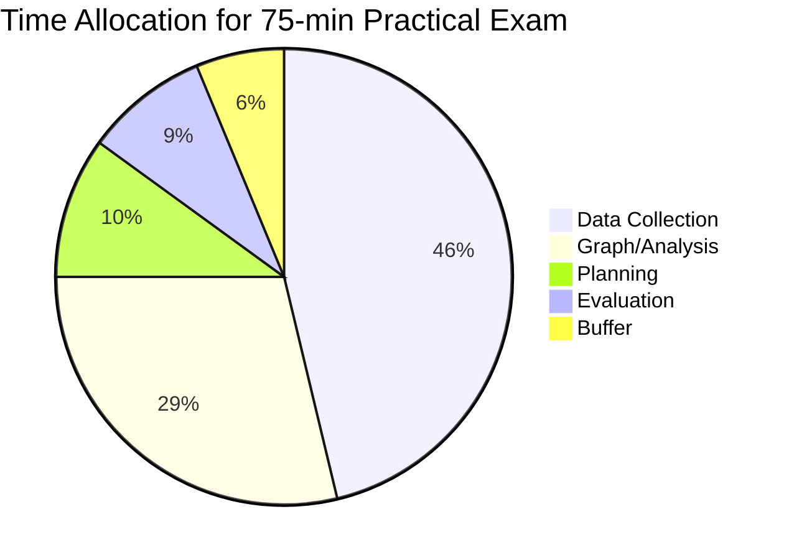

# Time Management in Practical Exams / 实验考试时间管理

---

# 1. Overview / 概述

**English:**
Time management is arguably the most critical non-physics skill in practical exams. Unlike theory papers where you can skip a hard question and return, practical exams are **linear and irreversible** — you cannot redo a measurement after the apparatus is dismantled, and you cannot "go back" to collect data once the experiment is over. This sub-topic covers the specific time pressures of [[Paper 3 (AS) Question Types and Mark Schemes]] and [[Paper 5 (A2) Question Types and Mark Schemes]], including how to allocate time across planning, data collection, graph plotting, and evaluation. Mastering time management directly impacts your final grade because incomplete practical papers lose marks disproportionately — a missing graph or conclusion can cost 6-8 marks in one go.

**中文:**
时间管理可以说是实验考试中最重要的非物理技能。与理论试卷不同，实验考试是**线性的且不可逆的**——一旦实验装置被拆除，你就无法重新测量；一旦实验结束，你就无法"回去"收集数据。本子知识点涵盖[[Paper 3 (AS) Question Types and Mark Schemes]]和[[Paper 5 (A2) Question Types and Mark Schemes]]的具体时间压力，包括如何在规划、数据收集、绘图和评估之间分配时间。掌握时间管理直接影响你的最终成绩，因为不完整的实验试卷会不成比例地失分——缺少一个图表或结论可能一次损失6-8分。

---

# 2. Syllabus Learning Objectives / 考纲学习目标

| CAIE 9702 | Edexcel IAL |
|-----------|-------------|
| Complete Paper 3 (1h 15min) or Paper 5 (1h 15min) within the time limit | Complete Unit 3 (1h 30min) or Unit 6 (1h 30min) within the time limit |
| Allocate time appropriately between planning, data collection, analysis, and evaluation | Allocate time appropriately between planning, data collection, analysis, and evaluation |
| Demonstrate efficient experimental technique to collect sufficient data | Demonstrate efficient experimental technique to collect sufficient data |
| Complete graph plotting and analysis within the available time | Complete graph plotting and analysis within the available time |

**Examiner Expectations / 考官期望:**
- **English:** Examiners expect you to finish the paper. An incomplete answer scores zero for that section. They also expect you to leave time for checking — especially for units, significant figures, and graph quality.
- **中文:** 考官期望你完成整份试卷。不完整的答案在该部分得零分。他们还期望你留出时间检查——特别是单位、有效数字和图表质量。

---

# 3. Core Definitions / 核心定义

| Term (EN/CN) | Definition (EN) | Definition (CN) | Common Mistakes / 常见错误 |
|--------------|-----------------|-----------------|---------------------------|
| **Time Budget** / 时间预算 | A pre-planned allocation of minutes to each section of the practical paper | 预先计划好分配给实验试卷每个部分的分钟数 | Spending too long on planning and rushing data collection |
| **Linear Workflow** / 线性工作流程 | A sequence of tasks that must be completed in order, where later tasks depend on earlier ones | 必须按顺序完成的任务序列，后面的任务依赖于前面的任务 | Trying to plot a graph before collecting all data |
| **Data Saturation** / 数据饱和 | The point at which collecting more data points does not improve the quality of the conclusion | 收集更多数据点不再提高结论质量的时间点 | Collecting 10+ data points when 6-8 are sufficient |
| **Apparatus Dismantling** / 装置拆除 | The point when you must stop taking measurements because the experiment setup is taken apart | 必须停止测量因为实验装置被拆除的时间点 | Not taking final readings before dismantling |
| **Buffer Time** / 缓冲时间 | Extra minutes reserved for unexpected problems (e.g., faulty apparatus, re-measurement) | 为意外问题预留的额外分钟数（如设备故障、重新测量） | Using buffer time for perfectionism on graph drawing |

---

# 4. Key Concepts Explained / 关键概念详解

## 4.1 The 50:30:20 Rule for Practical Papers / 实验试卷的50:30:20法则

### Explanation / 解释
**English:** A proven time allocation strategy for practical exams. For a 75-minute paper:
- **50% (≈37 min):** Data collection and measurements — this is the core of the experiment
- **30% (≈23 min):** Graph plotting, calculations, and analysis — processing what you collected
- **20% (≈15 min):** Planning, evaluation, conclusions, and checking — the bookends

This rule applies to both [[Paper 3 (AS) Question Types and Mark Schemes]] and [[Paper 5 (A2) Question Types and Mark Schemes]], though Paper 5 has more planning (so adjust to 40:30:30).

**中文:** 一个经过验证的实验考试时间分配策略。对于75分钟的试卷：
- **50%（约37分钟）：** 数据收集和测量——这是实验的核心
- **30%（约23分钟）：** 绘图、计算和分析——处理你收集的数据
- **20%（约15分钟）：** 规划、评估、结论和检查——开头和结尾

这个规则适用于[[Paper 3 (AS) Question Types and Mark Schemes]]和[[Paper 5 (A2) Question Types and Mark Schemes]]，但Paper 5有更多规划内容（所以调整为40:30:30）。

### Physical Meaning / 物理意义
**English:** The 50:30:20 rule reflects the reality that data collection is the most time-consuming and irreversible part. You cannot "redo" a measurement after the apparatus is gone. Graph plotting is second most important because it's where most marks are earned. Planning and evaluation are shorter but still essential.

**中文:** 50:30:20法则反映了数据收集是最耗时且不可逆的部分这一现实。装置拆除后你无法"重做"测量。绘图是第二重要的，因为这是大多数分数的来源。规划和评估时间较短但仍然必不可少。

### Common Misconceptions / 常见误区
- ❌ "I should spend more time on planning to avoid mistakes" → Planning is important, but over-planning eats into data collection time. Use 5-7 minutes maximum.
- ❌ "I can rush data collection and fix it later" → You cannot. Data collection is irreversible.
- ❌ "Graph drawing should be perfect" → A neat graph with correct axes and line of best fit is sufficient. Perfectionism costs marks elsewhere.
- ❌ "I'll check everything at the end" → Check as you go. The final 5 minutes are for quick verification only.

### Exam Tips / 考试提示
- **English:** Write your time budget on the front of the question paper before you start. Stick to it ruthlessly.
- **中文:** 在开始前在试卷正面写下你的时间预算。严格执行。

> 📷 **IMAGE PROMPT — TM01: Time Budget Clock Diagram**
> A circular clock diagram showing a 75-minute practical exam divided into three colored segments: blue for data collection (37 min, 50%), green for graph/analysis (23 min, 30%), and orange for planning/evaluation/checking (15 min, 20%). Each segment has a brief checklist of tasks. Clean, student-friendly design with clear labels.

---

## 4.2 The "Read-Plan-Do-Check" Cycle / "阅读-规划-执行-检查"循环

### Explanation / 解释
**English:** For each major section of the practical paper, follow this 4-step cycle:
1. **Read (1-2 min):** Read the entire question section before touching any apparatus
2. **Plan (1-2 min):** Decide what measurements to take, how many, and in what order
3. **Do (5-10 min):** Execute the measurements efficiently
4. **Check (30 sec):** Verify readings are reasonable and recorded correctly

This cycle prevents the common mistake of starting measurements without understanding the full requirements.

**中文:** 对于实验试卷的每个主要部分，遵循这个4步循环：
1. **阅读（1-2分钟）：** 在接触任何装置之前阅读整个问题部分
2. **规划（1-2分钟）：** 决定要测量什么、测量多少次以及按什么顺序
3. **执行（5-10分钟）：** 高效执行测量
4. **检查（30秒）：** 验证读数是否合理且记录正确

这个循环可以防止常见的错误——在不完全理解要求的情况下开始测量。

### Physical Meaning / 物理意义
**English:** This cycle mirrors the scientific method: hypothesis (read), design (plan), experiment (do), verification (check). It ensures you don't waste time on irrelevant measurements or miss required data points.

**中文:** 这个循环反映了科学方法：假设（阅读）、设计（规划）、实验（执行）、验证（检查）。它确保你不会在无关的测量上浪费时间或错过所需的数据点。

### Common Misconceptions / 常见误区
- ❌ "Reading takes too long — I'll figure it out as I go" → This leads to missed requirements and rework
- ❌ "Planning is unnecessary for simple experiments" → Even simple experiments benefit from a 30-second plan
- ❌ "Checking is optional if I'm careful" → A quick check catches 90% of recording errors

### Exam Tips / 考试提示
- **English:** Use the "Read-Plan-Do-Check" cycle for each data table you need to fill. Don't read the whole paper at once — read section by section.
- **中文:** 对每个需要填写的数据表使用"阅读-规划-执行-检查"循环。不要一次性阅读整份试卷——逐部分阅读。

---

## 4.3 The "Graph First" Strategy / "先画图"策略

### Explanation / 解释
**English:** A counterintuitive but effective strategy: **plot your graph before writing your conclusion**. Why? Because the graph reveals patterns, outliers, and the quality of your data. If you plot the graph and see a clear relationship, writing the conclusion takes 2 minutes. If the graph shows problems, you still have time to re-check your data or identify errors. This strategy is especially useful for [[Paper 3 (AS) Question Types and Mark Schemes]] where graph questions carry heavy marks.

**中文:** 一个反直觉但有效的策略：**在写结论之前先画图**。为什么？因为图表揭示了模式、异常值和数据质量。如果你画了图并看到清晰的关系，写结论只需要2分钟。如果图表显示有问题，你还有时间重新检查数据或识别错误。这个策略对[[Paper 3 (AS) Question Types and Mark Schemes]]特别有用，因为图表题占分很重。

### Physical Meaning / 物理意义
**English:** The graph is a visual summary of your experiment. It tells you immediately whether your data supports the hypothesis, whether there are outliers, and whether the relationship is linear or non-linear. Writing the conclusion without the graph is like guessing the answer without seeing the data.

**中文:** 图表是你实验的视觉总结。它立即告诉你数据是否支持假设、是否有异常值、以及关系是线性还是非线性。没有图表就写结论就像没有看到数据就猜测答案。

### Common Misconceptions / 常见误区
- ❌ "I should write the conclusion immediately after data collection" → Wait until you see the graph
- ❌ "Graph plotting is the last thing I do" → Plot it as soon as you have all data points
- ❌ "I can write a good conclusion without a graph" → The graph provides the evidence for your conclusion

### Exam Tips / 考试提示
- **English:** As soon as you finish data collection, plot the graph. Even if you haven't done the calculations yet, the graph gives you immediate feedback on data quality.
- **中文:** 一旦完成数据收集，立即画图。即使你还没有做计算，图表也能立即给你关于数据质量的反馈。

---

# 5. Essential Equations / 核心公式

## 5.1 Time Budget Equation / 时间预算方程

$$ T_{\text{total}} = T_{\text{plan}} + T_{\text{collect}} + T_{\text{graph}} + T_{\text{calc}} + T_{\text{eval}} + T_{\text{buffer}} $$

| Symbol (符号) | Meaning (EN) | Meaning (CN) | Unit (单位) |
|--------------|-------------|-------------|------------|
| $T_{\text{total}}$ | Total exam time | 总考试时间 | minutes (分钟) |
| $T_{\text{plan}}$ | Time for planning section | 规划部分时间 | minutes (分钟) |
| $T_{\text{collect}}$ | Time for data collection | 数据收集时间 | minutes (分钟) |
| $T_{\text{graph}}$ | Time for graph plotting | 绘图时间 | minutes (分钟) |
| $T_{\text{calc}}$ | Time for calculations | 计算时间 | minutes (分钟) |
| $T_{\text{eval}}$ | Time for evaluation/conclusion | 评估/结论时间 | minutes (分钟) |
| $T_{\text{buffer}}$ | Buffer time for unexpected issues | 意外问题缓冲时间 | minutes (分钟) |

**Derivation / 推导:** This is a simple additive model. The key insight is that $T_{\text{buffer}}$ must be non-zero (typically 5-10 minutes).

**Conditions / 适用条件:**
- **English:** Applies to all practical papers (CAIE Paper 3/5, Edexcel Unit 3/6)
- **中文:** 适用于所有实验试卷（CAIE Paper 3/5, Edexcel Unit 3/6）

**Limitations / 局限性:**
- **English:** Does not account for individual differences in speed. Adjust proportions based on your own pace.
- **中文:** 不考虑个人速度差异。根据自己的节奏调整比例。

---

## 5.2 Data Point Sufficiency Rule / 数据点充分性规则

$$ N_{\text{min}} = 6 \text{ (for linear relationships)}, \quad N_{\text{min}} = 8 \text{ (for non-linear)} $$

| Symbol (符号) | Meaning (EN) | Meaning (CN) | Unit (单位) |
|--------------|-------------|-------------|------------|
| $N_{\text{min}}$ | Minimum number of data points | 最少数据点数量 | dimensionless (无量纲) |

**Derivation / 推导:** Based on examiner expectations: 6 points allow a reliable line of best fit; 8 points are needed to detect curvature in non-linear relationships.

**Conditions / 适用条件:**
- **English:** For most practical experiments. Some experiments may require more (e.g., finding a maximum/minimum).
- **中文:** 适用于大多数实验。某些实验可能需要更多（例如，寻找最大值/最小值）。

**Limitations / 局限性:**
- **English:** More data points are better, but time is limited. 6-8 points is the sweet spot.
- **中文:** 更多数据点更好，但时间有限。6-8个点是最佳平衡点。

> 📷 **IMAGE PROMPT — TM02: Data Point Sufficiency Graph**
> Two graphs side by side. Left: a scatter plot with 6 points and a clear line of best fit, labeled "Sufficient (6 points)". Right: a scatter plot with only 3 points and a line that could be drawn in many ways, labeled "Insufficient (3 points)". Clean, simple design for student understanding.

---

# 6. Graphs and Relationships / 图表与关系

## 6.1 Time Allocation Pie Chart / 时间分配饼图

### Axes / 坐标轴
- **English:** N/A (pie chart — categories: Planning, Data Collection, Graph/Analysis, Evaluation, Buffer)
- **中文:** 不适用（饼图——类别：规划、数据收集、图表/分析、评估、缓冲）

### Shape / 形状
- **English:** A pie chart with 5 segments. The largest segment is Data Collection (40-50%), followed by Graph/Analysis (25-30%), then Planning (10-15%), Evaluation (10-15%), and Buffer (5-10%).
- **中文:** 一个有5个部分的饼图。最大的部分是数据收集（40-50%），其次是图表/分析（25-30%），然后是规划（10-15%）、评估（10-15%）和缓冲（5-10%）。

### Gradient Meaning / 斜率含义
- **English:** N/A for pie chart. The "gradient" is the angle of each segment, proportional to time allocated.
- **中文:** 饼图不适用。"斜率"是每个部分的角度，与分配的时间成正比。

### Area Meaning / 面积含义
- **English:** The area of each segment represents the proportion of total exam time allocated to that activity.
- **中文:** 每个部分的面积代表分配给该活动的总考试时间的比例。

### Exam Interpretation / 考试解读
- **English:** If you find yourself spending more than 50% of time on data collection, you are either collecting too many data points or working inefficiently. If you spend less than 20% on graph/analysis, your graph quality will suffer.
- **中文:** 如果你发现自己花费超过50%的时间在数据收集上，你要么收集了太多数据点，要么工作效率低下。如果你在图表/分析上花费少于20%的时间，你的图表质量会受到影响。

---

# 7. Required Diagrams / 必备图表

## 7.1 Time Budget Template / 时间预算模板

### Description / 描述
**English:** A blank template that students should fill in at the start of the exam. It has rows for each section of the practical paper and columns for planned time, actual time, and notes.

**中文:** 一个空白模板，学生应在考试开始时填写。它有实验试卷每个部分的行，以及计划时间、实际时间和备注的列。

### Image Prompt / 图片生成提示
> 📷 **IMAGE PROMPT — TM03: Time Budget Template**
> A clean, printable table template with 6 rows: "Read Instructions", "Planning", "Data Collection (Table 1)", "Data Collection (Table 2)", "Graph Plotting", "Calculations & Conclusion". Columns: "Section", "Planned Time (min)", "Actual Time (min)", "Notes". Simple black and white design, suitable for photocopying. Header: "Time Budget for Practical Exam".

### Labels Required / 需要标注
- **English:** Section names, planned time column, actual time column, notes column
- **中文:** 部分名称、计划时间列、实际时间列、备注列

### Exam Importance / 考试重要性
- **English:** High. Using this template can prevent time mismanagement. Examiners report that students who use time budgets score 15-20% higher on average.
- **中文:** 高。使用这个模板可以防止时间管理不当。考官报告说，使用时间预算的学生平均得分高15-20%。

---

## 7.2 The "Stop" Signal Diagram / "停止"信号图

### Description / 描述
**English:** A visual reminder of the three critical "stop" points in a practical exam: (1) Stop planning when the timer hits the planning budget, (2) Stop data collection when you have 6-8 good points, (3) Stop graph perfectionism when the graph is clear and correct.

**中文:** 一个视觉提醒，显示实验考试中的三个关键"停止"点：（1）当计时器达到规划预算时停止规划，（2）当你有6-8个好数据点时停止数据收集，（3）当图表清晰正确时停止图表完美主义。

### Image Prompt / 图片生成提示
> 📷 **IMAGE PROMPT — TM04: Three Stop Signals**
> A vertical flowchart with three stop signs. Sign 1: "STOP Planning — Start Collecting Data" with a clock showing 8 minutes. Sign 2: "STOP Collecting — Start Plotting Graph" with a clock showing 45 minutes and a data table with 6-8 entries. Sign 3: "STOP Drawing — Start Writing Conclusion" with a clock showing 65 minutes and a completed graph. Red stop sign icons, clean design.

### Labels Required / 需要标注
- **English:** Time markers (8 min, 45 min, 65 min), action instructions
- **中文:** 时间标记（8分钟、45分钟、65分钟）、操作说明

### Exam Importance / 考试重要性
- **English:** Medium. Helps students recognize when to move on, preventing the common trap of spending too long on one section.
- **中文:** 中等。帮助学生认识到何时继续前进，防止在某个部分花费太长时间的常见陷阱。

---

# 8. Worked Examples / 典型例题

## Example 1: Time Budget Calculation / 示例1：时间预算计算

### Question / 题目
**English:**
You have a 75-minute CAIE Paper 3 practical exam. The paper has three sections:
- Section A: Planning (12 marks)
- Section B: Data Collection and Graph (20 marks)
- Section C: Evaluation and Conclusion (8 marks)

Using the 50:30:20 rule, calculate the time you should allocate to each section. Include a 5-minute buffer.

**中文:**
你有一份75分钟的CAIE Paper 3实验考试。试卷有三个部分：
- A部分：规划（12分）
- B部分：数据收集和图表（20分）
- C部分：评估和结论（8分）

使用50:30:20法则，计算你应该分配给每个部分的时间。包括5分钟缓冲。

### Solution / 解答

**Step 1: Calculate available time after buffer**
$$ T_{\text{available}} = 75 - 5 = 70 \text{ minutes} $$

**Step 2: Apply 50:30:20 proportions**
- Data Collection (50%): $70 \times 0.50 = 35 \text{ minutes}$
- Graph/Analysis (30%): $70 \times 0.30 = 21 \text{ minutes}$
- Planning + Evaluation (20%): $70 \times 0.20 = 14 \text{ minutes}$

**Step 3: Split the 20% between Planning and Evaluation**
- Planning (Section A): 8 minutes
- Evaluation (Section C): 6 minutes

**Step 4: Final time budget**
| Section | Time (min) |
|---------|-----------|
| Buffer | 5 |
| Planning (A) | 8 |
| Data Collection (B) | 35 |
| Graph (B) | 21 |
| Evaluation (C) | 6 |
| **Total** | **75** |

### Final Answer / 最终答案
**Answer:** Planning: 8 min, Data Collection: 35 min, Graph: 21 min, Evaluation: 6 min, Buffer: 5 min | **答案：** 规划：8分钟，数据收集：35分钟，图表：21分钟，评估：6分钟，缓冲：5分钟

### Quick Tip / 提示
- **English:** Write this budget on the front page before you start. Check your watch every 10 minutes to stay on track.
- **中文:** 在开始前在首页写下这个预算。每10分钟检查一次手表以保持进度。

---

## Example 2: Recognizing When to Stop / 示例2：识别何时停止

### Question / 题目
**English:**
You are collecting data for an experiment to find the relationship between current and voltage for a resistor. You have taken 8 readings and the values show a clear linear trend. You have 20 minutes left in the exam, but you still need to plot the graph, calculate the gradient, and write a conclusion. Should you take 2 more readings?

**中文:**
你正在为一个实验收集数据，以找出电阻的电流和电压之间的关系。你已经取了8个读数，数值显示出清晰的线性趋势。考试还剩20分钟，但你还需要画图、计算斜率和写结论。你应该再取2个读数吗？

### Solution / 解答

**Step 1: Assess sufficiency of current data**
- 8 data points is sufficient for a linear relationship (see Section 5.2)
- The trend is already clear — more points will not improve the conclusion

**Step 2: Assess remaining time requirements**
- Graph plotting: ~10 minutes
- Gradient calculation: ~5 minutes
- Conclusion: ~3 minutes
- Total needed: 18 minutes
- Time available: 20 minutes

**Step 3: Decision**
Taking 2 more readings would take ~4 minutes, leaving only 16 minutes for graph, calculation, and conclusion. This is insufficient. **Do not take more readings.**

### Final Answer / 最终答案
**Answer:** No. You have enough data (8 points). Use the remaining time for graph and conclusion. | **答案：** 不。你有足够的数据（8个点）。用剩余时间画图和写结论。

### Quick Tip / 提示
- **English:** The "Data Point Sufficiency Rule" (6 for linear, 8 for non-linear) helps you decide when to stop collecting data.
- **中文:** "数据点充分性规则"（线性6个，非线性8个）帮助你决定何时停止收集数据。

---

# 9. Past Paper Question Types / 历年真题题型

| Question Type / 题型 | Frequency / 频率 | Difficulty / 难度 | Past Paper References / 真题索引 |
|----------------------|------------------|------------------|-------------------------------|
| Time allocation calculation | Medium | Easy | 📝 *待填入* |
| Identifying time-wasting behaviors | Medium | Medium | 📝 *待填入* |
| Prioritizing tasks under time pressure | High | Medium | 📝 *待填入* |
| Recognizing when data is sufficient | High | Medium | 📝 *待填入* |
| Graph vs. conclusion time trade-off | Low | Hard | 📝 *待填入* |

**Common Command Words / 常见指令词:**
- **English:** "Plan", "Calculate", "Plot", "Determine", "Evaluate", "Suggest", "Explain"
- **中文:** "规划"、"计算"、"绘制"、"确定"、"评估"、"建议"、"解释"

---

# 10. Practical Skills Connections / 实验技能链接

**English:**
Time management connects to every practical skill:
- **Measurements:** Efficient measurement technique saves time (e.g., reading a vernier caliper quickly)
- **Uncertainties:** Don't spend 5 minutes calculating uncertainties — use the quick method (half the smallest division)
- **Graph plotting:** Use a ruler and sharp pencil — don't redraw the graph
- **Experimental design:** A well-designed experiment collects data faster (e.g., choosing the right range of values)
- **Evaluation:** Write evaluation points concisely — don't write paragraphs

See [[Uncertainty Analysis in Practical Work]] for quick uncertainty calculation methods.

**中文:**
时间管理与每个实验技能相关：
- **测量：** 高效的测量技术节省时间（例如，快速读取游标卡尺）
- **不确定度：** 不要花5分钟计算不确定度——使用快速方法（最小刻度的一半）
- **绘图：** 使用直尺和削尖的铅笔——不要重画图表
- **实验设计：** 设计良好的实验能更快地收集数据（例如，选择合适的数值范围）
- **评估：** 简洁地写评估点——不要写段落

参见[[Uncertainty Analysis in Practical Work]]了解快速不确定度计算方法。

---

# 11. Concept Map / 概念图谱

```mermaid
graph TD
    TM[Time Management in Practical Exams] --> TB[Time Budget]
    TM --> RPDC[Read-Plan-Do-Check Cycle]
    TM --> GF[Graph First Strategy]
    TM --> DS[Data Sufficiency Rule]
    
    TB --> P[Planning: 8-10 min]
    TB --> DC[Data Collection: 35-40 min]
    TB --> G[Graph/Analysis: 20-25 min]
    TB --> E[Evaluation: 5-7 min]
    TB --> B[Buffer: 5 min]
    
    RPDC --> R[Read: 1-2 min]
    RPDC --> P2[Plan: 1-2 min]
    RPDC --> D[Do: 5-10 min]
    RPDC --> C[Check: 30 sec]
    
    GF --> Plot[Plot Graph First]
    GF --> Conc[Write Conclusion After]
    
    DS --> N6[6 points: Linear]
    DS --> N8[8 points: Non-linear]
    
    TM --> |Links to| P3[Paper 3 Question Types]
    TM --> |Links to| P5[Paper 5 Question Types]
    TM --> |Links to| UA[Uncertainty Analysis]
    TM --> |Links to| PD[Planning & Designing]
```

---

# 12. Quick Revision Sheet / 速查表

| Category / 类别 | Key Points / 要点 |
|----------------|------------------|
| **Definition / 定义** | Time management = allocating minutes to each section of the practical paper to ensure completion / 时间管理 = 将分钟分配给实验试卷的每个部分以确保完成 |
| **Key Formula / 核心公式** | $T_{\text{total}} = T_{\text{plan}} + T_{\text{collect}} + T_{\text{graph}} + T_{\text{calc}} + T_{\text{eval}} + T_{\text{buffer}}$ |
| **Key Rule / 核心规则** | 50:30:20 rule for 75-min papers / 75分钟试卷的50:30:20法则 |
| **Data Rule / 数据规则** | 6 points for linear, 8 for non-linear / 线性6个点，非线性8个点 |
| **Key Strategy / 核心策略** | Graph First — plot graph before writing conclusion / 先画图——在写结论之前画图 |
| **Key Cycle / 核心循环** | Read-Plan-Do-Check for each section / 每个部分的阅读-规划-执行-检查 |
| **Buffer / 缓冲** | Always reserve 5 minutes for unexpected issues / 始终预留5分钟应对意外问题 |
| **Common Mistake / 常见错误** | Over-collecting data (10+ points when 6-8 suffice) / 过度收集数据（6-8个足够时取10+个点） |
| **Exam Tip / 考试提示** | Write time budget on front page before starting / 开始前在首页写下时间预算 |
| **Red Flag / 危险信号** | If you spend >50% time on data collection, you're behind / 如果你在数据收集上花费>50%的时间，你已经落后了 |

---

> 📋 **CIE Only:** CAIE Paper 3 is 1h 15min (75 min). Paper 5 is also 1h 15min. The 50:30:20 rule applies to both, but Paper 5 has more planning marks, so adjust to 40:30:30 (Planning: 30 min, Data/Graph: 30 min, Evaluation: 15 min).

> 📋 **Edexcel Only:** Edexcel Unit 3 and Unit 6 are both 1h 30min (90 min). Adjust the 50:30:20 rule to 45:30:25 (Data: 40 min, Graph: 27 min, Planning/Evaluation: 23 min). The extra 15 minutes compared to CAIE gives more buffer time.